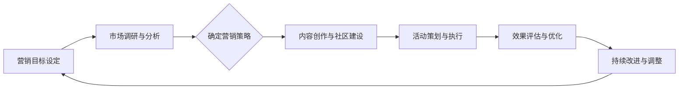

                 

### 《元宇宙营销：数字化品牌建设新阵地》

#### 关键词：元宇宙、数字化营销、品牌建设、用户交互、虚拟现实、NFT

> 摘要：随着技术的不断进步，元宇宙正逐渐成为数字化品牌建设的新阵地。本文将深入探讨元宇宙营销的核心概念、关键要素及其在数字化品牌建设中的应用，并通过案例分析，为读者提供实践指导和未来展望。让我们一步一步地分析推理，了解如何在元宇宙中打造具有竞争力的品牌形象，实现品牌价值的提升。

---

### 《元宇宙营销：数字化品牌建设新阵地》目录大纲

#### 第一部分：引言与概述

- **1.1 元宇宙与数字化营销**
  - **1.1.1 元宇宙的概念与背景**
  - **1.1.2 数字化营销的定义与演进**

- **1.2 元宇宙营销的重要性**
  - **1.2.1 元宇宙营销的潜在价值**
  - **1.2.2 元宇宙营销面临的挑战与机遇**

- **1.3 本书结构安排与学习目标**
  - **1.3.1 各章节内容概述**
  - **1.3.2 学习目标与读者建议**

#### 第二部分：元宇宙营销核心概念

- **2.1 元宇宙营销基本概念**
  - **2.1.1 元宇宙营销的定义与特征**
  - **2.1.2 元宇宙营销与传统营销的区别**

- **2.2 元宇宙营销的关键要素**
  - **2.1.1 用户交互与体验**
  - **2.1.2 内容创作与传播**
  - **2.1.3 社区建设与用户参与**

- **2.3 元宇宙营销生态系统**
  - **2.1.1 主要参与者与角色**
  - **2.1.2 技术支持与平台选择**

#### 第三部分：数字化品牌建设

- **3.1 数字化品牌建设概述**
  - **3.1.1 数字化品牌建设的意义**
  - **3.1.2 数字化品牌建设的方法与步骤**

- **3.2 数字化品牌定位与策略**
  - **3.1.1 品牌定位的评估与优化**
  - **3.1.2 品牌策略的制定与实施**

- **3.3 数字化品牌形象塑造**
  - **3.1.1 品牌视觉设计**
  - **3.1.2 品牌传播策略与渠道选择**

- **3.4 数字化品牌价值评估**
  - **3.1.1 品牌价值评估的方法与工具**
  - **3.1.2 品牌价值提升策略**

#### 第四部分：元宇宙营销案例分析

- **4.1 国内外元宇宙营销案例概述**
  - **4.1.1 案例选择与分类**
  - **4.1.2 案例背景与目标分析**

- **4.2 案例分析与启示**
  - **4.1.1 案例成功的关键因素**
  - **4.1.2 案例中的挑战与应对策略**
  - **4.1.3 对其他品牌的启示与借鉴**

- **4.3 案例研究方法论**
  - **4.1.1 案例研究的目的与类型**
  - **4.1.2 案例研究的方法与步骤**

#### 第五部分：元宇宙营销策略与实践

- **5.1 元宇宙营销战略规划**
  - **5.1.1 战略规划的步骤与原则**
  - **5.1.2 战略规划中的关键问题**

- **5.2 元宇宙营销活动策划**
  - **5.1.1 活动目标与内容设计**
  - **5.1.2 活动执行与效果评估**

- **5.3 元宇宙营销效果评估**
  - **5.1.1 效果评估的指标与方法**
  - **5.1.2 效果提升策略与优化**

- **5.4 元宇宙营销风险管理**
  - **5.1.1 风险识别与评估**
  - **5.1.2 风险应对策略与措施**

#### 第六部分：元宇宙营销趋势与未来展望

- **6.1 元宇宙营销趋势分析**
  - **6.1.1 技术发展对元宇宙营销的影响**
  - **6.1.2 市场环境与用户需求变化**

- **6.2 元宇宙营销未来展望**
  - **6.1.1 元宇宙营销的潜在发展方向**
  - **6.1.2 元宇宙营销对未来商业模式的启示**

- **6.3 我国元宇宙营销发展策略**
  - **6.1.1 我国元宇宙发展的现状与挑战**
  - **6.1.2 我国元宇宙营销的发展策略**

#### 附录

- **附录A：元宇宙营销相关术语解释**
  - **A.1 元宇宙**
  - **A.2 数字化营销**
  - **A.3 品牌建设**
  - **A.4 营销策略**

- **附录B：参考资料与推荐阅读**
  - **B.1 元宇宙相关书籍**
  - **B.2 数字化营销相关书籍**
  - **B.3 品牌建设相关书籍**
  - **B.4 元宇宙营销案例集**

---

### 第一部分：引言与概述

#### 1.1 元宇宙与数字化营销

在进入21世纪第二个十年，科技的飞速发展正在重塑我们所处的世界。其中，元宇宙（Metaverse）的概念逐渐进入公众视野，成为科技与商业的新风口。元宇宙不仅仅是一个虚拟世界，更是一个与现实世界相互交织、融合的数字化空间。它将虚拟现实（VR）、增强现实（AR）、区块链、物联网等前沿技术有机结合起来，为用户提供了全新的交互体验和商业机会。

元宇宙的兴起，为数字化营销带来了新的可能性。数字化营销，是指利用数字技术，通过互联网、社交媒体、移动设备等渠道，对产品或服务进行推广和销售的活动。它涵盖了从品牌传播、市场调研、客户关系管理到销售转化等各个环节。随着元宇宙的发展，数字化营销的概念和形式也在不断演变，元宇宙营销应运而生。

#### 1.1.1 元宇宙的概念与背景

元宇宙，最早可以追溯到科幻小说《模拟宇宙》中的概念。它是一个由各种虚拟世界和现实世界互联的数字化空间，用户可以通过虚拟角色（Avatar）在其中进行社交、购物、工作、娱乐等活动。元宇宙的基本特征包括：

- **虚拟性**：元宇宙是一个虚拟的存在，用户通过数字化设备进入其中，感受虚拟世界。
- **互联性**：元宇宙中各个虚拟世界之间可以通过特定的协议进行互联互通，形成一个庞大的网络。
- **沉浸性**：通过VR、AR等技术，用户可以沉浸在元宇宙中，体验到与现实世界相似的感官体验。
- **经济性**：元宇宙中存在着虚拟经济，用户可以通过交易虚拟货币、数字资产等方式获得经济收益。

元宇宙的概念并不是空穴来风，而是基于多种前沿技术的积累和发展。这些技术包括：

- **虚拟现实（VR）和增强现实（AR）**：通过VR和AR技术，用户可以进入元宇宙，与其中的虚拟环境进行交互。
- **区块链**：区块链技术为元宇宙中的数字资产交易提供了去中心化的信任机制，保证了交易的透明和安全。
- **人工智能（AI）**：AI技术为元宇宙中的智能交互、个性化推荐等提供了支持。
- **物联网（IoT）**：物联网技术将现实世界中的设备和物品连接到元宇宙中，实现了虚拟与现实的无缝连接。

#### 1.1.2 数字化营销的定义与演进

数字化营销，是指利用数字技术，通过互联网、社交媒体、移动设备等渠道，对产品或服务进行推广和销售的活动。它涵盖了从品牌传播、市场调研、客户关系管理到销售转化等各个环节。

数字化营销的起源可以追溯到互联网的普及。随着互联网的发展，传统营销方式逐渐向数字化迁移。电子邮件营销、搜索引擎优化（SEO）、社交媒体营销等数字化营销手段相继出现，为企业和品牌提供了新的营销途径。

数字化营销的演进可以分为以下几个阶段：

1. **初期阶段**：以电子邮件营销和搜索引擎优化为主要手段，企业通过互联网开展基本的营销活动。
2. **发展阶段**：随着社交媒体的兴起，品牌开始利用社交媒体平台进行互动和传播，社交媒体营销成为数字化营销的重要组成部分。
3. **成熟阶段**：移动互联网的普及，使得数字化营销渠道更加丰富，包括移动应用营销、移动广告、微信营销等。

在数字化营销的过程中，数据发挥着至关重要的作用。通过数据分析，企业可以了解用户的行为和需求，制定更加精准的营销策略，提高营销效果。随着大数据、人工智能等技术的发展，数字化营销的数据驱动特征更加明显。

#### 1.2 元宇宙营销的重要性

元宇宙营销的重要性主要体现在以下几个方面：

1. **品牌差异化**：元宇宙为品牌提供了新的差异化竞争优势。在元宇宙中，品牌可以打造独特的虚拟体验，吸引目标用户，提升品牌知名度。
2. **用户互动性**：元宇宙提供了更加丰富的用户互动方式，品牌可以通过虚拟活动、社交互动等方式，与用户建立更紧密的联系。
3. **商业模式创新**：元宇宙为品牌提供了新的商业模式，如虚拟商品交易、虚拟广告等，为品牌创造了额外的收入来源。
4. **市场覆盖面**：元宇宙具有全球性，品牌可以在元宇宙中拓展国际市场，实现全球化布局。

然而，元宇宙营销也面临一定的挑战，如技术门槛、用户教育成本等。但总体而言，元宇宙营销具有巨大的潜力，是品牌数字化转型的重要方向。

#### 1.3 本书结构安排与学习目标

本书旨在为读者提供系统、全面的元宇宙营销知识体系，帮助企业和品牌在元宇宙中取得成功。本书的结构安排如下：

1. **第一部分：引言与概述**：介绍元宇宙和数字化营销的基本概念，阐述元宇宙营销的重要性。
2. **第二部分：元宇宙营销核心概念**：详细解析元宇宙营销的基本概念、关键要素和生态系统。
3. **第三部分：数字化品牌建设**：介绍数字化品牌建设的意义、方法和步骤。
4. **第四部分：元宇宙营销案例分析**：通过国内外案例分析，提供实际操作经验和启示。
5. **第五部分：元宇宙营销策略与实践**：讲解元宇宙营销战略规划、活动策划、效果评估和风险管理。
6. **第六部分：元宇宙营销趋势与未来展望**：分析元宇宙营销的发展趋势和未来发展方向。

学习目标：

- 了解元宇宙和数字化营销的基本概念和原理。
- 掌握元宇宙营销的核心要素和策略。
- 学习数字化品牌建设的方法和步骤。
- 通过案例分析，了解元宇宙营销的实践经验和启示。
- 培养在元宇宙中开展营销活动的能力，提升品牌竞争力。

读者建议：

- 阅读本书时，建议结合实际案例和实际操作，加深对理论知识的理解和应用。
- 积极参与元宇宙相关的社区和论坛，了解最新的发展趋势和技术动态。
- 在实践中不断总结和反思，提升自己的营销策略和执行能力。

### 第二部分：元宇宙营销核心概念

#### 2.1 元宇宙营销基本概念

元宇宙营销，是指品牌或企业在元宇宙这一虚拟空间中开展的营销活动。它利用元宇宙的虚拟性、互联性、沉浸性和经济性等特性，为用户创造独特的互动体验，提升品牌知名度和用户忠诚度。

元宇宙营销与传统营销有显著的区别。传统营销主要依赖于广告、促销、公关等手段，通过媒体渠道传递信息。而元宇宙营销则更加注重用户互动和沉浸式体验，通过虚拟世界和虚拟角色的互动，实现品牌信息的传递和用户需求的满足。

#### 2.1.1 元宇宙营销的定义与特征

元宇宙营销的定义可以概括为：通过元宇宙这一虚拟空间，利用数字化技术和交互体验，实现品牌与用户之间深度互动和沟通的营销活动。

元宇宙营销的特征包括：

1. **沉浸式体验**：用户通过VR、AR设备进入元宇宙，感受到高度沉浸的虚拟环境，与品牌互动，提高品牌认知和忠诚度。
2. **社交互动**：元宇宙为用户提供了丰富的社交互动场景，品牌可以通过虚拟活动、社交互动等方式，与用户建立更紧密的联系。
3. **个性化推荐**：基于用户在元宇宙中的行为数据，品牌可以实现个性化推荐，提高用户满意度和购买转化率。
4. **虚拟商品交易**：元宇宙中存在着虚拟经济，用户可以通过购买虚拟商品、数字资产等方式，与品牌产生直接的经济互动。
5. **去中心化**：元宇宙具有去中心化的特性，品牌在元宇宙中不需要依赖传统广告渠道，可以直接与用户互动，降低营销成本。

#### 2.1.2 元宇宙营销与传统营销的区别

元宇宙营销与传统营销在多个方面存在显著差异：

1. **渠道**：传统营销主要依赖广告、促销、公关等渠道，而元宇宙营销则利用虚拟世界和虚拟角色进行品牌传播。
2. **互动性**：传统营销以单向信息传递为主，而元宇宙营销强调用户互动和沉浸式体验。
3. **数据驱动**：元宇宙营销基于用户在元宇宙中的行为数据进行精准营销，而传统营销的数据分析能力相对较弱。
4. **商业模式**：元宇宙营销具有虚拟商品交易、虚拟广告等新的商业模式，而传统营销主要依赖于实物商品销售和广告收入。

#### 2.2 元宇宙营销的关键要素

元宇宙营销的成功依赖于多个关键要素，这些要素相互交织，共同构建起一个完整的元宇宙营销体系。

1. **用户交互与体验**：用户交互和体验是元宇宙营销的核心。品牌需要设计引人入胜的虚拟场景，提供丰富的互动功能，使用户在元宇宙中感受到真实的互动体验。
2. **内容创作与传播**：内容创作是元宇宙营销的重要环节。品牌需要创作多样化的虚拟内容，如虚拟广告、虚拟活动、虚拟商品等，通过有效的传播渠道，将内容传递给目标用户。
3. **社区建设与用户参与**：社区建设是元宇宙营销的基石。品牌需要建立活跃的虚拟社区，鼓励用户参与，形成社群效应，提升用户忠诚度和品牌影响力。
4. **技术支持与平台选择**：技术支持和平台选择是元宇宙营销的基础。品牌需要选择合适的技术和平台，确保元宇宙营销活动的顺利进行。

下面，我们将逐一介绍这些关键要素。

##### 2.2.1 用户交互与体验

用户交互与体验是元宇宙营销的核心。在元宇宙中，用户通过虚拟角色（Avatar）进行互动，体验虚拟世界带来的沉浸感。为了提升用户交互和体验，品牌需要考虑以下几个方面：

1. **虚拟环境设计**：虚拟环境是用户在元宇宙中的活动场所，品牌需要设计符合目标用户喜好的虚拟环境，如虚拟店铺、虚拟活动场所等。
2. **互动功能开发**：品牌需要开发丰富的互动功能，如虚拟商品购买、虚拟活动参与、虚拟角色定制等，使用户在元宇宙中能够充分参与。
3. **用户体验优化**：品牌需要不断优化用户体验，如提高虚拟角色的操作流畅度、降低延迟等，确保用户在元宇宙中的互动体验尽可能真实和流畅。

##### 2.2.2 内容创作与传播

内容创作与传播是元宇宙营销的重要环节。品牌需要创作多样化的虚拟内容，如虚拟广告、虚拟活动、虚拟商品等，并通过有效的传播渠道，将内容传递给目标用户。以下是一些关键点：

1. **内容创作**：品牌需要根据目标用户的特点和需求，创作具有吸引力的虚拟内容。例如，虚拟广告可以采用互动性强的形式，如小游戏、互动场景等，提高用户的参与度。
2. **传播渠道**：品牌可以通过多种渠道传播虚拟内容，如社交媒体、虚拟社区、官方网站等。在传播过程中，品牌需要注重内容营销的创意和吸引力，提高用户转发和参与的积极性。
3. **内容优化**：品牌需要不断优化虚拟内容，如根据用户反馈调整内容形式和内容策略，提高内容的传播效果。

##### 2.2.3 社区建设与用户参与

社区建设与用户参与是元宇宙营销的基石。在元宇宙中，用户不仅需要与品牌互动，还需要与其他用户互动，形成社群效应。以下是一些关键点：

1. **社区设计**：品牌需要设计符合目标用户需求的虚拟社区，如虚拟论坛、虚拟活动室等。社区环境应具备良好的互动性和用户体验，鼓励用户积极参与。
2. **用户互动**：品牌需要策划多样化的用户互动活动，如虚拟比赛、虚拟派对、虚拟讲座等，激发用户的参与热情。
3. **用户激励**：品牌可以通过虚拟奖励、积分系统等方式，激励用户积极参与社区活动和互动，提升社区活跃度和用户忠诚度。

##### 2.2.4 技术支持与平台选择

技术支持和平台选择是元宇宙营销的基础。品牌需要选择合适的技术和平台，确保元宇宙营销活动的顺利进行。以下是一些关键点：

1. **技术选型**：品牌需要根据元宇宙营销的需求，选择合适的技术，如虚拟现实（VR）、增强现实（AR）、区块链等。技术选型应考虑稳定性、安全性、可扩展性等因素。
2. **平台选择**：品牌需要选择合适的平台，如虚拟现实平台、区块链平台等。平台选择应考虑用户规模、生态系统、技术支持等因素。
3. **技术优化**：品牌需要不断优化技术方案，如提高虚拟环境渲染效率、降低延迟等，提升用户在元宇宙中的互动体验。

### 2.3 元宇宙营销生态系统

元宇宙营销生态系统是一个复杂而多样化的体系，涉及多个参与者与角色。了解这些参与者与角色，有助于我们更好地理解元宇宙营销的运作机制。

#### 2.3.1 主要参与者与角色

在元宇宙营销中，主要参与者与角色包括：

1. **品牌**：品牌是元宇宙营销的主体，负责制定营销策略，创作虚拟内容，与用户互动，实现品牌传播和销售目标。
2. **用户**：用户是元宇宙营销的核心，他们通过虚拟角色进入元宇宙，参与互动，体验虚拟内容，与品牌建立联系。
3. **平台运营商**：平台运营商是元宇宙的运营主体，提供技术支持、平台服务、虚拟环境等，为品牌和用户提供运营环境。
4. **技术提供商**：技术提供商为元宇宙营销提供核心技术支持，如虚拟现实（VR）、增强现实（AR）、区块链等。
5. **内容创作者**：内容创作者负责创作虚拟内容，如虚拟广告、虚拟活动、虚拟商品等，为品牌和用户提供丰富的互动体验。
6. **渠道合作伙伴**：渠道合作伙伴帮助品牌在元宇宙中拓展市场，提供渠道支持和推广服务。

#### 2.3.2 技术支持与平台选择

技术支持和平台选择是元宇宙营销成功的关键。以下是几个关键点：

1. **技术选型**：品牌需要根据元宇宙营销的需求，选择合适的技术，如虚拟现实（VR）、增强现实（AR）、区块链等。技术选型应考虑稳定性、安全性、可扩展性等因素。
2. **平台选择**：品牌需要选择合适的平台，如虚拟现实平台、区块链平台等。平台选择应考虑用户规模、生态系统、技术支持等因素。
3. **技术优化**：品牌需要不断优化技术方案，如提高虚拟环境渲染效率、降低延迟等，提升用户在元宇宙中的互动体验。

### 第三部分：数字化品牌建设

#### 3.1 数字化品牌建设概述

数字化品牌建设是企业在数字时代中，通过数字化手段提升品牌价值的过程。随着互联网、移动互联网的普及，数字化品牌建设已经成为企业品牌战略的重要组成部分。本节将介绍数字化品牌建设的意义、方法和步骤。

#### 3.1.1 数字化品牌建设的意义

数字化品牌建设的意义主要体现在以下几个方面：

1. **提升品牌知名度**：通过数字化手段，企业可以快速传播品牌信息，扩大品牌影响力，提高品牌知名度。
2. **增强品牌认知**：数字化品牌建设可以通过多样化的数字内容，如网站、社交媒体、视频等，让用户更深入地了解品牌，增强品牌认知。
3. **优化用户体验**：通过数字化品牌建设，企业可以提供更加个性化、便捷的用户体验，提升用户满意度。
4. **降低营销成本**：数字化品牌建设可以降低传统营销渠道的成本，提高营销效率。
5. **提升品牌竞争力**：数字化品牌建设有助于企业打造差异化竞争优势，提高市场占有率。

#### 3.1.2 数字化品牌建设的方法与步骤

数字化品牌建设的方法和步骤可以分为以下几个阶段：

1. **品牌定位与策略制定**：明确品牌的核心价值、目标用户和市场定位，制定相应的品牌策略。
2. **数字化渠道选择与布局**：根据品牌定位和目标用户特点，选择合适的数字化渠道，如社交媒体、搜索引擎、移动应用等，进行布局。
3. **内容创作与传播**：创作具有吸引力的数字化内容，如网站、社交媒体帖子、视频等，通过多种渠道进行传播，提高品牌曝光率。
4. **用户互动与体验优化**：通过社交媒体、线上活动等方式，与用户进行互动，了解用户需求，优化用户体验。
5. **数据监测与分析**：通过数据分析工具，对数字化品牌建设的效果进行监测和分析，及时调整品牌策略。
6. **持续优化与升级**：根据市场变化和用户反馈，不断优化数字化品牌建设策略，提升品牌价值。

#### 3.2 数字化品牌定位与策略

数字化品牌定位与策略是数字化品牌建设的基础。以下是一些关键点：

1. **明确品牌核心价值**：品牌核心价值是品牌存在的根本，是品牌区别于竞争对手的特质。品牌需要明确自己的核心价值，并将其体现在品牌形象、产品和服务中。
2. **分析目标用户**：了解目标用户的特点、需求和偏好，是制定有效品牌策略的前提。品牌可以通过市场调研、用户画像等方式，分析目标用户。
3. **市场定位**：根据品牌核心价值和目标用户特点，确定品牌在市场中的定位。市场定位包括品牌定位（高端、中端、低端）、产品定位（功能、品质、价格等）和渠道定位（线上、线下等）。
4. **品牌策略制定**：品牌策略包括品牌传播策略、产品策略、价格策略和渠道策略等。品牌需要根据市场定位和目标用户特点，制定相应的品牌策略。
5. **策略执行与调整**：品牌策略制定后，需要通过有效的执行和监测，确保策略的有效性。根据市场反馈和用户数据，及时调整品牌策略。

#### 3.3 数字化品牌形象塑造

数字化品牌形象塑造是数字化品牌建设的重要环节。以下是一些关键点：

1. **品牌视觉设计**：品牌视觉设计包括品牌标志、色彩、字体等元素的设计。品牌视觉设计需要符合品牌核心价值和目标用户特点，具有辨识度和视觉冲击力。
2. **品牌传播策略与渠道选择**：品牌传播策略包括线上和线下传播方式的选择。线上传播渠道包括社交媒体、搜索引擎、官网等，线下传播渠道包括广告、活动、公关等。品牌需要根据品牌定位和目标用户特点，选择合适的传播渠道。
3. **品牌传播内容创作**：品牌传播内容创作包括广告文案、海报、视频、社交媒体内容等。内容创作需要具有创意性和吸引力，能够引起目标用户的关注和共鸣。
4. **品牌传播效果监测与评估**：品牌传播效果监测与评估是数字化品牌形象塑造的重要环节。通过数据分析工具，对品牌传播效果进行监测和评估，了解传播效果，及时调整品牌传播策略。

#### 3.4 数字化品牌价值评估

数字化品牌价值评估是数字化品牌建设的重要环节。以下是一些关键点：

1. **评估指标选择**：数字化品牌价值评估的指标包括品牌知名度、用户满意度、品牌忠诚度、市场占有率等。品牌需要根据自身特点和目标，选择合适的评估指标。
2. **评估方法**：数字化品牌价值评估的方法包括定量评估和定性评估。定量评估主要通过数据分析和统计方法进行，定性评估主要通过用户调研和专家评审进行。
3. **评估结果应用**：评估结果应用包括品牌策略调整、资源配置优化、营销活动改进等。通过评估结果，品牌可以了解自身在数字化品牌建设中的优势和不足，为后续工作提供指导。
4. **持续优化与提升**：数字化品牌价值评估是一个持续的过程。品牌需要根据市场变化和用户需求，不断调整品牌策略，提升品牌价值。

### 第四部分：元宇宙营销案例分析

#### 4.1 国内外元宇宙营销案例概述

在元宇宙的快速发展中，国内外许多品牌和公司已经率先尝试并成功实施了元宇宙营销策略。以下是一些具有代表性的案例概述。

##### 4.1.1 案例选择与分类

为了更好地分析元宇宙营销的实践效果，我们选择了以下三个案例：

1. **案例一**：Nike 在元宇宙平台 Decentraland 推出的虚拟跑步活动。
2. **案例二**：可口可乐在虚拟世界 Roblox 上的品牌互动活动。
3. **案例三**：中国公司阿里巴巴在虚拟世界 Second Life 上的品牌体验中心。

这些案例分别代表了不同类型的元宇宙营销策略，包括虚拟活动、品牌互动和虚拟体验中心。

##### 4.1.2 案例背景与目标分析

1. **案例一：Nike 在元宇宙平台 Decentraland 的虚拟跑步活动**

Nike 作为全球知名的运动品牌，一直走在营销创新的前沿。在元宇宙平台 Decentraland 上，Nike 推出了虚拟跑步活动。该活动旨在通过虚拟世界的沉浸式体验，鼓励用户积极参与运动，提升品牌形象和用户忠诚度。

2. **案例二：可口可乐在虚拟世界 Roblox 上的品牌互动活动**

可口可乐作为全球知名饮料品牌，利用虚拟世界 Roblox 的用户基础，开展了多种品牌互动活动。这些活动旨在提升品牌知名度，增加用户互动，以及探索元宇宙中的新型广告形式。

3. **案例三：阿里巴巴在虚拟世界 Second Life 上的品牌体验中心**

阿里巴巴，作为中国最大的电子商务公司，在虚拟世界 Second Life 上建立了品牌体验中心。该体验中心为用户提供了多种品牌互动体验，如虚拟购物、虚拟试衣等，旨在提升品牌形象和用户购物体验。

#### 4.2 案例分析与启示

##### 4.2.1 案例成功的关键因素

通过对上述三个案例的分析，我们可以总结出以下成功的关键因素：

1. **创新性**：Nike、可口可乐和阿里巴巴都在元宇宙营销中采用了创新性的策略，如虚拟跑步活动、品牌互动活动和虚拟体验中心，这些策略为用户提供了全新的互动体验。

2. **用户参与**：这些案例都强调了用户的参与度。Nike 的虚拟跑步活动鼓励用户积极参与，可口可乐的品牌互动活动增加了用户的互动体验，阿里巴巴的虚拟体验中心为用户提供了多种互动体验。

3. **技术支持**：这些案例的成功离不开强大的技术支持。Nike、可口可乐和阿里巴巴都选择了合适的元宇宙平台，并利用先进的技术手段，实现了沉浸式的用户交互和体验。

4. **品牌价值**：这些案例都在元宇宙中成功传达了品牌的核心价值。Nike 通过虚拟跑步活动提升了运动精神，可口可乐通过品牌互动活动传达了品牌活力，阿里巴巴的虚拟体验中心则展示了品牌的创新能力。

##### 4.2.2 案例中的挑战与应对策略

尽管元宇宙营销具有巨大的潜力，但在实践中也面临一些挑战。以下是对这些案例中挑战的分析及应对策略：

1. **技术挑战**：元宇宙营销依赖于多种前沿技术，如虚拟现实（VR）、增强现实（AR）、区块链等。这些技术的实现和整合具有一定的复杂性。Nike、可口可乐和阿里巴巴在技术选型和整合方面投入了大量资源，以确保技术的稳定性和用户体验。

2. **用户教育**：元宇宙是一个新兴领域，许多用户对其了解有限。用户教育成为推动元宇宙营销的重要任务。Nike、可口可乐和阿里巴巴在营销活动中通过教程、引导等方式，帮助用户了解和使用元宇宙。

3. **内容创意**：元宇宙营销需要创意性的内容，以吸引用户的注意力。Nike、可口可乐和阿里巴巴在内容创作方面投入了大量精力，确保内容具有吸引力和互动性。

4. **数据隐私**：随着用户在元宇宙中的活动增加，数据隐私成为一个重要问题。Nike、可口可乐和阿里巴巴都采取了严格的数据保护措施，确保用户数据的安全和隐私。

##### 4.2.3 对其他品牌的启示与借鉴

通过对以上案例的分析，我们可以为其他品牌提供以下启示和借鉴：

1. **拥抱新技术**：品牌应积极拥抱元宇宙等新兴技术，探索其在营销中的应用潜力。

2. **注重用户互动**：品牌应注重与用户的互动，通过虚拟活动、品牌互动等方式，提升用户的参与度和忠诚度。

3. **内容创意**：品牌应投入资源创作创意性的内容，以吸引用户的注意力，提升品牌形象。

4. **数据驱动**：品牌应利用数据分析工具，了解用户行为和需求，优化营销策略。

5. **用户教育**：品牌应关注用户教育，帮助用户了解和使用元宇宙。

#### 4.3 案例研究方法论

##### 4.3.1 案例研究的目的与类型

案例研究的目的是通过具体实例，深入分析元宇宙营销的策略、实施过程和效果，为其他品牌提供参考和借鉴。案例研究可以分为以下几种类型：

1. **描述性案例研究**：旨在描述某个案例的具体情况，为读者提供详细的背景信息和实施过程。
2. **解释性案例研究**：旨在解释案例中的关键因素和成功原因，帮助读者理解案例背后的逻辑和策略。
3. **探索性案例研究**：旨在探索新领域或新趋势，为案例研究提供新的理论和观点。

##### 4.3.2 案例研究的方法与步骤

进行案例研究的方法和步骤可以分为以下几个阶段：

1. **案例选择**：根据研究目的和类型，选择具有代表性的案例。案例应具有足够的代表性和影响力，能够为其他品牌提供有价值的参考。

2. **背景调查**：收集案例的背景信息，包括品牌背景、营销目标、市场环境等。背景调查有助于理解案例的背景和前提条件。

3. **实施过程分析**：详细分析案例的实施过程，包括营销策略、执行步骤、技术支持等。实施过程分析有助于理解案例的具体操作方法和实施细节。

4. **效果评估**：评估案例的实施效果，包括用户参与度、品牌知名度、销售额等。效果评估有助于了解案例的实际效果和影响。

5. **总结与启示**：总结案例研究的发现和结论，提出对其他品牌的启示和建议。总结与启示有助于为其他品牌提供参考和借鉴。

### 第五部分：元宇宙营销策略与实践

#### 5.1 元宇宙营销战略规划

元宇宙营销战略规划是品牌在元宇宙中实现营销目标的重要步骤。一个有效的战略规划需要考虑市场环境、品牌定位、目标用户、技术支持和资源分配等多个方面。以下是元宇宙营销战略规划的关键步骤：

##### 5.1.1 战略规划的步骤与原则

1. **市场环境分析**：了解元宇宙的市场环境，包括市场规模、用户需求、竞争对手等。市场环境分析有助于明确市场趋势和潜在机会。

2. **品牌定位**：明确品牌在元宇宙中的定位，包括品牌核心价值、目标用户和市场定位。品牌定位是制定营销策略的基础。

3. **目标设定**：设定明确的营销目标，包括品牌知名度、用户参与度、销售额等。目标设定应具有可衡量性和可实现性。

4. **策略制定**：根据品牌定位和目标，制定具体的营销策略，包括内容创作、用户互动、活动策划等。策略制定应具有创新性和吸引力。

5. **资源分配**：根据营销策略，分配相应的资源，包括人力、资金、技术等。资源分配应确保策略的有效实施。

6. **风险评估**：评估可能面临的风险，包括技术风险、市场风险、用户风险等。风险评估有助于制定应对措施，降低风险。

7. **执行与监控**：制定详细的执行计划，确保营销策略的顺利实施。同时，通过数据分析和用户反馈，不断监控和优化营销策略。

##### 5.1.2 战略规划中的关键问题

1. **技术支持**：元宇宙营销依赖于多种前沿技术，如虚拟现实（VR）、增强现实（AR）、区块链等。品牌需要确保技术支持的稳定性和安全性。

2. **用户参与**：用户参与是元宇宙营销的核心。品牌需要设计富有吸引力的互动活动和体验，激发用户的参与热情。

3. **内容创作**：内容创作是元宇宙营销的重要环节。品牌需要创作具有创意性和吸引力的虚拟内容，如虚拟广告、虚拟活动、虚拟商品等。

4. **品牌传播**：品牌传播是提高品牌知名度和影响力的重要手段。品牌需要选择合适的传播渠道，如社交媒体、虚拟社区等，进行有效的品牌传播。

5. **数据驱动**：数据驱动是元宇宙营销的关键。品牌需要利用数据分析工具，了解用户行为和需求，优化营销策略。

#### 5.2 元宇宙营销活动策划

元宇宙营销活动策划是元宇宙营销战略规划的具体实施环节。一个成功的活动策划需要考虑目标、内容、形式、渠道、时间和资源等多个因素。以下是元宇宙营销活动策划的关键步骤：

##### 5.2.1 活动目标与内容设计

1. **活动目标**：明确活动的目标，包括提升品牌知名度、增加用户参与度、提高销售额等。活动目标应具体、可衡量。

2. **内容设计**：根据活动目标，设计富有创意和吸引力的活动内容。内容设计应结合品牌特点和目标用户需求，如虚拟广告、虚拟活动、虚拟商品等。

3. **互动形式**：选择合适的互动形式，如虚拟购物、虚拟游戏、虚拟体验等。互动形式应具有趣味性和参与性。

4. **活动时间**：确定活动的时间，包括活动开始、持续和结束时间。活动时间应考虑用户参与习惯和市场环境。

5. **渠道选择**：选择合适的渠道，如虚拟社区、社交媒体、官方网站等。渠道选择应确保活动信息的广泛传播。

##### 5.2.2 活动执行与效果评估

1. **活动执行**：制定详细的执行计划，确保活动顺利进行。执行计划应包括人员安排、任务分配、资源准备等。

2. **用户引导**：通过宣传和引导，吸引目标用户参与活动。用户引导应注重活动的趣味性和参与感。

3. **效果评估**：通过数据分析和用户反馈，评估活动的效果，包括用户参与度、品牌知名度、销售额等。效果评估有助于了解活动的成功因素和改进方向。

#### 5.3 元宇宙营销效果评估

元宇宙营销效果评估是衡量营销策略实施效果的重要环节。一个全面的评估体系需要考虑多个指标和方法，以下是一些关键点：

##### 5.3.1 效果评估的指标与方法

1. **用户参与度**：用户参与度是评估活动效果的重要指标。可以通过活动参与人数、互动次数、用户停留时间等指标进行衡量。

2. **品牌知名度**：品牌知名度是衡量营销活动效果的重要指标。可以通过品牌搜索量、社交媒体关注度、用户口碑等指标进行衡量。

3. **销售额**：销售额是评估营销活动直接效果的重要指标。可以通过活动期间的销售数据、转化率等指标进行衡量。

4. **用户满意度**：用户满意度是衡量营销活动长期效果的重要指标。可以通过用户反馈、用户评价等指标进行衡量。

5. **成本效益**：成本效益是评估营销活动整体效果的重要指标。可以通过投入产出比、营销成本等指标进行衡量。

##### 5.3.2 效果提升策略与优化

1. **数据驱动**：通过数据分析，了解用户行为和需求，优化营销策略。数据驱动有助于提高营销效果和用户满意度。

2. **用户参与**：增强用户参与感，提高用户互动。可以通过设计有趣的互动活动、增加用户奖励等方式，提高用户参与度。

3. **内容创新**：不断创新虚拟内容和互动形式，提高活动的趣味性和参与度。内容创新有助于提升品牌知名度和用户满意度。

4. **多渠道整合**：整合多个渠道，提高活动信息的传播效果。多渠道整合有助于扩大品牌影响力和用户覆盖面。

5. **持续优化**：根据评估结果，不断优化营销策略和活动执行。持续优化有助于提高营销效果和用户满意度。

#### 5.4 元宇宙营销风险管理

元宇宙营销风险管理是确保营销活动顺利进行和降低潜在风险的重要环节。以下是一些关键点：

##### 5.4.1 风险识别与评估

1. **技术风险**：识别和评估元宇宙营销可能面临的技术风险，如技术不稳定、安全性问题等。

2. **市场风险**：识别和评估市场环境变化可能对元宇宙营销带来的风险，如市场需求下降、竞争对手等。

3. **用户风险**：识别和评估用户参与可能面临的风险，如用户抵触、用户体验差等。

4. **法律风险**：识别和评估可能涉及的法律风险，如数据隐私、知识产权等。

##### 5.4.2 风险应对策略与措施

1. **技术保障**：确保技术稳定性和安全性，如采用可靠的技术解决方案、加强网络安全防护等。

2. **市场监控**：密切关注市场环境变化，及时调整营销策略，以应对市场风险。

3. **用户引导**：通过用户教育和引导，提高用户对元宇宙营销的接受度和参与度。

4. **法律合规**：遵守相关法律法规，确保元宇宙营销活动的合法性和合规性。

5. **风险预警**：建立风险预警机制，及时发现和应对潜在风险。

### 第六部分：元宇宙营销趋势与未来展望

#### 6.1 元宇宙营销趋势分析

随着科技的不断进步和用户需求的日益多样化，元宇宙营销呈现出以下趋势：

1. **技术驱动**：虚拟现实（VR）、增强现实（AR）、区块链等技术的不断发展，为元宇宙营销提供了更多的可能性。品牌将更加依赖这些技术，创造沉浸式体验，提升用户参与度。

2. **用户参与**：用户在元宇宙中的参与度将进一步提升。品牌将设计更多的互动活动和体验，鼓励用户积极参与，增强用户忠诚度。

3. **内容创新**：元宇宙营销将更加注重内容创新。品牌将创作更多具有创意性和吸引力的虚拟内容，如虚拟广告、虚拟活动、虚拟商品等，以满足用户的多样化需求。

4. **数据驱动**：数据分析将在元宇宙营销中发挥更大作用。品牌将利用大数据和人工智能技术，深入了解用户行为和需求，优化营销策略，提高营销效果。

5. **多渠道整合**：品牌将整合多个渠道，实现线上线下融合。通过多渠道整合，品牌可以扩大影响力和用户覆盖面，提高市场占有率。

6. **可持续发展**：随着环保意识的提高，元宇宙营销将更加注重可持续发展。品牌将采用环保技术，如绿色能源、环保材料等，推动元宇宙的可持续发展。

#### 6.2 元宇宙营销未来展望

元宇宙营销的未来充满机遇和挑战。以下是对元宇宙营销未来发展的展望：

1. **多元化商业模式**：元宇宙将催生更多多元化的商业模式，如虚拟商品交易、虚拟广告、虚拟服务等。品牌将积极探索这些新商业模式，创造更多商业价值。

2. **全球化布局**：元宇宙具有全球性的特性，品牌将在元宇宙中拓展国际市场，实现全球化布局。通过元宇宙营销，品牌可以更快速地进入国际市场，提高国际竞争力。

3. **用户个性化**：随着用户数据的积累和分析能力的提升，元宇宙营销将更加个性化。品牌将根据用户的个性化需求，提供定制化的服务和体验，提高用户满意度和忠诚度。

4. **智能化互动**：人工智能技术将在元宇宙营销中发挥更大作用。通过智能化互动，品牌可以更好地理解用户需求，提供更加精准的营销服务。

5. **可持续营销**：元宇宙营销将更加注重可持续性。品牌将采用环保技术和绿色理念，推动元宇宙的可持续发展，实现商业价值和社会价值的双赢。

#### 6.3 我国元宇宙营销发展策略

在我国，元宇宙营销仍处于初级阶段，但已展现出巨大的潜力。以下是我国元宇宙营销发展的策略建议：

1. **政策引导**：政府应出台相关政策和措施，鼓励元宇宙技术研究和应用，推动元宇宙营销的发展。

2. **技术创新**：我国应加大对元宇宙相关技术的研发投入，提高技术水平，为元宇宙营销提供技术支持。

3. **人才培养**：加强元宇宙相关人才培养，培养一批具有专业知识和实践经验的人才，推动元宇宙营销的发展。

4. **市场培育**：通过多种渠道，提高公众对元宇宙的认知和接受度，培育元宇宙营销市场。

5. **品牌建设**：品牌应积极探索元宇宙营销，提升品牌竞争力。通过元宇宙营销，品牌可以拓展市场，提高品牌知名度。

6. **合作共赢**：我国企业应加强与国内外企业的合作，共同探索元宇宙营销的新模式和新方法，实现合作共赢。

### 附录

#### 附录A：元宇宙营销相关术语解释

**A.1 元宇宙**

元宇宙（Metaverse）是指一个由虚拟世界和现实世界互联的数字化空间，用户可以通过虚拟角色在其中进行社交、购物、工作、娱乐等活动。

**A.2 数字化营销**

数字化营销是指利用数字技术，通过互联网、社交媒体、移动设备等渠道，对产品或服务进行推广和销售的活动。

**A.3 品牌建设**

品牌建设是指企业通过一系列策略和活动，提升品牌知名度和美誉度，建立品牌形象的过程。

**A.4 营销策略**

营销策略是指企业为实现营销目标，制定的关于产品、价格、渠道、促销等方面的具体行动计划。

#### 附录B：参考资料与推荐阅读

**B.1 元宇宙相关书籍**

1. **《元宇宙：概念、应用与未来》**
2. **《虚拟现实与增强现实技术及应用》**
3. **《区块链技术：原理、应用与未来》**

**B.2 数字化营销相关书籍**

1. **《数字化营销：从理论到实践》**
2. **《互联网营销：策略、技巧与案例分析》**
3. **《社交媒体营销：策略、工具与案例》**

**B.3 品牌建设相关书籍**

1. **《品牌定位：策略、技巧与案例分析》**
2. **《品牌管理：理论与实践》**
3. **《品牌传播：策略、方法与案例分析》**

**B.4 元宇宙营销案例集**

1. **《元宇宙营销案例集：创新与实践》**
2. **《数字化品牌建设案例集：策略与执行》**
3. **《虚拟现实营销案例集：沉浸式体验与用户互动》**

### 附加内容：元宇宙营销流程与架构图

### 结论

元宇宙营销作为数字化品牌建设的新阵地，正逐步成为企业营销战略的重要组成部分。通过元宇宙营销，企业可以创造独特的用户互动体验，提升品牌知名度和用户忠诚度，探索全新的商业模式。

本文系统地介绍了元宇宙营销的核心概念、关键要素、数字化品牌建设方法、案例分析、营销策略与实践、未来展望等内容。通过深入分析和具体案例，我们展示了元宇宙营销在提升品牌竞争力、开拓市场机会方面的巨大潜力。

在未来的发展中，企业应积极探索元宇宙营销，结合自身特点和目标用户需求，制定创新性的营销策略，不断优化用户体验，提升品牌价值。同时，随着元宇宙技术的不断进步，企业应关注元宇宙营销的最新趋势和动态，及时调整营销策略，以应对市场变化和竞争挑战。

让我们共同迎接元宇宙营销的崭新时代，创造更多的商业价值和社会价值！

### 作者

**作者：AI天才研究院/AI Genius Institute & 禅与计算机程序设计艺术 /Zen And The Art of Computer Programming**

AI天才研究院（AI Genius Institute）是一支专注于人工智能领域研究与创新的高水平团队，致力于推动人工智能技术在各行业的应用与发展。其研究成果在计算机科学、数据分析、机器学习等领域具有重要影响。

《禅与计算机程序设计艺术》（Zen And The Art of Computer Programming）是作者Donald E. Knuth的经典著作，通过阐述计算机程序设计的哲学思想，对计算机编程艺术进行了深入探讨，对全球计算机科学界产生了深远的影响。

