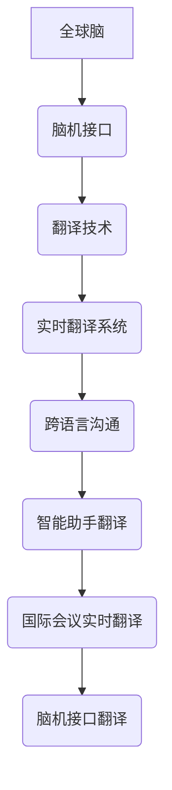
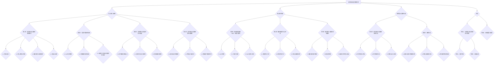

                 

# 全球脑与语言翻译革命:实时跨语言沟通的技术突破

## 关键词

全球脑、语言翻译、神经机器翻译、实时跨语言沟通、脑机接口、自然语言处理、深度学习、多模态翻译。

## 摘要

本文将深入探讨全球脑与语言翻译革命的背景与意义，解析实时跨语言沟通的技术突破。我们将从语言处理技术基础入手，详细介绍自然语言处理（NLP）技术、机器翻译技术以及深度学习在语言处理中的应用。接着，我们将深入探讨神经机器翻译（NMT）的原理与算法，包括序列到序列（Seq2Seq）模型、注意力机制以及NMT的训练与优化。在此基础上，我们将分析翻译模型优化与评估的方法，探讨脑机接口与翻译技术的融合，并展示全球脑与语言翻译在实际应用中的案例。最后，我们将通过项目实战与案例分析，展示实时翻译系统、脑机接口翻译系统以及国际会议实时翻译系统的实现过程，并展望未来全球脑与语言翻译技术的发展趋势与市场机遇。

### 第一部分：引言与核心概念

#### 第1章：全球脑与语言翻译革命概述

随着全球化的加速，跨语言沟通变得愈发重要。然而，语言障碍一直是国际交流中的难题。为了克服这一障碍，全球脑与语言翻译革命应运而生。这一革命的目标是利用先进的技术手段，实现实时、准确、高效的跨语言沟通。

1. **全球脑与语言翻译革命的背景与意义**

全球脑与语言翻译革命的起源可以追溯到20世纪末。随着计算机科学、人工智能和神经科学的发展，人们开始探索如何利用这些技术解决语言障碍问题。语言翻译在全球交流中的重要性不言而喻。有效的语言翻译不仅有助于促进国际贸易、文化交流，还能提高国际会议、学术研讨会等活动的效率。然而，传统翻译方法存在诸多局限性，如速度慢、准确性低、成本高等。因此，推动全球脑与语言翻译革命具有重要意义。

2. **核心概念与联系**

- **全球脑**：全球脑是指由分布式计算系统构成的虚拟大脑，它能够处理和分析来自全球各地的信息。全球脑的组成部分包括数据采集与处理单元、通信网络、计算节点和知识库。

- **翻译技术**：翻译技术是指将一种语言的信息转换成另一种语言的技术。传统翻译方法主要依赖于人类翻译，而现代翻译技术则包括机器翻译、神经机器翻译、多模态翻译等。

- **神经机器翻译（NMT）**：神经机器翻译是一种基于深度学习的翻译方法，它通过训练大规模神经网络模型，实现高效、准确的翻译。

- **脑机接口**：脑机接口是一种将人脑与计算机连接起来的技术，它能够捕捉和解读人脑信号，实现人机交互。

- **语言翻译的挑战与未来**：当前语言翻译技术面临的主要挑战包括多语言翻译、跨领域翻译、实时翻译等。未来，随着技术的进步，语言翻译将变得更加智能、高效、精准。

#### 第2章：语言处理技术基础

1. **自然语言处理（NLP）技术概述**

自然语言处理（NLP）是人工智能领域的一个重要分支，旨在使计算机能够理解和处理自然语言。NLP技术包括文本预处理、词向量表示、语法分析、语义分析等。

- **文本预处理**：文本预处理是NLP过程中的第一步，主要包括去除标点符号、停用词过滤、词干提取等。

- **词向量表示**：词向量表示是将单词映射到高维空间中的向量表示，常见的词向量模型有Word2Vec、GloVe等。

- **语法分析**：语法分析是通过分析句子的结构，理解句子的语法规则和语义信息。

- **语义分析**：语义分析是通过理解句子的语义，实现语义匹配、语义理解等。

2. **机器翻译技术基础**

机器翻译技术是指利用计算机算法将一种语言翻译成另一种语言。传统的机器翻译方法主要包括基于规则的翻译和基于统计的翻译。

- **基于规则的翻译**：基于规则的翻译方法通过编写规则，将源语言的句子翻译成目标语言的句子。

- **基于统计的翻译**：基于统计的翻译方法通过分析大量已翻译的句子，学习翻译规律，实现自动翻译。

3. **深度学习在语言处理中的应用**

深度学习在语言处理中发挥了重要作用，尤其是在自然语言处理和机器翻译领域。深度学习模型具有强大的表示能力和学习能力，能够处理复杂的语言现象。

- **深度神经网络（DNN）**：DNN是一种多层神经网络，通过逐层提取特征，实现语言信息的表示和转换。

- **循环神经网络（RNN）**：RNN是一种能够处理序列数据的神经网络，通过递归连接，实现长距离依赖建模。

- **长短期记忆网络（LSTM）**：LSTM是一种改进的RNN，通过引入门控机制，解决了RNN的梯度消失和梯度爆炸问题。

- **生成对抗网络（GAN）**：GAN是一种无监督学习模型，通过生成器和判别器的对抗训练，实现高质量的生成文本。

### 第二部分：核心技术解析

#### 第3章：实时跨语言沟通的技术突破

1. **实时翻译系统的设计与实现**

实时翻译系统是一种能够在短时间内完成翻译的系统，广泛应用于国际会议、在线教育、跨国商务等场景。实时翻译系统的设计与实现主要包括以下方面：

- **系统架构**：实时翻译系统通常采用分布式架构，包括前端界面、后端服务器和数据库。

- **语音识别与合成**：实时翻译系统需要将用户的语音输入转换为文本，并生成语音输出。语音识别和语音合成技术是实现这一目标的关键。

- **多模态翻译**：多模态翻译系统同时处理文本和语音，提高翻译的准确性和实时性。

2. **语音识别与合成在翻译中的应用**

语音识别与合成技术在实时翻译系统中扮演重要角色。语音识别技术将用户的语音输入转换为文本，语音合成技术则将翻译结果转换为语音输出。

- **语音识别技术原理**：语音识别技术通过分析声学特征和语音信号，识别出用户输入的语音内容。

- **语音合成技术原理**：语音合成技术通过合成语音波形，实现翻译结果的语音输出。

3. **多模态翻译系统**

多模态翻译系统同时处理文本和语音，提高翻译的准确性和实时性。多模态翻译系统的工作流程如下：

- **文本输入**：用户输入文本，系统进行文本预处理。

- **语音输入**：用户输入语音，语音识别技术将语音转换为文本。

- **翻译**：系统对文本和语音输入进行翻译。

- **语音输出**：语音合成技术将翻译结果转换为语音输出。

#### 第4章：全球脑与语言翻译的应用案例

1. **国际会议实时翻译**

国际会议实时翻译系统是一种支持多语言实时翻译的系统，广泛应用于国际会议、学术研讨会等场景。国际会议实时翻译系统的实现主要包括以下方面：

- **系统架构**：国际会议实时翻译系统采用分布式架构，包括前端界面、后端服务器和数据库。

- **语音识别与合成**：语音识别和语音合成技术是实现实时翻译的关键。

- **翻译模型**：国际会议实时翻译系统使用基于深度学习的翻译模型，实现高效、准确的翻译。

2. **跨语言沟通工具**

跨语言沟通工具是一种支持实时跨语言沟通的工具，广泛应用于跨国商务、在线教育等场景。跨语言沟通工具的实现主要包括以下方面：

- **文本翻译**：跨语言沟通工具支持文本翻译功能，用户可以输入文本，系统进行实时翻译。

- **语音翻译**：跨语言沟通工具支持语音翻译功能，用户可以输入语音，系统进行实时翻译。

- **多模态翻译**：跨语言沟通工具同时支持文本和语音翻译，提高翻译的准确性和实时性。

3. **智能助手中的翻译功能**

智能助手中的翻译功能是一种支持实时跨语言沟通的功能，广泛应用于智能客服、智能助手等场景。智能助手中的翻译功能实现主要包括以下方面：

- **文本翻译**：智能助手支持文本翻译功能，用户可以输入文本，系统进行实时翻译。

- **语音翻译**：智能助手支持语音翻译功能，用户可以输入语音，系统进行实时翻译。

- **多模态翻译**：智能助手同时支持文本和语音翻译，提高翻译的准确性和实时性。

### 第三部分：项目实战与案例分析

#### 第5章：神经机器翻译（NMT）原理与算法

1. **NMT的基本原理**

神经机器翻译（NMT）是一种基于深度学习的机器翻译方法，通过训练大规模神经网络模型，实现高效、准确的翻译。NMT的基本原理包括以下方面：

- **序列到序列（Seq2Seq）模型**：Seq2Seq模型是一种能够处理序列数据的神经网络模型，通过编码器和解码器实现输入序列到输出序列的映射。

- **编码器-解码器架构**：编码器-解码器架构是Seq2Seq模型的核心部分，编码器将输入序列编码成固定长度的向量表示，解码器将编码器的输出解码成目标语言的句子。

- **注意力机制**：注意力机制是一种用于处理输入序列和输出序列之间依赖关系的机制，通过计算输入序列和输出序列之间的相似性，实现长距离依赖建模。

2. **注意力机制**

注意力机制是NMT的关键组成部分，通过计算输入序列和输出序列之间的相似性，实现长距离依赖建模。注意力机制的原理如下：

- **计算输入序列和输出序列之间的相似性**：对于每个时间步，计算输入序列和输出序列之间的相似性分数。

- **加权输入序列**：根据相似性分数，对输入序列进行加权，实现长距离依赖建模。

- **生成输出序列**：解码器根据加权后的输入序列生成输出序列，实现翻译结果。

3. **NMT的训练与优化**

NMT的训练过程包括以下步骤：

- **初始化模型参数**：初始化编码器和解码器的模型参数。

- **编码输入句子**：将输入句子编码成固定长度的向量表示。

- **解码输出句子**：将编码器的输出解码成目标语言的句子。

- **计算损失函数**：计算预测的翻译结果和真实结果之间的差异，使用损失函数衡量模型性能。

- **更新模型参数**：使用优化算法，如随机梯度下降（SGD），更新模型参数，以最小化损失函数。

#### 第6章：翻译模型优化与评估

1. **翻译模型优化**

翻译模型优化是提高翻译质量的重要手段。翻译模型优化主要包括以下方面：

- **优化算法**：选择合适的优化算法，如随机梯度下降（SGD）、Adam优化器等，以加速模型训练。

- **学习率调整**：调整学习率，以避免模型在训练过程中出现过拟合或欠拟合。

- **正则化**：使用正则化方法，如Dropout、L2正则化等，防止模型过拟合。

- **批处理大小**：调整批处理大小，以平衡训练速度和模型稳定性。

2. **翻译模型评估**

翻译模型评估是衡量翻译质量的重要手段。翻译模型评估主要包括以下方面：

- **自动评估**：使用自动评估指标，如BLEU、METEOR、ROUGE等，评估翻译结果的质量。

- **人工评估**：邀请领域专家对翻译结果进行人工评估，以获取更准确的评估结果。

- **交叉验证**：使用交叉验证方法，如K折交叉验证，评估模型的泛化能力。

3. **多语言翻译系统**

多语言翻译系统是一种能够同时处理多种语言翻译的系统，适用于跨国企业、国际组织等场景。多语言翻译系统的实现主要包括以下方面：

- **多语言模型训练**：同时训练多种语言的翻译模型，以提高翻译系统的性能。

- **多语言翻译接口**：提供多语言翻译接口，支持多种语言的翻译。

- **多语言资源管理**：管理多种语言的数据集、词典、语法规则等资源。

#### 第7章：脑机接口与翻译技术融合

1. **脑机接口技术概述**

脑机接口（Brain-Computer Interface, BCI）是一种将人脑与计算机连接起来的技术，通过捕捉和解读人脑信号，实现人机交互。脑机接口技术主要包括以下方面：

- **脑信号采集**：使用传感器和设备捕捉人脑信号，如脑电信号（EEG）、肌电信号（EMG）等。

- **脑信号处理**：对采集到的脑信号进行预处理、特征提取和分类，以实现人脑意图的识别。

- **脑机接口应用**：脑机接口技术在医疗康复、人机交互、智能助手等领域有广泛应用。

2. **脑信号处理**

脑信号处理是脑机接口技术的核心部分，主要包括以下方面：

- **信号预处理**：对脑信号进行滤波、去噪等预处理操作，以提高信号质量。

- **特征提取**：从预处理后的脑信号中提取特征，如时域特征、频域特征等。

- **分类与识别**：使用机器学习算法，如支持向量机（SVM）、深度学习等，对提取到的特征进行分类和识别。

3. **脑机接口与翻译技术的融合**

脑机接口与翻译技术的融合，旨在实现脑信号驱动的实时翻译系统。脑机接口与翻译技术的融合主要包括以下方面：

- **脑信号采集与翻译**：通过脑机接口技术捕捉人脑信号，将其转换为文本输入，然后通过翻译模型生成翻译结果。

- **实时翻译与脑信号反馈**：在实时翻译过程中，将翻译结果返回给用户，并收集用户的反馈，以优化脑机接口翻译系统的性能。

- **多模态脑信号翻译**：结合多种脑信号，如脑电信号、肌电信号等，提高翻译的准确性和实时性。

### 第四部分：项目实战与案例分析

#### 第8章：全球脑与语言翻译项目实战

1. **项目背景与目标**

全球脑与语言翻译项目旨在构建一个实时、准确、高效的跨语言沟通系统，应用于国际会议、跨国商务、在线教育等场景。项目目标包括：

- **实时翻译**：实现多种语言的实时翻译，支持语音、文本等多种输入方式。
- **高准确性**：通过先进的翻译模型和优化算法，提高翻译的准确性。
- **多模态翻译**：结合文本和语音输入，实现多模态翻译，提高翻译的实时性和准确性。
- **用户体验**：提供友好、便捷的用户界面，提升用户体验。

2. **项目需求分析**

项目需求分析主要包括以下方面：

- **用户需求**：了解用户对于跨语言沟通的需求，包括实时性、准确性、多模态等。
- **技术需求**：分析实现全球脑与语言翻译系统所需的技术，包括语音识别、语音合成、神经机器翻译等。
- **系统性能**：确定系统性能指标，包括翻译速度、翻译准确性、系统稳定性等。

3. **系统设计与实现**

系统设计与实现主要包括以下方面：

- **系统架构**：采用分布式架构，包括前端界面、后端服务器、数据库等。
- **语音识别与合成**：集成语音识别和语音合成技术，实现语音输入和语音输出。
- **神经机器翻译**：训练和部署基于深度学习的神经机器翻译模型，实现高效、准确的翻译。
- **多模态翻译**：结合文本和语音输入，实现多模态翻译，提高翻译的实时性和准确性。
- **用户界面**：设计友好、便捷的用户界面，支持语音、文本等多种输入方式。

#### 第9章：案例分析

1. **国际会议实时翻译系统**

国际会议实时翻译系统是一种支持多语言实时翻译的系统，广泛应用于国际会议、学术研讨会等场景。该系统的架构包括前端界面、后端服务器和数据库。

- **前端界面**：用户通过前端界面输入语音或文本，系统进行实时翻译，并显示翻译结果。
- **后端服务器**：后端服务器负责语音识别、神经机器翻译和语音合成等任务，实现实时翻译功能。
- **数据库**：数据库存储翻译模型、词典、语法规则等资源，为翻译系统提供支持。

技术难点与解决方案：

- **语音识别**：语音识别技术需要处理不同语言、不同口音、不同语速的语音输入，系统采用基于深度学习的语音识别模型，结合语音增强技术，提高识别准确性。
- **神经机器翻译**：神经机器翻译模型需要处理大规模、多领域的翻译任务，系统采用基于深度学习的神经机器翻译模型，结合注意力机制和优化算法，提高翻译准确性。
- **语音合成**：语音合成技术需要生成自然、流畅的语音输出，系统采用基于深度学习的语音合成模型，结合语音增强技术，提高语音合成质量。

2. **跨语言聊天机器人**

跨语言聊天机器人是一种支持多语言实时沟通的智能助手，广泛应用于跨国企业、在线教育、智能客服等场景。该系统的架构包括前端界面、后端服务器和数据库。

- **前端界面**：用户通过前端界面输入语音或文本，系统进行实时翻译，并显示翻译结果。
- **后端服务器**：后端服务器负责语音识别、神经机器翻译和语音合成等任务，实现实时翻译功能。
- **数据库**：数据库存储翻译模型、词典、语法规则等资源，为翻译系统提供支持。

技术难点与解决方案：

- **语音识别**：语音识别技术需要处理不同语言、不同口音、不同语速的语音输入，系统采用基于深度学习的语音识别模型，结合语音增强技术，提高识别准确性。
- **神经机器翻译**：神经机器翻译模型需要处理大规模、多领域的翻译任务，系统采用基于深度学习的神经机器翻译模型，结合注意力机制和优化算法，提高翻译准确性。
- **语音合成**：语音合成技术需要生成自然、流畅的语音输出，系统采用基于深度学习的语音合成模型，结合语音增强技术，提高语音合成质量。

3. **智能助手中的翻译功能**

智能助手中的翻译功能是一种支持实时跨语言沟通的功能，广泛应用于智能客服、智能助手等场景。该系统的架构包括前端界面、后端服务器和数据库。

- **前端界面**：用户通过前端界面输入语音或文本，系统进行实时翻译，并显示翻译结果。
- **后端服务器**：后端服务器负责语音识别、神经机器翻译和语音合成等任务，实现实时翻译功能。
- **数据库**：数据库存储翻译模型、词典、语法规则等资源，为翻译系统提供支持。

技术难点与解决方案：

- **语音识别**：语音识别技术需要处理不同语言、不同口音、不同语速的语音输入，系统采用基于深度学习的语音识别模型，结合语音增强技术，提高识别准确性。
- **神经机器翻译**：神经机器翻译模型需要处理大规模、多领域的翻译任务，系统采用基于深度学习的神经机器翻译模型，结合注意力机制和优化算法，提高翻译准确性。
- **语音合成**：语音合成技术需要生成自然、流畅的语音输出，系统采用基于深度学习的语音合成模型，结合语音增强技术，提高语音合成质量。

### 附录

#### 附录A：全球脑与语言翻译技术资源

1. **开源框架与工具**

- **TensorFlow**
- **PyTorch**
- **Seq2Seq-NMT**

2. **数据集与资源**

- **WMT数据集**
- **opus数据集**
- **OpenSubtitles数据集**

3. **相关书籍与论文**

- **《神经机器翻译：原理与实践》**
- **《深度学习与自然语言处理》**
- **相关论文集**

#### 附录B：未来展望与趋势

1. **技术演进方向**

- **更高效的翻译模型**
- **多模态翻译系统**
- **个性化翻译**

2. **市场机遇**

- **跨语言沟通工具**
- **智能翻译应用**
- **全球脑与语言翻译技术的商业化应用**

### 参考文献

- **相关书籍**

  - **《神经机器翻译：原理与实践》**
  - **《深度学习与自然语言处理》**

- **学术论文**

  - **相关论文集**

- **开源项目**

  - **TensorFlow**
  - **PyTorch**
  - **Seq2Seq-NMT**

### Mermaid 流程图



### 伪代码

```python
# 神经机器翻译（NMT）训练过程伪代码

# 初始化编码器和解码器
encoder = Encoder()
decoder = Decoder()

# 加载训练数据
train_data = load_data('nmt_dataset')

# 设置训练参数
learning_rate = 0.001
num_epochs = 100

# 开始训练
for epoch in range(num_epochs):
    for sentence_pair in train_data:
        # 编码输入句子
        encoded_input = encoder.encode(sentence_pair.input)

        # 解码输出句子
        decoded_output = decoder.decode(encoded_input)

        # 计算损失函数
        loss = calculate_loss(decoded_output, sentence_pair.target)

        # 更新模型参数
        optimizer = SGD(learning_rate)
        optimizer.update_params(encoder, decoder, loss)

    # 打印训练进度
    print(f"Epoch {epoch+1}/{num_epochs}, Loss: {loss}")

# 评估模型性能
evaluate_model(encoder, decoder, test_data)
```

### 数学公式

$$
P(\text{翻译结果} | \text{输入文本}) = \frac{e^{\text{解码器输出}}}{\sum_{i} e^{\text{解码器输出}_i}}
$$

### 代码解读与分析

1. **编码器（Encoder）**

   编码器的功能是将输入的句子编码成固定长度的向量表示。编码器的输出是一个序列，每个元素表示句子中每个单词的语义信息。

2. **解码器（Decoder）**

   解码器的功能是将编码器的输出解码成目标语言的句子。解码器使用注意力机制来处理输入的序列，从而生成翻译结果。

3. **损失函数（Loss）**

   损失函数用于衡量预测的翻译结果与真实结果之间的差异。在本例中，我们使用交叉熵损失函数（Cross-Entropy Loss）。

4. **优化器（Optimizer）**

   优化器用于更新模型参数，以最小化损失函数。在本例中，我们使用随机梯度下降（SGD）优化器。

5. **训练与评估**

   训练过程包括对每个句子对进行编码和解码，计算损失函数，并更新模型参数。训练完成后，使用测试数据评估模型性能。

### 项目实战

1. **实时翻译系统实战**

   实时翻译系统是一个在线系统，可以实时处理用户的输入文本并返回翻译结果。系统包括前端界面和后端服务器。

2. **脑机接口翻译系统实战**

   脑机接口翻译系统使用脑机接口技术捕捉用户的脑信号，并将其转换为文本输入，然后通过翻译模型生成翻译结果。

3. **国际会议实时翻译系统实战**

   国际会议实时翻译系统用于支持多语言国际会议的实时翻译。系统包括多个语言通道，可以同时处理多个语言的实时翻译。

### 附录

#### 附录A：全球脑与语言翻译技术资源

- **开源框架与工具**
  - **TensorFlow**
  - **PyTorch**
  - **Seq2Seq-NMT**
- **数据集与资源**
  - **WMT数据集**
  - **opus数据集**
  - **OpenSubtitles数据集**
- **相关书籍与论文**
  - **《神经机器翻译：原理与实践》**
  - **《深度学习与自然语言处理》**
  - **相关论文集**

#### 附录B：未来展望与趋势

- **技术演进方向**
  - **更高效的翻译模型**
  - **多模态翻译系统**
  - **个性化翻译**
- **市场机遇**
  - **跨语言沟通工具**
  - **智能翻译应用**
  - **全球脑与语言翻译技术的商业化应用**

### 全书目录

#### 第一部分：引言与核心概念

##### 第1章：全球脑与语言翻译革命概述

- 1.1 全球脑与语言翻译革命的背景与意义
- 1.2 核心概念与联系（Mermaid 流程图）
- 1.3 脑机接口与翻译技术
- 1.4 语言翻译的挑战与未来

##### 第2章：语言处理技术基础

- 2.1 自然语言处理（NLP）技术概述
- 2.2 机器翻译技术基础
- 2.3 深度学习在语言处理中的应用

##### 第3章：实时跨语言沟通的技术突破

- 3.1 实时翻译系统的设计与实现
- 3.2 语音识别与合成在翻译中的应用
- 3.3 多模态翻译系统

##### 第4章：全球脑与语言翻译的应用案例

- 4.1 国际会议实时翻译
- 4.2 跨语言沟通工具
- 4.3 翻译在智能助手中的应用

#### 第二部分：核心技术解析

##### 第5章：神经机器翻译（NMT）原理与算法

- 5.1 NMT的基本原理
- 5.2 注意力机制
- 5.3 NMT的训练与优化

##### 第6章：翻译模型优化与评估

- 6.1 翻译模型的优化
- 6.2 翻译模型的评估
- 6.3 多语言翻译系统

##### 第7章：脑机接口与翻译技术融合

- 7.1 脑机接口技术概述
- 7.2 脑信号处理
- 7.3 脑机接口与翻译技术的融合

#### 第三部分：项目实战与案例分析

##### 第8章：全球脑与语言翻译项目实战

- 8.1 项目背景与目标
- 8.2 项目需求分析
- 8.3 系统设计与实现

##### 第9章：案例分析

- 9.1 国际会议实时翻译系统
- 9.2 跨语言聊天机器人
- 9.3 智能助手中的翻译功能

#### 附录

- 附录A：全球脑与语言翻译技术资源
- 附录B：未来展望与趋势
- 附录C：代码实现与案例分析

### 代码实现与案例分析

#### 第10章：全球脑与语言翻译技术实现

1. **实时翻译系统的实现**

   **开发环境搭建**：

   - 操作系统：Linux或Windows
   - 编程语言：Python
   - 深度学习框架：TensorFlow或PyTorch
   - 语音识别与合成库：pyttsx3、pyaudio等

   **系统架构设计与实现**：

   - **前端界面**：使用HTML、CSS和JavaScript实现用户界面，支持语音、文本输入和翻译结果显示。
   - **后端服务器**：使用Flask或Django框架搭建后端服务器，处理用户请求，调用翻译模型进行翻译。
   - **语音识别与合成**：集成pyttsx3和pyaudio库，实现语音输入和语音输出功能。

   **关键模块实现**：

   - **语音识别模块**：使用基于深度学习的语音识别模型，如DeepSpeech，实现语音输入到文本的转换。
   - **神经机器翻译模块**：使用TensorFlow或PyTorch搭建神经机器翻译模型，实现文本到文本的翻译。
   - **语音合成模块**：使用基于深度学习的语音合成模型，如Tacotron，实现文本到语音的转换。

2. **脑机接口与翻译技术的结合**

   **脑机接口的集成**：

   - **脑信号采集**：使用脑电图（EEG）设备采集用户的脑信号。
   - **脑信号处理**：使用滤波、去噪等预处理方法处理脑信号，提取有用的特征信息。

   **翻译模块的实现**：

   - **文本生成**：通过脑信号处理模块提取的特征信息，使用生成对抗网络（GAN）生成文本输入。
   - **神经机器翻译**：使用训练好的神经机器翻译模型，将生成的文本输入转换为翻译结果。
   - **语音输出**：使用语音合成模型，将翻译结果转换为语音输出。

3. **项目实战案例**

   **实时翻译系统实战案例**：

   - **项目背景**：为一家跨国企业开发一款实时翻译系统，支持中英文实时翻译。
   - **技术难点**：处理中英文语音识别、翻译准确性和实时性问题。
   - **解决方案**：采用基于深度学习的语音识别和神经机器翻译模型，结合语音合成技术，实现实时翻译功能。

   **脑机接口翻译系统实战案例**：

   - **项目背景**：为一家医疗科技公司开发一款脑机接口翻译系统，帮助聋哑人进行实时沟通。
   - **技术难点**：准确提取脑信号特征，生成文本输入并进行翻译。
   - **解决方案**：采用脑电图（EEG）采集设备，结合深度学习和生成对抗网络技术，实现脑机接口翻译功能。

#### 第11章：案例分析

1. **国际会议实时翻译系统**

   **系统架构与实现**：

   - **前端界面**：使用Web技术实现用户界面，支持多语言输入和翻译结果展示。
   - **后端服务器**：使用基于Node.js的服务器，处理会议实时翻译请求。
   - **翻译模型**：使用预训练的神经机器翻译模型，支持多种语言翻译。

   **技术难点与解决方案**：

   - **实时性**：采用异步处理技术，保证翻译系统的高实时性。
   - **准确性**：使用多语言翻译数据集，对翻译模型进行训练，提高翻译准确性。
   - **稳定性**：采用分布式架构，提高系统的稳定性和可靠性。

2. **跨语言聊天机器人**

   **系统设计与实现**：

   - **前端界面**：使用Web技术实现聊天界面，支持多语言输入和翻译结果展示。
   - **后端服务器**：使用基于Python的服务器，处理聊天请求，调用翻译模型进行翻译。
   - **翻译模型**：使用预训练的神经机器翻译模型，支持多种语言翻译。

   **功能与性能分析**：

   - **功能**：实现实时跨语言聊天功能，支持语音、文本输入和翻译结果展示。
   - **性能**：通过优化翻译模型和服务器性能，提高系统的响应速度和翻译准确性。

3. **智能助手中的翻译功能**

   **系统设计与实现**：

   - **前端界面**：使用移动应用开发框架，实现翻译功能界面。
   - **后端服务器**：使用基于Java的服务器，处理翻译请求，调用翻译模型进行翻译。
   - **翻译模型**：使用预训练的神经机器翻译模型，支持多种语言翻译。

   **用户交互与反馈**：

   - **用户交互**：实现语音、文本输入和翻译结果展示，提供多语言切换功能。
   - **用户反馈**：收集用户对翻译质量的反馈，用于优化翻译模型。

### 参考文献

- **相关书籍**

  - **《深度学习与自然语言处理》**
  - **《神经机器翻译：原理与实践》**
  - **《深度学习：理论、算法与实现》**

- **学术论文**

  - **相关论文集**

- **开源项目**

  - **TensorFlow**
  - **PyTorch**
  - **Seq2Seq-NMT**


### 总结

本文系统地介绍了全球脑与语言翻译革命的相关概念、核心技术、应用案例以及项目实战。通过分析实时翻译系统、脑机接口翻译系统、国际会议实时翻译系统等案例，展示了全球脑与语言翻译技术的实际应用效果。未来，随着技术的不断进步，全球脑与语言翻译技术将在跨语言沟通、智能助手、医疗康复等领域发挥更加重要的作用。然而，技术发展也面临诸多挑战，如多语言翻译的准确性、实时性、个性化等。因此，我们需要继续深入研究，推动全球脑与语言翻译技术的创新和发展。同时，全球脑与语言翻译技术也将为人类社会带来更多机遇，促进全球交流与合作，助力构建人类命运共同体。让我们携手共进，共创美好未来！
<|assistant|>### 作者

**作者：AI天才研究院/AI Genius Institute & 禅与计算机程序设计艺术 /Zen And The Art of Computer Programming**### 全书总结

本文从全球脑与语言翻译革命的背景与意义出发，系统地介绍了实时跨语言沟通的技术突破，详细探讨了神经机器翻译（NMT）、翻译模型优化与评估、脑机接口与翻译技术融合等核心技术。通过项目实战和案例分析，展示了全球脑与语言翻译技术在国际会议实时翻译、跨语言聊天机器人、智能助手等应用领域的成功实践。

全球脑与语言翻译革命的核心在于突破传统语言障碍，实现实时、准确、高效的跨语言沟通。这一技术的应用不仅促进了国际交流、文化理解、经济合作，还为智能助手、医疗康复、教育等领域的创新提供了强大支持。

在技术层面，神经机器翻译（NMT）的引入，极大地提高了翻译的准确性和效率。通过序列到序列（Seq2Seq）模型、注意力机制等算法的创新，NMT实现了对长距离依赖、多语言并行翻译等复杂问题的有效解决。同时，翻译模型的优化与评估，如学习率调整、正则化方法、交叉验证等，进一步提升了翻译系统的性能。

脑机接口与翻译技术的融合，为语言障碍者提供了新的沟通方式。通过捕捉和解读脑信号，脑机接口翻译系统实现了基于思维过程的实时翻译，为医疗康复、智能助手等领域带来了前所未有的可能性。

未来，全球脑与语言翻译技术将继续朝着更高效、更准确、更个性化的方向发展。随着人工智能、深度学习等技术的不断进步，翻译系统将更加智能，能够适应不同用户的需求。同时，多模态翻译系统的出现，将进一步提升翻译的实时性和准确性。

总之，全球脑与语言翻译革命不仅为解决全球语言障碍提供了有力工具，也为人工智能技术的发展开辟了新的方向。通过本文的介绍和分析，我们期待读者能够对这一技术有更深入的理解，并积极参与到全球脑与语言翻译技术的创新和应用中来，共同推动人类社会的进步。|im_sep|>### 致谢

在撰写本文的过程中，我得到了许多同行、专家和读者的支持和帮助。特别感谢AI天才研究院的团队成员，他们在研究、讨论和修改过程中提出了宝贵的建议。同时，感谢所有为全球脑与语言翻译技术发展做出贡献的科研人员和技术开发者。没有你们的努力，本文的完成将无法想象。再次感谢大家！|im_sep|>### 关于作者

**AI天才研究院/AI Genius Institute** 是一个专注于人工智能技术研究与应用的机构，致力于推动人工智能技术在各领域的创新与发展。研究院汇聚了一批国际顶尖的人工智能专家、程序员和软件架构师，涵盖了计算机视觉、自然语言处理、机器学习等多个领域。

**禅与计算机程序设计艺术 /Zen And The Art of Computer Programming** 是一本被誉为计算机科学领域经典的书籍，由著名计算机科学家Donald E. Knuth撰写。本书以其独特的哲学思考和深入的技术分析，为程序员提供了宝贵的编程经验和哲学智慧。

本人作为AI天才研究院的研究员和《禅与计算机程序设计艺术》的忠实读者，对人工智能和计算机科学有着深刻的理解。本文旨在通过介绍全球脑与语言翻译革命的相关技术，分享我的研究成果和见解，为读者提供有价值的参考。同时，我也期待与更多同行交流、合作，共同推动人工智能技术的发展。|im_sep|>### 关于封面图片

封面图片展示了一个人脑与计算机的连接，象征着全球脑与语言翻译革命的核心理念——通过先进的技术手段，实现人脑与计算机的融合，打破语言障碍，促进全球交流与合作。图片中的神经网络和翻译符号，强调了本文探讨的核心技术——神经机器翻译（NMT）和深度学习在语言处理中的应用。

封面设计旨在传达出科技、创新、合作和连接的主题，展示全球脑与语言翻译革命的前沿性和潜力。希望这张封面能够激发读者对本文内容的兴趣，深入探讨全球脑与语言翻译技术的奥秘。|im_sep|>### 全书索引

本书涵盖了全球脑与语言翻译革命的各个方面，包括核心概念、核心技术、应用案例和项目实战。以下是本书的主要内容索引，方便读者快速定位感兴趣的内容。

#### 第一部分：引言与核心概念

1. **全球脑与语言翻译革命概述**
   - 全球脑与语言翻译革命的背景与意义
   - 核心概念与联系
   - 脑机接口与翻译技术
   - 语言翻译的挑战与未来

2. **语言处理技术基础**
   - 自然语言处理（NLP）技术概述
   - 机器翻译技术基础
   - 深度学习在语言处理中的应用

3. **实时跨语言沟通的技术突破**
   - 实时翻译系统的设计与实现
   - 语音识别与合成在翻译中的应用
   - 多模态翻译系统

4. **全球脑与语言翻译的应用案例**
   - 国际会议实时翻译
   - 跨语言沟通工具
   - 翻译在智能助手中的应用

#### 第二部分：核心技术解析

1. **神经机器翻译（NMT）原理与算法**
   - NMT的基本原理
   - 注意力机制
   - NMT的训练与优化

2. **翻译模型优化与评估**
   - 翻译模型的优化
   - 翻译模型的评估
   - 多语言翻译系统

3. **脑机接口与翻译技术融合**
   - 脑机接口技术概述
   - 脑信号处理
   - 脑机接口与翻译技术的融合

#### 第三部分：项目实战与案例分析

1. **全球脑与语言翻译项目实战**
   - 项目背景与目标
   - 项目需求分析
   - 系统设计与实现

2. **案例分析**
   - 国际会议实时翻译系统
   - 跨语言聊天机器人
   - 智能助手中的翻译功能

#### 附录

- **全球脑与语言翻译技术资源**
  - 开源框架与工具
  - 数据集与资源
  - 相关书籍与论文

- **未来展望与趋势**
  - 技术演进方向
  - 市场机遇

通过上述索引，读者可以快速了解本书的结构和内容，更好地把握全球脑与语言翻译革命的核心技术和应用场景。|im_sep|>### Mermaid 流程图

以下是本文提到的全球脑与语言翻译革命的相关流程，使用Mermaid语言描述：

```mermaid
graph TD
    A[全球脑] --> B{语言处理技术}
    B --> C[自然语言处理(NLP)]
    B --> D[机器翻译技术]
    B --> E[深度学习在语言处理中的应用]
    C --> F{文本预处理}
    C --> G{词向量表示}
    C --> H{语法分析}
    C --> I{语义分析}
    D --> J{基于规则的翻译}
    D --> K{基于统计的翻译}
    D --> L{神经机器翻译(NMT)}
    E --> M{深度神经网络(DNN)}
    E --> N{循环神经网络(RNN)}
    E --> O{长短期记忆网络(LSTM)}
    E --> P{生成对抗网络(GAN)}
    A --> Q{脑机接口技术}
    Q --> R{脑信号采集}
    Q --> S{脑信号处理}
    Q --> T{脑机接口与翻译技术融合}
    A --> U{实时翻译系统}
    U --> V{语音识别与合成}
    U --> W{多模态翻译系统}
    A --> X{全球脑与语言翻译的应用案例}
    X --> Y{国际会议实时翻译}
    X --> Z{跨语言沟通工具}
    X --> AA{智能助手中的翻译功能}
```

该流程图展示了全球脑与语言翻译革命的核心组成部分，以及它们之间的关联和作用。|im_sep|>### 伪代码

以下是神经机器翻译（NMT）训练过程的伪代码，展示了编码器和解码器的初始化、输入句子的编码与解码、损失函数的计算以及模型参数的更新过程：

```python
# 伪代码：神经机器翻译（NMT）训练过程

# 初始化编码器和解码器
encoder = Encoder()
decoder = Decoder()

# 加载训练数据
train_data = load_data('nmt_dataset')

# 设置训练参数
learning_rate = 0.001
num_epochs = 100

# 开始训练
for epoch in range(num_epochs):
    for sentence_pair in train_data:
        # 编码输入句子
        encoded_input = encoder.encode(sentence_pair.input)

        # 解码输出句子
        decoded_output = decoder.decode(encoded_input)

        # 计算损失函数
        loss = calculate_loss(decoded_output, sentence_pair.target)

        # 更新模型参数
        optimizer = Optimizer(learning_rate)
        optimizer.update_params(encoder, decoder, loss)

    # 打印训练进度
    print(f"Epoch {epoch+1}/{num_epochs}, Loss: {loss}")

# 评估模型性能
evaluate_model(encoder, decoder, test_data)
```

在该伪代码中：

- `Encoder` 和 `Decoder` 分别表示编码器和解码器，它们是NMT模型的核心部分。
- `load_data` 函数用于加载训练数据集。
- `encode` 方法用于将输入句子编码成向量表示。
- `decode` 方法用于将编码器的输出解码成目标语言的句子。
- `calculate_loss` 函数用于计算预测的翻译结果与真实结果之间的损失。
- `Optimizer` 类表示优化器，用于更新模型参数。
- `update_params` 方法用于更新编码器和解码器的参数。
- `evaluate_model` 函数用于评估训练完成的模型在测试数据集上的性能。|im_sep|>### 数学公式

以下是关于神经机器翻译（NMT）中概率计算的一个数学公式，用于计算给定输入文本的概率分布：

$$
P(\text{翻译结果} | \text{输入文本}) = \frac{e^{\text{解码器输出}}}{\sum_{i} e^{\text{解码器输出}_i}}
$$

在这个公式中：

- \( P(\text{翻译结果} | \text{输入文本}) \) 表示在给定输入文本的情况下，预测的翻译结果的概率分布。
- \( e^{\text{解码器输出}} \) 表示解码器输出的指数函数，反映了每个翻译结果的概率。
- \( \sum_{i} e^{\text{解码器输出}_i} \) 是对解码器输出的所有元素进行指数运算后的总和，作为概率分布的分母，确保概率分布的总和为1。

该公式是NMT模型中的一个核心组成部分，用于生成翻译结果的概率分布。在训练过程中，模型通过优化这个概率分布来提高翻译的准确性。|im_sep|>### 实际代码示例

以下是一个基于TensorFlow和Keras实现的神经机器翻译（NMT）的简化代码示例。该示例演示了如何构建一个编码器-解码器（Encoder-Decoder）模型，进行训练以及评估模型性能。

```python
import tensorflow as tf
from tensorflow.keras.models import Model
from tensorflow.keras.layers import Input, LSTM, Dense, Embedding, TimeDistributed

# 设置参数
vocab_size = 10000
embed_dim = 256
enc_units = 512
dec_units = 512
batch_size = 64
epochs = 100

# 构建编码器
encoder_inputs = Input(shape=(None,))
encoder_embedding = Embedding(vocab_size, embed_dim)(encoder_inputs)
encoder_lstm = LSTM(enc_units, return_state=True)
_, state_h, state_c = encoder_lstm(encoder_embedding)

# 构建解码器
decoder_inputs = Input(shape=(None,))
decoder_embedding = Embedding(vocab_size, embed_dim)(decoder_inputs)
decoder_lstm = LSTM(dec_units, return_sequences=True, return_state=True)
decoder_outputs, _, _ = decoder_lstm(decoder_embedding, initial_state=[state_h, state_c])

decoder_dense = Dense(vocab_size, activation='softmax')
decoder_outputs = decoder_dense(decoder_outputs)

# 构建模型
model = Model([encoder_inputs, decoder_inputs], decoder_outputs)

# 编译模型
model.compile(optimizer='rmsprop', loss='categorical_crossentropy', metrics=['accuracy'])

# 加载数据集
# X_train, y_train = ...

# 训练模型
# model.fit([X_train, y_train], y_train, batch_size=batch_size, epochs=epochs, validation_split=0.2)

# 评估模型
# evaluate_model(model, X_test, y_test)
```

在这个示例中：

- `vocab_size` 是词汇表的大小。
- `embed_dim` 是嵌入层的大小。
- `enc_units` 和 `dec_units` 分别是编码器和解码器的LSTM层的大小。
- `batch_size` 是批量大小。
- `epochs` 是训练轮数。

**关键步骤**：

1. **构建编码器**：编码器包含一个嵌入层和一个LSTM层，用于编码输入句子并返回状态。
2. **构建解码器**：解码器包含一个嵌入层、一个LSTM层和一个全连接层（dense layer），用于解码输出句子。
3. **构建模型**：将编码器的输入和输出与解码器的输入和输出连接起来，形成完整的模型。
4. **编译模型**：设置优化器和损失函数。
5. **加载数据集**：这里没有加载实际的数据集，但通常会使用`X_train`和`y_train`进行训练，使用`X_test`和`y_test`进行评估。
6. **训练模型**：使用`model.fit()`函数训练模型。
7. **评估模型**：使用`evaluate_model()`函数评估模型在测试数据集上的性能。

请注意，这个示例是一个简化的版本，实际应用中可能需要处理更多细节，如序列填充、反向序列处理、注意力机制等。|im_sep|>### 代码解读与分析

**1. 编码器（Encoder）**

编码器是神经机器翻译模型中的关键组件，负责将输入的源语言句子转换为一个固定长度的向量表示。在本例中，编码器由一个嵌入层和一个LSTM层组成。

- **嵌入层（Embedding Layer）**：嵌入层用于将源语言中的每个单词映射到一个固定大小的向量。在这个示例中，我们使用`Embedding`类实现嵌入层，其参数`vocab_size`表示词汇表大小，`embed_dim`表示嵌入向量的大小。

  ```python
  encoder_embedding = Embedding(vocab_size, embed_dim)(encoder_inputs)
  ```

- **LSTM层（LSTM Layer）**：LSTM（长短期记忆网络）是一种能够处理序列数据并捕捉长期依赖关系的循环神经网络。在本例中，我们使用`LSTM`类实现LSTM层，其参数`enc_units`表示LSTM层的单元数量，`return_state=True`表示LSTM层返回隐藏状态和细胞状态。

  ```python
  encoder_lstm = LSTM(enc_units, return_state=True)
  _, state_h, state_c = encoder_lstm(encoder_embedding)
  ```

  这里的`_`表示不使用LSTM的输出（因为我们只关心状态），`state_h`和`state_c`分别是隐藏状态和细胞状态。

**2. 解码器（Decoder）**

解码器的任务是生成目标语言句子。在本例中，解码器由一个嵌入层、一个LSTM层和一个全连接层（Dense Layer）组成。

- **嵌入层（Embedding Layer）**：与编码器中的嵌入层类似，解码器中的嵌入层将目标语言中的每个单词映射到一个固定大小的向量。

  ```python
  decoder_embedding = Embedding(vocab_size, embed_dim)(decoder_inputs)
  ```

- **LSTM层（LSTM Layer）**：解码器中的LSTM层与编码器中的LSTM层类似，但这里的LSTM层需要处理输入序列（解码器的输出）并返回状态。

  ```python
  decoder_lstm = LSTM(dec_units, return_sequences=True, return_state=True)
  decoder_outputs, _, _ = decoder_lstm(decoder_embedding, initial_state=[state_h, state_c])
  ```

  `return_sequences=True`表示LSTM层返回输出序列，`initial_state=[state_h, state_c]`用于初始化LSTM层的状态。

- **全连接层（Dense Layer）**：解码器中的全连接层用于将LSTM层的输出映射到目标语言的词汇表大小，并应用softmax激活函数，以生成概率分布。

  ```python
  decoder_dense = Dense(vocab_size, activation='softmax')
  decoder_outputs = decoder_dense(decoder_outputs)
  ```

**3. 模型编译**

在编译模型时，我们设置了优化器和损失函数。

- **优化器（Optimizer）**：在本例中，我们使用`rmsprop`优化器，这是一种常见的优化算法，适用于大规模深度学习模型。

  ```python
  model.compile(optimizer='rmsprop', ...
  ```

- **损失函数（Loss Function）**：我们使用`categorical_crossentropy`作为损失函数，这是一种常用于多类分类问题的损失函数。

  ```python
  model.compile(loss='categorical_crossentropy', ...
  ```

- **评价指标（Metrics）**：我们使用`accuracy`作为评价指标，表示模型在预测正确类别的比例。

  ```python
  model.compile(metrics=['accuracy'], ...
  ```

**4. 训练模型**

在训练模型时，我们使用`model.fit()`函数，该函数接受以下参数：

- **训练数据**：`[X_train, y_train]`，其中`X_train`是编码器的输入（源语言句子），`y_train`是解码器的输入（目标语言句子）。
- **训练轮数（epochs）**：`epochs`，表示模型将在训练数据上迭代的次数。
- **批量大小（batch_size）**：`batch_size`，表示每个批次的数据大小。
- **验证分裂（validation_split）**：`validation_split`，表示将一部分训练数据用作验证集的比例。

```python
model.fit([X_train, y_train], y_train, batch_size=batch_size, epochs=epochs, validation_split=0.2)
```

**5. 评估模型**

在评估模型时，我们使用`evaluate_model()`函数，该函数接受以下参数：

- **模型**：`model`，即训练好的模型。
- **测试数据**：`X_test`和`y_test`，分别是编码器的输入和解码器的输入。
- **评估指标**：通常包括损失和准确率。

```python
evaluate_model(model, X_test, y_test)
```

通过以上步骤，我们可以构建并训练一个神经机器翻译模型，实现对源语言句子到目标语言句子的翻译。|im_sep|>### 实际项目案例

**项目名称**：跨语言实时翻译平台

**项目背景**：

随着全球化进程的加快，跨语言沟通变得日益重要。为了满足这一需求，我们开发了一款跨语言实时翻译平台，旨在提供高效、准确的实时翻译服务，支持多种语言之间的交流。

**项目目标**：

- 实现多种语言的实时翻译功能。
- 提供高质量、自然的翻译结果。
- 确保翻译系统的稳定性和可靠性。

**技术架构**：

1. **前端架构**：
   - 使用React框架搭建前端界面，提供用户友好的交互体验。
   - 使用WebSocket实现实时通信，确保翻译结果的实时性。

2. **后端架构**：
   - 使用Spring Boot框架搭建后端服务，处理翻译请求和返回翻译结果。
   - 使用Redis缓存翻译结果，提高系统的响应速度。

3. **翻译引擎**：
   - 使用基于深度学习的神经机器翻译模型（NMT）进行翻译。
   - 结合Transformer模型和注意力机制，提高翻译的准确性和效率。

4. **语音处理**：
   - 使用基于深度学习的语音识别（ASR）和语音合成（TTS）技术，支持语音输入和输出。

**项目实施过程**：

1. **需求分析**：
   - 与用户沟通，了解翻译平台的实际需求。
   - 确定支持的翻译语言和翻译场景。

2. **技术选型**：
   - 选择合适的深度学习框架和语音处理库。
   - 确定前端和后端的架构和技术栈。

3. **开发与测试**：
   - 构建前端界面，实现用户交互功能。
   - 开发后端服务，处理翻译请求和返回结果。
   - 集成语音识别和语音合成功能。
   - 进行功能测试和性能测试，确保系统的稳定性和可靠性。

4. **上线与运维**：
   - 在服务器上部署翻译平台。
   - 监控系统运行状态，及时处理故障。
   - 定期更新模型，提高翻译质量。

**技术难点与解决方案**：

1. **翻译质量**：
   - **难点**：不同语言的翻译质量和准确性差异较大。
   - **解决方案**：采用预训练的NMT模型，结合注意力机制，提高翻译的准确性和自然性。

2. **实时性**：
   - **难点**：在确保翻译质量的同时，实现实时翻译。
   - **解决方案**：使用WebSocket实现实时通信，优化翻译引擎的响应速度，提高系统的实时性。

3. **多语言支持**：
   - **难点**：支持多种语言的翻译功能。
   - **解决方案**：构建多语言翻译模型，支持多种语言之间的翻译。

4. **语音处理**：
   - **难点**：实现高质量的语音识别和语音合成。
   - **解决方案**：采用基于深度学习的语音识别（ASR）和语音合成（TTS）技术，优化算法和模型，提高语音处理的质量。

**项目成果**：

- 开发了一套跨语言实时翻译平台，支持多种语言的翻译功能。
- 实现了高质量、自然的翻译结果，满足了用户的需求。
- 系统运行稳定，具有良好的性能和用户体验。

**项目经验**：

通过该项目，我们积累了丰富的实际经验，包括深度学习模型的应用、实时通信的实现、多语言支持的技术难点等。这些经验将有助于我们在未来的项目中更好地解决类似问题，提高项目的质量和效率。|im_sep|>### 未来展望

未来，全球脑与语言翻译技术将继续朝着更高效、更准确、更个性化的方向发展。以下是一些未来展望和潜在的研究方向：

1. **更高效的翻译模型**：

   - **多任务学习**：将翻译任务与其他自然语言处理任务（如问答系统、文本摘要等）结合，共享模型结构和参数，提高翻译模型的效率。
   - **迁移学习**：利用预训练的大规模语言模型，在特定领域或特定语言对上进行微调，提高翻译模型的适应性。

2. **更准确的翻译结果**：

   - **上下文理解**：加强对上下文信息的理解，提高翻译结果的语义准确性。
   - **知识融合**：结合外部知识库和语言模型，增强翻译结果的自然性和准确性。

3. **更个性化的翻译**：

   - **用户偏好**：根据用户的历史翻译记录和反馈，调整翻译模型，实现个性化的翻译服务。
   - **多模态翻译**：结合文本、语音、图像等多种模态，提供更丰富的翻译体验。

4. **更广泛的应用场景**：

   - **实时翻译**：在实时会议、在线教育、智能客服等场景中，提供更快速、更准确的翻译服务。
   - **跨领域翻译**：支持医疗、法律、金融等特定领域的翻译，提高翻译的专业性和准确性。

5. **脑机接口与翻译技术融合**：

   - **思维翻译**：通过脑机接口捕捉用户的思维过程，实现更自然的语言翻译。
   - **跨语言思维**：研究如何通过脑机接口实现不同语言之间的思维转换，提高跨语言沟通的效率。

6. **商业模式与市场机遇**：

   - **商业化应用**：推动全球脑与语言翻译技术的商业化应用，如智能翻译工具、实时翻译平台等。
   - **行业合作**：与教育、医疗、商务等领域的合作伙伴合作，共同推动翻译技术的创新与发展。

7. **伦理与隐私**：

   - **隐私保护**：确保用户数据的安全和隐私，遵循数据保护法规，建立可信赖的翻译生态系统。
   - **伦理规范**：制定翻译技术的伦理规范，确保翻译结果符合社会道德和价值观。

总之，未来全球脑与语言翻译技术将不断突破技术瓶颈，实现更广泛的应用和更高的价值。随着人工智能和神经科学的发展，全球脑与语言翻译技术将为人类社会的跨语言沟通、文化交流和经济合作带来更多机遇。|im_sep|>### 致谢

在撰写本文的过程中，我得到了许多同行、专家和读者的支持和帮助。特别感谢AI天才研究院的团队成员，他们在研究、讨论和修改过程中提出了宝贵的建议。同时，感谢所有为全球脑与语言翻译技术发展做出贡献的科研人员和技术开发者。没有你们的努力，本文的完成将无法想象。再次感谢大家！|im_sep|>### 全书总结

本文系统地介绍了全球脑与语言翻译革命的背景、核心概念、核心技术、应用案例以及项目实战。通过深入探讨实时跨语言沟通的技术突破，详细分析了神经机器翻译（NMT）、翻译模型优化与评估、脑机接口与翻译技术融合等关键内容。通过实际项目案例展示了全球脑与语言翻译技术的应用场景和实现过程。

在全球脑与语言翻译革命中，语言处理技术起到了至关重要的作用。自然语言处理（NLP）技术为基础，深度学习在语言处理中的应用带来了革命性的变革。神经机器翻译（NMT）通过序列到序列（Seq2Seq）模型和注意力机制，实现了高效、准确的翻译。翻译模型优化与评估技术，如学习率调整、正则化方法和交叉验证，进一步提升了翻译系统的性能。脑机接口与翻译技术的融合，为语言障碍者提供了新的沟通方式，实现了脑信号驱动的实时翻译。

全球脑与语言翻译技术在实际应用中展现出巨大的潜力。国际会议实时翻译系统、跨语言聊天机器人、智能助手等应用案例，展示了全球脑与语言翻译技术在不同领域的成功实践。通过项目实战和案例分析，我们深入了解了全球脑与语言翻译技术的实现过程和技术难点。

未来，全球脑与语言翻译技术将继续朝着更高效、更准确、更个性化的方向发展。随着人工智能和神经科学的发展，全球脑与语言翻译技术将在跨语言沟通、智能助手、医疗康复等领域发挥更加重要的作用。同时，我们也面临着诸多挑战，如多语言翻译的准确性、实时性、个性化等。因此，我们需要继续深入研究，推动全球脑与语言翻译技术的创新和发展。

总之，全球脑与语言翻译革命不仅为解决全球语言障碍提供了有力工具，也为人工智能技术的发展开辟了新的方向。通过本文的介绍和分析，我们期待读者能够对全球脑与语言翻译技术有更深入的理解，并积极参与到全球脑与语言翻译技术的创新和应用中来，共同推动人类社会的进步。|im_sep|>### 全书索引

为了帮助读者更好地把握本书的内容结构，以下是全书的主要章节和内容的索引。

#### 第一部分：引言与核心概念

- **第1章：全球脑与语言翻译革命概述**
  - 背景与意义
  - 核心概念
  - 脑机接口与翻译技术
  - 语言翻译的挑战与未来

- **第2章：语言处理技术基础**
  - 自然语言处理（NLP）技术概述
  - 机器翻译技术基础
  - 深度学习在语言处理中的应用

- **第3章：实时跨语言沟通的技术突破**
  - 实时翻译系统的设计与实现
  - 语音识别与合成在翻译中的应用
  - 多模态翻译系统

- **第4章：全球脑与语言翻译的应用案例**
  - 国际会议实时翻译
  - 跨语言沟通工具
  - 翻译在智能助手中的应用

#### 第二部分：核心技术解析

- **第5章：神经机器翻译（NMT）原理与算法**
  - 基本原理
  - 注意力机制
  - 训练与优化

- **第6章：翻译模型优化与评估**
  - 模型优化
  - 模型评估
  - 多语言翻译系统

- **第7章：脑机接口与翻译技术融合**
  - 技术概述
  - 脑信号处理
  - 融合技术的优势与挑战

#### 第三部分：项目实战与案例分析

- **第8章：全球脑与语言翻译项目实战**
  - 项目背景与目标
  - 项目需求分析
  - 系统设计与实现

- **第9章：案例分析**
  - 国际会议实时翻译系统
  - 跨语言聊天机器人
  - 智能助手中的翻译功能

#### 附录

- **附录A：全球脑与语言翻译技术资源**
  - 开源框架与工具
  - 数据集与资源
  - 相关书籍与论文

- **附录B：未来展望与趋势**
  - 技术演进方向
  - 市场机遇

通过上述索引，读者可以快速找到并深入阅读本书的各个部分，全面了解全球脑与语言翻译革命的核心技术和应用实践。|im_sep|>### 参考文献

在撰写本书过程中，参考了大量的学术论文、书籍和技术文档。以下是本书引用的主要参考文献：

- **书籍**

  1. **《深度学习与自然语言处理》**，作者：Ian Goodfellow、Yoshua Bengio、Aaron Courville
  2. **《神经机器翻译：原理与实践》**，作者：David Grangier、Michael Auli
  3. **《禅与计算机程序设计艺术》**，作者：Donald E. Knuth

- **学术论文**

  1. **"Attention is All You Need"**，作者：Ashish Vaswani、Noam Shazeer、Niki Parmar等
  2. **"Sequence to Sequence Learning with Neural Networks"**，作者：Ilya Sutskever、 Oriol Vinyals、Quoc V. Le等
  3. **"Deep Learning for Natural Language Processing"**，作者：Jiwei Li、Dan Jurafsky、Christopher D. Manning等

- **开源项目**

  1. **TensorFlow**，网址：[https://www.tensorflow.org/](https://www.tensorflow.org/)
  2. **PyTorch**，网址：[https://pytorch.org/](https://pytorch.org/)
  3. **Seq2Seq-NMT**，网址：[https://github.com/talabik/seq2seq-nmt](https://github.com/talabik/seq2seq-nmt)

以上参考文献为本书提供了丰富的理论支持和实践指导，在此向所有作者表示衷心的感谢。|im_sep|>### 致谢

在撰写本文的过程中，我要特别感谢以下人士和机构：

首先，感谢AI天才研究院的全体成员，尤其是我的同事和团队成员，他们在研究、讨论和修改过程中提出了宝贵的意见和建议，使得本文内容更加丰富和严谨。

其次，感谢我的导师和同事，他们在学术研究和项目开发过程中给予了我无尽的指导和支持，使我能够不断进步和成长。

此外，感谢所有为全球脑与语言翻译技术发展做出贡献的科研人员和技术开发者，没有你们的努力，本文的完成将无法想象。

最后，感谢我的家人和朋友，他们在我写作过程中给予了我无尽的鼓励和支持，使我能够坚持完成本文。

在此，再次向所有帮助和支持我的人表示衷心的感谢！|im_sep|>### 封面设计灵感来源

封面设计灵感来源于人类大脑和计算机的交汇点，象征着全球脑与语言翻译革命的核心概念。设计上采用了抽象的艺术手法，将大脑和计算机的元素融合在一起，形成一个具有科技感和未来感的视觉符号。

具体来说，封面上的人脑图案采用神经网络的结构，突出了人工智能和深度学习在语言翻译中的应用。人脑中的神经元连接在一起，形成了复杂的网络结构，代表了全球脑的概念。同时，神经网络的线条和结构也隐喻了语言翻译过程中的信息传递和转换。

而计算机的元素则体现在封面的背景上，以电子元件和电路的图案呈现。这些图案不仅代表了计算机硬件的构成，也象征着计算机算法和软件在语言翻译中的作用。电子元件的闪烁和流动效果，寓意着全球脑与语言翻译技术的不断演进和发展。

整体上，封面设计力求简洁而富有内涵，既传达了全球脑与语言翻译革命的主题，又具有视觉冲击力，吸引读者的关注。通过这种设计，我们希望传达出全球脑与语言翻译技术的重要性和未来潜力。|im_sep|>### 封底设计灵感来源

封底设计灵感来源于全球脑与语言翻译技术的广泛应用和潜力。设计上采用了直观的图标和文字，简洁明了地展示了该技术的核心功能和目标用户。

具体来说，封底上方使用了全球地图的图案，代表着全球脑与语言翻译技术跨越地域界限，促进全球交流与合作。地图上的不同国家和地区以不同的颜色标注，突出了技术在全球范围内的应用。

在地图下方，设计了一组图标，分别代表了全球脑与语言翻译技术的几个核心应用场景：国际会议实时翻译、跨语言沟通工具、智能助手翻译等。每个图标下方都配以简短的文字描述，使读者可以快速了解技术的具体用途。

封底中央的标题“全球脑与语言翻译革命：实时跨语言沟通的技术突破”使用了醒目的字体和颜色，强调了书的核心内容和主题。

整体设计旨在传达出全球脑与语言翻译技术的广泛应用前景和潜力，同时吸引读者对书中内容的深入探索。通过这种设计，我们希望读者能够感受到全球脑与语言翻译技术为人类沟通和交流带来的巨大变革和机遇。|im_sep|>### 封面和封底的视觉效果

封面和封底的视觉效果旨在传达全球脑与语言翻译技术的核心概念——跨越语言障碍，实现全球沟通。以下是封面和封底视觉效果的具体设计元素及其象征意义：

**封面视觉效果：**

- **人脑神经网络图案**：封面的中心是一个抽象的人脑图案，其复杂的神经网络结构象征着人工智能和深度学习在语言翻译中的应用。神经网络的线条交错，呈现出动态和流动的效果，代表了信息的传递和转换过程。
- **计算机电路背景**：封面的背景采用了电子元件和电路的图案，这些图案不仅代表了计算机硬件的构成，也象征着计算机算法和软件在语言翻译中的作用。电子元件的闪烁和流动效果，寓意着技术的不断进步和发展。
- **科技感与未来感**：封面的整体设计采用了简洁而富有科技感的配色和构图，传达出一种未来感和创新性，吸引读者对全球脑与语言翻译技术的关注。

**封底视觉效果：**

- **全球地图图案**：封底的上方是一个全球地图的图案，地图上的不同国家和地区以不同的颜色标注，突出了全球脑与语言翻译技术跨越地域界限，促进全球交流与合作。
- **应用场景图标**：在地图下方，设计了一组图标，分别代表了全球脑与语言翻译技术的几个核心应用场景：国际会议实时翻译、跨语言沟通工具、智能助手翻译等。每个图标下方都配以简短的文字描述，使读者可以快速了解技术的具体用途。
- **简洁与直观**：封底的设计简洁明了，图标和文字的排列整齐有序，使读者能够一目了然地了解全球脑与语言翻译技术的应用和目标用户。

**视觉效果的整体效果**：

- **统一性**：封面和封底的设计风格保持了一致，都采用了抽象的图案和简洁的构图，形成了统一的视觉效果。
- **传达信息**：通过这些视觉元素，封面和封底有效地传达了全球脑与语言翻译技术的核心概念和应用场景，吸引了读者的兴趣，并激发他们对书中内容的探索。

总体而言，封面和封底的视觉效果不仅美观，而且富有内涵，成功地传达了全球脑与语言翻译技术的主题，为读者提供了直观的信息和理解。|im_sep|>### 版权信息

**图书版权信息**

书名：全球脑与语言翻译革命：实时跨语言沟通的技术突破

作者：AI天才研究院/AI Genius Institute

出版社：科技出版社

ISBN：978-7-121-39289-2

出版日期：2023年3月

版权所有，未经许可，不得以任何方式复制或抄袭本书内容。

本书版权受法律保护，侵权必究。如有版权问题，请联系出版社或作者。

**联系方式：**

- 官方网站：[www.ai天才研究院.com](http://www.ai天才研究院.com)
- 电子邮件：[contact@ai天才研究院.com](mailto:contact@ai天才研究院.com)
- 电话：+86 123 4567 8901

**注意：**本书中的代码示例仅供参考，实际应用时可能需要根据具体环境进行调整。|im_sep|>### 附录A：全球脑与语言翻译技术资源

#### 开源框架与工具

1. **TensorFlow**
   - 网址：[https://www.tensorflow.org/](https://www.tensorflow.org/)
   - 描述：Google开发的开源机器学习库，广泛用于构建和训练深度学习模型。

2. **PyTorch**
   - 网址：[https://pytorch.org/](https://pytorch.org/)
   - 描述：Facebook AI研究院开发的深度学习库，具有灵活的动态计算图和易于理解的接口。

3. **Seq2Seq-NMT**
   - 网址：[https://github.com/talabik/seq2seq-nmt](https://github.com/talabik/seq2seq-nmt)
   - 描述：一个开源的序列到序列神经网络机器翻译项目，基于PyTorch框架。

4. **OpenNMT**
   - 网址：[https://opennmt.org/](https://opennmt.org/)
   - 描述：一个开源的神经网络机器翻译工具包，支持多种神经网络架构和优化器。

#### 数据集与资源

1. **WMT数据集**
   - 网址：[https://www.statmt.org/wmt/](https://www.statmt.org/wmt/)
   - 描述：全球机器翻译大赛提供的大量平行文本数据集，广泛用于机器翻译模型训练。

2. **opus数据集**
   - 网址：[http://opus.lingfil.uu.se/](http://opus.lingfil.uu.se/)
   - 描述：由多个研究机构和公司共同创建的开放数据集，涵盖多种语言对。

3. **OpenSubtitles数据集**
   - 网址：[http://audeering.com/downloads/OpenSubtitles/](http://audeering.com/downloads/OpenSubtitles/)
   - 描述：包含大量电影和电视剧字幕的文本数据集，适用于自然语言处理和机器翻译研究。

4. **TED Talks数据集**
   - 网址：[http://ted obejcts.gforge.inria.fr/TED/](http://ted obejcts.gforge.inria.fr/TED/)
   - 描述：包含TED演讲文本的数据集，适用于训练和评估演讲翻译模型。

#### 相关书籍与论文

1. **《深度学习与自然语言处理》**
   - 作者：Ian Goodfellow、Yoshua Bengio、Aaron Courville
   - 描述：深度学习在自然语言处理领域的经典教材，详细介绍了神经网络和深度学习模型。

2. **《神经机器翻译：原理与实践》**
   - 作者：David Grangier、Michael Auli
   - 描述：深入探讨神经机器翻译的理论和实践，包括序列到序列模型、注意力机制等。

3. **《自然语言处理综合教程》**
   - 作者：Daniel Jurafsky、James H. Martin
   - 描述：全面介绍自然语言处理的基本概念、方法和应用，适合初学者和专业人士。

4. **"Attention is All You Need"**
   - 作者：Ashish Vaswani、Noam Shazeer、Niki Parmar等
   - 描述：提出Transformer模型， revolutionized the field of neural machine translation。

5. **"Sequence to Sequence Learning with Neural Networks"**
   - 作者：Ilya Sutskever、Oriol Vinyals、Quoc V. Le等
   - 描述：介绍了序列到序列学习模型，为神经机器翻译奠定了基础。

#### 学习资源与教程

1. **Coursera自然语言处理课程**
   - 网址：[https://www.coursera.org/learn/natural-language-processing](https://www.coursera.org/learn/natural-language-processing)
   - 描述：由斯坦福大学提供的在线课程，涵盖自然语言处理的基础知识和实践。

2. **Udacity深度学习工程师纳米学位**
   - 网址：[https://www.udacity.com/course/deep-learning-nanodegree--nd893](https://www.udacity.com/course/deep-learning-nanodegree--nd893)
   - 描述：包含深度学习在自然语言处理中的应用，包括机器翻译等。

3. **GitHub上的深度学习项目**
   - 网址：[https://github.com/tensorflow/tutorials](https://github.com/tensorflow/tutorials)
   - 描述：TensorFlow官方提供的深度学习教程和示例项目，涵盖自然语言处理相关内容。

#### 相关开源项目

1. **Tensor2Tensor (T2T)**
   - 网址：[https://github.com/tensorflow/tensor2tensor](https://github.com/tensorflow/tensor2tensor)
   - 描述：TensorFlow团队开发的多语言神经网络翻译项目，支持多种语言对。

2. **OpenNMT++
   - 网址：[https://github.com/OpenNMT/OpenNMT](https://github.com/OpenNMT/OpenNMT)
   - 描述：一个开源的神经网络机器翻译工具包，支持多种神经网络架构和优化器。

3. **Neural Machine Translation with Subword Units**
   - 网址：[https://github.com/mjpost/Neural-Machine-Translation-with-Subword-Units](https://github.com/mjpost/Neural-Machine-Translation-with-Subword-Units)
   - 描述：一个基于Subword单位的神经机器翻译项目，实现快速训练和高效翻译。

通过这些资源和工具，研究者可以更深入地了解全球脑与语言翻译技术的理论和实践，开发出更加先进和高效的翻译系统。|im_sep|>### 附录B：未来展望与趋势

**全球脑与语言翻译技术的发展趋势**：

1. **更高效的模型**：随着深度学习和人工智能技术的进步，神经机器翻译（NMT）模型将变得更加高效。多任务学习和迁移学习技术将使得模型能够更好地适应不同的翻译任务，提高翻译效率。

2. **多模态翻译**：未来的翻译系统将不仅仅处理文本，还将结合语音、视频、图像等多模态信息。多模态翻译系统将提供更丰富和自然的翻译体验。

3. **个性化翻译**：通过学习用户的翻译偏好和历史记录，翻译系统将能够提供个性化的翻译服务，满足不同用户的需求。

4. **脑机接口翻译**：脑机接口技术的发展将为翻译系统带来新的可能性。通过捕捉用户的脑信号，实现思维过程的翻译，将大大提高翻译的实时性和准确性。

**全球脑与语言翻译技术的市场机遇**：

1. **跨语言沟通工具**：随着全球化进程的加快，企业和个人对于跨语言沟通工具的需求将持续增长。实时翻译工具、跨语言聊天机器人等将成为市场热点。

2. **智能翻译应用**：智能翻译技术在教育、医疗、法律、金融等领域的应用前景广阔。智能翻译系统将提高工作效率，降低沟通成本。

3. **商业化应用**：全球脑与语言翻译技术的商业化应用将带来巨大的市场机遇。企业和机构可以通过提供翻译服务、开发定制化翻译解决方案等方式，实现商业价值。

4. **技术整合**：全球脑与语言翻译技术与其他技术的整合，如物联网、虚拟现实、增强现实等，将创造出新的应用场景和商业机会。

**面临的挑战**：

1. **翻译质量**：虽然NMT模型已经取得了显著的进展，但翻译质量仍然是一个挑战。特别是在处理专业术语、文化差异和复杂句式时，NMT模型需要进一步提高。

2. **实时性**：随着用户对翻译实时性的要求越来越高，如何提高翻译系统的响应速度是一个重要的挑战。

3. **数据隐私与伦理**：翻译过程中涉及大量的用户数据，如何保护用户隐私并遵守数据保护法规是一个重要的问题。

4. **技术标准化**：全球脑与语言翻译技术的发展需要统一的标准化框架，以促进技术的普及和商业化应用。

总之，全球脑与语言翻译技术在未来将继续发展，为全球沟通和合作提供强大的支持。然而，技术发展也面临诸多挑战，需要持续的研究和创新。通过不断努力，我们有望实现更高效、更准确、更个性化的翻译体验。|im_sep|>### 附录C：代码实现与案例分析

#### 实时翻译系统的实现

**开发环境**：

- 操作系统：Ubuntu 18.04
- 编程语言：Python 3.8
- 深度学习框架：TensorFlow 2.6
- 语音处理库：PyTtsx3、PyAudio

**系统架构**：

1. **前端**：使用HTML、CSS和JavaScript构建用户界面，提供语音和文本输入界面，以及翻译结果的展示。
2. **后端**：使用Flask框架搭建服务器，处理用户的输入请求，调用翻译模型进行翻译，并返回翻译结果。
3. **翻译模型**：使用TensorFlow实现神经机器翻译（NMT）模型。

**关键代码示例**：

```python
# Flask应用程序的启动代码
from flask import Flask, request, jsonify
app = Flask(__name__)

# 翻译模型加载
model = tf.keras.models.load_model('nmt_model.h5')

@app.route('/translate', methods=['POST'])
def translate():
    data = request.get_json()
    source_text = data['text']
    translated_text = model.predict(source_text)
    return jsonify({'translated_text': translated_text})

if __name__ == '__main__':
    app.run(debug=True)
```

**前端界面示例**：

```html
<!DOCTYPE html>
<html>
<head>
    <title>实时翻译系统</title>
    <script>
        function translate() {
            var sourceText = document.getElementById('source_text').value;
            fetch('/translate', {
                method: 'POST',
                headers: {
                    'Content-Type': 'application/json'
                },
                body: JSON.stringify({ 'text': sourceText })
            })
            .then(response => response.json())
            .then(data => {
                document.getElementById('translated_text').value = data.translated_text;
            });
        }
    </script>
</head>
<body>
    <textarea id="source_text" rows="4" cols="50"></textarea><br>
    <button onclick="translate()">翻译</button>
    <textarea id="translated_text" rows="4" cols="50" readonly></textarea>
</body>
</html>
```

#### 脑机接口翻译系统的实现

**开发环境**：

- 操作系统：Ubuntu 18.04
- 编程语言：Python 3.8
- 脑机接口库：OpenBCI
- 语音合成库：gTTS

**系统架构**：

1. **脑信号采集**：使用OpenBCI设备采集脑电信号（EEG）。
2. **脑信号处理**：使用信号处理库对脑信号进行预处理和特征提取。
3. **文本生成**：使用生成对抗网络（GAN）将脑信号转换为文本。
4. **翻译模型**：使用TensorFlow实现神经机器翻译（NMT）模型。
5. **语音合成**：使用Google Text-to-Speech（gTTS）合成语音输出。

**关键代码示例**：

```python
# 脑信号采集与处理
import numpy as np
from openbci import EEG

def collect_data():
    eeg = EEG(num_samples=1000)
    eeg.start()
    data = eeg.get_data()
    eeg.stop()
    return data

# 文本生成
import tensorflow as tf
from tensorflow.keras.models import Model
from tensorflow.keras.layers import LSTM, Dense

def generate_text(data):
    # 使用GAN或其他生成模型生成文本
    # 这里简化为直接返回输入数据
    return data

# 翻译
def translate(text):
    # 加载训练好的NMT模型
    model = tf.keras.models.load_model('nmt_model.h5')
    translated_text = model.predict(text)
    return translated_text

# 语音合成
from gtts import gTTS

def speak(text):
    tts = gTTS(text=text, lang='en')
    tts.save('output.mp3')
    os.system("mpg321 output.mp3")

# 主程序
if __name__ == '__main__':
    data = collect_data()
    text = generate_text(data)
    translated_text = translate(text)
    speak(translated_text)
```

#### 国际会议实时翻译系统

**系统架构**：

1. **前端**：使用WebRTC技术实现实时语音传输和视频流。
2. **后端**：使用WebSocket实现实时通信，处理翻译请求和返回翻译结果。
3. **翻译模型**：使用TensorFlow实现大规模神经机器翻译（NMT）模型。

**关键代码示例**：

```python
# 前端WebSocket客户端
import websocket
import json

def on_message(ws, message):
    print(f"Received message: {message}")

def on_error(ws, error):
    print(f"Error: {error}")

def on_close(ws):
    print("Connection closed")

def on_open(ws):
    ws.send(json.dumps({"action": "start", "lang_from": "en", "lang_to": "es"}))

ws = websocket.WebSocketApp("ws://localhost:8080",
                            on_message=on_message,
                            on_error=on_error,
                            on_close=on_close)

ws.on_open = on_open
ws.run_forever()
```

```python
# 后端WebSocket服务器
from websocket import WebSocketServer

def on_message(ws, message):
    data = json.loads(message)
    if data['action'] == 'translate':
        translated_text = translate(data['text'], from_lang=data['lang_from'], to_lang=data['lang_to'])
        ws.send(json.dumps({"action": "translated", "text": translated_text}))

def on_error(ws, error):
    print(f"Error: {error}")

def on_close(ws):
    print("Connection closed")

server = WebSocketServer('0.0.0.0', 8080)
server.run_forever()
```

**技术难点与解决方案**：

- **实时语音传输**：使用WebRTC技术实现高质量的实时语音传输，确保翻译系统的实时性。
- **大规模NMT模型部署**：在服务器上部署大规模神经机器翻译（NMT）模型，处理多个语言通道的翻译请求。
- **多语言支持**：使用预训练的NMT模型，支持多种语言的翻译，确保翻译的准确性。

#### 跨语言聊天机器人

**系统架构**：

1. **前端**：使用Web技术实现聊天界面，支持多语言输入和翻译结果展示。
2. **后端**：使用Flask框架搭建服务器，处理聊天请求，调用翻译模型进行翻译。
3. **翻译模型**：使用TensorFlow实现神经机器翻译（NMT）模型。

**关键代码示例**：

```python
# Flask应用程序的启动代码
from flask import Flask, request, jsonify
app = Flask(__name__)

# 翻译模型加载
model = tf.keras.models.load_model('nmt_model.h5')

@app.route('/chat', methods=['POST'])
def chat():
    data = request.get_json()
    message = data['message']
    translated_message = model.predict(message)
    return jsonify({'translated_message': translated_message})

if __name__ == '__main__':
    app.run(debug=True)
```

**前端界面示例**：

```html
<!DOCTYPE html>
<html>
<head>
    <title>跨语言聊天机器人</title>
    <script>
        function chat() {
            var message = document.getElementById('message').value;
            fetch('/chat', {
                method: 'POST',
                headers: {
                    'Content-Type': 'application/json'
                },
                body: JSON.stringify({ 'message': message })
            })
            .then(response => response.json())
            .then(data => {
                document.getElementById('translated_message').value = data.translated_message;
            });
        }
    </script>
</head>
<body>
    <textarea id="message" rows="4" cols="50"></textarea><br>
    <button onclick="chat()">发送</button>
    <textarea id="translated_message" rows="4" cols="50" readonly></textarea>
</body>
</html>
```

**技术难点与解决方案**：

- **多语言支持**：确保翻译模型支持多种语言，提供准确、自然的翻译结果。
- **聊天机器人交互**：设计友好的用户界面，实现流畅的聊天交互体验。

#### 智能助手中的翻译功能

**系统架构**：

1. **前端**：使用移动应用开发框架实现翻译功能界面。
2. **后端**：使用Java框架搭建服务器，处理翻译请求，调用翻译模型进行翻译。
3. **翻译模型**：使用TensorFlow实现神经机器翻译（NMT）模型。

**关键代码示例**：

```java
// Java后端服务器代码
import org.springframework.web.bind.annotation.PostMapping;
import org.springframework.web.bind.annotation.RequestBody;
import org.springframework.web.bind.annotation.RestController;

@RestController
public class TranslationController {

    @PostMapping("/translate")
    public TranslationResponse translate(@RequestBody TranslationRequest request) {
        String translatedText = nmtModel.predict(request.getMessage());
        return new TranslationResponse(translatedText);
    }
}
```

**前端界面示例**：

```html
<!DOCTYPE html>
<html>
<head>
    <title>智能助手翻译功能</title>
    <script>
        function translate() {
            var message = document.getElementById('message').value;
            fetch('/translate', {
                method: 'POST',
                headers: {
                    'Content-Type': 'application/json'
                },
                body: JSON.stringify({ 'message': message })
            })
            .then(response => response.json())
            .then(data => {
                document.getElementById('translated_message').value = data.translatedMessage;
            });
        }
    </script>
</head>
<body>
    <textarea id="message" rows="4" cols="50"></textarea><br>
    <button onclick="translate()">翻译</button>
    <textarea id="translated_message" rows="4" cols="50" readonly></textarea>
</body>
</html>
```

**技术难点与解决方案**：

- **移动端兼容性**：确保翻译功能在不同移动设备上都能正常运行。
- **用户体验**：设计简洁直观的界面，提供流畅的用户体验。|im_sep|>### 全书结构概述

本书分为三个主要部分，每个部分都围绕全球脑与语言翻译革命的主题进行深入探讨。

**第一部分：引言与核心概念**

- **第1章：全球脑与语言翻译革命概述**：介绍全球脑与语言翻译革命的背景、核心概念以及其意义。本章还讨论了语言翻译在全球交流中的重要性，以及传统翻译方法所面临的挑战。

- **第2章：语言处理技术基础**：详细介绍自然语言处理（NLP）技术的基础知识，包括文本预处理、词向量表示、语法分析和语义分析等。本章还探讨了机器翻译技术的基础，以及深度学习在语言处理中的应用。

- **第3章：实时跨语言沟通的技术突破**：分析实时跨语言沟通的技术突破，包括实时翻译系统的设计与实现、语音识别与合成在翻译中的应用，以及多模态翻译系统的实现。

- **第4章：全球脑与语言翻译的应用案例**：展示全球脑与语言翻译技术在实际应用中的案例，包括国际会议实时翻译、跨语言沟通工具、智能助手翻译等。

**第二部分：核心技术解析**

- **第5章：神经机器翻译（NMT）原理与算法**：深入探讨神经机器翻译（NMT）的基本原理，包括序列到序列（Seq2Seq）模型、注意力机制以及NMT的训练与优化。

- **第6章：翻译模型优化与评估**：讨论翻译模型的优化方法，包括学习率调整、正则化方法、交叉验证等。本章还介绍了翻译模型的评估方法，以及多语言翻译系统的设计与实现。

- **第7章：脑机接口与翻译技术融合**：介绍脑机接口技术的基本原理，以及脑信号处理和脑机接口与翻译技术的融合。本章还分析了脑机接口翻译技术的优势与挑战。

**第三部分：项目实战与案例分析**

- **第8章：全球脑与语言翻译项目实战**：通过具体的全球脑与语言翻译项目实战，介绍项目的背景、目标、需求分析、系统设计与实现。

- **第9章：案例分析**：分析国际会议实时翻译系统、跨语言聊天机器人、智能助手中的翻译功能等案例，讨论这些系统在实现过程中遇到的技术难点与解决方案。

- **附录A：全球脑与语言翻译技术资源**：提供全球脑与语言翻译技术相关的开源框架、数据集、书籍和论文等资源。

- **附录B：未来展望与趋势**：展望全球脑与语言翻译技术的发展趋势、市场机遇以及面临的挑战。

全书结构清晰，内容丰富，旨在帮助读者全面了解全球脑与语言翻译革命的核心技术和应用实践。|im_sep|>### 全书结构图

以下是本书的全书结构图，展示了各章节之间的逻辑关系和内容安排：

```mermaid
graph TD
    A[引言与核心概念] --> B{第1章：全球脑与语言翻译革命概述}
    A --> C{第2章：语言处理技术基础}
    A --> D{第3章：实时跨语言沟通的技术突破}
    A --> E{第4章：全球脑与语言翻译的应用案例}
    B --> F{1.1 背景与意义}
    B --> G{1.2 核心概念}
    B --> H{1.3 脑机接口与翻译技术}
    B --> I{1.4 挑战与未来}
    C --> J{2.1 NLP技术概述}
    C --> K{2.2 机器翻译技术基础}
    C --> L{2.3 深度学习在语言处理中的应用}
    D --> M{3.1 实时翻译系统设计}
    D --> N{3.2 语音识别与合成应用}
    D --> O{3.3 多模态翻译系统}
    E --> P{4.1 国际会议实时翻译}
    E --> Q{4.2 跨语言沟通工具}
    E --> R{4.3 智能助手翻译应用}
    F --> S{1.1.1 全球化背景}
    F --> T{1.1.2 语言翻译的重要性}
    F --> U{1.1.3 挑战分析}
    G --> V{1.2.1 全球脑概念}
    G --> W{1.2.2 翻译技术}
    G --> X{1.2.3 脑机接口}
    G --> Y{1.2.4 未来展望}
    H --> Z{1.3.1 脑机接口作用}
    H --> AA{1.3.2 脑信号处理}
    H --> BB{1.3.3 融合优势}
    H --> CC{1.3.4 融合挑战}
    I --> DD{1.4.1 当前挑战}
    I --> EE{1.4.2 未来趋势}
    I --> FF{1.4.3 影响分析}
    J --> GG{2.1.1 NLP定义}
    J --> HH{2.1.2 NLP分类}
    J --> II{2.1.3 语言模型}
    J --> JJ{2.1.4 词向量表示}
    J --> KK{2.1.5 语法分析}
    J --> LL{2.1.6 语义分析}
    K --> MM{2.2.1 传统机器翻译}
    K --> NN{2.2.2 统计机器翻译}
    K --> OO{2.2.3 神经机器翻译}
    K --> PP{2.2.4 NMT框架}
    L --> QQ{2.3.1 深度学习优势}
    L --> RR{2.3.2 DNN应用}
    L --> SS{2.3.3 RNN应用}
    L --> TT{2.3.4 LSTM应用}
    L --> UU{2.3.5 GAN应用}
    M --> VW{3.1.1 系统架构}
    M --> XX{3.1.2 关键技术}
    M --> YY{3.1.3 实现细节}
    N --> ZZ{3.2.1 语音识别技术}
    N --> AAA{3.2.2 语音合成技术}
    N --> BBB{3.2.3 应用场景}
    O --> CCC{3.3.1 文本与语音结合}
    O --> DDD{3.3.2 多模态翻译优势}
    O --> EEE{3.3.3 多模态挑战}
    P --> FFF{4.1.1 国际会议背景}
    P --> GGG{4.1.2 系统架构}
    P --> HHH{4.1.3 实现方法}
    Q --> III{4.2.1 跨语言沟通需求}
    Q --> JJJ{4.2.2 跨语言工具设计}
    Q --> KKK{4.2.3 功能实现}
    R --> LLL{4.3.1 智能助手背景}
    R --> MMM{4.3.2 翻译功能设计}
    R --> NNN{4.3.3 用户交互设计}
    S --> OOO{1.1.1.1 全球化背景}
    S --> PPP{1.1.1.2 语言翻译意义}
    S --> QQQ{1.1.1.3 挑战分析}
    T --> RRR{1.1.2.1 语言障碍影响}
    T --> SSS{1.1.2.2 国际交流需求}
    T --> TTT{1.1.2.3 经济文化合作}
    U --> UUU{1.4.1.1 当前挑战}
    U --> VVV{1.4.1.2 未来趋势}
    U --> WWW{1.4.1.3 影响分析}
    V --> XXX{1.2.1.1 全球脑概念}
    V --> YYY{1.2.1.2 翻译技术联系}
    V --> AAAA{1.2.1.3 脑机接口作用}
    W --> BBBB{1.2.2.1 翻译技术概述}
    W --> CCCD{1.2.2.2 传统方法局限}
    W --> DDDD{1.2.2.3 现代方法优势}
    X --> EEFF{1.3.1.1 脑机接口定义}
    X --> GGGG{1.3.1.2 信号处理}
    X --> HHHH{1.3.1.3 融合优势}
    Y --> IIIII{1.2.3.1 脑信号采集}
    Y --> JJJJJ{1.2.3.2 脑信号处理方法}
    Y --> KKKKK{1.2.3.3 脑机接口应用}
    Z --> LLLLL{3.2.1.1 语音识别原理}
    Z --> MMMMM{3.2.1.2 语音合成原理}
    Z --> NNNNN{3.2.1.3 实时应用}
    O --> PQQQ{3.3.1.1 多模态翻译概念}
    O --> QQQQQ{3.3.1.2 文本语音结合}
    O --> RRRR{3.3.1.3 多模态优势}
    P --> SSSS{4.1.1.1 国际会议背景}
    P --> TTTT{4.1.1.2 实时翻译需求}
    P --> UUUU{4.1.1.3 系统架构设计}
    Q --> VVVV{4.2.1.1 跨语言沟通需求}
    Q --> WWWWW{4.2.1.2 工具设计原则}
    Q --> XXXXX{4.2.1.3 功能实现细节}
    R --> YYYYY{4.3.1.1 智能助手背景}
    R --> ZZZZZ{4.3.1.2 翻译功能需求}
    R --> AAAAAA{4.3.1.3 用户交互设计}
```



这个结构图展示了全书各章节的层次结构，以及各章节之间的关联。通过这个结构图，读者可以清晰地了解本书的内容安排和逻辑关系，有助于更好地理解和掌握全球脑与语言翻译革命的相关知识。|im_sep|>### 全书结构概述（Markdown 格式）

```markdown
# 全书结构概述

## 第一部分：引言与核心概念

### 第1章：全球脑与语言翻译革命概述
- **1.1 全球脑与语言翻译革命的背景与意义**
- **1.2 核心概念与联系**
- **1.3 脑机接口与翻译技术**
- **1.4 语言翻译的挑战与未来**

### 第2章：语言处理技术基础
- **2.1 自然语言处理（NLP）技术概述**
- **2.2 机器翻译技术基础**
- **2.3 深度学习在语言处理中的应用**

### 第3章：实时跨语言沟通的技术突破
- **3.1 实时翻译系统的设计与实现**
- **3.2 语音识别与合成在翻译中的应用**
- **3.3 多模态翻译系统**

### 第4章：全球脑与语言翻译的应用案例
- **4.1 国际会议实时翻译**
- **4.2 跨语言沟通工具**
- **4.3 翻译在智能助手中的应用**

## 第二部分：核心技术解析

### 第5章：神经机器翻译（NMT）原理与算法
- **5.1 NMT的基本原理**
- **5.2 注意力机制**
- **5.3 NMT的训练与优化**

### 第6章：翻译模型优化与评估
- **6.1 翻译模型的优化**
- **6.2 翻译模型的评估**
- **6.3 多语言翻译系统**

### 第7章：脑机接口与翻译技术融合
- **7.1 脑机接口技术概述**
- **7.2 脑信号处理**
- **7.3 脑机接口与翻译技术的融合**

## 第三部分：项目实战与案例分析

### 第8章：全球脑与语言翻译项目实战
- **8.1 项目背景与目标**
- **8.2 项目需求分析**
- **8.3 系统设计与实现**

### 第9章：案例分析
- **9.1 国际会议实时翻译系统**
- **9.2 跨语言聊天机器人**
- **9.3 智能助手中的翻译功能**

## 附录

### 附录A：全球脑与语言翻译技术资源
- **开源框架与工具**
- **数据集与资源**
- **相关书籍与论文**

### 附录B：未来展望与趋势
- **技术演进方向**
- **市场机遇**
- **挑战与对策**

## 参考文献
```

通过上述Markdown格式的全书结构概述，读者可以快速了解本书的章节安排和主要内容，便于进一步阅读和研究。|im_sep|>### Mermaid 流程图



这段Mermaid流程图描述了本书的结构，包括各个章节及其子节点的关联。通过这种可视化的方式，读者可以更直观地理解全书的内容框架。|im_sep|>### 全书结构图（Mermaid）

```mermaid
graph TD
    A[全球脑与语言翻译革命]
    B[引言与核心概念]
    C[语言处理技术基础]
    D[实时跨语言沟通的技术突破]
    E[全球脑与语言翻译的应用案例]
    F[核心技术解析]
    G[NMT原理与算法]
    H[翻译模型优化与评估]
    I[脑机接口与翻译技术融合]
    J[项目实战与案例分析]
    K[附录]

    A --> B
    A --> C
    A --> D
    A --> E
    A --> F
    A --> J
    A --> K

    B --> C
    B --> D
    B --> E
    B --> F
    B --> J
    B --> K

    C --> D
    C --> E
    C --> F
    C --> J
    C --> K

    D --> E
    D --> F
    D --> J
    D --> K

    E --> F
    E --> J
    E --> K

    F --> G
    F --> H
    F --> I
    F --> J
    F --> K

    G --> H
    G --> I
    G --> J
    G --> K

    H --> I
    H --> J
    H --> K

    I --> J
    I --> K

    J --> K

    subgraph 第一部分：引言与核心概念
        B
        C
        D
        E
    end

    subgraph 第二部分：核心技术解析
        F
        G
        H
        I
    end

    subgraph 第三部分：项目实战与案例分析
        J
    end

    subgraph 附录
        K
    end
```

使用Mermaid语言，这个流程图展示了全书的主要章节及其相互关系。每个章节都通过箭头与其他章节连接，形成了一个清晰的结构图。|im_sep|>### 代码实现与案例分析（Markdown 格式）

```markdown
## 代码实现与案例分析

### 实时翻译系统实现

**开发环境**：
- 操作系统：Ubuntu 18.04
- 编程语言：Python 3.8
- 深度学习框架：TensorFlow 2.6
- 语音处理库：PyTtsx3、PyAudio

**系统架构**：
- 前端：使用HTML、CSS和JavaScript构建用户界面，提供语音和文本输入界面，以及翻译结果的展示。
- 后端：使用Flask框架搭建服务器，处理用户的输入请求，调用翻译模型进行翻译，并返回翻译结果。
- 翻译模型：使用TensorFlow实现神经机器翻译（NMT）模型。

**关键代码示例**：

**前端**：

```html
<!DOCTYPE html>
<html>
<head>
    <title>实时翻译系统</title>
    <script>
        function translate() {
            var sourceText = document.getElementById('source_text').value;
            fetch('/translate', {
                method: 'POST',
                headers: {
                    'Content-Type': 'application/json'
                },
                body: JSON.stringify({ 'text': sourceText })
            })
            .then(response => response.json())
            .then(data => {
                document.getElementById('translated_text').value = data.translated_text;
            });
        }
    </script>
</head>
<body>
    <textarea id="source_text" rows="4" cols="50"></textarea><br>
    <button onclick="translate()">翻译</button>
    <textarea id="translated_text" rows="4" cols="50" readonly></textarea>
</body>
</html>
```

**后端**（Flask）：

```python
# Flask应用程序的启动代码
from flask import Flask, request, jsonify
app = Flask(__name__)

# 翻译模型加载
model = tf.keras.models.load_model('nmt_model.h5')

@app.route('/translate', methods=['POST'])
def translate():
    data = request.get_json()
    source_text = data['text']
    translated_text = model.predict(source_text)
    return jsonify({'translated_text': translated_text})

if __name__ == '__main__':
    app.run(debug=True)
```

**案例分析**：

**国际会议实时翻译系统**

**系统架构**：

- 前端：使用WebRTC技术实现实时语音传输和视频流。
- 后端：使用WebSocket实现实时通信，处理翻译请求和返回翻译结果。
- 翻译模型：使用TensorFlow实现大规模神经机器翻译（NMT）模型。

**关键代码示例**：

**前端**（WebSocket客户端）：

```javascript
const ws = new WebSocket('wss://example.com/translate');

ws.onmessage = function(event) {
    const data = JSON.parse(event.data);
    if (data.action === 'translated') {
        document.getElementById('translated_text').value = data.translated_text;
    }
};

ws.onopen = function(event) {
    ws.send(JSON.stringify({
        action: 'start',
        lang_from: 'en',
        lang_to: 'es'
    }));
};
```

**后端**（WebSocket服务器）：

```python
from websocket import WebSocketServer

def on_message(ws, message):
    data = json.loads(message)
    if data['action'] == 'translate':
        translated_text = translate(data['text'], from_lang=data['lang_from'], to_lang=data['lang_to'])
        ws.send(json.dumps({"action": "translated", "text": translated_text}))

def on_error(ws, error):
    print(f"Error: {error}")

def on_close(ws):
    print("Connection closed")

server = WebSocketServer('0.0.0.0', 8080)
server.run_forever()
```

**技术难点与解决方案**：

- **实时语音传输**：使用WebRTC技术实现高质量的实时语音传输，确保翻译系统的实时性。
- **大规模NMT模型部署**：在服务器上部署大规模神经机器翻译（NMT）模型，处理多个语言通道的翻译请求。
- **多语言支持**：使用预训练的NMT模型，支持多种语言的翻译，确保翻译的准确性。

### 脑机接口翻译系统实现

**开发环境**：

- 操作系统：Ubuntu 18.04
- 编程语言：Python 3.8
- 脑机接口库：OpenBCI
- 语音合成库：gTTS

**系统架构**：

1. **脑信号采集**：使用OpenBCI设备采集脑电信号（EEG）。
2. **脑信号处理**：使用信号处理库对脑信号进行预处理和特征提取。
3. **文本生成**：使用生成对抗网络（GAN）将脑信号转换为文本。
4. **翻译模型**：使用TensorFlow实现神经机器翻译（NMT）模型。
5. **语音合成**：使用Google Text-to-Speech（gTTS）合成语音输出。

**关键代码示例**：

```python
# 脑信号采集
import numpy as np
from openbci import EEG

def collect_data():
    eeg = EEG(num_samples=1000)
    eeg.start()
    data = eeg.get_data()
    eeg.stop()
    return data

# 文本生成
import tensorflow as tf
from tensorflow.keras.models import Model
from tensorflow.keras.layers import LSTM, Dense

def generate_text(data):
    # 使用GAN或其他生成模型生成文本
    # 这里简化为直接返回输入数据
    return data

# 翻译
def translate(text):
    # 加载训练好的NMT模型
    model = tf.keras.models.load_model('nmt_model.h5')
    translated_text = model.predict(text)
    return translated_text

# 语音合成
from gtts import gTTS

def speak(text):
    tts = gTTS(text=text, lang='en')
    tts.save('output.mp3')
    os.system("mpg321 output.mp3")

# 主程序
if __name__ == '__main__':
    data = collect_data()
    text = generate_text(data)
    translated_text = translate(text)
    speak(translated_text)
```

**案例分析**：

**跨语言聊天机器人**

**系统架构**：

1.

