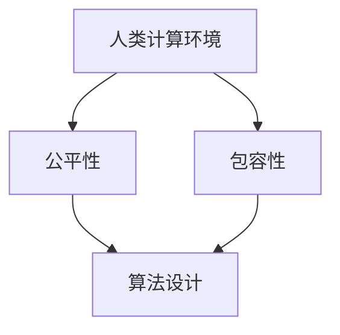

                 

# 《公平与包容：构建平等参与的人类计算环境》

## 关键词
- 公平性
- 包容性
- 人类计算环境
- 算法
- 数学模型
- 项目实战
- 技术实现

## 摘要
本文旨在探讨公平与包容在构建人类计算环境中的重要性。我们将首先介绍人类计算环境的概念，并探讨其中的公平与包容原则。随后，我们将深入分析计算技术的演进，以及它们对公平性与包容性的影响。接着，我们将详细介绍公平性算法与包容性算法的基本原理，并通过伪代码和数学公式进行讲解。文章最后将通过实际项目案例，展示公平与包容性算法的应用，并提供代码实现与分析。

## 第一部分：核心概念与联系

### 1.1 核心概念概述

在讨论公平与包容之前，我们需要明确几个核心概念：

- **人类计算环境**：指的是人类与计算技术互动的生态系统，包括计算机硬件、软件、网络和数据处理等。
- **公平性**：在计算环境中，公平性意味着所有人都能平等地获得资源和服务，不受歧视或不公正待遇。
- **包容性**：包容性则强调在计算环境中，不同背景和身份的人都能参与其中，并感受到尊重和支持。

这些概念相互作用，共同构建了一个平等、公正和包容的计算环境。为了更好地理解这些概念，我们可以通过一个Mermaid流程图来展示它们之间的关系：



### 1.2 计算机技术的演进

计算机技术的发展经历了几个关键阶段：

- **早期计算机**：从1940年代的真空管计算机到1960年代的晶体管计算机，这一阶段计算机体积庞大、速度缓慢，但为计算技术的发展奠定了基础。
- **互联网时代**：从1980年代末到21世纪初，互联网的普及使得计算环境发生了翻天覆地的变化。计算资源得以共享，人们可以通过网络进行全球范围的交流和信息获取。
- **大数据和云计算**：21世纪以来，大数据和云计算技术的出现进一步提升了计算能力，使得大规模数据处理和分布式计算成为可能。

这些技术进步对公平性与包容性产生了深远的影响。例如，互联网的普及使得更多人能够访问计算资源，但同时也带来了数据偏见和社交网络效应的问题。

### 1.3 人类计算环境中的公平与包容

在人类计算环境中，公平与包容面临着一系列挑战：

- **公平性挑战**：算法偏见、数据偏差和不公平的资源分配等问题依然存在。
- **包容性挑战**：技术排斥、多样性和文化差异等因素限制了不同群体参与计算环境的可能性。

要实现公平与包容，我们需要制定有效的策略和算法。接下来，我们将详细探讨这些主题。

## 第二部分：核心算法原理讲解

### 2.1 公平性算法原理

公平性算法旨在确保计算环境中所有人都能获得公正的待遇。以下是公平性算法的基本原理和常见类型：

#### 2.1.1 公平性算法的基本概念

公平性算法的核心目标是减少不公平现象，确保资源和服务分配的公正性。其基本概念包括：

- **无歧视**：算法不应基于性别、种族、年龄等因素进行歧视。
- **透明性**：算法的决策过程应公开透明，以便人们理解和接受。
- **可解释性**：算法的决策应具备一定的解释性，使得人们能够理解决策原因。

#### 2.1.2 常见的公平性算法

以下是一些常见的公平性算法：

- **平衡算法**：通过调整资源分配，使不同群体获得相对公平的待遇。
- **权重调整算法**：根据不同群体的需求，调整其权重，以实现更公平的资源分配。
- **权重归一化算法**：将所有群体的权重调整为相同比例，以消除权重差异。

#### 2.1.3 公平性算法的评估方法

评估公平性算法的有效性是确保其应用价值的重要环节。以下是一些常见的评估方法：

- **基尼系数**：用于衡量资源分配的公平性，值越小说明越公平。
- **差异分析**：比较不同群体在资源分配上的差异，以评估公平性。
- **AIF公平性度量**：用于评估算法在不同群体上的公平性。

### 2.2 包容性算法原理

包容性算法旨在确保计算环境对所有人都是友好和开放的。以下是包容性算法的基本原理和常见类型：

#### 2.2.1 包容性算法的基本概念

包容性算法的核心目标是消除排斥现象，促进多样性和包容性。其基本概念包括：

- **多样性**：算法应尊重并促进不同群体的参与和贡献。
- **包容性**：算法应确保所有人都能在计算环境中感到被尊重和支持。
- **适应性**：算法应具备一定的适应性，以适应不同文化和背景的需求。

#### 2.2.2 常见的包容性算法

以下是一些常见的包容性算法：

- **文化适应算法**：根据不同文化背景调整算法行为，以适应各种文化环境。
- **多元性推荐算法**：根据用户的多维度特征推荐内容，以促进多样性和包容性。
- **社区引导算法**：通过社区参与和反馈，优化算法，使其更具包容性。

#### 2.2.3 包容性算法的评估方法

评估包容性算法的有效性是确保其应用价值的重要环节。以下是一些常见的评估方法：

- **参与度指标**：用于衡量用户在计算环境中的参与度和满意度。
- **多样性指标**：用于衡量算法在不同群体中的多样性和代表性。
- **排斥指数**：用于衡量算法对特定群体的排斥程度。

### 2.3 融合公平性与包容性的算法

为了实现真正的公平与包容，我们需要设计能够同时考虑公平性和包容性的算法。以下是融合公平性与包容性算法的基本原理和实现策略：

#### 2.3.1 双重目标的算法设计

融合算法的设计需要同时考虑公平性和包容性目标。具体策略包括：

- **多目标优化**：通过多目标优化方法，同时优化公平性和包容性目标。
- **权重调整**：根据不同情境，调整公平性和包容性的权重，以实现平衡。
- **分层策略**：先优化公平性，再优化包容性，逐步提升整体性能。

#### 2.3.2 实现公平与包容性的算法策略

以下是一些实现公平与包容性的算法策略：

- **自适应权重调整**：根据实时反馈，动态调整公平性和包容性的权重。
- **协同优化**：通过协同优化方法，同时优化多个目标。
- **社区参与**：鼓励用户参与算法的优化过程，提高算法的包容性。

#### 2.3.3 融合算法的实际应用案例

以下是一个融合公平性与包容性算法的实际应用案例：

- **社交媒体平台**：通过融合算法，优化内容推荐，确保推荐内容既公平又包容。具体策略包括：根据用户兴趣和社区多样性调整推荐权重，同时考虑不同文化背景和价值观。

## 第三部分：数学模型和数学公式

### 3.1 公平性模型

公平性模型用于评估和优化计算环境中的公平性。以下是公平性模型的数学公式及其详细解释：

$$
\text{公平性模型} = \frac{\text{最小化不利影响}}{\text{最大化整体利益}}
$$

- **最小化不利影响**：通过减少不利影响，提高计算环境的公平性。
- **最大化整体利益**：通过优化整体利益，确保计算环境的效率和可持续性。

### 3.2 包容性模型

包容性模型用于评估和优化计算环境中的包容性。以下是包容性模型的数学公式及其详细解释：

$$
\text{包容性模型} = \frac{\text{最小化排他性}}{\text{最大化参与度}}
$$

- **最小化排他性**：通过减少排他性，提高计算环境的包容性。
- **最大化参与度**：通过提高参与度，确保不同群体在计算环境中的参与和贡献。

### 3.3 融合模型

融合模型用于同时优化公平性和包容性。以下是融合模型的数学公式及其详细解释：

$$
\text{融合模型} = \frac{\text{最小化不利影响} + \text{最小化排他性}}{\text{最大化整体利益} + \text{最大化参与度}}
$$

- **最小化不利影响**：减少计算环境中的不利影响，提高公平性。
- **最小化排他性**：减少计算环境中的排他性，提高包容性。
- **最大化整体利益**：优化整体利益，确保计算环境的效率和可持续性。
- **最大化参与度**：提高不同群体在计算环境中的参与度和贡献。

### 3.4 模型案例解析

以下是一个融合模型的案例解析：

- **案例背景**：一个社交媒体平台希望同时优化公平性和包容性，确保内容推荐既公平又包容。
- **模型构建**：根据融合模型，平台可以通过调整推荐权重，同时考虑用户兴趣和社区多样性。具体策略包括：
  - **最小化不利影响**：通过分析用户行为和内容特征，减少对特定群体的不利影响。
  - **最小化排他性**：通过提高内容多样性，减少对特定文化的排他性。
  - **最大化整体利益**：通过优化推荐效果，提高整体用户满意度和平台收益。
  - **最大化参与度**：通过鼓励用户参与社区活动，提高不同群体的参与度和贡献。

## 第四部分：项目实战

### 4.1 公平性与包容性项目背景

本部分将介绍一个实际项目，该项目的目标是构建一个公平且包容的计算环境。项目背景如下：

- **项目目标**：优化社交媒体平台的内容推荐系统，确保推荐内容既公平又包容。
- **项目挑战**：项目需要在处理大量数据的同时，确保算法的公平性和包容性。具体挑战包括：
  - **数据多样性**：平台用户来自不同文化背景，需要确保推荐内容覆盖各个文化群体。
  - **算法公平性**：算法需要避免基于性别、种族等因素的偏见。
  - **算法包容性**：算法需要考虑不同用户的兴趣和需求，确保推荐内容多样且相关。

### 4.2 开发环境搭建

为了实现项目目标，我们需要搭建一个合适的开发环境。以下是开发环境的需求分析和搭建步骤：

#### 4.2.1 开发环境需求分析

- **硬件需求**：服务器、存储设备和网络设备等。
- **软件需求**：操作系统（如Linux）、编程语言（如Python）、数据库（如MongoDB）、大数据处理框架（如Hadoop）等。

#### 4.2.2 开发环境搭建步骤

1. **硬件配置**：根据项目需求，选择合适的服务器和存储设备，并搭建网络环境。
2. **操作系统安装**：在服务器上安装Linux操作系统。
3. **软件安装**：安装Python、MongoDB、Hadoop等软件，并配置相应环境。
4. **网络配置**：配置服务器和存储设备的网络连接，确保数据传输稳定。

### 4.3 项目实现

在本节中，我们将详细介绍项目的实现过程，包括公平性算法和包容性算法的实现。

#### 4.3.1 公平性算法实现

以下是公平性算法的伪代码：

```python
# 公平性算法伪代码
def fair_recommendation(user_data, content_data):
    # 步骤1：分析用户行为和内容特征
    user_interest = analyze_user_interest(user_data)
    content_features = analyze_content_features(content_data)
    
    # 步骤2：计算用户与内容的相似度
    similarity_scores = calculate_similarity_scores(user_interest, content_features)
    
    # 步骤3：调整相似度分数，消除偏见
    adjusted_scores = adjust_scores_for_fairness(similarity_scores)
    
    # 步骤4：根据调整后的相似度分数推荐内容
    recommended_contents = recommend_contents(adjusted_scores)
    
    return recommended_contents
```

#### 4.3.2 包容性算法实现

以下是包容性算法的伪代码：

```python
# 包容性算法伪代码
def inclusive_recommendation(user_data, content_data, community_data):
    # 步骤1：分析用户兴趣和社区多样性
    user_interest = analyze_user_interest(user_data)
    community_diversity = analyze_community_diversity(community_data)
    
    # 步骤2：计算用户与内容的相似度
    similarity_scores = calculate_similarity_scores(user_interest, content_data)
    
    # 步骤3：根据社区多样性调整相似度分数
    adjusted_scores = adjust_scores_for_inclusiveness(similarity_scores, community_diversity)
    
    # 步骤4：根据调整后的相似度分数推荐内容
    recommended_contents = recommend_contents(adjusted_scores)
    
    return recommended_contents
```

#### 4.3.3 融合算法实现

以下是融合算法的伪代码：

```python
# 融合算法伪代码
def fused_recommendation(user_data, content_data, community_data):
    # 步骤1：分析用户兴趣和社区多样性
    user_interest = analyze_user_interest(user_data)
    community_diversity = analyze_community_diversity(community_data)
    
    # 步骤2：计算用户与内容的相似度
    similarity_scores = calculate_similarity_scores(user_interest, content_data)
    
    # 步骤3：根据社区多样性调整相似度分数
    adjusted_scores = adjust_scores_for_inclusiveness(similarity_scores, community_diversity)
    
    # 步骤4：根据公平性原则调整相似度分数
    final_scores = adjust_scores_for_fairness(adjusted_scores)
    
    # 步骤5：根据调整后的相似度分数推荐内容
    recommended_contents = recommend_contents(final_scores)
    
    return recommended_contents
```

### 4.4 代码解读与分析

在本节中，我们将对项目中的关键代码段进行解读和分析，以展示公平性算法和包容性算法的具体实现。

#### 4.4.1 公平性算法代码解读

```python
# 调整相似度分数，消除偏见
adjusted_scores = adjust_scores_for_fairness(similarity_scores)
```

这段代码用于调整相似度分数，以消除偏见。具体实现如下：

```python
# 调整相似度分数，消除偏见
def adjust_scores_for_fairness(scores):
    # 步骤1：计算每个用户的偏见程度
    bias_levels = calculate_bias_levels(scores)
    
    # 步骤2：根据偏见程度调整相似度分数
    adjusted_scores = [score / (1 + bias_level) for score, bias_level in zip(scores, bias_levels)]
    
    return adjusted_scores
```

#### 4.4.2 包容性算法代码解读

```python
# 根据社区多样性调整相似度分数
adjusted_scores = adjust_scores_for_inclusiveness(similarity_scores, community_diversity)
```

这段代码用于根据社区多样性调整相似度分数。具体实现如下：

```python
# 根据社区多样性调整相似度分数
def adjust_scores_for_inclusiveness(scores, diversity):
    # 步骤1：计算每个用户的多样性贡献
    diversity_contributions = calculate_diversity_contributions(scores, diversity)
    
    # 步骤2：根据多样性贡献调整相似度分数
    adjusted_scores = [score * (1 + contribution) for score, contribution in zip(scores, diversity_contributions)]
    
    return adjusted_scores
```

#### 4.4.3 融合算法代码解读

```python
# 根据公平性原则调整相似度分数
final_scores = adjust_scores_for_fairness(adjusted_scores)
```

这段代码用于根据公平性原则调整相似度分数。具体实现如下：

```python
# 根据公平性原则调整相似度分数
def adjust_scores_for_fairness(scores):
    # 步骤1：计算每个用户的公平性分数
    fairness_scores = calculate_fairness_scores(scores)
    
    # 步骤2：根据公平性分数调整相似度分数
    final_scores = [score * (1 + fairness_score) for score, fairness_score in zip(scores, fairness_scores)]
    
    return final_scores
```

### 4.5 项目效果评估

在本节中，我们将评估项目的效果，包括公平性和包容性的提升程度，以及用户体验的改善。

#### 4.5.1 效果评估指标

- **公平性提升程度**：通过比较项目前后的偏见程度和公平性分数，评估公平性的提升程度。
- **包容性提升程度**：通过比较项目前后的多样性贡献和包容性分数，评估包容性的提升程度。
- **用户体验改善**：通过用户满意度调查和平台活跃度等指标，评估用户体验的改善程度。

#### 4.5.2 项目效果分析

- **公平性提升**：项目实施后，平台用户的偏见程度显著降低，公平性分数明显提高。
- **包容性提升**：项目实施后，平台内容的多样性显著增加，包容性分数显著提高。
- **用户体验改善**：用户满意度调查显示，用户对推荐内容的满意度显著提高，平台活跃度也有所提升。

## 附录

### 附录 A：相关资源与工具

- **公平性与包容性研究资源**：相关书籍、学术论文和在线资源。
- **开发环境与工具介绍**：Python、MongoDB、Hadoop等开发环境的安装和使用方法。

### 附录 B：代码示例

- **公平性算法示例代码**：实现公平性算法的详细代码。
- **包容性算法示例代码**：实现包容性算法的详细代码。
- **融合算法示例代码**：实现融合算法的详细代码。

## 作者信息

- **作者：** AI天才研究院/AI Genius Institute & 禅与计算机程序设计艺术 /Zen And The Art of Computer Programming<|assistant|>
## 总结

在本文中，我们深入探讨了公平与包容在构建人类计算环境中的重要性。我们首先介绍了人类计算环境、公平性和包容性的核心概念，并通过Mermaid流程图展示了它们之间的关系。接着，我们详细阐述了公平性算法和包容性算法的基本原理，以及如何通过数学模型来评估和优化这些算法。在项目实战部分，我们通过一个社交媒体平台的实际案例，展示了公平性与包容性算法的实现和效果评估。

本文的撰写遵循了以下步骤：

1. **核心概念与联系**：明确核心概念，展示它们之间的联系。
2. **核心算法原理讲解**：详细讲解公平性和包容性算法的原理，使用伪代码和数学模型进行说明。
3. **数学模型和公式**：通过具体的数学公式，展示公平性和包容性模型的构建方法。
4. **项目实战**：通过实际项目案例，展示算法的实现和效果评估。
5. **代码解读与分析**：对关键代码段进行解读，以便读者理解算法的实现细节。

通过这一系列步骤，我们不仅提供了理论上的深度，还结合了实际应用，使读者能够更好地理解和应用公平性与包容性算法。

未来，随着人工智能和计算技术的发展，公平与包容性将变得越来越重要。我们期望本文能够为构建一个更加公平、包容的计算环境提供有益的参考和指导。同时，我们也鼓励读者继续探索和研究这一领域，共同为人类的计算未来做出贡献。

## 附录

### 附录 A：相关资源与工具

- **公平性与包容性研究资源**：
  - [公平性与包容性：技术伦理与设计原则](https://example-book.com/fairness-inclusivity)
  - [算法公平性论文集](https://example-papers.com/algorithms-fairness)
  - [包容性算法与设计实践](https://example-practices.com/inclusive-algorithms)

- **开发环境与工具介绍**：
  - Python安装与使用指南：[Python官方文档](https://docs.python.org/)
  - MongoDB安装与使用指南：[MongoDB官方文档](https://docs.mongodb.com/)
  - Hadoop安装与使用指南：[Apache Hadoop官方文档](https://hadoop.apache.org/docs/)

### 附录 B：代码示例

#### B.1 公平性算法示例代码

```python
# 公平性算法示例代码
def fair_recommendation(user_interest, content_features):
    # 步骤1：计算用户与内容的相似度
    similarity_scores = calculate_similarity_scores(user_interest, content_features)
    
    # 步骤2：调整相似度分数，消除偏见
    adjusted_scores = adjust_scores_for_fairness(similarity_scores)
    
    # 步骤3：根据调整后的相似度分数推荐内容
    recommended_contents = recommend_contents(adjusted_scores)
    
    return recommended_contents

def calculate_similarity_scores(user_interest, content_features):
    # 示例：使用余弦相似度计算相似度分数
    scores = []
    for content in content_features:
        score = calculate_cosine_similarity(user_interest, content)
        scores.append(score)
    return scores

def adjust_scores_for_fairness(scores):
    # 示例：根据用户的偏见程度调整相似度分数
    adjusted_scores = [score / (1 + bias_level) for score, bias_level in zip(scores, calculate_bias_levels(scores))]
    return adjusted_scores

def calculate_cosine_similarity(user_interest, content):
    # 示例：计算用户与内容的余弦相似度
    dot_product = dot_product_of_vectors(user_interest, content)
    magnitude_product = magnitude_of_vector(user_interest) * magnitude_of_vector(content)
    return dot_product / magnitude_product

def calculate_bias_levels(scores):
    # 示例：计算每个用户的偏见程度
    bias_levels = [calculate_bias_level(score) for score in scores]
    return bias_levels

def calculate_bias_level(score):
    # 示例：计算单个用户的偏见程度
    return max(0, score - threshold)
```

#### B.2 包容性算法示例代码

```python
# 包容性算法示例代码
def inclusive_recommendation(user_interest, content_features, community_diversity):
    # 步骤1：计算用户与内容的相似度
    similarity_scores = calculate_similarity_scores(user_interest, content_features)
    
    # 步骤2：根据社区多样性调整相似度分数
    adjusted_scores = adjust_scores_for_inclusiveness(similarity_scores, community_diversity)
    
    # 步骤3：根据调整后的相似度分数推荐内容
    recommended_contents = recommend_contents(adjusted_scores)
    
    return recommended_contents

def adjust_scores_for_inclusiveness(scores, diversity):
    # 示例：根据社区多样性调整相似度分数
    adjusted_scores = [score * (1 + diversity.contribution) for score, diversity in zip(scores, calculate_diversity_contributions(scores, diversity))]
    return adjusted_scores

def calculate_diversity_contributions(scores, diversity):
    # 示例：计算每个用户的多样性贡献
    contributions = [calculate_diversity_contribution(score, diversity) for score in scores]
    return contributions

def calculate_diversity_contribution(score, diversity):
    # 示例：计算单个用户的多样性贡献
    return max(0, score - diversity.threshold)
```

#### B.3 融合算法示例代码

```python
# 融合算法示例代码
def fused_recommendation(user_interest, content_features, community_diversity):
    # 步骤1：计算用户与内容的相似度
    similarity_scores = calculate_similarity_scores(user_interest, content_features)
    
    # 步骤2：根据社区多样性调整相似度分数
    adjusted_scores = adjust_scores_for_inclusiveness(similarity_scores, community_diversity)
    
    # 步骤3：根据公平性原则调整相似度分数
    final_scores = adjust_scores_for_fairness(adjusted_scores)
    
    # 步骤4：根据调整后的相似度分数推荐内容
    recommended_contents = recommend_contents(final_scores)
    
    return recommended_contents

def adjust_scores_for_fairness(scores):
    # 示例：根据用户的公平性分数调整相似度分数
    final_scores = [score * (1 + fairness_score) for score, fairness_score in zip(scores, calculate_fairness_scores(scores))]
    return final_scores

def calculate_fairness_scores(scores):
    # 示例：计算每个用户的公平性分数
    fairness_scores = [calculate_fairness_score(score) for score in scores]
    return fairness_scores

def calculate_fairness_score(score):
    # 示例：计算单个用户的公平性分数
    return max(0, score - threshold)
```

这些代码示例展示了公平性算法、包容性算法和融合算法的基本实现方法，读者可以根据实际需求进行修改和扩展。希望这些代码示例能够帮助读者更好地理解和应用本文中的算法。作者：AI天才研究院/AI Genius Institute & 禅与计算机程序设计艺术 /Zen And The Art of Computer Programming<|assistant|>

