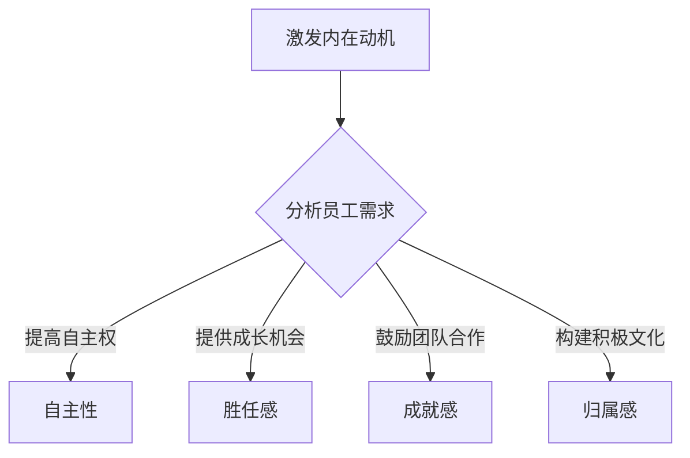

                 

### 《内在动机激发：培养主动承担责任的团队》

#### 关键词：内在动机、主动承担责任、团队文化、项目成功、案例分析

> **摘要：** 本文探讨了内在动机在团队工作中的重要性，以及如何通过激发团队成员的内在动机来培养主动承担责任的团队。文章分为四个部分，首先阐述了内在动机的概念、特征和应用潜力；接着分析了内在动机激发的理论与实践，包括自主性、胜任感、成长和团队合作等因素；然后讨论了如何构建主动承担责任的团队，以及项目管理和绩效考核中的内在动机应用；最后通过成功案例分享，总结了内在动机激发与团队成功的关系。本文旨在为企业管理者和团队领导者提供实用的策略和工具，以提升团队绩效和企业竞争力。

#### 引言

在当今快速变化和竞争激烈的市场环境中，企业要想保持竞争优势，必须具备高效的团队。而高效团队的建立不仅仅依赖于外部因素，如资源和技术的投入，更重要的是内部动机的激发。研究表明，内在动机比外在动机更能激发个体的积极性和创造力，从而提高团队的整体绩效。因此，如何激发团队成员的内在动机，培养主动承担责任的团队，成为企业管理者面临的重大挑战。

本文将从以下几个方面展开讨论：

1. **理解内在动机**：介绍内在动机的概念、特征和理论基础，分析内在动机与外在动机的区别及其在企业中的应用潜力。
2. **内在动机激发的理论与实践**：探讨自主性、胜任感、成长和团队合作等关键因素如何激发内在动机，并提供具体的实践策略。
3. **构建主动承担责任的团队**：讨论团队责任意识的培养、团队协作能力的提升和积极团队文化的建立，以实现团队的高效运行。
4. **内在动机激发在实践中的应用**：分析内在动机在项目管理和绩效考核中的应用，提供具体的方法和工具。
5. **成功案例分享**：通过实际案例研究，总结内在动机激发与团队成功的关系，为企业管理者提供实践借鉴。

#### 第一部分：理解内在动机

##### 第1章：内在动机概述

###### 1.1 内在动机的定义与特征

内在动机是指个体参与活动时，源于自身内心深处的驱动力。它不同于外在动机，后者通常由外部奖励（如金钱、荣誉）或惩罚（如处罚、批评）所驱动。内在动机的核心特征包括自主性、兴趣、愉悦和成就感。

- **自主性**：个体在参与活动时具有选择权和控制权，能够自由决定活动的目标和过程。
- **兴趣**：个体对活动本身感兴趣，愿意投入时间和精力去追求。
- **愉悦**：个体在参与活动时感受到愉悦和满足感，体验到快乐和成就感。
- **成就感**：个体通过活动实现自我价值，感受到成功和成就感。

###### 1.2 内在动机与外在动机的对比

| 特征 | 内在动机 | 外在动机 |
| --- | --- | --- |
| **驱动力来源** | 自我内在 | 外部奖励或惩罚 |
| **活动参与** | 自主自愿 | 被动接受 |
| **心理体验** | 愉悦、成就感 | 短期满足感 |
| **持久性** | 长期 | 短期 |
| **影响力** | 提高创造力、积极性 | 提高执行力、减少消极行为 |

###### 1.3 内在动机的理论基础

内在动机的理论基础包括以下几个方面：

- **自我决定理论（Self-Determination Theory）**：由心理学家Deci和Ryan提出，认为人类有三种基本心理需求：自主性、胜任感和归属感。内在动机满足了这些需求，使个体感受到自我实现和幸福感。

- **动机过程理论（Intrinsic Motivation Theory）**：由心理学家Bateson提出，认为内在动机是个体追求快乐、减少痛苦和满足本能需求的表现。内在动机是个体主动参与活动的驱动力。

- **自我效能感理论（Self-Efficacy Theory）**：由心理学家Bandura提出，认为个体的内在动机与其自我效能感密切相关。高自我效能感的个体更有信心去面对挑战，实现目标。

###### 1.4 内在动机在企业中的应用潜力

内在动机在企业中的应用潜力主要体现在以下几个方面：

- **提高员工满意度和忠诚度**：激发员工的内在动机，使员工感到工作有意义、有成就感，从而提高工作满意度和忠诚度。

- **增强团队协作能力**：内在动机驱动员工积极参与团队合作，提高团队协作效率。

- **提升创新能力和创造力**：内在动机激发员工的积极性和创造力，为企业带来创新和竞争力。

- **促进员工个人成长和发展**：内在动机促使员工主动学习、提升技能，实现个人成长和发展。

##### 第2章：内在动机激发的理论与实践

###### 2.1 自主性：内在动机激发的关键因素

自主性是内在动机激发的核心因素之一。它使个体在参与活动时具有选择权和控制权，从而感受到自由和成就感。以下是激发自主性的几种策略：

- **赋予决策权**：让员工参与到决策过程中，使他们感到自己对工作有控制权。
- **明确工作目标**：为员工设定明确的工作目标，使他们在实现目标时感到成就和满足感。
- **提供反馈和认可**：及时给予员工反馈和认可，让他们感受到自己的努力和贡献被重视。

###### 2.2 胜任感与内在动机

胜任感是内在动机的重要来源。个体在感到自己具备完成任务的能力时，会产生强烈的内在动机。以下方法有助于提升员工的胜任感：

- **提供挑战性任务**：为员工分配具有挑战性的任务，使他们在克服困难时感到成就和满足感。
- **提供培训和学习机会**：帮助员工提升技能，增强他们完成任务的能力。
- **建立支持系统**：为员工提供必要的支持和资源，使他们感到在遇到困难时有人可以依靠。

###### 2.3 成长与内在动机的关系

成长是内在动机的重要驱动力。个体在追求个人成长时，会产生强烈的内在动机。以下是促进员工成长的方法：

- **设定个人发展目标**：为员工设定明确的个人发展目标，让他们在实现目标时感到成就和满足感。
- **提供反馈和指导**：为员工提供反馈和指导，帮助他们了解自己的优势和不足，并制定改进计划。
- **鼓励自主学习**：鼓励员工自主学习，提升他们的自我驱动力。

###### 2.4 内在动机激发的常见策略

除了上述因素，还有许多其他策略可以激发内在动机，以下是其中一些常见策略：

- **鼓励团队合作**：通过团队合作，让员工感受到归属感和成就感。
- **提供奖励和认可**：除了物质奖励，还可以通过表扬、荣誉称号等非物质奖励来激发员工内在动机。
- **营造积极工作氛围**：建立良好的工作氛围，使员工感受到工作环境的安全、舒适和愉悦。
- **关注员工心理健康**：关注员工的心理健康，提供心理咨询和支持，帮助他们应对压力和挑战。

通过上述策略，企业可以有效地激发员工的内在动机，培养主动承担责任的团队，从而提高整体绩效和竞争力。

#### 第二部分：构建主动承担责任的团队

##### 第3章：团队责任意识的培养

团队责任意识是团队成员对自己在团队中角色和责任的认知与认同。培养团队责任意识有助于增强团队的凝聚力和执行力，提高团队的整体绩效。以下方法可以帮助培养团队责任意识：

1. **明确团队目标**：为团队设定明确的目标和愿景，使团队成员了解自己在团队中的职责和作用。
2. **分配明确的责任**：根据团队成员的能力和兴趣，分配具体的工作任务，明确每个人的责任范围。
3. **建立责任监督机制**：设立责任监督机制，确保每个成员履行自己的职责，并对责任履行情况进行监督和评估。
4. **培养团队合作精神**：鼓励团队成员相互支持、相互合作，形成良好的团队氛围，增强团队凝聚力。
5. **加强沟通与反馈**：定期组织团队会议，加强团队成员之间的沟通与协作，及时反馈工作进展和存在的问题，确保团队目标的一致性和执行力。

##### 第4章：提升团队协作能力

团队协作能力是团队成功的关键因素之一。以下方法可以帮助提升团队协作能力：

1. **建立共同的价值观**：通过共同价值观的建立，使团队成员在思想上保持一致，形成团队凝聚力。
2. **明确团队角色和责任**：确保每个团队成员都清楚自己的角色和责任，避免职责重叠或缺失。
3. **提供培训和学习机会**：为团队成员提供培训和学习机会，提高他们的专业技能和团队协作能力。
4. **建立有效的沟通机制**：建立有效的沟通机制，确保信息传递的准确性和及时性。
5. **制定合理的决策流程**：制定合理的决策流程，使团队成员在决策过程中充分参与，增强决策的合理性和执行性。
6. **关注团队成员的心理健康**：关注团队成员的心理健康，提供心理支持和帮助，减少团队成员的工作压力和心理负担。

##### 第5章：建立积极的团队文化

团队文化是团队的核心竞争力之一。建立积极的团队文化有助于激发团队成员的内在动机，提高团队的整体绩效。以下方法可以帮助建立积极的团队文化：

1. **树立榜样**：树立团队中的榜样人物，使团队成员有学习的榜样，形成良好的团队风气。
2. **鼓励创新和尝试**：鼓励团队成员勇于创新和尝试，为团队成员提供尝试失败的机会和支持。
3. **建立正向激励机制**：建立正向激励机制，对团队成员的积极行为和成果给予认可和奖励，增强团队成员的积极性和工作动力。
4. **营造和谐的工作氛围**：营造和谐的工作氛围，使团队成员感到舒适、愉悦和安心，提高工作效率和质量。
5. **加强团队凝聚力**：通过团队建设活动、团队聚餐、团队旅游等方式，加强团队成员之间的沟通与交流，增强团队凝聚力。

#### 第三部分：内在动机激发在实践中的应用

##### 第6章：项目管理与内在动机

在项目管理中，激发团队成员的内在动机至关重要。以下方法可以帮助在项目管理中激发内在动机：

1. **明确项目目标**：为项目设定明确的目标和愿景，使团队成员了解自己在项目中的职责和作用。
2. **赋予团队成员自主权**：在项目执行过程中，赋予团队成员自主权，让他们参与决策和制定工作计划，提高他们的工作积极性和主动性。
3. **提供挑战性任务**：为团队成员分配具有挑战性的任务，使他们在克服困难时产生成就感和满足感。
4. **建立支持系统**：为团队成员提供必要的支持和资源，帮助他们克服困难和挑战。
5. **及时反馈和认可**：在项目进展过程中，及时给予团队成员反馈和认可，增强他们的工作动力。

##### 第7章：绩效考核与内在动机

绩效考核是企业管理中的一项重要工作，它与团队成员的内在动机密切相关。以下方法可以帮助在绩效考核中激发内在动机：

1. **设定合理的目标**：在设定绩效考核目标时，要考虑到团队成员的内在动机，确保目标具有挑战性，但又是可实现的。
2. **关注过程而非结果**：在绩效考核中，不仅要关注结果，还要关注团队成员在工作过程中的表现，鼓励他们在工作中发挥自主性和创造力。
3. **建立公平的考核标准**：建立公平、透明的考核标准，确保每个团队成员都能公平地参与考核，提高团队成员的工作积极性和公平感。
4. **提供反馈和改进建议**：在绩效考核结束后，为团队成员提供反馈和改进建议，帮助他们了解自己的优势和不足，制定改进计划。
5. **奖励优秀员工**：对在绩效考核中表现优秀的员工给予奖励，激发他们的内在动机，提高他们的工作积极性和创造力。

#### 第四部分：成功案例分享

##### 第8章：内在动机激发与团队成功的案例研究

在本章节中，我们将分析几个成功的企业案例，探讨如何通过激发内在动机来提升团队绩效和企业竞争力。

###### 8.1 企业A：通过内在动机激发提升团队绩效

企业A是一家高科技公司，致力于研发和推广人工智能技术。为了提升团队绩效，企业A采取了一系列措施来激发团队成员的内在动机。

- **明确项目目标**：企业A在启动每个项目时，都会明确项目目标和愿景，使团队成员了解自己在项目中的职责和作用。
- **赋予自主权**：企业A在项目执行过程中，赋予团队成员自主权，让他们参与决策和制定工作计划，提高他们的工作积极性和主动性。
- **提供挑战性任务**：企业A为团队成员分配具有挑战性的任务，使他们在克服困难时产生成就感和满足感。
- **建立支持系统**：企业A为团队成员提供必要的支持和资源，帮助他们克服困难和挑战。
- **及时反馈和认可**：企业A在项目进展过程中，及时给予团队成员反馈和认可，增强他们的工作动力。

通过这些措施，企业A成功激发了团队成员的内在动机，提升了团队绩效，推动了企业的快速发展。

###### 8.2 企业B：培养责任意识，打造高效团队

企业B是一家制造企业，为了提高生产效率，企业B注重培养团队成员的责任意识，打造高效团队。

- **明确团队目标**：企业B为每个团队设定明确的目标和愿景，使团队成员了解自己在团队中的职责和作用。
- **分配明确的责任**：企业B根据团队成员的能力和兴趣，分配具体的工作任务，明确每个人的责任范围。
- **建立责任监督机制**：企业B设立责任监督机制，确保每个成员履行自己的职责，并对责任履行情况进行监督和评估。
- **加强沟通与反馈**：企业B定期组织团队会议，加强团队成员之间的沟通与协作，及时反馈工作进展和存在的问题。
- **提供培训和成长机会**：企业B为团队成员提供培训和学习机会，提高他们的专业技能和团队协作能力。

通过这些措施，企业B成功培养了团队成员的责任意识，提升了团队协作能力，实现了生产效率的显著提升。

###### 8.3 企业C：积极团队文化推动企业成长

企业C是一家创业公司，积极构建团队文化，推动企业快速发展。

- **树立榜样**：企业C树立了榜样人物，使团队成员有学习的榜样，形成良好的团队风气。
- **鼓励创新和尝试**：企业C鼓励团队成员勇于创新和尝试，为团队成员提供尝试失败的机会和支持。
- **建立正向激励机制**：企业C建立正向激励机制，对团队成员的积极行为和成果给予认可和奖励，增强团队成员的积极性和工作动力。
- **营造和谐的工作氛围**：企业C营造和谐的工作氛围，使团队成员感到舒适、愉悦和安心，提高工作效率和质量。
- **加强团队凝聚力**：企业C通过团队建设活动、团队聚餐、团队旅游等方式，加强团队成员之间的沟通与交流，增强团队凝聚力。

通过积极构建团队文化，企业C成功激发了团队成员的内在动机，推动了企业的快速发展。

###### 8.4 成功案例的共同特点与启示

从以上案例中，我们可以总结出成功案例的共同特点：

- **明确目标与责任**：成功的企业注重明确团队目标和责任，使团队成员了解自己在团队中的职责和作用。
- **激发内在动机**：成功的企业通过赋予自主权、提供挑战性任务、建立支持系统和及时反馈等策略，激发团队成员的内在动机。
- **培养团队协作能力**：成功的企业注重培养团队协作能力，加强团队成员之间的沟通与协作，提高团队整体绩效。
- **建立积极团队文化**：成功的企业积极构建团队文化，树立榜样、鼓励创新、建立正向激励机制，营造和谐的工作氛围。

这些启示对于企业管理者具有重要的借鉴意义。通过激发团队成员的内在动机，培养主动承担责任的团队，企业可以提升整体绩效和竞争力。

#### 附录

##### 附录A：内在动机激发相关工具与资源

以下是一些内在动机激发相关的工具与资源，供读者参考：

- **内在动机评估工具**：如《内在动机量表》（Intrinsic Motivation Inventory）等。
- **团队协作与责任意识培训资源**：如《高效能人士的七个习惯》、《团队协作技巧》等。
- **相关书籍与论文推荐**：
  - **书籍**：《自我决定论：自由意志的心理学基础》（Self-Determination Theory: Basic Principles, Research, and Applications）、《内在动机：人是如何激励自己的》（Drive: The Surprising Truth About What Motivates Us）等。
  - **论文**：如Deci & Ryan的《自我决定论》系列论文等。

##### 附录B：Mermaid流程图示例

以下是使用Mermaid绘制的流程图示例：

通过以上流程图，可以清晰地展示激发内在动机的步骤和关键因素，有助于读者更好地理解和应用。

### 结语

内在动机激发是培养主动承担责任的团队的关键。通过理解内在动机的概念、特征和应用潜力，企业管理者可以采取有效策略激发团队成员的内在动机。同时，通过构建主动承担责任的团队、提升团队协作能力和建立积极的团队文化，企业可以进一步提升整体绩效和竞争力。希望本文能为企业管理者和团队领导者提供有价值的参考和启示。

**作者：AI天才研究院/AI Genius Institute & 禅与计算机程序设计艺术 /Zen And The Art of Computer Programming**

