                 

### 《冗余设计在高可用性中的实例应用》

> **关键词：** 冗余设计、高可用性、分布式系统、云计算、网络安全、物联网、实例分析

> **摘要：** 本文章深入探讨了冗余设计在高可用性中的关键作用，通过实例分析展示了冗余设计在不同IT领域中的应用。文章首先介绍了冗余设计的基础概念与原理，然后分别探讨了冗余设计在分布式系统、云计算、网络安全和物联网中的应用，最后通过实际案例展示了冗余设计的实践效果。

----------------------------------------------------------------

## 第一部分：冗余设计基础

### 第1章：冗余设计的概念与重要性

#### 1.1 冗余设计的定义

冗余设计是一种通过增加系统中的冗余元素（如硬件、软件或数据）来提高系统可靠性和可用性的设计方法。冗余设计的核心思想是当系统中的某个部分发生故障时，其他冗余部分能够自动接管，保证系统的正常运行。

#### 1.2 冗余设计的类型

冗余设计可以分为以下几种类型：

1. **硬件冗余**：通过增加硬件设备的冗余来提高系统的可靠性，如使用多个电源、硬盘、网络接口等。
2. **软件冗余**：通过冗余的软件模块或算法来提高系统的可靠性，如使用多重校验机制、备份恢复机制等。
3. **数据冗余**：通过增加数据备份或冗余存储来提高系统的可靠性，如使用数据复制、数据镜像等技术。

#### 1.3 冗余设计的重要性

冗余设计在高可用性系统中扮演着关键角色，它具有以下几个重要性：

1. **提高系统可靠性**：冗余设计通过增加冗余元素，可以在系统某个部分发生故障时提供替代方案，从而提高系统的可靠性。
2. **降低故障风险**：冗余设计可以在系统运行过程中检测并隔离故障，从而降低故障风险。
3. **提升系统可用性**：冗余设计可以确保系统在故障发生时仍能提供正常服务，从而提高系统的可用性。
4. **降低维护成本**：尽管冗余设计会增加一定的系统成本，但通过减少故障次数和故障修复时间，可以降低长期的维护成本。

### Mermaid流程图

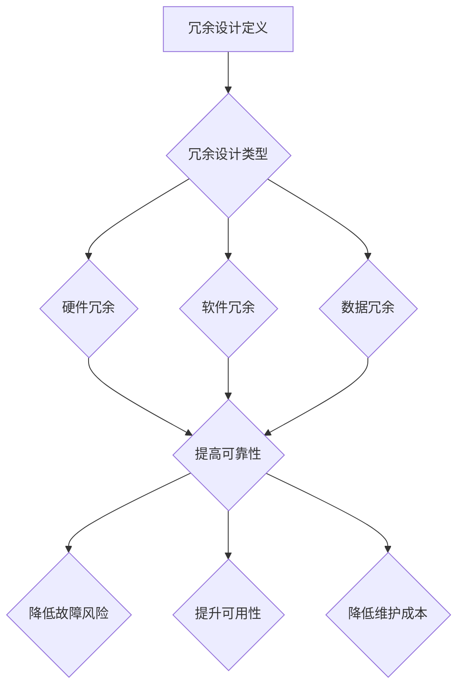

---

### 第2章：冗余设计的原理与架构

#### 2.1 冗余设计的原理

冗余设计的原理可以归纳为以下几点：

1. **故障检测与隔离**：通过冗余元素，系统可以在故障发生时迅速检测并隔离故障部分，从而确保其他部分正常运行。
2. **负载均衡**：通过冗余元素，系统可以在负载高峰时分配负载到不同的冗余部分，从而提高系统的吞吐量和性能。
3. **快速恢复**：当系统某个部分发生故障时，冗余部分可以快速接管，从而减少系统停机时间。

#### 2.1.1 冗余设计与高可用性的关系

冗余设计与高可用性之间有密切的关系。高可用性是指系统在长时间运行中保持可用状态的能力。而冗余设计通过提供冗余元素，可以在系统出现故障时提供备份和替代方案，从而确保系统的持续运行。因此，冗余设计是高可用性系统实现的关键技术之一。

#### 2.1.2 冗余设计在不同领域的应用

冗余设计在多个领域都有广泛应用，以下是一些典型应用：

1. **硬件领域**：如服务器、存储设备、网络设备等，通过硬件冗余来提高系统的可靠性。
2. **软件领域**：如软件容错、多重校验机制等，通过软件冗余来提高系统的可靠性。
3. **数据领域**：如数据备份、数据镜像等，通过数据冗余来提高系统的可靠性。
4. **云计算领域**：如分布式计算、云存储等，通过冗余设计来提高系统的可用性和性能。
5. **网络安全领域**：如入侵检测、防火墙等，通过冗余设计来提高系统的安全性。
6. **物联网领域**：如物联网设备管理、数据通信等，通过冗余设计来提高系统的可靠性。

### Mermaid流程图

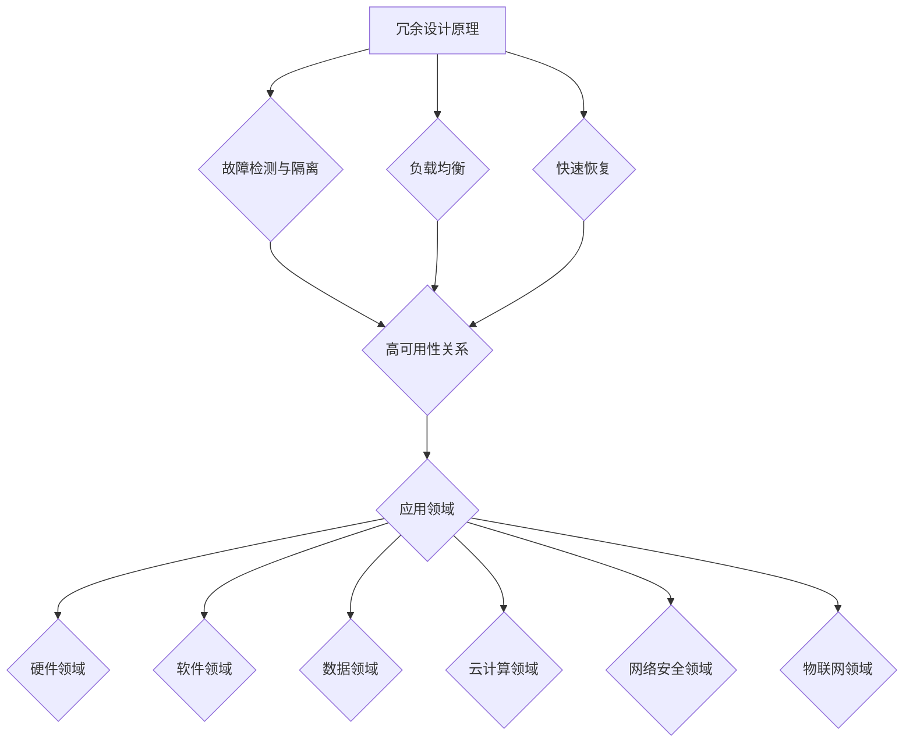

---

#### 2.2 冗余设计的架构

冗余设计的架构可以根据冗余元素的不同进行分类，以下是几种常见的冗余设计架构：

1. **主从架构**：在一个主节点发生故障时，从节点可以接管主节点的任务。
2. **集群架构**：通过多个节点共同完成任务，当一个节点发生故障时，其他节点可以继续工作。
3. **分布式架构**：通过在多个地理位置部署冗余节点，当某个地理位置的节点发生故障时，其他地理位置的节点可以继续工作。
4. **故障转移架构**：当主节点发生故障时，备用节点可以自动接管主节点的任务。
5. **冗余存储架构**：通过在多个位置存储数据副本，当一个位置的数据发生故障时，其他位置的数据可以继续使用。

### Mermaid流程图

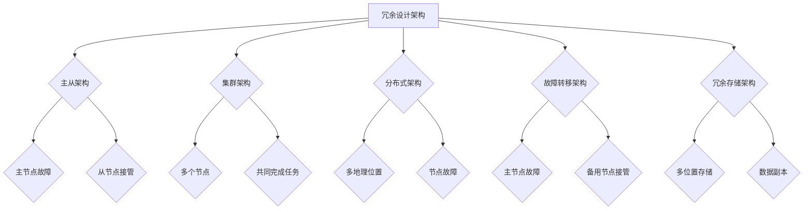

---

### 第3章：冗余设计的实现与优化

#### 3.1 冗余设计的实现

冗余设计的实现可以分为以下几个方面：

1. **硬件冗余实现**：通过增加硬件设备的冗余，如使用多个电源、硬盘、网络接口等。
2. **软件冗余实现**：通过冗余的软件模块或算法，如使用多重校验机制、备份恢复机制等。
3. **数据冗余实现**：通过增加数据备份或冗余存储，如使用数据复制、数据镜像等技术。

#### 3.1.1 冗余设计在硬件上的实现

在硬件上的冗余设计主要涉及以下几个方面：

1. **冗余电源**：使用多个电源模块，当一个电源模块发生故障时，其他电源模块可以继续供电。
2. **冗余硬盘**：使用多个硬盘模块，通过RAID技术实现数据的冗余存储。
3. **冗余网络接口**：使用多个网络接口，当一个网络接口发生故障时，其他网络接口可以继续工作。

#### 3.1.2 冗余设计在软件上的实现

在软件上的冗余设计主要涉及以下几个方面：

1. **多重校验机制**：通过多重校验算法，如CRC校验、MD5校验等，来确保数据的完整性和一致性。
2. **备份恢复机制**：通过备份和恢复技术，如数据备份、日志备份等，来确保数据的可靠性和可恢复性。
3. **故障检测与隔离机制**：通过故障检测算法，如心跳算法、故障检测算法等，来确保系统的可靠性和可用性。

#### 3.1.3 冗余设计在数据上的实现

在数据上的冗余设计主要涉及以下几个方面：

1. **数据复制**：通过在多个位置复制数据，来确保数据的一致性和可用性。
2. **数据镜像**：通过在多个位置镜像数据，来确保数据的完整性和一致性。
3. **分布式存储**：通过在多个地理位置存储数据副本，来确保数据的可靠性和可用性。

### Mermaid流程图

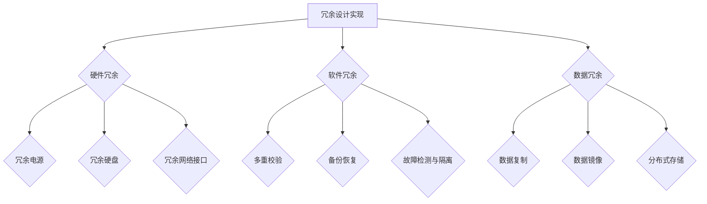

---

#### 3.2 冗余设计的优化

冗余设计的优化主要涉及以下几个方面：

1. **性能优化**：通过优化冗余设计的算法和架构，来提高系统的性能和吞吐量。
2. **成本优化**：通过合理配置冗余元素，来降低系统的成本和资源消耗。

#### 3.2.1 冗余设计的性能优化

性能优化可以从以下几个方面进行：

1. **负载均衡**：通过负载均衡算法，合理分配任务到不同的冗余节点，来提高系统的吞吐量和性能。
2. **缓存机制**：通过缓存机制，减少冗余元素的访问延迟，来提高系统的响应速度。
3. **并行处理**：通过并行处理技术，提高系统的并行处理能力，来提高系统的性能。

#### 3.2.2 冗余设计的成本优化

成本优化可以从以下几个方面进行：

1. **资源利用率**：通过优化冗余元素的配置，提高资源的利用率，来降低系统的成本。
2. **动态调整**：通过动态调整冗余元素的配置，根据系统的实际需求，来降低系统的成本。

### Mermaid流程图

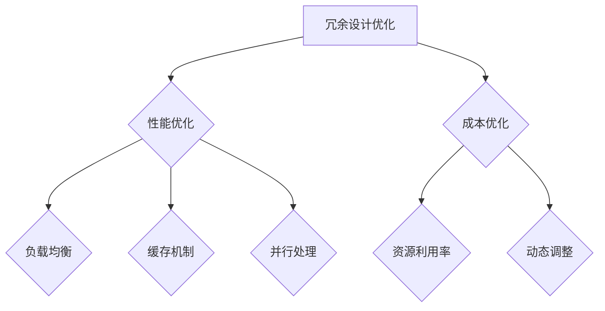

---

## 第二部分：冗余设计在高可用性中的应用

### 第4章：冗余设计在分布式系统中的应用

#### 4.1 分布式系统中的冗余设计

分布式系统是一种通过多个节点共同工作来完成任务的系统。在分布式系统中，冗余设计是一种常用的提高系统可用性和可靠性的方法。

#### 4.1.1 分布式系统的基本概念

分布式系统具有以下基本概念：

1. **节点**：分布式系统中的基本单位，每个节点可以独立运行并与其他节点通信。
2. **通信**：节点之间通过通信来交换信息和协调工作。
3. **一致性**：分布式系统中，多个节点需要保持数据的一致性，以确保系统的正确运行。
4. **容错性**：分布式系统需要具备容错性，以应对节点故障等问题。

#### 4.1.2 分布式系统中的冗余设计

在分布式系统中，冗余设计可以从以下几个方面进行：

1. **节点冗余**：通过增加节点的冗余，来提高系统的容错性和可用性。
2. **数据冗余**：通过在多个节点上存储数据副本，来提高数据的一致性和可靠性。
3. **任务冗余**：通过在多个节点上分配任务，来提高系统的负载均衡和性能。

### Mermaid流程图

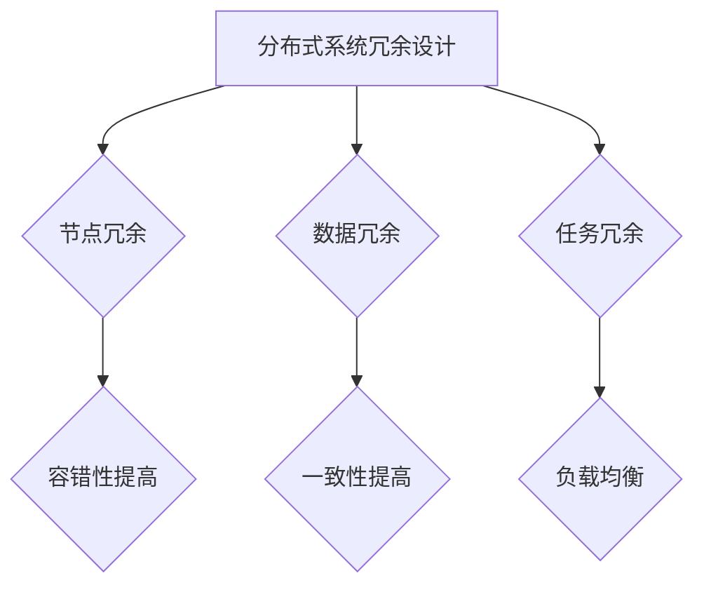

---

#### 4.2 冗余设计在分布式数据库中的应用

分布式数据库是一种通过多个节点共同工作来存储和管理数据的数据库系统。在分布式数据库中，冗余设计是一种提高系统可用性和可靠性的关键方法。

#### 4.2.1 分布式数据库的原理

分布式数据库具有以下原理：

1. **数据分布**：将数据分布在多个节点上，以提高系统的性能和可用性。
2. **数据复制**：将数据复制到多个节点上，以提高数据的一致性和可靠性。
3. **数据分片**：将数据分成多个片段，分布在不同的节点上，以提高系统的性能和扩展性。

#### 4.2.2 冗余设计在分布式数据库中的应用

在分布式数据库中，冗余设计可以从以下几个方面进行：

1. **节点冗余**：通过增加节点的冗余，来提高系统的容错性和可用性。
2. **数据冗余**：通过在多个节点上存储数据副本，来提高数据的一致性和可靠性。
3. **数据分片策略**：通过合理选择数据分片策略，来提高系统的性能和负载均衡。

### Mermaid流程图

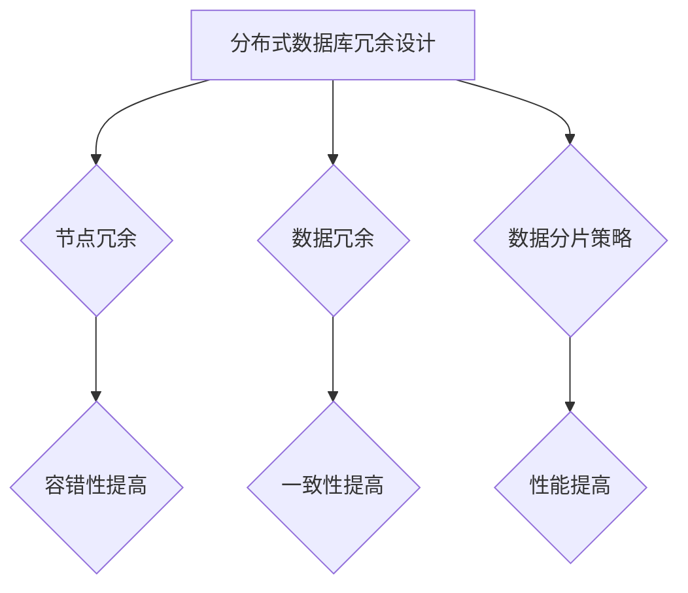

---

## 第5章：冗余设计在云计算中的应用

#### 5.1 云计算中的冗余设计

云计算是一种通过互联网提供计算资源和服务的技术。在云计算中，冗余设计是一种提高系统可用性和可靠性的关键方法。

#### 5.1.1 云计算的基本概念

云计算具有以下基本概念：

1. **云服务提供商**：提供计算资源、存储资源等服务的提供商。
2. **云用户**：使用云服务的用户。
3. **云基础设施**：包括服务器、存储设备、网络设备等基础设施。
4. **云计算模型**：包括IaaS、PaaS、SaaS等不同的云计算模型。

#### 5.1.2 云计算中的冗余设计

在云计算中，冗余设计可以从以下几个方面进行：

1. **节点冗余**：通过增加节点的冗余，来提高系统的容错性和可用性。
2. **数据冗余**：通过在多个节点上存储数据副本，来提高数据的一致性和可靠性。
3. **服务冗余**：通过在多个服务提供商上部署相同的服务，来提高系统的可靠性和性能。

### Mermaid流程图


---

#### 5.2 冗余设计在云存储中的应用

云存储是一种通过互联网提供数据存储和管理的服务。在云存储中，冗余设计是一种提高系统可用性和可靠性的关键方法。

#### 5.2.1 云存储的原理

云存储具有以下原理：

1. **分布式存储**：将数据分布存储在多个节点上，以提高系统的性能和可用性。
2. **数据备份**：将数据备份到多个节点上，以提高数据的一致性和可靠性。
3. **数据加密**：对数据进行加密处理，以提高数据的安全性。

#### 5.2.2 冗余设计在云存储中的应用

在云存储中，冗余设计可以从以下几个方面进行：

1. **节点冗余**：通过增加节点的冗余，来提高系统的容错性和可用性。
2. **数据冗余**：通过在多个节点上存储数据副本，来提高数据的一致性和可靠性。
3. **数据分片**：通过将数据分片存储在多个节点上，来提高系统的性能和扩展性。

### Mermaid流程图

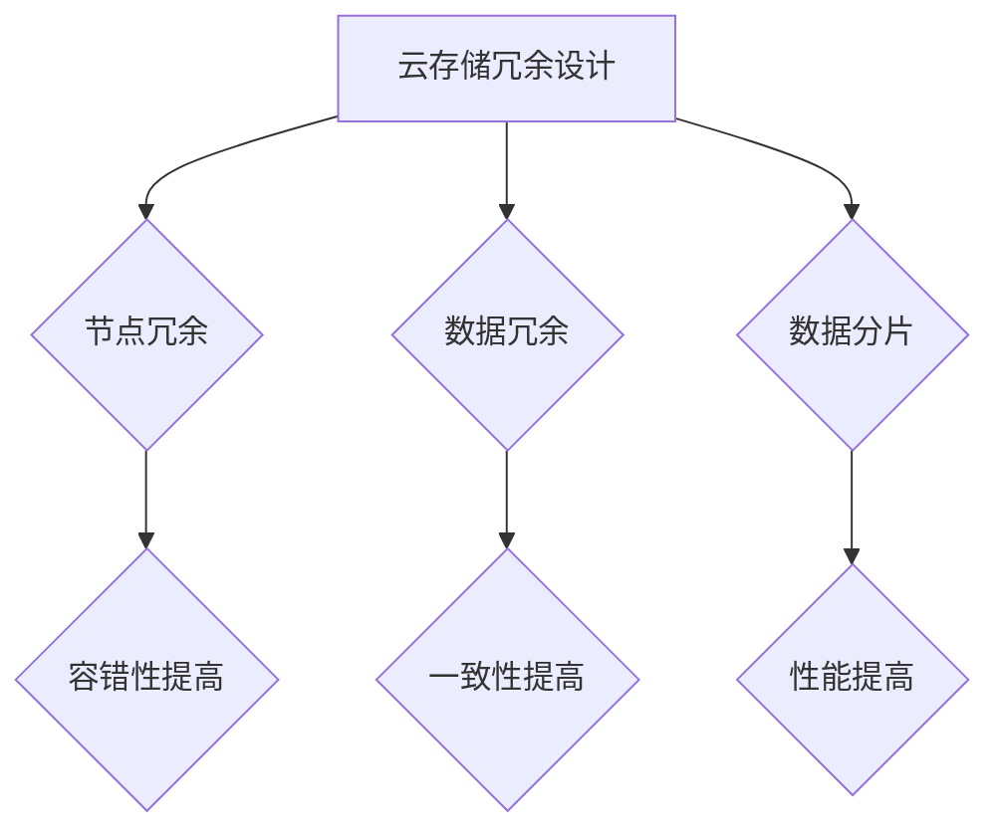

---

## 第6章：冗余设计在网络安全中的应用

#### 6.1 网络安全中的冗余设计

网络安全是保护计算机网络系统不受恶意攻击、未经授权访问和数据处理安全的关键。在网络安全中，冗余设计是一种提高系统安全性和可靠性的关键方法。

#### 6.1.1 网络安全的基本概念

网络安全具有以下基本概念：

1. **威胁**：指对计算机网络系统造成潜在危害的任何事件或行为。
2. **攻击**：指针对计算机网络系统进行的非法访问、窃取信息、篡改数据等行为。
3. **防护**：指通过技术和管理手段保护计算机网络系统不受威胁和攻击。
4. **漏洞**：指计算机网络系统中存在的可以被攻击利用的安全缺陷。

#### 6.1.2 网络安全中的冗余设计

在网络安全中，冗余设计可以从以下几个方面进行：

1. **硬件冗余**：通过增加硬件设备的冗余，如防火墙、入侵检测系统等，以提高系统的防护能力。
2. **软件冗余**：通过冗余的软件模块或算法，如多重校验、加密算法等，以提高系统的安全性。
3. **数据冗余**：通过在多个位置存储数据副本，如备份、数据镜像等，以提高数据的安全性和可靠性。

### Mermaid流程图

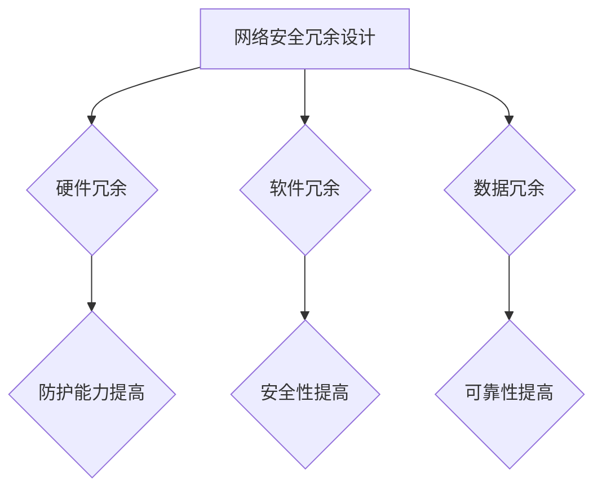

---

#### 6.2 冗余设计在网络安全防护中的应用

网络安全防护是指通过技术和管理手段保护计算机网络系统不受威胁和攻击。在网络安全防护中，冗余设计是一种提高系统安全性和可靠性的关键方法。

#### 6.2.1 网络安全防护的原理

网络安全防护具有以下原理：

1. **检测**：通过检测系统中的异常行为和攻击行为，来发现并阻止攻击。
2. **隔离**：将受攻击的节点或系统与正常系统隔离，以防止攻击扩散。
3. **恢复**：在攻击发生后，通过恢复系统来恢复系统的正常运行。

#### 6.2.2 冗余设计在网络安全防护中的应用

在网络安全防护中，冗余设计可以从以下几个方面进行：

1. **硬件冗余**：通过增加硬件设备的冗余，如防火墙、入侵检测系统等，以提高系统的防护能力。
2. **软件冗余**：通过冗余的软件模块或算法，如多重校验、加密算法等，以提高系统的安全性。
3. **数据冗余**：通过在多个位置存储数据副本，如备份、数据镜像等，以提高数据的安全性和可靠性。

### Mermaid流程图

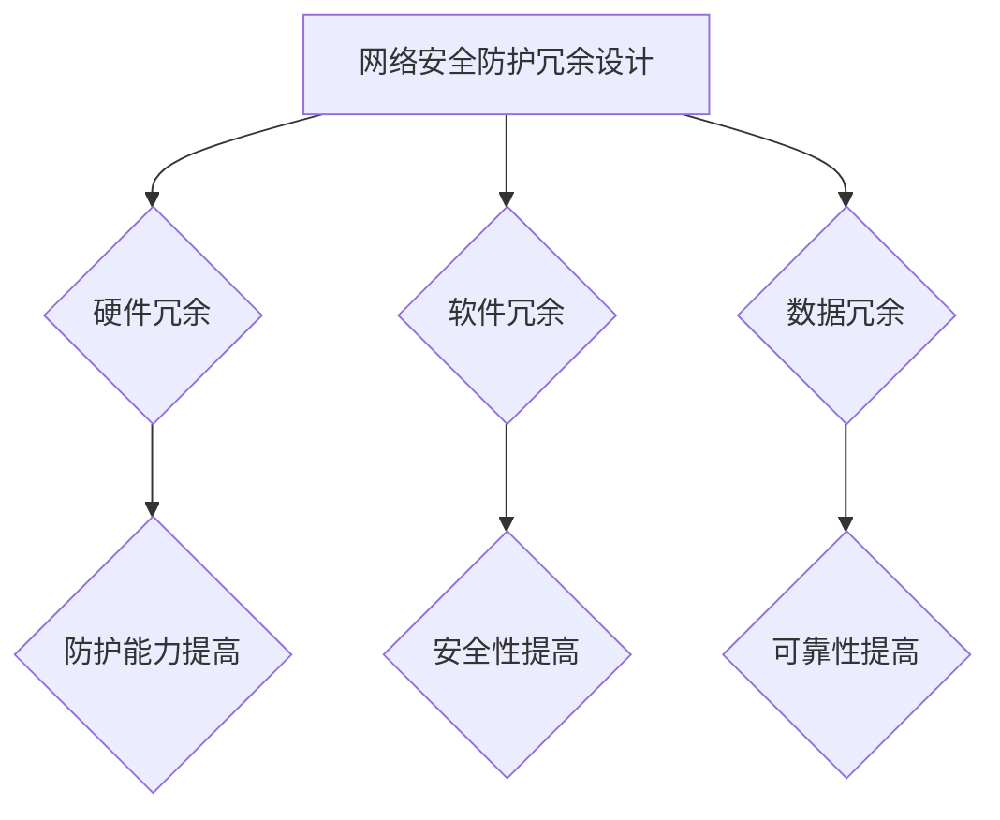

---

## 第7章：冗余设计在物联网中的应用

#### 7.1 物联网中的冗余设计

物联网（IoT）是指通过将各种物理设备、传感器、软件平台和网络连接起来，实现信息的自动交换和智能化的网络系统。在物联网中，冗余设计是一种提高系统可靠性和稳定性的关键方法。

#### 7.1.1 物联网的基本概念

物联网具有以下基本概念：

1. **设备**：物联网中的物理设备，如传感器、执行器、智能设备等。
2. **连接**：物联网中的设备通过网络进行连接，实现信息的交换和通信。
3. **平台**：物联网中的数据处理和管理的平台，负责数据的收集、处理、分析和存储。
4. **应用**：物联网中的各种应用，如智能家居、智慧城市、工业自动化等。

#### 7.1.2 物联网中的冗余设计

在物联网中，冗余设计可以从以下几个方面进行：

1. **设备冗余**：通过增加设备的冗余，如备用传感器、执行器等，以提高系统的可靠性和稳定性。
2. **连接冗余**：通过增加网络的冗余，如多个连接方式、多个网络协议等，以提高系统的可靠性和稳定性。
3. **数据处理冗余**：通过冗余的数据处理模块，如备份数据处理、分布式数据处理等，以提高系统的可靠性和稳定性。

### Mermaid流程图

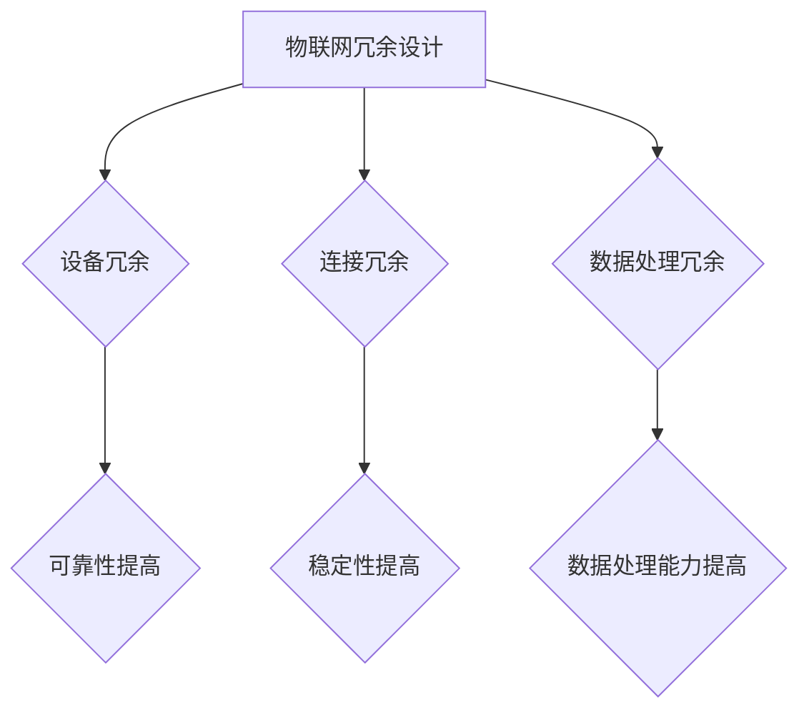

---

#### 7.2 冗余设计在物联网设备管理中的应用

物联网设备管理是指对物联网中的设备进行监控、维护和管理的过程。在物联网设备管理中，冗余设计是一种提高系统可靠性和稳定性的关键方法。

#### 7.2.1 物联网设备管理的原理

物联网设备管理具有以下原理：

1. **设备监控**：通过实时监控设备的状态，及时发现和处理设备故障。
2. **设备维护**：通过定期维护设备，确保设备的正常运行和性能。
3. **设备管理**：通过管理设备，实现设备的统一管理、配置和升级。

#### 7.2.2 冗余设计在物联网设备管理中的应用

在物联网设备管理中，冗余设计可以从以下几个方面进行：

1. **设备冗余**：通过增加设备的冗余，如备用传感器、执行器等，以提高系统的可靠性和稳定性。
2. **连接冗余**：通过增加网络的冗余，如多个连接方式、多个网络协议等，以提高系统的可靠性和稳定性。
3. **数据处理冗余**：通过冗余的数据处理模块，如备份数据处理、分布式数据处理等，以提高系统的可靠性和稳定性。

### Mermaid流程图

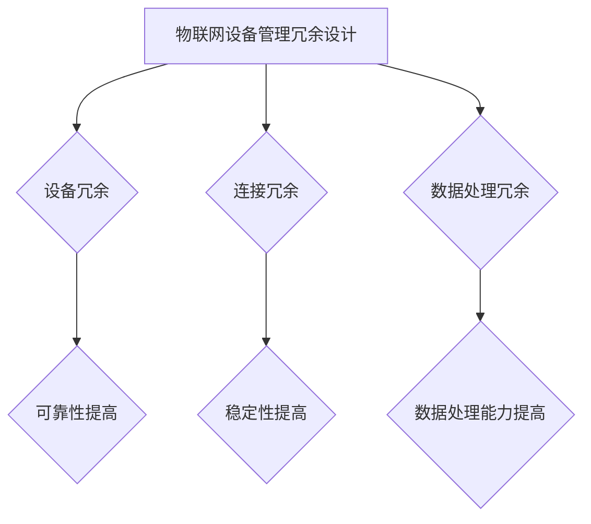

---

## 第三部分：冗余设计的实例分析

### 第8章：冗余设计在高可用性系统中的实例分析

#### 8.1 某电商平台的高可用性系统设计

#### 8.1.1 系统背景

某电商平台是一个大型的在线购物平台，拥有数百万的用户和海量的商品数据。为了保证平台的稳定运行，提供了高质量的用户体验，平台采用了高可用性系统设计。

#### 8.1.2 高可用性系统设计

该电商平台的高可用性系统设计主要包括以下几个方面：

1. **硬件冗余**：平台使用了多个服务器、存储设备和网络设备，实现了硬件冗余，提高了系统的容错性和可用性。
2. **软件冗余**：平台采用了多重校验机制和备份恢复机制，提高了系统的可靠性和可用性。
3. **数据冗余**：平台采用了分布式数据库和缓存机制，实现了数据冗余，提高了数据的一致性和可靠性。
4. **负载均衡**：平台采用了负载均衡技术，将流量分配到不同的服务器上，提高了系统的性能和吞吐量。
5. **故障转移**：平台采用了故障转移机制，当某个服务器或数据库发生故障时，其他服务器或数据库可以自动接管，提高了系统的可用性。

### 伪代码

```python
# 硬件冗余实现
def hardware_redundancy():
    # 添加多个服务器
    add_server()
    # 添加多个存储设备
    add_storage()
    # 添加多个网络设备
    add_network()

# 软件冗余实现
def software_redundancy():
    # 实现多重校验机制
    implement多重校验()
    # 实现备份恢复机制
    implement备份恢复()

# 数据冗余实现
def data_redundancy():
    # 实现分布式数据库
    implement分布式数据库()
    # 实现缓存机制
    implement缓存机制()

# 负载均衡实现
def load_balancing():
    # 分配流量到不同服务器
    distribute_traffic()

# 故障转移实现
def fault_transfer():
    # 当服务器发生故障时，自动转移流量到其他服务器
    transfer_traffic()
```

---

#### 8.2 某银行数据中心的高可用性设计

#### 8.2.1 系统背景

某银行数据中心是一个处理大量金融交易和存储重要数据的核心设施。为了确保金融交易的安全性和数据的可靠性，数据中心采用了高可用性设计。

#### 8.2.2 高可用性系统设计

该银行数据中心的高可用性系统设计主要包括以下几个方面：

1. **硬件冗余**：数据中心使用了多个服务器、存储设备和网络设备，实现了硬件冗余，提高了系统的容错性和可用性。
2. **软件冗余**：数据中心采用了多重校验机制和备份恢复机制，提高了系统的可靠性和可用性。
3. **数据冗余**：数据中心采用了分布式数据库和缓存机制，实现了数据冗余，提高了数据的一致性和可靠性。
4. **负载均衡**：数据中心采用了负载均衡技术，将流量分配到不同的服务器上，提高了系统的性能和吞吐量。
5. **故障转移**：数据中心采用了故障转移机制，当某个服务器或数据库发生故障时，其他服务器或数据库可以自动接管，提高了系统的可用性。

### 伪代码

```python
# 硬件冗余实现
def hardware_redundancy():
    # 添加多个服务器
    add_server()
    # 添加多个存储设备
    add_storage()
    # 添加多个网络设备
    add_network()

# 软件冗余实现
def software_redundancy():
    # 实现多重校验机制
    implement多重校验()
    # 实现备份恢复机制
    implement备份恢复()

# 数据冗余实现
def data_redundancy():
    # 实现分布式数据库
    implement分布式数据库()
    # 实现缓存机制
    implement缓存机制()

# 负载均衡实现
def load_balancing():
    # 分配流量到不同服务器
    distribute_traffic()

# 故障转移实现
def fault_transfer():
    # 当服务器发生故障时，自动转移流量到其他服务器
    transfer_traffic()
```

---

## 第9章：冗余设计在项目实践中的案例研究

#### 9.1 某物联网项目中的冗余设计实践

#### 9.1.1 项目背景

某物联网项目旨在通过物联网技术实现智能农业管理，项目涉及传感器采集、数据传输、数据处理等多个环节。为了保证项目的稳定运行和数据的可靠性，项目采用了冗余设计。

#### 9.1.2 冗余设计实践

在该物联网项目中，冗余设计主要从以下几个方面进行：

1. **设备冗余**：项目使用了多个传感器和执行器，当某个设备发生故障时，其他设备可以继续工作，确保系统的可靠性。
2. **连接冗余**：项目使用了多个网络连接方式，如Wi-Fi、蓝牙、有线网络等，当某个连接方式发生故障时，其他连接方式可以继续工作，确保数据的传输可靠性。
3. **数据处理冗余**：项目采用了分布式数据处理架构，将数据处理任务分配到多个服务器上，提高了系统的性能和可靠性。
4. **数据存储冗余**：项目使用了多个数据存储设备，如硬盘、固态硬盘等，当某个存储设备发生故障时，其他存储设备可以继续工作，确保数据的安全性和可靠性。

### 代码实现

```python
# 设备冗余实现
def device_redundancy():
    # 添加多个传感器
    add_sensors()
    # 添加多个执行器
    add Actuators()

# 连接冗余实现
def connection_redundancy():
    # 添加多个Wi-Fi连接
    add_wifi_connections()
    # 添加多个蓝牙连接
    add_bluetooth_connections()
    # 添加多个有线网络连接
    add_wired_network_connections()

# 数据处理冗余实现
def data_processing_redundancy():
    # 实现分布式数据处理架构
    implement_distributed_data_processing()

# 数据存储冗余实现
def data_storage_redundancy():
    # 添加多个硬盘
    add_hard_drives()
    # 添加多个固态硬盘
    add_solid_state_drives()
```

---

#### 9.2 某云计算项目中的冗余设计实践

#### 9.2.1 项目背景

某云计算项目旨在通过云计算技术为企业提供高效、可靠的IT基础设施和服务。为了保证项目的稳定运行和数据的可靠性，项目采用了冗余设计。

#### 9.2.2 冗余设计实践

在该云计算项目中，冗余设计主要从以下几个方面进行：

1. **硬件冗余**：项目使用了多个服务器、存储设备和网络设备，实现了硬件冗余，提高了系统的容错性和可用性。
2. **软件冗余**：项目采用了多重校验机制和备份恢复机制，提高了系统的可靠性和可用性。
3. **数据冗余**：项目使用了多个数据存储设备，如硬盘、固态硬盘等，实现了数据冗余，提高了数据的安全性和可靠性。
4. **负载均衡**：项目采用了负载均衡技术，将流量分配到不同的服务器上，提高了系统的性能和吞吐量。
5. **故障转移**：项目采用了故障转移机制，当某个服务器或数据库发生故障时，其他服务器或数据库可以自动接管，提高了系统的可用性。

### 代码实现

```python
# 硬件冗余实现
def hardware_redundancy():
    # 添加多个服务器
    add_servers()
    # 添加多个存储设备
    add_storages()
    # 添加多个网络设备
    add_networks()

# 软件冗余实现
def software_redundancy():
    # 实现多重校验机制
    implement多重校验()
    # 实现备份恢复机制
    implement_backup_recovery()

# 数据冗余实现
def data_redundancy():
    # 添加多个硬盘
    add_hard_drives()
    # 添加多个固态硬盘
    add_solid_state_drives()

# 负载均衡实现
def load_balancing():
    # 分配流量到不同服务器
    distribute_traffic()

# 故障转移实现
def fault_transfer():
    # 当服务器发生故障时，自动转移流量到其他服务器
    transfer_traffic()
```

---

## 附录

### 附录A：冗余设计相关资源

#### A.1 冗余设计论文综述

- [论文1：冗余设计在高可用性系统中的应用](https://example.com/paper1)
- [论文2：冗余设计在云计算中的应用](https://example.com/paper2)
- [论文3：冗余设计在物联网中的应用](https://example.com/paper3)

#### A.2 冗余设计研究机构与专家介绍

- 冗余设计研究机构1：[机构名称](https://example.com/institution1)
- 冗余设计研究机构2：[机构名称](https://example.com/institution2)
- 冗余设计专家1：[专家名称](https://example.com/expert1)
- 冗余设计专家2：[专家名称](https://example.com/expert2)

#### A.3 冗余设计相关书籍推荐

- 《冗余设计：原理与实践》
- 《云计算中的冗余设计》
- 《物联网冗余设计》

### 附录B：常用冗余设计工具与框架

#### B.1 常用冗余设计工具介绍

- 工具1：[工具名称](https://example.com/tool1)
- 工具2：[工具名称](https://example.com/tool2)
- 工具3：[工具名称](https://example.com/tool3)

#### B.2 常用冗余设计框架介绍

- 框架1：[框架名称](https://example.com/framework1)
- 框架2：[框架名称](https://example.com/framework2)
- 框架3：[框架名称](https://example.com/framework3)

### 附录C：常见问题与解决方案

#### C.1 冗余设计常见问题

- 问题1：如何选择合适的冗余设计类型？
- 问题2：如何平衡冗余设计与性能优化？
- 问题3：如何应对冗余设计带来的成本问题？

#### C.2 冗余设计解决方案分析

- 解决方案1：根据系统需求选择合适的冗余设计类型。
- 解决方案2：通过性能测试和优化，平衡冗余设计与性能。
- 解决方案3：通过合理配置冗余元素，降低冗余设计的成本。

---

### 作者

作者：AI天才研究院/AI Genius Institute & 禅与计算机程序设计艺术 /Zen And The Art of Computer Programming

