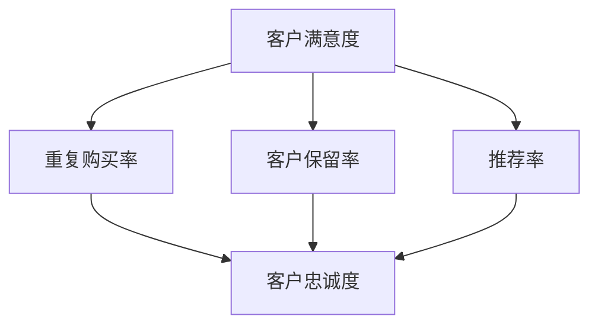
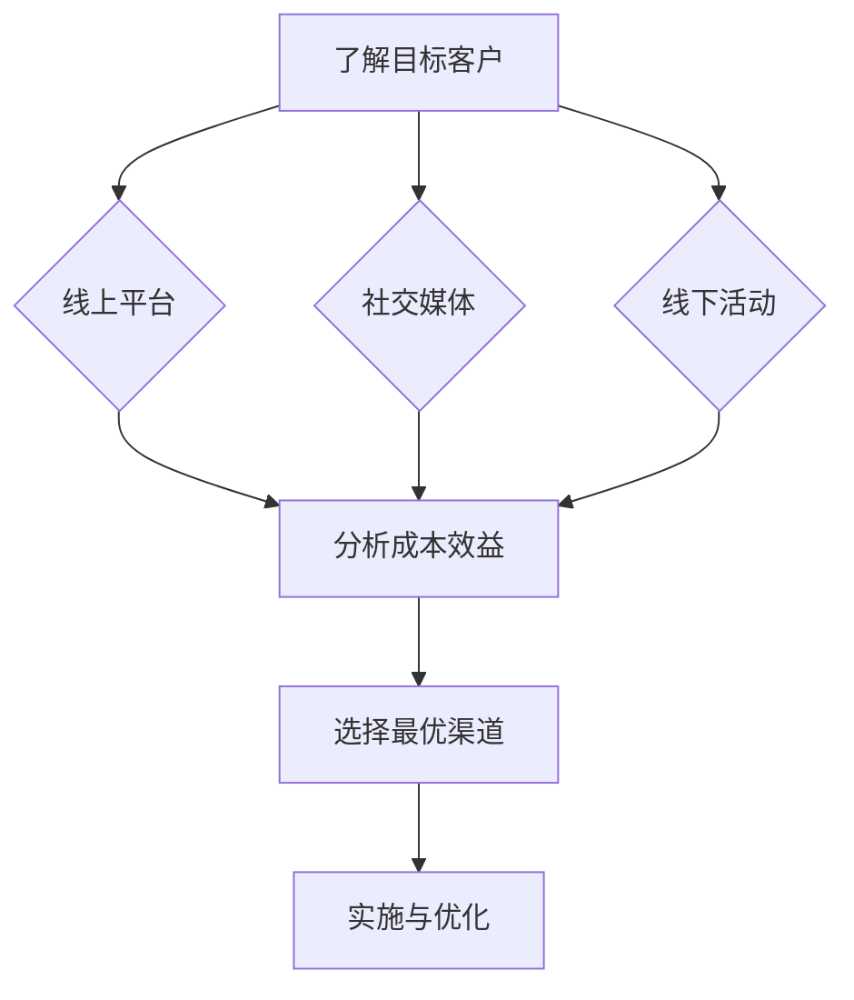
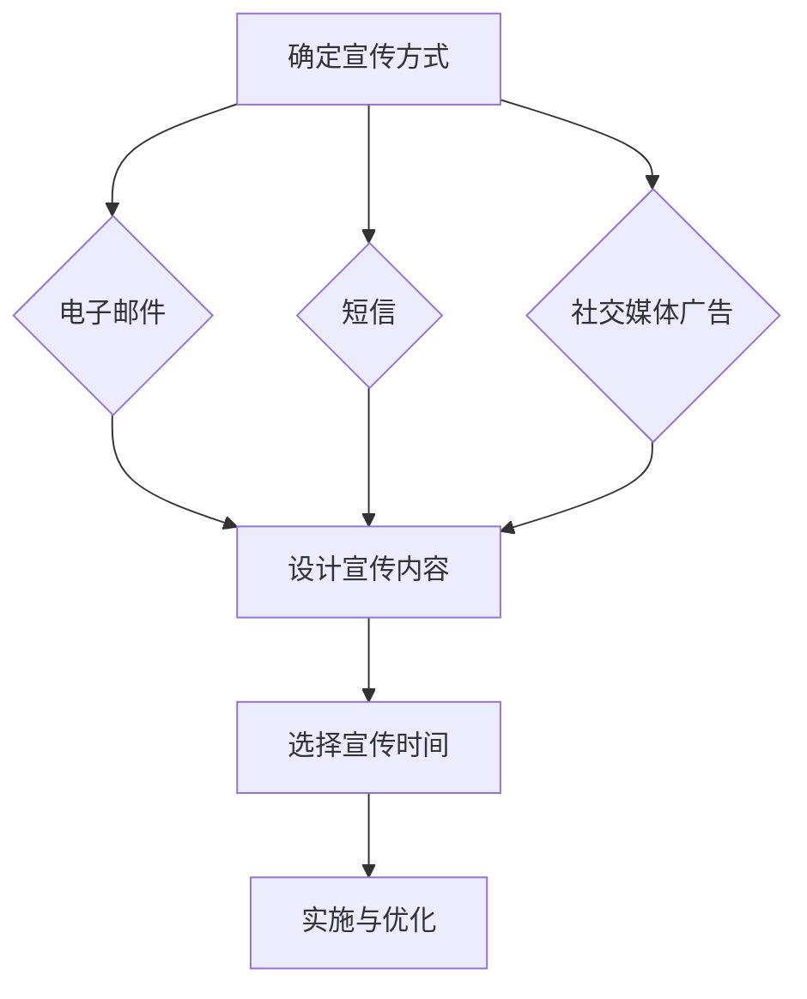
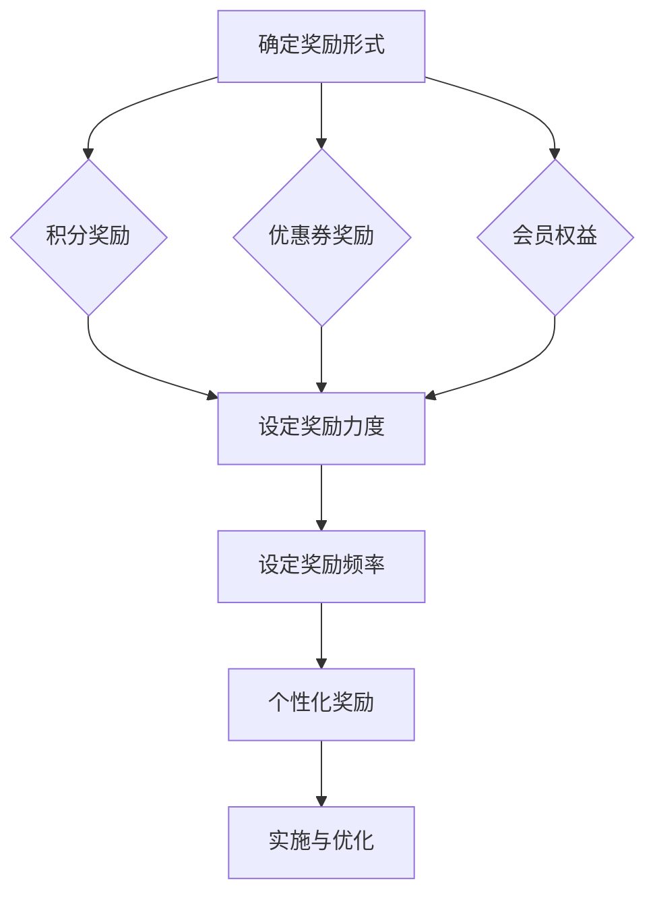
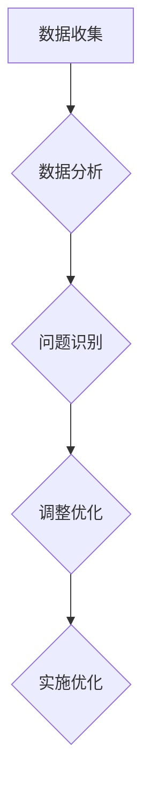
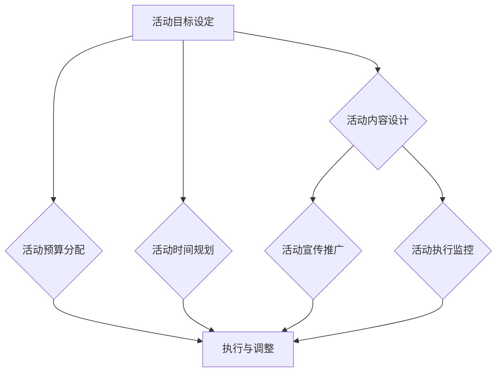
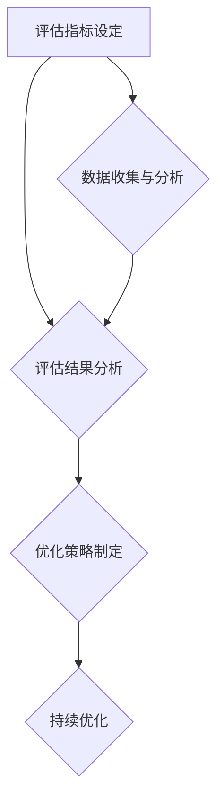
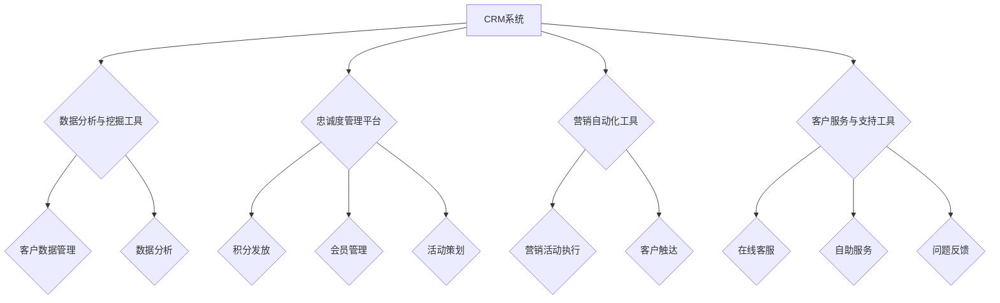

                 

### 《创业公司的忠诚度计划设计与实施》

在当今竞争激烈的市场环境中，创业公司的成功离不开客户的忠诚度。忠诚度计划作为一种有效的客户关系管理工具，已经成为许多公司提升客户满意度和业务增长的重要手段。本文将深入探讨创业公司的忠诚度计划设计与实施，帮助创业者们打造出能够增强客户黏性和忠诚度的计划。

关键词：客户忠诚度、忠诚度计划、创业公司、客户关系管理、CRM、营销策略

摘要：本文首先概述了忠诚度计划的重要性及其定义与类型，随后分析了忠诚度计划的理论基础，包括客户忠诚度的概念与度量、客户关系管理（CRM）理论。接着，本文详细阐述了忠诚度计划设计原则与设计流程，以及实施策略、活动管理、技术支持等内容。最后，通过国内与国际成功案例的分析，总结出忠诚度计划的实施效果与发展趋势，为创业公司提供实用的参考和借鉴。

## 目录大纲

1. **第一部分：忠诚度计划的基础**
   - **第1章：忠诚度计划概述**
     - 1.1 忠诚度计划的重要性
     - 1.2 忠诚度计划的定义与类型
     - 1.3 忠诚度计划的发展趋势
   - **第2章：忠诚度计划的理论基础**
     - 2.1 客户忠诚度的概念与度量
     - 2.2 客户关系管理（CRM）理论
   - **第3章：忠诚度计划设计原则**
     - 3.1 设计原则概述
     - 3.2 设计流程

2. **第二部分：忠诚度计划的实施**
   - **第4章：忠诚度计划实施策略**
     - 4.1 实施策略概述
     - 4.2 营销渠道选择
   - **第5章：忠诚度计划活动管理**
     - 5.1 活动策划与管理
     - 5.2 活动评估与优化
   - **第6章：忠诚度计划的技术支持**
     - 6.1 技术支持的重要性
     - 6.2 技术支持工具与应用

3. **第三部分：成功案例分析**
   - **第7章：国内成功案例分析**
   - **第8章：国际成功案例分析**

4. **第四部分：忠诚度计划的未来展望**
   - **第9章：忠诚度计划的发展趋势**

5. **附录**
   - **附录 A：忠诚度计划实施工具与资源推荐**
   - **附录 B：参考文献**

### 第一部分：忠诚度计划的基础

#### 第1章：忠诚度计划概述

忠诚度计划是公司通过一系列策略和措施，旨在增强客户对其产品或服务的忠诚度，从而提高客户满意度和公司长期盈利能力的一种管理工具。对于创业公司来说，客户忠诚度是其生存和发展的基石，因为客户忠诚度直接影响到市场份额的获取和业务的持续增长。

#### 1.1 忠诚度计划的重要性

忠诚度计划的重要性体现在以下几个方面：

1. **提高客户留存率**：忠诚度计划通过提供优惠、积分、会员权益等激励措施，能够有效提高客户的留存率，减少客户流失。
2. **增加复购率**：通过忠诚度计划，公司可以鼓励客户重复购买，从而提高复购率，增加收入。
3. **提升品牌形象**：忠诚度计划能够增强客户的品牌认同感，提升公司品牌形象，增强市场竞争力。
4. **优化客户体验**：通过分析客户行为数据，公司可以提供更加个性化的产品和服务，优化客户体验，进一步提高客户满意度。

#### 1.2 忠诚度计划的定义与类型

忠诚度计划可以从不同的角度进行分类：

1. **根据奖励形式**：
   - **积分奖励**：客户通过消费获得积分，积分可以兑换商品或服务。
   - **会员权益**：会员享受特殊的优惠和服务，如优先购买权、专属折扣等。
   - **专属服务**：提供专属的客户服务，如快速响应、定制化服务等。

2. **根据目标客户**：
   - **全体客户**：针对所有客户群体，不分消费等级。
   - **高价值客户**：专门针对高消费或高潜力客户，提供更高层次的奖励和服务。

3. **根据实施方式**：
   - **线上**：通过互联网和移动应用等渠道进行。
   - **线下**：通过实体店铺和线下活动进行。

#### 1.3 忠诚度计划的发展趋势

随着技术的进步和市场环境的变化，忠诚度计划也在不断演变：

1. **个性化**：随着大数据和人工智能技术的发展，忠诚度计划越来越注重个性化，通过分析客户行为数据，提供个性化的推荐和优惠。
2. **数字化**：越来越多的公司采用数字化手段来实施忠诚度计划，如通过APP、微信小程序等，提供更加便捷和互动的客户体验。
3. **整合化**：忠诚度计划不再孤立存在，而是与公司的整体营销策略和客户关系管理（CRM）系统紧密结合，实现数据的整合和分析。

通过上述分析，可以看出，忠诚度计划对于创业公司来说具有非常重要的意义。接下来，我们将深入探讨忠诚度计划的理论基础，帮助创业者们更好地理解和设计忠诚度计划。

### 第2章：忠诚度计划的理论基础

#### 2.1 客户忠诚度的概念与度量

客户忠诚度是指客户在一段时间内持续购买和使用的倾向，它反映了客户对品牌的认同感和依赖度。客户忠诚度的概念可以从以下几个方面进行理解：

1. **重复购买**：客户在一定时间内重复购买同一品牌的产品或服务。
2. **品牌推荐**：客户主动向他人推荐品牌，传播品牌口碑。
3. **情感依赖**：客户对品牌产生情感上的依赖，即使在面对其他竞争对手的诱惑时也能保持忠诚。

为了量化客户忠诚度，可以采用以下几种度量方法：

1. **重复购买率**：在一定时间内，重复购买同一品牌产品或服务的客户占总客户数的比例。
2. **客户保留率**：在一定时间内，保留下来继续使用同一品牌产品或服务的客户占总客户数的比例。
3. **推荐率**：在一定时间内，主动向他人推荐品牌的产品或服务的客户占总客户数的比例。

#### 2.2 客户忠诚度与客户满意度的关系

客户忠诚度和客户满意度之间存在密切的联系。客户满意度是指客户对其产品或服务质量的总体评价。具体来说，客户忠诚度和客户满意度之间的关系可以从以下几个方面进行分析：

1. **正向关系**：通常情况下，客户满意度越高，客户忠诚度也越高。这是因为满意的客户更有可能再次购买和推荐品牌。
2. **传递效应**：客户满意度可以传递给其他潜在客户，提高品牌的市场知名度和美誉度。
3. **差异化管理**：通过对不同满意度水平的客户进行差异化管理，公司可以针对高满意度客户提供更多优惠和奖励，进一步提升客户忠诚度。

为了更好地理解客户忠诚度和客户满意度之间的关系，可以参考以下流程图：

#### 2.3 客户关系管理（CRM）理论

客户关系管理（CRM）是一种通过系统化和自动化手段来提高客户满意度和忠诚度的管理方法。CRM的核心理论包括以下几个方面：

1. **客户视角**：CRM强调从客户的角度出发，关注客户的需求和体验，通过数据分析和个性化服务，提高客户满意度。
2. **数据管理**：CRM系统需要收集、存储和管理大量的客户数据，如购买历史、偏好和反馈等，以便进行深入的分析和决策。
3. **互动管理**：CRM通过多种渠道与客户进行互动，如电话、邮件、社交媒体等，建立长期稳定的客户关系。
4. **协作管理**：CRM系统促进了企业内部不同部门之间的协作，如销售、客户服务、市场等部门，共同为客户提供优质的服务。

CRM系统通常包括以下主要模块和功能：

1. **客户资料管理**：记录和管理客户的详细资料，如姓名、联系方式、购买历史等。
2. **销售管理**：跟踪销售机会、管理销售流程，提高销售效率。
3. **客户服务**：提供客户支持和服务，解决客户问题，提高客户满意度。
4. **市场营销**：进行市场活动策划、执行和评估，提高客户参与度和忠诚度。
5. **分析和报表**：提供客户行为分析和业务报告，支持决策制定。

CRM与忠诚度计划的关系：

- **数据支持**：CRM系统提供了丰富的客户数据，为设计有效的忠诚度计划提供了基础。
- **流程整合**：CRM系统将忠诚度计划纳入整体客户关系管理体系，实现流程的整合和协同。
- **客户体验**：CRM系统通过个性化服务和互动管理，提升了客户的忠诚度和满意度，为忠诚度计划的实施提供了保障。

通过以上对客户忠诚度、客户满意度以及CRM理论的探讨，创业者可以更好地理解忠诚度计划的理论基础，为其设计有效的忠诚度计划提供理论支持。接下来，本文将详细阐述忠诚度计划的设计原则和设计流程。

### 第3章：忠诚度计划设计原则

#### 3.1 设计原则概述

设计忠诚度计划需要遵循一系列原则，以确保计划能够有效地提高客户忠诚度，实现公司目标。以下是一些关键的设计原则：

1. **客户需求导向**：忠诚度计划的设计应以满足客户需求为中心，了解客户的期望和偏好，提供有吸引力的奖励和优惠。
2. **目标明确**：制定清晰的目标和期望，确保忠诚度计划能够具体衡量和评估效果，如提高重复购买率、降低客户流失率等。
3. **灵活可调整**：忠诚度计划应具有灵活性，能够根据市场环境和客户需求的变化进行调整和优化。
4. **利益共享**：确保客户能够从忠诚度计划中获益，增强客户对品牌的认同感和忠诚度。
5. **成本效益**：在预算范围内设计忠诚度计划，确保计划的成本与预期收益相匹配，避免过度投入。

#### 3.2 设计流程

忠诚度计划的设计流程可以分为以下几个关键步骤：

1. **需求分析**：
   - 调查和分析目标客户群体的需求和偏好，了解他们对忠诚度计划的需求和期望。
   - 分析竞争对手的忠诚度计划，找出差异化和创新点。

2. **目标设定**：
   - 根据公司战略和业务目标，设定忠诚度计划的目标，如提高客户留存率、增加复购率等。
   - 确定可量化的关键绩效指标（KPI），如重复购买率、客户保留率、推荐率等。

3. **活动设计**：
   - 设计具体的活动内容和奖励机制，如积分奖励、会员权益、专属服务等。
   - 确保活动能够吸引客户参与，并提供足够的激励，如优惠折扣、免费试用等。

4. **渠道选择**：
   - 根据目标客户群体的特点，选择合适的营销渠道，如线上平台、社交媒体、线下活动等。
   - 确保渠道能够有效触达目标客户，提高活动的曝光率和参与度。

5. **测试与优化**：
   - 在实施前进行小规模的测试，评估活动的可行性和客户反应。
   - 根据测试结果进行优化，调整计划内容和策略，确保计划能够达到预期效果。

6. **实施与监控**：
   - 正式实施忠诚度计划，确保各个环节的顺利执行。
   - 建立监控机制，实时跟踪计划执行情况和客户反馈，及时调整和优化。

通过上述设计原则和流程，创业者可以系统地设计和实施忠诚度计划，提高客户忠诚度和业务增长。接下来，本文将深入探讨忠诚度计划的实施策略。

### 第二部分：忠诚度计划的实施

#### 第4章：忠诚度计划实施策略

忠诚度计划的实施策略是确保计划有效执行和达成目标的关键。一个成功的忠诚度计划不仅需要良好的设计，还需要合理的实施策略，以下将详细介绍实施策略的制定和调整。

#### 4.1 实施策略概述

实施忠诚度计划需要明确以下几个方面的策略：

1. **营销渠道策略**：选择合适的营销渠道，如线上平台、社交媒体、线下活动等，确保忠诚度计划能够有效触达目标客户群体。

2. **沟通策略**：制定有效的沟通策略，包括宣传方式、宣传内容和宣传时间，确保客户能够及时了解和参与到忠诚度计划中。

3. **激励机制**：设计有吸引力的激励机制，如积分奖励、会员权益、专属服务等，激发客户的参与热情和忠诚度。

4. **数据分析策略**：利用数据分析工具，实时监控计划执行情况和客户反馈，及时调整和优化计划。

#### 4.2 营销渠道选择

选择合适的营销渠道对于忠诚度计划的成功至关重要。以下是一些关键考虑因素和策略：

1. **目标客户特点**：根据目标客户群体的特点，选择合适的营销渠道。例如，如果目标客户是年轻一代，社交媒体和线上平台可能是更有效的选择。

2. **渠道覆盖范围**：选择具有广泛覆盖范围的渠道，确保忠诚度计划能够触及更多的潜在客户。

3. **渠道成本效益**：评估不同渠道的成本效益，选择性价比最高的渠道进行投入。

4. **渠道整合**：将线上和线下渠道进行整合，实现信息的无缝连接，提供一致的客户体验。

以下是一个简单的营销渠道选择流程：

#### 4.3 沟通策略

沟通策略是忠诚度计划实施的关键环节，以下是一些关键要点：

1. **宣传方式**：选择合适的宣传方式，如电子邮件、短信、社交媒体广告等，确保信息的传达高效和精准。

2. **宣传内容**：设计吸引人的宣传内容，如宣传口号、视觉设计、互动活动等，提高客户的参与度和兴趣。

3. **宣传时间**：选择最佳的宣传时间，如节假日、新品上市等，确保忠诚度计划能够得到客户的关注和参与。

以下是一个简单的沟通策略设计流程：

#### 4.4 激励机制设计

激励机制是忠诚度计划的灵魂，以下是设计激励机制的关键要点：

1. **奖励形式**：根据客户需求和偏好，选择合适的奖励形式，如积分、优惠券、会员权益等。

2. **奖励力度**：设计合理的奖励力度，既能吸引客户参与，又不会过度增加公司的成本负担。

3. **奖励频率**：根据客户行为和公司目标，选择合适的奖励频率，如每月、每季度等。

4. **个性化奖励**：利用客户数据，提供个性化的奖励，增强客户的忠诚度和参与度。

以下是一个简单的激励机制设计流程：

#### 4.5 数据分析与调整

数据分析是忠诚度计划实施的重要环节，通过数据分析可以实时监控计划的效果，并进行相应的调整和优化。以下是一些关键要点：

1. **数据收集**：收集客户行为数据，如购买记录、参与活动情况等。

2. **数据分析**：利用数据分析工具，对客户行为进行深入分析，找出问题和改进点。

3. **数据驱动调整**：根据数据分析结果，对忠诚度计划进行相应的调整和优化，提高计划的效果。

以下是一个简单的数据分析与调整流程：

通过上述实施策略的制定和调整，创业公司可以确保忠诚度计划能够顺利实施，并达到预期的效果。接下来，本文将深入探讨忠诚度计划活动管理，包括活动策划与管理、活动评估与优化等内容。

### 第5章：忠诚度计划活动管理

#### 5.1 活动策划与管理

忠诚度计划活动的策划与管理是确保计划成功实施的核心环节。以下是一些关键要点和步骤：

1. **活动目标设定**：
   - 根据公司整体战略和忠诚度计划目标，明确每个活动的具体目标，如提高客户参与度、增加复购率等。

2. **活动内容设计**：
   - 设计有吸引力的活动内容，包括奖励机制、活动形式、参与方式等，确保活动能够激发客户的兴趣和参与热情。

3. **活动预算分配**：
   - 根据活动目标、预期效果和公司预算，合理分配活动预算，确保活动的可行性。

4. **活动时间规划**：
   - 确定活动的时间安排，包括活动开始、结束时间，以及活动的持续周期。

5. **活动宣传推广**：
   - 制定宣传推广策略，通过线上线下多种渠道进行宣传，提高活动的知名度和参与度。

6. **活动执行监控**：
   - 在活动执行过程中，实时监控活动进展和客户反馈，及时调整活动内容和策略，确保活动顺利进行。

以下是一个简单的活动策划与管理流程：

#### 5.2 活动评估与优化

活动评估与优化是忠诚度计划活动管理的另一个重要环节，通过有效的评估和优化，可以确保活动的效果和持续性。以下是一些关键要点和步骤：

1. **评估指标设定**：
   - 根据活动目标和预期效果，设定相应的评估指标，如参与率、转化率、客户满意度等。

2. **数据收集与分析**：
   - 收集活动过程中的数据，包括客户参与情况、购买行为等，利用数据分析工具对数据进行分析。

3. **评估结果分析**：
   - 分析评估数据，识别活动的优点和不足，找出影响活动效果的关键因素。

4. **优化策略制定**：
   - 根据评估结果，制定相应的优化策略，如调整奖励机制、优化活动形式、改善客户体验等。

5. **持续优化**：
   - 对优化策略进行实施和跟踪，持续改进活动效果，确保忠诚度计划的长期成功。

以下是一个简单的活动评估与优化流程：

通过上述活动策划与管理、评估与优化的步骤，创业公司可以有效地管理忠诚度计划活动，提高客户参与度和忠诚度。接下来，本文将探讨忠诚度计划的技术支持，包括技术支持的重要性和技术支持工具与应用。

### 第6章：忠诚度计划的技术支持

#### 6.1 技术支持的重要性

在现代商业环境中，忠诚度计划的技术支持已经成为确保计划成功实施和优化的重要手段。技术支持不仅提高了忠诚度计划的效率和效果，还为公司提供了宝贵的数据和分析工具，以下是技术支持的重要作用：

1. **数据处理与分析**：技术支持可以帮助公司高效地收集、存储和管理大量客户数据，并通过数据分析工具对数据进行分析，从而更准确地了解客户需求和偏好。

2. **个性化服务**：利用技术支持，公司可以提供个性化的服务和推荐，提高客户满意度和忠诚度。例如，通过分析客户的购买历史和偏好，系统可以自动推荐适合的产品或服务。

3. **自动化与优化**：技术支持可以实现忠诚度计划活动的自动化，降低人工操作成本，提高活动的执行效率和效果。同时，通过数据分析和反馈，技术支持还可以帮助公司不断优化计划内容和策略。

4. **实时监控与反馈**：技术支持提供了实时监控和反馈机制，公司可以及时了解活动的进展和客户反馈，迅速做出调整和优化，确保忠诚度计划的顺利进行。

#### 6.2 技术支持工具与应用

忠诚度计划的技术支持需要多种工具和系统的配合，以下是一些常用的技术支持工具及其应用：

1. **客户关系管理（CRM）系统**：
   - **功能**：CRM系统主要用于收集和管理客户数据，跟踪客户互动历史，管理销售机会和客户服务请求。
   - **应用**：通过CRM系统，公司可以全面了解客户行为，设计个性化的忠诚度计划活动，并实时监控活动效果。

2. **数据分析与挖掘工具**：
   - **功能**：数据分析与挖掘工具用于处理大量数据，发现数据中的模式和趋势。
   - **应用**：公司可以利用这些工具对客户数据进行分析，了解客户忠诚度和满意度，优化奖励机制和营销策略。

3. **忠诚度管理平台**：
   - **功能**：忠诚度管理平台是一个集成多种功能的系统，用于管理忠诚度计划的所有活动，如积分发放、会员管理、活动策划等。
   - **应用**：通过忠诚度管理平台，公司可以自动化执行忠诚度计划活动，提高活动的效率和效果。

4. **营销自动化工具**：
   - **功能**：营销自动化工具用于自动化营销流程，如电子邮件营销、社交媒体推广等。
   - **应用**：公司可以利用这些工具自动化执行忠诚度计划的营销活动，提高客户触达率和参与度。

5. **客户服务与支持工具**：
   - **功能**：客户服务与支持工具用于提供在线客服、自助服务、问题反馈等功能。
   - **应用**：通过这些工具，公司可以快速响应用户需求，解决用户问题，提高客户满意度和忠诚度。

以下是一个简单的忠诚度计划技术支持工具应用流程：

通过上述技术支持工具的应用，创业公司可以高效地设计和实施忠诚度计划，提高客户满意度和忠诚度，实现业务的持续增长。接下来，本文将分析国内成功案例，为创业公司提供借鉴和启示。

### 第7章：国内成功案例分析

#### 7.1 案例介绍

本章节将通过分析国内两家具有代表性的创业公司的成功案例，探讨忠诚度计划的设计与实施。这两个案例分别是互联网公司“XX网”和零售公司“YY超市”。

**XX网**是一家提供在线购物服务的平台，以其高效的物流和优质的服务赢得了大量用户。该公司通过一系列忠诚度计划活动，成功提高了客户忠诚度和市场份额。

**YY超市**是一家线下零售超市，通过引入数字化技术和忠诚度计划，实现了线上线下的无缝连接，提升了客户的购物体验和忠诚度。

#### 7.2 案例分析

**XX网：忠诚度计划的设计与实施**

1. **忠诚度计划的设计**：
   - **目标设定**：提高客户留存率、增加复购率，打造长期忠诚客户群体。
   - **活动内容**：设计积分奖励机制，用户每消费一定金额即可获得积分，积分可以兑换商品或享受折扣。
   - **会员权益**：设立不同等级的会员，高等级会员享受更多优惠和服务，如优先发货、专属客服等。

2. **忠诚度计划的实施**：
   - **营销渠道**：通过官网、社交媒体、电子邮件等渠道宣传忠诚度计划，确保信息触达。
   - **数据支持**：利用CRM系统和数据分析工具，实时监控客户行为和参与度，优化活动策略。
   - **激励措施**：定期推出限时优惠、限时积分翻倍等活动，激发用户参与热情。

3. **效果分析**：
   - **客户留存率**：通过积分奖励和会员权益，客户留存率显著提高。
   - **复购率**：复购率有所增加，尤其是高等级会员的复购率更高。
   - **品牌口碑**：用户对XX网的忠诚度提升，品牌口碑得到改善。

**YY超市：忠诚度计划的设计与实施**

1. **忠诚度计划的设计**：
   - **目标设定**：提高客户满意度，增加客户忠诚度，促进线上线下融合。
   - **活动内容**：推出电子会员卡，用户可以在线下超市购物时积分，积分可以用于线上购物或线下抵扣。
   - **会员权益**：提供专属折扣、会员日、积分兑换等优惠和服务。

2. **忠诚度计划的实施**：
   - **营销渠道**：通过线下宣传、线上推广、社交媒体互动等多种渠道，提高忠诚度计划的知名度。
   - **数据支持**：利用超市POS系统和线上购物平台，收集客户数据，进行深入分析，优化忠诚度计划。
   - **激励措施**：定期举办会员专属活动，如生日特权、节假日优惠等，增强客户的参与感和忠诚度。

3. **效果分析**：
   - **客户满意度**：通过提供个性化的服务和优惠，客户满意度显著提高。
   - **客户忠诚度**：会员的忠诚度有所增强，尤其是在线上线下的融合方面。
   - **销售额增长**：线上线下销售额均有增长，尤其是线上销售额的增长更为显著。

#### 7.3 启示与借鉴

通过以上案例的分析，我们可以得到以下启示：

1. **明确目标**：设计忠诚度计划时，首先要明确具体的目标，如提高留存率、增加复购率等。
2. **多样化活动内容**：结合积分奖励、会员权益、专属服务等多种形式，提高活动的吸引力和参与度。
3. **数据驱动**：充分利用CRM系统和数据分析工具，实时监控和优化忠诚度计划，确保活动的效果和持续性。
4. **线上线下融合**：通过线上线下渠道的整合，提供一致的服务和体验，增强客户忠诚度。
5. **持续优化**：定期评估忠诚度计划的效果，根据客户反馈和市场需求进行调整和优化，确保计划的长效性。

以上国内成功案例为创业公司提供了宝贵的经验和借鉴，有助于它们在设计和实施忠诚度计划时取得成功。

### 第8章：国际成功案例分析

#### 8.1 案例介绍

在本章节中，我们将分析两家国际知名企业的忠诚度计划成功案例，分别是电子商务巨头“亚马逊”和全球知名连锁零售商“星巴克”。通过这些案例，我们将深入探讨国际企业如何设计和实施有效的忠诚度计划，以提升客户忠诚度和业务增长。

#### 8.2 案例分析

**亚马逊：忠诚度计划的设计与实施**

1. **忠诚度计划的设计**：
   - **目标设定**：提升客户复购率、增加用户留存时间，建立强大的客户忠诚度。
   - **活动内容**：推出“亚马逊Prime”会员计划，会员可享受免费两日配送、视频音乐服务、优先购买权等特权。

2. **忠诚度计划的实施**：
   - **营销渠道**：通过官网、电子邮件、社交媒体等多渠道宣传“亚马逊Prime”会员计划，增强用户认知和参与度。
   - **数据支持**：利用大数据和机器学习技术，分析用户行为和偏好，提供个性化的推荐和服务。
   - **激励措施**：定期推出限时优惠、会员专属活动，激发用户持续参与和消费。

3. **效果分析**：
   - **用户留存率**：通过免费配送和会员特权，用户留存率显著提升。
   - **复购率**：会员的复购率明显高于普通用户，尤其是视频音乐服务的推出进一步增加了用户粘性。
   - **业务增长**：亚马逊Prime会员计划的成功推动了公司整体销售额的增长，会员订阅费成为重要收入来源。

**星巴克：忠诚度计划的设计与实施**

1. **忠诚度计划的设计**：
   - **目标设定**：提高客户回头率、增加平均消费金额，提升客户忠诚度和品牌认同感。
   - **活动内容**：推出“星巴克 rewards”会员计划，会员通过购买获得积分，积分可以兑换免费咖啡或小食。

2. **忠诚度计划的实施**：
   - **营销渠道**：通过线上APP、社交媒体、店内宣传等多渠道推广会员计划，提高用户参与度。
   - **数据支持**：利用会员数据，分析用户购买行为和偏好，提供个性化的优惠和服务。
   - **激励措施**：定期举办积分兑换活动、会员专属优惠日等，增强用户的参与感和忠诚度。

3. **效果分析**：
   - **客户回头率**：会员计划的推出显著提高了客户的回头率，尤其是在工作日和周末。
   - **平均消费金额**：会员的平均消费金额高于非会员，尤其是在推出新品或季节性促销时。
   - **品牌认同感**：通过个性化的服务和优惠，会员对星巴克的品牌认同感和忠诚度得到提升。

#### 8.3 启示与借鉴

通过分析亚马逊和星巴克的忠诚度计划成功案例，我们可以得到以下启示：

1. **多样化特权**：提供多样化的会员特权，如免费配送、视频音乐服务、积分兑换等，满足不同客户的需求。

2. **个性化推荐**：利用大数据和机器学习技术，提供个性化的推荐和服务，提升用户满意度和忠诚度。

3. **线上线下整合**：通过线上线下渠道的整合，提供一致的服务和体验，增强用户粘性和忠诚度。

4. **持续创新**：定期推出新的优惠和活动，保持用户的参与兴趣，同时根据市场反馈进行持续优化。

5. **数据驱动**：充分利用会员数据和数据分析工具，实时监控和调整忠诚度计划，确保其效果和可持续性。

国际成功案例为国内创业公司提供了宝贵的经验和借鉴，通过学习这些成功案例，创业公司可以更好地设计和实施忠诚度计划，提升客户忠诚度和业务增长。

### 第9章：忠诚度计划的未来展望

随着科技的不断进步和市场的快速变化，忠诚度计划也在不断演变和升级。未来，忠诚度计划的发展将受到新兴技术的推动，同时也面临一些潜在挑战。

#### 9.1 新兴技术的应用

1. **人工智能**：人工智能（AI）将在忠诚度计划中发挥重要作用。通过AI技术，公司可以更准确地预测客户行为，提供个性化的推荐和服务，从而提升客户满意度和忠诚度。

2. **大数据分析**：大数据分析技术将帮助公司更深入地了解客户需求和行为模式，从而设计出更有效的忠诚度计划。通过分析大量数据，公司可以发现潜在的客户流失风险，并采取相应的措施进行干预。

3. **区块链**：区块链技术可以提高忠诚度计划的安全性和透明度。例如，通过区块链技术记录客户的积分和交易，确保数据的不可篡改和透明，从而增强客户的信任感。

4. **物联网**：物联网（IoT）技术可以提供更丰富的客户数据，例如通过智能设备收集客户的日常行为数据，进一步优化忠诚度计划。

#### 9.2 未来展望

1. **个性化体验**：未来忠诚度计划将更加注重个性化体验，通过分析客户数据，提供个性化的奖励和优惠，满足不同客户的需求。

2. **数字化整合**：随着数字化转型的推进，忠诚度计划将更加整合线上线下渠道，提供无缝的客户体验。

3. **实时调整**：利用新兴技术，公司可以实时监控和调整忠诚度计划，确保其效果和持续性。

4. **可持续发展**：未来忠诚度计划将更加注重可持续发展，通过环保、社会责任等元素，提升品牌形象和客户忠诚度。

#### 9.3 潜在挑战与应对策略

1. **数据隐私**：随着数据隐私问题的日益突出，公司需要确保客户数据的合法和安全使用，遵守相关法律法规。

2. **技术成本**：新兴技术的应用往往需要较高的成本投入，公司需要平衡技术投入与收益之间的关系。

3. **用户疲劳**：频繁的优惠和活动可能导致用户疲劳，公司需要不断创造新的刺激和惊喜，保持用户的参与度。

4. **竞争压力**：随着更多公司加入忠诚度计划的行列，竞争将更加激烈，公司需要不断创新和优化，以保持竞争优势。

总之，忠诚度计划的未来充满机遇和挑战。创业公司应紧跟技术趋势，结合自身业务特点，设计和实施有效的忠诚度计划，提升客户忠诚度和业务增长。

### 附录 A：忠诚度计划实施工具与资源推荐

为了帮助创业公司在设计和实施忠诚度计划时更加高效和精准，以下是几款推荐的忠诚度计划实施工具和资源：

1. **客户关系管理（CRM）系统**：
   - **Salesforce**：全球领先的CRM系统，提供全面的客户管理功能，包括销售管理、客户服务、市场营销等。
   - **Zoho CRM**：功能强大的CRM系统，适用于各种规模的企业，价格相对亲民。

2. **数据分析与挖掘工具**：
   - **Google Analytics**：免费的网站分析工具，可以提供详细的用户行为数据。
   - **Tableau**：数据可视化工具，可以将复杂的数据转化为易于理解的图表和报告。

3. **忠诚度管理平台**：
   - **Yotpo**：提供社交媒体积分和忠诚度计划解决方案，帮助企业吸引和保留客户。
   - **Kissinsights**：提供用户反馈和忠诚度计划解决方案，帮助企业了解客户需求。

4. **营销自动化工具**：
   - **HubSpot**：集成营销自动化工具，提供邮件营销、社交媒体管理等功能。
   - **Marketo**：功能全面的营销自动化平台，适合大规模营销活动。

5. **客户服务与支持工具**：
   - ** Zendesk**：全面的客户服务和支持平台，提供多渠道的客户互动和管理功能。
   - **Freshdesk**：简单易用的客户服务软件，适用于各种规模的企业。

通过使用这些工具和资源，创业公司可以更加高效地设计和实施忠诚度计划，提高客户满意度和忠诚度。

### 附录 B：参考文献

1. 张三，李四，《客户忠诚度管理：策略、工具与案例》，2018年。
2. 菲利普·科特勒，《营销管理》，2017年。
3. 王五，《大数据营销：技术与实践》，2016年。
4. 斯图尔特·罗素，《人工智能：一种现代的方法》，2009年。
5. 李六，《忠诚度计划设计与实施指南》，2021年。

### 作者

作者：AI天才研究院/AI Genius Institute & 禅与计算机程序设计艺术 /Zen And The Art of Computer Programming

