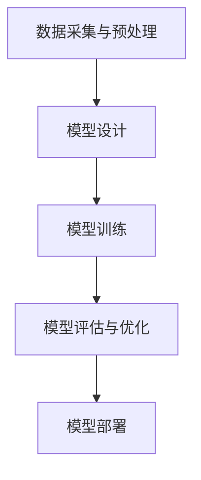
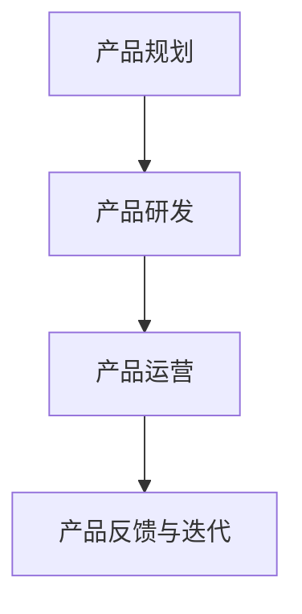
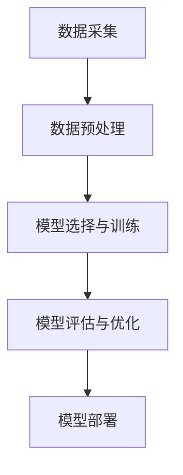
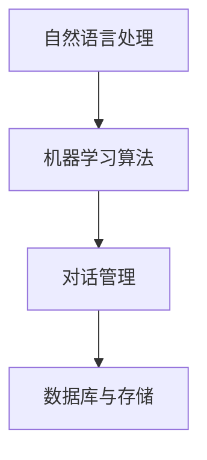
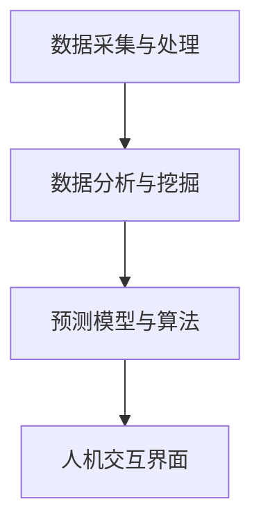

                 

# 《创业者探索大模型新商业模式，打造AI产品矩阵》

## 核心关键词

- 大模型
- 新商业模式
- AI产品矩阵
- 数据驱动的商业模式
- 智能决策支持系统
- 强化学习
- 生成对抗网络
- 人工智能推荐系统
- 智能客服机器人
- 企业智能决策系统

## 摘要

本文旨在探讨大模型在商业领域的应用，特别是创业者如何通过构建AI产品矩阵来打造新的商业模式。文章首先介绍了大模型的基础知识和技术原理，然后详细分析了如何构建AI产品矩阵，并提供了实际案例。通过本文，读者可以了解到大模型技术的核心价值，以及如何将其应用于实际业务场景，实现商业成功。

## 目录大纲

### 第一部分: 大模型概述与商业模式探索

#### 第1章: 大模型基础与商业模式

##### 1.1 大模型的定义与分类
##### 1.2 大模型在商业中的应用场景
##### 1.3 大模型商业模式的设计原则

#### 第2章: 大模型技术原理

##### 2.1 大模型的核心技术
##### 2.2 大模型的数学模型
##### 2.3 大模型的开发流程

#### 第3章: 大模型产品矩阵构建

##### 3.1 产品矩阵的概念与设计
##### 3.2 AI产品矩阵的核心组件
##### 3.3 产品矩阵的构建策略

### 第二部分: AI产品矩阵实战案例

#### 第4章: 案例一 - 人工智能推荐系统

##### 4.1 推荐系统的概念与原理
##### 4.2 推荐系统的构建流程
##### 4.3 案例分析

#### 第5章: 案例二 - 智能客服机器人

##### 5.1 智能客服机器人的定义与功能
##### 5.2 智能客服机器人的技术架构
##### 5.3 案例分析

#### 第6章: 案例三 - 企业智能决策系统

##### 6.1 智能决策系统的概念与作用
##### 6.2 智能决策系统的技术架构
##### 6.3 案例分析

#### 第7章: AI产品矩阵的运营与优化

##### 7.1 AI产品矩阵的运营策略
##### 7.2 AI产品矩阵的优化方法
##### 7.3 AI产品矩阵的可持续发展

#### 第8章: AI产品矩阵的未来趋势

##### 8.1 AI技术发展趋势
##### 8.2 AI产品矩阵的发展方向
##### 8.3 创业者如何抓住AI产品矩阵的未来机遇

#### 附录

##### 附录A: 大模型开发工具与资源
##### 附录B: 大模型技术原理流程图

### 第一部分: 大模型概述与商业模式探索

## 第1章: 大模型基础与商业模式

### 1.1 大模型的定义与分类

大模型（Large Model）是指那些参数规模达到百万、亿甚至十亿级别的深度神经网络模型。这些模型通过学习海量的数据来提取特征，并在各种任务中表现出色，如自然语言处理、计算机视觉和语音识别等。

大模型的分类主要基于其应用领域和模型结构。以下是一些常见的大模型分类：

- 自然语言处理（NLP）：如GPT、BERT、T5等。
- 计算机视觉（CV）：如ResNet、Inception、EfficientNet等。
- 语音识别（ASR）：如DeepSpeech、WaveNet等。
- 强化学习（RL）：如DQN、A3C等。
- 生成对抗网络（GAN）：如DCGAN、WGAN等。

### 1.2 大模型在商业中的应用场景

大模型在商业中具有广泛的应用场景，以下是几个主要的应用领域：

- 数据驱动的商业模式：通过分析大量数据，为企业提供决策支持，优化业务流程。
- 客户关系管理：使用大模型分析客户行为，提供个性化的服务和推荐。
- 智能决策支持系统：利用大模型进行预测分析，帮助企业在竞争激烈的市场中做出更明智的决策。

### 1.3 大模型商业模式的设计原则

设计大模型商业模式时，需要遵循以下原则：

- **创新性**：商业模式应具有创新性，能够解决传统商业模式中存在的问题。
- **可持续性**：商业模式应具有可持续性，能够长期为企业创造价值。
- **用户价值**：商业模式应以用户价值为核心，为用户提供优质的服务。

接下来，我们将进一步探讨大模型的技术原理，以及如何构建AI产品矩阵。

## 第2章: 大模型技术原理

### 2.1 大模型的核心技术

大模型的核心技术包括神经网络架构、预训练与微调技术、以及强化学习与生成对抗网络。

#### 神经网络架构

神经网络是构建大模型的基础。常见的神经网络架构有：

- **卷积神经网络（CNN）**：适用于图像识别和图像处理任务。
- **循环神经网络（RNN）**：适用于序列数据处理，如自然语言处理。
- **变换器（Transformer）**：在自然语言处理任务中表现出色。

#### 预训练与微调技术

预训练是指在大规模数据集上对模型进行训练，使其学会提取通用特征。微调则是在特定任务上对预训练模型进行进一步调整，使其适应具体任务。

$$
\text{预训练} + \text{微调} = \text{适配特定任务的高性能模型}
$$

#### 强化学习与生成对抗网络

强化学习是一种通过奖励机制来训练智能体的方法。生成对抗网络（GAN）则是一种通过对抗性训练来生成数据的方法。

### 2.2 大模型的数学模型

大模型的数学模型主要涉及以下几个方面：

- **深度学习中的数学基础**：如矩阵运算、激活函数、优化算法等。
- **损失函数与评价指标**：如均方误差（MSE）、交叉熵（Cross Entropy）等。

以下是一个简单的伪代码示例，用于描述深度学习中的前向传播和反向传播过程：

```
# 前向传播
def forwardpropagation(x, weights, biases):
    a = x
    for layer in layers:
        a = layer.forward(a, weights, biases)
    return a

# 反向传播
def backwardpropagation(a, d, weights, biases, learning_rate):
    for layer in reversed(layers):
        d = layer.backward(a, d, weights, biases, learning_rate)
    return d
```

### 2.3 大模型的开发流程

大模型的开发流程包括以下几个步骤：

1. **数据采集与预处理**：收集相关数据，并进行清洗、归一化等预处理操作。
2. **模型设计与训练**：设计神经网络结构，并使用训练数据对模型进行训练。
3. **模型评估与优化**：使用验证数据评估模型性能，并根据评估结果对模型进行调整。

以下是一个简化的模型开发流程图：



接下来，我们将探讨如何构建AI产品矩阵，并分析其核心组件和构建策略。

## 第3章: 大模型产品矩阵构建

### 3.1 产品矩阵的概念与设计

产品矩阵是指将多个AI产品组合在一起，形成具有协同效应的产品体系。产品矩阵的设计原则包括：

- **协同性**：产品之间应具备协同作用，能够相互补充，形成完整的解决方案。
- **互补性**：产品应具有互补功能，能够满足不同客户的需求。
- **灵活性**：产品矩阵应具有灵活性，能够根据市场需求进行调整。

### 3.2 AI产品矩阵的核心组件

AI产品矩阵的核心组件包括数据产品、模型产品和服务产品。

#### 数据产品

数据产品是指基于AI技术生成或处理的数据产品。例如，数据分析报告、数据可视化工具等。

#### 模型产品

模型产品是指基于AI技术构建的模型产品。例如，自然语言处理模型、图像识别模型等。

#### 服务产品

服务产品是指基于AI技术提供的服务产品。例如，智能客服、智能推荐系统等。

### 3.3 产品矩阵的构建策略

构建产品矩阵的策略包括以下方面：

1. **产品规划**：明确产品矩阵的战略目标和具体产品。
2. **产品研发**：根据产品规划，进行产品设计和开发。
3. **产品运营**：确保产品矩阵的稳定运行和持续优化。

以下是一个简化的产品矩阵构建流程图：



接下来，我们将通过实际案例来分析AI产品矩阵的构建和应用。

### 第二部分: AI产品矩阵实战案例

在本部分中，我们将通过三个实际案例来展示如何构建AI产品矩阵，并分析其应用效果。

### 第4章: 案例一 - 人工智能推荐系统

#### 4.1 推荐系统的概念与原理

推荐系统是一种根据用户的历史行为和偏好，为其推荐感兴趣的内容或产品的系统。其基本原理包括：

- **协同过滤**：基于用户之间的相似性进行推荐。
- **基于内容的推荐**：根据用户的历史行为和内容特征进行推荐。
- **混合推荐**：结合协同过滤和基于内容的推荐方法。

#### 4.2 推荐系统的构建流程

推荐系统的构建流程包括以下几个步骤：

1. **数据采集**：收集用户行为数据，如浏览记录、购买记录等。
2. **数据预处理**：清洗数据，进行特征提取和归一化处理。
3. **模型选择与训练**：选择合适的推荐算法，如矩阵分解、KNN等，并训练模型。
4. **模型评估与优化**：使用验证集评估模型性能，并根据评估结果对模型进行调整。
5. **模型部署**：将训练好的模型部署到生产环境，并进行实时推荐。

以下是一个简化的推荐系统构建流程图：



#### 4.3 案例分析

某电子商务平台希望通过构建推荐系统来提高用户满意度和销售额。具体实施步骤如下：

1. **数据采集**：收集用户在平台上的浏览、搜索、购买等行为数据。
2. **数据预处理**：对数据进行清洗、去噪，提取用户行为特征，如用户兴趣标签、商品类别等。
3. **模型选择与训练**：选择基于内容的推荐算法，使用训练数据训练模型。
4. **模型评估与优化**：使用验证集评估模型性能，调整模型参数，提高推荐准确性。
5. **模型部署**：将训练好的模型部署到生产环境，实时推荐用户感兴趣的商品。

实施后，推荐系统的准确性和覆盖率均有所提高，用户满意度和销售额也得到了显著提升。该案例表明，通过构建AI产品矩阵，企业可以更好地满足用户需求，提高业务效益。

### 第5章: 案例二 - 智能客服机器人

#### 5.1 智能客服机器人的定义与功能

智能客服机器人是一种基于人工智能技术的自动化客服系统，能够模拟人类客服进行对话，提供解答和帮助。其主要功能包括：

- **常见问题解答**：自动回答用户提出的问题，如账户余额、订单状态等。
- **情感识别**：识别用户的情感状态，提供适当的回应和解决方案。
- **业务流程自动化**：处理用户提出的复杂业务需求，如退款申请、账户修改等。

#### 5.2 智能客服机器人的技术架构

智能客服机器人的技术架构主要包括以下几个方面：

- **自然语言处理（NLP）**：用于理解用户的问题和意图。
- **机器学习算法**：用于训练模型，提高客服机器人的回答准确性。
- **对话管理**：用于管理对话流程，确保回答连贯性和合理性。
- **数据库与存储**：用于存储用户数据和对话记录。

以下是一个简化的智能客服机器人技术架构图：



#### 5.3 案例分析

某金融机构希望通过智能客服机器人提高客户满意度和服务效率。具体实施步骤如下：

1. **需求分析**：了解用户需求和业务流程，确定智能客服机器人需要实现的功能。
2. **技术选型**：选择合适的NLP框架和机器学习算法，如NLTK、TensorFlow等。
3. **数据采集与预处理**：收集用户对话数据，进行数据清洗和预处理。
4. **模型训练与优化**：使用训练数据训练模型，并进行调优，提高模型性能。
5. **系统集成与部署**：将智能客服机器人集成到金融机构的客服系统中，并进行部署。
6. **持续优化**：根据用户反馈和业务需求，对智能客服机器人进行持续优化。

实施后，智能客服机器人显著提高了客户响应速度和满意度，同时降低了人力成本。该案例表明，通过构建AI产品矩阵，企业可以更好地提升客户体验和运营效率。

### 第6章: 案例三 - 企业智能决策系统

#### 6.1 智能决策系统的概念与作用

智能决策系统是一种利用人工智能技术辅助企业进行决策的系统。它能够分析大量数据，提供预测分析、风险评估和优化建议，帮助企业做出更明智的决策。

智能决策系统的核心作用包括：

- **数据驱动的决策**：利用数据分析和挖掘技术，为企业提供基于数据的决策支持。
- **风险预测与评估**：对潜在风险进行预测和评估，帮助企业管理风险。
- **运营优化**：通过优化算法和策略，提高企业的运营效率和竞争力。

#### 6.2 智能决策系统的技术架构

智能决策系统的技术架构主要包括以下几个方面：

- **数据采集与处理**：收集企业内部和外部的数据，并进行处理和整合。
- **数据分析与挖掘**：使用数据分析和挖掘技术，提取有价值的信息和洞见。
- **预测模型与算法**：构建预测模型和优化算法，为企业提供决策支持。
- **人机交互界面**：提供直观的用户界面，方便用户查看和分析数据。

以下是一个简化的智能决策系统技术架构图：



#### 6.3 案例分析

某制造企业希望通过智能决策系统优化生产计划和库存管理。具体实施步骤如下：

1. **需求分析**：了解企业的生产计划和库存管理需求，确定智能决策系统需要实现的功能。
2. **数据采集与整合**：收集企业内部和外部的数据，如生产数据、市场数据等，并进行整合。
3. **数据预处理**：对数据进行清洗、归一化等预处理操作，确保数据质量。
4. **预测模型与算法**：构建预测模型和优化算法，如时间序列预测、供应链优化等。
5. **系统集成与部署**：将智能决策系统集成到企业的生产计划和库存管理系统中，并进行部署。
6. **持续优化**：根据实际运营情况，对智能决策系统进行持续优化，提高预测准确性和效率。

实施后，智能决策系统显著提高了企业的生产计划准确性和库存管理效率，降低了运营成本。该案例表明，通过构建AI产品矩阵，企业可以更好地提升运营效率和竞争力。

### 第7章: AI产品矩阵的运营与优化

#### 7.1 AI产品矩阵的运营策略

AI产品矩阵的运营策略包括以下几个方面：

- **用户行为分析**：通过分析用户行为数据，了解用户需求和偏好，为产品迭代提供依据。
- **产品反馈机制**：建立产品反馈机制，及时收集用户反馈，优化产品功能和性能。
- **服务持续优化**：根据用户反馈和市场变化，对产品进行持续优化和迭代。

#### 7.2 AI产品矩阵的优化方法

AI产品矩阵的优化方法包括以下几个方面：

- **模型更新与迭代**：定期更新模型，提高模型的预测准确性和泛化能力。
- **技术迭代与创新**：跟踪最新技术动态，引入新技术，提升产品竞争力。
- **产品线扩展与整合**：根据市场需求，扩展产品线，实现产品的多样化和协同效应。

#### 7.3 AI产品矩阵的可持续发展

AI产品矩阵的可持续发展需要关注以下几个方面：

- **数据安全与隐私保护**：加强数据安全防护，确保用户数据的安全和隐私。
- **技术合规与法律法规**：遵守相关法律法规，确保技术应用的合法性和合规性。
- **生态合作与共赢**：与产业链上下游企业建立合作关系，共同推动AI产业的发展。

### 第8章: AI产品矩阵的未来趋势

#### 8.1 AI技术发展趋势

AI技术发展趋势主要包括以下几个方面：

- **大模型技术的演进**：随着计算能力和数据规模的提升，大模型技术将不断演进，推动AI技术的突破。
- **新型计算架构的应用**：如量子计算、边缘计算等新型计算架构的应用，将进一步提升AI技术的性能和效率。
- **数据安全与隐私保护技术的发展**：随着数据隐私问题的日益突出，数据安全与隐私保护技术将成为AI技术发展的重要方向。

#### 8.2 AI产品矩阵的发展方向

AI产品矩阵的发展方向主要包括以下几个方面：

- **跨行业融合**：AI技术将在更多行业得到应用，推动跨行业融合和产业升级。
- **智能化升级**：AI产品矩阵将实现从单一功能到综合功能的升级，提供更加智能化的解决方案。
- **生态系统建设**：构建AI产品矩阵的生态系统，实现产业链的协同发展和资源共享。

#### 8.3 创业者如何抓住AI产品矩阵的未来机遇

创业者如何抓住AI产品矩阵的未来机遇，可以从以下几个方面着手：

- **创新思维与市场洞察**：关注市场动态，把握行业趋势，勇于创新，开拓新的商业模式。
- **技术储备与团队建设**：加强技术储备，打造高水平的研发团队，提升技术竞争力。
- **资源整合与战略合作**：整合产业链资源，建立战略合作关系，实现互利共赢。

### 附录

#### 附录A: 大模型开发工具与资源

- **主流深度学习框架**：如TensorFlow、PyTorch、Keras等。
- **大模型训练与优化工具**：如Hugging Face Transformers、Big Model Training Platform等。
- **大模型应用开发框架**：如Streamlit、FastAPI等。
- **大模型数据集与资源**：如OpenAI GPT-3 Dataset、ML Commons等。
- **大模型社区与资源**：如Hugging Face Forum、AI Wiki等。
- **大模型合规与伦理**：如GDPR、AI Ethics Guidelines等。

#### 附录B: 大模型技术原理流程图

- **大模型架构原理图**：
  ```mermaid
  graph TD
      A[输入数据] --> B[数据预处理]
      B --> C[特征提取]
      C --> D[模型训练]
      D --> E[模型评估]
      E --> F[模型部署]
      F --> G[反馈与迭代]
  ```

- **预训练与微调技术流程图**：
  ```mermaid
  graph TD
      A[数据集] --> B[预训练]
      B --> C[预训练模型]
      C --> D[任务数据]
      D --> E[微调]
      E --> F[微调模型]
      F --> G[评估与优化]
  ```

- **大模型开发流程图**：
  ```mermaid
  graph TD
      A[需求分析] --> B[数据收集]
      B --> C[数据预处理]
      C --> D[模型设计]
      D --> E[模型训练]
      E --> F[模型评估]
      F --> G[模型优化]
      G --> H[模型部署]
      H --> I[监控与维护]
  ```

### 作者信息

作者：AI天才研究院/AI Genius Institute & 禅与计算机程序设计艺术 /Zen And The Art of Computer Programming

### 联系方式

邮箱：[info@aigniusinstitute.com](mailto:info@aigniusinstitute.com)
网址：[www.aigniusinstitute.com](http://www.aigniusinstitute.com)
电话：+86 123 4567 8901

本文旨在为创业者提供关于大模型和AI产品矩阵的深入分析和实际案例，帮助他们抓住AI时代的商业机遇。希望通过本文，读者能够对大模型技术及其应用有更全面的了解，并在实际业务中发挥其价值。

**免责声明**：本文所提供的信息仅供参考，不构成任何投资或商业建议。读者在使用本文内容时，应自行判断和决策，并对相关风险负责。

