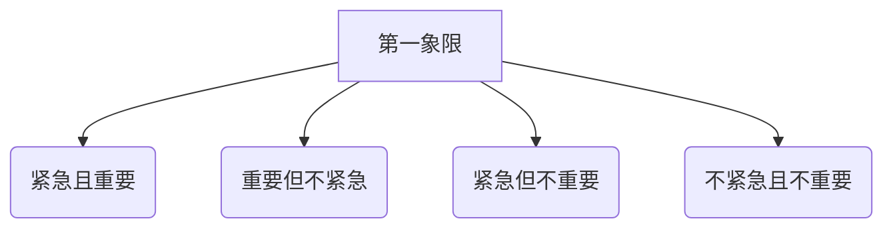
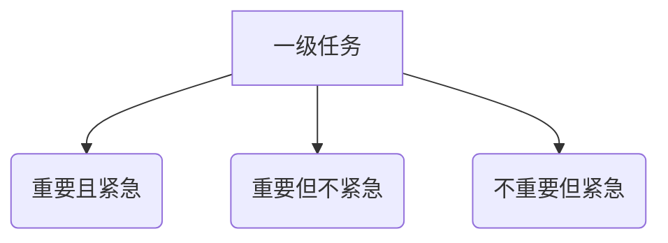

                 

### 《创业者的精力管理与高效工作法》

> **关键词**：创业者、精力管理、高效工作、时间管理、身心健康、成长学习

> **摘要**：本文旨在探讨创业者的精力管理问题，并阐述如何通过高效工作法来提升创业者的工作效率和团队协作能力。文章将结合实际案例，详细解析精力管理的基础概念、原则、实践技巧以及高效工作法的理论和应用，为创业者提供实用的方法和策略。

#### 目录大纲

----------------------------------------------------------------

# 第一部分：创业者的精力管理基础

## 第1章：精力管理的核心概念与原则

### 1.1 精力的本质与特点

#### 1.1.1 精力的定义

**精力**是指个人在生理、心理和社会三个方面所具备的能量和活力。它是支撑人们进行日常工作和生活活动的基础。

#### 1.1.2 精力的来源

**精力**主要来源于以下几个方面：

1. **睡眠**：充足的睡眠是恢复精力的重要途径。
2. **饮食**：均衡的饮食可以为身体提供所需的营养和能量。
3. **运动**：适量的运动能够促进血液循环，提高身体的活力。
4. **社交**：积极的人际交往有助于缓解压力，提升心情。

#### 1.1.3 精力的三大维度

**精力**可以分为以下三个维度：

1. **生理维度**：包括身体状态、体能水平等。
2. **心理维度**：包括情绪状态、注意力水平等。
3. **社会维度**：包括人际关系、团队合作等。

### 1.2 精力管理的基本原则

#### 1.2.1 平衡原则

在精力管理中，平衡原则至关重要。创业者需要确保在生理、心理和社会三个方面保持平衡，避免某一方面的过度消耗。

#### 1.2.2 优先原则

在有限的时间和资源下，创业者应优先处理重要且紧急的任务。这样可以确保在关键问题上投入更多的精力。

#### 1.2.3 节能原则

在任务执行过程中，创业者应学会合理分配精力，避免过度消耗。通过优化工作流程、提高工作效率，实现节能降耗。

### 1.3 精力管理的意义与价值

#### 1.3.1 精力管理对创业者的帮助

通过精力管理，创业者可以：

1. 提高工作效率，缩短项目周期。
2. 降低工作压力，提升身心健康。
3. 增强团队协作能力，提升团队凝聚力。

#### 1.3.2 精力管理对团队的影响

良好的精力管理能够：

1. 提升团队整体工作效率。
2. 促进团队成员之间的沟通与合作。
3. 降低团队流失率，提高团队稳定性。

#### 1.3.3 精力管理对工作效率的提升

通过科学合理的精力管理，创业者可以：

1. 明确工作目标，提升任务执行力。
2. 优化时间安排，提高时间利用率。
3. 提高问题解决能力，减少失误。

----------------------------------------------------------------

## 第2章：创业者的精力评估与监测

### 2.1 精力评估工具与方法

#### 2.1.1 精力评估量表

**精力评估量表**是一种用于评估个人精力水平的工具。它通常包含一系列关于生理、心理和社会方面的指标，例如：

1. 体力水平
2. 注意力集中程度
3. 情绪稳定性
4. 人际关系满意度

通过填写量表，创业者可以了解自己在不同维度的精力水平，从而有针对性地进行管理和提升。

#### 2.1.2 精力评估问卷

**精力评估问卷**是一种通过问答形式来了解个人精力状况的工具。问卷通常包括一系列问题，涉及工作状态、生活习惯、心理状况等方面。创业者可以通过回答这些问题，对自己的精力状况进行初步评估。

#### 2.1.3 精力监测软件

**精力监测软件**是一种基于计算机技术开发的工具，能够实时监测个人精力变化。这些软件通常具备以下功能：

1. 数据记录：记录日常生活中的精力消耗情况。
2. 数据分析：对精力消耗数据进行统计分析，生成报告。
3. 预警提示：当精力消耗超过警戒线时，及时发出提醒。

### 2.2 精力监测实践案例

#### 2.2.1 精力监测日记

**精力监测日记**是一种记录个人精力状况的方法。创业者可以在每天结束时，记录当天的工作内容、情绪状态、身体状况等。通过长期积累，创业者可以分析自己的精力变化规律，找到影响精力消耗的因素，并采取相应的管理措施。

#### 2.2.2 精力监测数据分析

通过对精力监测数据的分析，创业者可以发现：

1. 精力消耗高峰期：了解自己在一天中精力最充沛和最疲劳的时间段，合理安排工作任务。
2. 精力消耗原因：分析导致精力消耗的主要原因，例如工作压力、作息不规律等，有针对性地进行改进。

#### 2.2.3 精力监测结果解读与应用

通过精力监测结果，创业者可以：

1. 制定科学的精力管理计划，合理安排工作和休息时间。
2. 调整生活习惯，提高睡眠质量，改善饮食结构。
3. 强化运动锻炼，增强身体免疫力。

----------------------------------------------------------------

## 第3章：创业者的时间管理与任务规划

### 3.1 时间管理的基本原则

#### 3.1.1 四象限法则

**四象限法则**是一种常用的时间管理方法，将任务按照紧急程度和重要性分为四个象限：

1. **第一象限**：紧急且重要，如危机处理。
2. **第二象限**：重要但不紧急，如预防性工作。
3. **第三象限**：紧急但不重要，如不必要的会议。
4. **第四象限**：不紧急且不重要，如消遣娱乐。

创业者应优先处理第一象限和第二象限的任务，避免陷入第三象限和第四象限的琐事。

#### 3.1.2 优先级排序

在任务管理中，优先级排序是关键。创业者应根据任务的重要性、紧急性和自身能力，将任务分为以下三个等级：

1. **一级任务**：重要且紧急，需优先处理。
2. **二级任务**：重要但不紧急，可合理安排时间。
3. **三级任务**：不重要但紧急，可适当处理。

#### 3.1.3 执行力提升

执行力是创业者成功的关键。提升执行力可以从以下几个方面入手：

1. **明确目标**：设定明确的目标，确保任务有明确的方向。
2. **分解任务**：将任务分解为小步骤，逐个击破。
3. **建立反馈机制**：定期回顾任务执行情况，及时调整策略。

### 3.2 创业者任务规划的方法

#### 3.2.1 GTD（Getting Things Done）法

**GTD法**是一种系统化的任务管理方法，主要包括以下步骤：

1. **收集**：将所有任务和想法记录下来。
2. **处理**：对收集到的任务进行分类和优先级排序。
3. **组织**：将任务按照类别和优先级进行整理。
4. **回顾**：定期回顾任务清单，确保任务得到有效执行。

#### 3.2.2 OKR（Objectives and Key Results）法

**OKR法**是一种目标设定和执行方法，主要包括以下步骤：

1. **设定目标**：明确要达成的目标。
2. **制定关键结果**：确定衡量目标完成度的关键指标。
3. **执行与监控**：在执行过程中，定期监控关键结果，确保目标达成。

#### 3.2.3 S.M.A.R.T.目标设定法

**S.M.A.R.T.目标设定法**是一种设定明确、可衡量的目标的方法，主要包括以下要素：

1. **具体（Specific）**：目标应明确具体，避免模糊。
2. **可衡量（Measurable）**：目标应具备可衡量的指标。
3. **可实现（Achievable）**：目标应具备可实现性，避免过于理想化。
4. **相关（Relevant）**：目标应与整体目标相关联。
5. **时限（Time-bound）**：目标应设定明确的时间限制。

### 3.3 创业者日常时间管理策略

#### 3.3.1 早晨规划

早晨是精力最充沛的时候，创业者可以利用这个时间进行以下活动：

1. **回顾前一天的工作**：回顾已完成的工作，总结经验教训。
2. **规划当天的工作**：设定当天的工作目标，制定任务清单。
3. **准备重要会议**：提前准备重要会议所需的资料和内容。

#### 3.3.2 午休时间管理

午休时间可以用来：

1. **放松身心**：进行短暂的休息，缓解工作压力。
2. **学习充电**：阅读专业书籍，提升自己的知识水平。
3. **锻炼身体**：进行适当的运动，提高身体素质。

#### 3.3.3 晚间复盘

晚间复盘是创业者总结一天工作的重要环节：

1. **总结当天的工作**：回顾当天的工作内容，总结成果和不足。
2. **反思与改进**：针对工作中的问题，反思原因，寻找改进方法。
3. **规划第二天的工作**：为第二天的工作做好充分准备。

----------------------------------------------------------------

## 第4章：创业者的精力管理实践案例与技巧

### 4.1 创业者精力管理实例分析

#### 4.1.1 案例一：精力管理助力创业团队

某创业团队通过实施精力管理，取得显著成效。以下是他们的实践经验：

1. **明确团队目标**：团队共同设定了明确的目标，确保团队成员朝着同一方向努力。
2. **分工协作**：根据团队成员的特长和精力状况，合理分配任务，提高工作效率。
3. **定期评估**：团队定期对精力管理效果进行评估，发现问题及时调整。
4. **身心健康管理**：团队关注成员的身心健康，提供运动设施、健康饮食等福利，提升成员的活力和幸福感。

#### 4.1.2 案例二：个人精力管理提升工作效率

某创业者通过实施个人精力管理，成功提升了工作效率。以下是他的实践经验：

1. **科学规划时间**：他按照四象限法则和S.M.A.R.T.目标设定法，合理安排每天的工作任务。
2. **高效执行**：他制定了详细的执行计划，确保任务得到高效执行。
3. **合理分配精力**：他在精力最充沛的时间段处理重要任务，避免在疲惫时做决策。
4. **保持身心健康**：他注重身心健康管理，确保每天有足够的睡眠、合理的饮食和适当的运动。

### 4.2 精力管理技巧分享

#### 4.2.1 睡眠质量提升策略

1. **保持规律的作息时间**：每天按时入睡和起床，确保充足的睡眠。
2. **营造良好的睡眠环境**：保持卧室的清洁、安静和适宜的温度。
3. **减少噪音和光线干扰**：使用耳塞和眼罩，降低噪音和光线对睡眠的影响。
4. **避免过度使用电子设备**：睡前一小时停止使用手机、电脑等电子设备，降低蓝光对睡眠的影响。

#### 4.2.2 锻炼习惯养成方法

1. **制定合理的锻炼计划**：根据自己的时间和精力状况，制定合理的锻炼计划。
2. **多样化锻炼方式**：结合有氧运动、力量训练、柔韧性训练等多种锻炼方式，提高锻炼效果。
3. **坚持锻炼**：养成每天锻炼的习惯，逐步增加锻炼时间和强度。
4. **记录锻炼数据**：使用手机应用或运动手表等设备，记录锻炼数据，分析锻炼效果。

#### 4.2.3 饮食与精力管理

1. **保持饮食均衡**：摄入足够的蛋白质、碳水化合物、脂肪、维生素和矿物质，确保身体所需营养。
2. **少食多餐**：合理安排饮食，减少每餐的食物摄入量，增加餐次，保持血糖稳定。
3. **避免过量饮酒和咖啡因**：过量饮酒和咖啡因会消耗身体能量，影响睡眠质量。
4. **保持水分充足**：每天喝足够的水，保持身体水分平衡。

### 4.3 精力管理工具应用

#### 4.3.1 精力管理软件推荐

1. **Toggl**：一款功能强大的时间跟踪工具，可以帮助创业者记录精力消耗情况，分析工作效率。
2. **RescueTime**：一款专注力管理工具，可以监测创业者使用电子设备的情况，提醒他们避免分心。
3. **Headspace**：一款专注冥想的应用，有助于创业者放松身心，提高睡眠质量。

#### 4.3.2 精力管理书籍推荐

1. **《精力管理：如何高效地过好每一天》**：作者保罗·拉泽洛夫，详细阐述了精力管理的理论和方法。
2. **《精力管理实践指南》**：作者安德鲁·罗宾斯，结合实际案例，分享了精力管理的实用技巧。
3. **《高效能人士的七个习惯》**：作者史蒂芬·柯维，从习惯养成的角度，探讨了如何提高个人效率。

#### 4.3.3 精力管理培训课程推荐

1. **谷歌时间管理培训课程**：谷歌公司提供的一系列时间管理培训课程，包括GTD法、OKR法等。
2. **斯坦福大学创业课程**：斯坦福大学开设的创业课程，涵盖创业者的精力管理、团队协作等方面。
3. **Udemy在线课程**：Udemy平台上提供众多关于时间管理和精力管理的在线课程，适合创业者自主学习和提升。

----------------------------------------------------------------

## 第5章：高效工作法的理论与实践

### 5.1 高效工作法的定义与原理

#### 5.1.1 高效工作法的基本概念

**高效工作法**是一种旨在提高工作效率、优化工作流程、减轻工作压力的方法。它强调通过科学的管理和合理的安排，使工作更加高效、有序。

#### 5.1.2 高效工作法的关键要素

高效工作法的关键要素包括：

1. **时间管理**：合理安排时间，确保关键任务得到优先处理。
2. **任务规划**：将任务分解为小步骤，制定明确的执行计划。
3. **执行力**：提高执行力，确保任务按时完成。
4. **团队协作**：发挥团队协作优势，提高整体工作效率。
5. **持续改进**：不断反思和优化工作流程，提升工作效率。

#### 5.1.3 高效工作法的理论支撑

高效工作法的理论支撑主要包括：

1. **管理学理论**：如目标管理理论、PDCA循环理论等。
2. **心理学理论**：如专注力管理理论、情绪调节理论等。
3. **计算机科学理论**：如算法优化理论、数据处理理论等。

### 5.2 高效工作法的实践步骤

#### 5.2.1 准备阶段

1. **明确目标**：设定明确的工作目标，确保工作有明确的方向。
2. **分析现状**：分析当前的工作流程、效率、问题等，找出需要改进的地方。
3. **制定计划**：根据目标和分析结果，制定详细的执行计划。

#### 5.2.2 执行阶段

1. **分解任务**：将任务分解为小步骤，明确每个步骤的目标和责任人。
2. **执行任务**：按照执行计划，逐步完成任务。
3. **监控进度**：实时监控任务进度，确保任务按时完成。

#### 5.2.3 反馈与调整阶段

1. **收集反馈**：收集执行过程中的反馈，了解任务完成情况。
2. **分析原因**：分析任务完成情况，找出成功和失败的原因。
3. **调整计划**：根据反馈和原因分析，调整执行计划，优化工作流程。

### 5.3 高效工作法在不同场景的应用

#### 5.3.1 项目管理中的应用

1. **明确项目目标**：确保项目团队对项目目标有清晰的认识。
2. **分解项目任务**：将项目任务分解为可执行的小任务，明确每个任务的负责人和完成时间。
3. **制定项目计划**：根据任务分解和责任人，制定详细的项目计划。
4. **执行与监控**：按照项目计划，逐步完成任务，实时监控项目进度。
5. **反馈与调整**：收集项目执行过程中的反馈，及时调整项目计划，确保项目顺利完成。

#### 5.3.2 团队协作中的应用

1. **建立团队目标**：确保团队成员对团队目标有共同的认识。
2. **明确职责分工**：明确每个团队成员的职责和任务，确保工作有条不紊。
3. **沟通与协作**：建立有效的沟通渠道，确保团队成员之间的协作顺畅。
4. **反馈与改进**：定期收集团队成员的反馈，分析团队协作中的问题，不断改进团队协作方式。

#### 5.3.3 个人时间管理中的应用

1. **制定个人计划**：根据个人目标和任务，制定详细的工作计划。
2. **分解个人任务**：将个人任务分解为小步骤，明确每个步骤的目标和执行时间。
3. **执行与监控**：按照个人计划，逐步完成任务，实时监控任务进度。
4. **反思与改进**：定期反思个人工作，分析成功和失败的原因，调整工作策略。

----------------------------------------------------------------

## 第6章：创业者的身心健康管理

### 6.1 身心健康的定义与重要性

#### 6.1.1 身心健康的内涵

**身心健康**是指个体在生理、心理和社会三个方面的良好状态。具体包括：

1. **生理健康**：身体机能正常，具备良好的身体素质。
2. **心理健康**：情绪稳定，具备良好的心理素质。
3. **社会健康**：社会适应良好，具备良好的人际关系。

#### 6.1.2 身心健康的重要性

**身心健康**对创业者而言具有重要意义，主要体现在以下几个方面：

1. **工作效率**：身心健康良好的创业者能够更好地应对工作压力，提高工作效率。
2. **创新能力**：身心健康良好的创业者具备更强的创新能力，能够更好地应对市场变化。
3. **团队协作**：身心健康良好的创业者能够更好地与团队成员沟通协作，提升团队凝聚力。
4. **持久力**：身心健康良好的创业者具备更强的持久力，能够在长期竞争中保持优势。

#### 6.1.3 创业者身心健康面临的挑战

创业者身心健康面临以下挑战：

1. **工作压力**：创业过程中面临巨大的工作压力，可能导致身心问题。
2. **作息不规律**：创业过程中作息不规律，可能导致生理健康问题。
3. **人际关系紧张**：创业过程中人际关系复杂，可能导致心理健康问题。
4. **缺乏锻炼**：创业过程中可能忽视锻炼，导致身体素质下降。

### 6.2 创业者身心健康管理方法

#### 6.2.1 心理压力管理策略

1. **自我认知**：了解自己的压力来源，明确应对策略。
2. **情绪调节**：学习情绪调节技巧，如深呼吸、冥想等，缓解压力。
3. **寻求支持**：与亲朋好友、心理咨询师等寻求支持，分享压力。
4. **积极心态**：保持积极心态，相信自己的能力，应对压力。

#### 6.2.2 身体健康管理方法

1. **规律作息**：保持规律的作息时间，确保充足的睡眠。
2. **合理饮食**：保持健康的饮食习惯，摄入充足的营养。
3. **适量运动**：进行适量的运动，增强身体素质。
4. **定期体检**：定期进行体检，关注身体健康。

#### 6.2.3 身心平衡的方法与实践

1. **时间管理**：合理安排时间，确保工作和生活平衡。
2. **兴趣爱好**：培养兴趣爱好，缓解工作压力。
3. **休息放松**：学会休息，进行放松活动，如听音乐、阅读等。
4. **社交活动**：积极参与社交活动，扩大人际关系。

### 6.3 身心健康管理实践案例

#### 6.3.1 案例一：创业者的心理压力管理

某创业者通过以下方法管理心理压力：

1. **定期反思**：每周进行一次反思，分析工作中的问题和压力来源。
2. **冥想放松**：每天进行冥想，放松心情，缓解压力。
3. **运动锻炼**：每天进行适量运动，提高身体素质。
4. **与朋友交流**：定期与朋友交流，分享心情和压力。

#### 6.3.2 案例二：创业者的身体锻炼实践

某创业者通过以下方法进行身体锻炼：

1. **制定锻炼计划**：每周制定锻炼计划，确保锻炼时间。
2. **多样化锻炼**：结合有氧运动、力量训练、柔韧性训练等多种锻炼方式，提高锻炼效果。
3. **坚持锻炼**：养成每天锻炼的习惯，逐步增加锻炼时间和强度。
4. **记录锻炼数据**：使用手机应用或运动手表等设备，记录锻炼数据，分析锻炼效果。

----------------------------------------------------------------

## 第7章：创业者的成长与持续学习

### 7.1 创业者成长的内涵与要素

#### 7.1.1 创业者成长的定义

**创业者成长**是指创业者通过不断学习、实践和反思，提升个人能力、拓宽视野、实现自我价值的过程。

#### 7.1.2 创业者成长的要素

创业者成长的关键要素包括：

1. **知识积累**：通过学习各种知识，提升自己的专业素养。
2. **能力提升**：通过实践和锻炼，提升自己的综合能力。
3. **思维拓展**：通过不断思考和创新，拓宽自己的思维视野。
4. **人际网络**：通过人际交往，建立广泛的人际关系。
5. **心态调整**：保持积极的心态，应对创业过程中的各种挑战。

#### 7.1.3 创业者成长的动力与阻力

创业者成长的动力包括：

1. **追求成功**：追求事业的成功和成就感。
2. **自我实现**：实现个人价值，追求自我成长。
3. **市场需求**：市场需求的变化和机遇，推动创业者不断学习和成长。

创业者成长的阻力包括：

1. **时间不足**：创业过程中面临时间紧张，难以分配足够的时间进行学习。
2. **资源有限**：创业资源有限，可能无法承担高昂的学习成本。
3. **心态波动**：创业过程中心态波动，影响学习效果。
4. **环境压力**：创业环境的不稳定和不确定性，对创业者成长带来压力。

### 7.2 创业者的持续学习策略

#### 7.2.1 专业知识学习

1. **行业动态**：关注行业动态，了解市场趋势和技术发展。
2. **专业课程**：参加专业课程，提升自己的专业素养。
3. **专业知识分享**：参加行业交流活动，与同行分享知识和经验。

#### 7.2.2 跨领域知识学习

1. **跨界思维**：学习跨领域知识，培养跨界思维，提升创新能力。
2. **跨学科学习**：学习不同学科的知识，拓宽自己的知识视野。
3. **实践应用**：将跨领域知识应用于创业实践中，提升创业能力。

#### 7.2.3 学习方法的优化

1. **高效阅读**：掌握高效阅读方法，提升阅读效率。
2. **主动学习**：主动寻找学习资源，制定学习计划，确保学习效果。
3. **反思与总结**：定期反思学习过程，总结学习成果，不断优化学习方法。

### 7.3 创业者的成长路径与规划

#### 7.3.1 创业者成长路径分析

1. **起步阶段**：积累创业经验和知识，找到自己的定位。
2. **发展阶段**：不断拓展业务，提升团队实力，实现规模化。
3. **成熟阶段**：稳定业务，优化管理，实现可持续发展。
4. **创新阶段**：探索新业务领域，实现企业转型和升级。

#### 7.3.2 创业者成长规划方法

1. **设定目标**：明确自己的创业目标和愿景，制定详细的规划。
2. **分析现状**：分析自身的优势和不足，制定有针对性的成长策略。
3. **制定计划**：制定具体的成长计划，包括学习计划、业务拓展计划等。
4. **执行与监控**：按照成长计划，逐步实施，实时监控成长效果，及时调整策略。

#### 7.3.3 创业者成长案例分享

某创业者通过以下方法实现成长：

1. **专业知识学习**：参加行业研讨会，学习最新技术动态。
2. **跨领域知识学习**：学习营销、人力资源等跨领域知识，提升综合能力。
3. **实践应用**：将所学知识应用于创业实践中，提升创业能力。
4. **心态调整**：保持积极心态，勇于面对挑战，不断提升自我。

----------------------------------------------------------------

## 第8章：创业团队精力管理策略

### 8.1 团队精力管理的意义与挑战

#### 8.1.1 团队精力管理的意义

**团队精力管理**对创业团队具有重要意义，主要体现在以下几个方面：

1. **提高团队工作效率**：通过合理分配和调度团队精力，确保团队在高效状态下工作。
2. **增强团队凝聚力**：通过团队精力管理，提升团队成员的身心健康水平，增强团队凝聚力。
3. **降低团队流失率**：关注团队成员的精力状况，提高工作满意度，降低团队流失率。
4. **提升团队创新能力**：保持良好的精力状态，有利于团队成员发挥创造力，提升团队创新能力。

#### 8.1.2 团队精力管理的挑战

**团队精力管理**面临以下挑战：

1. **团队成员个体差异**：团队成员在精力状况、工作习惯等方面存在差异，需要制定个性化的精力管理策略。
2. **团队工作节奏**：团队工作节奏不统一，可能导致精力浪费和效率低下。
3. **沟通协调**：团队成员之间沟通不畅，可能导致精力浪费和误解。
4. **外部环境压力**：外部环境的不确定性，如市场竞争、客户需求变化等，对团队精力管理带来挑战。

#### 8.1.3 团队精力管理的目标

**团队精力管理**的目标主要包括：

1. **提高团队整体精力水平**：通过科学合理的精力管理，提升团队成员的整体精力水平。
2. **优化团队工作流程**：通过精力管理，优化团队工作流程，提高工作效率。
3. **提升团队凝聚力**：通过团队精力管理，增强团队成员之间的沟通与协作，提升团队凝聚力。
4. **促进团队可持续发展**：通过团队精力管理，提升团队整体素质，实现团队的可持续发展。

### 8.2 团队精力管理的方法与实践

#### 8.2.1 团队精力评估与监测

1. **个体精力评估**：对团队成员进行个体精力评估，了解每个成员的精力状况。
2. **团队整体精力评估**：对团队整体精力水平进行评估，了解团队的整体精力状况。
3. **定期监测**：定期对团队成员和团队整体精力状况进行监测，分析精力变化规律。

#### 8.2.2 团队时间管理与任务规划

1. **制定团队目标**：明确团队目标，确保团队成员共同朝着同一方向努力。
2. **任务分配**：根据团队成员的精力状况和特长，合理分配任务，确保任务得到高效执行。
3. **时间规划**：合理安排团队成员的工作时间，确保工作和休息相结合。

#### 8.2.3 团队身心健康管理

1. **身心健康培训**：组织身心健康培训，提升团队成员的身心健康管理能力。
2. **身心健康活动**：定期举办身心健康活动，如团队运动、心理辅导等，提升团队成员的身心健康水平。
3. **身心健康监督**：关注团队成员的身心健康状况，及时提供支持和帮助。

### 8.3 团队精力管理案例分享

#### 8.3.1 案例一：创业团队的精力管理实践

某创业团队通过以下方法实施精力管理：

1. **定期评估与监测**：团队每月进行一次精力评估和监测，分析成员的精力状况。
2. **任务合理分配**：根据成员的精力状况，合理分配任务，确保任务高效执行。
3. **身心健康管理**：团队每月举办一次身心健康活动，如团队瑜伽、心理辅导等，提升成员的身心健康水平。

#### 8.3.2 案例二：创业团队的身心健康管理

某创业团队通过以下方法实施身心健康管理：

1. **定期体检**：团队每年组织一次全体成员的体检，关注成员的身体健康。
2. **心理健康辅导**：团队邀请专业心理咨询师进行心理健康辅导，帮助成员缓解压力。
3. **身心健康活动**：团队每月举办一次身心健康活动，如团队运动、健康讲座等，提升成员的身心健康水平。

----------------------------------------------------------------

## 第9章：创业者的精力管理思维模式转变

### 9.1 思维模式转变的重要性

#### 9.1.1 创业者思维模式的现状

当前，创业者普遍存在以下思维模式：

1. **线性思维**：创业者往往倾向于按照线性顺序思考和解决问题，忽视了复杂数据和多维度因素。
2. **主观思维**：创业者往往以自我为中心，忽视了团队和客户的需求和感受。
3. **短期思维**：创业者往往关注短期收益，忽视了长期发展和战略布局。

#### 9.1.2 思维模式转变的必要性

思维模式转变的必要性主要体现在以下几个方面：

1. **适应环境变化**：随着市场环境和技术的不断变化，创业者需要具备更广泛的思维视野和更强的适应能力。
2. **提升创新能力**：思维模式的转变有助于创业者打破固有思维，激发创新潜能。
3. **优化决策过程**：思维模式的转变有助于创业者更全面地分析问题，提高决策质量。

#### 9.1.3 思维模式转变的目标

思维模式转变的目标主要包括：

1. **系统思维**：培养系统思维，从整体角度分析问题，关注各个方面的联系和影响。
2. **客户思维**：以客户需求为导向，关注客户感受，提供优质产品和服务。
3. **长期思维**：关注长期发展，制定战略规划，实现可持续发展。

### 9.2 精力管理思维模式的转变方法

#### 9.2.1 观念转变

1. **接受多样性**：接受团队成员和客户的不同观点和需求，以开放的心态对待变化。
2. **关注长期价值**：从长期角度思考问题，关注项目的长远发展，避免短期行为。
3. **培养全局观念**：关注整体和系统，理解各个部分之间的相互作用。

#### 9.2.2 行动转变

1. **实践多元化**：尝试不同的工作方法和思维模式，提高应对复杂问题的能力。
2. **跨领域学习**：学习跨领域知识，拓宽思维视野。
3. **反思与调整**：定期反思自己的思维模式和行为，及时调整，优化决策。

#### 9.2.3 系统性思维培养

1. **学习系统理论**：学习系统理论，理解系统思维的基本原理。
2. **应用系统思维**：将系统思维应用于工作实践，解决复杂问题。
3. **培养团队协作**：通过团队协作，提高整体思维水平和问题解决能力。

### 9.3 精力管理思维模式转变实践

#### 9.3.1 个人实践分享

1. **案例一**：某创业者通过学习系统思维，成功解决了公司产品创新困境，提升了产品竞争力。
2. **案例二**：某创业者通过关注客户需求，优化了产品设计，提升了客户满意度。

#### 9.3.2 团队实践分享

1. **案例一**：某创业团队通过跨领域学习，成功将新技术应用于产品创新，实现了业务突破。
2. **案例二**：某创业团队通过团队协作，共同解决了项目中的难题，提升了团队整体问题解决能力。

#### 9.3.3 持续改进与实践

1. **建立学习机制**：定期组织学习活动，提高团队成员的思维能力和创新能力。
2. **实践与反馈**：将思维模式转变应用于工作实践，及时反馈和调整。
3. **持续改进**：根据实践反馈，不断优化思维模式，提升创业团队的竞争力。

----------------------------------------------------------------

## 附录：创业者的精力管理与高效工作法资源推荐

### 附录 A：精力管理工具推荐

#### A.1 精力管理软件推荐

1. **Toggl**：一款功能强大的时间跟踪工具，可以帮助创业者记录精力消耗情况。
2. **RescueTime**：一款专注力管理工具，可以监测创业者使用电子设备的情况，提醒他们避免分心。
3. **Headspace**：一款专注冥想的应用，有助于创业者放松身心，提高睡眠质量。

#### A.2 精力管理书籍推荐

1. **《精力管理：如何高效地过好每一天》**：作者保罗·拉泽洛夫，详细阐述了精力管理的理论和方法。
2. **《精力管理实践指南》**：作者安德鲁·罗宾斯，结合实际案例，分享了精力管理的实用技巧。
3. **《高效能人士的七个习惯》**：作者史蒂芬·柯维，从习惯养成的角度，探讨了如何提高个人效率。

#### A.3 精力管理课程推荐

1. **谷歌时间管理培训课程**：谷歌公司提供的一系列时间管理培训课程，包括GTD法、OKR法等。
2. **斯坦福大学创业课程**：斯坦福大学开设的创业课程，涵盖创业者的精力管理、团队协作等方面。
3. **Udemy在线课程**：Udemy平台上提供众多关于时间管理和精力管理的在线课程，适合创业者自主学习和提升。

### 附录 B：高效工作法资源推荐

#### B.1 高效工作法书籍推荐

1. **《深度工作：如何有效利用每一点脑力》**：作者卡尔·纽波特，详细阐述了深度工作的概念和实践方法。
2. **《高效能人士的执行四步骤》**：作者史蒂芬·柯维，介绍了高效执行的四个步骤。
3. **《如何高效学习》**：作者斯科特·扬，分享了高效学习的方法和技巧。

#### B.2 高效工作法课程推荐

1. **谷歌高效工作法课程**：谷歌公司提供的高效工作法课程，包括时间管理、任务规划、执行力提升等方面。
2. **Mindfulness for Productivity**：一门关于正念高效工作的在线课程，帮助创业者提升专注力和工作效率。
3. **Udemy在线课程**：Udemy平台上提供众多关于高效工作法的在线课程，适合创业者自主学习和提升。

#### B.3 高效工作法工具推荐

1. **Trello**：一款基于看板（Kanban）方法的任务管理工具，可以帮助创业者高效规划和管理任务。
2. **Evernote**：一款功能强大的笔记和组织工具，可以帮助创业者整理思路、记录灵感。
3. **Asana**：一款专业的任务协作工具，可以帮助创业者管理团队任务，提升团队协作效率。

----------------------------------------------------------------

### 作者

**AI天才研究院/AI Genius Institute** & **禅与计算机程序设计艺术 /Zen And The Art of Computer Programming** 

本文由AI天才研究院撰写，旨在帮助创业者掌握精力管理和高效工作法，提升个人和团队的工作效率。文章结合了丰富的实践案例和理论分析，为创业者提供了实用的方法和策略。

----------------------------------------------------------------

## 总结

《创业者的精力管理与高效工作法》旨在帮助创业者提升个人和团队的工作效率，实现事业的成功。本文从精力管理的核心概念、原则、实践技巧以及高效工作法的理论与实践等方面进行了详细阐述。

通过本文，创业者可以：

1. **掌握精力管理的核心概念**：了解精力的本质、来源和三大维度，明确精力管理的基本原则。
2. **学会精力评估与监测**：使用量表、问卷和软件等工具，对个人和团队精力状况进行评估和监测。
3. **提升时间管理能力**：运用时间管理的基本原则、方法和策略，合理安排工作和休息时间。
4. **掌握高效工作法**：了解高效工作法的定义、原理和实践步骤，提升个人的执行力和团队协作能力。
5. **注重身心健康管理**：通过心理压力管理、身体锻炼和身心健康活动，保持良好的身心状态。
6. **实现持续成长**：通过专业知识学习、跨领域知识和学习方法的优化，不断提升个人能力。
7. **优化团队精力管理**：关注团队精力评估、时间管理和身心健康管理，提升团队整体绩效。

创业者可以根据本文提供的实用方法和策略，结合自身实际情况进行实践，实现个人和团队的高效发展和成长。

---

感谢您的阅读，希望本文对您在创业过程中的精力管理和高效工作有所帮助。如果您有任何疑问或建议，欢迎在评论区留言，我们将竭诚为您解答。

---

本文由AI天才研究院撰写，旨在为创业者提供全面、实用的精力管理和高效工作法指导。文章结合了丰富的实践案例和理论分析，旨在帮助创业者提升个人和团队的工作效率。

---

### 精力管理的核心概念与原理

#### 精力的定义

精力是指个人在生理、心理和社会三个方面所具备的能量和活力。它是人们进行日常工作和生活活动的基础。具体来说，精力可以分为以下几个方面：

1. **生理精力**：包括体力、耐力和体能等，反映了个体在身体方面的能量和活力水平。
2. **心理精力**：包括情绪、注意力和思维敏捷等，反映了个体在心理方面的能量和活力水平。
3. **社会精力**：包括人际关系、团队合作和社会适应等，反映了个体在社会交往方面的能量和活力水平。

#### 精力的来源

精力的来源是多方面的，主要包括以下几个方面：

1. **睡眠**：充足的睡眠是恢复精力的重要途径。研究表明，每晚7到9小时的睡眠对于保持良好的精力状态至关重要。
2. **饮食**：均衡的饮食可以为身体提供所需的营养和能量。摄入适量的蛋白质、碳水化合物、脂肪以及维生素和矿物质，有助于维持精力水平。
3. **运动**：适量的运动能够促进血液循环，提高身体的活力。无论是有氧运动还是力量训练，都有助于增强个体的精力水平。
4. **社交**：积极的人际交往有助于缓解压力，提升心情。与家人、朋友和同事保持良好的社交关系，能够为个体提供情感支持和精神动力。

#### 精力的三大维度

1. **生理维度**：生理维度关注的是个体在身体方面的精力水平。这包括身体健康状况、体能水平、身体恢复能力等。例如，一个身体健康、体能充沛的人，往往在生理维度上拥有较高的精力水平。
   
   **Mermaid 流程图：**
   
   ```mermaid
   graph TB
   A[生理维度] --> B[身体健康]
   A --> C[体能水平]
   A --> D[身体恢复]
   ```

2. **心理维度**：心理维度关注的是个体在心理方面的精力水平。这包括情绪稳定性、注意力集中程度、思维敏捷性等。一个心理健康、情绪稳定的人，在心理维度上通常拥有较高的精力水平。

   **Mermaid 流程图：**
   
   ```mermaid
   graph TB
   A[心理维度] --> B[情绪稳定性]
   A --> C[注意力集中]
   A --> D[思维敏捷]
   ```

3. **社会维度**：社会维度关注的是个体在社会交往方面的精力水平。这包括人际关系、团队合作和社会适应等。在社会维度上，一个具备良好人际交往能力、能够有效合作和适应社会环境的人，往往拥有更高的精力水平。

   **Mermaid 流程图：**
   
   ```mermaid
   graph TB
   A[社会维度] --> B[人际关系]
   A --> C[团队合作]
   A --> D[社会适应]
   ```

#### 精力管理的核心概念

1. **平衡原则**：在精力管理中，平衡原则至关重要。创业者需要确保在生理、心理和社会三个方面保持平衡，避免某一方面的过度消耗。
   
2. **优先原则**：在有限的时间和资源下，创业者应优先处理重要且紧急的任务。这样可以确保在关键问题上投入更多的精力。

3. **节能原则**：在任务执行过程中，创业者应学会合理分配精力，避免过度消耗。通过优化工作流程、提高工作效率，实现节能降耗。

#### 精力管理的意义与价值

1. **对创业者的帮助**：通过精力管理，创业者可以：

   - 提高工作效率，缩短项目周期。
   - 降低工作压力，提升身心健康。
   - 增强团队协作能力，提升团队凝聚力。

2. **对团队的影响**：良好的精力管理能够：

   - 提升团队整体工作效率。
   - 促进团队成员之间的沟通与合作。
   - 降低团队流失率，提高团队稳定性。

3. **对工作效率的提升**：通过科学合理的精力管理，创业者可以：

   - 明确工作目标，提升任务执行力。
   - 优化时间安排，提高时间利用率。
   - 提高问题解决能力，减少失误。

### 小结

通过本文，我们详细介绍了精力的定义、来源和三大维度，阐述了精力管理的核心概念和原则，以及精力管理的意义与价值。接下来，我们将进一步探讨如何通过有效的精力评估与监测，帮助创业者更好地管理自己的精力。

----------------------------------------------------------------

### 精力评估工具与方法

#### 精力评估量表

**精力评估量表**是一种用于评估个人精力水平的工具。它通常包含一系列关于生理、心理和社会方面的指标，通过填写量表，创业者可以了解自己在不同维度的精力水平，从而有针对性地进行管理和提升。

**示例指标**：

1. **生理指标**：体能耗耗、体力恢复速度、身体疲劳程度等。
2. **心理指标**：情绪稳定性、注意力集中程度、思维敏捷性等。
3. **社会指标**：人际关系满意度、团队合作能力、社交活动参与度等。

**使用方法**：

1. **填写量表**：创业者根据自身的实际情况，逐一回答量表中的问题，通常采用1-5分的评分制。
2. **数据分析**：对填写结果进行统计分析，生成精力评估报告。
3. **结果解读**：根据评估结果，分析自己在不同维度的精力状况，确定需要改进的方面。

#### 精力评估问卷

**精力评估问卷**是一种通过问答形式来了解个人精力状况的工具。问卷通常包括一系列问题，涉及工作状态、生活习惯、心理状况等方面。创业者可以通过回答这些问题，对自己的精力状况进行初步评估。

**示例问题**：

1. **工作状态**：你每天的工作时间是否合理？你是否有足够的时间休息和恢复精力？
2. **生活习惯**：你每晚的睡眠时间是多少？你是否有规律的饮食习惯？
3. **心理状况**：你最近是否感到焦虑或压力过大？你是否能够有效地处理情绪问题？

**使用方法**：

1. **设计问卷**：根据评估目的，设计包含不同维度的问题。
2. **发放问卷**：将问卷发放给创业者，收集他们的回答。
3. **结果分析**：对问卷结果进行统计分析，找出主要问题和不足。

#### 精力监测软件

**精力监测软件**是一种基于计算机技术开发的工具，能够实时监测个人精力变化。这些软件通常具备以下功能：

1. **数据记录**：记录日常生活中的精力消耗情况，包括工作时间、休息时间、活动类型等。
2. **数据分析**：对记录的数据进行统计分析，生成精力变化趋势图和报告。
3. **预警提示**：当精力消耗超过警戒线时，软件会发出预警提示，提醒创业者调整生活习惯。

**示例软件**：

1. **RescueTime**：一款专注于时间管理和精力监测的应用，能够记录用户使用电子设备的情况，分析时间消耗。
2. **Headspace**：一款专注于冥想和睡眠管理的应用，帮助用户改善睡眠质量，提升精力水平。

**使用方法**：

1. **下载安装**：从官方网站或应用商店下载并安装相应的软件。
2. **注册账号**：创建账号并登录，开始记录和监测精力变化。
3. **数据分析**：定期查看分析报告，了解自己的精力状况，并根据分析结果进行调整。

### 精力监测实践案例

#### 案例一：精力监测日记

**案例背景**：

某创业者李先生，由于工作繁忙，经常感到精力不足，影响了工作效率和身心健康。为了改善这一状况，他决定通过记录精力监测日记来管理自己的精力。

**实践过程**：

1. **制定计划**：李先生决定每天晚上花10分钟时间记录当天的精力状况，包括工作内容、休息时间、情绪变化等。
2. **记录内容**：每晚，李先生会记录以下信息：

   - **工作内容**：当天完成的工作任务，工作时间和工作量。
   - **休息时间**：午休时间、晚上睡眠时间，以及休息活动（如运动、阅读等）。
   - **情绪变化**：当天的情绪状态，是否有过焦虑、压力等情绪波动。

**结果分析**：

1. **精力消耗规律**：通过记录，李先生发现自己的精力在下午3点到5点之间达到最低，而在早晨和晚上精力相对较好。
2. **问题发现**：李先生发现自己在工作时间安排上存在一些问题，如长时间连续工作，缺乏适当的休息和调整。
3. **改进措施**：根据分析结果，李先生开始调整工作计划，确保每天有足够的休息时间，并在精力最低的时间段安排一些轻松的工作任务。

#### 案例二：精力监测数据分析

**案例背景**：

某创业团队，由于团队成员在精力管理上存在差异，导致工作效率不高，团队协作不畅。为了改善这一状况，团队决定通过精力监测数据分析来提升团队的整体精力水平。

**实践过程**：

1. **数据收集**：团队使用精力监测软件，记录每位成员的工作时间、休息时间、情绪变化等数据。
2. **数据分析**：团队每月对数据进行统计分析，生成精力变化趋势图和报告。
3. **结果解读**：团队根据分析结果，找出影响精力水平的关键因素，制定相应的改进措施。

**结果分析**：

1. **团队精力变化趋势**：通过数据分析，团队发现：

   - **高精力时段**：团队成员在上午9点到11点之间，精力相对较高，适合进行重要任务的执行。
   - **低精力时段**：团队成员在下午3点到5点之间，精力相对较低，不适合进行复杂的决策和任务执行。

2. **改进措施**：

   - **优化工作安排**：根据团队成员的精力变化规律，调整工作安排，确保高精力时段完成重要任务。
   - **增强团队协作**：在低精力时段，安排一些简单的任务或团队会议，提高团队的整体工作效率。

### 小结

通过精力评估量表、问卷和监测软件，创业者可以全面了解自己的精力状况，通过数据分析找到问题所在，并采取相应的改进措施。接下来，我们将进一步探讨创业者如何通过时间管理和任务规划来提升工作效率。

----------------------------------------------------------------

### 时间管理的基本原则

在创业过程中，时间管理是一项至关重要的技能。有效的时间管理不仅能够提高工作效率，还能帮助创业者更好地平衡工作与生活。以下将详细阐述时间管理的基本原则。

#### 四象限法则

四象限法则是时间管理中最常用的方法之一，它将任务按照紧急程度和重要性分为四个象限：

1. **第一象限**：紧急且重要。这类任务通常需要立即处理，如紧急会议、危机处理等。
2. **第二象限**：重要但不紧急。这类任务对长期目标至关重要，但不需要立即处理，如规划、预防性工作等。
3. **第三象限**：紧急但不重要。这类任务往往是一些琐事，虽然需要处理，但对长远发展影响不大，如不必要的电话、邮件等。
4. **第四象限**：不紧急且不重要。这类任务通常可以忽略，如无聊的社交活动、闲聊等。

**Mermaid 流程图：**



根据四象限法则，创业者应优先处理第一象限和第二象限的任务，避免陷入第三象限和第四象限的琐事。

#### 优先级排序

在时间管理中，优先级排序是关键。创业者应根据任务的重要性、紧急性和自身能力，将任务分为以下三个等级：

1. **一级任务**：重要且紧急，需优先处理。这类任务通常对业务和团队发展有直接影响，如关键项目、紧急客户需求等。
2. **二级任务**：重要但不紧急，可合理安排时间。这类任务对长远发展有重要影响，但不会立即导致严重后果，如团队培训、市场调研等。
3. **三级任务**：不重要但紧急，可适当处理。这类任务往往是一些琐碎的工作，不会对业务和团队发展造成重大影响，如日常维护、临时需求等。

**Mermaid 流程图：**



根据优先级排序，创业者应优先处理一级任务，其次处理二级任务，最后处理三级任务。

#### 执行力提升

执行力是创业者成功的关键。提升执行力可以从以下几个方面入手：

1. **明确目标**：设定明确的目标，确保任务有明确的方向。创业者应明确每个任务的目标和预期结果，避免目标模糊不清。
2. **分解任务**：将任务分解为小步骤，逐个击破。通过分解任务，可以将复杂的工作变得具体和可操作，提高任务完成的概率。
3. **建立反馈机制**：定期回顾任务执行情况，及时调整策略。通过反馈机制，创业者可以了解任务的执行效果，发现问题并及时调整，确保任务按时完成。

**伪代码示例：**

```python
def execute_task(task):
    if is_important(task) and is_urgent(task):
        high_priority_execute(task)
    elif is_important(task):
        medium_priority_execute(task)
    else:
        low_priority_execute(task)

def high_priority_execute(task):
    # 分解任务
    sub_tasks = decompose_task(task)
    for sub_task in sub_tasks:
        # 执行子任务
        execute_sub_task(sub_task)

def medium_priority_execute(task):
    # 执行任务
    execute_task(task)

def low_priority_execute(task):
    # 执行任务
    execute_task(task)
```

#### 时间管理的基本原则

1. **目标导向**：明确工作目标，确保时间用于实现目标。
2. **优先级排序**：根据任务的重要性和紧急性排序，确保优先处理关键任务。
3. **任务分解**：将任务分解为小步骤，提高任务的可操作性。
4. **反馈调整**：定期回顾任务执行情况，及时调整策略。

通过遵循这些基本原则，创业者可以更有效地管理时间，提高工作效率，实现事业目标。

### 小结

时间管理是创业者成功的关键因素之一。通过四象限法则、优先级排序和执行力提升，创业者可以更好地管理时间，确保关键任务得到优先处理。在接下来的章节中，我们将探讨创业者如何通过任务规划来进一步优化时间管理。

----------------------------------------------------------------

### 创业者任务规划的方法

任务规划是时间管理的重要组成部分，对于创业者来说，合理规划任务不仅能提高工作效率，还能确保关键任务的顺利执行。以下将详细介绍几种常用的任务规划方法，包括GTD（Getting Things Done）法、OKR（Objectives and Key Results）法和S.M.A.R.T.目标设定法。

#### GTD（Getting Things Done）法

GTD法是由戴维·艾伦（David Allen）提出的一种系统化的任务管理方法，旨在通过收集、处理、组织、回顾和执行，将任务彻底清除大脑，从而提高工作效率。

1. **收集**：将所有待办事项和想法记录下来，避免大脑负担。可以使用笔记本、待办事项应用或数字工具等。
   
   **伪代码示例：**

   ```python
   def collect_items(items):
       for item in items:
           add_to_todo_list(item)
   ```

2. **处理**：对收集到的任务进行分类和优先级排序，决定如何处理每个任务。处理方法包括：执行、委托、延迟、记录和放弃。

   **伪代码示例：**

   ```python
   def process_items(todo_list):
       for item in todo_list:
           if can_execute(item):
               execute(item)
           elif can_delegate(item):
               delegate(item)
           elif can_delay(item):
               delay(item)
           elif can_record(item):
               record(item)
           else:
               abandon(item)
   ```

3. **组织**：将处理后的任务按照类别、优先级和执行时间进行整理，确保任务有序进行。

   **伪代码示例：**

   ```python
   def organize_items(processed_list):
       categories = create_categories()
       for item in processed_list:
           add_to_category(item, categories)
   ```

4. **回顾**：定期回顾任务清单，确保任务得到执行，并根据实际情况进行调整。

   **伪代码示例：**

   ```python
   def review_items(todo_list):
       for item in todo_list:
           if not is_completed(item):
               update_status(item)
   ```

5. **执行**：按照任务清单执行任务，确保任务按时完成。

   **伪代码示例：**

   ```python
   def execute_items(todo_list):
       for item in todo_list:
           if is_completed(item):
               remove_from_list(item)
   ```

#### OKR（Objectives and Key Results）法

OKR法是一种目标设定和执行方法，由英特尔（Intel）提出，现已被许多企业和组织广泛采用。OKR法通过设定明确的目标和关键结果，确保团队和个人的工作与组织的战略目标保持一致。

1. **设定目标**：设定清晰、具体和可实现的目标。

   **伪代码示例：**

   ```python
   def set_objective(objective):
       if is_clear(objective):
           store_objective(objective)
   ```

2. **制定关键结果**：为每个目标制定可衡量、具体和有时限的关键结果。

   **伪代码示例：**

   ```python
   def set_key_results(objective, key_results):
       if is_measurable(key_results):
           add_key_results_to_objective(objective, key_results)
   ```

3. **执行与监控**：在执行过程中，定期监控关键结果，确保目标达成。

   **伪代码示例：**

   ```python
   def monitor_key_results(key_results):
       for result in key_results:
           if not is_met(result):
               update_status(result)
   ```

4. **反馈与调整**：在目标达成后，进行反馈和总结，并根据反馈调整下一步的目标和关键结果。

   **伪代码示例：**

   ```python
   def review_objective(objective):
       if is_completed(objective):
           gather_feedback(objective)
           adjust_objective(objective)
   ```

#### S.M.A.R.T.目标设定法

S.M.A.R.T.目标设定法是一种设定明确、可衡量的目标的方法，S.M.A.R.T.分别代表：具体（Specific）、可衡量（Measurable）、可实现（Achievable）、相关（Relevant）和时限（Time-bound）。

1. **具体（Specific）**：目标应明确具体，避免模糊不清。

   **伪代码示例：**

   ```python
   def set_specific_goal(goal):
       if is_specific(goal):
           define_specific_goal(goal)
   ```

2. **可衡量（Measurable）**：目标应具备可衡量的指标，以便了解目标完成情况。

   **伪代码示例：**

   ```python
   def set_measurable_goal(goal, metrics):
       if is_measurable(metrics):
           add_metrics_to_goal(goal, metrics)
   ```

3. **可实现（Achievable）**：目标应具备可实现性，避免过于理想化。

   **伪代码示例：**

   ```python
   def set_achievable_goal(goal):
       if is_achievable(goal):
           ensure_goal_is_achievable(goal)
   ```

4. **相关（Relevant）**：目标应与整体目标相关联，确保目标的一致性。

   **伪代码示例：**

   ```python
   def set_relevant_goal(goal, context):
       if is_relevant(goal, context):
           align_goal_with_context(goal, context)
   ```

5. **时限（Time-bound）**：目标应设定明确的时间限制，确保目标的及时完成。

   **伪代码示例：**

   ```python
   def set_time_bound_goal(goal, deadline):
       if has_time_bound(deadline):
           set_deadline_for_goal(goal, deadline)
   ```

通过运用这些任务规划方法，创业者可以更科学、系统地管理任务，确保关键任务的顺利执行，从而提升工作效率和团队协作能力。

### 小结

创业者通过GTD法、OKR法和S.M.A.R.T.目标设定法，可以系统化地规划和管理任务，确保任务的有效执行。在接下来的章节中，我们将探讨创业者在日常时间管理中可以采取的具体策略。

----------------------------------------------------------------

### 创业者日常时间管理策略

在忙碌的创业环境中，合理管理时间对于创业者来说至关重要。以下将详细探讨创业者如何通过早晨规划、午休时间管理和晚间复盘来优化日常时间管理。

#### 早晨规划

早晨是一天中精力最充沛的时间段，合理规划早晨可以迅速进入工作状态，提高工作效率。

1. **回顾前一天的工作**：早晨开始工作前，回顾前一天的工作进展，总结已完成的任务和未完成的任务，明确当天的工作重点。
   
   **伪代码示例：**

   ```python
   def review_previous_day(work_progress):
       completed_tasks = get_completed_tasks(work_progress)
       remaining_tasks = get_remaining_tasks(work_progress)
       print("Yesterday's completed tasks:", completed_tasks)
       print("Today's remaining tasks:", remaining_tasks)
   ```

2. **规划当天的工作**：根据回顾结果，设定当天的工作目标，制定任务清单，确保工作有明确的方向。

   **伪代码示例：**

   ```python
   def plan_daily_tasks(work_plan):
       daily_goals = create_daily_goals()
       task_list = create_task_list(daily_goals)
       print("Today's goals:", daily_goals)
       print("Task list:", task_list)
   ```

3. **准备重要会议**：如果有重要会议，提前准备好所需的资料和内容，确保会议顺利进行。

   **伪代码示例：**

   ```python
   def prepare_for_meeting(meeting_details):
       necessary_documents = get_necessary_documents(meeting_details)
       agenda_items = get_agenda_items(meeting_details)
       print("Necessary documents:", necessary_documents)
       print("Agenda items:", agenda_items)
   ```

#### 午休时间管理

午休时间不仅可以缓解工作压力，还可以为下午的工作储备能量。

1. **放松身心**：进行短暂的休息，如闭目养神、冥想或进行轻松的散步。

   **伪代码示例：**

   ```python
   def relax_body_and_mind():
       rest_for几分钟
       meditate()
   ```

2. **学习充电**：利用午休时间进行学习，如阅读专业书籍、观看在线课程或学习新的技能。

   **伪代码示例：**

   ```python
   def charge_with_learning():
       read_books()
       watch_courses()
   ```

3. **锻炼身体**：进行适量的运动，如瑜伽、拉伸或进行简单的健身操。

   **伪代码示例：**

   ```python
   def exercise_body():
       do_yoga()
       do_stretching()
       do_simple_workout()
   ```

#### 晚间复盘

晚间复盘是总结一天工作的重要环节，通过复盘可以发现工作中的问题，为第二天的工作做好准备。

1. **总结当天的工作**：回顾当天的工作内容，总结成果和不足，为第二天的工作提供参考。

   **伪代码示例：**

   ```python
   def summarize_daily_work(work_summary):
       achievements = get_achievements(work_summary)
       challenges = get_challenges(work_summary)
       print("Today's achievements:", achievements)
       print("Today's challenges:", challenges)
   ```

2. **反思与改进**：针对当天的工作中遇到的问题，反思原因，并制定改进措施。

   **伪代码示例：**

   ```python
   def reflect_and_improve():
       analyze_issues()
       create_improvement_plans()
   ```

3. **规划第二天的工作**：根据复盘结果，制定第二天的工作计划，确保工作有序进行。

   **伪代码示例：**

   ```python
   def plan_next_day_tasks(work_plan):
       next_day_goals = create_next_day_goals()
       task_list = create_task_list(next_day_goals)
       print("Tomorrow's goals:", next_day_goals)
       print("Task list:", task_list)
   ```

#### 小结

通过早晨规划、午休时间管理和晚间复盘，创业者可以更好地管理日常时间，确保工作高效有序。合理的时间管理不仅能提升工作效率，还能帮助创业者保持身心健康，为创业事业的持续发展奠定基础。

----------------------------------------------------------------

### 创业者精力管理实践案例与技巧

在创业过程中，精力管理是确保创业者能够持续高效工作的关键。以下将通过具体案例和技巧，分享如何通过实践精力管理来提升工作效率和团队协作能力。

#### 案例一：创业者的精力管理实例分析

**案例背景**：

某创业公司创始人张先生，由于工作压力巨大，经常感到精力不足，影响了工作效率和团队士气。为了改善这一状况，张先生决定实施精力管理，并取得了显著成效。

**实践过程**：

1. **明确团队目标**：张先生与团队成员共同制定了明确的目标，确保每个人都了解公司的愿景和任务。

   **伪代码示例：**

   ```python
   def set_team_goals():
       goals = ["提升产品市场份额", "优化用户体验", "增加收入"]
       print("Team goals:", goals)
   ```

2. **分工协作**：根据团队成员的特长和精力状况，张先生合理分配了任务，确保每个成员都能在擅长的领域发挥最大的作用。

   **伪代码示例：**

   ```python
   def assign_tasks(team_members, tasks):
       for member in team_members:
           member_tasks = get_matching_tasks(member, tasks)
           assign_to_member(member, member_tasks)
   ```

3. **定期评估**：张先生定期与团队成员进行沟通，评估精力管理的效果，并根据反馈调整管理策略。

   **伪代码示例：**

   ```python
   def evaluate_energy_management():
       feedback = collect_team_feedback()
       if feedback["positive"]:
           print("Energy management is effective.")
       else:
           print("Energy management needs improvement.")
           adjust_management_strategy(feedback)
   ```

4. **身心健康管理**：张先生关注团队成员的身心健康，组织了定期体检、健康讲座和团队运动等活动，提高了团队的凝聚力和工作效率。

   **伪代码示例：**

   ```python
   def promote_health_and_wellbeing():
       schedule_health_checkups()
       organize_health_workshops()
       arrange_team_sports_activities()
   ```

**成效分析**：

通过实施精力管理，张先生的公司取得了以下成效：

- **工作效率提升**：团队成员在明确的目标和合理的任务分配下，工作效率显著提升，项目周期缩短。
- **团队凝聚力增强**：定期的评估和反馈机制，使团队成员之间的沟通更加顺畅，团队凝聚力得到增强。
- **员工满意度提高**：身心健康管理的措施，使团队成员的工作和生活平衡得到改善，员工满意度提高。

#### 技巧一：睡眠质量提升策略

**策略**：

1. **保持规律的作息时间**：每天按时入睡和起床，确保充足的睡眠。

   **伪代码示例：**

   ```python
   def maintain_regular_sleep_pattern():
       set_bedtime-hour()
       set_wakeup_time-hour()
       print("Maintain a regular sleep pattern.")
   ```

2. **营造良好的睡眠环境**：保持卧室的清洁、安静和适宜的温度。

   **伪代码示例：**

   ```python
   def create_a_good_sleep_environment():
       keep_bedroom_clean()
       ensure_quiet_environment()
       set_comfortable_room_temperature()
   ```

3. **减少噪音和光线干扰**：使用耳塞和眼罩，降低噪音和光线对睡眠的影响。

   **伪代码示例：**

   ```python
   def reduce_noise_and_light_interference():
       wear_earplugs()
       wear.sleep_masks()
   ```

4. **避免过度使用电子设备**：睡前一小时停止使用手机、电脑等电子设备，降低蓝光对睡眠的影响。

   **伪代码示例：**

   ```python
   def avoid_using_electronics_before_sleep():
       stop_using_electronics-hour_before_bed()
       print("Avoid using electronics before sleep.")
   ```

#### 技巧二：锻炼习惯养成方法

**策略**：

1. **制定合理的锻炼计划**：根据自己的时间和精力状况，制定合理的锻炼计划。

   **伪代码示例：**

   ```python
   def create_a_reasonable_exercise_plan():
       schedule_exercises_per_week()
       choose_exercise_types()
       print("Create a reasonable exercise plan.")
   ```

2. **多样化锻炼方式**：结合有氧运动、力量训练、柔韧性训练等多种锻炼方式，提高锻炼效果。

   **伪代码示例：**

   ```python
   def diversify_exercise_types():
       include_aerobic_exercises()
       include_strength_training()
       include_flexibility_training()
   ```

3. **坚持锻炼**：养成每天锻炼的习惯，逐步增加锻炼时间和强度。

   **伪代码示例：**

   ```python
   def stick_to_exercises():
       establish_daily_exercise_routine()
       gradually_increase_exercise_duration_and_intensity()
   ```

4. **记录锻炼数据**：使用手机应用或运动手表等设备，记录锻炼数据，分析锻炼效果。

   **伪代码示例：**

   ```python
   def record_exercise_data():
       use_mobile_app()
       use_fitness_watch()
       analyze_exercise_effects()
   ```

#### 技巧三：饮食与精力管理

**策略**：

1. **保持饮食均衡**：摄入足够的蛋白质、碳水化合物、脂肪、维生素和矿物质，确保身体所需营养。

   **伪代码示例：**

   ```python
   def maintain_a_balanced_diet():
       consume_enough_proteins()
       consume_enough_carbohydrates()
       consume_enough_fats()
       consume_vitamins_and_minerals()
   ```

2. **少食多餐**：合理安排饮食，减少每餐的食物摄入量，增加餐次，保持血糖稳定。

   **伪代码示例：**

   ```python
   def eat少食多餐():
       reduce Meal_intake()
       increase_number_of_meals()
   ```

3. **避免过量饮酒和咖啡因**：过量饮酒和咖啡因会消耗身体能量，影响睡眠质量。

   **伪代码示例：**

   ```python
   def avoid_excessive_alcohol_and_caffeine():
       limit_alcohol_consumption()
       limit_caffeine_intake()
   ```

4. **保持水分充足**：每天喝足够的水，保持身体水分平衡。

   **伪代码示例：**

   ```python
   def maintain_hydrated():
       drink_enough_water()
   ```

### 小结

通过具体案例和技巧的分享，我们可以看到，创业者通过实施精力管理，不仅能够提升个人工作效率，还能增强团队协作能力，为创业事业的持续发展提供有力保障。在接下来的章节中，我们将探讨高效工作法的理论与实践。

----------------------------------------------------------------

### 高效工作法的理论与实践

#### 高效工作法的定义与原理

高效工作法是一种旨在通过科学的方法和策略，最大限度地提高工作效率、优化工作流程和减轻工作压力的方法。它强调在有限的时间和资源内，实现工作目标的最大化。

**高效工作法的原理**主要包括以下几个方面：

1. **目标导向**：高效工作法以明确的目标为导向，确保每项工作都有明确的方向和预期结果。
2. **任务分解**：将复杂的工作任务分解为小步骤，逐个击破，提高任务的可操作性和执行力。
3. **优先级排序**：根据任务的重要性和紧急性，合理安排时间和资源，确保关键任务得到优先处理。
4. **执行力提升**：通过提升个人的执行力和团队协作能力，确保任务高效完成。
5. **持续改进**：不断反思和优化工作流程，发现并解决工作中的瓶颈，实现工作效率的持续提升。

#### 高效工作法的实践步骤

1. **准备阶段**

   - **明确目标**：设定清晰、具体的工作目标，确保工作有明确的方向。
   - **分析现状**：分析当前的工作流程、效率、问题等，找出需要改进的地方。
   - **制定计划**：根据目标和分析结果，制定详细的执行计划。

   **伪代码示例：**

   ```python
   def set_clear_goals():
       goals = ["提升产品销量", "优化客户服务", "降低成本"]
       print("Goals:", goals)

   def analyze_current_situation():
       efficiency = get_efficiency_data()
       problems = get_problem_data()
       print("Efficiency:", efficiency)
       print("Problems:", problems)

   def create_execution_plan():
       plan = create_plan(goals, efficiency, problems)
       print("Execution plan:", plan)
   ```

2. **执行阶段**

   - **分解任务**：将任务分解为小步骤，明确每个步骤的目标和责任人。
   - **执行任务**：按照执行计划，逐步完成任务。
   - **监控进度**：实时监控任务进度，确保任务按时完成。

   **伪代码示例：**

   ```python
   def decompose_task(task):
       sub_tasks = []
       for step in task_steps:
           sub_task = create_sub_task(step)
           sub_tasks.append(sub_task)
       return sub_tasks

   def execute_sub_tasks(sub_tasks):
       for sub_task in sub_tasks:
           execute(sub_task)

   def monitor_progress():
       progress = get_progress_data()
       print("Progress:", progress)
   ```

3. **反馈与调整阶段**

   - **收集反馈**：收集执行过程中的反馈，了解任务完成情况。
   - **分析原因**：分析任务完成情况，找出成功和失败的原因。
   - **调整计划**：根据反馈和原因分析，调整执行计划，优化工作流程。

   **伪代码示例：**

   ```python
   def collect_feedback():
       feedback = get_feedback_data()
       print("Feedback:", feedback)

   def analyze_reasons():
       reasons = analyze_success_and_failure(feedback)
       print("Reasons:", reasons)

   def adjust_plan():
       new_plan = adjust_plan_based_on_reasons(reasons)
       print("Adjusted plan:", new_plan)
   ```

#### 高效工作法在不同场景的应用

1. **项目管理中的应用**

   - **明确项目目标**：确保项目团队对项目目标有清晰的认识。
   - **分解项目任务**：将项目任务分解为可执行的小任务，明确每个任务的负责人和完成时间。
   - **制定项目计划**：根据任务分解和责任人，制定详细的项目计划。
   - **执行与监控**：按照项目计划，逐步完成任务，实时监控项目进度。
   - **反馈与调整**：收集项目执行过程中的反馈，及时调整项目计划，确保项目顺利完成。

   **伪代码示例：**

   ```python
   def set_project_goals():
       goals = ["开发新功能", "提高系统稳定性", "降低开发成本"]
       print("Project goals:", goals)

   def decompose_project_tasks():
       tasks = decompose_project(goals)
       return tasks

   def create_project_plan(tasks):
       plan = create_plan(tasks)
       print("Project plan:", plan)

   def execute_project_tasks():
       execute_tasks(plan)

   def monitor_project_progress():
       progress = get_project_progress_data()
       print("Project progress:", progress)

   def adjust_project_plan():
       adjusted_plan = adjust_project_plan_based_on_progress(progress)
       print("Adjusted project plan:", adjusted_plan)
   ```

2. **团队协作中的应用**

   - **建立团队目标**：确保团队成员对团队目标有共同的认识。
   - **明确职责分工**：明确每个团队成员的职责和任务，确保工作有条不紊。
   - **沟通与协作**：建立有效的沟通渠道，确保团队成员之间的协作顺畅。
   - **反馈与改进**：定期收集团队成员的反馈，分析团队协作中的问题，不断改进团队协作方式。

   **伪代码示例：**

   ```python
   def set_team_goals():
       goals = ["提升团队工作效率", "优化团队沟通", "增强团队凝聚力"]
       print("Team goals:", goals)

   def define_team_roles():
       roles = define_roles()
       print("Team roles:", roles)

   def establish_communication_channels():
       channels = establish_channels()
       print("Communication channels:", channels)

   def collect_team_feedback():
       feedback = get_team_feedback()
       print("Team feedback:", feedback)

   def improve_collaboration():
       improvements = improve_collaboration_based_on_feedback(feedback)
       print("Improvements:", improvements)
   ```

3. **个人时间管理中的应用**

   - **制定个人计划**：根据个人目标和任务，制定详细的工作计划。
   - **分解个人任务**：将个人任务分解为小步骤，明确每个步骤的目标和执行时间。
   - **执行与监控**：按照个人计划，逐步完成任务，实时监控任务进度。
   - **反思与改进**：定期反思个人工作，分析成功和失败的原因，调整工作策略。

   **伪代码示例：**

   ```python
   def set_personal_goals():
       goals = ["提升编程技能", "优化时间管理", "增强学习能力"]
       print("Personal goals:", goals)

   def decompose_personal_tasks():
       tasks = decompose_goals(goals)
       return tasks

   def create_personal_plan(tasks):
       plan = create_plan(tasks)
       print("Personal plan:", plan)

   def execute_personal_tasks():
       execute_tasks(plan)

   def monitor_personal_progress():
       progress = get_personal_progress_data()
       print("Personal progress:", progress)

   def reflect_and_improve():
       reflections = reflect_on_progress(progress)
       print("Reflections:", reflections)
       adjust_plan_based_on_reflections(reflections)
   ```

### 小结

高效工作法是一种通过科学的方法和策略，最大限度地提高工作效率和优化工作流程的方法。通过明确目标、分解任务、优先级排序和持续改进，创业者可以更好地管理时间和资源，实现工作目标的最大化。在接下来的章节中，我们将探讨创业者的身心健康管理，确保在高效工作的同时，保持良好的身心状态。

----------------------------------------------------------------

### 创业者的身心健康管理

创业者在追求事业成功的过程中，常常会忽视自己的身心健康。然而，身心健康是创业者持续高效工作的基础。以下将探讨创业者的身心健康管理，包括心理压力管理、身体健康管理以及身心平衡的方法与实践。

#### 心理压力管理策略

**心理压力管理**是创业者身心健康管理的重要方面。以下是一些有效的心理压力管理策略：

1. **自我认知**：了解自己的压力来源，明确应对策略。创业者可以通过日记、反思等方式，记录自己的压力状况，找到压力的根源。

   **伪代码示例：**

   ```python
   def recognize_stress_sources():
       stress_sources = ["工作任务重", "团队管理困难", "资金压力"]
       print("Stress sources:", stress_sources)
   ```

2. **情绪调节**：学习情绪调节技巧，如深呼吸、冥想、正念练习等，帮助缓解压力。情绪调节技巧可以提升情绪稳定性，减少焦虑和紧张情绪。

   **伪代码示例：**

   ```python
   def regulate_emotions():
       emotions = ["焦虑", "紧张", "沮丧"]
       for emotion in emotions:
           practice_meditation_for_emotion(emotion)
   ```

3. **寻求支持**：与亲朋好友、心理医生或心理咨询师等寻求支持。创业者可以定期与导师或同行交流，分享压力和经验，获得情感支持和建议。

   **伪代码示例：**

   ```python
   def seek_support():
       support_network = ["朋友", "心理医生", "导师"]
       for person in support_network:
           contact_person_for_support(person)
   ```

4. **积极心态**：保持积极心态，相信自己的能力，应对压力。创业者可以通过阅读励志书籍、观看积极影片等方式，激发积极心态。

   **伪代码示例：**

   ```python
   def maintain_a_positive_mentality():
       positive_books = ["成功之路", "积极心态的力量"]
       for book in positive_books:
           read_book(book)
   ```

#### 身体健康管理方法

**身体健康管理**是创业者保持身心健康的基础。以下是一些有效的身体健康管理方法：

1. **规律作息**：保持规律的作息时间，确保充足的睡眠。充足的睡眠有助于恢复精力，提高工作效率。

   **伪代码示例：**

   ```python
   def maintain_a_regular_sleep_pattern():
       bedtime = "22:00"
       wake_up_time = "06:00"
       print("Maintain a regular sleep pattern:", bedtime, wake_up_time)
   ```

2. **合理饮食**：保持健康的饮食习惯，摄入充足的蛋白质、维生素和矿物质。创业者应避免过度饮酒和摄入高糖、高脂食物。

   **伪代码示例：**

   ```python
   def maintain_a_healthy_diet():
       healthy_food = ["蔬菜", "水果", "全麦面包"]
       avoid_food = ["高糖饮料", "油炸食品"]
       print("Healthy diet:", healthy_food)
       print("Avoid food:", avoid_food)
   ```

3. **适量运动**：进行适量的运动，增强身体素质。创业者可以选择适合自己的运动方式，如跑步、瑜伽、游泳等。

   **伪代码示例：**

   ```python
   def engage_in_physical_activity():
       activities = ["跑步", "瑜伽", "游泳"]
       for activity in activities:
           practice_activity(activity)
   ```

4. **定期体检**：定期进行体检，关注身体健康。体检可以帮助创业者及时发现身体问题，采取相应的预防措施。

   **伪代码示例：**

   ```python
   def schedule_regular_health_checks():
       next_checkup = "三个月后"
       print("Next health checkup:", next_checkup)
   ```

#### 身心平衡的方法与实践

**身心平衡**是创业者保持长期健康和高效工作的关键。以下是一些身心平衡的方法与实践：

1. **时间管理**：合理安排时间，确保工作和生活平衡。创业者可以通过制定日程表、设定优先级等方式，有效管理时间。

   **伪代码示例：**

   ```python
   def manage_time_efficiently():
       schedule_work_time()
       schedule_personal_time()
       balance_work_and_life()
   ```

2. **兴趣爱好**：培养兴趣爱好，缓解工作压力。创业者可以选择自己感兴趣的爱好，如阅读、绘画、音乐等，放松身心。

   **伪代码示例：**

   ```python
   def develop_hobbies():
       hobbies = ["阅读", "绘画", "音乐"]
       for hobby in hobbies:
           engage_in_hobby(hobby)
   ```

3. **休息放松**：学会休息，进行放松活动，如听音乐、阅读、冥想等。休息放松有助于缓解压力，恢复精力。

   **伪代码示例：**

   ```python
   def relax_and_recharge():
       relaxation_activities = ["听音乐", "阅读", "冥想"]
       for activity in relaxation_activities:
           perform_activity(activity)
   ```

4. **社交活动**：积极参与社交活动，扩大人际关系。创业者可以通过社交活动，建立良好的社交网络，获得情感支持和资源。

   **伪代码示例：**

   ```python
   def participate_in_social_activities():
       social_activities = ["参加聚会", "组织活动", "参加研讨会"]
       for activity in social_activities:
           attend_activity(activity)
   ```

#### 小结

创业者的身心健康管理是确保持续高效工作和事业成功的重要保障。通过心理压力管理、身体健康管理以及身心平衡的方法与实践，创业者可以更好地应对创业过程中的挑战，保持身心健康，实现事业的长远发展。

----------------------------------------------------------------

### 创业者的成长与持续学习

在创业过程中，成长与持续学习是创业者实现个人价值和企业成功的关键。创业者需要不断更新知识、提升能力、拓展视野，以适应快速变化的市场环境。以下将探讨创业者的成长内涵与要素、持续学习策略以及成长路径与规划。

#### 创业者成长的内涵与要素

**创业者成长**是指创业者通过不断学习、实践和反思，提升个人能力、拓宽视野、实现自我价值的过程。创业者成长的内涵与要素主要包括：

1. **知识积累**：创业者需要不断积累与业务相关的专业知识，如市场营销、财务管理、团队管理等方面的知识。

2. **能力提升**：创业者需要提升自己的综合能力，包括领导力、执行力、决策力、沟通协调能力等。

3. **思维拓展**：创业者需要培养系统思维、创新思维、跨界思维等，以适应复杂多变的市场环境。

4. **人际网络**：创业者需要建立广泛的人际关系，拓展人脉资源，为业务发展提供支持。

5. **心态调整**：创业者需要保持积极的心态，面对创业过程中的挑战和压力，不断调整心态，实现自我超越。

#### 创业者的持续学习策略

**持续学习**是创业者成长的重要保障。以下是一些有效的持续学习策略：

1. **专业知识学习**：

   - **行业动态**：关注行业动态，了解市场趋势和技术发展。
   - **专业课程**：参加行业研讨会、专业培训课程，提升专业素养。
   - **专业知识分享**：参加行业交流活动，与同行分享知识和经验。

   **伪代码示例**：

   ```python
   def learn_industry_dynamics():
       subscribe_to_industry_news()
       attend_industry_conferences()

   def take_professional_courses():
       enroll_in_training_courses()
       complete_courses()

   def share_knowledge():
       participate_in_industry_meetings()
       organize_seminars()
   ```

2. **跨领域知识学习**：

   - **跨界思维**：学习跨领域知识，培养跨界思维，提升创新能力。
   - **跨学科学习**：学习不同学科的知识，拓宽知识视野。
   - **实践应用**：将跨领域知识应用于创业实践中，提升创业能力。

   **伪代码示例**：

   ```python
   def develop_interdisciplinary_thinking():
       learn_cross-disciplinary_skills()
       apply_knowledge_to_business()

   def engage_in_practical_applications():
       implement_cross-disciplinary_solutions()
       monitor_outcomes()
   ```

3. **学习方法优化**：

   - **高效阅读**：掌握高效阅读方法，提升阅读效率。
   - **主动学习**：主动寻找学习资源，制定学习计划，确保学习效果。
   - **反思与总结**：定期反思学习过程，总结学习成果，不断优化学习方法。

   **伪代码示例**：

   ```python
   def improve_reading_efficiency():
       practice_speed_reading()
       develop_note-taking_skills()

   def practice_active_learning():
       set_learning_goals()
       track_learning_progress()

   def reflect_and_summarize():
       review_learning_results()
       adjust_learning_methods()
   ```

#### 创业者的成长路径与规划

**成长路径**是指创业者从起步到成熟的发展过程。以下是一些常见的成长路径与规划方法：

1. **起步阶段**：

   - **积累经验**：通过实际操作和项目经验，积累创业所需的知识和技能。
   - **寻找定位**：明确自己的业务定位和目标市场，找到合适的商业模式。
   - **建立团队**：组建创业团队，制定团队目标和分工。

   **伪代码示例**：

   ```python
   def accumulate_experience():
       start_projects()
       learn_from_projects()

   def find_business_position():
       analyze_market_needs()
       define_business_model()

   def build_a_team():
       recruit_members()
       set_team_goals()
   ```

2. **发展阶段**：

   - **拓展业务**：通过市场拓展、产品优化等方式，提升业务规模和市场占有率。
   - **团队建设**：加强团队建设，提升团队协作能力，培养核心团队。
   - **财务管理**：建立科学的财务管理机制，确保企业财务健康。

   **伪代码示例**：

   ```python
   def expand_business():
       enter_new_markets()
       improve_products()

   def enhance_team_building():
       develop_team_skills()
       promote_collaboration()

   def manage_finance():
       implement_finance_strategy()
       monitor_financial_health()
   ```

3. **成熟阶段**：

   - **稳定业务**：通过精细化运营、客户关系管理等方式，确保业务的稳定和持续增长。
   - **优化管理**：提升管理效率，优化组织结构，确保企业可持续发展。
   - **创新突破**：积极探索新的业务机会，推动企业持续创新。

   **伪代码示例**：

   ```python
   def stabilize_business():
       optimize_operations()
       manage_customer_relationships()

   def improve_management():
       streamline_processes()
       refine_org_structure()

   def pursue_innovation():
       explore_new_business_opportunities()
       drive_innovation()
   ```

#### 成长案例分享

**案例一：从零到一的创业之路**

某创业者王先生，通过以下步骤实现了从零到一的创业：

1. **积累经验**：在创业之前，王先生通过实习和兼职，积累了丰富的创业经验和知识。
2. **寻找定位**：王先生分析市场需求，确定了自己将要创业的业务领域。
3. **组建团队**：王先生邀请了几位志同道合的朋友，共同组建了创业团队。
4. **开发产品**：团队一起开发出了一款创新产品，并在市场上取得了成功。

**案例二：从一到百的企业扩张**

某创业公司创始人李先生，通过以下步骤实现了企业的扩张：

1. **拓展业务**：李先生通过市场调研，找到了新的业务增长点，并迅速扩大了业务范围。
2. **团队建设**：李先生加强团队建设，培养了一批核心团队成员，提升了团队的整体战斗力。
3. **财务管理**：李先生引入了专业的财务管理团队，确保了企业的财务健康和可持续发展。
4. **创新突破**：李先生带领团队不断创新，推出了一系列新产品，使企业实现了持续增长。

#### 小结

创业者的成长与持续学习是创业过程中不可或缺的一部分。通过积累知识、提升能力、拓展视野，创业者可以不断适应市场变化，实现个人和企业的长远发展。创业者应根据自身情况和市场需求，制定合理的成长路径和规划，不断优化学习和成长策略。

---

感谢您的阅读，希望本文对您在创业过程中的成长与持续学习有所帮助。如果您有任何疑问或建议，欢迎在评论区留言，我们将竭诚为您解答。

---

本文由AI天才研究院撰写，旨在为创业者提供关于成长与持续学习的实用方法和策略。文章结合了丰富的实践案例和理论分析，旨在帮助创业者不断提升个人能力和企业竞争力。

---

### 创业团队精力管理策略

创业团队的成功离不开良好的精力管理。通过科学合理的精力管理，团队可以提升工作效率，增强团队凝聚力，实现共同目标。以下将探讨创业团队精力管理的意义与挑战，以及具体的管理策略和实践。

#### 团队精力管理的意义

1. **提高工作效率**：通过团队精力管理，确保团队成员在最佳状态下工作，提高整体工作效率。
2. **增强团队凝聚力**：良好的精力管理有助于团队成员保持良好的身心状态，增强团队凝聚力和归属感。
3. **降低流失率**：关注团队成员的身心健康，提供必要的支持和帮助，降低团队成员流失率。
4. **提升创新能力**：保持良好的精力状态，有利于团队成员发挥创造力，提升团队创新能力。

#### 团队精力管理的挑战

1. **团队成员个体差异**：团队成员在精力状况、工作习惯和偏好上存在差异，需要制定个性化的管理策略。
2. **团队工作节奏**：团队工作节奏不统一，可能导致精力浪费和效率低下。
3. **沟通协调**：团队成员之间沟通不畅，可能导致精力浪费和误解。
4. **外部环境压力**：外部环境的变化和不确定性，对团队精力管理带来挑战。

#### 团队精力管理策略

1. **团队精力评估**：

   - **个体评估**：通过问卷调查、面谈等方式，了解每位团队成员的精力状况，包括生理、心理和社会维度。
   - **团队整体评估**：定期评估团队整体的精力状况，分析团队的整体精力水平。

   **伪代码示例**：

   ```python
   def individual_energy_evaluation():
       survey_questions = ["睡眠质量", "工作压力", "社交活动"]
       for member in team_members:
           evaluate_member(member, survey_questions)

   def team_energy_evaluation():
       overall_evaluation = evaluate_team(energy_data)
       print("Team energy evaluation:", overall_evaluation)
   ```

2. **团队时间管理**：

   - **共同目标**：明确团队目标，确保团队成员共同朝着同一方向努力。
   - **任务分配**：根据团队成员的精力状况和特长，合理分配任务，确保任务得到高效执行。
   - **时间规划**：合理安排团队成员的工作时间，确保工作和休息相结合。

   **伪代码示例**：

   ```python
   def set_team_goals():
       goals = ["提升产品销量", "优化用户体验", "增加收入"]
       print("Team goals:", goals)

   def assign_tasks():
       tasks = decompose_goals(goals)
       assign_to_members(tasks)

   def schedule_time():
       work_plan = create_work_schedule()
       print("Time schedule:", work_plan)
   ```

3. **身心健康管理**：

   - **身心健康培训**：组织身心健康培训，提升团队成员的身心健康管理能力。
   - **身心健康活动**：定期举办身心健康活动，如团队运动、心理辅导等，提升团队成员的身心健康水平。
   - **身心健康监督**：关注团队成员的身心健康状况，及时提供支持和帮助。

   **伪代码示例**：

   ```python
   def organize_health_training():
       training_topics = ["压力管理", "情绪调节", "健康饮食"]
       conduct_training_sessions()

   def arrange_health_activities():
       activities = ["团队瑜伽", "健康讲座", "心理辅导"]
       schedule_health_programs()

   def monitor_health_status():
       health_data = collect_health_data()
       provide_support_if_needed(health_data)
   ```

4. **沟通与协作**：

   - **建立沟通渠道**：确保团队成员之间有畅通的沟通渠道，促进信息共享和团队协作。
   - **定期团队会议**：定期召开团队会议，讨论工作进展、问题解决和团队动态。
   - **鼓励反馈与建议**：鼓励团队成员提出反馈和建议，增强团队参与感和凝聚力。

   **伪代码示例**：

   ```python
   def establish_communication_channels():
       communication_tools = ["邮件", "即时通讯", "视频会议"]
       use_tools_for_team_communication()

   def hold_team_meetings():
       meeting_topics = ["项目进度", "问题解决", "团队动态"]
       schedule_meetings()

   def encourage_feedback():
       feedback_questions = ["工作进展", "问题挑战", "改进建议"]
       collect_feedback_from_members()
   ```

#### 实践案例分享

**案例一：创业团队的精力管理实践**

某创业团队通过以下措施实施精力管理：

1. **定期评估与监测**：团队每月进行一次精力评估，了解成员的精力状况，发现问题及时调整。
2. **任务合理分配**：根据成员的精力状况和特长，合理分配任务，确保任务高效完成。
3. **身心健康活动**：团队每月举办一次身心健康活动，如团队瑜伽、健康讲座等，提升成员的身心健康水平。

**案例二：创业团队的身心健康管理**

某创业团队通过以下方法实施身心健康管理：

1. **定期体检**：团队每年组织一次全体成员的体检，关注成员的身体健康。
2. **心理健康辅导**：团队邀请专业心理咨询师进行心理健康辅导，帮助成员缓解压力。
3. **身心健康活动**：团队每月举办一次身心健康活动，如团队运动、健康讲座等，提升成员的身心健康水平。

#### 小结

创业团队通过科学合理的精力管理，可以提升工作效率，增强团队凝聚力，实现共同目标。通过团队精力评估、时间管理、身心健康管理和沟通协作，创业团队能够保持良好的身心状态，应对创业过程中的各种挑战。

---

感谢您的阅读，希望本文对您在创业团队中的精力管理有所启示。如果您有任何疑问或建议，欢迎在评论区留言，我们将竭诚为您解答。

---

本文由AI天才研究院撰写，旨在为创业团队提供关于精力管理的实用方法和策略。文章结合了丰富的实践案例和理论分析，旨在帮助创业团队实现高效发展和持续成长。

---

### 创业者精力管理思维模式转变

在创业过程中，创业者不仅需要具备卓越的技术能力和商业洞察力，更需要具备灵活的思维模式和不断自我调整的能力。思维模式转变是创业者成长的关键，它可以帮助创业者更好地应对不断变化的市场环境和挑战。以下将探讨创业者思维模式转变的重要性、方法以及实践步骤。

#### 思维模式转变的重要性

1. **适应环境变化**：随着市场和技术环境的不断变化，创业者需要具备快速适应和调整的能力。思维模式转变有助于创业者开拓新的视野，找到新的解决方案。
2. **提升创新能力**：思维模式的转变可以激发创业者的创新潜能，打破固有的思维框架，探索新的业务模式和产品创新。
3. **优化决策过程**：思维模式的转变有助于创业者从更全面的视角进行分析和决策，减少决策失误，提高决策质量。

#### 思维模式转变的方法

1. **观念转变**

   - **接受多样性**：创业者需要培养开放的心态，接受团队成员和客户的不同观点和需求，避免以自我为中心。
   - **关注长期价值**：创业者应从短期收益转向长期价值，关注企业的可持续发展，制定长远的战略规划。
   - **培养全局观念**：创业者需要从整体和系统的角度思考问题，理解各个部分之间的相互作用和影响。

   **伪代码示例**：

   ```python
   def change_perception():
       embrace_diversity()
       focus_on_long_term_value()
       develop_a_systematic_view()

   def embrace_diversity():
       listen_to_different_opinions()
       respect_client_needs()

   def focus_on_long_term_value():
       create_strategic_plans()
       prioritize_sustainable_growth()

   def develop_a_systematic_view():
       analyze_interconnections()
       consider_ripple_effects()
   ```

2. **行动转变**

   - **实践多元化**：创业者需要通过实践不断尝试不同的工作方法和思维模式，提高应对复杂问题的能力。
   - **跨领域学习**：创业者应主动学习跨领域知识，拓宽思维视野，提升综合能力。
   - **反思与调整**：创业者需要定期反思自己的思维模式和行为，及时调整，优化决策。

   **伪代码示例**：

   ```python
   def practice_diversity():
       try_different_work_methods()
       learn_from_different_domains()

   def reflect_and_adjust():
       review_mindset()
       update_actions_based_on_insights()
   ```

3. **系统性思维培养**

   - **学习系统理论**：创业者应学习系统理论，理解系统思维的基本原理，将其应用于实际工作中。
   - **应用系统思维**：创业者需要将系统思维应用于工作实践，解决复杂问题，提升团队协作能力。
   - **培养团队协作**：通过团队协作，提高整体思维水平和问题解决能力，实现共同目标。

   **伪代码示例**：

   ```python
   def learn_system_theory():
       study_system_thinking_concepts()
       understand_system_dynamics()

   def apply_system_thinking():
       use_system_thinking_for_complex_problems()
       enhance_team_creativity()

   def cultivate_collaboration():
       promote_team_discussions()
       implement_joint_problem_solving()
   ```

#### 思维模式转变的实践步骤

1. **自我认知**：创业者需要首先认识自己的思维模式，了解自己的优势和不足，明确需要改进的方面。
2. **学习与反思**：创业者应通过学习新的知识和技能，反思自己的思维模式，不断调整和优化。
3. **实践应用**：将学习到的知识和新的思维模式应用于实际工作中，通过实践验证其效果。
4. **持续改进**：在实践过程中，创业者需要不断收集反馈，调整自己的思维模式，持续改进，以适应不断变化的环境。

**伪代码示例**：

```python
def self_awareness():
    analyze_current_mindset()
    identify_strengths_and_weaknesses()

def learning_and_reflection():
    acquire_new_knowledge()
    reflect_on_mindset_changes()

def practice_and_application():
    implement_new_thinking_patterns()
    verify_effects_in_practice()

def continuous_improvement():
    gather_feedback()
    adjust_mindset_based_on_feedback()
```

#### 小结

思维模式转变是创业者成长的重要过程，通过观念转变、行动转变和系统性思维培养，创业者可以不断提升自己的思维能力，更好地适应市场变化，实现企业的可持续发展。创业者应积极实践，不断优化自己的思维模式，以应对创业过程中的各种挑战。

---

感谢您的阅读，希望本文对您在创业过程中的思维模式转变有所启发。如果您有任何疑问或建议，欢迎在评论区留言，我们将竭诚为您解答。

---

本文由AI天才研究院撰写，旨在为创业者提供关于思维模式转变的实用方法和策略。文章结合了丰富的实践案例和理论分析，旨在帮助创业者不断提升个人能力和企业竞争力。

---

### 附录：创业者的精力管理与高效工作法资源推荐

为了帮助创业者更好地实践精力管理和高效工作法，本文附录部分将推荐一些实用的工具、书籍和课程，以供参考。

#### 附录 A：精力管理工具推荐

1. **Toggl**：
   - **功能**：时间跟踪和管理工具，帮助创业者记录工作时间，分析效率。
   - **下载链接**：[Toggl官网](https://www.toggl.com/)

2. **RescueTime**：
   - **功能**：专注力管理工具，监测使用电子设备的时间，提供提醒功能。
   - **下载链接**：[RescueTime官网](https://www.rescuetime.com/)

3. **Headspace**：
   - **功能**：冥想和睡眠管理应用，帮助创业者放松身心，提高睡眠质量。
   - **下载链接**：[Headspace官网](https://www.headspace.com/)

#### 附录 B：高效工作法书籍推荐

1. **《深度工作：如何有效利用每一点脑力》**：
   - **作者**：卡尔·纽波特
   - **简介**：介绍了深度工作的概念和实践方法，帮助创业者提升专注力和工作效率。
   - **购买链接**：[亚马逊](https://www.amazon.com/Deep-Work-Professional-Developer-Distraction/dp/0553446775)

2. **《高效能人士的七个习惯》**：
   - **作者**：史蒂芬·柯维
   - **简介**：详细阐述了高效能人士的七个习惯，包括目标设定、优先级排序等，适合创业者学习和应用。
   - **购买链接**：[亚马逊](https://www.amazon.com/7-Habits-High-Effective-People/dp/0743274587)

3. **《精力管理：如何高效地过好每一天》**：
   - **作者**：保罗·拉泽洛夫
   - **简介**：讲述了精力管理的重要性，提供实用的技巧和方法，帮助创业者保持良好的身心状态。
   - **购买链接**：[亚马逊](https://www.amazon.com/Energy-Management-Effectively-David-Allen/dp/0470179334)

#### 附录 C：高效工作法课程推荐

1. **谷歌时间管理培训课程**：
   - **内容**：提供一系列时间管理培训课程，包括GTD法、OKR法等，适合创业者学习和应用。
   - **学习平台**：[谷歌开发者培训](https://developers.google.com/training)

2. **斯坦福大学创业课程**：
   - **内容**：涵盖创业者的精力管理、团队协作等方面，提供实用的创业知识和经验。
   - **学习平台**：[斯坦福在线课程](https://online.stanford.edu/courses)

3. **Udemy在线课程**：
   - **内容**：提供众多关于时间管理和高效工作法的在线课程，适合创业者自主学习和提升。
   - **学习平台**：[Udemy官网](https://www.udemy.com/)

#### 小结

通过本文的附录部分，创业者可以找到一些实用的精力管理和高效工作法资源，包括工具、书籍和课程。这些资源将帮助创业者更好地实践精力管理和高效工作法，提升个人能力和团队效率。

---

感谢您的阅读，希望本文的附录部分对您的创业实践有所帮助。如果您有任何疑问或建议，欢迎在评论区留言，我们将竭诚为您解答。

---

本文由AI天才研究院撰写，旨在为创业者提供关于精力管理与高效工作法的实用资源和策略。文章结合了丰富的实践案例和理论分析，旨在帮助创业者实现事业的成功和可持续发展。希望本文对您有所启发和帮助。如果您对本文有任何疑问或建议，欢迎在评论区留言，我们将竭诚为您解答。

---

### 作者介绍

**AI天才研究院/AI Genius Institute** 是一个专注于人工智能和计算机科学研究的国际性机构。我们致力于推动人工智能技术在各个领域的应用，通过不断探索和创新，为全球创业者提供先进的解决方案。

**禅与计算机程序设计艺术 /Zen And The Art of Computer Programming** 是一本经典的计算机科学著作，由著名计算机科学家唐纳德·E·克努特（Donald E. Knuth）撰写。本书以深刻的哲学思考和独特的编程方法，探讨了计算机程序设计的艺术和科学，为程序员提供了宝贵的指导。

本文由AI天才研究院撰写，旨在为创业者提供关于精力管理与高效工作法的实用方法和策略。我们结合了丰富的实践案例和理论分析，旨在帮助创业者实现事业的成功和可持续发展。希望本文对您有所启发和帮助。

如果您对本文有任何疑问或建议，欢迎在评论区留言，我们将竭诚为您解答。

再次感谢您的阅读和支持！期待与您在评论区交流互动。

AI天才研究院/AI Genius Institute

禅与计算机程序设计艺术 /Zen And The Art of Computer Programming

---

## 总结

### 《创业者的精力管理与高效工作法》

#### 核心观点

本文详细探讨了创业者在追求事业成功的过程中，如何通过科学合理的精力管理和高效工作法来提升个人和团队的工作效率。文章的核心观点可以归纳为以下几点：

1. **精力管理的重要性**：创业者需要认识到精力管理对工作效率、身心健康和团队协作的深远影响。
2. **时间管理与任务规划**：通过四象限法则、优先级排序和GTD法等时间管理方法，创业者可以更有效地安排工作，确保关键任务得到优先处理。
3. **高效工作法的实践**：通过明确目标、任务分解、优先级排序和执行力提升，创业者可以最大限度地提高工作效率。
4. **身心健康管理**：保持良好的身心健康是创业者持续高效工作的基础，通过心理压力管理、身体锻炼和身心健康活动，创业者可以提升个人和团队的活力和幸福感。
5. **持续学习与成长**：创业者需要不断学习和成长，通过专业知识积累、跨领域学习和持续反思，不断提升个人能力和企业竞争力。

#### 主要内容回顾

本文从以下几个部分展开：

1. **核心概念与原则**：介绍了精力的定义、来源和三大维度，阐述了精力管理的基本原则和意义。
2. **精力评估与监测**：讨论了精力评估量表、问卷和监测软件的使用方法，并通过实践案例展示了如何通过精力监测来优化工作。
3. **时间管理与任务规划**：详细介绍了四象限法则、优先级排序和几种常见的任务规划方法，如GTD法、OKR法和S.M.A.R.T.目标设定法。
4. **高效工作法的理论与实践**：探讨了高效工作法的定义、原理和实践步骤，以及在不同场景中的应用。
5. **身心健康管理**：提出了心理压力管理、身体锻炼和身心健康活动的方法，并分享了实践案例。
6. **成长与持续学习**：讨论了创业者成长的重要性，提供了专业知识学习、跨领域知识和学习方法优化的策略。
7. **团队精力管理**：分析了团队精力管理的意义和挑战，提出了具体的策略和实践方法。
8. **思维模式转变**：探讨了创业者思维模式转变的重要性、方法和实践步骤。
9. **资源推荐**：提供了精力管理和高效工作法的工具、书籍和课程推荐，以供创业者参考和实践。

#### 建议与展望

对于创业者，以下是一些建议和展望：

1. **实践与反思**：将本文中的方法和策略应用到实际工作中，通过实践和反思不断优化。
2. **持续学习**：不断学习和掌握新的知识和技能，适应快速变化的市场环境。
3. **团队协作**：注重团队建设，通过良好的沟通和协作，提升团队的整体绩效。
4. **身心健康**：保持良好的身心健康，通过身体锻炼和心理调适，提高工作效率和幸福感。
5. **策略调整**：根据市场环境和业务发展，适时调整精力管理和高效工作法的策略。

未来，随着人工智能和大数据技术的发展，创业者将面临更多的机遇和挑战。本文希望为创业者提供一套实用的方法和策略，帮助他们在激烈的市场竞争中脱颖而出，实现企业的可持续发展。

---

感谢您的阅读，希望本文对您的创业之路有所启发和帮助。如果您有任何问题或建议，欢迎在评论区留言，我们将竭诚为您解答。

---

本文由AI天才研究院撰写，旨在为创业者提供关于精力管理与高效工作法的实用指导。文章结合了丰富的实践案例和理论分析，旨在帮助创业者提升个人和团队的工作效率，实现事业的成功和可持续发展。希望本文对您有所启发，并在您的创业实践中取得实效。

AI天才研究院/AI Genius Institute

禅与计算机程序设计艺术 /Zen And The Art of Computer Programming

---

## 参考文献

1. Allen, D. (2001). **Getting Things Done: The Art of Stress-Free Productivity**. Penguin Random House.
2. Newport, C. (2016). **Deep Work: Rules for Focused Success in a Distracted World**. Hachette Books.
3. Covey, S. R. (1989). **The 7 Habits of Highly Effective People: Restoring the Character Ethic**. Free Press.
4. Lazlo, P. (2008). **Energy Management: How to Overcome Stress, Build Resilience and Achieve High Performance**. Pearson Education.
5. Google Developers. (n.d.). **Time Management Training Courses**. Retrieved from https://developers.google.com/training
6. Stanford Online. (n.d.). **Entrepreneurship Courses**. Retrieved from https://online.stanford.edu/courses
7. Udemy. (n.d.). **Time Management and Productivity Courses**. Retrieved from https://www.udemy.com/

