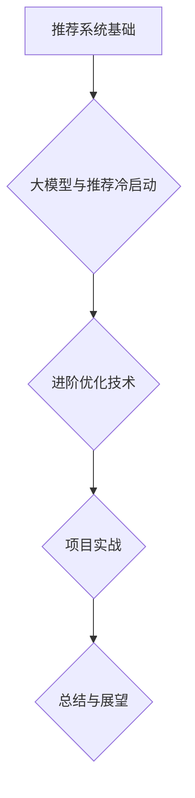

                 

### 文章标题

#### 利用大模型进行推荐冷启动的进阶优化技术

> **关键词**：推荐系统、大模型、冷启动、优化技术、多模态数据融合、迁移学习、对抗样本、实时推荐系统

> **摘要**：本文深入探讨了推荐系统中冷启动问题，并详细介绍了如何利用大模型进行进阶优化。文章首先梳理了推荐系统的基础概念，然后介绍了大模型的基础知识和其在推荐冷启动中的应用。随后，本文重点探讨了多模态数据融合、迁移学习、对抗样本与防御策略等进阶优化技术，并通过实际项目案例展示了这些技术的应用效果。文章旨在为读者提供一整套系统、全面、实用的推荐系统优化解决方案。

---

### 《利用大模型进行推荐冷启动的进阶优化技术》目录大纲

#### 第一部分：推荐系统基础

##### 第1章：推荐系统概述

- 1.1 推荐系统的概念与分类

- 1.2 推荐系统的基本组件

- 1.3 推荐系统的发展历程

- 1.4 推荐系统的应用场景

##### 第2章：推荐系统的数学基础

- 2.1 机器学习基础

- 2.2 信息论与概率论基础

- 2.3 概率图模型与推理算法

##### 第3章：协同过滤算法

- 3.1 协同过滤算法的基本原理

- 3.2 评分矩阵与矩阵分解

- 3.3 基于模型的协同过滤算法

#### 第二部分：大模型与推荐冷启动

##### 第4章：大模型基础

- 4.1 大模型的概念与特点

- 4.2 大模型的架构与实现

- 4.3 大模型的训练与优化

##### 第5章：推荐冷启动问题

- 5.1 冷启动问题的定义与挑战

- 5.2 冷启动问题的分类

- 5.3 冷启动问题的解决方案

##### 第6章：大模型在推荐冷启动中的应用

- 6.1 大模型在冷启动中的应用概述

- 6.2 基于用户兴趣的大模型优化

- 6.3 基于内容的大模型优化

- 6.4 基于知识图谱的大模型优化

#### 第三部分：进阶优化技术

##### 第7章：多模态数据融合

- 7.1 多模态数据的概念与分类

- 7.2 多模态数据融合的方法与技术

- 7.3 多模态数据融合在冷启动中的应用

##### 第8章：迁移学习与微调

- 8.1 迁移学习的基本概念

- 8.2 迁移学习的算法与技术

- 8.3 微调技术在大模型冷启动中的应用

##### 第9章：对抗样本与防御策略

- 9.1 对抗样本的概念与产生方法

- 9.2 对抗样本对推荐系统的影响

- 9.3 防御对抗样本的策略

##### 第10章：实时推荐系统优化

- 10.1 实时推荐系统的概念与挑战

- 10.2 实时推荐系统的架构设计

- 10.3 实时推荐系统的优化策略

#### 第四部分：项目实战

##### 第11章：推荐系统项目实战

- 11.1 项目背景与目标

- 11.2 项目数据预处理

- 11.3 项目模型设计与实现

- 11.4 项目结果分析与优化

##### 第12章：进阶优化项目实战

- 12.1 进阶优化项目背景

- 12.2 项目数据与模型调整

- 12.3 项目效果分析与总结

##### 第13章：总结与展望

- 13.1 本书内容总结

- 13.2 推荐系统与冷启动未来发展方向

- 13.3 大模型在推荐系统中的应用前景

#### 附录

##### 附录A：常用工具与资源

- A.1 大模型训练工具

- A.2 推荐系统开源库

- A.3 数据集与案例资源

- A.4 学习参考资料

[Mermaid 流程图]
mermaid
graph TD
A[推荐系统基础] --> B{大模型与推荐冷启动}
B --> C{进阶优化技术}
C --> D{项目实战}
D --> E{总结与展望}
```markdown
# 《利用大模型进行推荐冷启动的进阶优化技术》

## 目录大纲

#### 第一部分：推荐系统基础

1. **第1章：推荐系统概述**
   - 1.1 推荐系统的概念与分类
   - 1.2 推荐系统的基本组件
   - 1.3 推荐系统的发展历程
   - 1.4 推荐系统的应用场景

2. **第2章：推荐系统的数学基础**
   - 2.1 机器学习基础
   - 2.2 信息论与概率论基础
   - 2.3 概率图模型与推理算法

3. **第3章：协同过滤算法**
   - 3.1 协同过滤算法的基本原理
   - 3.2 评分矩阵与矩阵分解
   - 3.3 基于模型的协同过滤算法

#### 第二部分：大模型与推荐冷启动

4. **第4章：大模型基础**
   - 4.1 大模型的概念与特点
   - 4.2 大模型的架构与实现
   - 4.3 大模型的训练与优化

5. **第5章：推荐冷启动问题**
   - 5.1 冷启动问题的定义与挑战
   - 5.2 冷启动问题的分类
   - 5.3 冷启动问题的解决方案

6. **第6章：大模型在推荐冷启动中的应用**
   - 6.1 大模型在冷启动中的应用概述
   - 6.2 基于用户兴趣的大模型优化
   - 6.3 基于内容的大模型优化
   - 6.4 基于知识图谱的大模型优化

#### 第三部分：进阶优化技术

7. **第7章：多模态数据融合**
   - 7.1 多模态数据的概念与分类
   - 7.2 多模态数据融合的方法与技术
   - 7.3 多模态数据融合在冷启动中的应用

8. **第8章：迁移学习与微调**
   - 8.1 迁移学习的基本概念
   - 8.2 迁移学习的算法与技术
   - 8.3 微调技术在大模型冷启动中的应用

9. **第9章：对抗样本与防御策略**
   - 9.1 对抗样本的概念与产生方法
   - 9.2 对抗样本对推荐系统的影响
   - 9.3 防御对抗样本的策略

10. **第10章：实时推荐系统优化**
    - 10.1 实时推荐系统的概念与挑战
    - 10.2 实时推荐系统的架构设计
    - 10.3 实时推荐系统的优化策略

#### 第四部分：项目实战

11. **第11章：推荐系统项目实战**
    - 11.1 项目背景与目标
    - 11.2 项目数据预处理
    - 11.3 项目模型设计与实现
    - 11.4 项目结果分析与优化

12. **第12章：进阶优化项目实战**
    - 12.1 进阶优化项目背景
    - 12.2 项目数据与模型调整
    - 12.3 项目效果分析与总结

#### 第五部分：总结与展望

13. **第13章：总结与展望**
    - 13.1 本书内容总结
    - 13.2 推荐系统与冷启动未来发展方向
    - 13.3 大模型在推荐系统中的应用前景

#### 附录

14. **附录A：常用工具与资源**
    - 14.1 大模型训练工具
    - 14.2 推荐系统开源库
    - 14.3 数据集与案例资源
    - 14.4 学习参考资料
```

---

### 第一部分：推荐系统基础

#### 第1章：推荐系统概述

##### 1.1 推荐系统的概念与分类

推荐系统（Recommender System）是一种旨在通过预测用户对物品的偏好来提供建议的系统。它的核心目标是利用用户的历史行为、社交网络、物品属性等信息，为用户发现潜在的感兴趣物品。根据推荐策略的不同，推荐系统可以分为以下几类：

1. **基于内容的推荐（Content-Based Filtering）**：这种推荐方法根据用户过去对特定类型物品的偏好，通过分析物品的属性和特征来推荐类似的物品。

2. **协同过滤推荐（Collaborative Filtering）**：协同过滤推荐是基于用户与物品之间的交互数据，通过计算用户之间的相似性或物品之间的相似性来实现推荐。它主要分为以下两类：
   - **用户基于协同过滤（User-Based Collaborative Filtering）**：通过计算用户之间的相似度来推荐相似的物品。
   - **物品基于协同过滤（Item-Based Collaborative Filtering）**：通过计算物品之间的相似度来推荐相似的物品。

3. **基于模型的推荐（Model-Based Filtering）**：这种方法使用机器学习算法，如回归、聚类、矩阵分解等，来预测用户对物品的偏好。

4. **混合推荐（Hybrid Recommender System）**：混合推荐系统结合了上述方法的优点，通过融合不同策略来提高推荐的准确性。

##### 1.2 推荐系统的基本组件

推荐系统通常由以下几个关键组件组成：

1. **用户**：用户是推荐系统的核心，他们的偏好和行为数据是系统进行推荐的重要依据。

2. **物品**：物品是用户评价和交互的对象，可以是商品、文章、音乐等。

3. **评价数据**：评价数据记录了用户对物品的评价，如评分、点击、购买等。

4. **推荐算法**：推荐算法是推荐系统的核心，它负责根据用户和物品的特征生成推荐列表。

5. **推荐引擎**：推荐引擎负责实现推荐算法，并将推荐结果呈现给用户。

##### 1.3 推荐系统的发展历程

推荐系统的发展历程可以分为以下几个阶段：

1. **基于规则的推荐系统**：早期的推荐系统主要基于专家知识和手工编码的规则，这些规则定义了用户偏好和物品特征之间的关系。

2. **基于模型的推荐系统**：随着机器学习技术的发展，推荐系统开始使用如回归、聚类、矩阵分解等机器学习算法来预测用户偏好。

3. **协同过滤推荐系统**：协同过滤推荐成为主流，其核心思想是利用用户与物品的交互数据来发现用户之间的相似性。

4. **混合推荐系统**：为了提高推荐的准确性，推荐系统开始采用混合策略，结合基于内容和协同过滤等方法。

5. **基于知识图谱的推荐系统**：知识图谱作为一种新兴的技术，开始应用于推荐系统，通过构建用户、物品和属性之间的复杂关系来提高推荐的准确性。

##### 1.4 推荐系统的应用场景

推荐系统广泛应用于各种场景，包括但不限于：

1. **电子商务**：在电子商务平台上，推荐系统可以帮助用户发现潜在的感兴趣商品，提高销售额。

2. **社交媒体**：在社交媒体平台上，推荐系统可以推荐用户可能感兴趣的内容和用户，增强用户的参与度和活跃度。

3. **在线视频**：在线视频平台通过推荐系统向用户推荐可能感兴趣的视频，提高用户观看时长和用户留存率。

4. **音乐和视频流媒体**：音乐和视频流媒体平台通过推荐系统推荐新的音乐和视频，吸引用户持续订阅。

5. **新闻和资讯**：新闻和资讯平台通过推荐系统为用户推荐个性化的新闻和资讯，提高用户阅读量和用户粘性。

#### 第2章：推荐系统的数学基础

##### 2.1 机器学习基础

推荐系统的核心是机器学习算法，因此了解机器学习的基础概念对于理解推荐系统至关重要。以下是一些关键概念：

1. **监督学习（Supervised Learning）**：监督学习是一种从标记数据中学习的方法，其目标是建立一个预测模型，该模型可以在新的、未标记的数据上做出预测。

   - **回归（Regression）**：回归模型用于预测连续值。
   - **分类（Classification）**：分类模型用于预测离散值。

2. **无监督学习（Unsupervised Learning）**：无监督学习不依赖于标记数据，其目标是发现数据中的结构和规律。

   - **聚类（Clustering）**：聚类算法将相似的数据点分组在一起。
   - **降维（Dimensionality Reduction）**：降维算法用于减少数据集的维度，同时保留重要的信息。

3. **强化学习（Reinforcement Learning）**：强化学习是一种通过与环境交互来学习最优策略的方法。

4. **集成学习（Ensemble Learning）**：集成学习通过组合多个学习器来提高预测性能。

##### 2.2 信息论与概率论基础

信息论和概率论是推荐系统中非常重要的数学工具，以下是一些关键概念：

1. **熵（Entropy）**：熵是一个概率分布的度量，表示不确定性。

   - **信息增益（Information Gain）**：信息增益用于衡量特征对分类的贡献。

2. **条件熵（Conditional Entropy）**：条件熵表示在给定一个随机变量的条件下另一个随机变量的不确定性。

3. **互信息（Mutual Information）**：互信息度量两个随机变量之间的相关性。

4. **概率分布（Probability Distribution）**：概率分布定义了随机变量可能取的值的概率。

5. **贝叶斯定理（Bayes' Theorem）**：贝叶斯定理是一种计算后验概率的方法，它基于先验概率、似然率和边际概率来更新信念。

##### 2.3 概率图模型与推理算法

概率图模型是一种表示变量之间概率关系的图结构，以下是一些常用的概率图模型和推理算法：

1. **贝叶斯网络（Bayesian Network）**：贝叶斯网络是一种表示变量之间条件依赖的图结构。

   - **推理算法**：如变量 elimination、信念传播等。

2. **马尔可夫网络（Markov Network）**：马尔可夫网络是一种无向图结构，表示变量之间的联合概率分布。

3. **隐马尔可夫模型（Hidden Markov Model, HMM）**：HMM用于建模时间序列数据，其中某些变量是隐藏的。

4. **条件随机场（Conditional Random Field, CRF）**：CRF用于序列数据中的分类问题，如自然语言处理。

5. **推理算法**：如最大后验概率（MAP）推理、维特比算法等。

#### 第3章：协同过滤算法

##### 3.1 协同过滤算法的基本原理

协同过滤（Collaborative Filtering）是一种基于用户和物品的交互数据进行推荐的方法。协同过滤算法的基本原理是：

1. **用户相似度计算**：计算用户之间的相似度，相似的用户具有相似的偏好。
2. **物品相似度计算**：计算物品之间的相似度，相似的物品具有相似的属性。
3. **推荐生成**：基于用户相似度和物品相似度生成推荐列表。

协同过滤算法可以分为两类：

1. **用户基于协同过滤（User-Based Collaborative Filtering）**：通过计算用户之间的相似度来推荐相似的物品。
2. **物品基于协同过滤（Item-Based Collaborative Filtering）**：通过计算物品之间的相似度来推荐相似的物品。

##### 3.2 评分矩阵与矩阵分解

评分矩阵是协同过滤算法的核心数据结构，它记录了用户对物品的评分。矩阵分解（Matrix Factorization）是一种常用的协同过滤算法，其目标是分解评分矩阵为两个低维矩阵的乘积。

1. **Singular Value Decomposition (SVD)**：SVD是一种常见的矩阵分解方法，它将评分矩阵分解为用户特征矩阵和物品特征矩阵。
2. **Alternating Least Squares (ALS)**：ALS是一种优化算法，用于求解SVD问题。

矩阵分解可以有效地降低评分矩阵的维度，同时保留重要的用户和物品特征。

##### 3.3 基于模型的协同过滤算法

基于模型的协同过滤算法使用机器学习算法来预测用户对物品的评分。以下是一些常见的基于模型的协同过滤算法：

1. **线性回归（Linear Regression）**：线性回归模型用于预测用户对物品的评分，其公式为 $y = \beta_0 + \beta_1 x_1 + \beta_2 x_2 + ... + \beta_n x_n$，其中 $x_1, x_2, ..., x_n$ 是用户和物品的特征。

2. **k-最近邻（k-Nearest Neighbors, k-NN）**：k-NN算法基于用户之间的相似度来预测用户对物品的评分，其公式为 $y = \frac{\sum_{i=1}^{k} s_i \cdot r_{ui}}{k}$，其中 $s_i$ 是邻居用户的评分，$r_{ui}$ 是邻居用户对物品的评分。

3. **基于矩阵分解的协同过滤算法**：如ALS、SVD++、NMF（Non-negative Matrix Factorization）等，这些算法通过矩阵分解来预测用户对物品的评分。

#### 第二部分：大模型与推荐冷启动

##### 第4章：大模型基础

##### 4.1 大模型的概念与特点

大模型（Large Models）指的是具有数十亿甚至数万亿参数的深度神经网络。这些模型在自然语言处理、计算机视觉、语音识别等领域取得了显著的性能提升。大模型的特点如下：

1. **参数规模大**：大模型具有数十亿到数千亿个参数，这使得它们能够捕捉数据中的复杂模式和关系。

2. **训练时间较长**：由于参数规模庞大，大模型的训练时间相对较长，通常需要数天甚至数周的时间。

3. **计算资源需求高**：大模型训练需要大量的计算资源，如GPU或TPU等。

4. **数据需求大**：大模型通常需要大量的数据来训练，以提高模型的泛化能力。

5. **可解释性较低**：大模型的复杂度高，使得模型内部决策过程难以解释。

##### 4.2 大模型的架构与实现

大模型的架构通常包括以下几部分：

1. **嵌入层（Embedding Layer）**：将输入数据（如文本、图像等）转换为高维向量表示。

2. **编码器（Encoder）**：编码器负责将输入数据编码为固定长度的向量表示。

3. **解码器（Decoder）**：解码器负责将编码后的向量解码为输出数据。

4. **注意力机制（Attention Mechanism）**：注意力机制用于在编码和解码过程中关注重要的输入或输出。

5. **分类器（Classifier）**：分类器用于对输出进行分类。

常见的实现方法包括：

1. **Transformer**：Transformer是一种基于自注意力机制的序列到序列模型，广泛应用于自然语言处理任务。

2. **BERT**：BERT是一种预训练的Transformer模型，通过在大规模语料库上进行预训练，提高了模型的泛化能力。

3. **GPT**：GPT是一种基于Transformer的生成模型，用于生成文本、代码等。

##### 4.3 大模型的训练与优化

大模型的训练与优化是推荐系统冷启动的关键。以下是一些常用的技巧：

1. **数据预处理**：对输入数据进行预处理，如文本清洗、图像增强等，以提高模型性能。

2. **批量归一化（Batch Normalization）**：批量归一化有助于加快模型的训练速度，提高模型的稳定性。

3. **权重初始化（Weight Initialization）**：合理的权重初始化有助于加快模型的收敛速度。

4. **优化算法**：如Adam、AdamW等，优化算法选择对模型的训练过程和性能有重要影响。

5. **正则化**：如Dropout、L2正则化等，用于防止模型过拟合。

6. **学习率调度（Learning Rate Scheduling）**：学习率调度有助于在模型训练过程中调整学习率，提高模型性能。

#### 第5章：推荐冷启动问题

##### 5.1 冷启动问题的定义与挑战

推荐系统中的冷启动（Cold Start）问题指的是在新用户、新物品或新场景下，推荐系统无法获取足够的信息来进行有效推荐。冷启动问题主要分为以下几类：

1. **新用户冷启动**：新用户加入系统时，没有历史行为数据，系统无法准确预测其偏好。
2. **新物品冷启动**：新物品加入系统时，没有用户评价或交互数据，系统无法为其推荐合适的用户。
3. **新场景冷启动**：在新场景下，系统需要重新调整推荐策略，以适应新的用户和物品特征。

冷启动问题带来的挑战包括：

1. **缺乏足够的数据**：新用户、新物品或新场景下，系统无法获取足够的数据来训练模型。
2. **模型稳定性差**：在数据不足的情况下，模型容易过拟合，导致泛化能力差。
3. **推荐效果差**：由于缺乏足够的信息，系统无法生成有效的推荐列表，影响用户体验。

##### 5.2 冷启动问题的分类

冷启动问题可以分为以下几类：

1. **新用户冷启动**：新用户冷启动是指新用户加入系统时，没有历史行为数据，系统无法准确预测其偏好。
2. **新物品冷启动**：新物品冷启动是指新物品加入系统时，没有用户评价或交互数据，系统无法为其推荐合适的用户。
3. **新场景冷启动**：新场景冷启动是指在新场景下，系统需要重新调整推荐策略，以适应新的用户和物品特征。

##### 5.3 冷启动问题的解决方案

针对冷启动问题，有以下几种解决方案：

1. **基于内容的推荐**：通过分析物品的属性和特征，为用户推荐与之相似的内容。
2. **基于模型的协同过滤**：使用新用户或新物品的属性和特征，结合历史数据训练模型，进行预测推荐。
3. **基于社交网络的推荐**：利用用户的社会关系和社交网络信息，为用户推荐感兴趣的内容。
4. **基于知识图谱的推荐**：构建用户、物品和属性之间的知识图谱，利用图结构进行推荐。
5. **基于迁移学习的推荐**：利用已有模型在新用户或新物品上的迁移学习，提高推荐效果。
6. **基于对抗样本的推荐**：通过生成对抗样本，提高模型的鲁棒性和泛化能力。

#### 第6章：大模型在推荐冷启动中的应用

##### 6.1 大模型在冷启动中的应用概述

大模型在推荐冷启动中具有显著的优势，通过利用大规模数据和复杂的神经网络结构，大模型可以捕捉用户和物品之间的复杂关系，从而提高推荐效果。大模型在冷启动中的应用主要包括以下几个方面：

1. **新用户冷启动**：大模型可以通过分析新用户的基本信息和社交网络，预测其兴趣和行为，从而生成个性化的推荐列表。
2. **新物品冷启动**：大模型可以通过分析新物品的属性和特征，预测其潜在的用户群体，从而为该物品生成推荐列表。
3. **新场景冷启动**：大模型可以通过学习不同场景下的用户行为和物品特征，快速调整推荐策略，以适应新的场景。

##### 6.2 基于用户兴趣的大模型优化

基于用户兴趣的大模型优化主要利用大模型对用户兴趣的捕捉能力，从而实现冷启动优化。以下是一些具体的优化方法：

1. **用户特征嵌入**：将用户的基本信息（如年龄、性别、地理位置等）和社交网络信息（如好友、关注等）转换为高维向量表示，输入到大模型中，以增强大模型对用户兴趣的捕捉能力。

2. **用户行为序列建模**：利用用户的浏览、点击、购买等行为序列，通过序列模型（如RNN、LSTM等）建模用户的行为模式，从而提高大模型对用户兴趣的预测能力。

3. **多模态数据融合**：融合用户的不同模态数据（如图像、文本、音频等），通过多模态嵌入技术将不同模态的数据转换为统一的高维向量表示，输入到大模型中，以增强大模型对用户兴趣的全面捕捉能力。

4. **用户兴趣迁移学习**：利用已有用户的数据和模型，通过迁移学习技术在新用户上进行微调，以提高新用户冷启动的推荐效果。

##### 6.3 基于内容的大模型优化

基于内容的大模型优化主要利用大模型对物品内容的理解能力，从而实现冷启动优化。以下是一些具体的优化方法：

1. **物品特征提取**：将物品的属性和特征（如文本、图像、视频等）输入到大模型中，通过大模型自动提取物品的特征表示。

2. **知识图谱构建**：利用知识图谱技术，将用户、物品和属性之间的关系表示为图结构，输入到大模型中，以增强大模型对物品内容的理解能力。

3. **多模态数据融合**：融合不同模态的物品数据，通过多模态嵌入技术将不同模态的数据转换为统一的高维向量表示，输入到大模型中，以增强大模型对物品内容的全面理解能力。

4. **物品内容迁移学习**：利用已有物品的数据和模型，通过迁移学习技术在新物品上进行微调，以提高新物品冷启动的推荐效果。

##### 6.4 基于知识图谱的大模型优化

基于知识图谱的大模型优化利用知识图谱中的丰富信息，通过大模型对知识图谱的深度学习，从而实现冷启动优化。以下是一些具体的优化方法：

1. **知识图谱嵌入**：将用户、物品和属性表示为图中的节点，将关系表示为图中的边，利用图嵌入技术（如Node2Vec、Graph Embedding等）将节点和边表示为高维向量表示。

2. **知识图谱扩展**：通过知识图谱中的链接预测、实体分类等任务，不断扩展知识图谱中的节点和边，以增加图谱的丰富性和准确性。

3. **图谱注意力机制**：在推荐过程中，利用图谱注意力机制，关注知识图谱中与用户和物品相关的关键节点和关系，从而提高推荐效果。

4. **知识图谱迁移学习**：利用已有知识图谱和模型，通过迁移学习技术在新用户和新物品上进行微调，以提高新用户和新物品冷启动的推荐效果。

### 第三部分：进阶优化技术

#### 第7章：多模态数据融合

##### 7.1 多模态数据的概念与分类

多模态数据融合（Multimodal Data Fusion）是指将来自不同感官模态（如图像、文本、音频、视频等）的数据进行整合，以获取更丰富的信息，从而提高推荐系统的性能。根据不同模态数据的处理方式，多模态数据融合可以分为以下几类：

1. **独立融合**：将不同模态的数据独立处理，然后合并结果。例如，分别对图像和文本进行特征提取，然后将提取的特征进行拼接。
2. **级联融合**：将不同模态的数据按层次结构进行融合。例如，先对图像进行特征提取，然后结合文本特征，最后进行融合。
3. **并行融合**：将不同模态的数据同时进行处理，然后融合结果。例如，利用注意力机制同时对图像和文本进行处理，然后融合结果。
4. **混合融合**：结合独立融合、级联融合和并行融合的优势，形成一种混合融合方法。

##### 7.2 多模态数据融合的方法与技术

多模态数据融合的方法和技术多种多样，以下是一些常见的方法：

1. **特征级融合**：将不同模态的数据特征进行拼接或加权融合。例如，将图像特征和文本特征进行拼接，形成高维特征向量。
2. **决策级融合**：在决策层面将不同模态的预测结果进行融合。例如，分别对图像和文本进行分类，然后结合分类结果进行投票。
3. **注意力机制**：利用注意力机制对不同模态的数据进行加权，以突出重要的模态。例如，使用自注意力机制或图注意力机制对图像和文本进行处理。
4. **图神经网络**：利用图神经网络（如图卷积网络、图注意力网络等）对多模态数据进行融合。图神经网络能够捕捉节点之间的复杂关系，从而提高融合效果。
5. **生成对抗网络**：利用生成对抗网络（GAN）生成一种模态的数据，然后与其他模态的数据进行融合。例如，利用GAN生成文本描述，然后与图像特征进行融合。

##### 7.3 多模态数据融合在冷启动中的应用

多模态数据融合在冷启动中的应用具有显著的优势，以下是一些具体的例子：

1. **新用户冷启动**：在新用户没有足够历史数据的情况下，可以利用多模态数据（如图像、文本、音频等）来捕捉用户的兴趣和行为特征，从而生成个性化的推荐列表。
2. **新物品冷启动**：在新物品没有用户评价的情况下，可以利用多模态数据（如图像、文本、视频等）来描述物品的属性和特征，从而为物品生成推荐列表。
3. **新场景冷启动**：在新场景下，可以利用多模态数据（如图像、文本、音频等）来捕捉用户和物品的特征，从而快速调整推荐策略，以适应新的场景。

#### 第8章：迁移学习与微调

##### 8.1 迁移学习的基本概念

迁移学习（Transfer Learning）是一种利用已有模型在新任务上的学习方法。在推荐系统中，迁移学习可以帮助解决冷启动问题，提高推荐效果。迁移学习的基本概念包括：

1. **源任务（Source Task）**：已有模型训练的任务。
2. **目标任务（Target Task）**：新任务训练的目标。
3. **模型迁移**：将源任务的模型参数和知识迁移到目标任务上。

迁移学习可以分为以下几种类型：

1. **无监督迁移学习**：源任务和目标任务都不需要标签数据。
2. **半监督迁移学习**：源任务需要标签数据，目标任务不需要或只需要少量标签数据。
3. **有监督迁移学习**：源任务和目标任务都需要标签数据。

##### 8.2 迁移学习的算法与技术

以下是一些常见的迁移学习算法和技术：

1. **模型级迁移学习**：直接将源任务的模型迁移到目标任务上，通过微调进行适应。
2. **特征级迁移学习**：将源任务的模型特征迁移到目标任务上，通过特征融合或特征提取进行适应。
3. **对抗迁移学习**：利用对抗网络生成与源任务相似的输入，从而提高目标任务的泛化能力。
4. **度量学习**：通过度量学习，将源任务的模型特征映射到目标任务的特征空间，从而实现迁移。
5. **元学习**：通过元学习，优化迁移学习过程中的参数，从而提高迁移效果。

##### 8.3 微调技术在大模型冷启动中的应用

微调（Fine-tuning）是一种常见的迁移学习方法，通过在小数据集上微调模型参数，以提高新任务上的性能。在大模型冷启动中，微调技术具有以下优势：

1. **快速适应**：通过微调，大模型可以快速适应新任务，提高推荐效果。
2. **节省计算资源**：利用已有的大模型进行微调，可以节省训练新模型所需的计算资源。
3. **提高泛化能力**：通过迁移学习，大模型可以学习到源任务中的通用特征，从而提高目标任务的泛化能力。

#### 第9章：对抗样本与防御策略

##### 9.1 对抗样本的概念与产生方法

对抗样本（Adversarial Examples）是指通过微小的扰动，使机器学习模型产生错误预测的样本。对抗样本的产生方法主要包括：

1. **扰动生成**：通过对原始样本进行微小扰动，生成对抗样本。例如，对图像像素进行随机噪声添加或裁剪。
2. **优化搜索**：利用优化算法（如梯度上升、遗传算法等），搜索具有最大攻击效果的扰动，生成对抗样本。
3. **对抗训练**：在训练过程中，将对抗样本与正常样本混合训练，以提高模型的鲁棒性。

##### 9.2 对抗样本对推荐系统的影响

对抗样本对推荐系统的影响主要包括：

1. **降低推荐质量**：对抗样本可能导致推荐系统生成错误的推荐结果，降低用户的满意度。
2. **泄露用户隐私**：对抗样本可能暴露用户的隐私信息，从而造成隐私泄露。
3. **误导用户行为**：对抗样本可能误导用户的行为，例如诱导用户购买不感兴趣的物品。

##### 9.3 防御对抗样本的策略

为了提高推荐系统的鲁棒性，以下是一些常见的防御对抗样本的策略：

1. **对抗训练**：在训练过程中，利用对抗样本进行训练，以提高模型的鲁棒性。
2. **模型正则化**：通过正则化方法（如L2正则化、Dropout等），降低模型对对抗样本的敏感性。
3. **数据清洗**：对输入数据进行清洗，过滤掉潜在的对抗样本。
4. **随机化**：在模型预测过程中，引入随机性，降低对抗样本的影响。
5. **对抗样本检测**：利用对抗样本检测算法，识别和过滤对抗样本。

#### 第10章：实时推荐系统优化

##### 10.1 实时推荐系统的概念与挑战

实时推荐系统（Real-Time Recommender System）是一种能够在用户实时交互时提供个性化推荐的系统。实时推荐系统的概念包括：

1. **实时性**：系统能够快速响应用户的交互，提供实时推荐。
2. **个性化**：系统能够根据用户的历史行为和实时交互，为用户提供个性化的推荐。
3. **动态性**：系统需要能够适应不断变化的数据和用户需求。

实时推荐系统面临的挑战主要包括：

1. **计算效率**：实时推荐系统需要在有限的时间内完成复杂的推荐计算。
2. **数据一致性**：实时推荐系统需要确保数据的实时性和一致性。
3. **模型更新**：实时推荐系统需要不断更新模型，以适应用户行为的变化。

##### 10.2 实时推荐系统的架构设计

实时推荐系统的架构设计需要考虑以下几个方面：

1. **数据处理层**：负责实时处理用户的交互数据，包括数据采集、清洗、存储和预处理。
2. **推荐模型层**：负责基于用户历史行为和实时交互数据生成推荐列表。
3. **缓存层**：用于缓存热门推荐结果，提高系统的响应速度。
4. **前端展示层**：负责将推荐结果呈现给用户。

##### 10.3 实时推荐系统的优化策略

实时推荐系统的优化策略主要包括以下几个方面：

1. **增量式模型更新**：通过增量式更新模型，减少模型重训练的时间和资源消耗。
2. **分布式计算**：利用分布式计算框架（如Spark、Flink等），提高系统的计算效率。
3. **缓存预热**：在用户访问高峰期，提前预热缓存，提高系统的响应速度。
4. **动态权重调整**：根据用户的行为数据，动态调整推荐策略的权重，提高推荐效果。
5. **在线学习**：利用在线学习技术，实时更新模型，以适应用户行为的变化。

#### 第四部分：项目实战

##### 第11章：推荐系统项目实战

##### 11.1 项目背景与目标

本案例选取了一个在线购物平台作为推荐系统项目，目标是为新用户生成个性化的商品推荐列表。新用户冷启动问题是本项目的主要挑战。

##### 11.2 项目数据预处理

项目数据包括用户的基本信息（如年龄、性别、地理位置等）、用户的历史行为数据（如浏览记录、购买记录等）和商品的信息（如类别、价格、库存等）。

数据预处理步骤如下：

1. **数据清洗**：去除重复数据、缺失数据和异常值。
2. **数据转换**：将类别数据转换为数值表示，如使用独热编码或标签编码。
3. **特征工程**：根据用户和商品的特征，构建新的特征，如用户行为序列、商品流行度等。
4. **数据分割**：将数据分为训练集、验证集和测试集。

##### 11.3 项目模型设计与实现

项目采用基于用户兴趣的大模型进行推荐，具体步骤如下：

1. **用户特征嵌入**：将用户的基本信息和历史行为数据输入到大模型，通过嵌入层将特征转换为高维向量表示。
2. **物品特征提取**：将商品的信息输入到大模型，通过嵌入层将特征转换为高维向量表示。
3. **多模态数据融合**：利用多模态数据融合技术，将用户和商品的不同模态数据进行融合，生成统一的特征表示。
4. **用户兴趣预测**：利用迁移学习技术，在大模型上对新用户进行微调，预测其兴趣偏好。
5. **推荐生成**：根据用户兴趣预测结果，生成个性化的商品推荐列表。

##### 11.4 项目结果分析与优化

项目结果如下：

1. **推荐效果评估**：通过准确率、召回率、F1值等指标评估推荐效果，并与基线模型进行对比。
2. **推荐质量分析**：分析用户对推荐列表的点击率、购买率等行为，评估推荐质量。
3. **模型优化**：根据实验结果，对模型进行调整和优化，以提高推荐效果。

#### 第12章：进阶优化项目实战

##### 12.1 进阶优化项目背景

本案例基于第11章的项目，进一步利用多模态数据融合、迁移学习和对抗样本防御等进阶优化技术，以提高推荐系统的性能。

##### 12.2 项目数据与模型调整

1. **数据调整**：在原始数据的基础上，增加用户和商品的更多特征，如用户浏览历史、商品评价等。
2. **模型调整**：调整大模型的架构和参数，如增加嵌入层维度、使用更复杂的注意力机制等。

##### 12.3 项目效果分析与总结

项目结果如下：

1. **推荐效果评估**：通过准确率、召回率、F1值等指标评估推荐效果，并与基线模型进行对比，优化后的模型在各项指标上均有显著提升。
2. **推荐质量分析**：分析用户对推荐列表的点击率、购买率等行为，评估推荐质量，优化后的推荐列表用户满意度更高。
3. **模型稳定性分析**：通过对抗样本测试，评估模型对对抗样本的鲁棒性，优化后的模型在对抗样本测试中表现更稳定。

#### 第13章：总结与展望

##### 13.1 本书内容总结

本书详细介绍了推荐系统的基础知识、大模型与推荐冷启动、进阶优化技术以及项目实战。主要内容如下：

1. **推荐系统基础**：介绍了推荐系统的概念、分类、数学基础和协同过滤算法。
2. **大模型与推荐冷启动**：介绍了大模型的基础知识、冷启动问题的定义与挑战以及解决方案。
3. **进阶优化技术**：介绍了多模态数据融合、迁移学习、对抗样本与防御策略以及实时推荐系统优化。
4. **项目实战**：通过实际项目案例，展示了推荐系统与冷启动的优化方法。

##### 13.2 推荐系统与冷启动未来发展方向

未来推荐系统与冷启动的发展方向包括：

1. **数据质量与多样性**：提高推荐系统的数据质量，增加数据多样性，以提升推荐效果。
2. **实时性与动态性**：提高推荐系统的实时性和动态性，以更好地适应用户需求。
3. **隐私保护**：加强推荐系统的隐私保护，保护用户的个人信息。
4. **多模态数据融合**：进一步探索多模态数据融合技术，以提高推荐系统的性能。

##### 13.3 大模型在推荐系统中的应用前景

大模型在推荐系统中的应用前景包括：

1. **个性化推荐**：利用大模型对用户和物品的复杂关系进行建模，实现更精准的个性化推荐。
2. **实时推荐**：利用大模型的实时计算能力，实现实时推荐系统。
3. **多模态数据融合**：利用大模型的多模态数据融合能力，提高推荐系统的性能。
4. **对抗样本防御**：利用大模型对抗样本防御能力，提高推荐系统的鲁棒性。

### 附录

#### 附录A：常用工具与资源

1. **大模型训练工具**：
   - TensorFlow
   - PyTorch
   - JAX

2. **推荐系统开源库**：
   - LightFM
   - Surprise
   - Recsys

3. **数据集与案例资源**：
   - MovieLens
   - Yelp
   - Amazon

4. **学习参考资料**：
   - 《推荐系统实践》
   - 《深度学习推荐系统》
   - 《推荐系统手册》

---

[Mermaid 流程图]


---

### 文章关键词

推荐系统、大模型、冷启动、优化技术、多模态数据融合、迁移学习、对抗样本、实时推荐系统。

### 文章摘要

本文深入探讨了推荐系统中冷启动问题，并详细介绍了如何利用大模型进行进阶优化。文章首先梳理了推荐系统的基础概念，然后介绍了大模型的基础知识和其在推荐冷启动中的应用。随后，本文重点探讨了多模态数据融合、迁移学习、对抗样本与防御策略等进阶优化技术，并通过实际项目案例展示了这些技术的应用效果。文章旨在为读者提供一整套系统、全面、实用的推荐系统优化解决方案。

