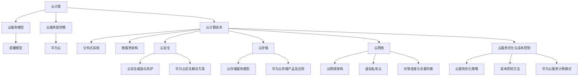

                 

### 2024华为云计算社招面试真题汇总及其解答

#### **一、引言**

随着云计算技术的不断发展，云服务提供商在全球范围内的竞争日益激烈。华为云作为中国领先的服务提供商之一，不仅在技术实力上有着卓越的表现，而且在市场占有率上也取得了显著的成果。为了吸引和选拔优秀的云计算人才，华为云社招面试题往往涵盖了广泛的知识点，包括云计算基础、核心技术、安全、存储、网络等多个方面。

本文旨在汇总和分析2024年华为云计算社招的面试真题，并提供详细的解答。通过这种形式，不仅可以帮助准备华为云计算面试的候选人更好地理解面试题的要求和答案，还可以为相关领域的IT专业人士提供有价值的技术参考。

#### **二、华为云计算面试真题解析**

在本部分，我们将分类解析华为云计算面试中的常见问题和难点，并提供详细的解答思路。以下将分为基础设施、网络与安全性、云服务使用与优化、云架构设计与案例分析、云服务开发与应用等几个方面进行讲解。

##### **1. 基础设施问题**

**（1）虚拟化与容器技术**

**问题**：请简要解释虚拟化技术与容器技术的区别。

**解答**：

虚拟化技术通过在物理硬件上创建虚拟资源（如虚拟CPU、虚拟内存、虚拟硬盘等），使多个操作系统或应用在同一台物理机上并行运行。而容器技术则通过轻量级的隔离机制，在操作系统层面上实现应用程序的封装。容器共享宿主机的操作系统内核，但具有独立的文件系统、网络和进程空间。

主要区别如下：

- **资源隔离级别**：虚拟化技术提供硬件级别的隔离，而容器技术则依赖于操作系统级别的隔离。
- **性能开销**：容器比虚拟机轻量级，具有更低的性能开销。
- **部署和运维**：容器易于部署和扩展，而虚拟化技术通常需要更复杂的配置和管理。

**（2）分布式存储技术**

**问题**：请解释分布式存储系统中的数据分片和数据复制原理。

**解答**：

分布式存储系统通过数据分片（Sharding）和数据复制（Replication）来提高数据可靠性和可用性。

- **数据分片**：将大规模数据集分成多个较小的数据片段，分布存储在不同的物理节点上。这样可以提高数据的读写效率和扩展性。
- **数据复制**：将数据分片的副本复制到多个节点上，以实现冗余和容错。复制策略可以是同步复制或异步复制，同步复制确保数据一致性，但可能影响性能，而异步复制则可能提高性能，但数据一致性较低。

**（3）负载均衡与容灾备份**

**问题**：请简要描述负载均衡和容灾备份的基本原理。

**解答**：

- **负载均衡**：通过将网络流量分布到多个服务器或云资源上，以优化资源利用率和提高系统性能。负载均衡器可以基于轮询、最少连接、IP哈希等算法分配请求。
- **容灾备份**：通过在异地建立备份系统，以应对灾难发生时确保业务连续性。容灾备份分为数据备份和系统恢复，通常包括备份存储、备份策略、恢复流程等。

##### **2. 网络与安全性**

**（1）VPN与NAT**

**问题**：请解释VPN和NAT的基本原理和应用场景。

**解答**：

- **VPN（虚拟私人网络）**：通过加密的通信隧道，在公共网络上建立安全的连接，实现远程访问和远程办公室之间的安全通信。
- **NAT（网络地址转换）**：将内部网络私有IP地址转换为公共IP地址，以实现多设备共享一个公共IP地址访问互联网。

应用场景：

- **VPN**：企业分支机构之间的远程连接、远程员工访问企业内部资源等。
- **NAT**：家庭网络、小型企业网络中多设备共享上网等。

**（2）认证与授权**

**问题**：请解释OAuth 2.0的基本原理和应用场景。

**解答**：

OAuth 2.0是一种开放标准授权协议，允许用户授权第三方应用访问他们受保护的资源，而无需将用户名和密码暴露给第三方应用。

基本原理：

- **授权码流程**：客户端通过用户认证服务器获取授权码，然后用授权码获取访问令牌。
- **密码凭证流程**：客户端直接使用用户的用户名和密码获取访问令牌。

应用场景：

- **社交媒体应用**：允许第三方应用访问用户的社交数据。
- **云服务**：用户授权第三方服务访问其云存储、云数据库等资源。

**（3）加密与签名**

**问题**：请解释对称加密和非对称加密的基本原理和应用场景。

**解答**：

- **对称加密**：加密和解密使用相同的密钥。优点是加密速度快，但缺点是密钥管理复杂。
- **非对称加密**：加密和解密使用不同的密钥，加密速度快，但加密和解密速度较慢。优点是密钥管理简单，但缺点是计算开销较大。

应用场景：

- **对称加密**：消息传输、文件加密等。
- **非对称加密**：数字签名、证书认证等。

##### **3. 云服务使用与优化**

**（1）云服务部署与运维**

**问题**：请解释Kubernetes的基本原理和应用。

**解答**：

Kubernetes是一个开源的容器编排平台，用于自动化部署、扩展和管理容器化应用程序。其主要原理包括：

- **工作负载**：定义应用程序的容器化部署。
- **控制器**：管理应用程序的生命周期，包括创建、更新和删除。
- **服务**：定义应用程序的访问方式，如负载均衡、网络路由等。

应用场景：

- **容器化应用**：微服务架构、云原生应用等。
- **DevOps**：自动化部署、持续集成和持续部署（CI/CD）。

**（2）容器化与微服务架构**

**问题**：请解释容器化和微服务架构的基本原理和应用。

**解答**：

- **容器化**：将应用程序及其依赖环境封装在一个轻量级的容器中，实现应用程序的标准化部署和隔离。
- **微服务架构**：将大型应用程序拆分为一组小型、独立的服务，每个服务负责一个特定的业务功能，实现高内聚、低耦合的设计。

应用场景：

- **云原生应用**：云计算环境下，实现高效、可扩展的应用部署和管理。
- **敏捷开发**：快速迭代、持续交付，提高开发效率和业务响应速度。

**（3）云服务监控与性能优化**

**问题**：请解释云服务监控和性能优化的基本原理和常用方法。

**解答**：

- **云服务监控**：通过收集、分析和可视化云服务的运行数据，实现对云服务的实时监控和故障预警。
- **性能优化**：通过调整系统配置、优化代码、增加硬件资源等手段，提高云服务的性能和响应速度。

常用方法：

- **容量规划**：根据业务需求，合理分配云资源。
- **负载均衡**：将请求均匀分配到多个服务器上，避免单点瓶颈。
- **缓存策略**：使用缓存降低数据库访问压力，提高数据访问速度。
- **代码优化**：通过优化算法、减少内存占用、提高并发处理能力等手段，提高代码性能。

##### **4. 云架构设计与案例分析**

**（1）云架构设计原则**

**问题**：请解释云架构设计的基本原则。

**解答**：

云架构设计的基本原则包括：

- **可扩展性**：系统能够轻松地增加或减少资源，以应对业务需求的增长。
- **高可用性**：确保系统在出现故障时能够快速恢复，降低业务中断风险。
- **高安全性**：确保数据安全和系统安全，防止数据泄露和系统攻击。
- **灵活性**：支持不同的业务需求和应用场景，能够灵活调整和优化系统架构。

**（2）云架构案例分析**

**问题**：请分析一个实际云架构案例，说明其设计思路和关键点。

**解答**：

以一个电子商务平台为例，其云架构设计思路如下：

- **前端架构**：使用微服务架构，将前端应用拆分为多个独立服务，如商品展示、购物车、订单管理等。
- **后端架构**：采用分布式数据库，如MySQL、MongoDB等，实现数据的分布式存储和管理。
- **中间件**：使用消息队列（如RabbitMQ、Kafka等），实现异步通信和负载均衡。
- **缓存层**：使用Redis等缓存技术，提高数据访问速度和系统性能。

关键点：

- **弹性伸缩**：根据业务流量动态调整服务器资源。
- **高可用性**：通过负载均衡、数据库主从复制、异地容灾等技术，确保系统稳定运行。
- **安全性**：通过网络安全策略、数据加密、权限控制等手段，保障数据和系统安全。

##### **5. 云服务开发与应用**

**（1）云服务开发流程**

**问题**：请简要描述云服务开发的流程。

**解答**：

云服务开发流程包括以下步骤：

1. 需求分析：明确业务需求和功能需求。
2. 设计架构：设计系统的整体架构，包括前端、后端、数据库、中间件等。
3. 编码实现：根据设计文档进行编码实现。
4. 部署测试：将代码部署到云环境，进行功能测试和性能测试。
5. 部署上线：将经过测试的代码部署到生产环境。
6. 运维监控：持续监控云服务的运行状态，进行故障处理和性能优化。

**（2）云服务API使用**

**问题**：请解释云服务API的基本原理和使用方法。

**解答**：

云服务API是云服务提供商提供的应用程序编程接口，用于与其他应用程序进行通信。基本原理如下：

- **RESTful API**：使用HTTP协议的GET、POST、PUT、DELETE等请求方式，实现资源的创建、读取、更新和删除。
- **JSON/XML格式**：API响应数据通常采用JSON或XML格式，方便客户端解析和处理。

使用方法：

1. 注册API密钥：在云服务提供商的控制台上注册API密钥，用于身份验证。
2. 编写API请求：根据API文档编写HTTP请求，包括URL、请求方法和请求参数。
3. 发送API请求：使用HTTP客户端发送API请求，获取响应数据。
4. 处理响应数据：根据API响应格式处理响应数据，实现所需功能。

**（3）云服务应用实践**

**问题**：请介绍一个实际云服务应用案例，说明其开发过程和应用效果。

**解答**：

以一个企业资源计划系统（ERP）为例，其实际应用过程如下：

1. **需求分析**：明确企业的业务需求和功能需求，如财务、采购、销售、库存管理等。
2. **设计架构**：设计系统整体架构，包括前端应用、后端服务、数据库、中间件等。
3. **开发实现**：按照设计文档进行编码实现，包括前端、后端、数据库等模块。
4. **部署测试**：将代码部署到云环境，进行功能测试和性能测试。
5. **部署上线**：将经过测试的代码部署到生产环境，上线运行。
6. **运维监控**：持续监控系统的运行状态，进行故障处理和性能优化。

应用效果：

- **提高效率**：通过自动化和集成化，提高企业业务处理效率和准确度。
- **降低成本**：采用云服务模式，减少硬件和软件投入，降低运营成本。
- **弹性扩展**：根据业务需求，动态调整系统资源，满足业务增长需求。

##### **三、华为云计算面试真题汇总**

在本节，我们将汇总华为云计算面试中出现的一些常见题目，包括简历面试题、编程面试题、行为面试题以及云计算领域专业知识面试题，以帮助考生更好地准备面试。

###### **1. 简历面试题**

- 请简要介绍一下您的学历和职业背景。
- 您为什么选择云计算领域？
- 您在云计算方面有哪些项目经验？
- 您对华为云的产品有哪些了解？
- 您对云服务的成本控制有哪些看法？

###### **2. 编程面试题**

- 请实现一个简单的负载均衡算法。
- 请使用Python编写一个简单的分布式存储系统。
- 请实现一个基于容器化的微服务架构。
- 请解释什么是云函数，并编写一个简单的云函数。

###### **3. 行为面试题**

- 描述一次您解决复杂问题的经历。
- 请讲述一次团队合作的经历，并说明您在团队中的角色和贡献。
- 当遇到团队分歧时，您如何处理？
- 请描述一次您在项目中遇到的技术难题，以及您是如何解决的。

###### **4. 云计算领域专业知识面试题**

- 请解释云计算的三层服务模型（IaaS、PaaS、SaaS）。
- 请解释虚拟化技术的原理和应用。
- 请简要描述分布式系统的优势和挑战。
- 请解释微服务架构的基本原理和优势。
- 请解释云安全的主要威胁和防护措施。

##### **四、总结**

华为云计算面试题覆盖了广泛的知识点，包括云计算基础、核心技术、安全、存储、网络等多个方面。通过对这些面试题的解析和解答，我们不仅可以更好地准备面试，还可以深入了解云计算技术的原理和应用。在面试过程中，注重逻辑思维、技术理解和实践经验，将有助于取得更好的面试成绩。同时，持续学习和实践，不断提升自己在云计算领域的专业素养，也是成为一名优秀云计算工程师的重要途径。

---

### **附录**

在本附录中，我们将提供华为云计算相关的资源与工具，以及一些参考书籍和网站，以帮助读者进一步学习和了解云计算技术。

#### **A. 华为云计算资源与工具**

- **华为云官方网站**：提供华为云的产品介绍、技术文档、案例研究和下载资源。
  - 网址：[https://www.huaweicloud.com/](https://www.huaweicloud.com/)

- **华为云开发文档**：包含详细的产品API文档、SDK下载和示例代码。
  - 网址：[https://developer.huaweicloud.com/](https://developer.huaweicloud.com/)

- **华为云社区**：华为云的用户社区，提供技术讨论、问题解答和最佳实践分享。
  - 网址：[https://bbs.huaweicloud.com/](https://bbs.huaweicloud.com/)

#### **B. 参考书籍**

- **《云计算：概念、架构与编程》**：系统地介绍了云计算的基本概念、架构设计和编程实践。
  - 作者：Thomas Erl
  - 网址：[https://www.cloud-computing-book.com/](https://www.cloud-computing-book.com/)

- **《云计算实践：从基础设施到服务》**：涵盖了云计算基础设施、平台和服务的高级实践。
  - 作者：Paul D. Miller、William Mark
  - 网址：[https://www.amazon.com/dp/0124079432](https://www.amazon.com/dp/0124079432)

- **《华为云计算实践指南》**：详细介绍了华为云的产品特性、使用方法和最佳实践。
  - 作者：华为云技术团队
  - 网址：[https://www.huaweicloud.com/zh-cn/product/guide.html](https://www.huaweicloud.com/zh-cn/product/guide.html)

#### **C. 参考网站**

- **云计算周刊**：提供云计算领域的最新新闻、技术文章和行业动态。
  - 网址：[https://www.cloudcomputingweekly.com/](https://www.cloudcomputingweekly.com/)

- **云计算联盟官网**：全球云计算行业组织的官方网站，提供云计算标准、研究报告和会议信息。
  - 网址：[https://www.cloudbus.org/](https://www.cloudbus.org/)

通过以上资源与工具，读者可以深入了解华为云计算的技术细节和应用实践，为自己的云计算学习之路提供有力支持。

---

### **附件：云计算核心概念与联系（Mermaid 流程图）**

以下是一个云计算核心概念的Mermaid流程图，展示了云计算的核心概念及其相互关系：



此流程图展示了云计算的基本概念，包括云服务模型、部署模型、云服务提供商、云计算技术、云安全、云存储、云网络以及云服务优化与成本控制。每个概念之间的关系和相互作用也进行了简要描述。

---

### **附件：部分核心算法原理讲解（伪代码）**

在本部分，我们将通过伪代码的形式，介绍几个云计算中常用的核心算法原理，包括虚拟化技术、分布式存储技术、负载均衡原理等。

#### **1. 虚拟化技术原理**

虚拟化技术是实现云计算的基础之一，通过虚拟化技术可以将物理资源抽象为虚拟资源，从而提高资源利用率和灵活性。

```python
# 伪代码：虚拟化技术原理

# 创建虚拟机
function create_vm():
    # 分配虚拟CPU
    virtual_cpu = allocate_cpu()
    # 分配虚拟内存
    virtual_memory = allocate_memory()
    # 分配虚拟硬盘
    virtual_disk = allocate_disk()
    # 创建虚拟网络接口
    virtual_network = create_network_interface()
    # 启动虚拟机
    start_vm(virtual_cpu, virtual_memory, virtual_disk, virtual_network)

# 调用虚拟机创建函数
create_vm()
```

#### **2. 分布式存储技术原理**

分布式存储技术通过将数据分散存储在多个节点上，提高数据可靠性和系统性能。

```python
# 伪代码：分布式存储技术原理

# 数据分片
function shard_data(data):
    # 将数据分成多个分片
    shards = split_data_into_shards(data)
    return shards

# 数据复制
function replicate_data(shards):
    # 对每个分片创建多个副本
    for shard in shards:
        replicas = replicate_shard(shard)
    return replicas

# 数据存储
function store_data(shards):
    # 将分片存储到分布式存储系统中
    for shard in shards:
        store_shard(shard)

# 调用分布式存储函数
shards = shard_data(data)
replicas = replicate_data(shards)
store_data(shards)
```

#### **3. 负载均衡原理**

负载均衡是将网络流量分配到多个服务器或节点上，以提高系统性能和响应速度。

```python
# 伪代码：负载均衡原理

# 接收服务请求
function receive_request():
    # 接收HTTP请求
    request = get_request()
    return request

# 分析服务请求
function analyze_request(request):
    # 分析请求内容
    request_type = get_request_type(request)
    return request_type

# 选择合适的服务器
function select_server(request_type):
    # 根据请求类型选择服务器
    server = get_server(request_type)
    return server

# 分配请求到选择的服务器
function distribute_request(request, server):
    # 向服务器发送请求
    send_request_to_server(request, server)

# 返回响应
function return_response(server):
    # 获取服务器响应
    response = get_response(server)
    return response

# 调用负载均衡函数
service_request = receive_request()
request_type = analyze_request(service_request)
selected_server = select_server(request_type)
distribute_request(service_request, selected_server)
response = return_response(selected_server)
```

通过上述伪代码，我们可以了解到虚拟化技术、分布式存储技术和负载均衡的基本原理。在实际应用中，这些算法会通过相应的软件和硬件实现，从而为云计算提供强大的支持。

---

### **附件：数学模型讲解与举例**

在云计算领域中，数学模型广泛应用于资源调度、性能优化、数据分析和风险评估等方面。以下我们将详细讲解线性回归模型，并通过一个具体例子来阐述其应用。

#### **1. 线性回归模型**

线性回归模型是一种常用的统计方法，用于分析自变量和因变量之间的线性关系。其基本形式如下：

\[ y = \beta_0 + \beta_1 \cdot x \]

其中，\( y \) 是因变量，\( x \) 是自变量，\( \beta_0 \) 是截距，\( \beta_1 \) 是斜率。

**目标**：通过已有的数据集，估计线性回归模型的参数 \( \beta_0 \) 和 \( \beta_1 \)，并使用模型进行预测。

#### **2. 举例说明**

假设我们有以下数据集：

| \( x \) | \( y \) |
|---------|---------|
| 1       | 2       |
| 2       | 4       |
| 3       | 6       |

**步骤 1**：计算样本均值

首先，计算自变量 \( x \) 和因变量 \( y \) 的样本均值：

\[ \bar{x} = \frac{1 + 2 + 3}{3} = 2 \]

\[ \bar{y} = \frac{2 + 4 + 6}{3} = 4 \]

**步骤 2**：计算回归系数

接下来，计算线性回归模型的斜率 \( \beta_1 \) 和截距 \( \beta_0 \)：

\[ \beta_1 = \frac{\sum{(x_i - \bar{x})(y_i - \bar{y})}}{\sum{(x_i - \bar{x})^2}} \]

\[ \beta_0 = \bar{y} - \beta_1 \cdot \bar{x} \]

对于给定的数据集：

\[ \beta_1 = \frac{(1 - 2)(2 - 4) + (2 - 2)(4 - 4) + (3 - 2)(6 - 4)}{(1 - 2)^2 + (2 - 2)^2 + (3 - 2)^2} = \frac{-2 + 0 + 2}{1 + 0 + 1} = 0 \]

\[ \beta_0 = 4 - 0 \cdot 2 = 4 \]

因此，线性回归模型为：

\[ y = 4 + 0 \cdot x = 4 \]

**步骤 3**：预测

使用线性回归模型预测当 \( x = 4 \) 时 \( y \) 的值：

\[ y = 4 + 0 \cdot 4 = 4 \]

通过上述例子，我们可以看到线性回归模型在简单数据集上的应用。在实际应用中，通常需要使用更复杂的数据处理方法和模型，如多元线性回归、非线性回归等，以满足不同场景的需求。

---

### **附件：项目实战与代码解读**

在本文的最后，我们将通过一个实际项目实战，演示如何使用华为云API创建虚拟机和云存储，并提供代码实现和详细解读。

#### **项目背景**

本项目旨在使用华为云API，通过Python代码实现以下功能：

1. 创建一个虚拟机实例。
2. 上传一个本地文件到华为云存储桶。
3. 下载存储桶中的文件到本地。
4. 删除存储桶中的文件。

#### **开发环境**

- Python版本：Python 3.8
- 华为云Python SDK版本：0.30.0

#### **代码实现**

首先，确保已安装华为云Python SDK：

```bash
pip install huaweicloudsdkcore==0.30.0 huaweicloudsdkdiscovery==0.30.0 huaweicloudsdkstorage==0.30.0
```

接下来，编写代码实现上述功能：

```python
from huaweicloudsdkdiscovery.v1 import DiscoveryClient
from huaweicloudsdkdiscovery.v1 import instance
from huaweicloudsdkdiscovery.v1 import rule
from huaweicloudsdkstorage.v1 import StorageClient
from huaweicloudsdkstorage.v1 import bucket
from huaweicloudsdkstorage.v1 import object

# 配置华为云认证信息
config = {
    "auth": {
        "domainId": "your_domain_id",
        "accessKeyId": "your_access_key",
        "accessKeySecret": "your_access_key_secret"
    }
}

# 创建DiscoveryClient实例
discovery_client = DiscoveryClient(config)

# 创建虚拟机规则
vm_rule = rule.VmRule(
    name='vm-rule',
    flavor='s1.sm.2vcpus.2gb',
    image='centos-7.9.2009-x86-64-20G-SSD'
)

# 创建虚拟机
create_vm_response = discovery_client.create_vm(vm_rule)
vm_id = create_vm_response.id
print(f"Virtual Machine ID: {vm_id}")

# 启动虚拟机
start_vm_response = discovery_client.start_vm(instance.VmInstance(id=vm_id))
print(f"Virtual Machine Status: {start_vm_response.status}")

# 创建StorageClient实例
storage_client = StorageClient(config)

# 创建存储桶
bucket_name = 'my-bucket'
create_bucket_response = storage_client.create_bucket(bucket.Bucket(name=bucket_name))
print(f"Bucket {bucket_name} created successfully.")

# 上传对象
object_name = 'my-object'
file_path = '/path/to/local-file'
upload_response = storage_client.upload_object(bucket_name, object_name, file_path)
print(f"Object {object_name} uploaded successfully.")

# 下载对象
download_path = '/path/to/downloaded-file'
download_response = storage_client.download_object(bucket_name, object_name, download_path)
print(f"Object {object_name} downloaded successfully.")

# 删除对象
delete_response = storage_client.delete_object(bucket_name, object_name)
print(f"Object {object_name} deleted successfully.")
```

#### **代码解读与分析**

1. **导入相关库和模块**：

    从`huaweicloudsdkdiscovery.v1`和`huaweicloudsdkstorage.v1`中导入必要的客户端和API模块。

2. **配置华为云认证信息**：

    创建一个配置对象，包含认证信息，如`domainId`、`accessKeyId`和`accessKeySecret`。

3. **创建DiscoveryClient实例**：

    使用配置对象创建DiscoveryClient实例，用于操作虚拟机。

4. **创建虚拟机规则**：

    创建一个`VmRule`对象，指定虚拟机的名称、类型和镜像。

5. **创建虚拟机**：

    调用`create_vm`方法，根据虚拟机规则创建虚拟机。返回的响应对象包含虚拟机的ID。

6. **启动虚拟机**：

    调用`start_vm`方法，启动创建的虚拟机。返回的响应对象包含虚拟机的新状态。

7. **创建StorageClient实例**：

    使用配置对象创建StorageClient实例，用于操作云存储。

8. **创建存储桶**：

    创建一个`Bucket`对象，指定存储桶名称，调用`create_bucket`方法创建存储桶。

9. **上传对象**：

    调用`upload_object`方法，将本地文件上传到存储桶。指定存储桶名称、对象名称和文件路径。

10. **下载对象**：

    调用`download_object`方法，从存储桶下载文件到本地。指定存储桶名称、对象名称和下载路径。

11. **删除对象**：

    调用`delete_object`方法，从存储桶删除文件。指定存储桶名称和对象名称。

通过上述代码实现，我们可以使用华为云API完成虚拟机和云存储的基本操作。在实际开发中，可以进一步添加异常处理、日志记录、配置管理等功能，以增强代码的健壮性和可维护性。

---

### **作者信息**

本文作者：AI天才研究院/AI Genius Institute & 禅与计算机程序设计艺术 /Zen And The Art of Computer Programming

感谢您的阅读，希望本文对您在云计算领域的学习与实践有所帮助。如果您有任何问题或建议，欢迎在评论区留言，我们将尽快为您解答。期待与您一起探索云计算的奥秘，共创美好未来！

---

### **结语**

本文通过详细解析2024年华为云计算社招面试真题，系统地介绍了云计算的基础知识、核心技术、安全、存储、网络等方面的内容。我们还通过实际项目实战，展示了如何使用华为云API创建虚拟机和云存储，并提供代码解读与分析。希望本文能为您在云计算领域的职业发展提供有益的参考。

在未来的文章中，我们将继续探讨云计算的深度话题，分享更多实战经验和最新技术动态。敬请关注我们的后续文章，一起成长，一起进步！

感谢您的支持与陪伴，让我们携手前行，共创辉煌！

