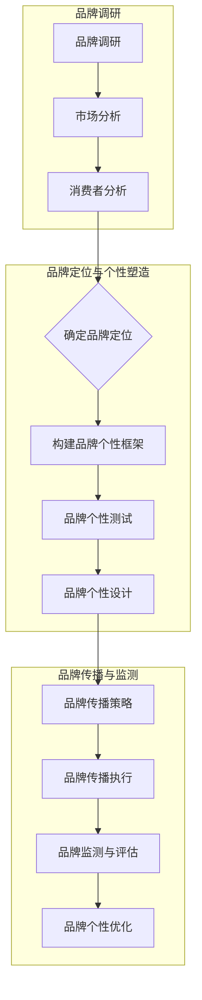

                 

# 品牌个性塑造：树立独特的市场形象

## 关键词
品牌个性、市场定位、消费者关系、品牌传播、营销策略

## 摘要
在当今竞争激烈的市场环境中，品牌个性塑造已成为企业打造独特市场形象、提升品牌价值和吸引消费者的关键因素。本文将从品牌个性塑造的重要性、基础理论、策略与方法、实战案例以及持续发展等方面，深入探讨如何通过系统化的品牌个性塑造策略，树立企业在市场中的独特形象，增强品牌竞争力。

## 目录大纲

### 第一部分：品牌个性塑造的概述

#### 第1章：品牌个性塑造的重要性

#### 第2章：品牌个性塑造的基础理论

### 第二部分：塑造品牌个性的策略与方法

#### 第3章：品牌个性塑造策略

#### 第4章：品牌个性塑造的方法

#### 第5章：品牌个性与市场营销

### 第三部分：品牌个性塑造的实战案例

#### 第6章：品牌个性塑造的实战案例分析

#### 第7章：品牌个性塑造的持续发展与优化

### 第四部分：品牌个性塑造的辅助工具与资源

#### 附录 A：品牌个性塑造工具与资源

#### 附件 A：品牌个性塑造流程图

### 引言

在数字化时代，品牌已成为企业核心竞争力的重要体现。品牌个性，作为一种独特的市场标识，不仅影响着消费者的购买决策，更在潜移默化中塑造着消费者的品牌认知和情感联结。因此，如何通过品牌个性塑造，树立企业独特的市场形象，成为企业战略规划中的重要议题。

本文将从以下几个方面展开讨论：

1. **品牌个性塑造的重要性**：分析品牌个性的定义及其在市场竞争中的作用。
2. **品牌个性塑造的基础理论**：探讨品牌定位、品牌文化与品牌个性之间的关系。
3. **品牌个性塑造的策略与方法**：介绍视觉形象、声音形象、品牌故事等塑造品牌个性的具体手段。
4. **品牌个性与市场营销**：分析品牌个性在营销策略中的实际应用。
5. **品牌个性塑造的实战案例**：通过具体案例，展示品牌个性塑造的成功经验。
6. **品牌个性塑造的持续发展与优化**：探讨如何持续优化品牌个性，以适应市场变化。

通过本文的探讨，希望能够为企业提供品牌个性塑造的系统性指导，帮助企业在竞争激烈的市场中脱颖而出。

### 第一部分：品牌个性塑造的概述

#### 第1章：品牌个性塑造的重要性

品牌个性，指的是品牌所具有的独特性格特征，这些特征可以通过品牌名称、标志、口号、视觉设计、声音等元素表现出来。在当今高度竞争的市场环境中，品牌个性塑造的重要性日益凸显。

首先，品牌个性能够帮助企业树立独特市场形象。在众多品牌中，具备独特个性的品牌更容易在消费者心中留下深刻印象。例如，苹果公司以简洁、创新、高端的形象著称，通过品牌个性塑造，成功吸引了大量追求时尚和科技感的消费者。

其次，品牌个性有助于增强品牌价值。一个具有鲜明个性的品牌，不仅能够提高消费者对品牌的认知度和忠诚度，还能增加品牌的溢价能力。例如，可口可乐作为一个具有悠久历史的品牌，其个性表现为活力、友好和乐观，这种品牌个性使可口可乐在全球范围内拥有庞大的忠实消费者群体。

此外，品牌个性对于消费者关系具有重要意义。一个具备独特个性的品牌，能够与消费者建立起更为紧密的情感联结，从而提高消费者的品牌忠诚度。消费者在购买过程中，不仅关注产品本身的质量和功能，更在乎品牌所传递的价值和情感。例如，星巴克通过其独特的咖啡文化和品牌氛围，成功地将其品牌个性传递给了消费者，从而赢得了消费者的喜爱和忠诚。

总之，品牌个性塑造对于企业在市场竞争中取得成功至关重要。通过明确和强化品牌个性，企业不仅可以树立独特的市场形象，增强品牌价值，还能与消费者建立起深层次的情感联结，从而在激烈的市场竞争中脱颖而出。

#### 第1章：品牌个性塑造的重要性

品牌个性塑造的重要性在于其能够为企业带来多方面的战略优势。首先，从市场定位的角度来看，品牌个性有助于企业在众多竞争者中脱颖而出。在高度同质化的市场中，一个具有鲜明个性的品牌能够通过独特的品牌形象和价值观吸引特定的目标消费者群体，从而实现精准的市场定位。

具体而言，品牌个性可以通过以下几个途径实现市场定位：

1. **差异化定位**：通过独特的品牌个性，企业能够在产品高度同质化的市场中找到独特的差异化点。例如，耐克以其活力、创新和运动精神，在运动品牌市场中占据了领先地位。

2. **情感共鸣**：品牌个性能够与消费者的情感需求产生共鸣，从而在消费者心中建立独特的品牌联想。例如，麦当劳通过其快乐的品牌形象，成功地将其与快乐、家庭和友谊等情感联系起来。

3. **价值传递**：品牌个性有助于企业将特定的品牌价值观传递给消费者，从而在消费者心中树立明确的品牌形象。例如，特斯拉通过其环保、高科技的品牌个性，成功地将其与绿色科技和未来生活等价值观联系起来。

其次，从消费者关系的角度来看，品牌个性对于建立和维护消费者忠诚度具有重要作用。一个具备独特个性的品牌，能够与消费者建立起情感联结，使消费者对品牌产生情感依赖。

具体而言，品牌个性可以通过以下几个途径影响消费者关系：

1. **情感联结**：品牌个性能够与消费者的情感需求产生共鸣，从而在消费者心中建立强烈的情感联结。例如，阿迪达斯通过其品牌个性中的运动精神和激励理念，成功地与追求健康、积极生活方式的消费者建立了情感联结。

2. **品牌认同**：品牌个性有助于消费者对品牌产生认同感，从而提高消费者的品牌忠诚度。消费者在认同品牌价值观和个性特征后，更愿意持续购买和使用品牌产品。

3. **口碑传播**：一个具备鲜明个性的品牌，能够通过消费者的口碑传播，进一步扩大品牌影响力和市场份额。消费者在情感联结和品牌认同的基础上，更愿意向他人推荐品牌，从而促进品牌的口碑传播。

此外，品牌个性塑造对于品牌价值提升也有着显著影响。一个具备独特个性的品牌，不仅能够提高消费者的品牌认知度和忠诚度，还能增加品牌的溢价能力。

具体而言，品牌个性可以通过以下几个途径提升品牌价值：

1. **品牌认知度**：通过独特的品牌个性，企业能够在消费者心中建立深刻的品牌认知。例如，谷歌通过其简洁、高效的品牌个性，使其成为全球最受欢迎的搜索引擎。

2. **品牌忠诚度**：品牌个性能够与消费者的情感需求产生共鸣，从而提高消费者的品牌忠诚度。消费者在情感联结和品牌认同的基础上，更愿意持续购买和使用品牌产品。

3. **品牌溢价能力**：一个具备独特个性的品牌，能够提高消费者的购买意愿，从而增加品牌的溢价能力。例如，苹果公司通过其独特的设计理念和品牌形象，使其产品价格高于竞争对手，但仍受到消费者的热烈追捧。

总之，品牌个性塑造的重要性在于其能够为企业带来市场定位、消费者关系和品牌价值等多方面的战略优势。通过明确和强化品牌个性，企业不仅能够在激烈的市场竞争中脱颖而出，还能与消费者建立起深层次的情感联结，从而实现长期的品牌发展和市场扩展。

#### 第1章：品牌个性塑造的重要性

品牌个性塑造的重要性不仅体现在市场定位和消费者关系上，更在品牌差异化方面发挥了关键作用。在当前竞争激烈的市场环境中，品牌差异化已成为企业脱颖而出的关键因素。一个具备独特个性的品牌，能够通过差异化策略在众多竞争者中脱颖而出，从而吸引目标消费者的关注。

首先，品牌个性有助于建立市场差异化。通过独特的品牌个性，企业能够明确区分自身与竞争对手的产品或服务，从而在消费者心中树立独特的品牌形象。例如，可口可乐通过其独特的口味和情感联结，成功地将自身与百事可乐等竞争对手区分开来。

其次，品牌个性能够强化品牌的差异化优势。一个具备鲜明个性的品牌，能够通过独特的品牌特征和价值观，与消费者的需求和情感产生共鸣。例如，特斯拉通过其环保、高科技的品牌个性，成功地将自身与传统的燃油汽车品牌区分开来，吸引了大量环保和科技爱好者。

此外，品牌个性在品牌差异化中还具有以下几个作用：

1. **品牌定位**：品牌个性有助于企业明确市场定位，从而在目标市场中占据一席之地。一个具备独特个性的品牌，能够通过明确的品牌定位，吸引与其品牌个性相契合的消费者群体。

2. **品牌溢价**：品牌个性能够提高消费者的品牌认同感和购买意愿，从而增加品牌的溢价能力。例如，路易威登通过其奢华、高端的品牌个性，使其产品价格远高于其他竞争对手，但仍受到消费者的青睐。

3. **品牌忠诚**：品牌个性能够与消费者建立深层次的情感联结，从而提高消费者的品牌忠诚度。消费者在认同品牌价值观和个性特征后，更愿意持续购买和使用品牌产品。

总之，品牌个性塑造在品牌差异化中发挥了重要作用。通过独特的品牌个性，企业不仅能够明确市场定位，提高品牌溢价能力和品牌忠诚度，还能在激烈的市场竞争中脱颖而出。品牌差异化策略的成功实施，有助于企业在长期发展中保持竞争优势，实现可持续发展。

#### 第1章：品牌个性塑造的重要性

品牌个性塑造的重要性还体现在其对企业竞争优势的长期贡献。在快速变化的市场环境中，企业需要不断创新和适应，以保持竞争优势。品牌个性作为企业独特的市场标识，不仅能够增强品牌的市场竞争力，还能为企业提供持续发展的动力。

首先，品牌个性有助于增强品牌的市场竞争力。通过独特的品牌个性，企业能够在激烈的市场竞争中脱颖而出，吸引目标消费者的关注。例如，小米通过其性价比高、科技创新的品牌个性，在智能手机市场中占据了重要地位。

其次，品牌个性能够提升企业的品牌认知度和忠诚度。一个具备独特个性的品牌，能够与消费者的情感需求产生共鸣，从而在消费者心中建立深刻的品牌印象。这种品牌认知度和忠诚度的提升，有助于企业在市场竞争中保持稳定的消费者基础。

此外，品牌个性对于企业的持续发展具有重要意义：

1. **品牌定位**：品牌个性有助于企业明确市场定位，从而在目标市场中占据一席之地。通过明确的品牌定位，企业能够更好地满足消费者的需求，提供差异化的产品和服务。

2. **品牌创新**：品牌个性能够激发企业的创新动力，推动企业在产品、服务、营销等方面的持续创新。一个具备独特个性的品牌，能够不断创新和适应市场变化，从而保持竞争优势。

3. **品牌传播**：品牌个性有助于企业通过有效的品牌传播策略，扩大品牌影响力和市场份额。一个具备鲜明个性的品牌，能够通过多样化的传播手段，与消费者建立深层次的情感联结，从而提升品牌知名度和美誉度。

4. **品牌溢价**：品牌个性能够提高消费者的品牌认同感和购买意愿，从而增加品牌的溢价能力。一个具备独特个性的品牌，不仅能够吸引更多的消费者，还能在市场竞争中获得更高的价格。

总之，品牌个性塑造对于企业的长期竞争优势具有重要作用。通过独特的品牌个性，企业不仅能够在市场竞争中脱颖而出，还能在持续发展中保持竞争优势，实现可持续发展。

### 第二部分：品牌个性塑造的基础理论

#### 第2章：品牌个性塑造的基础理论

品牌个性塑造作为企业品牌战略的重要组成部分，其理论基础涵盖了品牌定位、品牌文化与品牌个性等多个方面。理解这些基础理论，有助于企业更加系统地开展品牌个性塑造工作。

首先，品牌定位是品牌个性塑造的起点。品牌定位是指企业通过确定自身品牌在市场中的独特位置，从而在消费者心中建立清晰的品牌形象。成功的品牌定位有助于企业明确目标市场，吸引与其品牌定位相契合的消费者群体。品牌定位理论主要包括以下几个关键点：

1. **目标市场**：企业需要明确目标市场，了解目标消费者的需求、偏好和行为。例如，苹果公司明确将其目标市场定位为高端消费者，通过提供高品质、创新的产品和服务，吸引这部分消费者的关注。

2. **品牌差异化**：品牌定位不仅需要明确市场位置，还需要突出品牌与竞争对手的差异。通过独特的品牌个性，企业能够在消费者心中树立独特的品牌形象，从而实现市场差异化。例如，特斯拉通过其环保、高科技的品牌个性，成功将其与传统的燃油汽车品牌区分开来。

3. **品牌定位的持久性**：品牌定位需要具有持久性，能够经受住市场变化和消费者需求的考验。企业需要不断调整和优化品牌定位，以适应市场变化和消费者需求。例如，可口可乐通过持续强化其经典、快乐的品牌个性，使其在市场中保持了长期的竞争力。

其次，品牌文化是品牌个性塑造的核心。品牌文化是指企业在长期经营过程中所形成的价值观、信念和行为准则。品牌文化不仅是企业内部员工的行为指南，也是企业与消费者沟通的桥梁。品牌文化对品牌个性塑造的影响主要表现在以下几个方面：

1. **品牌价值观**：品牌价值观是企业文化的核心，决定了品牌的行为方式和价值取向。例如，谷歌的“不作恶”价值观使其在品牌形象上显得开放、透明和负责任。

2. **品牌行为准则**：品牌行为准则是指企业在日常经营中遵循的行为规范。例如，星巴克通过其“第三空间”理念，将其品牌行为准则明确为提供舒适、温馨的社交空间。

3. **品牌个性特征**：品牌文化通过其价值观和行为准则，塑造了品牌的个性特征。例如，阿里巴巴的“客户第一、员工第二、股东第三”价值观，使其品牌个性表现为关心社会、以人为本。

最后，品牌个性是品牌文化的外在表现。品牌个性是指品牌在消费者心目中呈现出的独特性格和特质。品牌个性不仅能够吸引目标消费者的关注，还能在消费者心中建立独特的品牌联想。品牌个性的塑造主要包括以下几个方面：

1. **品牌名称和标志**：品牌名称和标志是品牌个性的视觉符号，能够直观地传递品牌的文化和价值。例如，耐克的品牌名称和标志设计简洁、富有力量感，体现了其品牌个性中的运动精神和活力。

2. **品牌口号和传播策略**：品牌口号是品牌个性的语言表达，能够快速传达品牌的核心价值和品牌个性。例如，百事可乐的“新一代的选择”口号，突出了其品牌个性中的年轻、时尚和活力。

3. **品牌故事和价值观传播**：品牌故事和价值观传播是品牌个性塑造的重要手段。通过讲述品牌故事和传播品牌价值观，企业能够与消费者建立情感联结，增强品牌个性在消费者心中的认知和认同。例如，特斯拉通过其品牌故事，传递了其环保、高科技的品牌个性。

总之，品牌个性塑造的基础理论涵盖了品牌定位、品牌文化与品牌个性等多个方面。通过理解这些基础理论，企业能够更加系统地开展品牌个性塑造工作，从而在激烈的市场竞争中脱颖而出。

#### 第2章：品牌个性塑造的基础理论

在品牌个性塑造中，品牌定位与品牌个性之间的关系至关重要。品牌定位是企业确定自身在市场中的独特位置，而品牌个性则是这一位置的具体表现。品牌定位为品牌个性的塑造提供了方向和基础，品牌个性则为品牌定位提供了生命力和吸引力。

首先，品牌定位为品牌个性的塑造提供了明确的方向。品牌定位明确了企业的目标市场和核心价值主张，这直接影响了品牌个性的塑造。例如，一个以高端市场为目标的企业，其品牌个性可能更倾向于优雅、奢华和独特；而一个以大众市场为目标的企业，其品牌个性可能更倾向于亲民、实用和便捷。通过品牌定位，企业能够确定品牌个性的基本特质和风格，从而在品牌传播和市场营销中保持一致性。

其次，品牌个性丰富了品牌定位的内涵。品牌定位只是企业市场定位的理论框架，而品牌个性则是这一框架的具体表现形式。品牌个性通过独特的品牌名称、标志、口号、视觉和听觉设计等元素，使品牌定位更加鲜活和生动。例如，苹果公司通过其简洁、优雅、高科技的品牌个性，使其高端定位更加深入人心，从而吸引了大量追求科技和品质的消费者。

此外，品牌定位与品牌个性的相互作用还体现在以下几个方面：

1. **品牌差异化**：品牌定位有助于企业在市场中实现差异化，而品牌个性则是这一差异化的具体体现。通过品牌个性，企业能够在消费者心中树立独特的品牌形象，从而在竞争中脱颖而出。例如，星巴克通过其独特的咖啡文化和品牌氛围，成功在咖啡市场中建立了强大的差异化优势。

2. **品牌识别**：品牌定位和品牌个性共同构成了品牌识别系统，使品牌在消费者心中具有独特的识别性。一个具备鲜明个性的品牌，能够通过品牌定位和品牌个性的一致性，使消费者对品牌产生深刻的认知和认同。

3. **品牌传播**：品牌定位和品牌个性的结合，为品牌传播提供了有力的支持。在品牌传播过程中，企业需要通过一致的品牌形象和品牌个性，将品牌价值主张传递给目标消费者。例如，可口可乐通过其经典的品牌定位和品牌个性，成功地在全球范围内传播了其品牌价值。

总之，品牌定位与品牌个性之间的关系密不可分。品牌定位为品牌个性的塑造提供了基础和方向，而品牌个性则为品牌定位提供了生命力和吸引力。通过有效结合品牌定位和品牌个性，企业能够在市场中树立独特的品牌形象，实现品牌的长期发展和成功。

#### 第2章：品牌个性塑造的基础理论

品牌文化是品牌个性塑造的内核，它不仅影响品牌的外在形象，还深刻塑造了品牌的内在特质。品牌文化是一个企业在长期经营过程中所形成的独特价值观、信仰和行为准则，它决定了品牌的个性和风格。理解品牌文化与品牌个性的关系，有助于企业更好地进行品牌个性塑造。

首先，品牌文化为品牌个性提供了价值观基础。品牌文化包含了企业对内外部环境的理解和应对策略，这些策略和理念构成了品牌价值观的核心。品牌价值观不仅指导企业的经营行为，也影响品牌与消费者之间的互动。例如，阿里巴巴的“客户第一、员工第二、股东第三”价值观，塑造了其品牌个性中的关怀、诚信和创新。

其次，品牌文化通过行为准则和员工行为，外化成为品牌个性。品牌文化不仅仅体现在企业的口号和标识上，更体现在员工的日常行为和互动中。例如，谷歌的“不作恶”企业文化，体现在其员工对待用户隐私和数据安全的高度重视上，这种细致入微的关注，使其品牌个性显得开放、透明和负责任。

此外，品牌文化还通过品牌故事和传播策略，将品牌个性传递给消费者。品牌故事不仅讲述了品牌的历史和成就，还传递了品牌的核心价值观和品牌个性。例如，耐克通过其品牌故事，展示了其对运动精神的执着追求和不断创新的精神，这一品牌个性使耐克在运动品牌市场中具有独特的竞争优势。

具体而言，品牌文化与品牌个性的关系体现在以下几个方面：

1. **品牌一致性和连贯性**：品牌文化确保品牌个性的一致性和连贯性。无论是在产品设计和生产，还是在市场营销和客户服务中，品牌文化都能够保持品牌个性的稳定性，使消费者对品牌形成一致的认知。

2. **品牌认同和忠诚**：品牌文化塑造了品牌的个性和价值观，使消费者对品牌产生认同感和忠诚度。一个具备鲜明品牌文化的企业，能够与消费者建立起深层次的情感联结，从而提高品牌忠诚度。

3. **品牌差异化和独特性**：品牌文化为品牌个性提供了独特的价值主张，使品牌在市场中具有差异化和独特性。通过独特的品牌文化，企业能够在众多竞争者中脱颖而出，吸引目标消费者的关注。

总之，品牌文化是品牌个性塑造的内核，它不仅为品牌个性提供了价值观基础，还通过行为准则、品牌故事和传播策略，将品牌个性传递给消费者。通过有效塑造品牌文化，企业能够建立独特的品牌个性，增强品牌的市场竞争力和品牌价值。

#### 第2章：品牌个性塑造的基础理论

品牌个性塑造的心理学基础源自对消费者心理和行为模式的深刻理解。心理学理论为我们提供了分析品牌如何影响消费者情感、认知和行为的重要工具，从而帮助企业在品牌塑造过程中做出更科学的决策。

首先，心理学中的“品牌联想”理论为我们揭示了品牌个性塑造的核心机制。品牌联想是指消费者在接触品牌时，大脑中形成的各种相关想法、情感和记忆。一个成功的品牌个性塑造，能够通过一致且独特的品牌形象和体验，在消费者心中建立深刻的品牌联想。例如，苹果公司通过其简洁、创新和高端的品牌形象，成功地在消费者心中建立了“科技、时尚、高端”的品牌联想。

其次，心理学中的“情感营销”理论强调了情感在品牌个性塑造中的重要性。情感营销是通过品牌体验和传播策略，激发消费者的情感反应，从而建立情感联结。一个具备鲜明个性的品牌，能够通过情感共鸣，与消费者建立起深厚的情感关系。例如，星巴克通过其温馨、舒适的咖啡店环境和情感化营销策略，成功地与消费者建立了情感联结，从而提升了品牌忠诚度。

另外，心理学中的“认知一致性”理论为我们提供了品牌个性塑造的指导。认知一致性是指个体在信息处理过程中，倾向于保持内部认知和外部行为的一致性。在品牌个性塑造中，企业需要确保品牌传播的信息和体验与品牌个性一致，以增强消费者对品牌的认知一致性。例如，谷歌通过其简洁、高效的搜索体验和透明、负责任的企业文化，保持了品牌个性和品牌传播的一致性，从而增强了消费者的品牌认知。

此外，心理学中的“自我概念”理论也为我们理解品牌个性塑造提供了启示。自我概念是指个体对自己的认知和评价。品牌个性塑造需要与消费者的自我概念相契合，从而在消费者心中建立积极的品牌联想。例如，耐克通过其运动精神和激励理念，与那些追求健康、积极生活方式的消费者建立了自我概念上的契合，从而增强了品牌吸引力和忠诚度。

总之，品牌个性塑造的心理学基础涵盖了品牌联想、情感营销、认知一致性和自我概念等多个理论。通过深刻理解这些心理学理论，企业能够更有针对性地进行品牌个性塑造，从而在激烈的市场竞争中脱颖而出。

### 第二部分：塑造品牌个性的策略与方法

#### 第3章：品牌个性塑造策略

品牌个性塑造是一项系统工程，需要企业从多个维度进行综合考虑。本章将介绍品牌个性塑造的主要策略，包括视觉形象设计、声音形象设计和品牌故事与价值观传播等。

#### 3.1 品牌视觉形象设计

品牌视觉形象是品牌个性的直观表达，包括品牌标志、色彩系统、字体设计等。一个成功的品牌视觉形象设计，不仅能够传递品牌的核心价值和个性特质，还能在消费者心中留下深刻印象。

1. **品牌标志设计**

品牌标志是品牌视觉形象的核心，它需要简洁、独特且易于识别。在设计品牌标志时，企业应考虑以下几点：

- **简洁性**：品牌标志应尽量避免复杂的设计元素，以简洁明了的方式传达品牌的核心信息。
- **独特性**：品牌标志应具有独特的设计风格，能够与竞争对手区分开来。
- **易于识别**：品牌标志需要能够在不同媒介上保持一致性和识别性，无论是印刷品、广告还是线上平台。

2. **色彩系统设计**

色彩在品牌视觉形象设计中起着至关重要的作用。正确的色彩选择能够强化品牌个性，提升品牌认知度。企业在选择色彩时，应考虑以下几点：

- **品牌调性**：色彩应与品牌定位和品牌个性相契合。例如，蓝色通常与科技、信任和冷静相关联，适合科技类品牌；而红色则与热情、活力和能量相关联，适合运动类品牌。
- **文化背景**：不同国家和地区的消费者对色彩的感知和喜好不同，企业应考虑目标市场的文化背景。
- **一致性**：品牌色彩系统应在所有品牌传播渠道中保持一致，以强化品牌形象。

3. **字体设计**

字体设计也是品牌视觉形象设计的重要组成部分。合适的字体不仅能够提升品牌的专业性和视觉效果，还能增强品牌个性。企业在选择字体时，应考虑以下几点：

- **品牌个性**：字体应与品牌个性相匹配。例如，现代、简洁的字体适合科技类品牌；而传统、典雅的字体适合文化类品牌。
- **可读性**：字体应具有良好的可读性，确保在不同的媒介和尺寸上都能清晰辨识。
- **一致性**：品牌字体应在所有品牌传播渠道中保持一致，以建立统一的品牌形象。

#### 3.2 品牌声音形象设计

品牌声音形象是指品牌通过语言、声音和音乐等元素传递的品牌形象和信息。一个成功的品牌声音形象设计，能够增强品牌的情感共鸣和记忆点。

1. **品牌口号**

品牌口号是品牌声音形象的重要组成部分，它需要简洁、有力且能够传达品牌的核心价值和个性特质。在设计品牌口号时，企业应考虑以下几点：

- **简洁性**：品牌口号应简洁明了，避免使用复杂的语言和冗长的句子。
- **有力性**：品牌口号需要具有感染力和说服力，能够吸引消费者的注意力。
- **情感共鸣**：品牌口号应能够与消费者的情感需求产生共鸣，从而增强品牌与消费者之间的情感联结。

2. **品牌音乐**

品牌音乐是品牌声音形象的重要元素，它可以通过独特的旋律和声音，增强品牌的情感传递和市场吸引力。企业在选择品牌音乐时，应考虑以下几点：

- **品牌个性**：品牌音乐应与品牌个性相匹配，传达出品牌的核心价值和情感特质。
- **独特性**：品牌音乐应具有独特性和辨识度，使消费者能够在众多品牌中记住和识别品牌。
- **情感共鸣**：品牌音乐应能够与消费者的情感需求产生共鸣，从而提升品牌的吸引力。

3. **品牌语音**

品牌语音是指品牌在口头沟通中的声音形象，包括品牌代言人、客服人员的语言表达和语调。一个成功的品牌语音设计，能够增强品牌的亲和力和专业性。

- **品牌代言人**：品牌代言人应具备与品牌个性相契合的形象和气质，能够代表品牌传达核心价值和情感特质。
- **客服人员**：品牌客服人员的语言表达和语调应亲切、专业且具有一致性，以提升消费者体验和品牌形象。

#### 3.3 品牌故事与价值观传播

品牌故事和价值观传播是品牌个性塑造的重要手段，它能够增强品牌与消费者之间的情感联结，提升品牌忠诚度。

1. **品牌故事**

品牌故事是品牌历史和发展的叙述，它能够传递品牌的核心价值和品牌个性。一个成功的品牌故事应具备以下几点：

- **真实性**：品牌故事应基于品牌的历史和事实，真实可信，以赢得消费者的信任。
- **情感共鸣**：品牌故事应能够与消费者的情感需求产生共鸣，从而提升品牌吸引力和忠诚度。
- **一致性**：品牌故事应在不同的传播渠道中保持一致，以建立统一的品牌形象。

2. **价值观传播**

品牌价值观是品牌文化的核心，它决定了品牌的个性特质和行为准则。通过有效的价值观传播，品牌能够与消费者建立深层次的情感联结。

- **品牌价值观表述**：品牌价值观应简洁、明确且易于理解，能够在消费者心中形成深刻的品牌印象。
- **价值观实践**：品牌应通过实际行动践行其价值观，使消费者感受到品牌的真实承诺和责任感。
- **价值观传播渠道**：品牌应通过多种渠道传播其价值观，包括社交媒体、广告、公关活动等，以增强品牌影响力和认知度。

总之，品牌个性塑造策略需要从视觉形象、声音形象和品牌故事与价值观传播等多个维度进行系统设计。通过有效的品牌个性塑造，企业能够树立独特的市场形象，提升品牌价值和消费者忠诚度。

#### 第3章：品牌个性塑造策略

在品牌个性塑造策略中，品牌视觉形象设计是至关重要的一环。成功的品牌视觉形象设计不仅能够吸引消费者的目光，还能在消费者心中建立深刻的品牌认知。品牌视觉形象设计主要包括品牌标志、色彩系统和字体设计等方面。以下将详细探讨这些方面的设计原则和实践方法。

**1. 品牌标志设计**

品牌标志是品牌的视觉核心，它需要在简洁、独特和易于识别之间找到平衡。以下是一些设计原则：

- **简洁性**：品牌标志应尽量简洁，避免过多的细节和复杂的图形。简洁的标志更容易被消费者记住和识别。
- **独特性**：品牌标志应具有独特的设计风格，能够在众多竞争者中脱颖而出。独特性可以通过新颖的图形、颜色或字体实现。
- **适应性**：品牌标志需要在不同尺寸和媒介上保持一致性和识别性。例如，在名片、广告、在线平台等不同场景下，品牌标志的视觉效果都应保持一致。

**2. 色彩系统设计**

色彩在品牌视觉形象设计中扮演着重要的角色，它能够传达品牌的核心价值和个性特质。以下是一些设计原则：

- **品牌调性**：色彩应与品牌定位和品牌个性相契合。例如，蓝色通常与科技、信任和冷静相关联，适合科技类品牌；而红色则与热情、活力和能量相关联，适合运动类品牌。
- **文化背景**：不同国家和地区的消费者对色彩的感知和喜好不同，企业应考虑目标市场的文化背景。例如，红色在中国传统文化中象征着喜庆和好运，但在一些西方国家可能被视为具有攻击性。
- **一致性**：品牌色彩系统应在所有品牌传播渠道中保持一致，以强化品牌形象。例如，品牌官方网站、社交媒体、广告和产品包装等都应该采用相同的色彩组合。

**3. 字体设计**

字体设计也是品牌视觉形象设计的重要组成部分，它能够增强品牌的专业性和视觉效果。以下是一些设计原则：

- **品牌个性**：字体应与品牌个性相匹配。例如，现代、简洁的字体适合科技类品牌；而传统、典雅的字体适合文化类品牌。
- **可读性**：字体应具有良好的可读性，确保在不同的媒介和尺寸上都能清晰辨识。例如，在网页设计中，字体大小和行距都需要合理设置，以提高阅读体验。
- **一致性**：品牌字体应在所有品牌传播渠道中保持一致，以建立统一的品牌形象。例如，品牌标志中的字体应与品牌宣传材料中的字体保持一致。

**4. 实践方法**

- **市场调研**：在开始设计前，企业应进行市场调研，了解目标消费者的偏好和竞争对手的视觉形象设计。这有助于设计出更具吸引力和差异化的品牌视觉形象。
- **设计原型**：企业可以制作多个品牌视觉形象设计原型，进行测试和评估。通过收集消费者反馈和专家意见，企业可以优化设计方案。
- **持续迭代**：品牌视觉形象设计不是一成不变的，企业应根据市场变化和消费者反馈，进行持续迭代和优化。

通过以上策略和实践方法，企业能够设计出成功的品牌视觉形象，从而在激烈的市场竞争中脱颖而出，树立独特的品牌个性。

#### 第3章：品牌个性塑造策略

在品牌个性塑造策略中，品牌声音形象设计同样至关重要。一个成功的品牌声音形象设计能够增强品牌的情感传递和市场吸引力。品牌声音形象主要包括品牌口号、品牌音乐和品牌语音等方面。以下将详细探讨这些方面的设计原则和实践方法。

**1. 品牌口号设计**

品牌口号是品牌声音形象的核心，它需要在简洁、有力且能够传递品牌核心价值之间找到平衡。以下是一些设计原则：

- **简洁性**：品牌口号应简洁明了，避免使用复杂的词汇和冗长的句子。简洁的口号更容易被消费者记住和传播。
- **有力性**：品牌口号需要具有感染力和说服力，能够吸引消费者的注意力并激发其购买欲望。
- **情感共鸣**：品牌口号应能够与消费者的情感需求产生共鸣，从而提升品牌吸引力和忠诚度。例如，Nike的口号“Just Do It”不仅简洁有力，还能激发消费者的内在动力。

**2. 品牌音乐设计**

品牌音乐是品牌声音形象的重要组成部分，它可以通过独特的旋律和声音，增强品牌的情感传递和市场吸引力。以下是一些设计原则：

- **品牌个性匹配**：品牌音乐应与品牌个性相匹配，传达出品牌的核心价值和情感特质。例如，苹果的品牌音乐通常具有科技感和未来感，与品牌的高科技形象相契合。
- **独特性**：品牌音乐应具有独特性和辨识度，使消费者能够在众多品牌中记住和识别品牌。独特的品牌音乐可以成为品牌的标志之一。
- **情感共鸣**：品牌音乐应能够与消费者的情感需求产生共鸣，从而提升品牌的吸引力和忠诚度。例如，星巴克的品牌音乐通常温馨而舒适，与消费者对咖啡店温馨氛围的需求相契合。

**3. 品牌语音设计**

品牌语音是指品牌在口头沟通中的声音形象，包括品牌代言人、客服人员的语言表达和语调。以下是一些设计原则：

- **品牌代言人**：品牌代言人应具备与品牌个性相契合的形象和气质，能够代表品牌传达核心价值和情感特质。例如，苹果的品牌代言人通常是具有科技背景的专业人士，与其高科技品牌形象相契合。
- **客服人员**：品牌客服人员的语言表达和语调应亲切、专业且具有一致性，以提升消费者体验和品牌形象。客服人员应接受专业的沟通和语调培训，确保在与消费者沟通时能够传递出品牌的价值观和个性特质。

**4. 实践方法**

- **市场调研**：在开始设计品牌声音形象前，企业应进行市场调研，了解目标消费者的偏好和期望。这有助于设计出更符合消费者需求的声音形象。
- **设计原型测试**：企业可以制作多个品牌声音形象设计原型，进行测试和评估。通过收集消费者反馈和专家意见，企业可以优化设计方案。
- **持续迭代**：品牌声音形象设计不是一成不变的，企业应根据市场变化和消费者反馈，进行持续迭代和优化。

通过以上策略和实践方法，企业能够设计出成功的品牌声音形象，从而在激烈的市场竞争中提升品牌的情感传递和市场吸引力。

#### 第3章：品牌个性塑造策略

在品牌个性塑造策略中，品牌故事与价值观传播扮演着至关重要的角色。一个成功的品牌故事不仅能够传递品牌的核心价值，还能与消费者建立情感联结，提升品牌忠诚度。以下将详细探讨品牌故事与价值观传播的设计原则和实践方法。

**1. 品牌故事设计**

品牌故事是品牌历史和发展的叙述，它需要具备真实性、情感共鸣和一致性等特点。以下是一些设计原则：

- **真实性**：品牌故事应基于品牌的历史和事实，真实可信，以赢得消费者的信任。企业可以通过采访品牌创始人、员工和早期客户，收集真实的故事素材。
- **情感共鸣**：品牌故事应能够与消费者的情感需求产生共鸣，从而提升品牌吸引力和忠诚度。企业可以通过讲述品牌如何解决消费者的问题、如何创造价值，以及品牌如何与消费者共同成长，来引发消费者的情感共鸣。
- **一致性**：品牌故事应在不同的传播渠道中保持一致，以建立统一的品牌形象。企业可以通过品牌故事网站、社交媒体、公关文章和广告等多种渠道，传递品牌故事的核心信息。

**2. 价值观传播**

品牌价值观是品牌文化的核心，它决定了品牌的个性和行为准则。以下是一些设计原则：

- **明确性**：品牌价值观应简洁、明确且易于理解，能够在消费者心中形成深刻的品牌印象。企业可以通过简短的口号或句子，明确地表达品牌的核心价值观。
- **实践性**：品牌应通过实际行动践行其价值观，使消费者感受到品牌的真实承诺和责任感。例如，企业可以通过社会责任项目、员工福利计划和环境可持续性实践，展示其对价值观的践行。
- **传播渠道**：品牌价值观应通过多种渠道进行传播，包括社交媒体、公关活动、广告和员工培训等，以增强品牌影响力和认知度。

**3. 实践方法**

- **市场调研**：在开始设计品牌故事和价值观传播策略前，企业应进行市场调研，了解目标消费者的需求和期望。这有助于设计出更符合消费者需求的故事和价值观。
- **故事化传播**：品牌故事可以通过故事化的方式传递，使消费者更容易理解和接受。企业可以通过视频、图文故事、演讲等形式，生动地讲述品牌故事和价值观。
- **用户参与**：鼓励消费者参与品牌故事和价值观的传播，可以提升品牌忠诚度和口碑。企业可以通过用户生成内容、品牌大使计划等手段，激发消费者的参与热情。

通过以上策略和实践方法，企业能够设计出成功的品牌故事和价值观传播策略，从而在消费者心中树立独特的品牌形象，提升品牌价值和忠诚度。

### 第三部分：品牌个性与市场营销

#### 第4章：品牌个性与市场营销

品牌个性在市场营销中起着至关重要的作用。一个具有鲜明个性的品牌，不仅能够吸引目标消费者的关注，还能在竞争激烈的市场中脱颖而出。本章将探讨品牌个性在市场营销中的应用，包括品牌个性与品牌传播、品牌个性与产品定位以及品牌个性与消费者心理等方面。

#### 4.1 品牌个性与品牌传播

品牌传播是品牌个性塑造的重要手段，通过多种渠道和方式，将品牌的核心价值和个性特质传递给消费者。一个成功的品牌传播策略，需要充分利用品牌个性，以增强品牌的市场影响力和认知度。

1. **社交媒体传播**

社交媒体是品牌传播的重要平台，通过社交媒体，品牌能够与消费者建立直接的联系。品牌个性在社交媒体传播中的应用主要体现在以下几个方面：

- **内容创意**：品牌可以通过独特的内容创意，展示品牌个性。例如，品牌可以发布有趣的故事、视频和图片，吸引消费者的注意力。
- **互动互动**：品牌应与消费者保持互动，了解消费者的需求和反馈。通过互动，品牌能够更好地理解消费者，从而调整品牌传播策略。
- **品牌故事**：品牌可以通过讲述品牌故事，传递品牌的核心价值和品牌个性。品牌故事能够引发消费者的情感共鸣，从而增强品牌忠诚度。

2. **广告传播**

广告是品牌传播的传统手段，通过广告，品牌能够在短时间内向大量消费者传递品牌信息。品牌个性在广告传播中的应用主要体现在以下几个方面：

- **视觉设计**：品牌广告的视觉设计应与品牌个性相契合。例如，一个具有现代感的品牌，其广告视觉设计应简洁、时尚和具有未来感。
- **广告语言**：品牌广告的语言应简洁、有力且能够传达品牌的核心价值和品牌个性。例如，苹果的广告通常强调其产品的创新和卓越性能。
- **广告渠道**：品牌应选择与品牌个性相匹配的广告渠道，以最大化传播效果。例如，一个注重年轻和时尚的品牌，可以选择在社交媒体和时尚杂志上投放广告。

#### 4.2 品牌个性与产品定位

品牌个性对产品定位有着深远的影响。一个具有鲜明个性的品牌，其产品定位也应与之相契合，以增强品牌的市场竞争力。

1. **产品特色**

品牌个性可以通过产品特色来体现。例如，一个以创新为核心的品牌，其产品应具有创新的功能和设计；一个以奢华为核心的品牌，其产品应具有高端的品质和设计。通过产品特色，品牌能够与竞争对手区分开来，吸引目标消费者的关注。

2. **市场细分**

品牌个性还可以用于市场细分。品牌可以根据品牌个性，将市场划分为不同的细分市场，并针对每个细分市场进行定制化的产品定位。例如，一个以年轻人为核心的品牌，可以针对年轻人市场推出时尚、潮流的产品；一个以家庭为核心的品牌，可以针对家庭市场推出实用、耐用的产品。

3. **价格策略**

品牌个性还可以影响价格策略。一个具有高端品牌个性的品牌，其产品定价应相对较高，以体现其高端和奢华的形象；一个以亲民为核心的品牌，其产品定价应相对较低，以吸引更多的消费者。

#### 4.3 品牌个性与消费者心理

品牌个性不仅影响品牌传播和产品定位，还直接影响消费者的心理。一个成功的品牌个性，能够与消费者的心理需求产生共鸣，从而提高品牌吸引力和忠诚度。

1. **情感共鸣**

品牌个性应能够与消费者的情感需求产生共鸣。例如，一个以温馨、家庭为核心的品牌，能够吸引那些重视家庭温暖的消费者；一个以创新、科技为核心的品牌，能够吸引那些追求科技前沿的消费者。

2. **品牌认同**

品牌个性应能够与消费者的自我认同产生共鸣。例如，一个以时尚、个性为核心的品牌，能够吸引那些追求个性和时尚的消费者；一个以环保、可持续为核心的品牌，能够吸引那些关注环保和可持续发展的消费者。

3. **品牌忠诚**

品牌个性能够增强消费者的品牌忠诚度。一个具备鲜明个性的品牌，能够与消费者建立起深层次的情感联结，从而提高消费者的品牌忠诚度。例如，苹果的品牌个性中的创新和卓越性能，使其消费者对其产品表现出极高的忠诚度。

总之，品牌个性在市场营销中具有重要作用。通过有效的品牌传播、产品定位和消费者心理分析，品牌能够树立独特的市场形象，提高品牌吸引力和忠诚度，从而在激烈的市场竞争中脱颖而出。

#### 第4章：品牌个性与品牌传播

品牌个性与品牌传播之间存在着紧密的联系。一个成功的品牌传播策略，能够有效传达品牌个性，从而在消费者心中建立深刻的品牌认知和情感联结。以下是品牌个性在品牌传播中的具体应用。

**1. 品牌传播策略**

品牌传播策略是指通过不同的传播渠道和手段，将品牌信息传递给目标消费者。一个具备鲜明个性的品牌，在制定品牌传播策略时，应充分考虑品牌个性，以确保传播内容与品牌形象的一致性。

- **内容创意**：品牌传播的内容应与品牌个性相契合。例如，一个以创新为核心的品牌，可以通过发布创新产品介绍、技术创新案例等内容，展示其创新精神；一个以温馨家庭为核心的品牌，可以通过讲述家庭故事、传递家庭温暖等方式，展示其家庭价值观。
- **传播渠道**：品牌传播的渠道应多样化，以覆盖不同的目标消费者群体。例如，一个面向年轻消费者的品牌，可以通过社交媒体、短视频平台等进行传播；一个面向商务群体的品牌，可以通过专业展会、商务会议等进行传播。
- **一致性**：品牌传播的内容和形式应保持一致性，以强化品牌个性。例如，品牌广告中的视觉设计、语言表达和口号等，都应与品牌标志和品牌口号保持一致，从而形成统一的品牌形象。

**2. 社交媒体传播**

社交媒体已成为品牌传播的重要平台。一个成功的社交媒体传播策略，能够充分利用品牌个性，与消费者建立深层次的情感联结。

- **内容创意**：品牌在社交媒体上发布的内容应有趣、有价值，能够引起消费者的共鸣。例如，品牌可以通过发布搞笑视频、互动游戏等方式，吸引消费者的关注和参与。
- **互动互动**：品牌应积极与消费者互动，了解他们的需求和反馈。通过回复评论、参与话题讨论等方式，品牌能够与消费者建立良好的关系，提高品牌忠诚度。
- **品牌故事**：品牌可以通过社交媒体讲述品牌故事，传递品牌的核心价值和品牌个性。品牌故事能够引发消费者的情感共鸣，从而增强品牌忠诚度。

**3. 广告传播**

广告是品牌传播的重要手段，通过广告，品牌能够向大量消费者传递品牌信息。品牌个性在广告传播中的应用主要体现在以下几个方面：

- **视觉设计**：广告的视觉设计应与品牌个性相契合。例如，一个以现代感为核心的品牌，其广告视觉设计应简洁、时尚和具有未来感；一个以传统感为核心的品牌，其广告视觉设计应典雅、古朴和具有文化感。
- **广告语言**：广告的语言表达应简洁、有力且能够传达品牌的核心价值和品牌个性。例如，苹果的广告通常强调其产品的创新和卓越性能；可口可乐的广告则强调其产品的快乐和社交价值。
- **广告渠道**：品牌应选择与品牌个性相匹配的广告渠道，以最大化传播效果。例如，一个以年轻人为核心的品牌，可以选择在社交媒体和短视频平台上投放广告；一个以商务群体为核心的品牌，可以选择在专业展会和商务会议上投放广告。

**4. 品牌传播案例分析**

以下是一些品牌个性与品牌传播结合的成功案例：

- **Nike**：Nike以其运动精神和创新精神为核心品牌个性，通过广告和社交媒体传播，展示了其品牌的活力和激情。例如，Nike的广告语“Just Do It”简洁有力，传递了品牌的核心价值和品牌个性。
- **Coca-Cola**：Coca-Cola以其快乐和社交价值为核心品牌个性，通过广告和社交媒体传播，传递了品牌的正能量和快乐氛围。例如，Coca-Cola的“Share a Coke”活动，通过在瓶身上印上消费者名字，增强了消费者与品牌的互动和情感联结。
- **Apple**：Apple以其创新和高科技为核心品牌个性，通过广告和社交媒体传播，展示了其产品的先进性和未来感。例如，Apple的广告通常采用简洁、明快的视觉设计，传递了品牌的高科技和未来感。

总之，品牌个性在品牌传播中起着至关重要的作用。通过有效的品牌传播策略，品牌能够将独特的个性传递给消费者，从而在激烈的市场竞争中脱颖而出。

#### 第4章：品牌个性与产品定位

品牌个性在产品定位中扮演着关键角色。通过精准的产品定位，企业能够将品牌个性与消费者需求相匹配，从而在市场竞争中占据优势地位。以下是品牌个性在产品定位中的具体应用。

**1. 品牌个性与产品特色**

品牌个性可以通过产品特色来体现，使产品在市场中具有独特的竞争优势。以下是一些品牌个性与产品特色结合的案例：

- **苹果（Apple）**：苹果以其创新和卓越性能为核心品牌个性，其产品定位为高端科技产品。苹果的产品设计简洁、精美，性能卓越，能够满足那些追求科技前沿和极致体验的消费者需求。
- **宜家（IKEA）**：宜家以其简约、实用和性价高为核心品牌个性，其产品定位为家居用品。宜家的产品设计注重功能性和实用性，同时价格相对亲民，吸引了大量注重生活质量和性价比的消费者。
- **星巴克（Starbucks）**：星巴克以其温馨、舒适和社交价值为核心品牌个性，其产品定位为咖啡和饮品。星巴克的店铺设计舒适宜人，提供良好的社交氛围，吸引了那些追求高品质生活体验的消费者。

**2. 市场细分与目标消费者**

品牌个性还可以用于市场细分，帮助企业确定目标消费者群体。以下是一些品牌个性与市场细分结合的案例：

- **阿迪达斯（Adidas）**：阿迪达斯以其运动精神和时尚设计为核心品牌个性，其市场细分目标为年轻人和运动爱好者。阿迪达斯的产品设计时尚、动感，能够吸引那些追求运动和时尚的年轻人。
- **耐克（Nike）**：耐克以其创新、高科技和卓越性能为核心品牌个性，其市场细分目标为专业运动员和运动爱好者。耐克的产品设计注重科技和性能，能够满足那些追求极致运动体验的消费者需求。
- **无印良品（MUJI）**：无印良品以其简约、自然和环保为核心品牌个性，其市场细分目标为注重生活品质和环保意识的消费者。无印良品的产品设计简约、自然，注重环保和健康，吸引了那些追求高品质生活体验的消费者。

**3. 价格策略与品牌定位**

品牌个性还可以影响价格策略，从而进一步确定产品定位。以下是一些品牌个性与价格策略结合的案例：

- **宝马（BMW）**：宝马以其奢华、高性能和高端品牌形象为核心品牌个性，其价格策略相对较高。宝马的产品定价较高，以体现其高端和奢华的品牌形象，吸引了那些追求高品质和豪华体验的消费者。
- **丰田（Toyota）**：丰田以其可靠、经济和环保为核心品牌个性，其价格策略相对亲民。丰田的产品定价相对较低，以体现其可靠和经济的品牌形象，吸引了那些注重性价比和实用性的消费者。
- **星巴克（Starbucks）**：星巴克以其温馨、舒适和高端品牌形象为核心品牌个性，其价格策略相对较高。星巴克的产品定价较高，以体现其高端和奢华的品牌形象，吸引了那些追求高品质咖啡和生活体验的消费者。

**4. 案例分析**

以下是一些品牌个性与产品定位结合的成功案例：

- **特斯拉（Tesla）**：特斯拉以其创新、环保和未来感为核心品牌个性，其产品定位为高端电动车。特斯拉的产品设计注重创新和科技，性能卓越，价格较高，吸引了那些追求环保和未来生活方式的消费者。
- **谷歌（Google）**：谷歌以其创新、开放和自由为核心品牌个性，其产品定位为高科技互联网服务。谷歌的产品定价较低，提供免费或低价服务，吸引了大量的互联网用户。
- **华为（Huawei）**：华为以其创新、技术实力和国际化为核心品牌个性，其产品定位为高端智能手机和通信设备。华为的产品设计注重创新和性能，价格相对较高，吸引了那些追求高品质和前沿科技的消费者。

通过上述案例可以看出，品牌个性在产品定位中起着至关重要的作用。通过精准的产品定位，品牌能够与目标消费者建立深层次的情感联结，从而提升品牌竞争力和市场份额。

#### 第4章：品牌个性与消费者心理

品牌个性不仅影响品牌传播和产品定位，还直接影响消费者的心理。了解品牌个性与消费者心理之间的相互作用，有助于企业更有效地吸引和留住目标消费者。

**1. 情感联结**

品牌个性能够与消费者的情感需求产生共鸣，从而建立深厚的情感联结。一个成功的品牌个性，能够激发消费者的情感反应，使其在情感上认同和喜爱品牌。

- **情感共鸣**：品牌个性应能够与消费者的情感需求产生共鸣。例如，一个以温馨家庭为核心的品牌，能够吸引那些重视家庭温暖的消费者；一个以创新和科技为核心的品牌，能够吸引那些追求科技前沿的消费者。
- **情感体验**：品牌应通过提供独特的情感体验，使消费者在情感上与品牌产生联结。例如，星巴克通过其温馨的咖啡店环境和舒适的氛围，使消费者在购买咖啡时体验到家的温暖。

**2. 自我认同**

品牌个性应能够与消费者的自我认同产生共鸣，从而增强品牌吸引力和忠诚度。

- **个性匹配**：品牌个性应与消费者的自我认同相匹配。例如，一个以时尚、个性为核心的品牌，能够吸引那些追求个性和时尚的消费者；一个以环保、可持续为核心的品牌，能够吸引那些关注环保和可持续发展的消费者。
- **自我表达**：品牌应成为消费者自我表达的工具，使其能够通过品牌展现自己的个性和价值观。例如，苹果的产品设计简洁、时尚，成为那些追求个性和时尚的消费者展示自我的方式。

**3. 品牌忠诚**

品牌个性能够增强消费者的品牌忠诚度，使其在长期内持续购买和使用品牌产品。

- **情感联结**：通过情感联结，品牌能够与消费者建立深厚的情感关系，使其在情感上对品牌产生依赖。例如，可口可乐通过其经典的品牌形象和情感化营销，使其消费者对品牌产生深厚的情感联结。
- **价值认同**：品牌个性应能够与消费者的价值观相契合，使其在价值观上认同品牌。例如，无印良品以其简约、自然和环保的品牌个性，吸引了那些注重环保和健康生活方式的消费者。
- **品牌体验**：品牌应通过提供优质的品牌体验，使消费者在购买和使用品牌产品时感到满意和愉悦。例如，华为通过其高品质的产品和优质的服务，使其消费者对品牌产生高度的满意度和忠诚度。

**4. 案例分析**

以下是一些品牌个性与消费者心理结合的成功案例：

- **苹果（Apple）**：苹果以其创新、简洁和高端的品牌个性，吸引了那些追求科技前沿和高品质生活的消费者。苹果的产品设计简洁、时尚，使消费者在购买和使用过程中感受到愉悦和自豪。
- **耐克（Nike）**：耐克以其运动精神、激励和个性为核心品牌个性，吸引了那些追求运动、健康和自我实现的消费者。耐克的品牌故事和营销策略，使消费者在情感上与品牌产生共鸣，从而提高了品牌忠诚度。
- **可口可乐（Coca-Cola）**：可口可乐以其经典、快乐和社交价值的品牌个性，吸引了那些追求快乐、社交和传统情怀的消费者。可口可乐的营销策略，如“Share a Coke”活动，通过在瓶子上印上消费者名字，增强了消费者与品牌的情感联结。

通过以上案例可以看出，品牌个性在消费者心理中扮演着重要角色。一个成功的品牌个性，能够与消费者的情感需求、自我认同和价值观念产生共鸣，从而提高品牌吸引力和忠诚度。企业应深入了解目标消费者的心理需求，通过品牌个性塑造，与消费者建立深厚的情感联结，实现品牌的长期发展。

### 第三部分：品牌个性塑造的实战案例

#### 第6章：品牌个性塑造的实战案例分析

品牌个性塑造在实战中具有丰富的应用和成功案例，通过深入分析这些案例，我们可以更好地理解品牌个性如何在不同行业中发挥作用，以及如何通过独特的品牌个性实现市场突破。

#### 6.1 国际知名品牌个性塑造案例分析

**1. 苹果（Apple）**

苹果是品牌个性塑造的典范。其品牌个性集中在创新、简洁和高端。苹果的创新精神体现在其产品设计和功能上，从iPhone的触摸屏到iPad的平板电脑，苹果不断推动科技的前沿。简洁的设计理念使得苹果的产品在功能丰富的同时，依然保持极简的视觉风格。高端的品牌定位则体现在其产品的高价格和高质量，这使得苹果成为科技爱好者和时尚人士的首选。

**案例分析：**

- **品牌传播**：苹果通过其官方网站、Apple Store、广告和发布会，成功传递了其创新、简洁和高端的品牌个性。每次苹果发布新产品时，都会引发全球的关注和讨论。
- **产品定位**：苹果的产品定价相对较高，但其独特的品牌个性使其能够吸引愿意为高质量和创新支付额外费用的消费者。
- **消费者心理**：苹果的品牌个性与消费者的自我认同和价值观产生了强烈的共鸣，许多消费者认为购买苹果产品是一种生活方式的体现。

**2. 可口可乐（Coca-Cola）**

可口可乐的品牌个性以其经典的瓶身设计、欢快的广告音乐和全球化的品牌形象著称。可口可乐的品牌个性是快乐、友好和传统。其广告营销策略一贯以轻松、幽默和情感化为主，例如经典的“Share a Coke”活动，通过在瓶子上印上消费者的名字，使消费者感受到与品牌的亲密关系。

**案例分析：**

- **品牌传播**：可口可乐通过全球范围内的广告活动和社交媒体互动，成功传递了其快乐、友好和传统的品牌个性。例如，“Share a Coke”活动在多个国家和地区取得了巨大的成功，使可口可乐的品牌形象更加亲切。
- **产品定位**：可口可乐的产品定位是大众市场，其品牌个性吸引了广泛的目标消费者，从年轻人到老年人都有其拥趸。
- **消费者心理**：可口可乐的品牌个性与消费者的情感需求紧密相连，许多消费者在庆祝生日、聚会或其他特殊时刻都会选择可口可乐，将其视为快乐和庆祝的象征。

#### 6.2 本土品牌个性塑造案例分析

**1. 耐克（Nike）**

耐克以其运动精神、激励和个性为核心品牌个性。耐克的品牌形象与运动紧密相关，其广告和营销策略强调运动的精神和意志力，鼓励人们挑战自我、追求卓越。

**案例分析：**

- **品牌传播**：耐克通过其官网、社交媒体和广告，成功传递了其运动精神、激励和个性的品牌个性。耐克的广告常常邀请运动明星和普通消费者，展示他们在运动中的坚韧和毅力。
- **产品定位**：耐克的产品定位主要是高端运动市场，其品牌个性使其成为运动员和运动爱好者的首选品牌。
- **消费者心理**：耐克的品牌个性与消费者的自我实现和价值观相契合，许多消费者认为购买耐克产品是追求健康、积极生活方式的象征。

**2. 小米（Xiaomi）**

小米是本土品牌的成功案例，以其性价比高、科技创新和用户参与为核心品牌个性。小米通过互联网营销和用户参与，成功吸引了大量的年轻消费者。

**案例分析：**

- **品牌传播**：小米通过社交媒体、官网和线上活动，成功传递了其性价比高、科技创新和用户参与的品牌个性。小米的“发烧友”社区和产品发布会，使得消费者能够参与产品设计和开发过程。
- **产品定位**：小米的产品定位主要是性价比高和科技创新，其品牌个性使其在竞争激烈的市场中脱颖而出。
- **消费者心理**：小米的品牌个性与消费者的需求和价值观相契合，许多年轻消费者认为购买小米产品是追求高品质和科技创新的象征。

#### 6.3 品牌个性塑造的难点与解决策略

在品牌个性塑造过程中，企业常常面临以下难点：

- **文化差异**：不同国家和地区的消费者对品牌个性的接受度和喜好不同，这要求企业在品牌个性塑造时考虑文化差异。
- **一致性**：保持品牌个性的一致性是品牌成功的基石，但企业需要在不断变化的市场中调整品牌策略，以保持个性的一致性。
- **创新与传承**：品牌个性塑造需要在创新和传承之间找到平衡，既要保持品牌传统，又要不断推陈出新。

**解决策略：**

- **文化调研**：企业应进行深入的市场调研，了解目标市场的文化特点和消费者偏好，从而设计出符合当地文化的品牌个性。
- **品牌手册**：制定详细的品牌手册，明确品牌的核心价值和个性特质，确保品牌在不同渠道和活动中保持一致。
- **持续创新**：品牌应保持持续创新，通过新产品、新技术和新的营销手段，不断更新品牌形象，以适应市场变化。

通过以上案例分析和解决策略，企业可以更好地理解品牌个性塑造的实践方法，从而在激烈的市场竞争中树立独特的品牌形象，实现长期发展。

### 第四部分：品牌个性塑造的辅助工具与资源

#### 附录 A：品牌个性塑造工具与资源

为了帮助企业更有效地进行品牌个性塑造，以下是几种常用的工具与资源介绍，包括品牌个性测试工具、品牌个性设计资源以及相关书籍和论文推荐。

#### A.1 品牌个性测试工具

品牌个性测试工具可以帮助企业了解目标消费者的个性特质和偏好，从而更好地定位和塑造品牌个性。以下是一些常用的品牌个性测试工具：

1. **Myers-Briggs Type Indicator (MBTI)**

   MBTI 是一种常用的性格分类工具，通过评估个体的性格类型，帮助品牌了解消费者的个性特征和购买动机。企业可以利用 MBTI 测试结果，制定更个性化的营销策略。

2. **Brandmuscle's Brand Personality Test**

   Brandmuscle 提供了一套在线品牌个性测试工具，通过一系列问题，帮助企业和品牌评估其当前的品牌个性，并提供改进建议。

3. **BrandWatch's Brand Personality Analyzer**

   BrandWatch 的品牌个性分析工具，通过分析社交媒体上的用户评论和反馈，帮助品牌了解其公众形象和消费者感知的品牌个性。

#### A.2 品牌个性设计资源

品牌个性设计资源包括品牌视觉元素、品牌声音元素以及品牌故事模板等，这些资源可以帮助企业设计和塑造独特的品牌个性。

1. **品牌视觉设计资源**

   - **Adobe Creative Suite**：包括 Photoshop、Illustrator 和 InDesign 等，是设计师进行品牌视觉设计的常用工具。
   - **Canva**：一款易于使用的图形设计工具，适用于制作品牌标志、宣传海报等。
   - **品牌视觉设计模板**：许多在线资源平台提供品牌视觉设计模板，企业可以根据自身需求进行定制。

2. **品牌声音设计资源**

   - **Audacity**：一款免费的音频编辑软件，适用于创建品牌音乐和语音设计。
   - **SoundCloud**：一个音频分享平台，品牌可以使用 SoundCloud 发布品牌音乐和声音内容。
   - **品牌语音设计指南**：一些品牌咨询公司提供品牌语音设计指南，帮助企业制定专业的品牌语音策略。

3. **品牌故事模板**

   - **品牌故事模板工具**：如Telling About Your Brand等，提供品牌故事的结构化模板，帮助品牌编写有吸引力的品牌故事。

#### A.3 品牌个性塑造相关书籍与论文推荐

以下是一些关于品牌个性塑造的经典书籍和论文，适合企业高层管理者、品牌经理和设计师阅读：

1. **书籍推荐**

   - 《品牌个性：如何塑造和管理品牌的情感基因》（"Brand Personality: How to Shape and Manage the Emotional DNA of Your Brand"） by Tim Ambler and John Appleby。
   - 《品牌故事：构建品牌声誉的策略》（"Branding Stories: The Strategy for Building a Reputation"） by Donald J.. Schultz。
   - 《品牌如何说话：打造品牌声音的策略》（"Brand Voice: How to Create and Implement a Dynamic Brand Voice"） by Andrew Blake。

2. **论文推荐**

   - "Brand Personality and Consumer Behaviour" by Dirk J. Smeets and Marcel Zeelenberg。
   - "The Role of Brand Personality in Customer Brand Relationships" by Fred P. Van Raaij and Marcel Zeelenberg。
   - "Brand Personality as a Multi-Dimensional Construct: An Assessment of Antecedents and Consequences" by Beppie van den Borne et al。

通过以上工具与资源的介绍，企业可以更加系统化和专业地开展品牌个性塑造工作，从而在市场中树立独特的品牌形象，提升品牌价值。

### 附件 A：品牌个性塑造流程图

为了帮助企业更好地理解和实施品牌个性塑造过程，以下是品牌个性塑造的流程图。该流程图详细描述了从品牌调研、品牌定位、品牌个性塑造到品牌传播和监测评估的各个环节。



**流程图说明：**

- **品牌调研**：包括市场分析和消费者分析，帮助企业了解市场和目标消费者的需求和偏好。
- **品牌定位与个性塑造**：基于调研结果，确定品牌定位，构建品牌个性框架，并进行品牌个性测试和设计。
- **品牌传播与监测**：制定品牌传播策略，执行传播活动，监测品牌表现，并根据反馈进行品牌个性优化。

通过遵循这一流程图，企业可以系统地开展品牌个性塑造工作，确保品牌个性在市场中的有效传达和持续优化。

### 结论

本文通过深入探讨品牌个性塑造的各个方面，从基础理论到实际策略，再到成功案例，系统地阐述了如何通过品牌个性塑造树立独特的市场形象。品牌个性不仅是企业差异化竞争的关键，也是与消费者建立深厚情感联结的重要工具。

首先，品牌个性塑造的重要性不容忽视。它能够帮助企业明确市场定位，增强品牌价值，提升消费者忠诚度，从而在激烈的市场竞争中脱颖而出。

其次，本文详细介绍了品牌个性塑造的基础理论，包括品牌定位、品牌文化和心理学基础，为企业提供了理论指导。

在策略和方法部分，本文探讨了品牌视觉形象、声音形象、品牌故事与价值观传播等具体手段，帮助企业全面塑造品牌个性。

最后，通过国际知名品牌和本土品牌的成功案例分析，本文展示了品牌个性塑造的实践应用，为读者提供了宝贵的经验借鉴。

品牌个性塑造是一个持续的过程，企业需要不断监测和优化品牌个性，以适应市场变化和消费者需求。通过本文的探讨，希望企业能够更好地理解品牌个性塑造的重要性，并以此为基础，制定有效的品牌战略，实现长期发展。

### 附录 A：品牌个性塑造工具与资源

#### A.1 品牌个性测试工具介绍

**1. ** BrandLens **：**BrandLens 是一款专业的品牌个性评估工具，它通过一系列问题帮助品牌了解自身的品牌个性和消费者感知。该工具包括以下几个主要功能：

- **品牌个性评估**：通过评估品牌在情感、理性、社会、文化等方面的表现，为品牌提供详细的个性报告。
- **品牌定位建议**：根据评估结果，为品牌提供优化建议，帮助品牌更好地定位和传达品牌个性。
- **竞争对手分析**：通过对比分析品牌与竞争对手的品牌个性，帮助品牌发现差异化和竞争机会。

**2. ** BrandInsider **：**BrandInsider 提供了一套全面的品牌个性测试工具，它通过消费者调查和市场分析，帮助品牌了解消费者对品牌个性和形象的感知。主要功能包括：

- **消费者洞察**：通过分析消费者反馈和市场数据，了解消费者对品牌个性和品牌形象的认知和态度。
- **品牌个性评估**：评估品牌在各个方面的个性特征，包括情感、价值观、行为等。
- **品牌优化建议**：根据评估结果，为品牌提供优化策略，提升品牌个性的一致性和吸引力。

#### A.2 品牌个性设计资源分享

**1. ** Adobe Creative Suite **：**Adobe Creative Suite 是一套专业的创意设计工具，包括 Photoshop、Illustrator、InDesign 等，适用于品牌视觉设计。以下是主要功能：

- **图形设计**：通过 Photoshop 和 Illustrator，设计师可以创建高质量的品牌标志、海报、宣传材料等。
- **排版设计**：InDesign 用于排版书籍、杂志、宣传册等，确保品牌视觉设计的一致性和美观性。
- **模板资源**：许多设计网站和社区提供免费的 Adobe Creative Suite 模板，品牌可以下载和使用这些模板进行品牌设计。

**2. ** Canva **：**Canva 是一款易于使用的图形设计工具，适用于品牌视觉设计。主要功能包括：

- **模板库**：Canva 提供了大量的设计模板，包括品牌标志、海报、名片等，品牌可以快速选择和使用。
- **设计工具**：Canva 提供了丰富的设计工具，包括图形编辑、字体选择、颜色调整等，帮助设计师快速创建专业的设计作品。
- **协作功能**：Canva 支持团队协作，多个设计师可以同时编辑和协作，提高设计效率。

#### A.3 品牌个性塑造相关书籍与论文推荐

**1. ** 《品牌个性：如何塑造和管理品牌的情感基因》（"Brand Personality: How to Shape and Manage the Emotional DNA of Your Brand"）by Tim Ambler and John Appleby **：**本书详细介绍了品牌个性塑造的理论和实践方法，包括品牌定位、品牌文化、品牌个性评估等方面。

**2. ** 《品牌如何说话：打造品牌声音的策略》（"Brand Voice: How to Create and Implement a Dynamic Brand Voice"）by Andrew Blake **：**本书专注于品牌声音设计，提供了实用的方法和案例，帮助品牌构建独特的品牌声音。

**3. ** "Brand Personality and Consumer Behaviour" by Dirk J. Smeets and Marcel Zeelenberg **：**这篇论文探讨了品牌个性对消费者行为的影响，分析了品牌个性与消费者满意度、品牌忠诚度之间的关系。

**4. ** "The Role of Brand Personality in Customer Brand Relationships" by Fred P. Van Raaij and Marcel Zeelenberg **：**这篇论文研究了品牌个性在消费者品牌关系中的作用，提出了品牌个性对消费者忠诚度、品牌感知和品牌态度的影响。

通过这些工具和资源的介绍，企业可以更加系统地开展品牌个性塑造工作，从而在市场中树立独特的品牌形象，提升品牌价值。

### 附件 A：品牌个性塑造流程图

品牌个性塑造是一个复杂且系统的过程，以下是一个详细的品牌个性塑造流程图，包括从市场调研到品牌传播的各个环节。

```mermaid
graph TB
    A[市场调研] --> B[消费者分析]
    B --> C[品牌定位]
    C --> D[构建品牌个性框架]
    D --> E[品牌个性测试]
    E --> F[品牌个性设计]
    F --> G[品牌传播策略]
    G --> H[品牌传播执行]
    H --> I[品牌监测与评估]
    I --> J[品牌优化]

    subgraph 市场调研
        A
        B
    end

    subgraph 品牌定位与个性构建
        C
        D
        E
        F
    end

    subgraph 品牌传播
        G
        H
    end

    subgraph 监测与优化
        I
        J
    end

    A[市场调研]:::B[消费者分析]
    C[品牌定位]:::D[构建品牌个性框架]
    E[品牌个性测试]:::F[品牌个性设计]
    G[品牌传播策略]:::H[品牌传播执行]
    I[品牌监测与评估]:::J[品牌优化]
```

**详细说明：**

1. **市场调研**：包括市场分析和消费者分析，了解市场需求和消费者偏好。
2. **消费者分析**：深入了解目标消费者的性格、行为和需求，为品牌定位和个性构建提供基础。
3. **品牌定位**：明确品牌在市场中的定位，为品牌个性塑造提供方向。
4. **构建品牌个性框架**：基于市场调研和消费者分析，制定品牌个性的基本框架。
5. **品牌个性测试**：通过问卷调查、焦点小组等方式，验证品牌个性框架的有效性。
6. **品牌个性设计**：根据测试结果，设计品牌视觉、声音和故事等元素，塑造品牌个性。
7. **品牌传播策略**：制定品牌传播计划，包括广告、公关、社交媒体等渠道。
8. **品牌传播执行**：实施品牌传播策略，确保品牌个性的一致性和传播效果。
9. **品牌监测与评估**：通过市场反馈和数据分析，监测品牌个性塑造的效果。
10. **品牌优化**：根据监测结果，对品牌个性进行持续优化和调整，以适应市场变化。

通过这个流程图，企业可以系统地开展品牌个性塑造工作，确保品牌在市场中树立独特的形象，提升品牌价值。

