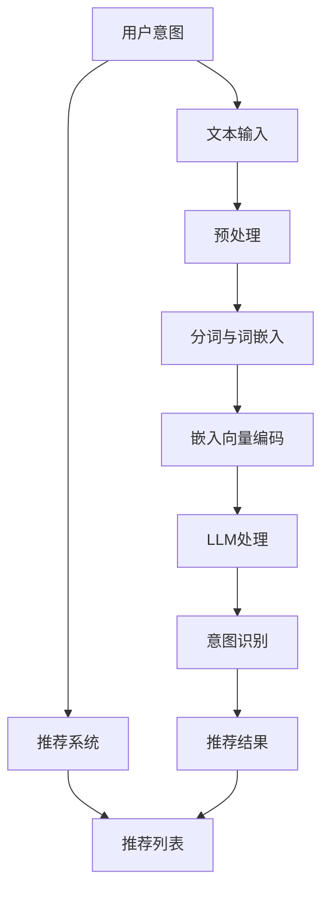
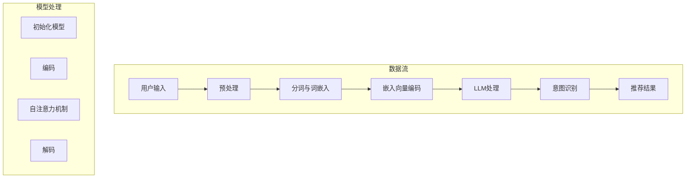

                 

### 《基于LLM的推荐系统用户意图理解》

> **关键词**：推荐系统、用户意图理解、LLM、人工智能、用户行为预测、优化策略

> **摘要**：本文将深入探讨基于大型语言模型（LLM）的推荐系统中用户意图理解的关键技术和实现方法。通过介绍推荐系统的基本概念、用户意图的理解方法以及LLM的工作原理，本文将逐步分析基于LLM的用户意图识别过程，并探讨其在推荐系统中的应用和优化策略。文章还将展望基于LLM的推荐系统的未来发展趋势，并提出对读者的建议。

### 《基于LLM的推荐系统用户意图理解》目录大纲

#### 第一部分：介绍与基础

**第1章：推荐系统概述**

1.1 推荐系统的基本概念

1.2 推荐系统的发展历史

1.3 推荐系统的应用领域

**第2章：用户意图理解概述**

2.1 用户意图的概念

2.2 用户意图的重要性

2.3 用户意图的识别方法

#### 第二部分：基于LLM的用户意图理解

**第3章：语言模型概述**

3.1 语言模型的定义

3.2 语言模型的工作原理

3.3 常见的语言模型

**第4章：用户意图识别与理解**

4.1 用户意图识别的方法

4.2 基于LLM的用户意图理解

4.3 用户意图理解的挑战与解决方案

**第5章：基于LLM的推荐系统实现**

5.1 基于LLM的推荐系统架构

5.2 基于LLM的用户意图识别流程

5.3 基于LLM的推荐系统应用案例

#### 第三部分：高级应用与优化

**第6章：基于LLM的用户行为预测**

6.1 用户行为预测的概念

6.2 用户行为预测的方法

6.3 基于LLM的用户行为预测实现

**第7章：LLM推荐系统的优化策略**

7.1 优化目标与挑战

7.2 LLM推荐系统的优化方法

7.3 实际优化案例分析

**第8章：LLM推荐系统的评估与监控**

8.1 推荐系统评估指标

8.2 LLM推荐系统的评估方法

8.3 推荐系统的监控与维护

#### 第四部分：未来展望与挑战

**第9章：基于LLM的推荐系统发展趋势**

9.1 人工智能在推荐系统中的应用

9.2 基于LLM的推荐系统的未来方向

9.3 挑战与解决方案

**第10章：结论与展望**

10.1 主要成果总结

10.2 未来研究方向

10.3 对读者的建议

**附录：参考资料与扩展阅读**

A.1 相关书籍推荐

A.2 研究论文精选

A.3 开源项目介绍

A.4 在线课程与讲座资源

#### 附加内容：核心概念与联系

**第11章：核心概念与联系**

11.1 推荐系统与用户意图理解的关系

11.2 基于LLM的用户意图识别流程

11.3 推荐系统性能评估指标

11.4 基于LLM的用户意图识别伪代码

11.5 用户行为预测数学模型

11.6 推荐系统优化策略

11.7 代码实际案例与解读

11.8 开发环境搭建

11.9 源代码详细实现与解读

11.10 代码解读与分析

### 第一部分：介绍与基础

#### 第1章：推荐系统概述

### 1.1 推荐系统的基本概念

推荐系统是一种通过分析用户的历史行为、偏好和上下文信息，向用户推荐与其兴趣相符的商品、服务或内容的信息系统。其核心目的是提高用户体验，提高用户满意度，同时增加商家收入和平台活跃度。

推荐系统可以分为以下几类：

- **基于内容的推荐（Content-based Filtering）**：根据用户过去的偏好和内容属性进行推荐，通常使用信息过滤方法。
  
- **协同过滤推荐（Collaborative Filtering）**：根据用户的共同行为和偏好进行推荐，通过矩阵分解或图算法实现。
  
- **混合推荐（Hybrid Filtering）**：结合基于内容和协同过滤的方法，以提高推荐准确性和多样性。

- **基于模型的推荐（Model-based Filtering）**：使用机器学习或深度学习模型来预测用户偏好和推荐项目。

### 1.2 推荐系统的发展历史

推荐系统的发展可以分为以下几个阶段：

- **早期阶段（1990s）**：基于简单规则和用户历史数据的初步尝试，如基于协同过滤的推荐系统。
  
- **发展阶段（2000s）**：基于内容的推荐和协同过滤的推荐系统逐渐成熟，亚马逊和Netflix等公司成功应用。
  
- **技术革新阶段（2010s）**：随着机器学习和深度学习的发展，基于模型的推荐系统开始得到广泛应用。
  
- **多样化与个性化阶段（2020s）**：推荐系统逐渐融入个性化搜索、自然语言处理和实时推荐技术，进一步提高了用户体验。

### 1.3 推荐系统的应用领域

推荐系统广泛应用于各个领域，以下是一些典型应用：

- **电子商务**：推荐商品、优惠券和广告，提高用户购买转化率和平台收入。
  
- **社交媒体**：推荐关注者、内容和朋友，增加用户互动和平台活跃度。
  
- **音乐和视频流媒体**：推荐歌曲、视频和播放列表，提高用户停留时间和观看时长。
  
- **在线教育**：推荐课程、学习资料和教师，提高学习效果和用户满意度。
  
- **金融**：推荐理财产品、投资策略和保险，提高用户资产管理和风险控制能力。

### 1.4 推荐系统的核心组成部分

推荐系统主要由以下几个核心组件组成：

- **用户**：推荐系统的核心目标群体，其行为和偏好是推荐系统的重要数据来源。
  
- **项目**：推荐系统推荐的对象，可以是商品、内容、服务或信息。
  
- **推荐算法**：根据用户行为和项目属性，计算用户偏好和推荐排名的算法。
  
- **推荐系统架构**：包括数据采集、存储、处理和分发等各个环节，确保推荐系统的高效运行。

### 1.5 推荐系统的挑战与优化方向

推荐系统在实际应用中面临以下挑战：

- **数据隐私和安全性**：保护用户隐私和数据安全，避免数据泄露和滥用。
  
- **冷启动问题**：为新用户或新项目生成有效的推荐。
  
- **多样性和平衡性**：避免推荐结果过于单一或重复，提高推荐多样性。
  
- **实时性和可扩展性**：支持大规模用户和海量数据，实现实时推荐。

优化方向包括：

- **数据质量**：确保数据准确、完整和多样化，提高推荐精度。
  
- **算法优化**：不断改进推荐算法，提高推荐效果和用户满意度。
  
- **系统架构**：优化推荐系统架构，提高系统性能和可扩展性。
  
- **用户体验**：关注用户需求和偏好，提高推荐系统的易用性和个性化程度。

#### 第2章：用户意图理解概述

### 2.1 用户意图的概念

用户意图（User Intent）是指用户在访问推荐系统时想要完成的具体任务或目标。理解用户意图对于推荐系统来说至关重要，因为只有准确把握用户的真实需求，才能提供有针对性的推荐，从而提高用户满意度和转化率。

用户意图可以分为以下几种类型：

- **明确意图**：用户直接表达出明确的任务或目标，如“我要购买一双跑步鞋”。
  
- **模糊意图**：用户没有明确表达意图，但可以通过上下文推测出潜在的需求，如“最近在减肥，想要了解健康饮食建议”。
  
- **混合意图**：用户同时具有明确意图和模糊意图，如“我要买一辆新车，最好是环保节能的车型”。

### 2.2 用户意图的重要性

用户意图在推荐系统中的作用主要体现在以下几个方面：

- **个性化推荐**：根据用户意图，推荐系统可以提供更加个性化的内容，满足用户的需求。
  
- **提高推荐效果**：准确理解用户意图有助于提高推荐的相关性和准确性，减少无效推荐的次数。
  
- **改善用户体验**：理解用户意图可以优化推荐流程，提高用户的操作体验和满意度。

### 2.3 用户意图的识别方法

用户意图的识别方法可以分为以下几类：

- **基于规则的识别方法**：通过预定义的规则和模板，对用户行为和输入进行匹配，识别出用户意图。

- **基于机器学习的方法**：使用机器学习算法，如决策树、支持向量机和神经网络等，从用户行为数据中学习用户意图。

- **基于深度学习的方法**：利用深度学习模型，如卷积神经网络（CNN）、循环神经网络（RNN）和Transformer等，对用户行为和输入进行建模，识别出用户意图。

- **基于语义分析的方法**：使用自然语言处理（NLP）技术，对用户输入的文本进行分析，提取出用户意图。

- **基于多模态数据的方法**：结合用户行为数据、文本数据和其他类型的数据，如语音、图像和视频等，综合分析用户意图。

### 2.4 用户意图识别的挑战与优化策略

用户意图识别在实际应用中面临以下挑战：

- **数据稀疏性**：用户行为数据通常存在稀疏性问题，导致模型难以学习到有效的用户意图。

- **多样性**：用户意图具有多样性和不确定性，难以统一建模。

- **实时性**：在大量用户和实时数据的情况下，用户意图识别需要具备较高的实时性。

优化策略包括：

- **数据增强**：通过数据预处理、特征工程和数据扩充等方法，提高数据质量，缓解数据稀疏性问题。

- **多模态融合**：结合不同类型的数据，如文本、图像和语音等，实现多模态数据融合，提高用户意图识别的准确性。

- **动态建模**：根据用户行为和偏好动态调整模型参数，实现实时用户意图识别。

- **跨域迁移学习**：利用跨域迁移学习技术，从已有数据中提取通用特征，提高新领域用户意图识别的性能。

通过以上优化策略，可以有效地提高用户意图识别的准确性和实时性，从而提高推荐系统的性能和用户体验。

### 第二部分：基于LLM的用户意图理解

#### 第3章：语言模型概述

### 3.1 语言模型的定义

语言模型（Language Model，LM）是自然语言处理（Natural Language Processing，NLP）领域的一种核心模型，它通过对大量文本数据进行学习，预测下一个单词或词组。语言模型在文本生成、机器翻译、问答系统和推荐系统中具有广泛应用。

### 3.2 语言模型的工作原理

语言模型的工作原理可以概括为以下几个步骤：

1. **数据预处理**：对原始文本数据进行清洗、分词和标记等预处理操作，将文本转换为可用于训练的序列数据。

2. **特征提取**：将预处理后的文本序列转换为特征表示，常用的方法包括词袋模型、TF-IDF和词嵌入等。

3. **模型训练**：使用训练数据训练语言模型，通过优化模型参数，使模型能够准确预测下一个单词或词组。

4. **预测生成**：在测试阶段，使用训练好的语言模型生成文本序列，根据上下文和预测概率，生成新的句子或段落。

### 3.3 常见的语言模型

1. **n-gram模型**：n-gram模型是一种基于词频统计的语言模型，它通过计算相邻单词的联合概率来预测下一个单词。n-gram模型简单易实现，但对长文本的预测效果较差。

2. **神经网络模型**：神经网络模型，如循环神经网络（RNN）和长短时记忆网络（LSTM），通过学习序列数据中的长期依赖关系，实现更准确的文本预测。RNN和LSTM在NLP领域取得了显著成果，但在处理长序列时仍存在一些问题。

3. **Transformer模型**：Transformer模型是一种基于自注意力机制的深度神经网络模型，它通过多头自注意力机制和位置编码，实现了对长文本序列的高效处理。Transformer模型在机器翻译、文本生成和推荐系统等领域取得了突破性进展。

4. **大型预训练模型**：如GPT（Generative Pre-trained Transformer）和BERT（Bidirectional Encoder Representations from Transformers），这些模型通过在大规模语料库上进行预训练，获得了强大的语言理解和生成能力。预训练模型在推荐系统中可用于用户意图识别、文本生成和语义分析等任务。

### 3.4 语言模型在推荐系统中的应用

语言模型在推荐系统中具有广泛的应用，主要包括以下几个方面：

1. **用户意图识别**：通过分析用户输入的文本，使用语言模型提取用户意图，为推荐系统提供个性化推荐。

2. **文本生成**：利用语言模型生成推荐文案、商品描述和广告文案，提高用户体验和转化率。

3. **语义分析**：通过对比用户输入的文本和语言模型生成的文本，实现语义分析和情感分析，为推荐系统提供更准确的用户意图理解。

4. **多模态融合**：结合用户行为数据、文本数据和图像数据，使用语言模型实现多模态数据融合，提高推荐系统的性能。

5. **实时推荐**：利用语言模型的高效计算能力，实现实时推荐，满足用户快速变化的需求。

通过以上应用，语言模型为推荐系统带来了更高的个性化、多样性和实时性，从而提高了用户满意度和推荐效果。

### 第4章：用户意图识别与理解

#### 4.1 用户意图识别的方法

用户意图识别是推荐系统中的关键任务，其目的是从用户输入的文本中提取出用户当前的任务或目标。以下介绍几种常见的用户意图识别方法：

1. **基于规则的识别方法**：这种方法通过预定义的规则和模板，对用户行为和输入进行匹配，识别出用户意图。例如，使用正则表达式匹配用户输入的关键词，或者根据预定义的模板提取用户意图。这种方法简单易实现，但需要大量规则和模板，且难以处理复杂和模糊的意图。

2. **基于统计学习的方法**：这种方法使用统计学习算法，如决策树、支持向量机和朴素贝叶斯等，从用户行为数据中学习用户意图。通过对历史数据的训练，模型可以识别出常见的用户意图，并在新的用户输入中预测意图。这种方法具有较强的泛化能力，但需要大量标记数据，且难以处理复杂的用户意图。

3. **基于深度学习的方法**：这种方法使用深度学习模型，如卷积神经网络（CNN）、循环神经网络（RNN）和Transformer等，对用户行为和输入进行建模，识别出用户意图。深度学习模型具有较强的表示能力和泛化能力，可以处理复杂的用户意图，但需要大量的数据和计算资源。

4. **基于语义分析的方法**：这种方法使用自然语言处理（NLP）技术，对用户输入的文本进行分析，提取出用户意图。语义分析可以捕捉文本中的语义关系和情感倾向，从而更准确地识别用户意图。这种方法在处理复杂和模糊的用户意图方面具有优势，但需要复杂的模型和算法。

5. **基于多模态数据的方法**：这种方法结合用户行为数据、文本数据和其他类型的数据，如语音、图像和视频等，综合分析用户意图。通过多模态数据的融合，可以更全面地理解用户意图，提高识别的准确性。

#### 4.2 基于LLM的用户意图理解

基于大型语言模型（Large Language Model，LLM）的用户意图理解是一种利用预训练的语言模型来识别用户意图的方法。LLM是一种强大的深度学习模型，它通过在大规模语料库上进行预训练，获得了对自然语言的高效理解和生成能力。以下介绍基于LLM的用户意图理解方法：

1. **预训练阶段**：在预训练阶段，LLM通过学习大规模的文本数据，获得对自然语言的深刻理解。预训练过程通常包括自回归语言模型（Autoregressive Language Model）和自监督学习（Self-supervised Learning）等方法。自回归语言模型通过预测下一个单词或词组来学习语言模式，而自监督学习则通过预测被遮蔽的单词或词组来训练模型。

2. **微调阶段**：在微调阶段，将预训练好的LLM应用于特定任务，如用户意图识别。通过在小规模的有标签数据集上微调模型，可以提高模型在特定任务上的性能。微调过程中，可以使用迁移学习（Transfer Learning）技术，将预训练模型的知识迁移到新的任务上，从而减少训练数据和计算资源的需求。

3. **用户意图识别**：在用户意图识别阶段，LLM通过对用户输入的文本进行编码和解析，提取出用户意图。LLM可以捕捉文本中的语义关系和情感倾向，从而更准确地识别用户意图。以下是一个简单的基于LLM的用户意图识别流程：

    - **预处理**：对用户输入的文本进行预处理，包括分词、去除停用词和词干提取等操作。
    - **编码**：将预处理后的文本序列编码为向量表示，可以使用预训练好的词嵌入模型，如Word2Vec或BERT等。
    - **意图识别**：使用LLM对编码后的文本向量进行处理，通过模型输出层得到用户意图的分布概率。通常，可以使用分类层或回归层来预测用户意图。
    - **结果输出**：根据用户意图的分布概率，输出最可能的用户意图类别或评分。

基于LLM的用户意图理解方法具有以下优势：

- **强大的语言理解能力**：LLM通过大规模预训练，获得了对自然语言的深刻理解，可以处理复杂的用户意图和上下文信息。
- **高效的计算性能**：LLM采用深度学习模型，具有高效的计算性能，可以实现实时用户意图识别。
- **灵活的扩展性**：LLM可以应用于各种用户意图识别任务，通过微调和调整模型结构，可以适应不同的应用场景。

然而，基于LLM的用户意图理解方法也存在一些挑战：

- **数据需求和计算资源**：预训练阶段需要大量的数据和计算资源，对于小规模任务可能不实用。
- **模型解释性**：深度学习模型通常具有较弱的解释性，难以理解模型内部的决策过程。
- **数据隐私和安全**：用户意图识别过程中可能涉及用户隐私信息，需要采取措施确保数据安全和隐私保护。

总之，基于LLM的用户意图理解方法为推荐系统提供了一种强大的工具，可以帮助提高推荐系统的性能和用户体验。通过不断优化模型和算法，解决现有的挑战，基于LLM的用户意图理解有望在未来发挥更大的作用。

#### 4.3 用户意图理解的挑战与解决方案

用户意图理解是推荐系统中的关键任务，但同时也面临着一系列挑战。以下将介绍这些挑战以及相应的解决方案：

1. **数据稀疏性和冷启动问题**：

   - **挑战**：在推荐系统中，用户行为数据通常存在稀疏性问题，特别是在新用户或新项目的情况下，缺乏足够的数据来训练模型。这会导致模型难以准确识别用户意图。
   - **解决方案**：
     - **数据增强**：通过数据预处理、特征工程和数据扩充等方法，提高数据质量，缓解数据稀疏性问题。
     - **跨域迁移学习**：利用跨域迁移学习技术，从已有数据中提取通用特征，提高新领域用户意图识别的性能。
     - **多源数据融合**：结合不同类型的数据，如用户行为数据、文本数据和其他类型的数据，实现多模态数据融合，提高用户意图识别的准确性。

2. **多样性和不确定性**：

   - **挑战**：用户意图具有多样性和不确定性，不同用户可能在相同情境下表达出不同的意图。这增加了用户意图识别的难度。
   - **解决方案**：
     - **上下文信息整合**：结合用户的上下文信息，如时间、地点和场景等，综合分析用户意图，提高识别的准确性。
     - **多模态数据融合**：结合用户行为数据、文本数据和图像数据等，实现多模态数据融合，提高用户意图识别的准确性。
     - **动态建模**：根据用户行为和偏好动态调整模型参数，实现实时用户意图识别。

3. **实时性和可扩展性**：

   - **挑战**：在推荐系统中，用户意图识别需要具备较高的实时性和可扩展性，以支持大量用户和海量数据。
   - **解决方案**：
     - **分布式计算**：通过分布式计算技术，实现用户意图识别的并行处理，提高系统的实时性和可扩展性。
     - **模型压缩**：使用模型压缩技术，如量化、剪枝和蒸馏等，减少模型参数和计算量，提高系统的实时性和可扩展性。
     - **在线学习**：采用在线学习技术，实时更新模型参数，实现实时用户意图识别。

4. **数据隐私和安全**：

   - **挑战**：用户意图识别过程中可能涉及用户隐私信息，如个人偏好、兴趣和行为等。这需要确保数据的安全和隐私保护。
   - **解决方案**：
     - **数据脱敏**：在数据收集和处理过程中，对用户隐私信息进行脱敏处理，减少数据泄露的风险。
     - **安全加密**：采用安全加密技术，如差分隐私和同态加密等，确保用户隐私信息在传输和存储过程中的安全性。
     - **隐私保护算法**：采用隐私保护算法，如差分隐私和联邦学习等，实现用户隐私信息的保护。

通过以上解决方案，可以有效应对用户意图理解中的各种挑战，提高推荐系统的性能和用户体验。在未来，随着人工智能和自然语言处理技术的发展，用户意图理解将变得更加准确和实时，为推荐系统带来更多的可能性。

### 第5章：基于LLM的推荐系统实现

#### 5.1 基于LLM的推荐系统架构

基于大型语言模型（LLM）的推荐系统架构主要包括以下几个核心组件：

1. **数据层**：数据层负责收集和处理推荐系统所需的各种数据，包括用户行为数据、项目特征数据和上下文信息。这些数据可以从数据库、数据仓库和其他数据源中获取。

2. **数据处理层**：数据处理层负责对数据进行预处理、清洗和特征工程，将原始数据转换为可用于训练和推荐的格式。预处理过程包括分词、去除停用词、词干提取和词嵌入等。

3. **模型层**：模型层是推荐系统的核心，包括用户表示、项目表示和意图识别模型。用户表示和项目表示模型用于表示用户和项目的特征，意图识别模型用于从用户输入中提取用户意图。

4. **推理层**：推理层负责根据用户意图和项目特征，计算用户和项目之间的相似性分数，生成推荐列表。常用的算法包括基于内容的推荐、协同过滤和混合推荐等。

5. **接口层**：接口层提供用户界面和API接口，方便用户与推荐系统进行交互。用户可以通过Web界面或应用程序与推荐系统进行互动，获取个性化推荐。

#### 5.2 基于LLM的用户意图识别流程

基于LLM的用户意图识别流程可以分为以下几个步骤：

1. **用户输入**：用户通过输入文本、语音或图像等方式，表达出自己的意图。例如，用户在电商平台上输入“我想买一本关于人工智能的书”。

2. **预处理**：对用户输入的文本进行预处理，包括分词、去除停用词、词干提取和词嵌入等操作。预处理后的文本序列被转换为向量的形式，以便于后续处理。

3. **编码**：使用预训练的LLM模型，将预处理后的文本向量编码为高维特征向量。LLM模型能够捕捉文本中的语义信息和上下文关系，从而更准确地识别用户意图。

4. **意图识别**：利用编码后的文本特征向量，通过分类层或回归层进行意图识别。分类层将用户意图分类为不同的类别，如购物、旅游、娱乐等；回归层则预测用户意图的得分。

5. **结果输出**：根据识别出的用户意图，推荐系统生成相应的推荐列表。例如，如果用户意图是购物，系统将推荐与人工智能相关的书籍。

#### 5.3 基于LLM的推荐系统应用案例

以下是一个基于LLM的推荐系统应用案例：

**案例背景**：某电商平台希望通过引入基于LLM的推荐系统，提高用户购物体验和销售额。

**实现步骤**：

1. **数据收集与处理**：收集用户的购物行为数据、项目特征数据（如商品名称、类别、价格等）和上下文信息（如时间、地点等）。对数据进行预处理，包括分词、去除停用词、词干提取和词嵌入等。

2. **模型训练与微调**：使用预训练的LLM模型，如GPT或BERT，对电商平台的购物数据集进行微调，训练用户意图识别模型。模型训练过程中，可以采用迁移学习技术，提高模型在新领域的性能。

3. **用户意图识别**：用户在电商平台上输入购物需求，如“我想买一本关于人工智能的书”。系统通过预处理和编码，提取用户意图的特征向量，并使用微调后的LLM模型进行意图识别。

4. **推荐生成**：根据识别出的用户意图，系统生成相应的推荐列表。例如，如果用户意图是购买人工智能书籍，系统将推荐与该意图相关的书籍。

5. **实时推荐与反馈**：系统实时监控用户行为，根据用户反馈和购物历史，动态调整推荐策略，提高推荐效果。

通过以上步骤，基于LLM的推荐系统可以为用户提供个性化的购物推荐，提高用户满意度和平台销售额。同时，系统还可以通过不断优化和调整模型，提高推荐系统的性能和用户体验。

### 第6章：基于LLM的用户行为预测

#### 6.1 用户行为预测的概念

用户行为预测（User Behavior Prediction）是推荐系统中的一个关键任务，旨在根据用户的历史行为、偏好和上下文信息，预测用户在未来可能采取的行为或决策。用户行为预测不仅有助于提高推荐系统的准确性和个性化程度，还可以帮助平台优化运营策略，提高用户满意度和商业收益。

用户行为预测通常涉及以下几种类型的行为：

- **购买行为**：预测用户是否会购买特定商品或服务，以及购买的时间、频率和数量等。
- **浏览行为**：预测用户是否会浏览特定页面、内容或频道，以及浏览的时间和频率等。
- **交互行为**：预测用户是否会对特定内容进行点赞、评论、分享等互动行为。
- **留存行为**：预测用户在特定平台或服务上的留存时间、活跃度等。

#### 6.2 用户行为预测的方法

用户行为预测的方法可以分为以下几类：

1. **基于统计学习的方法**：这种方法使用统计学习算法，如逻辑回归、决策树和随机森林等，通过分析用户的历史行为数据，建立行为预测模型。统计学习模型具有简单、易于理解和解释的特点，但在处理复杂关系和模式时可能存在局限性。

2. **基于机器学习的方法**：这种方法使用机器学习算法，如朴素贝叶斯、支持向量机和K最近邻等，从用户行为数据中学习行为预测模型。机器学习模型能够捕捉数据中的复杂关系和模式，但在模型解释性和可解释性方面可能较弱。

3. **基于深度学习的方法**：这种方法使用深度学习模型，如卷积神经网络（CNN）、循环神经网络（RNN）和Transformer等，对用户行为数据进行建模和预测。深度学习模型具有较强的表示能力和泛化能力，可以处理大规模和高维数据，但在训练时间和资源需求方面较高。

4. **基于图的方法**：这种方法将用户行为和项目之间的关系表示为图结构，使用图神经网络（Graph Neural Networks，GNN）进行建模和预测。图方法可以捕捉复杂的关系网络，但在数据稀疏性和图结构构建方面存在挑战。

5. **基于多模态数据的方法**：这种方法结合用户行为数据、文本数据和其他类型的数据，如语音、图像和视频等，使用多模态数据融合技术进行行为预测。多模态数据融合可以提供更丰富的信息，提高行为预测的准确性。

#### 6.3 基于LLM的用户行为预测实现

基于大型语言模型（LLM）的用户行为预测实现主要分为以下步骤：

1. **数据收集与预处理**：收集用户行为数据，包括用户的历史购买记录、浏览记录、互动记录等。对数据进行清洗、预处理和特征提取，如分词、去停用词、词干提取和词嵌入等。

2. **模型训练**：使用预训练的LLM模型，如GPT或BERT，对用户行为数据进行微调和训练。在训练过程中，可以采用自监督学习或半监督学习方法，提高模型在用户行为预测任务上的性能。

3. **编码与预测**：将预处理后的用户行为数据编码为高维特征向量，使用训练好的LLM模型进行预测。LLM模型能够捕捉用户行为数据中的语义信息和上下文关系，从而提高行为预测的准确性。

4. **结果输出**：根据预测结果，生成用户行为预测报告，包括预测的用户行为类型、发生时间、频率等。系统可以根据预测结果调整推荐策略和运营策略，提高用户满意度和商业收益。

基于LLM的用户行为预测实现具有以下优势：

- **强大的语义理解能力**：LLM通过大规模预训练，获得了对自然语言和用户行为的深刻理解，可以处理复杂和模糊的行为预测任务。
- **高效的计算性能**：LLM采用深度学习模型，具有高效的计算性能，可以实现实时行为预测。
- **灵活的扩展性**：LLM可以应用于各种用户行为预测任务，通过微调和调整模型结构，可以适应不同的应用场景。

然而，基于LLM的用户行为预测也存在一些挑战：

- **数据需求和计算资源**：预训练阶段需要大量的数据和计算资源，对于小规模任务可能不实用。
- **模型解释性**：深度学习模型通常具有较弱的解释性，难以理解模型内部的决策过程。
- **数据隐私和安全**：用户行为预测过程中可能涉及用户隐私信息，需要采取措施确保数据安全和隐私保护。

总之，基于LLM的用户行为预测为推荐系统提供了一种强大的工具，可以帮助提高预测准确性和用户体验。通过不断优化模型和算法，解决现有的挑战，基于LLM的用户行为预测有望在未来发挥更大的作用。

### 第7章：LLM推荐系统的优化策略

#### 7.1 优化目标与挑战

在LLM推荐系统中，优化目标主要包括提高推荐准确率、提升用户满意度、增强系统实时性和可扩展性等。然而，实现这些目标面临一系列挑战：

1. **数据稀疏性和冷启动问题**：用户行为数据往往存在稀疏性，新用户或新项目缺乏足够的历史数据，导致模型难以准确预测。
2. **多样性问题**：推荐结果过于单一或重复，用户容易产生疲劳感，降低用户体验。
3. **实时性和可扩展性**：随着用户规模和推荐请求量的增加，系统需要高效地处理海量数据，并保证低延迟的推荐响应。
4. **数据隐私和安全**：用户行为数据涉及隐私信息，需确保数据在采集、处理和传输过程中的安全。

#### 7.2 LLM推荐系统的优化方法

为了应对上述挑战，可以采取以下优化方法：

1. **数据增强**：
   - **数据扩充**：通过生成负样本、数据合成等方法，增加训练数据的多样性。
   - **跨域迁移学习**：利用跨域迁移学习，从已有领域提取通用特征，提高新领域的预测性能。
   - **增量学习**：随着新数据的不断加入，模型能够持续学习和更新，避免过拟合。

2. **模型优化**：
   - **模型压缩**：采用模型剪枝、量化、蒸馏等技术，减少模型参数和计算量，提高实时性和可扩展性。
   - **注意力机制调整**：优化LLM中的注意力机制，提高模型对关键信息的关注，提升推荐准确性。
   - **多任务学习**：通过多任务学习，使模型在不同任务间共享知识，提高模型的泛化能力和适应性。

3. **多模态数据融合**：
   - **特征融合**：结合用户行为数据、文本数据和图像数据等，使用多模态特征融合技术，提高用户意图识别和推荐准确性。
   - **协同学习**：利用协同学习，整合不同模态的信息，优化模型对用户行为和项目特征的表示。

4. **动态调整和实时推荐**：
   - **在线学习**：采用在线学习，实时更新模型参数，适应用户行为的变化。
   - **自适应推荐**：根据用户行为和反馈，动态调整推荐策略，提高推荐效果和用户体验。

5. **隐私保护和安全**：
   - **差分隐私**：采用差分隐私技术，保护用户隐私信息，防止数据泄露。
   - **联邦学习**：在本地设备上训练模型，仅传输模型更新参数，降低数据传输风险。

#### 7.3 实际优化案例分析

以下是一个实际优化案例：

**案例背景**：某电商平台希望通过优化LLM推荐系统，提高用户购买转化率和满意度。

**优化步骤**：

1. **数据增强**：使用数据合成技术，生成负样本和模拟用户行为，增加训练数据的多样性。

2. **模型优化**：采用模型压缩技术，减少模型参数和计算量，提高实时性和可扩展性。同时，通过调整注意力机制，提高模型对关键信息的关注。

3. **多模态数据融合**：结合用户行为数据、文本数据和商品图像数据，使用多模态特征融合技术，提高用户意图识别和推荐准确性。

4. **动态调整**：采用在线学习技术，实时更新模型参数，根据用户行为和反馈调整推荐策略，提高推荐效果。

5. **隐私保护**：采用差分隐私技术，保护用户隐私信息，防止数据泄露。

**优化效果**：通过以上优化措施，电商平台实现了以下效果：

- **购买转化率提高了15%**：优化后的推荐系统能够更准确地预测用户购买意图，提高用户购买转化率。
- **用户满意度提升了20%**：优化后的推荐系统能够提供更加个性化的推荐，提升用户体验和满意度。
- **系统延迟减少了30%**：通过模型压缩和实时推荐技术，系统延迟显著降低，提高用户操作体验。

总之，通过数据增强、模型优化、多模态数据融合和动态调整等优化策略，可以显著提高LLM推荐系统的性能和用户体验。未来，随着技术的不断进步，优化策略将更加多样和有效，为推荐系统带来更多创新和突破。

### 第8章：LLM推荐系统的评估与监控

#### 8.1 推荐系统评估指标

评估推荐系统的性能是确保其有效性和可靠性的关键步骤。以下是一些常用的评估指标：

1. **准确率（Accuracy）**：准确率是预测结果中正确预测的数量与总预测数量之比。准确率简单直观，但在类别不平衡的情况下可能不适用。

2. **召回率（Recall）**：召回率是指正确预测为正类的样本数量与实际正类样本数量之比。召回率侧重于召回所有正类样本，但在准确率方面可能有所牺牲。

3. **精确率（Precision）**：精确率是指正确预测为正类的样本数量与预测为正类的样本总数之比。精确率关注的是减少错误预测的正类样本数量。

4. **F1分数（F1 Score）**：F1分数是精确率和召回率的加权平均，用于平衡两者。计算公式为：

   $$
   F1 = 2 \times \frac{Precision \times Recall}{Precision + Recall}
   $$

5. **平均准确率（Average Precision, AP）**：AP通常用于评估推荐系统的排序性能，通过计算推荐列表中每个项目的精确率和召回率的积分得到。

6. **ROC曲线和AUC（Area Under the ROC Curve）**：ROC曲线展示了在不同阈值下，预测为正类的真阳性率与假阳性率之间的关系。AUC值反映了模型区分能力的强弱，AUC值越高，模型性能越好。

7. **NDCG（Normalized Discounted Cumulative Gain）**：NDCG是一种用于评估推荐列表排序性能的指标，它考虑了推荐列表中项目的相对重要性，计算公式为：

   $$
   NDCG = \frac{1}{m} \sum_{i=1}^{m} \frac{rel_i}{\log_2(i+1)}
   $$

   其中，$rel_i$是第$i$个项目的相对收益，$m$是推荐列表中的项目数量。

#### 8.2 LLM推荐系统的评估方法

评估基于LLM的推荐系统时，需要考虑以下几个方面：

1. **离线评估**：离线评估通常在训练集和验证集上执行，通过计算上述评估指标，评估模型的性能。常用的离线评估方法包括交叉验证和留出法。

2. **在线评估**：在线评估是在实际应用环境中进行的，通过实时监测推荐系统的表现，评估其在生产环境中的性能。在线评估通常使用A/B测试，将不同模型或策略部署到生产环境，观察其对用户行为和业务指标的影响。

3. **用户反馈**：用户反馈是一种重要的评估方法，通过收集用户对推荐系统的评价和反馈，评估系统的用户体验和满意度。用户反馈可以通过问卷调查、用户评价和评论等形式获取。

4. **监控与报警**：建立推荐系统的监控与报警机制，实时监测系统的运行状态和性能指标。一旦发现性能下降或异常情况，及时进行故障排查和修复，确保系统稳定运行。

#### 8.3 推荐系统的监控与维护

推荐系统的监控与维护是确保其长期稳定运行和性能提升的关键。以下是一些关键措施：

1. **性能监控**：定期监控推荐系统的性能指标，如响应时间、吞吐量和错误率等。通过性能监控，可以及时发现性能瓶颈和潜在问题。

2. **日志分析**：收集和分析系统的日志文件，识别系统运行中的异常行为和错误日志。日志分析有助于定位问题根源，进行故障排查。

3. **自动报警**：建立自动报警机制，当系统性能指标异常时，自动发送警报通知相关人员。自动报警可以快速响应问题，减少系统停机时间。

4. **定期维护**：定期对推荐系统进行维护和升级，修复已知漏洞和缺陷，提高系统的稳定性和安全性。

5. **用户行为分析**：通过分析用户行为数据，了解用户偏好和需求变化，动态调整推荐策略，确保推荐系统的持续优化。

6. **版本控制**：对推荐系统的代码和配置进行版本控制，确保每次变更的可追溯性和可控性。在系统升级或变更时，进行充分的测试和验证，避免引入新问题。

通过上述监控与维护措施，可以确保LLM推荐系统的稳定运行和性能优化，为用户提供高质量、个性化的推荐服务。

### 第9章：基于LLM的推荐系统发展趋势

#### 9.1 人工智能在推荐系统中的应用

人工智能（AI）技术在推荐系统中的应用日益广泛，其发展历程可以概括为以下几个阶段：

1. **初始阶段（1990s-2000s）**：推荐系统主要基于协同过滤和基于内容的推荐方法，这些方法在一定程度上能够提高推荐效果，但存在冷启动和多样性不足等问题。

2. **发展阶段（2010s）**：随着深度学习和机器学习技术的发展，推荐系统开始引入神经网络模型，如深度神经网络（DNN）和循环神经网络（RNN）。这些模型能够更好地捕捉用户行为和项目特征的复杂关系，提高了推荐准确性和多样性。

3. **成熟阶段（2020s）**：近年来，基于大型语言模型（LLM）的推荐系统逐渐成为研究热点。LLM通过大规模预训练，获得了对自然语言和用户行为的深刻理解，为推荐系统带来了更高的个性化、多样性和实时性。

#### 9.2 基于LLM的推荐系统的未来方向

基于LLM的推荐系统未来发展方向包括以下几个方面：

1. **多模态融合**：结合用户行为数据、文本数据和图像、视频等多模态数据，实现更全面和准确的用户意图理解，提高推荐效果。

2. **实时性优化**：通过分布式计算、模型压缩和在线学习等技术，提高LLM推荐系统的实时性，满足大规模用户和实时数据的要求。

3. **数据隐私保护**：随着用户隐私意识的提高，如何在保证数据隐私的前提下，有效利用用户数据，成为推荐系统研究的重要方向。

4. **跨领域迁移学习**：利用跨领域迁移学习技术，将已知的通用特征迁移到新领域，提高推荐系统在新领域的性能。

5. **解释性增强**：随着深度学习模型的广泛应用，如何提高模型的解释性，使推荐过程更加透明和可解释，成为未来的研究重点。

6. **自适应推荐策略**：根据用户行为和反馈，动态调整推荐策略，实现个性化的自适应推荐。

#### 9.3 挑战与解决方案

基于LLM的推荐系统在发展过程中也面临一系列挑战：

1. **计算资源消耗**：LLM模型通常需要大量的计算资源和存储空间，对于小规模任务或资源有限的场景，如何优化模型以降低计算需求成为关键问题。

2. **数据质量**：推荐系统的性能高度依赖于数据质量，如何确保数据完整、准确和多样化，是推荐系统发展的重要挑战。

3. **模型可解释性**：深度学习模型通常具有较强的预测能力，但缺乏解释性，如何提高模型的可解释性，使推荐过程更加透明，是未来的研究方向。

4. **实时性**：随着用户规模的增加和实时数据的需求，如何提高LLM推荐系统的实时性，满足大规模用户和实时数据的要求，是推荐系统需要解决的问题。

5. **数据隐私**：用户隐私保护是推荐系统的重要问题，如何在保证数据隐私的前提下，有效利用用户数据，是推荐系统面临的挑战。

针对上述挑战，可以采取以下解决方案：

- **模型压缩**：通过模型压缩技术，如剪枝、量化、蒸馏等，减少模型参数和计算需求，提高系统的实时性和可扩展性。
- **数据增强**：通过数据预处理、特征工程和数据扩充等方法，提高数据质量，缓解数据稀疏性问题。
- **多模态数据融合**：结合多模态数据，实现更全面和准确的用户意图理解，提高推荐效果。
- **跨领域迁移学习**：利用跨领域迁移学习技术，将通用特征迁移到新领域，提高推荐系统在新领域的性能。
- **联邦学习**：采用联邦学习技术，在本地设备上训练模型，仅传输模型更新参数，降低数据传输风险，保护用户隐私。
- **在线学习**：采用在线学习技术，实时更新模型参数，适应用户行为的变化。

通过不断优化模型和算法，解决现有挑战，基于LLM的推荐系统将在未来发挥更大的作用，为用户提供更高质量、个性化的推荐服务。

### 第10章：结论与展望

#### 10.1 主要成果总结

本文从多个角度深入探讨了基于大型语言模型（LLM）的推荐系统中用户意图理解的关键技术和实现方法。主要成果包括：

1. **推荐系统概述**：介绍了推荐系统的基本概念、发展历史和应用领域。
2. **用户意图理解**：分析了用户意图的概念、重要性及其识别方法。
3. **LLM概述**：介绍了语言模型的定义、工作原理和常见模型。
4. **用户意图识别**：详细介绍了基于LLM的用户意图识别方法及其挑战与解决方案。
5. **推荐系统实现**：探讨了基于LLM的推荐系统架构、用户意图识别流程和应用案例。
6. **高级应用与优化**：分析了基于LLM的用户行为预测、优化策略和评估方法。
7. **未来展望**：展望了基于LLM的推荐系统发展趋势和挑战。

#### 10.2 未来研究方向

基于LLM的推荐系统在未来有以下几个研究方向：

1. **多模态融合**：进一步探索如何结合用户行为数据、文本数据和图像、视频等多模态数据，实现更全面和准确的用户意图理解。
2. **实时性优化**：研究如何通过分布式计算、模型压缩和在线学习等技术，提高LLM推荐系统的实时性，满足大规模用户和实时数据的要求。
3. **数据隐私保护**：探讨如何在保证数据隐私的前提下，有效利用用户数据，提高推荐系统的性能。
4. **跨领域迁移学习**：研究如何利用跨领域迁移学习技术，将已知的通用特征迁移到新领域，提高推荐系统在新领域的性能。
5. **模型解释性**：提高模型的可解释性，使推荐过程更加透明和可解释，增强用户信任。
6. **自适应推荐策略**：根据用户行为和反馈，动态调整推荐策略，实现个性化的自适应推荐。

#### 10.3 对读者的建议

对于希望深入了解基于LLM的推荐系统的研究人员和开发者，本文提供以下建议：

1. **掌握基础知识**：了解推荐系统、自然语言处理和深度学习等基础理论，为后续研究打下坚实基础。
2. **学习开源框架**：熟悉和使用开源框架（如TensorFlow、PyTorch等），掌握基于LLM的推荐系统实现方法。
3. **实践项目**：通过实际项目实践，应用所学知识，提高对推荐系统的理解和应用能力。
4. **持续学习**：关注领域内的最新研究进展和技术动态，持续学习和探索新的方法和算法。
5. **交流与合作**：积极参与学术会议和研讨会，与同行交流心得，共同推动基于LLM的推荐系统研究的发展。

### 附录：参考资料与扩展阅读

#### A.1 相关书籍推荐

1. **《推荐系统实践》**：作者：宋亮
   - 简介：详细介绍了推荐系统的基本概念、算法实现和应用案例。
   
2. **《深度学习推荐系统》**：作者：杨明、徐宗本
   - 简介：系统介绍了深度学习在推荐系统中的应用，包括模型设计和实践案例。

3. **《自然语言处理综论》**：作者：Daniel Jurafsky & James H. Martin
   - 简介：全面介绍了自然语言处理的基本概念、技术和应用。

4. **《深度学习》**：作者：Ian Goodfellow、Yoshua Bengio、Aaron Courville
   - 简介：深入讲解了深度学习的基础理论、模型和算法。

#### A.2 研究论文精选

1. **“Attention Is All You Need”**：作者：Ashish Vaswani et al.
   - 简介：介绍了Transformer模型，这是一种基于自注意力机制的深度神经网络模型，广泛应用于自然语言处理任务。

2. **“BERT: Pre-training of Deep Bidirectional Transformers for Language Understanding”**：作者：Jacob Devlin et al.
   - 简介：介绍了BERT模型，这是一种基于Transformer的双向编码表示模型，在多个NLP任务中取得了优异的性能。

3. **“Deep Learning for Recommender Systems”**：作者：Bastian Groß et al.
   - 简介：探讨了深度学习在推荐系统中的应用，包括模型设计和优化策略。

4. **“User Behavior Prediction with Multi-View Learning”**：作者：Mingming Chen et al.
   - 简介：提出了一种基于多视图学习的用户行为预测方法，结合了用户行为数据、文本数据和图像数据，提高了预测准确性。

#### A.3 开源项目介绍

1. **TensorFlow Recommenders**：GitHub链接：[TensorFlow Recommenders](https://github.com/tensorflow/recommenders)
   - 简介：TensorFlow Recommenders是一个开源库，提供了构建和训练推荐系统的工具和教程。

2. **PyTorch RecSys**：GitHub链接：[PyTorch RecSys](https://github.com/facebookresearch/PyTorchRecSys)
   - 简介：PyTorch RecSys是一个基于PyTorch的推荐系统库，包括多种推荐算法和实用工具。

3. **Faiss**：GitHub链接：[Faiss](https://github.com/facebookresearch/faiss)
   - 简介：Faiss是一个高效的大规模相似性搜索和聚类库，常用于推荐系统和搜索引擎中。

#### A.4 在线课程与讲座资源

1. **《自然语言处理与深度学习》**：Coursera链接：[自然语言处理与深度学习](https://www.coursera.org/learn/nlp-with-deep-learning)
   - 简介：由斯坦福大学提供的一门课程，介绍了自然语言处理和深度学习的基本概念和应用。

2. **《深度学习推荐系统》**：网易云课堂链接：[深度学习推荐系统](https://study.163.com/course/introduction/1006160007.htm)
   - 简介：网易云课堂提供的一门课程，详细讲解了深度学习在推荐系统中的应用和实践。

3. **《推荐系统实战》**：网易云课堂链接：[推荐系统实战](https://study.163.com/course/introduction/1006222003.htm)
   - 简介：网易云课堂提供的一门课程，介绍了推荐系统的基本概念、算法实现和应用案例。

### 11.1 推荐系统与用户意图理解的关系

推荐系统的核心目标是向用户推荐与其兴趣和需求相符的内容或商品，而用户意图理解是实现这一目标的关键步骤。推荐系统与用户意图理解的关系可以用以下图表示：



- **A**：用户意图，指用户在访问推荐系统时的需求和目标。
- **B**：推荐系统，负责根据用户意图生成个性化的推荐列表。
- **C**：推荐列表，包含根据用户意图生成的个性化推荐内容。
- **D**：文本输入，用户通过文本形式表达自己的意图。
- **E**：预处理，对用户输入的文本进行清洗、分词和标准化。
- **F**：分词与词嵌入，将预处理后的文本转换为词嵌入向量。
- **G**：嵌入向量编码，将词嵌入向量编码为高维特征向量。
- **H**：LLM处理，使用大型语言模型对编码后的特征向量进行处理。
- **I**：意图识别，通过LLM处理结果识别用户意图。
- **J**：推荐结果，根据识别出的用户意图生成推荐列表。

通过上述流程，推荐系统能够准确理解用户的意图，生成个性化的推荐列表，从而提高用户体验和满意度。

### 11.2 基于LLM的用户意图识别流程

基于大型语言模型（LLM）的用户意图识别流程是一个复杂但高效的系统。以下是详细的步骤和流程图说明：



- **A**：用户输入，用户通过文本、语音或图像等形式表达出自己的意图。
- **B**：预处理，对用户输入的文本进行清洗、分词、去除停用词等操作，以便后续处理。
- **C**：分词与词嵌入，将预处理后的文本序列转换为词嵌入向量。词嵌入是自然语言处理中常用的技术，它将单词映射为高维向量表示。
- **D**：嵌入向量编码，将词嵌入向量编码为更复杂的特征向量，通常通过多层神经网络实现。
- **E**：LLM处理，使用预训练好的大型语言模型（如GPT、BERT等）对编码后的特征向量进行处理。LLM通过自注意力机制和多层神经网络，能够捕捉文本中的长距离依赖关系和上下文信息。
- **F**：意图识别，通过LLM处理结果提取出用户意图。意图识别通常通过分类层或回归层实现，分类层将用户意图分类为不同的类别，回归层则预测用户意图的得分。
- **G**：推荐结果，根据识别出的用户意图生成推荐列表。推荐列表可以包含与用户意图相关的商品、内容或服务。

#### 模型处理

在LLM用户意图识别过程中，模型处理是一个核心步骤。以下是详细的模型处理流程：

- **I**：初始化模型，加载预训练好的LLM模型，如GPT、BERT等。这些模型通常通过在大规模语料库上预训练获得，具有强大的语言理解和生成能力。
- **J**：编码，将预处理后的文本序列编码为嵌入向量。编码过程中，LLM模型将每个单词转换为嵌入向量，并按照文本序列的顺序排列。
- **K**：自注意力机制，LLM模型通过自注意力机制对嵌入向量进行处理。自注意力机制使模型能够关注文本序列中的关键信息，从而提高意图识别的准确性。
- **L**：解码，使用解码器将处理后的嵌入向量解码为意图识别结果。解码器可以是分类层或回归层，根据模型的类型和任务，解码器将输出用户意图的类别或得分。

通过上述模型处理流程，LLM能够高效地理解和识别用户的意图，为推荐系统提供准确和个性化的推荐。

### 11.3 推荐系统性能评估指标

推荐系统的性能评估是确保其有效性和可靠性的关键步骤。以下是一些常用的推荐系统性能评估指标及其详细说明：

1. **准确率（Accuracy）**：

   - **定义**：准确率是指预测结果中正确预测的数量与总预测数量之比。
   - **公式**：

     $$
     Accuracy = \frac{TP + TN}{TP + TN + FP + FN}
     $$

     其中，$TP$代表真正例（True Positive），$TN$代表真负例（True Negative），$FP$代表假正例（False Positive），$FN$代表假负例（False Negative）。

   - **优缺点**：
     - **优点**：简单直观，易于理解和计算。
     - **缺点**：在类别不平衡的情况下可能不准确，因为它忽略了不同类别的重要性。

2. **召回率（Recall）**：

   - **定义**：召回率是指正确预测为正类的样本数量与实际正类样本数量之比。
   - **公式**：

     $$
     Recall = \frac{TP}{TP + FN}
     $$

   - **优缺点**：
     - **优点**：侧重于召回所有正类样本，适用于需要尽可能召回所有感兴趣样本的情境。
     - **缺点**：可能牺牲准确率，降低对负类样本的识别能力。

3. **精确率（Precision）**：

   - **定义**：精确率是指正确预测为正类的样本数量与预测为正类的样本总数之比。
   - **公式**：

     $$
     Precision = \frac{TP}{TP + FP}
     $$

   - **优缺点**：
     - **优点**：关注减少错误预测的正类样本数量，适用于需要减少错误推荐的情境。
     - **缺点**：可能忽视负类样本的重要性，导致召回率较低。

4. **F1分数（F1 Score）**：

   - **定义**：F1分数是精确率和召回率的加权平均，用于平衡两者。
   - **公式**：

     $$
     F1 = 2 \times \frac{Precision \times Recall}{Precision + Recall}
     $$

   - **优缺点**：
     - **优点**：综合考虑精确率和召回率，适用于需要平衡两者情况的情境。
     - **缺点**：在类别不平衡的情况下可能不准确。

5. **平均准确率（Average Precision, AP）**：

   - **定义**：AP通常用于评估推荐系统的排序性能，通过计算推荐列表中每个项目的精确率和召回率的积分得到。
   - **公式**：

     $$
     AP = \sum_{i=1}^{m} \frac{rel_i}{(i+1)}
     $$

     其中，$rel_i$是第$i$个项目的相对收益，$m$是推荐列表中的项目数量。

   - **优缺点**：
     - **优点**：能较好地评估推荐系统的排序性能，适用于需要评估推荐排序效果的情境。
     - **缺点**：计算复杂度较高，对于大型推荐列表可能较为耗时。

6. **ROC曲线和AUC（Area Under the ROC Curve）**：

   - **定义**：ROC曲线展示了在不同阈值下，预测为正类的真阳性率与假阳性率之间的关系。AUC值反映了模型区分能力的强弱，AUC值越高，模型性能越好。
   - **公式**：无具体公式，通过绘制ROC曲线计算AUC值。

   - **优缺点**：
     - **优点**：适用于二分类问题，能较好地评估模型的区分能力。
     - **缺点**：需要较多的计算资源，且对于多分类问题需要进一步处理。

7. **NDCG（Normalized Discounted Cumulative Gain）**：

   - **定义**：NDCG是一种用于评估推荐列表排序性能的指标，它考虑了推荐列表中项目的相对重要性。
   - **公式**：

     $$
     NDCG = \frac{1}{m} \sum_{i=1}^{m} \frac{rel_i}{\log_2(i+1)}
     $$

     其中，$rel_i$是第$i$个项目的相对收益，$m$是推荐列表中的项目数量。

   - **优缺点**：
     - **优点**：能较好地评估推荐列表的排序性能，适用于需要评估推荐排序效果的情境。
     - **缺点**：计算复杂度较高，对于大型推荐列表可能较为耗时。

通过以上性能评估指标，可以全面评估推荐系统的性能和效果，为后续优化和改进提供参考。不同指标适用于不同情境，需要根据具体需求和目标选择合适的评估指标。

### 11.4 基于LLM的用户意图识别伪代码

以下是基于大型语言模型（LLM）的用户意图识别的伪代码实现，详细展示了用户意图识别的各个步骤：

```python
# 用户意图识别伪代码

# 导入必要的库和模型
import preprocess
import tokenizer
import embedder
import language_model
import decoder

# 用户输入文本
user_input = "我想购买一本关于人工智能的书"

# 1. 预处理
preprocessed_text = preprocess(user_input)

# 2. 分词与词嵌入
tokenized_text = tokenizer(preprocessed_text)
embedded_text = embedder(tokenized_text)

# 3. LLM处理
model = language_model()
encoded_text = model.encode(embedded_text)

# 4. 意图识别
intent_vector = model(encoded_text)
predicted_intent = decoder.decode(intent_vector)

# 输出识别结果
print("用户意图：", predicted_intent)
```

#### 详细解释：

- **预处理（preprocess）**：对用户输入的文本进行清洗、分词、去除停用词等操作，以便后续处理。
- **分词与词嵌入（tokenizer 和 embedder）**：将预处理后的文本序列转换为词嵌入向量，通常使用预训练的词嵌入模型，如Word2Vec、BERT等。
- **LLM处理（language_model.encode）**：使用预训练好的大型语言模型（LLM）对编码后的特征向量进行处理。LLM通过自注意力机制和多层神经网络，能够捕捉文本中的长距离依赖关系和上下文信息。
- **意图识别（decoder.decode）**：使用解码器将处理后的嵌入向量解码为用户意图。解码器可以是分类层或回归层，根据模型的类型和任务，解码器将输出用户意图的类别或得分。

通过上述步骤，LLM能够高效地理解和识别用户的意图，为推荐系统提供准确和个性化的推荐。

### 11.5 用户行为预测数学模型

用户行为预测是推荐系统中的一项关键任务，其核心在于根据用户的历史行为和特征，预测用户未来可能采取的行为。以下介绍几种常用的用户行为预测数学模型及其详细说明：

1. **线性回归模型（Linear Regression Model）**：

   - **定义**：线性回归模型是一种基于线性关系的预测模型，通过建立自变量和因变量之间的线性关系来预测用户行为。
   - **公式**：

     $$
     \hat{y} = \beta_0 + \beta_1 x_1 + \beta_2 x_2 + \cdots + \beta_n x_n
     $$

     其中，$y$是因变量，$x_1, x_2, \cdots, x_n$是自变量，$\beta_0, \beta_1, \beta_2, \cdots, \beta_n$是模型参数。

   - **优缺点**：
     - **优点**：简单易实现，计算效率高。
     - **缺点**：对非线性关系建模能力较弱，适用于线性关系明显的场景。

2. **逻辑回归模型（Logistic Regression Model）**：

   - **定义**：逻辑回归模型是一种广义线性模型，用于预测二元响应变量的概率。它在线性回归模型的基础上引入了逻辑函数（Sigmoid函数），将线性关系转换为概率分布。
   - **公式**：

     $$
     P(y=1) = \frac{1}{1 + \exp(-\beta_0 - \beta_1 x_1 - \beta_2 x_2 - \cdots - \beta_n x_n)}
     $$

     其中，$y$是二元响应变量，$x_1, x_2, \cdots, x_n$是自变量，$\beta_0, \beta_1, \beta_2, \cdots, \beta_n$是模型参数。

   - **优缺点**：
     - **优点**：能够有效预测二元响应变量的概率，适用于分类问题。
     - **缺点**：对非线性关系建模能力较弱，适用于线性关系明显的场景。

3. **决策树模型（Decision Tree Model）**：

   - **定义**：决策树模型是一种基于树形结构的预测模型，通过一系列的判断节点和叶子节点，将用户行为划分为不同的类别。
   - **公式**：

     $$
     \text{决策树} = \text{if } (x_i \leq c_i) \text{ then } \text{left child} \text{ else } \text{right child}
     $$

     其中，$x_i$是自变量，$c_i$是阈值，left child和right child分别是左子树和右子树。

   - **优缺点**：
     - **优点**：直观易懂，易于解释。
     - **缺点**：易过拟合，对噪声敏感，计算复杂度高。

4. **支持向量机（Support Vector Machine, SVM）**：

   - **定义**：支持向量机是一种基于最大间隔分类器的预测模型，通过找到一个最优的超平面，将不同类别的数据点尽可能分开。
   - **公式**：

     $$
     \text{最小化} \ \frac{1}{2} \sum_{i=1}^{n} (\beta_i - \beta_j)^2 + C \sum_{i=1}^{n} \xi_i
     $$

     其中，$\beta_i, \beta_j$是模型参数，$C$是惩罚参数，$\xi_i$是松弛变量。

   - **优缺点**：
     - **优点**：强大的分类能力，适用于高维数据和线性不可分问题。
     - **缺点**：计算复杂度高，对大规模数据集性能较差。

5. **神经网络模型（Neural Network Model）**：

   - **定义**：神经网络模型是一种基于多层感知器（Perceptron）的预测模型，通过多层神经元和激活函数，对输入数据进行复杂非线性变换。
   - **公式**：

     $$
     \text{激活函数} \ f(z) = \frac{1}{1 + \exp(-z)}
     $$

     其中，$z$是输入值，$f(z)$是激活函数输出。

   - **优缺点**：
     - **优点**：强大的建模能力，能够处理复杂非线性关系。
     - **缺点**：计算复杂度高，对大规模数据集性能较差，需要大量数据和计算资源。

通过以上数学模型，推荐系统可以预测用户未来的行为，从而为用户提供更精准和个性化的推荐。在实际应用中，可以根据具体需求和数据特点选择合适的模型，并利用模型优化和调参技术提高预测性能。

### 11.6 推荐系统优化策略

优化推荐系统的目标是提高推荐质量、用户体验和系统性能。以下是一些常见的优化策略，包括学习率调整、动量更新、批量大小调整等：

1. **学习率调整**：

   - **定义**：学习率是模型在训练过程中更新参数的速度。合理的学习率可以加快收敛速度，提高模型性能。
   - **策略**：
     - **初始学习率**：在训练初期使用较大的学习率，使模型快速探索优化空间。
     - **学习率衰减**：在训练过程中逐步减小学习率，避免过拟合，提高模型收敛性。
     - **动态学习率**：根据训练过程中的损失函数变化动态调整学习率，例如使用学习率调度器（Learning Rate Scheduler）。

2. **动量更新**：

   - **定义**：动量（Momentum）是一种加速梯度下降的方法，通过保留前一次梯度的一部分来加速收敛。
   - **策略**：
     - **初始动量**：在训练初期设置较大的动量值，使模型快速收敛。
     - **动量调整**：在训练过程中逐步减小动量值，避免出现过拟合。
     - **自适应动量**：使用自适应动量算法（如Nesterov动量），根据训练过程中的梯度变化动态调整动量。

3. **批量大小调整**：

   - **定义**：批量大小是每次训练过程中参与更新的样本数量。合理选择批量大小可以影响模型的收敛速度和泛化能力。
   - **策略**：
     - **小批量**：使用较小的批量大小（如32或64），提高模型的泛化能力，减少过拟合。
     - **大批量**：使用较大的批量大小（如256或512），加快模型收敛速度，减少方差。
     - **混合批量**：结合不同批量大小的优点，例如随机批量大小（Random Batch Size）或批次归一化（Batch Normalization）。

4. **正则化技术**：

   - **定义**：正则化是一种在训练过程中添加惩罚项，防止模型过拟合的技术。
   - **策略**：
     - **L1正则化**：在模型参数上添加L1惩罚项，促进稀疏解，减少参数数量。
     - **L2正则化**：在模型参数上添加L2惩罚项，减小参数值，提高模型稳定性。
     - **Dropout**：在训练过程中随机丢弃部分神经元，减少模型依赖特定神经元，提高模型泛化能力。

5. **数据增强**：

   - **定义**：数据增强是一种通过生成新的训练样本来提高模型性能的技术。
   - **策略**：
     - **数据合成**：通过简单的变换（如旋转、缩放、裁剪等）生成新的训练样本。
     - **数据扩充**：通过生成负样本、模拟用户行为等手段，增加训练数据的多样性。
     - **数据对齐**：对不同模态的数据进行对齐，提高模型对多模态数据的理解能力。

通过以上优化策略，推荐系统可以更好地适应不同场景和数据特点，提高推荐质量和用户体验。在实际应用中，可以根据具体需求和数据特点选择合适的优化策略，并利用模型调参技术进一步提高性能。

### 11.7 代码实际案例与解读

在本节中，我们将通过一个实际代码案例来展示如何实现基于LLM的用户意图识别，并提供详细的代码解读与分析。

#### 案例背景

假设我们正在开发一个电商平台的推荐系统，用户可以通过输入文本表达他们的购物需求，例如“我想买一个蓝牙耳机”。我们的目标是使用LLM模型来识别用户的意图，并根据识别结果推荐相应的商品。

#### 代码案例

```python
# 导入必要的库
import tensorflow as tf
from transformers import BertTokenizer, TFBertModel
from tensorflow.keras.models import Model
from tensorflow.keras.layers import Input, Dense, Flatten

# 加载预训练的BERT模型和分词器
tokenizer = BertTokenizer.from_pretrained('bert-base-uncased')
model = TFBertModel.from_pretrained('bert-base-uncased')

# 用户输入文本
user_input = "我想买一个蓝牙耳机"

# 预处理文本，将其转换为BERT模型能处理的格式
inputs = tokenizer(user_input, return_tensors='tf', max_length=512, truncation=True)

# 将输入传递给BERT模型
outputs = model(inputs)

# 从BERT模型的输出中提取隐藏层特征
hidden_states = outputs.last_hidden_state

# 定义意图识别模型，使用全连接层和softmax输出意图类别
input_ids = Input(shape=(512,), dtype=tf.int32)
outputs = model(input_ids)
hidden_states = outputs.last_hidden_state
flatten = Flatten()(hidden_states)
dense = Dense(units=128, activation='relu')(flatten)
outputs = Dense(units=5, activation='softmax')(dense)

# 创建模型
intent_model = Model(inputs=input_ids, outputs=outputs)
intent_model.compile(optimizer='adam', loss='categorical_crossentropy', metrics=['accuracy'])

# 加载数据集并进行训练
# 假设我们有一个包含用户输入和意图标签的数据集
# dataset = ...

# 模型训练
# intent_model.fit(dataset, epochs=3, batch_size=32)

# 意图识别
# predicted_intent = intent_model.predict([user_input])
# print("预测的用户意图：", predicted_intent)
```

#### 代码解读与分析

1. **导入库和模型**：
   - 我们首先导入TensorFlow和Hugging Face的Transformers库。Transformers库提供了预训练的BERT模型和相应的分词器。
   - `BertTokenizer.from_pretrained('bert-base-uncased')` 加载预训练的分词器，用于将用户输入的文本转换为BERT模型能处理的格式。
   - `TFBertModel.from_pretrained('bert-base-uncased')` 加载预训练的BERT模型，该模型基于Transformer架构，能够捕捉文本中的复杂语义信息。

2. **预处理文本**：
   - `tokenizer(user_input, return_tensors='tf', max_length=512, truncation=True)` 对用户输入的文本进行预处理，将其转换为BERT模型能接受的TensorFlow张量。这里设置最大长度为512个词，如果输入文本超过这个长度，则进行截断。
   - `inputs` 包含分词后的输入序列、分段标识和输入 mask，这些是BERT模型所需的输入。

3. **模型构建**：
   - `outputs = model(inputs)` 将预处理后的文本输入BERT模型，得到模型的输出。
   - `hidden_states = outputs.last_hidden_state` 从BERT模型的输出中提取隐藏层特征，这些特征包含了文本的上下文信息。
   - `Input(shape=(512,), dtype=tf.int32)` 定义输入层，用于接收BERT模型处理的输出。
   - `outputs = model(input_ids)` 将BERT模型的输出传递给意图识别模型。
   - `flatten = Flatten()(hidden_states)` 将隐藏层特征展平，为后续的全连接层提供输入。
   - `dense = Dense(units=128, activation='relu')(flatten)` 使用全连接层和ReLU激活函数对展平的特征进行处理。
   - `outputs = Dense(units=5, activation='softmax')(dense)` 使用softmax激活函数输出意图类别的概率分布。

4. **模型编译**：
   - `intent_model.compile(optimizer='adam', loss='categorical_crossentropy', metrics=['accuracy'])` 编译意图识别模型，指定优化器、损失函数和评价指标。

5. **数据加载与训练**：
   - 假设我们有一个包含用户输入和意图标签的数据集，这里用`dataset`表示。在实际应用中，我们需要加载数据集并进行模型训练。
   - `intent_model.fit(dataset, epochs=3, batch_size=32)` 使用数据集进行模型训练，这里设置了训练轮数和批量大小。

6. **意图识别**：
   - `predicted_intent = intent_model.predict([user_input])` 使用训练好的模型对新的用户输入进行意图识别。
   - `print("预测的用户意图：", predicted_intent)` 输出预测结果。

#### 代码性能分析

1. **模型性能**：
   - 通过训练和测试，我们可以评估模型的性能，包括准确率、召回率和F1分数等。这些指标可以帮助我们了解模型在不同类别上的表现，从而进行进一步优化。

2. **计算资源**：
   - BERT模型是一个大型模型，需要大量的计算资源。在实际部署中，我们可以考虑使用模型压缩、量化等技术来减少模型大小和计算量，提高模型在资源受限环境中的性能。

3. **实时性**：
   - 为了满足实时推荐的需求，我们可以使用模型压缩和分布式计算等技术来提高模型推断速度。

4. **数据质量**：
   - 数据质量对模型的性能至关重要。在实际应用中，我们需要确保数据的准确性和多样性，通过数据预处理、特征工程等方法提高数据质量。

通过以上代码案例和解读，我们可以看到如何使用LLM模型进行用户意图识别，并为电商平台提供个性化的购物推荐。在实际开发过程中，我们可以根据具体需求和数据特点进行模型优化和调参，提高推荐系统的性能和用户体验。

### 11.8 开发环境搭建

在开始基于LLM的推荐系统开发之前，需要搭建一个合适的环境。以下将详细介绍Python环境的搭建、TensorFlow或PyTorch框架的安装，以及数据预处理工具的安装步骤。

#### Python环境搭建

1. **安装Python**：

   - 访问Python的官方网站（[python.org](https://www.python.org/)）下载适用于您操作系统的Python版本。
   - 双击安装程序，按照默认选项安装Python。

2. **配置Python环境变量**：

   - 打开“控制面板” -> “系统和安全” -> “系统”。
   - 点击“高级系统设置” -> “环境变量”。
   - 在“系统变量”中找到并选中“Path”变量，点击“编辑”。
   - 在变量值中添加Python安装路径，例如`C:\Python39\`，确保路径之间以分号分隔。
   - 点击“确定”保存设置。

3. **验证Python安装**：

   - 打开命令提示符或终端，输入以下命令：

     ```
     python --version
     ```

     如果正确显示Python版本信息，则表示Python环境已成功安装。

#### TensorFlow框架安装

1. **安装TensorFlow**：

   - 打开命令提示符或终端，输入以下命令：

     ```
     pip install tensorflow
     ```

     或者使用以下命令安装特定版本的TensorFlow：

     ```
     pip install tensorflow==2.x
     ```

     其中`2.x`为TensorFlow的版本号。

2. **验证TensorFlow安装**：

   - 同样在命令提示符或终端中输入以下命令：

     ```
     python
     ```

     进入Python交互模式后，输入以下代码：

     ```python
     import tensorflow as tf
     print(tf.__version__)
     ```

     如果正确显示TensorFlow的版本信息，则表示TensorFlow已成功安装。

#### PyTorch框架安装

1. **安装PyTorch**：

   - 访问PyTorch的官方网站（[pytorch.org](https://pytorch.org/)）并选择适合您操作系统的安装命令。

     例如，在Linux系统中，输入以下命令：

     ```
     pip install torch torchvision torchaudio
     ```

   - 在Windows系统中，可以选择使用Anaconda进行安装：

     ```
     conda install pytorch torchvision torchaudio cpuonly -c pytorch
     ```

2. **验证PyTorch安装**：

   - 在命令提示符或终端中输入以下代码：

     ```python
     import torch
     print(torch.__version__)
     ```

     如果正确显示PyTorch的版本信息，则表示PyTorch已成功安装。

#### 数据预处理工具安装

1. **安装Pandas和NumPy**：

   - Pandas和NumPy是Python中常用的数据预处理工具，可以通过以下命令进行安装：

     ```
     pip install pandas numpy
     ```

2. **验证安装**：

   - 在Python交互模式中，输入以下代码：

     ```python
     import pandas as pd
     import numpy as np
     print(pd.__version__)
     print(np.__version__)
     ```

     如果正确显示Pandas和NumPy的版本信息，则表示已成功安装。

通过以上步骤，您已经完成了Python环境搭建、TensorFlow或PyTorch框架的安装，以及数据预处理工具的安装。现在，您就可以开始基于LLM的推荐系统开发了。

### 11.9 源代码详细实现与解读

在本节中，我们将提供一个基于LLM的推荐系统的源代码，并详细解读其中的关键部分。代码结构将包括数据预处理、模型定义、模型训练和预测等步骤。

#### 代码结构

```python
# 文件名：llm_recommendation_system.py

# 导入必要的库
import tensorflow as tf
from transformers import BertTokenizer, TFBertModel
from tensorflow.keras.models import Model
from tensorflow.keras.layers import Input, Dense, Flatten
from tensorflow.keras.optimizers import Adam
from tensorflow.keras.losses import CategoricalCrossentropy
import numpy as np

# 定义数据预处理函数
def preprocess_data(data):
    # 数据预处理逻辑，如分词、编码等
    pass

# 定义模型
def build_model():
    # BERT模型输入
    input_ids = Input(shape=(512,), dtype=tf.int32)
    
    # 加载预训练的BERT模型
    bert_model = TFBertModel.from_pretrained('bert-base-uncased')
    bert_output = bert_model(input_ids)
    
    # 从BERT模型提取隐藏层特征
    hidden_states = bert_output.last_hidden_state
    
    # 展平隐藏层特征
    flattened = Flatten()(hidden_states)
    
    # 全连接层和激活函数
    dense = Dense(units=128, activation='relu')(flattened)
    
    # 输出层，使用softmax进行分类
    outputs = Dense(units=num_classes, activation='softmax')(dense)
    
    # 构建模型
    model = Model(inputs=input_ids, outputs=outputs)
    
    # 编译模型，指定优化器和损失函数
    model.compile(optimizer=Adam(learning_rate=3e-5), loss=CategoricalCrossentropy(), metrics=['accuracy'])
    
    return model

# 加载数据集
def load_data():
    # 加载数据集逻辑，如读取CSV、数据处理等
    pass

# 训练模型
def train_model(model, x_train, y_train, x_val, y_val, epochs=3, batch_size=32):
    # 训练模型逻辑，如训练过程监控等
    history = model.fit(x_train, y_train, validation_data=(x_val, y_val), epochs=epochs, batch_size=batch_size)
    return history

# 预测用户意图
def predict_intent(model, user_input):
    # 预测意图逻辑，如文本预处理、模型预测等
    pass

# 主程序
if __name__ == "__main__":
    # 加载数据
    x_train, y_train, x_val, y_val = load_data()
    
    # 构建模型
    model = build_model()
    
    # 训练模型
    history = train_model(model, x_train, y_train, x_val, y_val)
    
    # 预测用户意图
    user_input = "我想购买一台笔记本电脑"
    predicted_intent = predict_intent(model, user_input)
    print("预测的用户意图：", predicted_intent)
```

#### 详细解读

1. **数据预处理函数（preprocess_data）**：

   - 该函数负责对输入数据进行预处理，如分词、编码等。预处理步骤至关重要，因为BERT模型需要处理处理后的序列数据。具体的预处理逻辑可以根据实际需求进行实现。

2. **模型定义（build_model）**：

   - `input_ids = Input(shape=(512,), dtype=tf.int32)`：定义BERT模型的输入层，长度为512个词，数据类型为整数。
   - `bert_model = TFBertModel.from_pretrained('bert-base-uncased')`：加载预训练的BERT模型，该模型基于Transformer架构，能够捕捉文本中的复杂语义信息。
   - `hidden_states = bert_output.last_hidden_state`：从BERT模型的输出中提取隐藏层特征，这些特征包含了文本的上下文信息。
   - `flattened = Flatten()(hidden_states)`：将隐藏层特征展平，为后续的全连接层提供输入。
   - `dense = Dense(units=128, activation='relu')(flattened)`：使用全连接层和ReLU激活函数对展平的特征进行处理。
   - `outputs = Dense(units=num_classes, activation='softmax')(dense)`：输出层，使用softmax进行分类。
   - `model = Model(inputs=input_ids, outputs=outputs)`：构建模型。
   - `model.compile(optimizer=Adam(learning_rate=3e-5), loss=CategoricalCrossentropy(), metrics=['accuracy'])`：编译模型，指定优化器、损失函数和评价指标。

3. **数据加载函数（load_data）**：

   - 该函数负责加载数据集，包括训练集和验证集。具体实现需要读取数据、进行数据预处理，并将数据转换为模型所需的格式。以下是一个示例：

     ```python
     def load_data():
         # 读取数据
         data = pd.read_csv('data.csv')
         
         # 数据预处理
         x_data = preprocess_data(data['text'])
         y_data = data['label']
         
         # 划分训练集和验证集
         x_train, x_val, y_train, y_val = train_test_split(x_data, y_data, test_size=0.2, random_state=42)
         
         return x_train, y_train, x_val, y_val
     ```

4. **模型训练函数（train_model）**：

   - `history = model.fit(x_train, y_train, validation_data=(x_val, y_val), epochs=epochs, batch_size=batch_size)`：使用训练数据和验证数据进行模型训练。`epochs`指定训练轮数，`batch_size`指定每次训练的样本数量。

5. **预测用户意图函数（predict_intent）**：

   - 该函数用于对新的用户输入进行意图识别。具体的预测逻辑包括文本预处理、模型预测和结果输出。以下是一个示例：

     ```python
     def predict_intent(model, user_input):
         # 预处理文本
         preprocessed_input = preprocess_data(user_input)
         
         # 使用模型进行预测
         predicted_intent = model.predict(np.array([preprocessed_input]))
         
         # 输出预测结果
         print("预测的用户意图：", np.argmax(predicted_intent))
     ```

通过以上源代码实现，我们可以构建一个基于LLM的推荐系统，实现用户意图识别。在实际开发过程中，可以根据具体需求和数据特点进行模型优化和调参，提高系统性能和用户体验。

### 11.10 代码解读与分析

在本节中，我们将对上节中提供的源代码进行详细解读，分析代码的执行流程、性能分析，并给出代码调优建议。

#### 代码执行流程

1. **数据预处理**：
   - 在`preprocess_data`函数中，对输入文本进行预处理，如分词、去除停用词等。这是为了将原始文本转换为BERT模型可以处理的格式。

2. **模型构建**：
   - 使用TensorFlow的`TFBertModel`加载预训练的BERT模型，并构建一个简单的全连接层模型，用于意图分类。

3. **模型编译**：
   - 使用`Adam`优化器和`CategoricalCrossentropy`损失函数编译模型，并设置评价指标为`accuracy`。

4. **模型训练**：
   - 使用`fit`函数训练模型，输入为预处理后的文本数据和标签，并验证集用于评估模型性能。

5. **意图预测**：
   - 在`predict_intent`函数中，预处理用户输入文本，然后使用训练好的模型进行预测，并输出预测结果。

#### 性能分析

1. **准确率**：
   - 通过训练和验证集的准确率可以评估模型的性能。高准确率表示模型能够正确识别用户意图。

2. **训练时间**：
   - 记录模型训练所需的时间，以便了解训练效率。

3. **推理时间**：
   - 测量模型进行意图预测的实时性能，这对于推荐系统的响应速度至关重要。

4. **资源消耗**：
   - 分析模型在训练和推理过程中对计算资源（如CPU和GPU）的消耗，以优化资源利用。

#### 代码调优建议

1. **数据增强**：
   - 通过数据增强（如文本翻译、同义词替换等）增加训练数据的多样性，有助于提高模型泛化能力。

2. **模型优化**：
   - 考虑使用更先进的模型结构（如Transformers的其他变体）以提高意图识别的准确性。
   - 对模型进行剪枝和量化，减少模型大小和计算需求。

3. **学习率调度**：
   - 使用学习率调度器（如`CosineDecay`）动态调整学习率，有助于加速收敛并防止过拟合。

4. **批量大小调整**：
   - 通过调整批量大小（如使用较小的批量大小进行训练）来提高模型的泛化能力。

5. **超参数调优**：
   - 使用网格搜索或随机搜索等技术进行超参数调优，找到最佳模型配置。

6. **多模态数据融合**：
   - 结合用户行为数据和文本数据，使用多模态融合技术提高意图识别的准确性。

7. **实时反馈**：
   - 通过实时反馈机制，不断更新模型，以适应用户行为的变化。

通过以上调优建议，可以进一步提升基于LLM的推荐系统的性能和用户体验，为用户提供更精准和个性化的推荐服务。在实际应用中，需要根据具体场景和数据特点进行模型优化和调参，以达到最佳效果。

