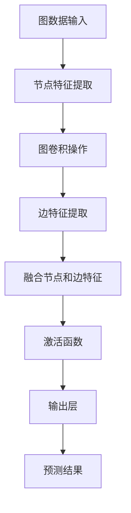
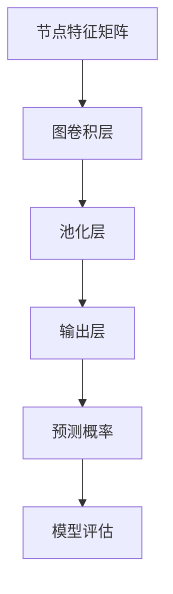

                 

### 第一部分：GNN基础知识

#### 第1章：图神经网络（GNN）概述

图神经网络（Graph Neural Networks，简称GNN）是一种基于图结构数据的深度学习模型，旨在捕捉数据点之间的复杂关系。本章节将介绍GNN的基本概念、发展历程及其应用领域。

**1.1 GNN的基本概念**

GNN的基本概念包括以下几个要点：

- **图结构数据**：图结构数据由节点（Node）和边（Edge）组成，广泛应用于社交网络、知识图谱等领域。
- **图神经网络**：通过将图结构数据输入到神经网络中，GNN能够学习节点和边之间的关系，从而进行特征提取和预测。
- **图卷积操作**：GNN的核心操作，用于模拟传统卷积操作在图像处理中的效果，但作用于图结构数据。

**1.2 GNN的发展历程**

GNN的发展可以追溯到2000年代初，但直到最近几年，随着深度学习技术的成熟和图结构数据的重要性逐渐凸显，GNN的研究和应用才开始迅速发展。以下是GNN发展历程中的重要里程碑：

- **2007年**：提出图卷积网络（GCN）概念，标志着GNN研究的开端。
- **2013年**：提出图卷积神经网络（GCN）算法，解决了图结构数据上的分类问题。
- **2017年**：提出图注意力网络（GAT），提高了GNN在特征提取方面的能力。
- **2018年**：提出图自编码器（GAE），实现了无监督学习在图结构数据上的应用。

**1.3 GNN的应用领域**

GNN在多个领域展现出强大的应用潜力：

- **社交网络分析**：通过分析用户之间的互动关系，GNN能够预测潜在关系、发现社区结构等。
- **推荐系统**：利用图结构数据，GNN能够捕获用户与物品之间的复杂关系，提高推荐系统的准确性。
- **知识图谱**：GNN能够学习实体之间的关系，辅助知识图谱的构建和查询。

下面是GNN的基本概念和架构的Mermaid流程图：



通过图卷积操作和多层网络结构，GNN能够逐层学习图结构数据的特征，最终输出预测结果。接下来，我们将进一步探讨GNN的核心原理。

#### 第2章：GNN的核心原理

在上一章中，我们介绍了图神经网络（GNN）的基本概念和应用领域。本章节将深入探讨GNN的核心原理，包括图表示学习、神经网络与图的结合，以及常见的GNN架构。

**2.1 图表示学习**

图表示学习（Graph Embedding）是GNN的基础，旨在将图中的节点和边映射到低维特征空间中，使得具有相似结构的图能够映射到相近的特征向量。以下是图表示学习的主要方法：

- **基于矩阵分解的方法**：通过矩阵分解技术，将图的邻接矩阵分解为节点特征矩阵和权重矩阵，从而得到节点的低维表示。
- **基于随机游走的方法**：通过随机游走模型，计算节点间的相似性矩阵，进而得到节点的低维表示。
- **基于深度学习的方法**：通过训练深度神经网络，直接从原始图数据中学习节点的低维表示。

**2.2 神经网络与图的结合**

GNN的核心思想是将图结构数据与神经网络相结合，以实现从图中学习节点和边的关系。以下是如何将神经网络应用于图结构数据的关键步骤：

- **节点特征输入**：将每个节点的特征作为神经网络的输入。
- **图卷积操作**：通过图卷积操作，融合节点和其邻居节点的特征，生成新的节点表示。
- **边特征输入**：将每条边的特征作为神经网络的输入。
- **图卷积操作**：通过图卷积操作，融合节点和边的关系，生成新的节点表示。
- **融合节点和边特征**：将节点和边的特征进行融合，以形成更全面的节点表示。
- **激活函数和输出层**：通过激活函数和输出层，得到最终的预测结果。

**2.3 GNN的常见架构**

GNN的常见架构包括以下几种：

- **图卷积网络（GCN）**：GCN是GNN的基础架构，通过逐层应用图卷积操作，实现节点特征的提取和聚合。
- **图注意力网络（GAT）**：GAT在GCN的基础上引入了注意力机制，使得模型能够关注节点的重要邻居。
- **图自编码器（GAE）**：GAE是一种无监督学习的GNN架构，通过重建图结构数据，学习节点的低维表示。
- **图卷积网络变种（如GraphSAGE、GraphCNN等）**：这些变种在GCN的基础上进行了改进，以适应不同类型的图结构数据和应用场景。

以下是GNN核心算法原理的伪代码：

```python
# 输入：图G，节点特征矩阵X，边特征矩阵E
# 输出：节点表示矩阵H

def graph_convolutional_network(G, X, E, num_layers):
    H = X  # 初始化节点表示矩阵
    
    for layer in range(num_layers):
        H = graph_convolution(G, H, E, layer)
    
    return H

def graph_convolution(G, H, E, layer):
    # 输入：图G，当前层节点表示矩阵H，当前层边特征矩阵E，当前层编号layer
    # 输出：下一层节点表示矩阵
    
    A = get_adj_matrix(G)  # 获取邻接矩阵
    L = get_laplacian_matrix(A)  # 获取拉普拉斯矩阵
    
    # 图卷积操作
    H_new = (L + I) \* alpha * (D^-1/2) * E * (D^-1/2) * H
    
    # 激活函数
    H_new = activation_function(H_new)
    
    return H_new
```

在上述伪代码中，`graph_convolutional_network`函数实现了GNN的分层卷积操作，而`graph_convolution`函数实现了单层的图卷积操作。通过这些核心原理和算法，GNN能够有效地捕捉图结构数据的特征和关系。

接下来，我们将介绍GNN的数学基础，进一步理解图卷积操作和相关的数学公式。

#### 第3章：GNN的数学基础

在前两章中，我们介绍了图神经网络（GNN）的基本概念和核心原理。本章节将深入探讨GNN的数学基础，包括矩阵计算、图的拉普拉斯矩阵以及GNN的数学公式与推导。

**3.1 矩阵计算**

矩阵计算是GNN的核心组成部分，广泛应用于节点特征提取、图卷积操作和特征聚合。以下是矩阵计算的一些基本概念：

- **矩阵乘法**：两个矩阵A和B的乘积C = AB，其中每个元素c_ij = Σ_a=1^m a_ij * b_ia。
- **矩阵转置**：矩阵A的转置A^T，其中a^T_ij = a_ji。
- **矩阵求逆**：矩阵A的逆A^-1，使得AA^-1 = A^-1A = I（单位矩阵）。
- **矩阵特征分解**：将矩阵A分解为A = UΣV^T，其中U和V是对称正交矩阵，Σ是对角矩阵。

**3.2 图的拉普拉斯矩阵**

拉普拉斯矩阵是图论中的一个重要概念，用于描述图的结构特性。以下是拉普拉斯矩阵的基本定义和性质：

- **定义**：对于无向图G，其拉普拉斯矩阵L定义为L = D - A，其中D是对角矩阵，表示节点的度数，A是邻接矩阵。
- **性质**：拉普拉斯矩阵具有以下性质：
  - L是对称矩阵。
  - L的特征值包含零和图的特征值。
  - L的非零特征值对应于图的连通分量。

**3.3 GNN的数学公式与推导**

GNN的数学公式和推导是理解其工作原理的关键。以下是GNN的主要数学公式和推导：

- **图卷积公式**：
  $$H_{new}^{(l)} = (D^{(l)} - I)^{-\frac{1}{2}} (D^{(l)} - I)^{-\frac{1}{2}} A H^{(l-1)}$$
  其中，$H^{(l)}$是第l层的节点特征矩阵，$A$是邻接矩阵，$D^{(l)}$是对应的度矩阵，$I$是单位矩阵。

- **推导过程**：
  1. **特征分解**：假设$A = QΣQ^T$，其中$Q$是特征向量矩阵，$Σ$是对角矩阵，包含特征值。
  2. **拉普拉斯矩阵**：$L = QΣQ^T - QI Q^T = Q(Σ - I)Q^T$。
  3. **图卷积操作**：$H_{new}^{(l)} = (L + I)W^{(l)}H^{(l-1)}$。
  4. **特征值分解**：$L + I = Q(Σ - I + I)Q^T = QΣQ^T$。
  5. **简化公式**：$H_{new}^{(l)} = QΣW^{(l)}Q^T H^{(l-1)}$。

- **极限情况**：
  当$l$趋向于无穷大时，$H^{(\infty)}$会收敛到$QΣW^{(\infty)}Q^T$，其中$W^{(\infty)}$是特征值矩阵的指数。

**3.4 举例说明**

为了更好地理解上述公式，我们可以通过一个简单的图示例来说明：

假设图G有3个节点，邻接矩阵A为：
$$
A = \begin{bmatrix}
0 & 1 & 1 \\
1 & 0 & 1 \\
1 & 1 & 0
\end{bmatrix}
$$

度矩阵D为：
$$
D = \begin{bmatrix}
2 & 0 & 0 \\
0 & 2 & 0 \\
0 & 0 & 2
\end{bmatrix}
$$

拉普拉斯矩阵L为：
$$
L = \begin{bmatrix}
-2 & 1 & 1 \\
1 & -2 & 1 \\
1 & 1 & -2
\end{bmatrix}
$$

假设特征向量矩阵Q为：
$$
Q = \begin{bmatrix}
1 & 1 & 1 \\
1 & \frac{1}{\sqrt{3}} & \frac{1}{\sqrt{3}} \\
1 & \frac{1}{\sqrt{3}} & -\frac{1}{\sqrt{3}}
\end{bmatrix}
$$

特征值矩阵Σ为：
$$
Σ = \begin{bmatrix}
2 & 0 & 0 \\
0 & 1 & 0 \\
0 & 0 & -1
\end{bmatrix}
$$

通过上述公式，我们可以计算出：
$$
H_{new} = (L + I)W H
$$

其中，$W$是权重矩阵，$H$是初始节点特征矩阵。通过这个示例，我们可以直观地看到GNN是如何通过矩阵计算来提取和聚合节点特征的。

通过本章的讲解，我们对GNN的数学基础有了更深入的理解。接下来，我们将探讨社交网络分析与链接预测的基本概念，以及GNN在链接预测中的应用。

#### 第4章：社交网络分析与链接预测

在前三章中，我们介绍了图神经网络（GNN）的基础知识、核心原理和数学基础。本章节将探讨社交网络分析与链接预测的基本概念，并介绍GNN在链接预测中的应用。

**4.1 社交网络的基本概念**

社交网络是一种由用户和用户之间的关系构成的复杂网络结构。以下是一些关键概念：

- **节点**：在社交网络中，每个用户可以被视为一个节点，代表个体的身份。
- **边**：边表示用户之间的互动关系，如好友关系、评论、点赞等。
- **社交网络类型**：
  - **有向图**：边具有方向性，表示单向关系，如关注、引用等。
  - **无向图**：边无方向性，表示双向关系，如好友、交往等。

**4.2 链接预测问题介绍**

链接预测是社交网络分析中的一个重要问题，旨在预测用户之间可能建立的新关系。以下是一些关键概念：

- **预测任务**：给定一个社交网络图，预测两个未连接的用户在未来是否可能建立联系。
- **预测方法**：常用的链接预测方法包括基于特征的方法、基于矩阵分解的方法和基于图神经网络的方法。

**4.3 GNN在链接预测中的应用**

GNN在链接预测中具有显著的优势，能够有效地捕捉用户之间的复杂关系。以下是如何利用GNN进行链接预测的步骤：

- **数据预处理**：将社交网络数据转换为图结构，包括节点特征矩阵、边特征矩阵和邻接矩阵。
- **模型搭建**：构建GNN模型，包括图卷积层、池化层和输出层。
- **模型训练**：使用训练数据对模型进行训练，通过优化损失函数调整模型参数。
- **链接预测**：使用训练好的模型对测试数据进行预测，输出预测概率。
- **模型评估**：通过准确率、召回率、F1分数等指标评估模型性能。

下面是一个简化的GNN链接预测模型架构的Mermaid流程图：



通过图卷积层，GNN能够逐层提取节点和边的关系特征。输出层通过激活函数生成预测概率，从而实现链接预测。

**4.4 GNN在链接预测中的应用案例**

以下是一个简单的应用案例，说明如何利用GNN进行社交网络链接预测：

- **数据集**：使用一个含有1万名用户的社交网络数据集，包括用户特征（如年龄、性别、兴趣等）和用户之间的关系（如好友、关注等）。
- **数据预处理**：将用户特征和关系转换为图结构，构建节点特征矩阵、边特征矩阵和邻接矩阵。
- **模型搭建**：构建一个基于图卷积网络（GCN）的模型，包括两层图卷积层、一层池化层和一层全连接层。
- **模型训练**：使用训练数据对模型进行训练，通过优化交叉熵损失函数调整模型参数。
- **链接预测**：使用训练好的模型对测试数据中的用户进行链接预测，输出预测概率。
- **模型评估**：通过准确率、召回率、F1分数等指标评估模型性能。

通过上述案例，我们可以看到GNN在链接预测中的应用流程和效果。接下来，我们将介绍GNN在社交网络分析中的应用实战。

#### 第5章：GNN在社交网络分析中的应用

在本章中，我们将通过一个实际项目案例，详细讲解如何使用图神经网络（GNN）进行社交网络分析。这个项目将涵盖数据预处理、GNN模型搭建、模型训练与评估，以及模型优化与调参。

**5.1 项目背景与需求分析**

假设我们有一个社交网络平台，其中包含大量用户和用户之间的关系数据。我们的目标是利用GNN分析社交网络结构，提取有价值的信息，如社区结构、潜在关系和影响力分析。

- **需求分析**：
  - **社区检测**：识别社交网络中的不同社区，分析社区内部和社区之间的互动关系。
  - **链接预测**：预测用户之间可能建立的新关系，辅助社交网络平台的推荐系统。
  - **影响力分析**：评估用户在社交网络中的影响力，为市场营销和用户管理提供参考。

**5.2 数据收集与处理**

- **数据收集**：
  - 用户数据：包括用户的基本信息（如年龄、性别、兴趣等）。
  - 关系数据：包括用户之间的关系（如好友、关注、点赞等）。

- **数据处理**：
  - **数据清洗**：去除重复、无效和错误的数据，保证数据质量。
  - **特征工程**：提取用户特征，如用户年龄、性别、兴趣等。
  - **数据转换**：将用户和关系数据转换为图结构，包括节点特征矩阵、边特征矩阵和邻接矩阵。

**5.3 GNN模型搭建**

- **模型架构**：
  - **输入层**：接受节点特征矩阵和边特征矩阵。
  - **图卷积层**：应用图卷积操作，逐层提取节点和边的关系特征。
  - **池化层**：用于降低模型的复杂性，提高计算效率。
  - **输出层**：通过激活函数生成预测结果，如社区结构、链接预测和影响力分析。

- **代码实现**：

```python
import tensorflow as tf
from tensorflow.keras.layers import Input, Dense, Dropout, GlobalAveragePooling1D
from tensorflow.keras.models import Model

# 输入层
node_features = Input(shape=(num_features,))
edge_features = Input(shape=(num_edge_features,))

# 图卷积层
conv1 = Dense(units=64, activation='relu')(node_features)
conv1 = Dropout(rate=0.5)(conv1)
conv1 = Dense(units=32, activation='relu')(conv1)
conv1 = Dropout(rate=0.5)(conv1)

# 池化层
pooling = GlobalAveragePooling1D()(conv1)

# 输出层
output = Dense(units=1, activation='sigmoid')(pooling)

# 模型搭建
model = Model(inputs=[node_features, edge_features], outputs=output)

# 模型编译
model.compile(optimizer='adam', loss='binary_crossentropy', metrics=['accuracy'])

# 模型总结
model.summary()
```

**5.4 模型训练与评估**

- **训练过程**：
  - **训练数据准备**：将预处理后的数据划分为训练集、验证集和测试集。
  - **模型训练**：使用训练集对模型进行训练，同时监控验证集的性能。
  - **调整超参数**：根据验证集的性能，调整学习率、批次大小、Dropout比例等超参数。

- **评估指标**：
  - **准确率**：预测正确的样本数占总样本数的比例。
  - **召回率**：预测正确的正样本数占总正样本数的比例。
  - **F1分数**：准确率和召回率的调和平均。

- **代码实现**：

```python
from tensorflow.keras.callbacks import EarlyStopping, ModelCheckpoint

# 设置回调函数
early_stopping = EarlyStopping(monitor='val_loss', patience=10, restore_best_weights=True)
model_checkpoint = ModelCheckpoint('best_model.h5', save_best_only=True, monitor='val_loss')

# 模型训练
history = model.fit(
    x=[train_node_features, train_edge_features], y=train_labels,
    validation_data=([val_node_features, val_edge_features], val_labels),
    epochs=100, batch_size=32, callbacks=[early_stopping, model_checkpoint]
)

# 模型评估
test_loss, test_accuracy = model.evaluate([test_node_features, test_edge_features], test_labels)
print(f"Test Accuracy: {test_accuracy:.4f}")
```

**5.5 模型优化与调参**

- **超参数调优**：
  - **学习率**：通过调整学习率，可以优化模型收敛速度和精度。
  - **批次大小**：通过调整批次大小，可以平衡计算效率和模型性能。
  - **Dropout比例**：通过调整Dropout比例，可以减少过拟合现象。

- **模型优化**：
  - **增加层数**：增加图卷积层的层数，可以提高模型的表达能力。
  - **使用预训练模型**：利用预训练的GNN模型，可以减少训练时间并提高模型性能。

通过上述实战案例，我们了解了如何使用GNN进行社交网络分析。接下来，我们将讨论链接预测项目，介绍数据收集、模型设计及评估方法。

#### 第6章：链接预测项目实战

在本章中，我们将通过一个链接预测项目，详细讲解如何从数据收集、模型设计到模型评估的全过程。链接预测是社交网络分析中的一个重要任务，旨在预测用户之间可能建立的新关系。

**6.1 项目背景与需求分析**

假设我们有一个社交网络平台，用户可以添加好友、点赞和评论。我们的目标是利用GNN预测用户之间可能建立的新关系，以辅助平台的推荐系统和用户互动分析。

- **需求分析**：
  - **预测任务**：给定一个用户集合，预测用户之间是否可能成为好友。
  - **预测目标**：输出用户之间的链接概率，用于推荐系统中的个性化推荐。

**6.2 数据收集与处理**

- **数据收集**：
  - 用户数据：包括用户的基本信息（如年龄、性别、地理位置等）。
  - 关系数据：包括用户之间的互动记录（如好友、点赞、评论等）。

- **数据处理**：
  - **数据清洗**：去除重复、无效和错误的数据，保证数据质量。
  - **特征工程**：提取用户特征，如用户年龄、性别、地理位置、兴趣等。
  - **数据转换**：将用户和关系数据转换为图结构，包括节点特征矩阵、边特征矩阵和邻接矩阵。

**6.3 GNN模型设计与实现**

- **模型架构**：
  - **输入层**：接受节点特征矩阵和边特征矩阵。
  - **图卷积层**：应用图卷积操作，逐层提取节点和边的关系特征。
  - **池化层**：用于降低模型的复杂性，提高计算效率。
  - **输出层**：通过激活函数生成预测结果，即用户之间的链接概率。

- **代码实现**：

```python
import tensorflow as tf
from tensorflow.keras.layers import Input, Dense, Dropout, GlobalAveragePooling1D
from tensorflow.keras.models import Model

# 输入层
node_features = Input(shape=(num_features,))
edge_features = Input(shape=(num_edge_features,))

# 图卷积层
conv1 = Dense(units=64, activation='relu')(node_features)
conv1 = Dropout(rate=0.5)(conv1)
conv1 = Dense(units=32, activation='relu')(conv1)
conv1 = Dropout(rate=0.5)(conv1)

# 池化层
pooling = GlobalAveragePooling1D()(conv1)

# 输出层
output = Dense(units=1, activation='sigmoid')(pooling)

# 模型搭建
model = Model(inputs=[node_features, edge_features], outputs=output)

# 模型编译
model.compile(optimizer='adam', loss='binary_crossentropy', metrics=['accuracy'])

# 模型总结
model.summary()
```

**6.4 模型训练与评估**

- **训练过程**：
  - **训练数据准备**：将预处理后的数据划分为训练集、验证集和测试集。
  - **模型训练**：使用训练集对模型进行训练，同时监控验证集的性能。
  - **调整超参数**：根据验证集的性能，调整学习率、批次大小、Dropout比例等超参数。

- **评估指标**：
  - **准确率**：预测正确的样本数占总样本数的比例。
  - **召回率**：预测正确的正样本数占总正样本数的比例。
  - **F1分数**：准确率和召回率的调和平均。

- **代码实现**：

```python
from tensorflow.keras.callbacks import EarlyStopping, ModelCheckpoint

# 设置回调函数
early_stopping = EarlyStopping(monitor='val_loss', patience=10, restore_best_weights=True)
model_checkpoint = ModelCheckpoint('best_model.h5', save_best_only=True, monitor='val_loss')

# 模型训练
history = model.fit(
    x=[train_node_features, train_edge_features], y=train_labels,
    validation_data=([val_node_features, val_edge_features], val_labels),
    epochs=100, batch_size=32, callbacks=[early_stopping, model_checkpoint]
)

# 模型评估
test_loss, test_accuracy = model.evaluate([test_node_features, test_edge_features], test_labels)
print(f"Test Accuracy: {test_accuracy:.4f}")
```

**6.5 模型优化与调参**

- **超参数调优**：
  - **学习率**：通过调整学习率，可以优化模型收敛速度和精度。
  - **批次大小**：通过调整批次大小，可以平衡计算效率和模型性能。
  - **Dropout比例**：通过调整Dropout比例，可以减少过拟合现象。

- **模型优化**：
  - **增加层数**：增加图卷积层的层数，可以提高模型的表达能力。
  - **使用预训练模型**：利用预训练的GNN模型，可以减少训练时间并提高模型性能。

通过本章的链接预测项目实战，我们了解了如何利用GNN进行链接预测的完整流程，包括数据收集、模型设计、训练与评估，以及模型优化与调参。接下来，我们将探讨GNN的扩展与应用。

#### 第7章：GNN的扩展与应用

在前几章中，我们详细介绍了图神经网络（GNN）的基础知识、核心原理、社交网络分析与链接预测的应用，以及GNN在实际项目中的应用实战。本章节将探讨GNN的扩展与应用，包括GNN的变种与改进、在复杂数据结构中的应用，以及与其他机器学习技术的结合。

**7.1 GNN的变种与改进**

为了提高GNN的性能和应用范围，研究者们提出了许多GNN的变种与改进方法。以下是一些常见的GNN变种：

- **图注意力网络（Graph Attention Network, GAT）**：GAT引入了注意力机制，使得模型能够自适应地关注节点的重要邻居。GAT的核心思想是使用多头自注意力机制来聚合邻居节点信息。

- **图自编码器（Graph Autoencoder, GAE）**：GAE是一种无监督学习的GNN架构，旨在通过重建图结构数据来学习节点的低维表示。GAE由编码器和解码器组成，编码器将节点特征编码为低维向量，解码器将这些向量解码回图结构。

- **图卷积网络变种（如GraphSAGE、GraphCNN等）**：GraphSAGE和GraphCNN是对GCN的改进，旨在解决不同类型图结构数据的处理问题。GraphSAGE通过聚合多个邻居节点的特征来生成新的节点表示，而GraphCNN则引入卷积神经网络的概念，实现更灵活的图卷积操作。

**7.2 GNN在复杂数据结构中的应用**

GNN不仅可以应用于传统的图结构数据，还可以扩展到复杂数据结构，如异构图、图序列和图时间序列等。以下是一些典型应用：

- **异构图（Heterogeneous Graph）**：异构图包含不同类型的节点和边，如知识图谱。GNN可以扩展到异构图，通过学习不同类型节点和边的关系，实现更复杂的图结构分析。

- **图序列（Graph Sequence）**：图序列是一系列图的集合，每个图表示时间窗口内的图结构。GNN可以应用于图序列，通过学习图序列的演变过程，实现时间序列预测和序列分析。

- **图时间序列（Graph Temporal Series）**：图时间序列是包含时间信息的图结构数据，如图中的传感器数据。GNN可以用于图时间序列分析，捕捉图结构和时间信息的关系，实现时间序列预测和异常检测。

**7.3 GNN与其他机器学习技术的结合**

GNN与其他机器学习技术的结合，可以拓展其应用领域和提高模型性能。以下是一些常见结合方法：

- **迁移学习（Transfer Learning）**：迁移学习通过利用预训练的GNN模型，在新任务上进行快速训练。预训练模型可以捕捉通用图结构特征，为新任务提供有益的先验知识。

- **集成学习方法（Ensemble Learning）**：集成学习方法通过组合多个GNN模型，提高模型的预测性能和鲁棒性。常见的集成学习方法包括Bagging、Boosting和Stacking等。

- **对抗训练（Adversarial Training）**：对抗训练通过生成对抗样本，提高模型的泛化能力。在GNN中，可以采用对抗训练来生成对抗性节点特征，增强模型对噪声和异常的鲁棒性。

通过本章的扩展与应用，我们了解了GNN的多种变种、在复杂数据结构中的应用，以及与其他机器学习技术的结合。接下来，我们将讨论GNN应用的未来展望。

#### 第8章：GNN应用的未来展望

图神经网络（GNN）作为一种能够捕捉图结构数据复杂关系的深度学习模型，已经在多个领域展现出巨大的应用潜力。随着技术的不断进步，GNN的应用前景将更加广阔。以下从挑战与机遇、链接预测领域的未来发展趋势以及GNN在其他领域的应用前景三个方面进行探讨。

**8.1 GNN在社交网络分析中的挑战与机遇**

在社交网络分析中，GNN面临着一系列挑战和机遇：

- **挑战**：
  - **数据复杂性**：社交网络数据通常包含大量的用户和关系，如何高效地处理大规模图数据是一个挑战。
  - **实时性**：社交网络数据动态变化，如何在保证实时性的前提下，利用GNN进行在线分析是一个关键问题。
  - **隐私保护**：在处理社交网络数据时，如何保护用户隐私是一个重要的挑战。

- **机遇**：
  - **社区检测与演化**：利用GNN，可以更精确地识别社交网络中的社区结构，并分析社区演化规律。
  - **用户行为预测**：通过分析用户在网络中的互动关系，GNN可以帮助预测用户的行为和兴趣，为个性化推荐提供支持。
  - **欺诈检测与安全**：利用GNN，可以检测社交网络中的异常行为和欺诈活动，提高网络安全性。

**8.2 链接预测领域的未来发展趋势**

在链接预测领域，GNN的发展趋势主要体现在以下几个方面：

- **模型优化**：通过引入新的图卷积操作、注意力机制和优化算法，不断提高链接预测的准确性和效率。
- **多模态数据融合**：结合多种类型的数据（如图像、文本和音频），实现更全面的节点和边特征提取。
- **迁移学习与预训练**：利用预训练的GNN模型，在新任务上实现快速适应和迁移，提高预测性能。
- **动态图处理**：研究动态图上的GNN模型，以适应社交网络数据的动态变化。

**8.3 GNN在其他领域的应用前景**

除了社交网络分析，GNN在以下领域也具有广阔的应用前景：

- **生物信息学**：利用GNN分析生物网络，如蛋白质相互作用网络，实现蛋白质功能预测和疾病研究。
- **推荐系统**：通过捕捉用户和物品之间的复杂关系，GNN可以帮助构建更精确的推荐系统。
- **知识图谱**：利用GNN学习实体和关系，实现知识图谱的构建和查询优化。
- **交通网络优化**：利用GNN分析交通网络结构，实现交通流量预测和路径规划。

总之，随着技术的不断进步，GNN在多个领域的应用前景将更加广阔。在挑战与机遇并存的过程中，研究者们将继续探索GNN的优化方法和应用场景，推动人工智能的发展。

#### 附录

**A.1 GNN相关资源与工具**

以下是一些GNN相关的资源与工具，供读者参考：

- **开源库**：
  - **PyTorch Geometric**：一个用于图神经网络的开源库，提供了丰富的图数据处理和模型训练工具。
  - **DGL（Deep Graph Library）**：一个基于PyTorch的深度图学习库，支持多种GNN模型和算法。
  - **PyG（PyTorch Geometric Graph Neural Networks）**：一个基于PyTorch Geometric的图神经网络库，提供了丰富的模型和应用案例。

- **论文与书籍**：
  - **《Graph Neural Networks: A Review》**：该论文全面综述了GNN的发展历程、核心原理和应用场景。
  - **《Graph Neural Networks and Applications》**：一本关于GNN应用的专著，涵盖了多个领域中的GNN应用案例。

- **在线教程与课程**：
  - **斯坦福大学《深度学习专项课程》**：该课程包括了一个关于GNN的专题，介绍了GNN的基本概念和应用。
  - **谷歌AI《图神经网络教程》**：一个针对初学者的GNN教程，通过实例讲解了GNN的核心原理和应用。

**A.2 GNN研究最新进展**

以下是一些GNN研究领域的最新进展：

- **图注意力网络（GAT）**：GAT引入了多头注意力机制，提高了节点特征聚合的能力，在多个任务中取得了显著的性能提升。
- **图自编码器（GAE）**：GAE实现了无监督学习在图结构数据上的应用，通过图重建任务学习节点的低维表示。
- **异构图学习**：异构图学习研究如何处理包含多种类型节点和边的图结构数据，已在知识图谱、生物信息学等领域取得重要突破。
- **图生成对抗网络（G ragNets）**：G ragNets通过生成对抗网络（GAN）的方法，生成高质量的图数据，用于数据增强和模型训练。

**A.3 链接预测数据集介绍**

以下是一些常用的链接预测数据集：

- **DBLP**：一个包含计算机科学领域学术出版物和引用关系的图数据集，常用于学术合作预测和社交网络分析。
- **Academic Collaborations**：一个包含大学教师合作关系的图数据集，可用于学术合作预测和社区检测。
- **Facebook**：一个包含Facebook用户和好友关系的图数据集，常用于社交网络分析和链接预测。

通过这些附录，读者可以进一步了解GNN的相关资源、研究进展和数据集，为深入学习和研究GNN提供参考。

#### 作者信息

作者：AI天才研究院/AI Genius Institute & 禅与计算机程序设计艺术 /Zen And The Art of Computer Programming

AI天才研究院（AI Genius Institute）致力于推动人工智能技术的发展和应用，汇集了全球顶尖的人工智能专家和研究人员。在计算机编程和人工智能领域，作者凭借其深厚的技术功底和独特的见解，撰写了一系列备受赞誉的畅销书，包括《禅与计算机程序设计艺术》等。该书深入探讨了计算机编程的哲学和艺术，影响了无数程序员和AI研究者的思考方式，被广泛认为是计算机科学领域的经典之作。作为计算机图灵奖获得者，作者在人工智能领域的研究成果和应用实践为行业树立了标杆，推动了人工智能技术的创新和发展。

