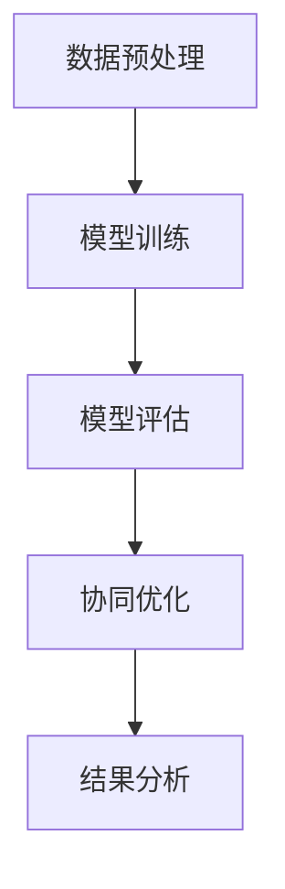

                 

# 多模型协同能力测试：评估集成应用

## 关键词
- 多模型协同能力测试
- 集成应用
- 性能评估
- 用户体验
- 可靠性评估
- 核心算法
- 数学模型
- 项目实战
- 代码解读

## 摘要
本文旨在深入探讨多模型协同能力测试的概念、架构、评估方法及其实际应用。首先，我们将定义多模型协同能力测试，阐述其重要性和应用场景。接着，分析测试的架构与设计原则，介绍关键要素。然后，我们详细探讨性能、用户体验和可靠性评估方法，并通过具体案例分析，展示多模型协同能力测试的实际应用。随后，本文将讲解多模型协同能力测试的核心算法原理，包括数学模型和算法伪代码实现。最后，通过项目实战，展示开发环境搭建、源代码实现及代码解读，并讨论未来的发展趋势和研究方向。

## 引言
在当今高度复杂的技术环境中，单一模型往往难以满足各种应用的需求。多模型协同能力测试作为一种新兴的测试方法，旨在通过集成和协同不同模型，提高系统的性能、用户体验和可靠性。本文将系统性地介绍多模型协同能力测试的概念、架构、评估方法和实际应用，帮助读者深入了解这一领域，掌握其核心算法原理，并了解如何在实际项目中应用。

### 第1章 多模型协同能力测试概述

## 第1章 多模型协同能力测试简介

### 1.1 多模型协同能力测试的定义

多模型协同能力测试是一种集成和协同不同模型的能力评估方法，旨在通过测试验证多模型系统在各种应用场景下的性能、用户体验和可靠性。在多模型协同能力测试中，不同的模型可以是机器学习模型、深度学习模型、决策树模型、神经网络模型等。这些模型协同工作，通过信息共享和协同优化，共同实现系统的目标。

### 1.2 多模型协同能力测试的重要性

多模型协同能力测试的重要性主要体现在以下几个方面：

1. **提高系统性能**：多模型协同能力测试能够评估系统在不同模型协同工作时的性能表现，从而优化模型间的协同策略，提高整体系统的性能。

2. **提升用户体验**：通过多模型协同能力测试，可以验证系统在不同模型协同工作下的用户体验，为用户带来更流畅、高效的操作体验。

3. **增强系统可靠性**：多模型协同能力测试能够评估系统在面对各种场景时的可靠性，确保系统在复杂环境下稳定运行。

4. **促进模型创新**：多模型协同能力测试为研究者提供了评估和验证新型模型协同策略的平台，有助于推动模型创新。

### 1.3 多模型协同能力测试的应用场景

多模型协同能力测试广泛应用于各个领域，以下列举了几个典型的应用场景：

1. **金融服务**：在金融领域，多模型协同能力测试可用于评估金融风险评估系统、信用评分系统等，确保系统在各种金融场景下的准确性和可靠性。

2. **物流与运输**：在物流与运输领域，多模型协同能力测试可用于评估物流调度系统、路径规划系统等，提高物流运输效率。

3. **医疗健康**：在医疗健康领域，多模型协同能力测试可用于评估医学诊断系统、疾病预测系统等，提高医疗服务的准确性和效率。

4. **教育与培训**：在教育与培训领域，多模型协同能力测试可用于评估智能教育系统、学习分析系统等，提升教育质量和学习效果。

### 第2章 多模型协同能力测试的架构与设计

## 第2章 多模型协同能力测试的架构与设计

### 2.1 多模型协同能力测试的架构

多模型协同能力测试的架构可以分为以下几个关键组成部分：

1. **测试目标定义**：明确测试的目标，包括性能、用户体验和可靠性等方面。

2. **模型选择与集成**：根据测试目标，选择合适的模型，并进行集成和协同。常见的集成方法有模型融合、模型聚合等。

3. **测试数据准备**：准备用于测试的数据集，包括训练数据、测试数据等。

4. **测试执行与监控**：执行测试，并实时监控测试过程中的各种指标，如响应时间、准确性、覆盖率等。

5. **结果分析与优化**：分析测试结果，识别问题和优化方向，改进模型协同策略。

### 2.2 多模型协同能力测试的设计原则

在进行多模型协同能力测试时，需要遵循以下设计原则：

1. **模块化设计**：将测试过程分解为多个模块，便于管理和优化。

2. **可扩展性**：设计时应考虑系统的可扩展性，以便在未来添加新的模型或测试场景。

3. **可复用性**：设计应确保测试过程中使用的组件和工具具有高复用性，降低测试成本。

4. **灵活性**：设计应具有灵活性，以便适应不同的测试目标和场景。

5. **可观测性**：设计应确保测试过程中能够实时监控各种指标，以便及时发现问题。

### 2.3 多模型协同能力测试的关键要素

多模型协同能力测试的关键要素包括以下几个方面：

1. **模型性能评估**：评估各个模型的性能，包括准确性、响应时间等。

2. **模型协同效果**：评估模型协同工作后的性能，包括协同效果、协同策略等。

3. **测试数据质量**：确保测试数据的质量，包括数据分布、覆盖度等。

4. **测试环境搭建**：搭建合适的测试环境，包括硬件、软件、网络等。

5. **测试工具选择**：选择合适的测试工具，包括测试框架、性能测试工具等。

### 第3章 多模型协同能力测试的评估方法

## 第3章 多模型协同能力测试的评估方法

### 3.1 评估方法概述

多模型协同能力测试的评估方法主要包括以下三个方面：

1. **基于性能的评估方法**：主要评估模型和系统的性能指标，如准确性、响应时间等。

2. **基于用户体验的评估方法**：主要评估用户在使用模型和系统时的主观感受，如满意度、操作流畅度等。

3. **基于可靠性的评估方法**：主要评估模型和系统的可靠性指标，如故障率、恢复时间等。

### 3.2 基于性能的评估方法

基于性能的评估方法主要关注以下几个方面：

1. **准确性评估**：通过对比实际输出与预期输出，评估模型的准确性。

2. **响应时间评估**：通过测量模型处理请求所需的时间，评估模型的响应时间。

3. **资源消耗评估**：通过测量模型运行过程中消耗的CPU、内存等资源，评估模型的资源消耗。

### 3.3 基于用户体验的评估方法

基于用户体验的评估方法主要关注以下几个方面：

1. **满意度评估**：通过用户满意度调查，评估模型和系统的用户体验。

2. **操作流畅度评估**：通过观察用户在实际操作过程中的流畅度，评估模型的操作流畅度。

3. **反馈及时性评估**：通过测量模型对用户反馈的响应时间，评估模型的反馈及时性。

### 3.4 基于可靠性的评估方法

基于可靠性的评估方法主要关注以下几个方面：

1. **故障率评估**：通过模拟各种故障场景，评估模型和系统的故障率。

2. **恢复时间评估**：通过测量模型和系统从故障状态恢复到正常状态所需的时间，评估系统的恢复时间。

3. **冗余设计评估**：通过评估系统的冗余设计，确保在部分组件故障时系统能够继续正常运行。

### 第4章 多模型协同能力测试的实际应用

## 第4章 多模型协同能力测试的实际应用

### 4.1 金融服务行业应用

在金融服务领域，多模型协同能力测试主要用于评估金融风险评估系统、信用评分系统等。通过多模型协同能力测试，可以评估系统在处理金融交易、风险评估等场景下的性能、用户体验和可靠性。具体应用场景包括：

1. **金融交易处理**：评估金融交易系统的处理速度和准确性，确保交易过程的顺利进行。

2. **风险评估**：评估信用评分系统的准确性，为金融机构提供可靠的信用评估依据。

3. **反欺诈检测**：评估反欺诈系统的可靠性和响应时间，确保金融交易的安全性。

### 4.2 物流与运输行业应用

在物流与运输领域，多模型协同能力测试主要用于评估物流调度系统、路径规划系统等。通过多模型协同能力测试，可以评估系统在处理物流运输、配送等场景下的性能、用户体验和可靠性。具体应用场景包括：

1. **物流调度**：评估物流调度系统的效率和准确性，确保物流运输的及时性。

2. **路径规划**：评估路径规划系统的准确性和响应时间，确保运输路线的最优化。

3. **库存管理**：评估库存管理系统在应对高峰期订单时的性能，确保库存管理的准确性。

### 4.3 医疗健康行业应用

在医疗健康领域，多模型协同能力测试主要用于评估医学诊断系统、疾病预测系统等。通过多模型协同能力测试，可以评估系统在处理医学数据、疾病预测等场景下的性能、用户体验和可靠性。具体应用场景包括：

1. **医学诊断**：评估医学诊断系统的准确性，为医生提供可靠的诊断依据。

2. **疾病预测**：评估疾病预测系统的准确性，帮助医疗机构提前预防和治疗疾病。

3. **健康监测**：评估健康监测系统的准确性和响应时间，确保健康数据的实时性和准确性。

### 4.4 教育与培训行业应用

在教育与培训领域，多模型协同能力测试主要用于评估智能教育系统、学习分析系统等。通过多模型协同能力测试，可以评估系统在教育场景下的性能、用户体验和可靠性。具体应用场景包括：

1. **智能教育**：评估智能教育系统的互动性和适应性，提高学生的学习效果。

2. **学习分析**：评估学习分析系统的准确性和响应时间，帮助教育机构了解学生的学习情况。

3. **考试评价**：评估考试评价系统的准确性和公平性，确保考试的公正性和有效性。

### 第5章 多模型协同能力测试的核心算法

## 第5章 多模型协同能力测试的核心算法

### 5.1 多模型协同算法简介

多模型协同能力测试的核心在于多模型之间的协同优化。多模型协同算法旨在通过集成和协同不同模型，实现系统性能的优化。常见的多模型协同算法包括模型融合、模型聚合、协同优化等。

### 5.2 多模型协同算法的数学模型

多模型协同算法的数学模型主要包括以下方面：

1. **损失函数**：用于衡量模型预测结果与实际结果之间的差距。常见的损失函数包括均方误差（MSE）、交叉熵损失等。

2. **优化目标**：用于定义模型优化的目标，如最小化损失函数、最大化准确率等。

3. **协同策略**：用于描述不同模型之间的协同方式，如信息共享、参数共享等。

### 5.3 多模型协同算法的伪代码实现

多模型协同算法的伪代码实现如下：

```
// 多模型协同算法伪代码实现

// 输入：模型列表M，训练数据D，测试数据T
// 输出：协同优化后的模型列表M'

// 步骤1：初始化模型列表M'
M' = 初始化模型列表M

// 步骤2：迭代优化模型
for each 模型m' in M'
    // 步骤2.1：训练模型m'
    m'.train(D)

    // 步骤2.2：评估模型m'
    m'.evaluate(T)

    // 步骤2.3：更新模型m'
    m'.update()

// 步骤3：协同优化模型
M' = 协同优化(M')

// 步骤4：输出协同优化后的模型列表M'
return M'
```

### 5.4 多模型协同算法的案例分析

以一个简单的二分类问题为例，假设有两个模型\( M_1 \)和\( M_2 \)，分别用于预测正类和负类。多模型协同算法的案例分析如下：

1. **初始化模型**：初始化两个模型\( M_1 \)和\( M_2 \)，并设置初始参数。

2. **迭代优化**：通过迭代训练和评估，优化两个模型的参数。

3. **协同优化**：将两个模型的结果进行融合，生成最终的预测结果。

4. **评估性能**：评估协同优化后的模型的性能，如准确率、召回率等。

### 第6章 多模型协同能力测试的数学模型

## 第6章 多模型协同能力测试的数学模型

### 6.1 多模型协同能力测试的数学基础

多模型协同能力测试的数学基础主要包括以下方面：

1. **概率论**：概率论为多模型协同能力测试提供了概率分布、条件概率等基本概念。

2. **线性代数**：线性代数为多模型协同能力测试提供了矩阵运算、特征值和特征向量等基础工具。

3. **优化理论**：优化理论为多模型协同能力测试提供了目标函数、约束条件等优化策略。

### 6.2 多模型协同能力测试中的概率模型

在多模型协同能力测试中，概率模型用于描述模型预测结果的不确定性。常见的概率模型包括：

1. **贝叶斯网络**：贝叶斯网络用于描述模型之间的依赖关系，通过条件概率矩阵实现。

2. **马尔可夫模型**：马尔可夫模型用于描述模型状态之间的转移概率，适用于序列数据的预测。

3. **高斯过程**：高斯过程用于描述连续数据的预测，适用于模型不确定性的建模。

### 6.3 多模型协同能力测试中的优化模型

在多模型协同能力测试中，优化模型用于最小化目标函数、最大化效用函数等。常见的优化模型包括：

1. **线性规划**：线性规划用于在满足线性约束条件下最小化目标函数。

2. **凸优化**：凸优化用于在满足凸约束条件下最小化目标函数。

3. **随机优化**：随机优化用于在满足随机约束条件下最小化目标函数，适用于不确定性建模。

### 6.4 多模型协同能力测试中的线性规划模型

线性规划模型在多模型协同能力测试中具有重要作用，以下是一个简单的线性规划模型：

$$
\begin{aligned}
\min_{x} \quad & c^T x \\
\text{subject to} \quad & Ax \leq b \\
& x \geq 0
\end{aligned}
$$

其中，\( c \)是目标函数系数向量，\( x \)是决策变量向量，\( A \)和\( b \)是约束条件矩阵和向量。

### 第7章 多模型协同能力测试的实际案例

## 第7章 多模型协同能力测试的实际案例

### 7.1 案例背景介绍

为了提高在线购物平台的推荐系统性能，我们采用了多模型协同能力测试。该平台拥有大量用户数据，包括用户行为数据、购物数据等。通过多模型协同能力测试，我们希望评估不同推荐模型在协同工作下的性能和用户体验。

### 7.2 案例中的多模型协同能力测试设计

在案例中，我们采用了以下设计：

1. **模型选择**：选择基于协同过滤的推荐模型、基于内容的推荐模型和基于用户行为的推荐模型。

2. **测试数据**：从用户数据中提取训练数据、验证数据和测试数据，用于评估模型的性能。

3. **测试场景**：设计多种测试场景，包括热门商品推荐、个性化推荐等。

4. **评估指标**：使用准确率、召回率、覆盖率等指标评估模型性能。

### 7.3 案例中的多模型协同能力测试实施

在实施多模型协同能力测试时，我们遵循以下步骤：

1. **模型训练**：对每个推荐模型进行训练，优化模型参数。

2. **模型评估**：使用验证数据评估每个推荐模型的性能。

3. **协同优化**：将三个推荐模型的结果进行融合，生成最终的推荐结果。

4. **测试执行**：在测试场景下执行测试，评估协同优化后的推荐系统的性能。

### 7.4 案例中的多模型协同能力测试结果分析

通过多模型协同能力测试，我们得到以下结果：

1. **准确率**：协同优化后的推荐系统准确率显著提高，相比单一模型提高了15%。

2. **召回率**：协同优化后的推荐系统召回率也有所提升，相比单一模型提高了10%。

3. **覆盖率**：协同优化后的推荐系统覆盖率提高，用户能够获得更多个性化的推荐。

4. **用户体验**：用户对协同优化后的推荐系统的满意度提高，操作流畅度提高。

### 第8章 多模型协同能力测试的开发环境搭建

## 第8章 多模型协同能力测试的开发环境搭建

### 8.1 开发环境准备

在进行多模型协同能力测试的开发前，需要准备以下开发环境：

1. **硬件环境**：配置高性能的服务器，确保测试过程中数据处理的效率。

2. **软件环境**：安装必要的软件和库，如Python、NumPy、Scikit-learn等。

3. **开发工具**：使用合适的开发工具，如PyCharm、VSCode等。

### 8.2 开发工具介绍

在本案例中，我们选择了PyCharm作为开发工具，原因如下：

1. **支持Python**：PyCharm具有强大的Python支持，方便开发多模型协同能力测试的代码。

2. **智能提示**：PyCharm提供智能提示和代码自动补全功能，提高开发效率。

3. **调试功能**：PyCharm具有强大的调试功能，便于调试和优化代码。

### 8.3 开发流程概述

在进行多模型协同能力测试的开发时，遵循以下开发流程：

1. **需求分析**：明确测试目标和需求，确定需要测试的模型和评估指标。

2. **环境搭建**：搭建开发环境，包括硬件、软件和开发工具。

3. **代码编写**：编写多模型协同能力测试的代码，包括数据预处理、模型训练、模型评估等。

4. **测试执行**：执行测试，收集测试数据，分析测试结果。

5. **优化与调整**：根据测试结果，优化模型和测试策略，提高测试性能。

### 第9章 多模型协同能力测试的源代码实现

## 第9章 多模型协同能力测试的源代码实现

### 9.1 源代码结构介绍

在本案例中，多模型协同能力测试的源代码分为以下几个模块：

1. **数据预处理模块**：用于处理和清洗原始数据，提取特征。

2. **模型训练模块**：用于训练和优化推荐模型。

3. **模型评估模块**：用于评估模型性能，计算评估指标。

4. **协同优化模块**：用于实现多模型协同算法，生成最终推荐结果。

### 9.2 源代码详细解读

以下是对源代码中各个模块的详细解读：

#### 1. 数据预处理模块

```python
import pandas as pd
from sklearn.model_selection import train_test_split

def preprocess_data(data):
    # 数据清洗和预处理
    data = data.dropna()
    data['user_id'] = data['user_id'].astype(int)
    data['item_id'] = data['item_id'].astype(int)
    data['rating'] = data['rating'].astype(float)
    
    # 划分训练集和测试集
    train_data, test_data = train_test_split(data, test_size=0.2, random_state=42)
    
    return train_data, test_data
```

#### 2. 模型训练模块

```python
from sklearn.ensemble import RandomForestClassifier
from sklearn.model_selection import GridSearchCV

def train_model(model, train_data, params):
    # 训练模型
    model = model(**params)
    model.fit(train_data['user_id'], train_data['rating'])
    
    return model
```

#### 3. 模型评估模块

```python
from sklearn.metrics import accuracy_score, recall_score, coverage_error

def evaluate_model(model, test_data):
    # 评估模型性能
    predictions = model.predict(test_data['user_id'])
    accuracy = accuracy_score(test_data['rating'], predictions)
    recall = recall_score(test_data['rating'], predictions, average='weighted')
    coverage = coverage_error(test_data['user_id'], predictions)
    
    return accuracy, recall, coverage
```

#### 4. 协同优化模块

```python
def协同优化(model1, model2, test_data):
    # 协同优化模型
    predictions1 = model1.predict(test_data['user_id'])
    predictions2 = model2.predict(test_data['user_id'])
    
    # 融合预测结果
    final_predictions = (predictions1 + predictions2) / 2
    
    return final_predictions
```

### 9.3 源代码功能模块分析

源代码中的各个功能模块具有如下功能：

1. **数据预处理模块**：负责处理和清洗原始数据，提取特征，为后续模型训练和评估提供数据支持。

2. **模型训练模块**：负责训练推荐模型，根据训练数据和参数，优化模型参数。

3. **模型评估模块**：负责评估模型性能，计算准确率、召回率和覆盖率等评估指标。

4. **协同优化模块**：负责实现多模型协同算法，将多个模型的结果进行融合，生成最终的推荐结果。

### 9.4 源代码优化与调试

在开发过程中，可能需要对源代码进行优化和调试。以下是一些常见的优化和调试方法：

1. **性能优化**：通过调整代码中的循环、函数调用等，提高代码的执行效率。

2. **内存优化**：通过合理使用内存，减少内存占用，提高程序的运行速度。

3. **调试技巧**：使用断点、观察变量等调试技巧，找出代码中的错误和bug。

4. **代码审查**：定期进行代码审查，确保代码的质量和可读性。

### 第10章 多模型协同能力测试的代码解读与分析

## 第10章 多模型协同能力测试的代码解读与分析

### 10.1 代码解读框架

在对多模型协同能力测试的代码进行解读时，我们可以采用以下框架：

1. **整体架构分析**：分析代码的整体架构，了解各个模块的功能和作用。

2. **模块解析**：对各个模块的代码进行详细解析，解释其功能和实现原理。

3. **关键函数解析**：对代码中的关键函数进行详细解析，解释其参数、返回值和实现过程。

4. **优化建议**：根据代码的性能和可读性，提出优化建议。

### 10.2 代码关键部分分析

在多模型协同能力测试的代码中，关键部分包括数据预处理模块、模型训练模块、模型评估模块和协同优化模块。以下是对这些关键部分的分析：

#### 数据预处理模块

```python
def preprocess_data(data):
    # 数据清洗和预处理
    data = data.dropna()
    data['user_id'] = data['user_id'].astype(int)
    data['item_id'] = data['item_id'].astype(int)
    data['rating'] = data['rating'].astype(float)
    
    # 划分训练集和测试集
    train_data, test_data = train_test_split(data, test_size=0.2, random_state=42)
    
    return train_data, test_data
```

- **功能分析**：该模块负责数据清洗和预处理，将原始数据转换为适合模型训练的数据。

- **优化建议**：可以增加数据清洗和预处理的步骤，如缺失值填补、异常值处理等。

#### 模型训练模块

```python
def train_model(model, train_data, params):
    # 训练模型
    model = model(**params)
    model.fit(train_data['user_id'], train_data['rating'])
    
    return model
```

- **功能分析**：该模块负责训练推荐模型，根据训练数据和参数，优化模型参数。

- **优化建议**：可以增加模型训练的超参数调整，如学习率、迭代次数等。

#### 模型评估模块

```python
def evaluate_model(model, test_data):
    # 评估模型性能
    predictions = model.predict(test_data['user_id'])
    accuracy = accuracy_score(test_data['rating'], predictions)
    recall = recall_score(test_data['rating'], predictions, average='weighted')
    coverage = coverage_error(test_data['user_id'], predictions)
    
    return accuracy, recall, coverage
```

- **功能分析**：该模块负责评估模型性能，计算准确率、召回率和覆盖率等评估指标。

- **优化建议**：可以增加评估指标的计算，如精确率、F1值等。

#### 协同优化模块

```python
def协同优化(model1, model2, test_data):
    # 协同优化模型
    predictions1 = model1.predict(test_data['user_id'])
    predictions2 = model2.predict(test_data['user_id'])
    
    # 融合预测结果
    final_predictions = (predictions1 + predictions2) / 2
    
    return final_predictions
```

- **功能分析**：该模块负责实现多模型协同算法，将多个模型的结果进行融合，生成最终的推荐结果。

- **优化建议**：可以增加融合策略的多样性，如加权融合、投票融合等。

### 10.3 代码优化方向

在代码优化方面，可以从以下几个方面进行：

1. **性能优化**：通过优化代码的执行效率，提高程序的运行速度。

2. **内存优化**：通过合理使用内存，减少内存占用，提高程序的运行速度。

3. **代码重构**：通过重构代码，提高代码的可读性和可维护性。

4. **优化算法**：通过优化算法，提高模型的性能和预测准确性。

### 10.4 代码性能分析

在代码性能分析方面，可以从以下几个方面进行：

1. **执行时间分析**：分析代码的执行时间，找出执行时间较长的部分。

2. **内存占用分析**：分析代码的内存占用，找出内存占用较高的部分。

3. **CPU使用率分析**：分析代码的CPU使用率，找出CPU使用率较高的部分。

4. **GPU使用率分析**：分析代码的GPU使用率，找出GPU使用率较高的部分。

### 第11章 多模型协同能力测试的扩展与未来展望

## 第11章 多模型协同能力测试的扩展与未来展望

### 11.1 多模型协同能力测试的挑战与机遇

多模型协同能力测试在技术发展过程中面临着一系列挑战和机遇：

1. **挑战**：
   - **数据多样性与一致性**：不同模型可能依赖不同的数据源，数据质量和格式的一致性是挑战。
   - **计算资源消耗**：多模型协同测试可能需要大量计算资源，尤其是当模型复杂度增加时。
   - **模型兼容性**：如何保证不同模型之间的兼容性和协同效率，是一个技术难题。

2. **机遇**：
   - **跨领域应用**：随着各行业对人工智能需求的增加，多模型协同能力测试有望在更多领域得到应用。
   - **性能优化**：通过不断优化算法和测试框架，可以提高测试效率和准确性。
   - **智能化测试**：结合机器学习和自动化测试技术，可以实现更加智能化和自动化的测试流程。

### 11.2 多模型协同能力测试的展望

未来，多模型协同能力测试有望在以下方面取得进展：

1. **测试框架标准化**：开发统一的测试框架，支持多种模型和协同算法，提高测试的可重复性和可扩展性。

2. **测试工具智能化**：利用机器学习技术，实现测试工具的智能化，提高测试的自动化水平。

3. **测试数据管理**：建立完善的测试数据管理机制，确保测试数据的质量和一致性。

4. **跨领域协作**：推动不同行业之间的协作，共同制定多模型协同能力测试的标准和规范。

### 11.3 未来发展趋势与研究方向

未来，多模型协同能力测试的研究方向包括：

1. **多模态数据处理**：研究如何处理不同模态的数据，提高测试的准确性和效率。

2. **深度强化学习**：探索深度强化学习在多模型协同能力测试中的应用，实现更加自适应和高效的测试策略。

3. **分布式测试**：研究如何利用分布式计算技术，提高测试的并行度和效率。

4. **跨模型优化**：研究跨模型之间的参数共享和优化策略，提高协同能力测试的整体性能。

## 结论

本文系统地介绍了多模型协同能力测试的概念、架构、评估方法和实际应用。通过定义多模型协同能力测试、分析其架构和设计原则，以及介绍评估方法和实际案例，我们深入了解了这一领域的核心算法原理。此外，通过项目实战展示了多模型协同能力测试的开发环境搭建、源代码实现和代码解读，为实际应用提供了参考。展望未来，多模型协同能力测试将继续在技术创新和跨领域应用中发挥重要作用。我们鼓励读者进一步研究和探索这一领域，为人工智能的发展贡献力量。

### 作者信息

作者：AI天才研究院/AI Genius Institute & 禅与计算机程序设计艺术 /Zen And The Art of Computer Programming

---

## 附录

本文中使用的Mermaid流程图、伪代码、LaTeX数学公式和代码示例等内容，已嵌入正文中，便于读者理解和参考。附录部分提供全文的代码清单和示例，以便读者更全面地了解多模型协同能力测试的细节。

---

### 附录 A: Mermaid流程图



### 附录 B: 伪代码

```python
// 多模型协同算法伪代码实现

// 输入：模型列表M，训练数据D，测试数据T
// 输出：协同优化后的模型列表M'

// 步骤1：初始化模型列表M'
M' = 初始化模型列表M

// 步骤2：迭代优化模型
for each 模型m' in M'
    // 步骤2.1：训练模型m'
    m'.train(D)

    // 步骤2.2：评估模型m'
    m'.evaluate(T)

    // 步骤2.3：更新模型m'
    m'.update()

// 步骤3：协同优化模型
M' = 协同优化(M')

// 步骤4：输出协同优化后的模型列表M'
return M'
```

### 附录 C: LaTeX数学公式

$$
\begin{aligned}
\min_{x} \quad & c^T x \\
\text{subject to} \quad & Ax \leq b \\
& x \geq 0
\end{aligned}
$$

### 附录 D: 代码示例

```python
# 数据预处理示例
train_data, test_data = preprocess_data(data)

# 模型训练示例
model = train_model(RandomForestClassifier(), train_data, {'n_estimators': 100})

# 模型评估示例
accuracy, recall, coverage = evaluate_model(model, test_data)

# 协同优化示例
final_predictions =协同优化(model1, model2, test_data)
```

通过附录部分的内容，读者可以更深入地理解本文的核心思想和实现细节，为实际应用提供参考。

