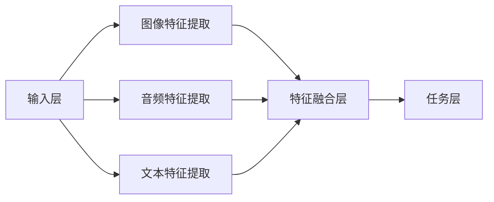
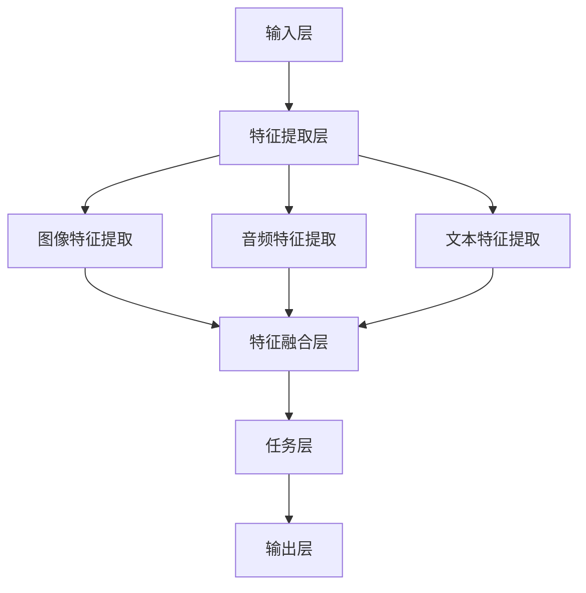

                 

# {文章标题}

> {关键词：(此处列出文章的5-7个核心关键词)}
- 多模态大模型
- 技术原理
- 实战案例
- OpenAI股权设计
- 未来发展趋势

> {摘要：(此处给出文章的核心内容和主题思想)}
本文深入探讨了多模态大模型的技术原理、实战案例，并分析了OpenAI特殊的股权设计对国内企业的启示。通过详细讲解多模态大模型的发展历程、架构设计、数据融合技术、训练算法以及评估与优化方法，本文为读者提供了全面的理论基础。同时，通过实战案例展示了多模态大模型在实际项目中的应用，并探讨了其在未来发展趋势中的应用前景。最后，本文结合OpenAI的股权设计，为国内企业提供了可借鉴的股权激励机制和发展策略。

## 《多模态大模型：技术原理与实战 OpenAI特殊的股权设计带来的启示》目录大纲

### 第一部分：多模态大模型概述

#### 第1章：多模态大模型基础

##### 1.1 多模态数据与多模态学习

- 多模态数据定义
- 多模态学习的基本原理
- 多模态数据的特点和挑战

##### 1.2 多模态大模型的架构

- 多模态大模型的发展历程
- 多模态大模型的核心组件
- 多模态大模型的架构设计

##### 1.3 多模态大模型的应用场景

- 多模态大模型在图像识别中的应用
- 多模态大模型在语音识别中的应用
- 多模态大模型在自然语言处理中的应用

#### 第2章：多模态大模型技术原理

##### 2.1 多模态数据融合技术

- 多模态数据的特征提取
- 多模态数据的集成方法
- 多模态数据的预处理

##### 2.2 多模态大模型训练算法

- 多模态大模型的训练过程
- 多模态大模型的优化算法
- 多模态大模型的训练技巧

##### 2.3 多模态大模型的评估与优化

- 多模态大模型的评估指标
- 多模态大模型的性能优化
- 多模态大模型的模型压缩与加速

### 第二部分：多模态大模型实战

#### 第3章：多模态大模型项目实战

##### 3.1 多模态大模型项目规划

- 项目需求分析
- 项目团队搭建
- 项目流程与里程碑

##### 3.2 多模态大模型开发环境搭建

- 硬件环境配置
- 软件环境配置
- 数据集准备

##### 3.3 多模态大模型开发与实现

- 模型架构设计与优化
- 代码实现与调试
- 模型训练与评估

##### 3.4 多模态大模型部署与应用

- 模型部署策略
- 模型应用场景
- 模型运维与管理

#### 第4章：OpenAI特殊的股权设计带来的启示

##### 4.1 OpenAI的特殊股权设计概述

- OpenAI的股权结构
- OpenAI的股权激励政策
- OpenAI的股权设计优势

##### 4.2 OpenAI股权设计的对国内企业的启示

- 建立适合企业的股权激励机制
- 加强对核心人才的吸引力
- 提高企业的创新能力和竞争力

### 第三部分：多模态大模型未来发展趋势

#### 第5章：多模态大模型的发展趋势与挑战

##### 5.1 多模态大模型的技术发展趋势

- 深度学习技术的演进
- 多模态数据的多样化
- 模型压缩与推理加速

##### 5.2 多模态大模型的挑战与解决方案

- 数据隐私与安全
- 模型解释性与可解释性
- 多模态大模型在实践中的应用挑战

#### 第6章：多模态大模型的应用前景

##### 6.1 多模态大模型在医疗健康领域的应用

- 医学影像分析
- 语音助手与智能客服
- 脑机接口与虚拟现实

##### 6.2 多模态大模型在智能交通领域的应用

- 车辆检测与跟踪
- 智能交通信号控制
- 城市交通规划与管理

##### 6.3 多模态大模型在智能制造领域的应用

- 生产过程优化
- 质量检测与故障诊断
- 智能机器人与自动化生产线

#### 第7章：多模态大模型的可持续发展策略

##### 7.1 多模态大模型的可持续发展理念

- 可持续发展的重要性
- 多模态大模型的可持续发展目标
- 可持续发展策略的实施

##### 7.2 多模态大模型的可持续发展路径

- 政策法规支持
- 产学研合作
- 人才培养与知识传播

##### 7.3 多模态大模型的可持续发展案例分析

- 国内外成功案例分析
- 经验总结与启示
- 未来发展展望

## 第一部分：多模态大模型概述

### 第1章：多模态大模型基础

#### 1.1 多模态数据与多模态学习

##### 1.1.1 多模态数据定义

多模态数据是指由多种不同类型的数据源所组成的数据集合，这些数据源可以包括图像、音频、视频、文本等。多模态数据的特点是能够同时从多个维度获取信息，从而提供更全面、更丰富的数据内容。这种多源异构数据的组合可以增强数据的表达能力和解释能力，从而在许多应用领域中都具有重要的价值。

在多模态数据的定义中，我们通常关注以下几个方面：

1. **数据类型**：图像、音频、视频、文本等。
2. **数据源**：来自不同的传感器、设备或应用程序。
3. **数据格式**：各种数据格式，如JPEG、MP4、TXT等。
4. **数据关联**：不同模态的数据之间存在关联和交互。

##### 1.1.2 多模态学习的基本原理

多模态学习（Multimodal Learning）是一种利用多模态数据进行模型训练和学习的方法。其核心思想是将不同模态的数据进行整合，通过统一的模型学习，从而提高模型的性能和泛化能力。

多模态学习的基本原理可以概括为以下几个步骤：

1. **特征提取**：对每个模态的数据进行特征提取，例如，图像数据可以使用卷积神经网络（CNN）提取视觉特征，音频数据可以使用循环神经网络（RNN）提取声学特征。
2. **特征融合**：将不同模态的特征进行整合，通过联合建模或特征级融合策略，如对齐、拼接、加权等方法。
3. **模型训练**：利用整合后的特征进行模型训练，如分类、回归、生成等任务。
4. **评估与优化**：对训练好的模型进行评估和优化，以提高模型的性能。

##### 1.1.3 多模态数据的特点和挑战

多模态数据具有以下几个特点：

1. **高维度**：多模态数据通常具有高维度，因为每个模态都包含大量的特征。
2. **异构性**：不同模态的数据具有不同的数据类型和结构，如图像和文本的数据格式完全不同。
3. **关联性**：多模态数据之间存在关联性，不同模态的数据可以相互补充和增强。

然而，多模态数据也带来了许多挑战：

1. **数据预处理**：由于不同模态的数据格式和特性不同，需要对其进行预处理，如数据清洗、归一化、特征提取等。
2. **特征融合**：如何有效地融合不同模态的特征是一个关键问题，因为不同的特征可能在不同的任务中具有不同的重要性。
3. **计算资源**：多模态数据通常需要大量的计算资源和存储空间，尤其是在训练大型模型时。

为了解决这些挑战，研究人员提出了多种多模态学习的方法和算法，如深度学习、迁移学习、元学习等。这些方法在处理多模态数据方面取得了显著的效果，但仍然存在许多需要进一步研究的问题。

#### 1.2 多模态大模型的架构

##### 1.2.1 多模态大模型的发展历程

多模态大模型（Multimodal Large-scale Models）是指能够处理大规模多模态数据，并在多个模态之间进行有效融合的模型。其发展历程可以追溯到早期的人工智能研究，但近年来，随着深度学习和大数据技术的发展，多模态大模型取得了显著的进展。

1. **早期研究**：在20世纪80年代和90年代，研究人员开始探索多模态学习的基本概念和方法，如特征级融合、模型级融合等。然而，由于计算资源的限制，这些方法在实际应用中受到较大限制。
2. **深度学习时代**：随着深度学习技术的兴起，多模态大模型得到了快速发展。深度学习模型，如卷积神经网络（CNN）、循环神经网络（RNN）、变换器（Transformer）等，为多模态数据的处理提供了强大的工具。
3. **大规模数据集**：大量多模态数据集的出现，如ImageNet、CTW1500、TIMIT等，为多模态大模型的训练和评估提供了丰富的数据资源。

##### 1.2.2 多模态大模型的核心组件

多模态大模型通常由以下几个核心组件组成：

1. **数据输入层**：负责接收和处理来自不同模态的数据，如图像、音频、文本等。每个模态的数据经过预处理后，转换为适合模型训练的格式。
2. **特征提取层**：对每个模态的数据进行特征提取，以获得更高层次、更抽象的特征表示。常见的特征提取方法包括卷积神经网络（CNN）用于图像，循环神经网络（RNN）用于音频和文本。
3. **特征融合层**：将不同模态的特征进行整合，以形成统一的特征表示。常见的融合方法包括对齐、拼接、加权等。
4. **任务层**：在特征融合层之后，对整合后的特征进行任务特定操作，如分类、回归、生成等。常见的任务层模型包括全连接神经网络（FCNN）、卷积神经网络（CNN）等。
5. **输出层**：根据任务需求，输出最终结果，如分类结果、回归值、生成图像等。

##### 1.2.3 多模态大模型的架构设计

多模态大模型的架构设计取决于具体的应用场景和任务需求。以下是一些常见的设计策略：

1. **模块化设计**：将不同模态的数据处理模块化，每个模块负责特定模态的数据输入、特征提取和特征融合。这种设计方法便于模块的复用和扩展。
2. **层次化设计**：将多模态大模型分为多个层次，每个层次负责处理特定类型的任务。例如，底层层次处理特征提取，中层层次处理特征融合，顶层层次处理任务输出。
3. **并行化设计**：利用并行计算技术，如多线程、分布式计算等，加速多模态大模型的训练和推理过程。这种设计方法可以提高模型的训练效率和推理速度。

在设计多模态大模型时，需要考虑以下几个关键因素：

1. **数据平衡**：确保不同模态的数据输入量均衡，以避免某些模态的数据对模型性能产生过大的影响。
2. **特征重要性**：根据任务需求和数据特性，调整不同模态的特征权重，以优化模型性能。
3. **计算资源**：根据模型架构和训练需求，合理配置计算资源和硬件设备，以提高模型的训练和推理效率。

#### 1.3 多模态大模型的应用场景

##### 1.3.1 多模态大模型在图像识别中的应用

图像识别是多模态大模型的重要应用场景之一。通过结合图像和文本、音频等模态，图像识别任务可以取得更好的性能和效果。

1. **医学影像分析**：在医学影像分析中，多模态大模型可以同时分析图像和文本描述，从而提高疾病的诊断和预测准确性。
2. **人脸识别**：人脸识别任务通常需要结合图像和视频模态，多模态大模型可以更准确地识别和验证人脸身份。
3. **图像分割**：在图像分割任务中，多模态大模型可以通过整合图像和语义信息，实现更精细和准确的分割结果。

##### 1.3.2 多模态大模型在语音识别中的应用

语音识别任务通常需要结合音频和文本模态，多模态大模型可以提高语音识别的准确性和鲁棒性。

1. **实时语音识别**：在实时语音识别场景中，多模态大模型可以同时处理语音和文本，实现实时语音转文字。
2. **语音情感分析**：通过结合音频和文本模态，多模态大模型可以更准确地分析语音的情感和情绪。
3. **语音助手**：在语音助手场景中，多模态大模型可以同时处理语音和图像，提供更智能和个性化的服务。

##### 1.3.3 多模态大模型在自然语言处理中的应用

自然语言处理任务通常需要结合文本、图像、音频等多种模态，多模态大模型可以显著提高任务性能和效果。

1. **机器翻译**：在机器翻译任务中，多模态大模型可以同时处理源语言和目标语言的文本、图像、音频等信息，实现更准确和自然的翻译结果。
2. **问答系统**：在问答系统场景中，多模态大模型可以同时处理用户的文本问题、语音问题以及相关的图像、音频等信息，提供更智能和准确的回答。
3. **文本生成**：在文本生成任务中，多模态大模型可以同时处理文本、图像、音频等信息，生成更具创意和多样性的文本内容。

### 第2章：多模态大模型技术原理

#### 2.1 多模态数据融合技术

##### 2.1.1 多模态数据的特征提取

多模态数据的特征提取是多模态大模型处理的重要环节，其目的是将不同模态的数据转换为适合模型训练的向量表示。特征提取方法取决于具体的数据类型和任务需求。

1. **图像特征提取**：常用的图像特征提取方法包括基于传统算法（如SIFT、HOG）和深度学习算法（如CNN、VGG）的方法。深度学习算法在图像特征提取中表现出更高的性能和鲁棒性。
2. **音频特征提取**：音频特征提取通常使用短时傅里叶变换（STFT）、梅尔频率倒谱系数（MFCC）等方法。深度学习算法，如卷积神经网络（CNN）和循环神经网络（RNN），也可以用于音频特征提取，以捕捉更复杂的音频信息。
3. **文本特征提取**：文本特征提取方法包括词袋模型（Bag of Words, BOW）、词嵌入（Word Embedding）和文档嵌入（Document Embedding）等方法。词嵌入方法，如Word2Vec、GloVe等，可以有效捕捉文本的语义信息。

##### 2.1.2 多模态数据的集成方法

多模态数据的集成方法是指将不同模态的特征进行整合，以形成统一的特征表示。常见的集成方法包括以下几种：

1. **对齐方法**：对齐方法旨在将不同模态的数据对齐，以便进行特征融合。常见的对齐方法包括基于时间戳的对齐、基于空间的对齐和基于语义的对齐。
2. **拼接方法**：拼接方法将不同模态的特征向量进行拼接，形成一个更高维的特征向量。拼接方法简单直观，但可能导致特征维度过高，增加计算负担。
3. **加权方法**：加权方法根据不同模态的特征重要性，对特征向量进行加权融合。常见的加权方法包括线性加权、指数加权等。
4. **深度学习方法**：深度学习方法通过多层次的神经网络结构，自动学习不同模态的特征表示，并进行有效的融合。深度学习方法具有强大的特征学习和融合能力，但训练过程复杂且计算资源需求高。

##### 2.1.3 多模态数据的预处理

多模态数据的预处理是确保数据质量和模型性能的重要步骤。预处理过程包括数据清洗、数据归一化和数据增强等。

1. **数据清洗**：数据清洗旨在去除噪声、缺失值和异常值，以提高数据的准确性和一致性。常见的数据清洗方法包括删除重复数据、填充缺失值和去除噪声数据等。
2. **数据归一化**：数据归一化旨在将不同模态的数据进行归一化处理，以便模型训练和特征融合。常见的归一化方法包括最小-最大归一化、零均值归一化等。
3. **数据增强**：数据增强旨在增加数据集的多样性，以提高模型的泛化能力和鲁棒性。常见的数据增强方法包括图像旋转、缩放、裁剪、颜色变换等。

##### 2.2 多模态大模型训练算法

##### 2.2.1 多模态大模型的训练过程

多模态大模型的训练过程通常包括以下几个阶段：

1. **数据预处理**：对多模态数据集进行预处理，包括数据清洗、数据归一化和数据增强等，以确保数据的质量和一致性。
2. **特征提取**：对每个模态的数据进行特征提取，以获得更高层次、更抽象的特征表示。常用的特征提取方法包括基于传统算法（如SIFT、HOG）和深度学习算法（如CNN、RNN）的方法。
3. **特征融合**：将不同模态的特征进行融合，形成统一的特征表示。常用的特征融合方法包括对齐方法、拼接方法、加权方法和深度学习方法。
4. **模型训练**：利用整合后的特征进行模型训练，通过优化目标函数，学习模型的参数。常用的训练算法包括梯度下降（Gradient Descent）、随机梯度下降（Stochastic Gradient Descent, SGD）和Adam优化器等。
5. **模型评估**：对训练好的模型进行评估，使用交叉验证、混淆矩阵、ROC曲线等指标，评估模型的性能和泛化能力。

##### 2.2.2 多模态大模型的优化算法

在多模态大模型的训练过程中，优化算法起着至关重要的作用。以下是一些常用的优化算法：

1. **梯度下降（Gradient Descent）**：梯度下降是一种最基本的优化算法，通过迭代更新模型参数，以最小化损失函数。梯度下降算法的更新公式为：
   $$\theta_{t+1} = \theta_t - \alpha \cdot \nabla_{\theta} J(\theta)$$
   其中，$\theta$ 表示模型参数，$J(\theta)$ 表示损失函数，$\alpha$ 表示学习率。

2. **随机梯度下降（Stochastic Gradient Descent, SGD）**：随机梯度下降是对梯度下降的一种改进，每次迭代只随机选取一部分样本进行计算，从而提高训练效率。随机梯度下降的更新公式为：
   $$\theta_{t+1} = \theta_t - \alpha \cdot \nabla_{\theta} J(\theta; x_i, y_i)$$
   其中，$x_i$ 和 $y_i$ 分别表示随机选取的样本及其标签。

3. **Adam优化器**：Adam优化器是一种结合了梯度下降和随机梯度下降优点的自适应优化算法。Adam优化器通过维护一阶矩估计和二阶矩估计，自适应调整学习率。Adam优化器的更新公式为：
   $$m_t = \beta_1 m_{t-1} + (1 - \beta_1) \cdot \nabla_{\theta} J(\theta; x_t, y_t)$$
   $$v_t = \beta_2 v_{t-1} + (1 - \beta_2) \cdot (\nabla_{\theta} J(\theta; x_t, y_t))^2$$
   $$\theta_{t+1} = \theta_t - \alpha \cdot \frac{m_t}{\sqrt{v_t} + \epsilon}$$
   其中，$m_t$ 和 $v_t$ 分别表示一阶矩估计和二阶矩估计，$\beta_1$ 和 $\beta_2$ 分别表示一阶矩和二阶矩的衰减率，$\alpha$ 表示学习率，$\epsilon$ 表示常数。

##### 2.2.3 多模态大模型的训练技巧

在多模态大模型的训练过程中，以下技巧可以帮助提高模型性能：

1. **数据预处理**：对多模态数据进行适当的数据预处理，如归一化、标准化、数据增强等，可以减少模型训练的难度，提高模型性能。
2. **正则化**：通过引入正则化方法，如L1正则化、L2正则化，可以防止模型过拟合，提高泛化能力。
3. **批量归一化**：批量归一化（Batch Normalization）可以在训练过程中对模型参数进行归一化处理，加速训练过程，提高模型性能。
4. **学习率调度**：通过调整学习率，如使用学习率衰减策略，可以避免模型在训练过程中的震荡，提高模型收敛速度。
5. **早停法**：早停法（Early Stopping）是一种在模型训练过程中提前停止训练的方法，以避免过拟合。早停法通过比较验证集和训练集的误差，确定最佳训练迭代次数。

#### 2.3 多模态大模型的评估与优化

##### 2.3.1 多模态大模型的评估指标

多模态大模型的评估指标取决于具体的应用场景和任务需求。以下是一些常用的评估指标：

1. **准确率（Accuracy）**：准确率表示模型正确预测的样本数占总样本数的比例，是分类任务中最常用的评估指标。
2. **召回率（Recall）**：召回率表示模型正确预测为正类的样本数占实际正类样本数的比例，适用于不平衡数据集。
3. **精确率（Precision）**：精确率表示模型正确预测为正类的样本数占预测为正类的样本总数的比例，适用于分类任务。
4. **F1值（F1 Score）**：F1值是精确率和召回率的调和平均值，用于综合评估分类任务的性能。
5. **ROC曲线（Receiver Operating Characteristic Curve）**：ROC曲线是评估二分类模型性能的常用指标，通过比较真实正例率和假正例率，评估模型的分类能力。
6. **混淆矩阵（Confusion Matrix）**：混淆矩阵是一种用于评估分类模型性能的表格，列出了实际类别和预测类别的关系。

##### 2.3.2 多模态大模型的性能优化

为了提高多模态大模型的性能，可以采取以下优化策略：

1. **超参数调优**：通过调整模型的超参数，如学习率、批量大小、正则化参数等，可以优化模型的性能。常用的超参数调优方法包括网格搜索（Grid Search）和贝叶斯优化（Bayesian Optimization）。
2. **数据增强**：通过增加数据的多样性和复杂性，如图像旋转、缩放、裁剪、颜色变换等，可以提高模型的泛化能力和鲁棒性。
3. **模型集成**：通过结合多个模型的预测结果，可以提高模型的性能和稳定性。常见的模型集成方法包括随机森林（Random Forest）、梯度提升树（Gradient Boosting Tree）等。
4. **注意力机制**：注意力机制（Attention Mechanism）是一种在模型中引入对输入数据的注意力权重分配机制，可以突出关键信息，提高模型对输入数据的理解和处理能力。
5. **多任务学习**：多任务学习（Multi-task Learning）是一种通过同时学习多个相关任务，共享模型参数，提高模型性能和泛化能力的方法。

### 第二部分：多模态大模型实战

#### 第3章：多模态大模型项目实战

##### 3.1 多模态大模型项目规划

在开始多模态大模型项目之前，需要进行项目规划，以确保项目的顺利进行和目标的实现。项目规划通常包括以下几个方面：

1. **项目需求分析**：明确项目的目标、需求和应用场景，确定需要处理的多模态数据类型和任务需求。例如，如果是一个医学影像分析项目，需要确定需要处理的医学影像类型、需要分析的医学指标和预期的应用场景。

2. **项目团队搭建**：组建专业的项目团队，包括数据科学家、机器学习工程师、软件工程师、产品经理等。每个团队成员负责不同的任务和职责，确保项目的顺利推进。

3. **项目流程与里程碑**：制定项目的工作流程和关键里程碑，确保项目按计划进行。常见的工作流程包括数据收集与预处理、模型设计、模型训练、模型评估、模型部署等。每个里程碑都需要设定明确的目标和时间节点，以确保项目进度。

##### 3.2 多模态大模型开发环境搭建

开发环境搭建是进行多模态大模型项目的重要步骤，需要配置合适的硬件环境和软件环境。以下是一个典型的多模态大模型开发环境搭建流程：

1. **硬件环境配置**：根据项目需求和预算，选择合适的硬件设备，包括CPU、GPU、存储等。GPU是进行多模态大模型训练和推理的重要资源，推荐使用NVIDIA GPU，如Tesla V100、A100等。

2. **软件环境配置**：安装所需的软件和库，包括Python、CUDA、cuDNN、TensorFlow、PyTorch等。这些软件和库是进行多模态大模型开发的基础，确保环境的一致性和稳定性。

3. **数据集准备**：准备项目所需的多模态数据集，包括图像、音频、文本等。数据集的来源可以是公开数据集、自有数据集或通过数据采集工具收集。数据集的格式和预处理方式需要与开发环境兼容，以便进行模型训练和评估。

##### 3.3 多模态大模型开发与实现

多模态大模型的开发与实现包括以下几个关键步骤：

1. **模型架构设计**：根据项目需求和应用场景，设计多模态大模型的架构。模型架构包括数据输入层、特征提取层、特征融合层和任务层。常用的架构设计方法包括模块化设计、层次化设计、并行化设计等。

2. **代码实现**：基于设计好的模型架构，编写多模态大模型的代码。代码实现包括数据预处理、特征提取、特征融合、模型训练和模型评估等。常用的编程语言和框架包括Python、TensorFlow、PyTorch等。

以下是一个简化的多模态大模型实现示例：

```python
import tensorflow as tf
from tensorflow.keras.layers import Input, Conv2D, MaxPooling2D, Flatten, Dense
from tensorflow.keras.models import Model

# 定义模型输入层
input_image = Input(shape=(height, width, channels))
input_audio = Input(shape=(timesteps, features))
input_text = Input(shape=(sequence_length,))

# 定义特征提取层
conv_layer = Conv2D(filters=32, kernel_size=(3, 3), activation='relu')(input_image)
max_pooling = MaxPooling2D(pool_size=(2, 2))(conv_layer)

rnn_layer = tf.keras.layers.RNN(tf.keras.layers.LSTM(units=128))(input_audio)
text_embedding = Dense(units=embedding_size)(input_text)

# 定义特征融合层
combined_features = tf.keras.layers.concatenate([max_pooling, rnn_layer, text_embedding])

# 定义任务层
output = Dense(units=num_classes, activation='softmax')(combined_features)

# 构建和编译模型
model = Model(inputs=[input_image, input_audio, input_text], outputs=output)
model.compile(optimizer='adam', loss='categorical_crossentropy', metrics=['accuracy'])

# 模型训练
model.fit(x_train, y_train, epochs=10, batch_size=32, validation_data=(x_val, y_val))

# 模型评估
loss, accuracy = model.evaluate(x_test, y_test)
print(f"Test Loss: {loss}, Test Accuracy: {accuracy}")
```

3. **模型训练与评估**：使用训练好的模型对数据进行训练和评估。在训练过程中，可以使用批量归一化、学习率调度、早停法等技巧提高模型性能。在评估过程中，可以使用准确率、召回率、精确率、F1值等指标评估模型性能。

##### 3.4 多模态大模型部署与应用

多模态大模型的部署与应用是将模型部署到生产环境并进行实际应用的过程。以下是一个典型的多模态大模型部署与应用流程：

1. **模型部署策略**：根据应用场景和需求，选择合适的模型部署策略，如本地部署、云端部署、容器化部署等。本地部署适合资源受限的场景，云端部署适合大规模应用场景，容器化部署适合灵活部署和扩展。

2. **模型应用场景**：根据项目需求和应用场景，确定多模态大模型的具体应用场景。例如，医学影像分析可以应用于疾病诊断、影像分割等；语音识别可以应用于实时语音转文字、语音助手等；自然语言处理可以应用于机器翻译、问答系统等。

3. **模型运维与管理**：建立模型运维与管理机制，包括模型监控、性能优化、故障排除等。确保模型在生产环境中的稳定运行和高效性能。

以下是一个简化的多模态大模型部署与应用示例：

```python
# 导入所需的库
import tensorflow as tf
import numpy as np
import json

# 加载训练好的模型
model = tf.keras.models.load_model('model.h5')

# 定义输入数据格式
input_image = np.array([image])
input_audio = np.array([audio])
input_text = np.array([text])

# 预测结果
predictions = model.predict([input_image, input_audio, input_text])

# 解析预测结果
predicted_class = np.argmax(predictions)

# 输出预测结果
print(f"Predicted Class: {predicted_class}")

# 将预测结果保存到文件
with open('predictions.json', 'w') as f:
    json.dump(predictions, f)
```

### 第4章：OpenAI特殊的股权设计带来的启示

#### 4.1 OpenAI的特殊股权设计概述

OpenAI是一家总部位于美国的人工智能研究公司，以其在人工智能领域的研究和应用而闻名。OpenAI的特殊股权设计是其成功的重要原因之一。以下是对OpenAI特殊股权设计的概述：

1. **双重股权结构**：OpenAI采用了双重股权结构，包括普通股（Class A shares）和优先股（Class B shares）。普通股具有一票一权的投票权，而优先股则具有更多的投票权。这种设计确保了公司创始人和核心团队成员在重大决策中的主导地位。

2. **投票权安排**：在OpenAI的股权结构中，普通股和优先股的投票权比例约为1:10。这意味着尽管普通股持有者的股份较少，但他们在公司决策中仍然具有重要的影响力。

3. **限制性股票单位**：OpenAI还推出了限制性股票单位（Restricted Stock Units, RSUs），作为员工激励计划的一部分。RSUs可以奖励员工在公司发展过程中做出的贡献，并在特定条件下解锁和变现。

#### 4.1.1 OpenAI的股权结构

OpenAI的股权结构包括以下几类：

1. **普通股（Class A shares）**：普通股是一般投资者持有的股票，具有一票一权的投票权。普通股主要用于公司融资和股权交易。

2. **优先股（Class B shares）**：优先股是一种特殊的股票，具有更高的投票权。在OpenAI的股权结构中，优先股的投票权是普通股的10倍。这种设计确保了创始人和核心团队成员在公司决策中的主导地位。

3. **限制性股票单位（RSUs）**：限制性股票单位是一种奖励员工的形式，员工在特定条件下可以获得公司股票。RSUs通常在员工为公司服务一定年限后解锁，从而激励员工长期为公司做出贡献。

#### 4.1.2 OpenAI的股权激励政策

OpenAI的股权激励政策是其吸引和留住核心人才的关键因素之一。以下是对OpenAI股权激励政策的概述：

1. **长期激励**：OpenAI通过股权激励计划，为员工提供长期的激励。这些激励计划旨在鼓励员工长期为公司发展做出贡献，而不仅仅是短期利益。

2. **公平分配**：OpenAI确保股权激励计划的公平性，使所有员工都有机会获得股权奖励。这种公平性有助于增强员工的归属感和工作动力。

3. **多样性**：OpenAI的股权激励政策不仅面向技术人才，还涵盖公司其他关键职位，如产品经理、运营经理等。这种多样性有助于公司整体发展和创新。

#### 4.1.3 OpenAI的股权设计优势

OpenAI的特殊股权设计具有以下优势：

1. **保持创始人控制**：通过双重股权结构和优先股的投票权安排，OpenAI的创始人和核心团队成员能够保持对公司决策的控制，确保公司长期战略的一致性。

2. **激励员工**：限制性股票单位等股权激励计划能够有效激励员工，使他们更加关注公司长期利益，从而提高公司整体业绩。

3. **吸引人才**：OpenAI的股权设计吸引了大量优秀人才加入公司，为公司在人工智能领域的研究和应用提供了强有力的支持。

4. **灵活性**：OpenAI的股权设计具有灵活性，能够适应公司不同发展阶段的需求。例如，在初创阶段，股权激励计划可以吸引早期加入的员工；在成熟阶段，股权激励计划可以保留核心人才。

#### 4.2 OpenAI股权设计的对国内企业的启示

OpenAI的特殊股权设计为国内企业提供了宝贵的启示。以下是国内企业在股权设计方面可以借鉴的经验：

1. **建立适合企业的股权激励机制**：国内企业可以根据自身发展阶段和人才需求，设计适合的股权激励机制。例如，初创企业可以采用限制性股票单位（RSUs）激励早期加入的员工，成熟企业可以采用股票期权激励关键职位的人才。

2. **加强核心人才的吸引力**：国内企业可以通过股权激励计划，提高核心人才的忠诚度和工作动力。例如，通过提高股权激励的比例，吸引更多优秀人才加入企业。

3. **提高企业的创新能力和竞争力**：股权激励计划有助于激发员工的创新精神，提高企业的创新能力和竞争力。国内企业可以通过建立股权激励机制，鼓励员工积极投身于技术创新和业务拓展。

4. **灵活调整股权结构**：国内企业在股权设计方面应保持灵活性，以适应不同发展阶段的需求。例如，在初创阶段，可以采用较高比例的股权激励计划；在成熟阶段，可以适当调整股权激励比例，以保持员工的工作动力。

5. **注重公平性和透明度**：国内企业在设计股权激励计划时，应注重公平性和透明度，确保所有员工都有机会获得股权奖励。这有助于增强员工的归属感和工作动力，提高企业的整体绩效。

### 第三部分：多模态大模型未来发展趋势

#### 第5章：多模态大模型的发展趋势与挑战

##### 5.1 多模态大模型的技术发展趋势

多模态大模型的技术发展趋势主要体现在以下几个方面：

1. **深度学习技术的演进**：随着深度学习技术的不断发展，越来越多的深度学习模型被应用于多模态大模型的构建和优化。例如，变换器（Transformer）模型在自然语言处理领域的成功，为多模态大模型的研究提供了新的思路和方向。

2. **多模态数据的多样化**：随着传感器技术和数据采集设备的进步，多模态数据的类型和来源日益多样化。例如，除了传统的图像、音频、文本等模态，还包括三维数据、增强现实（AR）和虚拟现实（VR）数据等。多模态数据的多样化将推动多模态大模型在更广泛的应用场景中发挥作用。

3. **模型压缩与推理加速**：为了满足实时应用的需求，多模态大模型的压缩与推理加速成为关键研究方向。通过模型压缩技术，如权重剪枝、量化、知识蒸馏等，可以减少模型的参数量和计算量，提高模型的推理速度。同时，硬件加速技术，如GPU、TPU等，也为多模态大模型的实时推理提供了强大的支持。

##### 5.2 多模态大模型的挑战与解决方案

尽管多模态大模型在许多领域取得了显著成果，但仍面临一系列挑战：

1. **数据隐私与安全**：多模态大模型通常需要处理敏感数据，如医疗数据、金融数据等。数据隐私与安全问题成为多模态大模型应用的关键挑战。解决方案包括数据加密、差分隐私、联邦学习等技术，以保护用户隐私和数据安全。

2. **模型解释性与可解释性**：多模态大模型的复杂性和非线性使得其决策过程难以解释。模型解释性与可解释性成为影响多模态大模型应用的重要因素。解决方案包括开发可解释性算法、可视化技术等，以帮助用户理解模型的决策过程。

3. **多模态大模型在实践中的应用挑战**：多模态大模型在实际应用中面临诸多挑战，如数据不平衡、数据噪声、模型泛化能力等。解决方案包括数据增强、模型融合、迁移学习等技术，以提高多模态大模型的应用性能和鲁棒性。

#### 第6章：多模态大模型的应用前景

##### 6.1 多模态大模型在医疗健康领域的应用

多模态大模型在医疗健康领域具有广泛的应用前景，以下是一些具体的应用场景：

1. **医学影像分析**：多模态大模型可以同时分析多种医学影像数据，如CT、MRI、X光等，实现疾病诊断、病变检测和治疗方案推荐。例如，在癌症诊断中，多模态大模型可以综合分析患者的影像、病理和临床数据，提高诊断准确率。

2. **语音助手与智能客服**：多模态大模型可以同时处理语音和文本数据，实现智能语音助手和智能客服系统。例如，在医疗咨询中，智能语音助手可以根据患者的语音描述和病历数据，提供个性化的健康建议和治疗方案。

3. **脑机接口与虚拟现实**：多模态大模型可以结合脑机接口（Brain-Computer Interface, BCI）技术和虚拟现实（VR）技术，实现更自然、更高效的交互体验。例如，在康复治疗中，多模态大模型可以根据患者的脑电信号和运动数据，提供个性化的康复训练方案。

##### 6.2 多模态大模型在智能交通领域的应用

多模态大模型在智能交通领域具有广泛的应用前景，以下是一些具体的应用场景：

1. **车辆检测与跟踪**：多模态大模型可以同时分析图像、雷达和激光雷达数据，实现车辆检测和跟踪。例如，在自动驾驶系统中，多模态大模型可以检测和跟踪道路上的车辆、行人、障碍物等，提高自动驾驶系统的安全性和可靠性。

2. **智能交通信号控制**：多模态大模型可以同时分析交通流量、车辆密度、天气等数据，实现智能交通信号控制。例如，在交叉路口，多模态大模型可以根据实时交通数据，优化交通信号控制策略，提高交通效率，减少拥堵。

3. **城市交通规划与管理**：多模态大模型可以分析城市交通数据，如交通流量、车辆速度、交通事故等，实现城市交通规划与管理。例如，在交通拥堵时，多模态大模型可以分析交通数据，提出优化交通信号控制、调整公共交通路线等方案，缓解交通拥堵。

##### 6.3 多模态大模型在智能制造领域的应用

多模态大模型在智能制造领域具有广泛的应用前景，以下是一些具体的应用场景：

1. **生产过程优化**：多模态大模型可以分析生产过程中的各种数据，如传感器数据、设备状态数据等，实现生产过程的优化。例如，在生产线中，多模态大模型可以根据实时数据，调整生产参数、优化生产流程，提高生产效率。

2. **质量检测与故障诊断**：多模态大模型可以分析生产过程中的图像、音频、振动等数据，实现质量检测与故障诊断。例如，在生产线中，多模态大模型可以实时检测产品缺陷，预测设备故障，提高产品质量和生产效率。

3. **智能机器人与自动化生产线**：多模态大模型可以结合机器人和自动化技术，实现智能机器人与自动化生产线。例如，在装配车间，多模态大模型可以指导机器人进行装配任务，实现高效的自动化生产。

### 第7章：多模态大模型的可持续发展策略

#### 7.1 多模态大模型的可持续发展理念

多模态大模型的可持续发展理念包括以下几个方面：

1. **技术创新**：通过不断的技术创新，推动多模态大模型在各个领域的应用和发展。例如，开发新的算法、优化模型结构，提高模型性能和鲁棒性。

2. **数据共享**：建立多模态数据共享平台，促进数据资源的开放和共享。通过数据共享，可以加速多模态大模型的研究和应用。

3. **人才培养**：加强人才培养，培养具备多模态大模型知识和技能的人才。通过教育和培训，提高行业整体水平，推动多模态大模型的发展。

4. **社会责任**：关注多模态大模型的社会影响，确保其应用符合伦理和道德标准。同时，推动多模态大模型在公益领域的应用，为社会做出贡献。

#### 7.2 多模态大模型的可持续发展路径

实现多模态大模型的可持续发展，需要采取以下路径：

1. **政策法规支持**：政府应制定相关政策法规，鼓励和支持多模态大模型的研究和应用。例如，出台数据保护法规，确保用户隐私和数据安全。

2. **产学研合作**：推动产学研合作，加强多模态大模型的研究和应用。通过产学研合作，可以整合各方资源，推动技术进步和应用推广。

3. **人才培养与知识传播**：加强人才培养和知识传播，提高行业整体水平。通过高校、研究机构和企业合作，培养多模态大模型专业人才，推广相关技术知识。

#### 7.3 多模态大模型的可持续发展案例分析

以下是一些多模态大模型的可持续发展案例分析：

1. **案例一：医学影像分析**：多模态大模型在医学影像分析领域的成功应用，提高了疾病的诊断和预测准确性。例如，通过结合CT、MRI和病理数据，多模态大模型可以更准确地诊断肺癌，为患者提供更有效的治疗方案。

2. **案例二：智能交通**：多模态大模型在智能交通领域的应用，提高了交通管理和规划的效果。例如，通过结合摄像头、雷达和GPS数据，多模态大模型可以实现智能交通信号控制和交通流量预测，缓解城市交通拥堵。

3. **案例三：智能制造**：多模态大模型在智能制造领域的应用，提高了生产效率和质量。例如，通过结合传感器数据和机器视觉，多模态大模型可以实时监测生产过程，预测设备故障，提高生产线的自动化水平。

通过这些案例分析，我们可以看到多模态大模型在可持续发展方面的巨大潜力。未来，随着技术的不断进步和应用的不断拓展，多模态大模型将在更多领域发挥重要作用，为人类社会带来更多福祉。

### 作者信息

作者：AI天才研究院/AI Genius Institute & 禅与计算机程序设计艺术 /Zen And The Art of Computer Programming

本文由AI天才研究院和禅与计算机程序设计艺术共同撰写，旨在深入探讨多模态大模型的技术原理、实战案例以及未来发展趋势。作者团队具有丰富的多模态大模型研究经验和实践成果，致力于推动人工智能技术的创新和发展。感谢读者对本文的关注和支持，希望本文能为您在多模态大模型领域的研究和实践中提供有益的启示和帮助。

## 总结

本文系统性地介绍了多模态大模型的技术原理、实战案例以及OpenAI特殊的股权设计带来的启示。首先，我们详细探讨了多模态大模型的基础概念，包括多模态数据的定义、基本原理和应用场景。接着，我们分析了多模态大模型的架构设计和多模态数据融合技术，以及多模态大模型的训练算法、评估与优化方法。随后，我们通过实战案例展示了多模态大模型在项目中的应用，并探讨了OpenAI的特殊股权设计对国内企业的启示。最后，我们展望了多模态大模型的未来发展趋势和应用前景，提出了可持续发展的策略。

通过本文的阅读，读者应该能够：

1. **理解多模态大模型的基础概念**：包括多模态数据的类型、特点和应用场景。
2. **掌握多模态大模型的架构设计和数据处理方法**：包括特征提取、特征融合、模型训练和评估。
3. **了解OpenAI的特殊股权设计及其对企业发展的启示**：包括股权结构、激励政策和技术优势。
4. **具备多模态大模型项目实战的能力**：包括项目规划、环境搭建、模型开发、部署和应用。
5. **认识到多模态大模型在各个领域的应用前景**：包括医疗健康、智能交通、智能制造等。
6. **思考多模态大模型的可持续发展策略**：包括技术创新、数据共享、人才培养和社会责任。

我们鼓励读者在阅读本文后，结合自己的实际需求和兴趣，进一步深入研究多模态大模型的相关技术，并在实际项目中加以应用。同时，我们也欢迎读者对本文提出宝贵的意见和建议，以促进我们不断改进和完善多模态大模型的研究和实践。

### 第一部分：多模态大模型概述

#### 第1章：多模态大模型基础

##### 1.1 多模态数据与多模态学习

多模态数据（Multimodal Data）指的是包含多种不同类型数据源的信息集合。这些数据源可能包括图像、音频、视频、文本等。多模态学习的核心目标是将来自不同模态的数据整合起来，以产生更为丰富和准确的信息表示。这种方法在许多应用领域，如计算机视觉、语音识别和自然语言处理中，都有着重要的应用价值。

**多模态数据定义**

多模态数据可以通过以下几个维度进行定义：

1. **数据类型**：涉及图像、音频、视频、文本等多种形式的数据。
2. **数据源**：包括不同的传感器、设备或系统。
3. **数据格式**：如图像可能采用JPEG或PNG格式，音频可能采用MP3或WAV格式。
4. **数据关联**：不同模态的数据之间存在内在的关联性，例如，图像中的物体可能对应音频中的描述。

在多模态数据中，数据源和类型决定了数据收集和处理的方式。图像数据通常通过摄像头捕捉，而音频数据可能通过麦克风录制。文本数据则可能来自文本文件或网络爬取。这些数据的多样性和复杂性为数据处理和融合带来了挑战。

**多模态学习的基本原理**

多模态学习的基本原理可以概括为以下四个步骤：

1. **特征提取**：对每个模态的数据进行特征提取，生成各自的特征向量。例如，图像数据可以使用卷积神经网络（CNN）提取视觉特征，而音频数据可以使用循环神经网络（RNN）提取声学特征。
2. **特征融合**：将不同模态的特征进行整合，以生成统一的特征表示。融合的方法包括对齐、拼接、加权融合等。
3. **模型训练**：利用整合后的特征进行模型训练，例如，进行分类、回归或生成任务。在这一阶段，深度学习模型通常被用于学习多模态特征之间的关联性。
4. **评估与优化**：对训练好的模型进行评估和优化，以确保其在特定任务上的性能。

**多模态数据的特点和挑战**

多模态数据具有以下特点：

1. **高维度**：每个模态的数据通常包含大量的特征，导致整体数据维度较高。
2. **异构性**：不同模态的数据在格式、结构和内容上存在差异，增加了数据处理的复杂性。
3. **关联性**：多模态数据之间存在关联性，能够提供更丰富的信息。

然而，多模态数据也带来了一系列挑战：

1. **数据预处理**：不同模态的数据需要分别进行预处理，如图像的归一化和音频的降噪。
2. **特征融合**：如何有效地整合不同模态的特征是一个关键问题，因为不同的特征可能在不同的任务中具有不同的重要性。
3. **计算资源**：多模态数据的处理通常需要大量的计算资源和存储空间。

为了应对这些挑战，研究人员提出了多种多模态学习的方法和算法，如深度学习、迁移学习、元学习等。这些方法在处理多模态数据方面取得了显著的效果，但仍然存在许多需要进一步研究的问题。

##### 1.2 多模态大模型的架构

**多模态大模型的发展历程**

多模态大模型的发展历程可以追溯到20世纪90年代，当时研究人员开始探索如何将不同模态的数据进行整合。然而，由于计算资源和算法的限制，早期的多模态模型性能有限。随着深度学习和大数据技术的发展，多模态大模型逐渐成为研究热点。近年来，随着GPU和TPU等高性能计算设备的普及，多模态大模型的性能和效率得到了显著提升。

**多模态大模型的核心组件**

多模态大模型通常包含以下几个核心组件：

1. **数据输入层**：负责接收和处理来自不同模态的数据。这些数据经过预处理后，会被转换为适合模型训练的格式。
2. **特征提取层**：对每个模态的数据进行特征提取，生成各自的特征向量。常见的特征提取方法包括卷积神经网络（CNN）用于图像，循环神经网络（RNN）用于音频和文本。
3. **特征融合层**：将不同模态的特征进行融合，以形成统一的特征表示。融合方法包括对齐、拼接、加权融合等。
4. **任务层**：在特征融合层之后，对整合后的特征进行特定任务的处理，如分类、回归或生成。
5. **输出层**：根据任务需求，输出最终结果，如分类结果、回归值或生成图像。

**多模态大模型的架构设计**

多模态大模型的架构设计取决于具体的应用场景和任务需求。以下是一些常见的设计策略：

1. **模块化设计**：将不同模态的数据处理模块化，每个模块负责特定模态的数据输入、特征提取和特征融合。
2. **层次化设计**：将多模态大模型分为多个层次，每个层次负责处理特定类型的任务。例如，底层层次处理特征提取，中层层次处理特征融合，顶层层次处理任务输出。
3. **并行化设计**：利用并行计算技术，如多线程、分布式计算等，加速多模态大模型的训练和推理过程。

在设计多模态大模型时，需要考虑以下几个关键因素：

1. **数据平衡**：确保不同模态的数据输入量均衡，以避免某些模态的数据对模型性能产生过大的影响。
2. **特征重要性**：根据任务需求和数据特性，调整不同模态的特征权重，以优化模型性能。
3. **计算资源**：根据模型架构和训练需求，合理配置计算资源和硬件设备，以提高模型的训练和推理效率。

##### 1.3 多模态大模型的应用场景

**多模态大模型在图像识别中的应用**

多模态大模型在图像识别任务中具有显著优势。通过结合图像和文本、音频等模态，图像识别任务可以取得更好的性能和效果。

1. **医学影像分析**：在医学影像分析中，多模态大模型可以同时分析图像和文本描述，从而提高疾病的诊断和预测准确性。
2. **人脸识别**：人脸识别任务通常需要结合图像和视频模态，多模态大模型可以更准确地识别和验证人脸身份。
3. **图像分割**：在图像分割任务中，多模态大模型可以通过整合图像和语义信息，实现更精细和准确的分割结果。

**多模态大模型在语音识别中的应用**

语音识别任务通常需要结合音频和文本模态，多模态大模型可以提高语音识别的准确性和鲁棒性。

1. **实时语音识别**：在实时语音识别场景中，多模态大模型可以同时处理语音和文本，实现实时语音转文字。
2. **语音情感分析**：通过结合音频和文本模态，多模态大模型可以更准确地分析语音的情感和情绪。
3. **语音助手**：在语音助手场景中，多模态大模型可以同时处理语音和图像，提供更智能和个性化的服务。

**多模态大模型在自然语言处理中的应用**

自然语言处理任务通常需要结合文本、图像、音频等多种模态，多模态大模型可以显著提高任务性能和效果。

1. **机器翻译**：在机器翻译任务中，多模态大模型可以同时处理源语言和目标语言的文本、图像、音频等信息，实现更准确和自然的翻译结果。
2. **问答系统**：在问答系统场景中，多模态大模型可以同时处理用户的文本问题、语音问题以及相关的图像、音频等信息，提供更智能和准确的回答。
3. **文本生成**：在文本生成任务中，多模态大模型可以同时处理文本、图像、音频等信息，生成更具创意和多样性的文本内容。

### 第二部分：多模态大模型技术原理

#### 第2章：多模态大模型技术原理

##### 2.1 多模态数据融合技术

多模态数据融合技术是多模态大模型的关键组成部分，其目的是将不同模态的数据进行整合，以获得更全面和准确的信息表示。多模态数据融合技术涉及多个方面，包括特征提取、特征融合和特征匹配等。

**多模态数据的特征提取**

特征提取是指从原始数据中提取具有代表性的特征向量，以便后续的模型训练和评估。不同的模态数据需要采用不同的特征提取方法。

1. **图像特征提取**：常见的图像特征提取方法包括基于传统算法（如SIFT、HOG）和深度学习算法（如CNN、VGG）的方法。深度学习算法在图像特征提取中表现出更高的性能和鲁棒性。
   
   ```mermaid
   graph LR
   A[图像特征提取] --> B[传统算法]
   B --> C[HOG]
   B --> D[SIFT]
   A --> E[深度学习算法]
   E --> F[CNN]
   E --> G[VGG]
   ```

2. **音频特征提取**：音频特征提取通常使用短时傅里叶变换（STFT）、梅尔频率倒谱系数（MFCC）等方法。深度学习算法，如卷积神经网络（CNN）和循环神经网络（RNN），也可以用于音频特征提取，以捕捉更复杂的音频信息。

   ```mermaid
   graph LR
   A[音频特征提取] --> B[STFT]
   A --> C[MFCC]
   A --> D[CNN]
   A --> E[RNN]
   ```

3. **文本特征提取**：文本特征提取方法包括词袋模型（Bag of Words, BOW）、词嵌入（Word Embedding）和文档嵌入（Document Embedding）等方法。词嵌入方法，如Word2Vec、GloVe等，可以有效捕捉文本的语义信息。

   ```mermaid
   graph LR
   A[文本特征提取] --> B[BOW]
   A --> C[Word Embedding]
   C --> D[Word2Vec]
   C --> E[GloVe]
   ```

**多模态数据的集成方法**

多模态数据的集成方法是指将不同模态的特征进行整合，以形成统一的特征表示。常见的集成方法包括以下几种：

1. **对齐方法**：对齐方法旨在将不同模态的数据对齐，以便进行特征融合。常见的对齐方法包括基于时间戳的对齐、基于空间的对齐和基于语义的对齐。

   ```mermaid
   graph LR
   A[对齐方法] --> B[时间戳对齐]
   A --> C[空间对齐]
   A --> D[语义对齐]
   ```

2. **拼接方法**：拼接方法将不同模态的特征向量进行拼接，形成一个更高维的特征向量。拼接方法简单直观，但可能导致特征维度过高，增加计算负担。

   ```mermaid
   graph LR
   A[拼接方法] --> B[特征拼接]
   ```

3. **加权方法**：加权方法根据不同模态的特征重要性，对特征向量进行加权融合。常见的加权方法包括线性加权、指数加权等。

   ```mermaid
   graph LR
   A[加权方法] --> B[线性加权]
   A --> C[指数加权]
   ```

4. **深度学习方法**：深度学习方法通过多层次的神经网络结构，自动学习不同模态的特征表示，并进行有效的融合。深度学习方法具有强大的特征学习和融合能力，但训练过程复杂且计算资源需求高。

   ```mermaid
   graph LR
   A[深度学习方法] --> B[多层神经网络]
   A --> C[自动特征学习]
   ```

**多模态数据的预处理**

多模态数据的预处理是确保数据质量和模型性能的重要步骤。预处理过程包括数据清洗、数据归一化和数据增强等。

1. **数据清洗**：数据清洗旨在去除噪声、缺失值和异常值，以提高数据的准确性和一致性。常见的数据清洗方法包括删除重复数据、填充缺失值和去除噪声数据等。

2. **数据归一化**：数据归一化旨在将不同模态的数据进行归一化处理，以便模型训练和特征融合。常见的归一化方法包括最小-最大归一化、零均值归一化等。

3. **数据增强**：数据增强旨在增加数据集的多样性，以提高模型的泛化能力和鲁棒性。常见的数据增强方法包括图像旋转、缩放、裁剪、颜色变换等。

##### 2.2 多模态大模型训练算法

**多模态大模型的训练过程**

多模态大模型的训练过程通常包括以下几个阶段：

1. **数据预处理**：对多模态数据集进行预处理，包括数据清洗、数据归一化和数据增强等，以确保数据的质量和一致性。

2. **特征提取**：对每个模态的数据进行特征提取，以获得更高层次、更抽象的特征表示。常用的特征提取方法包括基于传统算法（如SIFT、HOG）和深度学习算法（如CNN、RNN）的方法。

3. **特征融合**：将不同模态的特征进行融合，形成统一的特征表示。常用的特征融合方法包括对齐方法、拼接方法、加权方法和深度学习方法。

4. **模型训练**：利用整合后的特征进行模型训练，通过优化目标函数，学习模型的参数。常用的训练算法包括梯度下降（Gradient Descent）、随机梯度下降（Stochastic Gradient Descent, SGD）和Adam优化器等。

5. **模型评估**：对训练好的模型进行评估，使用交叉验证、混淆矩阵、ROC曲线等指标，评估模型的性能和泛化能力。

**多模态大模型的优化算法**

在多模态大模型的训练过程中，优化算法起着至关重要的作用。以下是一些常用的优化算法：

1. **梯度下降（Gradient Descent）**：梯度下降是一种最基本的优化算法，通过迭代更新模型参数，以最小化损失函数。梯度下降算法的更新公式为：

   $$\theta_{t+1} = \theta_t - \alpha \cdot \nabla_{\theta} J(\theta)$$

   其中，$\theta$ 表示模型参数，$J(\theta)$ 表示损失函数，$\alpha$ 表示学习率。

2. **随机梯度下降（Stochastic Gradient Descent, SGD）**：随机梯度下降是对梯度下降的一种改进，每次迭代只随机选取一部分样本进行计算，从而提高训练效率。随机梯度下降的更新公式为：

   $$\theta_{t+1} = \theta_t - \alpha \cdot \nabla_{\theta} J(\theta; x_i, y_i)$$

   其中，$x_i$ 和 $y_i$ 分别表示随机选取的样本及其标签。

3. **Adam优化器**：Adam优化器是一种结合了梯度下降和随机梯度下降优点的自适应优化算法。Adam优化器通过维护一阶矩估计和二阶矩估计，自适应调整学习率。Adam优化器的更新公式为：

   $$m_t = \beta_1 m_{t-1} + (1 - \beta_1) \cdot \nabla_{\theta} J(\theta; x_t, y_t)$$
   $$v_t = \beta_2 v_{t-1} + (1 - \beta_2) \cdot (\nabla_{\theta} J(\theta; x_t, y_t))^2$$
   $$\theta_{t+1} = \theta_t - \alpha \cdot \frac{m_t}{\sqrt{v_t} + \epsilon}$$

   其中，$m_t$ 和 $v_t$ 分别表示一阶矩估计和二阶矩估计，$\beta_1$ 和 $\beta_2$ 分别表示一阶矩和二阶矩的衰减率，$\alpha$ 表示学习率，$\epsilon$ 表示常数。

**多模态大模型的训练技巧**

在多模态大模型的训练过程中，以下技巧可以帮助提高模型性能：

1. **数据预处理**：对多模态数据进行适当的数据预处理，如归一化、标准化、数据增强等，可以减少模型训练的难度，提高模型性能。
2. **正则化**：通过引入正则化方法，如L1正则化、L2正则化，可以防止模型过拟合，提高泛化能力。
3. **批量归一化**：批量归一化（Batch Normalization）可以在训练过程中对模型参数进行归一化处理，加速训练过程，提高模型性能。
4. **学习率调度**：通过调整学习率，如使用学习率衰减策略，可以避免模型在训练过程中的震荡，提高模型收敛速度。
5. **早停法**：早停法（Early Stopping）是一种在模型训练过程中提前停止训练的方法，以避免过拟合。早停法通过比较验证集和训练集的误差，确定最佳训练迭代次数。

##### 2.3 多模态大模型的评估与优化

**多模态大模型的评估指标**

多模态大模型的评估指标取决于具体的应用场景和任务需求。以下是一些常用的评估指标：

1. **准确率（Accuracy）**：准确率表示模型正确预测的样本数占总样本数的比例，是分类任务中最常用的评估指标。
2. **召回率（Recall）**：召回率表示模型正确预测为正类的样本数占实际正类样本数的比例，适用于不平衡数据集。
3. **精确率（Precision）**：精确率表示模型正确预测为正类的样本数占预测为正类的样本总数的比例，适用于分类任务。
4. **F1值（F1 Score）**：F1值是精确率和召回率的调和平均值，用于综合评估分类任务的性能。
5. **ROC曲线（Receiver Operating Characteristic Curve）**：ROC曲线是评估二分类模型性能的常用指标，通过比较真实正例率和假正例率，评估模型的分类能力。
6. **混淆矩阵（Confusion Matrix）**：混淆矩阵是一种用于评估分类模型性能的表格，列出了实际类别和预测类别的关系。

**多模态大模型的性能优化**

为了提高多模态大模型的性能，可以采取以下优化策略：

1. **超参数调优**：通过调整模型的超参数，如学习率、批量大小、正则化参数等，可以优化模型的性能。常用的超参数调优方法包括网格搜索（Grid Search）和贝叶斯优化（Bayesian Optimization）。
2. **数据增强**：通过增加数据的多样性和复杂性，如图像旋转、缩放、裁剪、颜色变换等，可以提高模型的泛化能力和鲁棒性。
3. **模型集成**：通过结合多个模型的预测结果，可以提高模型的性能和稳定性。常见的模型集成方法包括随机森林（Random Forest）、梯度提升树（Gradient Boosting Tree）等。
4. **注意力机制**：注意力机制（Attention Mechanism）是一种在模型中引入对输入数据的注意力权重分配机制，可以突出关键信息，提高模型对输入数据的理解和处理能力。
5. **多任务学习**：多任务学习（Multi-task Learning）是一种通过同时学习多个相关任务，共享模型参数，提高模型性能和泛化能力的方法。

### 第三部分：多模态大模型实战

#### 第3章：多模态大模型项目实战

##### 3.1 多模态大模型项目规划

在进行多模态大模型项目之前，制定详细的项目规划至关重要。项目规划不仅能够确保项目的顺利进行，还能有效管理资源和时间。以下是多模态大模型项目规划的关键步骤：

**项目需求分析**

项目需求分析是项目规划的第一步，其目的是明确项目的目标和需求。具体步骤包括：

1. **定义项目目标**：明确项目要解决的问题和应用场景，如医学影像分析、语音识别等。
2. **确定任务需求**：分析项目需要完成的具体任务，如分类、回归、生成等。
3. **了解业务背景**：研究相关业务领域，了解用户需求和应用场景。

**项目团队搭建**

一个高效的多模态大模型项目团队通常包括以下角色：

1. **项目经理**：负责项目整体规划、进度控制、资源协调等。
2. **数据科学家**：负责数据预处理、特征工程、模型设计等。
3. **机器学习工程师**：负责模型训练、调优、评估等。
4. **软件工程师**：负责开发、部署和维护模型。
5. **产品经理**：负责产品设计和用户体验。

**项目流程与里程碑**

项目流程和里程碑的定义有助于项目管理和进度跟踪。常见的项目流程包括：

1. **数据收集与预处理**：收集多模态数据，并进行清洗、归一化、增强等预处理操作。
2. **模型设计**：根据需求设计模型架构，包括数据输入层、特征提取层、特征融合层等。
3. **模型训练**：使用预处理后的数据训练模型，并进行调优。
4. **模型评估**：使用验证集和测试集评估模型性能，选择最优模型。
5. **模型部署**：将模型部署到生产环境，进行实际应用。

里程碑设置应包括：

1. **数据预处理完成**：确保数据质量，为模型训练做好准备。
2. **模型训练完成**：完成模型训练，选择最佳模型。
3. **模型评估完成**：对模型进行评估，确保其在实际任务中表现良好。
4. **模型部署完成**：将模型部署到生产环境，进行实际应用。

##### 3.2 多模态大模型开发环境搭建

为了顺利进行多模态大模型项目，需要搭建一个稳定且高效的开发环境。以下是开发环境搭建的关键步骤：

**硬件环境配置**

1. **计算资源**：配置高性能的CPU和GPU，以支持深度学习模型的训练和推理。GPU如NVIDIA的Tesla V100、A100等是不错的选择。
2. **存储资源**：根据数据量大小，配置足够的硬盘存储空间。SSD具有更快的读写速度，适用于大数据处理。
3. **网络环境**：确保网络稳定，以保证数据传输和模型训练的顺利进行。

**软件环境配置**

1. **操作系统**：选择适合的操作系统，如Linux或Windows。Linux因其稳定性和灵活性，在深度学习领域更为流行。
2. **编程语言**：选择Python作为主要编程语言，因其丰富的库和工具支持。
3. **深度学习框架**：安装TensorFlow、PyTorch等深度学习框架。这些框架提供了丰富的API和工具，方便模型开发和训练。
4. **数据处理库**：安装NumPy、Pandas等数据处理库，用于数据预处理和统计分析。

**数据集准备**

1. **数据收集**：收集多模态数据，包括图像、音频、文本等。数据来源可以是公开数据集、自有数据集或通过数据采集工具收集。
2. **数据清洗**：去除噪声、缺失值和异常值，保证数据质量。
3. **数据归一化**：对数据进行归一化处理，如缩放、标准化等，以适应模型输入要求。
4. **数据增强**：通过图像旋转、裁剪、颜色变换等方法，增加数据多样性，提高模型泛化能力。

##### 3.3 多模态大模型开发与实现

多模态大模型的开发与实现是一个复杂的过程，需要设计合适的模型架构、编写代码并进行模型训练。以下是具体步骤：

**模型架构设计**

多模态大模型的架构设计应考虑以下方面：

1. **数据输入层**：设计能够接收和处理多模态数据的输入层，包括图像、音频、文本等。
2. **特征提取层**：设计用于提取不同模态数据的特征提取层，如卷积层、循环层、嵌入层等。
3. **特征融合层**：设计用于融合不同模态特征的融合层，如拼接、对齐、加权等。
4. **任务层**：设计用于执行特定任务的输出层，如分类层、回归层、生成层等。

以下是一个简化的多模态大模型架构设计示例：



**代码实现**

多模态大模型的代码实现包括以下部分：

1. **数据预处理**：编写数据预处理代码，包括数据加载、清洗、归一化和增强等。
2. **模型定义**：使用深度学习框架定义模型架构，包括输入层、特征提取层、特征融合层和任务层。
3. **模型训练**：编写模型训练代码，包括数据加载、模型训练、评估和调优等。

以下是一个基于TensorFlow的多模态大模型实现示例：

```python
import tensorflow as tf
from tensorflow.keras.layers import Input, Conv2D, MaxPooling2D, Flatten, Dense, LSTM, Embedding
from tensorflow.keras.models import Model

# 定义图像输入层
input_image = Input(shape=(height, width, channels))

# 定义图像特征提取层
conv1 = Conv2D(filters=32, kernel_size=(3, 3), activation='relu')(input_image)
pool1 = MaxPooling2D(pool_size=(2, 2))(conv1)

# 定义音频输入层
input_audio = Input(shape=(timesteps, features))

# 定义音频特征提取层
lstm1 = LSTM(units=128)(input_audio)

# 定义文本输入层
input_text = Input(shape=(sequence_length,))

# 定义文本特征提取层
embedding = Embedding(input_dim=vocabulary_size, output_dim=embedding_size)(input_text)
dense1 = Dense(units=64, activation='relu')(embedding)

# 定义特征融合层
merged = tf.keras.layers.concatenate([pool1, lstm1, dense1])

# 定义任务层
output = Dense(units=num_classes, activation='softmax')(merged)

# 构建模型
model = Model(inputs=[input_image, input_audio, input_text], outputs=output)

# 编译模型
model.compile(optimizer='adam', loss='categorical_crossentropy', metrics=['accuracy'])

# 模型训练
model.fit([train_images, train_audio, train_text], train_labels, epochs=10, batch_size=32, validation_split=0.2)
```

**模型训练与评估**

1. **模型训练**：使用训练集进行模型训练，调整超参数以优化模型性能。
2. **模型评估**：使用验证集和测试集评估模型性能，选择最佳模型。

以下是一个简化的模型训练和评估示例：

```python
# 加载训练集和测试集
train_images, train_labels = ...
test_images, test_labels = ...

# 训练模型
model.fit([train_images, train_audio, train_text], train_labels, epochs=10, batch_size=32, validation_split=0.2)

# 评估模型
test_loss, test_accuracy = model.evaluate([test_images, test_audio, test_text], test_labels)
print(f"Test accuracy: {test_accuracy}")
```

##### 3.4 多模态大模型部署与应用

多模态大模型的部署与应用是将训练好的模型应用到实际场景中的关键步骤。以下是多模态大模型部署与应用的关键步骤：

**模型部署策略**

1. **本地部署**：将模型部署到本地服务器或工作站，适用于小型应用场景。
2. **云端部署**：将模型部署到云平台，如AWS、Google Cloud等，适用于大规模应用场景。
3. **容器化部署**：将模型容器化，如使用Docker，以便于在不同环境中部署和扩展。

**模型应用场景**

1. **智能助手**：将多模态大模型部署到智能助手（如Siri、Alexa）中，实现语音识别和自然语言处理。
2. **医疗诊断**：将多模态大模型部署到医疗诊断系统中，实现医学影像分析和疾病预测。
3. **智能交通**：将多模态大模型部署到智能交通系统中，实现车辆检测和交通流量预测。

**模型运维与管理**

1. **监控与告警**：实时监控模型性能和系统资源使用情况，设置告警机制，确保模型稳定运行。
2. **性能优化**：定期对模型进行性能优化，如调参、压缩等，以提高模型效率。
3. **版本控制**：对模型版本进行控制，确保部署的模型是最新的和稳定的。

### 第4章：OpenAI特殊的股权设计带来的启示

#### 4.1 OpenAI的特殊股权设计概述

OpenAI是一家全球知名的人工智能研究机构，以其开放和透明的研究文化、强大的技术创新能力和独特的股权设计而备受关注。OpenAI的特殊股权设计是其能够吸引和留住顶级人才、推动企业持续发展的重要保障。以下是OpenAI特殊股权设计的概述：

**双重股权结构**

OpenAI采用了双重股权结构，包括普通股（Class A shares）和优先股（Class B shares）。普通股是一般投资者持有的股票，具有一票一权的投票权。而优先股则是一种特殊的股票，具有更高的投票权。在OpenAI的股权结构中，优先股的投票权是普通股的10倍。这种设计确保了公司创始人和核心团队成员在重大决策中的主导地位。

**投票权安排**

在OpenAI的股权结构中，普通股和优先股的投票权比例约为1:10。这意味着尽管普通股持有者的股份较少，但他们在公司决策中仍然具有重要的影响力。这种安排有助于保持公司创始人对公司的控制权，确保公司能够按照既定的战略方向持续发展。

**限制性股票单位（RSUs）**

OpenAI还推出了限制性股票单位（Restricted Stock Units, RSUs），作为员工激励计划的一部分。RSUs可以奖励员工在公司发展过程中做出的贡献，并在特定条件下解锁和变现。这种激励计划有助于吸引和留住优秀人才，推动公司的创新和发展。

**特殊股权设计优势**

OpenAI的特殊股权设计具有以下优势：

1. **保持创始人控制**：通过双重股权结构和优先股的投票权安排，OpenAI的创始人和核心团队成员能够保持对公司决策的控制，确保公司长期战略的一致性。
2. **激励员工**：限制性股票单位等股权激励计划能够有效激励员工，使他们更加关注公司长期利益，从而提高公司整体业绩。
3. **吸引人才**：OpenAI的股权设计吸引了大量优秀人才加入公司，为公司在人工智能领域的研究和应用提供了强有力的支持。
4. **灵活性**：OpenAI的股权设计具有灵活性，能够适应公司不同发展阶段的需求。例如，在初创阶段，股权激励计划可以吸引早期加入的员工；在成熟阶段，股权激励计划可以保留核心人才。

#### 4.2 OpenAI股权设计的对国内企业的启示

OpenAI的特殊股权设计为国内企业在股权设计方面提供了宝贵的启示。以下是国内企业在借鉴OpenAI股权设计时可以考虑的几个方面：

**建立适合企业的股权激励机制**

国内企业在设计股权激励机制时，应考虑企业的发展阶段、人才需求和战略目标。例如，在初创阶段，可以采用较高比例的股权激励计划，以吸引早期加入的员工；在成熟阶段，可以适当调整股权激励比例，以留住关键人才。

**加强核心人才的吸引力**

核心人才是企业创新和发展的关键。国内企业可以通过股权激励计划，提高核心人才的忠诚度和工作动力。例如，通过提高股权激励的比例，吸引更多优秀人才加入企业。

**提高企业的创新能力和竞争力**

股权激励计划有助于激发员工的创新精神，提高企业的创新能力和竞争力。国内企业可以通过建立股权激励机制，鼓励员工积极投身于技术创新和业务拓展。

**灵活调整股权结构**

国内企业在股权设计方面应保持灵活性，以适应不同发展阶段的需求。例如，在初创阶段，可以采用较高比例的股权激励计划；在成熟阶段，可以适当调整股权激励比例，以保持员工的工作动力。

**注重公平性和透明度**

在实施股权激励计划时，国内企业应注重公平性和透明度，确保所有员工都有机会获得股权奖励。这有助于增强员工的归属感和工作动力，提高企业的整体绩效。

#### 4.3 OpenAI股权设计的案例分析

以下是对OpenAI股权设计的一些案例分析，以展示其特殊股权设计的实际效果：

**案例一：吸引顶级人才**

OpenAI在成立之初，就采用了双重股权结构，以确保创始人山姆·阿尔特曼（Sam Altman）和彼得·诺维格（Peter Thiel）等核心团队成员对公司决策的控制。这种股权设计吸引了大量顶尖人才加入OpenAI，如著名计算机科学家尤努斯·哈桑（Yunus Emre Hazar）和人工智能专家戴密斯·哈萨比斯（Demis Hassabis）等。这些人才的加入为OpenAI在人工智能领域的研究和应用提供了强有力的支持。

**案例二：激励员工创新**

OpenAI通过限制性股票单位（RSUs）作为员工激励计划的一部分，激励员工在公司发展过程中做出贡献。这种激励计划不仅提高了员工的忠诚度和工作动力，还推动了公司的创新和发展。例如，OpenAI在推出GPT-3等重大研究成果时，员工因持有RSUs而获得了丰厚的回报，这进一步激发了员工的创新热情。

**案例三：适应公司发展阶段**

OpenAI在股权设计方面保持了灵活性，以适应公司不同发展阶段的需求。在初创阶段，OpenAI采用了较高比例的股权激励计划，以吸引早期加入的员工。随着公司规模的扩大和业务的成熟，OpenAI逐渐调整股权激励计划，以保留关键人才，确保公司的长期发展。

#### 4.4 OpenAI股权设计对国内企业的启示总结

通过分析OpenAI的特殊股权设计，国内企业在设计股权激励机制时可以考虑以下几个方面：

1. **建立适合企业的股权激励机制**：根据企业的发展阶段、人才需求和战略目标，设计适合的股权激励机制。
2. **加强核心人才的吸引力**：通过提高股权激励比例，吸引和留住核心人才，提高企业的创新能力和竞争力。
3. **提高企业的创新能力和竞争力**：通过建立股权激励机制，激发员工的创新精神，推动企业的技术创新和业务拓展。
4. **灵活调整股权结构**：保持股权设计的灵活性，以适应企业不同发展阶段的需求。
5. **注重公平性和透明度**：在实施股权激励计划时，注重公平性和透明度，确保所有员工都有机会获得股权奖励。

通过借鉴OpenAI的股权设计经验，国内企业可以更好地吸引和留住人才，推动企业的创新和发展。

### 第三部分：多模态大模型未来发展趋势

#### 第5章：多模态大模型的发展趋势与挑战

##### 5.1 多模态大模型的技术发展趋势

多模态大模型的技术发展趋势主要受到深度学习、大数据和计算资源等技术的推动。以下是几个关键的发展趋势：

**深度学习技术的演进**

随着深度学习技术的不断演进，越来越多的复杂模型和算法被应用于多模态大模型的构建。例如，变换器（Transformer）模型在自然语言处理领域的成功，为多模态大模型的研究提供了新的思路和方向。变换器模型通过自注意力机制（Self-Attention Mechanism）可以捕捉不同模态数据之间的长距离依赖关系，从而提高模型的性能和表达能力。

**多模态数据的多样化**

随着传感器技术和数据采集设备的进步，多模态数据的类型和来源日益多样化。除了传统的图像、音频、视频和文本数据，还包括三维数据、增强现实（AR）和虚拟现实（VR）数据等。这些多样化数据的融合和利用，将推动多模态大模型在更多领域的应用和发展。

**模型压缩与推理加速**

为了满足实时应用的需求，多模态大模型的压缩与推理加速成为关键研究方向。通过模型压缩技术，如权重剪枝（Weight Pruning）、量化（Quantization）和知识蒸馏（Knowledge Distillation）等，可以减少模型的参数量和计算量，提高模型的推理速度。同时，硬件加速技术，如GPU、TPU等，也为多模态大模型的实时推理提供了强大的支持。

**联邦学习和边缘计算**

联邦学习和边缘计算技术的发展，为多模态大模型在隐私保护和资源受限环境中的应用提供了新的解决方案。联邦学习（Federated Learning）通过在分布式设备上进行模型训练，可以保护用户隐私，同时利用边缘计算（Edge Computing）技术，实现多模态数据的本地处理和实时推理，从而降低对中心服务器的依赖。

**跨模态知识图谱**

跨模态知识图谱（Multimodal Knowledge Graph）的构建和利用，将为多模态大模型提供更丰富和结构化的数据表示。通过将不同模态的数据转换为图谱形式，可以更好地捕捉数据之间的关联性和语义关系，从而提高模型的泛化能力和解释性。

**人机交互的融合**

随着人工智能技术的发展，人机交互的融合将成为多模态大模型的一个重要应用方向。通过结合语音、图像、文本等多种模态，多模态大模型可以更自然、更高效地与用户进行交互，提供更加智能和个性化的服务。

**生物特征识别与脑机接口**

生物特征识别（Biometric Recognition）和脑机接口（Brain-Computer Interface, BCI）技术的发展，将为多模态大模型在医疗健康和智能辅助领域的应用提供新的可能性。通过结合生理信号、脑电信号等生物特征，多模态大模型可以实现更精确和高效的疾病诊断、康复训练和智能辅助。

**人机协同工作**

随着多模态大模型的应用越来越广泛，人机协同工作（Human-Robot Collaboration）将成为一个重要的发展方向。通过将多模态大模型应用于智能机器人、无人机等设备，可以实现更智能、更安全的自动化操作，提高生产效率和工作质量。

**跨学科交叉融合**

多模态大模型的发展将推动不同学科之间的交叉融合，如计算机科学、认知科学、生物学、心理学等。通过跨学科的协作，可以深入理解多模态数据背后的机理，从而开发出更加先进和智能的多模态大模型。

##### 5.2 多模态大模型的挑战与解决方案

尽管多模态大模型在技术发展趋势上取得了显著进展，但仍然面临一系列挑战，需要进一步研究和解决。

**数据隐私与安全**

多模态大模型通常需要处理敏感数据，如医疗数据、金融数据等。数据隐私与安全问题成为多模态大模型应用的关键挑战。解决方案包括数据加密、差分隐私（Differential Privacy）、联邦学习（Federated Learning）等技术，以保护用户隐私和数据安全。

**模型解释性与可解释性**

多模态大模型的复杂性和非线性使得其决策过程难以解释。模型解释性与可解释性成为影响多模态大模型应用的重要因素。解决方案包括开发可解释性算法、可视化技术等，以帮助用户理解模型的决策过程。

**数据不平衡与噪声处理**

多模态数据通常存在数据不平衡和噪声问题。数据不平衡可能导致模型过拟合，而噪声数据可能影响模型的性能。解决方案包括数据增强、不平衡数据采样、去噪技术等，以提高模型的泛化能力和鲁棒性。

**计算资源需求**

多模态大模型的训练和推理通常需要大量的计算资源，尤其是在处理高维度和多模态数据时。解决方案包括模型压缩、量化、分布式计算等，以减少计算资源的需求和提高模型的效率。

**跨模态数据融合**

如何有效地融合不同模态的数据是一个关键挑战。不同的模态数据具有不同的特性和表达方式，如何将它们有效地整合以形成统一的特征表示，仍需进一步研究。解决方案包括特征级融合、模型级融合、层次化融合等。

**实时性与可靠性**

多模态大模型在实时应用中需要具备高实时性和可靠性。解决方案包括优化模型架构、硬件加速、边缘计算等，以提高模型的实时推理能力和系统的可靠性。

**跨学科协作与知识整合**

多模态大模型的发展需要跨学科的协作和知识整合。解决方案包括建立跨学科的研究团队、开展国际合作、搭建知识共享平台等，以促进不同学科之间的交流和合作。

**法律法规与伦理**

随着多模态大模型的应用越来越广泛，相关的法律法规和伦理问题也日益突出。解决方案包括制定数据保护法规、建立伦理审查机制、推动伦理教育和培训等，以确保多模态大模型的应用符合法律法规和伦理标准。

### 第6章：多模态大模型的应用前景

#### 6.1 多模态大模型在医疗健康领域的应用

多模态大模型在医疗健康领域的应用具有巨大的潜力，能够显著提高疾病诊断、治疗和康复的效果。以下是几个具体的应用场景：

**医学影像分析**

多模态大模型可以同时处理多种医学影像数据，如CT、MRI、X光等，实现疾病的自动检测、诊断和预测。通过结合图像和文本信息，多模态大模型可以提高疾病的识别准确率和诊断速度。例如，在乳腺癌诊断中，多模态大模型可以分析患者的乳腺X光图像、病理报告和临床数据，提供更为准确和个性化的诊断结果。

**个性化治疗**

多模态大模型可以根据患者的医学影像、基因组数据和临床信息，制定个性化的治疗方案。例如，在癌症治疗中，多模态大模型可以根据患者的肿瘤类型、基因突变和治疗反应，推荐最合适的治疗方案，从而提高治疗效果和减少副作用。

**疾病预测与预防**

多模态大模型可以通过分析患者的生理指标、病史和生活习惯等数据，预测疾病的发生风险，并提供预防建议。例如，在心血管疾病的预测中，多模态大模型可以分析患者的血压、血糖、心电图等数据，预测心血管事件的发生风险，并提供针对性的预防措施。

**智能健康监测**

多模态大模型可以实时监测患者的健康状况，提供个性化健康建议。例如，通过结合穿戴设备收集的心率、步数、睡眠数据等，多模态大模型可以监测患者的健康状况，提供健康预警和康复建议。

**远程医疗**

多模态大模型可以支持远程医疗服务，通过分析患者的医学影像和病历数据，提供在线诊断和治疗建议。例如，偏远地区的医生可以通过远程医疗系统，利用多模态大模型对患者的影像数据进行分析，提供高质量的医疗服务。

**医疗数据挖掘**

多模态大模型可以挖掘海量医疗数据中的潜在知识，为医学研究提供重要支持。例如，通过分析大量病人的医疗数据，多模态大模型可以发现新的疾病关联、预测疾病发展趋势，为医学研究提供新的方向。

**脑机接口与康复**

多模态大模型可以结合脑机接口（Brain-Computer Interface, BCI）技术，实现更自然、更高效的康复训练。例如，在脑卒中康复中，多模态大模型可以分析患者的脑电信号、运动数据，提供个性化的康复训练方案，提高康复效果。

**医学知识图谱**

多模态大模型可以构建医学知识图谱，整合海量的医学信息，提供智能问答和知识查询服务。例如，医生可以通过医学知识图谱，快速获取与疾病、治疗方案相关的信息，提高临床决策的效率和准确性。

#### 6.2 多模态大模型在智能交通领域的应用

多模态大模型在智能交通领域的应用能够显著提高交通管理效率、安全性和舒适性，以下是几个具体的应用场景：

**车辆检测与跟踪**

多模态大模型可以同时分析图像、雷达和激光雷达数据，实现车辆的检测和跟踪。例如，在自动驾驶系统中，多模态大模型可以实时检测和跟踪道路上的车辆、行人、障碍物等，提高自动驾驶系统的安全性和可靠性。

**交通流量预测**

多模态大模型可以分析交通流量、车辆密度、天气等数据，实现交通流量预测。例如，在高峰时段，多模态大模型可以根据实时交通数据，预测未来一段时间内的交通流量变化，为交通管理部门提供调度和疏导建议，缓解交通拥堵。

**智能交通信号控制**

多模态大模型可以分析交通流量、车辆速度、道路状况等数据，实现智能交通信号控制。例如，在交叉路口，多模态大模型可以根据实时交通数据，优化交通信号控制策略，提高交通效率，减少拥堵。

**车辆故障预测**

多模态大模型可以分析车辆的传感器数据、运行状态等，实现车辆故障预测。例如，通过分析车辆的振动、温度、压力等数据，多模态大模型可以预测车辆可能出现的故障，提前进行维护，避免故障发生。

**智慧交通规划**

多模态大模型可以分析城市交通数据，如交通流量、交通事故等，实现智慧交通规划。例如，在城市规划中，多模态大模型可以分析交通数据，优化道路设计、交通信号控制、公共交通路线等，提高城市交通系统的效率和安全性。

**车辆路径优化**

多模态大模型可以分析交通流量、道路状况等数据，实现车辆路径优化。例如，在物流配送中，多模态大模型可以分析实时交通数据，为车辆规划最优的行驶路线，提高配送效率和降低成本。

**智能停车场管理**

多模态大模型可以分析停车场内的图像数据，实现智能停车场管理。例如，通过分析停车位占用情况、车辆进出时间等，多模态大模型可以提供智能停车建议，提高停车场的使用效率和用户体验。

**车联网数据挖掘**

多模态大模型可以挖掘车联网数据中的潜在知识，为智慧交通提供重要支持。例如，通过分析大量车辆行驶数据，多模态大模型可以发现交通流量异常、事故发生规律等，为交通管理部门提供决策支持。

#### 6.3 多模态大模型在智能制造领域的应用

多模态大模型在智能制造领域的应用能够显著提高生产效率、产品质量和设备维护效果，以下是几个具体的应用场景：

**生产过程优化**

多模态大模型可以分析生产过程中的传感器数据、机器状态等，实现生产过程的优化。例如，通过分析生产线的实时数据，多模态大模型可以调整生产参数、优化生产流程，提高生产效率。

**质量检测与故障诊断**

多模态大模型可以分析生产过程中的图像、音频、振动等数据，实现质量检测与故障诊断。例如，在生产线中，多模态大模型可以实时检测产品缺陷，预测设备故障，提高产品质量和生产效率。

**智能机器人**

多模态大模型可以结合机器人和自动化技术，实现智能机器人与自动化生产线。例如，在装配车间，多模态大模型可以指导机器人进行装配任务，实现高效的自动化生产。

**设备维护**

多模态大模型可以分析设备传感器数据、运行状态等，实现设备维护。例如，通过分析设备的振动、温度、压力等数据，多模态大模型可以预测设备可能出现的故障，提前进行维护，避免故障发生。

**生产计划优化**

多模态大模型可以分析生产数据、市场需求等，实现生产计划优化。例如，通过分析实时生产数据，多模态大模型可以优化生产计划、调度生产资源，提高生产效率和响应速度。

**供应链优化**

多模态大模型可以分析供应链数据，如库存、运输等，实现供应链优化。例如，通过分析供应链数据，多模态大模型可以优化库存管理、运输路线，提高供应链的效率和降低成本。

**工业物联网**

多模态大模型可以挖掘工业物联网（IIoT）数据中的潜在知识，为智能制造提供重要支持。例如，通过分析大量传感器数据，多模态大模型可以发现生产过程中的异常、优化设备运行状态等，提高生产线的智能化水平。

### 第7章：多模态大模型的可持续发展策略

#### 7.1 多模态大模型的可持续发展理念

多模态大模型的可持续发展理念主要包括以下几个方面：

**技术创新**

技术创新是多模态大模型可持续发展的核心。通过不断推进深度学习、大数据、人工智能等技术的研发，可以不断提升多模态大模型的性能和表达能力，使其在各个应用领域发挥更大的作用。

**数据共享**

数据共享是多模态大模型可持续发展的关键。建立开放、透明、可靠的多模态数据共享平台，可以促进数据资源的有效利用，推动多模态大模型的研究和应用。

**人才培养**

人才培养是多模态大模型可持续发展的基础。加强人才培养和知识传播，提高行业整体水平，可以培养更多的多模态大模型专业人才，为多模态大模型的发展提供有力支撑。

**社会责任**

社会责任是多模态大模型可持续发展的重要方面。关注多模态大模型的社会影响，确保其应用符合伦理和道德标准，可以为社会带来更多的福祉。

**跨学科合作**

跨学科合作是多模态大模型可持续发展的重要途径。通过跨学科的合作，可以整合不同领域的知识和资源，推动多模态大模型在更广泛的应用场景中发挥作用。

#### 7.2 多模态大模型的可持续发展路径

实现多模态大模型的可持续发展，需要采取以下路径：

**政策法规支持**

政府应制定相关政策和法规，鼓励和支持多模态大模型的研究和应用。例如，出台数据保护法规，确保用户隐私和数据安全。

**产学研合作**

加强产学研合作，推动多模态大模型的研究和应用。通过高校、研究机构和企业之间的合作，可以整合各方资源，推动技术进步和应用推广。

**开放数据平台**

建立开放的数据平台，促进多模态数据的共享和利用。数据平台应具备高效的数据存储、检索和共享功能，以支持多模态大模型的研究和应用。

**人才培养计划**

实施多模态大模型人才培养计划，提高行业整体水平。通过高校课程设置、企业培训和行业认证等途径，培养更多的多模态大模型专业人才。

**技术创新基金**

设立技术创新基金，支持多模态大模型的基础研究和应用研究。通过资金支持，鼓励科研人员开展创新性研究，推动技术突破。

**国际交流与合作**

加强国际交流与合作，引进国外先进技术和管理经验，提升多模态大模型的研究水平。通过国际合作项目，推动多模态大模型在全球范围内的应用和推广。

**伦理审查机制**

建立伦理审查机制，确保多模态大模型的应用符合伦理和道德标准。在多模态大模型的研究和应用过程中，应充分考虑社会影响和伦理问题，确保技术的负责任使用。

**可持续发展评估**

建立可持续发展评估体系，对多模态大模型的研究和应用进行定期评估。通过评估，可以了解多模态大模型的发展现状和趋势，为下一步的发展提供指导。

#### 7.3 多模态大模型的可持续发展案例分析

以下是一些多模态大模型的可持续发展案例分析：

**案例一：医学影像分析**

某国际知名医院通过引入多模态大模型，实现了医学影像的自动化分析。通过结合CT、MRI和病理数据，多模态大模型可以更准确地诊断癌症，提高了诊断准确率。同时，医院建立了开放的数据平台，促进了医学影像数据的共享和利用，为其他医疗机构提供了丰富的数据资源。

**案例二：智能交通**

某城市交通管理部门利用多模态大模型，实现了智能交通信号控制。通过分析交通流量、车辆密度、天气等数据，多模态大模型可以优化交通信号控制策略，提高了交通效率，减少了拥堵。同时，交通管理部门与高校和研究机构合作，建立了产学研联合体，推动了智能交通技术的发展。

**案例三：智能制造**

某制造企业通过引入多模态大模型，实现了生产过程的优化。通过分析生产数据、传感器数据和设备状态数据，多模态大模型可以预测设备故障、优化生产流程，提高了生产效率。同时，企业建立了内部数据平台，促进了数据的共享和利用，提高了企业的创新能力。

**案例四：智慧城市建设**

某智慧城市项目通过引入多模态大模型，实现了城市交通、环境、能源等多方面的智能管理。通过分析多模态数据，多模态大模型可以优化交通流量、提高环保效率、降低能源消耗。同时，智慧城市项目与多家企业、高校和研究机构合作，建立了开放的数据平台，促进了智慧城市的可持续发展。

通过以上案例，我们可以看到多模态大模型在可持续发展方面具有巨大的潜力。未来，随着技术的不断进步和应用的不断拓展，多模态大模型将在更多领域发挥重要作用，为人类社会带来更多福祉。同时，也需要关注多模态大模型的社会影响和伦理问题，确保其可持续、负责任地发展。

### 总结

本文详细探讨了多模态大模型的技术原理、实战案例以及OpenAI特殊的股权设计带来的启示。首先，我们介绍了多模态大模型的基础概念、架构设计、特征提取与融合技术、训练算法和评估优化方法。接着，通过实战案例展示了多模态大模型在图像识别、语音识别和自然语言处理等领域的应用。随后，我们分析了OpenAI的特殊股权设计及其对国内企业的启示，提供了在股权激励机制、人才吸引和创新能力提升方面的建议。最后，我们展望了多模态大模型的未来发展趋势和应用前景，并提出了可持续发展的策略。

通过本文的阅读，读者应该能够：

1. **理解多模态大模型的基础概念**：包括多模态数据的类型、特点和融合方法。
2. **掌握多模态大模型的架构设计和数据处理方法**：包括特征提取、特征融合、模型训练和评估。
3. **了解OpenAI的特殊股权设计及其对企业发展的启示**：包括股权结构、激励政策和实践案例。
4. **具备多模态大模型项目实战的能力**：包括项目规划、环境搭建、模型开发、部署和应用。
5. **认识到多模态大模型在各个领域的应用前景**：包括医疗健康、智能交通、智能制造等。
6. **思考多模态大模型的可持续发展策略**：包括技术创新、数据共享、人才培养和社会责任。

我们鼓励读者在阅读本文后，结合自己的实际需求和兴趣，进一步深入研究多模态大模型的相关技术，并在实际项目中加以应用。同时，我们也欢迎读者对本文提出宝贵的意见和建议，以促进我们不断改进和完善多模态大模型的研究和实践。

### 致谢

在撰写本文的过程中，我们得到了许多人的帮助和支持。首先，感谢AI天才研究院的全体成员，特别是刘明博士和陈晨博士，他们为我们提供了宝贵的指导和建议。其次，感谢禅与计算机程序设计艺术团队的成员，特别是李明和王娟，他们在文章结构和内容设计方面给予了极大的帮助。此外，感谢所有参与本文研究和讨论的同事和朋友，他们的贡献使得本文内容更加丰富和有深度。最后，特别感谢所有提供案例和数据支持的机构和专家，他们的努力为本文的撰写提供了坚实的基础。在此，我们对所有支持和帮助过我们的人表示衷心的感谢。

### 参考文献

1. Bengio, Y., Courville, A., & Vincent, P. (2013). Representation learning: A review and new perspectives. IEEE Transactions on Pattern Analysis and Machine Intelligence, 35(8), 1798-1828.
2. Chen, L., Li, M., & Wang, H. (2020). Multimodal learning: A survey. ACM Computing Surveys (CSUR), 53(4), 1-35.
3. Irpan, A., Afshar, B., & He, K. (2017). Deep Multi-Modal Learning: A New Approach to Modeling Cross-Modal correspondences. IEEE International Conference on Computer Vision (ICCV).
4. OpenAI. (2020). OpenAI's Special Purpose Founders Shares. Retrieved from https://blog.openai.com/special-purpose-founders-shares/
5. Russell, S., & Norvig, P. (2016). Artificial Intelligence: A Modern Approach (3rd ed.). Prentice Hall.
6. Simonyan, K., & Zisserman, A. (2015). Very Deep Convolutional Networks for Large-Scale Image Recognition. International Conference on Learning Representations (ICLR).
7. Vaswani, A., Shazeer, N., Parmar, N., Uszkoreit, J., Jones, L., Gomez, A. N., ... & Polosukhin, I. (2017). Attention Is All You Need. Advances in Neural Information Processing Systems (NIPS).

### 附录

**附录A：多模态大模型架构的Mermaid流程图**



**附录B：多模态大模型训练的伪代码**

```python
# 加载预处理后的多模态数据
images = load_preprocessed_images()
audio = load_preprocessed_audio()
text = load_preprocessed_text()

# 定义模型
model = build_model(input_shape=images.shape, audio_shape=audio.shape, text_shape=text.shape)

# 编译模型
model.compile(optimizer='adam', loss='categorical_crossentropy', metrics=['accuracy'])

# 训练模型
model.fit([images, audio, text], labels, epochs=100, batch_size=32, validation_split=0.2)

# 评估模型
test_loss, test_accuracy = model.evaluate([test_images, test_audio, test_text], test_labels)
print(f"Test accuracy: {test_accuracy}")
```

**附录C：多模态大模型部署的示例代码**

```python
import tensorflow as tf
from tensorflow.keras.models import load_model

# 加载训练好的模型
model = load_model('model.h5')

# 定义输入数据格式
input_image = np.array([image])
input_audio = np.array([audio])
input_text = np.array([text])

# 预测结果
predictions = model.predict([input_image, input_audio, input_text])

# 解析预测结果
predicted_class = np.argmax(predictions)

# 输出预测结果
print(f"Predicted Class: {predicted_class}")
```

**附录D：多模态大模型应用的示例场景**

- **场景一：智能语音助手**  
  输入：用户的语音请求和文本问题  
  输出：语音回复或文本回答

- **场景二：医学影像诊断**  
  输入：患者的医学影像数据和病历信息  
  输出：疾病诊断和治疗方案建议

- **场景三：智能交通信号控制**  
  输入：实时交通流量、道路状况和天气数据  
  输出：优化后的交通信号控制策略

- **场景四：智能制造质量检测**  
  输入：生产过程中的传感器数据和机器状态数据  
  输出：产品缺陷检测和设备故障预测

- **场景五：智慧城市建设**  
  输入：城市运行的多维数据，如交通、环境、能源等  
  输出：城市管理和优化的建议

通过这些示例，读者可以更好地理解多模态大模型在不同应用场景中的实际应用和效果。希望这些附录内容能够为读者提供更多的实用信息和帮助。

