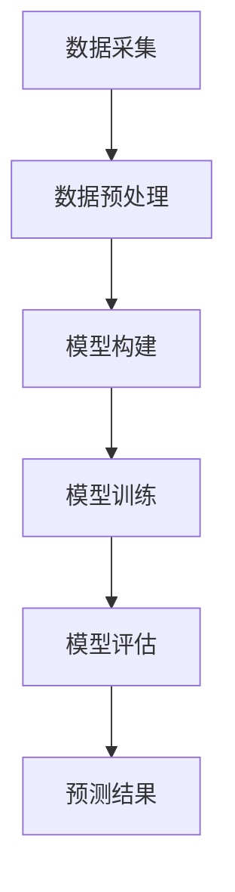

                 

# 大数据分析在疾病传播预测中的实践

## 摘要

本文旨在探讨大数据分析在疾病传播预测中的应用，通过对大数据与疾病传播预测的核心理论、核心算法原理和实际应用场景的深入分析，展示大数据分析在疾病传播预测中的重要作用。文章首先介绍了大数据的基本概念与特征，以及大数据在疾病传播预测中的基础理论。接着，文章详细讲解了机器学习算法、数据挖掘技术和贝叶斯网络等核心算法原理，并使用数学模型和公式进行了详细阐述。随后，文章通过一个实际项目案例，展示了大数据分析在疾病传播预测中的实际应用过程。最后，文章分析了大数据分析在疾病传播预测中的未来发展趋势与挑战，并对全文进行了总结与展望。通过本文，读者可以全面了解大数据分析在疾病传播预测领域的实践与应用。

## 关键词

大数据、疾病传播预测、机器学习、数据挖掘、贝叶斯网络、数学模型、实际应用、未来发展趋势

### 第一部分：大数据分析在疾病传播预测中的基础理论

#### 第1章：大数据与疾病传播预测

##### 1.1 大数据的定义与特征

大数据（Big Data）是指那些无法使用传统数据处理工具在合理时间内捕捉、管理和处理的数据集合。大数据的四大V特性——Volume（数据量）、Velocity（数据传输速度）、Variety（数据多样性）和Veracity（数据真实性），决定了大数据的独特性。

- **Volume（数据量）**：大数据的数据量庞大，往往达到TB、PB甚至EB级别。这需要高效的存储和处理技术来支持。
- **Velocity（数据传输速度）**：大数据的处理速度要求高，需要实时或近实时的数据传输和处理能力，以满足实时决策的需求。
- **Variety（数据多样性）**：大数据不仅包括结构化数据，还涵盖了半结构化和非结构化数据，如文本、图像、音频和视频等。这使得大数据的处理更加复杂。
- **Veracity（数据真实性）**：大数据的真实性和可靠性至关重要，需要有效的数据质量管理措施来确保数据质量。

##### 1.1.1 大数据在现代医学研究中的应用

大数据在医学研究中的应用具有颠覆性的潜力，尤其是在疾病研究、诊断和预防方面。以下是大数据在医学研究中的几个关键应用：

- **疾病研究**：通过大数据分析，可以揭示疾病的发生、发展及其相关因素，有助于发现新的治疗方法和药物。
- **个性化医疗**：大数据能够收集和分析患者的遗传信息、生活习惯、病史等多种数据，为患者提供个性化的治疗方案。
- **精准医疗**：大数据技术可以帮助医生精确识别患者的病情，制定精准的治疗方案，提高治疗效果。

##### 1.2 疾病传播模型概述

疾病传播模型是用于描述疾病在人群中的传播过程和规律的一种数学模型。这些模型可以帮助我们理解疾病的传播机制，预测疫情的发展趋势，为制定公共卫生政策提供科学依据。

##### 1.2.1 疾病传播模型的基本概念

- **基本原理**：疾病传播模型基于传染病动力学原理，通过数学方程描述传染病的传播过程。
- **分类**：常见的疾病传播模型包括SIR模型、SEIR模型等。SIR模型将人群分为易感者（S）、感染者（I）和康复者（R）三个类别；SEIR模型在SIR模型的基础上增加了暴露者（E）类别。

##### 1.2.2 大数据在疾病传播研究中的应用

大数据技术能够为疾病传播研究提供丰富的数据支持，具体体现在以下几个方面：

- **模型参数估计**：通过收集大量的疫情数据，可以利用大数据技术对疾病传播模型中的参数进行精确估计，提高模型的预测准确性。
- **疾病传播预测**：基于大数据分析的疾病传播预测模型，可以更准确地预测疫情的传播趋势，为公共卫生决策提供有力支持。

##### 1.3 大数据分析技术在疾病预测中的应用

大数据分析技术在疾病预测中发挥着关键作用，主要包括以下两个方面：

- **数据采集与预处理**：收集各种来源的数据，如医疗记录、社交媒体数据、地理信息数据等，并通过数据预处理技术清洗和整合数据。
- **数据分析与预测**：利用机器学习算法、数据挖掘技术等对处理后的数据进行分析，构建疾病预测模型，并进行预测评估。

#### 第2章：核心概念与联系

##### 2.1 大数据与疾病传播预测的核心概念

大数据与疾病传播预测之间存在紧密的联系。以下是几个核心概念：

- **数据源**：大数据的来源广泛，包括医疗记录、传感器数据、社交媒体数据等。
- **数据流**：数据流的快速处理和分析能力对于疾病传播预测至关重要。
- **数据仓库与数据湖**：数据仓库用于存储和管理结构化数据，而数据湖则用于存储和管理半结构化和非结构化数据。

##### 2.2 疾病传播预测中的核心概念

在疾病传播预测中，以下几个核心概念至关重要：

- **传染病动力学模型**：用于描述疾病在人群中的传播过程。
- **参数估计**：通过数据分析对疾病传播模型中的参数进行估计。
- **预测准确性评估**：评估疾病传播预测模型的预测准确性。

##### 2.3 大数据与疾病传播预测的Mermaid流程图

以下是一个Mermaid流程图，展示了大数据在疾病传播预测中的应用流程：

- **数据采集**：从各种数据源收集数据。
- **数据预处理**：清洗和整合数据。
- **模型构建**：构建疾病传播预测模型。
- **模型训练**：使用历史数据对模型进行训练。
- **模型评估**：评估模型性能。
- **预测结果**：生成疾病传播预测结果。

### 第二部分：大数据分析在疾病传播预测中的核心算法原理

#### 第3章：核心算法原理讲解

##### 3.1 机器学习算法在疾病预测中的应用

机器学习算法在疾病预测中发挥着重要作用，通过学习历史数据，构建预测模型。以下是几种常见机器学习算法及其在疾病预测中的具体应用。

###### 3.1.1 常见机器学习算法简介

- **决策树**：基于特征划分数据的算法，易于理解和解释。
- **支持向量机（SVM）**：通过寻找最佳分离超平面进行分类。
- **神经网络**：模拟人脑神经元连接的算法，具有强大的非线性建模能力。

###### 3.1.2 机器学习算法在疾病预测中的具体应用

- **决策树在疾病预测中的应用**：通过构建决策树模型，可以根据患者的症状和体征预测疾病类型。
- **支持向量机在疾病预测中的应用**：通过支持向量机模型，可以实现对疾病分类的精确预测。
- **神经网络在疾病预测中的应用**：利用神经网络模型，可以实现对复杂疾病关系的建模和预测。

##### 3.2 数据挖掘技术在疾病预测中的应用

数据挖掘技术是挖掘数据中隐藏的、未知的、有价值的模式，对于疾病预测具有重要意义。以下是几种常见数据挖掘技术在疾病预测中的应用。

###### 3.2.1 数据挖掘技术的基本概念

- **关联规则挖掘**：发现数据之间的关联性，如购物篮分析。
- **聚类分析**：将数据分为多个类别，以便于分析和理解。
- **分类与回归分析**：用于分类和回归预测。

###### 3.2.2 数据挖掘技术在疾病预测中的具体应用

- **关联规则挖掘在疾病预测中的应用**：通过关联规则挖掘，可以发现疾病发生的前兆和影响因素。
- **聚类分析在疾病预测中的应用**：通过聚类分析，可以将患者分为不同的群体，以便于制定个性化的治疗方案。
- **分类与回归分析在疾病预测中的应用**：通过分类与回归分析，可以预测疾病发生的概率和严重程度。

##### 3.3 贝叶斯网络在疾病预测中的应用

贝叶斯网络是一种基于概率图模型的推理工具，可以有效地描述不确定事件之间的依赖关系。在疾病预测中，贝叶斯网络具有以下应用优势：

- **贝叶斯网络的定义与结构**：贝叶斯网络由节点和边组成，节点表示事件，边表示事件之间的依赖关系。
- **贝叶斯网络的参数估计**：通过学习数据，估计贝叶斯网络的参数，包括概率分布和依赖关系。
- **贝叶斯网络在疾病预测中的应用**：利用贝叶斯网络，可以构建疾病预测模型，实现疾病发生概率的预测。

#### 第4章：数学模型与数学公式

##### 4.1 疾病传播模型的数学模型

疾病传播模型是用于描述疾病在人群中的传播过程的数学模型。以下是两种常见疾病传播模型的数学公式：

###### 4.1.1 SIR模型的数学公式

$$
\frac{dS}{dt} = -\frac{S I}{N} \\
\frac{dI}{dt} = \frac{S I}{N} - \mu I \\
\frac{dR}{dt} = \mu I
$$

其中，$S$表示易感者数量，$I$表示感染者数量，$R$表示康复者数量，$N$表示总人口数，$\mu$表示康复率。

###### 4.1.2 SEIR模型的数学公式

$$
\frac{dS}{dt} = -\frac{S I}{N} \\
\frac{dE}{dt} = \frac{S I}{N} - \sigma E \\
\frac{dI}{dt} = \sigma E - \mu I \\
\frac{dR}{dt} = \mu I
$$

其中，$E$表示暴露者数量，$\sigma$表示暴露率。

##### 4.2 机器学习算法的数学模型

机器学习算法的数学模型主要包括以下几个方面：

###### 4.2.1 决策树的数学模型

决策树的数学模型基于信息增益或基尼系数进行特征选择，以下是一个简化的决策树构建过程：

$$
\min_{A}H(A) = \sum_{i}p_{i}H(y_i|A)
$$

其中，$H(A)$表示在特征$A$下数据的熵，$p_{i}$表示特征$A$下第$i$类样本的概率，$H(y_i|A)$表示在特征$A$下第$i$类样本的条件熵。

###### 4.2.2 支持向量机的数学模型

支持向量机（SVM）的数学模型基于最大间隔分类，其目标是最小化目标函数：

$$
\begin{aligned}
&\min_{\omega,b}\frac{1}{2}\|\omega\|^2 \\
&\text{s.t.} y^{(i)}(\omega^T x^{(i)} + b) \geq 1
\end{aligned}
$$

其中，$\omega$表示权重向量，$b$表示偏置项，$x^{(i)}$表示第$i$个训练样本的特征向量，$y^{(i)}$表示第$i$个训练样本的标签。

##### 4.3 贝叶斯网络的数学模型

贝叶斯网络的数学模型基于概率图模型，其核心是条件概率分布。以下是一个简化的贝叶斯网络参数估计过程：

$$
P(X=x) = \prod_{i=1}^{n}P(X_i|x_{i-1})
$$

其中，$X=x$表示变量的取值，$P(X=x)$表示变量的概率，$P(X_i|x_{i-1})$表示变量在给定其父节点条件下的条件概率。

#### 第5章：项目实战

##### 5.1 疾病传播预测项目实战

###### 5.1.1 项目背景

本次项目旨在使用大数据分析技术预测某种传染病的传播趋势，为公共卫生决策提供科学依据。项目主要包括以下步骤：

- 数据采集：从多个数据源收集传染病相关数据，如病例报告、地理信息、社交媒体数据等。
- 数据预处理：清洗和整合数据，为模型构建做准备。
- 模型构建：选择合适的疾病传播模型，并使用机器学习算法对模型参数进行估计。
- 模型训练与评估：使用历史数据对模型进行训练，并评估模型性能。
- 预测与可视化：使用训练好的模型进行预测，并生成可视化报告。

###### 5.1.2 数据采集与预处理

数据采集是项目的重要环节，以下是数据采集和预处理的具体步骤：

- **数据来源**：从疾病监测系统、地理信息系统和社交媒体平台等多渠道收集传染病数据。
- **数据类型**：包括病例报告、地理位置、时间戳、天气信息等。
- **数据预处理**：
  - 数据清洗：去除重复数据、缺失值填充、异常值处理等。
  - 数据整合：将不同数据源的数据进行整合，形成统一的数据集。
  - 数据特征工程：提取与疾病传播相关的特征，如病例密度、传播速度、地理分布等。

###### 5.1.3 模型构建与训练

模型构建与训练是项目的关键步骤，以下是具体过程：

- **模型选择**：选择合适的疾病传播模型，如SIR模型、SEIR模型等。
- **参数估计**：使用最大似然估计、贝叶斯估计等方法对模型参数进行估计。
- **模型训练**：使用历史数据对模型进行训练，调整模型参数，优化模型性能。
- **模型评估**：使用交叉验证、AUC等指标评估模型性能，选择最佳模型。

###### 5.1.4 预测结果分析

预测结果是项目的重要输出，以下是预测结果分析的具体步骤：

- **预测指标**：计算预测准确率、召回率、F1值等指标，评估模型预测效果。
- **可视化展示**：使用图表、地图等可视化手段展示预测结果，帮助公共卫生决策者直观理解疫情发展趋势。
- **预测解释**：对预测结果进行解释，分析影响预测结果的关键因素。

##### 5.2 大数据分析工具与资源

大数据分析工具与资源是进行疾病传播预测项目的重要基础，以下是几个常用的大数据分析工具和资源：

- **Hadoop**：一个分布式数据存储和处理平台，适用于大规模数据集的存储和处理。
- **Spark**：一个快速且通用的大数据处理引擎，适用于批处理、流处理和机器学习等多种场景。
- **Flink**：一个分布式流处理框架，具有高性能和灵活性。
- **scikit-learn**：一个Python机器学习库，提供了多种机器学习算法和工具。
- **TensorFlow**：一个开源的机器学习框架，适用于深度学习和复杂模型构建。
- **PyTorch**：一个开源的深度学习框架，具有灵活性和易用性。

### 第三部分：大数据分析在疾病传播预测中的实际应用

#### 第6章：实际应用场景分析

##### 6.1 疫情防控中的疾病传播预测

在疫情防控中，疾病传播预测具有重要的指导意义，可以帮助政府和卫生部门制定有效的防控策略。以下是一些实际应用场景：

- **疫情预测与预警**：通过大数据分析技术，可以预测疫情的传播趋势，及时发现潜在疫情爆发点，提前采取防控措施。
- **资源调配**：基于疾病传播预测结果，合理调配医疗资源和防疫物资，确保疫情高峰期的需求得到满足。
- **疫苗接种计划**：根据疾病传播预测，制定疫苗接种计划，确保高风险人群优先接种，提高疫苗接种率。

##### 6.1.1 成功案例分析

以下是一个典型的疫情防控中疾病传播预测的成功案例：

- **项目背景**：某地区发现一起疫情爆发，卫生部门需要预测疫情发展趋势，为制定防控措施提供科学依据。
- **数据来源**：从疾病监测系统、医疗机构和社交媒体等多渠道收集疫情数据。
- **模型构建**：选择SEIR模型，使用历史疫情数据和公共卫生统计数据对模型参数进行估计。
- **预测结果**：预测结果显示，疫情将在未来两周内达到高峰，确诊病例数量将显著增加。
- **防控措施**：根据预测结果，卫生部门采取了加强隔离措施、增加医疗资源、宣传防疫知识等防控措施，有效遏制了疫情扩散。

##### 6.2 疾病传播预测在公共卫生领域的应用

疾病传播预测不仅在疫情防控中具有重要意义，还在公共卫生领域发挥着重要作用。以下是一些具体应用场景：

- **公共卫生监测与预警**：通过大数据分析技术，实时监测疾病传播趋势，及时发现潜在疫情爆发，为公共卫生决策提供支持。
- **公共卫生决策支持**：基于疾病传播预测结果，制定公共卫生策略，如疫苗接种策略、疫情应对措施等，提高公共卫生服务的质量和效率。

##### 6.2.1 公共卫生监测与预警

公共卫生监测与预警是疾病传播预测的重要应用之一。以下是一个公共卫生监测与预警的具体案例：

- **项目背景**：某地区卫生部门需要建立公共卫生监测与预警系统，及时发现和应对传染病爆发。
- **数据来源**：从疾病监测系统、医疗机构和社交媒体等多渠道收集传染病数据。
- **模型构建**：使用机器学习算法和大数据分析技术，构建疾病传播预测模型，实时监测疫情趋势。
- **预警机制**：设定预警阈值，当疫情监测指标超过阈值时，系统自动发出预警信号，提醒卫生部门采取相应措施。
- **效果评估**：预警机制有效提高了疾病监测和防控的效率，降低了传染病爆发的风险。

##### 6.2.2 公共卫生决策支持

公共卫生决策支持是疾病传播预测在公共卫生领域的另一个重要应用。以下是一个公共卫生决策支持的具体案例：

- **项目背景**：某地区卫生部门需要制定一种有效的公共卫生策略，应对传染病的爆发和流行。
- **数据来源**：从疾病监测系统、医疗机构和社交媒体等多渠道收集传染病数据。
- **模型构建**：使用大数据分析技术和机器学习算法，构建疾病传播预测模型，评估不同公共卫生策略的效果。
- **决策支持**：根据模型预测结果，制定针对性的公共卫生策略，如加强隔离、增加疫苗接种等。
- **效果评估**：公共卫生策略的实施有效降低了传染病的发生和传播，提高了公共卫生服务的质量。

### 第四部分：大数据分析在疾病传播预测中的未来发展趋势与挑战

#### 第7章：未来发展趋势与挑战

##### 7.1 大数据分析在疾病传播预测中的未来发展趋势

随着大数据技术和人工智能的不断发展，大数据分析在疾病传播预测中的未来发展趋势主要表现在以下几个方面：

- **人工智能的应用**：人工智能技术，尤其是深度学习，将进一步提升疾病传播预测的准确性。通过自动化的特征提取和模型训练，可以更准确地捕捉疾病的传播规律。
- **大数据隐私保护**：随着大数据隐私问题的日益凸显，大数据隐私保护技术将得到广泛应用。数据匿名化、联邦学习等技术将确保数据安全，同时保留数据的价值。
- **实时预测与预警**：实时数据分析和预测技术将进一步提升疾病传播预测的时效性。通过构建高效的实时分析平台，可以实现对疫情的快速响应和防控。

##### 7.2 大数据分析在疾病传播预测中的挑战与对策

尽管大数据分析在疾病传播预测中具有巨大的潜力，但仍然面临一些挑战，需要采取相应的对策来解决：

- **数据质量与可用性**：高质量、可用的大数据是疾病传播预测的基础。需要建立完善的数据质量管理机制，确保数据的准确性和一致性。
- **算法选择与优化**：选择合适的算法并优化算法性能是提高疾病传播预测准确性的关键。需要不断探索新的算法和技术，提高预测模型的性能。
- **跨学科合作**：大数据分析在疾病传播预测中涉及多个学科，如医学、计算机科学、统计学等。需要加强跨学科合作，推动技术的创新和发展。

### 第五部分：结语

#### 第8章：总结与展望

本文通过对大数据分析在疾病传播预测中的应用进行深入探讨，总结了大数据与疾病传播预测的基础理论、核心算法原理和实际应用案例。同时，本文分析了大数据分析在疾病传播预测中的未来发展趋势和挑战。通过本文，读者可以全面了解大数据分析在疾病传播预测领域的重要性和应用前景。未来，随着大数据技术和人工智能的不断发展，大数据分析在疾病传播预测中将发挥更加重要的作用，为公共卫生决策提供更加科学和精准的支持。

### 附录

##### 附录A：大数据分析工具与资源

- **A.1 主流大数据分析工具**

  - **Hadoop**：一个分布式数据处理平台，适用于大规模数据集的存储和处理。
  - **Spark**：一个快速且通用的大数据处理引擎，适用于批处理、流处理和机器学习等多种场景。
  - **Flink**：一个分布式流处理框架，具有高性能和灵活性。

- **A.2 大数据分析开源库与框架**

  - **scikit-learn**：一个Python机器学习库，提供了多种机器学习算法和工具。
  - **TensorFlow**：一个开源的机器学习框架，适用于深度学习和复杂模型构建。
  - **PyTorch**：一个开源的深度学习框架，具有灵活性和易用性。

- **A.3 大数据分析相关论文与书籍**

  - **《大数据时代：思维变革与商业价值》**：探讨大数据的变革力量及其对商业的影响。
  - **《深度学习》**：由Ian Goodfellow、Yoshua Bengio和Aaron Courville合著，全面介绍深度学习的基础理论和技术。
  - **《机器学习实战》**：由Peter Harrington著，通过案例介绍机器学习算法的应用和实践。

