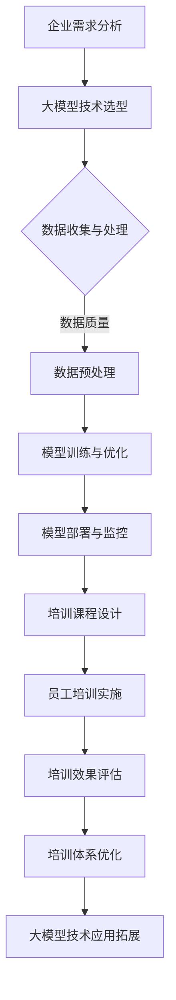
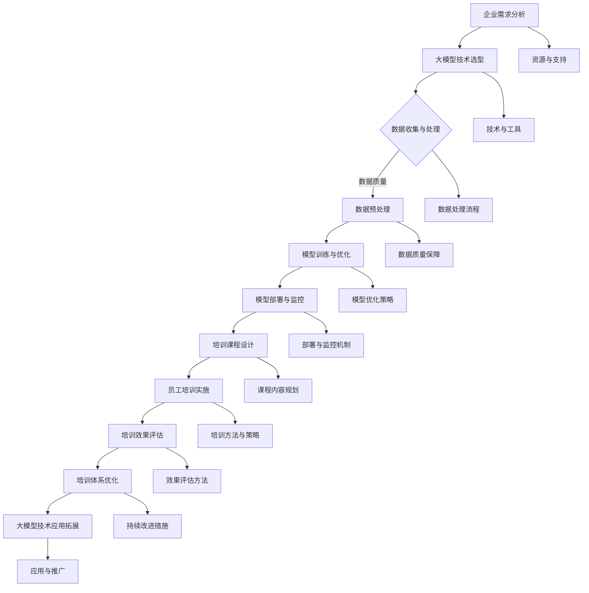

                 

# 《大模型企业的员工培训体系》

## 关键词

- 大模型
- 员工培训体系
- 深度学习
- 自然语言处理
- 计算机视觉
- 强化学习

## 摘要

本文将深入探讨大模型企业的员工培训体系，从大模型概述、技术基础、核心算法原理、员工培训体系设计、实施、效果评估与改进，到实战案例与经验分享，全面解析大模型企业在员工培训方面面临的挑战和解决方案。通过本文，读者将了解大模型技术的基本原理、员工培训体系的设计原则与方法，以及如何通过实战案例和经验分享，提升企业在大模型技术领域的竞争力。

## 目录大纲

### 第一部分：大模型概述与基础

### 第1章：大模型概述
#### 1.1 大模型的概念与分类
#### 1.2 大模型的发展历程
#### 1.3 大模型在企业中的应用

### 第2章：大模型技术基础
#### 2.1 深度学习与神经网络基础
#### 2.2 自然语言处理技术
#### 2.3 计算机视觉技术

### 第3章：大模型核心算法原理
#### 3.1 生成对抗网络（GAN）原理与伪代码
#### 3.2 强化学习算法原理与伪代码
#### 3.3 聚类算法原理与伪代码

### 第二部分：员工培训体系设计与实施

### 第4章：员工培训体系设计原则
#### 4.1 培训目标设定
#### 4.2 培训内容规划
#### 4.3 培训方法与策略

### 第5章：员工培训课程设置
#### 5.1 理论课程设置
#### 5.2 实践课程设置
#### 5.3 案例分析与讨论

### 第6章：培训资源与管理
#### 6.1 培训资料收集与整理
#### 6.2 培训师资力量配备
#### 6.3 培训场地与设备准备

### 第7章：培训效果评估与改进
#### 7.1 培训效果评估方法
#### 7.2 培训反馈机制
#### 7.3 培训体系持续改进

### 第三部分：实战案例与经验分享

### 第8章：大模型企业培训案例
#### 8.1 案例一：某互联网公司的大模型培训实践
#### 8.2 案例二：某制造企业的大模型培训实践
#### 8.3 案例三：某金融机构的大模型培训实践

### 第9章：大模型企业培训经验分享
#### 9.1 培训成功经验总结
#### 9.2 培训中遇到的问题及解决方案
#### 9.3 未来大模型培训发展趋势预测

### 附录

### 附录A：大模型相关工具与资源
#### A.1 常用深度学习框架介绍
#### A.2 大模型相关论文与书籍推荐
#### A.3 大模型企业培训资源库

## 第一部分：大模型概述与基础

### 第1章：大模型概述

#### 1.1 大模型的概念与分类

大模型（Large Models），通常指的是参数量达到亿级或以上的神经网络模型。这类模型在深度学习领域具有极高的影响力，能够处理海量数据，并在各类任务中取得优异的性能。大模型的分类可以根据不同的标准进行，常见的分类方式如下：

1. **按参数规模分类**：
   - **微模型**（Micro Models）：参数量在几十万到几百万之间。
   - **小模型**（Small Models）：参数量在几百万到几亿之间。
   - **大模型**（Large Models）：参数量在几十亿到数万亿之间。

2. **按功能分类**：
   - **通用模型**：能够在多种任务中取得较好性能，如GPT-3、ChatGLM等。
   - **专用模型**：针对特定任务进行优化，如BERT在自然语言处理任务中的表现。

3. **按数据来源分类**：
   - **公开数据集**：如ImageNet、COCO等，用于大规模预训练。
   - **私有数据集**：企业内部数据，用于特定任务定制。

#### 1.2 大模型的发展历程

大模型的发展可以追溯到深度学习的兴起。从2006年Hinton等人提出深度信念网络（DBN）开始，深度学习逐渐成为机器学习领域的重要研究方向。以下是几个重要的发展阶段：

- **2006-2011年**：深度信念网络、自编码器等模型提出，但受限于计算资源和数据规模，未能广泛应用。
- **2012年**：AlexNet在ImageNet竞赛中取得突破性成绩，标志着深度学习时代的到来。
- **2013年**：Hinton等人提出并行训练技术，进一步提高了深度学习的训练效率。
- **2014年**：微软研究院提出深度语音模型，推动了深度学习在语音处理领域的发展。
- **2016年**：谷歌提出Transformer模型，彻底改变了自然语言处理领域的研究方向。
- **2018年**：OpenAI发布GPT-2，展示了大模型在自然语言生成任务中的强大能力。

#### 1.3 大模型在企业中的应用

大模型在企业中的应用场景非常广泛，以下是一些典型的应用：

1. **自然语言处理**：
   - 自动问答系统
   - 文本分类与情感分析
   - 机器翻译

2. **计算机视觉**：
   - 图像分类与识别
   - 目标检测与跟踪
   - 视频分析

3. **语音识别与合成**：
   - 自动语音识别
   - 语音合成

4. **推荐系统**：
   - 用户行为分析
   - 商品推荐

5. **金融风控**：
   - 信用评分
   - 交易监控

6. **医疗健康**：
   - 疾病诊断
   - 药物研发

### 第2章：大模型技术基础

#### 2.1 深度学习与神经网络基础

深度学习（Deep Learning）是机器学习（Machine Learning）的一个重要分支，它通过多层神经网络对数据进行建模，从而实现复杂的任务。以下是深度学习与神经网络的基础知识：

#### 2.1.1 神经网络基础

神经网络（Neural Network）是由大量神经元（Node）组成的计算模型，每个神经元接受多个输入，通过加权求和处理后产生输出。神经网络的典型结构包括输入层、隐藏层和输出层。

- **输入层**：接收外部输入数据。
- **隐藏层**：对输入数据进行变换和特征提取。
- **输出层**：产生最终输出。

#### 2.1.2 激活函数

激活函数（Activation Function）是神经网络中用于引入非线性特性的函数。常见的激活函数包括：

- **Sigmoid函数**：\( f(x) = \frac{1}{1 + e^{-x}} \)
- **ReLU函数**：\( f(x) = \max(0, x) \)
- **Tanh函数**：\( f(x) = \frac{e^x - e^{-x}}{e^x + e^{-x}} \)

#### 2.1.3 前向传播与反向传播

神经网络通过前向传播（Forward Propagation）计算输入与输出之间的关系，通过反向传播（Back Propagation）更新网络参数，以优化模型性能。

- **前向传播**：计算输入到每个神经元的加权求和，并应用激活函数得到输出。
- **反向传播**：计算误差梯度，并通过反向传递更新网络参数。

#### 2.2 自然语言处理技术

自然语言处理（Natural Language Processing，NLP）是深度学习在语言领域的重要应用。以下是NLP的几个关键技术：

#### 2.2.1 词嵌入（Word Embedding）

词嵌入是将单词映射到高维向量空间的技术。常见的词嵌入方法包括：

- **Word2Vec**：基于共现关系学习词向量。
- **GloVe**：基于全局统计信息学习词向量。
- **BERT**：基于上下文信息学习词向量。

#### 2.2.2 递归神经网络（RNN）

递归神经网络（Recurrent Neural Network，RNN）是一种能够处理序列数据的神经网络。RNN通过在时间步之间传递信息，实现对序列数据的建模。

- **LSTM（Long Short-Term Memory）**：一种特殊的RNN结构，能够解决长序列依赖问题。
- **GRU（Gated Recurrent Unit）**：另一种特殊的RNN结构，与LSTM类似，但参数更少。

#### 2.2.3 Transformer模型

Transformer模型是自然语言处理领域的一种重要模型，它基于自注意力机制（Self-Attention）进行序列建模。Transformer模型在机器翻译、文本生成等任务中取得了优异的性能。

- **多头自注意力机制**：通过多个注意力头来关注不同位置的信息。
- **位置编码**：引入位置信息，使模型能够处理序列。

### 第3章：大模型核心算法原理

#### 3.1 生成对抗网络（GAN）原理与伪代码

生成对抗网络（Generative Adversarial Network，GAN）是一种由生成器和判别器组成的对抗性网络。生成器试图生成与真实数据相似的数据，而判别器则试图区分真实数据与生成数据。

#### 3.1.1 GAN原理

GAN由以下两部分组成：

1. **生成器（Generator）**：接受随机噪声作为输入，生成模拟数据。
2. **判别器（Discriminator）**：接受真实数据和生成数据，输出一个概率值，表示数据是真实的概率。

训练过程中，生成器和判别器相互对抗，生成器试图生成更逼真的数据，而判别器则试图提高区分能力。通过这种对抗过程，生成器逐渐提高生成数据的质量。

#### 3.1.2 伪代码

以下是一个简单的GAN伪代码示例：

```python
# GAN生成器和判别器训练过程

# 初始化生成器G和判别器D
G = Generator()
D = Discriminator()

# 训练循环
for epoch in range(num_epochs):
    for batch in data_loader:
        # 训练生成器
        noise = generate_noise(batch_size)
        fake_data = G(noise)
        D_loss = train_discriminator(D, fake_data, real_data)
        
        # 训练判别器
        real_data = next(data_loader)
        G_loss = train_generator(G, D)
        
        # 打印训练信息
        print(f"Epoch [{epoch+1}/{num_epochs}], D_loss: {D_loss:.4f}, G_loss: {G_loss:.4f}")
```

#### 3.2 强化学习算法原理与伪代码

强化学习（Reinforcement Learning，RL）是一种通过试错和反馈来学习最优策略的机器学习方法。强化学习的基本思想是智能体（Agent）通过与环境的交互，不断调整策略以最大化累积奖励。

#### 3.2.1 强化学习原理

强化学习由以下三个核心部分组成：

1. **状态（State）**：智能体所处的环境。
2. **动作（Action）**：智能体可以采取的行为。
3. **奖励（Reward）**：智能体执行动作后获得的奖励，用于指导智能体调整策略。

强化学习的目标是学习一个策略（Policy），使得智能体能够在给定状态下选择最优动作，从而最大化累积奖励。

#### 3.2.2 伪代码

以下是一个简单的Q-Learning算法伪代码示例：

```python
# Q-Learning算法

# 初始化Q表
Q = initialize_Q_table()

# 智能体训练过程
while not termination_condition:
    # 选择动作
    state = current_state()
    action = choose_action(state, Q)
    
    # 执行动作并获取奖励
    next_state, reward = execute_action(action)
    
    # 更新Q表
    Q[state][action] = Q[state][action] + learning_rate * (reward + discount_factor * max(Q[next_state]) - Q[state][action])
    
    # 更新状态
    state = next_state

# 输出最优策略
optimal_policy = select_best_action(Q)
```

#### 3.3 聚类算法原理与伪代码

聚类算法（Clustering Algorithm）是一种无监督学习方法，用于将数据集划分为多个簇，使得同一簇内的数据点尽可能接近，不同簇的数据点尽可能远。

#### 3.3.1 聚类算法原理

常见的聚类算法包括：

1. **K均值算法（K-Means）**：基于距离度量，将数据点分配到最近的簇中心。
2. **层次聚类（Hierarchical Clustering）**：通过构建层次结构来组织数据点，可以是自底向上或自顶向下。
3. **DBSCAN（Density-Based Spatial Clustering of Applications with Noise）**：基于数据点的密度分布，将数据点划分为簇，并能够处理噪声和异常点。

#### 3.3.2 伪代码

以下是一个简单的K均值算法伪代码示例：

```python
# K均值算法

# 初始化簇中心
centers = initialize_centers(data)

# 聚类过程
while not convergence:
    # 分配数据点到簇
    assignments = assign_points_to_clusters(data, centers)
    
    # 更新簇中心
    new_centers = update_centers(data, assignments)
    
    # 判断是否收敛
    if is_converged(centers, new_centers):
        break
    
    # 更新簇中心
    centers = new_centers

# 输出聚类结果
clusters = generate_clusters(data, assignments)
```

## 第二部分：员工培训体系设计与实施

### 第4章：员工培训体系设计原则

#### 4.1 培训目标设定

员工培训体系的设计首先要明确培训目标，这关乎到培训的成效和员工的发展。设定培训目标应遵循以下原则：

1. **明确性**：目标要具体、可量化，以便于衡量培训效果。
2. **挑战性**：目标应具有一定的挑战性，激励员工不断进步。
3. **一致性**：目标要与企业的战略目标和部门的发展需求保持一致。
4. **层次性**：目标应分层设定，既有长期目标，也有短期目标。

#### 4.2 培训内容规划

培训内容是培训体系的核心，直接关系到培训的质量。在规划培训内容时，应考虑以下几个方面：

1. **技术技能**：根据岗位需求，设定必要的技术技能培训内容，如编程技能、算法原理、工具使用等。
2. **业务知识**：加强员工对业务领域的理解，包括业务流程、行业动态、市场分析等。
3. **软技能**：提高员工的沟通能力、团队合作能力、领导力等软技能。
4. **跨领域知识**：鼓励员工学习跨领域的知识，以拓展视野，提升创新能力。

#### 4.3 培训方法与策略

培训方法的选择应多样化，以适应不同的培训需求和员工特点。以下是一些常见的培训方法和策略：

1. **课堂培训**：通过讲师授课，系统地传授知识。
2. **案例教学**：通过实际案例，帮助员工理解理论知识并在实际中应用。
3. **在线学习**：利用在线平台，方便员工随时随地进行学习。
4. **实践操作**：通过实际操作，提升员工的能力。
5. **导师制**：通过导师的指导和帮助，加速员工的成长。

### 第5章：员工培训课程设置

#### 5.1 理论课程设置

理论课程是员工培训的重要组成部分，为员工提供必要的理论基础。在设置理论课程时，应考虑以下要素：

1. **课程内容**：根据培训目标，设计符合岗位需求的课程内容。
2. **课程时长**：合理安排课程时长，确保员工有足够的时间进行学习和消化。
3. **教学方法**：采用多种教学方法，如讲授、讨论、案例分享等，提高学习效果。
4. **教材和资料**：提供优质的教材和参考资料，帮助员工更好地掌握课程内容。

#### 5.2 实践课程设置

实践课程是员工培训的关键环节，通过实际操作，使员工将理论知识转化为实际能力。在设置实践课程时，应考虑以下几点：

1. **实践项目**：设计贴近实际工作的实践项目，让员工在项目中应用所学知识。
2. **实践时长**：确保员工有足够的时间进行实践操作，并解决遇到的问题。
3. **指导和支持**：提供导师或讲师的指导和支持，帮助员工顺利完成实践项目。
4. **反馈和总结**：在实践结束后，进行反馈和总结，帮助员工发现不足并改进。

#### 5.3 案例分析与讨论

案例分析和讨论是提升员工分析问题和解决问题的能力的重要途径。在设置案例分析课程时，应考虑以下几点：

1. **案例选择**：选择具有代表性的案例，涵盖不同的业务场景和问题。
2. **分析深度**：鼓励员工深入分析案例，挖掘案例背后的原理和规律。
3. **讨论形式**：采用小组讨论、公开讨论等形式，激发员工的思考和创新。
4. **成果展示**：要求员工展示分析结果，分享学习心得，促进知识共享。

### 第6章：培训资源与管理

#### 6.1 培训资料收集与整理

培训资料是培训课程的重要支撑，包括教材、课件、参考资料等。在收集和整理培训资料时，应遵循以下原则：

1. **全面性**：确保培训资料的覆盖面，包括理论知识和实践操作。
2. **及时性**：关注行业动态和新技术发展，及时更新培训资料。
3. **实用性**：选择实用性强、易于理解的资料，提高培训效果。
4. **多样性**：提供多种形式的培训资料，如书籍、视频、PPT等。

#### 6.2 培训师资力量配备

师资力量是培训质量的重要保障。在配备培训师资时，应考虑以下几点：

1. **专业性**：讲师应具备扎实的专业知识和丰富的实践经验。
2. **教学能力**：讲师应具备良好的教学能力，能够生动有趣地传授知识。
3. **沟通能力**：讲师应具备良好的沟通能力，能够与学员有效互动。
4. **更新能力**：讲师应关注行业动态和技术发展，持续更新知识。

#### 6.3 培训场地与设备准备

培训场地和设备的准备是确保培训顺利进行的基础。在准备培训场地和设备时，应考虑以下几点：

1. **场地选择**：选择适合培训规模的场地，确保学员有足够的学习空间。
2. **设备配备**：确保培训设备（如投影仪、电脑、音响等）齐全且功能正常。
3. **网络环境**：提供稳定的网络环境，确保在线课程的顺利进行。
4. **安全措施**：确保培训场地的安全，防止意外事故的发生。

### 第7章：培训效果评估与改进

#### 7.1 培训效果评估方法

培训效果评估是衡量培训成效的重要手段。在评估培训效果时，应采用定量和定性相结合的方法：

1. **定量评估**：通过考试、测试等手段，量化评估员工的知识掌握程度。
2. **定性评估**：通过问卷调查、访谈等方式，收集员工的反馈意见，了解培训的满意度和效果。
3. **行为评估**：观察员工在实际工作中的表现，评估培训对员工行为和能力的影响。

#### 7.2 培训反馈机制

建立有效的培训反馈机制，是提高培训质量的关键。在培训过程中，应定期收集员工的反馈意见，包括：

1. **课程内容**：评估课程内容的实用性、深度和广度。
2. **教学方法**：评估教学方法的生动性、参与性和有效性。
3. **培训资料**：评估培训资料的丰富性、更新性和实用性。

根据反馈意见，及时调整和改进培训方案，以提升培训效果。

#### 7.3 培训体系持续改进

培训体系的持续改进是培训工作的重要组成部分。在培训过程中，应遵循以下原则：

1. **动态调整**：根据企业发展和员工需求，动态调整培训目标和内容。
2. **技术创新**：关注新技术的发展，引入新的培训方法和工具。
3. **经验总结**：定期总结培训经验，分享成功案例和问题解决方案。
4. **持续优化**：不断优化培训流程，提高培训效率和效果。

## 第三部分：实战案例与经验分享

### 第8章：大模型企业培训案例

#### 8.1 案例一：某互联网公司的大模型培训实践

某互联网公司在推进大模型技术的应用过程中，面临员工技术能力不足的挑战。为了提高员工在大模型领域的技能，公司制定了详细的培训计划，包括以下内容：

1. **培训目标**：提升员工在深度学习、自然语言处理和计算机视觉等领域的专业能力。
2. **培训内容**：设计涵盖基础理论、核心算法和实践操作的课程体系。
3. **培训方法**：采用线上线下相结合的方式，提高培训的灵活性和覆盖面。

通过一系列的培训活动，公司员工在大模型技术方面的能力得到了显著提升，有效推动了企业在大模型技术领域的创新发展。

#### 8.2 案例二：某制造企业的大模型培训实践

某制造企业为了提升在智能制造领域的竞争力，开展了大模型技术的专项培训。培训内容主要包括：

1. **深度学习在图像处理中的应用**：通过案例教学，让员工了解如何利用深度学习技术进行图像识别和分类。
2. **强化学习在智能控制中的应用**：培训员工如何利用强化学习算法进行智能控制系统的优化。
3. **大模型在预测与优化中的应用**：教授员工如何利用大模型进行数据分析、预测和优化。

通过培训，企业员工掌握了大模型技术的基本原理和应用方法，为企业在智能制造领域的创新发展提供了有力支持。

#### 8.3 案例三：某金融机构的大模型培训实践

某金融机构为了提升在大数据分析和智能风控方面的能力，开展了大模型技术的系统培训。培训内容涵盖：

1. **深度学习在金融数据挖掘中的应用**：通过案例教学，让员工了解如何利用深度学习技术进行金融数据的分析和挖掘。
2. **自然语言处理在金融文本分析中的应用**：培训员工如何利用自然语言处理技术进行金融文本的挖掘和分析。
3. **大模型在信用评分与风险评估中的应用**：教授员工如何利用大模型进行信用评分和风险评估。

通过培训，企业员工在大模型技术方面的能力得到了显著提升，为金融机构在大数据分析和智能风控领域的创新发展提供了有力支持。

### 第9章：大模型企业培训经验分享

#### 9.1 培训成功经验总结

大模型企业的培训实践取得了显著成果，以下总结了一些成功经验：

1. **明确培训目标**：根据企业发展战略和员工需求，明确培训目标，确保培训内容的针对性。
2. **设计合理的课程体系**：结合不同领域的专业需求，设计涵盖基础理论、核心算法和实践操作的课程体系。
3. **灵活运用培训方法**：采用线上线下相结合的方式，提高培训的灵活性和覆盖面。
4. **注重实践操作**：通过实际操作项目，让员工将理论知识转化为实际能力。
5. **建立有效的反馈机制**：定期收集员工反馈，及时调整和改进培训方案，提高培训效果。

#### 9.2 培训中遇到的问题及解决方案

在培训过程中，企业也遇到了一些问题，以下总结了一些常见的解决方案：

1. **员工参与度低**：通过激励措施和互动环节，提高员工参与度。
2. **培训资源不足**：加强培训资源的整合和共享，充分利用外部资源和平台。
3. **师资力量不足**：引进外部专家和内部优秀员工担任讲师，提升培训质量。
4. **技术更新迅速**：关注行业动态和技术发展，及时更新培训内容。

#### 9.3 未来大模型培训发展趋势预测

随着大模型技术的不断发展和应用场景的拓展，未来大模型企业的培训将呈现以下趋势：

1. **培训内容多样化**：涵盖更多领域和应用场景，满足不同岗位的需求。
2. **培训形式多元化**：采用虚拟现实、增强现实等新技术，提高培训的生动性和互动性。
3. **培训智能化**：利用人工智能技术，实现个性化培训和学习路径推荐。
4. **培训体系持续优化**：根据企业发展和员工需求，持续优化培训目标和内容，提高培训效果。

## 附录

### 附录A：大模型相关工具与资源

#### A.1 常用深度学习框架介绍

1. **TensorFlow**：由谷歌开发的开源深度学习框架，支持多种编程语言，具有良好的生态和丰富的资源。
2. **PyTorch**：由Facebook开发的开源深度学习框架，具有动态计算图和易于调试的特点，广泛应用于研究和生产。
3. **Keras**：基于TensorFlow和Theano的开源深度学习框架，提供简洁的API，方便快速构建和训练模型。

#### A.2 大模型相关论文与书籍推荐

1. **《深度学习》**（Goodfellow, Bengio, Courville）：深度学习领域的经典教材，全面介绍了深度学习的理论基础和应用方法。
2. **《强化学习》**（ Sutton, Barto）：强化学习领域的权威教材，详细讲解了强化学习的原理和方法。
3. **《生成对抗网络》**（Goodfellow, Pouget-Abadie, Mirza, Xu, Warde-Farley, Ozair, Courville, Bengio）：介绍了生成对抗网络（GAN）的基本原理和应用。

#### A.3 大模型企业培训资源库

1. **在线课程平台**：如Coursera、Udacity、edX等，提供丰富的深度学习、自然语言处理、计算机视觉等领域的课程资源。
2. **开源社区**：如GitHub、Stack Overflow、ArXiv等，聚集了大量的深度学习项目、论文和代码，可供学习和参考。
3. **技术博客**：如博客园、CSDN、简书等，提供了大量的技术文章、案例分析和技术教程。

## 大模型架构 Mermaid 流程图



### 附录B：大模型技术学习资源

#### B.1 大模型技术入门书籍

1. **《深度学习》（Ian Goodfellow, Yoshua Bengio, Aaron Courville）**：这是一本经典的深度学习入门书籍，详细介绍了深度学习的理论基础和实战技巧。
2. **《Python深度学习》（François Chollet）**：这本书以Python编程语言为基础，深入讲解了深度学习的实战应用。

#### B.2 大模型技术在线课程

1. **吴恩达的《深度学习专项课程》**（Deep Learning Specialization）：这是一系列深度学习课程，涵盖了深度学习的基础理论、卷积神经网络、循环神经网络、自然语言处理等内容。
2. **《动手学深度学习》**：这本书附带的在线教程提供了丰富的实战案例，帮助读者通过动手实践学习深度学习。

#### B.3 大模型技术开源社区

1. **TensorFlow官方文档**：提供了丰富的教程和示例代码，适合初学者和进阶者学习TensorFlow。
2. **PyTorch官方文档**：详细介绍了PyTorch的使用方法和功能，包括深度学习模型的构建和训练。

#### B.4 大模型技术相关论文

1. **《A Tutorial on Generative Adversarial Networks》**：这篇论文是生成对抗网络（GAN）的入门教程，详细介绍了GAN的基本原理和实现方法。
2. **《Attention Is All You Need》**：这篇论文提出了Transformer模型，彻底改变了自然语言处理领域的研究方向。

#### B.5 大模型技术实战案例

1. **GitHub上的深度学习项目**：GitHub上有大量的深度学习项目，包括图像识别、自然语言处理、语音识别等领域的实战项目。
2. **Kaggle竞赛**：Kaggle提供了各种数据科学和机器学习竞赛，参赛者可以通过实战提高自己的技术水平。

### 附录C：大模型企业培训资源库

#### C.1 大模型技术教程

1. **《深度学习教程》**：这是一套系统的深度学习教程，包括深度学习的基础理论、模型构建和优化等内容。
2. **《自然语言处理实战》**：这本书通过案例教学，介绍了自然语言处理的基本原理和实战技巧。

#### C.2 大模型技术文档

1. **TensorFlow文档**：提供了详细的TensorFlow使用文档，包括API参考、教程和示例代码。
2. **PyTorch文档**：包含了PyTorch的详细文档，帮助开发者快速上手和使用PyTorch。

#### C.3 大模型技术书籍

1. **《深度学习》（Ian Goodfellow, Yoshua Bengio, Aaron Courville）**：这是一本经典的深度学习书籍，适合深度学习初学者和进阶者。
2. **《生成对抗网络》（Ian Goodfellow, Christian Szegedy, Aaron Courville）**：详细介绍了生成对抗网络的理论和应用。

#### C.4 大模型技术视频课程

1. **吴恩达的《深度学习专项课程》**：通过视频讲解，帮助学习者深入理解深度学习的原理和应用。
2. **《自然语言处理》**：由斯坦福大学提供的自然语言处理课程，包括NLP的基础理论和实战技巧。

#### C.5 大模型技术工具和库

1. **TensorFlow**：谷歌开发的深度学习框架，广泛应用于深度学习研究和开发。
2. **PyTorch**：Facebook开发的深度学习框架，具有动态计算图和良好的社区支持。
3. **Keras**：Python的深度学习高层API，简化了深度学习模型的构建和训练。

### 附录D：大模型企业培训资源库

#### D.1 大模型技术在线教程

1. **深度学习教程**：提供了深度学习的基础理论和实战教程，适合初学者和进阶者。
2. **自然语言处理教程**：介绍了自然语言处理的基本概念和实战技巧，包括词嵌入、序列模型等。

#### D.2 大模型技术学术论文

1. **《Attention Is All You Need》**：详细介绍了Transformer模型，彻底改变了自然语言处理领域的研究方向。
2. **《Generative Adversarial Nets》**：这篇论文是生成对抗网络（GAN）的奠基之作，介绍了GAN的基本原理和应用。

#### D.3 大模型技术开源代码

1. **TensorFlow代码示例**：提供了大量的TensorFlow代码示例，涵盖了深度学习的各种应用场景。
2. **PyTorch代码示例**：包括PyTorch的各种模型实现，如卷积神经网络、循环神经网络、生成对抗网络等。

#### D.4 大模型技术实践项目

1. **深度学习项目**：包括图像分类、目标检测、文本分类等实战项目，帮助学习者通过实际操作掌握深度学习技术。
2. **自然语言处理项目**：如文本分类、机器翻译、情感分析等项目的实战教程和代码。

#### D.5 大模型技术交流社区

1. **深度学习社区**：如深度学习QQ群、微信群等，提供了深度学习领域的交流和讨论平台。
2. **自然语言处理社区**：如NLP交流群、NLP技术论坛等，聚集了自然语言处理领域的专业人士。

### 附录E：大模型技术学习资源

#### E.1 大模型技术在线课程

1. **《深度学习》专项课程**：吴恩达在Coursera上开设的深度学习课程，涵盖深度学习的基础理论和应用实践。
2. **《自然语言处理》专项课程**：斯坦福大学在Coursera上开设的自然语言处理课程，介绍NLP的基础知识和最新进展。

#### E.2 大模型技术教程

1. **《深度学习实战》**：通过实际案例，讲解深度学习的基本原理和实战技巧。
2. **《自然语言处理实战》**：通过案例教学，介绍自然语言处理的基本原理和实战应用。

#### E.3 大模型技术书籍

1. **《深度学习》**：Goodfellow, Bengio, Courville 著，深度学习领域的经典教材。
2. **《自然语言处理综合教程》**：Peter Norvig 著，全面介绍自然语言处理的基础理论和应用。

#### E.4 大模型技术开源框架

1. **TensorFlow**：由谷歌开发的开源深度学习框架，广泛应用于深度学习研究和应用。
2. **PyTorch**：由Facebook开发的开源深度学习框架，具有动态计算图和良好的社区支持。

#### E.5 大模型技术社区

1. **GitHub**：聚集了大量的深度学习和自然语言处理项目，可以学习和参考。
2. **Stack Overflow**：深度学习和自然语言处理相关的问题和解决方案，是学习的好资源。

## 作者信息

作者：AI天才研究院/AI Genius Institute & 禅与计算机程序设计艺术 /Zen And The Art of Computer Programming

## 结语

大模型技术在企业和科研领域发挥着越来越重要的作用。本文从大模型概述、技术基础、员工培训体系设计、实战案例等多个角度，系统地阐述了大模型企业在员工培训方面的重要性和方法。通过深入分析，我们了解到大模型企业培训体系的设计原则、实施方法、效果评估与改进，以及未来发展趋势。希望本文能够为从事大模型技术研究和应用的企业提供有价值的参考和指导。让我们携手共进，共同推动大模型技术的发展和应用，为人类社会的进步做出贡献！<|end|>### 引言

在当前信息技术飞速发展的时代，人工智能（AI）已经成为推动产业变革和提升企业竞争力的关键力量。其中，大模型（Large Models）作为人工智能领域的重要分支，正逐步成为企业创新的引擎。大模型，通常指的是参数量达到亿级或以上的神经网络模型，这类模型在自然语言处理、计算机视觉、语音识别等任务中展现出了卓越的性能，极大地拓展了人工智能的应用场景。

然而，大模型的开发和应用不仅需要强大的计算资源和数据支持，还需要具备深厚技术背景的专业人才。这就对企业的员工培训体系提出了新的挑战。一方面，企业需要确保员工能够掌握最新的技术知识和技能，以满足大模型项目的需求；另一方面，员工也需要通过持续的学习和培训，不断提升自身的专业能力和技术水平，以应对不断变化的技术环境和市场需求。

本文旨在深入探讨大模型企业的员工培训体系，分析大模型技术的基本概念、发展历程以及在实际应用中的关键技术。我们将详细讨论大模型企业的员工培训体系设计原则、培训课程设置、培训资源管理以及培训效果评估与改进。此外，本文还将通过实战案例和经验分享，展示大模型企业在员工培训方面的成功实践和宝贵经验。

通过本文的探讨，读者将能够全面了解大模型技术的基本原理和应用场景，掌握员工培训体系的设计方法和实施策略，从而为大模型企业在员工培训方面提供有效的指导和借鉴。希望通过本文的分享，能够激发更多企业和研究者关注大模型技术，共同推动人工智能技术的发展和应用，实现技术创新与产业升级。

### 第一部分：大模型概述与基础

在探讨大模型企业的员工培训体系之前，首先需要了解大模型的基本概念、发展历程以及其在企业中的应用。大模型（Large Models），顾名思义，是指那些拥有亿级或以上参数量的神经网络模型。这些模型以其卓越的运算能力和强大的数据处理能力，在众多领域取得了显著的成果。本部分将分为三个章节，分别介绍大模型的概念与分类、大模型的发展历程以及大模型在企业中的应用。

#### 第1章：大模型概述

**1.1 大模型的概念与分类**

大模型的概念最早可以追溯到深度学习的兴起。深度学习是一种通过多层神经网络对数据进行建模和预测的机器学习方法。与传统机器学习方法相比，深度学习具有更强的表示能力和更强的适应性。随着计算能力的提升和数据规模的扩大，深度学习模型逐渐演变为大模型。大模型的参数量可以达到亿级甚至更高，这使得它们能够处理海量数据，并在多种任务中取得优异的性能。

大模型的分类可以根据不同的标准进行，以下是一些常见的分类方式：

- **按参数规模分类**：
  - **微模型**（Micro Models）：参数量在几十万到几百万之间。
  - **小模型**（Small Models）：参数量在几百万到几亿之间。
  - **大模型**（Large Models）：参数量在几十亿到数万亿之间。

- **按功能分类**：
  - **通用模型**：能够在多种任务中取得较好性能，如GPT-3、ChatGLM等。
  - **专用模型**：针对特定任务进行优化，如BERT在自然语言处理任务中的表现。

- **按数据来源分类**：
  - **公开数据集**：如ImageNet、COCO等，用于大规模预训练。
  - **私有数据集**：企业内部数据，用于特定任务定制。

**1.2 大模型的发展历程**

大模型的发展历程与深度学习的兴起密切相关。以下是几个重要的发展阶段：

- **2006年**：Hinton等人提出深度信念网络（DBN），这是深度学习的一个重要里程碑。
- **2012年**：AlexNet在ImageNet竞赛中取得突破性成绩，标志着深度学习时代的到来。
- **2014年**：微软研究院提出深度语音模型，推动了深度学习在语音处理领域的发展。
- **2016年**：谷歌提出Transformer模型，彻底改变了自然语言处理领域的研究方向。
- **2018年**：OpenAI发布GPT-2，展示了大模型在自然语言生成任务中的强大能力。

**1.3 大模型在企业中的应用**

大模型在企业中的应用场景非常广泛，以下是一些典型的应用：

1. **自然语言处理**：
   - 自动问答系统：如GPT-3等模型，能够处理复杂的问答任务。
   - 文本分类与情感分析：广泛应用于社交媒体监测、客户服务等领域。
   - 机器翻译：如Google翻译等，基于大模型实现高质量的翻译效果。

2. **计算机视觉**：
   - 图像分类与识别：如ImageNet竞赛，大模型在图像分类任务中取得了优异的性能。
   - 目标检测与跟踪：广泛应用于视频监控、自动驾驶等领域。
   - 视频分析：如动作识别、视频分类等，大模型在视频处理领域具有广泛的应用。

3. **语音识别与合成**：
   - 自动语音识别：如科大讯飞等，基于大模型实现高准确度的语音识别。
   - 语音合成：如Google Text-to-Speech等，大模型能够生成自然流畅的语音。

4. **推荐系统**：
   - 用户行为分析：如淘宝、京东等，通过大模型分析用户行为，实现个性化推荐。
   - 商品推荐：基于用户历史行为和兴趣，大模型能够推荐合适的商品。

5. **金融风控**：
   - 信用评分：如金融机构，通过大模型分析用户数据，实现精准的信用评分。
   - 交易监控：通过大模型识别异常交易，防范金融风险。

6. **医疗健康**：
   - 疾病诊断：如医疗图像分析，大模型能够辅助医生进行疾病诊断。
   - 药物研发：通过大模型分析大量生物数据，加速药物研发进程。

通过以上对大模型概念的介绍、发展历程的回顾以及在企业中的应用探讨，读者可以初步了解大模型的基本特征和重要性。在接下来的章节中，我们将进一步深入探讨大模型技术的基础知识，包括深度学习与神经网络基础、自然语言处理技术和计算机视觉技术。这些内容将为读者理解和掌握大模型的应用提供坚实的基础。

#### 第2章：大模型技术基础

**2.1 深度学习与神经网络基础**

深度学习（Deep Learning）是机器学习（Machine Learning）的一个重要分支，它通过多层神经网络（Neural Networks）对数据进行建模，从而实现复杂的任务。深度学习在图像识别、自然语言处理、语音识别等领域取得了显著的成果，成为当前人工智能研究的热点。

**2.1.1 神经网络基础**

神经网络是由大量神经元（Node）组成的计算模型，每个神经元接受多个输入，通过加权求和处理后产生输出。神经网络的典型结构包括输入层、隐藏层和输出层。

1. **输入层**：接收外部输入数据，如图像、文本、声音等。
2. **隐藏层**：对输入数据进行变换和特征提取，隐藏层可以有一个或多个。
3. **输出层**：产生最终输出，如分类结果、概率值等。

神经元的计算过程通常包括以下步骤：

- **加权求和**：每个输入值乘以其对应的权重，然后求和。
- **激活函数**：通过激活函数（如Sigmoid、ReLU、Tanh等）引入非线性特性。

以下是一个简单的神经网络计算过程的伪代码：

```python
# 神经网络计算过程

# 初始化权重和偏置
weights = initialize_weights(input_size, hidden_size)
biases = initialize_biases(hidden_size)

# 前向传播
def forward_propagation(x):
    hidden_layer_input = np.dot(x, weights) + biases
    hidden_layer_output = activation_function(hidden_layer_input)
    return hidden_layer_output

# 激活函数（以ReLU为例）
def activation_function(x):
    return np.maximum(0, x)
```

**2.1.2 深度学习基础**

深度学习通过增加网络的深度（即隐藏层的数量）来提高模型的表示能力和学习能力。深度学习的训练过程主要包括以下几个步骤：

1. **前向传播**：将输入数据传递到网络的各个层，计算输出值。
2. **计算损失**：通过输出值与真实标签之间的差异，计算损失函数值。
3. **反向传播**：根据损失函数的梯度，更新网络的权重和偏置，以优化模型参数。

以下是一个简单的反向传播算法的伪代码：

```python
# 反向传播算法

# 前向传播
def forward_propagation(x):
    hidden_layer_output = forward_propagation_layer(x, weights, biases)
    return hidden_layer_output

# 反向传播
def backward_propagation(x, y):
    hidden_layer_output = forward_propagation(x)
    dW = compute_gradient(hidden_layer_output, y)
    d biases = compute_gradient(hidden_layer_output, y)
    return dW, d biases
```

**2.2 自然语言处理技术**

自然语言处理（Natural Language Processing，NLP）是深度学习在语言领域的重要应用。NLP旨在使计算机能够理解和生成自然语言，以实现人机交互和自动化文本处理。

**2.2.1 词嵌入（Word Embedding）**

词嵌入是将单词映射到高维向量空间的技术。词嵌入有助于捕捉单词的语义信息，是NLP任务的基础。常见的词嵌入方法包括Word2Vec、GloVe和BERT。

1. **Word2Vec**：基于共现关系学习词向量，分为连续袋模型（CBOW）和Skip-gram模型。
2. **GloVe**：基于全局统计信息学习词向量，通过矩阵分解方法优化词向量。
3. **BERT**：基于上下文信息学习词向量，通过双向编码表示捕捉词的语义信息。

**2.2.2 递归神经网络（RNN）**

递归神经网络（Recurrent Neural Network，RNN）是一种能够处理序列数据的神经网络。RNN通过在时间步之间传递信息，实现对序列数据的建模。

1. **LSTM（Long Short-Term Memory）**：一种特殊的RNN结构，能够解决长序列依赖问题。
2. **GRU（Gated Recurrent Unit）**：另一种特殊的RNN结构，与LSTM类似，但参数更少。

**2.2.3 Transformer模型**

Transformer模型是自然语言处理领域的一种重要模型，它基于自注意力机制（Self-Attention）进行序列建模。Transformer模型在机器翻译、文本生成等任务中取得了优异的性能。

1. **多头自注意力机制**：通过多个注意力头来关注不同位置的信息。
2. **位置编码**：引入位置信息，使模型能够处理序列。

以下是一个简单的Transformer模型的伪代码：

```python
# Transformer模型

# 前向传播
def forward_propagation(x, h):
    attention_scores = compute_self_attention_scores(h, h)
    context_vector = compute_context_vector(attention_scores, h)
    output = compute_output(context_vector)
    return output

# 训练过程
while not termination_condition:
    # 前向传播
    output = forward_propagation(x, h)
    
    # 计算损失
    loss = compute_loss(output, y)
    
    # 反向传播
    d_output = compute_gradient(output, y)
    d_context_vector = compute_gradient(context_vector, d_output)
    d_h = compute_gradient(h, d_context_vector)
    
    # 更新参数
    update_params(h, d_h)
```

**2.3 计算机视觉技术**

计算机视觉（Computer Vision）是人工智能的一个重要分支，旨在使计算机能够从图像和视频中提取有用信息。计算机视觉技术在图像分类、目标检测、视频分析等领域具有广泛的应用。

**2.3.1 卷积神经网络（CNN）**

卷积神经网络（Convolutional Neural Network，CNN）是一种专门用于处理图像数据的神经网络。CNN通过卷积操作和池化操作，能够有效地提取图像特征。

1. **卷积层**：通过卷积操作提取图像的特征。
2. **池化层**：通过池化操作降低图像的维度，减少计算量。
3. **全连接层**：将卷积和池化层提取的特征映射到分类结果。

以下是一个简单的CNN模型的伪代码：

```python
# CNN模型

# 前向传播
def forward_propagation(x):
    conv_output = convolve(x, filters)
    pooled_output = pooling(conv_output)
    flatten_output = flatten(pooled_output)
    fc_output = compute_output(flatten_output)
    return fc_output

# 训练过程
while not termination_condition:
    # 前向传播
    output = forward_propagation(x)
    
    # 计算损失
    loss = compute_loss(output, y)
    
    # 反向传播
    d_output = compute_gradient(output, y)
    d_flatten_output = compute_gradient(flatten_output, d_output)
    d_pooled_output = compute_gradient(pooled_output, d_flatten_output)
    d_conv_output = compute_gradient(conv_output, d_pooled_output)
    
    # 更新参数
    update_params(filters, conv_output, pooled_output, flatten_output, fc_output)
```

**2.3.2 目标检测**

目标检测（Object Detection）是一种用于识别图像中物体位置的计算机视觉技术。常见的目标检测算法包括R-CNN、Fast R-CNN、Faster R-CNN、SSD、YOLO等。

1. **R-CNN**：通过区域提议网络（Region Proposal Network）生成区域提议，然后对每个提议进行分类。
2. **Fast R-CNN**：在R-CNN的基础上，引入了ROI（Region of Interest）池化层，提高了检测速度。
3. **Faster R-CNN**：通过使用区域提议网络（Region Proposal Network）进一步提高检测速度和准确性。
4. **SSD**：使用多尺度的卷积神经网络检测不同尺度的物体。
5. **YOLO**：通过将检测任务分解为多个边界框和类别预测，实现了实时目标检测。

以下是一个简单的目标检测模型的伪代码：

```python
# 目标检测模型

# 前向传播
def forward_propagation(x):
    conv_output = convolve(x, filters)
    pooled_output = pooling(conv_output)
    flatten_output = flatten(pooled_output)
    fc_output = compute_output(flatten_output)
    detection_boxes, detection_labels = detect_objects(fc_output)
    return detection_boxes, detection_labels

# 训练过程
while not termination_condition:
    # 前向传播
    detection_boxes, detection_labels = forward_propagation(x)
    
    # 计算损失
    loss = compute_loss(detection_boxes, detection_labels, y)
    
    # 反向传播
    d_fc_output = compute_gradient(fc_output, y)
    d_flatten_output = compute_gradient(flatten_output, d_fc_output)
    d_pooled_output = compute_gradient(pooled_output, d_flatten_output)
    d_conv_output = compute_gradient(conv_output, d_pooled_output)
    
    # 更新参数
    update_params(filters, conv_output, pooled_output, flatten_output, fc_output)
```

通过以上对大模型技术基础，包括深度学习与神经网络基础、自然语言处理技术和计算机视觉技术的详细介绍，读者可以系统地了解大模型技术的基本原理和应用。在接下来的章节中，我们将深入探讨大模型的核心算法原理，包括生成对抗网络（GAN）、强化学习算法和聚类算法。

#### 第3章：大模型核心算法原理

在深入探讨大模型技术之前，我们需要了解几个核心算法的基本原理。这些算法不仅在大模型的技术发展中扮演了重要角色，还在实际应用中展现出了卓越的性能。本章将详细介绍三个核心算法：生成对抗网络（GAN）、强化学习算法和聚类算法。

**3.1 生成对抗网络（GAN）**

生成对抗网络（Generative Adversarial Network，GAN）由Ian Goodfellow等人在2014年提出，是一种基于对抗性训练的生成模型。GAN由两个神经网络组成：生成器（Generator）和判别器（Discriminator）。生成器试图生成逼真的数据，而判别器则试图区分真实数据和生成数据。通过这种对抗性训练，生成器逐渐提高生成数据的质量，最终能够生成与真实数据难以区分的数据。

**3.1.1 GAN的基本原理**

GAN的基本原理可以概括为以下步骤：

1. **生成器（Generator）**：生成器接受随机噪声作为输入，生成模拟数据。生成器的目标是使得生成的数据尽可能真实，以欺骗判别器。
   
2. **判别器（Discriminator）**：判别器接受真实数据和生成数据，输出一个概率值，表示输入数据是真实的概率。判别器的目标是提高对真实数据和生成数据的辨别能力。

3. **对抗性训练**：生成器和判别器相互对抗。生成器试图最大化判别器的损失（即生成数据被判定为真实的概率），而判别器则试图最小化判别器的损失（即生成数据被判定为假的概率）。

4. **优化过程**：通过交替更新生成器和判别器的参数，使两者在对抗中共同优化。这一过程通常需要大量的数据和多次迭代。

**3.1.2 GAN的数学模型**

GAN的数学模型可以表示为以下优化问题：

- **生成器损失**（Generator Loss）：
  \[
  L_G = -\log(D(G(z)))
  \]
  其中，\( G(z) \) 表示生成器生成的数据，\( z \) 是随机噪声，\( D \) 是判别器。

- **判别器损失**（Discriminator Loss）：
  \[
  L_D = -[\log(D(x)) + \log(1 - D(G(z))]
  \]
  其中，\( x \) 是真实数据。

**3.1.3 GAN的伪代码**

以下是一个简单的GAN训练过程的伪代码：

```python
# GAN训练过程

# 初始化生成器和判别器
G = initialize_generator()
D = initialize_discriminator()

# 训练循环
for epoch in range(num_epochs):
    for batch in data_loader:
        # 训练判别器
        real_data = next(data_loader)
        D_loss_real = train_discriminator(D, real_data)
        fake_data = G(np.random.normal(size=batch_size))
        D_loss_fake = train_discriminator(D, fake_data)
        
        # 训练生成器
        G_loss = train_generator(G, D)
        
        # 打印训练信息
        print(f"Epoch [{epoch+1}/{num_epochs}], D_loss_real: {D_loss_real:.4f}, D_loss_fake: {D_loss_fake:.4f}, G_loss: {G_loss:.4f}")
```

**3.2 强化学习算法**

强化学习（Reinforcement Learning，RL）是一种通过试错和反馈来学习最优策略的机器学习方法。强化学习的核心目标是找到一个策略（Policy），使得智能体（Agent）能够在环境（Environment）中通过采取最佳动作（Action）来最大化累积奖励（Reward）。强化学习在机器人控制、游戏AI、推荐系统等领域有广泛的应用。

**3.2.1 强化学习的数学模型**

强化学习的基本数学模型包括以下部分：

- **状态（State）**：智能体所处的环境。
- **动作（Action）**：智能体可以采取的行为。
- **奖励（Reward）**：智能体执行动作后获得的奖励，用于指导智能体调整策略。
- **策略（Policy）**：智能体在给定状态下采取的动作选择。

强化学习的目标是学习一个最优策略，使得累积奖励最大化。常见的强化学习算法包括Q-Learning、SARSA、Deep Q-Network（DQN）等。

**3.2.2 Q-Learning算法**

Q-Learning是一种基于值函数的强化学习算法。它通过学习状态-动作值函数（Q-Function），来预测在特定状态下采取特定动作的长期奖励。

- **Q-Function**：
  \[
  Q(s, a) = \sum_{s'} P(s' | s, a) \cdot R(s', a) + \gamma \cdot \max_{a'} Q(s', a')
  \]
  其中，\( R(s', a) \) 是在状态 \( s' \) 采取动作 \( a \) 后的即时奖励，\( \gamma \) 是折扣因子，用于权衡即时奖励和未来奖励。

- **更新规则**：
  \[
  Q(s, a) \leftarrow Q(s, a) + \alpha [R(s', a) + \gamma \cdot \max_{a'} Q(s', a') - Q(s, a)]
  \]
  其中，\( \alpha \) 是学习率。

**3.2.3 Q-Learning算法的伪代码**

以下是一个简单的Q-Learning算法的伪代码：

```python
# Q-Learning算法

# 初始化Q表
Q = initialize_Q_table()

# 智能体训练过程
while not termination_condition:
    # 选择动作
    state = current_state()
    action = choose_action(state, Q)
    
    # 执行动作并获取奖励
    next_state, reward = execute_action(action)
    
    # 更新Q表
    Q[state][action] = Q[state][action] + learning_rate * (reward + discount_factor * max(Q[next_state]) - Q[state][action])
    
    # 更新状态
    state = next_state

# 输出最优策略
optimal_policy = select_best_action(Q)
```

**3.3 聚类算法**

聚类算法是一种无监督学习方法，用于将数据集划分为多个簇，使得同一簇内的数据点尽可能接近，不同簇的数据点尽可能远。聚类算法在数据挖掘、机器学习、图像处理等领域有广泛的应用。

**3.3.1 K均值聚类算法**

K均值聚类算法（K-Means Clustering）是最常见的聚类算法之一。K均值算法通过最小化簇内方差来划分数据点。

- **初始化**：随机选择 \( k \) 个初始中心点。
- **迭代过程**：
  1. 计算每个数据点到各个中心点的距离，将数据点分配到最近的中心点。
  2. 更新每个中心点的坐标，计算所有数据点的平均值。
  3. 重复步骤1和步骤2，直到满足收敛条件（如中心点变化小于某个阈值）。

**3.3.2 K均值算法的伪代码**

以下是一个简单的K均值算法的伪代码：

```python
# K均值算法

# 初始化簇中心
centers = initialize_centers(data)

# 聚类过程
while not convergence:
    # 分配数据点到簇
    assignments = assign_points_to_clusters(data, centers)
    
    # 更新簇中心
    new_centers = update_centers(data, assignments)
    
    # 判断是否收敛
    if is_converged(centers, new_centers):
        break
    
    # 更新簇中心
    centers = new_centers

# 输出聚类结果
clusters = generate_clusters(data, assignments)
```

通过以上对生成对抗网络（GAN）、强化学习算法和聚类算法的详细介绍，读者可以全面了解这些核心算法的基本原理和应用。在接下来的章节中，我们将深入探讨大模型企业的员工培训体系设计原则和实施方法，以帮助读者更好地理解和应用大模型技术。

### 第二部分：员工培训体系设计与实施

#### 第4章：员工培训体系设计原则

员工培训体系是企业提升员工技能、激发员工潜力、促进企业发展的关键环节。对于大模型企业而言，设计一个科学合理的培训体系尤为重要，因为它不仅关系到员工的个人成长，更直接影响到企业的技术实力和竞争力。本章节将围绕员工培训体系设计原则、培训内容规划以及培训方法与策略展开讨论。

**4.1 培训目标设定**

设定明确的培训目标是设计培训体系的第一步。一个有效的培训目标应具备以下几个特点：

- **明确性**：目标应具体、可量化，以便于衡量培训效果。例如，“提升员工对深度学习技术的掌握程度”这个目标过于模糊，而“在三个月内使员工能够熟练使用TensorFlow进行深度学习模型开发”则更为明确。
- **挑战性**：目标应具有一定的挑战性，激励员工不断进步。挑战性目标有助于激发员工的学习动力和潜能，但也要确保其可实现性，避免造成员工的心理压力。
- **一致性**：培训目标要与企业的战略目标和部门的发展需求保持一致。例如，如果企业的战略目标是扩大市场占有率，那么培训目标应侧重于提升员工的市场分析和客户服务能力。
- **层次性**：培训目标应分层设定，既有长期目标，也有短期目标。长期目标可以关注员工的技术成长和职业发展，而短期目标则侧重于提高员工在当前项目或任务中的能力。

**4.2 培训内容规划**

培训内容是培训体系的核心，其规划应充分考虑员工岗位需求和企业发展方向。以下是培训内容规划时需考虑的几个方面：

- **技术技能**：根据不同岗位的技术需求，设定必要的技术技能培训内容。例如，研发人员需要掌握深度学习框架（如TensorFlow、PyTorch）的使用，数据分析人员则需要熟悉数据预处理和机器学习算法。
- **业务知识**：加强员工对业务领域的理解，包括业务流程、行业动态、市场分析等。例如，市场营销人员需要了解市场调研的方法和数据分析工具，以便更好地支持市场决策。
- **软技能**：提高员工的沟通能力、团队合作能力、领导力等软技能。这些软技能在团队合作和项目管理中尤为重要，例如，团队领导力培训可以帮助中层管理者更有效地管理团队和协调工作。
- **跨领域知识**：鼓励员工学习跨领域的知识，以拓展视野，提升创新能力。跨领域知识不仅可以提高员工的综合素质，还可以促进不同部门之间的合作和创新能力。

**4.3 培训方法与策略**

培训方法的选择应多样化，以适应不同的培训需求和员工特点。以下是几种常见的培训方法和策略：

- **课堂培训**：通过讲师授课，系统地传授知识。课堂培训适合于知识密集型内容的传授，例如技术理论和业务知识。在课堂培训中，讲师应注重与学员的互动，提高学员的参与度。
- **案例教学**：通过实际案例，帮助员工理解理论知识并在实际中应用。案例教学能够将理论知识与实际工作紧密结合，提高学员的实战能力。案例应具有代表性，涵盖不同的业务场景和问题。
- **在线学习**：利用在线平台，方便员工随时随地进行学习。在线学习平台可以提供丰富的学习资源和互动工具，例如视频教程、在线测验和讨论区。在线学习适合于时间紧张或地理位置分散的员工。
- **实践操作**：通过实际操作，提升员工的能力。实践操作可以是项目演练、模拟实验或实地考察。这种培训方法能够使员工在真实环境中锻炼技能，增强实践能力。
- **导师制**：通过导师的指导和帮助，加速员工的成长。导师应具备丰富的经验和专业知识，能够为学员提供个性化的指导和反馈。导师制特别适合于新员工的入职培训和高级人才的培养。
- **沙盘推演**：通过沙盘推演，模拟实际工作场景，让员工在模拟环境中进行决策和操作。沙盘推演可以帮助员工理解复杂业务流程和决策过程，提高解决问题的能力。

**4.4 培训效果的评估与反馈**

培训效果的评估是确保培训质量的重要环节。有效的评估方法可以及时发现培训中的问题，并据此进行改进。以下是几种常见的评估方法和策略：

- **定量评估**：通过考试、测试等手段，量化评估员工的知识掌握程度。例如，可以在培训结束后进行闭卷考试或在线测验，以检验员工的实际掌握情况。
- **定性评估**：通过问卷调查、访谈等方式，收集员工的反馈意见，了解培训的满意度和效果。定性评估可以深入了解员工的感受和需求，为培训改进提供参考。
- **行为评估**：观察员工在实际工作中的表现，评估培训对员工行为和能力的影响。例如，可以定期检查员工的工作成果，了解培训对工作效率和质量的影响。
- **反馈机制**：建立有效的反馈机制，及时收集和处理员工的反馈意见。培训结束后，应组织反馈会议，与员工交流培训效果，并根据反馈进行改进。

通过以上对培训目标设定、培训内容规划、培训方法与策略以及培训效果评估与反馈的详细讨论，我们为大模型企业的员工培训体系设计提供了系统性的指导。在接下来的章节中，我们将深入探讨员工培训课程的具体设置，包括理论课程、实践课程和案例分析。

### 第5章：员工培训课程设置

员工培训课程设置是培训体系的核心部分，直接关系到培训的效果和员工的学习体验。一个完善的培训课程应涵盖理论知识和实践操作，同时结合案例分析，以全面提高员工的综合素质和专业能力。本章将详细讨论员工培训课程设置，包括理论课程设置、实践课程设置和案例分析。

**5.1 理论课程设置**

理论课程是员工培训的基础，为员工提供必要的知识框架和理论基础。在设置理论课程时，应考虑以下要素：

1. **课程内容**：理论课程内容应涵盖岗位所需的核心知识和技能。例如，对于从事深度学习研发的员工，课程内容应包括深度学习的基本原理、神经网络结构、优化算法等。对于从事自然语言处理的员工，课程内容应涵盖词嵌入、序列模型、注意力机制等。

2. **课程时长**：理论课程的时长应根据课程内容的深度和广度合理安排。通常，基础理论课程（如深度学习基础、自然语言处理基础）可以安排在2-4周内完成，高级课程（如深度学习框架应用、高级算法分析）可以安排在4-8周内完成。

3. **教学方法**：理论课程的教学方法应多样化，以提高员工的兴趣和参与度。常见的教学方法包括讲授、讨论、案例分析等。讲授法适用于系统性地传授知识，讨论法有助于激发员工的思维和互动，案例分析则能够将理论知识与实际应用相结合。

4. **教材和资料**：提供优质的教材和参考资料，是确保理论课程质量的关键。教材应选择权威、最新的书籍或课程资料，以反映最新的技术发展和行业动态。同时，应提供额外的学习资料，如学术论文、在线课程、视频教程等，以满足不同员工的学习需求。

**5.2 实践课程设置**

实践课程是员工培训的重要组成部分，通过实际操作，使员工将理论知识转化为实际能力。在设置实践课程时，应考虑以下几个方面：

1. **实践项目**：设计贴近实际工作的实践项目，让员工在项目中应用所学知识。实践项目应涵盖不同类型的技术任务，如模型训练、数据预处理、模型优化等。例如，可以设计一个深度学习项目，要求员工完成从数据收集到模型部署的全流程。

2. **实践时长**：实践课程的时长应根据项目的复杂程度和员工的技能水平合理安排。对于初级员工，实践课程的时长可以安排在4-6周，以便他们有足够的时间学习和掌握基础知识。对于高级员工，实践课程的时长可以安排在6-8周，以挑战他们解决复杂问题的能力。

3. **指导和支持**：在实践过程中，应提供导师或讲师的指导和支持，帮助员工解决遇到的问题。导师或讲师应具备丰富的实践经验和专业知识，能够为员工提供专业的指导和反馈。同时，应建立问题反馈机制，确保员工能够及时获得帮助。

4. **评估与反馈**：在实践课程结束后，应对员工的工作成果进行评估和反馈。评估应包括项目质量、完成任务的时间、员工的自我评估等。通过评估和反馈，可以了解员工的学习效果，发现培训中的不足，为后续培训提供改进方向。

**5.3 案例分析与讨论**

案例分析和讨论是提升员工分析问题和解决问题的能力的重要途径。通过案例分析，员工可以了解不同业务场景下的解决方案，掌握解决问题的方法。在设置案例分析课程时，应考虑以下几个方面：

1. **案例选择**：选择具有代表性的案例，涵盖不同的业务场景和问题。案例应具有一定的挑战性，能够激发员工的思考和分析能力。

2. **分析深度**：鼓励员工深入分析案例，挖掘案例背后的原理和规律。分析过程中，可以采用SWOT分析、PEST分析等方法，帮助员工从多个角度审视问题。

3. **讨论形式**：采用小组讨论、公开讨论等形式，激发员工的思考和创新。小组讨论可以促进团队合作，公开讨论则可以激发思维的碰撞，产生新的观点和解决方案。

4. **成果展示**：要求员工展示分析结果，分享学习心得，促进知识共享。成果展示可以采用PPT、报告等形式，鼓励员工表达自己的观点和结论。

通过以上对理论课程设置、实践课程设置和案例分析课程的讨论，我们为大模型企业的员工培训课程设置提供了详细的指导。在接下来的章节中，我们将进一步探讨培训资源与管理，包括培训资料收集与整理、培训师资力量配备以及培训场地与设备准备。

### 第6章：培训资源与管理

为了确保员工培训体系的顺利实施和取得预期效果，充分的培训资源和管理至关重要。培训资源主要包括培训资料、师资力量、场地和设备等，而培训管理则涵盖了资源的分配、利用和反馈机制。本章将详细介绍培训资源的收集与整理、师资力量的配备、培训场地和设备的准备，以及培训资源的合理使用和反馈机制。

#### 6.1 培训资料收集与整理

培训资料是培训课程的重要组成部分，其质量和数量直接影响到培训效果。在收集和整理培训资料时，应遵循以下原则：

1. **全面性**：确保培训资料的覆盖面，包括理论知识和实践操作。培训资料应涵盖不同层次的知识点，从基础到高级，满足不同员工的需求。
   
2. **及时性**：关注行业动态和技术发展，及时更新培训资料。随着技术的快速进步，新的算法、框架和工具层出不穷，培训资料应保持最新的内容，以反映当前的技术趋势。

3. **实用性**：选择实用性强、易于理解的资料。培训资料应紧密结合实际工作，提供具体的操作指南和案例，帮助员工将理论知识应用到实际工作中。

4. **多样性**：提供多种形式的培训资料，如书籍、电子书、在线课程、PPT、视频教程等。不同形式的培训资料可以满足员工多样化的学习习惯，提高培训效果。

5. **组织性**：对培训资料进行系统化的整理和分类，便于员工查找和使用。可以建立培训资料库，按照课程内容、技能领域、知识点等维度进行分类，提供便捷的搜索和下载功能。

#### 6.2 培训师资力量配备

师资力量是确保培训质量的关键。在配备培训师资时，应考虑以下几个方面：

1. **专业性**：讲师应具备扎实的专业知识和丰富的实践经验。对于技术类培训，讲师应熟悉最新的技术发展趋势和实际应用案例。

2. **教学能力**：讲师应具备良好的教学能力，能够生动有趣地传授知识，激发学员的学习兴趣。教学能力包括授课技巧、互动能力、表达能力等。

3. **沟通能力**：讲师应具备良好的沟通能力，能够与学员有效互动，解答学员的问题，并及时反馈学员的学习情况。

4. **更新能力**：讲师应关注行业动态和技术发展，持续更新知识，提升自身的专业素养。定期参加专业培训和研讨会，是保持专业竞争力的有效途径。

5. **导师经验**：对于技术复杂或实践性强的课程，讲师应具备导师经验，能够为学员提供个性化指导和反馈，帮助学员解决实际问题。

#### 6.3 培训场地与设备准备

培训场地和设备的准备是确保培训顺利进行的基础。在准备培训场地和设备时，应考虑以下几个方面：

1. **场地选择**：选择适合培训规模的场地，确保学员有足够的学习空间。场地应安静、舒适，避免干扰和噪音。

2. **设备配备**：确保培训设备（如投影仪、电脑、音响等）齐全且功能正常。对于在线培训，应提供稳定的网络环境，确保视频和音频信号的质量。

3. **多媒体设施**：配备多媒体设施，如电子白板、智能投影仪、多功能讲台等，以便讲师进行讲解和演示。多媒体设施可以提高培训的生动性和互动性。

4. **设备维护**：定期对设备进行维护和检查，确保设备处于良好状态，避免在培训过程中出现故障。

5. **安全措施**：确保培训场地的安全，防止意外事故的发生。设置安全通道、急救箱等，提供必要的安全保障。

#### 6.4 培训资源的合理使用和反馈机制

为了确保培训资源的有效利用和持续改进，应建立合理的培训资源使用和反馈机制：

1. **资源使用计划**：制定详细的培训资源使用计划，明确资源的分配和使用时间。避免资源的浪费和重复使用，提高资源利用效率。

2. **资源调度**：根据培训需求，灵活调度培训资源，确保资源能够合理分配和充分利用。例如，对于同一课程的不同班级，可以根据时间安排进行资源共享。

3. **反馈机制**：建立反馈机制，收集员工和讲师对培训资源的反馈意见。反馈内容可以包括培训资料的实用性、教学方法的适应性、设备设施的状况等。根据反馈意见，及时调整和改进培训资源。

4. **资源评估**：定期对培训资源的使用效果进行评估，分析资源的利用情况和培训效果。通过数据分析和员工反馈，发现资源利用中的问题和改进空间，为后续资源管理提供参考。

通过以上对培训资源收集与整理、师资力量配备、培训场地与设备准备的详细讨论，我们为大模型企业的员工培训资源管理提供了系统性的指导。在接下来的章节中，我们将探讨培训效果评估与改进，以确保培训体系能够持续优化，满足企业发展的需求。

### 第7章：培训效果评估与改进

培训效果评估是确保培训体系有效性和持续改进的关键环节。通过科学的评估方法和机制，企业可以了解培训的实际效果，发现存在的问题，并据此优化培训策略。本章将详细介绍培训效果评估的方法、培训反馈机制以及培训体系的持续改进策略。

#### 7.1 培训效果评估方法

培训效果评估应采用定量和定性相结合的方法，以全面、客观地评估培训成效。以下是一些常见的培训效果评估方法：

1. **定量评估**：
   - **考试和测试**：通过书面考试或在线测验，量化评估员工对知识点的掌握程度。考试和测试应涵盖培训内容的重点和难点，设计合理的题目类型，包括选择题、填空题、简答题等。
   - **项目成果评估**：通过评估员工在实践课程中的项目成果，如模型性能、报告质量、解决问题能力等，来衡量培训的实际效果。项目成果评估可以采用定量指标（如准确率、效率等）和定性指标（如创新性、完整性等）。

2. **定性评估**：
   - **问卷调查**：通过问卷调查收集员工和讲师对培训的满意度、收获以及改进建议。问卷调查可以设计开放性和封闭性题目，涵盖培训内容、教学方法、资源配备等多个方面。
   - **访谈**：对部分员工进行深入访谈，了解他们的学习体验、对培训内容的理解程度以及在实际工作中的应用情况。访谈可以提供更深入的见解和具体的案例，有助于发现培训中的问题。

3. **行为评估**：
   - **观察员工工作表现**：通过观察员工在实际工作中的表现，评估培训对员工行为和能力的影响。例如，可以通过工作绩效、团队合作、项目完成情况等指标来衡量培训效果。
   - **关键绩效指标（KPI）**：将培训效果与关键绩效指标相结合，评估培训对企业绩效的贡献。例如，如果培训内容涉及销售技能，可以评估培训后销售额的提升情况。

#### 7.2 培训反馈机制

建立有效的培训反馈机制，是提升培训质量和员工满意度的关键。以下是一些关键要素：

1. **定期反馈**：培训结束后，及时收集员工的反馈意见。反馈应涵盖培训内容、教学方法、资源配备等多个方面。定期反馈可以确保问题及时发现和解决，避免问题积累。

2. **多渠道反馈**：提供多种反馈渠道，如问卷调查、在线反馈表、面对面访谈等，以满足不同员工的反馈习惯。多渠道反馈可以收集更全面和真实的反馈信息。

3. **匿名反馈**：确保反馈过程匿名，保护员工的隐私，鼓励他们坦诚地表达意见。匿名反馈可以减少员工因顾虑而犹豫不决，提高反馈的准确性。

4. **反馈处理**：建立反馈处理机制，及时分析反馈意见，制定改进措施。对于合理的反馈意见，应给予及时回应和解决。反馈处理的结果和改进措施应向员工公开，以提高员工的信任感和满意度。

5. **反馈报告**：定期发布反馈报告，总结员工反馈意见和改进措施，向员工展示培训体系的改进过程和成效。反馈报告可以作为后续培训的参考依据，促进培训体系的持续优化。

#### 7.3 培训体系的持续改进策略

为了确保培训体系能够持续优化，满足企业发展的需求，应采取以下改进策略：

1. **动态调整**：根据企业发展战略和员工需求，动态调整培训目标和内容。随着市场和技术的发展，培训目标和内容应及时更新，以保持培训的针对性和前瞻性。

2. **技术创新**：关注新技术的发展，引入新的培训方法和工具。例如，利用虚拟现实（VR）和增强现实（AR）技术，提供更生动、互动的培训体验。

3. **经验总结**：定期总结培训经验，分享成功案例和问题解决方案。通过经验总结，可以积累宝贵的培训经验，为后续培训提供参考。

4. **持续优化**：根据培训效果评估和反馈机制的结果，不断优化培训流程和内容。优化措施可以包括调整课程设置、改进教学方法、提升资源配备等。

5. **员工参与**：鼓励员工积极参与培训规划和反馈，提高培训的针对性和有效性。例如，可以通过员工建议箱、员工座谈会等形式，收集员工的建议和意见。

通过以上对培训效果评估方法、培训反馈机制以及培训体系持续改进策略的详细讨论，我们为大模型企业的员工培训提供了全面的指导。在未来的发展中，企业应持续关注培训效果，不断优化培训体系，以提升员工的综合素质和技术能力，推动企业的可持续发展。

### 第8章：大模型企业培训案例

在探讨大模型企业的员工培训体系时，通过具体案例可以更好地理解培训方案的设计、实施和效果。以下是三个不同类型的企业在大模型技术培训方面的实践案例，这些案例涵盖了互联网公司、制造企业和金融机构，展示了不同行业在员工培训上的成功经验和挑战。

#### 8.1 案例一：某互联网公司的大模型培训实践

**背景**：
某互联网公司专注于人工智能和大数据技术的研发，其业务范围包括搜索引擎、智能推荐、自然语言处理等。为了进一步提升公司的技术实力和市场竞争力，公司决定开展针对大模型技术的系统性员工培训。

**培训目标和内容**：
1. **提升员工对深度学习和自然语言处理技术的掌握**：包括神经网络基础、卷积神经网络（CNN）、循环神经网络（RNN）和Transformer模型等。
2. **培养员工在实际项目中应用大模型的能力**：通过案例分析、项目实操和实战演练，使员工能够将所学知识应用到实际工作中。
3. **提高员工的编程技能和工具使用能力**：例如，TensorFlow、PyTorch等深度学习框架的使用。

**培训方法**：
1. **理论课程**：邀请行业内知名专家进行授课，通过线上和线下结合的方式，系统性地传授大模型技术的基础知识和应用技巧。
2. **实践课程**：设计模拟项目，让员工在导师的指导下进行实际操作。项目涵盖文本分类、机器翻译、图像识别等。
3. **案例分析和讨论**：组织员工进行案例讨论，通过分析成功案例和失败案例，探讨解决方案，提高解决问题的能力。

**培训效果**：
通过一系列的培训，员工在大模型技术方面的理论知识和实际操作能力得到了显著提升。公司内的项目质量和效率也有所提高，员工的技术自信和职业素养得到了增强。

**挑战与解决方案**：
1. **员工参与度不高**：部分员工由于工作繁忙，对培训的重视程度不高。解决方案是通过灵活的培训时间安排和激励机制，提高员工的参与度。
2. **资源不足**：培训资源和设备有限，影响了培训的效果。解决方案是引入外部培训机构和资源，优化培训资源的配置。

#### 8.2 案例二：某制造企业的大模型培训实践

**背景**：
某制造企业致力于智能制造和工业4.0的转型，其业务涉及自动化生产线、工业机器人、传感器数据分析和预测维护。为了提高员工在智能制造领域的技术能力，公司决定进行大模型技术培训。

**培训目标和内容**：
1. **提高员工对深度学习在智能制造中的应用能力**：包括机器学习在生产线优化、质量检测、故障预测等领域的应用。
2. **培养员工的编程技能和数据处理能力**：通过实际项目，使员工能够熟练使用深度学习工具和框架，如TensorFlow和PyTorch。
3. **提升员工的跨领域知识**：包括传感器数据预处理、实时数据处理和机器学习模型优化。

**培训方法**：
1. **内部培训**：由企业内部的技术专家和工程师进行授课，结合实际工作经验，生动有趣地传授知识。
2. **外部培训**：与高校和研究机构合作，邀请知名专家进行讲座和实操培训。
3. **实践项目**：设计实际项目，让员工在项目中应用所学知识，解决实际问题。

**培训效果**：
通过培训，员工在智能制造领域的专业知识和技术能力得到了显著提升。企业内的生产效率和质量得到了提高，员工对智能制造的理解和认同感也显著增强。

**挑战与解决方案**：
1. **技术更新迅速**：智能制造领域的科技发展迅速，培训内容需要不断更新。解决方案是建立持续学习机制，定期更新培训资料，关注行业动态。
2. **资源有限**：制造企业的员工工作时间较长，培训时间安排成为一大挑战。解决方案是合理安排培训时间，利用周末和假期进行培训。

#### 8.3 案例三：某金融机构的大模型培训实践

**背景**：
某金融机构专注于为客户提供个性化的金融服务，其业务包括信用评分、风险管理、智能投顾等。为了提升员工在大数据分析和大模型技术方面的能力，金融机构决定开展专门的培训项目。

**培训目标和内容**：
1. **提升员工在大数据分析和建模方面的能力**：包括数据清洗、特征工程、机器学习模型构建和优化。
2. **培养员工在金融风控中的应用能力**：通过案例教学，使员工能够利用大模型技术进行信用评分、风险预测和反欺诈。
3. **增强员工的编程技能和数据处理能力**：例如，Python编程、数据分析工具的使用。

**培训方法**：
1. **在线培训**：利用在线学习平台，提供灵活的学习时间和资源，员工可以随时随地进行学习。
2. **实践操作**：设计模拟金融场景的实践项目，让员工在真实环境中应用所学知识。
3. **内部分享会**：定期举办内部分享会，让员工分享学习心得和实际操作经验。

**培训效果**：
通过培训，员工在大数据分析和大模型技术方面的能力得到了显著提升。金融机构的信用评分和风险管理能力得到了加强，客户满意度显著提高。

**挑战与解决方案**：
1. **员工接受度低**：部分员工对新技术和培训的接受度不高。解决方案是通过培训前的沟通和激励措施，提高员工的参与度和积极性。
2. **数据隐私和安全**：金融机构涉及大量敏感数据，数据隐私和安全成为一大挑战。解决方案是加强数据安全培训，确保员工在处理数据时遵循严格的安全标准和流程。

通过以上三个案例的分享，我们可以看到不同行业在员工培训方面面临的挑战和解决方案。这些案例不仅展示了大模型技术在企业中的应用，也为其他企业提供了宝贵的经验和启示。未来，企业应持续关注员工培训，不断优化培训体系，以提升企业的技术实力和市场竞争力。

### 第9章：大模型企业培训经验分享

在大模型技术的快速发展和广泛应用背景下，企业通过系统性的培训，不仅能够提升员工的专业技能，还能够推动企业的技术进步和业务创新。本章将总结大模型企业在培训过程中积累的成功经验，探讨在培训过程中遇到的问题及其解决方案，并展望大模型培训的未来发展趋势。

#### 9.1 培训成功经验总结

1. **明确培训目标**：
   企业的成功经验表明，明确的培训目标是培训取得成效的关键。在培训开始前，企业需要与各部门密切合作，明确培训的具体目标，包括提升技术技能、增强业务理解、培养创新思维等。明确的目标有助于制定针对性的培训计划和评估培训效果。

2. **多元化的培训方法**：
   多元化的培训方法能够满足不同员工的学习需求。通过结合理论课程、实践操作、案例分析和在线学习等多种方式，可以有效地提高培训的覆盖面和效果。例如，理论课程可以帮助员工建立知识框架，实践操作则能够将理论知识应用到实际工作中，案例分析则可以激发员工的思考和创新。

3. **灵活的培训安排**：
   为了提高员工的参与度，企业需要在培训时间安排上保持灵活性。例如，通过利用周末、假期等非工作时间进行培训，或者采用线上培训，使员工能够灵活安排学习时间。此外，提供灵活的学习资源，如在线教程、视频讲座等，也能够提高培训的便捷性和效果。

4. **强大的师资力量**：
   师资力量是培训质量的重要保障。企业应积极引进具有丰富实践经验和学术背景的专家和导师，为员工提供高质量的培训课程。同时，内部培养优秀员工成为讲师，也能够提升培训的针对性和效果。

5. **实践项目的应用**：
   设计实际项目，使员工在真实环境中应用所学知识，是提升培训效果的重要途径。通过实际项目，员工不仅能够将理论知识应用到实际工作中，还能够发现和解决实际问题，提高解决问题的能力。

#### 9.2 培训中遇到的问题及解决方案

1. **员工参与度低**：
   在培训过程中，一些员工由于工作繁忙或对培训内容不感兴趣，导致参与度不高。为解决这一问题，企业可以采取以下措施：
   - 设立激励机制，如奖励优秀学员、提供职业发展机会等，以提高员工的积极性。
   - 定期与员工沟通，了解他们的需求和意见，调整培训内容和形式，使其更加符合员工的期望。
   - 通过内部宣传和领导倡导，增强员工对培训重要性的认识，提高参与度。

2. **资源不足**：
   培训资源不足，如培训场地、设备和教材等，会影响培训的顺利进行。为解决这一问题，企业可以采取以下措施：
   - 加强与外部机构的合作，利用外部资源和平台进行培训。
   - 建立内部培训资源库，共享优质的培训资料和工具。
   - 优化培训资源配置，合理安排培训时间和地点，减少资源浪费。

3. **技术更新迅速**：
   随着技术的快速更新，培训内容需要不断更新，否则容易落后。为解决这一问题，企业可以采取以下措施：
   - 建立持续学习机制，定期更新培训资料和课程内容。
   - 关注行业动态和技术发展，及时引入新技术和工具。
   - 与高校和研究机构合作，邀请专家进行讲座和培训，保持技术的前沿性。

4. **员工接受度低**：
   部分员工对新技术和新工具的接受度较低，这可能影响培训效果。为解决这一问题，企业可以采取以下措施：
   - 通过内部宣传和培训，提高员工对新技术和新工具的认识和了解。
   - 邀请外部专家进行技术演示和分享，增加员工的信心。
   - 提供实操机会，让员工在实际操作中逐步熟悉和掌握新技术。

#### 9.3 未来大模型培训发展趋势预测

1. **培训内容多样化**：
   随着大模型技术的广泛应用，培训内容将更加多样化。企业不仅需要培训员工掌握深度学习、自然语言处理等核心技术，还需要培训员工掌握相关的应用场景和业务知识，以满足不同岗位的需求。

2. **培训形式智能化**：
   人工智能技术的发展将使培训形式更加智能化。例如，通过机器学习算法，可以实现对员工学习行为和效果的精准分析，提供个性化的学习路径和推荐。同时，虚拟现实（VR）和增强现实（AR）等技术的应用，将使培训更加生动和互动。

3. **培训体系一体化**：
   企业将建立一体化的培训体系，包括从入职培训到职业发展的全周期培训。此外，企业内部的不同部门之间将加强合作，共同制定和实施培训计划，实现培训资源的共享和优化。

4. **培训评估与反馈机制完善**：
   培训评估与反馈机制将更加完善。通过引入大数据和人工智能技术，企业可以实现对培训效果的科学评估和精准分析，及时调整和优化培训计划。同时，通过建立反馈机制，收集和处理员工的反馈意见，不断提升培训质量。

5. **跨领域知识的培养**：
   随着企业对复合型人才的需求增加，培训将更加注重跨领域知识的培养。例如，结合计算机科学与金融、医疗、制造等领域的知识，培养具有跨界能力的人才，以应对复杂的多学科任务。

通过以上对大模型企业培训成功经验、遇到的问题及解决方案以及未来发展趋势的总结和预测，我们可以看到，大模型企业在员工培训方面面临着新的机遇和挑战。企业应不断优化培训体系，提升员工的技能和综合素质，以应对快速变化的市场环境和技术趋势，推动企业的持续发展。

### 附录A：大模型相关工具与资源

在深入研究和应用大模型技术时，选择合适的工具和资源是非常重要的。以下列出了一些常见的大模型相关工具与资源，包括深度学习框架、书籍、在线课程和开源社区等，这些资源将为学习者和研究人员提供有力的支持和指导。

#### A.1 常用深度学习框架

1. **TensorFlow**：由谷歌开发的开源深度学习框架，支持多种编程语言，具有良好的生态和丰富的资源。官方网站：[TensorFlow官网](https://www.tensorflow.org)。

2. **PyTorch**：由Facebook开发的深度学习框架，具有动态计算图和良好的社区支持。官方网站：[PyTorch官网](https://pytorch.org)。

3. **Keras**：基于TensorFlow和Theano的开源深度学习框架，提供简洁的API，方便快速构建和训练模型。官方网站：[Keras官网](https://keras.io)。

4. **MXNet**：由亚马逊开发的开源深度学习框架，支持多种编程语言，具有高效性和灵活性。官方网站：[MXNet官网](https://mxnet.io)。

5. **Caffe**：由伯克利大学开发的开源深度学习框架，主要用于图像识别和计算机视觉任务。官方网站：[Caffe官网](https://caffe.berkeleyvision.org)。

6. **Theano**：基于Python的开源深度学习库，支持自动微分和GPU加速。尽管目前维护较少，但仍是重要的学习资源。官方网站：[Theano官网](https://www.theanocode.com)。

#### A.2 大模型相关书籍

1. **《深度学习》（Ian Goodfellow, Yoshua Bengio, Aaron Courville）**：这是一本经典的深度学习教材，详细介绍了深度学习的理论基础和应用方法。

2. **《Python深度学习》（François Chollet）**：这本书通过案例教学，讲解了如何使用Python和Keras进行深度学习模型的构建和训练。

3. **《深度学习快学快用》（李航）**：这本书以实用为导向，介绍了深度学习的核心概念和应用场景，适合初学者快速入门。

4. **《生成对抗网络：原理与应用》（Goodfellow, Pouget-Abadie, Mirza, Xu, Warde-Farley, Courville）**：这本书是生成对抗网络的权威教程，详细介绍了GAN的基本原理和应用。

5. **《自然语言处理综合教程》（Peter Norvig）**：这本书全面介绍了自然语言处理的基础知识和应用方法，是NLP领域的经典教材。

#### A.3 大模型在线课程

1. **吴恩达的《深度学习专项课程》**：在Coursera平台提供的深度学习系列课程，包括深度学习基础、卷积神经网络、循环神经网络等。

2. **斯坦福大学的《自然语言处理》**：在Coursera平台提供的自然语言处理课程，涵盖了词嵌入、序列模型、注意力机制等内容。

3. **清华大学《深度学习》课程**：由 Andrew Ng 教授讲授的深度学习课程，包括深度学习的基础理论、实战技巧等。

4. **Udacity的《深度学习工程师纳米学位》**：通过项目驱动的学习方式，帮助学习者掌握深度学习的基本原理和应用。

5. **edX上的深度学习课程**：由多个高校和机构提供的深度学习课程，包括基础课程和应用课程。

#### A.4 大模型开源社区

1. **GitHub**：汇集了大量的深度学习和自然语言处理项目，可以学习和参考。例如，TensorFlow、PyTorch等框架的官方GitHub仓库。

2. **Stack Overflow**：提供了丰富的深度学习和自然语言处理相关的问题和解决方案，是学习的好资源。

3. **ArXiv**：计算机科学领域的重要学术预印本平台，包含大量的深度学习和自然语言处理领域的论文。

4. **Reddit**：Reddit上有多个关于深度学习和自然语言处理的社区，如r/deeplearning、r/naturallanguageprocessing等，可以交流和学习。

5. **Kaggle**：提供了各种数据科学和机器学习竞赛，参赛者可以通过实战提高自己的技术水平。

通过上述工具和资源的介绍，读者可以更加便捷地获取大模型技术相关的知识，从而提升自己的技术水平，推动大模型技术的应用和发展。

### 附录B：大模型企业培训资源库

为了确保大模型企业培训的有效实施和持续优化，建立完善的培训资源库是至关重要的。以下将对大模型企业培训资源库的主要内容进行详细介绍，包括大模型技术教程、文档、书籍、视频课程、开源代码和工具等，旨在为企业的培训工作提供全面的支持。

#### B.1 大模型技术教程

1. **在线教程**：
   - **深度学习教程**：提供详细的深度学习基础知识和实战教程，适合初学者和进阶者。
   - **自然语言处理教程**：介绍自然语言处理的基本原理和实战技巧，包括词嵌入、序列模型等。

2. **内部教程**：
   - **企业定制教程**：根据企业需求定制的技术教程，涵盖深度学习、自然语言处理、计算机视觉等领域。

3. **实战教程**：
   - **项目实战教程**：通过实际项目案例，帮助员工掌握大模型技术的应用，提升实际操作能力。

#### B.2 大模型技术文档

1. **官方文档**：
   - **TensorFlow文档**：提供详细的TensorFlow使用文档，包括API参考、教程和示例代码。
   - **PyTorch文档**：包含PyTorch的详细文档，帮助开发者快速上手和使用PyTorch。

2. **技术指南**：
   - **深度学习指南**：介绍深度学习的理论基础、模型构建和优化方法。
   - **自然语言处理指南**：涵盖自然语言处理的基本概念、技术方法和应用场景。

3. **工具文档**：
   - **数据预处理工具文档**：提供数据清洗、数据增强等工具的使用指南。

#### B.3 大模型技术书籍

1. **基础书籍**：
   - **《深度学习》（Ian Goodfellow, Yoshua Bengio, Aaron Courville）**：深度学习领域的经典教材。
   - **《自然语言处理综合教程》（Peter Norvig）**：全面介绍自然语言处理的基础理论和应用。

2. **进阶书籍**：
   - **《生成对抗网络：原理与应用》**：详细介绍生成对抗网络的基本原理和应用。
   - **《强化学习》（Sutton, Barto）**：强化学习领域的权威教材。

3. **实战书籍**：
   - **《深度学习实战》**：通过实际案例，讲解深度学习的实战技巧和应用。
   - **《自然语言处理实战》**：涵盖自然语言处理的各种实战应用，包括文本分类、机器翻译等。

#### B.4 大模型技术视频课程

1. **在线课程**：
   - **吴恩达的《深度学习专项课程》**：提供系统的深度学习课程，包括基础理论和实战技巧。
   - **斯坦福大学的《自然语言处理》**：介绍自然语言处理的基础知识和最新进展。

2. **内部课程**：
   - **企业内训视频**：根据企业需求录制的内部培训视频，涵盖技术讲解、案例分享等内容。

3. **公开课程**：
   - **各大在线教育平台**：如Coursera、Udacity、edX等，提供丰富的深度学习和自然语言处理课程。

#### B.5 大模型技术开源代码

1. **框架代码**：
   - **TensorFlow开源代码**：提供丰富的TensorFlow示例代码，涵盖各种深度学习模型和应用。
   - **PyTorch开源代码**：包括PyTorch的多种模型实现，如卷积神经网络、循环神经网络等。

2. **项目代码**：
   - **深度学习项目**：包括图像识别、文本分类、语音识别等项目的开源代码，可供学习和参考。
   - **自然语言处理项目**：如文本分类、机器翻译、情感分析等项目的代码，帮助员工了解实际应用。

3. **工具代码**：
   - **数据处理工具**：包括数据预处理、数据增强等工具的代码，方便员工在实际项目中使用。

#### B.6 大模型技术工具和库

1. **深度学习工具**：
   - **TensorFlow**：提供丰富的API和工具，方便构建和训练深度学习模型。
   - **PyTorch**：具有动态计算图和良好的社区支持，适用于各种深度学习任务。

2. **自然语言处理工具**：
   - **NLTK**：提供丰富的自然语言处理库，包括文本分类、词性标注等。
   - **spaCy**：提供高效的文本处理库，适用于自然语言处理的多种任务。

3. **计算机视觉工具**：
   - **OpenCV**：提供丰富的计算机视觉库，包括图像处理、目标检测等。
   - **Pillow**：提供简单易用的图像处理库，适用于图像增强、图像生成等。

4. **数据工具**：
   - **Pandas**：提供强大的数据分析和操作库，适用于数据预处理和数据分析。
   - **Scikit-learn**：提供丰富的机器学习库，包括分类、回归、聚类等算法。

通过上述对大模型企业培训资源库的详细介绍，我们可以看到，一个完善的大模型培训资源库不仅包括丰富的教材、文档和视频课程，还涵盖了开源代码和工具，为企业的员工培训提供了全面的支持。企业可以通过不断丰富和优化培训资源库，提升员工的技能和综合素质，推动企业的技术创新和业务发展。

### 附录C：大模型技术学习资源

为了帮助读者更深入地了解和掌握大模型技术，本附录将详细介绍一些常见的大模型技术学习资源，包括在线课程、书籍、开源项目和工具等。这些资源将有助于读者在学习和应用大模型技术时，获得更为全面和系统的知识。

#### C.1 大模型技术在线课程

1. **吴恩达的《深度学习专项课程》**：
   - Coursera平台上的深度学习专项课程，由著名深度学习专家吴恩达教授主讲。课程内容包括深度学习基础、卷积神经网络、循环神经网络、自然语言处理等，适合初学者和进阶者。

2. **《自然语言处理》专项课程**：
   - 由斯坦福大学提供的自然语言处理课程，涵盖词嵌入、序列模型、注意力机制、BERT等内容。课程内容深入浅出，适合希望深入理解自然语言处理技术的读者。

3. **Udacity的《深度学习工程师纳米学位》**：
   - Udacity提供的深度学习工程师纳米学位，通过项目驱动的学习方式，帮助学习者掌握深度学习的基础理论和实战技能。课程内容包括深度学习模型构建、数据预处理、模型优化等。

4. **edX上的《深度学习》课程**：
   - 由多个高校和机构提供的深度学习课程，包括基础课程和应用课程。课程内容丰富，适合不同层次的读者。

#### C.2 大模型技术书籍

1. **《深度学习》（Ian Goodfellow, Yoshua Bengio, Aaron Courville）**：
   - 这是一本深度学习领域的经典教材，详细介绍了深度学习的理论基础、模型架构和实战技巧。

2. **《生成对抗网络：原理与应用》（Goodfellow, Pouget-Abadie, Mirza, Xu, Warde-Farley, Courville）**：
   - 这本书详细介绍了生成对抗网络（GAN）的基本原理、应用场景和实现方法。

3. **《自然语言处理综合教程》（Peter Norvig）**：
   - 一本全面介绍自然语言处理基础知识和应用方法的教材，适合希望深入了解NLP的读者。

4. **《深度学习快学快用》（李航）**：
   - 这本书以实用为导向，介绍了深度学习的核心概念和应用场景，适合初学者快速入门。

#### C.3 大模型技术开源项目

1. **TensorFlow**：
   - 由谷歌开源的深度学习框架，拥有丰富的API和示例代码，适用于构建和训练各种深度学习模型。

2. **PyTorch**：
   - 由Facebook开源的深度学习框架，具有动态计算图和良好的社区支持，广泛应用于深度学习研究和开发。

3. **Keras**：
   - 基于TensorFlow和Theano的开源深度学习框架，提供简洁的API，方便快速构建和训练模型。

4. **MXNet**：
   - 由亚马逊开源的深度学习框架，支持多种编程语言，具有高效性和灵活性。

5. **Caffe**：
   - 伯克利大学开源的深度学习框架，主要用于图像识别和计算机视觉任务。

6. **Theano**：
   - 虽然目前维护较少，但仍是重要的学习资源，提供了基于Python的深度学习库。

#### C.4 大模型技术工具和库

1. **NLTK**：
   - 提供丰富的自然语言处理库，包括文本分类、词性标注等。

2. **spaCy**：
   - 提供高效的文本处理库，适用于自然语言处理的多种任务。

3. **OpenCV**：
   - 提供丰富的计算机视觉库，包括图像处理、目标检测等。

4. **Pillow**：
   - 提供简单易用的图像处理库，适用于图像增强、图像生成等。

5. **Pandas**：
   - 提供强大的数据分析和操作库，适用于数据预处理和数据分析。

6. **Scikit-learn**：
   - 提供丰富的机器学习库，包括分类、回归、聚类等算法。

通过上述资源的详细介绍，读者可以更加便捷地获取大模型技术相关的知识，从而提升自己的技术水平。在实际学习和应用中，读者可以根据自己的需求和兴趣选择合适的资源进行学习和实践，不断深化对大模型技术的理解和应用。

### 附录D：大模型企业培训资源库

为了确保大模型企业培训的有效实施和持续优化，建立完善的培训资源库是至关重要的。以下将对大模型企业培训资源库的主要内容进行详细介绍，包括大模型技术教程、文档、书籍、视频课程、开源代码和工具等，旨在为企业的培训工作提供全面的支持。

#### D.1 大模型技术教程

1. **在线教程**：
   - **深度学习教程**：提供详细的深度学习基础知识和实战教程，适合初学者和进阶者。
   - **自然语言处理教程**：介绍自然语言处理的基本原理和实战技巧，包括词嵌入、序列模型等。

2. **内部教程**：
   - **企业定制教程**：根据企业需求定制的技术教程，涵盖深度学习、自然语言处理、计算机视觉等领域。

3. **实战教程**：
   - **项目实战教程**：通过实际项目案例，帮助员工掌握大模型技术的应用，提升实际操作能力。

#### D.2 大模型技术文档

1. **官方文档**：
   - **TensorFlow文档**：提供详细的TensorFlow使用文档，包括API参考、教程和示例代码。
   - **PyTorch文档**：包含PyTorch的详细文档，帮助开发者快速上手和使用PyTorch。

2. **技术指南**：
   - **深度学习指南**：介绍深度学习的理论基础、模型构建和优化方法。
   - **自然语言处理指南**：涵盖自然语言处理的基本概念、技术方法和应用场景。

3. **工具文档**：
   - **数据预处理工具文档**：提供数据清洗、数据增强等工具的使用指南。

#### D.3 大模型技术书籍

1. **基础书籍**：
   - **《深度学习》（Ian Goodfellow, Yoshua Bengio, Aaron Courville）**：深度学习领域的经典教材。
   - **《自然语言处理综合教程》（Peter Norvig）**：全面介绍自然语言处理的基础理论和应用。

2. **进阶书籍**：
   - **《生成对抗网络：原理与应用》**：详细介绍生成对抗网络的基本原理和应用。
   - **《强化学习》（Sutton, Barto）**：强化学习领域的权威教材。

3. **实战书籍**：
   - **《深度学习实战》**：通过实际案例，讲解深度学习的实战技巧和应用。
   - **《自然语言处理实战》**：涵盖自然语言处理的各种实战应用，包括文本分类、机器翻译等。

#### D.4 大模型技术视频课程

1. **在线课程**：
   - **吴恩达的《深度学习专项课程》**：提供系统的深度学习课程，包括基础理论和实战技巧。
   - **斯坦福大学的《自然语言处理》**：介绍自然语言处理的基础知识和最新进展。

2. **内部课程**：
   - **企业内训视频**：根据企业需求录制的内部培训视频，涵盖技术讲解、案例分享等内容。

3. **公开课程**：
   - **各大在线教育平台**：如Coursera、Udacity、edX等，提供丰富的深度学习和自然语言处理课程。

#### D.5 大模型技术开源代码

1. **框架代码**：
   - **TensorFlow开源代码**：提供丰富的TensorFlow示例代码，涵盖各种深度学习模型和应用。
   - **PyTorch开源代码**：包括PyTorch的多种模型实现，如卷积神经网络、循环神经网络等。

2. **项目代码**：
   - **深度学习项目**：包括图像识别、文本分类、语音识别等项目的开源代码，可供学习和参考。
   - **自然语言处理项目**：如文本分类、机器翻译、情感分析等项目的代码，帮助员工了解实际应用。

3. **工具代码**：
   - **数据处理工具**：包括数据预处理、数据增强等工具的代码，方便员工在实际项目中使用。

#### D.6 大模型技术工具和库

1. **深度学习工具**：
   - **TensorFlow**：提供丰富的API和工具，方便构建和训练深度学习模型。
   - **PyTorch**：具有动态计算图和良好的社区支持，适用于各种深度学习任务。

2. **自然语言处理工具**：
   - **NLTK**：提供丰富的自然语言处理库，包括文本分类、词性标注等。
   - **spaCy**：提供高效的文本处理库，适用于自然语言处理的多种任务。

3. **计算机视觉工具**：
   - **OpenCV**：提供丰富的计算机视觉库，包括图像处理、目标检测等。
   - **Pillow**：提供简单易用的图像处理库，适用于图像增强、图像生成等。

4. **数据工具**：
   - **Pandas**：提供强大的数据分析和操作库，适用于数据预处理和数据分析。
   - **Scikit-learn**：提供丰富的机器学习库，包括分类、回归、聚类等算法。

通过上述对大模型企业培训资源库的详细介绍，我们可以看到，一个完善的大模型培训资源库不仅包括丰富的教材、文档和视频课程，还涵盖了开源代码和工具，为企业的员工培训提供了全面的支持。企业可以通过不断丰富和优化培训资源库，提升员工的技能和综合素质，推动企业的技术创新和业务发展。

### 附录E：大模型技术学习资源

为了帮助读者更深入地了解和掌握大模型技术，本附录将详细介绍一些常见的大模型技术学习资源，包括在线课程、书籍、开源项目和工具等。这些资源将有助于读者在学习和应用大模型技术时，获得更为全面和系统的知识。

#### E.1 大模型技术在线课程

1. **吴恩达的《深度学习专项课程》**：
   - Coursera平台上的深度学习专项课程，由著名深度学习专家吴恩达教授主讲。课程内容包括深度学习基础、卷积神经网络、循环神经网络、自然语言处理等，适合初学者和进阶者。

2. **《自然语言处理》专项课程**：
   - 由斯坦福大学提供的自然语言处理课程，涵盖词嵌入、序列模型、注意力机制、BERT等内容。课程内容深入浅出，适合希望深入理解自然语言处理技术的读者。

3. **Udacity的《深度学习工程师纳米学位》**：
   - Udacity提供的深度学习工程师纳米学位，通过项目驱动的学习方式，帮助学习者掌握深度学习的基础理论和实战技能。课程内容包括深度学习模型构建、数据预处理、模型优化等。

4. **edX上的《深度学习》课程**：
   - 由多个高校和机构提供的深度学习课程，包括基础课程和应用课程。课程内容丰富，适合不同层次的读者。

#### E.2 大模型技术书籍

1. **《深度学习》（Ian Goodfellow, Yoshua Bengio, Aaron Courville）**：
   - 这是一本深度学习领域的经典教材，详细介绍了深度学习的理论基础、模型架构和实战技巧。

2. **《生成对抗网络：原理与应用》（Goodfellow, Pouget-Abadie, Mirza, Xu, Warde-Farley, Courville）**：
   - 这本书详细介绍了生成对抗网络（GAN）的基本原理、应用场景和实现方法。

3. **《自然语言处理综合教程》（Peter Norvig）**：
   - 一本全面介绍自然语言处理基础知识和应用方法的教材，适合希望深入了解NLP的读者。

4. **《深度学习快学快用》（李航）**：
   - 这本书以实用为导向，介绍了深度学习的核心概念和应用场景，适合初学者快速入门。

#### E.3 大模型技术开源项目

1. **TensorFlow**：
   - 由谷歌开源的深度学习框架，拥有丰富的API和示例代码，适用于构建和训练各种深度学习模型。

2. **PyTorch**：
   - 由Facebook开源的深度学习框架，具有动态计算图和良好的社区支持，广泛应用于深度学习研究和开发。

3. **Keras**：
   - 基于TensorFlow和Theano的开源深度学习框架，提供简洁的API，方便快速构建和训练模型。

4. **MXNet**：
   - 由亚马逊开源的深度学习框架，支持多种编程语言，具有高效性和灵活性。

5. **Caffe**：
   - 伯克利大学开源的深度学习框架，主要用于图像识别和计算机视觉任务。

6. **Theano**：
   - 虽然目前维护较少，但仍是重要的学习资源，提供了基于Python的深度学习库。

#### E.4 大模型技术工具和库

1. **NLTK**：
   - 提供丰富的自然语言处理库，包括文本分类、词性标注等。

2. **spaCy**：
   - 提供高效的文本处理库，适用于自然语言处理的多种任务。

3. **OpenCV**：
   - 提供丰富的计算机视觉库，包括图像处理、目标检测等。

4. **Pillow**：
   - 提供简单易用的图像处理库，适用于图像增强、图像生成等。

5. **Pandas**：
   - 提供强大的数据分析和操作库，适用于数据预处理和数据分析。

6. **Scikit-learn**：
   - 提供丰富的机器学习库，包括分类、回归、聚类等算法。

通过上述资源的详细介绍，读者可以更加便捷地获取大模型技术相关的知识，从而提升自己的技术水平。在实际学习和应用中，读者可以根据自己的需求和兴趣选择合适的资源进行学习和实践，不断深化对大模型技术的理解和应用。

### 结论

在本文中，我们系统地探讨了大模型企业的员工培训体系，从大模型的基本概念、发展历程和应用，到技术基础、核心算法原理，再到员工培训体系的设计原则、实施方法、效果评估与改进，以及实战案例与经验分享。通过详细的讲解和丰富的案例分析，我们希望能够为读者提供全面的视角和实用的指导，帮助大模型企业在员工培训方面取得显著成效。

**核心要点回顾**：

1. **大模型概述**：我们介绍了大模型的概念、分类以及其发展历程，强调了其在自然语言处理、计算机视觉等领域的广泛应用。

2. **技术基础**：我们详细阐述了深度学习、自然语言处理和计算机视觉等基础技术，包括神经网络、生成对抗网络（GAN）、强化学习等核心算法原理。

3. **培训体系设计**：我们提出了员工培训体系设计的原则，包括明确的培训目标、合理的课程设置和多样的培训方法。

4. **培训效果评估**：我们讨论了培训效果评估的方法和机制，强调了定期反馈和持续改进的重要性。

5. **实战案例**：通过多个企业的大模型培训案例，我们展示了成功的实践经验和解决实际问题的策略。

**未来展望**：

大模型技术的快速发展带来了巨大的机遇和挑战。未来，大模型企业培训体系的发展趋势将包括：

1. **培训内容多样化**：随着大模型技术的不断进步，培训内容将更加丰富，涵盖更多领域和应用场景。

2. **培训形式智能化**：利用人工智能技术，培训形式将更加智能化，提供个性化的学习路径和推荐。

3. **培训体系一体化**：企业将建立更加完善的培训体系，涵盖从入职培训到职业发展的全周期培训。

4. **培训评估与反馈机制完善**：通过引入大数据和人工智能技术，培训评估与反馈机制将更加科学和高效。

**总结**：

大模型企业的员工培训体系不仅是提升员工技能和素质的重要途径，更是企业技术创新和业务发展的关键。我们希望通过本文的探讨，能够激发更多企业和研究者关注大模型技术，积极参与到员工培训的实践中，共同推动人工智能技术的发展和应用，实现技术创新与产业升级。

**作者信息**：

作者：AI天才研究院/AI Genius Institute & 禅与计算机程序设计艺术 /Zen And The Art of Computer Programming

在人工智能与深度学习领域，我们始终秉持探索精神与创新理念，致力于推动技术的进步与人类的福祉。感谢您的阅读，期待与您共同迎接未来的挑战与机遇！### 附录

在本附录中，我们将提供与文章主题相关的一些补充信息和资源，包括大模型技术学习资源、大模型企业培训资源库以及大模型架构的Mermaid流程图。

#### 附录A：大模型技术学习资源

为了帮助读者更好地学习和掌握大模型技术，以下列出了一些实用的学习资源：

1. **在线课程**：
   - **吴恩达的《深度学习专项课程》**：在Coursera平台上提供，包括深度学习的基础、卷积神经网络、循环神经网络等。
   - **斯坦福大学的《自然语言处理》**：涵盖自然语言处理的基础知识和应用，适合初学者和进阶者。

2. **书籍**：
   - **《深度学习》（Ian Goodfellow, Yoshua Bengio, Aaron Courville）**：深度学习领域的经典教材，适合希望系统学习深度学习的读者。
   - **《生成对抗网络：原理与应用》**：详细介绍了GAN的基本原理和应用场景，适合对生成模型感兴趣的读者。

3. **开源项目**：
   - **TensorFlow**：谷歌开源的深度学习框架，提供了丰富的教程和示例代码。
   - **PyTorch**：Facebook开源的深度学习框架，具有良好的社区支持。

4. **工具和库**：
   - **NLTK**：自然语言处理库，适用于文本分类、词性标注等任务。
   - **spaCy**：高效的文本处理库，适用于自然语言处理的多种任务。
   - **OpenCV**：计算机视觉库，包括图像处理、目标检测等功能。

#### 附录B：大模型企业培训资源库

为了确保大模型企业培训的有效实施，以下是企业培训资源库的一些主要内容：

1. **教程和文档**：
   - **深度学习教程**：提供深度学习的基础知识和实战技巧。
   - **自然语言处理指南**：涵盖NLP的基本概念、技术方法和应用场景。

2. **视频课程**：
   - **企业内训视频**：根据企业需求录制的内部培训视频，包括技术讲解和案例分析。
   - **公开课程**：来自Coursera、Udacity等平台的公开课程，涵盖深度学习和NLP等内容。

3. **开源代码**：
   - **深度学习项目代码**：包括图像识别、文本分类、语音识别等项目的开源代码。
   - **自然语言处理项目代码**：如文本分类、机器翻译、情感分析等项目的代码。

4. **工具和库**：
   - **数据处理工具**：包括数据预处理、数据增强等工具的代码。
   - **深度学习框架**：如TensorFlow、PyTorch等，提供丰富的API和示例代码。

#### 附录C：大模型架构的Mermaid流程图

以下是一个展示大模型架构的Mermaid流程图，用于帮助读者直观地理解大模型的各个组成部分和其相互关系。



通过这个流程图，我们可以清晰地看到大模型从需求分析到应用拓展的各个阶段，以及相关的资源和支持。

附录部分的内容不仅丰富了文章的信息量，也为读者提供了进一步学习和应用的资源。希望这些补充信息能够帮助读者更深入地理解和应用大模型技术，提升企业的技术创新能力和市场竞争力。

