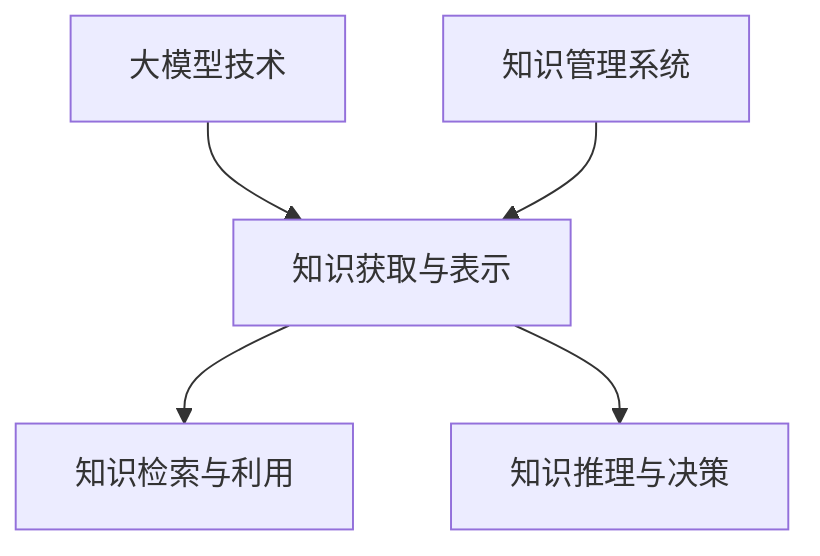
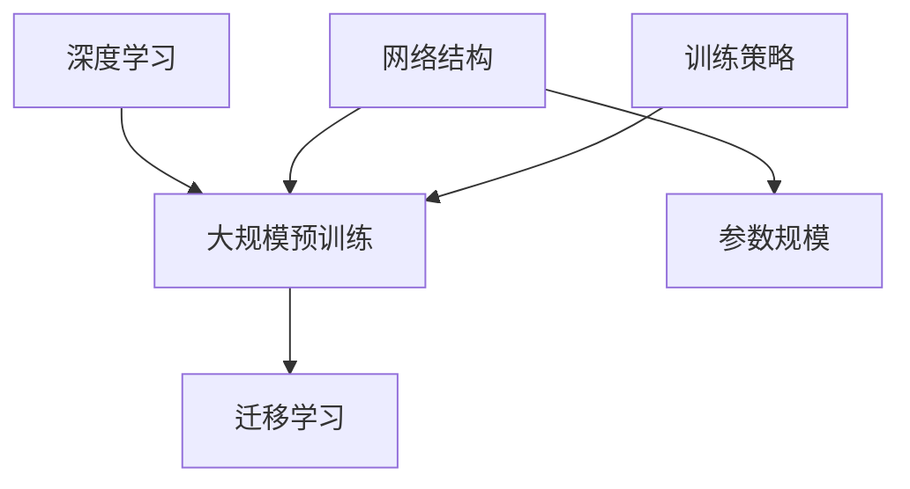
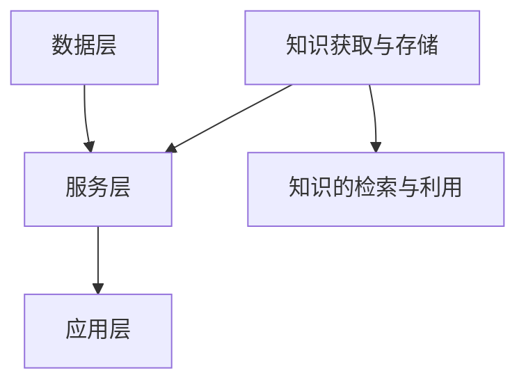
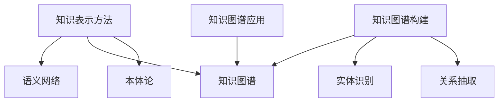
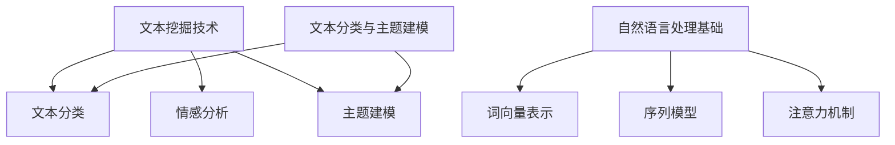
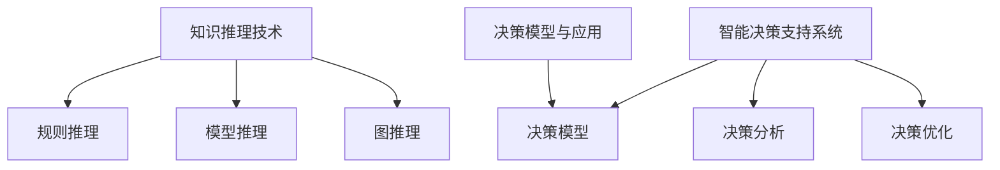
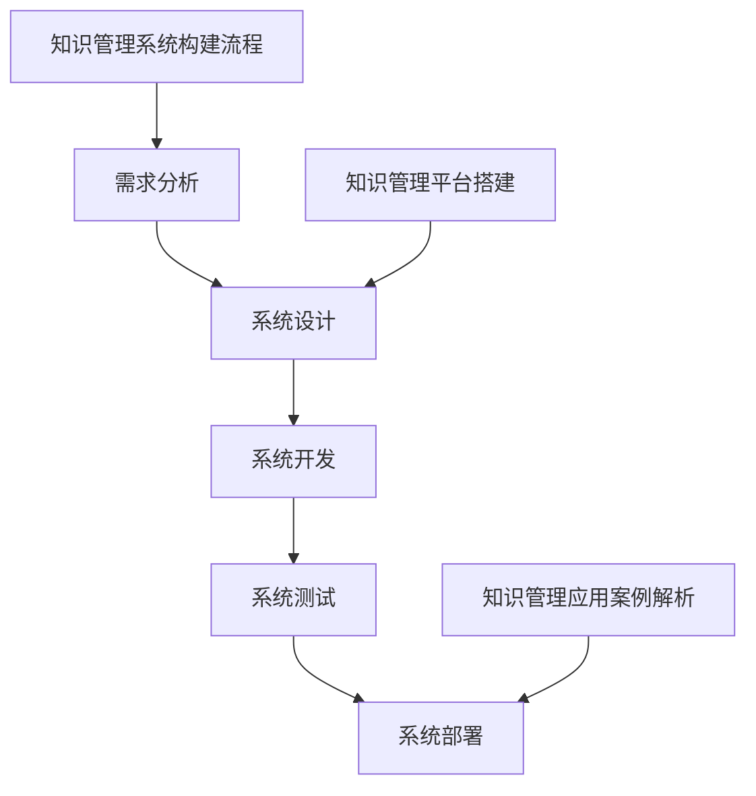
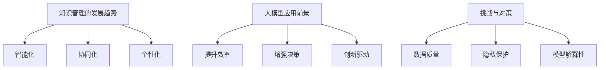

                 

### 大模型与知识管理概述

> **核心概念与联系：** 大模型与知识管理的关系可以用 Mermaid 流程图表示如下：

#### 1.1 大模型与知识管理的概念

**大模型**：大模型（Large Models）是指具有数千亿至数万亿参数的深度学习模型，如 GPT、BERT 等。这些模型通过在大量数据上进行预训练，可以学习到通用的知识表示，从而在特定任务上表现出色。

**知识管理**：知识管理（Knowledge Management）是指对组织内的知识进行获取、存储、共享、利用和传播的过程。它包括知识的获取、存储、检索、利用和分享等方面。

#### 1.2 大模型在知识管理中的作用

大模型在知识管理中发挥着重要作用，主要体现在以下几个方面：

1. **知识获取与表示**：大模型可以通过预训练模型对海量数据进行学习，从而对知识进行有效的获取和表示。例如，GPT 模型可以学习到语言的语义表示，BERT 模型可以学习到词与词之间的关系。

2. **知识检索与利用**：大模型可以帮助用户快速找到所需的知识，提高知识检索的效率和准确性。例如，使用 GPT 模型可以快速生成与用户输入相关的内容，从而帮助用户获取所需的知识。

3. **知识推理与决策**：大模型可以进行逻辑推理，为企业的决策提供支持。例如，使用 GPT 模型可以生成不同决策方案的评估报告，帮助企业管理者做出更明智的决策。

#### 1.3 知识管理在大模型企业中的重要性

知识管理在大模型企业中的重要性体现在以下几个方面：

1. **提升创新能力**：知识管理可以帮助企业快速获取前沿知识，推动创新。例如，通过大模型对海量文献进行自动分类和摘要，企业可以快速了解领域内的最新研究进展。

2. **提高运营效率**：知识管理可以帮助企业优化业务流程，提高运营效率。例如，通过大模型对历史数据进行分析，企业可以发现潜在的业务优化点，从而提高整体运营效率。

3. **增强竞争力**：知识管理可以帮助企业建立竞争优势，提高市场竞争力。例如，通过大模型对市场数据进行分析，企业可以准确预测市场趋势，从而在市场竞争中占据有利地位。

---

### 大模型技术基础

> **核心概念与联系：** 大模型技术基础可以用 Mermaid 流程图表示如下：

#### 2.1 大模型的基本原理

大模型的基本原理主要包括以下几个方面：

1. **深度学习**：大模型是基于深度学习技术构建的，深度学习是一种基于多层神经网络的学习方法，通过多层神经网络对数据进行分析和学习。

2. **大规模预训练**：大模型通过在大量数据上进行预训练，学习到通用的知识表示。预训练过程中，模型会学习到数据中的底层结构和规律，从而在特定任务上表现出色。

3. **迁移学习**：大模型可以通过迁移学习，将预训练的知识应用到特定任务中。迁移学习可以大大减少特定任务的训练数据需求，提高模型的泛化能力。

#### 2.2 大模型的架构设计

大模型的架构设计主要包括以下几个方面：

1. **网络结构**：大模型的网络结构通常包含多个层次，如 Transformer、BERT 等。这些结构可以有效地捕捉数据中的复杂关系。

2. **参数规模**：大模型的参数规模通常达到数千亿至数万亿级别。大规模参数可以让模型学习到更丰富的知识表示。

3. **训练策略**：大模型的训练策略通常包括分布式训练、模型剪枝等。分布式训练可以加速模型的训练过程，模型剪枝可以降低模型的复杂度，提高模型的运行效率。

#### 2.3 大模型的训练与优化

大模型的训练与优化主要包括以下几个方面：

1. **数据准备**：大模型的训练需要大量的数据，数据的质量和多样性对模型的效果有很大影响。因此，在训练前需要进行数据清洗和预处理，确保数据的质量。

2. **训练算法**：大模型的训练算法通常包括 SGD、Adam 等。这些算法可以有效地优化模型的参数，提高模型的性能。

3. **优化策略**：大模型的优化策略包括模型剪枝、量化、蒸馏等。模型剪枝可以降低模型的复杂度，量化可以降低模型的存储和计算需求，蒸馏可以将预训练模型的知识传递给特定任务模型。

---

### 知识管理系统设计

> **核心概念与联系：** 知识管理系统设计可以用 Mermaid 流程图表示如下：

#### 3.1 知识管理系统的架构

知识管理系统的架构主要包括数据层、服务层和应用层：

1. **数据层**：包括数据的存储、清洗、加工等。这一层负责数据的获取和管理，是知识管理系统的基础。

2. **服务层**：包括知识检索、知识推荐、知识推理等。这一层提供核心的知识管理功能，是知识管理系统的心脏。

3. **应用层**：包括企业内部的知识管理应用，如知识库、问答系统等。这一层将知识管理系统的功能应用到实际业务中，是知识管理系统的应用端。

#### 3.2 知识获取与存储

知识获取与存储是知识管理系统的核心组成部分：

1. **知识获取**：知识获取是指从各种来源（如内部文档、外部数据库、互联网等）收集知识的过程。这一过程包括数据爬取、知识抽取、数据清洗等步骤。

2. **知识存储**：知识存储是指将获取到的知识存储到数据库或知识库中，以便后续的检索和使用。知识库的设计和实现需要考虑数据的结构化、可扩展性和访问效率。

#### 3.3 知识的检索与利用

知识的检索与利用是知识管理系统的重要功能：

1. **知识检索**：知识检索是指用户通过关键词搜索、语义搜索等方式，从知识库中快速找到所需的知识。有效的知识检索依赖于知识库的索引、查询算法和用户界面设计。

2. **知识利用**：知识利用是指将检索到的知识应用到实际业务场景中，如辅助决策、智能问答、知识推荐等。知识利用需要结合具体的业务需求和场景，设计相应的应用场景和业务逻辑。

---

### 知识表示与图谱构建

> **核心概念与联系：** 知识表示与图谱构建可以用 Mermaid 流程图表示如下：

#### 4.1 知识表示方法

知识表示是将知识以计算机可处理的方式表达和存储的过程。常用的知识表示方法包括：

1. **语义网络**：语义网络通过节点和边来表示实体和实体之间的关系。每个节点代表一个实体，边表示实体之间的关联。

2. **知识图谱**：知识图谱是一种大规模的图结构，包含大量节点和边。节点代表实体，边表示实体之间的关系。知识图谱可以直观地表示复杂的关系和知识结构。

3. **本体论**：本体论是通过定义概念和概念之间的关系来表示知识。本体论可以提供一种语义基础，用于知识表示和推理。

#### 4.2 知识图谱构建

知识图谱构建是指从各种数据源中提取知识，并将其组织成图谱结构的过程。知识图谱构建主要包括以下步骤：

1. **数据源获取**：从内部数据库、外部数据库、互联网等数据源中获取数据。

2. **实体识别**：识别出文本中的实体，如人名、地名、机构名等。

3. **关系抽取**：从文本中抽取实体之间的关系，如“张三工作于阿里巴巴”。

4. **知识融合**：将来自不同数据源的知识进行融合，构建完整的知识图谱。

#### 4.3 知识图谱的应用

知识图谱的应用非常广泛，包括以下几个方面：

1. **知识检索**：通过知识图谱，可以实现更精准的知识检索。例如，用户输入一个关键词，知识图谱可以快速找到与之相关的所有知识实体和关系。

2. **智能问答**：通过知识图谱，可以实现智能问答系统。例如，用户提出一个问题，知识图谱可以快速找到与之相关的答案。

3. **推荐系统**：通过知识图谱，可以实现更精准的推荐系统。例如，用户浏览了某个产品，知识图谱可以推荐与之相关的其他产品。

---

### 文本挖掘与自然语言处理

> **核心概念与联系：** 文本挖掘与自然语言处理可以用 Mermaid 流程图表示如下：

#### 5.1 文本挖掘技术

文本挖掘技术是指从大量文本数据中提取有用信息的方法。文本挖掘技术主要包括：

1. **文本分类**：文本分类是将文本分为不同的类别。常见的文本分类方法包括朴素贝叶斯、支持向量机、深度学习等。

2. **情感分析**：情感分析是分析文本的情感倾向。情感分析可以帮助企业了解用户对产品的态度，为市场策略提供支持。

3. **主题建模**：主题建模是发现文本中的主题。主题建模可以帮助企业了解用户关注的热点话题，为内容营销提供依据。

#### 5.2 自然语言处理基础

自然语言处理基础是文本挖掘技术的基石，主要包括：

1. **词向量表示**：词向量表示是将文本转换为向量的表示。词向量可以捕捉词与词之间的语义关系。

2. **序列模型**：序列模型是处理文本序列的模型。常见的序列模型包括循环神经网络（RNN）、长短时记忆网络（LSTM）等。

3. **注意力机制**：注意力机制是在模型中引入注意力机制，以关注文本中的关键信息。注意力机制可以显著提高模型的性能。

#### 5.3 文本分类与主题建模

文本分类与主题建模是文本挖掘技术的核心应用，主要包括：

1. **文本分类**：文本分类是将文本分类到不同的类别。文本分类可以帮助企业对用户反馈进行分类，为客服、市场等业务提供支持。

2. **主题建模**：主题建模是发现文本中的主题。主题建模可以帮助企业了解用户关注的热点话题，为内容创作、产品改进等提供依据。

3. **跨语言文本处理**：跨语言文本处理是处理不同语言之间的文本。跨语言文本处理可以帮助企业扩展国际市场，为全球化战略提供支持。

---

### 知识推理与智能决策

> **核心概念与联系：** 知识推理与智能决策可以用 Mermaid 流程图表示如下：

#### 6.1 知识推理技术

知识推理技术是利用已有知识进行推理，以获得新知识或验证假设的过程。知识推理技术主要包括：

1. **规则推理**：规则推理是基于一组预先定义的规则进行推理。规则推理通常用于简单的问题域，如基于规则的专家系统。

2. **模型推理**：模型推理是基于数学模型进行推理。模型推理通常用于复杂的问题域，如决策支持系统、优化问题等。

3. **图推理**：图推理是基于图结构进行推理。图推理可以处理复杂的关系和知识结构，如知识图谱、本体论等。

#### 6.2 智能决策支持系统

智能决策支持系统（DSS）是一种利用计算机技术和人工智能技术辅助决策的系统。智能决策支持系统主要包括：

1. **决策模型**：决策模型是基于数学模型和算法构建的，用于解决特定决策问题。

2. **决策分析**：决策分析是对决策问题进行分析和评估，以确定最佳决策方案。

3. **决策优化**：决策优化是基于优化算法和数学模型，以最小化成本或最大化效益为目标，寻找最佳决策方案。

#### 6.3 决策模型与应用

决策模型与应用是将决策模型应用于实际业务场景的过程。决策模型与应用主要包括：

1. **预测模型**：预测模型用于预测未来的趋势和结果，如销售预测、库存管理等。

2. **优化模型**：优化模型用于优化资源分配和调度，如物流调度、生产计划等。

3. **应用实例**：应用实例是将决策模型应用于实际业务场景的案例，如金融风险评估、供应链优化等。

---

### 知识管理系统的构建实践

> **核心概念与联系：** 知识管理系统的构建实践可以用 Mermaid 流程图表示如下：

#### 7.1 知识管理系统构建流程

知识管理系统的构建流程包括以下几个关键步骤：

1. **需求分析**：需求分析是构建知识管理系统的第一步，旨在明确企业内部的知识管理需求和目标。通过访谈、问卷调查等方式，了解用户的需求和期望，为后续的系统设计提供依据。

2. **系统设计**：系统设计是根据需求分析的结果，设计知识管理系统的整体架构和功能模块。系统设计需要考虑数据层、服务层和应用层的架构，以及各模块之间的交互和协作。

3. **系统开发**：系统开发是将设计转化为实际的软件产品。在系统开发过程中，需要编写代码、设计数据库、搭建开发环境等。系统开发需要遵循软件工程的最佳实践，确保系统的稳定性和可维护性。

4. **系统测试**：系统测试是验证知识管理系统功能是否符合需求的过程。系统测试包括单元测试、集成测试、性能测试等，以确保系统的可靠性、安全性和性能。

5. **系统部署**：系统部署是将知识管理系统部署到生产环境，供用户使用。系统部署需要确保系统的稳定运行，并进行必要的维护和更新。

#### 7.2 知识管理平台搭建

知识管理平台搭建是知识管理系统构建的重要组成部分。知识管理平台搭建包括以下几个方面：

1. **硬件搭建**：硬件搭建是搭建知识管理平台的基础，包括服务器、存储设备、网络设备等。硬件搭建需要考虑系统的性能、扩展性和可靠性。

2. **软件搭建**：软件搭建是搭建知识管理平台的软件环境，包括操作系统、数据库、中间件等。软件搭建需要选择合适的软件，确保系统的稳定性和安全性。

3. **系统集成**：系统集成是将各个模块进行集成，确保知识管理平台的整体功能。系统集成需要解决各个模块之间的兼容性和协作问题。

#### 7.3 知识管理应用案例解析

知识管理应用案例解析是通过具体的企业知识管理应用案例，分析案例中的问题解决方案、经验教训等。知识管理应用案例解析包括以下几个方面：

1. **案例分析**：对具体的企业知识管理应用案例进行分析，包括案例的背景、目标、实施过程和效果等。

2. **问题解决**：分析案例中遇到的问题，包括技术难题、管理挑战等，并探讨解决方案。

3. **经验分享**：分享案例中的经验教训，包括成功经验和失败教训，为其他企业提供参考。

---

### 大模型企业知识管理的未来展望

> **核心概念与联系：** 大模型企业知识管理的未来展望可以用 Mermaid 流程图表示如下：

#### 8.1 知识管理的发展趋势

知识管理的发展趋势体现在以下几个方面：

1. **智能化**：随着人工智能技术的发展，知识管理将越来越智能化。智能化知识管理可以自动进行知识获取、知识推理、知识推荐等操作，提高知识管理的效率和准确性。

2. **协同化**：知识管理将更加注重协同。企业内部的知识将更加共享，员工可以方便地获取和利用他人的知识，提高整体的知识利用率。

3. **个性化**：知识管理将更加注重个性化。系统可以根据用户的需求和行为，为其推荐相关的知识和信息，提供个性化的知识服务。

#### 8.2 大模型在企业知识管理中的应用前景

大模型在企业知识管理中的应用前景非常广阔，主要体现在以下几个方面：

1. **提升效率**：大模型可以帮助企业快速获取和利用知识，提高工作效率。例如，大模型可以自动生成报告、摘要，为企业决策提供支持。

2. **增强决策**：大模型可以帮助企业做出更准确的决策。例如，通过分析大量数据，大模型可以预测市场趋势、评估风险等。

3. **创新驱动**：大模型可以为企业提供创新动力。通过学习海量数据，大模型可以发现新的知识、洞察和机会，推动企业的创新和发展。

#### 8.3 挑战与对策

大模型企业知识管理面临着一系列挑战：

1. **数据质量**：数据质量对大模型的效果有很大影响。为了提高数据质量，企业需要建立数据质量管理体系，对数据进行清洗、验证和更新。

2. **隐私保护**：在利用大数据进行知识管理的过程中，如何保护用户的隐私是一个重要问题。企业需要采取有效的隐私保护措施，如数据加密、访问控制等。

3. **模型解释性**：大模型通常被称为“黑箱”，其决策过程缺乏解释性。为了提高模型的解释性，企业可以采用可解释性模型、模型可视化等技术。

---

### 附录A：知识管理系统开发工具与资源

#### A.1 知识管理工具介绍

知识管理工具是构建知识管理系统的重要组成部分。以下是一些常用的知识管理工具：

1. **开源工具**：

   - **Apache Nutch**：Apache Nutch 是一个开源的搜索引擎项目，用于构建企业搜索引擎。

   - **OpenNLP**：OpenNLP 是一个开源的自然语言处理工具包，提供文本分类、分词、句法分析等功能。

2. **商业工具**：

   - **IBM Content Manager**：IBM Content Manager 是一个集成的文档管理和内容管理平台，提供文档存储、检索、协作等功能。

   - **Oracle UCM**：Oracle Universal Content Management（UCM）是一个全面的文档管理和内容管理解决方案，支持企业级的文档管理需求。

3. **第三方工具**：

   - **LucidWorks**：LucidWorks 是一个基于 Apache Lucene 和 Apache Solr 的商业搜索引擎平台，提供强大的搜索和分析功能。

   - **MarkLogic**：MarkLogic 是一个企业级数据库，支持结构化、半结构化和非结构化数据的存储、检索和查询。

#### A.2 大模型开发环境搭建

搭建大模型开发环境需要以下工具和软件：

1. **硬件环境**：

   - **GPU服务器**：由于大模型训练需要大量的计算资源，因此需要配备高性能的 GPU 服务器。

   - **Docker**：Docker 是一个开源的应用容器引擎，用于创建、运行和分发应用程序。Docker 可以帮助快速搭建和配置开发环境。

2. **软件环境**：

   - **Python**：Python 是一种广泛使用的编程语言，特别是在数据科学和机器学习领域。

   - **TensorFlow**：TensorFlow 是一个开源的机器学习框架，支持大模型的训练和部署。

3. **开发工具**：

   - **Jupyter Notebook**：Jupyter Notebook 是一个交互式开发环境，支持 Python 等多种编程语言，便于进行数据分析和模型训练。

   - **PyCharm**：PyCharm 是一个集成开发环境（IDE），提供强大的代码编辑、调试和测试功能。

#### A.3 知识图谱构建工具与库

知识图谱构建是知识管理系统的重要组成部分。以下是一些常用的知识图谱构建工具和库：

1. **开源库**：

   - **Neo4j**：Neo4j 是一个开源的图数据库，支持大规模图数据的存储和查询。

   - **Apache Jena**：Apache Jena 是一个开源的框架，用于构建语义网

### 总结

本文深入探讨了《大模型企业的知识管理系统》这一主题，从多个角度详细阐述了知识管理在大模型企业中的重要性、大模型技术基础、知识管理系统设计、知识表示与图谱构建、文本挖掘与自然语言处理、知识推理与智能决策、知识管理系统的构建实践以及大模型企业知识管理的未来展望。

首先，我们明确了大模型和知识管理的概念，并分析了大模型在知识管理中的作用。接着，我们详细介绍了大模型的基本原理、架构设计和训练优化策略，为后续的知识管理系统设计提供了技术基础。

然后，我们重点讨论了知识管理系统的架构设计，包括数据层、服务层和应用层的构建。同时，我们还探讨了知识获取与存储、知识的检索与利用等核心问题，为知识管理系统的实际应用提供了理论支持。

在知识表示与图谱构建部分，我们介绍了知识表示方法、知识图谱构建步骤和应用，展示了如何通过知识图谱实现知识检索、智能问答和推荐系统等功能。

接下来，我们探讨了文本挖掘与自然语言处理技术，包括文本分类、情感分析和主题建模等，展示了如何从文本数据中提取有用信息，并利用自然语言处理技术提升知识管理的效率和准确性。

在知识推理与智能决策部分，我们介绍了知识推理技术、智能决策支持系统的构建和应用，展示了如何通过知识推理和智能决策技术辅助企业做出更明智的决策。

随后，我们详细介绍了知识管理系统的构建实践，包括需求分析、系统设计、系统开发、系统测试和系统部署等步骤，并提供了知识管理平台搭建和知识管理应用案例解析的实例。

最后，我们展望了大模型企业知识管理的未来发展趋势、应用前景以及面临的挑战，为读者提供了对这一领域的深入理解和思考。

总之，本文通过系统性的分析和阐述，为构建和优化大模型企业的知识管理系统提供了全面的理论和实践指导。希望本文能为从事知识管理和人工智能领域的专业人士提供有价值的参考和启示。

### 作者信息

**作者：AI天才研究院/AI Genius Institute & 禅与计算机程序设计艺术 /Zen And The Art of Computer Programming**

AI天才研究院（AI Genius Institute）致力于推动人工智能技术的创新与发展，专注于研究大模型、知识管理和智能决策等前沿领域。研究院拥有一支由世界顶级人工智能专家、程序员和软件架构师组成的团队，他们的研究成果在计算机科学和技术领域具有广泛的影响力。

《禅与计算机程序设计艺术》（Zen And The Art of Computer Programming）是作者Donald E. Knuth的经典著作，深入探讨了计算机编程的艺术和哲学，对计算机科学的发展产生了深远的影响。作者以其深厚的技术功底和哲学思考，为读者提供了独特的视角和洞见。

