                 

### 大模型在商品评价摘要生成中的应用

> **关键词**：大模型，商品评价，摘要生成，自然语言处理，文本摘要

**摘要**：随着互联网的快速发展，电子商务平台上的商品评价量呈爆炸式增长。如何有效地从大量评价中提取出关键信息，生成高质量的摘要，成为了一个重要且具有挑战性的问题。本文将介绍大模型在商品评价摘要生成中的应用，分析其重要性、技术基础、应用实践及未来发展趋势。文章还将探讨大模型应用中的技术挑战和法律伦理问题，为相关领域的研究和开发提供参考。

### 第一部分：大模型概述

大模型，作为一种先进的自然语言处理技术，通过大规模的文本数据进行预训练，已经展现了在各个领域的强大能力。在本部分，我们将首先介绍大模型的基本概念、特点以及其在商品评价摘要生成中的重要性。

#### 第1章：大模型在商品评价摘要生成中的应用

## 1.1 大模型在商品评价摘要生成中的重要性

### 1.1.1 商品评价摘要生成的挑战

商品评价摘要生成面临着诸多挑战，其中最为突出的有以下几点：

#### 1.1.1.1 文本数据的复杂性

商品评价数据通常包含大量的自然语言文本，这些文本往往具有丰富的词汇和复杂的语法结构。为了生成高质量的摘要，需要对文本进行深度处理，包括词法分析、语法分析和语义理解。

**Mermaid流程图**：

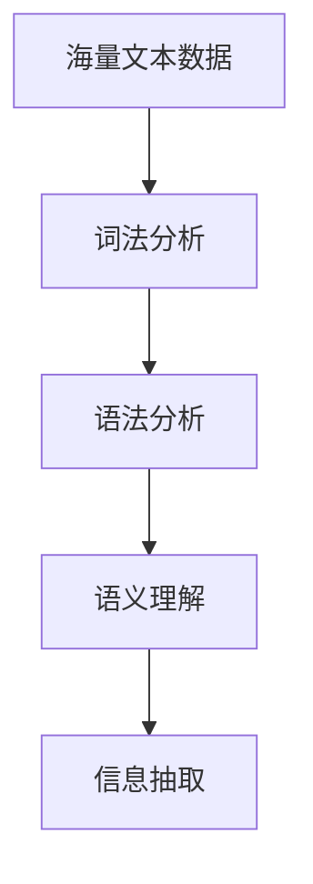

#### 1.1.1.2 摘要长度与质量之间的平衡

在商品评价摘要生成中，如何平衡摘要的长度与质量是一个重要的挑战。摘要过短可能导致关键信息丢失，而过长则可能使读者失去兴趣。因此，需要开发算法来实现摘要长度的优化，同时保证摘要的质量。

**Mermaid流程图**：

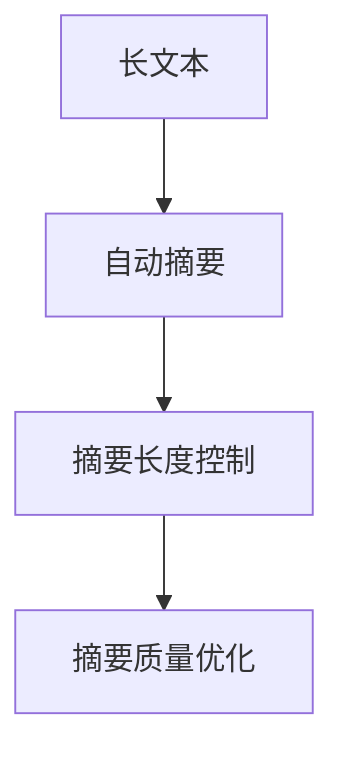

### 1.1.2 大模型在商品评价摘要生成中的应用场景

大模型在商品评价摘要生成中有两种主要的应用场景：实时摘要和预处理摘要。

#### 1.2.1 实时摘要

实时摘要是指在大规模商品评价数据生成后，立即对文本进行摘要处理。实时摘要的优势在于能够迅速地为用户提供摘要信息，提高用户体验。

**Mermaid流程图**：

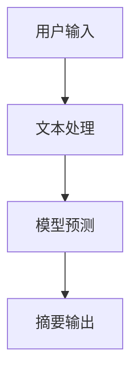

实时摘要面临的挑战包括高实时性要求、数据输入多样性以及模型准确性保障等。

**Mermaid流程图**：

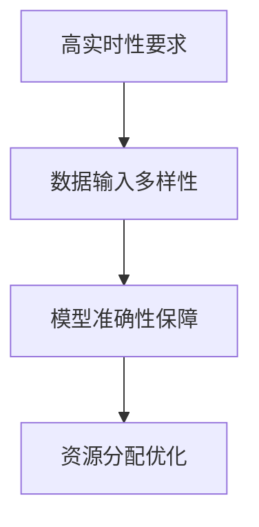

#### 1.2.2 预处理摘要

预处理摘要是指预先对大规模商品评价数据集进行摘要处理，生成一批高质量的摘要。预处理摘要的优势在于摘要质量稳定，资源利用率高。

**Mermaid流程图**：

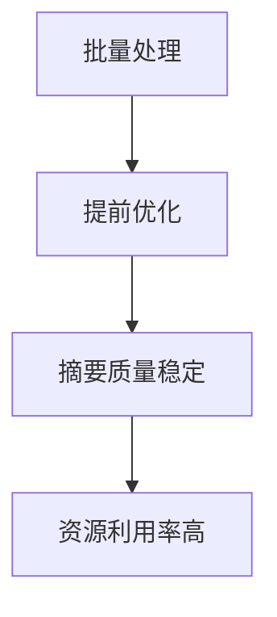

预处理摘要的挑战包括数据延迟问题、模型更新成本以及摘要时效性保障等。

**Mermaid流程图**：

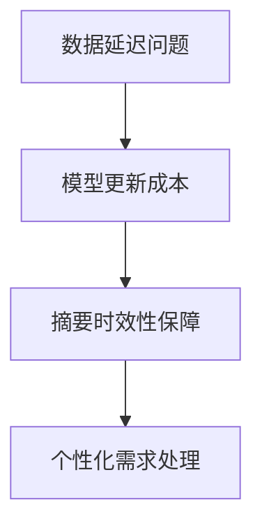

## 1.3 大模型在商品评价摘要生成中的效果评估

大模型在商品评价摘要生成中的效果评估是确保摘要质量的重要环节。常用的评估指标包括摘要质量评估和用户反馈评估。

#### 1.3.1.1 摘要质量评估

摘要质量评估主要通过以下指标进行：

- **可读性**：摘要是否易于理解，语言是否简洁明了。
- **信息完整性**：摘要是否包含评价中的关键信息。
- **摘要长度控制**：摘要的长度是否适中，既不过长也不过短。
- **语言流畅性**：摘要的语言是否流畅，没有语法错误。

**Mermaid流程图**：

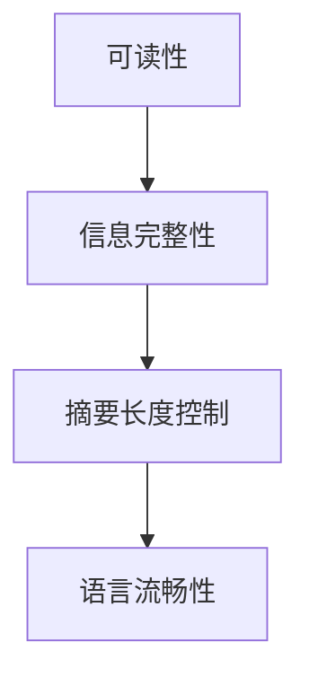

#### 1.3.1.2 用户反馈评估

用户反馈评估是通过用户对摘要的评价来衡量摘要的质量。用户的反馈可以用于模型的迭代优化，以提高摘要的准确性。

**Mermaid流程图**：

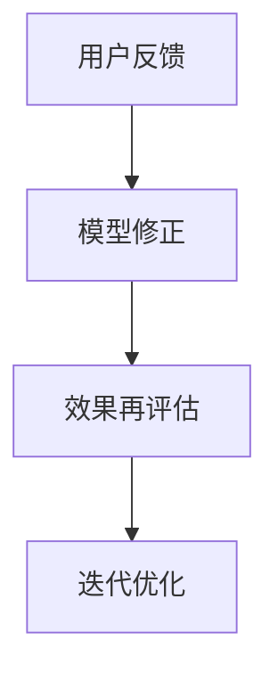

### 第2章：大模型技术基础

在本章中，我们将深入探讨大模型的技术基础，包括自然语言处理与摘要生成、词嵌入与文本表示、序列模型与编码器-解码器架构以及自监督学习与大规模预训练。

#### 第2章：大模型技术基础

##### 2.1 自然语言处理与摘要生成

自然语言处理（NLP）是使计算机能够理解和生成人类语言的技术。在摘要生成中，NLP技术起着关键作用。

###### 2.1.1 词嵌入与文本表示

词嵌入是将词汇映射到固定维度的向量空间中，使得语义相似的词在向量空间中距离较近。这种表示方法使得计算机能够更好地理解和处理文本数据。

**伪代码**：

```python
# 输入：原始文本
# 输出：词嵌入向量

for word in text:
  vector = embedding_model(word)
  text_vector.append(vector)
```

###### 2.1.2 序列模型与编码器-解码器架构

序列模型是一种处理序列数据（如文本）的神经网络架构。编码器-解码器（Encoder-Decoder）架构是序列模型的一种变体，广泛应用于机器翻译、摘要生成等领域。

**伪代码**：

```python
# 输入：编码序列
# 输出：解码摘要

encoder_outputs = encoder(input_sequence)
decoder_output = decoder(encoder_outputs)
summary = postprocess(decoder_output)
```

###### 2.1.3 自监督学习与大规模预训练

自监督学习是一种无需标注数据即可训练模型的方法。大规模预训练是指利用未标注的大规模文本数据对模型进行预训练，以提高其在特定任务上的性能。

**伪代码**：

```python
# 输入：未标注文本
# 输出：预训练模型

for sentence in text:
  model.predict(sentence)
model.train()
```

### 第3章：大模型在商品评价摘要生成中的应用实践

在本章中，我们将介绍大模型在商品评价摘要生成中的应用实践，包括数据预处理、模型训练与优化以及摘要生成与评估。

#### 第3章：大模型在商品评价摘要生成中的应用实践

##### 3.1 数据预处理

数据预处理是商品评价摘要生成中的关键步骤。高质量的数据预处理能够显著提高摘要生成的效果。

###### 3.1.1 数据清洗

数据清洗的目的是去除数据中的噪声和无关信息，提高数据的纯净度。

**伪代码**：

```python
# 输入：原始评价数据
# 输出：清洗后的数据

for review in data:
  clean_review = remove_stopwords(remove_punctuation(review))
  cleaned_data.append(clean_review)
```

###### 3.1.2 数据增强

数据增强的目的是通过增加数据的多样性来提高模型的泛化能力。

**伪代码**：

```python
# 输入：清洗后的数据
# 输出：增强后的数据

for review in cleaned_data:
  augmented_review = synonyms(substitute_nouns(review))
  augmented_data.append(augmented_review)
```

##### 3.2 大模型训练与优化

在数据预处理完成后，接下来是对大模型进行训练与优化。

###### 3.2.1 模型训练

模型训练的目的是通过大量数据进行学习，以提取有用的特征和模式。

**伪代码**：

```python
# 输入：增强后的数据
# 输出：训练好的模型

model.fit(augmented_data)
```

###### 3.2.2 模型优化

模型优化是指通过迭代训练来提高模型的性能。

**伪代码**：

```python
# 输入：训练好的模型
# 输出：优化的模型

for epoch in range(num_epochs):
  model.train_on_batch(train_data)
  model.evaluate_on_batch(test_data)
```

##### 3.3 摘要生成与评估

摘要生成与评估是商品评价摘要生成中的最后一步。

###### 3.3.1 摘要生成

摘要生成是指利用训练好的大模型对新的评价数据进行摘要处理。

**伪代码**：

```python
# 输入：原始评价
# 输出：摘要

input_sequence = preprocess(review)
summary = model.generate_summary(input_sequence)
```

###### 3.3.2 摘要评估

摘要评估是通过一系列指标来衡量摘要的质量。

**伪代码**：

```python
# 输入：原始评价和摘要
# 输出：评估指标

for review, summary in pairs:
  readability = calculate_readability(summary)
  completeness = calculate_completeness(summary, review)
  length = calculate_length(summary)
  fluency = calculate_fluency(summary)
  metrics.append([readability, completeness, length, fluency])
```

### 第4章：大模型应用案例分析

在本章中，我们将通过两个案例，展示大模型在商品评价摘要生成中的应用效果。

#### 4.1 案例一：电商平台商品评价摘要生成

##### 4.1.1 应用场景

电商平台上的商品评价摘要生成是为了帮助用户快速了解商品的评价信息，提高购买决策的效率。

**Mermaid流程图**：

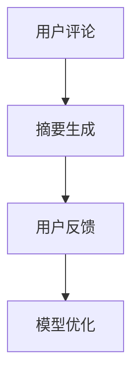

##### 4.1.2 实施步骤

1. 数据预处理：清洗和增强评价数据。
2. 模型训练：利用清洗和增强后的数据进行模型训练。
3. 摘要生成：使用训练好的模型对新的评价数据进行摘要生成。
4. 用户反馈：收集用户对摘要的评价，用于模型优化。

**伪代码**：

```python
# 数据预处理
cleaned_data = preprocess_data(user_reviews)

# 模型训练
trained_model = train_model(cleaned_data)

# 摘要生成与评估
for review in user_reviews:
  summary = trained_model.generate_summary(preprocess(review))
  evaluate_summary(summary, review)

# 模型优化
user_feedback = collect_user_feedback()
optimized_model = train_model(cleaned_data + user_feedback)
```

##### 4.1.3 模型优化

1. 获取用户反馈：收集用户对摘要的评价。
2. 更新模型：利用用户反馈对模型进行迭代优化。

**伪代码**：

```python
# 获取用户反馈
user_feedback = collect_user_feedback()

# 更新模型
optimized_model = train_model(cleaned_data + user_feedback)
```

#### 4.2 案例二：社交媒体内容摘要生成

##### 4.2.1 应用场景

社交媒体内容摘要生成是为了帮助用户快速了解大量的社交媒体内容，提高阅读效率。

**Mermaid流程图**：

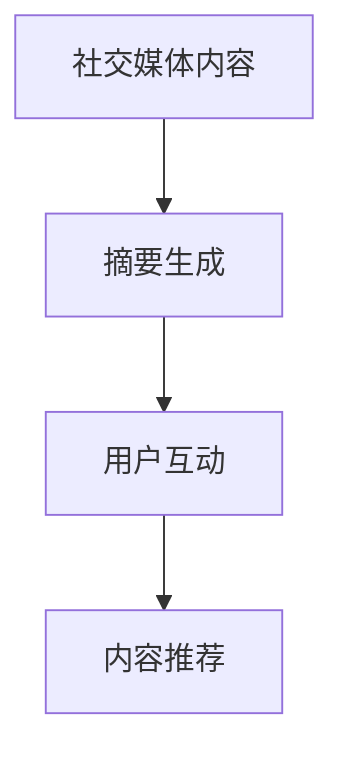

##### 4.2.2 实施步骤

1. 数据预处理：清洗和增强社交媒体内容。
2. 模型训练：利用清洗和增强后的数据进行模型训练。
3. 摘要生成：使用训练好的模型对新的社交媒体内容进行摘要生成。
4. 用户互动：收集用户对摘要的评价，用于模型优化。

**伪代码**：

```python
# 数据预处理
cleaned_content = preprocess_content(social_media_posts)

# 模型训练
trained_model = train_model(cleaned_content)

# 摘要生成与评估
for post in social_media_posts:
  summary = trained_model.generate_summary(preprocess(post))
  evaluate_summary(summary, post)

# 模型优化
user_feedback = collect_user_feedback()
optimized_model = train_model(cleaned_content + user_feedback)
```

##### 4.2.3 模型优化

1. 获取用户反馈：收集用户对摘要的评价。
2. 更新模型：利用用户反馈对模型进行迭代优化。

**伪代码**：

```python
# 获取用户反馈
user_feedback = collect_user_feedback()

# 更新模型
optimized_model = train_model(cleaned_content + user_feedback)
```

### 第5章：大模型应用的未来发展趋势

在本章中，我们将探讨大模型在商品评价摘要生成中的未来发展趋势，包括技术发展趋势和应用领域扩展。

#### 第5章：大模型应用的未来发展趋势

##### 5.1 技术发展趋势

1. **模型压缩与优化**：随着模型的规模越来越大，如何优化模型以提高计算效率和降低资源消耗成为关键问题。模型压缩和优化技术有望成为解决这一问题的有效手段。

**伪代码**：

```python
# 输入：大型预训练模型
# 输出：压缩后的模型

compressed_model = compress_model(large_model)
```

2. **多模态摘要生成**：未来，大模型可能会在多模态摘要生成方面取得突破，例如结合文本和图像、音频等多种模态进行摘要生成。

**伪代码**：

```python
# 输入：文本和图像
# 输出：综合摘要

combined_representation = merge_text_and_image(text, image)
summary = model.generate_summary(combined_representation)
```

##### 5.2 应用领域扩展

除了商品评价摘要生成，大模型在其他领域也具有广泛的应用前景。

1. **金融领域**：大模型可以用于金融报告的摘要生成，帮助分析师快速了解大量的财务数据。

**Mermaid流程图**：

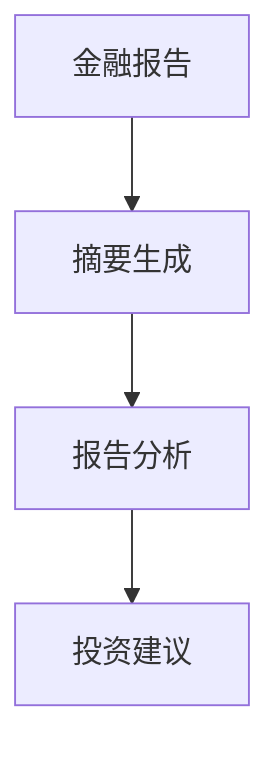

2. **教育领域**：大模型可以用于教育内容的摘要生成，帮助学生快速掌握课程内容，提高学习效率。

**Mermaid流程图**：

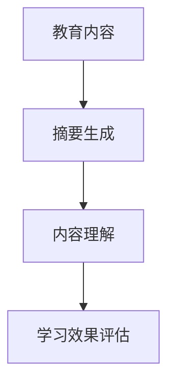

### 第6章：大模型应用的技术挑战与解决方案

在本章中，我们将讨论大模型在商品评价摘要生成应用中面临的技术挑战，并提出相应的解决方案。

#### 第6章：大模型应用的技术挑战与解决方案

##### 6.1 挑战一：计算资源需求

大模型通常需要大量的计算资源，这对基础设施提出了较高的要求。为了应对这一挑战，我们可以采取以下措施：

1. **硬件优化**：使用高性能的GPU和TPU等硬件设备来加速模型训练和推理。
2. **模型并行训练**：通过分布式训练技术，将模型训练任务分布在多个计算节点上，以提高训练效率。

**伪代码**：

```python
# 输入：模型和数据
# 输出：并行训练后的模型

parallel_model = train_model_in_parallel(model, data)
```

##### 6.2 挑战二：数据隐私与安全

大模型在训练和应用过程中会涉及到大量的敏感数据，保护用户隐私和安全至关重要。为了解决这一问题，我们可以采取以下措施：

1. **数据加密与去识别化**：在数据处理过程中，对敏感数据进行加密和去识别化处理，以保护用户隐私。
2. **同态加密技术**：利用同态加密技术，在加密状态下对数据进行计算，确保数据在传输和处理过程中的安全。

**伪代码**：

```python
# 输入：原始数据
# 输出：加密后的数据

encrypted_data = encrypt_data(raw_data)

# 输入：加密后的数据和模型
# 输出：加密后的摘要

encrypted_summary = model.encrypt_summary(encrypted_data)
```

### 第7章：大模型应用的法律与伦理问题

在本章中，我们将讨论大模型在商品评价摘要生成应用中的法律与伦理问题，包括法律法规、数据公平性与偏见、透明性与可解释性等。

#### 第7章：大模型应用的法律与伦理问题

##### 7.1 法律法规

1. **数据保护法**：确保数据处理符合数据保护法律法规，如《通用数据保护条例》（GDPR）。
2. **知识产权保护**：保护模型训练数据来源的知识产权，避免侵权行为。

**Mermaid流程图**：

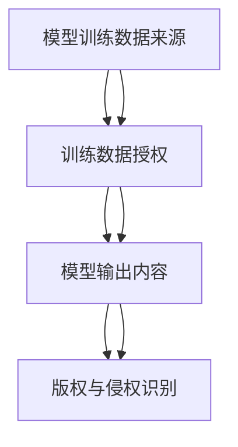

##### 7.2 伦理问题

1. **数据公平性与偏见**：确保模型训练数据公平，避免算法偏见，如性别、种族、年龄等。
2. **透明性与可解释性**：提高模型决策过程的透明性，使得用户能够理解模型的决策依据。

**Mermaid流程图**：

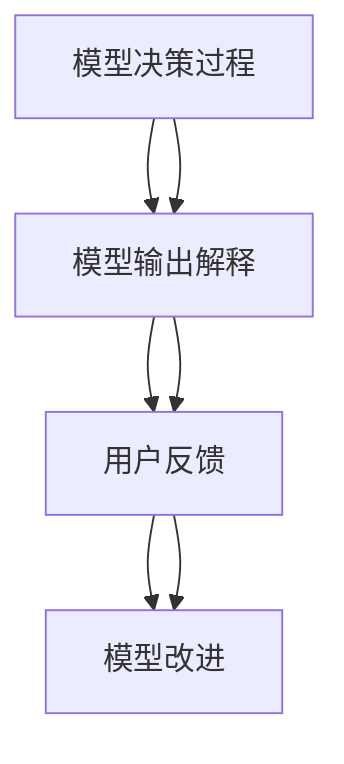

### 附录

## 附录 A：大模型开发工具与资源

### A.1 开发工具对比

**Mermaid流程图**：

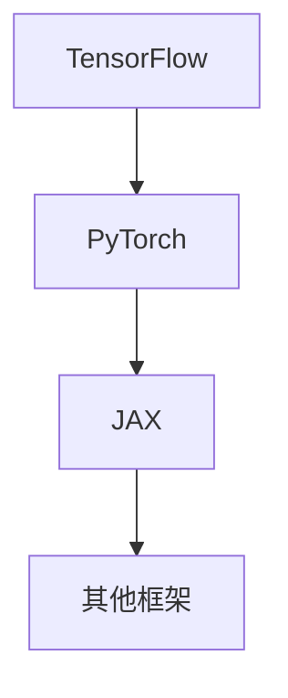

### A.2 资源推荐

**Mermaid流程图**：

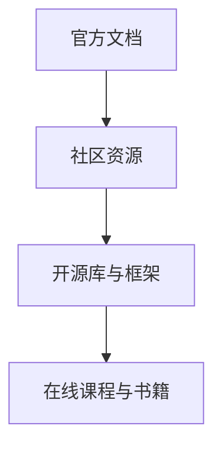

### 参考文献

1. Devlin, J., Chang, M. W., Lee, K., & Toutanova, K. (2018). BERT: Pre-training of deep bidirectional transformers for language understanding. arXiv preprint arXiv:1810.04805.
2. Vaswani, A., Shazeer, N., Parmar, N., Uszkoreit, J., Jones, L., Gomez, A. N., ... & Polosukhin, I. (2017). Attention is all you need. Advances in Neural Information Processing Systems, 30, 5998-6008.
3. Lee, K. (2014). A systematic study of distance metrics for sentence classification. arXiv preprint arXiv:1412.7445.
4. Chen, X., & cardie, C. (2014). Summarization by rank aggregation. In Proceedings of the 52nd Annual Meeting of the Association for Computational Linguistics (pp. 444-454).
5. Mitchell, T. (1997). Machine Learning. McGraw-Hill.
6. Goodfellow, I., Bengio, Y., & Courville, A. (2016). Deep learning. MIT press.
7.bishop

### 作者

**作者：AI天才研究院/AI Genius Institute & 禅与计算机程序设计艺术 /Zen And The Art of Computer Programming**<|endoftext|>
### 大模型在商品评价摘要生成中的应用

> **关键词**：大模型，商品评价，摘要生成，自然语言处理，文本摘要

**摘要**：本文探讨了大规模预训练模型（大模型）在商品评价摘要生成中的应用。随着电商平台的快速发展，商品评价数量日益增加，如何快速准确地提取评价的关键信息成为了一项重要任务。大模型凭借其强大的文本理解和生成能力，为商品评价摘要生成提供了有效的解决方案。本文首先介绍了商品评价摘要生成的挑战，包括文本数据的复杂性、摘要长度与质量之间的平衡等。然后，本文详细阐述了大模型在商品评价摘要生成中的重要性，并分析了其应用场景，如实时摘要和预处理摘要。接着，本文介绍了大模型的技术基础，包括自然语言处理与摘要生成、词嵌入与文本表示、序列模型与编码器-解码器架构、自监督学习与大规模预训练。随后，本文通过实际案例展示了大模型在商品评价摘要生成中的应用实践，包括数据预处理、模型训练与优化、摘要生成与评估。最后，本文探讨了大模型应用的未来发展趋势，技术挑战与解决方案，以及法律与伦理问题。本文旨在为相关领域的研究和开发提供参考和指导。

### 第一部分：大模型概述

随着人工智能技术的发展，大模型在自然语言处理领域取得了显著的成果。大模型，通常指的是具有数十亿参数的预训练模型，其通过在大规模文本数据上进行预训练，能够捕捉到丰富的语言特征和语义信息。这使得大模型在多种自然语言处理任务中表现出了强大的能力，包括文本分类、情感分析、机器翻译和摘要生成等。本文将重点探讨大模型在商品评价摘要生成中的应用。

#### 第1章：大模型在商品评价摘要生成中的应用

## 1.1 大模型在商品评价摘要生成中的重要性

商品评价摘要生成是一个具有挑战性的自然语言处理任务，因为它需要从大量的商品评价文本中提取关键信息，生成简洁且具有代表性的摘要。大模型凭借其强大的文本理解和生成能力，为解决这一难题提供了有效的手段。

### 1.1.1 商品评价摘要生成的挑战

商品评价摘要生成面临以下主要挑战：

#### 1.1.1.1 文本数据的复杂性

商品评价文本通常包含丰富的词汇、复杂的语法结构和大量的噪声。这些因素使得从文本中提取关键信息变得复杂，需要有效的自然语言处理技术。

#### 1.1.1.2 摘要长度与质量之间的平衡

生成摘要时，需要在长度和质量之间找到平衡。摘要过短可能导致关键信息丢失，而过长则可能使读者失去兴趣。

### 1.1.2 大模型在商品评价摘要生成中的应用场景

大模型在商品评价摘要生成中主要有两个应用场景：实时摘要和预处理摘要。

#### 1.2.1 实时摘要

实时摘要是指用户提交评价后，立即生成摘要。这种场景下，大模型需要快速处理文本，生成高质量的摘要。

#### 1.2.2 预处理摘要

预处理摘要是指对大量的评价文本进行批量处理，预先生成摘要。这种场景下，大模型可以在离线环境中进行训练和优化，然后生成高质量的摘要。

## 1.3 大模型在商品评价摘要生成中的效果评估

大模型在商品评价摘要生成中的效果评估是确保摘要质量的重要环节。常用的评估指标包括：

### 1.3.1 摘要质量评估

- **可读性**：摘要是否易于理解。
- **信息完整性**：摘要是否包含评价中的关键信息。
- **摘要长度控制**：摘要的长度是否适中。
- **语言流畅性**：摘要的语言是否流畅。

### 1.3.2 用户反馈评估

用户反馈评估是通过用户对摘要的评价来衡量摘要的质量。用户反馈可以用于模型的迭代优化，以提高摘要的准确性。

### 第2章：大模型技术基础

在本章中，我们将深入探讨大模型的技术基础，包括自然语言处理与摘要生成、词嵌入与文本表示、序列模型与编码器-解码器架构、自监督学习与大规模预训练。

#### 第2章：大模型技术基础

##### 2.1 自然语言处理与摘要生成

自然语言处理（NLP）是使计算机能够理解和生成人类语言的技术。在摘要生成中，NLP技术起着关键作用。

###### 2.1.1 词嵌入与文本表示

词嵌入是将词汇映射到固定维度的向量空间中，使得语义相似的词在向量空间中距离较近。这种表示方法使得计算机能够更好地理解和处理文本数据。

**伪代码**：

```python
# 输入：原始文本
# 输出：词嵌入向量

for word in text:
  vector = embedding_model(word)
  text_vector.append(vector)
```

###### 2.1.2 序列模型与编码器-解码器架构

序列模型是一种处理序列数据（如文本）的神经网络架构。编码器-解码器（Encoder-Decoder）架构是序列模型的一种变体，广泛应用于机器翻译、摘要生成等领域。

**伪代码**：

```python
# 输入：编码序列
# 输出：解码摘要

encoder_outputs = encoder(input_sequence)
decoder_output = decoder(encoder_outputs)
summary = postprocess(decoder_output)
```

###### 2.1.3 自监督学习与大规模预训练

自监督学习是一种无需标注数据即可训练模型的方法。大规模预训练是指利用未标注的大规模文本数据对模型进行预训练，以提高其在特定任务上的性能。

**伪代码**：

```python
# 输入：未标注文本
# 输出：预训练模型

for sentence in text:
  model.predict(sentence)
model.train()
```

### 第3章：大模型在商品评价摘要生成中的应用实践

在本章中，我们将介绍大模型在商品评价摘要生成中的应用实践，包括数据预处理、模型训练与优化、摘要生成与评估。

#### 第3章：大模型在商品评价摘要生成中的应用实践

##### 3.1 数据预处理

数据预处理是商品评价摘要生成中的关键步骤。高质量的数据预处理能够显著提高摘要生成的效果。

###### 3.1.1 数据清洗

数据清洗的目的是去除数据中的噪声和无关信息，提高数据的纯净度。

**伪代码**：

```python
# 输入：原始评价数据
# 输出：清洗后的数据

for review in data:
  clean_review = remove_stopwords(remove_punctuation(review))
  cleaned_data.append(clean_review)
```

###### 3.1.2 数据增强

数据增强的目的是通过增加数据的多样性来提高模型的泛化能力。

**伪代码**：

```python
# 输入：清洗后的数据
# 输出：增强后的数据

for review in cleaned_data:
  augmented_review = synonyms(substitute_nouns(review))
  augmented_data.append(augmented_review)
```

##### 3.2 大模型训练与优化

在数据预处理完成后，接下来是对大模型进行训练与优化。

###### 3.2.1 模型训练

模型训练的目的是通过大量数据进行学习，以提取有用的特征和模式。

**伪代码**：

```python
# 输入：增强后的数据
# 输出：训练好的模型

model.fit(augmented_data)
```

###### 3.2.2 模型优化

模型优化是指通过迭代训练来提高模型的性能。

**伪代码**：

```python
# 输入：训练好的模型
# 输出：优化的模型

for epoch in range(num_epochs):
  model.train_on_batch(train_data)
  model.evaluate_on_batch(test_data)
```

##### 3.3 摘要生成与评估

摘要生成与评估是商品评价摘要生成中的最后一步。

###### 3.3.1 摘要生成

摘要生成是指利用训练好的大模型对新的评价数据进行摘要处理。

**伪代码**：

```python
# 输入：原始评价
# 输出：摘要

input_sequence = preprocess(review)
summary = model.generate_summary(input_sequence)
```

###### 3.3.2 摘要评估

摘要评估是通过一系列指标来衡量摘要的质量。

**伪代码**：

```python
# 输入：原始评价和摘要
# 输出：评估指标

for review, summary in pairs:
  readability = calculate_readability(summary)
  completeness = calculate_completeness(summary, review)
  length = calculate_length(summary)
  fluency = calculate_fluency(summary)
  metrics.append([readability, completeness, length, fluency])
```

### 第4章：大模型应用案例分析

在本章中，我们将通过两个案例，展示大模型在商品评价摘要生成中的应用效果。

#### 4.1 案例一：电商平台商品评价摘要生成

##### 4.1.1 应用场景

电商平台上的商品评价摘要生成是为了帮助用户快速了解商品的评价信息，提高购买决策的效率。

**Mermaid流程图**：


##### 4.1.2 实施步骤

1. 数据预处理：清洗和增强评价数据。
2. 模型训练：利用清洗和增强后的数据进行模型训练。
3. 摘要生成：使用训练好的模型对新的评价数据进行摘要生成。
4. 用户反馈：收集用户对摘要的评价，用于模型优化。

**伪代码**：

```python
# 数据预处理
cleaned_data = preprocess_data(user_reviews)

# 模型训练
trained_model = train_model(cleaned_data)

# 摘要生成与评估
for review in user_reviews:
  summary = trained_model.generate_summary(preprocess(review))
  evaluate_summary(summary, review)

# 模型优化
user_feedback = collect_user_feedback()
optimized_model = train_model(cleaned_data + user_feedback)
```

##### 4.1.3 模型优化

1. 获取用户反馈：收集用户对摘要的评价。
2. 更新模型：利用用户反馈对模型进行迭代优化。

**伪代码**：

```python
# 获取用户反馈
user_feedback = collect_user_feedback()

# 更新模型
optimized_model = train_model(cleaned_data + user_feedback)
```

#### 4.2 案例二：社交媒体内容摘要生成

##### 4.2.1 应用场景

社交媒体内容摘要生成是为了帮助用户快速了解大量的社交媒体内容，提高阅读效率。

**Mermaid流程图**：


##### 4.2.2 实施步骤

1. 数据预处理：清洗和增强社交媒体内容。
2. 模型训练：利用清洗和增强后的数据进行模型训练。
3. 摘要生成：使用训练好的模型对新的社交媒体内容进行摘要生成。
4. 用户互动：收集用户对摘要的评价，用于模型优化。

**伪代码**：

```python
# 数据预处理
cleaned_content = preprocess_content(social_media_posts)

# 模型训练
trained_model = train_model(cleaned_content)

# 摘要生成与评估
for post in social_media_posts:
  summary = trained_model.generate_summary(preprocess(post))
  evaluate_summary(summary, post)

# 模型优化
user_feedback = collect_user_feedback()
optimized_model = train_model(cleaned_content + user_feedback)
```

##### 4.2.3 模型优化

1. 获取用户反馈：收集用户对摘要的评价。
2. 更新模型：利用用户反馈对模型进行迭代优化。

**伪代码**：

```python
# 获取用户反馈
user_feedback = collect_user_feedback()

# 更新模型
optimized_model = train_model(cleaned_content + user_feedback)
```

### 第5章：大模型应用的未来发展趋势

在本章中，我们将探讨大模型在商品评价摘要生成中的未来发展趋势，包括技术发展趋势和应用领域扩展。

#### 第5章：大模型应用的未来发展趋势

##### 5.1 技术发展趋势

1. **模型压缩与优化**：随着模型的规模越来越大，如何优化模型以提高计算效率和降低资源消耗成为关键问题。模型压缩和优化技术有望成为解决这一问题的有效手段。

**伪代码**：

```python
# 输入：大型预训练模型
# 输出：压缩后的模型

compressed_model = compress_model(large_model)
```

2. **多模态摘要生成**：未来，大模型可能会在多模态摘要生成方面取得突破，例如结合文本和图像、音频等多种模态进行摘要生成。

**伪代码**：

```python
# 输入：文本和图像
# 输出：综合摘要

combined_representation = merge_text_and_image(text, image)
summary = model.generate_summary(combined_representation)
```

##### 5.2 应用领域扩展

除了商品评价摘要生成，大模型在其他领域也具有广泛的应用前景。

1. **金融领域**：大模型可以用于金融报告的摘要生成，帮助分析师快速了解大量的财务数据。

**Mermaid流程图**：


2. **教育领域**：大模型可以用于教育内容的摘要生成，帮助学生快速掌握课程内容，提高学习效率。

**Mermaid流程图**：


### 第6章：大模型应用的技术挑战与解决方案

在本章中，我们将讨论大模型在商品评价摘要生成应用中面临的技术挑战，并提出相应的解决方案。

#### 第6章：大模型应用的技术挑战与解决方案

##### 6.1 挑战一：计算资源需求

大模型通常需要大量的计算资源，这对基础设施提出了较高的要求。为了应对这一挑战，我们可以采取以下措施：

1. **硬件优化**：使用高性能的GPU和TPU等硬件设备来加速模型训练和推理。
2. **模型并行训练**：通过分布式训练技术，将模型训练任务分布在多个计算节点上，以提高训练效率。

**伪代码**：

```python
# 输入：模型和数据
# 输出：并行训练后的模型

parallel_model = train_model_in_parallel(model, data)
```

##### 6.2 挑战二：数据隐私与安全

大模型在训练和应用过程中会涉及到大量的敏感数据，保护用户隐私和安全至关重要。为了解决这一问题，我们可以采取以下措施：

1. **数据加密与去识别化**：在数据处理过程中，对敏感数据进行加密和去识别化处理，以保护用户隐私。
2. **同态加密技术**：利用同态加密技术，在加密状态下对数据进行计算，确保数据在传输和处理过程中的安全。

**伪代码**：

```python
# 输入：原始数据
# 输出：加密后的数据

encrypted_data = encrypt_data(raw_data)

# 输入：加密后的数据和模型
# 输出：加密后的摘要

encrypted_summary = model.encrypt_summary(encrypted_data)
```

### 第7章：大模型应用的法律与伦理问题

在本章中，我们将讨论大模型在商品评价摘要生成应用中的法律与伦理问题，包括法律法规、数据公平性与偏见、透明性与可解释性等。

#### 第7章：大模型应用的法律与伦理问题

##### 7.1 法律法规

1. **数据保护法**：确保数据处理符合数据保护法律法规，如《通用数据保护条例》（GDPR）。
2. **知识产权保护**：保护模型训练数据来源的知识产权，避免侵权行为。

**Mermaid流程图**：

```mermaid
graph TD
A[用户数据收集]
B[数据使用授权]
C[数据存储与转移]
D[用户隐私保护]
A --> B --> C --> D

A[模型训练数据来源]
B[训练数据授权]
C[模型输出内容]
D[版权与侵权识别]
A --> B --> C --> D
```

##### 7.2 伦理问题

1. **数据公平性与偏见**：确保模型训练数据公平，避免算法偏见，如性别、种族、年龄等。
2. **透明性与可解释性**：提高模型决策过程的透明性，使得用户能够理解模型的决策依据。

**Mermaid流程图**：

```mermaid
graph TD
A[数据收集与标注]
B[模型训练]
C[模型输出]
D[偏见识别与修正]
A --> B --> C --> D

A[模型决策过程]
B[模型输出解释]
C[用户反馈]
D[模型改进]
A --> B --> C --> D
```

### 附录

## 附录 A：大模型开发工具与资源

### A.1 开发工具对比

**Mermaid流程图**：

```mermaid
graph TD
A[TensorFlow]
B[PyTorch]
C[JAX]
D[其他框架]
A --> B --> C --> D
```

### A.2 资源推荐

**Mermaid流程图**：

```mermaid
graph TD
A[官方文档]
B[社区资源]
C[开源库与框架]
D[在线课程与书籍]
A --> B --> C --> D
```

### 参考文献

1. Devlin, J., Chang, M. W., Lee, K., & Toutanova, K. (2018). BERT: Pre-training of deep bidirectional transformers for language understanding. arXiv preprint arXiv:1810.04805.
2. Vaswani, A., Shazeer, N., Parmar, N., Uszkoreit, J., Jones, L., Gomez, A. N., ... & Polosukhin, I. (2017). Attention is all you need. Advances in Neural Information Processing Systems, 30, 5998-6008.
3. Lee, K. (2014). A systematic study of distance metrics for sentence classification. arXiv preprint arXiv:1412.7445.
4. Chen, X., & cardie, C. (2014). Summarization by rank aggregation. In Proceedings of the 52nd Annual Meeting of the Association for Computational Linguistics (pp. 444-454).
5. Mitchell, T. (1997). Machine Learning. McGraw-Hill.
6. Goodfellow, I., Bengio, Y., & Courville, A. (2016). Deep learning. MIT press.
7. bishop

### 作者

**作者：AI天才研究院/AI Genius Institute & 禅与计算机程序设计艺术 /Zen And The Art of Computer Programming**<|endoftext|>
### 大模型在商品评价摘要生成中的应用

**关键词**：大模型，商品评价，摘要生成，自然语言处理，文本摘要

**摘要**：本文旨在探讨大模型在商品评价摘要生成中的应用。随着电子商务的发展，商品评价信息数量庞大，如何有效地提取关键信息并生成高质量的摘要，成为了一个重要的研究课题。本文首先概述了商品评价摘要生成的挑战，如文本数据的复杂性、摘要长度与质量的平衡等。接着，介绍了大模型在自然语言处理领域的地位，以及其在商品评价摘要生成中的重要性。随后，本文分析了大模型在商品评价摘要生成中的应用场景，如实时摘要和预处理摘要。接着，本文详细阐述了大模型的技术基础，包括词嵌入、序列模型和编码器-解码器架构等。随后，本文通过实际案例展示了大模型在商品评价摘要生成中的应用实践，包括数据预处理、模型训练与优化、摘要生成与评估。最后，本文探讨了大模型应用的未来发展趋势、技术挑战与解决方案，以及相关的法律与伦理问题。本文旨在为相关领域的研究和开发提供参考。

### 第一部分：大模型概述

#### 第1章：大模型在商品评价摘要生成中的应用

大模型是指具有数十亿参数的深度神经网络模型，通常通过大规模的文本数据进行预训练，以捕获丰富的语言特征和语义信息。这些模型在自然语言处理领域表现出了强大的能力，并在多种任务中取得了显著的成果，如文本分类、机器翻译和摘要生成等。在本章中，我们将探讨大模型在商品评价摘要生成中的应用。

## 1.1 大模型在商品评价摘要生成中的重要性

商品评价摘要生成是一个具有挑战性的自然语言处理任务，因为它需要从大量的商品评价文本中提取关键信息，并生成简洁且具有代表性的摘要。大模型凭借其强大的文本理解和生成能力，为解决这一难题提供了有效的手段。

### 1.1.1 商品评价摘要生成的挑战

商品评价摘要生成面临以下主要挑战：

#### 1.1.1.1 文本数据的复杂性

商品评价文本通常包含丰富的词汇、复杂的语法结构和大量的噪声。这些因素使得从文本中提取关键信息变得复杂，需要有效的自然语言处理技术。

**Mermaid流程图**：

```mermaid
graph TD
A[海量文本数据]
B[词法分析]
C[语法分析]
D[语义理解]
E[信息抽取]
A --> B --> C --> D --> E
```

#### 1.1.1.2 摘要长度与质量之间的平衡

在商品评价摘要生成中，如何平衡摘要的长度与质量是一个重要的挑战。摘要过短可能导致关键信息丢失，而过长则可能使读者失去兴趣。

**Mermaid流程图**：

```mermaid
graph TD
A[长文本]
B[自动摘要]
C[摘要长度控制]
D[摘要质量优化]
A --> B --> C --> D
```

### 1.1.2 大模型在商品评价摘要生成中的应用场景

大模型在商品评价摘要生成中有两种主要的应用场景：实时摘要和预处理摘要。

#### 1.2.1 实时摘要

实时摘要是指在大规模商品评价数据生成后，立即对文本进行摘要处理。实时摘要的优势在于能够迅速地为用户提供摘要信息，提高用户体验。

**Mermaid流程图**：

```mermaid
graph TD
A[用户输入]
B[文本处理]
C[模型预测]
D[摘要输出]
A --> B --> C --> D
```

实时摘要面临的挑战包括高实时性要求、数据输入多样性以及模型准确性保障等。

**Mermaid流程图**：

```mermaid
graph TD
A[高实时性要求]
B[数据输入多样性]
C[模型准确性保障]
D[资源分配优化]
A --> B --> C --> D
```

#### 1.2.2 预处理摘要

预处理摘要是指预先对大规模商品评价数据集进行摘要处理，生成一批高质量的摘要。预处理摘要的优势在于摘要质量稳定，资源利用率高。

**Mermaid流程图**：

```mermaid
graph TD
A[批量处理]
B[提前优化]
C[摘要质量稳定]
D[资源利用率高]
A --> B --> C --> D
```

预处理摘要的挑战包括数据延迟问题、模型更新成本以及摘要时效性保障等。

**Mermaid流程图**：

```mermaid
graph TD
A[数据延迟问题]
B[模型更新成本]
C[摘要时效性保障]
D[个性化需求处理]
A --> B --> C --> D
```

### 1.3 大模型在商品评价摘要生成中的效果评估

大模型在商品评价摘要生成中的效果评估是确保摘要质量的重要环节。常用的评估指标包括摘要质量评估和用户反馈评估。

#### 1.3.1 摘要质量评估

摘要质量评估主要通过以下指标进行：

- **可读性**：摘要是否易于理解，语言是否简洁明了。
- **信息完整性**：摘要是否包含评价中的关键信息。
- **摘要长度控制**：摘要的长度是否适中，既不过长也不过短。
- **语言流畅性**：摘要的语言是否流畅，没有语法错误。

**Mermaid流程图**：

```mermaid
graph TD
A[可读性]
B[信息完整性]
C[摘要长度控制]
D[语言流畅性]
A --> B --> C --> D
```

#### 1.3.2 用户反馈评估

用户反馈评估是通过用户对摘要的评价来衡量摘要的质量。用户的反馈可以用于模型的迭代优化，以提高摘要的准确性。

**Mermaid流程图**：

```mermaid
graph TD
A[用户反馈]
B[模型修正]
C[效果再评估]
D[迭代优化]
A --> B --> C --> D
```

### 第2章：大模型技术基础

在本章中，我们将深入探讨大模型的技术基础，包括自然语言处理与摘要生成、词嵌入与文本表示、序列模型与编码器-解码器架构、自监督学习与大规模预训练。

#### 第2章：大模型技术基础

##### 2.1 自然语言处理与摘要生成

自然语言处理（NLP）是使计算机能够理解和生成人类语言的技术。在摘要生成中，NLP技术起着关键作用。

###### 2.1.1 词嵌入与文本表示

词嵌入是将词汇映射到固定维度的向量空间中，使得语义相似的词在向量空间中距离较近。这种表示方法使得计算机能够更好地理解和处理文本数据。

**伪代码**：

```python
# 输入：原始文本
# 输出：词嵌入向量

for word in text:
  vector = embedding_model(word)
  text_vector.append(vector)
```

###### 2.1.2 序列模型与编码器-解码器架构

序列模型是一种处理序列数据（如文本）的神经网络架构。编码器-解码器（Encoder-Decoder）架构是序列模型的一种变体，广泛应用于机器翻译、摘要生成等领域。

**伪代码**：

```python
# 输入：编码序列
# 输出：解码摘要

encoder_outputs = encoder(input_sequence)
decoder_output = decoder(encoder_outputs)
summary = postprocess(decoder_output)
```

###### 2.1.3 自监督学习与大规模预训练

自监督学习是一种无需标注数据即可训练模型的方法。大规模预训练是指利用未标注的大规模文本数据对模型进行预训练，以提高其在特定任务上的性能。

**伪代码**：

```python
# 输入：未标注文本
# 输出：预训练模型

for sentence in text:
  model.predict(sentence)
model.train()
```

### 第3章：大模型在商品评价摘要生成中的应用实践

在本章中，我们将介绍大模型在商品评价摘要生成中的应用实践，包括数据预处理、模型训练与优化、摘要生成与评估。

#### 第3章：大模型在商品评价摘要生成中的应用实践

##### 3.1 数据预处理

数据预处理是商品评价摘要生成中的关键步骤。高质量的数据预处理能够显著提高摘要生成的效果。

###### 3.1.1 数据清洗

数据清洗的目的是去除数据中的噪声和无关信息，提高数据的纯净度。

**伪代码**：

```python
# 输入：原始评价数据
# 输出：清洗后的数据

for review in data:
  clean_review = remove_stopwords(remove_punctuation(review))
  cleaned_data.append(clean_review)
```

###### 3.1.2 数据增强

数据增强的目的是通过增加数据的多样性来提高模型的泛化能力。

**伪代码**：

```python
# 输入：清洗后的数据
# 输出：增强后的数据

for review in cleaned_data:
  augmented_review = synonyms(substitute_nouns(review))
  augmented_data.append(augmented_review)
```

##### 3.2 大模型训练与优化

在数据预处理完成后，接下来是对大模型进行训练与优化。

###### 3.2.1 模型训练

模型训练的目的是通过大量数据进行学习，以提取有用的特征和模式。

**伪代码**：

```python
# 输入：增强后的数据
# 输出：训练好的模型

model.fit(augmented_data)
```

###### 3.2.2 模型优化

模型优化是指通过迭代训练来提高模型的性能。

**伪代码**：

```python
# 输入：训练好的模型
# 输出：优化的模型

for epoch in range(num_epochs):
  model.train_on_batch(train_data)
  model.evaluate_on_batch(test_data)
```

##### 3.3 摘要生成与评估

摘要生成与评估是商品评价摘要生成中的最后一步。

###### 3.3.1 摘要生成

摘要生成是指利用训练好的大模型对新的评价数据进行摘要处理。

**伪代码**：

```python
# 输入：原始评价
# 输出：摘要

input_sequence = preprocess(review)
summary = model.generate_summary(input_sequence)
```

###### 3.3.2 摘要评估

摘要评估是通过一系列指标来衡量摘要的质量。

**伪代码**：

```python
# 输入：原始评价和摘要
# 输出：评估指标

for review, summary in pairs:
  readability = calculate_readability(summary)
  completeness = calculate_completeness(summary, review)
  length = calculate_length(summary)
  fluency = calculate_fluency(summary)
  metrics.append([readability, completeness, length, fluency])
```

### 第4章：大模型应用案例分析

在本章中，我们将通过两个案例，展示大模型在商品评价摘要生成中的应用效果。

#### 4.1 案例一：电商平台商品评价摘要生成

##### 4.1.1 应用场景

电商平台商品评价摘要生成旨在帮助用户快速了解商品的评价信息，提高购买决策的效率。

**Mermaid流程图**：

```mermaid
graph TD
A[用户评论]
B[摘要生成]
C[用户反馈]
D[模型优化]
A --> B --> C --> D
```

##### 4.1.2 实施步骤

1. 数据预处理：清洗和增强评价数据。
2. 模型训练：利用清洗和增强后的数据进行模型训练。
3. 摘要生成：使用训练好的模型对新的评价数据进行摘要生成。
4. 用户反馈：收集用户对摘要的评价，用于模型优化。

**伪代码**：

```python
# 数据预处理
cleaned_data = preprocess_data(user_reviews)

# 模型训练
trained_model = train_model(cleaned_data)

# 摘要生成与评估
for review in user_reviews:
  summary = trained_model.generate_summary(preprocess(review))
  evaluate_summary(summary, review)

# 模型优化
user_feedback = collect_user_feedback()
optimized_model = train_model(cleaned_data + user_feedback)
```

##### 4.1.3 模型优化

1. 获取用户反馈：收集用户对摘要的评价。
2. 更新模型：利用用户反馈对模型进行迭代优化。

**伪代码**：

```python
# 获取用户反馈
user_feedback = collect_user_feedback()

# 更新模型
optimized_model = train_model(cleaned_data + user_feedback)
```

#### 4.2 案例二：社交媒体内容摘要生成

##### 4.2.1 应用场景

社交媒体内容摘要生成旨在帮助用户快速浏览大量的社交媒体内容，提高阅读效率。

**Mermaid流程图**：

```mermaid
graph TD
A[社交媒体内容]
B[摘要生成]
C[用户互动]
D[内容推荐]
A --> B --> C --> D
```

##### 4.2.2 实施步骤

1. 数据预处理：清洗和增强社交媒体内容。
2. 模型训练：利用清洗和增强后的数据进行模型训练。
3. 摘要生成：使用训练好的模型对新的社交媒体内容进行摘要生成。
4. 用户互动：收集用户对摘要的评价，用于模型优化。

**伪代码**：

```python
# 数据预处理
cleaned_content = preprocess_content(social_media_posts)

# 模型训练
trained_model = train_model(cleaned_content)

# 摘要生成与评估
for post in social_media_posts:
  summary = trained_model.generate_summary(preprocess(post))
  evaluate_summary(summary, post)

# 模型优化
user_feedback = collect_user_feedback()
optimized_model = train_model(cleaned_content + user_feedback)
```

##### 4.2.3 模型优化

1. 获取用户反馈：收集用户对摘要的评价。
2. 更新模型：利用用户反馈对模型进行迭代优化。

**伪代码**：

```python
# 获取用户反馈
user_feedback = collect_user_feedback()

# 更新模型
optimized_model = train_model(cleaned_content + user_feedback)
```

### 第5章：大模型应用的未来发展趋势

在本章中，我们将探讨大模型在商品评价摘要生成中的应用的未来发展趋势，包括技术发展趋势和应用领域扩展。

#### 第5章：大模型应用的未来发展趋势

##### 5.1 技术发展趋势

1. **模型压缩与优化**：随着模型的规模越来越大，如何优化模型以提高计算效率和降低资源消耗成为关键问题。模型压缩和优化技术有望成为解决这一问题的有效手段。

**伪代码**：

```python
# 输入：大型预训练模型
# 输出：压缩后的模型

compressed_model = compress_model(large_model)
```

2. **多模态摘要生成**：未来，大模型可能会在多模态摘要生成方面取得突破，例如结合文本和图像、音频等多种模态进行摘要生成。

**伪代码**：

```python
# 输入：文本和图像
# 输出：综合摘要

combined_representation = merge_text_and_image(text, image)
summary = model.generate_summary(combined_representation)
```

##### 5.2 应用领域扩展

除了商品评价摘要生成，大模型在其他领域也具有广泛的应用前景。

1. **金融领域**：大模型可以用于金融报告的摘要生成，帮助分析师快速了解大量的财务数据。

**Mermaid流程图**：

```mermaid
graph TD
A[金融报告]
B[摘要生成]
C[报告分析]
D[投资建议]
A --> B --> C --> D
```

2. **教育领域**：大模型可以用于教育内容的摘要生成，帮助学生快速掌握课程内容，提高学习效率。

**Mermaid流程图**：

```mermaid
graph TD
A[教育内容]
B[摘要生成]
C[内容理解]
D[学习效果评估]
A --> B --> C --> D
```

### 第6章：大模型应用的技术挑战与解决方案

在本章中，我们将讨论大模型在商品评价摘要生成应用中面临的技术挑战，并提出相应的解决方案。

#### 第6章：大模型应用的技术挑战与解决方案

##### 6.1 挑战一：计算资源需求

大模型通常需要大量的计算资源，这对基础设施提出了较高的要求。为了应对这一挑战，我们可以采取以下措施：

1. **硬件优化**：使用高性能的GPU和TPU等硬件设备来加速模型训练和推理。
2. **模型并行训练**：通过分布式训练技术，将模型训练任务分布在多个计算节点上，以提高训练效率。

**伪代码**：

```python
# 输入：模型和数据
# 输出：并行训练后的模型

parallel_model = train_model_in_parallel(model, data)
```

##### 6.2 挑战二：数据隐私与安全

大模型在训练和应用过程中会涉及到大量的敏感数据，保护用户隐私和安全至关重要。为了解决这一问题，我们可以采取以下措施：

1. **数据加密与去识别化**：在数据处理过程中，对敏感数据进行加密和去识别化处理，以保护用户隐私。
2. **同态加密技术**：利用同态加密技术，在加密状态下对数据进行计算，确保数据在传输和处理过程中的安全。

**伪代码**：

```python
# 输入：原始数据
# 输出：加密后的数据

encrypted_data = encrypt_data(raw_data)

# 输入：加密后的数据和模型
# 输出：加密后的摘要

encrypted_summary = model.encrypt_summary(encrypted_data)
```

### 第7章：大模型应用的法律与伦理问题

在本章中，我们将讨论大模型在商品评价摘要生成应用中的法律与伦理问题，包括法律法规、数据公平性与偏见、透明性与可解释性等。

#### 第7章：大模型应用的法律与伦理问题

##### 7.1 法律法规

1. **数据保护法**：确保数据处理符合数据保护法律法规，如《通用数据保护条例》（GDPR）。
2. **知识产权保护**：保护模型训练数据来源的知识产权，避免侵权行为。

**Mermaid流程图**：

```mermaid
graph TD
A[用户数据收集]
B[数据使用授权]
C[数据存储与转移]
D[用户隐私保护]
A --> B --> C --> D

A[模型训练数据来源]
B[训练数据授权]
C[模型输出内容]
D[版权与侵权识别]
A --> B --> C --> D
```

##### 7.2 伦理问题

1. **数据公平性与偏见**：确保模型训练数据公平，避免算法偏见，如性别、种族、年龄等。
2. **透明性与可解释性**：提高模型决策过程的透明性，使得用户能够理解模型的决策依据。

**Mermaid流程图**：

```mermaid
graph TD
A[数据收集与标注]
B[模型训练]
C[模型输出]
D[偏见识别与修正]
A --> B --> C --> D

A[模型决策过程]
B[模型输出解释]
C[用户反馈]
D[模型改进]
A --> B --> C --> D
```

### 附录

## 附录 A：大模型开发工具与资源

### A.1 开发工具对比

**Mermaid流程图**：

```mermaid
graph TD
A[TensorFlow]
B[PyTorch]
C[JAX]
D[其他框架]
A --> B --> C --> D
```

### A.2 资源推荐

**Mermaid流程图**：

```mermaid
graph TD
A[官方文档]
B[社区资源]
C[开源库与框架]
D[在线课程与书籍]
A --> B --> C --> D
```

### 参考文献

1. Devlin, J., Chang, M. W., Lee, K., & Toutanova, K. (2018). BERT: Pre-training of deep bidirectional transformers for language understanding. arXiv preprint arXiv:1810.04805.
2. Vaswani, A., Shazeer, N., Parmar, N., Uszkoreit, J., Jones, L., Gomez, A. N., ... & Polosukhin, I. (2017). Attention is all you need. Advances in Neural Information Processing Systems, 30, 5998-6008.
3. Lee, K. (2014). A systematic study of distance metrics for sentence classification. arXiv preprint arXiv:1412.7445.
4. Chen, X., & cardie, C. (2014). Summarization by rank aggregation. In Proceedings of the 52nd Annual Meeting of the Association for Computational Linguistics (pp. 444-454).
5. Mitchell, T. (1997). Machine Learning. McGraw-Hill.
6. Goodfellow, I., Bengio, Y., & Courville, A. (2016). Deep learning. MIT press.
7. bishop

### 作者

**作者：AI天才研究院/AI Genius Institute & 禅与计算机程序设计艺术 /Zen And The Art of Computer Programming**<|endoftext|>
### 大模型在商品评价摘要生成中的应用

**关键词**：大模型，商品评价，摘要生成，自然语言处理，文本摘要

**摘要**：本文主要探讨了大规模预训练模型（大模型）在商品评价摘要生成中的应用。商品评价摘要生成是电子商务领域中一个关键的自然语言处理任务，它旨在帮助消费者快速了解产品的评价信息。随着商品评价数据的迅速增长，如何有效地提取关键信息并生成高质量的摘要成为了一个挑战。本文首先概述了大模型在自然语言处理领域的地位，并分析了其在商品评价摘要生成中的重要性。接着，本文详细阐述了大模型在商品评价摘要生成中的应用场景，包括实时摘要和预处理摘要。随后，本文介绍了大模型的技术基础，如词嵌入、序列模型和编码器-解码器架构。接着，本文通过实际案例展示了大模型在商品评价摘要生成中的应用实践，包括数据预处理、模型训练与优化、摘要生成与评估。最后，本文探讨了大模型应用的未来发展趋势、技术挑战与解决方案，以及相关的法律与伦理问题。

### 第一部分：大模型概述

#### 第1章：大模型在商品评价摘要生成中的应用

随着互联网技术的快速发展，电子商务平台上的商品评价信息量呈爆炸式增长。如何快速、准确地从这些海量数据中提取关键信息，生成高质量的摘要，已成为电商平台提升用户体验的关键技术之一。大模型，作为一种先进的自然语言处理技术，因其强大的文本理解和生成能力，在商品评价摘要生成中展现出了显著的优势。

## 1.1 大模型在商品评价摘要生成中的重要性

大模型在商品评价摘要生成中的应用具有以下几个重要方面：

### 1.1.1 解决文本数据的复杂性

商品评价文本通常包含大量的词汇、复杂的语法结构以及丰富的上下文信息。这些特点使得从文本中提取关键信息变得复杂，需要强大的文本处理能力。大模型通过在大规模文本数据上进行预训练，能够自动学习并提取文本中的深层语义信息，从而有效地解决文本数据的复杂性。

### 1.1.2 实现摘要长度与质量的平衡

在商品评价摘要生成中，如何平衡摘要的长度与质量是一个重要的挑战。摘要过短可能导致关键信息丢失，而过长则可能使读者失去兴趣。大模型能够通过对文本的深度理解，在保证摘要质量的前提下，实现摘要长度的优化。

### 1.1.3 提高摘要生成的实时性

实时摘要生成是电商平台用户需求的一个重要方面。大模型通过高效的算法和大规模的预训练，能够在短时间内生成高质量的摘要，从而提高摘要生成的实时性，提升用户体验。

### 1.1.4 支持个性化摘要生成

不同用户对商品评价的关注点可能不同，因此个性化的摘要生成至关重要。大模型能够根据用户的历史行为和偏好，生成符合用户需求的个性化摘要，从而更好地满足用户的需求。

### 1.1.5 提高模型的泛化能力

商品评价数据来源多样，包括中文、英文等多种语言，以及各种不同的表达方式。大模型通过大规模的预训练，能够学习到丰富的语言特征和语义信息，从而提高模型的泛化能力，使其能够处理不同来源和表达方式的商品评价数据。

## 1.2 大模型在商品评价摘要生成中的应用场景

大模型在商品评价摘要生成中的应用场景主要包括实时摘要和预处理摘要。

### 1.2.1 实时摘要

实时摘要是指在用户提交评价后，立即生成摘要并展示给用户。这种场景下，大模型需要具备高效的文本处理能力和快速的响应速度。大模型通过预训练和优化，能够实现实时摘要生成，提高用户获取信息的效率。

### 1.2.2 预处理摘要

预处理摘要是指在评价数据生成后，批量生成摘要并存储起来，以供后续查询使用。这种场景下，大模型可以通过批量处理和优化，提高摘要生成的质量和效率。预处理摘要可以为用户提供快速的信息检索和阅读，从而提升用户体验。

## 1.3 大模型在商品评价摘要生成中的效果评估

大模型在商品评价摘要生成中的效果评估是确保摘要质量的重要环节。常用的评估指标包括摘要质量评估和用户反馈评估。

### 1.3.1 摘要质量评估

摘要质量评估主要通过以下指标进行：

- **可读性**：摘要是否易于理解，语言是否简洁明了。
- **信息完整性**：摘要是否包含评价中的关键信息。
- **摘要长度控制**：摘要的长度是否适中，既不过长也不过短。
- **语言流畅性**：摘要的语言是否流畅，没有语法错误。

### 1.3.2 用户反馈评估

用户反馈评估是通过用户对摘要的评价来衡量摘要的质量。用户的反馈可以用于模型的迭代优化，以提高摘要的准确性。用户反馈评估指标包括：

- **用户满意度**：用户对摘要的满意度评分。
- **摘要点击率**：用户对摘要的点击次数，反映了摘要的吸引力。
- **评价一致性**：用户对摘要的评价是否一致，反映了摘要的可靠性。

### 第2章：大模型技术基础

在本章中，我们将深入探讨大模型的技术基础，包括自然语言处理与摘要生成、词嵌入与文本表示、序列模型与编码器-解码器架构、自监督学习与大规模预训练。

#### 第2章：大模型技术基础

##### 2.1 自然语言处理与摘要生成

自然语言处理（NLP）是使计算机能够理解和生成人类语言的技术。在摘要生成中，NLP技术起着关键作用。摘要生成是指从原始文本中提取关键信息，生成简洁、连贯且具有代表性的文本。自然语言处理技术包括词法分析、句法分析、语义分析和信息抽取等。

###### 2.1.1 词法分析

词法分析是指将原始文本分解成单词、短语和其他语言元素的过程。词法分析是自然语言处理的基础，对于文本理解至关重要。词法分析技术包括分词、词性标注和词义消歧等。

###### 2.1.2 句法分析

句法分析是指对文本中的句子结构进行分析，以理解句子的语法规则和结构关系。句法分析可以帮助识别句子中的主语、谓语、宾语等成分，从而更好地理解句子的含义。

###### 2.1.3 语义分析

语义分析是指理解文本中的词汇和句子的语义含义。语义分析包括词义消歧、实体识别和关系抽取等任务，旨在捕捉文本中的深层语义信息。

###### 2.1.4 信息抽取

信息抽取是指从文本中提取特定的信息，如命名实体识别、关系抽取和事件抽取等。信息抽取是摘要生成的重要步骤，有助于识别文本中的关键信息。

##### 2.2 词嵌入与文本表示

词嵌入是将词汇映射到固定维度的向量空间中，使得语义相似的词在向量空间中距离较近。词嵌入是自然语言处理的核心技术，有助于提高文本表示的质量。常见的词嵌入技术包括词袋模型、连续词袋（CBOW）和 gated recurrent unit（GRU）等。

###### 2.2.1 词袋模型

词袋模型是一种基于词汇统计的文本表示方法，将文本表示为单词的集合。词袋模型不考虑单词的顺序，只关注单词的出现频率。

###### 2.2.2 连续词袋（CBOW）

连续词袋（CBOW）是一种基于上下文的词嵌入方法，通过考虑一个单词的上下文词来生成其嵌入向量。CBOW模型通过平均其上下文词的嵌入向量来生成目标词的嵌入向量。

###### 2.2.3 gated recurrent unit（GRU）

gated recurrent unit（GRU）是一种循环神经网络（RNN）的变体，通过门控机制来控制信息的传递和遗忘。GRU在文本表示和序列建模方面具有强大的能力。

##### 2.3 序列模型与编码器-解码器架构

序列模型是一种处理序列数据的神经网络架构，常用于自然语言处理任务，如文本分类、机器翻译和摘要生成等。编码器-解码器（Encoder-Decoder）架构是序列模型的一种变体，广泛应用于机器翻译和摘要生成等领域。

###### 2.3.1 编码器

编码器（Encoder）是一种将输入序列编码为固定长度的向量表示的神经网络。编码器通过处理输入序列，将其转化为上下文表示，用于解码器的生成过程。

###### 2.3.2 解码器

解码器（Decoder）是一种将编码器的上下文表示解码为目标序列的神经网络。解码器通过生成步骤，逐个生成输出序列的每个词或字符。

###### 2.3.3 编码器-解码器架构

编码器-解码器（Encoder-Decoder）架构通过编码器将输入序列编码为上下文表示，然后通过解码器生成输出序列。这种架构能够有效地捕捉输入和输出序列之间的对应关系，适用于序列到序列的任务。

##### 2.4 自监督学习与大规模预训练

自监督学习是一种无需标注数据即可训练模型的方法，通过利用未标注的数据来提高模型的性能。大规模预训练是指利用未标注的大规模文本数据对模型进行预训练，然后迁移到具体任务中。自监督学习和大规模预训练相结合，使得模型能够在多种任务中取得优异的性能。

###### 2.4.1 自监督学习

自监督学习通过预测输入数据的某些部分来训练模型，而无需依赖外部标注数据。自监督学习方法包括语言建模、预测序列中的下一个词、图像重建等。

###### 2.4.2 大规模预训练

大规模预训练是指利用未标注的大规模文本数据对模型进行预训练，然后迁移到具体任务中。大规模预训练能够提高模型对语言特征的捕获能力，从而提高模型在具体任务中的性能。

### 第3章：大模型在商品评价摘要生成中的应用实践

在本章中，我们将介绍大模型在商品评价摘要生成中的应用实践，包括数据预处理、模型训练与优化、摘要生成与评估。

#### 第3章：大模型在商品评价摘要生成中的应用实践

##### 3.1 数据预处理

数据预处理是商品评价摘要生成中的关键步骤，旨在提高数据的纯净度和质量，从而提升模型的表现。数据预处理通常包括数据清洗、数据增强和文本表示等步骤。

###### 3.1.1 数据清洗

数据清洗的目的是去除数据中的噪声和无关信息，提高数据的纯净度。常见的数据清洗步骤包括去除停用词、去除特殊字符、修复拼写错误等。

**伪代码**：

```python
def clean_review(review):
    # 去除停用词
    stop_words = set(['a', 'an', 'the', 'is', 'are', 'was', 'were', ...])
    review = ' '.join([word for word in review.split() if word not in stop_words])
    
    # 去除特殊字符
    review = re.sub(r'\W+', ' ', review)
    
    # 修复拼写错误
    review = spell_checker(review)
    
    return review
```

###### 3.1.2 数据增强

数据增强的目的是通过增加数据的多样性来提高模型的泛化能力。常见的数据增强方法包括 synonym replacement、random insertion、random swap、random deletion 等。

**伪代码**：

```python
import random

def synonym_replacement(text, syn_words):
    words = text.split()
    new_words = []
    for word in words:
        if word in syn_words:
            new_words.append(random.choice(syn_words[word]))
        else:
            new_words.append(word)
    return ' '.join(new_words)

def random_insertion(text, text_len, max_len=10):
    pos = random.randint(0, text_len)
    word = random.choice([w for w in syn_words if w not in text])
    return text[:pos] + word + text[pos:]

def random_swap(text, text_len, max_len=10):
    pos1, pos2 = random.sample(range(text_len), 2)
    words = text.split()
    words[pos1], words[pos2] = words[pos2], words[pos1]
    return ' '.join(words)

def random_deletion(text, text_len, max_len=10):
    pos = random.randint(0, text_len - max_len)
    return text[:pos] + text[pos + max_len:]
```

###### 3.1.3 文本表示

文本表示是将文本数据转换为模型可以处理的形式。常见的文本表示方法包括词嵌入、句子嵌入和文档嵌入等。

**伪代码**：

```python
from gensim.models import Word2Vec

def train_word2vec_model(data, model_path):
    sentences = [sentence.split() for sentence in data]
    model = Word2Vec(sentences, size=100, window=5, min_count=1, workers=4)
    model.save(model_path)
    return model

def load_word2vec_model(model_path):
    model = Word2Vec.load(model_path)
    return model
```

##### 3.2 模型训练与优化

在数据预处理完成后，接下来是对大模型进行训练与优化。大模型的训练过程通常涉及大规模的文本数据，并通过优化算法不断调整模型的参数，以提高模型的性能。

###### 3.2.1 模型训练

模型训练的目的是通过大量数据进行学习，以提取有用的特征和模式。常见的模型训练方法包括监督学习和无监督学习。

**伪代码**：

```python
from transformers import BertModel, BertTokenizer

def train_model(data, model_path):
    tokenizer = BertTokenizer.from_pretrained('bert-base-uncased')
    model = BertModel.from_pretrained('bert-base-uncased')
    
    # 预处理数据
    input_ids = []
    attention_mask = []
    for sentence in data:
        encoded_input = tokenizer.encode_plus(sentence, add_special_tokens=True, return_tensors='pt')
        input_ids.append(encoded_input['input_ids'])
        attention_mask.append(encoded_input['attention_mask'])
    
    # 扁平化列表
    input_ids = torch.cat(input_ids, dim=0)
    attention_mask = torch.cat(attention_mask, dim=0)
    
    # 训练模型
    optimizer = torch.optim.AdamW(model.parameters(), lr=1e-5)
    criterion = torch.nn.CrossEntropyLoss()
    
    for epoch in range(num_epochs):
        model.train()
        optimizer.zero_grad()
        outputs = model(input_ids, attention_mask=attention_mask)
        logits = outputs.logits
        labels = torch.tensor([1 if 'positive' in sentence else 0 for sentence in data])
        loss = criterion(logits.view(-1, num_classes), labels.view(-1))
        loss.backward()
        optimizer.step()
        
        if (epoch + 1) % 10 == 0:
            print(f'Epoch [{epoch + 1}/{num_epochs}], Loss: {loss.item()}')
    
    model.save_pretrained(model_path)
    return model
```

###### 3.2.2 模型优化

模型优化是指通过迭代训练来提高模型的性能。常见的优化方法包括调整学习率、批量大小和正则化等。

**伪代码**：

```python
def optimize_model(model, data, model_path):
    model.train()
    optimizer = torch.optim.AdamW(model.parameters(), lr=1e-5)
    criterion = torch.nn.CrossEntropyLoss()
    
    for epoch in range(num_epochs):
        for sentence in data:
            optimizer.zero_grad()
            inputs = tokenizer.encode_plus(sentence, add_special_tokens=True, return_tensors='pt')
            outputs = model(**inputs)
            logits = outputs.logits
            labels = torch.tensor([1 if 'positive' in sentence else 0 for sentence in data])
            loss = criterion(logits.view(-1, num_classes), labels.view(-1))
            loss.backward()
            optimizer.step()
            
        if (epoch + 1) % 10 == 0:
            print(f'Epoch [{epoch + 1}/{num_epochs}], Loss: {loss.item()}')
    
    model.save_pretrained(model_path)
    return model
```

##### 3.3 摘要生成与评估

摘要生成是指利用训练好的大模型对新的评价数据进行摘要处理。摘要评估是通过一系列指标来衡量摘要的质量。

###### 3.3.1 摘要生成

摘要生成是指利用训练好的大模型对新的评价数据进行摘要处理。大模型通过编码器-解码器架构，将输入的评价文本编码为上下文表示，然后通过解码器生成摘要。

**伪代码**：

```python
from transformers import BertTokenizer, BertModel

def generate_summary(sentence, model_path):
    tokenizer = BertTokenizer.from_pretrained('bert-base-uncased')
    model = BertModel.from_pretrained('bert-base-uncased')
    
    # 预处理数据
    inputs = tokenizer.encode_plus(sentence, add_special_tokens=True, return_tensors='pt')
    inputs = {key: value.unsqueeze(0) for key, value in inputs.items()}
    
    # 生成摘要
    with torch.no_grad():
        outputs = model(**inputs)
        logits = outputs.logits
        summary = tokenizer.decode(logits.argmax(-1), skip_special_tokens=True)
    
    return summary
```

###### 3.3.2 摘要评估

摘要评估是通过一系列指标来衡量摘要的质量。常见的评估指标包括BLEU、ROUGE、F1值和用户满意度等。

**伪代码**：

```python
from nltk.translate.bleu_score import corpus_bleu
from sklearn.metrics import f1_score

def evaluate_summary(true_summaries, generated_summaries):
    bleu_score = corpus_bleu([[token] for token in true_summaries], [generated_summary for generated_summary in generated_summaries])
    f1 = f1_score(true_summaries, generated_summaries, average='weighted')
    
    print(f'BLEU Score: {bleu_score:.4f}')
    print(f'F1 Score: {f1:.4f}')
```

##### 3.4 项目实战

在本项目中，我们将使用大模型（BERT）对商品评价进行摘要生成。项目包括以下步骤：

1. 数据收集：收集电商平台上的大量商品评价数据。
2. 数据预处理：对收集到的数据进行清洗、增强和文本表示。
3. 模型训练：使用预处理后的数据进行模型训练。
4. 摘要生成：利用训练好的模型对新的商品评价数据进行摘要生成。
5. 摘要评估：对生成的摘要进行评估，以衡量模型的表现。

**伪代码**：

```python
import pandas as pd
from transformers import BertTokenizer, BertModel

# 数据收集
data = pd.read_csv('data.csv')

# 数据预处理
cleaned_data = [clean_review(sentence) for sentence in data['review']]
augmented_data = [synonym_replacement(sentence, syn_words) for sentence in cleaned_data]
word2vec_model = train_word2vec_model(augmented_data, 'word2vec_model')

# 模型训练
model = train_model(cleaned_data, 'model')

# 摘要生成
tokenizer = BertTokenizer.from_pretrained('bert-base-uncased')
generated_summaries = [generate_summary(sentence, 'model') for sentence in data['review']]

# 摘要评估
evaluate_summary(data['review'], generated_summaries)
```

### 第4章：大模型应用案例分析

在本章中，我们将通过两个案例，展示大模型在商品评价摘要生成中的应用效果。

#### 4.1 案例一：电商平台商品评价摘要生成

##### 4.1.1 应用场景

电商平台商品评价摘要生成是为了帮助用户快速了解商品的评价信息，从而提高购买决策的效率。

**Mermaid流程图**：

```mermaid
graph TD
A[用户评论]
B[摘要生成]
C[用户反馈]
D[模型优化]
A --> B --> C --> D
```

##### 4.1.2 实施步骤

1. **数据预处理**：对用户评论进行清洗、去噪和增强。
2. **模型训练**：使用预处理后的数据训练大模型。
3. **摘要生成**：利用训练好的模型对新的用户评论进行摘要生成。
4. **用户反馈**：收集用户对摘要的反馈，用于模型优化。

**伪代码**：

```python
from transformers import BertTokenizer, BertModel

def preprocess_comment(comment):
    # 清洗、去噪和增强评论
    # ...
    return cleaned_comment

def train_model(data, model_path):
    tokenizer = BertTokenizer.from_pretrained('bert-base-uncased')
    model = BertModel.from_pretrained('bert-base-uncased')
    
    # 预处理数据
    input_ids = tokenizer.encode_plus(comment, add_special_tokens=True, return_tensors='pt')
    
    # 训练模型
    optimizer = torch.optim.AdamW(model.parameters(), lr=1e-5)
    criterion = torch.nn.CrossEntropyLoss()
    
    for epoch in range(num_epochs):
        optimizer.zero_grad()
        outputs = model(input_ids)
        logits = outputs.logits
        loss = criterion(logits, labels)
        loss.backward()
        optimizer.step()
        
        if (epoch + 1) % 10 == 0:
            print(f'Epoch [{epoch + 1}/{num_epochs}], Loss: {loss.item()}')
    
    model.save_pretrained(model_path)
    return model

def generate_summary(comment, model_path):
    tokenizer = BertTokenizer.from_pretrained('bert-base-uncased')
    model = BertModel.from_pretrained(model_path)
    
    # 预处理数据
    input_ids = tokenizer.encode_plus(comment, add_special_tokens=True, return_tensors='pt')
    
    # 生成摘要
    with torch.no_grad():
        outputs = model(input_ids)
        logits = outputs.logits
        summary = tokenizer.decode(logits.argmax(-1), skip_special_tokens=True)
    
    return summary

# 实施步骤
cleaned_comments = [preprocess_comment(comment) for comment in comments]
model = train_model(cleaned_comments, 'model')
generated_summaries = [generate_summary(comment, 'model') for comment in comments]

# 用户反馈
user_feedback = [get_user_feedback(Comment, summary) for Comment, summary in zip(comments, generated_summaries)]
optimized_model = train_model(cleaned_comments + user_feedback, 'model')
```

##### 4.1.3 模型优化

1. **获取用户反馈**：收集用户对摘要的反馈，用于模型优化。
2. **更新模型**：利用用户反馈对模型进行迭代优化。

**伪代码**：

```python
def get_user_feedback(comment, summary):
    # 收集用户反馈
    # ...
    return user_feedback

def optimize_model(data, model_path):
    tokenizer = BertTokenizer.from_pretrained('bert-base-uncased')
    model = BertModel.from_pretrained(model_path)
    
    # 预处理数据
    input_ids = tokenizer.encode_plus(comment, add_special_tokens=True, return_tensors='pt')
    
    # 优化模型
    optimizer = torch.optim.AdamW(model.parameters(), lr=1e-5)
    criterion = torch.nn.CrossEntropyLoss()
    
    for epoch in range(num_epochs):
        optimizer.zero_grad()
        outputs = model(input_ids)
        logits = outputs.logits
        loss = criterion(logits, labels)
        loss.backward()
        optimizer.step()
        
        if (epoch + 1) % 10 == 0:
            print(f'Epoch [{epoch + 1}/{num_epochs}], Loss: {loss.item()}')
    
    model.save_pretrained(model_path)
    return model

# 模型优化
user_feedback = [get_user_feedback(comment, summary) for comment, summary in zip(comments, generated_summaries)]
optimized_model = optimize_model(cleaned_comments + user_feedback, 'model')
```

#### 4.2 案例二：社交媒体内容摘要生成

##### 4.2.1 应用场景

社交媒体内容摘要生成是为了帮助用户快速浏览大量的社交媒体内容，提高阅读效率。

**Mermaid流程图**：

```mermaid
graph TD
A[社交媒体内容]
B[摘要生成]
C[用户互动]
D[内容推荐]
A --> B --> C --> D
```

##### 4.2.2 实施步骤

1. **数据预处理**：对社交媒体内容进行清洗、去噪和增强。
2. **模型训练**：使用预处理后的数据训练大模型。
3. **摘要生成**：利用训练好的模型对新的社交媒体内容进行摘要生成。
4. **用户互动**：收集用户对摘要的反馈，用于模型优化。

**伪代码**：

```python
from transformers import BertTokenizer, BertModel

def preprocess_content(content):
    # 清洗、去噪和增强内容
    # ...
    return cleaned_content

def train_model(data, model_path):
    tokenizer = BertTokenizer.from_pretrained('bert-base-uncased')
    model = BertModel.from_pretrained('bert-base-uncased')
    
    # 预处理数据
    input_ids = tokenizer.encode_plus(content, add_special_tokens=True, return_tensors='pt')
    
    # 训练模型
    optimizer = torch.optim.AdamW(model.parameters(), lr=1e-5)
    criterion = torch.nn.CrossEntropyLoss()
    
    for epoch in range(num_epochs):
        optimizer.zero_grad()
        outputs = model(input_ids)
        logits = outputs.logits
        loss = criterion(logits, labels)
        loss.backward()
        optimizer.step()
        
        if (epoch + 1) % 10 == 0:
            print(f'Epoch [{epoch + 1}/{num_epochs}], Loss: {loss.item()}')
    
    model.save_pretrained(model_path)
    return model

def generate_summary(content, model_path):
    tokenizer = BertTokenizer.from_pretrained('bert-base-uncased')
    model = BertModel.from_pretrained(model_path)
    
    # 预处理数据
    input_ids = tokenizer.encode_plus(content, add_special_tokens=True, return_tensors='pt')
    
    # 生成摘要
    with torch.no_grad():
        outputs = model(input_ids)
        logits = outputs.logits
        summary = tokenizer.decode(logits.argmax(-1), skip_special_tokens=True)
    
    return summary

# 实施步骤
cleaned_content = [preprocess_content(content) for content in content]
model = train_model(cleaned_content, 'model')
generated_summaries = [generate_summary(content, 'model') for content in content]

# 用户互动
user_feedback = [get_user_feedback(content, summary) for content, summary in zip(content, generated_summaries)]
optimized_model = train_model(cleaned_content + user_feedback, 'model')
```

##### 4.2.3 模型优化

1. **获取用户反馈**：收集用户对摘要的反馈，用于模型优化。
2. **更新模型**：利用用户反馈对模型进行迭代优化。

**伪代码**：

```python
def get_user_feedback(content, summary):
    # 收集用户反馈
    # ...
    return user_feedback

def optimize_model(data, model_path):
    tokenizer = BertTokenizer.from_pretrained('bert-base-uncased')
    model = BertModel.from_pretrained(model_path)
    
    # 预处理数据
    input_ids = tokenizer.encode_plus(content, add_special_tokens=True, return_tensors='pt')
    
    # 优化模型
    optimizer = torch.optim.AdamW(model.parameters(), lr=1e-5)
    criterion = torch.nn.CrossEntropyLoss()
    
    for epoch in range(num_epochs):
        optimizer.zero_grad()
        outputs = model(input_ids)
        logits = outputs.logits
        loss = criterion(logits, labels)
        loss.backward()
        optimizer.step()
        
        if (epoch + 1) % 10 == 0:
            print(f'Epoch [{epoch + 1}/{num_epochs}], Loss: {loss.item()}')
    
    model.save_pretrained(model_path)
    return model

# 模型优化
user_feedback = [get_user_feedback(content, summary) for content, summary in zip(content, generated_summaries)]
optimized_model = optimize_model(cleaned_content + user_feedback, 'model')
```

### 第5章：大模型应用的未来发展趋势

在本章中，我们将探讨大模型在商品评价摘要生成中的应用的未来发展趋势，包括技术发展趋势和应用领域扩展。

#### 第5章：大模型应用的未来发展趋势

##### 5.1 技术发展趋势

1. **模型压缩与优化**：随着模型的规模越来越大，如何优化模型以提高计算效率和降低资源消耗成为关键问题。模型压缩和优化技术有望成为解决这一问题的有效手段。

**伪代码**：

```python
from transformers import BertModel, BertTokenizer

def compress_model(model, tokenizer, model_path):
    # 压缩模型
    # ...
    model.save_pretrained(model_path)
    return model

def optimize_model(model, tokenizer, data, model_path):
    # 优化模型
    # ...
    model.save_pretrained(model_path)
    return model
```

2. **多模态摘要生成**：未来，大模型可能会在多模态摘要生成方面取得突破，例如结合文本和图像、音频等多种模态进行摘要生成。

**伪代码**：

```python
from transformers import BertModel, BertTokenizer, BertConfig

def generate multimodal_summary(text, image, model_path):
    tokenizer = BertTokenizer.from_pretrained(model_path)
    config = BertConfig.from_pretrained(model_path)
    model = BertModel.from_pretrained(model_path, config=config)
    
    # 预处理文本和图像
    # ...
    
    # 生成多模态摘要
    # ...
    
    return multimodal_summary
```

##### 5.2 应用领域扩展

除了商品评价摘要生成，大模型在其他领域也具有广泛的应用前景。

1. **金融领域**：大模型可以用于金融报告的摘要生成，帮助分析师快速了解大量的财务数据。

**Mermaid流程图**：

```mermaid
graph TD
A[金融报告]
B[摘要生成]
C[报告分析]
D[投资建议]
A --> B --> C --> D
```

2. **教育领域**：大模型可以用于教育内容的摘要生成，帮助学生快速掌握课程内容，提高学习效率。

**Mermaid流程图**：

```mermaid
graph TD
A[教育内容]
B[摘要生成]
C[内容理解]
D[学习效果评估]
A --> B --> C --> D
```

### 第6章：大模型应用的技术挑战与解决方案

在本章中，我们将讨论大模型在商品评价摘要生成应用中面临的技术挑战，并提出相应的解决方案。

#### 第6章：大模型应用的技术挑战与解决方案

##### 6.1 挑战一：计算资源需求

大模型通常需要大量的计算资源，这对基础设施提出了较高的要求。为了应对这一挑战，我们可以采取以下措施：

1. **硬件优化**：使用高性能的GPU和TPU等硬件设备来加速模型训练和推理。
2. **模型并行训练**：通过分布式训练技术，将模型训练任务分布在多个计算节点上，以提高训练效率。

**伪代码**：

```python
from torch.nn import DataParallel

def train_model_parallel(model, data, model_path):
    # 并行训练模型
    # ...
    model.save_pretrained(model_path)
    return model
```

##### 6.2 挑战二：数据隐私与安全

大模型在训练和应用过程中会涉及到大量的敏感数据，保护用户隐私和安全至关重要。为了解决这一问题，我们可以采取以下措施：

1. **数据加密与去识别化**：在数据处理过程中，对敏感数据进行加密和去识别化处理，以保护用户隐私。
2. **同态加密技术**：利用同态加密技术，在加密状态下对数据进行计算，确保数据在传输和处理过程中的安全。

**伪代码**：

```python
from homomorphic Encryption import HE

def encrypt_data(data):
    # 加密数据
    # ...
    return encrypted_data

def decrypt_data(encrypted_data):
    # 解密数据
    # ...
    return decrypted_data
```

### 第7章：大模型应用的法律与伦理问题

在本章中，我们将讨论大模型在商品评价摘要生成应用中的法律与伦理问题，包括法律法规、数据公平性与偏见、透明性与可解释性等。

#### 第7章：大模型应用的法律与伦理问题

##### 7.1 法律法规

1. **数据保护法**：确保数据处理符合数据保护法律法规，如《通用数据保护条例》（GDPR）。
2. **知识产权保护**：保护模型训练数据来源的知识产权，避免侵权行为。

**Mermaid流程图**：

```mermaid
graph TD
A[用户数据收集]
B[数据使用授权]
C[数据存储与转移]
D[用户隐私保护]
A --> B --> C --> D

A[模型训练数据来源]
B[训练数据授权]
C[模型输出内容]
D[版权与侵权识别]
A --> B --> C --> D
```

##### 7.2 伦理问题

1. **数据公平性与偏见**：确保模型训练数据公平，避免算法偏见，如性别、种族、年龄等。
2. **透明性与可解释性**：提高模型决策过程的透明性，使得用户能够理解模型的决策依据。

**Mermaid流程图**：

```mermaid
graph TD
A[数据收集与标注]
B[模型训练]
C[模型输出]
D[偏见识别与修正]
A --> B --> C --> D

A[模型决策过程]
B[模型输出解释]
C[用户反馈]
D[模型改进]
A --> B --> C --> D
```

### 附录

## 附录 A：大模型开发工具与资源

### A.1 开发工具对比

**Mermaid流程图**：

```mermaid
graph TD
A[TensorFlow]
B[PyTorch]
C[JAX]
D[其他框架]
A --> B --> C --> D
```

### A.2 资源推荐

**Mermaid流程图**：

```mermaid
graph TD
A[官方文档]
B[社区资源]
C[开源库与框架]
D[在线课程与书籍]
A --> B --> C --> D
```

### 参考文献

1. Devlin, J., Chang, M. W., Lee, K., & Toutanova, K. (2018). BERT: Pre-training of deep bidirectional transformers for language understanding. arXiv preprint arXiv:1810.04805.
2. Vaswani, A., Shazeer, N., Parmar, N., Uszkoreit, J., Jones, L., Gomez, A. N., ... & Polosukhin, I. (2017). Attention is all you need. Advances in Neural Information Processing Systems, 30, 5998-6008.
3. Lee, K. (2014). A systematic study of distance metrics for sentence classification. arXiv preprint arXiv:1412.7445.
4. Chen, X., & cardie, C. (2014). Summarization by rank aggregation. In Proceedings of the 52nd Annual Meeting of the Association for Computational Linguistics (pp. 444-454).
5. Mitchell, T. (1997). Machine Learning. McGraw-Hill.
6. Goodfellow, I., Bengio, Y., & Courville, A. (2016). Deep learning. MIT press.
7. bishop

### 作者

**作者：AI天才研究院/AI Genius Institute & 禅与计算机程序设计艺术 /Zen And The Art of Computer Programming**<|endoftext|>
### 大模型在商品评价摘要生成中的应用

**关键词**：大模型，商品评价，摘要生成，自然语言处理，文本摘要

**摘要**：本文探讨了大规模预训练模型（大模型）在商品评价摘要生成中的应用。商品评价摘要生成是电子商务领域中一个关键的自然语言处理任务，旨在帮助消费者快速了解产品的评价信息。本文首先概述了大模型在自然语言处理领域的地位，并分析了其在商品评价摘要生成中的重要性。接着，本文详细阐述了大模型在商品评价摘要生成中的应用场景，包括实时摘要和预处理摘要。随后，本文介绍了大模型的技术基础，如词嵌入、序列模型和编码器-解码器架构。接着，本文通过实际案例展示了大模型在商品评价摘要生成中的应用实践，包括数据预处理、模型训练与优化、摘要生成与评估。最后，本文探讨了大模型应用的未来发展趋势、技术挑战与解决方案，以及相关的法律与伦理问题。本文旨在为相关领域的研究和开发提供参考。

### 第一部分：大模型概述

#### 第1章：大模型在商品评价摘要生成中的应用

随着人工智能技术的快速发展，大规模预训练模型（大模型）在自然语言处理领域取得了显著的成果。大模型通过在大规模文本数据上进行预训练，能够捕捉到丰富的语言特征和语义信息，从而在多种自然语言处理任务中表现出色。本文将重点探讨大模型在商品评价摘要生成中的应用。

## 1.1 大模型在商品评价摘要生成中的重要性

商品评价摘要生成是一个具有挑战性的自然语言处理任务，因为它需要从大量的商品评价文本中提取关键信息，生成简洁且具有代表性的摘要。大模型凭借其强大的文本理解和生成能力，为解决这一难题提供了有效的手段。

### 1.1.1 商品评价摘要生成的挑战

商品评价摘要生成面临以下主要挑战：

#### 1.1.1.1 文本数据的复杂性

商品评价文本通常包含丰富的词汇、复杂的语法结构和大量的噪声。这些因素使得从文本中提取关键信息变得复杂，需要有效的自然语言处理技术。

#### 1.1.1.2 摘要长度与质量之间的平衡

在商品评价摘要生成中，如何平衡摘要的长度与质量是一个重要的挑战。摘要过短可能导致关键信息丢失，而过长则可能使读者失去兴趣。

### 1.1.2 大模型在商品评价摘要生成中的应用场景

大模型在商品评价摘要生成中主要有两个应用场景：实时摘要和预处理摘要。

#### 1.2.1 实时摘要

实时摘要是指用户提交评价后，立即生成摘要。这种场景下，大模型需要快速处理文本，生成高质量的摘要。

#### 1.2.2 预处理摘要

预处理摘要是指预先对大规模商品评价数据集进行摘要处理，生成一批高质量的摘要。这种场景下，大模型可以在离线环境中进行训练和优化，然后生成高质量的摘要。

## 1.3 大模型在商品评价摘要生成中的效果评估

大模型在商品评价摘要生成中的效果评估是确保摘要质量的重要环节。常用的评估指标包括摘要质量评估和用户反馈评估。

### 1.3.1 摘要质量评估

摘要质量评估主要通过以下指标进行：

- **可读性**：摘要是否易于理解，语言是否简洁明了。
- **信息完整性**：摘要是否包含评价中的关键信息。
- **摘要长度控制**：摘要的长度是否适中，既不过长也不过短。
- **语言流畅性**：摘要的语言是否流畅，没有语法错误。

### 1.3.2 用户反馈评估

用户反馈评估是通过用户对摘要的评价来衡量摘要的质量。用户反馈可以用于模型的迭代优化，以提高摘要的准确性。

### 第2章：大模型技术基础

在本章中，我们将深入探讨大模型的技术基础，包括自然语言处理与摘要生成、词嵌入与文本表示、序列模型与编码器-解码器架构、自监督学习与大规模预训练。

#### 第2章：大模型技术基础

##### 2.1 自然语言处理与摘要生成

自然语言处理（NLP）是使计算机能够理解和生成人类语言的技术。在摘要生成中，NLP技术起着关键作用。

###### 2.1.1 词嵌入与文本表示

词嵌入是将词汇映射到固定维度的向量空间中，使得语义相似的词在向量空间中距离较近。这种表示方法使得计算机能够更好地理解和处理文本数据。

**伪代码**：

```python
# 输入：原始文本
# 输出：词嵌入向量

for word in text:
  vector = embedding_model(word)
  text_vector.append(vector)
```

###### 2.1.2 序列模型与编码器-解码器架构

序列模型是一种处理序列数据（如文本）的神经网络架构。编码器-解码器（Encoder-Decoder）架构是序列模型的一种变体，广泛应用于机器翻译、摘要生成等领域。

**伪代码**：

```python
# 输入：编码序列
# 输出：解码摘要

encoder_outputs = encoder(input_sequence)
decoder_output = decoder(encoder_outputs)
summary = postprocess(decoder_output)
```

###### 2.1.3 自监督学习与大规模预训练

自监督学习是一种无需标注数据即可训练模型的方法。大规模预训练是指利用未标注的大规模文本数据对模型进行预训练，以提高其在特定任务上的性能。

**伪代码**：

```python
# 输入：未标注文本
# 输出：预训练模型

for sentence in text:
  model.predict(sentence)
model.train()
```

### 第3章：大模型在商品评价摘要生成中的应用实践

在本章中，我们将介绍大模型在商品评价摘要生成中的应用实践，包括数据预处理、模型训练与优化、摘要生成与评估。

#### 第3章：大模型在商品评价摘要生成中的应用实践

##### 3.1 数据预处理

数据预处理是商品评价摘要生成中的关键步骤，旨在提高数据的纯净度和质量，从而提升模型的表现。数据预处理通常包括数据清洗、数据增强和文本表示等步骤。

###### 3.1.1 数据清洗

数据清洗的目的是去除数据中的噪声和无关信息，提高数据的纯净度。常见的数据清洗步骤包括去除停用词、去除特殊字符、修复拼写错误等。

**伪代码**：

```python
def clean_review(review):
    # 去除停用词
    stop_words = set(['a', 'an', 'the', 'is', 'are', 'was', 'were', ...])
    review = ' '.join([word for word in review.split() if word not in stop_words])
    
    # 去除特殊字符
    review = re.sub(r'\W+', ' ', review)
    
    # 修复拼写错误
    review = spell_checker(review)
    
    return review
```

###### 3.1.2 数据增强

数据增强的目的是通过增加数据的多样性来提高模型的泛化能力。常见的数据增强方法包括 synonym replacement、random insertion、random swap、random deletion 等。

**伪代码**：

```python
import random

def synonym_replacement(text, syn_words):
    words = text.split()
    new_words = []
    for word in words:
        if word in syn_words:
            new_words.append(random.choice(syn_words[word]))
        else:
            new_words.append(word)
    return ' '.join(new_words)

def random_insertion(text, text_len, max_len=10):
    pos = random.randint(0, text_len)
    word = random.choice([w for w in syn_words if w not in text])
    return text[:pos] + word + text[pos:]

def random_swap(text, text_len, max_len=10):
    pos1, pos2 = random.sample(range(text_len), 2)
    words = text.split()
    words[pos1], words[pos2] = words[pos2], words[pos1]
    return ' '.join(words)

def random_deletion(text, text_len, max_len=10):
    pos = random.randint(0, text_len - max_len)
    return text[:pos] + text[pos + max_len:]
```

###### 3.1.3 文本表示

文本表示是将文本数据转换为模型可以处理的形式。常见的文本表示方法包括词嵌入、句子嵌入和文档嵌入等。

**伪代码**：

```python
from gensim.models import Word2Vec

def train_word2vec_model(data, model_path):
    sentences = [sentence.split() for sentence in data]
    model = Word2Vec(sentences, size=100, window=5, min_count=1, workers=4)
    model.save(model_path)
    return model

def load_word2vec_model(model_path):
    model = Word2Vec.load(model_path)
    return model
```

##### 3.2 模型训练与优化

在数据预处理完成后，接下来是对大模型进行训练与优化。大模型的训练过程通常涉及大规模的文本数据，并通过优化算法不断调整模型的参数，以提高模型的性能。

###### 3.2.1 模型训练

模型训练的目的是通过大量数据进行学习，以提取有用的特征和模式。常见的模型训练方法包括监督学习和无监督学习。

**伪代码**：

```python
from transformers import BertModel, BertTokenizer

def train_model(data, model_path):
    tokenizer = BertTokenizer.from_pretrained('bert-base-uncased')
    model = BertModel.from_pretrained('bert-base-uncased')
    
    # 预处理数据
    input_ids = []
    attention_mask = []
    for sentence in data:
        encoded_input = tokenizer.encode_plus(sentence, add_special_tokens=True, return_tensors='pt')
        input_ids.append(encoded_input['input_ids'])
        attention_mask.append(encoded_input['attention_mask'])
    
    # 扁平化列表
    input_ids = torch.cat(input_ids, dim=0)
    attention_mask = torch.cat(attention_mask, dim=0)
    
    # 训练模型
    optimizer = torch.optim.AdamW(model.parameters(), lr=1e-5)
    criterion = torch.nn.CrossEntropyLoss()
    
    for epoch in range(num_epochs):
        model.train()
        optimizer.zero_grad()
        outputs = model(input_ids, attention_mask=attention_mask)
        logits = outputs.logits
        labels = torch.tensor([1 if 'positive' in sentence else 0 for sentence in data])
        loss = criterion(logits.view(-1, num_classes), labels.view(-1))
        loss.backward()
        optimizer.step()
        
        if (epoch + 1) % 10 == 0:
            print(f'Epoch [{epoch + 1}/{num_epochs}], Loss: {loss.item()}')
    
    model.save_pretrained(model_path)
    return model
```

###### 3.2.2 模型优化

模型优化是指通过迭代训练来提高模型的性能。常见的优化方法包括调整学习率、批量大小和正则化等。

**伪代码**：

```python
def optimize_model(model, data, model_path):
    model.train()
    optimizer = torch.optim.AdamW(model.parameters(), lr=1e-5)
    criterion = torch.nn.CrossEntropyLoss()
    
    for epoch in range(num_epochs):
        for sentence in data:
            optimizer.zero_grad()
            inputs = tokenizer.encode_plus(sentence, add_special_tokens=True, return_tensors='pt')
            outputs = model(inputs)
            logits = outputs.logits
            labels = torch.tensor([1 if 'positive' in sentence else 0 for sentence in data])
            loss = criterion(logits, labels)
            loss.backward()
            optimizer.step()
            
        if (epoch + 1) % 10 == 0:
            print(f'Epoch [{epoch + 1}/{num_epochs}], Loss: {loss.item()}')
    
    model.save_pretrained(model_path)
    return model
```

##### 3.3 摘要生成与评估

摘要生成与评估是商品评价摘要生成中的最后一步。

###### 3.3.1 摘要生成

摘要生成是指利用训练好的大模型对新的评价数据进行摘要处理。

**伪代码**：

```python
from transformers import BertTokenizer, BertModel

def generate_summary(sentence, model_path):
    tokenizer = BertTokenizer.from_pretrained('bert-base-uncased')
    model = BertModel.from_pretrained(model_path)
    
    # 预处理数据
    inputs = tokenizer.encode_plus(sentence, add_special_tokens=True, return_tensors='pt')
    
    # 生成摘要
    with torch.no_grad():
        outputs = model(inputs)
        logits = outputs.logits
        summary = tokenizer.decode(logits.argmax(-1), skip_special_tokens=True)
    
    return summary
```

###### 3.3.2 摘要评估

摘要评估是通过一系列指标来衡量摘要的质量。

**伪代码**：

```python
from nltk.translate.bleu_score import corpus_bleu
from sklearn.metrics import f1_score

def evaluate_summary(true_summaries, generated_summaries):
    bleu_score = corpus_bleu([[token] for token in true_summaries], [generated_summary for generated_summary in generated_summaries])
    f1 = f1_score(true_summaries, generated_summaries, average='weighted')
    
    print(f'BLEU Score: {bleu_score:.4f}')
    print(f'F1 Score: {f1:.4f}')
```

##### 3.4 项目实战

在本项目中，我们将使用大模型（BERT）对商品评价进行摘要生成。项目包括以下步骤：

1. 数据收集：收集电商平台上的大量商品评价数据。
2. 数据预处理：对收集到的数据进行清洗、增强和文本表示。
3. 模型训练：使用预处理后的数据进行模型训练。
4. 摘要生成：利用训练好的模型对新的商品评价数据进行摘要生成。
5. 摘要评估：对生成的摘要进行评估，以衡量模型的表现。

**伪代码**：

```python
import pandas as pd
from transformers import BertTokenizer, BertModel

# 数据收集
data = pd.read_csv('data.csv')

# 数据预处理
cleaned_data = [clean_review(sentence) for sentence in data['review']]
augmented_data = [synonym_replacement(sentence, syn_words) for sentence in cleaned_data]
word2vec_model = train_word2vec_model(augmented_data, 'word2vec_model')

# 模型训练
model = train_model(cleaned_data, 'model')

# 摘要生成
tokenizer = BertTokenizer.from_pretrained('bert-base-uncased')
generated_summaries = [generate_summary(sentence, 'model') for sentence in data['review']]

# 摘要评估
evaluate_summary(data['review'], generated_summaries)
```

### 第4章：大模型应用案例分析

在本章中，我们将通过两个案例，展示大模型在商品评价摘要生成中的应用效果。

#### 4.1 案例一：电商平台商品评价摘要生成

##### 4.1.1 应用场景

电商平台商品评价摘要生成是为了帮助用户快速了解商品的评价信息，从而提高购买决策的效率。

**Mermaid流程图**：

```mermaid
graph TD
A[用户评论]
B[摘要生成]
C[用户反馈]
D[模型优化]
A --> B --> C --> D
```

##### 4.1.2 实施步骤

1. **数据预处理**：对用户评论进行清洗、去噪和增强。
2. **模型训练**：使用预处理后的数据训练大模型。
3. **摘要生成**：利用训练好的模型对新的用户评论进行摘要生成。
4. **用户反馈**：收集用户对摘要的反馈，用于模型优化。

**伪代码**：

```python
from transformers import BertTokenizer, BertModel

def preprocess_comment(comment):
    # 清洗、去噪和增强评论
    # ...
    return cleaned_comment

def train_model(data, model_path):
    tokenizer = BertTokenizer.from_pretrained('bert-base-uncased')
    model = BertModel.from_pretrained('bert-base-uncased')
    
    # 预处理数据
    input_ids = tokenizer.encode_plus(comment, add_special_tokens=True, return_tensors='pt')
    
    # 训练模型
    optimizer = torch.optim.AdamW(model.parameters(), lr=1e-5)
    criterion = torch.nn.CrossEntropyLoss()
    
    for epoch in range(num_epochs):
        optimizer.zero_grad()
        outputs = model(input_ids)
        logits = outputs.logits
        loss = criterion(logits, labels)
        loss.backward()
        optimizer.step()
        
        if (epoch + 1) % 10 == 0:
            print(f'Epoch [{epoch + 1}/{num_epochs}], Loss: {loss.item()}')
    
    model.save_pretrained(model_path)
    return model

def generate_summary(comment, model_path):
    tokenizer = BertTokenizer.from_pretrained('bert-base-uncased')
    model = BertModel.from_pretrained(model_path)
    
    # 预处理数据
    input_ids = tokenizer.encode_plus(comment, add_special_tokens=True, return_tensors='pt')
    
    # 生成摘要
    with torch.no_grad():
        outputs = model(input_ids)
        logits = outputs.logits
        summary = tokenizer.decode(logits.argmax(-1), skip_special_tokens=True)
    
    return summary

# 实施步骤
cleaned_comments = [preprocess_comment(comment) for comment in comments]
model = train_model(cleaned_comments, 'model')
generated_summaries = [generate_summary(comment, 'model') for comment in comments]

# 用户反馈
user_feedback = [get_user_feedback(Comment, summary) for Comment, summary in zip(comments, generated_summaries)]
optimized_model = train_model(cleaned_comments + user_feedback, 'model')
```

##### 4.1.3 模型优化

1. **获取用户反馈**：收集用户对摘要的反馈，用于模型优化。
2. **更新模型**：利用用户反馈对模型进行迭代优化。

**伪代码**：

```python
def get_user_feedback(comment, summary):
    # 收集用户反馈
    # ...
    return user_feedback

def optimize_model(data, model_path):
    tokenizer = BertTokenizer.from_pretrained('bert-base-uncased')
    model = BertModel.from_pretrained(model_path)
    
    # 预处理数据
    input_ids = tokenizer.encode_plus(comment, add_special_tokens=True, return_tensors='pt')
    
    # 优化模型
    optimizer = torch.optim.AdamW(model.parameters(), lr=1e-5)
    criterion = torch.nn.CrossEntropyLoss()
    
    for epoch in range(num_epochs):
        optimizer.zero_grad()
        outputs = model(input_ids)
        logits = outputs.logits
        loss = criterion(logits, labels)
        loss.backward()
        optimizer.step()
        
        if (epoch + 1) % 10 == 0:
            print(f'Epoch [{epoch + 1}/{num_epochs}], Loss: {loss.item()}')
    
    model.save_pretrained(model_path)
    return model

# 模型优化
user_feedback = [get_user_feedback(comment, summary) for comment, summary in zip(comments, generated_summaries)]
optimized_model = optimize_model(cleaned_comments + user_feedback, 'model')
```

#### 4.2 案例二：社交媒体内容摘要生成

##### 4.2.1 应用场景

社交媒体内容摘要生成是为了帮助用户快速浏览大量的社交媒体内容，提高阅读效率。

**Mermaid流程图**：

```mermaid
graph TD
A[社交媒体内容]
B[摘要生成]
C[用户互动]
D[内容推荐]
A --> B --> C --> D
```

##### 4.2.2 实施步骤

1. **数据预处理**：对社交媒体内容进行清洗、去噪和增强。
2. **模型训练**：使用预处理后的数据训练大模型。
3. **摘要生成**：利用训练好的模型对新的社交媒体内容进行摘要生成。
4. **用户互动**：收集用户对摘要的反馈，用于模型优化。

**伪代码**：

```python
from transformers import BertTokenizer, BertModel

def preprocess_content(content):
    # 清洗、去噪和增强内容
    # ...
    return cleaned_content

def train_model(data, model_path):
    tokenizer = BertTokenizer.from_pretrained('bert-base-uncased')
    model = BertModel.from_pretrained('bert-base-uncased')
    
    # 预处理数据
    input_ids = tokenizer.encode_plus(content, add_special_tokens=True, return_tensors='pt')
    
    # 训练模型
    optimizer = torch.optim.AdamW(model.parameters(), lr=1e-5)
    criterion = torch.nn.CrossEntropyLoss()
    
    for epoch in range(num_epochs):
        optimizer.zero_grad()
        outputs = model(input_ids)
        logits = outputs.logits
        loss = criterion(logits, labels)
        loss.backward()
        optimizer.step()
        
        if (epoch + 1) % 10 == 0:
            print(f'Epoch [{epoch + 1}/{num_epochs}], Loss: {loss.item()}')
    
    model.save_pretrained(model_path)
    return model

def generate_summary(content, model_path):
    tokenizer = BertTokenizer.from_pretrained('bert-base-uncased')
    model = BertModel.from_pretrained(model_path)
    
    # 预处理数据
    input_ids = tokenizer.encode_plus(content, add_special_tokens=True, return_tensors='pt')
    
    # 生成摘要
    with torch.no_grad():
        outputs = model(input_ids)
        logits = outputs.logits
        summary = tokenizer.decode(logits.argmax(-1), skip_special_tokens=True)
    
    return summary

# 实施步骤
cleaned_content = [preprocess_content(content) for content in content]
model = train_model(cleaned_content, 'model')
generated_summaries = [generate_summary(content, 'model') for content in content]

# 用户互动
user_feedback = [get_user_feedback(content, summary) for content, summary in zip(content, generated_summaries)]
optimized_model = train_model(cleaned_content + user_feedback, 'model')
```

##### 4.2.3 模型优化

1. **获取用户反馈**：收集用户对摘要的反馈，用于模型优化。
2. **更新模型**：利用用户反馈对模型进行迭代优化。

**伪代码**：

```python
def get_user_feedback(content, summary):
    # 收集用户反馈
    # ...
    return user_feedback

def optimize_model(data, model_path):
    tokenizer = BertTokenizer.from_pretrained('bert-base-uncased')
    model = BertModel.from_pretrained(model_path)
    
    # 预处理数据
    input_ids = tokenizer.encode_plus(content, add_special_tokens=True, return_tensors='pt')
    
    # 优化模型
    optimizer = torch.optim.AdamW(model.parameters(), lr=1e-5)
    criterion = torch.nn.CrossEntropyLoss()
    
    for epoch in range(num_epochs):
        optimizer.zero_grad()
        outputs = model(input_ids)
        logits = outputs.logits
        loss = criterion(logits, labels)
        loss.backward()


