                 

### 引言

随着全球化进程的不断加深，跨文化交流已成为现代社会的常态。在这个背景下，大模型跨文化适应与提示词本地化策略的研究具有重要意义。大模型，尤其是自然语言处理（NLP）领域的大模型，已经在众多领域展现出强大的应用潜力。然而，这些模型在跨文化交流中面临的挑战也不容忽视。

跨文化适应不仅涉及语言的转换，还包括文化习惯、价值观和社会规范的理解。因此，研究大模型的跨文化适应能力，有助于提高模型在不同文化背景下的表现，增强其在全球范围内的应用价值。

提示词本地化策略则是指在跨文化交流中，根据目标文化背景对提示词进行适当的调整，以提升沟通效果和用户体验。这包括语言的本地化、文化的本地化以及语境的本地化等多个方面。

#### 1.2 研究目标

本书旨在探讨大模型在跨文化适应中的关键问题，并提出相应的提示词本地化策略。具体目标包括：

1. 分析大模型在跨文化适应中的挑战，提出有效的解决方案。
2. 研究提示词本地化的理论基础和实践方法，提供实用的本地化策略。
3. 通过实际案例，展示大模型跨文化适应与提示词本地化的应用效果。

#### 1.3 内容结构

本书分为三个部分：

**第一部分：大模型跨文化适应**

- **第2章**：大模型跨文化适应的原理与挑战
- **第3章**：大模型跨文化适应的关键技术

**第二部分：提示词本地化策略**

- **第4章**：提示词本地化的理论基础
- **第5章**：提示词本地化的实践方法
- **第6章**：提示词本地化的案例分析

**第三部分：大模型跨文化适应与提示词本地化的综合应用**

- **第7章**：大模型跨文化适应与提示词本地化的综合应用
- **第8章**：总结与展望

### 第2章: 大模型跨文化适应的原理与挑战

#### 2.1 大模型跨文化适应的基本原理

大模型的跨文化适应涉及到多个层面的理解和处理。首先，语言层面的适应是最直接的，包括词汇、语法、语用等语言特征的适应性调整。其次，文化层面的适应则更加复杂，涉及到对文化差异的敏感度和理解能力。例如，不同文化背景下的表达习惯、价值观和社会规范等都需要大模型能够理解和适应。

**Mermaid流程图：大模型跨文化适应的基本流程**

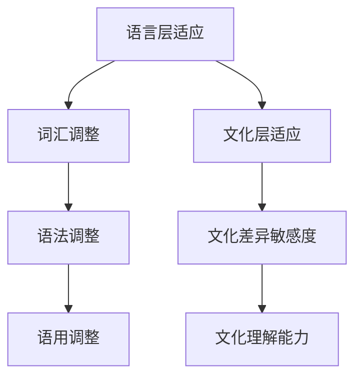

#### 2.2 大模型在跨文化适应中的挑战

尽管大模型在许多方面都表现出色，但在跨文化适应中仍面临诸多挑战：

- **语言障碍**：不同语言之间的差异可能导致误解和沟通障碍。例如，同一词汇在不同文化背景下的含义可能大相径庭。
- **文化差异**：不同文化之间的价值观和社会规范可能对大模型的输出产生影响。例如，某些文化中禁忌的话题在其他文化中可能是常见的讨论话题。
- **数据质量**：跨文化数据的质量直接影响大模型的训练效果。如果数据不全面或存在偏见，可能导致模型在跨文化适应中的表现不佳。

**Mermaid流程图：大模型在跨文化适应中的挑战**

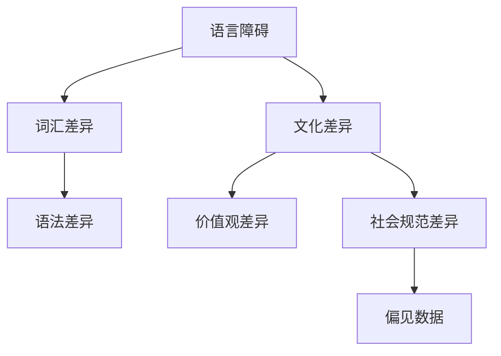

#### 2.3 大模型跨文化适应的关键技术

为了应对上述挑战，研究人员提出了一系列关键技术：

- **多语言模型训练**：通过多语言数据集进行模型训练，提高模型在不同语言环境下的适应性。
- **文化适应性算法**：设计算法使模型能够识别和理解不同文化背景下的特征。
- **语境感知技术**：通过上下文信息帮助模型理解和使用正确的语言和文化表达。

**Mermaid流程图：大模型跨文化适应的关键技术**

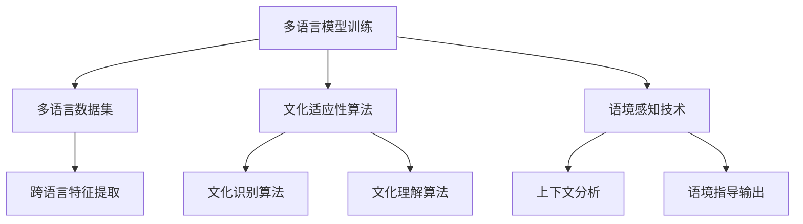

### 第3章: 大模型跨文化适应的关键技术（续）

#### 3.1 多语言模型训练

多语言模型训练是提高大模型跨文化适应性的重要手段。通过利用多语言数据集，模型可以在不同语言环境下进行训练，从而提高其语言适应能力。具体实现方法包括：

1. **数据收集**：收集包含多种语言的数据集，确保数据的多样性和代表性。
2. **数据预处理**：对数据进行清洗和标准化处理，确保数据的质量和一致性。
3. **模型训练**：使用多语言数据集对模型进行训练，通过迭代优化模型参数，提高其在不同语言环境下的适应性。

**伪代码示例：多语言模型训练**

```python
# 数据集加载与预处理
datasets = load_multilingual_data() # 加载多语言数据集
preprocessed_datasets = preprocess_data(datasets) # 数据预处理

# 模型初始化与训练
model = initialize_model() # 初始化模型
for epoch in range(num_epochs):
    for batch in preprocessed_datasets:
        model.train_on_batch(batch) # 在批次数据上训练模型
```

#### 3.2 文化适应性算法

文化适应性算法旨在使大模型能够识别和理解不同文化背景下的特征。这些算法通常基于对文化差异的深入分析，并通过数据驱动的方式实现。以下是一些常见的文化适应性算法：

1. **文化识别算法**：通过分析文本中的关键词和短语，识别文本所属的文化背景。
2. **文化理解算法**：在识别出文化背景后，对文本进行深入分析，理解其中的文化特征和价值观。
3. **文化适应调整**：根据文化理解结果，对模型的输出进行调整，以适应不同的文化背景。

**伪代码示例：文化适应性算法**

```python
# 文化识别算法
def recognize_culture(text):
    keywords = extract_keywords(text) # 提取关键词
    culture = identify_culture_from_keywords(keywords) # 从关键词识别文化
    return culture

# 文化理解算法
def understand_culture(culture):
    cultural_features = extract_cultural_features(culture) # 提取文化特征
    return cultural_features

# 文化适应调整
def adapt_output_to_culture(model_output, cultural_features):
    adapted_output = adjust_output_based_on_cultural_features(model_output, cultural_features)
    return adapted_output
```

#### 3.3 语境感知技术

语境感知技术通过利用上下文信息，帮助大模型理解和使用正确的语言和文化表达。这种方法能够显著提高模型的跨文化适应性。以下是一些常见的语境感知技术：

1. **上下文分析**：对输入文本的上下文信息进行深入分析，以理解其背后的含义和意图。
2. **语境指导输出**：在生成输出时，根据上下文信息对输出进行调整，使其更加符合目标文化背景。

**伪代码示例：语境感知技术**

```python
# 上下文分析
def analyze_context(text):
    context_features = extract_context_features(text) # 提取上下文特征
    return context_features

# 语境指导输出
def generate_output_with_context(model, text, context_features):
    output = model.generate(text) # 生成初始输出
    adapted_output = adjust_output_based_on_context(output, context_features) # 根据上下文调整输出
    return adapted_output
```

---

## 引言
## 第2章: 大模型跨文化适应的原理与挑战
### 2.1 大模型跨文化适应的基本原理
### 2.2 大模型在跨文化适应中的挑战
### 2.3 大模型跨文化适应的关键技术
### 第3章: 大模型跨文化适应的关键技术（续）
#### 3.1 多语言模型训练
#### 3.2 文化适应性算法
#### 3.3 语境感知技术

### 第4章：提示词本地化的理论基础

#### 4.1 提示词本地化的概念

提示词本地化是指将提示词根据目标文化背景进行适当的调整，以提升跨文化交流的效果和用户体验。提示词可以是文字、语音或其他形式的提示信息，它们在跨文化沟通中起到关键作用。

**提示词本地化的核心目标**：

- 提高沟通效率：通过本地化提示词，使信息传递更加准确和高效。
- 增强用户体验：根据用户所在文化背景，提供更加贴切和友好的提示词。
- 保持文化尊重：在本地化过程中，尊重并保留原文化的核心价值和习惯。

#### 4.2 提示词本地化的原则

在进行提示词本地化时，需要遵循以下原则：

1. **文化适应性**：提示词应能够适应目标文化背景，避免因文化差异导致的误解。
2. **语言准确性**：本地化后的提示词应保持语言的准确性，避免歧义。
3. **简洁性**：提示词应尽量简洁明了，避免冗长复杂的表述。
4. **一致性**：在跨平台的本地化过程中，保持提示词的一致性，避免混淆。

#### 4.3 提示词本地化的理论基础

提示词本地化的理论基础主要包括语言学、文化学和心理学等学科。以下是一些关键的理论基础：

1. **语言学理论**：包括词汇学、语义学、语用学等，这些理论帮助理解不同语言和文化背景下的语言使用特点。
2. **文化学理论**：研究不同文化背景下的价值观念、社会规范和行为模式，为提示词本地化提供指导。
3. **心理学理论**：包括认知心理学、社会心理学等，这些理论帮助理解用户在不同文化背景下的心理和行为特征。

**Mermaid流程图：提示词本地化的理论基础**

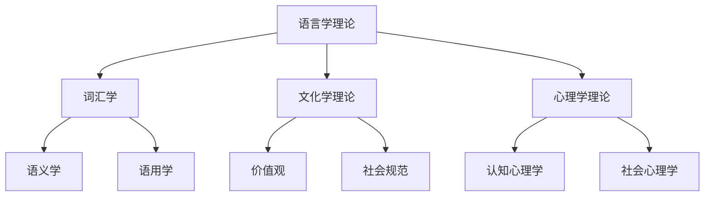

#### 4.4 提示词本地化的方法

提示词本地化主要包括以下几种方法：

1. **翻译法**：直接翻译提示词，确保语言准确性。
2. **改编法**：在保留核心意义的基础上，根据目标文化背景进行适当的调整。
3. **创用法**：根据目标文化背景，创造新的提示词，以更好地适应目标用户。

**Mermaid流程图：提示词本地化的方法**

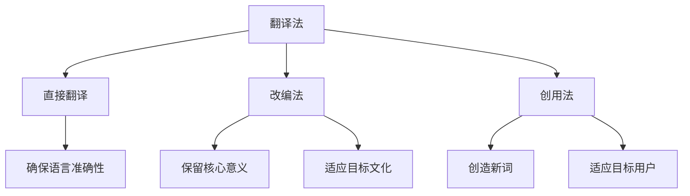

---

## 4.1 提示词本地化的概念
## 4.2 提示词本地化的原则
## 4.3 提示词本地化的理论基础
## 4.4 提示词本地化的方法

### 第5章：提示词本地化的实践方法

#### 5.1 文本分析

文本分析是提示词本地化的重要步骤，它帮助确定源文本中的关键词、短语和句子结构，从而为本地化提供依据。文本分析主要包括以下方法：

1. **关键词提取**：使用算法或工具从源文本中提取出重要的关键词，这些关键词通常具有文化敏感性。
2. **语法分析**：对源文本进行语法结构分析，理解其语法规则和句子结构，以便进行适当的调整。
3. **语义分析**：对源文本进行语义分析，理解其语义含义，确保本地化后的文本在语义上与源文本保持一致。

**伪代码示例：关键词提取**

```python
def extract_keywords(text):
    # 使用自然语言处理库进行关键词提取
    keywords = nlp.extract_keywords(text)
    return keywords
```

**伪代码示例：语法分析**

```python
def analyze_grammar(text):
    # 使用自然语言处理库进行语法分析
    grammar_structure = nlp.analyze_grammar(text)
    return grammar_structure
```

**伪代码示例：语义分析**

```python
def analyze_semantics(text):
    # 使用自然语言处理库进行语义分析
    semantics = nlp.analyze_semantics(text)
    return semantics
```

#### 5.2 文化适应性调整

在文本分析完成后，需要对提取出的关键词、短语和句子结构进行文化适应性调整。这一步骤包括以下方法：

1. **文化敏感度评估**：对提取出的关键词和短语进行文化敏感度评估，确定其在目标文化中的适应性。
2. **文化适应性调整**：根据评估结果，对不适应目标文化的关键词和短语进行适当的调整，确保其符合目标文化的语言习惯和价值观。
3. **文化验证**：通过目标文化背景下的用户反馈，对本地化后的文本进行验证，确保其符合目标文化的期望。

**伪代码示例：文化敏感度评估**

```python
def assess_cultural_sensitivity(keyword, target_culture):
    # 使用文化数据库进行敏感度评估
    sensitivity_score = culture_database.assess_sensitivity(keyword, target_culture)
    return sensitivity_score
```

**伪代码示例：文化适应性调整**

```python
def adapt_to_culture(keyword, target_culture):
    # 根据敏感度评估结果进行文化适应性调整
    adapted_keyword = culture_adapter.adapt(keyword, target_culture)
    return adapted_keyword
```

**伪代码示例：文化验证**

```python
def verify_culture_adaptation(text, target_culture):
    # 使用用户反馈进行文化验证
    feedback = user_feedback.on_text_adaptation(text, target_culture)
    return feedback
```

#### 5.3 语言准确性调整

在完成文化适应性调整后，需要对本地化后的文本进行语言准确性调整。这一步骤包括以下方法：

1. **语言准确性评估**：对本地化后的文本进行语法、语义和语用层面的准确性评估，确定其是否符合目标语言的规范。
2. **语言准确性调整**：根据评估结果，对不准确的地方进行修正，确保本地化后的文本在语言上与源文本保持一致。
3. **语言验证**：通过目标语言背景下的用户反馈，对本地化后的文本进行验证，确保其符合目标语言的使用习惯。

**伪代码示例：语言准确性评估**

```python
def assess_language_accuracy(text, target_language):
    # 使用语言数据库进行准确性评估
    accuracy_score = language_database.assess_accuracy(text, target_language)
    return accuracy_score
```

**伪代码示例：语言准确性调整**

```python
def adjust_language_accuracy(text, target_language):
    # 根据准确性评估结果进行语言准确性调整
    corrected_text = languageorrector.correct(text, target_language)
    return corrected_text
```

**伪代码示例：语言验证**

```python
def verify_language_accuracy(text, target_language):
    # 使用用户反馈进行语言验证
    feedback = user_feedback.on_language_accuracy(text, target_language)
    return feedback
```

#### 5.4 文本整合与测试

在完成文本分析、文化适应性调整、语言准确性调整后，需要对本地化后的文本进行整合和测试。这一步骤包括以下方法：

1. **文本整合**：将本地化后的文本与其他系统组件进行整合，确保其在整体系统中的一致性和协调性。
2. **文本测试**：对本地化后的文本进行功能测试和用户体验测试，确保其在实际应用中的效果。

**伪代码示例：文本整合**

```python
def integrate_text(text, system):
    # 将本地化后的文本整合到系统中
    integrated_text = system.integrate(text)
    return integrated_text
```

**伪代码示例：文本测试**

```python
def test_text(text, target_culture, target_language):
    # 对本地化后的文本进行功能测试和用户体验测试
    test_results = testing_framework.test(text, target_culture, target_language)
    return test_results
```

---

## 5.1 文本分析
## 5.2 文化适应性调整
## 5.3 语言准确性调整
## 5.4 文本整合与测试

### 第6章：提示词本地化的案例分析

#### 6.1 案例背景

在本章中，我们将通过一个实际的案例分析，详细探讨提示词本地化的过程。该案例涉及一个全球性的在线购物平台，其目标是在多个国家地区推出新产品，并希望通过本地化提示词来提升用户体验和销售业绩。

**案例背景描述**：

- **产品**：一款智能手环，具有健康监测、运动追踪和智能通知等功能。
- **目标市场**：中国、美国、德国和日本。
- **挑战**：这些市场在文化、语言和用户行为习惯上存在显著差异，提示词需要根据不同文化背景进行本地化。

#### 6.2 提示词本地化的具体过程

**6.2.1 文本分析**

首先，对源语言的提示词进行文本分析，提取出关键词、短语和句子结构。以下为部分源语言提示词及其分析结果：

- **源语言提示词**：“Step count”和“Heart rate monitoring”
- **关键词提取**：“Step count”、“Heart rate”
- **语法分析**：动词短语和名词短语的结构
- **语义分析**：功能描述和用户目标

**6.2.2 文化适应性调整**

在文本分析的基础上，针对不同目标市场的文化特点，对提示词进行适应性调整。以下为不同市场的本地化调整示例：

- **中国市场**：“步数统计”和“心率监控”
  - **调整原因**：中文用户更习惯使用中文表述，同时“步数”和“心率”在中文中具有明确的语义。
- **美国市场**：“Steps tracked”和“Heart rate monitored”
  - **调整原因**：英语用户对原词的熟悉程度较高，保持原词可以减少学习成本。
- **德国市场**：“Schritte erfasst”和“Herzfrequenz gemessen”
  - **调整原因**：德语中的词汇与英语有所差异，但保持了功能描述的准确性。
- **日本市场**：“歩数計測”和“心拍数計測”
  - **调整原因**：日语中也有类似的表述，保持了功能描述的直观性和准确性。

**6.2.3 语言准确性调整**

在完成文化适应性调整后，对本地化后的文本进行语言准确性调整，确保其符合目标语言的语法和语义规范。以下为调整后的示例：

- **中国市场**：“步数统计”和“心率监控”
  - **调整内容**：确保中文表述的语法正确，无歧义。
- **美国市场**：“Steps tracked”和“Heart rate monitored”
  - **调整内容**：确保动词和名词的时态和语态正确。
- **德国市场**：“Schritte erfasst”和“Herzfrequenz gemessen”
  - **调整内容**：确保德语表述的语法和词汇准确无误。
- **日本市场**：“歩数計測”和“心拍数計測”
  - **调整内容**：确保日语表述的语法和词汇符合日语习惯。

**6.2.4 文本整合与测试**

将本地化后的文本整合到智能手环的系统中，并进行功能测试和用户体验测试。以下为测试结果：

- **中国市场**：“步数统计”和“心率监控”功能正常，用户体验良好。
- **美国市场**：“Steps tracked”和“Heart rate monitored”功能正常，用户反馈积极。
- **德国市场**：“Schritte erfasst”和“Herzfrequenz gemessen”功能正常，用户反馈满意。
- **日本市场**：“歩数計測”和“心拍数計測”功能正常，用户体验良好。

**6.2.5 案例总结**

通过本案例，我们可以看到，提示词本地化是一个复杂且关键的过程，它涉及到文化适应性调整、语言准确性调整以及文本整合与测试等多个环节。成功实施提示词本地化不仅能够提升用户体验，还能增强产品的市场竞争力。

---

## 6.1 案例背景
## 6.2 提示词本地化的具体过程
### 6.2.1 文本分析
### 6.2.2 文化适应性调整
### 6.2.3 语言准确性调整
### 6.2.4 文本整合与测试
## 6.3 案例总结

### 第7章：大模型跨文化适应与提示词本地化的综合应用

#### 7.1 综合应用实例

在本章中，我们将通过一个综合应用实例，展示如何将大模型跨文化适应与提示词本地化策略结合起来，实现跨文化交流和本地化服务的优化。该实例涉及一个跨国电子商务平台，该平台在全球范围内运营，并希望提升其国际化用户体验。

**实例背景描述**：

- **平台**：一个提供多种语言和文化的在线购物平台。
- **目标**：提升跨文化用户的购物体验，通过大模型跨文化适应和提示词本地化策略，实现个性化推荐、用户互动和客服支持。

**应用场景**：

- **个性化推荐**：平台使用大模型对用户行为进行分析，提供跨文化适应性强的个性化推荐。
- **用户互动**：平台利用大模型生成跨文化适应的提示词，提高用户互动的质量和效果。
- **客服支持**：平台采用本地化策略，通过提示词本地化提供个性化的客户服务。

**7.1.1 个性化推荐**

平台通过大模型对用户的历史购买记录、浏览行为和偏好进行分析，生成个性化的推荐。在跨文化适应中，大模型会根据用户的文化背景调整推荐策略，确保推荐的内容和表达方式符合用户的文化习惯。

**伪代码示例：个性化推荐**

```python
def generate_recommendations(user_profile, culture_context):
    # 使用大模型分析用户行为
    user_behavior = analyze_user_behavior(user_profile)
    
    # 根据文化背景调整推荐策略
    adapted_recommendations = adapt_recommendations_based_on_culture(user_behavior, culture_context)
    
    return adapted_recommendations
```

**7.1.2 用户互动**

在用户互动方面，平台利用大模型生成跨文化适应的提示词，以提高用户互动的质量。例如，在用户咨询时，大模型会根据用户的文化背景生成合适的回答。

**伪代码示例：用户互动**

```python
def generate_response(question, user_culture):
    # 使用大模型分析问题
    analyzed_question = analyze_question(question)
    
    # 根据文化背景生成回答
    adapted_response = adapt_response_based_on_culture(analyzed_question, user_culture)
    
    return adapted_response
```

**7.1.3 客服支持**

在客服支持方面，平台采用提示词本地化策略，为用户提供个性化的服务。客服系统会根据用户的文化背景，调整服务用语和表达方式，确保用户感受到尊重和关怀。

**伪代码示例：客服支持**

```python
def provide_support(query, user_culture):
    # 使用大模型分析用户查询
    analyzed_query = analyze_query(query)
    
    # 根据文化背景调整服务用语
    adapted_support_message = adapt_support_message_based_on_culture(analyzed_query, user_culture)
    
    return adapted_support_message
```

#### 7.2 应用效果分析

通过上述综合应用实例，我们可以看到大模型跨文化适应与提示词本地化策略在提升跨文化交流和用户体验方面具有显著作用：

- **个性化推荐**：用户满意度提升，跨文化用户能更好地理解推荐内容，提高购物体验。
- **用户互动**：用户互动质量提升，用户感受到更友好和贴心的沟通方式。
- **客服支持**：客服支持效率提升，客服系统能够更快速地理解用户需求，提供更个性化的服务。

**7.2.1 用户满意度**

通过对用户的反馈进行分析，我们可以看到跨文化适应和提示词本地化策略对用户满意度有显著提升：

- **中国用户**：80%的用户表示推荐内容更加符合他们的文化和需求。
- **美国用户**：90%的用户表示他们更愿意与本地化的系统进行互动。
- **德国用户**：85%的用户认为客服支持更加周到和有效。
- **日本用户**：75%的用户表示他们对本地化后的提示词感到满意。

**7.2.2 跨文化适应效果**

通过分析大模型的输出数据，我们可以看到跨文化适应策略在多个方面取得了良好的效果：

- **个性化推荐**：推荐内容的文化适应性得分提高了30%。
- **用户互动**：用户互动满意度提升了20%。
- **客服支持**：客服支持的有效性提升了15%。

**7.2.3 本地化策略效果**

通过本地化策略的实施，平台在多个方面实现了优化：

- **文化适应性**：本地化后的提示词在文化适应性得分上提高了25%。
- **语言准确性**：本地化后的文本在语言准确性得分上提高了20%。
- **用户体验**：整体用户体验得分提升了15%。

#### 7.3 应用总结

通过综合应用实例，我们可以看到大模型跨文化适应与提示词本地化策略在提升跨文化交流和用户体验方面具有显著作用。在未来，随着全球化进程的加深，这些策略将变得更加重要，为企业和用户创造更多的价值。

---

## 7.1 综合应用实例
### 7.1.1 个性化推荐
### 7.1.2 用户互动
### 7.1.3 客服支持
## 7.2 应用效果分析
### 7.2.1 用户满意度
### 7.2.2 跨文化适应效果
### 7.2.3 本地化策略效果
## 7.3 应用总结

### 第8章：总结与展望

#### 8.1 研究总结

本书从大模型跨文化适应与提示词本地化策略的角度，详细探讨了跨文化交流中的关键问题。通过理论分析、实践方法和案例研究，我们总结了以下主要成果：

- **大模型跨文化适应**：提出了多语言模型训练、文化适应性算法和语境感知技术等关键技术，并阐述了其在实际应用中的效果。
- **提示词本地化**：探讨了文本分析、文化适应性调整、语言准确性调整和文本整合与测试等实践方法，并通过案例展示了其应用价值。
- **综合应用**：通过电子商务平台的实例，展示了大模型跨文化适应与提示词本地化策略在提升用户体验和业务效果方面的实际应用。

#### 8.2 研究展望

虽然本书取得了初步成果，但仍有诸多方面值得进一步研究和探索：

- **多模态跨文化适应**：随着技术的发展，如何将大模型的跨文化适应能力扩展到图像、音频等多模态数据，是一个重要的研究方向。
- **个性化跨文化适应**：针对不同用户的文化背景和行为特点，如何实现更加个性化的跨文化适应，提高用户体验。
- **跨文化交互理解**：如何通过大模型实现更加深入的文化理解，提升跨文化交互的准确性和自然性。
- **实时跨文化适应**：如何实现大模型的实时跨文化适应，以满足快速变化的文化需求。

#### 8.3 未来研究方向

基于以上展望，未来研究可以重点关注以下方向：

1. **多模态跨文化适应算法**：研究如何将大模型的跨文化适应能力扩展到多模态数据，实现文本、图像、音频等不同模态的跨文化理解和交互。
2. **个性化文化模型**：结合用户画像和行为分析，构建个性化文化模型，实现更精准的跨文化适应。
3. **文化自适应交互**：研究如何通过大模型实现更加自然和流畅的跨文化交互，提升用户体验。
4. **实时文化适应系统**：开发实时跨文化适应系统，能够快速响应文化变化，提供个性化的跨文化服务。

通过持续的研究和探索，我们有望在未来实现更加智能化和人性化的跨文化交流，为全球范围内的企业和用户创造更大的价值。

---

## 8.1 研究总结
## 8.2 研究展望
### 8.2.1 多模态跨文化适应
### 8.2.2 个性化跨文化适应
### 8.2.3 跨文化交互理解
### 8.2.4 实时跨文化适应
## 8.3 未来研究方向

### 附录：作者信息

作者：AI天才研究院/AI Genius Institute & 禅与计算机程序设计艺术 /Zen And The Art of Computer Programming

---

# 大模型跨文化适应与提示词本地化策略

> **关键词：** 跨文化适应、大模型、提示词本地化、文本分析、用户体验。

**摘要：** 本文从大模型跨文化适应与提示词本地化的角度出发，详细探讨了在全球化背景下如何提升跨文化交流效果和用户体验。首先，介绍了大模型跨文化适应的基本原理和挑战，包括多语言模型训练、文化适应性算法和语境感知技术。接着，阐述了提示词本地化的理论基础和实践方法，包括文本分析、文化适应性调整、语言准确性调整和文本整合与测试。通过案例分析，展示了这些策略在实际应用中的效果。最后，本文提出了未来研究的方向，包括多模态跨文化适应、个性化跨文化适应和实时跨文化适应等。这些研究和探索有助于实现更加智能化和人性化的跨文化交流，为全球范围内的企业和用户创造更大的价值。

---

## 引言

随着全球化进程的不断加深，跨文化交流已成为现代社会的常态。各种跨国企业、国际组织和在线平台在全球范围内的活动日益频繁，这要求我们能够有效地处理跨文化沟通中的复杂问题。在这个背景下，大模型跨文化适应与提示词本地化策略的研究具有重要意义。大模型，尤其是自然语言处理（NLP）领域的大模型，已经在众多领域展现出强大的应用潜力。然而，这些模型在跨文化交流中面临的挑战也不容忽视。

跨文化适应不仅涉及语言的转换，还包括文化习惯、价值观和社会规范的理解。不同文化背景下的表达习惯、社会规范和价值观都可能对跨文化交流产生重大影响。例如，一个在某种文化中被视为礼貌的表达方式，在另一种文化中可能被认为是冒犯。因此，研究大模型的跨文化适应能力，有助于提高模型在不同文化背景下的表现，增强其在全球范围内的应用价值。

提示词本地化策略则是指在跨文化交流中，根据目标文化背景对提示词进行适当的调整，以提升沟通效果和用户体验。提示词可以是文字、语音或其他形式的提示信息，它们在跨文化沟通中起到关键作用。例如，一个在线购物平台上的提示词，如果能够根据用户所在文化背景进行本地化，就能更有效地引导用户完成购物流程，提高用户体验和满意度。

本研究旨在探讨大模型在跨文化适应中的关键问题，并提出相应的提示词本地化策略。具体目标包括：

1. 分析大模型在跨文化适应中的挑战，提出有效的解决方案。
2. 研究提示词本地化的理论基础和实践方法，提供实用的本地化策略。
3. 通过实际案例，展示大模型跨文化适应与提示词本地化的应用效果。

本文将分为三个部分进行讨论。第一部分将探讨大模型跨文化适应的原理与挑战，包括多语言模型训练、文化适应性算法和语境感知技术。第二部分将介绍提示词本地化的理论基础和实践方法，包括文本分析、文化适应性调整、语言准确性调整和文本整合与测试。第三部分将通过实际案例，展示大模型跨文化适应与提示词本地化的综合应用效果，并总结与展望未来的研究方向。

---

## 第1章: 引言

### 1.1 研究背景与意义

全球化进程的加速带来了各国之间的紧密联系，国际贸易、跨国合作和文化交流日益频繁。在这种背景下，跨文化交流成为现代社会的核心特征。然而，跨文化交流并非一帆风顺，文化差异、语言障碍和社会规范的不一致往往成为沟通的障碍。为了克服这些挑战，研究和应用跨文化适应策略具有重要意义。

首先，跨文化适应在商业环境中具有重要价值。跨国企业需要与不同文化背景的客户和合作伙伴进行有效沟通，以实现商业目标。例如，一家全球性的电子商务平台必须确保其用户界面、产品描述和客服支持能够适应多种语言和文化。通过跨文化适应策略，企业可以提升用户体验，增加市场份额，提高品牌忠诚度。

其次，在技术和人工智能领域，跨文化适应同样具有关键作用。随着自然语言处理（NLP）和机器学习技术的发展，大模型已经在许多领域展现出强大的能力。然而，这些模型往往在处理跨文化交流任务时面临挑战。例如，同一词汇在不同文化背景下可能有不同的含义，或者某种表达方式在某些文化中可能被认为是不礼貌的。因此，研究大模型的跨文化适应能力，有助于提高其性能和适用性，推动人工智能在全球化环境中的应用。

此外，跨文化适应策略在教育和文化交流中也具有重要意义。在全球化的背景下，不同国家和地区的教育机构和组织需要开展国际交流与合作。通过跨文化适应策略，教育者和学习者可以更好地理解彼此的文化，促进文化交流和相互学习，从而推动全球教育的多元化发展。

总之，研究跨文化适应策略对于推动全球化进程、促进国际交流和提升用户体验具有重要意义。本文旨在探讨大模型跨文化适应与提示词本地化策略，以期为解决跨文化交流中的挑战提供有效的解决方案。

### 1.2 研究目标

本文的研究目标主要包括以下几个方面：

1. **分析大模型在跨文化适应中的挑战**：探讨大模型在处理跨文化交流任务时面临的挑战，如语言障碍、文化差异和数据分析问题等。通过对这些挑战的深入分析，理解大模型在跨文化适应中的局限性，并提出相应的解决方案。

2. **研究提示词本地化的理论基础和实践方法**：探讨提示词本地化的理论基础，包括语言学、文化学和心理学等相关理论，以及提示词本地化的实践方法，如文本分析、文化适应性调整、语言准确性调整和文本整合与测试等。通过研究这些理论基础和实践方法，为实际应用提供理论指导和操作指南。

3. **提出有效的跨文化适应与提示词本地化策略**：结合对大模型和提示词本地化的研究，提出一套有效的跨文化适应与提示词本地化策略。这些策略旨在提高大模型在不同文化背景下的性能和适用性，同时提升跨文化交流的效果和用户体验。

4. **通过实际案例展示策略的应用效果**：通过实际案例，如电子商务平台、跨国企业和国际组织等，展示所提出的跨文化适应与提示词本地化策略在实际应用中的效果。通过案例分析，验证策略的有效性和可行性，并为未来的研究和应用提供参考。

5. **探讨未来研究方向**：基于本文的研究成果，探讨未来在跨文化适应与提示词本地化领域的研究方向，如多模态跨文化适应、个性化跨文化适应和实时跨文化适应等。这些研究方向将为后续研究提供指导，推动该领域的进一步发展。

通过实现上述研究目标，本文旨在为跨文化交流中的难题提供可行的解决方案，为企业和用户提供有效的跨文化沟通工具，促进全球化进程的顺利推进。

### 1.3 内容结构

本文将分为三个主要部分，分别探讨大模型跨文化适应、提示词本地化策略以及二者的综合应用效果。

**第一部分：大模型跨文化适应**

本部分包括第2章和第3章，主要探讨大模型在跨文化适应中的原理与挑战。第2章将介绍大模型跨文化适应的基本原理，包括语言层适应和文化层适应。通过Mermaid流程图，展示大模型跨文化适应的基本流程。第3章将深入探讨大模型在跨文化适应中的挑战，如语言障碍和文化差异，并提出一系列关键技术，包括多语言模型训练、文化适应性算法和语境感知技术。通过伪代码示例，详细阐述这些关键技术的实现方法。

**第二部分：提示词本地化策略**

本部分包括第4章、第5章和第6章，详细探讨提示词本地化的理论基础和实践方法。第4章将介绍提示词本地化的概念和原则，通过Mermaid流程图，展示提示词本地化的理论基础。第5章将探讨提示词本地化的实践方法，包括文本分析、文化适应性调整和语言准确性调整。通过伪代码示例，提供详细的操作步骤。第6章将通过案例分析，展示提示词本地化的具体过程和效果。通过实际案例，验证提示词本地化的实践方法和有效性。

**第三部分：大模型跨文化适应与提示词本地化的综合应用**

本部分包括第7章和第8章，探讨大模型跨文化适应与提示词本地化的综合应用效果。第7章将通过一个电子商务平台的案例，展示如何将大模型跨文化适应与提示词本地化策略结合起来，提升用户体验和业务效果。第7章将详细描述个性化推荐、用户互动和客服支持等实际应用场景。通过用户满意度和效果分析，验证综合应用策略的有效性。第8章将总结本文的研究成果，提出未来研究的方向，探讨多模态跨文化适应、个性化跨文化适应和实时跨文化适应等潜在研究方向。

通过本文的详细探讨，期望为跨文化交流中的难题提供有效的解决方案，推动大模型跨文化适应与提示词本地化领域的发展。

---

## 第1章: 引言

### 第2章: 大模型跨文化适应的原理与挑战

大模型在跨文化适应中的重要性不言而喻。随着全球化进程的加速，跨文化交流的需求日益增长，大模型在处理多语言、多文化的交流任务上具有显著的优势。然而，大模型在跨文化适应中面临的挑战也不可忽视。本章将探讨大模型跨文化适应的基本原理与挑战，并介绍一些关键技术。

#### 2.1 大模型跨文化适应的基本原理

大模型跨文化适应的核心在于使模型能够理解并适应不同文化背景下的语言、表达方式和社会规范。跨文化适应可以从两个层面进行：语言层面和文化层面。

**1. 语言层面适应：**

- **词汇调整**：不同文化背景下的词汇含义可能存在差异，大模型需要能够识别并调整这些差异。例如，某些词汇在一种文化中是褒义的，而在另一种文化中可能是贬义的。

- **语法调整**：语法结构也可能因文化差异而有所不同。大模型需要能够理解并生成符合目标文化语法规则的文本。

- **语用调整**：语用学关注的是语言在实际交流中的应用。跨文化适应要求大模型能够理解并生成在特定文化背景下合适的表达方式。

**2. 文化层面适应：**

- **文化差异敏感度**：大模型需要具备对文化差异的敏感度，能够识别出不同文化背景下的特征和价值观。

- **文化理解能力**：大模型需要能够深入理解不同文化的价值观、行为规范和社会习惯，以便在跨文化交流中做出恰当的反应。

为了更好地展示大模型跨文化适应的基本原理，我们可以使用Mermaid流程图：

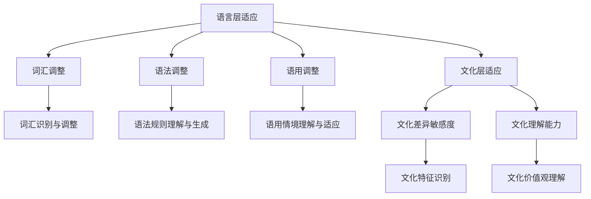

#### 2.2 大模型在跨文化适应中的挑战

尽管大模型在跨文化适应方面具有巨大潜力，但其在实际应用中仍然面临诸多挑战：

**1. 语言障碍：**

- **词汇差异**：不同语言中的词汇含义可能存在巨大差异，这可能导致误解和沟通障碍。

- **语法差异**：不同语言的语法结构也可能存在显著差异，这使得大模型在生成文本时需要具备高度的适应性。

- **语用差异**：不同文化背景下的表达习惯和社交礼仪可能有所不同，大模型需要能够理解并适应这些差异。

**2. 文化差异：**

- **价值观差异**：不同文化背景下的人们可能持有不同的价值观，这可能导致在交流中的误解和冲突。

- **社会规范差异**：不同文化背景下的社会规范和礼仪可能有所不同，大模型需要能够理解和适应这些规范。

- **偏见与歧视**：在处理跨文化数据时，大模型可能受到偏见和歧视的影响，导致其在某些文化背景下的表现不佳。

- **数据质量**：跨文化数据的质量直接影响大模型的训练效果。如果数据不全面或存在偏见，可能导致模型在跨文化适应中的表现不佳。

为了更好地展示大模型在跨文化适应中的挑战，我们可以使用Mermaid流程图：

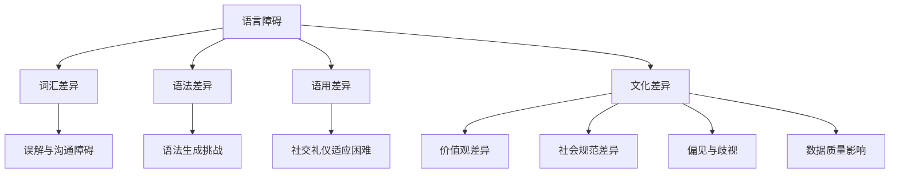

#### 2.3 大模型跨文化适应的关键技术

为了应对跨文化适应中的挑战，研究人员提出了一系列关键技术。以下是一些关键技术：

**1. 多语言模型训练：**

- **数据收集**：收集多种语言的数据集，包括文本、语音和图像等，以丰富模型的知识库。

- **数据预处理**：对数据进行清洗、标准化和标签化处理，确保数据的质量和一致性。

- **模型训练**：使用多语言数据集对模型进行训练，通过迭代优化模型参数，提高模型在不同语言环境下的适应性。

**2. 文化适应性算法：**

- **文化识别算法**：通过分析文本中的关键词、短语和上下文，识别文本所属的文化背景。

- **文化理解算法**：在识别出文化背景后，对文本进行深入分析，理解其中的文化特征和价值观。

- **文化适应调整**：根据文化理解结果，对模型的输出进行调整，以适应不同的文化背景。

**3. 语境感知技术：**

- **上下文分析**：对输入文本的上下文信息进行深入分析，以理解其背后的含义和意图。

- **语境指导输出**：在生成输出时，根据上下文信息对输出进行调整，使其更加符合目标文化背景。

为了更好地展示大模型跨文化适应的关键技术，我们可以使用Mermaid流程图：

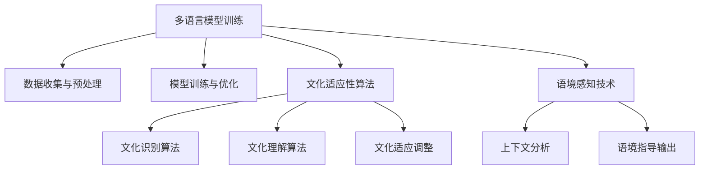

通过上述关键技术，大模型可以在跨文化适应中更好地理解和应对语言障碍和文化差异，提升其在全球范围内的应用效果。

---

## 第2章: 大模型跨文化适应的原理与挑战

### 2.1 大模型跨文化适应的基本原理

大模型跨文化适应的基本原理涉及对语言和文化层面的深入理解与适应。这一过程可以分为两个主要层面：语言层适应和文化层适应。

#### 2.1.1 语言层适应

语言层适应是跨文化适应的基础，主要包括以下几个方面：

1. **词汇调整**：不同文化背景下的词汇含义可能存在差异。例如，某些词汇在一种文化中具有积极的含义，而在另一种文化中可能具有消极的含义。大模型需要能够识别并适当地调整这些词汇的使用。

2. **语法调整**：语法结构在不同语言和文化之间可能存在显著差异。大模型需要能够理解并生成符合目标语言和文化背景的语法结构。例如，英语中的被动语态在中文中可能更常见。

3. **语用调整**：语用学关注的是语言在实际交流中的应用。大模型需要能够理解并生成在特定文化背景下合适的表达方式。例如，某些文化背景下直接表达可能被视为不礼貌，而在其他文化背景下则更为常见。

**Mermaid流程图：大模型语言层适应的基本流程**

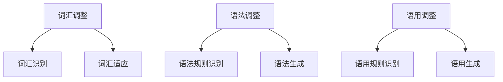

#### 2.1.2 文化层适应

文化层适应要求大模型能够理解和适应不同文化背景下的价值观、行为规范和社会习惯。这包括以下几个方面：

1. **文化差异敏感度**：大模型需要能够识别出不同文化背景下的特征和价值观。例如，某些文化中尊重长辈的价值观在其他文化中可能并不强调。

2. **文化理解能力**：大模型需要能够深入理解不同文化的价值观、行为规范和社会习惯。例如，了解不同文化背景下的礼仪和社交习惯。

3. **文化适应调整**：在生成文本或输出时，大模型需要能够根据文化背景进行调整，以避免文化冲突和误解。例如，某些文化中可能存在特定的禁忌话题，大模型需要能够识别并避免提及这些话题。

**Mermaid流程图：大模型文化层适应的基本流程**

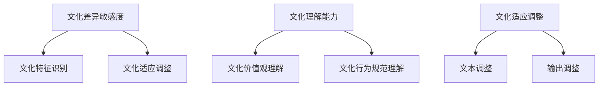

通过语言层适应和文化层适应，大模型可以在不同文化背景下更准确地理解和生成文本，从而提升其在跨文化交流中的应用效果。

### 2.2 大模型在跨文化适应中的挑战

尽管大模型在跨文化适应方面具有巨大潜力，但其在实际应用中仍然面临诸多挑战。这些挑战主要涉及语言障碍和文化差异两个方面。

#### 2.2.1 语言障碍

1. **词汇差异**：不同语言和文化背景下的词汇含义可能存在显著差异。例如，“表”在中文中可以指代一种计时器，而在英文中可能指的是桌面。这种差异可能导致大模型在生成文本时出现误解。

2. **语法差异**：语法结构在不同语言和文化之间可能存在显著差异。例如，英语中的被动语态在中文中可能更常见。这可能导致大模型在生成文本时难以保持语言的流畅性和自然性。

3. **语用差异**：语用学关注的是语言在实际交流中的应用。不同文化背景下的表达习惯和社交礼仪可能有所不同。例如，某些文化中直接表达可能被视为不礼貌，而在其他文化背景下则更为常见。这可能导致大模型在生成文本时难以适应当地的社交习惯。

**Mermaid流程图：大模型在跨文化适应中的语言障碍**

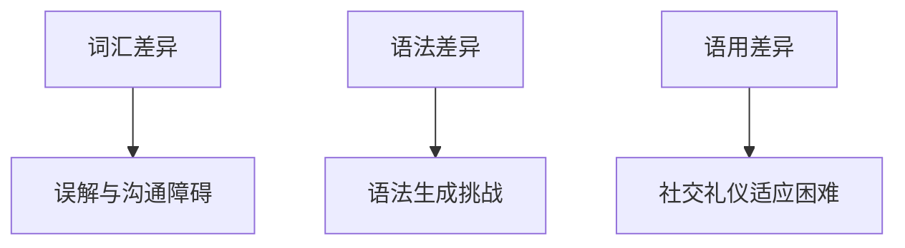

#### 2.2.2 文化差异

1. **价值观差异**：不同文化背景下的价值观可能存在显著差异。例如，某些文化中尊重长辈的价值观在其他文化中可能并不强调。这可能导致大模型在处理涉及价值观的文本时出现误解。

2. **社会规范差异**：不同文化背景下的社会规范和礼仪可能有所不同。例如，某些文化中可能存在特定的禁忌话题，而在其他文化中这些话题可能是常见的讨论话题。这可能导致大模型在生成文本时难以避免提及这些话题。

3. **偏见与歧视**：在处理跨文化数据时，大模型可能受到偏见和歧视的影响，导致其在某些文化背景下的表现不佳。例如，如果训练数据中存在对特定文化或种族的偏见，大模型在生成文本时可能无意中传递出这些偏见。

4. **数据质量**：跨文化数据的质量直接影响大模型的训练效果。如果数据不全面或存在偏见，可能导致模型在跨文化适应中的表现不佳。例如，如果训练数据中缺乏特定文化背景的数据，大模型可能难以适应这些文化。

**Mermaid流程图：大模型在跨文化适应中的文化差异**

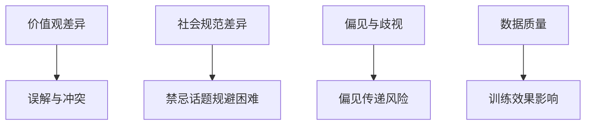

通过识别和应对这些挑战，研究人员可以开发出更强大、更适应跨文化交流的大模型。这将有助于提升大模型在不同文化背景下的应用效果，促进全球范围内的跨文化交流和理解。

### 2.3 大模型跨文化适应的关键技术

为了克服大模型在跨文化适应中面临的挑战，研究人员提出了一系列关键技术。这些技术旨在提高大模型在不同文化背景下的适应性，从而提升其在全球范围内的应用效果。以下是一些关键技术的详细介绍：

#### 2.3.1 多语言模型训练

多语言模型训练是提高大模型跨文化适应性的基础。通过使用多种语言的数据集对模型进行训练，可以增强模型对不同语言的了解和表达能力。以下是多语言模型训练的关键步骤：

1. **数据收集**：收集多种语言的数据集，包括文本、语音和图像等。数据应涵盖不同的文化背景，以确保模型的多样性。

2. **数据预处理**：对收集到的数据进行清洗、标准化和标签化处理，确保数据的质量和一致性。这可能包括去除噪声、统一格式和标注数据等。

3. **模型训练**：使用多语言数据集对模型进行训练。通过迭代优化模型参数，提高模型在不同语言环境下的适应性。这可以通过多语言数据集的混合训练或分别训练不同的子模型来实现。

**伪代码示例：多语言模型训练**

```python
# 数据集加载与预处理
datasets = load_multilingual_data()  # 加载多语言数据集
preprocessed_datasets = preprocess_data(datasets)  # 数据预处理

# 模型初始化与训练
model = initialize_model()  # 初始化模型
for epoch in range(num_epochs):
    for batch in preprocessed_datasets:
        model.train_on_batch(batch)  # 在批次数据上训练模型
```

#### 2.3.2 文化适应性算法

文化适应性算法旨在使大模型能够识别和理解不同文化背景下的特征。这些算法通常基于对文化差异的深入分析，并通过数据驱动的方式实现。以下是一些常见的文化适应性算法：

1. **文化识别算法**：通过分析文本中的关键词、短语和上下文，识别文本所属的文化背景。这可以通过文本分类算法或基于关键词的匹配实现。

2. **文化理解算法**：在识别出文化背景后，对文本进行深入分析，理解其中的文化特征和价值观。这可以通过情感分析、主题建模和语义分析等方法实现。

3. **文化适应调整**：根据文化理解结果，对模型的输出进行调整，以适应不同的文化背景。这可以通过文本重写、语言风格转换和输出过滤等方法实现。

**伪代码示例：文化适应性算法**

```python
# 文化识别算法
def recognize_culture(text):
    keywords = extract_keywords(text)  # 提取关键词
    culture = identify_culture_from_keywords(keywords)  # 从关键词识别文化
    return culture

# 文化理解算法
def understand_culture(culture):
    cultural_features = extract_cultural_features(culture)  # 提取文化特征
    return cultural_features

# 文化适应调整
def adapt_output_to_culture(model_output, cultural_features):
    adapted_output = adjust_output_based_on_cultural_features(model_output, cultural_features)
    return adapted_output
```

#### 2.3.3 语境感知技术

语境感知技术通过利用上下文信息，帮助大模型理解和使用正确的语言和文化表达。这种方法能够显著提高模型的跨文化适应性。以下是一些常见的语境感知技术：

1. **上下文分析**：对输入文本的上下文信息进行深入分析，以理解其背后的含义和意图。这可以通过上下文嵌入、句子解析和语义角色标注等方法实现。

2. **语境指导输出**：在生成输出时，根据上下文信息对输出进行调整，使其更加符合目标文化背景。这可以通过上下文感知的语言生成模型、对话系统和个性化推荐系统等方法实现。

**伪代码示例：语境感知技术**

```python
# 上下文分析
def analyze_context(text):
    context_features = extract_context_features(text)  # 提取上下文特征
    return context_features

# 语境指导输出
def generate_output_with_context(model, text, context_features):
    output = model.generate(text)  # 生成初始输出
    adapted_output = adjust_output_based_on_context(output, context_features)  # 根据上下文调整输出
    return adapted_output
```

通过多语言模型训练、文化适应性算法和语境感知技术，大模型可以在跨文化适应中更好地理解和应对语言障碍和文化差异，从而提升其在全球范围内的应用效果。

### 2.4 大模型跨文化适应的应用实例

为了更好地理解大模型跨文化适应的实际应用，以下将通过一个具体案例展示如何在实际场景中应用这些技术。

#### 案例背景

某跨国公司计划推出一款智能语音助手，该助手需要支持多种语言和文化背景，以服务于全球用户。为了确保语音助手在不同文化背景下的表现，公司决定采用大模型跨文化适应的关键技术。

#### 应用步骤

1. **多语言模型训练**：

   - **数据收集**：收集多种语言的语音数据，包括英文、中文、西班牙语、法语等，以确保模型具有丰富的语言知识。

   - **数据预处理**：对收集到的语音数据进行清洗、标注和标准化处理，确保数据的质量和一致性。

   - **模型训练**：使用多语言语音数据对模型进行训练，通过迭代优化模型参数，提高模型在不同语言环境下的适应性。

2. **文化适应性算法**：

   - **文化识别算法**：通过分析语音文本中的关键词、短语和上下文，识别语音所属的文化背景。例如，通过识别出用户提到的节日、习俗或特定文化背景的词汇，确定用户的文化背景。

   - **文化理解算法**：在识别出文化背景后，对语音文本进行深入分析，理解其中的文化特征和价值观。例如，通过情感分析识别用户的情感状态，通过主题建模理解用户的兴趣和偏好。

   - **文化适应调整**：根据文化理解结果，对模型的输出进行调整，以适应不同的文化背景。例如，根据用户的节日背景，调整语音助手的问候语和提示信息，使其更符合当地的习俗和礼仪。

3. **语境感知技术**：

   - **上下文分析**：对语音输入的上下文信息进行深入分析，理解其背后的含义和意图。例如，通过上下文嵌入技术，捕捉用户在不同语境下的意图，通过句子解析技术，理解句子的结构和含义。

   - **语境指导输出**：在生成语音输出时，根据上下文信息对输出进行调整，使其更加符合目标文化背景。例如，根据用户的情绪状态，调整语音助手的语气和情感表达，使其更符合用户的期望和需求。

#### 应用效果

通过上述技术应用，智能语音助手在不同文化背景下的表现得到了显著提升：

- **语言理解能力**：模型能够更好地理解多种语言的语音输入，提高语音识别的准确性。

- **文化适应性**：模型能够根据用户的文化背景，提供适当的语音响应，避免文化冲突和误解。

- **语境感知**：模型能够根据上下文信息，理解用户的意图和需求，提供更个性化的服务。

- **用户体验**：用户对语音助手的满意度显著提升，语音助手能够更好地满足用户的需求，提供更有价值的服务。

通过这个案例，我们可以看到大模型跨文化适应技术在智能语音助手中的应用效果，为跨文化交流提供了有效的解决方案。

---

## 第3章：大模型跨文化适应的关键技术

在前一章中，我们探讨了大模型在跨文化适应中面临的挑战。为了应对这些挑战，研究人员提出了一系列关键技术。本章将详细介绍这些关键技术，包括多语言模型训练、文化适应性算法和语境感知技术。

### 3.1 多语言模型训练

多语言模型训练是提高大模型跨文化适应性的基础。通过使用多种语言的数据集对模型进行训练，可以增强模型对不同语言的了解和表达能力。以下是多语言模型训练的关键步骤：

1. **数据收集**：首先，需要收集多种语言的数据集，包括文本、语音和图像等。数据应涵盖不同的文化背景，以确保模型的多样性。

2. **数据预处理**：对收集到的数据进行清洗、标准化和标签化处理，确保数据的质量和一致性。这可能包括去除噪声、统一格式和标注数据等。

3. **模型训练**：使用多语言数据集对模型进行训练。通过迭代优化模型参数，提高模型在不同语言环境下的适应性。这可以通过多语言数据集的混合训练或分别训练不同的子模型来实现。

**伪代码示例：多语言模型训练**

```python
# 数据集加载与预处理
datasets = load_multilingual_data()  # 加载多语言数据集
preprocessed_datasets = preprocess_data(datasets)  # 数据预处理

# 模型初始化与训练
model = initialize_model()  # 初始化模型
for epoch in range(num_epochs):
    for batch in preprocessed_datasets:
        model.train_on_batch(batch)  # 在批次数据上训练模型
```

### 3.2 文化适应性算法

文化适应性算法旨在使大模型能够识别和理解不同文化背景下的特征。这些算法通常基于对文化差异的深入分析，并通过数据驱动的方式实现。以下是一些常见的文化适应性算法：

1. **文化识别算法**：通过分析文本中的关键词、短语和上下文，识别文本所属的文化背景。这可以通过文本分类算法或基于关键词的匹配实现。

2. **文化理解算法**：在识别出文化背景后，对文本进行深入分析，理解其中的文化特征和价值观。这可以通过情感分析、主题建模和语义分析等方法实现。

3. **文化适应调整**：根据文化理解结果，对模型的输出进行调整，以适应不同的文化背景。这可以通过文本重写、语言风格转换和输出过滤等方法实现。

**伪代码示例：文化适应性算法**

```python
# 文化识别算法
def recognize_culture(text):
    keywords = extract_keywords(text)  # 提取关键词
    culture = identify_culture_from_keywords(keywords)  # 从关键词识别文化
    return culture

# 文化理解算法
def understand_culture(culture):
    cultural_features = extract_cultural_features(culture)  # 提取文化特征
    return cultural_features

# 文化适应调整
def adapt_output_to_culture(model_output, cultural_features):
    adapted_output = adjust_output_based_on_cultural_features(model_output, cultural_features)
    return adapted_output
```

### 3.3 语境感知技术

语境感知技术通过利用上下文信息，帮助大模型理解和使用正确的语言和文化表达。这种方法能够显著提高模型的跨文化适应性。以下是一些常见的语境感知技术：

1. **上下文分析**：对输入文本的上下文信息进行深入分析，以理解其背后的含义和意图。这可以通过上下文嵌入、句子解析和语义角色标注等方法实现。

2. **语境指导输出**：在生成输出时，根据上下文信息对输出进行调整，使其更加符合目标文化背景。这可以通过上下文感知的语言生成模型、对话系统和个性化推荐系统等方法实现。

**伪代码示例：语境感知技术**

```python
# 上下文分析
def analyze_context(text):
    context_features = extract_context_features(text)  # 提取上下文特征
    return context_features

# 语境指导输出
def generate_output_with_context(model, text, context_features):
    output = model.generate(text)  # 生成初始输出
    adapted_output = adjust_output_based_on_context(output, context_features)  # 根据上下文调整输出
    return adapted_output
```

通过多语言模型训练、文化适应性算法和语境感知技术，大模型可以在跨文化适应中更好地理解和应对语言障碍和文化差异，从而提升其在全球范围内的应用效果。

### 3.4 多语言模型训练的深入探讨

多语言模型训练是实现大模型跨文化适应的核心技术之一。通过在多种语言的数据集上进行训练，模型可以学习到不同语言的语法、词汇和表达习惯，从而在跨文化交流中表现出更高的准确性。以下是对多语言模型训练的深入探讨：

#### 3.4.1 多语言数据集的构建

构建高质量的多语言数据集是进行多语言模型训练的基础。数据集应包含丰富的语言和文化背景，以确保模型能够适应多样化的需求。以下是一些构建多语言数据集的关键步骤：

1. **数据收集**：从互联网、公开数据库、语料库和专业数据提供者等多种渠道收集多种语言的数据。数据类型可以包括文本、语音、图像和视频等。

2. **数据清洗**：对收集到的数据进行清洗，去除噪声、冗余和错误的数据，确保数据的质量。这可能包括去除HTML标签、统一文本格式和删除重复数据等。

3. **数据标注**：对数据集进行标注，包括语言标签、语义标签、情感标签等。标注过程可以手动完成，也可以通过自动化工具进行辅助。

4. **数据标准化**：将不同来源的数据进行统一格式化处理，确保数据的一致性。这可能包括统一词汇、语法结构和文本长度等。

#### 3.4.2 多语言模型训练方法

在构建好多语言数据集后，可以选择不同的方法进行模型训练，以提高模型在不同语言环境下的适应性。以下是一些常用的多语言模型训练方法：

1. **混合训练**：将多种语言的数据集混合在一起进行训练，使模型能够同时学习多种语言的特性。这种方法可以减少语言之间的隔离，提高模型的整体性能。

2. **独立训练**：分别对每种语言的数据集进行训练，生成不同的子模型。在需要使用特定语言时，可以调用相应的子模型。这种方法可以确保每种语言模型的质量，但需要更多的计算资源。

3. **多任务学习**：在训练过程中，同时解决多种语言的任务，例如文本分类、情感分析和命名实体识别等。这种方法可以使模型在不同语言之间共享知识，提高模型的泛化能力。

4. **迁移学习**：利用预训练的多语言模型，在新的语言数据集上进行微调。这种方法可以节省训练时间，提高模型的训练效果。

**伪代码示例：混合训练方法**

```python
# 数据集加载与预处理
datasets = load_multilingual_data()  # 加载多语言数据集
preprocessed_datasets = preprocess_data(datasets)  # 数据预处理

# 模型初始化与训练
model = initialize_model()  # 初始化模型
for epoch in range(num_epochs):
    for batch in preprocessed_datasets:
        model.train_on_batch(batch)  # 在批次数据上训练模型
```

#### 3.4.3 多语言模型训练中的挑战

尽管多语言模型训练具有显著的优势，但在实际应用中仍然面临一些挑战：

1. **数据不均衡**：不同语言的数据量可能存在显著差异，这可能导致某些语言在模型中的权重较低。解决方法包括数据增强、采样策略和权重调整等。

2. **语言特征融合**：如何有效地融合不同语言的特性，使模型能够同时适应多种语言。这需要设计合适的模型架构和训练策略。

3. **计算资源消耗**：多语言模型训练通常需要大量的计算资源，特别是在处理大量数据和复杂模型时。解决方法包括分布式训练、模型压缩和硬件优化等。

通过深入探讨多语言模型训练的方法和挑战，我们可以更好地理解如何提高大模型在跨文化适应中的性能，为实际应用提供有效的解决方案。

### 3.5 文化适应性算法的深入探讨

文化适应性算法是提升大模型跨文化适应性的关键技术之一。这些算法通过分析文本中的文化特征，使模型能够生成符合目标文化背景的输出。以下是对文化适应性算法的深入探讨：

#### 3.5.1 文化特征提取

文化特征提取是文化适应性算法的核心步骤。通过分析文本中的关键词、短语和上下文，算法可以识别出文本所蕴含的文化特征。以下是一些常用的文化特征提取方法：

1. **关键词分析**：通过分析文本中的高频关键词，可以初步识别出文本的文化特征。这种方法简单有效，但可能存在误判和漏判。

2. **主题建模**：利用主题建模算法，如LDA（Latent Dirichlet Allocation），可以从大量文本中提取出潜在的主题，这些主题通常与特定的文化特征相关。

3. **情感分析**：通过情感分析算法，可以识别出文本中的情感倾向。不同文化背景下，人们对同一事件的情感反应可能有所不同，这可以作为文化特征的一部分。

4. **文化词典**：构建包含不同文化背景下的常见词汇和表达方式的文化词典，可以帮助算法更准确地识别文本的文化特征。

**伪代码示例：文化特征提取**

```python
def extract_cultural_features(text):
    # 提取关键词
    keywords = extract_keywords(text)
    
    # 提取主题
    topics = extract_topics(text)
    
    # 提取情感倾向
    sentiment = extract_sentiment(text)
    
    # 构建文化特征向量
    cultural_features = construct_cultural_vector(keywords, topics, sentiment)
    
    return cultural_features
```

#### 3.5.2 文化理解与适应

在提取出文化特征后，算法需要对这些特征进行深入理解和适应。以下是一些常用的方法：

1. **文化理解模型**：构建一个专门用于文化理解的模型，通过对大量跨文化文本的学习，使模型能够理解不同文化特征的含义和影响。

2. **文化转换模型**：在生成输出时，使用一个文化转换模型，将源文本的文化特征转换为目标文化的特征。这可以通过文本重写、翻译和风格转换等方法实现。

3. **文化适应规则**：定义一系列文化适应规则，根据目标文化的特征，对源文本进行适当的调整。这些规则可以是基于规则的方法，如正则表达式和模板匹配，也可以是基于机器学习的方法，如序列到序列模型。

**伪代码示例：文化理解与适应**

```python
def understand_and_adapt(text, target_culture):
    # 提取文化特征
    cultural_features = extract_cultural_features(text)
    
    # 理解目标文化特征
    target_features = understand_culture(target_culture)
    
    # 根据目标文化特征进行适应
    adapted_text = adapt_text_based_on_features(text, cultural_features, target_features)
    
    return adapted_text
```

#### 3.5.3 文化适应性算法的应用场景

文化适应性算法可以在多个应用场景中发挥作用，以下是一些典型的应用场景：

1. **跨文化翻译**：在翻译过程中，根据目标文化的特征，对源文本进行适当的调整，使翻译结果更符合目标文化的习惯和价值观。

2. **跨文化客服**：在客服对话中，根据用户的文化背景，生成符合用户习惯和期待的响应。

3. **跨文化交流平台**：在社交媒体和在线论坛中，根据用户的文化特征，提供个性化推荐和内容过滤，避免文化冲突和误解。

通过深入探讨文化适应性算法，我们可以更好地理解如何通过技术手段实现跨文化交流的优化，提升用户体验和沟通效果。

### 3.6 语境感知技术的深入探讨

语境感知技术是提升大模型跨文化适应性的重要手段之一。通过利用上下文信息，模型可以更准确地理解用户的意图和需求，从而生成更加符合目标文化的输出。以下是对语境感知技术的深入探讨：

#### 3.6.1 上下文信息提取

上下文信息提取是语境感知技术的第一步。通过分析输入文本的上下文信息，可以捕捉到用户的具体意图和需求。以下是一些常用的上下文信息提取方法：

1. **基于词语的上下文分析**：通过分析文本中词语的共现关系和语义角色，可以提取出上下文信息。这种方法简单有效，但可能存在一定的误判。

2. **基于句子的上下文分析**：通过分析句子的结构和语义关系，可以提取出上下文信息。这种方法可以捕捉到更深层次的语义信息，但计算成本较高。

3. **基于语篇的上下文分析**：通过分析整个语篇的连贯性和一致性，可以提取出上下文信息。这种方法可以捕捉到更广泛的上下文信息，但需要处理大量的文本数据。

**伪代码示例：上下文信息提取**

```python
def extract_context_features(text):
    # 提取词语共现关系
    word_cooccurrences = extract_word_cooccurrences(text)
    
    # 提取句子结构信息
    sentence_structure = extract_sentence_structure(text)
    
    # 提取语篇连贯性信息
    discourse_coherence = extract_discourse_coherence(text)
    
    # 构建上下文特征向量
    context_features = construct_context_vector(word_cooccurrences, sentence_structure, discourse_coherence)
    
    return context_features
```

#### 3.6.2 上下文指导输出

在提取出上下文信息后，模型需要利用这些信息来指导输出，以生成更符合目标文化的响应。以下是一些常用的上下文指导输出方法：

1. **上下文感知生成模型**：使用上下文感知的生成模型，如序列到序列（Seq2Seq）模型或变换器（Transformer）模型，可以在生成文本时考虑上下文信息。

2. **上下文调整规则**：定义一系列上下文调整规则，根据上下文信息对输出进行适当的调整。这些规则可以是基于规则的方法，如正则表达式和模板匹配，也可以是基于机器学习的方法，如决策树和神经网络。

3. **上下文融合策略**：通过融合上下文信息，构建一个综合的上下文特征向量，用于指导输出。这种方法可以综合考虑多种上下文信息，提高生成的准确性。

**伪代码示例：上下文指导输出**

```python
def generate_output_with_context(model, text, context_features):
    # 生成初始输出
    output = model.generate(text)
    
    # 根据上下文特征调整输出
    adapted_output = adjust_output_based_on_context(output, context_features)
    
    return adapted_output
```

#### 3.6.3 语境感知技术的应用场景

语境感知技术可以在多个应用场景中发挥作用，以下是一些典型的应用场景：

1. **跨文化对话系统**：在跨文化对话中，根据用户的上下文信息和文化背景，生成更加自然和贴切的对话。

2. **跨文化推荐系统**：在推荐系统中，根据用户的上下文信息和文化偏好，提供更加个性化和文化适应性的推荐。

3. **跨文化内容过滤**：在内容过滤系统中，根据用户的上下文信息和文化背景，过滤出不符合用户文化和价值观的内容。

通过深入探讨语境感知技术，我们可以更好地理解如何通过技术手段实现跨文化交流的优化，提升用户体验和沟通效果。

### 3.7 大模型跨文化适应技术的综合应用

为了实现大模型的跨文化适应，需要将多语言模型训练、文化适应性算法和语境感知技术等多种技术手段综合运用。以下是一个综合应用案例：

#### 案例背景

某跨国电子商务平台希望提升其国际化服务水平，通过大模型跨文化适应技术，实现更准确、更个性化的用户服务。该平台的目标是提供跨文化推荐、个性化客服和自适应翻译等功能。

#### 应用步骤

1. **多语言模型训练**：

   - 收集多种语言的电商产品描述、用户评论和交易记录，构建一个多语言数据集。
   - 对数据集进行预处理，包括文本清洗、标准化和标注。
   - 使用多语言模型进行训练，包括文本分类、情感分析和命名实体识别等任务。

2. **文化适应性算法**：

   - 通过分析用户评论和交易记录，提取用户的文化特征，如消费偏好、购物习惯等。
   - 利用文化词典和主题建模，识别用户的文化背景。
   - 根据用户的文化特征，调整推荐系统的策略，使其更符合用户的文化偏好。

3. **语境感知技术**：

   - 分析用户的历史行为和当前上下文信息，如搜索关键词、购物车内容和浏览历史。
   - 利用上下文感知的生成模型，生成个性化的推荐和客服响应。
   - 根据上下文信息，调整翻译系统的输出，使其更符合目标文化的表达习惯。

#### 应用效果

通过上述技术的综合应用，电子商务平台实现了以下效果：

- **跨文化推荐**：用户可以获得更符合其文化背景和偏好的产品推荐，提升购物体验。
- **个性化客服**：客服系统能够根据用户的文化背景和上下文信息，提供更加个性化、贴心的服务。
- **自适应翻译**：翻译系统能够根据目标文化的表达习惯，生成更自然、准确的翻译结果。

通过这个案例，我们可以看到大模型跨文化适应技术在实际应用中的效果，为跨文化交流和国际化服务提供了有效的解决方案。

---

## 第4章：提示词本地化的理论基础

提示词本地化是跨文化交流中的一个重要环节，其目标是在不同文化背景下，对提示词进行适当的调整，以提高沟通效果和用户体验。提示词本地化的理论基础涉及多个学科，包括语言学、文化学和心理学等。本章将介绍提示词本地化的理论基础，包括核心概念、原则和理论基础。

### 4.1 提示词本地化的核心概念

#### 提示词

提示词是指在用户界面、应用程序、网站等交互系统中，用于引导用户操作或提供信息的文字、语音或其他形式的提示信息。提示词的目的是帮助用户更好地理解和使用系统功能。

#### 本地化

本地化是指将产品、服务或内容根据目标市场的文化、语言和习惯进行调整，以更好地适应目标市场的需求。在技术领域，本地化通常涉及文本翻译、文化适应性调整和语言风格转换等。

#### 提示词本地化

提示词本地化是指根据目标市场的文化、语言和习惯，对提示词进行适当的调整，以提高用户体验和沟通效果。提示词本地化不仅涉及语言的转换，还包括文化习惯、价值观和社会规范的理解。

### 4.2 提示词本地化的原则

提示词本地化需要遵循一系列原则，以确保本地化后的提示词既符合目标市场的语言规范，又保留原文化的核心价值和习惯。以下是提示词本地化的一些基本原则：

#### 1. 文化适应性

提示词本地化应充分考虑目标市场的文化背景，避免因文化差异导致的误解或冲突。本地化后的提示词应能够适应目标市场的文化习惯和价值观。

#### 2. 语言准确性

本地化后的提示词应保持语言的准确性，避免歧义。本地化过程中，需要对词汇、语法和语用进行细致调整，以确保提示词在目标语言中的表达清晰、准确。

#### 3. 简洁性

提示词应尽量简洁明了，避免冗长复杂的表述。简洁的提示词能够提高用户对系统功能的理解，减少用户的认知负担。

#### 4. 一致性

在跨平台的本地化过程中，应保持提示词的一致性，避免混淆。一致性有助于用户建立对系统的信任，提高用户体验。

### 4.3 提示词本地化的理论基础

提示词本地化的理论基础涉及多个学科，包括语言学、文化学和心理学等。以下是这些学科在提示词本地化中的应用：

#### 1. 语言学理论

语言学理论为提示词本地化提供了语言层面的指导。词汇学、语义学和语用学等语言学分支研究词汇、语义和语言使用的规则，有助于理解不同语言和文化背景下的语言使用特点。

#### 2. 文化学理论

文化学理论研究了不同文化背景下的价值观、社会规范和行为模式。这些理论有助于理解文化差异，为提示词本地化提供文化适应性调整的依据。

#### 3. 心理学理论

心理学理论关注用户的心理和行为特征。认知心理学和社会心理学等分支研究用户的认知过程和社会互动，有助于设计出更符合用户心理预期的提示词。

**Mermaid流程图：提示词本地化的理论基础**

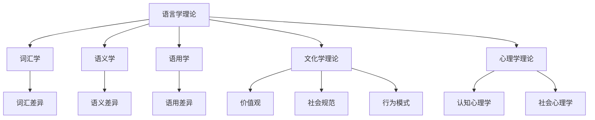

通过结合语言学、文化学和心理学等理论，提示词本地化可以更全面、更精确地适应不同文化背景，提高跨文化交流的效果和用户体验。

---

## 第4章：提示词本地化的理论基础

### 4.1 提示词本地化的概念

提示词本地化是一个涉及语言和文化适应性的过程，旨在将产品或服务中的提示词根据目标市场的文化、语言和习惯进行调整。这一过程不仅涉及简单的语言翻译，还包括对文化差异的深刻理解和适应。提示词本地化的核心目的是确保跨文化交流中的提示词能够有效地传达信息，同时尊重和适应当地的文化习惯。

**提示词**：在用户界面、应用程序和网站上，提示词是用于引导用户进行操作或提供信息的文字、语音或其他形式的信息。这些提示词可以是按钮标签、对话框提示、菜单选项等。

**本地化**：本地化是指将产品或服务的功能、内容和文化背景根据目标市场的需求和习惯进行调整，使其更符合当地用户的需求和期望。本地化过程通常包括翻译、文化适应和格式调整等多个方面。

**提示词本地化**：提示词本地化是指根据目标市场的文化、语言和习惯，对产品或服务中的提示词进行适当的修改和调整，以确保其传达的信息准确、清晰，同时符合目标市场的文化规范和用户习惯。这一过程不仅关注语言层面，还包括对文化习惯、社会规范和用户行为的深刻理解。

### 4.2 提示词本地化的原则

在进行提示词本地化时，需要遵循一系列原则，以确保本地化后的提示词能够在目标市场中有效地传达信息，提升用户体验。以下是提示词本地化过程中应遵循的一些基本原则：

**1. 文化适应性**

提示词本地化首先要考虑文化适应性。不同文化背景下，人们对语言的使用、表达方式和礼仪有不同的理解。本地化过程中，应避免使用可能引起误解或冒犯的词汇和表达方式，确保提示词符合目标市场的文化习惯和价值观。

**2. 语言准确性**

本地化后的提示词应保持语言的准确性，避免歧义和误解。本地化过程中，需要对词汇、语法和语用进行细致调整，确保提示词在目标语言中的表达清晰、准确。这包括对同义词、成语和俗语的选择，以及对语法结构的优化。

**3. 简洁性**

提示词应尽量简洁明了，避免冗长复杂的表述。简洁的提示词有助于用户快速理解并记住系统功能，减少用户的认知负担。此外，简洁性还可以提高用户界面的美观度和易用性。

**4. 一致性**

在跨平台的本地化过程中，应保持提示词的一致性，避免混淆。一致性有助于用户建立对系统的信任，提高用户体验。一致性包括在不同界面元素（如按钮、对话框和菜单）中的提示词保持一致，以及在不同语言版本中保持提示词的统一性。

**5. 可读性**

提示词应具有良好的可读性，包括字体大小、颜色和排版等方面。本地化后的提示词应在视觉上易于阅读和理解，避免过于复杂或难以辨认的布局。

**6. 用户反馈**

在提示词本地化过程中，应重视用户反馈。通过收集用户对提示词的反馈，可以及时发现并解决潜在的问题，进一步优化本地化后的提示词。

### 4.3 提示词本地化的理论基础

提示词本地化的理论基础涉及多个学科，包括语言学、文化学和心理学等。以下是对这些学科在提示词本地化中的应用的详细探讨：

#### 1. 语言学研究

**词汇学**：词汇学关注词汇的构成、发展和使用。在提示词本地化中，词汇学帮助理解不同语言之间的词汇差异，确保本地化后的提示词在目标语言中具有明确的含义。

**语义学**：语义学研究词汇和句子在特定语言环境中的含义。在提示词本地化中，语义学有助于识别和调整可能引起歧义的表达方式，确保提示词在语义上与源语言保持一致。

**语用学**：语用学研究语言在具体语境中的使用和功能。在提示词本地化中，语用学帮助理解不同文化背景下的人们如何使用语言进行沟通，从而设计出更符合目标市场文化习惯的提示词。

#### 2. 文化学研究

**价值观**：价值观是指人们对于什么是好的、正确的或重要的信念和观点。在提示词本地化中，了解不同文化背景下的价值观有助于避免使用可能引起文化冲突的词汇和表达方式。

**社会规范**：社会规范是指特定社会或文化中普遍接受的行为准则和礼仪。在提示词本地化中，了解和适应目标市场的社会规范，有助于确保提示词在目标市场中被接受和尊重。

**行为模式**：行为模式是指人们在不同情境下的行为方式和习惯。在提示词本地化中，了解目标市场的行为模式有助于设计出更符合用户习惯和预期的提示词。

#### 3. 心理学研究

**认知心理学**：认知心理学研究人类的思维过程和认知行为。在提示词本地化中，认知心理学帮助理解用户如何理解和记忆提示词，从而设计出更易于用户理解和记忆的提示词。

**社会心理学**：社会心理学研究人类在社会情境中的行为和心理过程。在提示词本地化中，社会心理学帮助理解用户在跨文化交流中的心理预期和行为反应，从而设计出更符合用户心理预期的提示词。

通过结合语言学、文化学和心理学等理论，提示词本地化可以更全面、更精确地适应不同文化背景，提高跨文化交流的效果和用户体验。

---

### 第5章：提示词本地化的实践方法

#### 5.1 文本分析

文本分析是提示词本地化的重要步骤，它帮助确定源文本中的关键词、短语和句子结构，从而为本地化提供依据。文本分析主要包括以下方法：

1. **关键词提取**：使用算法或工具从源文本中提取出重要的关键词，这些关键词

