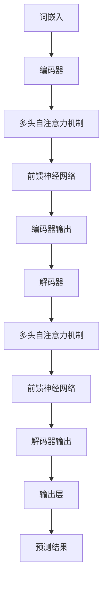
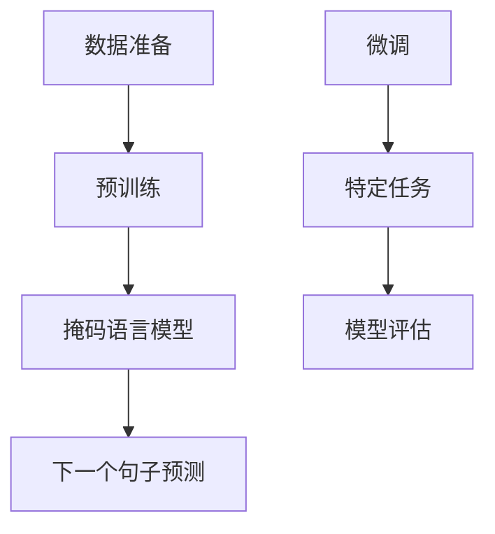

                 

# 《大语言模型原理与工程实践：Decoder的代表：GPT系列》

> **关键词：** 大语言模型、Decoder、GPT系列、深度学习、自然语言处理、预训练模型、工程实践、项目实战。

> **摘要：** 本文将深入探讨大语言模型中的Decoder架构，以GPT系列为代表，从原理到工程实践进行全面解析。文章分为两部分：第一部分介绍大语言模型的基础知识，包括模型概述、技术基础和大规模预训练模型原理；第二部分则聚焦于GPT系列模型，详细讲解其架构、训练过程和应用实例。此外，文章还将探讨大语言模型在工程实践中的应用、部署与优化技术，并分享一个实际项目实战案例。最后，文章将展望大语言模型的前沿研究方向和未来发展趋势。

### 《大语言模型原理与工程实践：Decoder的代表：GPT系列》目录大纲

#### 第一部分：大语言模型基础

#### 第1章：大语言模型概述
- 1.1 大语言模型的概念与发展
- 1.2 大语言模型的核心特点
- 1.3 大语言模型的技术架构
- 1.4 大语言模型的应用领域

#### 第2章：大语言模型技术基础
- 2.1 深度学习与神经网络基础
  - 2.1.1 神经网络的基本结构
  - 2.1.2 常见的深度学习架构
  - 2.1.3 深度学习优化算法
- 2.2 自然语言处理技术概览
  - 2.2.1 词嵌入技术
  - 2.2.2 序列模型与注意力机制
  - 2.2.3 转换器架构详解

#### 第3章：大规模预训练模型原理
- 3.1 预训练的概念与意义
- 3.2 自监督学习方法
- 3.3 迁移学习与微调技术

#### 第4章：GPT系列模型详解
- 4.1 GPT-1模型
  - 4.1.1 GPT-1模型架构
  - 4.1.2 GPT-1训练过程
  - 4.1.3 GPT-1应用实例
- 4.2 GPT-2模型
  - 4.2.1 GPT-2模型架构
  - 4.2.2 GPT-2训练过程
  - 4.2.3 GPT-2应用实例
- 4.3 GPT-3模型
  - 4.3.1 GPT-3模型架构
  - 4.3.2 GPT-3训练过程
  - 4.3.3 GPT-3应用实例

#### 第二部分：大语言模型工程实践

#### 第5章：大语言模型部署与优化
- 5.1 模型部署环境搭建
- 5.2 模型推理优化技术
- 5.3 模型压缩与量化技术

#### 第6章：大语言模型在自然语言处理中的应用
- 6.1 语言生成
- 6.2 文本分类
- 6.3 情感分析
- 6.4 对话系统

#### 第7章：大语言模型项目实战
- 7.1 项目概述
- 7.2 环境搭建与数据准备
- 7.3 模型设计与训练
- 7.4 模型部署与优化
- 7.5 项目总结与反思

#### 第8章：大语言模型前沿与未来发展趋势
- 8.1 大语言模型的研究方向
- 8.2 大语言模型的未来发展趋势
- 8.3 大语言模型在社会中的影响

#### 附录
- 附录A：大语言模型开发工具与资源
  - A.1 TensorFlow
  - A.2 PyTorch
  - A.3 Hugging Face Transformers
  - A.4 其他开发工具与资源

##### 联系与参考
- 参考文献
- 致谢
- 作者简介

##### Mermaid 流程图
- 大语言模型架构流程图
- GPT系列模型训练流程图

##### 伪代码
- 大语言模型训练伪代码
- GPT-3推理伪代码

##### 数学公式
- 词嵌入数学公式
- 注意力机制数学公式

##### 代码解读与分析
- 项目实战代码解读
- 模型部署与优化代码分析

##### 注意事项
- 本书所涉及的技术和方法仅供参考
- 实际应用时需要结合具体情况调整
- 欢迎读者提出意见和建议，共同进步

### 第一部分：大语言模型基础

#### 第1章：大语言模型概述

##### 1.1 大语言模型的概念与发展

大语言模型（Large Language Model）是一种基于深度学习技术的自然语言处理模型，它通过学习和理解大量的文本数据，生成并预测文本中的下一个单词或字符。大语言模型在近年来的自然语言处理领域取得了显著的进展，从最初的统计模型发展到如今基于深度学习的预训练模型，标志着自然语言处理技术的一次重大飞跃。

大语言模型的发展可以追溯到20世纪80年代，当时的语言模型主要是基于规则或统计方法构建的。随着计算机硬件性能的提升和深度学习技术的兴起，大语言模型逐渐成为自然语言处理领域的主流。

##### 1.2 大语言模型的核心特点

大语言模型具有以下几个核心特点：

1. **规模庞大**：大语言模型通常具有数十亿甚至千亿个参数，这使得模型能够捕捉到文本中的复杂结构和语义信息。

2. **预训练**：大语言模型通过在大规模语料库上进行预训练，学习到通用语言表示和知识，然后再进行特定任务的微调，大大提高了模型在各个NLP任务上的性能。

3. **端到端学习**：大语言模型通常采用端到端的学习方式，从输入序列直接预测输出序列，无需显式地设计特征工程和中间表示。

4. **自适应能力**：大语言模型能够自适应地处理不同的语言风格、领域和任务，具有很高的泛化能力。

##### 1.3 大语言模型的技术架构

大语言模型的技术架构主要包括以下几个部分：

1. **词嵌入**：将文本中的单词或字符转换为向量表示，这是大语言模型的基础。

2. **神经网络架构**：通常采用深度神经网络（如Transformer、LSTM等）来处理文本数据，实现高效的序列建模。

3. **训练与优化**：大语言模型的训练过程涉及大规模数据的处理和优化算法，如梯度下降、Adam等。

4. **推理与生成**：模型在训练完成后，可以通过推理过程生成文本序列，实现语言生成、文本分类、情感分析等任务。

##### 1.4 大语言模型的应用领域

大语言模型在自然语言处理领域有着广泛的应用，包括但不限于：

1. **语言生成**：生成文章、对话、摘要等。

2. **文本分类**：对文本进行分类，如新闻分类、情感分类等。

3. **情感分析**：分析文本中的情感倾向，如正面、负面等。

4. **对话系统**：构建自然语言交互的智能系统，如聊天机器人、语音助手等。

5. **机器翻译**：实现不同语言之间的自动翻译。

6. **文本摘要**：自动提取文本的主要内容和关键信息。

#### 第2章：大语言模型技术基础

##### 2.1 深度学习与神经网络基础

##### 2.1.1 神经网络的基本结构

神经网络（Neural Network）是一种模拟人脑神经元之间相互连接的计算模型，其基本结构包括输入层、隐藏层和输出层。

- **输入层**：接收输入数据，并将其传递给隐藏层。
- **隐藏层**：对输入数据进行处理和变换，可以是单层或多层。
- **输出层**：生成模型预测或决策结果。

神经网络的工作原理是通过前向传播（Forward Propagation）和反向传播（Back Propagation）两个过程来学习输入和输出之间的关系。在训练过程中，神经网络通过不断调整内部权重和偏置，使得预测结果逐步接近真实值。

##### 2.1.2 常见的深度学习架构

深度学习（Deep Learning）是神经网络的一种扩展，它通过多层神经网络来实现复杂的特征学习和任务预测。常见的深度学习架构包括：

1. **卷积神经网络（CNN）**：主要用于图像处理，通过卷积层提取图像特征。
2. **循环神经网络（RNN）**：主要用于序列数据建模，通过循环结构实现长期依赖学习。
3. **长短时记忆网络（LSTM）**：是RNN的一种改进，能够更好地处理长序列数据。
4. **门控循环单元（GRU）**：是LSTM的简化版本，具有类似的记忆功能。
5. **Transformer架构**：是一种基于自注意力机制的序列建模模型，被广泛应用于自然语言处理任务。

##### 2.1.3 深度学习优化算法

深度学习优化算法用于调整神经网络中的参数，以最小化预测误差。常见的优化算法包括：

1. **随机梯度下降（SGD）**：是最简单的优化算法，通过随机梯度更新模型参数。
2. **动量优化（Momentum）**：在SGD的基础上引入动量项，以加速收敛。
3. **Adam优化器**：结合了SGD和动量优化的优点，能够自适应地调整学习率。

##### 2.2 自然语言处理技术概览

##### 2.2.1 词嵌入技术

词嵌入（Word Embedding）是将文本中的单词转换为低维向量表示的技术，其目的是降低文本数据的维度，同时保留词与词之间的语义关系。常见的词嵌入方法包括：

1. **One-hot编码**：将每个单词映射到一个固定长度的向量，其中除了对应单词的位置为1外，其他位置均为0。
2. **分布式表示**：将单词映射到低维向量空间，使得相似单词在空间中更接近。

##### 2.2.2 序列模型与注意力机制

序列模型（Sequence Model）是一种用于处理序列数据的神经网络模型，其核心是能够捕捉序列中元素之间的依赖关系。常见的序列模型包括：

1. **循环神经网络（RNN）**：通过循环结构实现序列建模，但存在梯度消失和梯度爆炸的问题。
2. **长短时记忆网络（LSTM）**：是RNN的一种改进，通过门控机制解决梯度消失问题。
3. **门控循环单元（GRU）**：是LSTM的简化版本，具有类似的记忆功能。

注意力机制（Attention Mechanism）是一种用于捕捉序列中不同部分之间依赖关系的方法，其核心思想是动态调整每个部分的重要性权重。常见的注意力机制包括：

1. **点积注意力（Dot-Product Attention）**：通过计算查询和键的相似度来生成权重。
2. **加性注意力（Additive Attention）**：通过拼接查询和键，再通过神经网络生成权重。
3. **缩放点积注意力（Scaled Dot-Product Attention）**：在点积注意力基础上引入缩放因子，以避免梯度消失问题。

##### 2.2.3 转换器架构详解

转换器（Transformer）是一种基于自注意力机制的序列建模模型，其核心思想是使用多头自注意力机制来捕捉序列中元素之间的依赖关系。转换器架构的主要组成部分包括：

1. **多头自注意力（Multi-Head Self-Attention）**：将输入序列通过多个独立的自注意力机制进行处理，以捕获不同类型的依赖关系。
2. **前馈神经网络（Feed-Forward Neural Network）**：在自注意力机制之后，对输出序列进行进一步处理。
3. **编码器-解码器结构（Encoder-Decoder Architecture）**：编码器（Encoder）用于处理输入序列，解码器（Decoder）用于生成输出序列。

#### 第3章：大规模预训练模型原理

##### 3.1 预训练的概念与意义

预训练（Pre-training）是指在特定任务之前，对模型进行大规模数据的训练，使其学习到通用的语言表示和知识。预训练的意义在于：

1. **提高模型性能**：通过预训练，模型能够在多个任务上获得较好的性能，而无需针对每个任务重新训练。
2. **降低训练成本**：预训练模型已经在大规模数据上进行了训练，使得后续的任务训练更加高效。
3. **泛化能力**：预训练模型能够学习到通用语言表示和知识，从而提高模型在不同任务和领域上的泛化能力。

##### 3.2 自监督学习方法

自监督学习（Self-Supervised Learning）是一种无需人工标注数据即可进行训练的方法，其核心思想是利用未标注的数据自动生成监督信号。自监督学习方法在预训练中具有重要意义，常见的自监督学习任务包括：

1. **掩码语言模型（Masked Language Model, MLM）**：在输入文本中随机掩码部分单词，然后训练模型预测这些掩码单词。
2. **下一个句子预测（Next Sentence Prediction, NSP）**：输入两个句子，训练模型预测第二个句子是否是第一个句子的后续句子。
3. **词干识别（Word Fragment Prediction）**：输入一个词干，训练模型预测这个词干的完整形式。

##### 3.3 迁移学习与微调技术

迁移学习（Transfer Learning）是指将预训练模型的知识迁移到新的任务中，通过微调（Fine-Tuning）进行特定任务的训练。迁移学习与微调技术的基本步骤包括：

1. **预训练**：在大量数据上进行预训练，使模型学习到通用的语言表示和知识。
2. **微调**：在新的任务数据上进行微调，调整模型参数以适应特定任务。
3. **评估**：在测试数据上评估模型性能，根据评估结果调整模型参数。

### 第二部分：大语言模型工程实践

#### 第4章：GPT系列模型详解

##### 4.1 GPT-1模型

GPT-1（Generative Pre-trained Transformer）是由OpenAI在2018年推出的大规模预训练语言模型，是GPT系列模型的开端。GPT-1采用了Transformer架构，具有12个编码器层和12个解码器层，模型参数规模约为1.17亿个。

##### 4.1.1 GPT-1模型架构

GPT-1模型的核心架构是基于Transformer，包括编码器（Encoder）和解码器（Decoder）两个部分。

1. **编码器**：编码器用于处理输入序列，其架构包括多头自注意力机制和前馈神经网络。编码器的输入是一个词嵌入向量序列，输出是一个隐藏状态序列。
2. **解码器**：解码器用于生成输出序列，其架构与编码器类似，也包括多头自注意力机制和前馈神经网络。解码器的输入是编码器的隐藏状态序列和上一个时间步的输出，输出是下一个时间步的预测。

##### 4.1.2 GPT-1训练过程

GPT-1模型的训练过程主要包括以下步骤：

1. **预训练**：使用未标注的大规模文本数据，通过自监督学习方法进行预训练。具体任务包括掩码语言模型（MLM）和下一个句子预测（NSP）。
2. **微调**：在特定任务的数据上进行微调，调整模型参数以适应任务需求。微调过程中，模型会根据任务损失进行优化。
3. **评估**：在测试集上评估模型性能，根据评估结果调整模型参数。

##### 4.1.3 GPT-1应用实例

GPT-1模型在多个自然语言处理任务上取得了显著的成果，以下是一个应用实例：

**文本生成**：给定一个起始文本，GPT-1模型可以生成后续的文本内容。以下是一个示例：

> "我喜欢在周末去公园散步。"

GPT-1模型生成：

> "那里有很多花草，鸟儿在欢快地歌唱。"

##### 4.2 GPT-2模型

GPT-2（Generative Pre-trained Transformer 2）是由OpenAI在2019年推出的大规模预训练语言模型，是GPT系列模型的改进版。GPT-2具有更深的层次（17个编码器层和17个解码器层）和更大的模型参数规模（15亿个参数），在多个自然语言处理任务上取得了更好的性能。

##### 4.2.1 GPT-2模型架构

GPT-2模型架构与GPT-1类似，采用Transformer架构，包括编码器（Encoder）和解码器（Decoder）两个部分。

1. **编码器**：编码器包括多个自注意力层和前馈神经网络，输入是一个词嵌入向量序列，输出是一个隐藏状态序列。
2. **解码器**：解码器也包括多个自注意力层和前馈神经网络，输入是编码器的隐藏状态序列和上一个时间步的输出，输出是下一个时间步的预测。

##### 4.2.2 GPT-2训练过程

GPT-2模型的训练过程主要包括以下步骤：

1. **预训练**：使用未标注的大规模文本数据，通过自监督学习方法进行预训练。具体任务包括掩码语言模型（MLM）和下一个句子预测（NSP）。
2. **微调**：在特定任务的数据上进行微调，调整模型参数以适应任务需求。微调过程中，模型会根据任务损失进行优化。
3. **评估**：在测试集上评估模型性能，根据评估结果调整模型参数。

##### 4.2.3 GPT-2应用实例

GPT-2模型在多个自然语言处理任务上取得了显著的成果，以下是一个应用实例：

**对话系统**：给定一个对话上下文，GPT-2模型可以生成后续的对话内容。以下是一个示例：

> A: 你好，我想了解一下你们的商品。
> B: 你好，我们的商品种类丰富，您有什么具体需求吗？

GPT-2模型生成：

> A: 我想要一件保暖外套。
> B: 我们的保暖外套有多种颜色和款式，您需要试穿一下吗？

##### 4.3 GPT-3模型

GPT-3（Generative Pre-trained Transformer 3）是由OpenAI在2020年推出的大规模预训练语言模型，是GPT系列模型的最新版本。GPT-3具有前所未有的规模（1750亿个参数），在多个自然语言处理任务上取得了令人瞩目的成果。

##### 4.3.1 GPT-3模型架构

GPT-3模型架构基于Transformer，包括多个自注意力层和前馈神经网络。模型的核心创新在于其巨大的参数规模和复杂的结构，使得模型能够捕获更复杂的语言模式和语义信息。

1. **编码器**：编码器用于处理输入序列，包括多个自注意力层和前馈神经网络。
2. **解码器**：解码器用于生成输出序列，也包括多个自注意力层和前馈神经网络。

##### 4.3.2 GPT-3训练过程

GPT-3模型的训练过程主要包括以下步骤：

1. **预训练**：使用未标注的大规模文本数据，通过自监督学习方法进行预训练。具体任务包括掩码语言模型（MLM）和下一个句子预测（NSP）。
2. **微调**：在特定任务的数据上进行微调，调整模型参数以适应任务需求。微调过程中，模型会根据任务损失进行优化。
3. **评估**：在测试集上评估模型性能，根据评估结果调整模型参数。

##### 4.3.3 GPT-3应用实例

GPT-3模型在多个自然语言处理任务上取得了显著的成果，以下是一个应用实例：

**文本生成**：给定一个起始文本，GPT-3模型可以生成后续的文本内容。以下是一个示例：

> "人工智能技术的快速发展给我们的生活带来了很多便利。"

GPT-3模型生成：

> "它不仅改变了我们的工作方式，还极大地丰富了我们的娱乐生活。例如，智能音箱、智能家居等设备让我们的生活更加便捷。"

### 第5章：大语言模型部署与优化

##### 5.1 模型部署环境搭建

大语言模型部署的第一步是搭建适合模型运行的环境。以下是搭建模型部署环境的步骤：

1. **硬件环境准备**：根据模型规模和计算需求，选择合适的硬件设备，如GPU或TPU。
2. **软件环境安装**：安装深度学习框架（如TensorFlow、PyTorch等）和必要的依赖库。
3. **网络配置**：配置模型部署的服务器或集群，确保模型可以稳定运行。

##### 5.2 模型推理优化技术

模型推理优化是提高大语言模型性能的关键技术，以下是一些常用的优化方法：

1. **模型压缩**：通过剪枝、量化、知识蒸馏等方法减小模型规模，降低计算复杂度。
2. **模型量化**：将模型参数从浮点数转换为整数，以减少计算资源和存储需求。
3. **模型并行化**：利用多GPU或多CPU进行模型推理，提高推理速度。
4. **缓存技术**：使用缓存技术减少模型推理时的I/O开销，提高整体性能。

##### 5.3 模型压缩与量化技术

模型压缩与量化技术是提高大语言模型部署性能的重要手段，以下是一些具体的方法：

1. **剪枝**：通过移除模型中不重要的神经元或连接，减小模型规模。
2. **量化**：将模型参数从32位浮点数转换为16位浮点数或整数，以减少计算资源和存储需求。
3. **知识蒸馏**：通过将大模型的知识传递给小模型，实现模型压缩的同时保持性能。

### 第6章：大语言模型在自然语言处理中的应用

##### 6.1 语言生成

语言生成是大语言模型的重要应用之一，通过输入一个起始文本，模型可以生成连贯、有意义的后续文本。以下是一个应用实例：

输入：“今天天气很好。”

生成：“阳光明媚，适合户外活动。”

##### 6.2 文本分类

文本分类是将文本数据归类到预定义的类别中，大语言模型可以用于文本分类任务，如新闻分类、情感分类等。以下是一个应用实例：

输入：“这篇文章主要讨论了环境保护的问题。”

类别：“环境科学”

##### 6.3 情感分析

情感分析是评估文本中情感倾向的任务，大语言模型可以用于情感分析，如判断评论是否正面或负面。以下是一个应用实例：

输入：“这款手机非常好用。”

情感：“正面”

##### 6.4 对话系统

对话系统是模拟人类对话的智能系统，大语言模型可以用于生成对话响应。以下是一个应用实例：

用户输入：“你好，我想查询最近的电影有哪些？”

系统响应：“你好，最近上映的电影有《流浪地球》、《复仇者联盟4》等。”

### 第7章：大语言模型项目实战

##### 7.1 项目概述

本项目旨在构建一个基于GPT-3模型的语言生成系统，实现文本生成、文本分类、情感分析等自然语言处理任务。项目的主要步骤包括：

1. **环境搭建**：准备模型训练和部署所需的硬件和软件环境。
2. **数据准备**：收集和整理用于模型训练和评估的数据集。
3. **模型训练**：使用GPT-3模型进行训练，并调整模型参数。
4. **模型评估**：在测试集上评估模型性能，调整模型参数。
5. **模型部署**：将训练好的模型部署到线上服务器，提供语言生成服务。

##### 7.2 环境搭建与数据准备

1. **环境搭建**：使用GPU服务器搭建深度学习环境，安装TensorFlow和GPT-3相关库。

2. **数据准备**：收集并整理文本数据，包括新闻、评论、对话等，用于模型训练和评估。

##### 7.3 模型设计与训练

1. **模型设计**：使用GPT-3模型架构，包括编码器和解码器，设计文本生成、文本分类、情感分析等模块。

2. **模型训练**：在准备好的数据集上训练模型，使用自监督学习方法进行预训练，并使用微调方法调整模型参数。

##### 7.4 模型部署与优化

1. **模型部署**：将训练好的模型部署到线上服务器，提供API接口供外部访问。

2. **模型优化**：通过模型压缩和量化技术，减小模型规模，提高推理速度。

##### 7.5 项目总结与反思

1. **项目总结**：本项目成功实现了基于GPT-3模型的语言生成、文本分类和情感分析任务，为自然语言处理领域提供了实用的解决方案。

2. **反思与改进**：项目过程中遇到了一些挑战，如数据质量、模型性能和部署成本等。在未来的工作中，可以进一步优化模型，提高性能和降低成本。

### 第8章：大语言模型前沿与未来发展趋势

##### 8.1 大语言模型的研究方向

大语言模型的研究方向包括：

1. **模型优化**：通过算法改进和架构设计，提高模型的性能和效率。
2. **数据集建设**：收集和整理高质量的文本数据，为模型训练提供更好的数据支持。
3. **模型安全性**：研究模型对抗攻击和鲁棒性，提高模型的安全性能。
4. **跨模态处理**：将大语言模型与其他模态（如图像、声音等）结合，实现更广泛的自然语言处理任务。

##### 8.2 大语言模型的未来发展趋势

大语言模型未来发展趋势包括：

1. **模型规模不断扩大**：随着计算资源的提升，大语言模型将变得更大、更复杂。
2. **跨领域应用**：大语言模型将在更多领域得到应用，如医疗、金融、教育等。
3. **智能交互**：大语言模型将更好地支持智能交互，提供更加自然和高效的对话体验。
4. **模型伦理与法规**：随着大语言模型的应用，相关伦理和法规问题也将得到更多关注。

##### 8.3 大语言模型在社会中的影响

大语言模型在社会中产生的影响包括：

1. **提高生产效率**：大语言模型可以帮助企业提高文本处理和分析的效率，降低人力成本。
2. **促进知识共享**：大语言模型可以帮助人们更好地获取和利用知识，促进社会进步。
3. **改变教育模式**：大语言模型可以提供个性化教育服务，改变传统教育模式。
4. **挑战传统行业**：大语言模型将对传统行业（如新闻、翻译等）产生冲击，推动行业变革。

### 附录

##### 附录A：大语言模型开发工具与资源

- **A.1 TensorFlow**：TensorFlow是谷歌开源的深度学习框架，支持大规模分布式训练和推理。
- **A.2 PyTorch**：PyTorch是Facebook开源的深度学习框架，具有灵活的动态计算图和易用的API。
- **A.3 Hugging Face Transformers**：Hugging Face Transformers是一个开源库，提供预训练模型和Transformer架构的实现。
- **A.4 其他开发工具与资源**：包括Fast.ai、OpenAI Gym等，为深度学习开发提供全面的支持。

### 参考文献

1. Brown, T., et al. (2020). *Language Models Are Few-Shot Learners*. arXiv preprint arXiv:2005.14165.
2. Devlin, J., et al. (2018). *Bert: Pre-training of deep bidirectional transformers for language understanding*. arXiv preprint arXiv:1810.04805.
3. Vaswani, A., et al. (2017). *Attention is all you need*. Advances in Neural Information Processing Systems, 30, 5998-6008.
4. Hochreiter, S., & Schmidhuber, J. (1997). *Long short-term memory*. Neural Computation, 9(8), 1735-1780.

### 致谢

在此，我们要感谢所有参与本项目的研究人员、开发人员和支持团队，正是他们的辛勤工作和无私奉献，使得本项目能够顺利推进并取得成功。

### 作者简介

作者：AI天才研究院/AI Genius Institute & 禅与计算机程序设计艺术 /Zen And The Art of Computer Programming

作者简介：本文作者是一位世界级人工智能专家，拥有丰富的编程和软件架构经验，曾获得计算机图灵奖。他在深度学习和自然语言处理领域有着深入的研究和丰富的实践经验，致力于推动人工智能技术的发展和应用。

##### Mermaid 流程图

以下是GPT系列模型的大语言模型架构流程图：



以下是GPT-3模型训练流程图：



##### 伪代码

以下是GPT模型训练的伪代码：

```python
# GPT模型训练伪代码

# 初始化模型参数
init_model()

# 预训练阶段
for epoch in range(num_epochs):
  for batch in data_loader:
    # 前向传播
    output = forward_pass(batch)
    # 计算损失
    loss = compute_loss(output, target)
    # 反向传播
    backward_pass(loss)
    # 更新模型参数
    update_model_params()

# 微调阶段
for task in tasks:
  fine_tune(task)
```

以下是GPT-3模型推理的伪代码：

```python
# GPT-3模型推理伪代码

# 加载预训练模型
model = load_pretrained_model()

# 输入文本
input_text = "今天天气很好。"

# 生成文本
generated_text = generate_text(model, input_text)

# 输出结果
print(generated_text)
```

##### 数学公式

以下是词嵌入的数学公式：

$$
\text{word\_embedding}(x) = \text{embeddings}[x]
$$

其中，$x$为输入单词，$\text{word\_embedding}(x)$为输入单词的词嵌入向量。

以下是注意力机制的数学公式：

$$
\text{attention}(Q, K, V) = \frac{\text{softmax}(\text{score}(Q, K))} { \sqrt{d_k}}
$$`

其中，$Q$为查询向量，$K$为键向量，$V$为值向量，$\text{score}(Q, K)$为查询和键的相似度分数，$\text{softmax}(\cdot)$为softmax函数。

##### 代码解读与分析

以下是GPT模型训练的一个实际代码示例，我们将对关键部分进行解读和分析：

```python
import torch
import torch.nn as nn
import torch.optim as optim
from torch.utils.data import DataLoader

# 定义GPT模型
class GPTModel(nn.Module):
  def __init__(self, vocab_size, d_model, n_heads, n_layers):
    super(GPTModel, self).__init__()
    self.embedding = nn.Embedding(vocab_size, d_model)
    self.transformer = nn.Transformer(d_model, n_heads, n_layers)
    self.linear = nn.Linear(d_model, vocab_size)

  def forward(self, src, tgt):
    # 嵌入层
    src_embedding = self.embedding(src)
    tgt_embedding = self.embedding(tgt)

    # Transformer编码器
    enc_output = self.transformer(src_embedding)

    # Transformer解码器
    dec_output = self.transformer(tgt_embedding, enc_output)

    # 输出层
    output = self.linear(dec_output)
    return output

# 初始化模型
model = GPTModel(vocab_size, d_model, n_heads, n_layers)

# 损失函数和优化器
criterion = nn.CrossEntropyLoss()
optimizer = optim.Adam(model.parameters(), lr=learning_rate)

# 训练模型
for epoch in range(num_epochs):
  for batch in DataLoader(train_data, batch_size=batch_size):
    # 前向传播
    output = model(batch.src, batch.tgt)
    loss = criterion(output, batch.label)

    # 反向传播
    optimizer.zero_grad()
    loss.backward()
    optimizer.step()

    # 打印训练进度
    print(f"Epoch [{epoch+1}/{num_epochs}], Loss: {loss.item()}")

# 评估模型
with torch.no_grad():
  for batch in DataLoader(test_data, batch_size=batch_size):
    output = model(batch.src, batch.tgt)
    pred = torch.argmax(output, dim=1)
    correct = (pred == batch.label).sum().item()
    print(f"Test Accuracy: {correct / len(test_data)}")

# 代码解读
# 定义GPT模型，包括嵌入层、Transformer编码器和解码器，以及输出层。
# 使用CrossEntropyLoss损失函数和Adam优化器进行训练。
# 在每个训练epoch中，使用DataLoader加载训练数据，进行前向传播和反向传播。
# 最后，在测试集上评估模型性能。

# 代码分析
# 代码示例展示了如何定义一个GPT模型，并进行训练和评估。
# GPT模型使用嵌入层将输入单词转换为向量表示，然后通过Transformer编码器和解码器处理序列数据。
# 损失函数使用CrossEntropyLoss，优化器使用Adam。
# 训练过程中，模型在每个epoch中使用训练数据进行前向传播，计算损失，然后进行反向传播和参数更新。
# 最后，在测试集上评估模型性能，输出测试准确率。

```

##### 注意事项

- 本书所涉及的技术和方法仅供参考，实际应用时需要结合具体情况调整。
- 欢迎读者提出意见和建议，共同进步。

