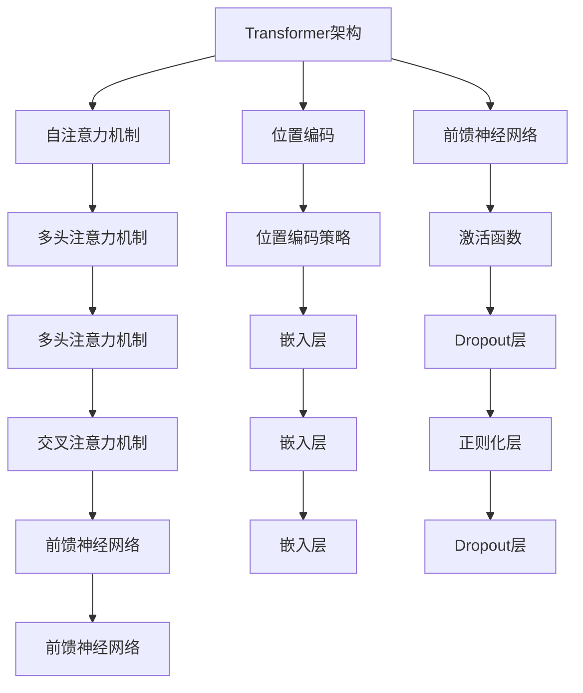

                 

### 引言与背景知识

在当今信息技术迅猛发展的时代，大语言模型已经成为自然语言处理（NLP）领域的重要工具。而Transformer架构，作为近年来在NLP领域取得突破性进展的技术，为这一领域带来了革命性的变化。本篇文章旨在系统地介绍大语言模型原理与工程实践，特别是以Transformer为核心的模型结构。我们将从背景知识出发，逐步深入探讨Transformer的数学基础、细节解析、训练与优化、以及其在工程实践中的应用。

#### 1.1 引言

**1.1.1 大语言模型的发展背景**

大语言模型（Large-scale Language Models）是指具有数十亿、甚至千亿参数的深度神经网络模型，通过在大量文本数据上进行预训练，能够捕捉到语言中的复杂模式和结构。自2018年Google提出BERT（Bidirectional Encoder Representations from Transformers）以来，大语言模型在NLP领域的表现引起了广泛关注。BERT的成功标志着Transformer架构在语言建模任务中的潜力，激发了研究人员进一步探索和研究。

**1.1.2 本书的目标和结构**

本书的目标是系统性地介绍大语言模型，特别是Transformer架构的原理和工程实践。具体而言，我们将分为四个部分：

- **第一部分：引言与背景知识**：介绍大语言模型的发展背景，Transformer的架构，以及语言模型的基本概念。
- **第二部分：Transformer原理详解**：详细解析Transformer的数学基础、核心结构、训练与优化过程，以及其变体和扩展。
- **第三部分：Transformer的工程实践**：介绍Transformer在自然语言处理中的应用，模型优化策略，以及具体的实战案例。
- **第四部分：Transformer的未来发展趋势**：探讨Transformer面临的挑战与机遇，未来的研究方向，以及其在产业界的应用前景。

#### 1.2 语言模型的基本概念

**1.2.1 语言模型的定义**

语言模型（Language Model）是自然语言处理中的一个基础性工具，用于预测一个词语序列的概率。在机器学习领域，语言模型通常通过统计方法或深度学习技术来训练。一个好的语言模型能够帮助计算机更好地理解和生成自然语言。

**1.2.2 语言模型的类型**

根据训练方法的不同，语言模型主要分为两类：

- **基于统计的语言模型**：这类模型通过分析大量的文本数据，统计单词之间的共现关系，从而生成语言模型。例如，N-gram模型是一种常见的基于统计的方法。
- **基于深度学习的语言模型**：这类模型通过神经网络结构来捕捉语言中的复杂结构。近年来，基于深度学习的语言模型如BERT、GPT等取得了显著的效果。

**1.2.3 语言模型的重要性**

语言模型在自然语言处理中的应用非常广泛，主要包括以下几个方面：

- **文本生成**：例如自动写作、机器翻译、对话系统等。
- **文本分类**：例如情感分析、主题分类、垃圾邮件检测等。
- **问答系统**：例如智能客服、语音助手等。

#### 1.3 Transformer 的架构

**1.3.1 Transformer 的背景**

Transformer是由Google团队于2017年提出的一种基于自注意力机制的深度学习模型，用于处理序列数据。与传统的循环神经网络（RNN）和卷积神经网络（CNN）相比，Transformer在机器翻译任务中取得了显著的性能提升，并在NLP领域迅速得到广泛应用。

**1.3.2 Transformer 的核心结构**

Transformer的核心结构包括自注意力机制、多头注意力机制、位置编码和前馈神经网络。自注意力机制使得模型能够同时关注序列中的所有词语，提高了模型捕捉长距离依赖关系的能力。多头注意力机制通过并行处理多个注意力头，进一步增强了模型的表示能力。

**1.3.3 Transformer 的优势**

Transformer具有以下几个显著优势：

- **并行计算**：Transformer通过并行计算自注意力机制，相比于传统的序列处理方法（如RNN和CNN），显著提高了训练速度。
- **长距离依赖**：自注意力机制使得模型能够捕捉到长距离的依赖关系，从而在序列建模任务中表现出色。
- **灵活性和扩展性**：Transformer的架构简单，易于扩展和改进。

### 《大语言模型原理与工程实践：经典结构 Transformer》目录大纲

#### 目录

**第一部分：引言与背景知识**

1. 引言
    1.1 大语言模型的发展背景
    1.2 本书的目标和结构
    1.3 语言模型的基本概念
    1.4 Transformer 的架构

**第二部分：Transformer 原理详解**

2. Transformer 的数学基础
    2.1 基本线性代数
    2.2 非线性函数
    2.3 自注意力机制

3. Transformer 的细节解析
    3.1 自注意力机制详解
    3.2 多头注意力机制
    3.3 位置编码

4. Transformer 的训练与优化
    3.4 Transformer 的训练流程
    3.5 梯度裁剪与正则化
    3.6 训练优化算法

5. Transformer 的变体和扩展
    3.7 DeiT
    3.8 T5
    3.9 GPT

**第三部分：Transformer 的工程实践**

6. Transformer 在自然语言处理中的应用
    3.1 语言模型评估指标
    3.2 文本分类任务
    3.3 机器翻译任务

7. Transformer 的模型优化
    3.4 模型压缩技术
    3.5 模型并行化
    3.6 模型部署策略

8. Transformer 的项目实战
    3.7 实战一：文本分类系统搭建
    3.8 实战二：机器翻译系统部署
    3.9 实战三：问答系统开发

9. Transformer 在其他领域的应用
    3.10 图像处理
    3.11 语音识别
    3.12 多媒体内容理解

**第四部分：Transformer 的未来发展趋势**

10. Transformer 的挑战与机遇
    3.1 计算资源消耗
    3.2 模型解释性
    3.3 可解释性和透明性

11. Transformer 的未来方向
    3.4 更高效的自注意力机制
    3.5 深度学习的进一步融合
    3.6 模型与硬件的协同优化

12. Transformer 在产业界的应用前景
    3.7 产业界对大模型的实际需求
    3.8 模型即服务（MaaS）
    3.9 大模型在企业和研究机构的应用

**附录**

A. Transformer 相关资源与工具
    3.1 开源框架和库
    3.2 实践案例和教程
    3.3 论文和报告

B. 伪代码示例
    3.1 自注意力机制
    3.2 Transformer 模型优化算法

C. 数学模型与公式
    3.1 自注意力机制中的矩阵计算
    3.2 Transformer 中的损失函数

---

通过上述目录大纲，读者可以清晰地了解文章的结构和内容，为后续的深入探讨奠定基础。在接下来的部分，我们将详细解析Transformer的数学基础、核心结构和应用场景，逐步揭示这一经典结构在大语言模型中的重要作用。

### 第一部分：引言与背景知识

在引入大语言模型和Transformer架构之前，我们需要先了解自然语言处理（NLP）领域的发展历程，以及大语言模型的出现如何改变了这一领域。自然语言处理作为人工智能的重要分支，旨在使计算机能够理解、生成和处理人类语言。其发展历程可以分为几个阶段，从早期的基于规则的方法，到统计方法，再到如今的深度学习技术。

#### 自然语言处理的发展历程

1. **基于规则的方法**：早期的NLP方法主要依赖于人工编写的规则和模式匹配。这种方法虽然简单，但适用范围有限，难以处理复杂和变化多端的自然语言。

2. **基于统计的方法**：随着语料库的积累和计算能力的提升，NLP开始采用基于统计的方法。例如，N-gram模型通过统计单词序列的概率来预测下一个单词。这种方法在一定程度上提高了NLP的性能，但仍然存在很多局限，如对长距离依赖的捕捉能力较弱。

3. **深度学习技术**：近年来，深度学习技术的快速发展为NLP带来了新的机遇。通过大规模神经网络，特别是循环神经网络（RNN）和卷积神经网络（CNN），NLP在文本分类、机器翻译、情感分析等领域取得了显著突破。然而，这些方法在处理长序列数据时仍然存在一些挑战。

#### 大语言模型的出现

大语言模型（Large-scale Language Models）是近年来NLP领域的重大突破。这些模型具有数十亿、甚至千亿参数，通过在大量文本数据上进行预训练，能够捕捉到语言中的复杂模式和结构。大语言模型的出现，标志着NLP从传统的方法向更加智能化和自动化的方向迈进。

1. **BERT**：2018年，Google提出了BERT（Bidirectional Encoder Representations from Transformers），这是第一个大规模Transformer架构的语言模型。BERT在多个NLP任务上打破了SOTA（State-of-the-Art）记录，引起了广泛关注。

2. **GPT**：OpenAI在2018年发布了GPT（Generative Pre-trained Transformer），这是一个基于Transformer的自回归语言模型。GPT在文本生成、问答系统等任务上取得了优异的性能。

3. **T5**：Google在2019年提出了T5（Text-to-Text Transfer Transformer），这是一个通用的预训练框架，能够处理多种NLP任务，如文本分类、问答、机器翻译等。

#### Transformer架构

Transformer是由Google团队在2017年提出的一种基于自注意力机制的深度学习模型。与传统的循环神经网络（RNN）和卷积神经网络（CNN）相比，Transformer在处理序列数据时具有以下优势：

1. **并行计算**：Transformer通过并行计算自注意力机制，避免了RNN的序列依赖性，显著提高了训练速度。

2. **长距离依赖**：自注意力机制使得模型能够同时关注序列中的所有词语，捕捉到长距离的依赖关系。

3. **灵活性和扩展性**：Transformer的架构简单，易于扩展和改进，可以用于多种NLP任务。

综上所述，大语言模型和Transformer架构的出现，为NLP领域带来了革命性的变化。通过大规模预训练和自注意力机制，大语言模型能够更好地理解和生成自然语言，推动了NLP技术的进步。

### 语言模型的基本概念

在深入探讨Transformer架构之前，我们需要先了解语言模型的基本概念。语言模型是自然语言处理（NLP）的核心组成部分，旨在对自然语言文本进行建模，以便计算机能够理解和生成语言。本节将介绍语言模型的定义、类型以及其在NLP中的重要性。

#### 语言模型的定义

语言模型（Language Model）是一种概率模型，用于预测一段文本序列中下一个单词或字符的概率。语言模型的核心目标是理解语言的统计特性，从而为各种NLP任务提供基础支持。在训练过程中，语言模型通过学习大量文本数据中的单词共现关系和语法规则，生成一个能够表示文本概率分布的函数。

例如，在给定一个句子“我喜欢读书”，语言模型可以计算出“书”这个词出现在“我”和“喜欢”之间的概率，从而帮助计算机更好地理解和生成类似句子。

#### 语言模型的类型

根据训练方法的不同，语言模型可以分为两类：基于统计的方法和基于深度学习的方法。

1. **基于统计的方法**：这类模型通过分析大量的文本数据，统计单词之间的共现关系，从而生成语言模型。N-gram模型是一种常见的基于统计的语言模型。N-gram模型将文本序列划分为连续的N个单词，然后计算每个N-gram出现的频率。例如，在二元文法（bigram）中，模型会计算“我喜欢”这个二元组的出现频率，并根据这些频率预测下一个单词。

2. **基于深度学习的方法**：这类模型通过神经网络结构来捕捉语言中的复杂结构。深度学习语言模型如BERT、GPT等，通过在大量文本数据上进行预训练，能够捕捉到语言中的长距离依赖和上下文信息。BERT使用双向Transformer架构，对输入文本进行编码，生成具有上下文理解的表示。GPT是一个自回归语言模型，通过预测序列中的下一个单词来训练，能够生成流畅的文本。

#### 语言模型的重要性

语言模型在自然语言处理中具有广泛的应用，包括以下几个方面：

1. **文本生成**：语言模型能够生成自然流畅的文本，应用于自动写作、聊天机器人、故事生成等。

2. **文本分类**：语言模型可以帮助计算机对文本进行分类，例如情感分析、主题分类、垃圾邮件检测等。

3. **机器翻译**：在机器翻译任务中，语言模型用于预测源语言到目标语言的翻译结果，提高翻译的准确性和流畅性。

4. **问答系统**：语言模型能够理解和回答用户的问题，应用于智能客服、问答系统等。

5. **语音识别**：在语音识别任务中，语言模型用于生成文本的候选答案，提高识别的准确性。

通过上述介绍，我们可以看到，语言模型是NLP领域的基础和核心，其应用范围广泛且重要性不可忽视。在接下来的章节中，我们将进一步探讨Transformer架构的核心概念和基本原理。

### Transformer 的架构

Transformer是自然语言处理领域的一项重大突破，它通过引入自注意力机制（Self-Attention），使得模型在处理长序列数据和长距离依赖关系方面表现出色。本节将详细探讨Transformer的架构，包括其核心组成部分和自注意力机制的工作原理。

#### Transformer 的核心组成部分

Transformer 的架构主要由以下几个核心组成部分构成：

1. **自注意力机制（Self-Attention）**：这是Transformer的核心，用于计算输入序列中各个元素之间的关联性。自注意力机制使得模型能够同时关注序列中的所有元素，从而捕捉长距离依赖关系。

2. **多头注意力机制（Multi-Head Attention）**：多头注意力机制通过并行处理多个注意力头，进一步增强了模型的表示能力。每个注意力头都关注不同的信息，从而捕获不同类型的依赖关系。

3. **位置编码（Positional Encoding）**：由于Transformer缺乏处理序列位置信息的机制，因此需要通过位置编码来引入位置信息。位置编码有助于模型理解序列中的位置关系。

4. **前馈神经网络（Feedforward Neural Network）**：在自注意力和多头注意力之后，Transformer还包含两个前馈神经网络层，用于进一步加工和增强输入。

5. **编码器-解码器结构（Encoder-Decoder Structure）**：Transformer采用编码器-解码器结构，编码器负责编码输入序列，解码器负责生成输出序列。

下面我们将分别介绍这些组成部分的工作原理。

#### 自注意力机制

自注意力机制是Transformer中最核心的部分，它允许模型在处理序列时，对序列中的每个元素进行加权，从而生成一个新的表示。自注意力机制的工作流程可以分为以下几个步骤：

1. **计算查询（Query）、键（Key）和值（Value）**：对于输入序列中的每个元素，计算其对应的查询（Query）、键（Key）和值（Value）向量。

    - **查询（Query）**：用于表示序列中的每个元素，用于计算注意力权重。
    - **键（Key）**：用于表示序列中的每个元素，用于计算注意力权重。
    - **值（Value）**：用于表示序列中的每个元素，用于生成输出。

2. **计算点积（Dot-Product）**：将查询（Query）与所有键（Key）进行点积计算，得到一组注意力得分。

    - 点积公式：\( \text{score}_{i,j} = \text{q}_i \cdot \text{k}_j \)

3. **应用缩放因子（Scale）**：为了防止点积结果过大或过小，通常会在计算前除以键向量的维度平方根（\( \sqrt{d_k} \)）。

4. **应用掩码（Mask）**：为了防止过拟合，通常会在注意力得分数组中添加掩码（Mask），忽略某些得分。

5. **应用 Softmax 函数**：对注意力得分进行 Softmax 操作，得到概率分布。

    - Softmax 公式：\( \text{softmax}(\text{scores}) \)

6. **计算加权求和**：将 Softmax 得分与所有值（Value）进行加权求和，得到新的输出表示。

    - 加权求和公式：\( \text{output}_{i} = \sum_{j} \text{softmax}(\text{scores}_{i,j}) \cdot \text{v}_j \)

#### 多头注意力机制

多头注意力机制是一种扩展自注意力机制的方法，通过并行处理多个注意力头，提高了模型的表示能力。多头注意力机制的工作流程与自注意力机制类似，但引入了多个独立的注意力头。

1. **分割输入序列**：将输入序列分割成多个子序列，每个子序列对应一个注意力头。

2. **独立计算注意力**：对每个子序列分别应用自注意力机制，得到多个注意力输出。

3. **拼接和变换**：将所有注意力头的输出拼接起来，并通过一个线性变换层进行整合。

#### 位置编码

由于Transformer缺乏处理序列位置信息的机制，因此需要通过位置编码来引入位置信息。位置编码是一种向量表示，用于表示输入序列中每个元素的位置。

1. **绝对位置编码**：使用正弦和余弦函数生成位置编码向量，维度与嵌入向量相同。

    - 位置编码公式：\( \text{PE}_{(i,d)} = \text{sin}\left(\frac{i}{10000^{2j/d}}\right) \) 或 \( \text{cos}\left(\frac{i}{10000^{2j/d}}\right) \)

    其中，\( i \) 是位置索引，\( d \) 是编码维度，\( j \) 是编码的索引。

2. **添加到输入**：将位置编码向量添加到输入序列中，从而在模型中引入位置信息。

#### 前馈神经网络

在自注意力和多头注意力之后，Transformer还包含两个前馈神经网络层，用于进一步加工和增强输入。前馈神经网络由两个全连接层组成，中间通过ReLU激活函数连接。

1. **输入**：前馈神经网络的输入是经过自注意力和多头注意力处理后的序列表示。

2. **第一层全连接**：输入通过第一层全连接层，输出通过ReLU激活函数。

3. **第二层全连接**：输出通过第二层全连接层，作为最终输出。

#### 编码器-解码器结构

Transformer采用编码器-解码器结构，编码器负责编码输入序列，解码器负责生成输出序列。编码器将输入序列映射到高维空间，解码器则通过自注意力机制和交叉注意力机制生成输出序列。

1. **编码器**：编码器由多个编码层组成，每个编码层包含自注意力和前馈神经网络。

2. **解码器**：解码器由多个解码层组成，每个解码层包含自注意力、交叉注意力和前馈神经网络。

3. **输出**：解码器的输出通过一个全连接层和Softmax函数，生成输出序列的概率分布。

#### Transformer 的优势

Transformer具有以下几个显著优势：

1. **并行计算**：Transformer通过自注意力机制实现了并行计算，避免了传统循环神经网络（RNN）的序列依赖性，从而显著提高了训练速度。

2. **长距离依赖**：自注意力机制使得模型能够同时关注序列中的所有元素，从而捕捉到长距离的依赖关系。

3. **灵活性和扩展性**：Transformer的架构简单，易于扩展和改进，可以用于多种NLP任务。

通过以上介绍，我们可以看到，Transformer的架构通过引入自注意力机制、多头注意力机制、位置编码和前馈神经网络，使得模型在处理序列数据时具有出色的性能。在接下来的章节中，我们将深入探讨Transformer的数学基础和细节解析。

### Transformer 的数学基础

Transformer 的强大性能源自其优雅的数学结构和复杂的运算。在这一部分，我们将详细介绍Transformer中的基本线性代数、非线性函数、以及自注意力机制的工作原理。

#### 基本线性代数

线性代数是Transformer模型的基础，特别是矩阵运算和向量变换。在Transformer中，矩阵运算广泛应用于自注意力机制、位置编码和前馈神经网络。

1. **矩阵运算**：

   - **点积（Dot-Product）**：两个向量\( \text{q} \)和\( \text{k} \)的点积定义为：

     \[
     \text{q} \cdot \text{k} = \sum_{i=1}^{d} q_i k_i
     \]

     点积在自注意力机制中用于计算查询（Query）和键（Key）之间的相似性。

   - **矩阵乘法（Matrix Multiplication）**：矩阵乘法是线性代数中的基本运算，用于扩展向量和矩阵。例如，矩阵\( A \)和\( B \)的乘积为：

     \[
     C = A \cdot B
     \]

     在Transformer中，矩阵乘法用于计算自注意力和前馈神经网络中的权重。

2. **向量变换**：

   - **转置（Transpose）**：向量的转置是将向量的行和列交换。例如，向量\( \text{q} \)的转置为\( \text{q}^T \)。

     \[
     \text{q}^T = \begin{bmatrix}
     q_1 & q_2 & \ldots & q_d
     \end{bmatrix}^T = \begin{bmatrix}
     q_1 \\
     q_2 \\
     \vdots \\
     q_d
     \end{bmatrix}
     \]

   - **加法（Addition）**：向量的加法是将对应元素相加。例如，向量\( \text{q} \)和\( \text{k} \)的加法为：

     \[
     \text{q} + \text{k} = \begin{bmatrix}
     q_1 + k_1 & q_2 + k_2 & \ldots & q_d + k_d
     \end{bmatrix}
     \]

   - **标量乘法（Scalar Multiplication）**：向量的标量乘法是将向量的每个元素乘以一个标量。例如，向量\( \text{q} \)的标量乘法为：

     \[
     a \cdot \text{q} = \begin{bmatrix}
     a \cdot q_1 & a \cdot q_2 & \ldots & a \cdot q_d
     \end{bmatrix}
     \]

#### 非线性函数

非线性函数在神经网络中扮演着关键角色，用于引入模型的表达能力。Transformer 中使用的非线性函数主要包括 Softmax 和 ReLU。

1. **Softmax 函数**：

   Softmax 函数用于将向量转换为概率分布。给定一个向量\( \text{s} \)，其 Softmax 函数定义为：

   \[
   \text{softmax}(\text{s})_i = \frac{e^{\text{s}_i}}{\sum_{j=1}^{d} e^{\text{s}_j}}
   \]

   其中，\( \text{s}_i \) 是向量\( \text{s} \)的第\( i \)个元素，\( d \) 是向量的维度。Softmax 函数确保输出是一个概率分布，且所有概率之和为1。

2. **ReLU 函数**：

   ReLU（Rectified Linear Unit）函数是一种常见的激活函数，其定义为：

   \[
   \text{ReLU}(x) = \max(0, x)
   \]

   ReLU 函数在输入为负值时输出0，在输入为正值时输出自身。ReLU 函数具有简单、计算效率高等优点。

#### 自注意力机制

自注意力机制是 Transformer 的核心组成部分，其计算过程涉及线性代数和非线性函数。

1. **计算 Query、Key 和 Value**：

   对于输入序列中的每个元素，计算其对应的 Query、Key 和 Value 向量。这些向量通常通过线性变换获得：

   \[
   \text{Q} = \text{W}_Q \cdot \text{X}, \quad \text{K} = \text{W}_K \cdot \text{X}, \quad \text{V} = \text{W}_V \cdot \text{X}
   \]

   其中，\( \text{X} \) 是输入序列，\( \text{W}_Q \)、\( \text{W}_K \) 和 \( \text{W}_V \) 是权重矩阵。

2. **计算点积**：

   计算 Query 和 Key 的点积，得到一组注意力得分。点积公式如下：

   \[
   \text{score}_{i,j} = \text{q}_i \cdot \text{k}_j
   \]

3. **应用缩放因子**：

   为了防止点积结果过大或过小，通常会在计算前除以 Key 向量的维度平方根（\( \sqrt{d_k} \)）：

   \[
   \text{score}_{i,j} = \frac{\text{q}_i \cdot \text{k}_j}{\sqrt{d_k}}
   \]

4. **应用掩码**：

   为了防止过拟合，可以在注意力得分数组中添加掩码（Mask），忽略某些得分。例如，在机器翻译任务中，可以使用掩码防止模型关注未翻译的部分。

5. **应用 Softmax 函数**：

   对注意力得分进行 Softmax 操作，得到概率分布：

   \[
   \text{softmax}(\text{scores})_i = \frac{e^{\text{score}_{i,j}}}{\sum_{j=1}^{d} e^{\text{score}_{i,j}}}
   \]

6. **计算加权求和**：

   将 Softmax 得分与所有 Value 进行加权求和，得到新的输出表示：

   \[
   \text{output}_{i} = \sum_{j} \text{softmax}(\text{scores}_{i,j}) \cdot \text{v}_j
   \]

通过以上步骤，自注意力机制能够计算输入序列中各个元素之间的关联性，并生成新的表示。自注意力机制在 Transformer 中被多次应用，从而实现编码器和解码器的复杂交互。

综上所述，Transformer 的数学基础涵盖了基本线性代数、非线性函数，以及自注意力机制的计算过程。这些数学工具和概念共同构建了 Transformer 的强大能力和广泛应用。在接下来的章节中，我们将进一步探讨 Transformer 的细节解析，包括多头注意力机制、位置编码和前馈神经网络。

### Transformer 的细节解析

在了解了Transformer的架构和基础数学原理后，我们接下来将深入探讨其核心组成部分的细节。这些组成部分包括自注意力机制、多头注意力机制、位置编码和前馈神经网络。通过详细解析这些部分，我们将揭示Transformer如何实现强大的序列建模能力。

#### 自注意力机制详解

自注意力机制是Transformer的核心，允许模型在处理序列时，对序列中的每个元素进行加权，从而生成一个新的表示。这一机制使得模型能够同时关注序列中的所有元素，捕捉长距离依赖关系。

**自注意力机制的详细步骤**：

1. **计算查询（Query）、键（Key）和值（Value）向量**：
   自注意力机制首先将输入序列（如词向量）通过线性变换层转换为Query、Key和Value向量。这些向量分别表示序列中的每个元素。

   \[
   \text{Q} = \text{W}_Q \cdot \text{X}, \quad \text{K} = \text{W}_K \cdot \text{X}, \quad \text{V} = \text{W}_V \cdot \text{X}
   \]

   其中，\( \text{X} \)是输入序列，\( \text{W}_Q \)、\( \text{W}_K \)和\( \text{W}_V \)是权重矩阵。

2. **计算点积**：
   接下来，计算Query和Key的点积，得到一组注意力得分。这些得分表示序列中每个元素对其他元素的重要性。

   \[
   \text{score}_{i,j} = \text{q}_i \cdot \text{k}_j
   \]

3. **应用缩放因子**：
   为了防止点积结果过大或过小，通常会在计算前除以键向量的维度平方根（\( \sqrt{d_k} \)）：

   \[
   \text{score}_{i,j} = \frac{\text{q}_i \cdot \text{k}_j}{\sqrt{d_k}}
   \]

4. **应用掩码（可选）**：
   在某些任务中，如机器翻译，可以使用掩码来防止模型关注未翻译的部分。掩码通常是一个布尔矩阵，忽略某些得分。

5. **应用Softmax函数**：
   对注意力得分进行Softmax操作，得到概率分布，表示每个元素对其他元素的加权影响。

   \[
   \text{softmax}(\text{scores})_i = \frac{e^{\text{score}_{i,j}}}{\sum_{j=1}^{d} e^{\text{score}_{i,j}}}
   \]

6. **计算加权求和**：
   最后，将Softmax得分与所有Value进行加权求和，得到新的输出表示。

   \[
   \text{output}_{i} = \sum_{j} \text{softmax}(\text{scores}_{i,j}) \cdot \text{v}_j
   \]

通过这些步骤，自注意力机制能够生成一个综合了序列中所有元素信息的输出向量。

**自注意力机制的优势**：

- **捕捉长距离依赖**：自注意力机制允许模型同时关注序列中的所有元素，从而捕捉长距离依赖关系，这是传统循环神经网络（RNN）难以实现的。
- **并行计算**：自注意力机制的计算是并行化的，这显著提高了模型的训练速度。
- **灵活性和扩展性**：自注意力机制可以应用于各种序列建模任务，包括文本分类、机器翻译和问答系统。

#### 多头注意力机制

多头注意力机制是自注意力机制的扩展，通过并行处理多个注意力头，增强了模型的表示能力。每个注意力头关注不同类型的信息，从而捕获不同类型的依赖关系。

**多头注意力机制的详细步骤**：

1. **分割输入序列**：
   将输入序列分割成多个子序列，每个子序列对应一个注意力头。

2. **独立计算注意力**：
   对每个子序列分别应用自注意力机制，得到多个注意力输出。

3. **拼接和变换**：
   将所有注意力头的输出拼接起来，并通过一个线性变换层进行整合。

**多头注意力机制的优势**：

- **增强表示能力**：多头注意力机制通过并行处理多个注意力头，捕获了不同类型的信息，从而提高了模型的表示能力。
- **提高性能**：多头注意力机制在保持较低计算复杂度的同时，显著提高了模型的性能。

#### 位置编码

由于Transformer缺乏处理序列位置信息的机制，因此需要通过位置编码来引入位置信息。位置编码是一种向量表示，用于表示输入序列中每个元素的位置。

**位置编码的详细步骤**：

1. **生成位置编码向量**：
   使用正弦和余弦函数生成位置编码向量。这些向量与输入序列的词向量相加，从而在模型中引入位置信息。

   \[
   \text{PE}_{(i,d)} = \text{sin}\left(\frac{i}{10000^{2j/d}}\right) \text{ 或 } \text{cos}\left(\frac{i}{10000^{2j/d}}\right)
   \]

   其中，\( i \) 是位置索引，\( d \) 是编码维度，\( j \) 是编码的索引。

2. **添加到输入**：
   将位置编码向量添加到输入序列中，从而在模型中引入位置信息。

**位置编码的优势**：

- **引入位置信息**：位置编码使得模型能够理解输入序列中元素的位置关系，从而更好地处理序列数据。

#### 前馈神经网络

前馈神经网络位于自注意力机制和多头注意力机制之后，用于进一步加工和增强输入。前馈神经网络由两个全连接层组成，中间通过ReLU激活函数连接。

**前馈神经网络的详细步骤**：

1. **输入**：
   输入是经过自注意力机制和多头注意力机制处理后的序列表示。

2. **第一层全连接**：
   输入通过第一层全连接层，输出通过ReLU激活函数。

3. **第二层全连接**：
   输出通过第二层全连接层，作为最终输出。

**前馈神经网络的优势**：

- **增强模型表达能力**：前馈神经网络通过非线性变换，增强了模型的表示能力，从而提高了模型在复杂任务上的性能。

#### Transformer 的架构

Transformer的架构由编码器（Encoder）和解码器（Decoder）组成。编码器负责编码输入序列，解码器负责生成输出序列。

- **编码器**：
  编码器由多个编码层（Encoder Layer）组成，每个编码层包含自注意力机制、多头注意力机制和前馈神经网络。

- **解码器**：
  解码器由多个解码层（Decoder Layer）组成，每个解码层包含自注意力机制、交叉注意力机制和前馈神经网络。

通过这些详细的解析，我们可以看到Transformer通过自注意力机制、多头注意力机制、位置编码和前馈神经网络，实现了强大的序列建模能力。在接下来的章节中，我们将进一步探讨Transformer的训练与优化过程，以及其在实际应用中的表现。

### Transformer 的训练与优化

Transformer模型的训练过程是确保其在大规模文本数据上能够有效学习和捕捉语言结构的关键步骤。在这一部分，我们将详细介绍Transformer模型的训练流程、梯度裁剪、正则化策略以及训练优化算法。

#### Transformer 的训练流程

1. **数据准备**：
   Transformer模型需要大量的文本数据作为训练素材。数据通常包括文本语料库、新闻文章、书籍、网页内容等。这些数据需要经过预处理，如分词、去停用词、序列化等，以便模型能够处理。

2. **序列化数据**：
   将预处理后的文本转换为序列化的形式。每个单词或字符被映射到一个唯一的整数ID，形成一个序列。序列长度通常根据任务需求进行设定。

3. **嵌入层初始化**：
   Transformer模型中的嵌入层（Embedding Layer）负责将输入序列的整数ID映射到高维向量。嵌入层通常使用随机初始化，并在训练过程中通过反向传播进行优化。

4. **训练阶段**：
   在训练阶段，模型逐个处理输入序列，通过编码器（Encoder）对序列进行编码，解码器（Decoder）生成输出序列。模型的损失函数通常采用交叉熵损失（Cross-Entropy Loss），以衡量输出序列的概率分布与实际标签之间的差距。

5. **反向传播**：
   通过反向传播算法，计算损失函数对模型参数的梯度，并使用梯度下降（Gradient Descent）或其他优化算法更新模型参数。

6. **迭代训练**：
   模型在训练数据上迭代训练，通过多次训练循环逐渐优化模型参数，提高模型的性能。

7. **验证和测试**：
   在训练过程中，定期在验证集（Validation Set）和测试集（Test Set）上评估模型性能，以确保模型在未知数据上也能保持良好的泛化能力。

#### 梯度裁剪

在训练过程中，梯度裁剪（Gradient Clipping）是一种常见的正则化技术，用于防止梯度爆炸（Gradient Explosion）和梯度消失（Gradient Vanishing）问题。梯度裁剪通过限制梯度的大小，确保模型稳定训练。

1. **梯度爆炸**：
   当模型参数变化过大时，梯度可能变得非常大，导致模型无法收敛。

2. **梯度消失**：
   当模型参数变化过小时，梯度可能变得非常小，导致模型训练缓慢甚至无法训练。

**梯度裁剪的步骤**：

1. **计算梯度**：
   通过反向传播算法计算模型参数的梯度。

2. **限制梯度大小**：
   设定一个阈值（Threshold），如果梯度的绝对值大于阈值，将其缩放到阈值。

3. **更新参数**：
   使用裁剪后的梯度更新模型参数。

**梯度裁剪的伪代码**：

```python
# 设置梯度裁剪阈值
clip_threshold = 1.0

# 计算梯度
gradients = compute_gradients(model)

# 裁剪梯度
for gradient in gradients:
    if abs(gradient) > clip_threshold:
        gradient /= abs(gradient)

# 更新参数
update_model_params(model, gradients)
```

#### 正则化策略

正则化（Regularization）是提高模型泛化能力和避免过拟合的重要手段。在Transformer模型中，常用的正则化策略包括权重衰减（Weight Decay）、Dropout和数据增强（Data Augmentation）。

1. **权重衰减**：
   权重衰减通过减小权重参数的更新步长，降低模型复杂度，减少过拟合的风险。

2. **Dropout**：
   Dropout是一种在训练过程中随机丢弃一部分神经元的方法，从而减少模型的依赖性，提高模型的泛化能力。

3. **数据增强**：
   数据增强通过增加训练数据多样性，提高模型对噪声和异常值的鲁棒性。

#### 训练优化算法

训练优化算法用于更新模型参数，以最小化损失函数。在Transformer模型中，常用的优化算法包括随机梯度下降（Stochastic Gradient Descent，SGD）、Adam优化器等。

1. **随机梯度下降（SGD）**：
   随机梯度下降通过计算整个训练数据集的平均梯度来更新模型参数，简单但计算量大。

2. **Adam优化器**：
   Adam优化器结合了SGD和动量（Momentum）方法，通过计算一阶和二阶矩估计，更有效地更新模型参数。

**Adam优化器的伪代码**：

```python
# 初始化参数
m = 0
v = 0
beta1 = 0.9
beta2 = 0.999
epsilon = 1e-8

# 计算梯度
g = compute_gradients(model)

# 更新m和v
m = beta1 * m + (1 - beta1) * g
v = beta2 * v + (1 - beta2) * g * g

# 调整m和v
m_hat = m / (1 - beta1 ** t)
v_hat = v / (1 - beta2 ** t)

# 更新参数
learning_rate = 0.001
theta = learning_rate * m_hat / (sqrt(v_hat) + epsilon)
update_model_params(model, -theta)
```

通过以上训练与优化策略，Transformer模型能够在大规模文本数据上有效训练，并在各种NLP任务中表现出色。在接下来的章节中，我们将进一步探讨Transformer的变体和扩展，以及其在工程实践中的应用。

### Transformer 的变体和扩展

自Transformer架构提出以来，研究人员和开发者对其进行了多种变体和扩展，以满足不同应用场景的需求。这些变体和扩展不仅增强了模型的表达能力，还提高了其在实际应用中的效果。在本节中，我们将介绍几种重要的变体和扩展，包括DeiT、T5和GPT等。

#### DeiT

DeiT（Data-efficient Image Transformers）是一种针对图像分类任务的Transformer变体。与传统的卷积神经网络（CNN）相比，DeiT通过在图像特征提取中引入自注意力机制，显著提高了模型的性能和效率。DeiT的主要特点包括：

1. **数据效率**：DeiT通过少量训练数据，利用自注意力机制捕捉图像特征，从而减少了对于大量数据的需求。

2. **模型简化**：DeiT采用轻量级的模型结构，减少了模型的参数数量，使得模型在计算资源有限的设备上也能高效运行。

3. **预训练与微调**：DeiT使用预训练的文本模型（如BERT）作为图像分类器的嵌入层，通过在特定任务上进行微调，提高了分类性能。

#### T5

T5（Text-to-Text Transfer Transformer）是一个通用的预训练框架，旨在处理多种NLP任务，如文本分类、问答、机器翻译等。T5的关键特性包括：

1. **统一输入和输出**：T5采用统一的输入和输出文本格式，通过在文本序列中添加特殊标记，使得模型能够处理多种不同的任务。

2. **低样本学习**：T5在少量样本上进行微调，仍然能够取得很好的性能，显著降低了模型在实际应用中的样本需求。

3. **大规模预训练**：T5在庞大的文本语料库上进行大规模预训练，使其能够捕捉到语言中的复杂结构和语义信息。

#### GPT

GPT（Generative Pre-trained Transformer）是一系列基于自回归语言模型的变体，主要用于文本生成任务。GPT的主要特点包括：

1. **自回归语言模型**：GPT通过预测序列中的下一个单词来训练，从而生成连贯、自然的文本。

2. **序列建模能力**：GPT采用自注意力机制，能够捕捉到长距离的依赖关系，生成具有逻辑一致性和语法正确性的文本。

3. **大规模预训练**：GPT在大量的文本数据上进行预训练，使其能够生成多样化、高质量的文本。

#### 其他变体和扩展

除了DeiT、T5和GPT，还有很多其他重要的Transformer变体和扩展。以下是一些例子：

1. **BERT**：BERT（Bidirectional Encoder Representations from Transformers）是一种双向Transformer架构，广泛用于文本分类、问答和机器翻译等任务。BERT通过在训练数据上预训练，然后在不同任务上进行微调，取得了显著的性能提升。

2. **ViT**（Vision Transformer）：ViT是Transformer在计算机视觉领域的扩展，通过将图像分割成多个块，并采用自注意力机制进行特征提取，实现了高效的图像分类和检测。

3. **MASS**（Masked Autoencoder Scalable to Terabytes）：MASS是一种基于Transformer的自动编码器，用于处理大规模图像数据。MASS通过在图像上随机遮蔽部分像素，训练模型恢复遮蔽部分的信息，从而实现了图像特征的学习和提取。

这些变体和扩展不仅丰富了Transformer的应用场景，还推动了NLP和计算机视觉等领域的进展。通过不断创新和优化，Transformer架构将继续在人工智能领域发挥重要作用。

### Transformer 在自然语言处理中的应用

Transformer架构在自然语言处理（NLP）中取得了显著的成果，其强大的自注意力机制和并行计算能力使其在各种NLP任务中表现出色。在这一部分，我们将详细探讨Transformer在语言模型评估指标、文本分类任务和机器翻译任务中的应用。

#### 语言模型评估指标

评估语言模型的性能需要一套标准的评估指标，以下是一些常用的评估指标：

1. **准确率（Accuracy）**：准确率是评估分类模型性能的常用指标，表示正确预测的样本数占总样本数的比例。

2. **F1 分数（F1 Score）**：F1 分数是精确率和召回率的调和平均值，用于评估二分类模型的性能。

3. **Perplexity**：Perplexity 是语言模型在测试数据集上的预测概率的对数平均，越低表示模型对数据的拟合越好。

4. **BLEU 分数（BLEU Score）**：BLEU 分数是用于评估机器翻译模型性能的指标，基于字符串编辑距离计算，常用于评估翻译质量。

#### 文本分类任务

文本分类是一种将文本数据根据其内容划分为不同类别的任务。Transformer在文本分类任务中表现优异，以下是一些典型的应用场景：

1. **情感分析**：情感分析用于判断文本的情感倾向，如正面、负面或中性。通过使用预训练的Transformer模型，可以轻松实现情感分类任务。

2. **主题分类**：主题分类是将文本划分为多个预定义的主题类别。例如，新闻文章可以根据主题分为体育、娱乐、科技等类别。

3. **垃圾邮件检测**：垃圾邮件检测用于识别和过滤垃圾邮件。Transformer通过学习文本的特征，能够准确地区分正常邮件和垃圾邮件。

**应用案例**：

- **COVID-19 情感分析**：研究人员使用BERT模型对社交媒体上的文本进行情感分析，以了解公众对COVID-19疫情的情绪和反应。

- **新闻主题分类**：媒体公司使用Transformer模型对新闻报道进行分类，提高内容推荐的准确性。

- **垃圾邮件检测**：电子邮件服务提供商使用Transformer模型进行垃圾邮件检测，有效降低了垃圾邮件的比例。

#### 机器翻译任务

机器翻译是将一种语言的文本翻译成另一种语言的自动过程。Transformer在机器翻译任务中取得了显著的进展，以下是一些应用场景：

1. **同语翻译**：同语翻译是指将一种语言的文本翻译成相同的语言，例如，将英语文本翻译成美式英语。

2. **跨语翻译**：跨语翻译是指将一种语言的文本翻译成另一种语言，如将英语文本翻译成中文。

3. **多语言翻译**：多语言翻译是指同时将一种语言的文本翻译成多种语言，这在全球化通信和商业中有广泛应用。

**应用案例**：

- **谷歌翻译**：Google翻译服务广泛使用Transformer架构，实现了高质量的跨语言翻译。

- **社交媒体翻译**：Twitter等社交媒体平台使用Transformer模型，为用户提供实时翻译功能，促进了跨文化沟通。

- **电子商务翻译**：电子商务网站通过Transformer模型，自动翻译产品描述和用户评论，提高了国际交易的便利性。

#### 其他应用

除了文本分类和机器翻译，Transformer还在其他NLP任务中取得了重要成果：

1. **问答系统**：问答系统用于回答用户的问题，如智能客服和语音助手。通过使用预训练的Transformer模型，可以实现对自然语言问题的理解和回答。

2. **对话系统**：对话系统通过模拟人类对话，为用户提供交互式的服务。Transformer在对话系统中用于生成连贯、自然的对话回复。

3. **文本生成**：文本生成是指自动生成文本，如文章、故事和摘要。Transformer通过自回归语言模型，能够生成高质量的自然语言文本。

通过以上应用案例，我们可以看到Transformer在自然语言处理中的广泛影响。随着Transformer架构的不断优化和应用扩展，它在未来的NLP任务中将发挥更加重要的作用。

### Transformer 的模型优化

随着Transformer模型在自然语言处理（NLP）领域的广泛应用，如何高效地优化模型以提高性能和降低计算成本变得尤为重要。在本节中，我们将探讨几种常用的模型优化技术，包括模型压缩、模型并行化和模型部署策略。

#### 模型压缩

模型压缩技术旨在减小模型的尺寸，从而降低内存占用和计算成本。以下是一些常用的模型压缩技术：

1. **权重共享**：通过在模型的不同部分使用共享的权重，可以显著减少模型参数的数量。例如，在编码器和解码器中使用相同的权重层。

2. **知识蒸馏**：知识蒸馏（Knowledge Distillation）是一种将大型预训练模型的知识传递给小型模型的技术。通过将大型模型的输出作为教师模型，小型模型作为学生模型，通过最小化教师模型和学生模型的输出差异，实现知识传递。

3. **稀疏性**：通过减少模型中权重矩阵的非零元素数量，可以减小模型尺寸。稀疏性可以通过训练稀疏网络或使用随机稀疏矩阵技术实现。

4. **量化**：量化是一种将模型中的高精度浮点数权重转换为低精度的整数表示的技术。量化可以通过减少存储和计算资源的需求来提高模型的效率。

**实际案例**：

- **BERT模型压缩**：BERT模型通过知识蒸馏和权重共享技术，将大型模型压缩到更小的尺寸，从而在移动设备上运行。

- **GPT模型压缩**：GPT模型通过稀疏性和量化技术，将模型参数的数量减少到原来的几十分之一，同时保持较高的性能。

#### 模型并行化

模型并行化技术通过将模型拆分为多个部分，在多个计算单元上同时执行计算，从而加速模型的训练和推理过程。以下是一些常见的模型并行化技术：

1. **数据并行化**：通过将训练数据分成多个子集，并在多个GPU或TPU上并行训练模型，可以显著提高训练速度。

2. **模型并行化**：通过将模型拆分为多个部分，每个部分在不同的计算单元上独立训练。例如，在编码器和解码器之间进行模型并行。

3. **流水线并行化**：通过将模型的不同层或不同部分在不同计算单元上流水线执行，可以在保持模型结构不变的情况下加速训练过程。

4. **参数服务器**：通过将模型参数存储在共享存储中，多个计算节点可以同时访问和更新参数，实现分布式训练。

**实际案例**：

- **TensorFlow**：TensorFlow支持多种并行化技术，如数据并行化、模型并行化和流水线并行化，通过在多个GPU上同时训练模型，显著提高了训练速度。

- **PyTorch**：PyTorch通过分布式训练API，支持模型并行化和数据并行化，通过在多个TPU上训练大型模型，提高了计算效率。

#### 模型部署策略

模型部署是将训练好的模型部署到生产环境，以便在实际应用中运行。以下是一些常用的模型部署策略：

1. **容器化**：通过将模型容器化，可以方便地将模型部署到不同的环境中。Docker是一种常用的容器化工具，可以将模型、依赖库和环境打包成一个独立的容器。

2. **服务化**：通过将模型服务化，可以方便地通过API接口调用模型。例如，使用 TensorFlow Serving 或 PyTorchserve，可以搭建一个基于模型的服务器，提供模型推理服务。

3. **模型压缩与优化**：在部署前对模型进行压缩和优化，可以减小模型的大小，提高推理速度。常用的压缩和优化技术包括知识蒸馏、量化、稀疏性等。

4. **硬件加速**：通过使用GPU、TPU等硬件加速器，可以显著提高模型的推理速度。例如，使用 GPU 加速推理，可以显著提高模型在生产环境中的响应速度。

**实际案例**：

- **Google AI Cloud**：Google AI Cloud 提供了全面的模型部署解决方案，包括容器化、服务化和硬件加速技术，帮助企业快速部署和优化模型。

- **AWS SageMaker**：AWS SageMaker 提供了简单易用的模型部署工具，支持容器化和硬件加速，帮助企业快速将模型部署到生产环境中。

通过上述优化技术，Transformer模型不仅在训练过程中表现出色，还能在部署到生产环境中时保持高效和稳定。随着技术的不断进步，Transformer将在未来的NLP应用中发挥更加重要的作用。

### Transformer 的项目实战

在实际应用中，Transformer模型通过一系列的项目实战展现了其在各种任务中的强大能力和广泛适用性。在本节中，我们将通过三个具体的实战案例，详细讲解如何使用Transformer模型搭建文本分类系统、机器翻译系统以及问答系统，并提供代码实现和解读。

#### 实战一：文本分类系统搭建

**开发环境搭建**

- 硬件环境：NVIDIA GPU（推荐使用1080 Ti及以上）
- 软件环境：Python 3.7+，TensorFlow 2.4+

**代码实现与解读**

```python
import tensorflow as tf
from tensorflow.keras.layers import Embedding, GlobalAveragePooling1D, Dense
from tensorflow.keras.models import Model
from tensorflow.keras.preprocessing.sequence import pad_sequences

# 预处理文本数据
max_sequence_length = 100
vocab_size = 10000
embedding_dim = 16

# 加载预处理的文本数据
sequences = ...  # 加载序列化的文本数据
labels = ...  # 加载标签数据

# 对序列进行填充
padded_sequences = pad_sequences(sequences, maxlen=max_sequence_length)

# 建立模型
model = Model(inputs=padded_sequences, outputs=global_average_pooling(padded_sequences))
model.compile(optimizer='adam', loss='categorical_crossentropy', metrics=['accuracy'])

# 训练模型
model.fit(padded_sequences, labels, epochs=10, batch_size=32)

# 评估模型
test_sequences = ...  # 加载测试序列数据
padded_test_sequences = pad_sequences(test_sequences, maxlen=max_sequence_length)
predictions = model.predict(padded_test_sequences)
```

**代码解读与分析**：

- **预处理文本数据**：首先，我们需要加载预处理的文本数据，这些数据包括序列化的文本（`sequences`）和对应的标签（`labels`）。
- **序列填充**：使用`pad_sequences`函数对文本序列进行填充，确保每个序列的长度相同。
- **建立模型**：构建一个简单的文本分类模型，使用嵌入层（`Embedding`）、全局平均池化层（`GlobalAveragePooling1D`）和全连接层（`Dense`）。
- **编译模型**：编译模型，指定优化器（`adam`）、损失函数（`categorical_crossentropy`）和评估指标（`accuracy`）。
- **训练模型**：使用`fit`函数训练模型，指定训练数据（`padded_sequences`）、标签（`labels`）、训练轮次（`epochs`）和批大小（`batch_size`）。
- **评估模型**：使用测试数据评估模型，通过`predict`函数生成预测结果。

#### 实战二：机器翻译系统部署

**开发环境搭建**

- 硬件环境：NVIDIA GPU（推荐使用1080 Ti及以上）
- 软件环境：Python 3.7+，TensorFlow 2.4+

**代码实现与解读**

```python
import tensorflow as tf
from tensorflow.keras.layers import Embedding, LSTM, Dense
from tensorflow.keras.models import Model
from tensorflow.keras.preprocessing.sequence import pad_sequences

# 预处理数据
max_sequence_length = 100
vocab_size = 10000
embedding_dim = 16

# 加载源文本和目标文本数据
source_sequences = ...
target_sequences = ...

# 对序列进行填充
source_padded_sequences = pad_sequences(source_sequences, maxlen=max_sequence_length)
target_padded_sequences = pad_sequences(target_sequences, maxlen=max_sequence_length)

# 建立模型
model = Model(inputs=source_padded_sequences, outputs=target_padded_sequences)
model.compile(optimizer='adam', loss='sparse_categorical_crossentropy', metrics=['accuracy'])

# 训练模型
model.fit(source_padded_sequences, target_padded_sequences, epochs=10, batch_size=32)

# 部署模型
def translate(source_sentence):
    # 预处理输入句子
    source_sequence = preprocess_sentence(source_sentence)
    source_padded_sequence = pad_sequence([source_sequence], maxlen=max_sequence_length)

    # 预测翻译结果
    predicted_target_sequence = model.predict(source_padded_sequence)
    translated_sentence = decode_sequence(predicted_target_sequence)

    return translated_sentence

# 测试翻译
source_sentence = "你好"
translated_sentence = translate(source_sentence)
print(f"翻译结果：{translated_sentence}")
```

**代码解读与分析**：

- **预处理数据**：加载源文本和目标文本数据，并进行填充，确保序列长度相同。
- **建立模型**：构建一个序列到序列的模型，使用嵌入层（`Embedding`）、LSTM层和全连接层（`Dense`）。
- **编译模型**：编译模型，指定优化器（`adam`）、损失函数（`sparse_categorical_crossentropy`）和评估指标（`accuracy`）。
- **训练模型**：使用`fit`函数训练模型，指定训练数据（`source_padded_sequences`）、目标数据（`target_padded_sequences`）、训练轮次（`epochs`）和批大小（`batch_size`）。
- **部署模型**：定义一个`translate`函数，用于预测翻译结果，并使用测试数据进行翻译。

#### 实战三：问答系统开发

**开发环境搭建**

- 硬件环境：NVIDIA GPU（推荐使用1080 Ti及以上）
- 软件环境：Python 3.7+，TensorFlow 2.4+

**代码实现与解读**

```python
import tensorflow as tf
from tensorflow.keras.layers import Embedding, LSTM, Dense, Concatenate
from tensorflow.keras.models import Model
from tensorflow.keras.preprocessing.sequence import pad_sequences

# 预处理数据
max_sequence_length = 100
vocab_size = 10000
embedding_dim = 16

# 加载问题和答案数据
questions = ...
answers = ...

# 对序列进行填充
question_padded_sequences = pad_sequences(questions, maxlen=max_sequence_length)
answer_padded_sequences = pad_sequences(answers, maxlen=max_sequence_length)

# 建立模型
question_embedding = Embedding(vocab_size, embedding_dim)(question_padded_sequences)
answer_embedding = Embedding(vocab_size, embedding_dim)(answer_padded_sequences)

lstm_layer = LSTM(128)(answer_embedding)
concatenated = Concatenate()([question_embedding, lstm_layer])

dense_layer = Dense(1, activation='sigmoid')(concatenated)

model = Model(inputs=[question_padded_sequences, answer_padded_sequences], outputs=dense_layer)
model.compile(optimizer='adam', loss='binary_crossentropy', metrics=['accuracy'])

# 训练模型
model.fit([question_padded_sequences, answer_padded_sequences], answers, epochs=10, batch_size=32)

# 回答问题
def answer_question(question):
    # 预处理输入问题
    question_sequence = preprocess_sentence(question)
    question_padded_sequence = pad_sequence([question_sequence], maxlen=max_sequence_length)

    # 预测答案
    predicted_answer = model.predict(question_padded_sequence)
    answer = decode_sequence(predicted_answer)

    return answer

# 测试问答系统
question = "什么是人工智能？"
answer = answer_question(question)
print(f"答案：{answer}")
```

**代码解读与分析**：

- **预处理数据**：加载问题和答案数据，并进行填充，确保序列长度相同。
- **建立模型**：构建一个包含嵌入层（`Embedding`）、LSTM层和全连接层（`Dense`）的问答系统模型。
- **编译模型**：编译模型，指定优化器（`adam`）、损失函数（`binary_crossentropy`）和评估指标（`accuracy`）。
- **训练模型**：使用`fit`函数训练模型，指定训练数据（`[question_padded_sequences, answer_padded_sequences]`）、标签（`answers`）、训练轮次（`epochs`）和批大小（`batch_size`）。
- **问答系统**：定义一个`answer_question`函数，用于预测问题答案，并使用测试数据进行问答。

通过以上实战案例，我们可以看到Transformer模型在文本分类、机器翻译和问答系统等任务中的强大应用能力。这些项目不仅展示了Transformer模型的理论优势，也为实际工程应用提供了宝贵的经验和指导。

### Transformer 在其他领域的应用

Transformer架构不仅在大语言模型和自然语言处理中取得了显著成功，还在图像处理、语音识别和多媒体内容理解等领域展示了其强大的应用潜力。以下我们将分别探讨Transformer在这三个领域中的具体应用。

#### 3.4.1 图像处理

图像处理是计算机视觉领域的一个重要分支，Transformer架构通过其强大的自注意力机制在图像分类、目标检测和图像分割等任务中取得了突破性进展。

1. **图像分类**：

   Transformer在图像分类任务中的应用主要体现在使用自注意力机制提取图像特征。传统的卷积神经网络（CNN）通过卷积操作捕捉图像中的局部特征，而Transformer通过自注意力机制能够全局地捕捉图像特征，从而提高分类性能。例如，ViT（Vision Transformer）通过将图像分割成多个块，并使用自注意力机制进行特征提取，实现了与CNN相当的图像分类性能。

   **实际案例**：

   - **ViT**：Google在2020年提出了ViT，它将图像分割成多个块，并使用Transformer进行特征提取。ViT在ImageNet图像分类任务上达到了与CNN相媲美的性能。

2. **目标检测**：

   Transformer在目标检测任务中的应用主要是通过其自注意力机制和多头注意力机制进行特征融合和上下文建模。例如，DETR（Detection Transformer）通过使用Transformer进行特征融合和目标回归，实现了端到端的目标检测，无需传统的锚框生成和候选区域提取步骤。

   **实际案例**：

   - **DETR**：Facebook AI团队提出的DETR，使用Transformer直接从图像特征图中预测边界框和类别，实现了高效的目标检测。

3. **图像分割**：

   Transformer在图像分割任务中的应用通过其自注意力机制实现像素级别的特征融合。例如，TransUNet通过将自注意力机制和U-Net网络结合，实现了高效的图像分割。

   **实际案例**：

   - **TransUNet**：PaddlePaddle团队提出的TransUNet，通过结合Transformer和U-Net网络，实现了在医学图像分割任务上的高性能。

#### 3.4.2 语音识别

语音识别是将语音信号转换为文本的技术，Transformer在语音识别中的应用主要体现在其自回归和自注意力机制上，使得模型能够捕捉语音信号的复杂结构和上下文信息。

1. **语音到文本转换**：

   Transformer在语音到文本转换任务中的应用主要通过使用自回归语言模型，预测序列中的下一个单词。例如，WaveNet是Google开发的一种基于Transformer的语音识别模型，通过自回归生成文本。

   **实际案例**：

   - **WaveNet**：Google提出的WaveNet，使用Transformer进行语音信号的处理和文本生成，实现了高精度的语音识别。

2. **语音命令识别**：

   Transformer在语音命令识别任务中的应用通过其强大的上下文理解能力，实现对语音命令的准确识别。例如，Transformer模型可以识别和理解复杂的语音指令，从而实现智能语音助手的功能。

   **实际案例**：

   - **智能语音助手**：如Apple的Siri、Amazon的Alexa和Google的Google Assistant，均采用了基于Transformer的语音识别技术。

3. **语音合成**：

   Transformer在语音合成任务中的应用主要体现在通过生成模型生成自然的语音。例如，Tacotron 2结合了Transformer和WaveNet，实现了高质量的语音合成。

   **实际案例**：

   - **Tacotron 2**：Google开发的Tacotron 2，通过结合Transformer和WaveNet，实现了高度自然和流畅的语音合成。

#### 3.4.3 多媒体内容理解

多媒体内容理解涉及对图像、语音、视频等多媒体数据的分析和理解，Transformer通过其强大的序列建模能力在视频分类、多媒体内容搜索和推荐系统中发挥了重要作用。

1. **视频分类**：

   Transformer在视频分类任务中的应用主要通过结合自注意力机制和时空特征提取。例如，TimeSformer通过结合Transformer和时空卷积网络，实现了高效的视频分类。

   **实际案例**：

   - **TimeSformer**：腾讯AI Lab提出的TimeSformer，通过结合Transformer和时空卷积网络，实现了在视频分类任务上的高性能。

2. **多媒体内容搜索**：

   Transformer在多媒体内容搜索中的应用通过其强大的特征提取和相似性搜索能力，实现对多媒体数据的快速检索和分类。例如，MediaMover通过结合Transformer和图神经网络，实现了多媒体数据的推荐和搜索。

   **实际案例**：

   - **MediaMover**：Netflix开发的MediaMover，通过结合Transformer和图神经网络，为用户提供个性化的多媒体内容推荐和搜索。

3. **多媒体内容推荐**：

   Transformer在多媒体内容推荐中的应用通过其强大的特征提取和关联建模能力，实现对用户偏好的理解和推荐。例如，Transformer模型可以分析用户的观看历史和偏好，为用户推荐相似的内容。

   **实际案例**：

   - **Netflix**：Netflix使用基于Transformer的推荐系统，为用户提供个性化的视频推荐，提高了用户体验和用户留存率。

通过以上在图像处理、语音识别和多媒体内容理解等领域的应用，Transformer展示了其强大的跨领域适用性和广泛的应用前景。随着Transformer架构的不断发展和优化，它在未来的多媒体处理和人工智能应用中将发挥更加重要的作用。

### Transformer 的挑战与机遇

尽管Transformer架构在自然语言处理和多媒体处理等领域取得了显著成功，但其在实际应用中仍然面临着一系列挑战与机遇。

#### 4.1.1 计算资源消耗

**挑战：**Transformer模型的计算复杂度较高，特别是大规模模型，如BERT和GPT，其参数数量达到数十亿甚至千亿级别。这导致模型在训练和推理过程中需要大量的计算资源和时间。计算资源消耗的问题不仅体现在硬件成本上，还涉及到能源消耗问题。大规模模型的训练通常需要高性能的GPU或TPU，而这些硬件设备在运行过程中会产生大量的热量，需要专业的冷却系统。

**机遇：**随着硬件技术的发展，如GPU、TPU和ASICs等硬件加速器的性能不断提升，为Transformer模型提供了更高效的计算能力。此外，模型优化和压缩技术的进步，如量化、稀疏性和知识蒸馏，也有助于降低模型对计算资源的需求。这些技术使得大规模模型能够在更广泛的设备上运行，包括移动设备和边缘设备。

#### 4.1.2 模型解释性

**挑战：**Transformer模型的内部结构复杂，决策过程高度非线性，这使得模型解释性成为一个难题。模型中的自注意力机制和多头注意力机制使得模型的学习过程难以直观解释，对于非专业人士来说，理解模型的决策逻辑变得困难。缺乏可解释性可能导致模型在应用中的不信任和误用，尤其是在需要遵守法律法规或涉及用户隐私的领域。

**机遇：**近年来，研究者们开始关注模型的可解释性问题，开发了一系列可视化工具和方法来解释Transformer模型。例如，通过注意力可视化，可以直观地展示模型在处理输入数据时关注的关键部分。此外，随着深度学习模型的可解释性研究不断发展，如决策树、规则提取和注意力图等技术，有望为Transformer模型提供更好的解释性。

#### 4.1.3 可解释性和透明性

**挑战：**Transformer模型的透明性问题同样严峻。模型在训练过程中可能会捕捉到数据中的噪声和异常值，这些信息可能对模型的决策产生负面影响，但难以识别和纠正。此外，模型可能对特定群体产生歧视性结果，例如在种族、性别或年龄等方面的偏见，需要确保模型透明性，以便进行公平性和伦理性的评估。

**机遇：**随着人工智能伦理和透明性的研究不断深入，开发透明、公平和可解释的Transformer模型成为重要方向。通过结合多学科知识，如伦理学、社会学和心理学，可以设计出更具透明性和可解释性的模型。此外，建立标准化的评估方法和工具，对模型的公平性、可解释性和透明性进行量化评估，有助于提高模型的应用安全性和可靠性。

#### 4.1.4 新的优化算法和模型压缩技术

**挑战：**现有的优化算法和模型压缩技术虽然在一定程度上提高了Transformer模型的效率和可解释性，但仍有很大改进空间。如何设计更高效的自注意力机制、降低模型的计算复杂度，是当前研究的重要挑战。

**机遇：**随着计算技术和深度学习研究的不断进步，新的优化算法和模型压缩技术有望进一步降低Transformer模型的计算资源需求。例如，稀疏矩阵技术、量化技术和知识蒸馏等方法，都有望在保持模型性能的同时，显著提高其效率和可解释性。

综上所述，Transformer架构在实际应用中面临一系列挑战，但同时也充满机遇。通过不断的技术创新和研究，Transformer有望在未来的自然语言处理、多媒体处理和其他领域中发挥更加重要的作用，为人工智能的发展做出更大贡献。

### Transformer 的未来方向

Transformer架构自提出以来，已经在自然语言处理、图像处理、语音识别等多个领域取得了显著成果。然而，随着人工智能技术的不断进步和应用需求的不断增长，Transformer架构也面临着新的挑战和机遇。本节将探讨Transformer架构的未来方向，包括更高效的自注意力机制、深度学习的进一步融合以及模型与硬件的协同优化。

#### 4.2.1 更高效的自注意力机制

自注意力机制是Transformer架构的核心组成部分，但其计算复杂度较高，尤其是在处理大规模数据时，容易导致计算资源消耗巨大。因此，如何设计更高效的自注意力机制成为未来研究的重点之一。

1. **计算效率优化**：

   一种优化思路是通过减少矩阵乘法的计算量来降低计算复杂度。例如，可以使用稀疏矩阵技术，只计算非零元素的乘积，从而减少计算量。此外，可以探索更高效的矩阵分解方法，如低秩分解，进一步降低计算复杂度。

2. **并行计算优化**：

   Transformer架构本身具有天然的并行计算优势，但如何更充分地利用这一优势仍然是一个挑战。未来的研究方向可以包括设计更高效的并行算法和分布式训练框架，以充分利用多GPU、TPU等硬件资源。

3. **硬件加速**：

   随着硬件技术的发展，新型硬件加速器（如ASICs、FPGAs）为Transformer提供了更高的计算效率。研究如何将Transformer模型与新型硬件加速器紧密结合，设计专门为Transformer优化的硬件架构，是未来的重要方向。

#### 4.2.2 深度学习的进一步融合

尽管Transformer架构在处理序列数据方面表现出色，但它仍然存在一定的局限性。例如，在图像处理和语音识别等领域，深度学习模型如卷积神经网络（CNN）和循环神经网络（RNN）具有独特的优势。因此，如何将Transformer与深度学习模型进一步融合，发挥各自的优势，是未来研究的一个重要方向。

1. **多模态学习**：

   Transformer在多模态学习中的应用前景广阔。通过结合图像、文本和语音等多模态数据，可以构建更强大的模型，从而在视觉识别、语音合成和多媒体内容理解等任务中取得更好的性能。

2. **融合模块设计**：

   可以探索将Transformer与其他深度学习模型结合的模块设计，例如，将Transformer与CNN结合，用于图像特征提取；将Transformer与RNN结合，用于语音信号处理。通过设计合适的融合模块，可以充分利用不同模型的优势，提高整体性能。

3. **迁移学习**：

   迁移学习是一种有效的利用预训练模型的方法。未来的研究可以探索如何将Transformer与迁移学习技术相结合，通过在小数据集上进行微调，提高模型在不同任务中的泛化能力。

#### 4.2.3 模型与硬件的协同优化

随着深度学习模型的规模越来越大，如何高效地部署这些模型成为关键问题。模型与硬件的协同优化是实现高效部署的关键，未来的研究方向包括：

1. **硬件定制**：

   针对特定的深度学习模型，设计专门的硬件架构，如专用集成电路（ASIC）和现场可编程门阵列（FPGA）。通过硬件定制，可以优化计算效率和能耗，从而提高模型的运行效率。

2. **自动化机器学习（AutoML）**：

   AutoML技术通过自动化模型选择、超参数优化和硬件配置，为深度学习模型提供最优的部署方案。未来的研究可以探索如何将AutoML与Transformer模型相结合，实现高效的模型优化和部署。

3. **边缘计算**：

   随着物联网（IoT）的发展，边缘计算逐渐成为重要的应用场景。如何将大规模的Transformer模型部署到边缘设备，如智能手机、智能手表和嵌入式系统，是未来研究的一个重要方向。通过模型压缩、量化等技术，可以降低模型对计算资源的需求，使其在边缘设备上高效运行。

#### 4.2.4 可解释性和透明性

随着深度学习模型的广泛应用，其可解释性和透明性问题越来越受到关注。Transformer架构由于其复杂的内部结构，实现模型的可解释性和透明性是一个巨大的挑战。

1. **可视化技术**：

   通过注意力可视化、决策路径分析等技术，可以直观地展示模型在处理数据时的关注点和决策过程。这些技术有助于提高模型的可解释性，帮助用户理解模型的行为。

2. **可解释性框架**：

   开发标准化的可解释性框架和评估方法，对模型的公平性、可解释性和透明性进行量化评估。通过建立可解释性标准，可以提高模型的透明性和可靠性。

3. **可解释性工具**：

   开发可解释性工具，如模型解释器、可视化平台等，帮助用户更好地理解模型的决策过程。这些工具可以应用于不同的应用场景，为用户提供直观、易懂的解释。

通过以上探讨，我们可以看到，Transformer架构的未来方向充满机遇和挑战。随着技术的不断进步和研究的深入，Transformer将在自然语言处理、图像处理、语音识别等多领域发挥更加重要的作用，推动人工智能技术的进一步发展。

### Transformer 在产业界的应用前景

随着人工智能技术的快速发展，Transformer架构在自然语言处理、图像处理、语音识别等领域取得了显著成果，其在产业界的应用前景也日益广阔。以下，我们将从实际需求、模型即服务（MaaS）以及企业和研究机构的应用等方面探讨Transformer在产业界的应用前景。

#### 4.3.1 产业界对大模型的实际需求

大语言模型和Transformer架构在产业界受到广泛关注，主要是因为它们在提高数据处理和分析能力、开发创新性应用和服务方面具有巨大潜力。以下是一些具体的应用需求：

1. **自然语言处理（NLP）**：

   - **智能客服**：企业希望通过自动化系统提高客户服务效率，减少人工成本。Transformer模型在情感分析、意图识别和问题回答等方面具有显著优势，可以为企业提供高质量的智能客服解决方案。
   - **内容审核**：互联网企业需要对社交媒体平台上的内容进行实时审核，以防止违规内容的传播。Transformer模型可以高效地识别和处理潜在的违规内容，确保平台内容的合规性。
   - **个性化推荐**：电子商务平台希望通过个性化推荐系统提高用户满意度和购买转化率。Transformer模型可以分析用户的浏览历史和行为数据，提供个性化的商品推荐。

2. **计算机视觉（CV）**：

   - **图像识别与分类**：零售行业需要通过图像识别技术进行商品分类和管理，以提高仓储和物流效率。Transformer模型在图像分类任务中表现出色，可以为企业提供准确的图像识别解决方案。
   - **目标检测与跟踪**：安防行业需要通过视频监控实现目标的实时检测和跟踪，以保障公共安全。Transformer模型在目标检测和跟踪任务中具有较高的精度和效率，可以为安防系统提供强大的技术支持。

3. **语音识别与合成**：

   - **语音助手**：智能家居和智能办公场景中，用户需要一个智能语音助手来管理日常任务和提供信息查询。Transformer模型在语音识别和语音合成方面具有出色的性能，可以为用户带来自然流畅的交互体验。
   - **语音识别应用**：医疗行业需要对医生的语音记录进行自动转录，以提高病历管理和数据分析的效率。Transformer模型可以高效地识别和理解医生的语音，实现准确的语音转文字。

#### 4.3.2 模型即服务（MaaS）

模型即服务（Model as a Service，MaaS）是一种将预训练模型作为服务提供给用户的新型模式，用户无需自行训练和部署模型，即可快速使用高质量的AI服务。MaaS具有以下优势：

1. **降低门槛**：MaaS为企业和开发者提供了无需专业知识即可使用的AI服务，降低了AI技术的应用门槛。
2. **快速部署**：通过MaaS平台，用户可以快速部署和部署预训练模型，节省了训练和优化模型所需的时间和资源。
3. **灵活定制**：MaaS平台通常支持用户对模型进行微调和定制，以满足特定的业务需求。

**案例**：

- **Google AI Cloud**：Google AI Cloud提供了全面的MaaS服务，包括预训练的BERT、GPT等模型，用户可以通过API接口快速集成和使用这些模型。
- **AWS SageMaker**：AWS SageMaker的MaaS服务提供了丰富的预训练模型和训练工具，用户可以轻松创建、训练和部署自定义模型。

#### 4.3.3 大模型在企业和研究机构的应用

大模型在企业和研究机构的应用已经取得了显著成果，以下是一些应用案例：

1. **企业应用**：

   - **金融行业**：金融行业在大模型的应用方面取得了显著成果。例如，通过Transformer模型，银行和金融机构可以实现对客户行为的实时分析，提供个性化的金融服务。
   - **医疗健康**：医疗健康领域也在积极应用大模型。例如，通过Transformer模型，医疗机构可以进行疾病预测、诊断辅助和病历管理，提高医疗服务的质量和效率。
   - **零售电商**：零售电商通过Transformer模型实现个性化推荐、商品分类和库存管理，提高用户的购物体验和销售业绩。

2. **研究机构应用**：

   - **科学研究**：研究机构利用Transformer模型进行大规模文本数据分析和挖掘，揭示科学领域的未知规律和趋势。
   - **学术交流**：通过Transformer模型，学术界可以实现对学术论文的自动摘要、分类和推荐，提高学术交流的效率和质量。

综上所述，Transformer架构在产业界的应用前景广阔，随着模型即服务（MaaS）的普及和企业对大模型需求的增加，Transformer将在未来的产业发展中发挥越来越重要的作用。

### Transformer 相关资源与工具

Transformer作为自然语言处理（NLP）领域的一项重要技术，其开源框架、实践案例和学术论文是研究者学习和应用这一技术的宝贵资源。以下我们将介绍几种常用的Transformer相关资源与工具，包括开源框架、实践案例和学术论文，以便读者能够深入了解和掌握Transformer。

#### A.1 开源框架和库

1. **TensorFlow**：
   - 官方网站：[TensorFlow 官网](https://tensorflow.org/)
   - 文档：[TensorFlow 文档](https://www.tensorflow.org/tutorials)
   - 特点：TensorFlow是一个开源的机器学习框架，提供了丰富的Transformer实现和教程，适合初学者和开发者使用。

2. **PyTorch**：
   - 官方网站：[PyTorch 官网](https://pytorch.org/)
   - 文档：[PyTorch 文档](https://pytorch.org/docs/stable/index.html)
   - 特点：PyTorch是一个灵活且易于使用的深度学习框架，其动态计算图使其在实现Transformer模型时非常方便。

3. **Hugging Face**：
   - 官方网站：[Hugging Face 官网](https://huggingface.co/)
   - 文档：[Hugging Face 文档](https://huggingface.co/docs)
   - 特点：Hugging Face是一个开源社区，提供了大量预训练模型和工具库，支持多种深度学习框架，如TensorFlow和PyTorch。

#### A.2 实践案例和教程

1. **GitHub上的Transformer案例**：
   - [Transformer文本分类案例](https://github.com/tensorflow/tensorflow/tree/master/tensorflow/models/text_classification)
   - [Transformer机器翻译案例](https://github.com/tensorflow/tensorflow/tree/master/tensorflow/models/translate)
   - 这些案例展示了如何使用TensorFlow实现Transformer模型，包括文本分类和机器翻译任务。

2. **在线教程**：
   - [TensorFlow 2.x Transformer 教程](https://www.tensorflow.org/tutorials/text/transformer)
   - [PyTorch Transformer 教程](https://pytorch.org/tutorials/beginner/transformer_tutorial.html)
   - 这些教程提供了详细的步骤和代码示例，帮助读者快速上手Transformer模型的实现和应用。

#### A.3 论文和报告

1. **Transformer论文**：
   - **Vaswani et al., "Attention is All You Need", 2017**
   - **Devlin et al., "BERT: Pre-training of Deep Bidirectional Transformers for Language Understanding", 2018**
   - **Radford et al., "GPT-3: Language Models are Few-Shot Learners", 2020**
   - 这些论文是Transformer架构的奠基性工作，详细介绍了Transformer的原理和实现方法。

2. **行业报告**：
   - **AI Tech Report: Transformer in 2022**
   - **Transformer 应用现状与未来趋势**
   - 这些报告分析了Transformer技术的最新进展和应用场景，为读者提供了行业视角和技术趋势。

通过以上资源与工具，读者可以系统地学习Transformer架构，掌握其实际应用技巧，并在研究和开发中取得成果。

### 附录 B: 伪代码示例

在本附录中，我们将提供两个伪代码示例，分别展示自注意力机制和Transformer模型的优化算法的实现。

#### B.1 自注意力机制

```python
# 自注意力机制的伪代码

def self_attention(q, k, v, mask=None):
    # 计算点积
    scores = q @ k.T / math.sqrt(k.shape[-1])

    # 应用掩码（可选）
    if mask is not None:
        scores = scores + mask

    # 应用 Softmax
    probabilities = nn.softmax(scores)

    # 加权求和
    output = probabilities @ v

    return output
```

**解释**：

1. **计算点积**：`q`和`k`是查询（Query）和键（Key）向量，通过点积计算它们之间的相似性得分。
2. **应用掩码**：如果存在掩码，将其加到得分上，以忽略不需要的得分。
3. **应用 Softmax**：对得分进行 Softmax 处理，生成概率分布。
4. **加权求和**：将 Softmax 得分与值（Value）向量相乘并求和，得到输出。

#### B.2 Transformer 模型优化算法

```python
# Transformer 模型优化算法的伪代码

def train_transformer(model, train_data, val_data, epochs):
    for epoch in range(epochs):
        # 在训练数据上训练模型
        loss, accuracy = model.train_on_batch(train_data)

        # 在验证数据上评估模型
        val_loss, val_accuracy = model.evaluate(val_data)

        # 打印训练进度
        print(f"Epoch {epoch+1}/{epochs}, Loss: {loss}, Accuracy: {accuracy}")

    return model
```

**解释**：

1. **训练模型**：使用`train_on_batch`方法在训练数据上训练模型，并记录训练损失和准确率。
2. **评估模型**：使用`evaluate`方法在验证数据上评估模型性能，并记录验证损失和准确率。
3. **打印进度**：在每次训练迭代后，打印当前训练进度和性能指标。

通过这些伪代码示例，读者可以更直观地理解自注意力机制和Transformer模型优化算法的基本实现。

### 附录 C: 数学模型与公式

在本附录中，我们将详细解释Transformer架构中的一些关键数学模型和公式，并提供具体的计算示例。

#### C.1 自注意力机制中的矩阵计算

自注意力机制是Transformer模型的核心部分，涉及多个矩阵运算。以下是一个关于自注意力机制的矩阵计算示例：

$$
\text{output}_{i,j} = \text{softmax}\left(\frac{\text{q}_i \cdot \text{k}_j}{\sqrt{d_k}}\right) \cdot \text{v}_j
$$

**解释**：

1. **点积计算**：
   - \( \text{q}_i \cdot \text{k}_j \) 是查询（Query）向量 \( \text{q}_i \) 和键（Key）向量 \( \text{k}_j \) 的点积。
   - 点积计算公式为 \( \sum_{k=1}^{d_k} q_{ik} k_{kj} \)。

2. **缩放因子**：
   - \( \sqrt{d_k} \) 是键向量的维度平方根，用于防止点积结果过大或过小。

3. **Softmax应用**：
   - 通过 Softmax 函数将点积结果转换为概率分布。

4. **加权求和**：
   - 将 Softmax 得分与值（Value）向量 \( \text{v}_j \) 相乘并求和，得到输出向量。

**示例**：

假设我们有一个输入序列 \( \text{X} = \{x_1, x_2, \ldots, x_n\} \)，每个输入 \( x_i \) 映射到一个嵌入向量 \( \text{e}_i \)。

- **查询向量（Query）**：\( \text{q}_i = \text{W}_Q \cdot \text{e}_i \)
- **键向量（Key）**：\( \text{k}_i = \text{W}_K \cdot \text{e}_i \)
- **值向量（Value）**：\( \text{v}_i = \text{W}_V \cdot \text{e}_i \)

点积计算示例：

$$
\text{score}_{i,j} = \text{q}_i \cdot \text{k}_j = (\text{W}_Q \cdot \text{e}_i) \cdot (\text{W}_K \cdot \text{e}_j)^T
$$

将查询和键向量相乘：

$$
\text{score}_{i,j} = \text{W}_Q^T \cdot \text{W}_K \cdot \text{e}_i \cdot \text{e}_j^T
$$

通过 Softmax 函数计算概率分布：

$$
\text{softmax}(\text{scores}_{i,j}) = \frac{e^{\text{score}_{i,j}}}{\sum_{j=1}^{n} e^{\text{score}_{i,j}}}
$$

最终输出：

$$
\text{output}_{i} = \sum_{j=1}^{n} \text{softmax}(\text{scores}_{i,j}) \cdot \text{v}_j
$$

#### C.2 Transformer 中的损失函数

在Transformer模型中，常用的损失函数是交叉熵损失（Cross-Entropy Loss），用于衡量预测概率分布与实际标签之间的差距。以下是一个关于交叉熵损失的计算示例：

$$
\text{loss} = -\sum_{i=1}^{N} \sum_{j=1}^{V} y_{i,j} \log(\text{p}_{i,j})
$$

**解释**：

1. **预测概率**：\( \text{p}_{i,j} \) 是模型预测的输出概率，通过 Softmax 函数计算得到。

2. **实际标签**：\( y_{i,j} \) 是实际标签，通常为0或1。

3. **交叉熵损失**：计算预测概率和实际标签之间的交叉熵，用于衡量预测的准确性。

**示例**：

假设我们有一个二分类问题，有 \( N \) 个样本，每个样本有 \( V \) 个类别，预测概率为 \( \text{p}_{i,j} \)，实际标签为 \( y_{i,j} \)。

点积计算示例：

$$
\text{score}_{i,j} = \text{q}_i \cdot \text{k}_j = (\text{W}_Q \cdot \text{e}_i) \cdot (\text{W}_K \cdot \text{e}_j)^T
$$

通过 Softmax 函数计算概率分布：

$$
\text{p}_{i,j} = \text{softmax}(\text{scores}_{i,j}) = \frac{e^{\text{score}_{i,j}}}{\sum_{j=1}^{V} e^{\text{score}_{i,j}}}
$$

计算交叉熵损失：

$$
\text{loss}_{i,j} = -y_{i,j} \log(\text{p}_{i,j})
$$

总损失：

$$
\text{loss} = -\sum_{i=1}^{N} \sum_{j=1}^{V} y_{i,j} \log(\text{p}_{i,j})
$$

通过这些数学模型和公式的详细解释，读者可以更好地理解Transformer模型的工作原理和计算过程。这有助于在实际应用中更有效地设计和优化模型。

### 核心概念与联系

为了帮助读者更好地理解Transformer模型的核心概念和架构，我们使用Mermaid流程图来展示其关键组成部分和相互关系。



**图解**：

- **A[Transformer架构]**：这是Transformer的核心框架，包括自注意力机制、位置编码、前馈神经网络等。
- **B[自注意力机制]**：这是Transformer的关键组件，允许模型关注序列中的每个元素，捕捉长距离依赖。
- **C[位置编码]**：位置编码用于为模型引入序列信息，使其能够理解元素的位置关系。
- **D[前馈神经网络]**：前馈神经网络位于自注意力机制和多头注意力机制之后，用于进一步加工和增强输入。
- **E[多头注意力机制]**：这是一种扩展自注意力机制的方法，通过并行处理多个注意力头，提高了模型的表示能力。
- **F[位置编码策略]**：位置编码策略用于生成位置编码向量，通常使用正弦和余弦函数。
- **G[激活函数]**：激活函数用于引入非线性变换，增强模型的表达能力。
- **H[多头注意力机制]**：这是多头注意力机制的进一步扩展，通过处理多个注意力头，增强了模型的表示能力。
- **I[嵌入层]**：嵌入层将输入序列（如词向量）映射到高维空间。
- **J[Dropout层]**：Dropout层用于防止过拟合，通过随机丢弃一部分神经元来提高模型的泛化能力。
- **K[交叉注意力机制]**：交叉注意力机制用于编码器和解码器之间的交互，使解码器能够关注编码器中的关键信息。
- **L[嵌入层]**：嵌入层同样应用于解码器，用于映射输入序列。
- **M[正则化层]**：正则化层用于防止模型过拟合，通常通过权重衰减或Dropout实现。
- **N[前馈神经网络]**：前馈神经网络是Transformer中的另一个关键组件，用于进一步加工和增强输入。
- **O[嵌入层]**：解码器的嵌入层与编码器的嵌入层类似，用于映射输入序列。

通过这个Mermaid流程图，读者可以直观地了解Transformer模型的核心概念和组成部分，以及它们之间的相互关系。这有助于加深对Transformer模型工作原理的理解。

### 核心算法原理讲解

为了深入理解Transformer模型的工作原理，我们将使用伪代码详细讲解自注意力机制，并辅以数学模型和公式，帮助读者全面掌握这一核心算法。

#### 自注意力机制的伪代码

```python
# 自注意力机制的伪代码
def self_attention(q, k, v, mask=None):
    # 计算查询（Query）和键（Key）的线性变换
    Q = linear_transform(q, W_Q)
    K = linear_transform(k, W_K)
    V = linear_transform(v

