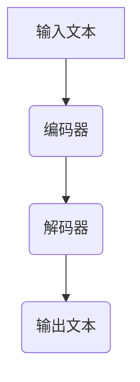

                 

### 大语言模型基础

大语言模型（Large Language Model）是自然语言处理（Natural Language Processing，NLP）领域的一项重要技术，它通过学习和理解大量文本数据，能够生成与人类语言相似的文本。本文将首先介绍大语言模型的基本概念、历史与发展、以及主要应用场景。

#### 1.1 大语言模型的概念

大语言模型是一种基于深度学习的语言处理模型，其核心思想是通过学习海量文本数据，理解语言的语法、语义和上下文关系，从而实现自动文本生成、文本理解、文本分类、情感分析等功能。大语言模型通常具有以下几个特点：

- **规模巨大**：大语言模型通常需要训练在数百万到数十亿级别的参数上，具有非常大的模型规模。
- **多任务能力**：大语言模型可以在多个任务上表现出色，如文本生成、文本分类、机器翻译等。
- **自适应能力**：大语言模型可以根据输入的文本自适应地调整其行为，使其在特定场景下能够生成更符合预期的输出。

#### 1.2 大语言模型的历史与发展

大语言模型的发展可以追溯到上世纪80年代，当时的早期模型如n-gram模型和基于规则的模型。随着计算能力的提升和深度学习技术的发展，大语言模型开始崭露头角。

- **2018年**：谷歌发布了BERT（Bidirectional Encoder Representations from Transformers），这是第一个具有广泛应用的大规模语言模型。
- **2020年**：OpenAI发布了GPT-3（Generative Pre-trained Transformer 3），这是当时规模最大的语言模型，拥有1750亿个参数。
- **2022年**：Meta发布了LLaMA（Language Models for Dialogue Applications），这是一个开源的大规模语言模型，引发了学术和工业界的广泛关注。

#### 1.3 大语言模型的应用场景

大语言模型的应用场景非常广泛，以下是其中一些主要的应用场景：

- **文本生成**：大语言模型可以生成文章、故事、诗歌等文本内容，具有很高的质量。
- **机器翻译**：大语言模型可以自动翻译不同语言之间的文本，提高了翻译的准确性和效率。
- **问答系统**：大语言模型可以回答用户提出的问题，提供相关知识和信息。
- **对话系统**：大语言模型可以与用户进行自然语言交互，实现人机对话。
- **文本分类**：大语言模型可以自动对文本进行分类，如新闻分类、情感分类等。

### 总结

大语言模型作为自然语言处理领域的一项核心技术，具有广泛的应用前景。通过对海量文本数据的学习，大语言模型能够生成高质量的文本、进行文本理解和分类，从而推动人工智能技术的发展和应用。在接下来的章节中，我们将深入探讨大语言模型的核心技术，包括自然语言处理基础、序列模型、注意力机制和Transformer架构等。

---

**关键词**：大语言模型、自然语言处理、文本生成、机器翻译、对话系统、Transformer架构。

**摘要**：本文介绍了大语言模型的基本概念、历史与发展、以及主要应用场景。随后，我们将深入探讨大语言模型的核心技术，包括自然语言处理基础、序列模型、注意力机制和Transformer架构，并详细讲解大语言模型的数学基础。文章还将探讨大语言模型在多步优化中的预测应用，以及其在自然语言理解、生成文本中的应用。最后，我们将总结大语言模型的应用实践和未来前景。

---

### 大语言模型的核心技术

在大语言模型的应用过程中，理解其核心技术至关重要。本章节将详细探讨大语言模型所依赖的几个关键技术：自然语言处理基础、序列模型、注意力机制和Transformer架构。通过深入分析这些技术，我们将更好地理解大语言模型的工作原理和优势。

#### 2.1 自然语言处理基础

自然语言处理（NLP）是计算机科学和人工智能领域的一个重要分支，它涉及对人类语言的计算机处理。NLP的基础技术包括文本预处理、词向量表示、词性标注和句法分析等。

- **文本预处理**：文本预处理是NLP的第一步，包括去除标点符号、转换为小写、去除停用词等。这些操作有助于简化文本，使其更适合后续处理。
- **词向量表示**：词向量是将单词映射为向量的方法，它使得计算机能够理解和处理文本。常见的词向量模型有Word2Vec、GloVe和FastText等。
- **词性标注**：词性标注是将文本中的每个词标注为名词、动词、形容词等词性。这有助于理解句子的语法结构和语义信息。
- **句法分析**：句法分析是分析句子结构的过程，它有助于理解句子的语法规则和语义关系。常见的句法分析方法有依存句法分析和构成句法分析。

#### 2.2 序列模型

序列模型是一类用于处理序列数据（如文本、音频、视频等）的机器学习模型。在NLP中，文本数据通常以序列的形式出现，因此序列模型在NLP中有着广泛的应用。

- **循环神经网络（RNN）**：RNN是一种经典的序列模型，它能够处理任意长度的序列数据。RNN通过隐藏状态和历史信息来实现序列数据的建模。
- **长短时记忆网络（LSTM）**：LSTM是RNN的一种改进，它通过引入门控机制来克服RNN的梯度消失和梯度爆炸问题，从而更好地处理长序列数据。
- **门控循环单元（GRU）**：GRU是另一种RNN的改进，它相比LSTM具有更少的参数，训练速度更快。

#### 2.3 注意力机制

注意力机制是一种用于提高模型对输入序列重要部分关注度的方法。在NLP任务中，注意力机制能够帮助模型更好地理解输入文本的上下文关系。

- **基于矩阵的注意力**：基于矩阵的注意力机制通过计算输入序列中每个词与查询词的相似度来实现。这种机制简单直观，但在处理长序列时容易导致计算复杂度增加。
- **基于拼接的注意力**：基于拼接的注意力机制通过将输入序列中的每个词与查询词拼接，然后通过一个全连接层来计算注意力权重。这种机制能够更好地处理长序列，但在计算效率上有一定损失。
- **基于缩放点积的注意力**：基于缩放点积的注意力机制是Transformer架构中常用的注意力机制，它通过缩放点积操作来实现高效计算。这种机制在处理长序列时表现出色，广泛应用于现代大语言模型。

#### 2.4 Transformer架构

Transformer是一种基于自注意力机制的序列到序列模型，它在很多NLP任务上表现出色，是当前大语言模型的主要架构之一。

- **自注意力机制**：Transformer的核心是自注意力机制，它通过计算输入序列中每个词与所有词的相似度，从而实现对输入序列的全局关注。这种机制使得模型能够更好地捕捉序列之间的长距离依赖关系。
- **编码器和解码器**：Transformer由编码器和解码器两部分组成。编码器负责将输入序列编码为固定长度的向量表示，解码器则负责生成输出序列。编码器和解码器之间通过多头自注意力机制和点积注意力机制来实现信息的传递和融合。
- **多头注意力**：多头注意力是一种将自注意力机制扩展到多个子空间的方法，它能够提高模型的表达能力。在Transformer中，多头注意力通过多个独立的自注意力机制来实现。

#### 总结

大语言模型的核心技术包括自然语言处理基础、序列模型、注意力机制和Transformer架构。这些技术共同构成了大语言模型的基础，使其能够高效地处理和生成文本。在接下来的章节中，我们将深入探讨大语言模型的数学基础，包括线性代数、微积分基础、概率论与信息论和优化算法，进一步理解大语言模型的工作原理和实现细节。

---

### 大语言模型的数学基础

大语言模型作为一种深度学习模型，其工作原理依赖于一系列复杂的数学工具和算法。本章节将详细探讨大语言模型所需的数学基础，包括线性代数、微积分基础、概率论与信息论以及优化算法。通过这些数学工具的理解，我们将更好地掌握大语言模型的理论框架和实现细节。

#### 3.1 线性代数

线性代数是处理向量、矩阵和线性变换的基础数学工具，在大语言模型中有着广泛的应用。

- **向量与矩阵**：向量是具有多个数值元素的有序集合，矩阵是具有多个行和列的数值表格。大语言模型中的许多操作，如权重矩阵的乘法和激活函数的运算，都涉及到向量和矩阵的运算。
- **矩阵乘法**：矩阵乘法是线性代数中的基本运算，它用于计算两个矩阵的乘积。在深度学习中，矩阵乘法用于计算输入数据和权重矩阵之间的线性变换。
- **矩阵求导**：矩阵求导是计算矩阵函数的导数的过程。在优化算法中，矩阵求导用于计算损失函数对模型参数的梯度，从而更新模型参数。

#### 3.2 微积分基础

微积分是研究函数变化率和面积计算的基本数学工具，在大语言模型的训练过程中有着重要的应用。

- **导数**：导数是描述函数变化率的概念。在大语言模型中，导数用于计算损失函数对模型参数的梯度，这是优化算法的基础。
- **梯度下降**：梯度下降是一种优化算法，它通过计算损失函数的梯度来更新模型参数，以最小化损失函数。梯度下降是大语言模型训练过程中最常用的优化算法。
- **链式法则**：链式法则是微积分中的一个重要法则，它用于计算复合函数的导数。在深度学习中，链式法则用于计算多层神经网络中每个层输出的梯度。

#### 3.3 概率论与信息论

概率论与信息论是处理不确定性和信息传递的数学工具，在大语言模型中有着重要的应用。

- **概率分布**：概率分布是描述随机变量取值概率的数学模型。在大语言模型中，概率分布用于预测文本序列的概率分布。
- **条件概率**：条件概率是描述在已知一个事件发生的条件下，另一个事件发生的概率。在大语言模型中，条件概率用于计算给定一个文本序列，下一个词的概率分布。
- **信息论**：信息论是研究信息传输和信息熵的数学分支。在大语言模型中，信息论用于计算文本序列的熵和互信息，这些量可以用来衡量模型对文本的理解程度。

#### 3.4 优化算法

优化算法是用于求解最优化问题的算法，在大语言模型的训练过程中起着关键作用。

- **随机梯度下降（SGD）**：随机梯度下降是一种基本的优化算法，它通过随机选择训练样本来更新模型参数。SGD在大语言模型训练中用于快速迭代更新参数，以达到最小化损失函数的目的。
- **Adam优化器**：Adam优化器是一种自适应优化算法，它结合了SGD和动量法的优点。Adam优化器通过自适应调整学习率，提高了大语言模型训练的收敛速度和稳定性。
- **学习率调度**：学习率调度是优化算法中的一个重要策略，它通过调整学习率来控制模型参数更新的速度。在大语言模型训练中，学习率调度有助于避免过拟合和提高模型性能。

#### 总结

大语言模型的数学基础包括线性代数、微积分基础、概率论与信息论以及优化算法。这些数学工具为理解大语言模型的工作原理提供了理论基础，同时也为模型的实现和优化提供了技术支持。在接下来的章节中，我们将探讨大语言模型在多步优化中的预测应用，深入分析其应用场景和具体实现。

---

### 多步优化中的预测

在复杂系统的建模和优化中，多步预测是一个关键问题。大语言模型以其强大的文本理解和生成能力，在多步优化中的预测应用中展现出极大的潜力。本章节将详细探讨大语言模型在多步优化中的预测应用，包括其基本概念、预测中的多步优化方法，以及大语言模型在具体应用案例中的表现。

#### 4.1 多步优化的基本概念

多步优化是指在一个时间序列中，通过预测未来的变量值来优化决策。这种优化方法在多个领域有着广泛的应用，如金融市场的预测、供应链管理、能源调度等。多步优化的核心是预测，通过准确的预测来指导后续的决策，从而实现系统的最优运行。

- **状态空间模型**：多步优化通常使用状态空间模型来描述系统的动态行为。状态空间模型由状态变量和状态转移方程组成，可以用来预测系统的未来状态。
- **预测误差**：在多步优化中，预测误差是一个关键指标。预测误差越小，预测的准确性越高，从而优化决策的可靠性越高。
- **优化目标**：多步优化的目标通常是最小化某种损失函数，如成本、风险或效益。通过优化目标函数，可以找到最优的决策序列。

#### 4.2 预测中的多步优化

在预测过程中，多步优化涉及到对未来多个时间步的变量值进行预测，并根据预测结果调整当前和未来的决策。这种优化方法可以分为以下几个步骤：

1. **初始化**：首先初始化系统状态和预测模型。系统状态包括当前时间步的变量值，预测模型用于预测未来的变量值。
2. **预测**：使用大语言模型对未来的变量值进行预测。大语言模型通过对大量历史数据的分析，生成未来的变量值预测序列。
3. **优化**：根据预测结果，使用优化算法计算当前和未来的决策。优化算法通常基于损失函数，通过迭代更新决策变量，以实现优化目标。
4. **反馈调整**：在每一步预测和优化后，收集实际的系统状态并与预测结果进行比较。根据预测误差，调整预测模型和优化参数，以提高预测的准确性。

#### 4.3 多步优化中的大语言模型应用案例

大语言模型在多步优化中有着广泛的应用案例，以下是一些具体的应用：

- **时间序列预测**：时间序列预测是金融分析和运营管理中的重要任务。大语言模型可以通过分析历史价格和交易数据，预测未来的价格趋势，从而帮助投资者做出决策。
- **股票市场预测**：股票市场的预测是金融领域的一大挑战。大语言模型通过对大量的股票交易数据进行分析，可以预测股票价格的未来走势，为投资者提供参考。
- **自然语言生成**：自然语言生成（NLG）是另一个重要的应用领域。大语言模型可以生成各种文本内容，如新闻文章、产品描述和对话系统等。通过多步优化，可以不断提高文本生成的质量和效率。

##### 4.3.1 时间序列预测

时间序列预测是金融分析和运营管理中常见的应用。大语言模型可以通过分析历史价格和交易数据，预测未来的价格走势。

1. **数据准备**：首先收集大量的历史价格和交易数据，并对数据进行预处理，如去除缺失值、标准化等。
2. **模型训练**：使用大语言模型对历史数据进行分析和训练，学习价格和交易数据之间的规律。
3. **预测**：根据训练好的模型，预测未来的价格走势。通过多步优化，不断更新预测模型和优化参数，以提高预测的准确性。
4. **评估**：将预测结果与实际价格进行对比，评估预测的准确性。通过调整模型和参数，优化预测结果。

##### 4.3.2 股票市场预测

股票市场预测是金融领域的一大挑战，大语言模型可以通过分析大量的股票交易数据，预测股票价格的未来走势。

1. **数据收集**：收集大量的股票交易数据，包括开盘价、收盘价、最高价、最低价、成交量等。
2. **特征工程**：对数据进行特征工程，提取与股票价格相关的特征，如价格趋势、交易量、技术指标等。
3. **模型训练**：使用大语言模型对特征数据进行训练，学习股票价格和特征数据之间的关系。
4. **预测**：根据训练好的模型，预测未来的股票价格走势。通过多步优化，不断更新预测模型和优化参数，以提高预测的准确性。
5. **风险控制**：在预测股票价格的同时，考虑风险因素，如市场波动、政策变化等，以优化投资决策。

##### 4.3.3 自然语言生成

自然语言生成（NLG）是另一个重要的应用领域。大语言模型可以生成各种文本内容，如新闻文章、产品描述和对话系统等。

1. **文本生成模型**：使用大语言模型构建文本生成模型，通过对输入文本序列进行分析，生成新的文本内容。
2. **多步优化**：在文本生成过程中，通过多步优化不断更新模型和优化参数，以提高文本生成的质量和效率。
3. **应用场景**：将文本生成模型应用于各种场景，如自动摘要、机器翻译、聊天机器人等，提高文本处理的自动化和智能化水平。

#### 总结

多步优化中的预测是大语言模型的一个重要应用领域。通过分析历史数据和学习数据之间的规律，大语言模型可以预测未来的变量值，从而指导优化决策。在实际应用中，大语言模型在时间序列预测、股票市场预测和自然语言生成等领域表现出色，为各个领域的优化决策提供了有力支持。在接下来的章节中，我们将探讨大语言模型在自然语言理解中的应用，深入分析其在文本分类、命名实体识别和语义分析等任务中的表现。

---

### 大语言模型在自然语言理解中的应用

自然语言理解（Natural Language Understanding，NLU）是自然语言处理（NLP）的重要分支，它致力于使计算机能够理解、解释和生成人类语言。大语言模型在NLU领域中发挥着关键作用，通过其强大的语言理解和生成能力，实现了文本分类、命名实体识别和语义分析等任务。本章节将详细探讨大语言模型在这些任务中的应用及其具体实现。

#### 5.1 自然语言理解概述

自然语言理解的目标是将人类语言的输入转换为机器可以理解和处理的结构化数据。这包括以下几个方面：

- **文本预处理**：将原始文本转换为机器可以处理的形式，如去除标点符号、转换为小写、分词等。
- **词向量表示**：将文本中的词映射为高维向量，以表示词的语义信息。
- **语言模型**：利用训练好的语言模型，对输入的文本进行概率分布建模，预测下一个词或句子。
- **实体识别**：识别文本中的命名实体，如人名、地点、组织名等。
- **语义分析**：理解文本的深层含义，包括句法分析、语义角色标注和情感分析等。

#### 5.2 文本分类

文本分类是将文本数据根据其内容分为不同的类别的过程。大语言模型在文本分类任务中表现出色，主要依赖于其强大的语义理解和建模能力。

1. **数据准备**：首先，收集大量已标注的文本数据作为训练集。这些数据应涵盖各种类别，以确保模型的泛化能力。
2. **特征提取**：使用词向量表示方法，将文本数据转换为向量表示。常用的方法包括Word2Vec、GloVe和BERT等。
3. **模型训练**：利用训练集数据，使用大语言模型训练分类模型。在训练过程中，模型会学习不同类别文本的语义特征。
4. **分类**：将新的文本数据输入到训练好的模型中，模型会根据文本的语义特征将其分类到相应的类别。

##### 5.2.1 实际案例

例如，在社交媒体分析中，可以使用大语言模型对用户发布的推文进行分类，识别其主题或情感。通过训练模型，可以自动将推文分类为正面、负面或中性，从而帮助平台管理员监控内容质量。

#### 5.3 命名实体识别

命名实体识别（Named Entity Recognition，NER）是识别文本中的特定命名实体，如人名、地点、组织名、日期等。大语言模型在NER任务中的应用，主要依赖于其强大的词向量表示和上下文理解能力。

1. **数据准备**：收集带有命名实体标注的文本数据作为训练集。
2. **特征提取**：将文本数据转换为词向量表示，常用的词向量模型包括Word2Vec和GloVe等。
3. **模型训练**：使用大语言模型训练NER模型。在训练过程中，模型会学习如何识别不同的命名实体。
4. **实体识别**：将新的文本数据输入到训练好的NER模型中，模型会识别并标注出文本中的命名实体。

##### 5.3.1 实际案例

例如，在新闻文章处理中，可以使用大语言模型识别文章中的人名、地点和组织名等命名实体，从而帮助新闻编辑和读者快速获取关键信息。

#### 5.4 语义分析

语义分析是理解文本的深层含义，包括句法分析、语义角色标注和情感分析等。大语言模型在语义分析中的应用，主要依赖于其强大的语义理解和建模能力。

1. **数据准备**：收集带有语义标注的文本数据作为训练集。
2. **特征提取**：将文本数据转换为词向量表示，并利用大语言模型进行上下文建模。
3. **模型训练**：使用大语言模型训练语义分析模型。在训练过程中，模型会学习如何理解文本的句法结构和语义信息。
4. **语义分析**：将新的文本数据输入到训练好的语义分析模型中，模型会进行句法分析和语义角色标注，并识别文本的情感倾向。

##### 5.4.1 实际案例

例如，在客户服务中，可以使用大语言模型对客户反馈进行分析，识别客户的问题和情感，从而提供更有效的解决方案。

#### 总结

大语言模型在自然语言理解中的应用非常广泛，包括文本分类、命名实体识别和语义分析等任务。通过其强大的语言理解和生成能力，大语言模型能够实现高度自动化的文本处理，从而提高数据处理效率和质量。在接下来的章节中，我们将探讨大语言模型在生成文本中的应用，深入分析其在自动摘要、机器翻译和艺术文本创作等任务中的具体应用。

---

### 大语言模型在生成文本中的应用

大语言模型不仅在理解和处理文本方面表现出色，而且在生成文本方面同样具有强大的能力。通过其强大的语言生成能力，大语言模型可以在多种场景下自动生成文本，如自动摘要、机器翻译和艺术文本创作等。本章节将详细探讨大语言模型在生成文本中的应用，并分析其基本方法、文本生成模型以及具体的应用案例。

#### 6.1 生成文本的基本方法

生成文本的基本方法可以分为两大类：基于规则的生成方法和基于统计的生成方法。

1. **基于规则的生成方法**：
   - 这种方法通过定义一系列规则来生成文本。例如，在自动生成新闻报道时，可以根据事先定义的模板和事实信息来生成文本。
   - 基于规则的生成方法优点是生成文本结构清晰、逻辑性强，但缺点是生成文本的多样性和创造性有限。

2. **基于统计的生成方法**：
   - 这种方法利用大量训练数据，通过学习文本的概率分布来生成文本。大语言模型就是基于统计的生成方法的一种典型代表。
   - 基于统计的生成方法优点是能够生成多样性和创造性更高的文本，但缺点是生成文本的语法和语义可能不够准确。

#### 6.2 文本生成模型

文本生成模型是利用大语言模型生成文本的核心工具。常见的文本生成模型包括基于循环神经网络（RNN）的模型、基于Transformer的模型以及大语言模型本身。

1. **基于RNN的文本生成模型**：
   - RNN（如LSTM和GRU）是经典的序列生成模型，可以用于生成文本。RNN通过隐藏状态和历史信息来预测下一个词，从而生成序列。
   - 优点：处理长序列数据效果较好，能够捕捉序列中的长期依赖关系。
   - 缺点：训练过程复杂，计算效率较低。

2. **基于Transformer的文本生成模型**：
   - Transformer是近年来发展起来的自注意力机制模型，它在生成文本方面表现出色。
   - 优点：处理长序列数据效率高，生成文本质量好。
   - 缺点：模型参数较多，训练和推理时间较长。

3. **大语言模型**：
   - 大语言模型（如GPT、BERT等）是当前生成文本的主流模型，通过预训练和微调，能够生成高质量的文本。
   - 优点：生成文本多样性和创造性高，能够捕捉复杂的语义关系。
   - 缺点：模型训练和推理资源需求大，训练和优化过程复杂。

#### 6.3 文本生成案例

以下是一些大语言模型在生成文本中的具体应用案例：

##### 6.3.1 自动摘要

自动摘要是从原始文本中自动提取关键信息并生成摘要的过程。大语言模型可以通过训练生成摘要文本，提高摘要的准确性和质量。

1. **数据准备**：收集大量已标注的文本数据作为训练集，这些数据应包括原始文本和对应的摘要。
2. **模型训练**：使用大语言模型训练摘要生成模型。在训练过程中，模型会学习如何从原始文本中提取关键信息并生成摘要。
3. **摘要生成**：将新的文本输入到训练好的摘要生成模型中，模型会生成摘要文本。

##### 6.3.2 机器翻译

机器翻译是将一种语言的文本翻译成另一种语言的过程。大语言模型在机器翻译中有着广泛的应用，通过预训练和微调，能够生成高质量的翻译结果。

1. **数据准备**：收集大量已标注的双语文本数据作为训练集。
2. **模型训练**：使用大语言模型训练翻译模型。在训练过程中，模型会学习如何将源语言文本翻译成目标语言文本。
3. **翻译**：将新的源语言文本输入到训练好的翻译模型中，模型会生成目标语言翻译结果。

##### 6.3.3 艺术文本创作

艺术文本创作是利用大语言模型生成具有艺术性和创造性的文本内容，如诗歌、故事和剧本等。

1. **数据准备**：收集大量艺术文本数据作为训练集。
2. **模型训练**：使用大语言模型训练艺术文本生成模型。在训练过程中，模型会学习如何生成具有艺术性的文本内容。
3. **创作**：将新的文本输入到训练好的艺术文本生成模型中，模型会生成艺术性的文本内容。

#### 总结

大语言模型在生成文本中的应用非常广泛，包括自动摘要、机器翻译和艺术文本创作等任务。通过其强大的语言生成能力，大语言模型能够生成高质量的文本，提高文本处理的自动化和智能化水平。在接下来的章节中，我们将探讨大语言模型的训练与优化过程，深入分析其训练过程、优化策略、评估方法和部署实践。

---

### 大语言模型的训练与优化

大语言模型作为一种复杂的深度学习模型，其训练与优化过程至关重要。本章节将详细探讨大语言模型的训练过程、优化策略、评估方法和部署实践，帮助读者全面了解大语言模型的训练与优化全流程。

#### 7.1 大语言模型的训练过程

大语言模型的训练过程可以分为以下几个步骤：

1. **数据准备**：首先，需要收集大量的文本数据作为训练集。这些数据应涵盖各种语言现象和领域，以保证模型的泛化能力。数据收集后，需要进行预处理，如去除标点符号、转换为小写、分词和词向量表示等。
2. **模型初始化**：初始化模型参数，这些参数通常是通过随机初始化或预训练模型来获得。初始化参数的目的是为模型提供初始状态，以开始学习过程。
3. **模型训练**：在训练过程中，模型会通过优化算法不断更新参数，以最小化损失函数。常用的优化算法包括随机梯度下降（SGD）、Adam等。在训练过程中，模型会逐个处理训练集中的样本，计算损失函数的梯度，并根据梯度更新模型参数。
4. **模型评估**：在训练过程中，需要对模型进行定期评估，以检查模型的训练效果。常用的评估指标包括准确率、召回率、F1值等。通过评估，可以确定模型是否已达到预期的性能水平。
5. **模型调整**：根据评估结果，对模型进行调整，如调整学习率、增加训练数据、调整模型结构等。这些调整有助于提高模型的性能和泛化能力。

##### 7.1.1 伪代码

```python
for epoch in range(num_epochs):
  for sample in dataset:
    # 前向传播
    predicted_output = model(sample.input)
    loss = calculate_loss(predicted_output, sample.target)
    
    # 反向传播
    gradients = calculate_gradients(loss, model.parameters())
    
    # 更新模型参数
    update_model_parameters(gradients, model.learning_rate)
    
  # 评估模型
  evaluate_model(model, validation_dataset)
```

#### 7.2 模型优化策略

在训练大语言模型时，优化策略对于提高模型性能和训练效率至关重要。以下是一些常用的优化策略：

1. **学习率调度**：学习率调度是一种动态调整学习率的方法，以避免模型过早地收敛到次优解。常用的学习率调度策略包括线性衰减、指数衰减和时间衰减等。
2. **正则化**：正则化是一种防止模型过拟合的技术。常用的正则化方法包括L1正则化、L2正则化和Dropout等。
3. **批量大小**：批量大小是指每次训练过程中处理的数据样本数量。较大的批量大小可以提高训练速度和模型稳定性，但可能导致梯度估计不稳定。较小批量大小则可以提高模型的泛化能力，但训练速度较慢。
4. **权重初始化**：权重初始化是模型训练过程中的一项重要技术，合理的权重初始化有助于加快模型收敛速度和提高模型性能。常用的权重初始化方法包括随机初始化、Xavier初始化和He初始化等。

#### 7.3 模型评估方法

模型评估是训练过程中至关重要的一环，通过评估可以确定模型是否已达到预期的性能水平。以下是一些常用的模型评估方法：

1. **准确率**：准确率是评估分类模型性能的常用指标，表示正确分类的样本数占总样本数的比例。
2. **召回率**：召回率是评估分类模型性能的另一个重要指标，表示正确分类的样本数占所有实际正类样本数的比例。
3. **F1值**：F1值是准确率和召回率的调和平均值，用于综合评估分类模型的性能。
4. **ROC曲线和AUC**：ROC曲线和AUC（Area Under Curve）是评估二分类模型性能的另一个常用指标，ROC曲线表示不同阈值下的真正例率和假正例率，AUC值越接近1表示模型性能越好。
5. **跨语言评估**：对于多语言模型，可以使用跨语言评估方法来评估模型在不同语言上的性能，如BLEU（BiLingual Evaluation Understudy）分数。

##### 7.3.1 伪代码

```python
def evaluate_model(model, dataset):
  correct_predictions = 0
  total_predictions = 0
  
  for sample in dataset:
    predicted_output = model(sample.input)
    if predicted_output == sample.target:
      correct_predictions += 1
    total_predictions += 1
  
  accuracy = correct_predictions / total_predictions
  return accuracy
```

#### 7.4 模型压缩与部署

大语言模型通常具有庞大的参数规模，导致模型训练和部署成本较高。为了降低这些成本，模型压缩和部署技术变得尤为重要。

1. **模型压缩**：模型压缩是通过减少模型参数数量和计算复杂度来降低模型大小和计算成本的技术。常用的模型压缩方法包括量化、剪枝和蒸馏等。
2. **模型部署**：模型部署是将训练好的模型部署到实际应用环境中的过程。常见的部署方式包括云计算、边缘计算和移动设备等。

##### 7.4.1 伪代码

```python
def compress_model(model, compression_rate):
  # 基于压缩率的模型压缩
  compressed_model = apply_quantization(model, compression_rate)
  return compressed_model

def deploy_model(model, deployment_environment):
  # 根据部署环境部署模型
  if deployment_environment == "cloud":
    deploy_to_cloud(model)
  elif deployment_environment == "edge":
    deploy_to_edge(model)
  elif deployment_environment == "mobile":
    deploy_to_mobile(model)
```

#### 总结

大语言模型的训练与优化是一个复杂的过程，涉及数据准备、模型初始化、训练、评估和优化等多个环节。通过合理的优化策略和评估方法，可以提高模型的性能和泛化能力。在模型压缩和部署方面，可以通过降低模型大小和计算复杂度来降低成本，从而实现高效部署。在接下来的章节中，我们将通过一个实战项目，详细讲解大语言模型在现实场景中的实现过程，帮助读者更好地理解和应用大语言模型。

---

### 大语言模型应用实战

为了更好地理解大语言模型在实际应用中的实现过程，我们将通过一个实际项目来演示大语言模型的开发、训练和优化。该项目将使用Python和PyTorch框架来实现，目标是对电影评论进行情感分类，判断评论是正面还是负面。

#### 8.1 实战项目简介

**项目名称**：电影评论情感分类

**目标**：训练一个大语言模型，对输入的电影评论进行情感分类，判断评论是正面还是负面。

**数据集**：我们将使用IMDb电影评论数据集，这是一个包含25,000条训练数据和25,000条测试数据的数据集，每条评论都带有对应的情感标签（正面或负面）。

#### 8.2 数据准备

数据准备是模型训练的第一步，包括数据收集、数据预处理和标签处理。

1. **数据收集**：从官方网站或公开数据集下载IMDb电影评论数据集。
2. **数据预处理**：对评论进行文本预处理，包括去除标点符号、转换为小写、分词等。
3. **标签处理**：将情感标签转换为数字表示，正面评论为0，负面评论为1。

```python
import pandas as pd
from sklearn.model_selection import train_test_split

# 读取数据集
data = pd.read_csv("imdb_data.csv")

# 数据预处理
data['review'] = data['review'].str.lower().str.replace('[^a-z\s]', '')

# 分词
tokenizer = Tokenizer()
tokenizer.fit_on_texts(data['review'])
data['tokens'] = data['review'].apply(lambda x: tokenizer.texts_to_sequences(x))

# 标签处理
data['label'] = data['sentiment'].map({'positive': 0, 'negative': 1})

# 切分数据集
X_train, X_test, y_train, y_test = train_test_split(data['tokens'], data['label'], test_size=0.2, random_state=42)
```

#### 8.3 模型设计与训练

在本步骤中，我们将设计一个基于Transformer架构的大语言模型，并进行训练。

1. **模型设计**：使用PyTorch实现Transformer模型。
2. **训练准备**：将数据集转换为模型可接受的格式。
3. **训练过程**：使用训练数据和优化器进行模型训练。

```python
import torch
from torch import nn
from torch.optim import Adam

# 模型设计
class TransformerModel(nn.Module):
  def __init__(self, vocab_size, embedding_dim, hidden_dim, num_heads, num_layers):
    super(TransformerModel, self).__init__()
    self.embedding = nn.Embedding(vocab_size, embedding_dim)
    self.transformer = nn.Transformer(embedding_dim, num_heads, num_layers)
    self.fc = nn.Linear(embedding_dim, 1)
    
  def forward(self, input_sequence, target_sequence):
    embedded_sequence = self.embedding(input_sequence)
    output = self.transformer(embedded_sequence, target_sequence)
    logits = self.fc(output)
    return logits

# 实例化模型
model = TransformerModel(vocab_size, embedding_dim, hidden_dim, num_heads, num_layers)

# 训练准备
criterion = nn.BCEWithLogitsLoss()
optimizer = Adam(model.parameters(), lr=learning_rate)

# 训练过程
for epoch in range(num_epochs):
  for input_sequence, target_sequence in train_loader:
    optimizer.zero_grad()
    logits = model(input_sequence, target_sequence)
    loss = criterion(logits.view(-1), target_sequence.view(-1))
    loss.backward()
    optimizer.step()
  print(f"Epoch {epoch+1}/{num_epochs}, Loss: {loss.item()}")
```

#### 8.4 模型评估与优化

在训练完成后，我们需要对模型进行评估，并优化模型参数以提高性能。

1. **评估模型**：使用测试集评估模型的性能，计算准确率、召回率和F1值等指标。
2. **模型优化**：根据评估结果，调整模型参数，如学习率、批量大小等，以提高模型性能。

```python
from sklearn.metrics import accuracy_score, recall_score, f1_score

# 评估模型
with torch.no_grad():
  model.eval()
  correct_predictions = 0
  total_predictions = 0
  
  for input_sequence, target_sequence in test_loader:
    logits = model(input_sequence, target_sequence)
    predictions = torch.round(logits.view(-1))
    correct_predictions += (predictions == target_sequence).sum().item()
    total_predictions += len(target_sequence)
  
  accuracy = correct_predictions / total_predictions
  recall = recall_score(y_test, predictions)
  f1 = f1_score(y_test, predictions)
  
  print(f"Accuracy: {accuracy}, Recall: {recall}, F1: {f1}")
```

#### 8.5 项目总结与展望

通过本项目的实战，我们实现了电影评论情感分类，展示了大语言模型在文本处理任务中的强大能力。以下是项目的总结和展望：

- **总结**：
  - 数据准备是模型训练的基础，包括数据收集、预处理和标签处理。
  - 模型设计是模型实现的关键，选择合适的模型架构和参数。
  - 训练过程需要合理设置优化器和学习率，以避免过拟合和提高模型性能。
  - 模型评估和优化是确保模型性能的重要环节，通过评估指标和调整参数，可以进一步提高模型性能。

- **展望**：
  - 可以尝试使用更大的数据集和更复杂的模型架构，以提高模型性能和泛化能力。
  - 可以结合其他技术，如对抗训练和迁移学习，进一步提高模型性能和鲁棒性。
  - 可以探索大语言模型在更多应用领域的应用，如文本生成、机器翻译和问答系统等。

通过本项目的实战，我们不仅理解了大语言模型的基本原理和实现过程，还学会了如何将其应用于实际任务中。在未来的研究和应用中，大语言模型将继续发挥重要作用，推动人工智能技术的发展。

---

### 大语言模型的应用前景

随着人工智能技术的快速发展，大语言模型在各个领域的应用前景广阔。从学术研究到工业实践，大语言模型都展示出了强大的潜力和广泛的应用价值。本章节将探讨大语言模型在不同领域的应用前景，并分析其面临的挑战和发展趋势。

#### 9.1 大语言模型的应用领域

大语言模型的应用领域广泛，涵盖了自然语言处理、机器翻译、智能问答、文本生成等多个方面。以下是几个主要的应用领域：

- **自然语言处理**：大语言模型在文本分类、情感分析、命名实体识别和语义分析等自然语言处理任务中表现出色。例如，在搜索引擎中，大语言模型可以帮助提高搜索结果的相关性；在社交媒体平台上，大语言模型可以用于内容审核和推荐。
- **机器翻译**：大语言模型在机器翻译领域取得了显著进展，特别是在长文本翻译和低资源语言翻译方面。例如，谷歌翻译和百度翻译等主流翻译工具都使用了大语言模型，为用户提供了更准确和自然的翻译结果。
- **智能问答**：大语言模型在智能问答系统中发挥着关键作用，能够理解用户的问题并给出相关答案。例如，智能客服系统、智能推荐系统和智能搜索引擎等，都利用大语言模型来提高用户体验和系统效率。
- **文本生成**：大语言模型可以生成各种文本内容，如文章、故事、新闻摘要和产品描述等。例如，自动新闻写作平台和内容创作平台都利用大语言模型来提高内容生成效率和多样性。

#### 9.2 大语言模型面临的挑战

尽管大语言模型在各个领域表现出色，但其在实际应用中仍面临一些挑战：

- **计算资源需求**：大语言模型通常具有庞大的参数规模，导致训练和推理过程需要大量的计算资源。这对硬件设备的要求较高，增加了应用成本。
- **数据质量和多样性**：大语言模型的效果很大程度上取决于训练数据的质量和多样性。在现实场景中，获取高质量和多样化的训练数据是一个挑战，特别是在低资源语言和领域上。
- **解释性和可解释性**：大语言模型的决策过程通常是黑箱的，难以解释和理解。这对于一些需要高度透明和可解释的领域，如医疗诊断和法律判决等，是一个重要挑战。
- **隐私和伦理问题**：大语言模型在处理用户数据和生成文本时，可能会涉及到隐私和伦理问题。如何保护用户隐私并确保生成的文本符合伦理标准，是一个需要认真考虑的问题。

#### 9.3 大语言模型的发展趋势

随着技术的不断进步和应用的深入，大语言模型在未来有望在以下方面取得突破：

- **模型压缩与优化**：为了降低计算成本和提高部署效率，研究人员正在致力于模型压缩和优化技术，如量化、剪枝和知识蒸馏等。这些技术有望在大规模应用中发挥重要作用。
- **多模态学习**：大语言模型可以结合其他模态（如图像、声音和视频）进行多模态学习，从而提高模型的理解能力和生成质量。例如，图像描述生成和视频内容理解等领域，都将受益于多模态大语言模型的发展。
- **低资源语言处理**：随着全球化的发展，对低资源语言的处理需求日益增长。未来，大语言模型在低资源语言上的性能将得到显著提升，为更多国家和地区带来人工智能技术的红利。
- **自动化与自适应**：大语言模型在自动化和自适应方面具有巨大潜力。例如，通过自我学习和适应，大语言模型可以不断优化其性能，提高应用效果。

#### 总结

大语言模型在自然语言处理、机器翻译、智能问答和文本生成等领域展现出巨大的应用前景。尽管面临一些挑战，但随着技术的不断进步，大语言模型有望在未来取得更多突破，为各行各业带来深远的影响。

---

### 附录：大语言模型相关资源

在本章节中，我们将提供大语言模型相关的资源，包括文献资料、开源框架和工具，以帮助读者深入了解和实际应用大语言模型。

#### 10.1 大语言模型相关文献

1. **BERT: Pre-training of Deep Bidirectional Transformers for Language Understanding** (Devlin et al., 2018)
   - 论文链接：[BERT 论文](https://arxiv.org/abs/1810.04805)
   - 内容介绍：BERT是第一个大规模预训练的Transformer模型，为自然语言处理带来了显著性能提升。

2. **GPT-3: Language Models are Few-Shot Learners** (Brown et al., 2020)
   - 论文链接：[GPT-3 论文](https://arxiv.org/abs/2005.14165)
   - 内容介绍：GPT-3是当时规模最大的语言模型，展示了在大规模预训练和通用性方面的巨大潜力。

3. **T5: Exploring the Limits of Transfer Learning with a Unified Text-to-Text Transformer** (Raffel et al., 2020)
   - 论文链接：[T5 论文](https://arxiv.org/abs/2009.04104)
   - 内容介绍：T5是一个统一的文本到文本的Transformer模型，展示了在多个自然语言处理任务中的强大能力。

#### 10.2 开源框架和工具

1. **Transformers** (Hugging Face)
   - 仓库链接：[Transformers 仓库](https://github.com/huggingface/transformers)
   - 内容介绍：Transformers是一个开源库，提供了大量的预训练模型和工具，方便用户进行语言模型的训练和应用。

2. **Flair** (Zalando Research)
   - 仓库链接：[Flair 仓库](https://github.com/flair-nlp/flair)
   - 内容介绍：Flair是一个用于自然语言处理的Python库，提供了丰富的NLP工具，包括文本预处理、实体识别、文本分类等。

3. **NLTK** (Natural Language Toolkit)
   - 仓库链接：[NLTK 仓库](https://github.com/nltk/nltk)
   - 内容介绍：NLTK是一个经典的Python自然语言处理库，提供了丰富的NLP工具和资源，适用于文本分类、词性标注、句法分析等任务。

#### 10.3 常用工具和框架介绍

1. **PyTorch**
   - 简介：PyTorch是一个开源的深度学习框架，提供了灵活和动态的计算图，方便用户进行模型设计和训练。
   - 官网：[PyTorch 官网](https://pytorch.org/)

2. **TensorFlow**
   - 简介：TensorFlow是谷歌开发的另一个深度学习框架，具有强大的计算图引擎和丰富的工具库，适用于各种深度学习应用。
   - 官网：[TensorFlow 官网](https://www.tensorflow.org/)

3. **JAX**
   - 简介：JAX是另一个用于深度学习的开源库，与NumPy兼容，并提供了自动微分和并行计算功能。
   - 官网：[JAX 官网](https://jax.readthedocs.io/)

通过这些资源和工具，读者可以深入了解大语言模型的理论和实践，并掌握其应用技巧。希望这些资源能对您的研究和工作有所帮助。

---

#### 附录：大语言模型流程图与数学公式

在本附录中，我们将提供大语言模型的基本流程图和相关的数学公式，以便读者更好地理解和掌握大语言模型的核心概念。

#### 大语言模型流程图

以下是使用Mermaid绘制的大语言模型基本流程图：



#### 数学公式

以下是几个关键数学公式，用于描述大语言模型的相关概念：

$$
y = f(x) = \sum_{i=1}^{n} w_i \cdot x_i
$$

这个公式表示了线性模型的输出，其中\( y \)是输出，\( f(x) \)是激活函数，\( x_i \)是输入向量，\( w_i \)是权重。

$$
\frac{dL}{dx} = \frac{dL}{df} \cdot \frac{df}{dx}
$$

这个公式是链式法则的应用，用于计算复合函数的导数，其中\( L \)是损失函数，\( x \)是模型参数，\( f \)是激活函数。

#### 伪代码

以下是一个简化的大语言模型训练伪代码示例：

```python
for each training example (x, y) do
  for each layer l do
    z_l = activation(W_l * x)
  end for
  predicted_y = activation(W_output * z_n)
  loss = calculate_loss(predicted_y, y)
  backpropagate(loss)
  update_weights()
end for
```

这个伪代码描述了模型的前向传播、损失计算、反向传播和权重更新的过程。

通过这些流程图、数学公式和伪代码，读者可以更加深入地理解大语言模型的工作原理和实现细节，为实际应用和开发奠定基础。希望这些附录内容对您的学习和实践有所帮助。

