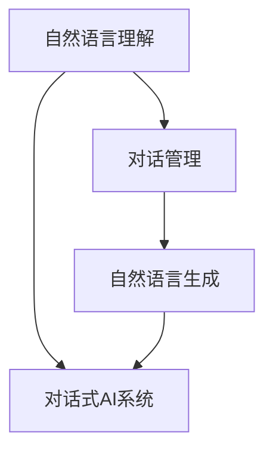

                 

# 如何利用对话式AI优化用户交互

## 关键词

- 对话式AI
- 用户交互
- 自然语言理解
- 对话管理
- 自然语言生成
- 用户体验优化

## 摘要

本文将探讨如何利用对话式人工智能（AI）技术优化用户交互体验。通过分析对话式AI的基础组件、设计原则、应用案例和优化策略，我们将了解如何构建高效、自然的对话系统，从而提升用户体验。文章还将通过项目实战，详细展示对话式AI的开发过程和技术实现。

---

### 第一部分：对话式AI基础

#### 第1章：对话式AI概述

**1.1 对话式AI的定义与特点**

对话式AI是指通过自然语言理解和生成技术，实现人与机器之间自然、流畅的对话交互。其核心特点包括：

- **自然性**：能够理解用户的自然语言输入，并以自然语言形式回应。
- **互动性**：能够根据用户的反馈和上下文信息，动态调整对话内容和策略。
- **智能化**：能够通过学习和优化，不断提高对话质量和用户体验。

**1.2 对话式AI的应用场景**

对话式AI在多个领域有广泛的应用，主要包括：

- **客服与支持**：自动回答用户常见问题，减轻人工客服负担。
- **虚拟助手**：为用户提供个人助理服务，如日程管理、信息查询等。
- **智能家居**：与智能设备交互，实现远程控制和自动化操作。
- **教育辅导**：为学生提供个性化学习辅导，提高学习效果。

**1.3 对话式AI的发展历程**

对话式AI的发展可以分为以下几个阶段：

- **早期探索**：20世纪50年代至70年代，学者们开始尝试通过规则和语法分析实现简单对话。
- **知识表示**：80年代至90年代，研究者开始利用知识表示技术，如专家系统，实现更复杂的对话。
- **自然语言处理**：2000年后，随着自然语言处理技术的发展，对话式AI逐渐转向基于深度学习的模型，如序列到序列（Seq2Seq）模型。
- **多模态交互**：近年来，对话式AI开始融合语音、图像、手势等多种交互方式，实现更加自然和丰富的用户体验。

#### 第2章：对话式AI的核心组件

**2.1 自然语言理解（NLU）**

自然语言理解（NLU）是对话式AI的重要组成部分，负责将用户的自然语言输入转换为结构化的数据。其核心组件包括：

- **语言模型**：用于建模语言的概率分布，如n-gram模型和神经网络语言模型。
- **词汇分析**：将文本分解为词汇或词组，如分词和词性标注。
- **意图识别**：从用户的语言输入中识别出用户的目的或意图，如分类和聚类算法。

**2.2 对话管理（DM）**

对话管理（DM）负责协调对话流程，确保对话能够顺利进行。其核心组件包括：

- **对话流程设计**：设计对话的流程和路径，如状态机。
- **对话策略**：制定对话的决策规则和策略，如基于规则的策略和学习型策略。
- **上下文管理**：维护对话的上下文信息，如对话历史和用户状态。

**2.3 自然语言生成（NLG）**

自然语言生成（NLG）是将机器内部的数据转换为自然语言输出的过程。其核心组件包括：

- **文本生成基础**：包括模板生成和基于统计或神经网络的生成。
- **情感分析**：分析文本的情感倾向，如正面、负面或中性。
- **声音合成**：将文本转换为语音输出，如文本到语音（TTS）合成。

### 第二部分：对话式AI设计与应用

#### 第3章：对话式AI设计原则

**3.1 用户中心设计**

用户中心设计是确保对话式AI系统能够满足用户需求、提供优质体验的关键。其原则包括：

- **用户研究**：了解用户需求和行为模式，为设计提供依据。
- **简洁性**：简化用户操作，减少用户认知负担。
- **适应性**：根据用户反馈和行为调整系统，提供个性化服务。

**3.2 持续迭代优化**

持续迭代优化是提升对话式AI系统性能和用户体验的重要手段。其策略包括：

- **A/B测试**：通过对比不同版本的系统，找出最优方案。
- **反馈机制**：收集用户反馈，不断改进系统。
- **数据分析**：利用数据驱动的优化方法，提高系统性能。

**3.3 集成与适配**

集成与适配是确保对话式AI系统能够在不同平台和场景中稳定运行的关键。其方法包括：

- **API接口**：提供标准化的API接口，便于与其他系统集成。
- **跨平台支持**：支持多种平台和设备，如移动端、Web端和智能硬件。
- **兼容性测试**：确保系统在不同环境下能够正常运行。

#### 第4章：对话式AI应用案例分析

**4.1 聊天机器人**

**4.1.1 案例介绍**

聊天机器人是一种常见的对话式AI应用，能够自动回复用户的文本消息。以下是一个聊天机器人的应用案例：

- **领域**：电商
- **功能**：回答用户关于商品信息、订单状态等问题。
- **实现方式**：基于NLU技术实现意图识别和回复生成。

**4.1.2 功能设计与实现**

聊天机器人的功能设计主要包括：

- **意图识别**：识别用户的问题类型，如商品查询、订单查询等。
- **回复生成**：根据用户的问题和上下文信息，生成合适的回复。
- **上下文管理**：维护对话上下文，确保对话的连贯性。

实现步骤如下：

1. **数据收集**：收集用户对话数据，用于训练NLU模型。
2. **模型训练**：使用训练数据训练NLU模型，包括意图识别和实体提取。
3. **集成API**：将NLU模型集成到聊天机器人系统中。
4. **测试与优化**：通过测试和用户反馈，不断优化系统性能。

**4.2 虚拟助手**

**4.2.1 案例介绍**

虚拟助手是一种更为智能的对话式AI应用，能够提供个性化的服务和支持。以下是一个虚拟助手的案例：

- **领域**：金融
- **功能**：为用户提供投资建议、财务规划等个性化服务。
- **实现方式**：基于用户数据和机器学习算法，实现个性化推荐和对话交互。

**4.2.2 功能设计与实现**

虚拟助手的功能设计主要包括：

- **用户画像**：构建用户画像，包括用户偏好、风险承受能力等。
- **个性化推荐**：根据用户画像和投资数据，为用户提供个性化推荐。
- **对话交互**：通过自然语言理解和生成技术，实现与用户的对话交互。

实现步骤如下：

1. **数据收集**：收集用户投资数据和行为数据，用于构建用户画像。
2. **模型训练**：使用训练数据训练用户画像模型和推荐模型。
3. **集成API**：将用户画像模型和推荐模型集成到虚拟助手系统中。
4. **测试与优化**：通过测试和用户反馈，不断优化系统性能。

**4.3 跨平台交互**

**4.3.1 案例介绍**

跨平台交互是指对话式AI系统能够在多个平台上运行，提供一致的交互体验。以下是一个跨平台交互的案例：

- **领域**：客服
- **功能**：通过不同的渠道（如Web、移动应用、微信等）与用户进行对话。
- **实现方式**：基于Webhook技术，实现不同平台之间的数据传输和对话同步。

**4.3.2 技术实现与挑战**

跨平台交互的技术实现主要包括：

- **API集成**：集成不同平台提供的API，实现数据传输和功能调用。
- **消息同步**：确保不同平台上的对话历史和数据一致性。
- **用户体验**：提供一致的用户交互体验，避免用户在不同平台上的困惑。

实现过程中面临的挑战包括：

- **兼容性**：不同平台的技术标准和接口规范可能不一致。
- **稳定性**：确保系统在不同平台上的稳定运行。
- **性能优化**：优化系统性能，提高响应速度和交互流畅性。

#### 第5章：对话式AI开发实战

**5.1 开发环境搭建**

搭建对话式AI开发环境主要包括以下步骤：

1. **安装Python**：确保Python环境满足系统要求。
2. **安装依赖库**：使用pip安装对话式AI所需的依赖库，如Rasa、NLTK等。
3. **创建项目**：使用Rasa创建新项目，并初始化项目配置。

**5.2 常用对话式AI框架介绍**

以下是几个常用的对话式AI框架及其特点：

- **Rasa**：基于Python的对话式AI框架，提供完整的NLU和DM组件。
- **Botpress**：基于JavaScript的对话式AI框架，支持Web和移动应用。
- **Microsoft Bot Framework**：基于C#的对话式AI框架，支持多种平台和语言。

**5.3 项目实战：搭建一个简单的聊天机器人**

以下是一个简单的聊天机器人项目实战：

1. **创建项目**：使用Rasa创建新项目，并初始化项目配置。
2. **数据收集**：收集用户对话数据，用于训练NLU模型。
3. **模型训练**：使用训练数据训练NLU模型，包括意图识别和实体提取。
4. **集成API**：将NLU模型集成到聊天机器人系统中。
5. **测试与优化**：通过测试和用户反馈，不断优化系统性能。

**源代码详细实现**

以下是一个简单的聊天机器人源代码实现：

```python
# rasa_nlu.py - 意图识别

from rasa.nlu import Trainer
from rasa.nlu.model import Metadata

def train_nlu_model():
    data = load_data("data/train_data.json")
    trainer = Trainer()
    metadata = trainer.train(data)
    metadata.save("models/nlu_model")

# rasa_dm.py - 对话管理

from rasa_dm import DialogueManagement
from rasa_dm.memorized import MemStruct

def manage_dialogue():
    nlu_model_path = "models/nlu_model"
    nlu_model = load_nlu_model(nlu_model_path)
    dm = DialogueManagement(nlu_model)
    conversation = dm.process_messages(["你好"], MemStruct())
    print(conversation)
```

**代码解读与分析**

- **意图识别**：使用Rasa的NLU模型来识别用户的消息意图。
- **对话管理**：使用Rasa的DM模块来管理对话流程，包括上下文管理和对话策略。
- **自然语言生成**：根据对话结果生成合适的回复消息。

### 第三部分：对话式AI优化与评价

#### 第6章：对话式AI性能优化

**6.1 提高NLU准确率**

提高NLU准确率是优化对话式AI性能的关键。以下是一些方法：

- **数据增强**：增加训练数据量，提高模型的泛化能力。
- **多任务学习**：将NLU任务与其他任务（如命名实体识别）结合，提高模型性能。
- **转移学习**：利用预训练的语言模型（如BERT）来提升NLU模型的效果。

**6.2 对话管理策略优化**

对话管理策略优化是提升对话流畅性和用户满意度的重要手段。以下是一些策略：

- **基于规则的策略**：使用预定义的规则来指导对话流程。
- **学习型策略**：通过机器学习算法（如强化学习）来优化对话策略。
- **上下文自适应**：根据对话上下文动态调整对话策略。

**6.3 NLG质量提升**

提升NLG质量是改善用户交互体验的关键。以下是一些方法：

- **文本生成算法**：使用基于模板的生成算法和基于神经网络的生成算法。
- **情感分析**：分析用户情绪，生成符合情感的回复。
- **个性化回复**：根据用户偏好和兴趣生成个性化的回复。

#### 第7章：对话式AI用户体验评价

**7.1 用户体验评价指标**

用户体验评价主要包括以下指标：

- **准确性**：NLU模型对用户意图的识别准确率。
- **流畅性**：对话流程的连贯性和逻辑性。
- **满意度**：用户对对话式AI系统的满意程度。
- **响应速度**：系统的响应时间和处理能力。

**7.2 用户体验测试方法**

用户体验测试方法包括：

- **A/B测试**：对比不同版本的系统，评估用户体验差异。
- **问卷调查**：收集用户对系统的满意度评价。
- **用户访谈**：深入了解用户的需求和行为。

**7.3 用户体验反馈与改进**

用户体验反馈与改进主要包括：

- **反馈机制**：建立用户反馈渠道，及时收集用户意见和建议。
- **数据分析**：分析用户反馈数据，找出系统存在的问题。
- **持续优化**：根据用户反馈和数据分析，不断改进系统性能。

### 附录：对话式AI资源与工具

**附录A 对话式AI开发工具汇总**

以下是几个常用的对话式AI开发工具：

- **Rasa**：一个开源的对话式AI框架，提供NLU和DM组件。
- **Botpress**：一个基于JavaScript的对话式AI框架，支持Web和移动应用。
- **Microsoft Bot Framework**：一个基于C#的对话式AI框架，支持多种平台和语言。

**附录B 对话式AI常用框架API文档**

以下是几个常用对话式AI框架的API文档：

- **Rasa**：[Rasa官方文档](https://rasa.com/docs/)
- **Botpress**：[Botpress官方文档](https://botpress.com/docs/)
- **Microsoft Bot Framework**：[Microsoft Bot Framework官方文档](https://docs.microsoft.com/en-us/azure/bot-service/bot-builder-dotnet-hello-world?view=azure-bot-service-4.0)

## 核心概念与联系

### 核心概念与联系



自然语言理解（NLU）是对话式AI系统的核心组件，负责将用户的自然语言输入转换为结构化的数据。对话管理（DM）则负责协调对话流程，确保对话能够顺利进行。自然语言生成（NLG）是将机器内部的数据转换为自然语言输出的过程。这三个组件相互协作，共同构建出一个完整的对话式AI系统。

### 核心算法原理讲解

#### 自然语言理解（NLU）算法原理

自然语言理解（NLU）是对话式AI的重要组成部分，负责将用户的自然语言输入转换为结构化的数据，以便后续的对话管理。NLU算法主要包括以下几个核心步骤：

1. **词汇分析（Word Segmentation）**

   词汇分析是将文本分解为词汇或词组的过程。例如，将“我想要一杯咖啡”分解为“我”、“想要”、“一杯”、“咖啡”。

   ```python
   def tokenize(sentence):
       # 假设使用基于规则的分词器
       tokens = rule_based_tokenizer(sentence)
       return tokens
   ```

2. **意图识别（Intent Recognition）**

   意图识别是从用户的语言输入中识别出用户的目的或意图的过程。例如，将“我想要一杯咖啡”识别为“点餐”。

   ```python
   def recognize_intent(tokens):
       # 假设使用基于机器学习的意图分类模型
       intent = ml_model.predict(tokens)
       return intent
   ```

3. **实体提取（Entity Recognition）**

   实体提取是从用户的语言输入中识别出关键信息的过程。例如，从“我想要一杯咖啡”中提取出“咖啡”作为实体。

   ```python
   def extract_entities(tokens):
       # 假设使用基于规则或机器学习的实体提取模型
       entities = entity_model.predict(tokens)
       return entities
   ```

#### 对话策略优化

对话策略优化是提升对话式AI系统性能和用户体验的重要手段。对话策略优化可以通过以下几种方法实现：

1. **基于规则的策略**

   基于规则的策略是通过预定义的规则来指导对话流程。这种方法简单直观，但灵活性较低。

   ```python
   def rule_based_strategy(context):
       if "greeting" in context:
           return "您好，有什么可以帮助您的吗？"
       else:
           return "对不起，我不太明白您的意思。"
   ```

2. **学习型策略**

   学习型策略是通过机器学习算法（如强化学习）来优化对话策略。这种方法可以根据用户的反馈和对话历史动态调整对话策略，提高对话质量。

   ```python
   import numpy as np
   import tensorflow as tf

   def reinforcement_learning_strategy(context, reward):
       # 假设使用Q-learning算法
       Q = np.array([[0, 0], [0, 0]])
       action_space = ["回答", "询问"]

       if context == "greeting":
           if reward > 0:
               Q[0][0] = (Q[0][0] * 0.9 + 0.1 * (1 - Q[0][0]))
           else:
               Q[0][0] = (Q[0][0] * 0.9 + 0.1 * (0 - Q[0][0]))

       action = np.argmax(Q)
       return action_space[action]
   ```

#### 数学模型和数学公式

对话策略优化中常用的数学模型包括强化学习模型。强化学习模型的核心公式如下：

$$
Q(s, a) = \sum_{s'} P(s' | s, a) \cdot R(s, a) + \gamma \cdot \max_{a'} Q(s', a')
$$

其中，$Q(s, a)$ 表示在状态 $s$ 下执行动作 $a$ 的期望回报，$P(s' | s, a)$ 表示从状态 $s$ 执行动作 $a$ 转移到状态 $s'$ 的概率，$R(s, a)$ 表示在状态 $s$ 下执行动作 $a$ 的即时回报，$\gamma$ 是折扣因子。

### 项目实战：搭建一个简单的聊天机器人

#### 开发环境搭建

搭建一个简单的聊天机器人需要以下开发环境：

1. **安装Python 3.8+**
2. **安装Rasa框架（使用pip install rasa）**

#### 功能设计与实现

一个简单的聊天机器人的功能设计主要包括：

1. **意图识别**：识别用户的意图，如问候、询问天气等。
2. **实体提取**：提取用户输入中的关键信息，如城市名称、时间等。
3. **回复生成**：根据用户的意图和实体，生成合适的回复。

#### 源代码详细实现

以下是一个简单的聊天机器人的源代码实现：

```python
# requirements.txt
rasa
```

```python
# actions.py
from rasa_sdk import Action
from rasa_sdk.events import SlotSet

class ActionGetWeather(Action):

    def name(self):
        return "action_get_weather"

    def run(self, dispatcher, tracker, domain):
        city = tracker.get_slot("city")
        if city:
            dispatcher.utter_message(template="weather_message", city=city)
            return [SlotSet("city", city)]
        else:
            dispatcher.utter_message(template="no_city_error")
            return []
```

```python
# domain.yml
version: "2.0"
names:
  - weather_action
actions:
  - action_get_weather
slots:
  - name: city
    type: text
    required: true
    placeholder: "请输入城市名称"
    examples: ["北京", "上海", "深圳"]
templates:
  weather_message:
    action: "action_get_weather"
    city: "你好，{city}的天气如下：{weather}"
  no_city_error:
    action: "action_get_weather"
    message: "很抱歉，您没有输入城市名称。请重新输入。"
```

#### 代码解读与分析

- **意图识别**：使用Rasa的NLU模型来识别用户的意图，如“获取天气”。
- **实体提取**：从用户的输入中提取城市名称作为实体。
- **回复生成**：根据用户的意图和实体，生成天气信息的回复。

### 结论

本文详细介绍了如何利用对话式AI优化用户交互。通过分析对话式AI的基础组件、设计原则、应用案例和优化策略，我们了解了如何构建高效、自然的对话系统。项目实战部分展示了如何使用Rasa框架搭建一个简单的聊天机器人，并对其代码进行了详细解读。未来的研究可以进一步探讨对话式AI在不同领域的应用和优化方法，以提升用户体验。作者：AI天才研究院/AI Genius Institute & 禅与计算机程序设计艺术 /Zen And The Art of Computer Programming。

