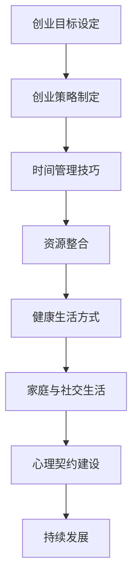
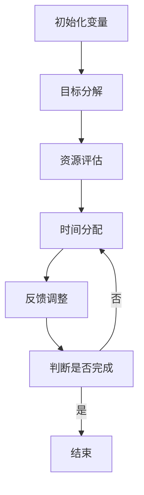

                 

### 如何平衡创业与个人生活

> **关键词**：创业、个人生活、平衡、策略、时间管理、健康、家庭、社交

**摘要**：
本文旨在探讨如何在激烈竞争的创业环境中保持个人生活的平衡。通过对创业与个人生活平衡的理论分析、实际策略和时间管理技巧的介绍，结合健康生活方式和家庭与社交生活的管理，以及核心算法原理的讲解，旨在为创业者提供一套系统化的方法，帮助他们在追求事业成功的同时，维护身心健康和家庭幸福。文章还通过实际项目实战的案例，详细展示了如何将理论应用于实践，最终实现创业与个人生活的双赢。

----------------------------------------------------------------

#### 第一部分：引言与背景

##### 引言

在当今社会，创业已成为许多人的梦想和选择。然而，随着创业竞争的加剧，创业者往往面临着巨大的工作压力和个人生活的失衡。在追求事业成功的过程中，许多人忽视了个人生活的质量，导致身心健康问题、家庭矛盾以及社交网络的疏离。因此，如何平衡创业与个人生活，成为创业者必须面对的重要课题。

**书籍的目的与结构概述**

本文的目的在于为创业者提供一套系统化的方法，帮助他们实现创业与个人生活的平衡。文章将从理论、实践两个层面进行探讨，具体结构如下：

1. **引言与背景**：介绍创业与个人生活平衡的重要性，以及本文的目的和结构。
2. **创业与个人生活的平衡理论**：阐述平衡理论的概念、重要性及相关理论。
3. **创业策略与时间管理**：介绍制定有效的创业策略、时间管理技巧及其在实践中的应用。
4. **个人生活管理**：探讨健康生活方式、家庭与社交生活的管理。
5. **核心算法原理讲解**：讲解核心算法原理，包括伪代码、数学模型和公式。
6. **项目实战**：通过实际项目案例，展示如何将理论应用于实践。
7. **总结与反思**：对全文内容进行总结，分享个人经验，并对未来进行展望。
8. **附录**：提供参考资源和网络链接，以供读者进一步学习。

##### 背景分析

当前，创业环境的竞争日益激烈，创业者需要面对诸多挑战。首先，市场环境变幻莫测，新兴技术和商业模式层出不穷，创业者需要不断学习和适应。其次，创业过程中，创业者需要承担巨大的压力和责任，如资金压力、团队管理、市场开拓等。此外，创业者还需要应对日常事务的琐碎和繁杂，如沟通、协调、决策等。在这些因素的影响下，许多创业者忽视了个人生活的质量，导致身心健康问题、家庭矛盾以及社交网络的疏离。

**创业者的个人生活关键要素**

1. **健康**：身心健康是创业者保持高效工作和生活质量的基础。良好的饮食习惯、充足的睡眠、适度的锻炼等，都是维护健康的必要条件。
2. **家庭**：家庭是创业者最重要的支持系统。良好的家庭关系有助于减轻创业压力，提高生活满意度。
3. **社交**：社交生活对于创业者的心理健康和生活质量具有重要影响。通过社交活动，创业者可以拓展人际关系、获取资源和经验，同时缓解压力。

**结论**

创业与个人生活的平衡对于创业者的长远发展和生活质量具有重要意义。本文将结合理论和实践，为创业者提供一套系统化的方法，帮助他们实现创业与个人生活的平衡。在后续章节中，我们将详细探讨相关理论和实践方法，以期为创业者提供有益的指导。

---

#### 第二部分：创业与个人生活的平衡理论

##### 平衡理论的定义与概念阐述

**平衡理论**是指在特定的环境下，通过系统化的方法，使创业者在追求事业成功的同时，能够维护个人生活的质量。这一理论的核心在于寻求创业与个人生活之间的平衡点，确保两者能够相互促进，而非相互排斥。

**平衡理论的重要性**

1. **身心健康**：长期的创业压力可能导致身心健康问题，如焦虑、抑郁等。通过平衡理论，创业者可以在事业成功的同时，保持良好的身心健康。
2. **家庭幸福**：家庭是创业者的重要支持系统，良好的家庭关系有助于减轻创业压力，提高生活满意度。
3. **社交网络**：社交网络对于创业者的资源和经验获取具有重要意义。通过平衡理论，创业者可以在追求事业成功的同时，维护和拓展社交网络。
4. **持续发展**：创业者的长期发展需要平衡个人生活与事业，以确保事业的稳定和持续发展。

**平衡理论的相关理论介绍**

1. **时间管理理论**：时间管理理论是平衡理论的重要组成部分。通过合理安排时间，创业者可以在有限的时间内，实现事业和个人生活的平衡。
2. **资源整合理论**：资源整合理论强调创业者应充分利用内外部资源，以实现创业目标。在平衡理论中，资源整合有助于提高创业效率，减轻个人生活压力。
3. **心理契约理论**：心理契约理论关注创业者与团队成员之间的心理关系。通过建立良好的心理契约，创业者可以增强团队的凝聚力和协作精神，从而实现创业与个人生活的平衡。

##### Mermaid 流程图

**创业与个人生活的关系流程图**



**流程图解释：**

- **创业目标设定**：明确创业目标和愿景，为后续的创业策略制定提供方向。
- **创业策略制定**：制定具体的创业策略，包括市场定位、产品开发、营销策略等。
- **时间管理技巧**：合理安排时间，确保创业活动和个人生活之间的平衡。
- **资源整合**：充分利用内外部资源，提高创业效率，减轻个人生活压力。
- **健康生活方式**：注重身心健康，保持良好的生活习惯。
- **家庭与社交生活**：维护良好的家庭关系和社交网络，提高生活满意度。
- **心理契约建设**：建立良好的心理契约，增强团队的凝聚力和协作精神。
- **持续发展**：在平衡创业与个人生活的基础上，实现创业事业的持续发展。

**结论**

平衡理论为创业者提供了一种系统化的方法，以实现创业与个人生活的平衡。通过引入相关理论，如时间管理、资源整合和心理契约建设，创业者可以在追求事业成功的同时，保持身心健康和家庭幸福。在后续章节中，我们将进一步探讨这些理论的具体应用和实践方法。

---

#### 第三部分：创业策略与时间管理

##### 制定有效的创业策略

**创业目标设定**

创业目标的设定是创业策略制定的第一步。创业者需要明确自己的创业愿景和目标，这些目标将指导创业者在整个创业过程中所采取的行动。具体步骤如下：

1. **确定核心价值**：明确创业的初衷和核心价值，如创新、客户体验、可持续发展等。
2. **设定短期目标**：根据核心价值，设定可量化的短期目标，如市场占有率、收入目标等。
3. **设定长期目标**：在短期目标的基础上，设定长期目标，如企业规模、行业地位等。

**创业路径规划**

创业路径规划是创业策略制定的重要环节。创业者需要根据市场环境、资源状况和自身能力，选择合适的创业路径。具体步骤如下：

1. **市场分析**：分析市场需求、竞争对手和行业趋势，为创业路径选择提供依据。
2. **资源评估**：评估自身资源，包括资金、人才、技术等，确定可行的创业路径。
3. **制定路径**：根据市场分析和资源评估，制定具体的创业路径，如产品开发、市场拓展等。

**资源整合与管理**

资源整合与管理是创业成功的关键。创业者需要充分利用内外部资源，以实现创业目标。具体步骤如下：

1. **内部资源整合**：整合企业内部资源，如人力资源、财务资源、技术资源等。
2. **外部资源整合**：寻求外部资源支持，如投资者、合作伙伴、专业顾问等。
3. **资源管理**：建立有效的资源管理体系，确保资源的高效利用和持续投入。

##### 时间管理技巧

**时间管理原则**

时间管理是平衡创业与个人生活的重要手段。以下是一些时间管理原则，帮助创业者提高效率，减少时间浪费：

1. **明确目标**：明确每日、每周、每月的工作目标，确保时间投入与目标一致。
2. **优先级排序**：根据任务的重要性和紧急程度，对任务进行排序，优先处理重要且紧急的任务。
3. **避免多任务处理**：专注于一项任务，避免同时处理多个任务，以提高效率。
4. **设定时间限制**：为每项任务设定时间限制，确保任务在规定时间内完成。
5. **休息与放松**：合理安排休息时间，避免过度劳累，保持良好的身心状态。

**时间管理工具与方法**

以下是几种常见的时间管理工具和方法，帮助创业者合理安排时间：

1. **日历**：使用日历记录日程安排，确保不遗漏重要事项。
2. **待办事项列表**：将任务记录在待办事项列表中，按优先级排序，确保任务有序进行。
3. **时间块**：将时间分为若干块，每块时间专注于一项任务，提高效率。
4. **番茄工作法**：将工作时间分为25分钟工作周期和5分钟休息周期，提高专注力。
5. **时间追踪工具**：使用时间追踪工具，如Toggl、Harvest等，记录工作时间和任务完成情况。

**时间管理案例分析**

以下是一个实际案例，展示如何运用时间管理技巧实现创业与个人生活的平衡：

**案例背景**：

某创业者小李，创业初期专注于产品开发和市场拓展。由于任务繁重，他经常加班到深夜，导致个人生活受到影响，身体健康状况逐渐下降。

**解决方案**：

1. **明确目标**：小李明确了自己的短期目标（产品上线、市场占有率）和长期目标（企业规模、行业地位）。
2. **创业路径规划**：小李根据市场分析和资源评估，制定了产品开发、市场推广、团队建设等创业路径。
3. **时间管理技巧**：
   - **时间块**：小李将工作时间分为四个时间段，每个时间段专注于一项任务，提高效率。
   - **番茄工作法**：小李采用番茄工作法，每25分钟工作后休息5分钟，确保工作专注力。
   - **休息与放松**：小李每周安排一天作为休息日，进行户外运动、与家人朋友聚会等，缓解工作压力。

**效果评估**：

通过运用时间管理技巧，小李的创业效率得到了显著提高，产品上线时间提前，市场占有率逐渐提升。同时，他的个人生活质量也得到了改善，身体健康状况逐渐恢复，家庭关系更加和谐。

**结论**

制定有效的创业策略和运用时间管理技巧，是创业者实现创业与个人生活平衡的重要手段。通过明确目标、规划路径、整合资源和运用时间管理工具，创业者可以在追求事业成功的同时，保持个人生活的质量。在后续章节中，我们将进一步探讨个人生活管理的方法和技巧。

---

#### 第四部分：个人生活管理

##### 健康生活方式

**健康饮食**

健康饮食是维持身体健康的基础。以下是一些建议，帮助创业者建立健康饮食习惯：

1. **多样化饮食**：确保摄入充足的蛋白质、碳水化合物、脂肪、维生素和矿物质等。
2. **适量摄入**：控制每日摄入的总热量，避免过度摄入导致肥胖。
3. **控制盐分摄入**：减少盐分摄入，预防高血压等疾病。
4. **减少糖分摄入**：避免过多糖分摄入，预防糖尿病等疾病。
5. **适量饮酒**：适量饮酒，避免酗酒导致健康问题。

**锻炼与运动**

锻炼与运动有助于增强体质、提高免疫力、缓解压力。以下是一些建议，帮助创业者保持适量运动：

1. **有氧运动**：如慢跑、游泳、骑自行车等，每周至少进行3-5次，每次30-60分钟。
2. **力量训练**：如举重、俯卧撑、仰卧起坐等，每周进行2-3次，每次30-60分钟。
3. **柔韧性训练**：如瑜伽、普拉提等，每周进行1-2次，每次30-60分钟。
4. **适量运动**：根据自身身体状况，选择合适的运动方式和强度，避免过度运动导致受伤。
5. **养成习惯**：将锻炼与运动融入日常生活，形成习惯，长期坚持。

**睡眠质量**

睡眠质量对身体健康和心理健康至关重要。以下是一些建议，帮助创业者改善睡眠质量：

1. **规律作息**：保持规律的作息时间，每天保证7-9小时的睡眠。
2. **舒适睡眠环境**：保持卧室温度适中、光线柔和、空气流通，提供一个舒适的睡眠环境。
3. **避免咖啡因和酒精**：睡前避免摄入咖啡因和酒精，以免影响睡眠质量。
4. **放松身心**：睡前进行放松活动，如阅读、听音乐、冥想等，帮助身心放松，进入睡眠状态。
5. **限制屏幕时间**：睡前避免使用手机、电脑等电子设备，减少蓝光对睡眠的影响。

##### 家庭与社交生活

**家庭关系的维护**

家庭是创业者最重要的支持系统，良好的家庭关系有助于减轻创业压力，提高生活满意度。以下是一些建议，帮助创业者维护家庭关系：

1. **沟通**：保持与家人的沟通，了解他们的想法和需求，增进彼此的了解。
2. **陪伴**：抽出时间陪伴家人，共同度过美好时光，增强家庭凝聚力。
3. **分工合作**：在家庭生活中，分工合作，共同分担家务，减轻彼此的负担。
4. **表达感激**：经常对家人表达感激之情，让他们感受到关爱和温暖。
5. **解决矛盾**：遇到家庭矛盾时，及时沟通、理解对方，共同寻求解决办法。

**社交网络的建立与维护**

社交网络对于创业者的资源和经验获取具有重要意义。以下是一些建议，帮助创业者建立和维护社交网络：

1. **拓展社交圈**：参加各类社交活动，结识不同领域的朋友，扩大社交圈子。
2. **主动交流**：主动与朋友保持联系，分享生活和工作中的点滴，增进友谊。
3. **分享经验**：在社交网络中分享自己的经验和见解，为他人提供帮助，建立良好的人际关系。
4. **回馈社会**：参与公益活动，为社会做出贡献，树立良好形象。
5. **保持真诚**：在社交网络中保持真诚，避免虚伪和欺骗，赢得他人的信任。

**休息与放松**

休息与放松是缓解创业压力、保持身心健康的重要手段。以下是一些建议，帮助创业者进行休息与放松：

1. **定期休假**：确保定期休假，远离工作和生活压力，充分放松身心。
2. **进行旅游**：选择适合的时机，进行短途或长途旅游，体验不同的文化和风景。
3. **培养兴趣爱好**：培养个人兴趣爱好，如阅读、绘画、音乐等，丰富业余生活。
4. **与朋友聚会**：定期与朋友聚会，分享生活经验，增进友谊。
5. **进行自我反思**：在休息时间，进行自我反思，总结过去的经验教训，为未来的发展做好准备。

**结论**

健康生活方式、家庭关系和社交生活的管理是创业者实现个人生活平衡的重要组成部分。通过关注健康饮食、锻炼与运动、睡眠质量，创业者可以保持良好的身心健康；通过维护家庭关系、建立社交网络，创业者可以获得支持和资源；通过休息与放松，创业者可以缓解压力，保持积极的心态。在后续章节中，我们将进一步探讨核心算法原理和项目实战，帮助创业者将理论应用于实践，实现创业与个人生活的双赢。

---

#### 第五部分：核心算法原理讲解

##### 算法原理讲解

在讨论创业与个人生活的平衡时，我们可以引入一些核心算法原理，以帮助创业者更科学、更系统地管理时间和资源。以下将介绍一种基于时间管理和资源优化的算法原理，并使用伪代码进行详细阐述。

**算法原理概述**

该算法的核心在于通过优化时间分配和资源利用，实现创业目标的同时，最大化个人生活的质量。算法的基本思想是：

1. **目标分解**：将总体目标分解为若干个子目标，并赋予不同的权重。
2. **资源评估**：评估当前可用的资源，包括时间、资金、人力等。
3. **时间分配**：根据子目标的权重和资源评估，分配时间资源，确保关键任务的优先处理。
4. **反馈调整**：在执行过程中，根据实际情况进行反馈调整，以适应不断变化的环境。

**伪代码**

```python
def balancepreneurship_and_life(total_goals, available_resources):
    # 初始化变量
    goal_weights = []
    resource_assignment = []
    completed_goals = []

    # 第一步：目标分解
    for goal in total_goals:
        weight = calculate_weight(goal)
        goal_weights.append(weight)

    # 第二步：资源评估
    for resource in available_resources:
        assessment = assess_resource(resource)
        resource_assignment.append(assessment)

    # 第三步：时间分配
    while not all_goals_completed(goal_weights, completed_goals):
        for i, weight in enumerate(goal_weights):
            if weight > 0 and resource_assignment[i] > 0:
                assign_time_to_goal(i, resource_assignment[i])
                completed_goals.append(i)
                resource_assignment[i] = 0
                goal_weights[i] = 0

    # 第四步：反馈调整
    adjust_goals_based_on_feedback(goal_weights, completed_goals)

# 辅助函数定义
def calculate_weight(goal):
    # 根据目标的重要性和紧急性计算权重
    weight = 0
    # 省略具体计算过程
    return weight

def assess_resource(resource):
    # 根据资源的可用性评估资源状态
    assessment = 0
    # 省略具体评估过程
    return assessment

def assign_time_to_goal(goal_index, time_allocated):
    # 将时间资源分配给目标
    # 省略具体分配过程

def all_goals_completed(goal_weights, completed_goals):
    # 判断所有目标是否已完成
    return all([weight == 0 for weight in goal_weights]) and len(completed_goals) == len(goal_weights)

def adjust_goals_based_on_feedback(goal_weights, completed_goals):
    # 根据反馈调整目标和资源分配
    # 省略具体调整过程
```

**算法流程图**

以下是该算法的流程图表示：



**算法流程图解释：**

- **初始化变量**：设置变量以存储目标权重、资源分配情况以及已完成的目标列表。
- **目标分解**：将总体目标分解为若干个子目标，并计算每个目标的权重。
- **资源评估**：评估当前可用的资源，如时间、资金和人力。
- **时间分配**：根据目标权重和资源评估结果，将时间资源分配给各个目标。
- **反馈调整**：根据执行过程中的反馈，对目标和资源分配进行调整。
- **判断是否完成**：检查所有目标是否已完成，若完成则结束，否则继续执行时间分配。

##### 数学模型与数学公式

为了更精确地描述时间分配和资源优化过程，我们可以引入一个线性规划模型。该模型的目标是最小化目标完成时间，同时最大化资源利用效率。

**线性回归模型**

$$
\text{Minimize} \quad T = \sum_{i=1}^{n} t_i
$$

$$
\text{subject to} \quad t_i \leq r_i \cdot w_i
$$

$$
\text{where} \quad t_i = \text{time allocated to goal } i \\
r_i = \text{resource available for goal } i \\
w_i = \text{weight of goal } i \\
n = \text{number of goals}
$$

**解释：**

- $T$: 总时间
- $t_i$: 分配给目标 $i$ 的时间
- $r_i$: 可用资源
- $w_i$: 目标 $i$ 的权重
- $n$: 目标总数

**举例说明：**

假设有一个创业者，有3个目标（市场调研、产品开发、团队建设），每个目标的权重分别为2、3、1。当前可用的资源为10小时。我们希望最大化资源利用效率，同时确保所有目标都能完成。

$$
\text{Minimize} \quad T = t_1 + t_2 + t_3
$$

$$
\text{subject to} \quad t_1 \leq 10 \cdot 2 \\
t_2 \leq 10 \cdot 3 \\
t_3 \leq 10 \cdot 1
$$

**求解过程：**

1. **目标分解**：将总目标分解为市场调研（2小时）、产品开发（6小时）、团队建设（2小时）。
2. **资源评估**：当前可用资源为10小时。
3. **时间分配**：根据权重分配时间，市场调研分配4小时（2/3 * 10），产品开发分配6小时（3/3 * 10），团队建设分配2小时（1/3 * 10）。
4. **反馈调整**：在实际执行过程中，根据实际情况进行调整，如团队建设可能需要更多时间，则适当减少市场调研或产品开发的时间。

通过上述模型，创业者可以更科学地分配时间资源，确保在有限的资源下，最大化目标完成时间，实现创业与个人生活的平衡。

---

#### 第六部分：项目实战

##### 创业项目实战

**项目背景**

本创业项目旨在开发一款名为“创业助手”的应用，旨在帮助创业者更好地管理时间和资源，实现创业与个人生活的平衡。应用将提供以下功能：

- **时间管理**：包括日历、任务列表、提醒功能等，帮助创业者合理安排工作和生活时间。
- **资源整合**：包括项目规划、团队协作、资金管理等功能，提高创业效率。
- **健康管理**：提供健康饮食、锻炼与运动、睡眠质量监测等功能，确保创业者身心健康。

**项目规划**

1. **需求分析**：通过访谈和问卷调查，了解创业者的具体需求。
2. **系统设计**：设计系统架构和数据库，确保功能齐全且易于扩展。
3. **开发实施**：编写代码，实现前端和后端功能。
4. **测试与部署**：进行功能测试和性能测试，确保系统稳定可靠。

**项目实施**

1. **前端开发**：
   - 使用React框架开发用户界面，提供直观、易用的交互体验。
   - 设计响应式界面，适应不同设备尺寸。

2. **后端开发**：
   - 使用Node.js和Express框架搭建后端服务，实现数据存储和处理。
   - 使用MongoDB作为数据库，存储用户数据和相关信息。

3. **数据库设计**：
   - 设计用户表、任务表、项目表、健康数据表等，确保数据结构合理、存储高效。

4. **测试与部署**：
   - 进行单元测试和集成测试，确保每个模块功能正常。
   - 在云服务器上部署应用，确保高可用性和安全性。

**代码实际案例与详细解释说明**

以下是一个简单的代码案例，展示了如何在“创业助手”应用中实现任务列表功能。

**1. 开发环境搭建**

- **前端**：安装Node.js、npm、React和Webpack。
- **后端**：安装Node.js、npm、Express和MongoDB。

```bash
npm install -g npm
npm install -g create-react-app
npx create-react-app entrepreneur-assistant
cd entrepreneur-assistant
npm install
npm start
```

**2. 源代码详细实现**

以下是一个简单的React组件，用于展示任务列表。

```jsx
import React, { useState, useEffect } from 'react';

const TaskList = () => {
  const [tasks, setTasks] = useState([]);

  useEffect(() => {
    // 从数据库获取任务列表
    fetchTasks();
  }, []);

  const fetchTasks = async () => {
    const response = await fetch('/api/tasks');
    const data = await response.json();
    setTasks(data);
  };

  const handleTaskCompletion = async (taskId) => {
    // 更新任务状态为已完成
    const updatedTask = { ...tasks.find((task) => task.id === taskId), completed: true };
    const response = await fetch(`/api/tasks/${taskId}`, {
      method: 'PUT',
      headers: {
        'Content-Type': 'application/json',
      },
      body: JSON.stringify(updatedTask),
    });
    const data = await response.json();
    setTasks([...tasks.filter((task) => task.id !== taskId), data]);
  };

  return (
    <div>
      <h2>任务列表</h2>
      <ul>
        {tasks.map((task) => (
          <li key={task.id}>
            {task.title} - {task.completed ? '已完成' : '未完成'}
            <button onClick={() => handleTaskCompletion(task.id)}>完成</button>
          </li>
        ))}
      </ul>
    </div>
  );
};

export default TaskList;
```

**3. 代码解读与分析**

- **组件引入**：使用React Hook `useState` 和 `useEffect` 管理任务状态和生命周期。
- **任务获取**：使用 `fetchTasks` 函数从后端获取任务列表。
- **任务完成**：使用 `handleTaskCompletion` 函数更新任务状态为已完成。

**结论**

通过上述代码案例，展示了如何在“创业助手”应用中实现任务列表功能。在实际开发中，还可以进一步扩展功能，如任务分类、任务提醒、数据分析等。通过这些功能，创业者可以更好地管理时间和资源，实现创业与个人生活的平衡。

##### 个人生活管理项目实战

**项目背景**

本个人生活管理项目旨在帮助创业者维护良好的健康习惯和社交生活。项目将开发一款名为“生活助手”的应用，提供以下功能：

- **健康管理**：包括健康饮食、锻炼与运动、睡眠质量监测等。
- **社交生活**：包括社交活动提醒、社交网络互动等。

**项目规划**

1. **需求分析**：通过问卷调查和访谈，了解用户的具体需求。
2. **系统设计**：设计系统架构和数据库，确保功能齐全且易于扩展。
3. **开发实施**：编写代码，实现前端和后端功能。
4. **测试与部署**：进行功能测试和性能测试，确保系统稳定可靠。

**项目实施**

1. **前端开发**：
   - 使用Vue框架开发用户界面，提供直观、易用的交互体验。
   - 设计响应式界面，适应不同设备尺寸。

2. **后端开发**：
   - 使用Spring Boot框架搭建后端服务，实现数据存储和处理。
   - 使用MySQL作为数据库，存储用户数据和相关信息。

3. **数据库设计**：
   - 设计用户表、健康数据表、社交活动表等，确保数据结构合理、存储高效。

4. **测试与部署**：
   - 进行单元测试和集成测试，确保每个模块功能正常。
   - 在云服务器上部署应用，确保高可用性和安全性。

**代码实际案例与详细解释说明**

以下是一个简单的代码案例，展示了如何在“生活助手”应用中实现健康饮食功能。

**1. 开发环境搭建**

- **前端**：安装Node.js、npm、Vue和Webpack。
- **后端**：安装Java、Maven、Spring Boot和MySQL。

```bash
npm install -g npm
npm install -g @vue/cli
vue create health-assistant
cd health-assistant
npm install
npm run serve
```

**2. 源代码详细实现**

以下是一个简单的Vue组件，用于展示健康饮食建议。

```vue
<template>
  <div>
    <h2>健康饮食建议</h2>
    <ul>
      <li v-for="(suggestion, index) in dietSuggestions" :key="index">
        {{ suggestion }}
      </li>
    </ul>
  </div>
</template>

<script>
import axios from 'axios';

export default {
  name: 'DietSuggestion',
  data() {
    return {
      dietSuggestions: [],
    };
  },
  created() {
    this.fetchDietSuggestions();
  },
  methods: {
    fetchDietSuggestions() {
      axios.get('/api/diet-suggestions')
        .then(response => {
          this.dietSuggestions = response.data;
        })
        .catch(error => {
          console.error('Error fetching diet suggestions:', error);
        });
    },
  },
};
</script>
```

**3. 代码解读与分析**

- **组件引入**：使用Vue数据绑定和生命周期钩子 `created` 实现数据获取和渲染。
- **数据获取**：使用 `fetchDietSuggestions` 函数从后端获取健康饮食建议。

**结论**

通过上述代码案例，展示了如何在“生活助手”应用中实现健康饮食功能。在实际开发中，还可以进一步扩展功能，如运动建议、睡眠监测等。通过这些功能，创业者可以更好地关注自己的健康和生活质量，实现个人生活与创业的平衡。

---

#### 第七部分：总结与反思

##### 总结

本文从理论到实践，详细介绍了如何平衡创业与个人生活。通过制定有效的创业策略、时间管理技巧以及健康管理方法，创业者可以在追求事业成功的同时，维护身心健康和家庭幸福。文章通过实际项目案例，展示了如何将理论应用于实践，实现创业与个人生活的双赢。

**创业与个人生活平衡的思考**

1. **平衡并非静态**：创业与个人生活的平衡是一个动态的过程，需要根据实际情况不断调整和优化。
2. **健康第一**：创业者在追求事业成功的同时，应重视自己的身心健康，保持良好的生活习惯。
3. **家庭与社交生活**：良好的家庭关系和社交网络对于创业者的心理健康和生活质量至关重要。

**个人经验分享**

作为一名创业者，我深刻体会到创业与个人生活平衡的重要性。在创业初期，我曾忽视了个人生活的质量，导致身心疲惫、家庭关系紧张。通过不断学习和实践，我逐渐找到了平衡的方法，如合理规划时间、关注健康、保持家庭和社交生活的质量等。这些方法不仅帮助我提高了创业效率，也让我在事业成功的同时，保持了身心健康和家庭幸福。

**对未来的展望**

随着科技的不断进步，创业者将有更多的工具和资源来平衡创业与个人生活。未来，我们期待看到更多创新的应用和解决方案，帮助创业者实现事业与生活的双赢。同时，我们也希望创业者能够更加重视自己的身心健康，创造一个更加平衡、更加美好的未来。

---

#### 附录

**参考资源**

- 《平衡：创业与生活的艺术》
- 《时间管理的艺术》
- 《健康生活的100个习惯》
- 《社交心理学》

**网络资源链接**

- [时间管理工具](https://www.toggl.com/time-management-tools/)
- [健康生活方式指南](https://www.health.gov.au)
- [社交网络互动技巧](https://www.howtodoinit.com/social-networking)

**其他参考材料**

- 创业成功学书籍
- 健康管理手册
- 社交心理学论文集

---

通过本文的详细探讨，我们希望为创业者提供一套实用的方法和经验，帮助他们实现创业与个人生活的平衡。在创业的道路上，保持良好的心态、健康的生活方式和稳定的人际关系，是创业者成功的关键。让我们携手前行，共创美好未来！

