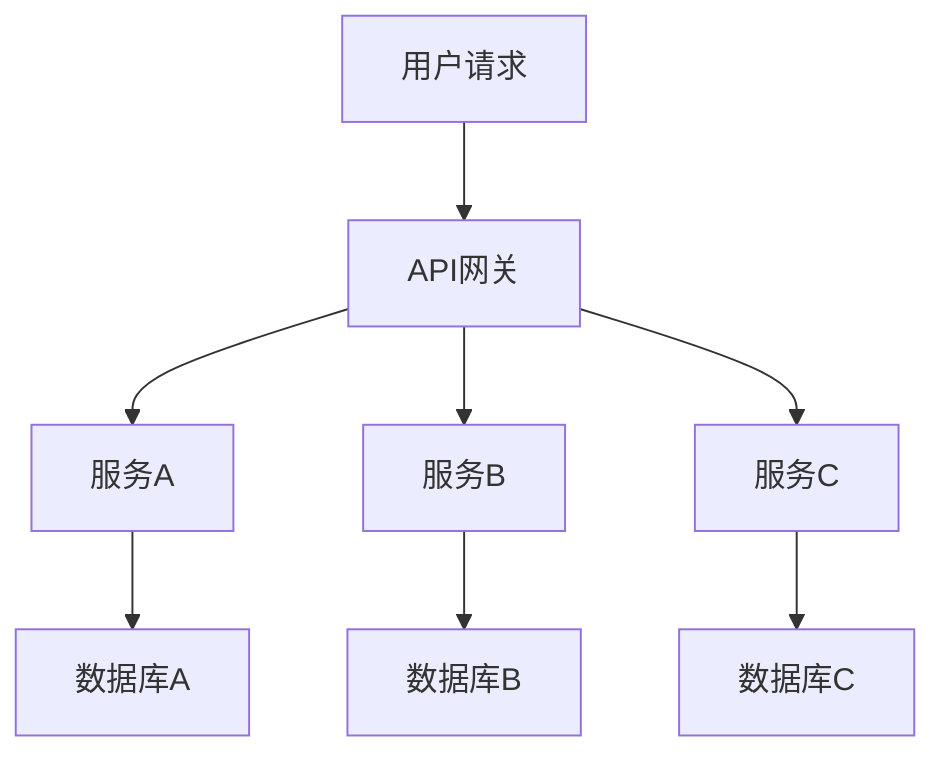

                 

# 如何构建可扩展的微服务架构

> **关键词：** 微服务架构、可扩展性、设计模式、安全性、通信机制、开发实践、部署与运维、性能优化、架构演进、案例研究。

> **摘要：** 本文旨在详细探讨如何构建可扩展的微服务架构，包括其核心概念、设计原则、实现方法、优化策略以及实际案例。通过逻辑清晰、结构紧凑的论述，帮助读者全面掌握微服务架构的构建和优化技巧。

## 第一部分：微服务架构概述

### 第1章：微服务架构入门

#### 1.1 微服务架构的概念

微服务架构（Microservices Architecture）是一种设计应用程序的方法论，其核心思想是将应用程序划分为一组独立的、小型、自治的服务，每个服务负责完成特定的业务功能。这些服务通过轻量级的通信机制（如RESTful API或消息队列）进行协作，从而实现松耦合和高内聚。

微服务架构的主要特点包括：

- **独立性**：每个服务都是独立的，可以独立部署、扩展和更新，不会影响其他服务的运行。
- **自治性**：每个服务都有自己的数据存储和管理逻辑，拥有完整的业务逻辑。
- **分布式**：服务分布在不同的服务器或集群上，形成分布式系统。
- **可扩展性**：服务可以根据需求独立扩展，提高系统整体性能。
- **高可用性**：通过服务之间的冗余部署，提高了系统的可靠性。

#### 1.2 微服务架构与传统架构的比较

传统架构（如单体架构）将所有业务逻辑集中在一个应用程序中，更新和维护成本高，扩展性差。而微服务架构则具有以下优势：

- **可扩展性**：微服务架构可以根据业务需求独立扩展，提高系统性能。
- **维护性**：每个服务都是独立的，更新和维护更加灵活，降低了风险。
- **团队协作**：每个服务可以独立开发、测试和部署，提高了团队协作效率。
- **容错性**：服务之间的独立部署和冗余部署提高了系统的容错性。

#### 1.3 微服务架构的优势与挑战

**优势：**

- **灵活性**：微服务架构可以根据业务需求灵活调整和扩展。
- **可维护性**：服务独立部署和更新，降低了维护成本。
- **可扩展性**：通过水平扩展提高系统性能。
- **技术创新**：微服务架构支持采用各种新技术，提高开发效率。

**挑战：**

- **复杂性**：微服务架构增加了系统的复杂性，需要更高级的技术和管理能力。
- **分布式事务**：分布式系统中的事务处理更为复杂，需要采用特定的解决方案。
- **网络依赖**：服务之间的通信依赖于网络，可能导致性能瓶颈。
- **安全性**：分布式系统面临更多的安全威胁，需要加强安全性设计。

#### 1.4 微服务架构的应用场景

微服务架构适用于以下场景：

- **大型企业级应用**：需要高可扩展性和高可用性的企业级应用。
- **互联网应用**：需要快速迭代和灵活调整的互联网应用。
- **分布式系统**：需要实现分布式部署和分布式事务处理的系统。
- **云计算环境**：需要充分利用云计算资源和特性的系统。

### 第2章：微服务核心概念

#### 2.1 微服务架构的组成部分

微服务架构的主要组成部分包括：

- **服务**：微服务架构的核心，每个服务负责完成特定的业务功能。
- **API 网关**：统一管理服务之间的通信，提供认证、路由、聚合等功能。
- **服务注册与发现**：服务启动时向注册中心注册，服务停止时从注册中心注销，其他服务可以通过注册中心发现可用服务。
- **配置管理**：管理服务的配置信息，如数据库连接信息、API地址等。
- **分布式数据库**：为服务提供分布式数据存储和管理能力。

#### 2.2 服务拆分与领域驱动设计

服务拆分是微服务架构设计的关键，需要遵循以下原则：

- **业务驱动**：根据业务需求拆分服务，确保每个服务具有明确的业务职责。
- **自治性**：确保服务自治性，减少服务之间的依赖关系。
- **粒度适中**：服务粒度不宜过大或过小，过大导致维护困难，过小导致服务数量过多。

领域驱动设计（Domain-Driven Design，简称DDD）是一种设计方法，旨在通过将业务领域模型化，提高系统的可维护性和可扩展性。在微服务架构中，DDD可以帮助实现以下目标：

- **明确业务职责**：通过领域模型，明确每个服务的业务职责，确保服务自治性。
- **降低依赖关系**：通过领域模型，降低服务之间的依赖关系，提高系统的灵活性。
- **持续迭代**：通过领域模型，支持持续迭代和扩展，确保系统适应业务变化。

#### 2.3 API 网关与服务注册与发现

API网关是微服务架构中的核心组件，负责统一管理服务之间的通信。其主要功能包括：

- **认证与授权**：对请求进行认证和授权，确保只有合法用户可以访问服务。
- **路由与负载均衡**：根据请求的目标服务，将请求路由到相应的服务实例，实现负载均衡。
- **聚合与缓存**：将多个服务的响应数据进行聚合和缓存，提高系统性能。
- **监控与日志**：对服务访问进行监控和日志记录，实现故障诊断和性能优化。

服务注册与发现是微服务架构中的关键组件，负责管理服务的实例信息。其主要功能包括：

- **服务注册**：服务启动时向注册中心注册，提供服务的IP地址、端口号、健康状态等信息。
- **服务发现**：服务消费者通过注册中心发现可用服务，并建立连接。
- **健康检查**：定期对服务实例进行健康检查，确保服务正常运行。

## 第二部分：微服务设计原则

### 第3章：微服务设计模式

#### 3.1 CQRS模式

CQRS（Command Query Responsibility Segregation）模式是一种将命令（写操作）和查询（读操作）分离的设计模式，旨在提高系统的性能和可扩展性。

CQRS模式的主要特点包括：

- **命令与查询分离**：将命令和查询的操作分离到不同的服务，确保两者不会相互影响。
- **读写分离**：将读操作和写操作分离到不同的数据库，提高系统的性能和可扩展性。
- **事件溯源**：通过记录事件，实现系统的状态恢复和故障恢复。

CQRS模式的实现步骤如下：

1. **定义命令和查询服务**：将命令和查询的操作分离到不同的服务，确保两者不会相互影响。
2. **实现读写分离**：将读操作和写操作分离到不同的数据库，提高系统的性能和可扩展性。
3. **实现事件溯源**：通过记录事件，实现系统的状态恢复和故障恢复。

#### 3.2 分层架构模式

分层架构模式是一种常见的软件架构设计模式，适用于微服务架构。其主要思想是将系统划分为多个层次，每个层次负责不同的功能。

分层架构模式的主要层次包括：

- **表示层**：负责与用户交互，接收用户请求，展示页面。
- **业务层**：负责处理业务逻辑，根据用户请求执行相应的业务操作。
- **数据访问层**：负责与数据库交互，实现数据的增删改查操作。
- **基础设施层**：负责提供底层基础设施服务，如日志记录、消息队列、缓存等。

#### 3.3 事件驱动架构模式

事件驱动架构模式是一种以事件为中心的软件架构设计模式，适用于微服务架构。其主要思想是通过事件触发服务之间的协作，实现系统的功能。

事件驱动架构模式的主要特点包括：

- **事件中心**：系统中的事件由事件中心统一管理，确保事件的一致性和可靠性。
- **事件监听**：服务根据需要监听特定的事件，当事件发生时，触发相应的业务逻辑。
- **异步处理**：事件的处理过程是异步的，可以保证系统的性能和可扩展性。

事件驱动架构模式的实现步骤如下：

1. **定义事件模型**：明确系统中的事件类型和事件数据结构。
2. **实现事件中心**：实现事件中心的组件，负责管理事件和事件队列。
3. **实现事件监听器**：服务根据需要实现事件监听器，监听特定的事件并执行相应的业务逻辑。
4. **实现事件处理**：事件发生时，触发相应的业务逻辑，实现系统功能。

## 第三部分：微服务架构实现

### 第4章：微服务安全性

#### 4.1 服务认证与授权

服务认证与授权是微服务架构中确保安全的重要手段。其主要目标是对服务进行身份验证和权限控制，确保只有授权的服务才能访问其他服务。

服务认证与授权的主要步骤包括：

1. **身份认证**：对服务的身份进行验证，确保服务是合法的。
2. **权限控制**：根据服务的权限，控制服务对其他服务的访问权限。
3. **会话管理**：管理服务的认证状态和会话信息，确保服务的安全访问。

常见的认证与授权机制包括：

- **OAuth2.0**：一种基于令牌的认证与授权机制，适用于第三方服务访问。
- **JWT（JSON Web Token）**：一种基于JSON的认证与授权机制，适用于服务之间的认证。
- **API Key**：通过API密钥对服务进行认证和授权。

#### 4.2 数据加密与隐私保护

数据加密与隐私保护是确保微服务架构中数据安全的重要措施。其主要目标是对数据进行加密存储和传输，防止数据泄露和篡改。

数据加密与隐私保护的主要步骤包括：

1. **数据加密**：对敏感数据进行加密存储，确保数据在存储和传输过程中的安全性。
2. **密钥管理**：对加密密钥进行安全存储和管理，确保密钥的安全性和可靠性。
3. **数据完整性校验**：对数据进行完整性校验，确保数据的完整性和一致性。

常见的加密算法包括：

- **AES（Advanced Encryption Standard）**：一种对称加密算法，适用于大规模数据的加密。
- **RSA（Rivest-Shamir-Adleman）**：一种非对称加密算法，适用于密钥的传输和签名。
- **SHA（Secure Hash Algorithm）**：一种哈希算法，用于数据完整性校验。

#### 4.3 防御分布式拒绝服务攻击

分布式拒绝服务攻击（DDoS）是微服务架构中常见的攻击手段，旨在使系统资源耗尽，导致服务不可用。防御DDoS攻击的主要策略包括：

1. **流量监控与过滤**：实时监控网络流量，识别和过滤异常流量，降低攻击的影响。
2. **限流与负载均衡**：对访问进行限流，确保系统的性能和稳定性。
3. **防火墙与入侵检测**：部署防火墙和入侵检测系统，防止攻击者入侵系统。
4. **备份与恢复**：定期备份数据，确保在攻击发生后能够快速恢复系统。

常见的防御措施包括：

- **DDoS防护服务**：通过专业的DDoS防护服务，实时监控和防御DDoS攻击。
- **反向代理**：通过反向代理，将攻击流量转移到反向代理服务器上，减轻系统的压力。
- **负载均衡器**：通过负载均衡器，将流量分布到多个服务器上，确保系统的性能和可用性。

## 第四部分：微服务通信机制

### 第5章：微服务通信机制

#### 5.1 RESTful API通信

RESTful API是微服务架构中常用的通信机制，基于HTTP协议，提供统一的接口规范，实现服务之间的数据交换。

RESTful API的主要特点包括：

- **无状态**：服务之间不存储任何状态信息，每次请求都是独立的。
- **基于HTTP协议**：使用HTTP协议中的GET、POST、PUT、DELETE等方法，实现数据的查询、增加、修改和删除操作。
- **统一接口**：采用统一的接口规范，如URL、请求头、请求体、响应体等，提高系统的可维护性和可扩展性。

RESTful API的实现步骤包括：

1. **定义接口规范**：根据业务需求，定义RESTful API的URL、请求头、请求体、响应体等。
2. **实现接口逻辑**：根据接口规范，实现服务的接口逻辑，处理客户端的请求。
3. **测试与调试**：对接口进行测试和调试，确保接口的稳定性和可靠性。

#### 5.2 RPC通信

RPC（Remote Procedure Call）通信是一种远程过程调用机制，用于实现服务之间的通信。

RPC通信的主要特点包括：

- **过程调用**：客户端通过发送RPC调用请求，执行远程服务的方法。
- **异步通信**：RPC调用可以是同步的，也可以是异步的，提高系统的性能和可扩展性。
- **高效性**：RPC通信通过二进制协议进行数据交换，提高数据传输效率。

RPC通信的实现步骤包括：

1. **定义接口**：定义RPC接口，包括方法的名称、参数和返回值。
2. **实现服务端逻辑**：根据RPC接口，实现服务端的方法逻辑，处理客户端的请求。
3. **实现客户端逻辑**：根据RPC接口，实现客户端的方法调用逻辑，发起RPC请求。
4. **测试与调试**：对RPC通信进行测试和调试，确保通信的稳定性和可靠性。

#### 5.3 消息队列通信

消息队列通信是一种基于异步消息传输的通信机制，用于实现服务之间的解耦和扩展。

消息队列通信的主要特点包括：

- **异步传输**：消息的生产者和消费者之间无需同步，提高系统的性能和可扩展性。
- **高可靠性**：消息队列可以确保消息的可靠传输和持久化，防止消息丢失。
- **分布式**：消息队列支持分布式部署，提高系统的可用性和性能。

消息队列通信的实现步骤包括：

1. **选择消息队列**：根据业务需求，选择合适的消息队列系统，如RabbitMQ、Kafka、ActiveMQ等。
2. **实现消息生产者**：根据业务需求，实现消息生产者，将业务数据转换为消息，发送到消息队列。
3. **实现消息消费者**：根据业务需求，实现消息消费者，从消息队列中接收消息，处理业务逻辑。
4. **测试与调试**：对消息队列通信进行测试和调试，确保消息的可靠传输和消费。

## 第五部分：微服务架构实现

### 第6章：微服务开发实践

#### 6.1 开发工具与环境搭建

在微服务开发实践中，选择合适的开发工具和环境是至关重要的。以下是一些常用的开发工具和环境：

- **开发工具**：IntelliJ IDEA、Visual Studio Code、Eclipse
- **版本控制**：Git
- **容器化技术**：Docker
- **服务注册与发现**：Consul、Eureka
- **API网关**：Zuul、Kong
- **消息队列**：RabbitMQ、Kafka、ActiveMQ
- **持续集成与持续部署**：Jenkins、GitLab CI/CD

开发环境的搭建步骤如下：

1. **安装开发工具**：安装适合的IDE和其他开发工具。
2. **配置版本控制**：配置Git仓库，实现代码的管理和协作。
3. **配置容器化技术**：安装Docker，配置Docker网络和镜像。
4. **配置服务注册与发现**：安装Consul或Eureka，配置服务注册与发现。
5. **配置API网关**：安装Zuul或Kong，配置API路由和认证。
6. **配置消息队列**：安装RabbitMQ、Kafka或ActiveMQ，配置消息队列服务。
7. **配置持续集成与持续部署**：安装Jenkins或GitLab CI/CD，配置持续集成与持续部署。

#### 6.2 微服务框架选择

在微服务开发中，选择合适的框架可以大大提高开发效率。以下是一些常用的微服务框架：

- **Spring Boot**：Spring Boot是一个基于Spring框架的微服务开发框架，提供了丰富的开箱即用功能。
- **Spring Cloud**：Spring Cloud是基于Spring Boot的微服务开发框架，提供了一系列的微服务开发工具和组件。
- **Netflix OSS**：Netflix OSS是一系列开源微服务框架和组件，包括Eureka、Hystrix、Zuul等。
- **ApacheDubbo**：ApacheDubbo是一个高性能的Java微服务框架，提供了服务注册与发现、负载均衡、服务监控等功能。

选择微服务框架时需要考虑以下因素：

- **开发效率**：框架是否易于上手，是否支持快速开发。
- **功能完整性**：框架是否提供了所需的功能，如服务注册与发现、负载均衡、熔断器等。
- **性能**：框架的性能是否满足业务需求，是否支持高并发和高可用性。
- **生态圈**：框架是否有丰富的生态圈，是否支持各种开发工具和中间件。

#### 6.3 微服务开发流程

微服务开发流程包括以下步骤：

1. **需求分析**：分析业务需求，明确每个服务的职责和功能。
2. **设计架构**：根据需求分析，设计微服务架构，确定服务拆分和服务间通信机制。
3. **技术选型**：选择合适的开发工具、框架和中间件。
4. **编码实现**：根据设计架构，实现各个服务的接口逻辑和业务逻辑。
5. **测试与调试**：对服务进行单元测试、集成测试和性能测试，确保服务的稳定性和可靠性。
6. **部署与运维**：将服务部署到容器环境中，实现服务的自动部署和运维。
7. **监控与优化**：对服务进行监控和性能优化，确保系统的稳定性和性能。

## 第六部分：微服务部署与运维

### 第7章：微服务部署与运维

#### 7.1 微服务容器化与编排

微服务容器化与编排是微服务部署和运维的关键步骤。容器化技术（如Docker）和编排工具（如Kubernetes）在微服务部署中发挥了重要作用。

#### 7.1.1 容器化技术

容器化技术通过将应用程序及其依赖项打包到容器中，实现了应用程序的轻量级、可移植和独立的部署。以下是一些常用的容器化技术：

- **Docker**：Docker是最常用的容器化技术，通过Dockerfile定义容器的构建过程，通过Docker Compose管理多容器应用程序。
- **Podman**：Podman是另一种容器化技术，与Docker兼容，但提供了更多的安全性和灵活性。
- **Kubernetes**：Kubernetes是一种容器编排工具，可以自动部署、扩展和管理容器化应用程序。

#### 7.1.2 容器编排

容器编排工具负责管理容器化的应用程序，确保应用程序的高可用性和性能。以下是一些常用的容器编排工具：

- **Kubernetes**：Kubernetes是最流行的容器编排工具，提供了丰富的功能和强大的生态系统。
- **Docker Swarm**：Docker Swarm是Docker的原生容器编排工具，简单易用，适合小型部署。
- **OpenShift**：OpenShift是Red Hat的容器编排平台，提供了丰富的功能和企业级支持。

#### 7.2 微服务持续集成与持续部署

持续集成与持续部署（CI/CD）是微服务开发和运维的重要环节，可以提高开发效率和软件质量。

#### 7.2.1 持续集成

持续集成通过自动化测试和代码审查，确保代码库中的每个提交都是可用的。以下是一些常用的持续集成工具：

- **Jenkins**：Jenkins是最流行的持续集成工具，提供了丰富的插件和配置选项。
- **GitLab CI/CD**：GitLab CI/CD是GitLab内置的持续集成和持续部署工具，简单易用。
- **Travis CI**：Travis CI是云端的持续集成服务，支持多种编程语言和平台。

#### 7.2.2 持续部署

持续部署通过自动化部署流程，确保应用程序的快速、可靠和安全的部署。以下是一些常用的持续部署工具：

- **Jenkins**：Jenkins可以与持续集成工具结合使用，实现持续部署。
- **Docker Swarm**：Docker Swarm支持自动化部署，可以通过Docker Compose文件定义部署流程。
- **Kubernetes**：Kubernetes提供了丰富的部署和管理功能，可以实现自动化部署和回滚。

#### 7.3 微服务监控与性能优化

微服务监控与性能优化是确保系统稳定性和性能的重要环节。以下是一些常用的监控和优化工具：

- **Prometheus**：Prometheus是一种开源的监控工具，可以收集和存储系统的监控数据。
- **Grafana**：Grafana是一种开源的监控和数据可视化工具，可以与Prometheus集成，实现监控数据的可视化。
- **New Relic**：New Relic是一种商业的监控和分析工具，提供了丰富的监控数据和性能优化建议。
- **性能优化工具**：如Java Profiler、LoadRunner等，可以用于分析系统的性能瓶颈，优化代码和架构。

## 第七部分：微服务架构优化与演进

### 第8章：微服务性能优化

微服务性能优化是确保系统稳定性和性能的重要环节。以下是一些常用的性能优化方法：

#### 8.1 高并发处理

高并发处理可以通过以下方法实现：

- **垂直扩展**：增加服务器硬件资源，提高单个服务器的性能。
- **水平扩展**：增加服务器数量，提高系统的整体性能。
- **负载均衡**：通过负载均衡器，将流量均匀分配到多个服务器上，提高系统的性能和可用性。
- **缓存**：通过缓存技术，减少对后端服务的访问，提高系统的响应速度。

#### 8.2 缓存与负载均衡

缓存与负载均衡是微服务性能优化的重要手段：

- **缓存**：通过缓存技术，减少对后端服务的访问，提高系统的响应速度。常用的缓存技术包括Redis、Memcached等。
- **负载均衡**：通过负载均衡器，将流量均匀分配到多个服务器上，提高系统的性能和可用性。常用的负载均衡器包括Nginx、HAProxy等。

#### 8.3 分布式追踪与监控

分布式追踪与监控是确保系统稳定性和性能的关键：

- **分布式追踪**：通过分布式追踪系统，实时监控系统的请求流程和性能指标，定位性能瓶颈。常用的分布式追踪系统包括Zipkin、Jaeger等。
- **监控**：通过监控工具，实时监控系统的性能指标，如CPU、内存、网络、磁盘等，及时发现和解决性能问题。

### 第9章：微服务架构演进策略

#### 9.1 微服务拆分与合并

微服务拆分与合并是微服务架构演进的重要策略：

- **拆分**：根据业务需求，将大服务拆分为小服务，提高系统的可扩展性和可维护性。
- **合并**：根据业务需求，将多个小服务合并为大服务，简化系统的复杂度，提高系统的性能和稳定性。

#### 9.2 微服务架构与云计算的结合

微服务架构与云计算的结合可以实现更高效、灵活的部署和运维：

- **云计算平台**：选择合适的云计算平台，如AWS、Azure、Google Cloud等，实现微服务的弹性扩展和高效部署。
- **容器化技术**：通过容器化技术，将微服务打包到容器中，实现微服务的轻量级部署和灵活调度。
- **自动化运维**：通过自动化运维工具，实现微服务的自动化部署、扩容、监控和故障恢复，提高运维效率。

#### 9.3 微服务架构的持续演进

微服务架构的持续演进是实现系统可持续发展的关键：

- **持续集成与持续部署**：通过持续集成与持续部署，实现代码的快速迭代和自动化部署，提高开发效率和系统质量。
- **性能优化**：通过性能优化，不断提高系统的性能和稳定性，满足业务需求。
- **架构重构**：根据业务需求和技术发展，定期对微服务架构进行重构，保持系统的可维护性和可扩展性。

### 第10章：案例分析

#### 10.1 某电商平台的微服务架构实践

某电商平台采用了微服务架构，实现了系统的高性能和高可用性：

- **服务拆分**：将电商业务拆分为订单服务、商品服务、用户服务等多个小服务，确保每个服务具有明确的职责和自治性。
- **API网关**：使用API网关统一管理服务之间的通信，实现请求路由、认证和聚合等功能。
- **服务注册与发现**：使用Consul作为服务注册与发现工具，实现服务的动态注册和发现。
- **消息队列**：使用Kafka作为消息队列，实现订单处理、支付处理等业务的异步处理，提高系统的性能和稳定性。

#### 10.2 某金融科技公司的微服务架构优化

某金融科技公司通过优化微服务架构，提高了系统的性能和安全性：

- **服务拆分**：根据业务需求，将大服务拆分为小服务，提高系统的可扩展性和可维护性。
- **缓存与负载均衡**：使用Redis作为缓存，减少对后端数据库的访问，提高系统的性能。使用Nginx作为负载均衡器，实现流量的均匀分配。
- **安全性**：使用JWT作为服务认证机制，确保服务之间的安全通信。使用TLS/SSL加密数据传输，确保数据的安全性。
- **监控与优化**：使用Prometheus和Grafana进行系统监控，实时监控系统的性能指标，及时发现和解决性能问题。

#### 10.3 某物联网平台的微服务部署与运维

某物联网平台通过微服务部署与运维，实现了系统的弹性扩展和高效运维：

- **容器化技术**：使用Docker将微服务打包到容器中，实现微服务的轻量级部署和灵活调度。
- **Kubernetes**：使用Kubernetes进行容器编排，实现微服务的自动化部署、扩容、监控和故障恢复。
- **监控与日志**：使用Prometheus和Grafana进行系统监控，实时监控系统的性能指标。使用ELK（Elasticsearch、Logstash、Kibana）进行日志收集和分析，实现系统的故障诊断和性能优化。

### 附录

#### 附录A：微服务常用工具与资源

- **Docker**：容器化技术，用于打包和部署微服务。
- **Kubernetes**：容器编排工具，用于自动化部署和管理微服务。
- **Consul**：服务注册与发现工具，用于动态管理服务实例。
- **Eureka**：服务注册与发现工具，用于Spring Cloud微服务架构。
- **Nginx**：负载均衡器和反向代理，用于服务之间的流量管理。
- **Redis**：缓存数据库，用于提高系统性能。
- **Kafka**：消息队列，用于异步处理和分布式系统通信。
- **RabbitMQ**：消息队列，用于实现异步消息传递和分布式系统通信。

#### 附录B：微服务架构流程图与伪代码

##### B.1 微服务架构整体流程图



##### B.2 微服务调用伪代码示例

```python
# 服务A调用服务B
response = call_service_b(url="http://service-b/api", method="GET")
if response.status_code == 200:
    process_response(response.json())
else:
    handle_error(response.status_code)

# 服务B调用服务C
response = call_service_c(url="http://service-c/api", method="POST", data={"key": "value"})
if response.status_code == 201:
    process_response(response.json())
else:
    handle_error(response.status_code)
```

#### 附录C：数学模型与公式

##### C.1 分布式一致性算法

分布式一致性算法是确保分布式系统中数据一致性的算法。以下是一个简单的分布式一致性算法的伪代码：

```python
# 分布式一致性算法伪代码
def distributed_consistency_algorithm():
    for i in range(num_nodes):
        value = get_value_from_node(node=i)
        if is_valid(value):
            set_value_to_all_nodes(value)
            return True
    return False
```

##### C.2 分布式锁算法

分布式锁算法是确保分布式系统中资源同步的算法。以下是一个简单的分布式锁算法的伪代码：

```python
# 分布式锁算法伪代码
def distributed_lock(key):
    while True:
        if try_acquire_lock(key):
            return True
        time.sleep(1)
    return False
```

##### C.3 数据同步与复制算法

数据同步与复制算法是确保分布式系统中数据一致性的算法。以下是一个简单的数据同步与复制算法的伪代码：

```python
# 数据同步与复制算法伪代码
def data_sync_and_replication(source, target):
    while True:
        data = get_data_from_source(source)
        if is_data_valid(data):
            send_data_to_target(target, data)
            return True
        time.sleep(1)
    return False
```

#### 附录D：微服务实战案例代码解读

##### D.1 用户注册功能实现

```python
# 用户注册功能实现伪代码
def register_user(username, password, email):
    # 验证用户名、密码和邮箱格式
    if not is_valid(username) or not is_valid(password) or not is_valid(email):
        return "Invalid input"

    # 查询用户名是否已存在
    if user_exists(username):
        return "Username already exists"

    # 创建用户并保存到数据库
    user = create_user(username, password, email)
    save_user_to_db(user)

    return "User registered successfully"
```

##### D.2 订单处理功能实现

```python
# 订单处理功能实现伪代码
def process_order(order_id):
    # 查询订单是否存在
    if not order_exists(order_id):
        return "Order not found"

    # 更新订单状态为已支付
    update_order_status(order_id, "Paid")

    # 发送订单支付成功通知
    send_payment_success_notification(order_id)

    return "Order processed successfully"
```

##### D.3 银行支付功能实现

```python
# 银行支付功能实现伪代码
def process_payment(order_id, amount):
    # 查询订单是否存在
    if not order_exists(order_id):
        return "Order not found"

    # 更新订单支付金额
    update_order_amount(order_id, amount)

    # 调用银行支付接口
    payment_response = call_bank_payment_api(order_id, amount)

    if payment_response.status_code == 200:
        # 记录支付成功
        record_payment_success(order_id, payment_response.data)
        return "Payment successful"
    else:
        # 记录支付失败
        record_payment_failure(order_id, payment_response.data)
        return "Payment failed"
```

#### 附录E：微服务架构发展趋势与未来

##### E.1 微服务与云计算的结合

微服务与云计算的结合是实现高效、灵活的微服务部署和运维的关键：

- **云原生技术**：云原生技术（如容器化、微服务、自动化运维）将更好地与云计算平台集成，实现更高效、更灵活的部署和运维。
- **混合云和多云**：随着企业对云服务需求的增加，混合云和多云架构将成为主流，实现更灵活、更可靠的微服务部署。
- **无服务器架构**：无服务器架构（如AWS Lambda、Azure Functions）将使微服务的部署和运维更加简单和高效。

##### E.2 微服务与物联网的结合

微服务与物联网的结合将实现更智能、更高效的物联网系统：

- **边缘计算**：边缘计算将使物联网设备能够在本地处理数据，减少数据传输和延迟，提高系统的实时性和可靠性。
- **物联网平台**：物联网平台将支持微服务的集成和部署，实现设备与云服务之间的无缝通信。
- **数据分析和智能化**：通过微服务架构，物联网系统可以实现更高效的数据分析和智能化应用，提高系统的业务价值。

##### E.3 微服务架构的未来发展趋势

微服务架构在未来将继续发展，主要趋势包括：

- **服务网格**：服务网格（如Istio、Linkerd）将提供更细粒度的服务管理和监控，实现更高效、更安全的微服务通信。
- **服务自治**：服务自治将使微服务具有更高的独立性和自主性，降低运维复杂度。
- **人工智能与微服务**：人工智能（如机器学习、自然语言处理）将更好地与微服务结合，实现更智能、更高效的应用。
- **区块链与微服务**：区块链技术将提高微服务的安全性和透明度，实现更安全、更可靠的分布式系统。

## 作者信息

**作者：** AI天才研究院/AI Genius Institute & 禅与计算机程序设计艺术 /Zen And The Art of Computer Programming

## 总结

本文详细探讨了如何构建可扩展的微服务架构，包括其核心概念、设计原则、实现方法、优化策略以及实际案例。通过逻辑清晰、结构紧凑的论述，帮助读者全面掌握微服务架构的构建和优化技巧。在未来的发展中，微服务架构将继续与云计算、物联网、人工智能等技术相结合，实现更高效、更智能、更安全的分布式系统。希望本文对读者在微服务架构领域的学习和实践中有所帮助。|>

