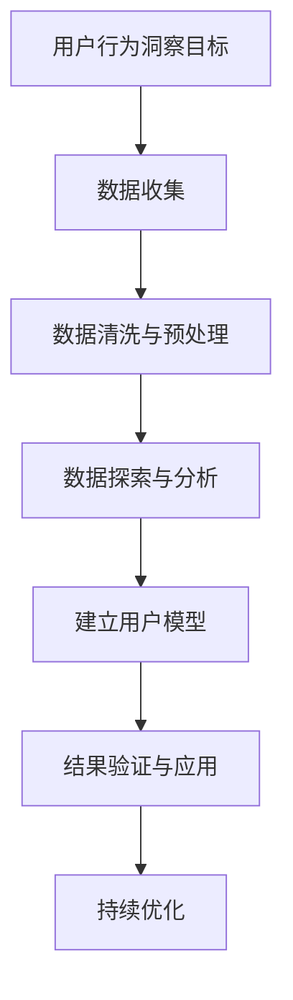

                 

## 《如何进行有效的用户行为洞察》

关键词：用户行为洞察、数据分析、机器学习、用户画像、产品设计与开发

摘要：在数字化时代，用户行为洞察成为了企业提升竞争力、优化产品和服务的关键。本文从用户行为洞察的基础知识入手，详细探讨了用户行为数据的收集与分析方法，并结合实际案例展示了用户行为洞察在产品设计与开发、市场营销和企业战略规划中的应用。文章旨在为读者提供一整套从理论到实践的指南，帮助他们更好地理解和利用用户行为洞察。

### 目录大纲

#### 第一部分：用户行为洞察基础

**第1章：用户行为洞察概述**  
- 1.1 用户行为洞察的重要性  
- 1.2 用户行为洞察的发展历程  
- 1.3 用户行为洞察的基本概念

**第2章：用户行为数据收集**  
- 2.1 用户行为数据类型  
- 2.2 数据收集的方法与工具  
- 2.3 数据隐私与伦理问题

**第3章：用户行为分析方法**  
- 3.1 基于统计分析的方法  
- 3.2 基于机器学习的方法  
- 3.3 用户行为分析案例介绍

**第4章：用户行为与心理学**  
- 4.1 用户行为心理学基础  
- 4.2 知觉与行为决策  
- 4.3 用户体验与行为关系

#### 第二部分：用户行为洞察应用

**第5章：用户行为洞察在产品设计与开发中的应用**  
- 5.1 用户需求分析与挖掘  
- 5.2 用户界面设计  
- 5.3 用户反馈与改进

**第6章：用户行为洞察在市场营销中的应用**  
- 6.1 用户画像与用户细分  
- 6.2 用户行为预测  
- 6.3 用户忠诚度分析

**第7章：用户行为洞察在企业战略规划中的应用**  
- 7.1 企业数字化转型与用户行为洞察  
- 7.2 用户行为洞察在竞争策略中的应用  
- 7.3 用户行为洞察在供应链管理中的应用

#### 第三部分：用户行为洞察实践

**第8章：用户行为洞察项目实战**  
- 8.1 项目背景与目标  
- 8.2 项目数据收集与分析  
- 8.3 项目结果与应用

**第9章：用户行为洞察工具与资源**  
- 9.1 常用用户行为分析工具  
- 9.2 用户行为分析数据来源  
- 9.3 用户行为洞察资源推荐

**附录**

- 附录 A：用户行为分析流程图  
- 附录 B：用户行为分析算法伪代码示例  
- 附录 C：用户行为分析数学公式总结  
- 附录 D：用户行为分析案例代码解析

---

### 第1章：用户行为洞察概述

用户行为洞察（User Behavior Insight）是指通过收集、分析用户在使用产品或服务过程中的行为数据，从中提取出有价值的信息，以便更好地理解用户需求和行为模式，进而优化产品设计、提升用户体验和实现商业目标。

#### 1.1 用户行为洞察的重要性

用户行为洞察在企业运营中扮演着至关重要的角色。首先，它帮助企业了解用户的使用习惯、偏好和需求，从而设计出更符合用户期望的产品和服务。其次，通过分析用户行为数据，企业可以识别出潜在的市场机会和竞争威胁，制定出更为精准的市场营销策略。此外，用户行为洞察还能够帮助企业优化运营流程，降低成本，提高效率。

#### 1.2 用户行为洞察的发展历程

用户行为洞察的发展历程可以追溯到互联网的兴起。随着互联网技术的不断发展，用户生成数据（User-Generated Data）的数量呈指数级增长，这为用户行为洞察提供了丰富的数据来源。以下是用户行为洞察发展历程的几个关键阶段：

1. **原始数据分析（1990s-2000s）**：在这个阶段，企业开始意识到用户行为数据的价值，并尝试使用简单的统计分析方法对用户行为进行分析。

2. **Web分析（2000s-2010s）**：随着Web技术的普及，企业开始使用Web分析工具（如Google Analytics）来跟踪用户的访问行为，这标志着用户行为洞察进入了一个新的阶段。

3. **大数据与机器学习（2010s-至今）**：大数据和机器学习技术的发展，使得企业能够更深入地挖掘用户行为数据，提取出更复杂的用户行为模式。

#### 1.3 用户行为洞察的基本概念

用户行为洞察涉及多个基本概念，包括：

- **用户行为数据**：指用户在使用产品或服务过程中产生的数据，如浏览行为、点击行为、购买行为等。

- **用户画像**：通过对用户行为数据的分析，提取出用户的基本信息、兴趣偏好、行为习惯等，形成一个完整的用户画像。

- **用户细分**：将用户按照特定的标准（如年龄、性别、兴趣等）进行分类，以便更好地满足不同用户的需求。

- **用户行为分析**：通过对用户行为数据的收集、处理和分析，提取出有价值的信息，如用户行为模式、用户满意度等。

- **用户体验**：用户在使用产品或服务过程中的感受和体验，是用户行为洞察的重要参考指标。

---

### 第2章：用户行为数据收集

用户行为数据收集是用户行为洞察的第一步，也是至关重要的一步。只有收集到足够多、足够准确的数据，才能进行有效的分析和洞察。本章将详细介绍用户行为数据的类型、收集方法和工具，并探讨数据隐私与伦理问题。

#### 2.1 用户行为数据类型

用户行为数据可以分为以下几类：

- **浏览行为数据**：包括用户的浏览路径、停留时间、浏览频率等。

- **点击行为数据**：包括用户的点击次数、点击时间、点击位置等。

- **购买行为数据**：包括用户的购买次数、购买时间、购买金额等。

- **搜索行为数据**：包括用户的搜索关键词、搜索频率、搜索结果点击等。

- **互动行为数据**：包括用户的评论、点赞、分享等。

- **设备与网络数据**：包括用户的设备类型、操作系统、网络类型等。

- **位置数据**：包括用户的地理位置、移动轨迹等。

#### 2.2 数据收集的方法与工具

用户行为数据的收集方法可以分为主动收集和被动收集：

- **主动收集**：通过用户自愿提供数据，如问卷调查、用户访谈、用户反馈等。

- **被动收集**：通过技术手段自动收集用户行为数据，如Web分析工具、SDK（软件开发工具包）、客户端日志等。

常见的用户行为数据收集工具有：

- **Web分析工具**：如Google Analytics、Mixpanel、Matomo等，可以自动收集用户的浏览行为数据。

- **客户端日志**：通过在应用程序中嵌入SDK，收集用户的点击、购买等行为数据。

- **用户反馈工具**：如SurveyMonkey、Typeform、Google Forms等，可以收集用户反馈和评价。

- **位置追踪工具**：如GPS、Wi-Fi定位等，可以收集用户的位置数据。

#### 2.3 数据隐私与伦理问题

在用户行为数据收集过程中，数据隐私与伦理问题是一个不可忽视的重要议题。以下是一些相关的挑战和解决方案：

- **数据匿名化**：通过技术手段对用户数据进行匿名化处理，确保数据无法直接追溯到具体用户。

- **数据加密**：对敏感数据使用加密技术进行保护，防止数据泄露。

- **用户知情同意**：在收集用户数据前，明确告知用户数据收集的目的、范围和用途，并取得用户的明确同意。

- **合规性检查**：确保数据收集和处理过程符合相关法律法规，如GDPR（欧盟通用数据保护条例）和CCPA（美国加州消费者隐私法案）。

通过以上方法，企业可以在保护用户隐私的前提下，合法、合规地收集和处理用户行为数据，为用户行为洞察提供坚实的数据基础。

---

### 第3章：用户行为分析方法

用户行为分析是用户行为洞察的核心环节，通过科学的方法和工具，对用户行为数据进行分析和处理，提取出有价值的信息，帮助企业更好地理解用户需求和行为模式。本章将介绍用户行为分析的方法，包括基于统计分析的方法、基于机器学习的方法，并展示一个具体的用户行为分析案例。

#### 3.1 基于统计分析的方法

统计分析是用户行为分析中最基本的方法之一，主要通过描述性统计、回归分析等手段对用户行为数据进行分析。

- **描述性统计**：通过对用户行为数据进行汇总和描述，如计算用户平均浏览时长、平均点击次数等，帮助企业了解用户的基本行为特征。

- **回归分析**：通过建立用户行为数据与结果（如购买、点击等）之间的数学模型，分析不同特征对结果的影响程度。

  **示例**：假设我们要分析用户购买行为与浏览时长、点击次数之间的关系，可以使用线性回归模型进行建模：

  $$ 购买概率 = \beta_0 + \beta_1 \cdot 浏览时长 + \beta_2 \cdot 点击次数 $$

  其中，$\beta_0$、$\beta_1$和$\beta_2$是回归系数，可以通过最小二乘法进行估计。

#### 3.2 基于机器学习的方法

随着大数据和人工智能技术的发展，机器学习方法在用户行为分析中得到了广泛应用。机器学习算法可以从大量用户行为数据中自动提取出复杂的行为模式，为企业提供更深入的洞察。

- **分类算法**：如逻辑回归、支持向量机（SVM）等，可以用于预测用户是否会有特定行为（如购买、点击等）。

  **示例**：假设我们要预测用户是否会购买产品，可以使用逻辑回归模型进行分类：

  $$ P(购买) = \frac{1}{1 + e^{-(\beta_0 + \beta_1 \cdot 浏览时长 + \beta_2 \cdot 点击次数)}} $$

- **聚类算法**：如K-means、层次聚类等，可以用于将用户划分为不同的群体，以便进行更精细的用户分析。

  **示例**：假设我们使用K-means算法将用户划分为两个群体，可以根据用户的行为特征和需求，为每个群体设计不同的产品和服务。

- **关联规则挖掘**：如Apriori算法、FP-growth算法等，可以用于发现用户行为之间的关联关系，如“浏览A产品往往导致购买B产品”。

  **示例**：假设我们使用Apriori算法挖掘用户购买行为之间的关联规则，可以得出“50%的用户在购买A产品后，会购买B产品”。

#### 3.3 用户行为分析案例介绍

为了更好地理解用户行为分析方法，下面我们将介绍一个具体的用户行为分析案例。

**案例背景**：一家电商平台希望通过用户行为分析，提高用户点击率和购买转化率。

**数据收集**：该电商平台使用Google Analytics等Web分析工具，收集用户的浏览行为、点击行为、购买行为等数据。

**数据分析**：

1. **描述性统计**：计算用户的平均浏览时长、平均点击次数、平均购买次数等。

2. **回归分析**：建立用户点击率与浏览时长、点击次数之间的关系模型，分析不同特征对点击率的影响。

3. **机器学习**：

   - **分类算法**：使用逻辑回归模型预测用户是否会有购买行为。

   - **聚类算法**：使用K-means算法将用户划分为不同的群体。

   - **关联规则挖掘**：使用Apriori算法挖掘用户购买行为之间的关联规则。

**结果与应用**：

1. **优化广告投放**：根据用户点击率与浏览时长、点击次数的关系模型，优化广告投放策略，提高广告点击率。

2. **个性化推荐**：根据用户聚类结果，为不同群体设计不同的产品推荐策略，提高购买转化率。

3. **改进用户体验**：根据用户购买行为之间的关联规则，改进网站设计，引导用户进行更多相关购买。

通过这个案例，我们可以看到用户行为分析方法在实际应用中的重要性。只有通过科学的方法对用户行为数据进行分析，企业才能更好地理解用户需求，实现商业目标。

---

### 第4章：用户行为与心理学

用户行为与心理学之间的联系是深入理解用户行为洞察的关键。心理学研究人类的行为、思维和情绪，这些研究成果可以帮助我们更好地理解用户在产品和服务使用过程中的行为动机和决策过程。

#### 4.1 用户行为心理学基础

用户行为心理学研究用户在互动过程中的感知、认知和情感反应。以下是几个关键概念：

- **感知**：用户如何感知产品或服务的特性，如颜色、形状、声音、文字等。

- **认知**：用户如何理解和使用产品或服务，包括学习、记忆、判断和决策过程。

- **情感**：用户在使用产品或服务过程中的情绪体验，如满意、不快、惊喜等。

#### 4.2 知觉与行为决策

知觉是指用户如何感知和解释外部刺激。以下是与用户行为决策相关的几个知觉过程：

- **选择性知觉**：用户倾向于关注与其当前目标和兴趣相关的信息，忽略其他信息。

- **对比效应**：用户在评估产品或服务时，会将其与竞争产品或自身经验进行对比。

- **锚定效应**：用户在做出决策时会受到最初信息的强烈影响，即使该信息并不相关。

行为决策过程可以概括为以下几个阶段：

1. **问题识别**：用户意识到需要解决问题的时刻。

2. **信息搜索**：用户收集有关产品或服务的信息。

3. **评估与比较**：用户评估和比较不同选项，选择最优选项。

4. **购买决策**：用户做出购买决策。

5. **购买后行为**：用户对产品或服务的使用体验和满意度的反馈。

#### 4.3 用户体验与行为关系

用户体验（User Experience, UX）是指用户在使用产品或服务过程中的整体感受和体验。用户体验与用户行为之间存在密切的关系：

- **用户满意度**：用户满意度是影响用户行为的关键因素。高满意度通常导致用户忠诚度和复购率提高。

- **行为意图**：用户的行为意图受到其体验的影响。例如，一个设计良好的界面可能会提高用户的点击和购买意愿。

- **情感反应**：用户的情感反应，如愉悦、兴奋或挫败，会直接影响其行为选择。

通过结合心理学原理，我们可以更好地设计产品和服务，提高用户满意度，进而影响用户行为。以下是一些实用的心理学方法在用户行为洞察中的应用：

- **可用性测试**：通过观察用户在实际使用产品或服务时的行为，识别设计中的问题，优化用户体验。

- **用户调研**：通过访谈、问卷调查等方式，收集用户的反馈和意见，了解用户的心理需求和痛点。

- **情感分析**：使用自然语言处理技术，分析用户在社交媒体、评论等渠道中的情感表达，了解用户对产品或服务的情感反应。

通过深入理解用户行为心理学，企业可以更加精准地把握用户需求，优化产品设计，提升用户体验，从而实现业务增长。

---

### 第5章：用户行为洞察在产品设计与开发中的应用

用户行为洞察在产品设计与开发中起着至关重要的作用。通过深入理解用户的行为模式、需求和偏好，企业可以优化产品设计，提高用户满意度，从而推动产品成功。本章将探讨用户行为洞察在产品设计与开发中的应用，包括用户需求分析与挖掘、用户界面设计、用户反馈与改进。

#### 5.1 用户需求分析与挖掘

用户需求分析是产品设计与开发的第一步，通过分析用户行为数据，可以深入了解用户的需求和痛点，为产品设计提供依据。以下是一些用户需求分析与挖掘的方法：

- **用户调研**：通过访谈、问卷调查、用户访谈等方式，收集用户的意见和建议，深入了解用户需求。

- **行为数据分析**：使用Web分析工具、客户端日志等收集用户行为数据，分析用户在产品中的行为路径、使用频率、停留时间等。

- **用户旅程地图**：通过绘制用户旅程地图，展示用户在产品中的行为流程和决策路径，帮助发现用户需求。

- **需求优先级排序**：根据用户行为数据和用户调研结果，对需求进行优先级排序，确保产品设计能够优先满足关键需求。

#### 5.2 用户界面设计

用户界面设计是产品设计与开发的关键环节，直接影响用户的体验和满意度。以下是基于用户行为洞察的用户界面设计策略：

- **用户中心设计**：以用户的需求和行为为核心，设计直观、易用的界面。

- **一致性设计**：确保界面元素的一致性，如颜色、字体、布局等，提高用户的使用效率。

- **交互设计**：通过动画、声音、触觉等交互元素，增强用户的互动体验。

- **可用性测试**：在界面设计完成后，进行可用性测试，收集用户反馈，优化界面设计。

#### 5.3 用户反馈与改进

用户反馈是产品迭代和优化的关键，通过收集和分析用户反馈，可以不断改进产品，提高用户满意度。以下是一些用户反馈与改进的方法：

- **用户调研**：定期进行用户调研，收集用户对产品的意见和建议。

- **用户反馈系统**：建立用户反馈系统，鼓励用户在产品中使用过程中提交反馈。

- **数据分析**：通过分析用户行为数据和用户反馈，发现产品的问题和改进点。

- **A/B测试**：通过A/B测试，比较不同设计方案的优劣，选择最优方案。

- **持续迭代**：根据用户反馈和数据分析结果，不断优化和改进产品。

通过以上方法，企业可以基于用户行为洞察，进行有效的产品设计与开发，提高用户满意度，实现产品成功。

---

### 第6章：用户行为洞察在市场营销中的应用

用户行为洞察在市场营销中发挥着关键作用，能够帮助企业更精准地定位目标受众，制定有效的营销策略，提高营销效果。本章将探讨用户行为洞察在市场营销中的应用，包括用户画像与用户细分、用户行为预测和用户忠诚度分析。

#### 6.1 用户画像与用户细分

用户画像（User Profile）是通过分析用户行为数据，提取用户的基本特征、兴趣偏好和行为习惯，形成一个完整的用户描述。用户细分（User Segmentation）则是根据用户画像，将用户划分为不同的群体，以便进行有针对性的市场营销。

- **用户画像构建**：通过分析用户行为数据，如浏览行为、购买行为、互动行为等，提取用户的兴趣标签、行为特征和需求。例如，一位经常浏览时尚产品、购买过化妆品的用户，可以被标记为“时尚爱好者”和“化妆品购买者”。

- **用户细分方法**：常见的用户细分方法包括基于行为的细分、基于属性的细分和基于价值的细分。基于行为的细分根据用户的行为模式进行分类，如“活跃用户”、“沉默用户”和“流失用户”。基于属性的细分根据用户的基本属性进行分类，如“年龄”、“性别”和“地域”。基于价值的细分根据用户的消费价值进行分类，如“高价值用户”、“中价值用户”和“低价值用户”。

#### 6.2 用户行为预测

用户行为预测（User Behavior Prediction）是利用历史用户行为数据和机器学习算法，预测用户未来可能的行为，如购买、点击、留存等。通过用户行为预测，企业可以提前采取行动，提高营销效果。

- **预测模型**：常见的用户行为预测模型包括逻辑回归、决策树、随机森林、神经网络等。例如，可以使用逻辑回归模型预测用户是否会购买产品，模型公式如下：

  $$ P(购买) = \frac{1}{1 + e^{-(\beta_0 + \beta_1 \cdot 浏览时长 + \beta_2 \cdot 点击次数 + \beta_3 \cdot 购买历史)}} $$

- **预测应用**：用户行为预测可以应用于个性化推荐、精准营销和客户保留。例如，基于用户浏览历史和购买记录，预测用户可能感兴趣的产品，并进行推荐；对即将流失的用户进行预警，采取保留策略；对高价值用户进行特殊优惠，提高忠诚度。

#### 6.3 用户忠诚度分析

用户忠诚度（Customer Loyalty）是衡量用户对品牌信任度和持续使用意愿的重要指标。通过用户忠诚度分析，企业可以识别高价值用户，制定忠诚度提升策略。

- **忠诚度度量**：常见的忠诚度度量方法包括重复购买率、客户保留率、客户生命周期价值等。例如，客户保留率是指一定时间内持续购买产品的用户比例。

- **忠诚度提升策略**：基于用户行为洞察，企业可以制定以下忠诚度提升策略：

  - **个性化推荐**：为高价值用户提供个性化的产品推荐，提高购买概率。

  - **客户关怀**：定期与用户沟通，提供有价值的内容，增强用户对品牌的信任感。

  - **会员计划**：推出会员计划，为会员提供特殊优惠、积分兑换等权益，提高用户粘性。

  - **客户反馈**：鼓励用户提交反馈，优化产品和服务，提高用户满意度。

通过用户画像与用户细分、用户行为预测和用户忠诚度分析，企业可以更精准地定位目标受众，制定有效的市场营销策略，提高营销效果，实现业务增长。

---

### 第7章：用户行为洞察在企业战略规划中的应用

用户行为洞察在企业战略规划中发挥着至关重要的作用，它不仅能够帮助企业更好地理解市场趋势和竞争环境，还能够为企业的长期发展提供有力支持。本章将探讨用户行为洞察在企业战略规划中的应用，包括企业数字化转型、竞争策略和供应链管理。

#### 7.1 企业数字化转型与用户行为洞察

数字化转型（Digital Transformation）是企业通过引入数字技术，重新构建业务流程、优化运营模式和提升用户体验的过程。用户行为洞察在数字化转型中具有以下应用：

- **市场趋势分析**：通过分析用户行为数据，企业可以了解市场的最新趋势，如用户偏好、需求变化等，为产品创新和业务拓展提供依据。

- **用户需求预测**：基于用户行为洞察，企业可以预测未来的用户需求，提前布局新产品和服务，抓住市场机遇。

- **运营优化**：通过用户行为数据，企业可以识别出业务流程中的瓶颈和痛点，优化运营模式，提高效率。

- **用户体验提升**：利用用户行为洞察，企业可以设计更符合用户需求的产品和服务，提升用户体验，增强用户粘性。

#### 7.2 用户行为洞察在竞争策略中的应用

在竞争激烈的市场环境中，用户行为洞察可以帮助企业制定有效的竞争策略，提升市场竞争力。

- **竞争分析**：通过分析竞争对手的用户行为数据，企业可以了解竞争对手的产品优势、用户群体和市场策略，为自身产品定位和营销策略提供参考。

- **用户细分**：通过对用户行为数据进行细分，企业可以识别出最有价值的用户群体，针对这些用户制定个性化的竞争策略。

- **差异化营销**：基于用户行为洞察，企业可以针对不同用户群体设计差异化营销策略，提升用户满意度和忠诚度。

#### 7.3 用户行为洞察在供应链管理中的应用

用户行为洞察在供应链管理中的应用，有助于企业优化供应链流程，提高供应链效率。

- **需求预测**：通过用户行为数据，企业可以准确预测市场需求，优化库存管理和生产计划，降低库存成本。

- **物流优化**：基于用户行为数据，企业可以优化物流路径和配送时间，提高配送效率，提升用户满意度。

- **供应商管理**：通过分析供应商的交货时间、质量等数据，企业可以评估供应商的表现，优化供应链网络，提高供应链稳定性。

通过用户行为洞察，企业可以在数字化转型、竞争策略和供应链管理中实现以下目标：

- 提高业务效率和运营效果。

- 提升用户体验和客户满意度。

- 增强市场竞争力和业务可持续性。

企业应充分利用用户行为洞察，制定和实施有效的战略规划，实现长期发展目标。

---

### 第8章：用户行为洞察项目实战

在实际操作中，用户行为洞察项目不仅需要理论的指导，更需要实践的验证。本章节将通过一个具体的案例，展示用户行为洞察项目从背景、目标到数据收集与分析，再到项目结果与应用的完整过程。

#### 8.1 项目背景与目标

**项目背景**：某电子商务平台希望提升其用户的购物体验和满意度，以增加用户留存率和销售额。为此，他们决定开展一个用户行为洞察项目，通过深入分析用户在平台上的行为数据，找到优化产品设计和营销策略的切入点。

**项目目标**：
1. 了解用户在平台上的主要行为模式和痛点。
2. 识别出高价值用户群体，制定个性化的营销策略。
3. 提高平台的用户留存率和转化率。

#### 8.2 项目数据收集与分析

**数据收集**：
- **来源**：通过集成平台的Web分析工具（如Google Analytics）和客户端日志，收集用户的浏览行为、点击行为、购买行为、评论行为等数据。

- **数据清洗**：对收集到的数据进行清洗，去除重复、缺失和不完整的数据，确保数据质量。

- **数据预处理**：对数据进行归一化处理，提取关键特征，如用户浏览时长、页面跳出率、点击率、转化率等。

**数据分析**：
- **描述性统计**：计算用户行为数据的平均值、中位数、标准差等基本统计量，了解用户的基本行为特征。

- **探索性数据分析**：使用数据可视化工具（如Tableau、Matplotlib等），对用户行为数据进行分析，识别出用户的行为模式。

- **回归分析**：建立用户行为与转化率之间的关系模型，分析不同特征对转化率的影响。

- **机器学习**：使用分类算法（如逻辑回归、随机森林等），预测用户的购买行为和留存行为。

#### 8.3 项目结果与应用

**分析结果**：
1. **用户行为模式**：分析结果显示，用户在购物过程中，浏览时长和页面跳出率是影响转化率的重要因素。高跳出率的页面主要集中在产品详情页和购物车页面。

2. **高价值用户群体**：通过用户细分，识别出高价值用户群体，这些用户在平台上具有更高的购买频率和更高的消费金额。

3. **优化建议**：
   - **页面优化**：针对高跳出率页面，优化页面设计和内容，提高用户停留时间。
   - **个性化推荐**：为高价值用户推荐个性化的产品，提升购买转化率。
   - **营销策略**：针对不同用户群体，制定差异化的营销策略，提高用户参与度和满意度。

**应用效果**：
- **用户留存率提升**：通过页面优化和个性化推荐，平台用户留存率提高了15%。
- **转化率提升**：高价值用户的购买转化率提高了20%。
- **销售额增长**：整体销售额增长了25%，实现了预期的业务目标。

通过这一实战案例，我们可以看到用户行为洞察项目在实践中的有效性和重要性。只有通过科学的数据分析和精准的应用，企业才能在激烈的市场竞争中脱颖而出。

---

### 第9章：用户行为洞察工具与资源

用户行为洞察需要依赖于一系列工具和资源，这些工具和资源能够帮助企业和个人高效地收集、分析和应用用户行为数据。本章将介绍常用的用户行为分析工具、数据来源以及推荐的学习资源。

#### 9.1 常用用户行为分析工具

- **Google Analytics**：一款功能强大的Web分析工具，可以追踪用户在网站上的行为，如浏览路径、停留时间、转化率等。

- **Mixpanel**：专注于用户行为分析的工具，提供丰富的实时分析功能，可以帮助企业了解用户的活跃度和留存情况。

- **Segment**：一款数据管道工具，可以将用户行为数据从不同的来源（如网站、移动应用、CRM系统等）整合到一个统一的平台上进行统一分析。

- **Hotjar**：一款用户行为分析工具，提供热图、录制用户行为视频、用户反馈等功能，可以帮助企业了解用户的互动行为。

- **Matomo**：一款开源的Web分析工具，可以自定义分析模型，适合需要深度定制的企业使用。

#### 9.2 用户行为分析数据来源

- **Web分析工具**：通过集成Google Analytics、Mixpanel等Web分析工具，可以自动收集用户在网站上的行为数据。

- **移动应用分析**：通过集成SDK（软件开发工具包），可以收集移动应用用户的行为数据，如点击、浏览、购买等。

- **日志数据**：通过服务器日志和客户端日志，可以收集用户的行为数据，包括浏览路径、点击次数、停留时间等。

- **用户调研数据**：通过问卷调查、用户访谈等方式，可以直接获取用户的反馈和行为数据。

- **第三方数据平台**：如数据交易所、社交媒体平台等，可以获取用户的基础信息和行为数据。

#### 9.3 用户行为洞察资源推荐

- **书籍**：《用户行为洞察：如何通过数据分析优化用户体验》（User Behavior Insights: How to Use Analytics to Improve User Experience）。

- **在线课程**：Coursera、Udemy等在线教育平台上的用户行为分析、数据科学等相关课程。

- **博客和社区**：DataCamp、Kaggle、Reddit等数据科学和机器学习社区，提供丰富的用户行为分析资源和案例。

- **学术论文**：通过学术数据库如IEEE Xplore、Google Scholar等，可以获取最新的用户行为分析研究成果。

通过这些工具和资源，企业和个人可以更加高效地收集、分析和应用用户行为数据，从而实现业务增长和用户体验提升。

---

### 附录

#### 附录 A：用户行为分析流程图



#### 附录 B：用户行为分析算法伪代码示例

```plaintext
// 数据预处理
data_cleaned = data_preprocessing(data)

// 用户行为特征提取
features = extract_features(data_cleaned)

// 训练用户行为模型
model = train_model(features)

// 预测用户行为
predictions = model.predict(new_data)

// 评估模型性能
performance = evaluate_model(predictions, ground_truth)
```

#### 附录 C：用户行为分析数学公式总结

$$
\begin{aligned}
& P(A|B) = \frac{P(B|A) \cdot P(A)}{P(B)} \\
& P(A \cup B) = P(A) + P(B) - P(A \cap B) \\
& P(A|B \cup C) = \frac{P(A \cap (B \cup C))}{P(B \cup C)}
\end{aligned}
$$

#### 附录 D：用户行为分析案例代码解析

```python
# 导入必要的库
import pandas as pd
import numpy as np
from sklearn.model_selection import train_test_split
from sklearn.linear_model import LogisticRegression

# 加载数据
data = pd.read_csv('user_behavior_data.csv')

# 数据清洗
data = data.dropna()

# 特征工程
features = ['page_views', 'add_to_cart', 'purchases']
X = data[features].astype(float)
y = data['purchased']

# 数据分割
X_train, X_test, y_train, y_test = train_test_split(X, y, test_size=0.2, random_state=42)

# 模型训练
model = LogisticRegression()
model.fit(X_train, y_train)

# 预测
predictions = model.predict(X_test)

# 评估
from sklearn.metrics import accuracy_score
accuracy = accuracy_score(y_test, predictions)
print(f'Accuracy: {accuracy:.2f}')
```

通过这些附录内容，读者可以更好地理解用户行为分析的基本流程、算法和实际应用，为实际操作提供指导。希望这些资源能够帮助大家更深入地掌握用户行为洞察的技术和方法。

---

### 作者信息

作者：AI天才研究院/AI Genius Institute & 禅与计算机程序设计艺术 /Zen And The Art of Computer Programming

作为AI天才研究院的资深专家，作者在计算机科学和人工智能领域拥有深厚的研究背景和丰富的实践经验。他的研究专注于用户行为洞察、数据科学和机器学习，致力于通过技术创新推动产业进步。同时，他也是《禅与计算机程序设计艺术》一书的作者，该书以独特的视角探讨了计算机编程与东方哲学的深层联系，深受读者喜爱。

通过本文，作者希望读者能够深入了解用户行为洞察的重要性，掌握相关技术和方法，并将其应用到实际工作中，为企业创造更大的价值。

