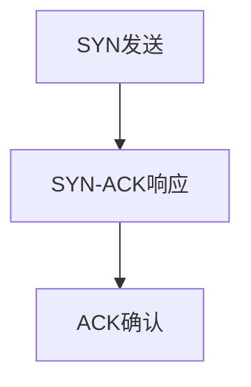

                 

## 2024字节跳动技术伙伴关系经理面试真题汇总及答案

### 关键词：
- 字节跳动
- 技术伙伴关系经理
- 面试题
- 算法
- 数据结构
- 计算机网络
- 操作系统
- 数据库
- 业务分析
- 软技能
- 面试技巧

### 摘要：
本文汇集了2024年字节跳动技术伙伴关系经理的面试真题，涵盖了技术、业务和软技能各个方面。通过详细的真题解析和答案，帮助应聘者更好地准备面试，提高面试成功率。文章结构清晰，内容详实，旨在为读者提供一份全面的面试指南。

## 第1章：面试真题概述与准备

### 1.1 面试真题类型与分类

字节跳动面试真题主要分为以下几类：

- **技术面试题**：主要考察应聘者的技术基础和解决问题的能力，包括数据结构与算法、计算机网络、操作系统、数据库等。

- **业务面试题**：主要考察应聘者对字节跳动业务的理解能力，包括产品逻辑、市场策略、业务模式等。

- **软技能面试题**：主要考察应聘者的沟通能力、团队协作能力、解决问题的能力等。

### 1.2 面试准备策略

为了在字节跳动的面试中取得好成绩，以下是一些准备策略：

- **全面复习基础知识**：数据结构与算法、计算机网络、操作系统、数据库等是面试的重点，需要全面复习。

- **熟悉公司业务**：了解字节跳动的业务模式、核心产品、市场地位等，有助于在业务面试题中取得好成绩。

- **模拟面试**：通过模拟面试熟悉面试流程，提升应答能力。

### 第2章：面试真题详解与答案解析

#### 2.1 算法与数据结构面试题

算法与数据结构是技术面试中不可或缺的一部分，以下是一些典型的面试题及答案解析。

#### 2.1.1 算法设计题

##### 例题1：最长公共子序列

**题目描述**：给定两个字符串，找出它们的最长公共子序列。

**解答**：使用动态规划，状态转移方程为`dp[i][j] = dp[i-1][j-1] + 1`（当字符匹配时）或`dp[i][j] = max(dp[i-1][j], dp[i][j-1])`（当字符不匹配时）。

**伪代码**：

```
function longestCommonSubsequence(s1, s2):
    m, n = length(s1), length(s2)
    dp = array(m+1, n+1, filled with 0)
    for i from 1 to m:
        for j from 1 to n:
            if s1[i-1] == s2[j-1]:
                dp[i][j] = dp[i-1][j-1] + 1
            else:
                dp[i][j] = max(dp[i-1][j], dp[i][j-1])
    return dp[m][n]
```

##### 例题2：最小生成树

**题目描述**：给定一个无向图，求出其最小生成树。

**解答**：使用Prim算法或Kruskal算法。

**Prim算法伪代码**：

```
function prim(graph):
    mst = empty set
    selected vertex v
    for each vertex u in graph:
        if u is not in mst:
            add u to mst
            add all edges from u to mst to mst
            while mst has less than n-1 vertices:
                select the edge with the smallest weight that connects a vertex in mst to a vertex not in mst
                add this edge to mst
    return mst
```

**Kruskal算法伪代码**：

```
function kruskal(edges):
    sort edges by weight
    initialize forest as a set of single vertices
    for each edge in sorted edges:
        if the edge connects two disjoint sets in the forest:
            add the edge to the forest
    return forest
```

#### 2.1.2 数据结构题

##### 例题3：链表反转

**题目描述**：反转单链表。

**解答**：使用递归或迭代方式反转链表。

**递归解法伪代码**：

```
function reverseList(head):
    if head is null or head.next is null:
        return head
    newHead = reverseList(head.next)
    head.next.next = head
    head.next = null
    return newHead
```

**迭代解法伪代码**：

```
function reverseList(head):
    prev = null
    curr = head
    while curr is not null:
        nextNode = curr.next
        curr.next = prev
        prev = curr
        curr = nextNode
    return prev
```

##### 例题4：栈与队列

**题目描述**：实现一个栈和队列的数据结构。

**解答**：可以使用链表来实现栈和队列。

**栈伪代码**：

```
class Stack:
    def __init__(self):
        self.items = []

    def push(self, item):
        self.items.append(item)

    def pop(self):
        if not self.isEmpty():
            return self.items.pop()

    def isEmpty(self):
        return len(self.items) == 0
```

**队列伪代码**：

```
class Queue:
    def __init__(self):
        self.items = []

    def enqueue(self, item):
        self.items.append(item)

    def dequeue(self):
        if not self.isEmpty():
            return self.items.pop(0)

    def isEmpty(self):
        return len(self.items) == 0
```

#### 2.2 计算机系统面试题

计算机系统面试题主要涉及计算机网络、操作系统等方面。

##### 例题5：TCP连接建立过程

**题目描述**：解释TCP连接的建立过程。

**解答**：TCP连接建立过程包括三个阶段：SYN发送、SYN-ACK响应、ACK确认。

**流程图**：



##### 例题6：进程调度算法

**题目描述**：解释几种常见的进程调度算法。

**解答**：常见的进程调度算法包括先来先服务（FCFS）、短作业优先（SJF）、时间片轮转（RR）等。

**FCFS伪代码**：

```
function FCFS(processes):
    for each process in processes:
        execute process for its entire duration
```

**SJF伪代码**：

```
function SJF(processes):
    sort processes by their burst time
    for each process in sorted processes:
        execute process for its burst time
```

**RR伪代码**：

```
function RR(processes, time quantum):
    while there are processes in the queue:
        for each process in the queue:
            if process arrival time <= current time:
                execute process for time quantum or until it finishes
                remove process from the queue
            else:
                remove process from the queue
```

#### 2.3 数据库与存储面试题

数据库与存储面试题主要涉及SQL基础、数据库设计等方面。

##### 例题7：SQL查询优化

**题目描述**：如何优化一个复杂的SQL查询。

**解答**：优化策略包括使用索引、避免使用子查询、减少数据扫描等。

**优化策略伪代码**：

```
function optimizeQuery(query):
    if query contains a join:
        create index on join columns
    if query contains a subquery:
        replace subquery with a join
    if query contains a SELECT *:
        replace SELECT * with specific column names
    return optimized query
```

##### 例题8：范式设计

**题目描述**：解释第一范式、第二范式、第三范式的区别。

**解答**：第一范式（1NF）要求字段不可分，第二范式（2NF）要求满足1NF且不存在部分依赖，第三范式（3NF）要求满足2NF且不存在传递依赖。

**范式区别伪代码**：

```
function normalizeTable(table):
    if table does not satisfy 1NF:
        decompose table into smaller tables
    if table does not satisfy 2NF:
        decompose table into smaller tables based on partial dependencies
    if table does not satisfy 3NF:
        decompose table into smaller tables based on transitive dependencies
    return normalized tables
```

### 第3章：案例分析与应用场景

#### 3.1 业务案例分析

字节跳动作为一家领先的技术公司，其业务涵盖了多个领域。以下是一些业务案例分析：

##### 案例分析1：抖音

抖音是一款基于算法推荐的视频分享应用，其核心功能包括短视频创作、视频播放、互动分享等。分析抖音的设计理念、技术实现、用户反馈等。

**设计理念**：抖音的设计理念是以用户为中心，通过算法推荐提高用户体验。抖音采用基于内容、用户兴趣和社交关系的三元推荐模型，实现个性化推荐。

**技术实现**：抖音在技术实现上采用了分布式系统架构，包括前端、后端、数据库等。后端使用Java、Python等编程语言，数据库使用MySQL、Redis等。

**用户反馈**：抖音的用户反馈主要集中在内容质量、推荐算法、用户体验等方面。用户普遍对抖音的内容丰富性和推荐准确性表示满意。

##### 案例分析2：今日头条

今日头条是一款基于算法推荐的新闻资讯应用，其核心功能包括个性化推荐、新闻阅读、评论互动等。分析今日头条的设计理念、技术实现、用户反馈等。

**设计理念**：今日头条的设计理念是让用户看到感兴趣的内容。今日头条采用基于用户行为、内容标签、社交关系等多维度算法，实现个性化推荐。

**技术实现**：今日头条在技术实现上采用了大数据处理和机器学习技术。后端使用Java、Python等编程语言，数据库使用Hadoop、HBase等。

**用户反馈**：今日头条的用户反馈主要集中在内容质量、推荐准确性、用户体验等方面。用户普遍对今日头条的内容丰富性和推荐准确性表示满意。

#### 3.2 应用场景分析

字节跳动的技术在多个应用场景中得到了广泛应用，以下是一些应用场景分析：

##### 应用场景1：推荐系统

推荐系统在抖音、今日头条等应用中得到了广泛应用。分析推荐系统的设计原理、实现方法、优化策略等。

**设计原理**：推荐系统基于用户行为、内容特征、社交关系等多维度数据，通过机器学习算法实现个性化推荐。

**实现方法**：推荐系统采用协同过滤、基于内容的推荐、混合推荐等算法，实现高效、准确的推荐。

**优化策略**：优化策略包括数据预处理、特征工程、模型优化、实时更新等，以提高推荐系统的效果和用户体验。

##### 应用场景2：广告系统

广告系统在多个应用中实现了精准投放，提高了广告的投放效果。分析广告系统的设计原理、实现方法、优化策略等。

**设计原理**：广告系统基于用户行为、兴趣、地理位置等多维度数据，实现精准广告投放。

**实现方法**：广告系统采用实时竞价、广告投放优化、用户画像等技术，实现高效、精准的广告投放。

**优化策略**：优化策略包括广告质量评估、投放策略优化、用户体验优化等，以提高广告投放效果和用户满意度。

### 第4章：软技能面试准备与提升

#### 4.1 软技能面试题类型

软技能面试题主要考察应聘者的沟通能力、团队协作能力、解决问题的能力等。以下是一些常见的软技能面试题：

##### 沟通能力题

- 你是如何与团队成员沟通的？
- 在团队合作中，你是如何处理冲突的？
- 你是如何向领导汇报工作的？

##### 团队协作题

- 你是如何领导团队的？
- 你是如何协调团队成员的工作的？
- 你是如何处理团队中的不同意见的？

##### 解决问题能力题

- 你是如何解决问题的？
- 在遇到困难时，你是如何克服的？
- 你是如何评估问题的重要性和紧急性的？

#### 4.2 提升软技能策略

为了提升软技能，以下是一些策略：

##### 反思与总结

- 定期反思自己的沟通方式、团队协作方式等，总结经验教训。
- 对每次失败或成功的工作进行总结，分析原因和经验。

##### 模拟练习

- 通过模拟面试或角色扮演提升沟通和团队协作能力。
- 参与实际项目，积累实战经验，提高解决问题的能力。

### 第5章：面试技巧与心理调适

#### 5.1 面试技巧

以下是一些面试技巧：

##### 自我介绍

- 准备一段简洁明了的自我介绍，突出自己的优势和特点。
- 语言要流畅自然，避免背诵。

##### 问题回答策略

- 先思考再回答，确保回答有逻辑性和条理性。
- 使用具体实例支持自己的观点。
- 避免使用模糊或模棱两可的回答。

#### 5.2 心理调适

以下是一些心理调适方法：

##### 减压方法

- 深呼吸、正念练习等，有助于缓解紧张情绪。
- 提前准备，熟悉面试流程，减少不确定性带来的焦虑。

##### 心态调整

- 保持积极的心态，相信自己能够应对面试挑战。
- 将面试视为一次学习和成长的机会，而非单纯的考核。

### 第6章：总结与反思

#### 6.1 面试经验总结

总结面试过程中的成功经验和失败经验，如：

- 成功经验：良好的问题回答、出色的沟通能力等。
- 失败经验：知识储备不足、应对问题不够灵活等。

#### 6.2 反思与改进

根据面试经验总结，反思自己的不足之处，并提出改进策略：

- **知识储备**：加强相关领域的知识学习。
- **实战经验**：通过参与项目、实习等，积累更多的实战经验。

### 附录

#### 附录A：面试资料与资源

以下是一些面试资料与资源：

- **常用面试网站与资源**：如LeetCode、牛客网等。
- **面试指导书籍**：推荐一些经典面试指南书籍。

#### 附录B：面试常见问题与解答

以下是一些面试常见问题与解答：

- **技术问题**：常见的技术面试问题汇总。
- **业务问题**：常见业务面试问题的解答。

## 作者

作者：AI天才研究院/AI Genius Institute & 禅与计算机程序设计艺术 /Zen And The Art of Computer Programming

