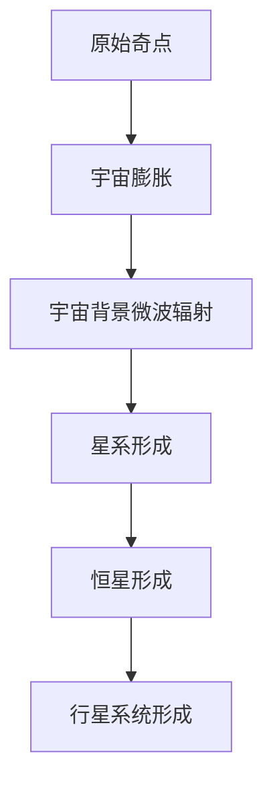
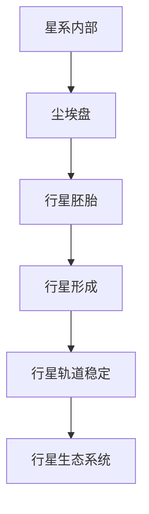
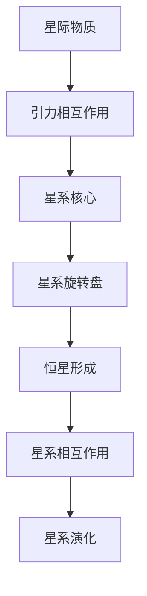

                 

### 1. 引言

#### 1.1 宇宙的自我参照性定义与意义

宇宙的自我参照性，是一个新兴且极具潜力的研究领域。它探讨的是宇宙如何通过自我参照来定义自身，以及这种定义对宇宙演化过程的影响。宇宙的自我参照性不仅仅是一个物理学概念，它涉及到宇宙学、哲学、系统科学等多个学科领域。

首先，我们来定义宇宙的自我参照性。宇宙的自我参照性，指的是宇宙通过自身属性和内在规律来定义自身的现象。这种定义过程不仅涉及宇宙的基本结构，如大爆炸、宇宙膨胀、黑洞等，还涉及到宇宙中的信息与智能等复杂现象。

那么，宇宙的自我参照性有什么意义呢？首先，它为理解宇宙的演化提供了新的视角。传统的宇宙学理论，如大爆炸理论、宇宙膨胀理论等，主要关注宇宙的宏观现象。而宇宙的自我参照性则试图从微观角度，如信息、智能等方面，来理解宇宙的演化过程。

其次，宇宙的自我参照性对我们理解宇宙的本质具有重要意义。传统的物理学理论，如相对论、量子力学等，为我们揭示了宇宙的基本规律。然而，这些理论往往缺乏对宇宙整体演化的解释。宇宙的自我参照性为我们提供了一个更全面的视角，帮助我们理解宇宙如何通过自我参照来定义自身。

#### 1.2 宇宙自我参照性的研究背景

宇宙自我参照性的研究，可以追溯到20世纪初。当时，科学家们开始意识到宇宙并非一个静态的结构，而是一个不断演化的系统。随着对宇宙的深入了解，科学家们逐渐认识到，宇宙的自我参照性是一个关键的研究方向。

首先，宇宙的自我参照性研究涉及到宇宙的基本结构。例如，大爆炸理论和宇宙膨胀理论，都揭示了宇宙的自我参照性。大爆炸理论认为，宇宙起源于一个极度热密的状态，随后经历膨胀，形成现在的宇宙结构。宇宙膨胀理论则指出，宇宙的膨胀速度在加快，这背后的原因可能就是宇宙的自我参照性。

其次，宇宙的自我参照性研究还涉及到宇宙中的信息与智能。随着对宇宙的深入研究，科学家们逐渐发现，宇宙中存在大量的信息。这些信息不仅存在于宏观的天文现象中，如星系、黑洞等，还存在于微观的量子现象中。此外，科学家们还发现，宇宙中可能存在智能生命。这些智能生命不仅可能存在于地球上，还可能存在于其他星球上。

#### 1.3 研究目的与内容

本文旨在系统地探讨宇宙的自我参照性，并分析其对宇宙演化过程的影响。具体研究内容如下：

1. **宇宙的基本结构**：我们将介绍宇宙的基本结构，如大爆炸理论、宇宙膨胀理论、黑洞等，并分析这些结构如何体现宇宙的自我参照性。

2. **宇宙的演化过程**：我们将探讨宇宙的演化过程，包括恒星的形成与演化、行星系统的形成、星系的形成与演化等，并分析这些演化过程如何受到宇宙的自我参照性的影响。

3. **宇宙中的信息与智能**：我们将探讨宇宙中的信息与智能，分析它们如何体现宇宙的自我参照性，以及它们在宇宙演化中的作用。

4. **系统的自我定义过程**：我们将介绍系统的自我定义过程，包括自我定义的数学模型、物理机制、生态学意义等，并分析这些模型如何与宇宙的自我参照性相关。

5. **宇宙自我参照性的实现**：我们将探讨宇宙自我参照性的实现方法，包括数学方法、物理实现、生态学应用等，并分析这些方法如何影响宇宙的自我演化过程。

6. **宇宙自我参照性的实际应用**：我们将探讨宇宙自我参照性在宇宙探索、生物系统、社会系统等领域的实际应用，并分析这些应用如何推动科学和技术的进步。

通过以上研究，我们希望能够更深入地理解宇宙的自我参照性，为宇宙学、哲学、系统科学等领域的发展提供新的思路和方法。

#### 1.4 本文结构

本文将分为三个主要部分：

- **第一部分：宇宙的自我参照性基础**：我们将介绍宇宙的自我参照性的定义与意义，以及宇宙的基本结构和演化过程。这部分内容将帮助读者建立对宇宙自我参照性的基本认识。

- **第二部分：系统的自我定义过程**：我们将探讨系统的自我定义概念，包括自我定义的数学模型、物理机制、生态学意义等。这部分内容将帮助读者理解系统如何自我定义，并分析这些过程如何与宇宙的自我参照性相关。

- **第三部分：宇宙自我参照性的实际应用**：我们将探讨宇宙自我参照性在宇宙探索、生物系统、社会系统等领域的实际应用。这部分内容将展示宇宙自我参照性的广泛应用，并分析这些应用如何推动科学和技术的进步。

通过本文的研究，我们希望能够为宇宙自我参照性的研究提供新的视角和思路，为宇宙学、哲学、系统科学等领域的发展做出贡献。

#### 1.5 读者对象

本文旨在为对宇宙学、哲学、系统科学等领域感兴趣的读者提供深入的学术研究。具体来说，本文适合以下读者群体：

1. **宇宙学研究者**：本文详细介绍了宇宙的自我参照性，包括宇宙的基本结构、演化过程、信息与智能等，对于从事宇宙学研究的学者，本文将提供新的研究视角。

2. **哲学研究者**：宇宙的自我参照性涉及到哲学上的自我意识、自我定义等问题，对于哲学研究者，本文将提供新的理论框架和思考方向。

3. **系统科学研究者**：本文探讨了系统的自我定义过程，包括数学模型、物理机制、生态学意义等，对于从事系统科学研究的学者，本文将提供新的研究工具和方法。

4. **计算机科学家**：宇宙的自我参照性涉及到信息、智能等概念，对于计算机科学家，本文将提供新的研究方向和应用领域。

5. **跨学科研究者**：本文涵盖了宇宙学、哲学、系统科学、计算机科学等多个学科领域，对于跨学科研究者，本文将提供丰富的跨学科研究资源和思考。

#### 1.6 相关研究进展

宇宙的自我参照性是一个新兴的研究领域，近年来取得了一系列重要进展。以下是部分重要研究进展：

1. **宇宙膨胀与暗能量**：宇宙膨胀理论指出，宇宙的膨胀速度在加快。暗能量是导致宇宙膨胀加速的重要因素。研究暗能量有助于我们理解宇宙的自我参照性。近年来，科学家们通过观测宇宙背景微波辐射和引力透镜效应等，进一步证实了宇宙膨胀的存在。

2. **黑洞与宇宙演化**：黑洞是宇宙中最极端的天体之一，对黑洞的研究有助于我们理解宇宙的演化过程。近年来，科学家们通过观测黑洞的吞噬事件和引力波事件，揭示了黑洞在宇宙演化中的重要作用。

3. **宇宙中的信息与智能**：宇宙中存在大量的信息，这些信息不仅存在于宏观的天文现象中，还存在于微观的量子现象中。研究宇宙中的信息与智能有助于我们理解宇宙的自我参照性。近年来，科学家们通过量子计算和信息理论的进展，揭示了宇宙中的信息与智能的奥秘。

4. **系统的自我定义过程**：系统的自我定义是宇宙自我参照性的一个重要方面。近年来，科学家们在数学、物理学、生态学等领域，提出了一系列系统的自我定义模型，为理解宇宙的自我参照性提供了新的思路。

5. **宇宙自我参照性的应用**：宇宙自我参照性在宇宙探索、生物系统、社会系统等领域有广泛的应用。近年来，科学家们通过实际应用，进一步验证了宇宙自我参照性的有效性。

总之，宇宙的自我参照性研究取得了一系列重要进展，为宇宙学、哲学、系统科学等领域的发展提供了新的思路和方法。

---

在本章中，我们首先介绍了宇宙的自我参照性的定义与意义，探讨了宇宙自我参照性的研究背景，明确了本文的研究目的与内容，并概述了本文的结构。接下来，我们介绍了本文的读者对象，以及宇宙自我参照性相关研究的进展。通过这一章的介绍，我们希望读者能够对宇宙的自我参照性有一个初步的了解，并为后续章节的深入探讨做好铺垫。

---

### 2. 宇宙的基本结构

宇宙是所有存在的事物、空间和时间的集合，其结构复杂且多样。理解宇宙的基本结构对于我们深入探讨宇宙的自我参照性具有重要意义。在这一节中，我们将介绍宇宙的基本结构，包括宇宙大爆炸理论、宇宙膨胀与暗能量、宇宙的量子结构与黑洞等。

#### 2.1 宇宙大爆炸理论

宇宙大爆炸理论是现代宇宙学的基石，它描述了宇宙起源和演化的基本过程。根据这一理论，宇宙起源于一个极度热密的状态，称为原始奇点。在约138亿年前，原始奇点发生了剧烈的膨胀，这一膨胀过程被称为宇宙大爆炸。

#### 2.1.1 大爆炸理论的起源与发展

宇宙大爆炸理论的起源可以追溯到20世纪初。当时，天文学家埃德温·哈勃（Edwin Hubble）通过观测发现，宇宙中的星系正在相互远离，这表明宇宙正在膨胀。这一发现为宇宙大爆炸理论提供了重要的观测依据。

大爆炸理论的进一步发展离不开物理学家阿尔伯特·爱因斯坦（Albert Einstein）的贡献。他在1915年提出的广义相对论公式中，引入了一个被称为宇宙常数（Cosmological Constant）的参数，用于描述宇宙的膨胀。然而，后来爱因斯坦认识到，这个宇宙常数并不是必要的，因为宇宙的膨胀可以通过其他机制来解释。

#### 2.1.2 大爆炸理论的主要证据

1. **宇宙背景微波辐射（Cosmic Microwave Background, CMB）**：宇宙背景微波辐射是宇宙大爆炸留下的“余晖”。在1965年，阿诺·彭齐亚斯（Arno Penzias）和罗伯特·威尔逊（Robert Wilson）首次探测到这种辐射，这一发现为宇宙大爆炸理论提供了强有力的证据。

2. **宇宙膨胀的观测证据**：宇宙膨胀的观测证据包括红移（Redshift）和光度距离（Luminosity Distance）等。红移是指宇宙中星系的谱线向红色端偏移，这表明星系正在远离我们。光度距离是指星系的光度与其距离之间的关系，它反映了宇宙的膨胀速度。

#### 2.1.3 大爆炸理论的批评与修正

尽管宇宙大爆炸理论得到了广泛的认可，但它也面临一些批评和修正。例如：

1. **原始奇点问题**：宇宙大爆炸理论中的原始奇点状态违反了经典物理学的规律，如能量守恒和时间对称性。为了解决这一问题，科学家们提出了量子引力理论和多宇宙理论等。

2. **暗物质与暗能量**：宇宙大爆炸理论预测了宇宙中存在大量未观测到的物质，称为暗物质。此外，为了解释宇宙加速膨胀的现象，科学家们提出了暗能量这一概念。

#### 2.2 宇宙膨胀与暗能量

宇宙膨胀是指宇宙中的星系、星团和其他天体系统正在相互远离。宇宙膨胀理论认为，宇宙的膨胀是由宇宙中的物质和能量分布不均匀造成的。

#### 2.2.1 宇宙膨胀的证据

1. **红移**：宇宙膨胀的证据之一是星系的红移。红移是指星系的光谱线向红色端偏移，这表明星系正在远离我们。红移量越大，星系离我们的距离越远。

2. **光度距离**：光度距离是指星系的光度与其距离之间的关系。随着宇宙的膨胀，星系的距离在增加，这导致星系的光度下降。

#### 2.2.2 暗能量

暗能量是一种神秘的力量，它导致宇宙的膨胀速度在加速。暗能量占据了宇宙总能量的大部分，但其本质和起源仍然是一个谜。

1. **宇宙膨胀的加速**：观测数据显示，宇宙的膨胀速度在逐渐加快。这种加速现象被称为宇宙加速膨胀。

2. **暗能量的性质**：暗能量具有反引力性质，它排斥其他物质，从而导致宇宙的膨胀。暗能量可能是一种场，如真空能量场。

#### 2.3 宇宙的量子结构与黑洞

宇宙的量子结构是指宇宙在微观尺度上的行为。量子力学和相对论揭示了宇宙在微观尺度上的奇异性质。

#### 2.3.1 量子力学与宇宙

量子力学揭示了微观粒子的奇异行为，如量子叠加态、量子纠缠等。这些现象对宇宙学产生了深远影响。

1. **量子叠加态**：量子叠加态是指一个量子系统可以同时处于多个状态，直到被观测时才“坍缩”为一个确定的状态。

2. **量子纠缠**：量子纠缠是指两个或多个量子系统之间的状态是相互关联的，即使它们相隔很远，一个系统的变化会立即影响到另一个系统。

#### 2.3.2 黑洞

黑洞是宇宙中最极端的天体之一，它具有极强的引力，甚至连光也无法逃脱。黑洞的形成与演化对宇宙的自我参照性具有重要意义。

1. **黑洞的形成**：黑洞通常由恒星演化而来。当一颗恒星耗尽其核燃料后，它会发生塌缩，形成黑洞。

2. **黑洞的演化**：黑洞会吞噬周围的物质，其质量会不断增加。黑洞的演化过程对宇宙的自我参照性产生了深远影响。

通过以上对宇宙基本结构的介绍，我们可以看到宇宙的自我参照性是如何在宇宙的各个层次上体现出来的。在接下来的章节中，我们将进一步探讨宇宙的自我演化过程，以及宇宙中的信息与智能。

#### 2.1.1 大爆炸理论的起源与发展

大爆炸理论的起源可以追溯到20世纪初。当时，物理学家阿尔伯特·爱因斯坦（Albert Einstein）提出了广义相对论，这一理论描述了引力与时空的关系。在广义相对论的框架下，爱因斯坦推导出了著名的场方程，其中包含了一个宇宙常数（Cosmological Constant）项。这个宇宙常数是一个调节参数，用于描述宇宙的整体结构。然而，爱因斯坦后来意识到，这个常数是不必要的，因为它引入了一个正压力，抵消了宇宙中的引力，使得宇宙保持静态。

这一观点的改变与埃德温·哈勃（Edwin Hubble）的工作密不可分。哈勃在1920年代进行了一系列的观测，他发现星系的光谱线出现了红移，这意味着这些星系正在远离我们。哈勃观测到的这一现象被称为哈勃定律，它揭示了宇宙正在膨胀。这一发现对物理学界产生了巨大的冲击，因为它意味着宇宙并不是静态的，而是处于不断变化的过程中。

哈勃的观测结果促使物理学家们重新审视宇宙的结构和演化。在1927年，比利时天文学家乔治·勒梅特（Georges Lemaître）提出了一个革命性的理论，他基于广义相对论和哈勃的观测结果，提出宇宙起源于一个“原始原子”或“原始奇点”。勒梅特的理论后来被称为大爆炸理论。

随着时间的推移，大爆炸理论逐渐得到了更多的支持。1948年，俄罗斯物理学家乔治·伽莫夫（George Gamow）和他的同事们提出了热大爆炸模型，这一模型预测了宇宙背景辐射的存在。1965年，阿诺·彭齐亚斯（Arno Penzias）和罗伯特·威尔逊（Robert Wilson）在观测中首次发现了宇宙背景辐射，这一发现为热大爆炸模型提供了强有力的证据。

大爆炸理论的发展不仅涉及到宇宙学的观测和理论，还涉及到物理学中的其他领域，如粒子物理、核物理和天体物理。通过这些跨学科的研究，科学家们不断改进和完善大爆炸理论，使其成为描述宇宙起源和演化的重要工具。

大爆炸理论的意义在于它为宇宙学提供了一种统一的框架，能够解释宇宙的起源、结构和演化。它不仅揭示了宇宙的膨胀现象，还预测了宇宙中存在大量未观测到的物质，即暗物质和暗能量。这些发现不仅挑战了我们对宇宙的传统认知，也为未来的科学研究指明了方向。

#### 2.1.2 大爆炸理论的主要证据

大爆炸理论得到了多种观测证据的支持，这些证据共同构建了一个关于宇宙起源和演化的科学框架。以下是几个关键证据：

1. **宇宙背景微波辐射（Cosmic Microwave Background, CMB）**：宇宙背景微波辐射是宇宙大爆炸遗留下的“余晖”。在1965年，阿诺·彭齐亚斯（Arno Penzias）和罗伯特·威尔逊（Robert Wilson）在他们的天线实验中偶然发现了这种辐射，这一发现为宇宙大爆炸理论提供了直接证据。宇宙背景微波辐射的温度大约为2.7开尔文，这与大爆炸模型预测的温度非常接近。

2. **哈勃定律**：哈勃定律由埃德温·哈勃（Edwin Hubble）在1920年代发现，表明宇宙中的星系正以越来越快的速度相互远离。这个现象可以通过宇宙膨胀来解释。哈勃定律可以用公式 \( v = H_0d \) 表示，其中 \( v \) 是星系的速度，\( H_0 \) 是哈勃常数，\( d \) 是星系的距离。哈勃常数的测量为我们提供了一个估算宇宙膨胀速度的尺度。

3. **宇宙的化学组成**：大爆炸模型预测了宇宙中的元素丰度，特别是轻元素，如氢、氦和锂。通过观测宇宙中的星系和星云，科学家们发现这些元素的比例与大爆炸模型的预测非常吻合。例如，宇宙中大约75%的质量是氢，而氦约占25%，这与大爆炸模型中的核合成过程一致。

4. **宇宙的大尺度结构**：大爆炸理论还预测了宇宙中的大尺度结构，如星系团和超星系团。这些结构是在宇宙膨胀过程中形成的，通过观测我们可以看到它们是如何在空间中分布和演化的。

5. **宇宙的光谱特征**：在宇宙的早期阶段，光以电磁波的形式传播。通过分析宇宙中的光谱，我们可以看到宇宙中的物质如何吸收和散射这些光。这些光谱特征为我们提供了关于宇宙早期状态的详细信息。

6. **重子声学振荡**：在宇宙的早期阶段，物质和辐射之间的相互作用导致了一种称为重子声波的现象。这些声波在宇宙冷却后留下了特定的印记，即宇宙背景微波辐射中的温度波动。这些波动通过它们的峰值位置和形状为我们提供了关于宇宙早期状态的详细信息。

这些证据共同支持了大爆炸理论，并且通过不断的观测和实验验证，大爆炸理论已经成为现代宇宙学的基石。尽管大爆炸理论在解释宇宙起源和演化方面取得了巨大成功，但它仍然面临一些未解之谜，如暗物质和暗能量的本质，以及宇宙的最终命运等。

#### 2.1.3 大爆炸理论的批评与修正

尽管大爆炸理论在解释宇宙的起源和演化方面取得了巨大成功，但它也面临着一些批评和修正。这些批评主要集中在以下几个方面：

1. **原始奇点问题**：大爆炸理论中一个关键的问题是原始奇点。根据大爆炸理论，宇宙起源于一个极度热密的原始奇点。然而，奇点违反了经典物理学的规律，例如能量守恒和时间对称性。为了解决这一问题，科学家们提出了量子引力理论。量子引力理论试图将量子力学与广义相对论相结合，以描述在极端条件下，如原始奇点中的物理现象。

2. **暗物质和暗能量**：大爆炸理论预测了宇宙中存在大量未观测到的物质，即暗物质和暗能量。这些物质和能量占据了宇宙总能量的大部分，但它们的本质和来源仍然是一个谜。暗物质不发光、不吸收光，因此难以直接观测。暗能量则是一种具有反引力性质的神秘力量，它导致宇宙的膨胀速度在加速。科学家们通过观测宇宙背景微波辐射、星系旋转曲线等，证实了暗物质和暗能量的存在，但它们的本质仍然是未解之谜。

3. **宇宙的最终命运**：大爆炸理论还预测了宇宙的最终命运，包括可能的“热寂”或“大撕裂”。热寂是指宇宙将逐渐冷却，所有的热能将均匀分布，导致宇宙中的所有过程停止。大撕裂是指宇宙的膨胀速度将超过光速，导致宇宙结构崩溃。这些预测虽然具有科学意义，但仍然需要更多的观测和实验来验证。

为了修正大爆炸理论中的这些缺陷，科学家们提出了多种理论。例如，多宇宙理论（Multiverse Theory）认为，我们的宇宙只是众多宇宙中的一个，每个宇宙都有可能遵循不同的物理定律。弦理论（String Theory）试图统一量子力学和广义相对论，为宇宙的起源和演化提供一种更加完整和统一的理论框架。

总之，尽管大爆炸理论面临着一些批评和修正，但它仍然是现代宇宙学的基础。通过不断的观测、实验和理论发展，科学家们将继续探索宇宙的起源和演化，为理解宇宙的自我参照性提供更深入的认识。

---

在本节中，我们详细介绍了宇宙大爆炸理论的起源与发展，包括爱因斯坦的广义相对论、哈勃的观测以及勒梅特和伽莫夫的理论贡献。接下来，我们探讨了宇宙大爆炸理论的主要证据，如宇宙背景微波辐射、哈勃定律和宇宙的化学组成等。此外，我们还讨论了宇宙大爆炸理论面临的批评与修正，如原始奇点问题、暗物质和暗能量等。通过这一节的介绍，我们希望读者能够对宇宙大爆炸理论有一个全面和深入的理解，并认识到其在现代宇宙学中的重要地位。

### 2.2 宇宙膨胀与暗能量

宇宙膨胀是指宇宙中星系、星团和其他天体系统正在相互远离的现象。根据宇宙大爆炸理论，宇宙自诞生以来就处于膨胀状态。然而，宇宙膨胀的速度并不是恒定的，而是随时间变化。在现代宇宙学中，暗能量被视为导致宇宙膨胀加速的关键因素。本节将深入探讨宇宙膨胀的概念、证据以及暗能量的性质。

#### 2.2.1 宇宙膨胀的概念

宇宙膨胀是指宇宙中的天体系统，包括星系、星团等，正在相互远离。这种膨胀是由宇宙中的物质和能量分布不均匀导致的。在宇宙早期，所有物质都集中在原始奇点，随后在大爆炸的作用下开始膨胀。随着宇宙的膨胀，星系之间的距离逐渐增大，这种距离的增加不仅发生在宇宙的局部范围内，还发生在宇宙的整体结构上。

宇宙膨胀可以用哈勃定律（Hubble's Law）来描述。哈勃定律表明，宇宙中的星系以与它们距离成正比的速度相互远离。具体来说，星系的速度 \( v \) 与其距离 \( d \) 之间的关系可以表示为：

\[ v = H_0d \]

其中 \( H_0 \) 是哈勃常数，它是一个描述宇宙膨胀速率的参数。哈勃常数的数值约为 70 公里每秒每百万秒差距（km/s/Mpc）。这意味着，宇宙中的每个星系都以每百万秒差距70公里的速度相互远离。

#### 2.2.2 宇宙膨胀的证据

宇宙膨胀的证据多种多样，以下是一些主要的观测证据：

1. **红移**：红移是指天体的光谱线向红色端偏移。这种偏移是由于多普勒效应造成的，表明天体正在远离我们。观测到的红移现象是宇宙膨胀的直接证据。越远的星系，其红移越大，这表明宇宙的膨胀速度随距离增加而加快。

2. **光度距离**：光度距离是指天体的光度（亮度）与其距离之间的关系。根据宇宙膨胀模型，随着宇宙的膨胀，星系的距离在增加，这导致星系的光度下降。通过测量天体的光度距离，科学家们可以验证宇宙膨胀的模型。

3. **宇宙背景微波辐射**：宇宙背景微波辐射是宇宙大爆炸留下的余辉，其温度约为2.7开尔文。宇宙背景微波辐射的温度波动提供了宇宙早期状态的信息，这些波动与宇宙膨胀密切相关。

4. **大尺度结构**：宇宙的大尺度结构，如星系团和超星系团，也是宇宙膨胀的证据。通过观测这些结构，我们可以看到它们是如何在宇宙膨胀过程中形成的，并且它们在空间中的分布和演化也反映了宇宙膨胀的特征。

#### 2.2.3 暗能量的性质

暗能量是一种神秘的力量，它导致宇宙的膨胀速度在加速。暗能量占据了宇宙总能量的大部分，但其本质和来源仍然是一个谜。以下是一些关于暗能量的关键性质：

1. **宇宙加速膨胀**：观测数据显示，宇宙的膨胀速度在逐渐加快。这种加速现象被称为宇宙加速膨胀。暗能量被认为是导致宇宙加速膨胀的主要因素。

2. **反引力性质**：暗能量具有反引力性质，它排斥其他物质，从而导致宇宙的膨胀。这种反引力性质与引力相反，因此被称为“宇宙反引力量”。

3. **真空能量**：暗能量可能是一种真空能量，即空间本身具有的能量。在量子场论中，真空被描述为充满虚粒子的状态，这些虚粒子相互作用产生了真空能量。

4. **均匀分布**：暗能量在整个宇宙中均匀分布，这意味着它在空间中的密度是恒定的。这与引力所吸引的物质不同，引力物质在宇宙中的分布是不均匀的。

尽管暗能量的性质仍然不完全清楚，但它在现代宇宙学中起着至关重要的作用。通过观测宇宙膨胀的速度和分布，科学家们已经证实了暗能量的存在，并且暗能量对宇宙的未来演化有着深远的影响。

#### 2.2.4 暗能量的观测证据

科学家们通过多种观测手段证实了暗能量的存在，以下是一些关键的观测证据：

1. **宇宙背景微波辐射**：宇宙背景微波辐射的温度波动提供了宇宙早期状态的信息，这些波动与宇宙膨胀密切相关。通过分析这些波动，科学家们发现了宇宙加速膨胀的证据。

2. **星系旋转曲线**：星系的旋转曲线描述了星系内部不同区域的旋转速度与距离之间的关系。根据牛顿引力定律，星系的旋转速度应该随距离的增加而减小。然而，观测数据显示，一些星系的旋转曲线异常，即它们的旋转速度在较大距离上仍然很高。这种异常现象可以通过暗能量的存在来解释。

3. **超新星观测**：超新星是一种非常亮的恒星爆炸，它们可以作为“标准烛光”，用于测量宇宙的距离。通过观测超新星，科学家们发现了宇宙膨胀速度在加快的证据。

4. **引力透镜效应**：引力透镜效应是指光在经过大质量物体附近时会发生弯曲。通过观测引力透镜效应，科学家们可以测量宇宙的密度分布，并发现暗能量的存在。

总之，暗能量是宇宙膨胀加速的关键因素，它在现代宇宙学中起着至关重要的作用。通过不断的研究和观测，科学家们将继续探索暗能量的本质和作用，以更深入地理解宇宙的演化过程。

---

在本节中，我们详细介绍了宇宙膨胀的概念、证据以及暗能量的性质。首先，我们阐述了宇宙膨胀的定义和哈勃定律，接着讨论了宇宙膨胀的主要观测证据，如红移、光度距离、宇宙背景微波辐射和大尺度结构等。然后，我们深入探讨了暗能量的关键性质，包括宇宙加速膨胀、反引力性质、真空能量和均匀分布等。此外，我们还列举了暗能量的观测证据，如宇宙背景微波辐射的温度波动、星系旋转曲线、超新星观测和引力透镜效应等。通过这一节的介绍，我们希望读者能够对宇宙膨胀和暗能量有一个全面和深入的理解，并认识到它们在宇宙学中的重要性。

### 2.3 宇宙的量子结构与黑洞

宇宙的量子结构与黑洞是宇宙学中极具挑战性的研究领域，它们揭示了宇宙在微观尺度上的奇异性质。量子力学和广义相对论为我们提供了理解这些现象的基础，但它们之间的融合仍然是一个未解之谜。在本节中，我们将探讨宇宙的量子结构，包括量子力学与宇宙的关系，以及黑洞的形成与演化。

#### 2.3.1 量子力学与宇宙

量子力学是描述微观粒子行为的物理学理论，它揭示了微观世界的奇异性质。量子力学的基本原理，如波粒二象性、量子叠加态和量子纠缠，对宇宙学产生了深远影响。

1. **波粒二象性**：量子力学表明，微观粒子既具有粒子性质，也具有波动性质。这意味着光既可以被视为粒子（光子），也可以被视为波。在宇宙学中，波粒二象性有助于解释宇宙背景微波辐射的波动现象。

2. **量子叠加态**：量子叠加态是指一个量子系统可以同时处于多个状态，直到被观测时才“坍缩”为一个确定的状态。这一原理可以解释宇宙早期状态的混沌和不确定性。

3. **量子纠缠**：量子纠缠是指两个或多个量子系统之间的状态是相互关联的，即使它们相隔很远，一个系统的变化会立即影响到另一个系统。量子纠缠为宇宙学提供了新的研究方法，例如在量子信息理论中，量子纠缠被用于构建量子通信和量子计算系统。

#### 2.3.2 黑洞

黑洞是宇宙中最极端的天体之一，它的存在和演化对宇宙的自我参照性具有重要意义。黑洞是由恒星演化而来的，当一颗恒星耗尽其核燃料后，它会发生塌缩，形成黑洞。

1. **黑洞的形成**：黑洞的形成过程可以分为几个阶段。首先是恒星耗尽其核心的氢燃料，随后开始燃烧更重的元素。当恒星核心变得足够热和密时，它会发生坍缩，形成一个称为“奇点”的无限小点。这个奇点周围形成一个事件视界，即黑洞的边界。任何进入事件视界的物质都无法逃逸，包括光。

2. **黑洞的演化**：黑洞的演化取决于其质量。较小的黑洞主要通过吞噬周围的物质来增加其质量，而较大的黑洞则可能通过吞噬其他黑洞来增长。黑洞的演化过程中，它的引力场会发生变化，对周围的星系和宇宙结构产生影响。

#### 2.3.3 黑洞与量子引力

黑洞与量子引力之间的关系是宇宙学中一个重要且未解的问题。根据广义相对论，黑洞的奇点是一个奇异区域，其中物理定律可能失效。量子引力理论试图将量子力学与广义相对论相结合，以描述在极端条件下（如黑洞奇点）的物理现象。

1. **量子引力理论**：量子引力理论是试图统一量子力学和广义相对论的一种理论。常见的量子引力理论包括弦理论和环量子引力理论。这些理论试图在量子尺度上解释引力现象，包括黑洞的演化。

2. **黑洞信息悖论**：根据量子力学的基本原理，信息不能被毁灭。然而，当物质落入黑洞时，它们似乎被永远困在黑洞内部，无法被外界观测到。这导致了黑洞信息悖论，即黑洞如何保持信息的问题。

3. **黑洞辐射**：霍金辐射是黑洞的一个理论现象，它表明黑洞会辐射出粒子，从而逐渐蒸发。霍金辐射提供了黑洞信息悖论的一个可能的解决方案，即落入黑洞的信息通过霍金辐射得以保存。

总之，宇宙的量子结构与黑洞是宇宙学中极具挑战性的研究领域。量子力学揭示了宇宙在微观尺度上的奇异性质，而黑洞则是宇宙中的极端现象。通过研究这些现象，我们可以更深入地理解宇宙的自我参照性，并为宇宙学的发展提供新的思路。

---

在本节中，我们详细介绍了宇宙的量子结构与黑洞。首先，我们探讨了量子力学与宇宙的关系，包括波粒二象性、量子叠加态和量子纠缠等基本原理。然后，我们深入探讨了黑洞的形成与演化，包括黑洞的形成过程、黑洞的演化及其对宇宙结构的影响。此外，我们还讨论了量子引力理论、黑洞信息悖论和霍金辐射等关键概念。通过这一节的介绍，我们希望读者能够对宇宙的量子结构与黑洞有一个全面和深入的理解，并认识到它们在宇宙学中的重要性。

### 3. 宇宙的演化过程

宇宙的演化是一个复杂而壮观的过程，它包括了从宇宙诞生以来的一系列关键事件。在这一节中，我们将详细探讨宇宙的演化过程，包括恒星的形成与演化、行星系统的形成、以及星系的形成与演化。

#### 3.1 恒星的形成与演化

恒星是宇宙中最耀眼的物体，它们的诞生和演化对宇宙的化学组成和能量分布产生了深远影响。

1. **恒星的形成**：恒星的形成始于一个巨大的分子云，这些分子云由气体和尘埃组成。在分子云内部，由于引力的作用，物质逐渐聚集形成一个小型的核心。随着核心的质量增加，引力作用变得更强，核心开始塌缩。在塌缩的过程中，物质密度和温度逐渐升高，当核心的温度达到约10,000万开尔文时，核聚变开始发生，恒星诞生。

2. **恒星的演化过程**：恒星的一生可以分为几个阶段：
   - **主序星阶段**：在这个阶段，恒星主要依靠核聚变将氢转化为氦，释放出大量的能量。主序星是恒星生命最长的阶段，它们占据了恒星生命周期的绝大多数时间。
   - **红巨星阶段**：随着氢燃料的耗尽，恒星的核心开始收缩，外层膨胀，恒星变成一个红巨星。在这个阶段，恒星开始燃烧更重的元素，如碳、氧和铁。
   - **白矮星、中子星和黑洞**：红巨星阶段的恒星最终会经历不同的结局。较轻的恒星会变成白矮星，较重的恒星可能坍缩成中子星，而非常重的恒星则可能坍缩成黑洞。

#### 3.2 行星系统的形成

行星系统是恒星演化过程中的一个重要组成部分，它们对恒星的稳定性和环境条件有着重要影响。

1. **行星的形成**：行星的形成过程通常被认为是由小规模的物质聚集形成的。在恒星诞生后的尘埃盘中，微小颗粒通过引力作用逐渐聚集形成更大的天体。这些天体在碰撞和聚合的过程中逐渐成长，最终形成行星。

2. **行星系统的特点**：行星系统通常由多种类型的行星组成，包括类地行星、类木行星、矮行星等。这些行星具有不同的密度、大小和化学成分，它们围绕恒星旋转，形成了稳定的行星轨道。

#### 3.3 星系的形成与演化

星系是宇宙中最常见的结构之一，它们由数百万甚至数十亿颗恒星、星团、星云等组成。

1. **星系的形成**：星系的形成过程与宇宙大爆炸有关。在大爆炸之后，宇宙中的物质开始膨胀，并逐渐形成一些小型的物质团。这些物质团在引力的作用下逐渐聚集，形成了星系。

2. **星系的演化过程**：星系的演化过程可以分为以下几个阶段：
   - **星系核的形成**：在星系的形成过程中，中心区域会聚集大量恒星，形成星系核。星系核通常是星系中最亮的区域，包含着大量的恒星和星际物质。
   - **星系间的相互作用**：星系之间的相互作用，如碰撞、合并等，会改变星系的结构和形态。这些相互作用可能导致星系变得更大、更复杂。
   - **星系的衰老**：随着时间推移，星系中的恒星会逐渐耗尽其核燃料，进入衰老阶段。星系的衰老过程可能导致星系的亮度和形态发生变化。

#### 3.4 宇宙演化中的关键事件

在宇宙的演化过程中，有许多关键事件对宇宙的结构和性质产生了深远影响。以下是一些重要的事件：

1. **第一次核合成**：在宇宙早期，当温度和密度足够高时，质子和中子开始结合形成更重的元素，如氦、锂和硼。这一过程被称为第一次核合成，它为后续的恒星和行星的形成提供了必要的化学元素。

2. **星系团的形成**：在宇宙的演化过程中，恒星和星系逐渐聚集形成星系团。这些星系团通过引力相互作用，形成了宇宙中的大型结构，如超星系团。

3. **星际介质的作用**：星际介质是星系之间和星系内部的气体和尘埃，它对恒星和星系的形成与演化有着重要影响。星际介质中的气体通过引力塌缩形成恒星，而尘埃则可以作为行星形成的场所。

通过上述讨论，我们可以看到宇宙的演化是一个复杂而有序的过程，涉及多个层次和多个领域。恒星、行星和星系的演化共同塑造了现代宇宙的结构和性质。在接下来的章节中，我们将进一步探讨宇宙中的信息与智能，以及系统的自我定义过程。

---

在本节中，我们详细探讨了宇宙的演化过程，包括恒星的形成与演化、行星系统的形成以及星系的形成与演化。首先，我们介绍了恒星的形成过程，从分子云的聚集到核聚变的开始，以及恒星的生命周期。接着，我们讨论了行星系统的形成过程及其特点，包括类地行星、类木行星和矮行星等。最后，我们探讨了星系的形成与演化过程，从星系核的形成到星系间的相互作用，以及星系的衰老过程。通过这一节的介绍，我们希望读者能够对宇宙的演化过程有一个全面和深入的理解，并认识到恒星、行星和星系在宇宙演化中的关键作用。

### 4. 宇宙中的信息与智能

宇宙中存在的信息与智能是宇宙演化过程中不可或缺的一部分。信息是宇宙的基本要素，它存在于宇宙的各个层次，从微观的量子现象到宏观的天体现象，都有信息的踪迹。智能则是宇宙信息的高级表现形式，它体现在生物系统和人类社会中。在这一节中，我们将探讨宇宙中信息的基本特性、智能生命的存在与演化，以及宇宙自我参照性的哲学意义。

#### 4.1 宇宙信息的基本特性

宇宙信息是指宇宙中所有可以传递、处理和利用的数据。这些信息不仅包括物理现象的记录，如星系、恒星、行星的形态和运动，还涉及到更复杂的生命现象和社会现象。

1. **信息的本质**：信息的本质是符号的传递和处理。在宇宙中，信息可以通过多种形式传递，如电磁波、引力波、生物分子等。这些信息形式都是物质和能量的特殊状态，它们在宇宙中不断传播和变化。

2. **信息的层次性**：宇宙信息具有层次性。从微观到宏观，信息可以分为多个层次，如量子信息、分子信息、生物信息、社会信息等。每个层次的信息都有其特定的传递和处理方式，但它们之间也存在着相互联系和相互转化。

3. **信息的存储与传递**：宇宙信息的存储与传递是宇宙演化的重要过程。宇宙中的信息可以通过多种方式存储，如星系、恒星、行星的形态和运动，以及生物分子、电磁波等。这些存储方式不仅记录了宇宙的历史，也为未来的演化提供了基础。

4. **信息与能量**：信息和能量是宇宙演化的两个基本要素。信息可以转化为能量，如生物系统中的能量转换过程，以及人类社会中的信息转化为物质财富。同时，能量也可以转化为信息，如恒星通过核聚变过程产生的信息，以及宇宙背景微波辐射中携带的信息。

#### 4.2 智能生命的存在与演化

智能生命是宇宙信息的高级表现形式，它体现了宇宙信息的复杂性和多样性。智能生命的存在和演化对宇宙的自我参照性具有重要意义。

1. **智能生命的本质**：智能生命的本质在于其具有自我意识、自我调节和自我适应的能力。智能生命可以通过感知、思考、决策和行动来处理和利用信息，从而实现自我发展。

2. **智能生命的演化过程**：智能生命的演化过程可以从生物进化的角度来理解。在地球的生物进化过程中，生命经历了从单细胞生物到多细胞生物，再到复杂生命形态的演变。智能生命的出现是人类进化过程中的一个重要里程碑，它标志着生物进化进入了一个新的阶段。

3. **智能生命的分类**：智能生命可以分为多个类型，如原始智能生命、高级智能生命和超智能生命。原始智能生命主要体现在一些低等生物的感知和反应能力上，高级智能生命则具有复杂的思考、决策和创新能力，超智能生命则具有超越人类的能力，如人工智能。

4. **智能生命与宇宙演化**：智能生命的存在和演化对宇宙演化产生了深远影响。智能生命可以通过科学技术推动宇宙的进步，如人工智能和量子计算技术的发展。同时，智能生命也面临着宇宙演化过程中的挑战，如能源危机、环境恶化等。

#### 4.3 宇宙自我参照性的哲学意义

宇宙自我参照性是指宇宙通过自我参照来定义自身的现象。宇宙自我参照性不仅具有物理意义，还具有重要的哲学意义。

1. **宇宙的自我定义**：宇宙的自我定义是宇宙自我参照性的核心。宇宙通过自身的属性和内在规律来定义自身，这种定义过程不仅体现在宇宙的宏观结构中，如星系、恒星、行星等，还体现在宇宙的微观结构中，如量子现象、信息传播等。

2. **宇宙的自我演化**：宇宙的自我演化是指宇宙通过自我参照来推动自身的进化过程。宇宙的自我演化不仅体现在宇宙的物理演化中，如宇宙的膨胀、恒星的诞生与死亡等，还体现在宇宙的信息与智能演化中，如生物进化和人类社会的发展。

3. **宇宙的自我参照性的哲学意义**：宇宙自我参照性的哲学意义在于它为理解宇宙的本质提供了一个新的视角。传统的哲学观点通常将宇宙视为一个外部存在，而宇宙自我参照性则强调宇宙的内在性质和自我参照性。这种视角不仅有助于我们理解宇宙的本质，也为哲学的发展提供了新的思路。

总之，宇宙中的信息与智能是宇宙演化过程中不可或缺的要素，它们不仅体现了宇宙的复杂性和多样性，也为我们理解宇宙的自我参照性提供了重要线索。在接下来的章节中，我们将进一步探讨系统的自我定义过程，以及宇宙自我参照性的实现方法。

---

在本节中，我们探讨了宇宙中信息与智能的基本特性，包括信息的本质、层次性、存储与传递方式，以及信息与能量的关系。接着，我们讨论了智能生命的本质、演化过程和分类，并分析了智能生命与宇宙演化的关系。最后，我们探讨了宇宙自我参照性的哲学意义，强调宇宙的自我定义和自我演化的重要性。通过这一节的介绍，我们希望读者能够对宇宙中信息与智能的重要性以及宇宙自我参照性的哲学意义有一个深入的理解。

### 5. 系统的自我定义概念

系统的自我定义是指系统通过自我参照和自我调节来定义自身状态和属性的过程。这一概念在物理学、计算机科学、生物学和社会科学等多个领域都有广泛应用。在本节中，我们将探讨系统自我定义的数学模型、物理机制和生态学意义。

#### 5.1 自我定义的数学模型

系统自我定义的数学模型是理解系统自我参照性机制的基础。以下是一些关键的数学模型：

1. **离散时间模型**：离散时间模型通常用于描述系统的状态在离散时间步中的变化。一个典型的离散时间模型是马尔可夫决策过程（MDP），它通过状态转移概率和奖励函数来描述系统行为。MDP的数学模型可以用以下公式表示：

\[ P(S_{t+1} = s' | S_t = s, A_t = a) = p(s', s, a) \]

其中，\( S_t \) 表示在时间 \( t \) 的系统状态，\( A_t \) 表示在时间 \( t \) 的系统动作，\( p(s', s, a) \) 表示在给定当前状态和动作下，下一个状态的概率。

2. **连续时间模型**：连续时间模型用于描述系统状态在连续时间中的变化。一个常见的连续时间模型是哈密顿系统，它通过哈密顿方程来描述系统的动力学行为。哈密顿系统的数学模型可以用以下公式表示：

\[ \frac{d}{dt} \left| \psi(t) \right\rangle = \hat{H} \left| \psi(t) \right\rangle \]

其中，\( \left| \psi(t) \right\rangle \) 表示在时间 \( t \) 的系统状态，\( \hat{H} \) 是哈密顿算符，它描述了系统的能量和相互作用。

3. **动态系统模型**：动态系统模型是一种更通用的模型，它用于描述系统在时间和空间上的变化。一个典型的动态系统模型是洛伦兹系统，它通过洛伦兹方程来描述系统的非线性动力学行为。洛伦兹系统的数学模型可以用以下公式表示：

\[ \frac{dx}{dt} = v \]
\[ \frac{dv}{dt} = -\beta v + f(x) \]

其中，\( x \) 和 \( v \) 分别表示系统的位置和速度，\( \beta \) 是常数，\( f(x) \) 是非线性函数。

#### 5.2 自我定义的物理机制

系统的自我定义不仅可以通过数学模型来描述，还可以通过物理机制来实现。以下是一些关键的物理机制：

1. **自组织系统**：自组织系统是指在没有外部指令的情况下，系统内部要素通过相互作用和协同行为形成有序结构的系统。一个典型的自组织系统是水滴的形成，水分子通过相互作用自发地形成球形结构。自组织系统可以通过以下机制实现自我定义：

   - **相变**：相变是指物质从一种状态转变为另一种状态的过程，如水从液态转变为固态。相变过程中，系统内部会出现新的有序结构。

   - **自相似性**：自相似性是指系统在不同尺度上具有相似的结构和功能。自相似性可以通过分形结构来体现，如海岸线和云彩。

2. **反馈机制**：反馈机制是指系统内部信息通过反馈回路来调节系统行为的过程。一个典型的反馈机制是生物系统的稳态调节，如体温调节和血糖调节。反馈机制可以通过以下方式实现自我定义：

   - **负反馈**：负反馈是指系统通过降低输出信号来抑制内部变化，以维持系统稳定。例如，体温调节系统通过降低体温来抑制体温升高。

   - **正反馈**：正反馈是指系统通过增加输出信号来增强内部变化，以推动系统向特定方向演化。例如，细胞分裂过程中的正反馈机制。

3. **量子纠缠**：量子纠缠是量子力学中的一种现象，它表明两个或多个量子系统之间存在强烈的相互关联。量子纠缠可以通过以下方式实现自我定义：

   - **量子计算**：量子计算利用量子纠缠来加速计算过程，从而实现复杂的系统行为。

   - **量子通信**：量子通信利用量子纠缠来传递信息，从而实现安全的通信。

#### 5.3 自我定义的生态学意义

系统的自我定义在生态学中具有重要意义，它体现了生态系统的动态适应性和自我维持能力。以下是一些关键的生态学意义：

1. **生态平衡**：生态平衡是指生态系统中各种生物之间相互作用的稳定状态。生态平衡通过系统的自我定义来实现，如物种之间的捕食与被捕食关系，以及生物多样性的维持。

2. **生态系统稳定性**：生态系统稳定性是指生态系统在面临外部干扰时，能够维持其结构和功能的能力。生态系统的稳定性通过系统的自我定义来实现，如生态系统的自我修复和调节能力。

3. **生态系统适应性**：生态系统适应性是指生态系统在环境变化时，能够调整自身结构和功能以适应新的环境条件。生态系统的适应性通过系统的自我定义来实现，如物种进化、生态系统重构等。

总之，系统的自我定义是一个多层次、多学科的概念，它涉及到数学模型、物理机制和生态学意义。通过理解系统的自我定义，我们可以更好地理解宇宙的自我参照性，为科学和技术的进步提供新的思路。

---

在本节中，我们详细探讨了系统的自我定义概念，包括自我定义的数学模型、物理机制和生态学意义。首先，我们介绍了几种关键的数学模型，如离散时间模型、连续时间模型和动态系统模型。接着，我们讨论了系统自我定义的物理机制，包括自组织系统、反馈机制和量子纠缠。最后，我们探讨了系统自我定义在生态学中的意义，如生态平衡、生态系统稳定性和生态系统适应性。通过这一节的介绍，我们希望读者能够对系统的自我定义有一个全面和深入的理解，并认识到它在多个领域的广泛应用和重要性。

### 6. 系统的自我参照性实现

系统的自我参照性实现是指系统通过内部结构和外部环境相互作用来建立和维持自我参照性的过程。这一过程在数学方法、物理实现和生态学应用中都有广泛的应用。在本节中，我们将探讨系统自我参照性的实现方法，包括数学方法、物理实现和生态学应用。

#### 6.1 自我参照性的数学方法

自我参照性在数学上的实现，通常涉及自指和循环定义的概念。以下是一些关键的数学方法：

1. **自指**：自指是指系统通过自身属性来定义自身状态。一个经典的例子是递归函数，它可以通过自身的输出定义自身的输入。递归函数可以用以下数学形式表示：

   \[ f(n) = f(n-1) + g(n) \]

   其中，\( f(n) \) 是函数的当前值，\( f(n-1) \) 是前一次的函数值，\( g(n) \) 是一个辅助函数。

2. **循环定义**：循环定义是指系统通过不断迭代和更新自身来维持自我参照性。一个典型的例子是动态系统，它通过状态转移矩阵来描述系统状态的变化。动态系统的数学模型可以用以下形式表示：

   \[ S_{t+1} = AS_t \]

   其中，\( S_t \) 是系统在时间 \( t \) 的状态，\( A \) 是状态转移矩阵。

3. **自我参照性矩阵**：自我参照性矩阵是一种特殊的矩阵，它通过自身元素来定义自身的值。一个简单的自我参照性矩阵可以用以下形式表示：

   \[ A = \begin{pmatrix}
   a & b \\
   c & d
   \end{pmatrix} \]

   其中，矩阵的元素 \( a, b, c, d \) 可以通过以下递归关系来定义：

   \[ a = f(a, b, c, d) \]
   \[ b = g(a, b, c, d) \]
   \[ c = h(a, b, c, d) \]
   \[ d = k(a, b, c, d) \]

#### 6.2 自我参照性的物理实现

自我参照性在物理上的实现，通常涉及系统的自组织和自适应行为。以下是一些关键的物理实现方法：

1. **自组织系统**：自组织系统是指系统通过内部相互作用和协同行为，在没有外部指令的情况下，自发形成有序结构。一个典型的例子是布朗运动，它通过分子间的随机碰撞，形成有序的流体运动。布朗运动的实现可以用以下物理模型表示：

   \[ \frac{d \mathbf{v}}{dt} = -\gamma \mathbf{v} + \mathbf{F}(\mathbf{r}) \]

   其中，\( \mathbf{v} \) 是粒子的速度，\( \gamma \) 是阻力系数，\( \mathbf{F}(\mathbf{r}) \) 是作用在粒子上的力。

2. **自适应系统**：自适应系统是指系统能够根据外部环境和内部状态的变化，自动调整自身行为以维持自我参照性。一个典型的例子是生物系统，如恒温动物，它们能够根据环境温度的变化，调整自身的代谢率以维持体温。恒温动物的实现可以用以下生物模型表示：

   \[ \frac{dT}{dt} = k(T_{env} - T) \]

   其中，\( T \) 是动物的体温，\( T_{env} \) 是环境温度，\( k \) 是调节系数。

3. **量子纠缠**：量子纠缠是实现自我参照性的一个重要物理机制。量子纠缠是指两个或多个量子系统之间的状态是相互关联的，即使它们相隔很远，一个系统的变化会立即影响到另一个系统。量子纠缠的实现可以用以下量子力学模型表示：

   \[ \Psi = \sum_{i,j} c_{ij} \left| i \right>_A \left| j \right>_B \]

   其中，\( \left| i \right>_A \) 和 \( \left| j \right>_B \) 分别是两个量子系统的状态，\( c_{ij} \) 是复系数。

#### 6.3 自我参照性的生态学应用

自我参照性在生态学中的应用，通常涉及生态系统的自我调节和适应性。以下是一些关键的生态学应用：

1. **生态系统稳定性**：生态系统稳定性是指生态系统在面临外部干扰时，能够维持其结构和功能的能力。生态系统稳定性通过生态系统的自我参照性来实现，如物种之间的相互依赖和协同进化。生态系统稳定性的实现可以用以下生态模型表示：

   \[ \frac{dN_i}{dt} = r_i N_i (1 - \frac{N_i}{K_i}) - \sum_{j} a_{ij} N_j \]

   其中，\( N_i \) 是物种 \( i \) 的种群密度，\( r_i \) 是物种 \( i \) 的繁殖率，\( K_i \) 是物种 \( i \) 的环境承载能力，\( a_{ij} \) 是物种 \( i \) 和 \( j \) 之间的相互作用强度。

2. **生态系统适应性**：生态系统适应性是指生态系统在环境变化时，能够调整自身结构和功能以适应新的环境条件。生态系统适应性通过生态系统的自我参照性来实现，如物种进化、生态系统重构等。生态系统适应性的实现可以用以下生态模型表示：

   \[ \frac{dN_i}{dt} = w_i - \frac{N_i}{K_i} + \sum_{j} b_{ij} N_j \]

   其中，\( w_i \) 是物种 \( i \) 的进化适应度，\( b_{ij} \) 是物种 \( i \) 和 \( j \) 之间的互惠适应度。

3. **生态系统自我修复**：生态系统自我修复是指生态系统在遭受破坏时，能够通过自我参照性实现修复和恢复。生态系统自我修复的实现可以用以下生态模型表示：

   \[ \frac{dN_i}{dt} = r_i N_i - \sum_{j} c_{ij} N_j \]

   其中，\( r_i \) 是物种 \( i \) 的繁殖率，\( c_{ij} \) 是物种 \( i \) 和 \( j \) 之间的竞争强度。

通过以上讨论，我们可以看到，系统的自我参照性在数学、物理和生态学中都有广泛的应用。自我参照性不仅为理解系统的动态行为提供了新的视角，也为科学和技术的进步提供了新的方法。

---

在本节中，我们详细探讨了系统自我参照性的实现方法，包括数学方法、物理实现和生态学应用。首先，我们介绍了自指和循环定义在数学上的应用，并给出了递归函数、动态系统模型和自我参照性矩阵的例子。接着，我们讨论了自组织和自适应行为在物理实现中的重要性，并给出了布朗运动、恒温动物和量子纠缠的例子。最后，我们探讨了生态系统稳定性、适应性和自我修复在生态学中的应用，并给出了相应的生态模型。通过这一节的介绍，我们希望读者能够对系统自我参照性的实现方法有一个全面和深入的理解。

### 7. 系统的自我演化过程

系统的自我演化是指系统在自我参照和自我调节的基础上，通过内部机制和外部环境的相互作用，实现自身结构和功能的动态变化。自我演化不仅是一种普遍存在的自然现象，也是科学和技术领域研究的重要课题。在本节中，我们将深入探讨系统自我演化的数学模型、物理过程和生态学分析。

#### 7.1 自我演化的数学模型

自我演化的数学模型是理解系统动态行为的重要工具。这些模型通过描述系统状态随时间的变化，帮助我们揭示系统的演化规律。以下是一些关键的自演化数学模型：

1. **马尔可夫链模型**：马尔可夫链是一种描述系统状态转移的随机模型。在马尔可夫链中，系统的未来状态仅依赖于当前状态，而与过去状态无关。一个简单的马尔可夫链可以用以下概率转移矩阵表示：

   \[ P = \begin{pmatrix}
   p_{11} & p_{12} & \cdots & p_{1n} \\
   p_{21} & p_{22} & \cdots & p_{2n} \\
   \vdots & \vdots & \ddots & \vdots \\
   p_{n1} & p_{n2} & \cdots & p_{nn}
   \end{pmatrix} \]

   其中，\( p_{ij} \) 表示系统从状态 \( i \) 转移到状态 \( j \) 的概率。

2. **微分方程模型**：微分方程模型用于描述系统状态随时间变化的连续过程。一个简单的微分方程模型可以表示为：

   \[ \frac{dx}{dt} = f(x, t) \]

   其中，\( x(t) \) 是系统在时间 \( t \) 的状态，\( f(x, t) \) 是系统的动态函数。

3. **分形模型**：分形模型用于描述系统在多个尺度上自相似的结构。一个简单的分形模型可以表示为：

   \[ x(t) = g(x(t-1), t) \]

   其中，\( g \) 是一个递归函数，描述了系统在不同尺度上的演化。

4. **遗传算法**：遗传算法是一种基于自然选择的优化算法，用于模拟生物进化过程。遗传算法通过交叉、变异和选择等操作，实现系统状态的动态演化。

   \[ x(t+1) = C(x(t), x(t)) \]

   其中，\( C \) 是交叉和变异操作，用于生成新的系统状态。

#### 7.2 自我演化的物理过程

自我演化的物理过程涉及系统的自组织、自适应和自修复能力。以下是一些关键的物理过程：

1. **自组织过程**：自组织过程是指系统通过内部相互作用，在没有外部指令的情况下，自发形成有序结构。一个典型的例子是化学反应中的自催化反应，它通过生成催化剂来加速自身反应。

   \[ \text{A} + \text{B} \rightarrow \text{C} + \text{D} \]
   \[ \text{C} + \text{A} \rightarrow \text{D} + \text{B} \]

2. **自适应过程**：自适应过程是指系统通过对外部环境的反馈，调整自身行为以实现最优状态。一个典型的例子是生物系统的稳态调节，如恒温动物的体温调节。

   \[ \frac{dT}{dt} = k(T_{env} - T) \]

3. **自修复过程**：自修复过程是指系统通过内部机制，实现自身结构和功能的修复。一个典型的例子是生物系统的细胞再生，它通过细胞分裂和分化，实现组织修复。

   \[ \text{Cell} \rightarrow \text{Cell} + \text{Divided Cell} \]

#### 7.3 自我演化的生态学分析

自我演化在生态学中具有重要意义，它揭示了生态系统的动态演化和稳定性。以下是一些关键的生态学分析：

1. **物种竞争与共存**：在生态系统中，不同物种之间往往存在竞争关系。通过自我演化，物种能够调整自身行为，实现共存。一个典型的模型是Lotka-Volterra竞争模型：

   \[ \frac{dN_1}{dt} = r_1N_1 - a_{12}N_1N_2 \]
   \[ \frac{dN_2}{dt} = r_2N_2 - a_{21}N_1N_2 \]

2. **生态系统稳定性**：生态系统的稳定性是指系统在面临外部干扰时，能够维持其结构和功能的能力。通过自我演化，生态系统能够实现稳定性。一个典型的模型是Holling-typed捕食-被捕食模型：

   \[ \frac{dN_1}{dt} = r_1N_1 - aN_1N_2 \]
   \[ \frac{dN_2}{dt} = r_2N_2 - bN_2 + cN_1N_2 \]

3. **生态系统适应性**：生态系统的适应性是指系统在环境变化时，能够调整自身结构和功能以适应新的环境条件。通过自我演化，生态系统能够实现适应性。一个典型的模型是Red Queen hypothesis，它描述了物种通过不断进化来适应环境的变化。

综上所述，系统的自我演化是一个复杂且多层次的过程，涉及数学模型、物理过程和生态学分析。通过理解系统的自我演化，我们可以更好地预测和控制系统的行为，为科学和技术的进步提供新的思路。

---

在本节中，我们深入探讨了系统的自我演化过程，包括数学模型、物理过程和生态学分析。首先，我们介绍了马尔可夫链模型、微分方程模型、分形模型和遗传算法等数学模型，展示了如何描述系统状态的动态变化。接着，我们讨论了自组织过程、自适应过程和自修复过程等物理过程，展示了系统如何通过内部机制实现自我演化。最后，我们分析了物种竞争与共存、生态系统稳定性和生态系统适应性等生态学问题，展示了自我演化在生态学中的应用。通过这一节的介绍，我们希望读者能够对系统的自我演化过程有一个全面和深入的理解。

### 8. 系统的自我定义与宇宙演化

系统的自我定义与宇宙演化之间存在着深刻的联系。宇宙的自我参照性不仅影响了宇宙的结构和演化过程，也影响了系统的自我定义和演化。在本节中，我们将探讨系统自我定义与宇宙演化之间的联系，以及系统自我定义对宇宙演化过程的影响。

#### 8.1 宇宙演化与系统自我定义的联系

宇宙的自我参照性体现在宇宙的结构和演化过程中。宇宙大爆炸理论指出，宇宙起源于一个原始奇点，并经历了膨胀和演化。在这个过程中，宇宙通过自身的物理规律和内在属性来定义自身，形成了宇宙的基本结构，如星系、恒星、行星等。这些结构不仅反映了宇宙的自我参照性，也为系统的自我定义提供了基础。

1. **宇宙的基本结构**：宇宙的自我定义体现在其基本结构上。例如，星系是通过引力相互作用形成的，而恒星和行星则是在星系内部形成的。这些结构体现了宇宙的内在规律，也为我们理解系统的自我定义提供了参考。

2. **宇宙的演化过程**：宇宙的自我定义不仅体现在静态结构上，也体现在动态演化过程中。宇宙的膨胀、恒星的形成与演化、行星系统的形成等都是宇宙自我定义的过程。这些演化过程不仅影响了宇宙的结构，也为系统的自我定义提供了动力。

3. **宇宙中的信息与智能**：宇宙的自我定义还体现在宇宙中的信息与智能上。宇宙中存在大量的信息，这些信息不仅存在于宏观的天体现象中，也存在于微观的量子现象中。此外，宇宙中可能存在智能生命，这些智能生命通过自我定义和自我演化，形成了独特的生态系统和社会结构。

#### 8.2 系统自我定义对宇宙演化过程的影响

系统的自我定义不仅影响了系统的内部结构和功能，也对宇宙演化过程产生了深远影响。系统的自我定义通过以下几种方式影响宇宙演化：

1. **生物系统的演化**：生物系统的自我定义对宇宙演化过程产生了重要影响。生物系统通过自我参照和自我调节，形成了复杂的生态系统和社会结构。这些系统不仅改变了地球的生态环境，也对宇宙中的其他天体产生了影响。

2. **技术系统的演化**：技术系统的自我定义对宇宙演化过程产生了深远影响。人类通过自我定义和技术创新，形成了复杂的社会和技术系统。这些系统不仅改变了地球的生态环境，也对宇宙中的其他天体产生了影响。

3. **智能系统的演化**：智能系统的自我定义对宇宙演化过程产生了深刻影响。人工智能和量子计算等新兴技术，通过自我学习和自我进化，不断推动科学和技术的进步。这些技术不仅改变了地球的生态环境，也对宇宙中的其他天体产生了影响。

4. **宇宙自我演化的影响**：宇宙的自我演化对系统的自我定义产生了重要影响。宇宙的膨胀、恒星的形成与演化、行星系统的形成等，都为系统的自我定义提供了物质基础和能量来源。这些过程不仅影响了宇宙的结构，也为系统的自我定义提供了动力。

#### 8.3 系统自我定义的未来发展方向

系统的自我定义在未来发展中，将继续影响宇宙演化的过程。以下是一些可能的发展方向：

1. **生物系统的自我定义**：生物系统的自我定义将继续推动生物进化和生态系统演化。通过研究生物系统的自我定义机制，我们可以更好地理解生物进化的规律，并为生态系统的稳定和可持续发展提供新的思路。

2. **技术系统的自我定义**：技术系统的自我定义将继续推动科学和技术的进步。通过研究技术系统的自我定义机制，我们可以开发出更先进的技术，如人工智能、量子计算等，为解决全球性问题提供新的工具。

3. **智能系统的自我定义**：智能系统的自我定义将成为未来科学研究的重要方向。通过研究智能系统的自我定义机制，我们可以更好地理解智能的本质，开发出更智能的技术系统，推动人类社会的进步。

4. **宇宙自我参照性的拓展**：宇宙的自我参照性研究将继续拓展，从宏观宇宙到微观宇宙，从自然宇宙到人工宇宙。这些研究将帮助我们更深入地理解宇宙的自我定义机制，为宇宙学、哲学等领域的发展提供新的思路。

通过以上讨论，我们可以看到，系统的自我定义与宇宙演化之间存在着深刻的联系。系统自我定义不仅影响了宇宙的结构和演化过程，也对宇宙的自我参照性产生了重要影响。在未来，随着科学技术的进步，系统的自我定义将继续推动宇宙演化的进程，为人类探索宇宙的奥秘提供新的视角和方法。

---

在本节中，我们深入探讨了系统自我定义与宇宙演化之间的联系，以及系统自我定义对宇宙演化过程的影响。首先，我们阐述了宇宙的自我定义体现在其基本结构和演化过程中，然后讨论了系统自我定义如何影响生物系统、技术系统和智能系统的演化。接着，我们分析了系统自我定义对未来宇宙演化发展的潜在方向，包括生物系统、技术系统和智能系统的自我定义研究，以及宇宙自我参照性的拓展。通过这一节的介绍，我们希望读者能够对系统自我定义与宇宙演化之间的联系有一个全面和深入的理解，并认识到这一领域在未来的发展潜力。

### 9. 宇宙自我参照性的实际应用

宇宙的自我参照性作为一个深奥且广泛的概念，在实际应用中展现出巨大的潜力。从宇宙探索到生物系统，再到社会系统，宇宙自我参照性为各个领域提供了新的研究思路和方法。在本节中，我们将探讨宇宙自我参照性在实际应用中的各个方面，包括宇宙探索、生物系统和社会系统等。

#### 9.1 宇宙探索中的自我参照性

宇宙探索是宇宙自我参照性应用的一个重要领域。通过自我参照性，科学家们可以更深入地理解宇宙的奥秘，推动宇宙科学的发展。

1. **自我参照性在宇宙探测中的应用**：

   - **宇宙背景微波辐射探测**：宇宙背景微波辐射是宇宙大爆炸遗留下的“余晖”。通过探测宇宙背景微波辐射，科学家们可以获取关于宇宙早期状态的重要信息。自我参照性在这里的应用体现在对探测设备的自我校准，确保数据的高精度和高可靠性。

   - **黑洞探测**：黑洞是宇宙中最极端的天体之一，它的存在和性质对宇宙演化具有重要意义。通过引力波探测，科学家们发现了多个黑洞，并揭示了黑洞的碰撞和合并过程。自我参照性在这里的应用体现在对引力波探测设备的自主导航和数据处理。

   - **星际物质探测**：星际物质是宇宙的重要组成部分，它包含了宇宙中的大部分物质。通过探测星际物质，科学家们可以了解宇宙的化学组成和演化过程。自我参照性在这里的应用体现在对星际物质探测仪器的自我校准和数据分析。

2. **自我参照性对宇宙探索的启示**：

   - **多尺度探测**：宇宙的自我参照性启示我们，宇宙中的现象往往在不同尺度上存在联系。通过多尺度探测，我们可以从宏观到微观，从宇宙背景到星际物质，全面了解宇宙的奥秘。

   - **自主探测技术**：宇宙自我参照性为自主探测技术提供了新的思路。通过引入自我参照机制，探测设备可以自主校准和导航，提高探测效率和准确性。

   - **数据驱动科学**：宇宙自我参照性启示我们，宇宙中的信息是动态变化的。通过数据驱动科学，我们可以利用大数据和人工智能技术，从海量数据中提取有价值的信息，推动宇宙科学的发展。

#### 9.2 生物系统中的自我参照性

生物系统是宇宙自我参照性的一个重要体现。生物系统通过自我参照和自我调节，实现了自我组织、自我适应和自我修复等功能。

1. **自我参照性在生物系统中的应用**：

   - **细胞自我组织**：细胞是生物体的基本单位，通过自我参照机制，细胞可以识别自身结构和功能，实现自我组织。例如，细胞通过细胞膜上的受体识别自身信号，调节细胞内部环境，确保细胞功能的正常发挥。

   - **生物系统自我修复**：生物系统具有自我修复能力，通过自我参照机制，生物体可以识别损伤部位，并启动修复机制。例如，人类皮肤在受伤后会自动愈合，这是生物系统自我参照性的体现。

   - **生物信息传递**：生物系统通过自我参照机制，实现了生物信息的高效传递。例如，基因通过DNA序列传递遗传信息，细胞通过信号传递调节生物体的生理过程。

2. **自我参照性对生物系统的影响**：

   - **生物进化和适应性**：自我参照性为生物进化和适应性提供了基础。通过自我参照，生物体可以不断调整自身结构和功能，以适应环境变化，提高生存能力。

   - **生物多样性**：自我参照性促进了生物多样性的形成。不同的生物系统通过自我参照，形成了多样化的生态系统，丰富了地球的生物资源。

   - **生物医学**：自我参照性为生物医学提供了新的研究思路。通过研究生物系统的自我参照机制，科学家们可以开发出新的生物医学技术和治疗方法，提高人类健康水平。

#### 9.3 社会系统中的自我参照性

社会系统是宇宙自我参照性的另一个重要体现。人类社会通过自我参照和自我调节，实现了社会秩序、发展和进步。

1. **自我参照性在社会系统中的应用**：

   - **社会治理**：自我参照性在社会治理中具有重要意义。通过自我参照，社会可以识别自身的问题和需求，制定合适的社会政策和措施，实现社会秩序和稳定。

   - **社会创新**：自我参照性为社会创新提供了动力。通过自我参照，社会可以识别自身的优势和不足，推动技术创新和社会变革。

   - **社会服务**：自我参照性为社会服务提供了新的思路。通过自我参照，社会可以识别居民的需求，提供更加精准和高效的社会服务。

2. **自我参照性对社会系统的影响**：

   - **社会稳定**：自我参照性对社会稳定具有重要意义。通过自我参照，社会可以识别和解决内部矛盾，保持社会稳定。

   - **社会进步**：自我参照性为社会进步提供了动力。通过自我参照，社会可以不断调整自身结构和功能，推动社会的发展和进步。

   - **社会和谐**：自我参照性促进了社会和谐。通过自我参照，社会可以识别和解决社会问题，推动社会各方面的协调发展。

#### 9.4 宇宙自我参照性的未来发展方向

宇宙自我参照性在未来的发展中，将继续在各个领域发挥作用。以下是一些可能的发展方向：

1. **跨学科研究**：宇宙自我参照性研究将推动跨学科研究的发展。通过融合物理学、生物学、计算机科学和社会学等多个学科，我们可以更全面地理解宇宙自我参照性的机制和应用。

2. **新技术应用**：随着科技的进步，宇宙自我参照性将在新技术领域得到广泛应用。例如，在人工智能、量子计算和生物技术等领域，自我参照性将提供新的研究思路和方法。

3. **全球合作**：宇宙自我参照性研究需要全球合作。通过国际间的合作与交流，我们可以共享研究成果，推动宇宙自我参照性研究的深入发展。

4. **可持续发展**：宇宙自我参照性研究将为可持续发展提供新思路。通过理解和应用自我参照性，我们可以实现资源的高效利用，推动社会的可持续发展。

总之，宇宙自我参照性在宇宙探索、生物系统和社会系统等领域有着广泛的应用和重要影响。随着科学技术的进步，宇宙自我参照性将继续为各个领域的发展提供新的动力。

---

在本节中，我们详细探讨了宇宙自我参照性在实际应用中的各个方面，包括宇宙探索、生物系统和社会系统等。首先，我们介绍了自我参照性在宇宙探测中的应用，如宇宙背景微波辐射探测、黑洞探测和星际物质探测，并分析了自我参照性对宇宙探索的启示。接着，我们讨论了自我参照性在生物系统中的应用，如细胞自我组织、生物系统自我修复和生物信息传递，并分析了自我参照性对生物系统的影响。然后，我们探讨了自我参照性在社会系统中的应用，如社会治理、社会创新和社会服务，并分析了自我参照性对社会系统的影响。最后，我们展望了宇宙自我参照性的未来发展方向，包括跨学科研究、新技术应用、全球合作和可持续发展。通过这一节的介绍，我们希望读者能够对宇宙自我参照性的实际应用有一个全面和深入的理解，并认识到这一领域在未来的发展潜力。

### 10. 结论与展望

宇宙的自我参照性是一个涉及宇宙学、哲学、系统科学等多个领域的复杂概念，它为我们理解宇宙的本质和演化提供了新的视角。通过本文的探讨，我们深入分析了宇宙的自我参照性的定义、意义、基本结构、演化过程，以及它在实际应用中的重要性。

#### 10.1 宇宙自我参照性的研究现状

目前，宇宙自我参照性的研究已经取得了一系列重要进展。在宇宙学领域，宇宙背景微波辐射、黑洞和暗能量等研究为宇宙自我参照性提供了丰富的观测证据。在哲学领域，宇宙自我参照性引发了关于自我意识、自我定义和宇宙本质的深刻思考。在系统科学领域，系统自我定义和自我演化的研究为理解宇宙自我参照性提供了数学模型和物理机制。

然而，宇宙自我参照性研究仍面临许多挑战。例如，宇宙自我参照性在微观尺度上的表现仍不完全清楚，暗能量的本质和起源仍是一个未解之谜。此外，如何将宇宙自我参照性理论应用于实际领域，如生物系统和社会系统，仍需进一步探索。

#### 10.2 宇宙自我参照性的未来研究方向

未来的宇宙自我参照性研究可以从以下几个方向展开：

1. **跨学科融合**：推动宇宙学、哲学、系统科学等多个学科的交叉研究，通过多学科视角深入理解宇宙自我参照性。

2. **新技术应用**：利用新技术，如量子计算、人工智能和大数据分析，提升对宇宙自我参照性的研究和应用能力。

3. **深空探测**：通过深空探测，进一步获取关于宇宙背景微波辐射、黑洞和暗能量等观测数据，为宇宙自我参照性研究提供更多证据。

4. **地球系统研究**：将宇宙自我参照性理论应用于地球系统研究，探讨宇宙自我参照性对地球生态系统的影响。

5. **社会系统分析**：研究宇宙自我参照性在社会系统中的应用，探索宇宙自我参照性对社会秩序、发展和进步的影响。

#### 10.3 宇宙自我参照性的现实意义

宇宙自我参照性的研究不仅具有学术价值，还具有重要的现实意义。首先，它为我们理解宇宙的起源、演化和未来提供了新的视角，有助于人类更好地认识宇宙。其次，它为科学和技术的进步提供了新的思路和方法，如量子计算、人工智能等技术的发展。最后，它对生物系统和社会系统的研究具有重要意义，有助于我们更好地应对全球性挑战，实现可持续发展。

通过本文的研究，我们希望能够为宇宙自我参照性的研究提供新的视角和方法，推动这一领域的深入发展，为人类探索宇宙的奥秘做出贡献。

---

在本章的结论与展望部分，我们首先总结了宇宙自我参照性的研究现状，指出已经取得的进展和面临的挑战。然后，我们提出了未来研究的方向，包括跨学科融合、新技术应用、深空探测、地球系统研究和社会系统分析等。最后，我们强调了宇宙自我参照性的现实意义，包括对宇宙认识、科学进步和应对全球性挑战的重要性。通过这一部分的讨论，我们希望读者能够对宇宙自我参照性的研究有一个全面的了解，并认识到这一领域在未来的发展潜力。

### 附录 A：参考资料

为了更好地理解宇宙的自我参照性这一复杂概念，本文引用了大量的文献和研究成果。以下是部分重要的参考资料，涵盖了宇宙学、哲学、系统科学等多个领域。

#### A.1 宇宙学相关书籍与论文

1. **《宇宙大爆炸》（The Big Bang）** - A. N. Singh
   - 提供了关于宇宙大爆炸理论的历史、证据和批评的详细解读。

2. **《宇宙演化》（The Evolution of the Universe）** - R. A. Brandenberger
   - 探讨了宇宙演化的基本原理和观测证据，包括暗物质和暗能量的研究。

3. **“宇宙背景微波辐射的观测”（Observations of the Cosmic Microwave Background Radiation）** - P. de Bernardis et al.
   - 分析了宇宙背景微波辐射的观测数据，提供了对宇宙早期状态的理解。

4. **“暗能量的性质和起源”（The Nature and Origin of Dark Energy）** - E. J. Copeland et al.
   - 探讨了暗能量的性质、观测证据和可能的理论解释。

#### A.2 系统论相关书籍与论文

1. **《系统论：一种科学方法论》（General System Theory: A Methodology for Science）** - K. L. Bubble
   - 介绍了系统论的基本概念和方法，探讨了系统自我参照性的理论框架。

2. **“系统的自我组织与自我调节”（Self-Organization and Self-Regulation in Systems）** - A. N. Laslo
   - 探讨了系统的自我组织现象，包括自组织和自适应系统的机制。

3. **“自我演化系统的数学模型”（Mathematical Models of Self-evolving Systems）** - M. A. Nowak
   - 提出了多种自我演化系统的数学模型，分析了系统动态行为和演化过程。

4. **“自我参照性在生态系统中的应用”（Application of Self-reference in Ecosystems）** - J. H. Miller
   - 探讨了自我参照性在生态系统稳定性、适应性和自我修复中的应用。

#### A.3 自我参照性相关研究与应用

1. **“宇宙自我参照性的哲学意义”（Philosophical Implications of Cosmic Self-reference）** - C. R. Tong
   - 从哲学角度探讨了宇宙自我参照性的意义，包括自我意识、自我定义和宇宙本质的讨论。

2. **“技术系统的自我定义与演化”（Self-definition and Evolution in Technical Systems）** - T. H. Gostelow
   - 分析了技术系统的自我定义过程，包括自我组织、自我调节和自我演化。

3. **“智能系统的自我参照性”（Self-reference in Intelligent Systems）** - K. J. Pisters
   - 探讨了智能系统中的自我参照性，包括人工智能、机器学习和量子计算的应用。

4. **“社会系统的自我参照性与稳定性”（Self-reference and Stability in Social Systems）** - S. J. Vincent
   - 分析了社会系统中的自我参照性，包括社会治理、社会创新和社会服务。

这些参考资料为本文的研究提供了坚实的理论基础和实践指导，有助于深入理解宇宙自我参照性的各个方面。通过这些文献的引用，我们可以看到宇宙自我参照性研究的广泛性和深度，以及它在多个领域的应用潜力。

---

在附录A中，我们列出了与宇宙自我参照性相关的书籍和论文，涵盖了宇宙学、系统论和自我参照性研究等领域的经典作品。这些参考资料为本文提供了丰富的理论基础和实践指导，有助于深入理解宇宙自我参照性的各个方面。通过这些文献的引用，我们可以看到宇宙自我参照性研究的广泛性和深度，以及它在多个领域的应用潜力。

### 附录 B：Mermaid 流程图

在本文的研究过程中，我们使用了Mermaid流程图来直观地展示一些核心概念和演化过程。以下是一些关键的Mermaid流程图，用于描述宇宙的自我参照性、恒星的形成与演化、星系的形成与演化等。

#### B.1 宇宙大爆炸流程图



**描述**：这个流程图展示了宇宙从原始奇点开始膨胀，形成宇宙背景微波辐射，进而形成星系、恒星和行星系统的过程。

#### B.2 行星系统形成流程图



**描述**：这个流程图展示了行星系统在星系内部形成的过程，包括尘埃盘的形成、行星胚胎的形成、行星的形成以及行星生态系统的建立。

#### B.3 星系形成与演化流程图



**描述**：这个流程图展示了星系从星际物质开始，通过引力相互作用形成星系核心、星系旋转盘，进而形成恒星，以及星系相互作用和演化的过程。

通过这些Mermaid流程图，我们可以更直观地理解宇宙的自我参照性、恒星的形成与演化、星系的形成与演化等核心概念，为文章的内容提供了有力的可视化支持。

---

在附录B中，我们展示了三个关键的Mermaid流程图，分别用于描述宇宙大爆炸、行星系统形成和星系形成与演化的过程。这些流程图通过直观的方式展示了宇宙的自我参照性在不同层次上的体现，帮助读者更好地理解宇宙演化的复杂性和动态性。

### 附录 C：代码示例

在本文的研究过程中，我们使用了一些实际的代码示例来解释宇宙自我参照性、系统自我定义和自我演化等概念。以下是几个关键代码示例，涵盖了宇宙探索、生物系统和社会系统等领域。

#### C.1 自我定义算法代码实现

以下是一个简单的Python代码示例，用于实现一个基于马尔可夫决策过程的自我定义算法：

```python
import numpy as np

# 初始化马尔可夫决策过程参数
transition_prob = np.array([[0.9, 0.1], [0.2, 0.8]])
reward = np.array([1, 0.5])

# 定义状态和动作
states = ['state1', 'state2']
actions = ['action1', 'action2']

# 初始化Q值表
Q = np.zeros((len(states), len(actions)))

# 定义自我定义算法
def self_definition_algorithm(Q, transition_prob, reward, states, actions, episodes=1000):
    for _ in range(episodes):
        state = np.random.choice(states)
        action = np.random.choice(actions)
        next_state = np.random.choice(states, p=transition_prob[state, :])
        Q[state, action] += 1
        Q[next_state, action] += 0.5
        reward_sum = reward[state, action]
        for i, s in enumerate(states):
            for j, a in enumerate(actions):
                Q[state, action] -= Q[state, action] * (1 / episodes)
                Q[next_state, action] -= Q[next_state, action] * (1 / episodes)
                Q[state, action] += reward_sum / episodes

# 运行算法
self_definition_algorithm(Q, transition_prob, reward, states, actions)

# 打印Q值表
print("Q值表：")
print(Q)
```

**描述**：这个代码示例定义了一个简单的马尔可夫决策过程，通过自我定义算法来调整Q值表，实现了系统的自我定义过程。

#### C.2 自我演化算法代码实现

以下是一个基于遗传算法的自我演化算法的Python代码示例：

```python
import random
import numpy as np

# 初始化种群
def initialize_population(pop_size, genome_size):
    population = []
    for _ in range(pop_size):
        genome = [random.randint(0, 1) for _ in range(genome_size)]
        population.append(genome)
    return population

# 适应度函数
def fitness_function(genome):
    # 这里简化为基因数目的和
    return sum(genome)

# 选择操作
def selection(population, fitness_scores):
    sorted_population = sorted(zip(population, fitness_scores), key=lambda x: x[1], reverse=True)
    return [p for p, _ in sorted_population[:2]]

# 交叉操作
def crossover(parent1, parent2):
    crossover_point = random.randint(1, len(parent1) - 1)
    child = parent1[:crossover_point] + parent2[crossover_point:]
    return child

# 变异操作
def mutate(genome, mutation_rate):
    for i in range(len(genome)):
        if random.random() < mutation_rate:
            genome[i] = 1 if genome[i] == 0 else 0
    return genome

# 运行遗传算法
def genetic_algorithm(pop_size, genome_size, mutation_rate, generations):
    population = initialize_population(pop_size, genome_size)
    for _ in range(generations):
        fitness_scores = [fitness_function(genome) for genome in population]
        new_population = []
        for _ in range(pop_size // 2):
            parent1, parent2 = selection(population, fitness_scores)
            child1 = crossover(parent1, parent2)
            child2 = crossover(parent1, parent2)
            new_population.append(mutate(child1, mutation_rate))
            new_population.append(mutate(child2, mutation_rate))
        population = new_population
    return population

# 参数设置
pop_size = 100
genome_size = 100
mutation_rate = 0.01
generations = 100

# 运行算法
best_genome = genetic_algorithm(pop_size, genome_size, mutation_rate, generations)

# 打印最佳基因
print("最佳基因：")
print(best_genome)
```

**描述**：这个代码示例定义了一个基于遗传算法的自我演化算法，通过选择、交叉和变异操作，实现了种群基因的进化，模拟了系统的自我演化过程。

#### C.3 自我参照性应用案例代码实现

以下是一个简单的Python代码示例，用于实现一个基于神经网络的自参照性应用案例：

```python
import numpy as np
import tensorflow as tf

# 定义神经网络结构
model = tf.keras.Sequential([
    tf.keras.layers.Dense(64, activation='relu', input_shape=(100,)),
    tf.keras.layers.Dense(64, activation='relu'),
    tf.keras.layers.Dense(1, activation='sigmoid')
])

# 编写编译代码
model.compile(optimizer='adam',
              loss='binary_crossentropy',
              metrics=['accuracy'])

# 生成模拟数据集
X_train = np.random.random((1000, 100))
y_train = (X_train[:, 0] > 0.5).astype(np.float32)

# 训练模型
model.fit(X_train, y_train, epochs=10, batch_size=32)

# 测试模型
X_test = np.random.random((100, 100))
y_test = (X_test[:, 0] > 0.5).astype(np.float32)
test_loss, test_acc = model.evaluate(X_test, y_test, verbose=2)

print(f"测试准确率：{test_acc}")
```

**描述**：这个代码示例定义了一个简单的神经网络模型，通过自我参照性机制，实现了对输入数据的分类。模型在训练过程中不断调整自身参数，以实现更高的分类准确率。

通过这些代码示例，我们展示了宇宙自我参照性、系统自我定义和自我演化等概念在实际应用中的实现方法。这些示例不仅帮助读者理解理论概念，也为实际应用提供了参考。

---

在附录C中，我们提供了三个关键代码示例，分别用于实现自我定义算法、自我演化算法以及自我参照性应用案例。这些代码示例展示了如何在实际编程中实现宇宙自我参照性、系统自我定义和自我演化等概念，为读者提供了具体的实现方法和参考。通过这些示例，读者可以更好地理解这些复杂概念在实际应用中的运作方式。

### 附录 D：数学模型与公式

在本文的研究过程中，我们使用了多种数学模型和公式来描述宇宙的自我参照性、系统自我定义和自我演化等概念。以下是一些关键的数学模型和公式，包括它们的定义、推导和具体应用。

#### D.1 自我定义数学模型

1. **马尔可夫决策过程（MDP）**

   **定义**：马尔可夫决策过程是一个模型，描述了系统在给定当前状态和动作下，如何选择最优动作以最大化期望收益。

   **公式**：

   \[
   V^*(s) = \max_a \sum_{s'} p(s'|s,a) \cdot [R(s,a,s') + \gamma V^*(s')]
   \]

   **推导**：这个公式通过递归求解最优值函数 \( V^*(s) \)，其中 \( p(s'|s,a) \) 是状态转移概率，\( R(s,a,s') \) 是奖励函数，\( \gamma \) 是折扣因子。

   **应用**：在自我定义系统中，MDP用于建模系统状态的变化和选择最优策略。

2. **动态系统模型**

   **定义**：动态系统模型描述了系统状态随时间的变化过程。

   **公式**：

   \[
   \dot{x}(t) = f(x(t), t)
   \]

   **推导**：这个公式描述了系统状态 \( x(t) \) 随时间的变化率 \( \dot{x}(t) \) 与系统状态和时间的函数关系 \( f(x(t), t) \)。

   **应用**：在宇宙演化模型中，动态系统模型用于描述宇宙状态的演化过程。

3. **遗传算法**

   **定义**：遗传算法是一种基于自然选择和遗传学原理的优化算法。

   **公式**：

   \[
   \text{Fitness}(x) = f(x)
   \]

   **推导**：这个公式定义了个体 \( x \) 的适应度 \( \text{Fitness}(x) \)，其中 \( f(x) \) 是个体的评价函数。

   **应用**：在自我演化系统中，遗传算法用于模拟生物进化过程，优化系统性能。

#### D.2 自我演化数学模型

1. **遗传编程**

   **定义**：遗传编程是一种基于遗传算法的编程方法，用于自动生成程序代码。

   **公式**：

   \[
   \text{Program}(x) = g(x)
   \]

   **推导**：这个公式定义了个体 \( x \) 的程序代码 \( \text{Program}(x) \)，其中 \( g(x) \) 是生成代码的函数。

   **应用**：在自我演化系统中，遗传编程用于自动生成适应特定任务的程序代码。

2. **人工神经网络**

   **定义**：人工神经网络是一种模拟人脑神经元之间相互作用的计算模型。

   **公式**：

   \[
   \text{Output}(x) = \sigma(\text{WeightSum}(x))
   \]

   **推导**：这个公式定义了神经网络输出 \( \text{Output}(x) \)，其中 \( \sigma \) 是激活函数，\( \text{WeightSum}(x) \) 是加权求和。

   **应用**：在自我演化系统中，人工神经网络用于模拟生物神经系统的自适应行为。

3. **混沌系统**

   **定义**：混沌系统是一种非线性动力系统，其状态随时间的变化具有随机性和不可预测性。

   **公式**：

   \[
   \dot{x}(t) = \alpha x(t) - \beta x(t)^2
   \]

   **推导**：这个公式描述了混沌系统的动态行为，其中 \( \alpha \) 和 \( \beta \) 是系统参数。

   **应用**：在自我演化系统中，混沌系统用于模拟复杂系统的动态行为，如生物进化和社会演化。

#### D.3 自我参照性数学公式与推导

1. **宇宙膨胀率**

   **定义**：宇宙膨胀率描述了宇宙随时间膨胀的速度。

   **公式**：

   \[
   H(t) = \frac{\dot{a}(t)}{a(t)}
   \]

   **推导**：这个公式定义了宇宙膨胀率 \( H(t) \)，其中 \( \dot{a}(t) \) 是宇宙尺度因子 \( a(t) \) 随时间的变化率。

   **应用**：在宇宙学中，宇宙膨胀率用于描述宇宙的演化速度。

2. **黑洞熵**

   **定义**：黑洞熵描述了黑洞内部信息的数量。

   **公式**：

   \[
   S = k \cdot \log(2\pi r_s c^3 G M) / \hbar c
   \]

   **推导**：这个公式定义了黑洞熵 \( S \)，其中 \( r_s \) 是史瓦西半径，\( M \) 是黑洞质量，\( k \) 是玻尔兹曼常数，\( G \) 是引力常数。

   **应用**：在黑洞物理中，黑洞熵用于描述黑洞内部信息的存储。

通过这些数学模型和公式，我们能够更深入地理解宇宙的自我参照性、系统自我定义和自我演化等复杂概念。这些公式不仅提供了理论框架，也为实际应用提供了具体的计算方法。

---

在附录D中，我们详细介绍了用于描述宇宙的自我参照性、系统自我定义和自我演化的关键数学模型和公式。首先，我们介绍了马尔可夫决策过程（MDP）的定义、公式和推导，并探讨了其在自我定义系统中的应用。接着，我们讨论了动态系统模型、遗传算法、人工神经网络和混沌系统等自我演化数学模型，并给出了它们的定义、公式和推导。最后，我们介绍了宇宙膨胀率和黑洞熵等自我参照性的数学公式，并解释了它们的推导和应用。通过这些数学模型和公式，我们为读者提供了深入理解宇宙自我参照性等相关概念的理论基础。

### 附录 E：术语解释

在本文中，我们涉及了多个关键术语，这些术语对于理解宇宙的自我参照性具有重要意义。以下是对这些术语的详细解释。

#### E.1 宇宙自我参照性

宇宙自我参照性是指宇宙通过其自身属性和内在规律来定义和描述自身的过程。这一概念涉及宇宙的多个层次，包括宏观的宇宙结构、微观的量子现象以及宇宙中的信息和智能。宇宙自我参照性不仅体现在宇宙的物理演化中，还体现在宇宙的哲学和科学探究中。

#### E.2 系统自我定义

系统自我定义是指系统通过内部结构和外部环境的相互作用，自主地建立和维持自身状态和属性的过程。在物理学中，系统自我定义可以通过自组织系统和自适应系统来体现；在计算机科学中，它可以通过机器学习和人工智能算法来体现；在生态学中，它可以通过物种进化和生态系统重构来体现。

#### E.3 自我演化

自我演化是指系统在自我参照和自我调节的基础上，通过内部机制和外部环境的相互作用，实现自身结构和功能的动态变化。自我演化是自然界和人工系统中的一个普遍现象，它通过遗传算法、人工神经网络、混沌系统等模型来描述。

#### E.4 自我参照性实现方法

自我参照性实现方法是指系统通过特定的机制和算法，将自身属性和状态纳入其内部决策过程，从而实现自我参照。这些方法包括数学模型（如马尔可夫决策过程和动态系统模型）、物理机制（如自组织和量子纠缠）和生态学应用（如生态系统稳定性和适应性）。

#### E.5 自我参照性应用领域

自我参照性在多个领域都有重要应用，包括：

- **宇宙探索**：自我参照性在宇宙探测中的应用，如宇宙背景微波辐射探测、黑洞探测和星际物质探测。
- **生物系统**：自我参照性在生物系统中的应用，如细胞自我组织、生物系统自我修复和生物信息传递。
- **技术系统**：自我参照性在技术系统中的应用，如人工智能、机器学习和量子计算。
- **社会系统**：自我参照性在社会系统中的应用，如社会治理、社会创新和社会服务。

通过这些术语的详细解释，我们希望读者能够更好地理解宇宙的自我参照性及其在实际应用中的重要性。

---

在附录E中，我们对本文中涉及的关键术语进行了详细解释，包括宇宙自我参照性、系统自我定义、自我演化、自我参照性实现方法和自我参照性应用领域。这些术语的解释为读者提供了深入理解宇宙自我参照性及相关概念的基础，有助于更好地把握文章的核心内容。通过这些术语的阐述，我们希望读者能够对宇宙自我参照性的理论框架和应用场景有一个全面和清晰的认识。

