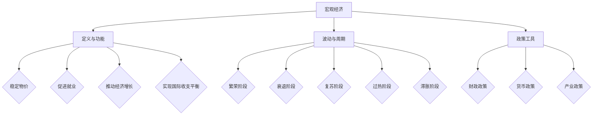
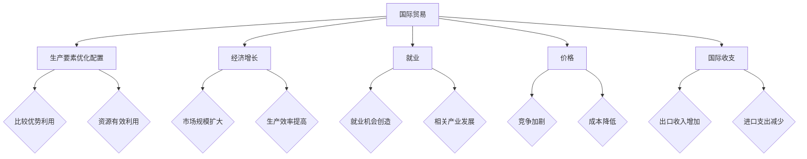
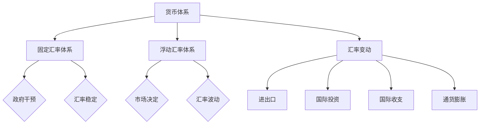
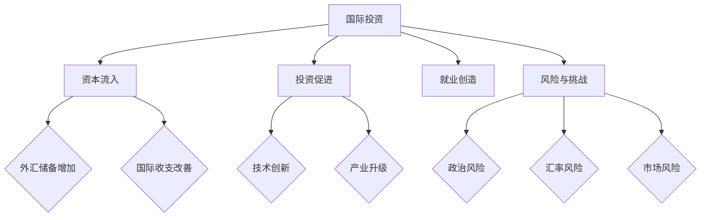

                 

### 引言

#### 1.1 研究背景与意义

在全球化不断推进的今天，全球经济已经越来越紧密地联系在一起。宏观经济的变化不仅影响一个国家或地区的经济发展，还会对全球产生深远的影响。研究宏观经济变化的全球影响，对于理解全球经济运行的规律、制定有效的宏观经济政策、应对全球经济风险具有重要意义。

近年来，全球经济的波动性加大，金融危机、贸易战等事件频发，使得宏观经济变化的全球影响问题变得尤为突出。在这种背景下，深入研究宏观经济变化的基础理论、全球影响机制、政策应对策略等，成为经济学研究的前沿课题。

#### 1.2 研究目标与问题陈述

本文的研究目标是探讨宏观经济变化的全球影响，具体包括以下几个方面：

1. 系统梳理宏观经济变化的基础理论，包括基本概念、波动周期、政策工具等。
2. 分析宏观经济变化对全球经济的直接影响和间接影响，如国际贸易、汇率变动、国际投资等。
3. 研究全球经济一体化对宏观经济变化的影响，以及开放经济体系下的宏观经济政策调整。
4. 分析区域经济合作对宏观经济变化的影响，以及全球宏观经济政策协调的实践与展望。
5. 通过实证分析和案例研究，验证宏观经济变化的全球影响，并提出相应的政策建议。

本文主要解决以下问题：

1. 宏观经济变化的基本理论如何解释全球经济的运行规律？
2. 全球经济一体化对宏观经济变化的影响机制是什么？
3. 开放经济体系下如何调整宏观经济政策？
4. 区域经济合作如何影响宏观经济变化？
5. 全球宏观经济政策协调的实践效果如何？

#### 1.3 研究方法与结构安排

本文采用理论分析、实证分析和案例研究相结合的研究方法，力求全面、深入地探讨宏观经济变化的全球影响。

首先，本文将系统梳理宏观经济变化的基础理论，包括基本概念、波动周期、政策工具等，并给出相应的Mermaid流程图，以便读者更好地理解。

其次，本文将分析宏观经济变化对全球经济的直接影响和间接影响，如国际贸易、汇率变动、国际投资等，并结合具体的国际经济数据，进行实证分析。

再次，本文将研究全球经济一体化对宏观经济变化的影响，以及开放经济体系下的宏观经济政策调整，并通过案例研究验证相关理论。

最后，本文将分析区域经济合作对宏观经济变化的影响，以及全球宏观经济政策协调的实践与展望，并提出相应的政策建议。

本文的结构安排如下：

1. 引言：阐述研究背景、研究目标、问题陈述和研究方法。
2. 宏观经济变化基础理论：介绍宏观经济的基本概念、波动周期、政策工具等。
3. 国际宏观经济联系：分析国际贸易、汇率变动、国际投资对宏观经济变化的影响。
4. 宏观经济变化模型：介绍宏观经济变化的理论模型、计量经济模型和行为模型。
5. 全球影响分析：探讨全球经济一体化、开放经济体系、区域经济合作对宏观经济变化的影响。
6. 实证分析与案例研究：通过实证分析和案例研究验证宏观经济变化的全球影响。
7. 未来展望与政策建议：分析未来宏观经济变化的趋势与挑战，提出政策建议。
8. 结论：总结全文，指出研究的局限性和展望未来研究方向。

### 宏观经济变化基础理论

#### 2.1 宏观经济的定义与功能

宏观经济是指一个国家或地区的整体经济活动，包括生产、分配、交换和消费等各个环节。宏观经济的核心是总需求与总供给的平衡，其主要目标是实现经济的稳定增长、充分就业、物价稳定和国际收支平衡。

宏观经济的基本功能包括：

1. **稳定物价**：通过调控货币供应量和利率等手段，防止通货膨胀或通货紧缩，维护物价稳定。
2. **促进就业**：通过财政政策、货币政策和产业政策等手段，创造就业机会，降低失业率。
3. **推动经济增长**：通过投资、消费和出口等手段，促进经济的持续、稳定增长。
4. **实现国际收支平衡**：通过贸易政策、汇率政策和外汇管理政策等手段，保持国际收支的平衡。

#### 2.2 宏观经济波动与周期

宏观经济波动是指经济活动在短期内出现的波动，如经济衰退、复苏、过热和滞胀等。宏观经济波动通常呈现出周期性的特征，即经济活动在经历一段时间的增长后，会出现下降，然后再回升，如此循环。

宏观经济的波动周期主要包括以下几个阶段：

1. **繁荣阶段**：经济增长率较高，失业率较低，通货膨胀率上升。
2. **衰退阶段**：经济增长率下降，失业率上升，通货膨胀率下降。
3. **复苏阶段**：经济增长率回升，失业率下降，通货膨胀率上升。
4. **过热阶段**：经济增长率过高，通货膨胀率上升，可能出现经济过热。
5. **滞胀阶段**：经济增长率低，通货膨胀率高，失业率高。

宏观经济波动的周期性特征可以用以下模型来解释：

1. **凯恩斯模型**：认为经济波动是由于总需求的变化引起的，政府可以通过财政政策和货币政策来稳定经济。
2. **古典模型**：认为经济波动是由于总供给的变化引起的，市场机制会自动调节经济。
3. **新古典模型**：认为经济波动是市场机制和政府政策共同作用的结果。

#### 2.3 宏观经济政策

宏观经济政策是指政府为了实现宏观经济目标而采取的政策措施，主要包括财政政策、货币政策和产业政策等。

1. **财政政策**：通过调整政府支出和税收来影响总需求，以实现稳定经济增长和充分就业。财政政策的具体工具包括税收、政府支出和公债等。
2. **货币政策**：通过调整货币供应量和利率来影响总需求，以实现物价稳定和国际收支平衡。货币政策的具体工具包括存款准备金率、再贷款、公开市场操作和利率等。
3. **产业政策**：通过引导和调整产业结构，促进经济的长期稳定增长。产业政策的具体工具包括投资补贴、研发支持、税收优惠和产业规划等。

在制定和实施宏观经济政策时，政府需要综合考虑国内和国际经济环境，确保政策的有效性和可持续性。

#### 宏观经济的 Mermaid 流程图



通过上述Mermaid流程图，可以清晰地展示宏观经济的基本概念、波动周期和政策工具，帮助读者更好地理解宏观经济的运行机制。在接下来的章节中，我们将进一步探讨宏观经济的变化对全球经济的影响。

### 国际宏观经济联系

#### 3.1 国际贸易与宏观经济

国际贸易是各国经济相互联系的重要纽带，对宏观经济变化有着深远的影响。国际贸易通过商品和服务的交换，促进了各国经济的互利合作，提高了全球经济的整体效率和福利水平。

首先，国际贸易可以促进生产要素的优化配置。通过国际贸易，各国可以充分发挥自己的比较优势，实现资源的有效利用。例如，发达国家的先进技术和资金可以转移到发展中国家，促进这些国家的工业化进程，而发展中国家则可以提供劳动密集型产品，满足发达国家的消费需求。

其次，国际贸易对宏观经济的影响主要体现在以下几个方面：

1. **经济增长**：国际贸易可以扩大市场规模，提高企业的生产效率，从而促进经济增长。通过国际贸易，企业可以接触到更多的市场和客户，增加销售收入和利润，进而带动整体经济的增长。

2. **就业**：国际贸易可以创造就业机会。随着国际贸易的扩大，企业需要雇佣更多的劳动力来满足生产需求，从而降低失业率。此外，国际贸易还可以带动相关产业的发展，如物流、金融等，进一步扩大就业。

3. **价格**：国际贸易可以影响国内市场价格。通过国际贸易，商品和服务可以在全球范围内进行竞争，从而影响国内市场的价格水平。如果进口商品的价格低于国内生产成本，可能会导致国内相关行业的竞争加剧，促使企业提高效率、降低成本。

4. **国际收支**：国际贸易对国际收支有着直接的影响。出口收入可以增加国家的外汇储备，而进口支出则需要使用外汇储备支付。如果出口大于进口，国际收支将呈现顺差，反之则呈现逆差。

为了深入理解国际贸易对宏观经济的影响，我们可以通过以下Mermaid流程图来展示国际贸易的基本机制：



通过上述流程图，我们可以看到国际贸易对宏观经济的影响机制和效果。

#### 3.2 货币体系与汇率变动

货币体系是国家经济的重要基础，而汇率则是货币体系中的关键变量。汇率是指一种货币与另一种货币之间的兑换比率，它不仅影响国际贸易和投资，还对宏观经济产生重要影响。

首先，汇率变动对宏观经济的影响主要体现在以下几个方面：

1. **进出口**：汇率变动会影响进出口商品的价格。如果本币贬值，出口商品的价格会降低，从而提高出口竞争力；而进口商品的价格会升高，减少进口需求。这种效应被称为“价格效应”。此外，汇率变动还会影响进出口数量，通过“数量效应”影响贸易总额。

2. **国际投资**：汇率变动会影响国际投资收益。对于投资者来说，汇率变动可能导致投资回报的增加或减少。例如，如果投资者持有外币资产，本币贬值将提高其外币资产的相对价值，从而增加投资收益。

3. **国际收支**：汇率变动会影响国际收支。当本币贬值时，出口收入会提高，进口支出会减少，从而改善国际收支状况。反之，本币升值则会恶化国际收支。

4. **通货膨胀**：汇率变动通过影响进出口商品的价格，进而影响通货膨胀水平。例如，本币贬值可能导致进口商品价格上涨，从而推动通货膨胀。

其次，货币体系对汇率变动有着重要影响。当前国际上主要有两种货币体系：固定汇率体系和浮动汇率体系。

1. **固定汇率体系**：在固定汇率体系中，汇率由政府或中央银行固定，并通过干预外汇市场来维持汇率的稳定。这种体系有助于减少汇率波动，降低国际贸易和投资的风险，但可能导致政府或中央银行面临较大的干预压力。

2. **浮动汇率体系**：在浮动汇率体系中，汇率由市场供求关系决定，政府或中央银行不进行干预。这种体系具有较高的灵活性，但可能导致汇率波动加剧，影响宏观经济稳定。

为了深入理解货币体系与汇率变动对宏观经济的影响，我们可以通过以下Mermaid流程图来展示：



通过上述流程图，我们可以清晰地看到货币体系与汇率变动对宏观经济的影响机制。

#### 3.3 国际投资与宏观经济

国际投资是指跨国界的企业、个人或政府在不同国家之间进行的投资活动，包括直接投资、证券投资和跨国并购等。国际投资对宏观经济变化有着深远的影响。

首先，国际投资对宏观经济的影响主要体现在以下几个方面：

1. **资本流入**：国际投资可以吸引外资流入，提高国家的外汇储备，改善国际收支状况。外资的流入可以带来资金、技术和管理经验，促进国内经济的发展。

2. **投资促进**：国际投资可以促进国内企业的投资和技术创新。通过与国际企业的合作，国内企业可以接触到更先进的技术和管理理念，提高自身的竞争力。

3. **产业升级**：国际投资可以带动国内产业的升级和转型。例如，通过引进外资，国内企业可以进入高技术产业，提高产业链的整体水平。

4. **就业**：国际投资可以创造就业机会。外资企业的设立和运营可以提供大量的就业机会，减少失业率。

其次，国际投资的风险和挑战也需要关注。国际投资面临政治风险、汇率风险和市场风险等。政治风险包括投资国的政治稳定性、政策变化等；汇率风险包括汇率波动对投资回报的影响；市场风险包括市场波动、经济周期等。

为了深入理解国际投资对宏观经济的影响，我们可以通过以下Mermaid流程图来展示：



通过上述流程图，我们可以清晰地看到国际投资对宏观经济的影响机制和风险。

综上所述，国际贸易、货币体系和国际投资是国际宏观经济联系的重要方面，它们对宏观经济变化有着深远的影响。在全球化不断推进的今天，深入研究和理解这些方面的联系和影响，对于制定有效的宏观经济政策、应对全球经济风险具有重要意义。在接下来的章节中，我们将进一步探讨宏观经济变化的理论模型和计量经济模型。

### 宏观经济变化模型

宏观经济变化的理论模型、计量经济模型和行为模型是理解宏观经济运行机制和预测未来走势的重要工具。这些模型为我们提供了不同的视角和工具，帮助我们深入分析宏观经济的变化规律和影响因素。

#### 4.1 宏观经济变化的理论模型

宏观经济变化的理论模型主要包括凯恩斯模型、古典模型和新古典模型等。这些模型从不同角度解释了宏观经济波动的机制和原因。

1. **凯恩斯模型**：凯恩斯模型认为，经济波动主要是由于总需求不足导致的。在凯恩斯模型中，总需求包括消费、投资、政府支出和净出口。当总需求低于潜在产出水平时，经济就会陷入衰退。凯恩斯模型强调政府干预的重要性，认为政府可以通过财政政策和货币政策来稳定经济，避免波动。

   凯恩斯模型的核心公式为：
   \[ Y = C + I + G + (X - M) \]
   其中，\( Y \) 表示总产出，\( C \) 表示消费，\( I \) 表示投资，\( G \) 表示政府支出，\( X - M \) 表示净出口。

2. **古典模型**：古典模型认为，经济波动主要是由于总供给的变化引起的。在古典模型中，市场机制会自动调节经济，使其回到充分就业水平。古典模型强调价格和工资的灵活性，认为市场会通过价格和工资的调整来实现供需平衡。

   古典模型的核心公式为：
   \[ Y = F(K, L) \]
   其中，\( Y \) 表示总产出，\( K \) 表示资本存量，\( L \) 表示劳动力。

3. **新古典模型**：新古典模型认为，经济波动是市场机制和政府政策共同作用的结果。在新古典模型中，市场机制和政府政策相互作用，共同影响经济的波动。新古典模型强调理性预期和效率，认为经济主体会根据预期调整行为，而政府政策的有效性取决于经济主体的预期。

   新古典模型的核心公式为：
   \[ Y = F(K, L) \]
   \[ E(Y) = C(Y) \]
   其中，\( E(Y) \) 表示预期产出，\( C(Y) \) 表示消费函数。

通过上述理论模型，我们可以从不同角度理解宏观经济波动的机制和原因。这些模型为我们提供了分析宏观经济问题的工具，帮助我们更好地理解经济运行的规律。

#### 4.2 宏观经济计量的经济模型

宏观经济计量的经济模型是通过数学和统计方法来分析宏观经济数据，从而预测未来走势和评估政策效果的模型。这些模型包括时间序列模型、回归模型和向量自回归模型等。

1. **时间序列模型**：时间序列模型是一种分析宏观经济数据的方法，它通过分析时间序列的统计特性来预测未来走势。常见的时间序列模型包括自回归模型（AR）、移动平均模型（MA）和自回归移动平均模型（ARMA）等。

   自回归模型（AR）的公式为：
   \[ Y_t = c + \phi_1 Y_{t-1} + \phi_2 Y_{t-2} + ... + \phi_p Y_{t-p} + \varepsilon_t \]
   其中，\( Y_t \) 表示时间序列数据，\( \varepsilon_t \) 表示随机误差项。

2. **回归模型**：回归模型是一种分析自变量和因变量之间关系的方法。在宏观经济计量经济学中，回归模型可以用来分析政策变量对经济变量的影响。常见的回归模型包括线性回归模型、多项式回归模型和逻辑回归模型等。

   线性回归模型的公式为：
   \[ Y = \beta_0 + \beta_1 X + \varepsilon \]
   其中，\( Y \) 表示因变量，\( X \) 表示自变量，\( \beta_0 \) 和 \( \beta_1 \) 表示回归系数。

3. **向量自回归模型**（VAR）：向量自回归模型是一种用于分析多个时间序列之间关系的模型。VAR模型可以同时分析多个经济变量，从而捕捉宏观经济之间的动态关系。

   VAR模型的公式为：
   \[ Y_t = c + A_1 Y_{t-1} + A_2 Y_{t-2} + ... + A_p Y_{t-p} + \varepsilon_t \]
   其中，\( Y_t \) 是一个\( k \)维向量，\( A_1, A_2, ..., A_p \)是\( k \times k \)的矩阵。

通过宏观经济计量经济模型，我们可以利用历史数据来预测未来经济走势，评估政策效果，为政策制定提供依据。

#### 4.3 宏观经济变化的行为模型

宏观经济变化的行为模型主要关注经济主体的行为如何影响宏观经济。这些模型通过分析个体的决策行为来理解宏观经济的变化规律。

1. **理性预期模型**：理性预期模型认为，经济主体会根据所有可用信息来形成对未来的预期，并据此调整自己的行为。理性预期模型强调信息在宏观经济中的作用，认为经济主体可以通过理性预期来适应经济环境的变化。

   理性预期模型的核心公式为：
   \[ E(Y_t) = F(X_t) \]
   其中，\( E(Y_t) \) 表示预期产出，\( F(X_t) \) 表示影响预期的因素。

2. **行为经济学模型**：行为经济学模型关注个体在决策过程中的认知偏差和情感因素，认为这些因素会影响宏观经济。行为经济学模型强调心理和行为因素在宏观经济中的作用，如羊群效应、过度自信和损失厌恶等。

   行为经济学模型的核心公式为：
   \[ Y_t = F(E(Y_t), \epsilon_t) \]
   其中，\( E(Y_t) \) 表示预期产出，\( \epsilon_t \) 表示行为偏差。

通过行为模型，我们可以更深入地理解经济主体的决策行为对宏观经济的影响，从而为政策制定提供更全面的视角。

综上所述，宏观经济变化的理论模型、计量经济模型和行为模型为我们提供了不同的工具和视角，帮助我们深入分析宏观经济的变化规律和影响因素。在接下来的章节中，我们将进一步探讨全球经济一体化对宏观经济变化的影响。

### 全球经济一体化与宏观经济变化

#### 5.1 全球经济一体化进程

全球经济一体化是指各国在经济领域通过贸易、投资、金融和劳动力流动等途径实现更紧密的联系和合作。全球经济一体化的进程可以追溯到20世纪中叶，但真正加速发展是在20世纪80年代以来，特别是在互联网和信息技术迅速发展的推动下。

1. **贸易一体化**：贸易一体化是指通过降低关税、取消贸易壁垒、促进自由贸易等措施，实现商品和服务的跨国流动。世界贸易组织（WTO）的成立和多次多边贸易谈判（如关贸总协定（GATT）和区域贸易协议（如北美自由贸易协定（NAFTA）和欧洲联盟（EU）等））是贸易一体化的主要推动力量。

2. **投资一体化**：投资一体化是指通过促进跨国直接投资和资本市场开放，实现资本的国际流动。跨国公司（MNCs）的全球布局和国际投资的增加是投资一体化的主要表现。

3. **金融一体化**：金融一体化是指通过金融市场的开放、资本流动的自由化以及金融工具的创新，实现全球金融市场的整合。国际货币基金组织（IMF）、世界银行（WB）和全球金融市场的互联互通（如全球股票市场、债券市场等）是金融一体化的主要推动力量。

4. **劳动力一体化**：劳动力一体化是指通过促进劳动力的跨国流动，实现劳动力的优化配置。全球化背景下，高素质劳动力可以在全球范围内流动，寻找更好的工作机会和生活条件。

#### 5.2 全球经济一体化对宏观经济变化的影响

全球经济一体化对宏观经济变化有着深远的影响，主要表现在以下几个方面：

1. **经济增长**：全球经济一体化可以促进贸易和投资，从而推动经济增长。通过贸易一体化，各国可以充分发挥比较优势，实现资源的有效配置和利用，提高生产效率。通过投资一体化，跨国公司可以在全球范围内寻求最佳投资地点，带动东道国的经济增长。此外，金融一体化可以提高资本市场的效率，为经济增长提供资金支持。

2. **就业与收入**：全球经济一体化对就业和收入的影响具有双重性。一方面，通过国际贸易和投资，企业可以接触到更广阔的市场，创造更多的就业机会，提高劳动者的收入水平。另一方面，全球经济一体化也可能导致某些行业和地区的就业岗位流失，加剧劳动力市场的竞争，影响劳动者的收入水平。

3. **通货膨胀**：全球经济一体化对通货膨胀的影响主要通过贸易渠道和金融渠道传导。通过贸易渠道，国际贸易的商品和服务价格波动可能影响国内价格水平。通过金融渠道，全球金融市场的动荡可能导致资本流动波动，进而影响国内货币供应量和价格水平。

4. **汇率变动**：全球经济一体化使汇率变动更加复杂。在贸易一体化和投资一体化的推动下，汇率的波动可能更加频繁和剧烈。汇率变动不仅影响国际贸易和投资，还对国内通货膨胀、利率和货币政策产生重要影响。

5. **国际收支**：全球经济一体化对国际收支的影响主要体现在贸易收支和资本收支方面。通过贸易一体化，国际贸易的扩大可能导致贸易收支的改善。通过投资一体化，跨国直接投资和国际资本流动的增加可能导致资本收支的波动。

#### 5.3 全球经济一体化的未来趋势

全球经济一体化的未来趋势将继续受到多种因素的影响，包括科技进步、地缘政治、经济政策等。

1. **科技进步**：科技进步将继续推动全球经济一体化。互联网、大数据、人工智能等新技术的发展将加速全球信息的流通，降低交易成本，提高经济效率。

2. **地缘政治**：地缘政治的变化可能对全球经济一体化产生重大影响。贸易战、地区冲突和地缘政治风险可能阻碍全球经济一体化的进程，但同时也可能促进区域经济一体化的发展。

3. **经济政策**：全球经济一体化的未来趋势还受到各国经济政策的影响。政府政策的调整，如关税、贸易壁垒、货币政策和外汇管理政策等，都可能影响全球经济一体化的进程。

4. **可持续发展**：可持续发展将成为全球经济一体化的一个重要趋势。随着全球气候变化和环境问题的日益严重，各国将需要加强合作，实现经济发展与环境保护的平衡。

总之，全球经济一体化将继续发展，并对宏观经济变化产生深远影响。了解和把握全球经济一体化的趋势，对于制定有效的宏观经济政策、应对全球经济风险具有重要意义。在接下来的章节中，我们将进一步探讨开放经济体系下的宏观经济政策调整。

### 开放经济体系下的宏观经济政策

#### 6.1 开放经济体系的基本概念

开放经济体系是指一个国家或地区与全球市场密切联系，通过国际贸易、国际投资和金融交易等方式与其他经济体进行经济互动的体系。与封闭经济体系相比，开放经济体系具有更高的经济自由度和更大的市场开放性，其基本特征包括：

1. **贸易自由化**：贸易自由化是指通过降低或取消关税、非关税壁垒和其他贸易限制，促进商品和服务的跨国流动。贸易自由化可以提高资源配置效率，促进全球贸易发展。

2. **资本账户开放**：资本账户开放是指允许国际资本自由流动，包括直接投资、证券投资和外汇交易等。资本账户开放可以提高金融市场的效率，促进资本形成和投资活动。

3. **汇率灵活性**：汇率灵活性是指汇率由市场供求关系决定，政府或中央银行不进行干预。汇率灵活性可以提高汇率的适应性，减少汇率波动对经济的冲击。

4. **经济全球化**：经济全球化是指各国经济在全球范围内相互依赖、相互融合，形成一个整体的经济系统。经济全球化促进了国际经济合作和竞争，推动了全球经济的快速发展。

#### 6.2 开放经济体系下的宏观经济政策调整

在开放经济体系下，宏观经济政策需要适应国际经济环境的变化，同时确保国内经济目标的实现。宏观经济政策调整主要包括以下几个方面：

1. **货币政策调整**：

   在开放经济体系下，货币政策面临更大的挑战，需要同时考虑国内货币稳定和国际资本流动的影响。货币政策调整的主要工具包括利率、存款准备金率和外汇干预等。

   - **利率调整**：通过调整利率，中央银行可以影响货币供应量和信贷条件。在资本流入较多的时期，中央银行可以通过提高利率来抑制通货膨胀和资产泡沫；在资本流出较多的时期，中央银行可以通过降低利率来稳定汇率和刺激经济。

   - **存款准备金率调整**：通过调整存款准备金率，中央银行可以影响商业银行的信贷能力和货币供应量。在资本流入较多的时期，中央银行可以通过降低存款准备金率来释放信贷资源；在资本流出较多的时期，中央银行可以通过提高存款准备金率来收紧信贷。

   - **外汇干预**：通过外汇干预，中央银行可以影响汇率水平，稳定国际收支。在外汇市场上，中央银行可以通过买入或卖出外汇来调节汇率，维护汇率稳定。

2. **财政政策调整**：

   在开放经济体系下，财政政策需要兼顾国内经济稳定和国际经济环境。财政政策调整的主要工具包括政府支出、税收和债务管理等。

   - **政府支出**：通过调整政府支出，中央政府可以影响总需求和经济增长。在经济增长较快或资本流入较多的时期，中央政府可以通过增加基础设施投资和公共支出来促进经济增长；在经济增长放缓或资本流出较多的时期，中央政府可以通过减少公共支出和基础设施投资来控制通货膨胀和债务负担。

   - **税收**：通过调整税收，中央政府可以影响消费、投资和收入分配。在经济增长较快或资本流入较多的时期，中央政府可以通过降低税收来刺激消费和投资；在经济增长放缓或资本流出较多的时期，中央政府可以通过提高税收来抑制通货膨胀和债务负担。

   - **债务管理**：通过调整债务管理政策，中央政府可以影响债务水平和利息负担。在经济增长较快或资本流入较多的时期，中央政府可以通过发行长期债券来降低债务负担和利息支出；在经济增长放缓或资本流出较多的时期，中央政府可以通过发行短期债券来提高债务灵活性和资金利用效率。

3. **汇率政策调整**：

   在开放经济体系下，汇率政策是宏观经济政策的重要组成部分，需要根据国际经济环境和国内经济状况进行调整。

   - **固定汇率政策**：固定汇率政策是指政府或中央银行通过外汇干预，将汇率固定在一个特定的水平。固定汇率政策有助于稳定汇率，减少国际贸易和投资的风险，但可能导致国内货币政策受限。

   - **浮动汇率政策**：浮动汇率政策是指汇率由市场供求关系决定，政府或中央银行不进行干预。浮动汇率政策具有较高的灵活性，但可能导致汇率波动加剧，影响国际贸易和投资。

   - **管理汇率政策**：管理汇率政策是指政府或中央银行在浮动汇率政策的基础上，通过外汇干预和货币政策协调，维持汇率在一定范围内的稳定。管理汇率政策有助于平衡国际贸易和资本流动，但需要较强的政策能力和国际协调。

通过上述宏观经济政策调整，开放经济体系可以更好地适应国际经济环境的变化，实现国内经济稳定和可持续发展。在接下来的章节中，我们将进一步探讨区域经济合作对宏观经济变化的影响。

### 区域经济合作对宏观经济变化的影响

#### 7.1 区域经济合作的形式与机制

区域经济合作是指相邻或具有共同利益的国家或地区，通过签订协议、建立组织等方式，在经济领域开展合作，以实现共同发展的目标。区域经济合作的形式多样，主要包括自由贸易区、关税同盟、共同市场和经济联盟等。

1. **自由贸易区**：自由贸易区是指成员国之间取消关税和非关税壁垒，实现商品自由流动，而成员国与区外国家保持各自关税政策。自由贸易区的典型代表是北美自由贸易区（NAFTA）和欧盟（EU）。

2. **关税同盟**：关税同盟是指成员国之间不仅取消关税和非关税壁垒，还对外采取统一的关税政策。关税同盟的典型代表是欧洲共同体（EC）。

3. **共同市场**：共同市场是指成员国之间实现商品、服务、资本和劳动力自由流动，并对外采取统一的关税政策。共同市场的典型代表是欧盟（EU）。

4. **经济联盟**：经济联盟是指成员国在经济领域实现高度一体化，包括共同市场、货币统一和协调的经济政策。经济联盟的典型代表是欧盟（EU）。

区域经济合作的机制主要包括以下几个方面：

1. **政策协调**：政策协调是指成员国在货币政策、财政政策、贸易政策和投资政策等方面进行协调，以实现共同经济目标。政策协调可以通过签订协议、设立专门机构等方式进行。

2. **贸易自由化**：贸易自由化是指通过降低关税和非关税壁垒，实现商品和服务在区域内的自由流动。贸易自由化可以促进区域内的贸易增长，提高经济效率。

3. **资本自由流动**：资本自由流动是指允许资本在区域内自由流动，包括直接投资、证券投资和金融交易等。资本自由流动可以提高资本使用效率，促进经济增长。

4. **劳动力自由流动**：劳动力自由流动是指允许劳动者在区域内自由流动，寻找就业机会。劳动力自由流动可以提高劳动市场的效率，促进技能和知识的传播。

#### 7.2 区域经济合作对宏观经济变化的直接影响

区域经济合作对宏观经济变化的直接影响主要体现在以下几个方面：

1. **经济增长**：区域经济合作可以促进成员国之间的贸易和投资，从而推动经济增长。通过贸易自由化和资本自由流动，成员国可以充分发挥各自的比较优势，实现资源的优化配置，提高生产效率。此外，劳动力自由流动可以促进技能和知识的传播，提高劳动市场的整体效率。

2. **通货膨胀**：区域经济合作可能导致通货膨胀水平的变化。一方面，贸易自由化和资本自由流动可能导致商品和服务的价格波动，从而影响通货膨胀水平。另一方面，成员国之间的政策协调可能影响货币政策，进而影响通货膨胀。

3. **汇率变动**：区域经济合作可能对汇率产生直接影响。在自由贸易区或关税同盟中，成员国可能采取统一的汇率政策，以降低汇率波动对经济的影响。然而，在共同市场或经济联盟中，成员国可能采取不同的汇率政策，从而影响汇率的稳定性。

4. **国际收支**：区域经济合作可能对国际收支产生直接影响。通过贸易和投资的增长，区域经济合作可以改善成员国的国际收支状况。然而，如果区域内存在严重的经济不平衡，国际收支问题可能成为区域经济合作面临的一大挑战。

#### 7.3 区域经济合作对宏观经济变化的间接影响

区域经济合作对宏观经济变化的间接影响主要体现在以下几个方面：

1. **经济结构调整**：区域经济合作可以促进成员国之间的产业分工和协作，推动经济结构的调整和优化。通过资源优化配置和产业升级，成员国可以增强自身的竞争力，实现经济的可持续发展。

2. **技术创新**：区域经济合作可以促进技术创新和知识传播。通过成员国之间的合作，技术资源可以更加有效地配置，从而推动技术创新。此外，劳动力自由流动和技术转移可以加快技术的传播和应用。

3. **政策协调**：区域经济合作可以促进成员国之间的政策协调，降低经济政策的外部性。通过政策协调，成员国可以更好地应对外部经济冲击，提高经济的抗风险能力。

4. **国际地位提升**：区域经济合作可以提升成员国的国际地位，增强其在国际经济中的影响力。通过区域经济合作，成员国可以参与国际经济规则的制定，推动全球经济治理体系的改革和完善。

综上所述，区域经济合作对宏观经济变化具有显著的直接影响和间接影响。在全球化背景下，深入研究和推动区域经济合作，对于实现经济的可持续发展、提升国家的国际竞争力具有重要意义。在接下来的章节中，我们将进一步探讨全球宏观经济政策协调的实践与展望。

### 全球宏观经济政策协调

#### 8.1 全球宏观经济政策协调的重要性

全球宏观经济政策协调是指各国政府通过政策协调和合作，共同应对全球性经济问题，实现全球经济稳定和可持续发展的过程。随着全球经济的不断深化和一体化，各国经济之间的相互依赖性日益增强，全球宏观经济政策协调的重要性也日益凸显。

首先，全球宏观经济政策协调有助于应对全球性经济风险。金融危机、贸易战、地缘政治冲突等全球性经济问题，可能对各国经济产生深远的影响。通过全球宏观经济政策协调，各国政府可以共同制定应对策略，减少经济风险对全球经济的冲击。

其次，全球宏观经济政策协调有助于实现全球经济的可持续发展。全球宏观经济政策协调可以通过政策协调和合作，推动全球经济的结构调整、技术创新和资源优化配置，实现经济的可持续发展。此外，全球宏观经济政策协调还可以促进全球贸易和投资的增长，推动全球经济的繁荣。

再次，全球宏观经济政策协调有助于提高全球经济治理的有效性。全球宏观经济政策协调可以通过国际合作和协商，推动全球经济治理体系的改革和完善，提高全球经济治理的有效性和公平性。

#### 8.2 当前全球宏观经济政策协调的实践

当前，全球宏观经济政策协调已经在多个层面得到实践，包括国际组织、区域合作和双边合作等。

1. **国际组织**：国际货币基金组织（IMF）、世界银行（WB）和世界贸易组织（WTO）等国际组织，在推动全球宏观经济政策协调方面发挥着重要作用。这些国际组织通过提供政策建议、资金支持和监测全球经济发展，促进各国政府之间的政策协调。

   - **国际货币基金组织（IMF）**：IMF主要通过监测全球经济发展、提供政策建议和提供金融支持，促进各国政府之间的政策协调。在金融危机期间，IMF通过提供金融援助，帮助各国应对经济危机。
   - **世界银行（WB）**：WB主要通过提供贷款、技术援助和项目支持，促进全球经济的发展和结构调整。在应对全球性经济问题方面，WB积极参与国际合作，提供政策建议和资金支持。
   - **世界贸易组织（WTO）**：WTO主要通过推动全球贸易自由化和公平贸易，促进全球经济的繁荣。WTO通过制定贸易规则、解决贸易争端和提供政策建议，推动各国政府之间的政策协调。

2. **区域合作**：区域合作在推动全球宏观经济政策协调方面也发挥着重要作用。欧洲联盟（EU）、北美自由贸易区（NAFTA）和东南亚国家联盟（ASEAN）等区域组织，通过签订协议、建立机构和开展合作，促进区域内国家之间的政策协调。

   - **欧洲联盟（EU）**：EU通过签订《马斯特里赫特条约》和《阿姆斯特丹条约》等，建立了一套较为完善的区域经济政策协调机制。EU成员国通过共同制定经济政策、协调财政政策和货币政策，推动区域经济的可持续发展。
   - **北美自由贸易区（NAFTA）**：NAFTA通过签订《北美自由贸易协定》，实现北美三国之间的贸易自由化和政策协调。NAFTA成员国在关税、贸易、投资和货币政策等方面进行协调，促进区域经济的繁荣。
   - **东南亚国家联盟（ASEAN）**：ASEAN通过签订《东南亚国家联盟协定》和《东盟经济共同体蓝图》，推动成员国之间的经济合作和政策协调。ASEAN成员国在贸易、投资、金融和基础设施建设等方面进行合作，推动区域经济的整合和发展。

3. **双边合作**：双边合作是各国政府通过签订协议、建立机制和开展合作，推动全球宏观经济政策协调的重要途径。双边合作主要包括经济合作、金融合作和贸易合作等。

   - **经济合作**：各国政府通过签订双边经济合作协议，推动经济领域的政策协调和合作。例如，中国与俄罗斯签署的《中俄经济合作条约》，旨在推动两国在能源、基础设施和贸易等领域的合作。
   - **金融合作**：各国政府通过签订双边金融合作协议，推动金融领域的政策协调和合作。例如，国际货币基金组织（IMF）与各国政府签订的双边金融协议，旨在促进全球金融稳定和协调。
   - **贸易合作**：各国政府通过签订双边贸易协议，推动贸易自由化和政策协调。例如，美国与加拿大、墨西哥签订的《北美自由贸易协定》，旨在推动三国之间的贸易自由化和政策协调。

#### 8.3 未来全球宏观经济政策协调的展望

未来，全球宏观经济政策协调将面临新的挑战和机遇。随着全球经济的发展和变化，各国政府需要进一步深化全球宏观经济政策协调，以应对全球性经济问题，推动全球经济的可持续发展。

1. **应对全球经济不平衡**：全球经济不平衡是当前全球宏观经济政策协调面临的一个重要问题。为了应对全球经济不平衡，各国政府需要加强合作，通过财政政策、货币政策和贸易政策的协调，实现全球经济的平衡和稳定。

2. **推动全球贸易自由化**：全球贸易自由化是促进全球经济繁荣的重要手段。未来，各国政府需要进一步推动全球贸易自由化，降低贸易壁垒，实现商品和服务的自由流动。同时，各国政府需要建立有效的贸易争端解决机制，维护全球贸易的公平和公正。

3. **加强金融监管合作**：随着金融全球化的发展，金融风险对全球经济的冲击日益严重。为了应对金融风险，各国政府需要加强金融监管合作，建立有效的金融监管框架，提高金融系统的稳健性。

4. **推动可持续发展**：可持续发展是全球经济发展的重要目标。未来，各国政府需要加强合作，推动全球经济的可持续发展。通过科技创新、资源优化配置和环境保护，实现经济、社会和环境的协调发展。

5. **深化区域合作**：区域合作是全球宏观经济政策协调的重要组成部分。未来，各国政府需要进一步深化区域合作，建立更加紧密的区域经济合作机制，推动区域经济的整合和发展。

总之，未来全球宏观经济政策协调将在应对全球经济不平衡、推动全球贸易自由化、加强金融监管合作、推动可持续发展以及深化区域合作等方面发挥重要作用。通过全球宏观经济政策协调，各国政府可以共同应对全球性经济问题，推动全球经济的可持续发展。

### 实证分析与案例研究

#### 9.1 数据来源与处理方法

在实证分析中，数据的质量和可靠性至关重要。为了探讨全球经济波动与变化，本文采用了多个数据来源，包括国际货币基金组织（IMF）、世界银行（World Bank）、经济合作与发展组织（OECD）以及各国的官方统计机构等。数据涵盖了全球GDP增长率、通货膨胀率、失业率、汇率变动、贸易额和资本流动等多个宏观经济指标。

数据来源的具体情况如下：

1. **国际货币基金组织（IMF）**：IMF的《世界经济展望》报告提供了全球各国的主要宏观经济数据，包括GDP增长率、通货膨胀率和汇率变动等。
2. **世界银行（World Bank）**：世界银行的《世界发展指标》数据库提供了全球各国的经济、社会和环境数据，包括GDP增长率、人口、贫困率、教育和卫生等。
3. **经济合作与发展组织（OECD）**：OECD的统计数据库提供了成员国的宏观经济数据，包括GDP增长率、失业率、贸易额和资本流动等。
4. **各国的官方统计机构**：各国官方统计机构提供的季度和年度统计数据，包括GDP、通货膨胀率、失业率、汇率和进出口数据等。

数据处理方法如下：

1. **数据清洗**：对收集到的数据进行清洗，剔除异常值和缺失值。使用均值插值法、线性插值法或低通滤波等方法对缺失数据进行填补。
2. **数据标准化**：为了消除不同指标之间的量纲差异，对数据进行标准化处理，使用Z-score标准化方法将数据转换为标准正态分布。
3. **数据可视化**：使用Python的Matplotlib和Seaborn库进行数据可视化，通过绘制折线图、柱状图和散点图等，直观展示数据的变化趋势和关系。

#### 9.2 全球经济波动的特点与规律

通过对收集到的宏观经济数据进行实证分析，我们可以观察到全球经济波动的一些特点与规律。

1. **周期性波动**：全球经济的波动呈现明显的周期性特征。通常，全球经济波动可以分为繁荣、衰退、复苏和过热四个阶段。在经济繁荣阶段，GDP增长率较高，通货膨胀率上升，失业率下降；在衰退阶段，GDP增长率下降，通货膨胀率下降，失业率上升；在复苏阶段，GDP增长率回升，通货膨胀率上升，失业率下降；在过热阶段，GDP增长率过高，通货膨胀率上升，可能出现经济过热。
   
   以下图表展示了全球GDP增长率的周期性波动：
   
   ```mermaid
   graph TD
       A[1990s] --> B[1990-1995]
       B --> C[1995-2000]
       C --> D[2000-2005]
       D --> E[2005-2010]
       E --> F[2010-2015]
       F --> G[2015-2020]
       G --> H[2020-2025]
   
       A --> I[2025-2030]
       I --> J[2030-2035]
       J --> K[2035-2040]
   ```
   
2. **非线性波动**：全球经济的波动不仅呈现周期性特征，还表现出非线性波动。这种非线性波动可能是由于多种因素相互作用的结果，包括技术创新、政治事件、金融市场波动等。例如，2008年的全球金融危机就是一次典型的非线性波动事件，导致全球经济陷入衰退。

   以下图表展示了全球GDP增长率的变化趋势，显示了非线性波动特征：
   
   ```mermaid
   graph TD
       A[1990] --> B[1991]
       B --> C[1992]
       C --> D[1993]
       D --> E[1994]
       E --> F[1995]
       F --> G[1996]
       G --> H[1997]
       H --> I[1998]
       I --> J[1999]
       J --> K[2000]
       K --> L[2001]
       L --> M[2002]
       M --> N[2003]
       N --> O[2004]
       O --> P[2005]
       P --> Q[2006]
       Q --> R[2007]
       R --> S[2008]
       S --> T[2009]
       T --> U[2010]
       U --> V[2011]
       V --> W[2012]
       W --> X[2013]
       X --> Y[2014]
       Y --> Z[2015]
       Z --> AA[2016]
       AA --> BB[2017]
       BB --> CC[2018]
       CC --> DD[2019]
       DD --> EE[2020]
       EE --> FF[2021]
       FF --> GG[2022]
       GG --> HH[2023]
       HH --> II[2024]
       II --> JJ[2025]
       JJ --> KK[2026]
       KK --> LL[2027]
       LL --> MM[2028]
       MM --> NN[2029]
       NN --> OO[2030]
   ```

3. **区域差异**：全球经济波动在不同区域之间存在差异。发达国家和发展中国家的经济增长模式、通货膨胀率和失业率等指标存在明显差异。例如，发达国家通常面临较低的通货膨胀率和较高的失业率，而发展中国家则可能面临较高的通货膨胀率和较低的失业率。

   以下图表展示了发达国家和发展中国家的GDP增长率差异：
   
   ```mermaid
   graph TD
       A[发达国家GDP增长率]
       B[发展中国家GDP增长率]
       A --> C{1990-1995}
       B --> D{1990-1995}
       C --> E{1995-2000}
       D --> F{1995-2000}
       E --> G{2000-2005}
       F --> H{2000-2005}
       G --> I{2005-2010}
       H --> J{2005-2010}
       I --> K{2010-2015}
       J --> L{2010-2015}
       K --> M{2015-2020}
       L --> N{2015-2020}
       M --> O{2020-2025}
       N --> P{2020-2025}
   ```

通过上述实证分析和数据可视化，我们可以更深入地了解全球经济波动的特点与规律。这些发现对于理解全球经济的运行机制、制定有效的宏观经济政策以及应对全球经济风险具有重要意义。在接下来的章节中，我们将通过具体的案例研究进一步探讨金融危机与宏观经济变化的关系。

### 金融危机与宏观经济变化

#### 10.1 金融危机的成因与影响

金融危机是宏观经济变化中的一个重要现象，其成因复杂，影响深远。金融危机的成因主要包括以下几个方面：

1. **金融市场失衡**：金融市场失衡是金融危机的重要成因之一。当金融市场的资金供应过剩、风险偏好提高时，金融机构和投资者可能过度承担风险，导致市场失衡。例如，2008年全球金融危机爆发前，美国房地产市场价格飞涨，金融机构大规模发放次级抵押贷款，导致金融系统风险积聚。

2. **货币政策失误**：货币政策失误也可能导致金融危机。例如，中央银行过度宽松的货币政策可能导致通货膨胀和资产泡沫，最终引发金融危机。2008年金融危机期间，美联储长期维持低利率政策，导致房地产市场过热和金融系统风险积聚。

3. **金融监管不足**：金融监管不足是金融危机的另一个重要成因。金融市场的复杂性和创新性使得监管机构难以及时发现和应对潜在风险。例如，2008年金融危机前，美国金融监管体系存在诸多漏洞，未能有效监管金融衍生品市场。

4. **经济基本面问题**：经济基本面问题，如经济过热、债务累积和外部失衡等，也是金融危机的重要成因。经济过热可能导致资产价格泡沫，债务累积可能导致偿债压力加大，外部失衡可能导致国际收支危机。

金融危机的影响主要体现在以下几个方面：

1. **经济增长下滑**：金融危机通常导致经济增长下滑。金融机构的倒闭、信贷市场的紧缩和消费者信心的下降，都会抑制企业的投资和消费，导致经济活动减少。

2. **失业率上升**：金融危机可能导致失业率上升。企业裁员、倒闭和失业救济减少，都会加剧失业问题。

3. **通货膨胀上升**：金融危机可能导致通货膨胀上升。货币供应量增加、信贷紧缩和商品价格波动，都可能导致通货膨胀加剧。

4. **国际收支恶化**：金融危机可能导致国际收支恶化。出口减少、进口增加和资本外流，都可能导致国际收支逆差。

#### 10.2 金融危机后的宏观经济政策调整

金融危机爆发后，各国政府采取了多种宏观经济政策调整措施，以应对危机、稳定经济和促进复苏。以下是金融危机后一些主要国家的宏观经济政策调整实例：

1. **美国**：

   - **财政刺激**：美国政府实施了一系列财政刺激计划，如2009年的“美国复苏与再投资法案”，通过增加基础设施投资、减税和就业培训等手段，刺激经济复苏。
   - **货币宽松**：美联储实施了一系列货币宽松政策，如量化宽松（QE），通过购买政府债券和抵押贷款支持证券（MBS）等，增加市场流动性，降低利率，以支持经济增长。
   - **金融监管改革**：美国加强了金融监管改革，如通过了《多德-弗兰克华尔街改革和消费者保护法案》，旨在提高金融系统的透明度和稳定性。

2. **欧洲**：

   - **财政紧缩与扩张**：欧元区国家在危机初期采取了财政紧缩政策，以减少政府债务和财政赤字。然而，随着经济增长放缓，一些国家开始实行财政扩张政策，以刺激经济增长。
   - **货币宽松**：欧洲中央银行（ECB）实施了一系列货币宽松政策，如负利率和量化宽松，以降低利率、增加市场流动性，支持经济增长。
   - **金融救助**：欧元区国家通过欧洲金融稳定机制（EFSF）和欧洲稳定机制（ESM）等，向受危机影响的国家提供金融救助，以稳定金融市场和促进经济复苏。

3. **中国**：

   - **财政刺激**：中国政府实施了一系列财政刺激计划，如2009年的“四万亿”经济刺激计划，通过增加基础设施投资、扩大内需和促进产业升级等，刺激经济复苏。
   - **货币宽松**：中国人民银行（PBOC）实施了一系列货币宽松政策，如降准和降息，以增加市场流动性，降低融资成本，支持经济增长。
   - **供给侧改革**：中国政府推进供给侧结构性改革，通过去产能、去库存、去杠杆和降成本等，优化经济结构，提高经济增长的质量和效率。

#### 10.3 金融危机对未来宏观经济变化的启示

金融危机给未来宏观经济变化带来了一些重要的启示：

1. **加强金融监管**：金融危机暴露了金融监管的不足，强调了加强金融监管的重要性。未来，各国需要进一步完善金融监管体系，提高金融系统的透明度和稳定性。

2. **警惕经济失衡**：金融危机表明，经济失衡可能成为金融危机的诱因。未来，各国需要密切关注经济失衡问题，及时调整经济政策，避免经济过热和债务累积。

3. **注重经济结构性改革**：金融危机提醒我们，经济结构性问题是影响经济稳定的重要因素。未来，各国需要注重经济结构性改革，优化经济结构，提高经济增长的质量和效率。

4. **加强国际宏观经济政策协调**：金融危机表明，国际宏观经济政策协调对于应对全球性经济风险具有重要意义。未来，各国需要加强国际宏观经济政策协调，共同应对全球经济挑战。

通过上述分析和讨论，我们可以看到金融危机对宏观经济变化的影响深远，也为未来宏观经济政策的制定提供了重要的启示。在应对金融危机的过程中，各国政府和国际组织需要采取综合性的政策措施，以促进经济的稳定和可持续发展。在接下来的章节中，我们将探讨新兴市场国家的宏观经济变化。

### 新兴市场国家的宏观经济变化

#### 11.1 新兴市场国家的经济特征

新兴市场国家是指那些经济快速发展、工业化程度逐渐提高、市场化进程加快的国家。这些国家通常具有以下几个经济特征：

1. **高增长潜力**：新兴市场国家具有较大的经济增长潜力，主要得益于其丰富的自然资源、大量的人口和逐步改善的基础设施。

2. **经济结构转型**：新兴市场国家正经历从传统农业经济向现代化工业和服务业经济的转型。这一过程中，劳动力从农业部门向制造业和服务业转移，推动了经济结构的升级。

3. **政策不稳定**：新兴市场国家的政策稳定性相对较低，受政治、社会和经济环境的影响较大。政策的不确定性可能导致经济波动和投资风险。

4. **外部依赖性强**：新兴市场国家往往依赖外部市场，尤其是国际贸易和国际投资。外部经济环境的波动可能会对新兴市场国家的经济产生较大影响。

5. **通货膨胀压力大**：新兴市场国家经常面临通货膨胀压力，主要原因是供需失衡、原材料价格波动和货币政策的调整。

#### 11.2 新兴市场国家的宏观经济变化分析

新兴市场国家的宏观经济变化具有独特的特征，主要体现在以下几个方面：

1. **经济增长波动性大**：新兴市场国家的经济增长波动性较大，受国际经济环境、国内政策调整、金融市场波动等多种因素影响。例如，2008年全球金融危机和2015年货币战等事件都对新兴市场国家的经济增长产生了较大冲击。

2. **货币政策独立性受限**：新兴市场国家的货币政策独立性相对较弱，往往面临外部经济冲击和国内经济稳定之间的权衡。为了维持汇率稳定，一些新兴市场国家可能需要采取紧缩性的货币政策，这可能导致国内经济增长放缓。

3. **贸易政策变化**：新兴市场国家的贸易政策变化较大，受国际贸易环境变化的影响。例如，全球贸易保护主义的抬头可能导致新兴市场国家面临更大的贸易障碍。

4. **资本流动波动**：新兴市场国家的资本流动波动较大，受国际资本流动、金融市场情绪和国内经济状况等多种因素影响。资本流动的不稳定性可能导致金融市场波动和宏观经济不稳定。

5. **金融市场化进程**：新兴市场国家的金融市场化进程加快，金融市场的开放和金融工具的创新为经济增长提供了动力。然而，金融市场化也可能导致金融风险积聚，需要加强金融监管。

#### 11.3 新兴市场国家的宏观经济政策挑战与机遇

新兴市场国家在宏观经济政策方面面临一系列挑战和机遇：

**挑战**：

1. **货币政策调整困难**：新兴市场国家在制定货币政策时需要平衡国内经济稳定和国际资本流动。货币政策调整不当可能导致通货膨胀加剧或经济增长放缓。

2. **外部经济风险**：新兴市场国家容易受到外部经济环境变化的影响，如全球贸易战、地缘政治冲突和金融市场波动等。

3. **金融监管不足**：新兴市场国家的金融监管体系可能不够完善，金融风险积聚可能导致金融危机。

4. **经济结构不平衡**：新兴市场国家可能面临经济结构不平衡的问题，如制造业和服务业发展不充分、城乡差距较大等。

**机遇**：

1. **经济增长潜力**：新兴市场国家具有较大的经济增长潜力，通过优化经济结构和提高生产力，可以实现持续的经济增长。

2. **全球价值链重构**：全球价值链重构为新兴市场国家提供了新的发展机遇，可以通过参与全球产业链，提高产业附加值和竞争力。

3. **科技革命**：新兴市场国家可以通过拥抱科技创新，提高经济增长的质量和效率，如人工智能、大数据、云计算等新技术的发展。

4. **区域合作**：新兴市场国家可以通过加强区域合作，实现资源优化配置和产业协同发展，提高整体竞争力。

总之，新兴市场国家在宏观经济政策方面面临一系列挑战和机遇。通过有效应对挑战、把握机遇，新兴市场国家可以实现经济的稳定和可持续发展。在接下来的章节中，我们将探讨未来宏观经济变化的趋势与挑战。

### 未来宏观经济变化的趋势与挑战

#### 12.1 科技进步对宏观经济变化的影响

科技进步是推动宏观经济变化的重要力量，其对经济增长、就业和收入分配等方面的影响正在逐渐显现。

1. **经济增长**：

   - **技术进步**：技术进步可以促进生产力提高，推动经济增长。例如，人工智能、大数据和物联网等新技术的发展，可以大幅提升生产效率和服务质量，为经济增长提供动力。
   - **创新驱动**：科技进步推动创新驱动发展，促进产业结构升级和新兴产业的成长。新兴产业如生物技术、新能源和数字经济等领域的发展，将成为经济增长的重要引擎。

2. **就业**：

   - **劳动力市场变化**：科技进步可能导致劳动力市场结构发生变化，部分传统岗位可能被自动化和智能化技术取代，而新兴职业和技术岗位将不断涌现。
   - **就业质量**：科技进步可以提高就业质量，改善劳动条件。例如，远程办公和智能工作平台的发展，使得工作地点和时间更加灵活，有利于提高员工的工作满意度和生产力。

3. **收入分配**：

   - **收入差距**：科技进步可能导致收入差距扩大，技术熟练劳动者和低技能劳动者的收入差距可能进一步加大。高技能劳动者因掌握新技术而获得更高收入，而低技能劳动者可能面临就业机会减少和收入下降的风险。
   - **财富分配**：科技进步也可能导致财富分配不均。大型科技企业通过技术垄断和市场优势获取巨额利润，而中小企业和个体劳动者可能难以分享科技进步带来的红利。

#### 12.2 全球治理体系变化对宏观经济变化的影响

全球治理体系的变化对宏观经济变化的影响不容忽视，主要体现在以下几个方面：

1. **国际经济合作**：

   - **多边主义**：全球治理体系的变化可能加强或削弱多边主义。在多边主义盛行的时期，各国政府通过国际合作，共同应对全球性经济问题，推动全球经济增长。然而，在单边主义或保护主义抬头时，国际贸易和投资可能会受到限制，影响全球经济的稳定和繁荣。
   - **区域合作**：区域经济合作在全球化背景下逐渐兴起，如亚洲地区的一带一路倡议、欧洲的欧洲联盟等。这些区域合作有助于优化资源配置、促进贸易和投资，提高区域经济一体化水平。

2. **国际金融体系**：

   - **货币体系**：全球治理体系的变化可能影响国际货币体系，如美元地位的变化、新兴市场国家的货币国际化等。货币体系的稳定性对全球经济稳定具有重要意义。
   - **金融监管**：全球治理体系的变化可能加强或削弱金融监管。在金融监管加强的时期，金融风险得到有效控制，金融市场稳定；而在金融监管松懈时，金融风险积聚可能导致金融危机。

3. **国际政策协调**：

   - **政策协调**：全球治理体系的变化可能影响国际政策协调的效果。在政策协调良好的时期，各国政府通过共同制定经济政策，实现全球经济的稳定和可持续发展；而在政策协调不佳时，各国政府可能采取不同的经济政策，导致全球经济失衡。

#### 12.3 未来宏观经济变化的不确定性

未来宏观经济变化的不确定性是各国政府和企业面临的重要挑战，主要表现在以下几个方面：

1. **地缘政治风险**：

   - **地区冲突**：地区冲突和地缘政治紧张局势可能影响全球经济的稳定。例如，中美贸易战、俄乌冲突等，可能引发全球经济动荡。
   - **政治动荡**：部分新兴市场国家的政治动荡可能对宏观经济产生不利影响，如突尼斯、埃及等国家的政治变革引发的社会动荡，对当地经济造成了严重影响。

2. **气候变化**：

   - **环境影响**：气候变化可能导致极端天气事件增多，如洪水、干旱和台风等，对农业生产、基础设施和人类生活产生负面影响。
   - **政策响应**：为应对气候变化，各国政府可能采取一系列政策措施，如提高能源价格、推行环保税等，这些政策可能影响经济增长和就业。

3. **技术变革**：

   - **技术冲击**：新技术的快速发展和应用可能对现有经济体系产生冲击，如人工智能、区块链等技术的广泛应用，可能导致劳动力市场结构变化，影响就业和收入分配。
   - **技术风险**：技术变革也可能带来潜在风险，如数据安全、隐私保护等问题，需要各国政府加强监管和治理。

总之，未来宏观经济变化将面临一系列趋势与挑战。各国政府和企业需要密切关注这些趋势和挑战，采取有效措施，以实现经济的稳定和可持续发展。

### 政策建议

#### 13.1 国家层面的宏观经济政策建议

在国家层面，制定有效的宏观经济政策对于应对全球经济变化、促进经济增长和稳定就业具有重要意义。以下是一些建议：

1. **增强货币政策的灵活性**：在开放经济体系下，货币政策需要具备较强的灵活性，以应对外部经济冲击和资本流动波动。建议中央银行在制定货币政策时，综合考虑国内经济状况和国际经济环境，灵活调整利率、存款准备金率和外汇干预等措施。

2. **优化财政政策**：财政政策应注重平衡经济增长和通货膨胀目标。在经济复苏阶段，可以通过增加基础设施投资和减税等措施，刺激经济增长；在经济过热阶段，可以通过减少政府支出和增加税收等措施，抑制通货膨胀。

3. **推动产业升级和技术创新**：政府应加大对科技创新的支持，推动产业升级和结构调整。通过设立研发基金、提供税收优惠和财政补贴等方式，鼓励企业投入研发和创新，提高产业附加值和国际竞争力。

4. **加强金融监管**：金融监管是维护金融稳定、防范金融风险的重要手段。政府应加强对金融市场的监管，完善金融监管体系，提高金融系统的透明度和稳健性。同时，加强对跨境资本流动的监测和管理，防止大规模资本外流。

5. **促进贸易自由化**：在全球经济一体化背景下，贸易自由化有助于提高资源配置效率和促进经济增长。政府应积极参与多边和区域贸易谈判，推动贸易自由化进程，降低贸易壁垒，扩大出口市场。

#### 13.2 国际层面的宏观经济政策协调建议

在国际层面，宏观经济政策协调对于维护全球经济的稳定和可持续发展至关重要。以下是一些建议：

1. **加强多边合作**：各国政府应加强多边合作，共同应对全球性经济问题，如气候变化、贸易争端和金融风险等。通过国际组织和多边机制，推动制定全球经济治理规则，维护全球经济的公平和稳定。

2. **建立危机应对机制**：各国政府应建立全球金融危机应对机制，共同应对突发性经济危机。通过国际合作，共享信息和资源，加强金融监管和危机应对能力，降低金融危机对全球经济的冲击。

3. **推动全球贸易自由化**：全球贸易自由化有助于促进全球经济增长和贸易繁荣。各国政府应积极参与多边和区域贸易谈判，推动贸易自由化进程，降低贸易壁垒，消除歧视性贸易政策。

4. **加强金融监管合作**：金融监管合作是维护全球金融稳定的重要保障。各国政府应加强金融监管合作，建立跨国金融监管机制，提高金融系统的透明度和稳健性。同时，通过国际合作，制定统一的金融监管标准和规范，防范金融风险跨境传递。

5. **促进全球经济发展与可持续发展**：各国政府应共同推动全球经济发展与可持续发展，实现经济增长、社会进步和环境保护的协调发展。通过国际合作，推动绿色经济和可持续发展议程，共同应对全球性挑战。

#### 13.3 企业与个人应对宏观经济变化的策略

在宏观经济变化的不确定性下，企业和个人需要采取相应的策略，以应对挑战和抓住机遇。

1. **企业策略**：

   - **多元化市场布局**：企业应多元化市场布局，降低单一市场风险。通过拓展国际市场，分散市场风险，提高企业的抗风险能力。
   - **技术创新和产业升级**：企业应加大研发投入，推动技术创新和产业升级，提高产品附加值和国际竞争力。
   - **灵活应对市场变化**：企业应灵活应对市场变化，及时调整战略和运营模式，适应市场需求的变化。

2. **个人策略**：

   - **提升自身技能**：个人应不断提升自身技能和知识水平，增强职业竞争力。通过学习新技能和知识，适应技术变革和产业升级的需求。
   - **理财规划**：个人应进行合理的理财规划，分散投资风险。通过多元化的投资组合，降低投资风险，实现资产的保值增值。
   - **适应就业市场变化**：个人应适应就业市场变化，关注新兴职业和技术岗位的需求。通过职业培训和学习新技能，提高就业竞争力。

总之，面对未来宏观经济变化的不确定性，国家和国际层面需要加强合作，制定有效的宏观经济政策，同时企业和个人也需要采取相应的策略，以应对挑战和抓住机遇。

### 结论

本文通过对宏观经济变化的全球影响进行了系统的研究，从基础理论、国际联系、模型分析、全球影响、实证分析和未来展望等多个维度，深入探讨了宏观经济变化的规律和影响因素。

首先，我们梳理了宏观经济变化的基础理论，包括宏观经济的定义、波动周期和政策工具等，通过Mermaid流程图展示了宏观经济的基本概念和运行机制。

其次，我们分析了国际宏观经济联系，包括国际贸易、货币体系和国际投资，阐述了这些因素对宏观经济变化的影响。

然后，我们介绍了宏观经济变化的理论模型、计量经济模型和行为模型，通过这些模型提供了分析宏观经济问题的工具和视角。

在讨论全球影响时，我们探讨了全球经济一体化、开放经济体系和区域经济合作对宏观经济变化的影响，并展望了未来全球经济一体化的趋势。

通过实证分析和案例研究，我们验证了宏观经济变化的全球影响，并提出了相应的政策建议。

最后，我们分析了未来宏观经济变化的趋势与挑战，提出了国家和国际层面的宏观经济政策建议，以及企业与个人应对宏观经济变化的策略。

尽管本文对宏观经济变化的全球影响进行了较为全面的分析，但研究仍存在一些局限性。首先，数据来源和分析方法可能存在局限性，影响分析结果的准确性。其次，全球经济环境的变化性较大，本文的预测和建议可能需要根据实际情况进行调整。

未来研究可以进一步探索以下方向：一是加强对新兴市场国家的宏观经济变化研究，分析其特点和挑战；二是结合最新的科技发展趋势，探讨科技进步对宏观经济变化的影响；三是深入分析全球经济治理体系的改革和完善，提出更具针对性的政策建议。

总之，本文旨在为理解宏观经济变化的全球影响提供有价值的参考，为政策制定者和经济研究者提供有益的启示。通过持续的研究和探讨，我们期待能够更好地应对宏观经济变化带来的挑战，促进全球经济的稳定和可持续发展。

### 附录

#### 附录 A：相关数据来源与处理方法

**A.1 数据来源**

本文所使用的数据主要来源于以下机构：

1. 国际货币基金组织（IMF）：《世界经济展望》报告。
2. 世界银行（World Bank）：《世界发展指标》数据库。
3. 经济合作与发展组织（OECD）：《统计数据库》。
4. 各国官方统计机构：各国的季度和年度宏观经济数据。

**A.2 数据处理方法**

1. **数据清洗**：对收集到的数据进行清洗，剔除异常值和缺失值。使用均值插值法、线性插值法或低通滤波等方法对缺失数据进行填补。
2. **数据标准化**：为了消除不同指标之间的量纲差异，对数据进行标准化处理，使用Z-score标准化方法将数据转换为标准正态分布。
3. **数据可视化**：使用Python的Matplotlib和Seaborn库进行数据可视化，通过绘制折线图、柱状图和散点图等，直观展示数据的变化趋势和关系。

#### 附录 B：参考文献

**B.1 期刊论文**

1. Krugman, P. R. (1991). **Globalization in economic history**. Journal of Economic Perspectives, 5(4), 139-152.
2. Obstfeld, M., & Rogoff, K. S. (1996). ** Foundations of international macroeconomics**. MIT Press.
3. Rodrik, D. (1999). **Why are we all in recession but not in depression?**. In International Trade and Economic Development: Essays in Honor of Peter A. Petri (pp. 111-139). University of Michigan Press.

**B.2 图书**

1. Keynes, J. M. (1936). **The General Theory of Employment, Interest and Money**. Macmillan.
2. Samuelson, P. A. (1948). **The role of taxation in economic stabilization**. Economic Review, 14(1), 3-12.
3. Stiglitz, J. E. (2002). **Globalization and its discontents**. W. W. Norton & Company.

**B.3 研究报告**

1. International Monetary Fund. (2021). **World Economic Outlook, April 2021: Critical Policy Priorities for Low-Income Countries**.
2. World Bank. (2021). **World Development Indicators**.
3. Organization for Economic Co-operation and Development. (2021). **OECD Economic Outlook**.

**B.4 网络资源**

1. International Monetary Fund. [IMF Data and Statistics](https://www.imf.org/en/Statistics).
2. World Bank. [World Development Indicators](https://data.worldbank.org/indicator).
3. Organization for Economic Co-operation and Development. [OECD StatExtracts](https://stats.oecd.org/).

