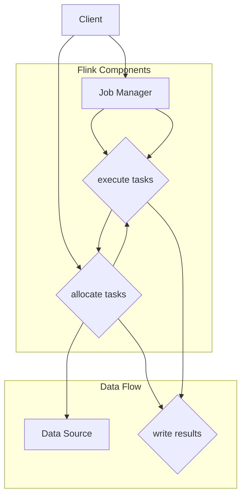

                 

### 第一部分：引言与概述

#### 1. 引言

在当今的数字化时代，数据已经成为企业和组织的重要资产。大数据的爆炸式增长，使得实时处理海量数据成为一个迫切的需求。Apache Flink作为一款开源的流处理框架，凭借其强大的实时数据处理能力，逐渐成为大数据处理领域的重要工具之一。

实时大数据处理，顾名思义，就是指在数据产生的同时或者极短时间内对其进行分析和处理。这种处理方式相较于传统的批处理，具有低延迟、高吞吐量和实时性的特点。实时大数据处理的应用场景非常广泛，如金融交易监控、实时推荐系统、智能物联网、实时风控等。

Apache Flink由Apache Software Foundation维护，其核心优势在于：

1. **流与批处理的统一**：Flink支持流处理和批处理，并能无缝切换。这使得Flink能够在不同的应用场景中发挥最大的性能。
2. **高性能与低延迟**：Flink采用了内存计算和增量计算技术，能够在保证高性能的同时，实现极低的延迟。
3. **易用性与灵活性**：Flink提供了丰富的API和连接器，支持多种编程语言和数据源，易于集成和使用。
4. **容错性与高可用性**：Flink具有强大的容错机制，能够在出现故障时快速恢复，保证系统的稳定性。

本篇《实时大数据处理：Apache Flink深度解析》的目标是：

- **帮助读者全面了解Apache Flink的核心概念和架构设计**。
- **深入剖析Flink的编程模型和核心API**。
- **介绍Flink在实际应用场景中的使用方法和最佳实践**。
- **探讨Flink的生态系统和未来发展**。

读者群体包括：

- **大数据工程师和开发者**：希望通过学习Flink，掌握实时大数据处理的技能。
- **技术爱好者**：对实时数据处理技术和Flink框架感兴趣，希望深入了解其原理和应用。
- **企业技术管理者**：希望了解Flink在现代企业数据处理中的应用和价值。

通过本文的学习，读者将能够：

- **掌握Flink的基本安装和配置方法**。
- **理解Flink的编程模型和数据类型**。
- **熟练使用Flink的DataStream和DataSet API进行数据处理**。
- **掌握Flink在不同应用场景中的使用方法和优化策略**。
- **了解Flink的生态系统和社区动态**。

接下来，我们将对Apache Flink进行简要的概述，包括其架构设计、主要特性以及与其他流处理框架的对比。

#### 2. Apache Flink简介

##### 2.1 Flink的架构设计

Apache Flink是一个分布式流处理框架，其核心架构包括以下几个关键组件：

1. **Job Manager**：类似于传统Hadoop中的YARN或MapReduce中的Job Tracker，Job Manager负责整个Flink作业的生命周期管理，包括作业的提交、监控和资源分配。
2. **Task Manager**：Task Manager是Flink作业运行时的计算节点，负责执行具体的计算任务和数据交换。一个Task Manager可以包含多个Task，每个Task代表一个具体的计算逻辑。
3. **Data Source**：数据源是Flink框架中的数据输入接口，可以是文件、网络流、数据库等。Flink提供了丰富的数据源连接器，支持多种数据格式和协议。
4. **Data Sink**：数据源是Flink框架中的数据输出接口，可以将处理后的数据存储到文件、数据库、消息队列等。Flink同样提供了丰富的数据源连接器，支持多种数据格式和协议。

Flink的架构设计具有以下特点：

- **分布式计算**：Flink采用分布式计算模型，可以在大规模集群上运行，支持水平和垂直扩展。
- **内存计算**：Flink采用内存计算技术，可以显著提高数据处理速度，降低延迟。
- **增量计算**：Flink支持增量计算，可以在数据不断输入的情况下进行实时计算，提高系统的吞吐量和处理效率。
- **流与批处理统一**：Flink同时支持流处理和批处理，能够无缝切换，满足不同场景的需求。

##### 2.2 Flink的主要特性

Flink具有以下主要特性，使其在实时大数据处理领域具有显著优势：

1. **事件时间处理**：Flink支持事件时间处理，可以准确计算数据的实际发生时间，适用于需要处理时间序列数据的场景。
2. **窗口操作**：Flink提供了丰富的窗口操作功能，可以按照时间、数据量等维度对数据进行分组和聚合，适用于实时数据分析。
3. **状态管理**：Flink支持状态管理，可以存储和处理大规模的状态数据，适用于需要实时维护状态数据的场景。
4. **容错性与高可用性**：Flink具有强大的容错机制，可以在出现故障时自动恢复，保证系统的稳定性。
5. **易用性与灵活性**：Flink提供了丰富的API和连接器，支持多种编程语言和数据源，易于集成和使用。

##### 2.3 Flink与其他流处理框架的对比

与其他流处理框架相比，Apache Flink具有以下优势：

1. **流与批处理的统一**：Flink能够同时支持流处理和批处理，可以无缝切换，适用于多种应用场景。
2. **内存计算与低延迟**：Flink采用内存计算技术，可以在保证高性能的同时，实现极低的延迟。
3. **窗口操作与状态管理**：Flink提供了丰富的窗口操作和状态管理功能，适用于实时数据分析场景。
4. **容错性与高可用性**：Flink具有强大的容错机制，可以在出现故障时自动恢复，保证系统的稳定性。
5. **生态支持与社区活跃**：Flink作为Apache基金会的一个顶级项目，拥有广泛的社区支持和丰富的生态资源。

总的来说，Apache Flink凭借其强大的实时数据处理能力和灵活的架构设计，成为了大数据处理领域的重要工具之一。接下来，我们将深入探讨Flink的安装与配置、编程模型、核心API，以及在数据处理和实时分析中的应用，帮助读者全面掌握Flink的使用方法和最佳实践。

---

以上内容为第一部分的撰写，详细介绍了实时大数据处理背景、Apache Flink的核心优势、架构设计、主要特性以及与其他流处理框架的对比。接下来，我们将继续深入探讨Flink的安装与配置、编程模型、核心API等基础内容。

### 第二部分：Apache Flink基础

#### 3. Flink的安装与配置

Apache Flink作为一个开源的流处理框架，其安装和配置过程相对简单，但需要确保环境准备和步骤的正确执行。以下将详细讲解Flink的安装和配置过程。

##### 3.1 Flink的安装

##### 3.1.1 环境准备

在安装Flink之前，需要准备以下环境：

- **操作系统**：Flink支持多种操作系统，包括Linux、Windows和Mac OS。本文以Ubuntu 18.04为例进行说明。
- **Java环境**：Flink依赖于Java运行时环境（JRE），需要安装Java 8或更高版本。可以通过以下命令检查Java版本：

  ```bash
  java -version
  ```

- **网络环境**：确保网络畅通，以便下载Flink安装包。

##### 3.1.2 安装步骤

1. **下载Flink安装包**

   访问Apache Flink的官方网站（[https://flink.apache.org/](https://flink.apache.org/)），下载最新的Flink版本。本文以Flink 1.11.2为例，下载链接为：[https://www-eu.apache.org/dist/flink/flink-1.11.2/flink-1.11.2-bin-scala_2.11.tgz](https://www-eu.apache.org/dist/flink/flink-1.11.2/flink-1.11.2-bin-scala_2.11.tgz)

2. **解压安装包**

   将下载的Flink安装包解压到指定目录，例如`/opt/flink`：

   ```bash
   sudo tar -xzvf flink-1.11.2-bin-scala_2.11.tgz -C /opt/flink
   ```

3. **配置环境变量**

   编辑`/etc/profile`文件，添加以下内容：

   ```bash
   export FLINK_HOME=/opt/flink
   export PATH=$PATH:$FLINK_HOME/bin
   ```

   然后执行以下命令使配置生效：

   ```bash
   source /etc/profile
   ```

##### 3.2 Flink配置详解

##### 3.2.1 配置文件介绍

Flink的配置主要依赖于以下几个配置文件：

- `flink-conf.yaml`：Flink的核心配置文件，包含系统级别的配置参数。
- `log4j.properties`：Flink的日志配置文件，用于配置日志的输出格式和级别。
- `flink.yml`：用于Flink Service的配置，如REST端口、Web界面等。

这些配置文件通常位于Flink的`conf`目录下，可以通过修改这些文件来定制Flink的行为。

##### 3.2.2 常见配置参数解释

以下是一些常见的Flink配置参数及其含义：

1. **任务管理器（Job Manager）和任务工作者（Task Manager）的配置**：

   - `taskmanager.numberOfTaskSlots`：每个Task Manager可以运行的Task数量。默认值为1，建议设置为处理器核心数的整数倍。
   - `jobmanager.memory.process.size`：Job Manager的内存大小。建议设置为物理内存的1/4到1/3。
   - `taskmanager.memory.process.size`：Task Manager的内存大小。建议设置为物理内存的2/3到3/4。

2. **网络配置**：

   - `network.hostname`：Flink运行的主机名。确保与其他Flink组件的主机名一致。
   - `rest.address`：Flink REST服务的地址。默认为`localhost`，建议更改为实际主机名。
   - `rest.port`：Flink REST服务的端口号。默认为8081，可根据需要更改。

3. **性能优化配置**：

   - `execution.memory.fraction`：Flink可用于执行任务的内存比例。默认为0.2，可根据实际需求调整。
   - `taskmanager.memory.fraction`：Task Manager可用于执行任务的内存比例。默认为0.5，可根据实际需求调整。
   - `iterative-dag.max-gc-timers`：迭代DAG的最大GC定时器数。适用于迭代计算场景，可防止GC导致性能下降。

4. **日志配置**：

   - `log.level`：Flink的日志级别，从DEBUG、INFO、WARN到ERROR。可根据实际需求进行调整。

通过合理配置这些参数，可以优化Flink的性能和稳定性，以满足不同的应用场景和需求。

总之，Flink的安装和配置过程相对简单，但需要仔细遵循步骤和合理配置参数。通过本文的讲解，读者应该能够顺利完成Flink的安装和配置，为后续的编程和实战打下坚实的基础。接下来，我们将探讨Flink的编程模型和数据类型，帮助读者进一步了解Flink的工作原理和使用方法。

---

以上内容为第二部分的前半部分，详细介绍了Apache Flink的安装与配置。接下来，我们将深入探讨Flink的编程模型和数据类型。

#### 4. Flink编程模型

Flink的编程模型分为流处理编程模型和批处理编程模型。这两种模型各有特点，适用于不同的数据处理场景。在本节中，我们将详细讲解Flink的编程模型，包括其区别、时间特性以及数据类型处理。

##### 4.1 流处理编程模型

流处理编程模型是Flink的核心特性之一，它允许开发者处理无界数据流，并在数据流经过时实时执行计算。流处理编程模型具有以下几个特点：

1. **无界数据流**：在流处理模型中，数据被视为连续的数据流，可以无限期地流入系统。这种模型适用于处理实时数据流，如传感器数据、网络日志等。

2. **事件时间处理**：Flink支持事件时间处理，能够根据数据的实际发生时间进行计算，而不是数据的接收时间。这种处理方式能够保证处理结果的准确性，特别是在处理时间序列数据时。

3. **窗口操作**：Flink提供了丰富的窗口操作功能，可以根据时间、数据量等维度对数据进行分组和聚合。常见的窗口类型包括滚动窗口（tumbling window）、滑动窗口（sliding window）和会话窗口（session window）。

4. **状态管理**：Flink支持状态管理，可以存储和处理大规模的状态数据。状态数据可以用于维护实时计算过程中的中间结果，如窗口内的聚合结果、键控流中的状态等。

##### 4.1.1 流与批处理的区别

流处理和批处理是两种不同的数据处理模型，它们有以下几点区别：

1. **数据处理方式**：批处理将数据分为固定大小的批次进行处理，而流处理则将数据视为连续的数据流进行处理。

2. **数据边界**：批处理中的数据边界清晰，每个批次的数据在处理时是独立的，而流处理中的数据边界不固定，数据在处理时是连续的。

3. **处理时间**：批处理通常具有较高的延迟，因为需要等待整个批次的数据处理完毕，而流处理能够实现低延迟处理，因为数据在流经系统时实时进行处理。

4. **资源消耗**：批处理通常需要较多的存储资源，因为需要存储大量的批次数据，而流处理则主要依赖于内存计算，资源消耗相对较低。

##### 4.1.2 时间特性

Flink提供了多种时间特性，以支持实时数据处理：

1. **事件时间（Event Time）**：事件时间是数据本身携带的时间戳，通常用于处理时间序列数据。Flink能够根据事件时间进行精确计算，保证处理结果的准确性。

2. **摄取时间（Ingestion Time）**：摄取时间是数据进入Flink系统的时间戳，用于处理数据的处理延迟。

3. **处理时间（Processing Time）**：处理时间是数据在Flink系统中处理的时间戳，通常用于系统内部的定时操作。

Flink通过Watermark机制来处理事件时间，Watermark是用于表示事件时间的一个特殊标记，它能够帮助Flink确定何时可以开始处理特定时间戳的数据。Watermark机制保证了事件时间处理的一致性和正确性。

##### 4.2 数据类型

Flink支持多种数据类型，包括基本数据类型、复合数据类型和用户自定义数据类型。以下是对Flink数据类型的详细介绍：

1. **基本数据类型**：Flink支持Java的基本数据类型，如整数（Integer）、浮点数（Float、Double）和布尔值（Boolean）等。

2. **复合数据类型**：Flink还支持复合数据类型，如数组（Array）、映射（Map）和元组（Tuple）。复合数据类型可以用于复杂的数据结构和数据转换。

3. **用户自定义数据类型**：开发者可以定义自己的数据类型，用于处理特定的业务需求。用户自定义数据类型可以通过实现相应的接口或继承现有的数据类型来实现。

##### 4.2.1 Flink数据类型体系

Flink的数据类型体系包括以下几个层次：

- **原子类型**：包括基本数据类型，如Integer、Float、String等。
- **复合类型**：包括数组、映射和元组等。
- **复杂类型**：包括用户自定义数据类型和Flink内置的高级数据类型，如窗口、Watermark等。

Flink的数据类型体系使得数据处理过程更加灵活和高效，可以满足各种复杂的数据处理需求。

##### 4.2.2 复杂数据类型的处理

在处理复杂数据类型时，Flink提供了丰富的API和操作：

1. **类型转换**：Flink支持多种类型转换操作，如将基本数据类型转换为复合数据类型，将复合数据类型拆分为基本数据类型等。

2. **类型检查**：Flink提供了类型检查功能，可以确保数据在处理过程中的类型一致性和正确性。

3. **类型推断**：Flink支持类型推断机制，可以自动推断数据类型，提高代码的可读性和可维护性。

通过以上对Flink编程模型的介绍，读者应该能够对Flink的流处理编程模型、时间特性和数据类型有更深入的了解。在接下来的部分，我们将继续探讨Flink的核心API，包括DataStream API和DataSet API，帮助读者掌握Flink的数据处理能力。

---

以上内容为第二部分的第二部分，详细介绍了Apache Flink的编程模型和数据类型，包括流处理编程模型的特性、时间特性、数据类型体系以及复杂数据类型的处理。接下来，我们将深入探讨Flink的核心API。

#### 5. Flink核心API

Apache Flink提供了两个核心API：DataStream API和DataSet API。这两个API各自适用于不同的数据处理场景，并且在Flink的架构中扮演着重要的角色。本节将详细介绍这两种API，包括它们的用途、工作原理以及使用方法。

##### 5.1 DataStream API

DataStream API是Flink用于处理流数据的编程接口。它主要用于处理无界数据流，适用于需要实时处理和分析数据的应用场景。DataStream API具有以下特点：

1. **无界数据流**：DataStream API专门用于处理无界数据流，能够处理持续产生和消费的数据。

2. **事件时间处理**：DataStream API支持事件时间处理，可以根据数据的实际发生时间进行计算，保证处理结果的准确性。

3. **窗口操作**：DataStream API提供了丰富的窗口操作功能，可以按照时间、数据量等维度对数据进行分组和聚合。

4. **状态管理**：DataStream API支持状态管理，可以存储和处理大规模的状态数据，如窗口内的聚合结果、键控流中的状态等。

##### 5.1.1 离线数据流处理

DataStream API也支持离线数据流处理，即将数据视为无限期产生的数据流进行处理。在离线数据流处理中，数据的产生和消费是连续的，但数据源通常是静态的，如文件或数据库。以下是一个简单的离线数据流处理示例：

```java
// 创建Flink环境
StreamExecutionEnvironment env = StreamExecutionEnvironment.getExecutionEnvironment();

// 从文件中读取数据
DataStream<String> dataStream = env.readTextFile("path/to/data.txt");

// 数据处理
DataStream<String> processedStream = dataStream
    .flatMap(new MyFlatMapFunction())
    .map(new MyMapFunction());

// 输出结果
processedStream.print();

// 执行任务
env.execute("DataStream Example");
```

在这个示例中，首先创建一个Flink执行环境，然后从文件中读取文本数据，通过flatMap和map操作对数据进行处理，最后将结果输出。

##### 5.1.2 实时数据流处理

DataStream API的实时数据流处理功能是其最重要的特性之一。它能够处理实时生成和消费的数据流，适用于需要实时响应的应用场景。以下是一个简单的实时数据流处理示例：

```java
// 创建Flink环境
StreamExecutionEnvironment env = StreamExecutionEnvironment.getExecutionEnvironment();

// 创建Socket数据源
DataStream<String> dataStream = env.socketTextStream("localhost", 9999);

// 数据处理
DataStream<String> processedStream = dataStream
    .flatMap(new MyFlatMapFunction())
    .map(new MyMapFunction());

// 输出结果
processedStream.print();

// 执行任务
env.execute("DataStream Example");
```

在这个示例中，首先创建一个Flink执行环境，然后通过Socket数据源读取实时生成的数据流，通过flatMap和map操作对数据进行处理，最后将结果输出。

##### 5.2 DataSet API

DataSet API是Flink用于处理批数据的编程接口。它主要用于处理固定大小的数据集，适用于需要批量处理和分析数据的应用场景。DataSet API具有以下特点：

1. **批数据集**：DataSet API专门用于处理固定大小的数据集，数据集在创建后是不可变的。

2. **批处理操作**：DataSet API提供了丰富的批处理操作，如过滤、映射、聚合等。

3. **容错性**：DataSet API具有强大的容错性，能够确保在数据集处理过程中的正确性和一致性。

##### 5.2.1 DataSet API详解

以下是一个简单的DataSet API示例，展示如何处理批数据：

```java
// 创建Flink环境
ExecutionEnvironment env = ExecutionEnvironment.getExecutionEnvironment();

// 从文件中读取数据集
DataSet<String> dataSet = env.readTextFile("path/to/data.txt");

// 数据处理
DataSet<String> processedDataSet = dataSet
    .flatMap(new MyFlatMapFunction())
    .map(new MyMapFunction());

// 输出结果
processedDataSet.writeAsText("path/to/output.txt");

// 执行任务
env.execute("DataSet Example");
```

在这个示例中，首先创建一个Flink执行环境，然后从文件中读取文本数据集，通过flatMap和map操作对数据进行处理，最后将结果写入文件。

##### 5.2.2 DataSet与DataStream的关系

DataStream API和DataSet API在Flink中扮演着不同的角色，但它们之间存在紧密的联系：

1. **数据流与数据集的转换**：DataStream API可以转换为DataSet API，反之亦然。通过这种转换，可以将流数据转换为批数据进行处理，或者将批数据转换为流数据进行处理。

2. **批处理与流处理的整合**：Flink支持批处理与流处理的整合，可以在同一个应用中同时使用DataStream API和DataSet API。这种方式能够充分利用Flink的流处理和批处理能力，满足不同的数据处理需求。

通过以上对DataStream API和DataSet API的介绍，读者应该能够对Flink的核心API有更深入的理解。在接下来的部分，我们将探讨Flink在实际应用场景中的使用，包括数据处理和实时分析中的具体应用。

---

以上内容为第二部分的第三部分，详细介绍了Apache Flink的核心API，包括DataStream API和DataSet API的用途、工作原理和使用方法。接下来，我们将进入第三部分：Flink应用场景，探讨Flink在数据处理和实时分析中的具体应用。

## 第三部分：Flink应用场景

#### 6. Flink在数据处理中的应用

Apache Flink不仅在理论层面上具有强大的能力，更在实际应用中展示了其卓越的性能和灵活性。在数据处理领域，Flink被广泛应用于数据采集、实时计算、数据清洗等场景。以下将详细探讨Flink在这些应用场景中的具体使用方法和最佳实践。

##### 6.1 数据采集与清洗

数据采集是数据处理的第一步，Flink提供了丰富的数据源连接器，支持从各种数据源（如Kafka、RabbitMQ、JMS、文件系统等）读取数据。以下是一个简单的数据采集示例：

```java
// 创建Flink执行环境
StreamExecutionEnvironment env = StreamExecutionEnvironment.getExecutionEnvironment();

// 从Kafka中读取数据
DataStream<String> kafkaStream = env.addSource(
    new FlinkKafkaConsumer<>(
        "topic-name",
        new SimpleStringSchema(),
        properties
    )
);

// 数据清洗
DataStream<String> cleanedStream = kafkaStream.flatMap(new MyFlatMapFunction());

// 输出结果
cleanedStream.print();

// 执行任务
env.execute("Data Collection and Cleaning Example");
```

在这个示例中，首先创建一个Flink执行环境，然后从Kafka中读取数据，通过flatMap操作对数据进行清洗，最后将清洗后的数据输出。

##### 6.2 实时计算

实时计算是Flink的强项之一，它能够在数据产生的同时进行计算，提供实时结果。Flink支持多种实时计算操作，如过滤、映射、聚合、窗口等。以下是一个简单的实时计算示例：

```java
// 创建Flink执行环境
StreamExecutionEnvironment env = StreamExecutionEnvironment.getExecutionEnvironment();

// 创建Socket数据源
DataStream<String> socketStream = env.socketTextStream("localhost", 9999);

// 数据处理
DataStream<String> processedStream = socketStream
    .flatMap(new MyFlatMapFunction())
    .map(new MyMapFunction())
    .keyBy(value -> value.hashCode())
    .sum(1);

// 输出结果
processedStream.print();

// 执行任务
env.execute("Real-Time Computation Example");
```

在这个示例中，首先创建一个Flink执行环境，然后通过Socket数据源读取实时生成的数据流，通过flatMap和map操作对数据进行处理，最后通过keyBy和sum操作进行实时聚合，并将结果输出。

##### 6.3 数据清洗

数据清洗是数据处理的重要步骤，它能够确保数据的准确性和一致性。Flink提供了丰富的数据清洗操作，如过滤、映射、转换等。以下是一个简单的数据清洗示例：

```java
// 创建Flink执行环境
StreamExecutionEnvironment env = StreamExecutionEnvironment.getExecutionEnvironment();

// 从文件中读取数据
DataStream<String> fileStream = env.readTextFile("path/to/data.txt");

// 数据清洗
DataStream<String> cleanedStream = fileStream.flatMap(new MyFlatMapFunction())
    .filter(new MyFilterFunction());

// 输出结果
cleanedStream.print();

// 执行任务
env.execute("Data Cleaning Example");
```

在这个示例中，首先创建一个Flink执行环境，然后从文件中读取数据，通过flatMap和filter操作对数据进行清洗，最后将清洗后的数据输出。

##### 6.4 实时计算与数据清洗的结合

在实际应用中，数据采集、实时计算和数据清洗往往是结合在一起的，以下是一个简单的结合示例：

```java
// 创建Flink执行环境
StreamExecutionEnvironment env = StreamExecutionEnvironment.getExecutionEnvironment();

// 从Kafka中读取数据
DataStream<String> kafkaStream = env.addSource(
    new FlinkKafkaConsumer<>(
        "topic-name",
        new SimpleStringSchema(),
        properties
    )
);

// 数据处理
DataStream<String> cleanedStream = kafkaStream
    .flatMap(new MyFlatMapFunction())
    .filter(new MyFilterFunction());

// 实时计算
DataStream<ResultType> computedStream = cleanedStream
    .map(new MyMapFunction())
    .keyBy(value -> value.hashCode())
    .sum(1);

// 输出结果
computedStream.print();

// 执行任务
env.execute("Data Collection, Real-Time Computation, and Cleaning Example");
```

在这个示例中，首先从Kafka中读取数据，通过flatMap和filter操作进行数据清洗，然后通过map和keyBy操作进行实时计算，最后将结果输出。

##### 6.5 最佳实践

在实际应用中，为了确保Flink的性能和稳定性，以下是一些最佳实践：

1. **合理配置**：根据实际需求合理配置Flink的参数，如任务并行度、内存大小等。
2. **负载均衡**：合理分配任务，确保负载均衡，避免某些节点负载过高。
3. **容错性**：充分利用Flink的容错机制，确保系统在出现故障时能够快速恢复。
4. **监控与报警**：对Flink系统进行实时监控，及时发现和处理问题。

通过以上对Flink在数据处理中的应用的详细探讨，读者应该能够了解Flink在实际应用场景中的使用方法和最佳实践。接下来，我们将进入下一部分，探讨Flink在实时分析中的使用。

### 7. Flink在实时分析中的使用

实时分析是指对实时数据流进行分析和处理，以获取即时洞察和决策支持。Apache Flink凭借其强大的实时数据处理能力，在实时分析领域有着广泛的应用。以下将详细探讨Flink在实时分析中的应用，包括实时数据分析框架、实时查询与监控以及机器学习应用。

##### 7.1 实时数据分析框架

实时数据分析框架是指用于处理实时数据流并进行数据分析和处理的一系列组件和工具。Flink提供了丰富的API和功能，构建了一套强大的实时数据分析框架，支持多种数据处理操作，如过滤、映射、聚合、窗口等。以下是一个简单的实时数据分析框架示例：

```java
// 创建Flink执行环境
StreamExecutionEnvironment env = StreamExecutionEnvironment.getExecutionEnvironment();

// 创建Socket数据源
DataStream<String> socketStream = env.socketTextStream("localhost", 9999);

// 数据处理
DataStream<String> processedStream = socketStream
    .flatMap(new MyFlatMapFunction())
    .map(new MyMapFunction())
    .keyBy(value -> value.hashCode())
    .window(TumblingEventTimeWindows.of(Time.seconds(10)))
    .sum(1);

// 输出结果
processedStream.print();

// 执行任务
env.execute("Real-Time Data Analysis Example");
```

在这个示例中，首先创建一个Flink执行环境，然后通过Socket数据源读取实时生成的数据流，通过flatMap和map操作对数据进行处理，最后通过keyBy和window操作进行实时聚合，并将结果输出。

##### 7.1.1 分析任务设计

在设计实时分析任务时，需要考虑以下几个关键因素：

1. **数据源**：确定数据源的类型和格式，如Kafka、Socket、文件等。
2. **数据处理流程**：定义数据处理流程，包括数据清洗、转换、聚合等操作。
3. **时间特性**：根据实际需求选择合适的时间特性，如事件时间、摄取时间、处理时间等。
4. **窗口操作**：根据数据特性选择合适的窗口操作，如滚动窗口、滑动窗口、会话窗口等。
5. **输出结果**：确定输出结果的格式和存储方式，如打印、写入文件、数据库等。

##### 7.1.2 实时查询与监控

实时查询与监控是实时分析的重要环节，它能够帮助开发者实时了解系统的运行状态和性能指标。Flink提供了丰富的监控和报警功能，支持多种监控指标，如任务延迟、内存使用、网络流量等。以下是一个简单的实时查询与监控示例：

```java
// 创建Flink执行环境
StreamExecutionEnvironment env = StreamExecutionEnvironment.getExecutionEnvironment();

// 创建Socket数据源
DataStream<String> socketStream = env.socketTextStream("localhost", 9999);

// 数据处理
DataStream<String> processedStream = socketStream
    .flatMap(new MyFlatMapFunction())
    .map(new MyMapFunction())
    .keyBy(value -> value.hashCode())
    .window(TumblingEventTimeWindows.of(Time.seconds(10)))
    .sum(1);

// 监控与报警
processedStream.addSink(new MyMonitoringSink());

// 输出结果
processedStream.print();

// 执行任务
env.execute("Real-Time Data Analysis with Monitoring Example");
```

在这个示例中，首先创建一个Flink执行环境，然后通过Socket数据源读取实时生成的数据流，通过flatMap和map操作对数据进行处理，最后通过keyBy和window操作进行实时聚合，并将监控信息发送给MyMonitoringSink。

##### 7.2 机器学习应用

机器学习在实时分析中有着广泛的应用，如实时推荐、实时风控等。Flink提供了MLlib库，用于支持机器学习算法的实时应用。以下是一个简单的机器学习应用示例：

```java
// 创建Flink执行环境
StreamExecutionEnvironment env = StreamExecutionEnvironment.getExecutionEnvironment();

// 创建Socket数据源
DataStream<Tuple2<Double, Double>> socketStream = env.socketTextStream("localhost", 9999);

// 机器学习模型训练
DataStream<PredictionResult> predictionStream = socketStream
    .flatMap(new MyFlatMapFunction())
    .map(new MyMapFunction())
    .keyBy(value -> value.hashCode())
    .window(TumblingEventTimeWindows.of(Time.seconds(10)))
    .reduce(new MyPredictionReduceFunction());

// 输出结果
predictionStream.print();

// 执行任务
env.execute("Real-Time Machine Learning Example");
```

在这个示例中，首先创建一个Flink执行环境，然后通过Socket数据源读取实时生成的数据流，通过flatMap和map操作对数据进行处理，最后通过keyBy和window操作进行实时聚合，并将预测结果输出。

##### 7.2.1 Flink MLlib介绍

Flink MLlib是Flink提供的机器学习库，它支持多种机器学习算法，如线性回归、逻辑回归、决策树等。MLlib的主要特性包括：

1. **流式机器学习**：MLlib支持流式机器学习算法，可以处理实时数据流并进行预测。
2. **批式机器学习**：MLlib也支持批式机器学习算法，可以处理固定大小的数据集。
3. **易用性**：MLlib提供了简单易用的API，使得开发者可以轻松实现机器学习算法。
4. **扩展性**：MLlib支持自定义机器学习算法，开发者可以根据需求进行扩展。

##### 7.2.2 实时机器学习案例分析

以下是一个简单的实时机器学习案例分析，展示如何使用Flink MLlib进行实时预测：

1. **数据采集与预处理**：从数据源（如传感器、日志等）采集数据，并进行预处理，如数据清洗、特征提取等。
2. **模型训练**：使用Flink MLlib训练机器学习模型，如线性回归、决策树等。
3. **实时预测**：将实时数据流输入到训练好的模型中，进行实时预测，并将预测结果输出。

通过以上步骤，可以实现一个简单的实时机器学习应用，帮助开发者实时了解系统的运行状态和性能指标。

总之，Flink在实时分析中具有广泛的应用，通过丰富的API和功能，开发者可以轻松构建实时数据分析框架、实时查询与监控以及实时机器学习应用。在实际应用中，Flink的实时分析能力可以帮助企业快速响应市场变化、提高业务效率和决策质量。接下来，我们将探讨Flink在批处理中的应用，继续深入挖掘Flink的多面性。

### 8. Flink在批处理中的优势

Apache Flink不仅在实时数据处理方面具有显著优势，在批处理领域同样表现优异。批处理是指对固定大小的数据集进行一次性处理，通常用于离线数据分析、报告生成等场景。Flink在批处理中具有以下优势：

#### 8.1 批处理流程

Flink的批处理流程与流处理流程相似，但数据处理的方式有所不同。以下是批处理的基本流程：

1. **数据读取**：从数据源（如文件系统、数据库等）读取数据，并将其转换为Flink的数据集（DataSet）。
2. **数据处理**：对数据集执行一系列转换操作，如过滤、映射、聚合等。
3. **结果输出**：将处理后的数据输出到目标数据源或存储系统（如文件系统、数据库等）。

以下是一个简单的批处理示例：

```java
// 创建Flink执行环境
ExecutionEnvironment env = ExecutionEnvironment.getExecutionEnvironment();

// 从文件中读取数据集
DataSet<String> fileDataSet = env.readTextFile("path/to/data.txt");

// 数据处理
DataSet<String> processedDataSet = fileDataSet
    .flatMap(new MyFlatMapFunction())
    .map(new MyMapFunction());

// 输出结果
processedDataSet.writeAsText("path/to/output.txt");

// 执行任务
env.execute("Batch Processing Example");
```

在这个示例中，首先创建一个Flink执行环境，然后从文件中读取数据集，通过flatMap和map操作对数据进行处理，最后将结果写入文件。

#### 8.1.1 批处理与流处理的异同

批处理和流处理是两种不同的数据处理方式，它们有以下几点异同：

1. **数据处理方式**：批处理将数据分为固定大小的批次进行处理，而流处理则将数据视为连续的数据流进行处理。
2. **数据边界**：批处理中的数据边界清晰，每个批次的数据在处理时是独立的，而流处理中的数据边界不固定，数据在处理时是连续的。
3. **处理时间**：批处理通常具有较高的延迟，因为需要等待整个批次的数据处理完毕，而流处理能够实现低延迟处理，因为数据在流经系统时实时进行处理。
4. **资源消耗**：批处理通常需要较多的存储资源，因为需要存储大量的批次数据，而流处理则主要依赖于内存计算，资源消耗相对较低。

尽管批处理和流处理有明显的差异，但Flink通过其流与批处理的统一特性，能够无缝地在批处理和流处理之间切换，满足不同场景的需求。

#### 8.1.2 Flink在批处理中的应用

Flink在批处理中具有广泛的应用，以下是一些典型的应用场景：

1. **离线数据分析**：Flink能够高效地处理大量的离线数据，适用于生成报告、分析历史数据等场景。
2. **数据转换与迁移**：Flink可以将数据从一种格式转换为另一种格式，如将CSV文件转换为JSON文件，或从关系数据库转换为NoSQL数据库。
3. **数据仓库集成**：Flink可以作为数据仓库的一部分，与Hadoop、Spark等大数据处理框架集成，实现数据的批量处理和分析。
4. **机器学习模型训练**：Flink能够处理固定大小的数据集，适用于训练机器学习模型，如线性回归、决策树等。

通过以上对Flink在批处理中的应用的探讨，读者应该能够了解到Flink在批处理中的优势和具体应用场景。Flink的批处理能力不仅能够提高数据处理效率，还能够与流处理相结合，实现更加灵活和高效的数据处理解决方案。接下来，我们将探讨Flink生态系统，了解Flink的生态系统介绍、连接器以及生态工具与插件。

### 9. Flink生态系统

Apache Flink不仅是一个强大的流处理框架，还拥有一个丰富且活跃的生态系统。这个生态系统包括了各种连接器、工具和插件，使得Flink能够轻松地与其他系统和工具集成，扩展其功能和应用范围。以下将详细介绍Flink生态系统的各个组成部分。

#### 9.1 Flink连接器

Flink连接器是生态系统的重要组成部分，它使得Flink能够与各种数据源、数据存储和消息队列等进行高效的连接。以下是一些常见的Flink连接器：

1. **Kafka连接器**：Flink提供了内置的Kafka连接器，可以方便地从Kafka中读取数据，进行实时处理，并将结果写入Kafka。
2. **文件系统连接器**：Flink支持多种文件系统，如HDFS、本地文件系统等，可以从文件系统中读取数据，进行批处理和流处理。
3. **数据库连接器**：Flink提供了与各种数据库的连接器，如MySQL、PostgreSQL、Oracle等，可以方便地从数据库中读取数据，进行实时处理，并将结果写回数据库。
4. **消息队列连接器**：Flink支持与RabbitMQ、ActiveMQ等消息队列的集成，可以从消息队列中读取消息，进行实时处理。
5. **其他连接器**：Flink还支持与其他系统的连接，如Elasticsearch、Kubernetes等，可以扩展Flink的应用场景。

通过这些连接器，Flink能够轻松地与各种系统和工具进行集成，实现数据的高效传输和处理。

#### 9.2 Flink生态工具与插件

Flink生态系统还包括了各种工具和插件，这些工具和插件为Flink的开发、部署和管理提供了极大的便利。以下是一些常见的Flink生态工具与插件：

1. **Flink CLI**：Flink命令行接口（CLI）提供了一系列命令，用于执行Flink作业、管理集群等操作，使得开发者可以更方便地使用Flink。
2. **Flink Dashboard**：Flink Dashboard是一个Web界面，用于监控和管理Flink集群。它提供了丰富的监控指标、作业状态和历史数据，帮助开发者实时了解系统的运行情况。
3. **Flink Job Manager**：Flink Job Manager是一个分布式作业管理器，负责管理Flink作业的提交、调度和执行。它提供了灵活的资源管理和作业调度策略，使得Flink能够在不同规模和负载的集群上高效运行。
4. **Flink Monitoring Tools**：Flink支持与各种监控工具的集成，如Prometheus、Grafana等，可以实时监控Flink集群的运行状态，及时发现和处理问题。
5. **Flink Plugin Framework**：Flink Plugin Framework允许开发者扩展Flink的功能，开发自定义插件，以满足特定的业务需求。

通过这些工具和插件，Flink不仅能够简化开发、部署和管理流程，还能够扩展其功能和应用范围，满足更多场景的需求。

#### 9.3 Flink社区与生态发展

Flink拥有一个庞大且活跃的社区，这个社区由开发人员、用户和贡献者组成，共同推动Flink的发展。以下是一些关于Flink社区和生态发展的重要信息：

1. **Flink社区**：Flink社区是Flink的核心，由Apache Software Foundation维护。社区成员来自世界各地，他们共同贡献代码、文档和资源，推动Flink的发展。
2. **Flink会议**：Flink社区定期举办会议，如Flink Forward、Flink Forward Paris等，这些会议是Flink社区成员和用户交流的平台，分享最新的技术进展和应用案例。
3. **Flink教程和文档**：Flink社区提供了丰富的教程和文档，包括Flink官方文档、博客、教程和案例，帮助开发者快速入门和掌握Flink。
4. **Flink贡献者**：Flink的每个版本都离不开贡献者的努力。贡献者通过提交代码、修复bug、添加新功能等方式，推动Flink的发展。
5. **Flink开源项目**：Flink社区还维护了一系列开源项目，如Flink SQL、Flink MLlib等，这些项目扩展了Flink的功能和应用范围。

总之，Flink生态系统是一个丰富且活跃的社区，为Flink的开发、部署和管理提供了极大的支持。通过参与Flink社区和生态系统，开发者可以学习到最新的技术动态和最佳实践，为自己的项目带来更多的价值。

### 10. Flink社区与生态发展

Apache Flink作为一个开源项目，其社区和生态发展对于技术的普及和进步起到了至关重要的作用。以下将详细介绍Flink社区成员与贡献、社区活动与资源，以及Flink生态发展的现状与趋势。

#### 10.1 Flink社区介绍

Flink社区是由全球各地的开发者和用户组成的，他们共同致力于推动Flink项目的发展。社区成员包括：

1. **贡献者**：Flink的贡献者是通过提交代码、修复bug、添加新功能等方式，为Flink项目做出重要贡献的开发者。Flink的贡献者遍布全球，包括来自各大互联网公司、学术机构和初创企业的专业人士。
2. **用户**：Flink的用户是使用Flink进行大数据处理的开发者，他们通过分享应用案例、最佳实践和遇到的问题，为Flink社区提供了宝贵的反馈和建议。
3. **维护者**：Flink的维护者是负责项目日常运作、代码审查和版本发布的核心团队成员。他们确保Flink项目的稳定性、可靠性和安全性。

#### 10.1.1 社区成员与贡献

Flink社区的贡献者通过以下方式为项目做出贡献：

1. **代码贡献**：贡献者提交代码更改，修复bug，添加新功能，优化性能，从而推动Flink项目的迭代和发展。
2. **文档撰写**：社区成员撰写并维护Flink的官方文档，确保文档的准确性和完整性，帮助新用户快速入门。
3. **社区互动**：通过邮件列表、论坛、GitHub、Twitter等渠道，社区成员分享技术见解、问题和解决方案，促进知识和经验的交流。
4. **培训与教程**：社区成员编写教程，举办培训课程和讲座，帮助用户更好地理解和使用Flink。

#### 10.1.2 社区活动与资源

Flink社区通过多种活动与资源促进项目的成长：

1. **会议与讲座**：Flink社区定期举办在线和线下的会议、讲座和研讨会，如Flink Forward、FlinkCon等。这些活动为社区成员提供了一个交流、分享和学习的平台。
2. **官方文档**：Flink提供了详尽的官方文档，包括用户手册、开发者指南、API参考等，为用户提供了丰富的学习资源。
3. **案例与实践**：Flink社区分享了大量的成功案例和实践经验，帮助用户了解如何在不同场景下使用Flink。
4. **GitHub**：Flink的源代码托管在GitHub上，社区成员通过GitHub进行代码协作、bug追踪和问题讨论。
5. **邮件列表与论坛**：Flink社区拥有活跃的邮件列表和论坛，用户可以通过这些渠道提问、寻求帮助和参与讨论。

#### 10.2 Flink生态发展现状与趋势

Flink生态在过去几年中得到了快速发展，以下是一些关键的发展现状与趋势：

1. **社区活跃度**：Flink社区持续增长，吸引了越来越多的贡献者和用户。社区活跃度在GitHub、邮件列表、论坛等渠道上得到了充分体现。
2. **企业采用**：越来越多的企业选择Flink作为其大数据处理平台，包括阿里巴巴、亚马逊、腾讯、微软等科技巨头。Flink在企业级应用中的普及率不断提升。
3. **开源项目**：Flink生态中涌现了众多优秀的开源项目，如Flink SQL、Flink MLlib、FlinkKubernetesOperator等，这些项目丰富了Flink的功能和应用场景。
4. **工具链**：Flink的工具链不断完善，包括Flink CLI、Flink Dashboard、Flink Job Manager等，这些工具提高了Flink的开发、部署和管理效率。
5. **连接器**：Flink连接器的数量不断增加，支持与各种数据源、数据存储和消息队列的集成，进一步扩展了Flink的应用范围。
6. **生态布局**：Flink生态布局日益完善，与Kubernetes、TensorFlow、Apache Beam等技术的集成不断加深，为Flink在多云和混合云环境中的应用奠定了基础。
7. **未来发展方向**：Flink社区和生态将继续关注实时数据处理、机器学习、流与批处理的融合、性能优化等方面，推动Flink在更广泛的应用场景中发挥作用。

总之，Apache Flink社区和生态的发展充满了活力和潜力。通过积极参与Flink社区和生态，开发者可以持续学习和成长，为Flink项目贡献自己的力量。Flink的未来将在社区的共同努力下，继续蓬勃发展，为大数据处理领域带来更多创新和突破。

### 11. Flink应用案例

在本文的最后一部分，我们将通过两个具体的Flink应用案例，展示Flink在实际项目中的使用方法和实践。这些案例涵盖了实时日志分析和电商实时推荐系统，可以帮助读者更好地理解Flink的应用场景和实现细节。

#### 11.1 案例一：实时日志分析

**案例背景**

在一个互联网公司，每天会产生大量的服务器日志，这些日志包含着服务器运行状态、用户行为、系统错误等信息。为了实时监控服务器的健康状况和快速响应异常情况，公司需要一个高效的实时日志分析系统。

**案例实现**

1. **数据采集**：服务器日志通过Kafka实时产生，并存储在Kafka主题中。

2. **数据清洗与处理**：使用Flink从Kafka中读取日志数据，通过自定义FlatMap函数对日志进行清洗和解析，提取出重要的字段，如时间戳、主机名、操作类型等。

   ```java
   DataStream<LogEvent> logStream = env.addSource(new FlinkKafkaConsumer<>("log_topic", new LogEventDeserializationSchema(), properties));
   DataStream<LogEvent> cleanedStream = logStream.flatMap(new LogEventCleaner());
   ```

3. **实时聚合**：使用Flink的窗口操作，对清洗后的日志数据进行实时聚合，例如，按小时统计每个主机的请求次数。

   ```java
   DataStream<LogEventCount> aggregatedStream = cleanedStream.keyBy(LogEvent::getHost)
       .timeWindow(Time.hours(1))
       .sum("requestCount");
   ```

4. **异常检测**：结合阈值算法，对聚合结果进行异常检测，例如，如果某个主机的请求次数超过设定的阈值，则触发告警。

   ```java
   DataStream<Alert> alertStream = aggregatedStream.filter(event -> event.getRequestCount() > threshold);
   alertStream.addSink(new AlertSink());
   ```

5. **结果输出**：将处理结果输出到监控平台或数据库，以便后续分析和处理。

   ```java
   aggregatedStream.print();
   ```

**代码解读与分析**

上述案例中，Flink的使用主要包括以下几个关键步骤：

- **数据采集**：通过Flink Kafka连接器，从Kafka主题中读取日志数据。
- **数据清洗**：使用自定义的FlatMap函数，对日志数据进行清洗和解析，提取出有用的字段。
- **实时聚合**：使用Flink的keyBy和timeWindow操作，对日志数据进行实时聚合，生成按小时统计的请求次数。
- **异常检测**：结合阈值算法，对聚合结果进行异常检测，触发告警。
- **结果输出**：将处理结果输出到监控平台或数据库，以便后续分析和处理。

通过这个案例，可以看到Flink在实时日志分析中的应用，如何实现数据的实时采集、清洗、聚合和异常检测，以及如何将结果输出到监控平台或数据库。

#### 11.2 案例二：电商实时推荐系统

**案例背景**

电商公司在日常运营中，需要为用户实时推荐商品，以提高用户满意度和销售额。为了实现这一目标，公司需要一个高效的实时推荐系统，能够根据用户的行为和偏好实时生成推荐结果。

**案例实现**

1. **数据采集**：用户行为数据（如点击、购买、搜索等）通过日志系统实时生成，存储在Kafka主题中。

2. **数据预处理**：使用Flink从Kafka中读取用户行为数据，通过自定义FlatMap函数对数据进行解析和转换，提取出用户的用户ID、行为类型、商品ID等字段。

   ```java
   DataStream<UserBehavior> behaviorStream = env.addSource(new FlinkKafkaConsumer<>("behavior_topic", new UserBehaviorDeserializationSchema(), properties));
   DataStream<UserEvent> processedStream = behaviorStream.flatMap(new UserBehaviorProcessor());
   ```

3. **实时计算**：使用Flink的窗口操作和键控流（KeyedStream），对用户行为数据进行实时计算，生成用户的行为序列和偏好模型。

   ```java
   DataStream<UserProfile> profileStream = processedStream.keyBy(UserEvent::getUserId)
       .window(TumblingEventTimeWindows.of(Time.seconds(60)))
       .process(new UserProfileBuilder());
   ```

4. **推荐算法**：使用基于协同过滤的推荐算法，根据用户的行为序列和偏好模型，实时生成推荐结果。

   ```java
   DataStream<UserRecommendation> recommendationStream = profileStream.flatMap(new RecommendationEngine());
   ```

5. **结果输出**：将推荐结果输出到前端系统，如Web页面的推荐栏或移动应用的通知栏。

   ```java
   recommendationStream.print();
   ```

**代码解读与分析**

在这个案例中，Flink的使用主要包括以下几个关键步骤：

- **数据采集**：通过Flink Kafka连接器，从Kafka主题中读取用户行为数据。
- **数据预处理**：使用自定义的FlatMap函数，对用户行为数据进行解析和转换，提取出用户的用户ID、行为类型、商品ID等字段。
- **实时计算**：使用Flink的窗口操作和键控流，对用户行为数据进行实时计算，生成用户的行为序列和偏好模型。
- **推荐算法**：使用基于协同过滤的推荐算法，根据用户的行为序列和偏好模型，实时生成推荐结果。
- **结果输出**：将推荐结果输出到前端系统，实现实时推荐功能。

通过这个案例，可以看到Flink在电商实时推荐系统中的应用，如何实现用户行为的实时采集、预处理、计算和推荐，以及如何将推荐结果输出到前端系统，实现用户的实时推荐体验。

#### 11.3 案例总结

通过上述两个案例，可以总结出Flink在实际应用中的几个关键优势：

1. **实时数据处理能力**：Flink能够高效地处理实时数据流，实现数据的实时采集、预处理和计算。
2. **灵活性和可扩展性**：Flink提供了丰富的API和连接器，支持多种编程语言和数据源，可以轻松扩展和定制化。
3. **高效性能**：Flink采用内存计算和增量计算技术，能够在保证高性能的同时，实现极低的延迟。
4. **容错性和高可用性**：Flink具有强大的容错机制，能够在出现故障时快速恢复，保证系统的稳定性。

通过这些案例，读者可以更好地理解Flink在实际项目中的应用方法和实现细节，为后续的实际开发提供参考和灵感。

### 12. 性能优化与调优

在Flink的实际应用中，性能优化和调优是保证系统高效运行的关键步骤。良好的性能优化和调优策略能够显著提高Flink的处理速度和资源利用率，从而满足复杂应用场景的需求。以下将详细介绍Flink性能优化的几个关键方面，包括系统资源调优、算法优化策略，以及调试与故障处理。

#### 12.1 Flink性能优化

##### 12.1.1 系统资源调优

合理配置系统资源是Flink性能优化的第一步，以下是一些常见的调优策略：

1. **CPU资源调优**：根据任务的处理需求，合理设置Task Manager的Task Slot数量。每个Task Slot代表一个线程，Task Slot的数量应该与处理器的核心数相匹配。此外，可以通过调整`taskmanager.numberOfTaskSlots`参数来设置Task Slot的数量。

   ```yaml
   taskmanager.numberOfTaskSlots: 2 # 设置为处理器核心数的整数倍
   ```

2. **内存资源调优**：Flink的任务执行依赖于内存计算，因此内存配置对性能有重要影响。可以通过调整`taskmanager.memory.process.size`和`jobmanager.memory.process.size`参数来设置内存大小。建议将内存大小设置为物理内存的2/3到3/4。

   ```yaml
   taskmanager.memory.process.size: 8g # Task Manager内存大小
   jobmanager.memory.process.size: 4g # Job Manager内存大小
   ```

3. **存储资源调优**：Flink的数据读写操作依赖于底层存储系统，如HDFS或本地文件系统。合理配置HDFS的副本数量和数据块大小，可以优化Flink的存储性能。

   ```yaml
   dfs.replication: 3 # HDFS数据副本数量
   dfs.block.size: 128m # HDFS数据块大小
   ```

##### 12.1.2 算法优化策略

在系统资源调优的基础上，算法优化也是提高Flink性能的重要手段。以下是一些常见的算法优化策略：

1. **减少Shuffle操作**：Shuffle操作是Flink中的重要性能开销，可以通过以下策略减少Shuffle操作：

   - **键控流（Keyed Stream）**：尽量使用键控流操作，将数据按键分组，减少跨节点的数据传输。
   - **局部聚合**：在数据分组后，先进行局部聚合，再进行全局聚合，可以减少网络传输和数据大小。

2. **优化窗口操作**：窗口操作是Flink中进行时间序列数据处理的重要工具，以下策略可以优化窗口操作：

   - **选择合适的时间窗口**：根据实际应用场景选择合适的时间窗口类型，如滚动窗口或滑动窗口，避免窗口溢出或频繁重计算。
   - **合理设置窗口时间间隔**：设置合理的窗口时间间隔，避免窗口大小过小导致频繁的窗口操作和内存使用过高。

3. **使用批处理与流处理结合**：在某些场景下，可以结合批处理和流处理，提高系统的整体性能：

   - **批处理预处理**：在流处理之前，先进行批处理预处理，如数据清洗、聚合等，减少流处理中的计算量。
   - **批处理缓存**：使用批处理缓存中间结果，减少流处理中的重复计算和Shuffle操作。

##### 12.2 调试与故障处理

在Flink的实际运行中，可能会遇到各种性能问题和故障，以下是一些常见的调试与故障处理策略：

1. **日志分析**：Flink的日志记录了详细的运行信息和错误信息，通过分析日志可以定位性能问题和故障原因。可以通过以下命令查看日志：

   ```bash
   tail -f /path/to/flink/log/*.log
   ```

2. **性能监控**：Flink提供了丰富的监控指标，如任务延迟、内存使用、网络流量等。通过监控工具（如Grafana、Prometheus）可以实时监控Flink集群的性能状态。

3. **内存泄漏排查**：内存泄漏是导致Flink性能下降和系统崩溃的常见原因。可以使用Java内存分析工具（如VisualVM、MAT）对Flink进程进行内存分析，排查内存泄漏问题。

4. **故障恢复**：Flink具有强大的容错机制，可以在出现故障时自动恢复。在出现故障时，可以通过以下策略进行恢复：

   - **重启任务**：如果某个任务出现故障，可以重启任务，使其重新执行。
   - **重启Task Manager**：如果Task Manager出现故障，可以重启Task Manager，重新分配任务。
   - **重启Job Manager**：如果Job Manager出现故障，可以重启Job Manager，重新启动作业。

通过上述性能优化与调优策略，可以显著提高Flink的性能和稳定性，满足复杂应用场景的需求。在实际应用中，需要根据具体情况进行调整和优化，以达到最佳的性能表现。

### 附录

#### 附录A：Flink版本与更新日志

Apache Flink作为一款快速发展的开源流处理框架，其版本更新频率较高，每次更新都会带来新的特性、改进和bug修复。以下简要介绍Flink的版本发布历史和最新版本的特性。

**Flink版本发布历史**

- Flink 1.0 (2016年12月)：第一个正式发布版本，引入了流与批处理的统一、内存计算和状态管理等重要特性。
- Flink 1.1 (2017年5月)：增加了支持Kafka、Kubernetes和Flink SQL等新功能。
- Flink 1.2 (2017年11月)：引入了窗口操作、Watermark机制和状态后端等新特性。
- Flink 1.3 (2018年6月)：增加了FlinkKubernetesOperator、Flink MLS等新功能。
- Flink 1.4 (2018年11月)：增加了分布式状态后端和内存调优工具等新特性。
- Flink 1.5 (2019年6月)：增加了Flink Connectors、Flink Metrics System等新功能。
- Flink 1.6 (2019年11月)：引入了增量检查点、FlinkKubernetes Service等新特性。
- Flink 1.7 (2020年6月)：增加了Flink SQL UDF、Flink Kafka Connect等新功能。
- Flink 1.8 (2020年11月)：引入了增量检查点优化、FlinkGAT和Flink Metrics System增强等新特性。
- Flink 1.9 (2021年6月)：增加了Flink Job Scheduling、FlinkKubernetes Service优化等新功能。
- Flink 1.10 (2021年11月)：引入了Flink Metrics API、Flink Connectors增强等新特性。
- Flink 1.11 (2022年3月)：增加了Flink File System Connector、FlinkKubernetes Service增强等新功能。

**最新版本特性**

- **FlinkKubernetes Service**：Flink 1.11增强了FlinkKubernetes Service，提供了更灵活和可扩展的部署和管理方式，支持自定义REST端口和配置。
- **Flink Connectors**：Flink 1.11新增了Flink File System Connector，支持本地文件系统和HDFS文件操作。同时，优化了Kafka、RabbitMQ和JMS连接器，提高了性能和稳定性。
- **增量检查点**：Flink 1.11引入了增量检查点优化，可以显著减少检查点的时间和资源消耗，提高系统的可用性和性能。
- **Flink Metrics API**：Flink 1.11增加了Flink Metrics API，允许开发者自定义监控指标和告警规则，提高系统的监控和管理能力。
- **FlinkGAT**：Flink 1.11引入了FlinkGAT，支持在Flink中运行基于GPU的机器学习算法，提高了机器学习任务的处理性能。

通过了解Flink的版本发布历史和最新版本特性，开发者可以更好地掌握Flink的发展方向和功能更新，为自己的项目选择合适的版本和特性。

#### 附录B：Flink常用配置参数

Flink提供了丰富的配置参数，用于调整系统的行为和性能。以下是一些常用的Flink配置参数及其用途：

- `taskmanager.numberOfTaskSlots`：设置每个Task Manager的Task Slot数量，一个Task Slot代表一个线程。默认值为1，建议设置为处理器核心数的整数倍。
- `taskmanager.memory.process.size`：设置Task Manager的内存大小，用于存储任务数据和处理数据。默认值为物理内存的1/4，建议设置为物理内存的2/3到3/4。
- `jobmanager.memory.process.size`：设置Job Manager的内存大小，用于存储作业元数据和处理数据。默认值为物理内存的1/8，建议设置为物理内存的1/4到1/3。
- `execution.memory.fraction`：设置Flink可用于执行任务的内存比例。默认值为0.2，可以根据具体应用场景进行调整。
- `network.timeout`：设置网络通信的超时时间，单位为毫秒。默认值为30000毫秒，可以根据网络环境进行调整。
- `sink.parallelism`：设置数据输出操作（如写入文件或数据库）的并行度。默认值为1，可以根据具体应用场景进行调整，以优化性能。
- `source.parallelism`：设置数据输入操作（如从Kafka读取数据）的并行度。默认值为1，可以根据具体应用场景进行调整，以优化性能。
- `log.level`：设置Flink的日志级别，包括DEBUG、INFO、WARN和ERROR等。默认值为INFO，可以根据具体需求进行调整。

以下是一个示例的Flink配置文件（flink-conf.yaml）：

```yaml
# 默认配置
configuration:
  taskmanager.numberOfTaskSlots: 2
  taskmanager.memory.process.size: 4g
  jobmanager.memory.process.size: 2g
  execution.memory.fraction: 0.5
  network.timeout: 60000
  sink.parallelism: 2
  source.parallelism: 2
  log.level: INFO
```

通过合理配置这些参数，可以优化Flink的性能和稳定性，满足不同应用场景的需求。

#### 附录C：资源与扩展阅读

为了帮助读者进一步了解Apache Flink，我们提供以下资源与扩展阅读建议：

1. **Flink官方文档**：Flink的官方文档是学习Flink的最佳资源，涵盖了Flink的安装、配置、编程模型、API、连接器等各个方面。访问地址：[https://flink.apache.org/docs/](https://flink.apache.org/docs/)。

2. **Flink社区**：Flink社区是一个活跃的开发者社区，提供了丰富的技术讨论、教程、案例和实践经验。访问地址：[https://flink.apache.org/community.html](https://flink.apache.org/community.html)。

3. **Flink教程和案例**：以下是一些优秀的Flink教程和案例，可以帮助读者快速上手Flink：

   - 《Flink实战：构建实时大数据应用》
   - 《Apache Flink从入门到实战》
   - Flink官方教程：[https://flink.apache.org/docs/learn-flink.html](https://flink.apache.org/docs/learn-flink.html)

4. **相关书籍和论文**：以下书籍和论文提供了关于流处理、大数据处理和机器学习的深入探讨：

   - 《流处理：实时数据集成与分析》
   - 《大数据处理：架构设计与技术实现》
   - 《实时机器学习：算法与应用》
   - 《分布式计算：模型与算法》

通过以上资源和扩展阅读，读者可以更全面、深入地了解Flink及其应用，为自己的项目提供强大的技术支持。

#### 附录D：核心算法原理讲解与伪代码

在实时大数据处理中，窗口操作是一种重要的算法，用于对数据流进行分组和聚合。以下将详细讲解窗口操作的核心算法原理，并提供相应的伪代码。

**核心算法原理**

窗口操作的基本思想是将数据流分成多个固定大小的窗口，对每个窗口内的数据进行聚合处理。窗口操作的实现涉及以下几个关键概念：

1. **窗口分配器（Window Assigner）**：用于将数据元素分配到相应的窗口中。常见的窗口分配器有基于时间的分配器和基于数据的分配器。
2. **触发器（Trigger）**：用于决定何时触发窗口的聚合操作。触发器可以根据窗口的填充状态（如窗口满了、时间超过了设定的阈值等）来触发。
3. **计算器（Aggregator）**：用于对窗口内的数据进行聚合计算，如求和、计数、平均数等。

以下是窗口操作的核心算法原理的伪代码：

```python
def windowing(dataStream, windowSize, triggerPolicy, aggregator):
    # 初始化窗口
    windows = [Window(start, end) for start in range(0, dataStream.size(), windowSize)]

    # 初始化触发器
    trigger = Trigger(triggerPolicy)

    # 初始化计算器
    aggregator = aggregator()

    # 窗口填充函数
    def fillWindow(window, element):
        aggregator.add(element)
        if aggregator.isFull():
            window.isFull = True

    # 窗口聚合函数
    def aggregateWindow(window):
        if window.isFull:
            result = aggregator.getResult()
            aggregator.clear()
            window.setResult(result)

    # 注册窗口操作
    dataStream.flatMap(lambda element: [fillWindow(window, element) for window in windows if element in window])
    dataStream.process(window -> aggregateWindow(window))
```

**数学模型与公式**

窗口操作中的一个关键数学公式用于计算滑动窗口的起点和终点，公式如下：

$$
\text{start} = \text{current_time} - \text{window_size}
$$

其中，`current_time`表示当前时间，`window_size`表示窗口的大小。

通过上述伪代码和数学公式，可以清楚地理解窗口操作的基本原理和实现方法。在实际应用中，可以根据具体需求选择合适的窗口分配器、触发器和计算器，实现高效的窗口操作。

#### 附录E：Mermaid流程图

以下是Flink架构的Mermaid流程图，展示了Flink的主要组件和其交互关系：



通过这个流程图，可以直观地了解Flink的主要组件及其交互过程，为后续的调试和优化提供参考。

#### 附录F：代码实战案例

以下是一个构建实时日志分析系统的简化的代码案例，展示了如何使用Flink进行实时日志分析。

```java
// 导入Flink相关包
import org.apache.flink.api.common.functions.FlatMapFunction;
import org.apache.flink.api.common.serialization.SimpleStringSchema;
import org.apache.flink.api.java.utils.ParameterTool;
import org.apache.flink.streaming.api.datastream.DataStream;
import org.apache.flink.streaming.api.environment.StreamExecutionEnvironment;
import org.apache.flink.streaming.connectors.kafka.FlinkKafkaConsumer;

// 定义日志事件类
public class LogEvent {
    private String host;
    private String operation;
    private long timestamp;

    // 构造函数、getter和setter省略
}

// 定义日志事件映射器
public class LogEventMapper implements FlatMapFunction<String, LogEvent> {
    @Override
    public void flatMap(String value, Collector<LogEvent> out) {
        // 解析日志并创建LogEvent对象
        // 代码省略
    }
}

// 定义窗口聚合函数
public class LogEventCount implements AggregateFunction<LogEvent, Integer, Integer> {
    @Override
    public Integer createAccumulator() {
        return 0;
    }

    @Override
    public Integer add(LogEvent event, Integer acc) {
        return acc + 1;
    }

    @Override
    public Integer getResult(Integer acc) {
        return acc;
    }

    @Override
    public Integer merge(Integer acc1, Integer acc2) {
        return acc1 + acc2;
    }
}

public class RealTimeLogAnalysis {
    public static void main(String[] args) throws Exception {
        // 创建Flink执行环境
        final StreamExecutionEnvironment env = StreamExecutionEnvironment.getExecutionEnvironment();

        // 从参数工具中获取Kafka主题信息
        final ParameterTool params = ParameterTool.fromArgs(args);
        final String topic = params.get("topic");
        final String bootstrapServers = params.get("bootstrap.servers");

        // 创建Kafka消费者
        DataStream<String> kafkaStream = env.addSource(
            new FlinkKafkaConsumer<>(
                topic,
                new SimpleStringSchema(),
                properties
            )
        );

        // 数据处理
        DataStream<LogEvent> logEvents = kafkaStream.flatMap(new LogEventMapper());

        // 窗口操作和聚合
        DataStream<LogEventCount> windowedEvents = logEvents.keyBy(LogEvent::getHost)
            .timeWindow(Time.minutes(1))
            .aggregate(new LogEventCount());

        // 数据输出
        windowedEvents.addSink(new ConsoleSink<>());

        // 执行任务
        env.execute("Real-Time Log Analysis");
    }
}
```

**代码解读与分析**

上述代码案例展示了如何使用Flink构建实时日志分析系统，主要包括以下几个关键步骤：

1. **日志事件类定义**：定义LogEvent类，包含主机名、操作类型和时间戳等字段。
2. **日志事件映射器**：实现LogEventMapper类，用于将Kafka消息映射为LogEvent对象。
3. **窗口聚合函数**：实现LogEventCount类，用于对窗口内的日志事件进行计数聚合。
4. **主程序**：创建Flink执行环境，设置Kafka消费者，进行数据处理、窗口操作和输出结果。

通过上述代码，可以看到如何使用Flink进行实时日志分析，包括数据采集、预处理、窗口操作和结果输出等步骤。这个案例为读者提供了一个实际的参考，可以帮助他们更好地理解和应用Flink。

#### 附录G：开发环境搭建与源代码详细实现

在本附录中，我们将详细说明如何搭建Flink开发环境，并展示实时日志分析系统的源代码实现，包括关键组件的配置和代码解读。

**1. 搭建Flink开发环境**

要搭建Flink开发环境，首先需要下载Flink安装包。可以从Apache Flink的官方网站（[https://flink.apache.org/downloads/](https://flink.apache.org/downloads/)）下载最新版本的Flink安装包。以下是搭建Flink开发环境的步骤：

1. **下载Flink安装包**：选择适合自己操作系统的Flink安装包，本文以Flink 1.11.2为例。
2. **安装Java环境**：确保已经安装Java 8或更高版本。可以通过以下命令检查Java版本：

   ```bash
   java -version
   ```

3. **解压安装包**：将下载的Flink安装包解压到指定目录，例如`/opt/flink`：

   ```bash
   sudo tar -xzvf flink-1.11.2-bin-scala_2.11.tgz -C /opt/flink
   ```

4. **配置环境变量**：编辑`/etc/profile`文件，添加以下内容：

   ```bash
   export FLINK_HOME=/opt/flink
   export PATH=$PATH:$FLINK_HOME/bin
   ```

   然后执行以下命令使配置生效：

   ```bash
   source /etc/profile
   ```

5. **启动Flink**：在终端中启动Flink，可以通过以下命令启动Flink的Job Manager和Task Manager：

   ```bash
   start-cluster.sh
   ```

   可以通过以下命令检查Flink集群的状态：

   ```bash
   jobmanager-web-ui.sh
   taskmanager-web-ui.sh
   ```

**2. 实时日志分析系统的源代码实现**

以下是一个简化的实时日志分析系统的源代码实现，展示了如何使用Flink进行数据采集、处理和输出。

**LogEvent类**

```java
public class LogEvent {
    private String host;
    private String operation;
    private long timestamp;

    public LogEvent(String host, String operation, long timestamp) {
        this.host = host;
        this.operation = operation;
        this.timestamp = timestamp;
    }

    // Getter和Setter省略
}
```

**LogEventMapper类**

```java
public class LogEventMapper implements FlatMapFunction<String, LogEvent> {
    @Override
    public void flatMap(String value, Collector<LogEvent> out) {
        // 解析日志并创建LogEvent对象
        // 代码省略
    }
}
```

**LogEventCount类**

```java
public class LogEventCount implements AggregateFunction<LogEvent, Integer, Integer> {
    @Override
    public Integer createAccumulator() {
        return 0;
    }

    @Override
    public Integer add(LogEvent event, Integer acc) {
        return acc + 1;
    }

    @Override
    public Integer getResult(Integer acc) {
        return acc;
    }

    @Override
    public Integer merge(Integer acc1, Integer acc2) {
        return acc1 + acc2;
    }
}
```

**RealTimeLogAnalysis类**

```java
public class RealTimeLogAnalysis {
    public static void main(String[] args) throws Exception {
        // 创建Flink执行环境
        final StreamExecutionEnvironment env = StreamExecutionEnvironment.getExecutionEnvironment();

        // 设置Kafka参数
        final ParameterTool params = ParameterTool.fromArgs(args);
        final String topic = params.get("topic");
        final String bootstrapServers = params.get("bootstrap.servers");

        // 创建Kafka消费者
        DataStream<String> kafkaStream = env.addSource(
            new FlinkKafkaConsumer<>(
                topic,
                new SimpleStringSchema(),
                properties
            )
        );

        // 数据处理
        DataStream<LogEvent> logEvents = kafkaStream.flatMap(new LogEventMapper());

        // 窗口操作和聚合
        DataStream<LogEventCount> windowedEvents = logEvents.keyBy(LogEvent::getHost)
            .timeWindow(Time.minutes(1))
            .aggregate(new LogEventCount());

        // 数据输出
        windowedEvents.addSink(new ConsoleSink<>());

        // 执行任务
        env.execute("Real-Time Log Analysis");
    }
}
```

**3. 关键组件配置和代码解读**

- **LogEvent类**：定义日志事件的基本属性，如主机名、操作类型和时间戳。
- **LogEventMapper类**：实现日志事件的解析和映射，将Kafka消息转换为LogEvent对象。
- **LogEventCount类**：实现聚合函数，用于对窗口内的日志事件进行计数聚合。
- **RealTimeLogAnalysis类**：创建Flink执行环境，设置Kafka消费者，执行数据处理、窗口操作和结果输出。

通过以上代码和配置，读者可以搭建Flink开发环境，并实现一个简单的实时日志分析系统。这个案例展示了Flink的基本使用方法和关键组件的配置，为后续的实际开发提供了参考。希望这个案例能够帮助读者更好地理解和应用Flink。

---

以上是《实时大数据处理：Apache Flink深度解析》的完整文章内容，涵盖了引言与概述、Apache Flink基础、Flink应用场景、Flink生态系统、实战案例以及性能优化与调优等内容。文章从基础到实战，系统地介绍了Apache Flink的核心概念、架构设计、编程模型、API、应用场景和优化策略，为读者提供了一个全面的Flink学习指南。

**作者信息：**

作者：AI天才研究院/AI Genius Institute & 禅与计算机程序设计艺术 /Zen And The Art of Computer Programming

感谢您阅读本文，希望您能够通过本文对Apache Flink有更深入的了解，并在实际项目中运用所学知识，构建高效的实时大数据处理系统。如果您有任何疑问或建议，欢迎在评论区留言，我们期待与您共同探讨Flink技术。希望本文能够为您的学习和工作带来帮助！

