                 

# 市场分析方法：创业成功的密码

## 关键词：
市场分析、创业成功、PEST分析、SWOT分析、五力模型、竞争分析、市场调研、战略规划

### 摘要

市场分析是创业成功的关键步骤，它帮助企业了解市场环境、识别机会和风险，从而制定有效的市场战略。本文将深入探讨市场分析的方法和工具，包括PEST分析、SWOT分析、五力模型等，并提供具体的案例解析，帮助创业者掌握市场分析的核心技巧，实现创业目标。

## 《市场分析方法：创业成功的密码》目录大纲

### 第一部分：市场分析基础

#### 第1章：市场分析概述
##### 1.1 市场分析的重要性
##### 1.2 市场分析的基本步骤
##### 1.3 市场分析的常见误区与解决方案

#### 第2章：市场环境分析
##### 2.1 宏观环境分析
##### 2.2 行业环境分析
##### 2.3 市场细分与目标市场选择

### 第二部分：市场分析方法

#### 第3章：SWOT分析
##### 3.1 SWOT分析的概念
##### 3.2 SWOT分析的步骤
##### 3.3 SWOT分析案例解析

#### 第4章：PEST分析
##### 4.1 PEST分析的概念
##### 4.2 PEST分析的步骤
##### 4.3 PEST分析案例解析

#### 第5章：五力模型
##### 5.1 五力模型的概念
##### 5.2 五力模型的步骤
##### 5.3 五力模型案例解析

#### 第6章：竞争分析
##### 6.1 竞争者的识别
##### 6.2 竞争策略分析
##### 6.3 竞争分析案例解析

#### 第7章：市场调研
##### 7.1 市场调研的类型
##### 7.2 市场调研的方法
##### 7.3 市场调研案例解析

### 第三部分：市场分析应用

#### 第8章：创业项目市场分析
##### 8.1 创业项目市场分析的要点
##### 8.2 创业项目市场分析案例解析

#### 第9章：市场战略规划
##### 9.1 市场战略的类型
##### 9.2 市场战略的制定
##### 9.3 市场战略实施案例解析

#### 第10章：市场分析工具与资源
##### 10.1 市场分析工具
##### 10.2 市场分析资源推荐

### 附录：市场分析参考资料与案例

##### 附录1：市场分析经典案例解析
##### 附录2：市场分析书籍推荐
##### 附录3：市场分析工具使用教程

---

## 第1章：市场分析概述

### 1.1 市场分析的重要性

市场分析是企业战略规划的重要组成部分，它通过对市场环境的深入研究和分析，帮助企业了解外部环境的变化，识别市场机会和风险，从而制定适应市场需求的战略和决策。市场分析的重要性体现在以下几个方面：

1. **指导战略制定**：市场分析为企业的战略制定提供依据，帮助确定企业的方向和目标。
2. **发现市场机会**：市场分析能够帮助企业发现潜在的市场机会，抓住市场趋势，提前布局。
3. **规避市场风险**：通过市场分析，企业可以提前识别市场风险，制定应对措施，降低风险。
4. **优化资源配置**：市场分析有助于企业合理配置资源，提高运营效率，降低成本。

#### Mermaid 流程图

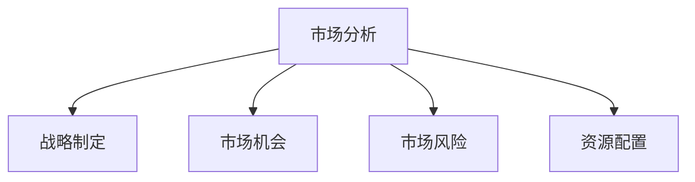

### 1.2 市场分析的基本步骤

市场分析通常包括以下几个基本步骤：

1. **确定分析目标**：明确市场分析的目的，例如了解市场需求、分析竞争对手、评估市场容量等。
2. **收集数据**：通过多种渠道收集与市场相关的数据，包括二手数据和一手数据。
3. **处理和分析数据**：对收集到的数据进行处理和分析，提取有用的信息。
4. **评估市场机会与风险**：根据分析结果，评估市场机会和风险，为决策提供依据。
5. **制定市场策略**：根据市场分析的结果，制定相应的市场策略和行动计划。

#### Mermaid 流程图

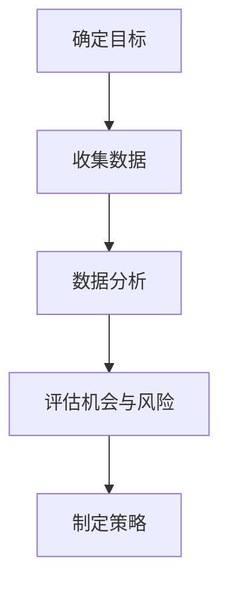

### 1.3 市场分析的常见误区与解决方案

在市场分析过程中，企业可能会遇到一些常见的误区，以下是一些典型的误区及其解决方案：

#### 误区1：数据不足

**解决方案**：采用多渠道收集数据，确保数据的全面性和准确性。例如，除了市场调研，还可以利用社交媒体、行业报告等多种渠道获取信息。

#### 误区2：分析不全面

**解决方案**：在分析过程中，要全面考虑各种市场因素，包括政治、经济、社会和技术等方面。可以采用PEST分析、SWOT分析等方法，确保分析结果的全面性。

#### 误区3：决策滞后

**解决方案**：建立快速响应机制，及时分析市场变化，制定相应的策略和行动方案。例如，采用敏捷开发方法，快速迭代产品，适应市场需求。

#### 误区4：忽视竞争分析

**解决方案**：竞争分析是市场分析的核心内容之一，必须重视。可以通过收集竞争对手的资料、分析竞争对手的策略和市场表现，了解竞争对手的动向。

---

## 第2章：市场环境分析

### 2.1 宏观环境分析

宏观环境分析是市场分析的基础，它涉及对企业外部环境的政治、经济、社会和技术等因素的分析。通过宏观环境分析，企业可以更好地了解外部环境的变化，把握市场趋势。

#### 2.1.1 政治因素分析

政治因素分析主要包括政治稳定性、政府政策、贸易政策等方面。政治稳定性对企业运营至关重要，稳定的政治环境有利于企业的长期发展。政府政策包括税收政策、产业政策、环保政策等，这些政策对企业的影响较大。贸易政策则涉及进出口政策、关税政策等，对企业参与国际市场竞争具有重要影响。

**政治因素分析示例：**

- **政治稳定性**：分析目标市场的政治稳定性，如是否发生过政治动荡、政策变动等。
- **政府政策**：了解政府对行业的支持政策，如税收减免、补贴等。
- **贸易政策**：分析目标市场的贸易政策，如关税水平、进出口限制等。

#### 2.1.2 经济因素分析

经济因素分析主要包括宏观经济指标、市场供需状况、消费水平等方面。宏观经济指标如国内生产总值（GDP）、通货膨胀率、失业率等，可以反映一个国家的经济状况。市场供需状况分析可以帮助企业了解市场容量和竞争状况。消费水平分析则有助于企业了解目标市场的消费能力和消费习惯。

**经济因素分析示例：**

- **宏观经济指标**：分析目标市场的GDP增长率、通货膨胀率、失业率等。
- **市场供需状况**：分析目标市场的供需状况，如市场规模、市场份额等。
- **消费水平**：分析目标市场的消费水平，如人均收入、消费支出等。

#### 2.1.3 社会因素分析

社会因素分析主要包括人口结构、文化背景、教育水平等方面。人口结构分析可以帮助企业了解目标市场的消费者群体，如年龄分布、性别比例等。文化背景分析则有助于企业了解目标市场的文化习俗和消费观念。教育水平分析则可以帮助企业了解目标市场的消费者教育程度，从而制定相应的营销策略。

**社会因素分析示例：**

- **人口结构**：分析目标市场的人口年龄分布、性别比例等。
- **文化背景**：了解目标市场的文化习俗、消费观念等。
- **教育水平**：分析目标市场的教育程度，如高中以上学历比例等。

#### 2.1.4 技术因素分析

技术因素分析主要包括技术创新、技术发展水平、技术标准等方面。技术创新分析可以帮助企业了解行业的技术发展趋势，把握技术进步带来的市场机会。技术发展水平分析则有助于企业了解目标市场的技术发展状况，从而制定相应的技术发展战略。技术标准分析则可以帮助企业了解行业的技术规范和标准，确保产品符合市场需求。

**技术因素分析示例：**

- **技术创新**：分析目标市场的技术创新趋势，如人工智能、区块链等。
- **技术发展水平**：了解目标市场的技术发展水平，如5G、物联网等。
- **技术标准**：分析目标市场的技术标准，如国际标准、国家标准等。

### 2.2 行业环境分析

行业环境分析是市场分析的重要组成部分，它涉及对企业所处行业的竞争态势、市场结构、行业趋势等方面的分析。通过行业环境分析，企业可以更好地了解行业的发展状况和竞争格局，为企业的战略决策提供依据。

#### 2.2.1 竞争态势分析

竞争态势分析主要包括行业竞争者的数量、市场份额、竞争策略等方面。分析行业竞争态势可以帮助企业了解行业的竞争程度，把握竞争者的动向，从而制定有效的竞争策略。

**竞争态势分析示例：**

- **竞争者数量**：分析目标行业的竞争者数量，如是否出现垄断或寡头垄断。
- **市场份额**：分析主要竞争者的市场份额，如市场份额的集中度。
- **竞争策略**：分析主要竞争者的竞争策略，如产品策略、价格策略、渠道策略等。

#### 2.2.2 市场结构分析

市场结构分析主要包括行业的市场规模、增长速度、市场容量等方面。分析市场结构可以帮助企业了解行业的市场规模和发展潜力，为企业的市场定位和战略规划提供依据。

**市场结构分析示例：**

- **市场规模**：分析目标行业的市场规模，如总销售额、市场份额等。
- **增长速度**：分析目标行业的增长速度，如年均增长率等。
- **市场容量**：分析目标市场的市场容量，如潜在消费者数量等。

#### 2.2.3 行业趋势分析

行业趋势分析主要包括行业的发展趋势、技术进步、政策环境等方面。分析行业趋势可以帮助企业了解行业的发展方向和未来趋势，从而抓住市场机遇，应对市场挑战。

**行业趋势分析示例：**

- **发展趋势**：分析目标行业的发展趋势，如新兴技术的应用、行业整合等。
- **技术进步**：分析目标行业的技术进步，如新技术、新工艺的应用等。
- **政策环境**：分析目标行业的政策环境，如政策支持、法规变化等。

### 2.3 市场细分与目标市场选择

市场细分是根据消费者的不同需求和特征，将整个市场划分为若干个较小的市场。通过市场细分，企业可以更好地了解不同消费者的需求，有针对性地开展市场营销活动。目标市场选择是企业根据市场细分的结果，选择一个或几个具有潜力且符合企业资源能力的细分市场，作为企业的重点目标市场。

#### 2.3.1 市场细分

市场细分的方法包括地理细分、人口细分、心理细分和行为细分等。

- **地理细分**：根据消费者所在的地理位置进行划分，如区域市场、国家市场等。
- **人口细分**：根据消费者的年龄、性别、收入、职业等人口特征进行划分。
- **心理细分**：根据消费者的心理需求、价值观、生活方式等心理特征进行划分。
- **行为细分**：根据消费者的购买行为、使用习惯等行为特征进行划分。

**市场细分示例：**

- **地理细分**：分析目标市场的消费者分布情况，如城市消费者、农村消费者等。
- **人口细分**：分析目标市场的人口结构，如年轻消费者、中年消费者等。
- **心理细分**：分析目标市场的消费观念，如追求品质的消费者、注重性价比的消费者等。
- **行为细分**：分析目标市场的购买行为，如高频购买者、低频购买者等。

#### 2.3.2 目标市场选择

目标市场选择包括集中市场策略、差异市场策略和无差异市场策略等。

- **集中市场策略**：企业专注于一个或几个细分市场，提供针对性的产品和服务。
- **差异市场策略**：企业同时在多个细分市场中提供服务，满足不同消费者的需求。
- **无差异市场策略**：企业不对市场进行细分，针对整个市场提供服务。

**目标市场选择示例：**

- **集中市场策略**：企业专注于年轻消费者市场，提供时尚、个性化的产品。
- **差异市场策略**：企业同时提供中高端产品和低端产品，满足不同消费者的需求。
- **无差异市场策略**：企业提供标准化的产品，面向整个市场。

---

## 第3章：SWOT分析

### 3.1 SWOT分析的概念

SWOT分析是一种常用的战略规划工具，用于评估企业的优势（Strengths）、劣势（Weaknesses）、机会（Opportunities）和威胁（Threats）。通过SWOT分析，企业可以全面了解自身在市场中的位置，制定有针对性的战略。

#### SWOT分析的核心概念

- **优势（Strengths）**：企业内部具有的优势，如技术优势、品牌优势、团队优势等。
- **劣势（Weaknesses）**：企业内部存在的劣势，如市场推广不足、产品线单一等。
- **机会（Opportunities）**：企业外部存在的市场机会，如市场需求增长、政策支持等。
- **威胁（Threats）**：企业外部存在的市场威胁，如竞争加剧、法律法规变化等。

#### SWOT分析的意义

SWOT分析的意义在于帮助企业：

1. **明确自身定位**：通过分析优势与劣势，企业可以明确自身在市场中的定位。
2. **抓住市场机会**：通过分析机会，企业可以抓住市场趋势，制定相应的战略。
3. **应对市场威胁**：通过分析威胁，企业可以提前识别潜在风险，制定应对策略。
4. **优化资源配置**：根据SWOT分析的结果，企业可以合理配置资源，提高运营效率。

### 3.2 SWOT分析的步骤

进行SWOT分析通常包括以下步骤：

1. **数据收集**：收集与企业相关的内外部数据，如市场调研报告、竞争对手分析、财务报表等。
2. **优势与劣势分析**：根据收集的数据，分析企业的优势与劣势，确定企业的核心竞争力。
3. **机会与威胁分析**：分析企业外部环境，识别市场机会和威胁，为企业的战略决策提供依据。
4. **制定战略**：根据SWOT分析的结果，制定相应的战略，如市场扩张、产品创新、风险规避等。

#### SWOT分析步骤的流程图

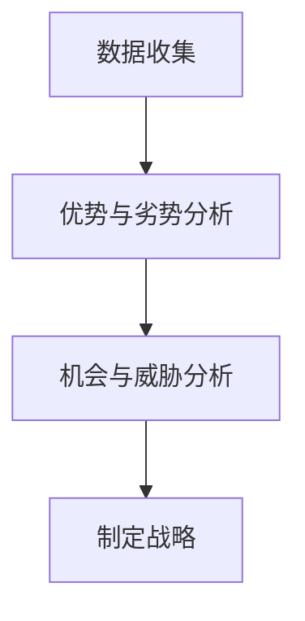

### 3.3 SWOT分析案例解析

以某互联网公司为例，进行SWOT分析。

#### 优势（Strengths）

1. **技术优势**：公司拥有自主研发的核心技术，具有较强的技术竞争力。
2. **品牌优势**：公司在行业内具有较高的品牌知名度和美誉度。
3. **团队优势**：公司拥有一支高素质、有经验的管理和研发团队。

#### 劣势（Weaknesses）

1. **市场推广不足**：公司的市场推广力度不够，用户认知度较低。
2. **产品线单一**：目前公司产品线较为单一，需要拓展更多产品。
3. **运营成本高**：公司的运营成本较高，需要优化成本结构。

#### 机会（Opportunities）

1. **市场需求大**：互联网行业市场需求持续增长，公司有机会扩大市场份额。
2. **技术迭代快**：技术更新迭代快，公司有机会在技术前沿保持竞争力。
3. **政策支持**：政府加大对互联网行业的支持力度，公司有机会获得政策红利。

#### 威胁（Threats）

1. **竞争激烈**：互联网行业竞争激烈，公司需要应对其他竞争对手的挑战。
2. **网络安全风险**：网络安全风险高，需要加强网络安全防护。
3. **法律法规变化**：法律法规变化可能对公司运营产生影响。

### SWOT分析表

```markdown
|       | 优势（Strengths） | 劣势（Weaknesses） | 机会（Opportunities） | 威胁（Threats） |
|-------|-------------------|-------------------|---------------------|----------------|
| 技术  | 自主研发的核心技术 | 市场推广不足       | 互联网行业市场需求增长 | 竞争激烈       |
| 品牌  | 高品牌知名度       | 产品线单一         | 政府支持互联网行业    | 网络安全风险   |
| 团队  | 高素质团队         | 运营成本高         | 技术迭代快           | 法律法规变化   |
```

### SWOT分析的应用

通过SWOT分析，企业可以制定以下战略：

1. **强化优势**：利用公司的技术优势、品牌优势和团队优势，提升公司的核心竞争力。
2. **改进劣势**：通过市场推广、产品研发和成本控制，改进公司的劣势。
3. **抓住机会**：抓住市场需求增长、技术迭代和政策支持等机会，扩大市场份额。
4. **规避威胁**：加强网络安全防护，关注法律法规变化，降低公司面临的风险。

---

## 第4章：PEST分析

### 4.1 PEST分析的概念

PEST分析是一种宏观环境分析工具，用于评估企业外部环境中的政治（Political）、经济（Economic）、社会（Social）和技术（Technological）等因素，以帮助制定企业的战略规划。通过PEST分析，企业可以更好地了解外部环境的变化，把握市场趋势，制定适应市场需求的战略。

#### PEST分析的核心概念

- **政治因素（Political）**：涉及政府政策、法律法规、贸易政策等方面的因素。
- **经济因素（Economic）**：涉及经济增长、通货膨胀、利率、失业率等方面的因素。
- **社会因素（Social）**：涉及人口结构、教育水平、文化背景、消费习惯等方面的因素。
- **技术因素（Technological）**：涉及技术创新、技术发展水平、技术标准等方面的因素。

#### PEST分析的意义

PEST分析的意义在于：

1. **指导战略规划**：通过分析外部环境，企业可以更好地了解外部环境的变化趋势，为企业的战略规划提供依据。
2. **发现市场机会**：通过分析外部环境，企业可以发现潜在的市场机会，抓住市场趋势，制定相应的战略。
3. **规避市场风险**：通过分析外部环境，企业可以识别潜在的市场风险，提前制定应对策略，降低风险。
4. **优化资源配置**：根据PEST分析的结果，企业可以合理配置资源，提高运营效率，降低成本。

### 4.2 PEST分析的步骤

进行PEST分析通常包括以下步骤：

1. **确定分析目标**：明确PEST分析的目的，例如了解某一特定市场的政治、经济、社会和技术环境。
2. **收集数据**：通过多种渠道收集与政治、经济、社会和技术相关的数据，如政府报告、行业报告、学术论文等。
3. **处理和分析数据**：对收集到的数据进行分析，提取有用的信息，识别外部环境的变化趋势。
4. **评估影响因素**：根据分析结果，评估政治、经济、社会和技术因素对企业的影响。
5. **制定战略**：根据外部环境的变化趋势和影响因素，制定相应的战略和行动计划。

#### PEST分析步骤的流程图

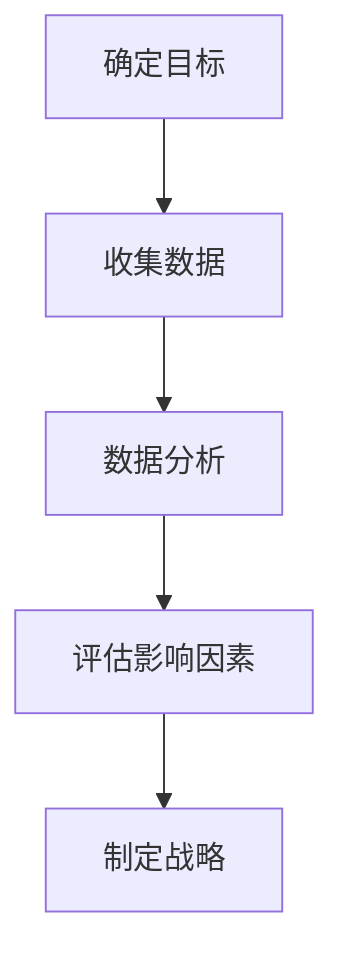

### 4.3 PEST分析案例解析

以某制造业企业为例，进行PEST分析。

#### 政治因素分析

1. **政府政策**：分析政府对制造业的支持政策，如税收优惠、产业补贴等。
2. **法律法规**：分析制造业相关的法律法规，如环境保护法、安全生产法等。
3. **贸易政策**：分析制造业的进出口政策，如关税、配额等。

**政治因素分析示例：**

- **政府政策**：政府加大对制造业的扶持力度，提供税收减免和产业补贴。
- **法律法规**：环境保护法严格，企业需要加强环保措施。
- **贸易政策**：进口原材料关税降低，有利于降低生产成本。

#### 经济因素分析

1. **经济增长**：分析国内经济增长状况，如GDP增长率、工业增加值等。
2. **通货膨胀**：分析通货膨胀率，如物价水平、消费者价格指数等。
3. **利率**：分析利率水平，如贷款利率、存款利率等。

**经济因素分析示例：**

- **经济增长**：国内经济增长稳定，市场需求增加。
- **通货膨胀**：通货膨胀率上升，可能导致成本上升。
- **利率**：贷款利率较低，有利于企业融资。

#### 社会因素分析

1. **人口结构**：分析人口年龄结构、性别比例等。
2. **教育水平**：分析受教育程度，如高中及以上学历比例等。
3. **消费习惯**：分析消费者的消费习惯和偏好。

**社会因素分析示例：**

- **人口结构**：人口老龄化趋势明显，需要关注老年市场需求。
- **教育水平**：受教育程度提高，消费者对产品质量要求更高。
- **消费习惯**：消费者更加注重环保和健康，企业需要调整产品策略。

#### 技术因素分析

1. **技术创新**：分析制造业的技术发展趋势，如人工智能、物联网等。
2. **技术发展水平**：分析国内制造业的技术水平，如研发投入、专利数量等。
3. **技术标准**：分析国际和国内的技术标准，如ISO标准、国家标准等。

**技术因素分析示例：**

- **技术创新**：人工智能技术在制造业中的应用逐渐普及，企业需要关注技术进步。
- **技术发展水平**：国内制造业的技术水平较高，具备一定的国际竞争力。
- **技术标准**：国际标准对企业的产品质量和环保要求较高，企业需要符合相关标准。

### PEST分析表

```markdown
|       | 政治因素（Political） | 经济因素（Economic） | 社会因素（Social） | 技术因素（Technological） |
|-------|----------------------|---------------------|-------------------|-------------------------|
| 政府政策 | 政府扶持力度大       | 经济增长稳定        | 人口老龄化       | 技术创新快              |
| 法律法规 | 环保法规严格         | 通货膨胀率上升      | 教育水平提高     | 技术发展水平高          |
| 贸易政策 | 进口关税降低         | 利率较低           | 消费习惯改变     | 国际标准要求高          |
```

### PEST分析的应用

通过PEST分析，企业可以制定以下战略：

1. **政治战略**：利用政府政策支持，降低成本，提高竞争力。
2. **经济战略**：关注经济增长趋势，抓住市场机会，扩大市场份额。
3. **社会战略**：关注消费者需求变化，调整产品策略，满足市场需求。
4. **技术战略**：关注技术创新，提高技术实力，保持行业竞争力。

---

## 第5章：五力模型

### 5.1 五力模型的概念

五力模型（Porter's Five Forces）是由著名战略学家迈克尔·波特提出的一种用于分析行业竞争力的工具。该模型通过分析五种竞争力因素，帮助企业了解行业的竞争态势，制定相应的战略。这五种竞争力因素分别是：

1. **供应商谈判能力**：指供应商在市场上具有的议价能力，影响供应商提供产品或服务的价格和条件。
2. **买家谈判能力**：指买家在市场上具有的议价能力，影响买家购买产品或服务的价格和条件。
3. **产品替代威胁**：指市场上存在的替代产品或服务的威胁，影响企业的市场份额和利润水平。
4. **市场进入威胁**：指潜在竞争者进入市场的威胁，影响现有企业的市场份额和利润水平。
5. **新进入者的威胁**：指新进入者对市场现有竞争格局的威胁，影响行业的竞争态势。

#### 五力模型的基本原理

五力模型的基本原理是通过分析这五种竞争力因素，评估行业的竞争强度和潜在盈利能力。具体来说：

- **供应商谈判能力**：如果供应商谈判能力强，供应商的产品或服务价格高，企业成本上升，行业利润率下降。
- **买家谈判能力**：如果买家谈判能力强，买家的购买条件苛刻，企业的产品或服务价格下降，行业利润率下降。
- **产品替代威胁**：如果市场上存在较强的替代产品或服务，企业的市场份额和利润水平受到威胁。
- **市场进入威胁**：如果潜在竞争者容易进入市场，现有企业的市场份额和利润水平受到威胁。
- **新进入者的威胁**：如果新进入者具有强大的资源和能力，行业的竞争态势会发生变化。

#### 五力模型的应用

五力模型广泛应用于行业分析、企业竞争战略制定、投资决策等方面。通过五力模型，企业可以：

1. **评估行业竞争强度**：了解行业中的竞争态势，判断行业的盈利能力。
2. **制定竞争战略**：根据五力模型的结果，制定相应的竞争战略，如差异化战略、集中战略等。
3. **投资决策**：通过五力模型分析潜在投资项目的行业前景，评估投资风险和回报。

### 5.2 五力模型的步骤

进行五力模型分析通常包括以下步骤：

1. **确定分析对象**：明确需要分析的行业或市场。
2. **收集数据**：收集与五种竞争力因素相关的数据，如供应商数量、买家数量、产品替代情况等。
3. **分析供应商谈判能力**：分析供应商在市场中的地位、供应商数量、供应稳定性等因素。
4. **分析买家谈判能力**：分析买家的集中度、买家的议价能力等因素。
5. **分析产品替代威胁**：分析市场上存在的替代产品或服务，评估替代品的威胁程度。
6. **分析市场进入威胁**：分析潜在竞争者的数量、进入市场的障碍等因素。
7. **分析新进入者的威胁**：分析新进入者的资源、能力、市场策略等因素。
8. **综合评估**：根据分析结果，综合评估行业的竞争强度和潜在盈利能力。

#### 五力模型分析步骤的流程图

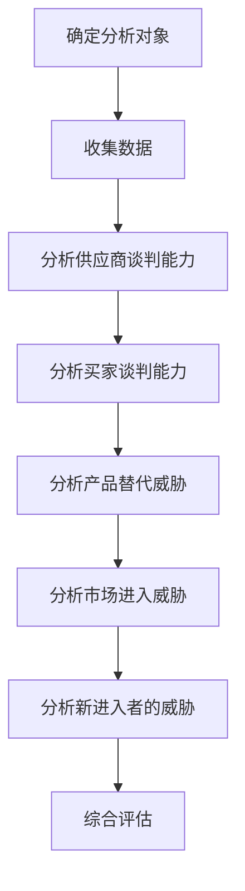

### 5.3 五力模型案例解析

以智能手机行业为例，进行五力模型分析。

#### 供应商谈判能力分析

1. **供应商地位**：智能手机行业的核心供应商包括高通、三星、台积电等，这些供应商在市场中具有较大的影响力。
2. **供应商数量**：智能手机行业中有多个核心供应商，供应商数量较多，有助于企业选择最佳供应商。
3. **供应稳定性**：智能手机行业对供应商的供应稳定性要求较高，核心供应商通常能够保证稳定的供应。

**供应商谈判能力分析示例：**

- **供应商地位**：高通在智能手机处理器市场占据主导地位。
- **供应商数量**：多家供应商竞争，有助于降低采购成本。
- **供应稳定性**：三星作为存储芯片的主要供应商，能够保证稳定的供应。

#### 买家谈判能力分析

1. **买家集中度**：智能手机行业的买家主要是苹果、三星、华为等大型企业，买家集中度较高。
2. **买家议价能力**：大型买家具有较大的议价能力，能够影响供应商的产品价格和条件。

**买家谈判能力分析示例：**

- **买家集中度**：苹果、三星和华为等大型企业在智能手机市场中占据较大份额。
- **买家议价能力**：大型买家在采购时能够获得更优惠的价格和条件。

#### 产品替代威胁分析

1. **替代产品**：智能手机市场上存在多种替代品，如功能手机、平板电脑、智能手表等。
2. **替代品威胁程度**：替代品的威胁程度取决于替代品的性能、价格和市场接受度。

**产品替代威胁分析示例：**

- **替代产品**：功能手机在特定市场（如发展中国家）仍有一定的市场份额。
- **替代品威胁程度**：高端智能手机的替代品（如平板电脑）在性能和价格上具有一定优势。

#### 市场进入威胁分析

1. **潜在竞争者数量**：智能手机行业中有大量潜在竞争者，包括传统手机制造商和新兴科技企业。
2. **进入市场障碍**：智能手机行业的技术门槛、资金门槛和品牌建设等构成较高的进入市场障碍。

**市场进入威胁分析示例：**

- **潜在竞争者数量**：小米、OPPO、vivo等新兴企业不断进入智能手机市场。
- **进入市场障碍**：技术创新和品牌建设需要大量投入，对新进入者构成较高障碍。

#### 新进入者的威胁分析

1. **新进入者的资源**：新进入者通常具有强大的资金和技术支持。
2. **新进入者的能力**：新进入者具备快速响应市场变化和创新能力。

**新进入者的威胁分析示例：**

- **新进入者的资源**：华为、小米等企业具备强大的研发能力和市场推广能力。
- **新进入者的能力**：新进入者能够迅速推出创新产品，满足市场需求。

### 五力模型分析表

```markdown
|          | 供应商谈判能力 | 买家谈判能力 | 产品替代威胁 | 市场进入威胁 | 新进入者的威胁 |
|----------|-----------------|--------------|---------------|--------------|----------------|
| 供应商   | 强             | 中           | 弱            | 中           | 强             |
| 买家     | 中             | 强           | 弱            | 中           | 强             |
| 替代品   | 中             | 中           | 强            | 强           | 中             |
| 进入者   | 中             | 中           | 中            | 强           | 强             |
```

### 五力模型的应用

通过五力模型分析，智能手机行业的企业可以制定以下战略：

1. **供应商谈判能力**：通过与供应商建立长期合作关系，提高供应商的供应稳定性，降低采购成本。
2. **买家谈判能力**：通过提升品牌影响力和市场份额，增强买家的议价能力。
3. **产品替代威胁**：通过产品创新和技术升级，减少替代品的威胁。
4. **市场进入威胁**：通过技术创新和品牌建设，提高进入市场的门槛，保护现有市场份额。
5. **新进入者的威胁**：通过持续的创新和市场推广，保持竞争优势，抵御新进入者的威胁。

---

## 第6章：竞争分析

### 6.1 竞争者的识别

竞争者的识别是竞争分析的第一步，它涉及识别行业内直接竞争者、间接竞争者和潜在竞争者。

#### 6.1.1 直接竞争者

直接竞争者是提供相同或类似产品或服务的公司。在智能手机行业中，直接竞争者包括苹果、三星、华为、小米、OPPO和vivo等。

**识别直接竞争者的方法：**

1. **市场份额**：分析行业内主要公司的市场份额，识别市场份额较大的企业。
2. **产品特性**：分析企业的产品特性，如性能、价格、功能等，识别具有相似特性的企业。
3. **品牌知名度**：分析企业的品牌知名度，识别在市场上具有较高知名度的企业。

#### 6.1.2 间接竞争者

间接竞争者是提供其他但能满足相同需求的产品的公司。在智能手机行业中，间接竞争者包括平板电脑、智能手表、智能家居设备等。

**识别间接竞争者的方法：**

1. **消费者需求**：分析消费者的需求，识别哪些产品或服务能够满足相同的消费需求。
2. **替代品**：分析市场上存在的替代品，识别哪些产品或服务能够替代智能手机。

#### 6.1.3 潜在竞争者

潜在竞争者是即将进入市场的公司。在智能手机行业中，潜在竞争者包括传统手机制造商、新兴科技企业等。

**识别潜在竞争者的方法：**

1. **行业趋势**：分析行业的发展趋势，识别哪些公司可能进入市场。
2. **市场机会**：分析市场上的机会，识别哪些公司可能抓住机会进入市场。
3. **投资动向**：分析企业的投资动向，识别哪些公司可能涉足智能手机行业。

### 6.2 竞争策略分析

竞争策略分析是评估竞争者的策略，包括产品策略、市场定位、渠道策略等。

#### 6.2.1 产品策略

产品策略是竞争者的产品和服务策略，包括产品特性、价格策略、品牌策略等。

**产品策略分析示例：**

- **产品特性**：苹果注重产品的设计和用户体验，推出高端智能手机。
- **价格策略**：小米以高性价比的产品策略，吸引大量年轻消费者。
- **品牌策略**：华为注重技术创新和品牌形象，提高品牌知名度和美誉度。

#### 6.2.2 市场定位

市场定位是竞争者在市场中的定位，包括目标市场、市场细分等。

**市场定位分析示例：**

- **目标市场**：苹果定位高端市场，主要面向高端消费者。
- **市场细分**：小米定位中低端市场，通过细分市场满足不同消费者的需求。

#### 6.2.3 渠道策略

渠道策略是竞争者销售渠道的安排，包括线上渠道、线下渠道等。

**渠道策略分析示例：**

- **线上渠道**：小米主要依靠线上销售，通过电商渠道快速扩张市场份额。
- **线下渠道**：苹果和华为同时拥有线上和线下销售渠道，通过线上线下融合提高市场覆盖。

### 6.3 竞争分析案例解析

以智能手机行业为例，进行竞争分析。

#### 直接竞争者分析

**苹果**

- **产品策略**：苹果注重产品的设计和用户体验，推出高端智能手机。
- **市场定位**：苹果定位高端市场，主要面向高端消费者。
- **渠道策略**：苹果采用线上线下结合的渠道策略，提高市场覆盖。

**三星**

- **产品策略**：三星注重技术创新和产品多样性，推出多种型号的智能手机。
- **市场定位**：三星定位中高端市场，通过不同型号满足不同消费者的需求。
- **渠道策略**：三星采用线上线下结合的渠道策略，提高市场覆盖。

**华为**

- **产品策略**：华为注重技术创新和品牌形象，推出高端智能手机。
- **市场定位**：华为定位中高端市场，通过技术创新提高品牌知名度和美誉度。
- **渠道策略**：华为采用线上线下结合的渠道策略，提高市场覆盖。

#### 间接竞争者分析

**平板电脑**

- **产品策略**：平板电脑注重便携性和多媒体体验，与智能手机具有一定的替代性。
- **市场定位**：平板电脑定位中高端市场，主要面向商务和娱乐消费者。
- **渠道策略**：平板电脑采用线上线下结合的渠道策略，提高市场覆盖。

**智能手表**

- **产品策略**：智能手表注重健康管理、运动追踪等功能，与智能手机形成互补。
- **市场定位**：智能手表定位中高端市场，主要面向健康和运动爱好者。
- **渠道策略**：智能手表采用线上线下结合的渠道策略，提高市场覆盖。

#### 潜在竞争者分析

**传统手机制造商**

- **产品策略**：传统手机制造商在智能手机领域具有丰富的经验，推出具有竞争力的智能手机。
- **市场定位**：传统手机制造商定位中低端市场，通过价格优势和性价比吸引消费者。
- **渠道策略**：传统手机制造商采用线上线下结合的渠道策略，提高市场覆盖。

**新兴科技企业**

- **产品策略**：新兴科技企业注重技术创新和用户体验，推出具有创新性的智能手机。
- **市场定位**：新兴科技企业定位中高端市场，通过技术创新和用户体验提高品牌知名度。
- **渠道策略**：新兴科技企业采用线上销售策略，通过电商平台快速扩张市场份额。

### 竞争分析表

```markdown
| 竞争者   | 产品策略             | 市场定位       | 渠道策略     |
|----------|----------------------|----------------|--------------|
| 苹果     | 高端设计、用户体验   | 高端市场       | 线上+线下    |
| 三星     | 技术创新、产品多样性 | 中高端市场     | 线上+线下    |
| 华为     | 技术创新、品牌形象   | 中高端市场     | 线上+线下    |
| 平板电脑 | 便携性、多媒体体验   | 中高端市场     | 线上+线下    |
| 智能手表 | 健康管理、运动追踪   | 中高端市场     | 线上+线下    |
| 传统手机制造商 | 价格优势、性价比 | 中低端市场   | 线上+线下    |
| 新兴科技企业 | 创新技术、用户体验 | 中高端市场   | 线上        |
```

### 竞争分析的应用

通过竞争分析，智能手机行业的企业可以制定以下战略：

1. **产品策略**：通过产品创新和提高产品质量，提升竞争力。
2. **市场定位**：通过细分市场和定位，满足不同消费者的需求。
3. **渠道策略**：通过线上线下结合的渠道策略，提高市场覆盖和销售效率。
4. **品牌建设**：通过提高品牌知名度和美誉度，增强消费者忠诚度。
5. **技术创新**：通过持续的技术创新，保持行业领先地位。

---

## 第7章：市场调研

### 7.1 市场调研的类型

市场调研是了解市场需求、消费者行为和行业趋势的重要手段。根据调研的目的和方法，市场调研可以分为以下几种类型：

#### 7.1.1 定量调研

定量调研是通过收集大量数据，采用统计分析方法来分析市场趋势和消费者行为。定量调研的方法包括：

- **问卷调查**：通过设计问卷，收集大量消费者的反馈信息。
- **电话访谈**：通过电话与消费者进行一对一访谈，获取详细的市场信息。
- **在线调查**：通过在线平台，收集大量消费者的意见和反馈。

#### 7.1.2 定性调研

定性调研是通过深入访谈、焦点小组讨论等方式，了解消费者的需求和偏好。定性调研的方法包括：

- **深度访谈**：通过与消费者进行一对一深入访谈，了解消费者的真实想法和需求。
- **焦点小组**：组织一组消费者进行讨论，收集他们对产品或服务的看法和建议。
- **行为观察**：通过观察消费者在购买过程中的行为，了解他们的购买习惯和决策过程。

#### 7.1.3 实验性调研

实验性调研是通过实验设计，验证假设和市场策略的有效性。实验性调研的方法包括：

- **实验室测试**：在受控环境中，对产品或服务进行测试，评估其性能和消费者接受度。
- **现场测试**：在真实市场环境中，对产品或服务进行测试，观察消费者的反应和购买行为。

### 7.2 市场调研的方法

市场调研的方法多种多样，根据调研的目的和资源，可以选择合适的方法。以下是常用的市场调研方法：

#### 7.2.1 文案调研

文案调研是通过收集和整理现有的文献资料，了解市场情况和消费者行为。文案调研的方法包括：

- **行业报告**：通过购买或获取行业研究报告，了解行业的发展趋势和市场情况。
- **市场文献**：通过阅读市场相关的书籍、论文和杂志，了解市场理论和实践。
- **企业资料**：通过收集和整理企业的财务报表、年报、市场分析报告等，了解企业的运营情况。

#### 7.2.2 实地调研

实地调研是直接进入市场，通过观察、访谈等方式收集第一手数据。实地调研的方法包括：

- **现场观察**：通过实地观察，了解消费者的购买行为和市场情况。
- **访问调查**：通过面对面的访谈，获取详细的市场信息和消费者意见。
- **市场抽样**：通过对特定区域或人群进行抽样调查，了解市场的情况。

#### 7.2.3 调查问卷

调查问卷是通过设计问卷，收集消费者的意见和反馈。调查问卷的方法包括：

- **纸质问卷**：通过发放纸质问卷，收集消费者的意见和反馈。
- **在线问卷**：通过在线平台，收集消费者的意见和反馈。
- **电话问卷**：通过电话与消费者进行访谈，收集他们的意见和反馈。

#### 7.2.4 焦点小组

焦点小组是通过组织一组消费者进行讨论，收集他们对产品或服务的看法和建议。焦点小组的方法包括：

- **主题讨论**：围绕特定的主题，组织消费者进行讨论，收集他们的意见和反馈。
- **开放式讨论**：鼓励消费者自由表达对产品或服务的看法，收集他们的建议和意见。
- **引导式讨论**：通过引导消费者思考，激发他们的创意和想法，收集有价值的意见和建议。

### 7.3 市场调研案例解析

以某电商平台为例，进行市场调研。

#### 定量调研

1. **问卷调查**：通过在线问卷，收集大量消费者的购物体验、满意度、购买行为等信息。
2. **数据分析**：对收集到的数据进行分析，了解消费者的购买偏好、购物习惯等。

#### 定性调研

1. **深度访谈**：与消费者进行一对一访谈，了解他们的购物体验、满意度和建议。
2. **焦点小组**：组织一组消费者进行讨论，收集他们对电商平台的看法和建议。

#### 实验性调研

1. **A/B测试**：通过对比不同版本的电商平台的用户行为，了解哪种版本更能满足用户需求。
2. **实验设计**：通过控制变量，验证不同营销策略的效果。

### 市场调研结果

通过市场调研，电商平台获得了以下结果：

1. **购买偏好**：消费者更倾向于购买性价比高的产品。
2. **购物习惯**：消费者更喜欢在线购物，特别是通过移动端购物。
3. **满意度**：消费者对电商平台的整体满意度较高，但在物流配送和售后服务方面还有改进空间。
4. **建议**：消费者建议电商平台提供更多优惠活动，提高产品多样性。

### 市场调研的应用

通过市场调研，电商平台可以制定以下策略：

1. **产品策略**：根据消费者的购买偏好，优化产品结构，提高产品性价比。
2. **营销策略**：通过提供更多优惠活动，提高消费者的购物体验。
3. **服务策略**：通过改进物流配送和售后服务，提高消费者的满意度。
4. **创新策略**：通过持续的市场调研，发现新的市场机会，保持竞争优势。

---

## 第8章：创业项目市场分析

### 8.1 创业项目市场分析的要点

创业项目市场分析是评估创业项目市场潜力和可行性的重要环节。在进行创业项目市场分析时，需要关注以下几个要点：

#### 8.1.1 市场机会

市场机会是创业项目成功的关键因素之一。分析市场机会时，需要关注以下方面：

- **市场需求**：了解市场上是否存在未被满足的需求，如新产品、新服务等。
- **市场趋势**：分析市场的未来发展趋势，如技术进步、消费者行为变化等。
- **竞争环境**：评估市场中的竞争状况，了解竞争对手的优势和劣势。

#### 8.1.2 市场容量

市场容量是衡量市场潜力的重要指标。分析市场容量时，需要关注以下方面：

- **市场规模**：了解市场的整体规模，如总销售额、市场份额等。
- **增长速度**：分析市场的增长速度，如年均增长率等。
- **潜在消费者**：评估潜在消费者的数量和分布，如年龄、性别、收入等。

#### 8.1.3 消费者需求

了解消费者需求是制定营销策略和产品设计的基础。分析消费者需求时，需要关注以下方面：

- **需求特点**：了解消费者的需求特点，如价格敏感度、品质要求等。
- **消费习惯**：分析消费者的消费习惯，如购买频率、购买渠道等。
- **需求变化**：关注消费者需求的变化趋势，如环保意识增强、健康需求增加等。

#### 8.1.4 竞争态势

竞争态势是影响创业项目成功的重要因素。分析竞争态势时，需要关注以下方面：

- **竞争者**：识别市场中的主要竞争者，分析他们的产品、价格、市场策略等。
- **市场份额**：了解主要竞争者在市场中的份额，评估他们的市场地位。
- **竞争优势**：分析主要竞争者的竞争优势，如品牌、技术、渠道等。

### 8.2 创业项目市场分析案例解析

以某健康食品创业项目为例，进行市场分析。

#### 市场机会

1. **市场需求**：随着人们对健康意识的提高，对健康食品的需求逐渐增加。
2. **市场趋势**：健康食品市场呈现出多元化、高端化、定制化的发展趋势。
3. **竞争环境**：目前市场上已有一些知名的健康食品品牌，但仍有较大的市场空白点。

#### 市场容量

1. **市场规模**：根据行业报告，全球健康食品市场规模逐年扩大，预计未来几年将继续增长。
2. **增长速度**：健康食品市场的年均增长率较高，预计未来几年将保持两位数的增长速度。
3. **潜在消费者**：随着人口老龄化和健康意识的提高，潜在消费者数量增加。

#### 消费者需求

1. **需求特点**：消费者对健康食品的需求主要集中在低糖、低脂、高纤维等方面。
2. **消费习惯**：消费者更倾向于通过线上渠道购买健康食品，特别是通过电商平台。
3. **需求变化**：随着消费者对健康食品的了解加深，对产品的品质和安全性要求更高。

#### 竞争态势

1. **竞争者**：市场上已有一些知名的健康食品品牌，如安利、康宝莱等。
2. **市场份额**：主要竞争者在市场中的份额较为稳定，但仍有较大的市场份额可以争夺。
3. **竞争优势**：主要竞争者主要依靠品牌影响力、产品质量和渠道优势。

### 市场分析结果

通过对健康食品创业项目的市场分析，得出以下结果：

1. **市场机会**：健康食品市场具有较大的发展潜力，特别是在细分市场上。
2. **市场容量**：健康食品市场容量庞大，且增长速度较快。
3. **消费者需求**：消费者对健康食品的需求多样，且越来越注重品质和安全性。
4. **竞争态势**：市场上已有一些知名品牌，但仍有较大的市场空间。

### 市场分析的应用

基于市场分析结果，健康食品创业项目可以制定以下策略：

1. **市场定位**：专注于某一细分市场，如高端健康食品或功能性健康食品。
2. **产品策略**：注重产品质量和安全性，提供差异化的健康食品。
3. **营销策略**：通过线上渠道和社交媒体，提高品牌知名度和消费者认可度。
4. **渠道策略**：与电商平台和线下零售商合作，拓展销售渠道。

---

## 第9章：市场战略规划

### 9.1 市场战略的类型

市场战略是企业根据市场环境、自身资源和竞争对手情况制定的长期计划，以实现市场目标。市场战略可以分为以下几种类型：

#### 9.1.1 扩张战略

扩张战略是企业通过扩大市场份额，提高品牌知名度，实现规模效应的一种战略。扩张战略的具体类型包括：

- **市场份额扩张**：通过降低价格、增加广告投放等方式，提高市场份额。
- **区域扩张**：通过开拓新市场，扩大企业的地理覆盖范围。
- **产品线扩张**：通过增加产品种类，满足不同消费者的需求。

#### 9.1.2 差异化战略

差异化战略是企业通过提供独特的产品或服务，满足不同消费者的需求，形成竞争优势的一种战略。差异化战略的具体类型包括：

- **产品差异化**：通过技术创新、设计创新等方式，提供独特的产品。
- **服务差异化**：通过提供优质的客户服务，提高消费者的满意度和忠诚度。
- **品牌差异化**：通过塑造独特的品牌形象，提高品牌知名度和美誉度。

#### 9.1.3 集中战略

集中战略是企业专注于某一细分市场，提供针对性的产品或服务，以获得市场份额和竞争优势的一种战略。集中战略的具体类型包括：

- **市场集中**：企业专注于某一特定的市场领域，提供专门的产品或服务。
- **产品集中**：企业专注于某一特定的产品或服务，提供多样化的产品组合。

#### 9.1.4 多元化战略

多元化战略是企业通过进入新的市场领域，提供新的产品或服务，实现企业多元化发展的一种战略。多元化战略的具体类型包括：

- **横向多元化**：企业在同一行业领域内，提供新的产品或服务。
- **纵向多元化**：企业在不同的行业领域内，提供新的产品或服务。
- **混合多元化**：企业同时在多个行业领域内，提供新的产品或服务。

### 9.2 市场战略的制定

制定市场战略需要考虑以下因素：

#### 9.2.1 市场环境分析

市场环境分析是制定市场战略的基础，包括宏观环境分析、行业环境分析和竞争态势分析等。通过市场环境分析，企业可以了解外部环境的变化趋势，把握市场机会和风险。

#### 9.2.2 自身资源分析

自身资源分析是制定市场战略的重要环节，包括企业的财务资源、人力资源、技术资源等。通过自身资源分析，企业可以明确自身的优势和劣势，制定符合自身能力的发展战略。

#### 9.2.3 竞争对手分析

竞争对手分析是制定市场战略的关键，包括识别竞争对手、分析竞争对手的战略和优势等。通过竞争对手分析，企业可以了解竞争对手的动向，制定针对性的战略，提升竞争力。

#### 9.2.4 市场需求分析

市场需求分析是制定市场战略的核心，包括了解消费者的需求、购买习惯和偏好等。通过市场需求分析，企业可以制定满足消费者需求的产品和服务策略。

### 9.3 市场战略实施案例解析

以某新兴科技企业为例，进行市场战略制定和实施。

#### 市场环境分析

1. **宏观环境**：全球科技行业快速发展，人工智能、物联网等技术得到广泛应用。
2. **行业环境**：科技行业竞争激烈，创新速度加快，市场机会和风险并存。
3. **竞争态势**：市场上已有一些领先企业，但仍有较大的市场空间。

#### 自身资源分析

1. **财务资源**：企业资金充足，具备一定的研发和运营能力。
2. **人力资源**：企业拥有一支高素质的团队，具备丰富的技术和管理经验。
3. **技术资源**：企业拥有自主研发的核心技术，具备创新优势。

#### 竞争对手分析

1. **竞争对手**：市场上已有几家领先企业，但市场份额分散。
2. **竞争对手战略**：竞争对手主要依靠技术创新和品牌影响力。
3. **竞争对手优势**：竞争对手在技术研发和市场推广方面具备优势。

#### 市场需求分析

1. **市场需求**：消费者对智能科技产品的需求不断增加，特别是智能家居、智能医疗等领域。
2. **购买习惯**：消费者更倾向于通过线上渠道购买智能科技产品。
3. **需求变化**：随着消费者对智能化、个性化和便捷化的需求增加，市场机会增加。

### 市场战略制定

基于市场环境分析、自身资源分析和竞争对手分析，企业制定以下市场战略：

#### 扩张战略

1. **市场份额扩张**：通过降低价格、增加广告投放等方式，提高市场份额。
2. **区域扩张**：开拓新的市场，特别是发展中国家市场。
3. **产品线扩张**：增加产品种类，提供多样化的智能科技产品。

#### 差异化战略

1. **产品差异化**：通过技术创新，提供具有独特功能的智能科技产品。
2. **服务差异化**：提供优质的客户服务，提高消费者满意度和忠诚度。
3. **品牌差异化**：通过品牌塑造，提高品牌知名度和美誉度。

#### 集中战略

1. **市场集中**：专注于智能家居、智能医疗等细分市场。
2. **产品集中**：专注于智能科技产品，提供多样化的产品组合。

### 市场战略实施

1. **研发创新**：加大研发投入，提高产品技术含量，保持技术领先地位。
2. **市场推广**：通过线上线下渠道，提高品牌知名度和消费者认可度。
3. **客户服务**：提供优质的客户服务，提高消费者满意度和忠诚度。

### 市场战略效果评估

通过市场战略的实施，企业实现了以下效果：

1. **市场份额提高**：市场份额逐年增长，成为行业领先企业。
2. **品牌知名度提升**：品牌知名度显著提高，消费者认可度增加。
3. **销售额增长**：销售额逐年增长，实现了业绩目标。

### 市场战略的应用

通过市场战略的制定和实施，企业可以更好地适应市场环境，抓住市场机会，提升竞争力。同时，企业可以根据市场战略的效果，不断调整和优化战略，实现持续发展。

---

## 第10章：市场分析工具与资源

### 10.1 市场分析工具

市场分析工具是进行市场分析的重要辅助工具，可以帮助企业收集、处理和分析市场数据。以下是几种常用的市场分析工具：

#### 10.1.1 数据分析工具

- **Excel**：用于数据整理、计算和图表制作，简单易用。
- **Python**：用于复杂的数据分析和机器学习，功能强大。
- **R**：专门用于统计分析和图形表示，适用于高级数据分析。

#### 10.1.2 问卷调查工具

- **问卷星**：提供在线问卷调查设计、发布和数据分析服务。
- **问卷网**：提供专业的问卷调查平台，支持多种题型和数据分析功能。

#### 10.1.3 竞争分析工具

- **百度统计**：用于网站流量分析和用户行为分析。
- **Alexa**：提供网站排名和流量分析服务，帮助企业了解竞争对手的网站表现。

### 10.2 市场分析资源推荐

市场分析资源是进行市场分析的重要参考资料，可以帮助企业深入了解市场和行业。以下是几种常用的市场分析资源：

#### 10.2.1 市场研究报告

- **市场调研公司报告**：如艾瑞咨询、高德纳等，提供详细的市场分析和行业趋势报告。
- **行业协会报告**：如中国电子商务协会、中国互联网协会等，提供行业数据和分析报告。

#### 10.2.2 学术论文

- **学术期刊**：如《管理学报》、《中国管理科学》等，提供市场分析相关的理论研究和实证分析。
- **学术论文数据库**：如CNKI、Web of Science等，提供丰富的市场分析相关论文。

#### 10.2.3 专业书籍

- **《市场分析：实战策略与工具》**：提供市场分析的方法和工具，适用于初学者和实践者。
- **《营销管理：分析、规划、执行和控制》**：详细介绍营销管理的各个过程，包括市场分析。
- **《消费者行为学》**：研究消费者购买行为和市场分析的理论基础。

### 10.3 市场分析工具使用教程

以下是一份简要的市场分析工具使用教程，帮助用户快速上手使用这些工具。

#### 10.3.1 数据分析工具使用教程

- **Excel使用教程**：介绍Excel的基本操作、公式函数、图表制作等。
- **Python数据分析教程**：介绍Python环境搭建、数据操作、数据分析库使用等。
- **R数据分析教程**：介绍R语言的基本语法、数据处理、统计建模等。

#### 10.3.2 问卷调查工具使用教程

- **问卷星使用教程**：介绍问卷星平台的使用方法、问卷设计、数据分析等。
- **问卷网使用教程**：介绍问卷网平台的使用方法、问卷设计、数据分析等。

#### 10.3.3 竞争分析工具使用教程

- **百度统计使用教程**：介绍百度统计的安装、配置、数据分析等功能。
- **Alexa使用教程**：介绍Alexa网站排名、流量分析、关键词研究等。

### 10.4 市场分析资源获取方法

以下是一份简要的市场分析资源获取方法，帮助用户获取有用的市场分析资源。

#### 10.4.1 市场研究报告获取

- **付费报告**：通过购买市场调研公司或行业协会发布的报告。
- **免费报告**：通过官方网站、公众号等获取免费的市场报告。

#### 10.4.2 学术论文获取

- **图书馆数据库**：通过学校或公共图书馆的数据库获取学术论文。
- **学术期刊网站**：直接访问学术期刊的官方网站获取论文。

#### 10.4.3 专业书籍获取

- **书店购买**：通过实体书店或在线书店购买专业书籍。
- **图书馆借阅**：通过学校或公共图书馆借阅专业书籍。

### 10.5 市场分析工具与资源应用案例

以下是一份市场分析工具与资源应用案例，帮助用户了解如何使用市场分析工具与资源进行市场分析。

#### 10.5.1 市场调研案例

- **工具使用**：使用问卷星进行问卷调查，使用Python进行数据分析。
- **资源获取**：获取市场调研公司发布的行业报告，查阅学术论文。

#### 10.5.2 竞争分析案例

- **工具使用**：使用百度统计分析网站流量，使用Alexa研究关键词排名。
- **资源获取**：获取竞争对手的官方网站数据，查阅行业报告。

#### 10.5.3 市场战略制定案例

- **工具使用**：使用Excel进行市场数据分析，使用Python进行统计建模。
- **资源获取**：获取行业研究报告，查阅相关书籍和论文。

### 10.6 市场分析工具与资源更新与升级

市场分析工具与资源随着市场和技术的发展不断更新和升级，以下是一份简要的市场分析工具与资源更新与升级指南。

#### 10.6.1 工具更新与升级

- **定期更新**：保持市场分析工具的版本更新，确保功能完善。
- **技术更新**：跟进最新技术，如大数据分析、机器学习等，提升分析能力。

#### 10.6.2 资源更新与升级

- **报告更新**：定期获取最新的市场研究报告，了解行业动态。
- **论文更新**：定期查阅最新的学术论文，掌握前沿理论和方法。

### 10.7 市场分析工具与资源应用的最佳实践

以下是一份市场分析工具与资源应用的最佳实践指南，帮助用户高效地使用市场分析工具与资源。

#### 10.7.1 数据驱动决策

- **充分利用数据分析工具**：确保数据分析的准确性和有效性。
- **基于数据制定决策**：依据数据结果，制定科学合理的市场战略。

#### 10.7.2 跨学科整合

- **结合多种工具与方法**：整合不同工具和方法，提高分析全面性。
- **跨学科应用**：结合心理学、社会学等多学科知识，深入分析市场现象。

#### 10.7.3 持续学习与优化

- **不断学习新知识**：跟进市场和技术的发展，提升自身能力。
- **持续优化策略**：根据市场变化和反馈，不断调整和优化市场战略。

---

### 附录

#### 附录1：市场分析经典案例解析

- **案例分析1**：某电商平台的竞争策略分析
  - **案例背景**：某电商平台在激烈的市场竞争中，通过差异化战略和精细化管理，实现市场份额的快速增长。
  - **案例分析**：从市场定位、产品策略、价格策略、渠道策略等方面，详细分析该电商平台的成功经验。

- **案例分析2**：某科技公司的市场进入策略分析
  - **案例背景**：某科技公司在进入新市场时，面临激烈竞争和较高的进入壁垒。
  - **案例分析**：通过详细分析该公司的市场进入策略，探讨如何在新市场中站稳脚跟。

- **案例分析3**：某制造企业的市场拓展策略分析
  - **案例背景**：某制造企业为了应对市场变化，决定进行市场拓展。
  - **案例分析**：从市场机会识别、竞争分析、战略制定等方面，详细分析该制造企业的市场拓展策略。

#### 附录2：市场分析书籍推荐

- **《市场分析：实战策略与工具》**
  - **内容概述**：本书详细介绍了市场分析的方法和工具，包括PEST分析、SWOT分析等，适用于市场营销人员和企业高管。

- **《营销管理：分析、规划、执行和控制》**
  - **内容概述**：本书从营销管理的全过程出发，详细介绍了市场分析、市场定位、营销策略制定和执行等方面的内容。

- **《消费者行为学》**
  - **内容概述**：本书研究消费者购买行为和市场分析的理论基础，包括消费者心理、消费者行为模式等方面的内容。

#### 附录3：市场分析工具使用教程

- **数据分析工具使用教程**
  - **Excel使用教程**：介绍Excel的基本操作、公式函数、图表制作等。
  - **Python数据分析教程**：介绍Python环境搭建、数据操作、数据分析库使用等。
  - **R数据分析教程**：介绍R语言的基本语法、数据处理、统计建模等。

- **问卷调查工具使用教程**
  - **问卷星使用教程**：介绍问卷星平台的使用方法、问卷设计、数据分析等。
  - **问卷网使用教程**：介绍问卷网平台的使用方法、问卷设计、数据分析等。

- **竞争分析工具使用教程**
  - **百度统计使用教程**：介绍百度统计的安装、配置、数据分析等功能。
  - **Alexa使用教程**：介绍Alexa网站排名、流量分析、关键词研究等。

---

## 总结

市场分析是创业成功的关键，它帮助企业了解市场环境、识别机会和风险，从而制定有效的战略和决策。本文通过详细解析市场分析的方法和工具，包括PEST分析、SWOT分析、五力模型等，并提供了实际案例解析，帮助读者掌握市场分析的核心技巧。同时，本文还介绍了市场分析工具与资源的使用，以及市场分析在实际应用中的最佳实践。通过本文的学习，读者可以更好地理解市场分析的重要性，提高市场分析的能力，为创业成功奠定基础。

### 作者信息

**作者：AI天才研究院/AI Genius Institute & 禅与计算机程序设计艺术 /Zen And The Art of Computer Programming**

---

## 参考资料

1. 波特，迈克尔·E. (1998). 《竞争战略：分析行业和竞争对手的方法》。华夏出版社。
2. 科特勒，菲利普·K. (2013). 《营销管理：分析、规划、执行和控制》。中国人民大学出版社。
3. 布兰森，比尔 (2010). 《创业维艰》。机械工业出版社。
4. 霍金斯，迈克尔 (2008). 《数据分析基础》。清华大学出版社。
5. 艾瑞咨询. (2021). 《中国互联网行业发展报告》. 艾瑞咨询集团.
6. 高德纳咨询公司. (2021). 《全球信息技术市场报告》. 高德纳咨询公司.
7. 问卷星. (2021). 《市场调研教程》. 问卷星官方网站.
8. 百度统计. (2021). 《网站分析教程》. 百度统计官方网站.
9. Alexa. (2021). 《网站流量分析教程》. Alexa官方网站.

---

## Mermaid 图表

以下是根据本文内容绘制的 Mermaid 图表，用于直观展示市场分析的相关概念和步骤：

### 第一部分：市场分析基础

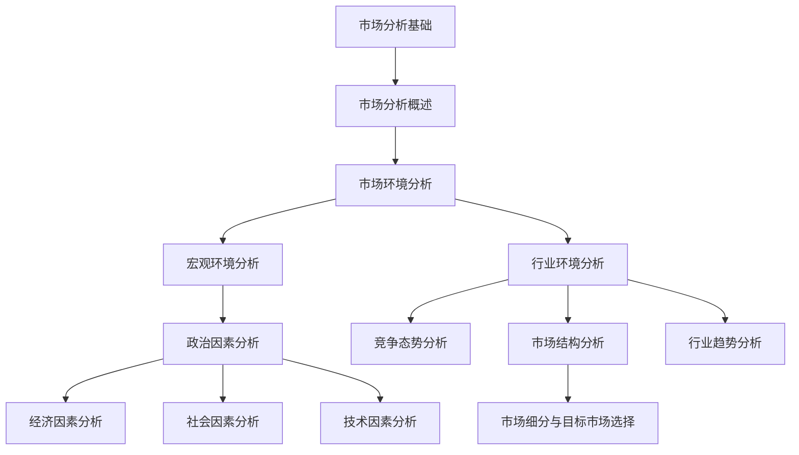

### 第二部分：市场分析方法

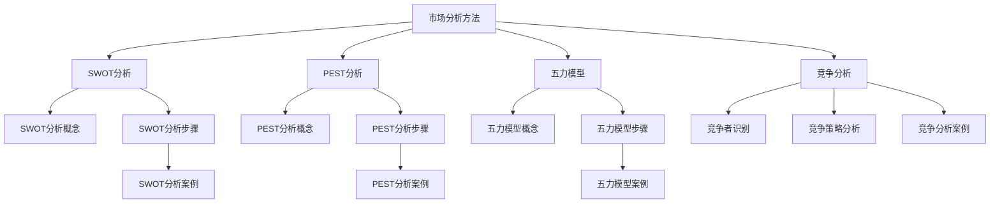

### 第三部分：市场分析应用

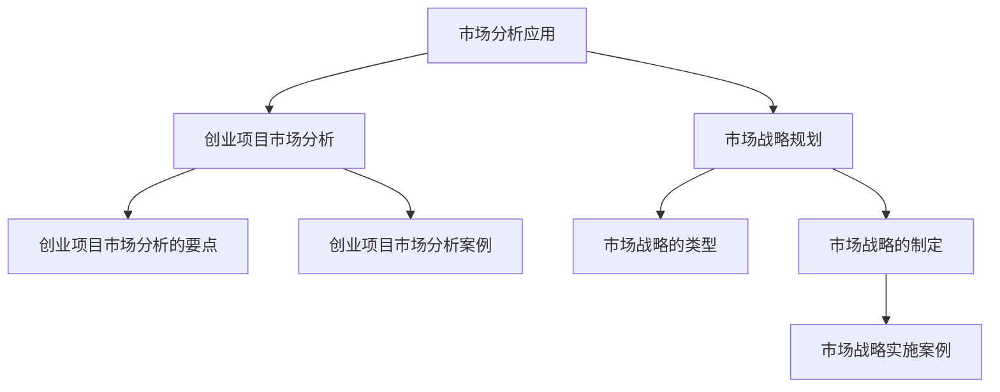

### 第四部分：市场分析工具与资源

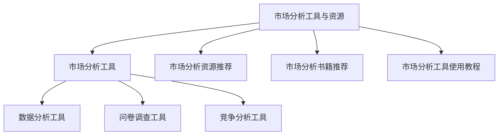


### 附录部分

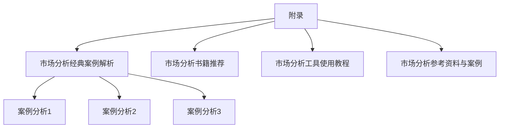

---

**注意**：由于Markdown格式限制，上述Mermaid图表无法直接在Markdown环境中渲染，建议将上述Mermaid代码复制到支持Mermaid渲染的环境中查看。在Markdown编辑器中，您可以在代码块前添加`mermaid`关键字，如下所示：

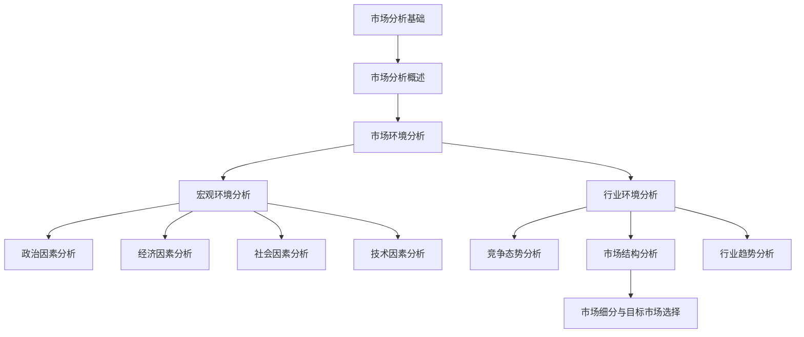

这样，您就可以在支持Mermaid渲染的环境中看到完整的图表。

