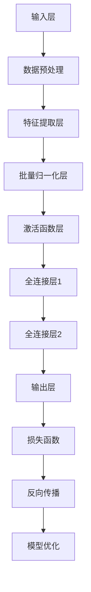
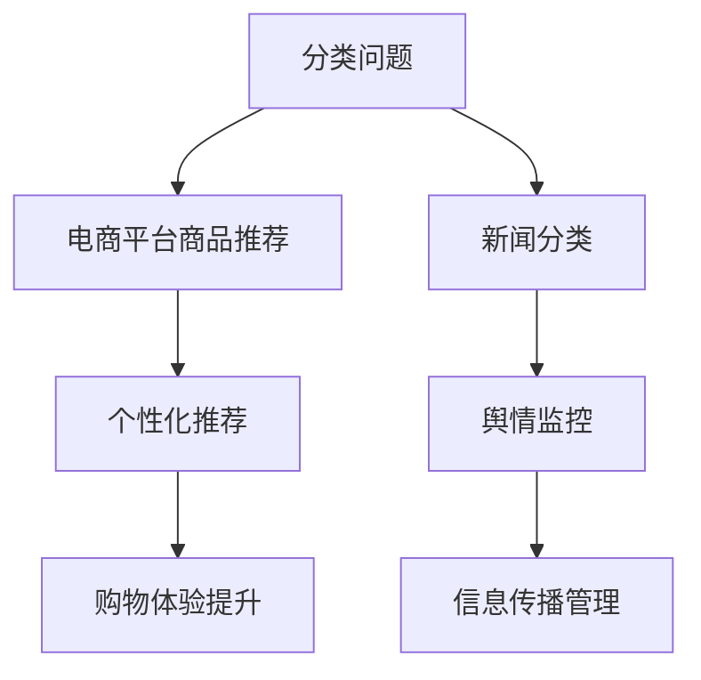

                 

# 2024年腾讯社招算法岗位面试题目汇编

## 关键词
- 腾讯社招
- 算法面试
- 大模型
- 机器学习
- 深度学习
- 数据处理
- 特征工程
- 数学模型

## 摘要
本文旨在为即将参加2024年腾讯社招算法岗位面试的应聘者提供一个全面的复习资料。文章将从核心概念、算法原理、数学模型和项目实战等多个维度，深入解析腾讯社招算法岗位面试中的常见问题。通过对AI大模型、常见机器学习算法、深度学习算法的讲解，并结合实际项目中的数据处理、模型训练与评估、模型部署与优化等实战内容，帮助读者更好地理解和应对面试中的各种挑战。

## 目录
### 第一部分: 核心概念与联系
#### 1.1 AI大模型概述
#### 1.2 2024年腾讯社招算法岗位面试题目类型分析

### 第二部分: 核心算法原理讲解
#### 2.1 预处理与特征工程
#### 2.2 常见机器学习算法
#### 2.3 深度学习算法

### 第三部分: 数学模型和数学公式
#### 3.1 概率论与统计模型
#### 3.2 线性回归模型

### 第四部分: 项目实战
#### 4.1 数据集准备
#### 4.2 模型训练与评估
#### 4.3 部署与优化

### 第五部分: 总结与展望
#### 5.1 主要内容回顾
#### 5.2 未来展望

## 第一部分: 核心概念与联系

### 1.1 AI大模型概述

人工智能（AI）大模型，通常指的是具有数百万甚至数十亿参数的深度学习模型，如谷歌的BERT、OpenAI的GPT等。这些模型在自然语言处理、计算机视觉等领域取得了显著的成果。其核心原理主要包括：

1. **深度神经网络**：深度神经网络（DNN）是构建大模型的基础。通过多层神经元的堆叠，DNN能够模拟人脑的神经元网络，实现复杂的非线性映射。
2. **批量归一化**（Batch Normalization）：批量归一化是一种在训练过程中对网络层的输入进行标准化处理的技术。它能够加速模型的训练，提高模型的收敛速度。
3. **dropout**：dropout是一种正则化技术，通过在训练过程中随机丢弃一部分神经元，减少模型过拟合的风险。

下面是一个使用Mermaid绘制的AI大模型的基本架构流程图：



### 1.2 2024年腾讯社招算法岗位面试题目类型分析

腾讯作为全球领先的互联网科技公司，其社招算法岗位面试题目涵盖了广泛的领域。以下是几种常见的面试题目类型及其与实际应用场景的联系：

#### 分类问题

- **电商平台商品推荐**：通过用户历史行为和商品特征，为用户推荐个性化商品。
- **新闻分类**：对新闻文本进行分类，如政治、体育、娱乐等。

#### 回归问题

- **股票价格预测**：利用历史股票价格数据，预测未来的股票价格。
- **房屋定价**：根据房屋的特征，如面积、地段等，预测房屋的价格。

#### 自然语言处理

- **情感分析**：分析文本数据中的情感倾向，如正面、负面、中性。
- **机器翻译**：将一种语言的文本翻译成另一种语言。

#### 强化学习

- **智能推荐系统**：通过学习用户的交互行为，为用户提供个性化的推荐。
- **自动驾驶**：通过学习环境中的数据，实现无人车的自主驾驶。

下面是一个使用Mermaid绘制的分类问题与实际应用场景的关联图：



## 第二部分: 核心算法原理讲解

### 2.1 预处理与特征工程

在机器学习和深度学习项目中，预处理和特征工程是非常关键的步骤。它们直接影响模型的性能和训练时间。

#### 特征提取

特征提取是将原始数据转换为更适合模型处理的形式。以下是一个简单的特征提取伪代码示例：

```python
def extract_features(data):
    # 数据标准化
    normalized_data = standardize_data(data)
    # 特征选择
    selected_features = select_features(normalized_data)
    return selected_features
```

#### 特征工程

特征工程是通过构造新的特征或选择合适的特征来提高模型性能。一个常见的例子是使用主成分分析（PCA）进行特征降维：

```python
from sklearn.decomposition import PCA

pca = PCA(n_components=2)
principal_components = pca.fit_transform(features)
```

### 2.2 常见机器学习算法

常见机器学习算法包括决策树、随机森林、支持向量机等。以下是决策树构建的伪代码：

```python
def build_decision_tree(data, labels, features):
    # 划分节点
    best_split = find_best_split(data, labels, features)
    if best_split is None:
        return leaf_node(labels)
    left_data, right_data = split_data(data, best_split)
    left_labels, right_labels = split_labels(labels, best_split)
    # 递归构建
    left_tree = build_decision_tree(left_data, left_labels, features)
    right_tree = build_decision_tree(right_data, right_labels, features)
    return DecisionTreeNode(best_split, left_tree, right_tree)
```

### 2.3 深度学习算法

深度学习算法中，卷积神经网络（CNN）是一种重要的模型。以下是CNN的核心层结构伪代码：

```python
def convolution_layer(input_data, filters, kernel_size):
    # 卷积操作
    conv_output = np.zeros((input_data.shape[0], filters, input_data.shape[1] - kernel_size + 1, input_data.shape[2] - kernel_size + 1))
    for i in range(input_data.shape[0]):
        for j in range(filters):
            conv_output[i, j] = np.sum(input_data[i] * filters[j]) - bias[j]
    return conv_output
```

## 第三部分: 数学模型和数学公式

### 3.1 概率论与统计模型

概率论和统计学是机器学习的基础。以下是贝叶斯定理的数学公式及其详细讲解：

$$
P(A|B) = \frac{P(B|A)P(A)}{P(B)}
$$

贝叶斯定理是用于计算后验概率的经典公式。它关联了先验概率、条件概率和边际概率。详细讲解如下：

- **$P(A|B)$**：后验概率，表示在事件B发生的条件下，事件A发生的概率。
- **$P(B|A)$**：条件概率，表示在事件A发生的条件下，事件B发生的概率。
- **$P(A)$**：先验概率，表示在不知道任何其他信息的情况下，事件A发生的概率。
- **$P(B)$**：边际概率，表示在所有可能情况下，事件B发生的概率。

### 3.2 线性回归模型

线性回归模型是机器学习中最基本的模型之一。其基本形式如下：

$$
Y = \beta_0 + \beta_1X + \epsilon
$$

其中：

- **$Y$**：因变量。
- **$X$**：自变量。
- **$\beta_0$**：模型截距。
- **$\beta_1$**：模型斜率。
- **$\epsilon$**：误差项。

详细讲解如下：

- **$Y$** 和 **$X$**：线性回归模型的目标是找到一个最佳拟合直线，使得 $Y$ 和 $X$ 的关系尽可能线性。
- **$\beta_0$** 和 **$\beta_1$**：通过最小化误差平方和（Least Squares），可以计算出最佳拟合直线的参数。
- **$\epsilon$**：误差项，表示实际值与模型预测值之间的差异。

## 第四部分: 项目实战

### 4.1 数据集准备

在项目实战中，数据集的准备是至关重要的一步。以下是一个简单的数据集读取与预处理示例：

```python
import pandas as pd
import numpy as np

# 读取数据集
data = pd.read_csv('data.csv')
# 数据预处理
X = data.iloc[:, :-1].values
y = data.iloc[:, -1].values
```

详细解释如下：

- **读取数据集**：使用 `pandas` 库从CSV文件中读取数据。
- **数据预处理**：提取特征（`X`）和标签（`y`）。特征通常是输入变量，标签是模型需要预测的输出变量。

### 4.2 模型训练与评估

模型训练与评估是项目实战的核心步骤。以下是一个简单的随机森林分类器的训练与评估示例：

```python
from sklearn.model_selection import train_test_split
from sklearn.ensemble import RandomForestClassifier

# 划分训练集和测试集
X_train, X_test, y_train, y_test = train_test_split(X, y, test_size=0.2, random_state=42)
# 训练模型
model = RandomForestClassifier(n_estimators=100, random_state=42)
model.fit(X_train, y_train)
# 评估模型
accuracy = model.score(X_test, y_test)
print(f"Model accuracy: {accuracy:.2f}")
```

详细解释如下：

- **划分训练集和测试集**：使用 `train_test_split` 函数将数据集划分为训练集和测试集。
- **训练模型**：使用 `RandomForestClassifier` 类创建随机森林分类器，并使用训练集进行训练。
- **评估模型**：使用 `score` 方法评估模型的准确性。

### 4.3 部署与优化

模型部署与优化是确保模型在真实环境中稳定运行的关键步骤。以下是一个简单的模型保存与加载示例：

```python
import joblib

# 模型保存
joblib.dump(model, 'model.joblib')
# 模型加载
loaded_model = joblib.load('model.joblib')
```

详细解释如下：

- **模型保存**：使用 `joblib` 库将训练好的模型保存为文件。
- **模型加载**：在需要使用模型时，从文件中加载模型。

## 第五部分: 总结与展望

### 5.1 主要内容回顾

本文系统地总结了2024年腾讯社招算法岗位面试的常见问题，包括AI大模型概述、面试题目类型分析、核心算法原理讲解、数学模型和公式，以及项目实战中的数据处理、模型训练与评估、模型部署与优化等。

### 5.2 未来展望

随着AI技术的快速发展，算法岗位的面试题目将会更加复杂和多样化。未来的面试者需要具备以下能力：

- **持续学习**：紧跟AI技术的最新进展，不断学习新的算法和工具。
- **实战经验**：通过实际项目积累经验，提高解决实际问题的能力。
- **跨学科知识**：结合统计学、计算机科学、数学等多学科知识，提高综合素质。

总之，面对未来的AI挑战，只有不断学习和提升自己，才能在激烈的竞争中脱颖而出。

## 作者信息

- 作者：AI天才研究院/AI Genius Institute & 禅与计算机程序设计艺术 /Zen And The Art of Computer Programming

以上便是2024年腾讯社招算法岗位面试题目汇编的技术博客文章，希望对您有所帮助。在备战面试的过程中，持续学习和实践是关键。祝您面试成功！

