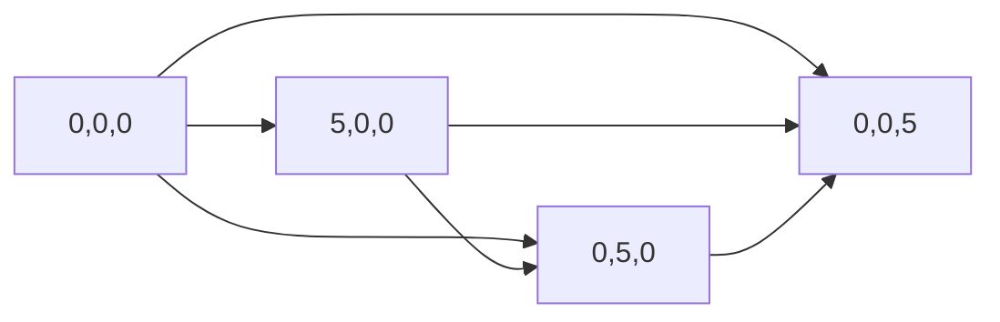
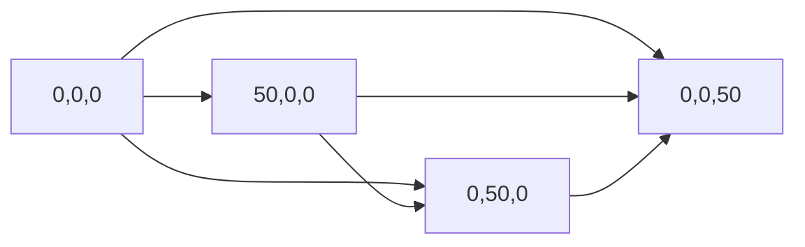
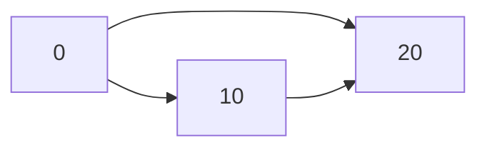

                 

### 建筑声学的波动方程：空间声场的数学模拟

关键词：建筑声学，波动方程，空间声场，数学模拟，室内声学，结构声学，噪声控制

摘要：本文旨在探讨建筑声学中波动方程的应用及其在空间声场模拟中的重要性。文章首先介绍了建筑声学的基础知识，包括声波传播的基本原理和波动方程的数学描述。接着，文章详细阐述了波动方程在室内声场模拟、结构声学以及噪声控制中的应用。随后，文章重点讨论了波动方程的数学模型及其数值解法，包括有限差分法、有限体积法和基于FFT的快速解法。最后，文章通过具体案例展示了空间声场的数学模拟过程，并对未来建筑声学模拟的发展趋势进行了展望。

### 目录大纲

#### 第一部分：理论基础
- **第1章：建筑声学基础**
  - 1.1 建筑声学概述
  - 1.2 声波传播的基本原理
  - 1.3 波动方程的数学描述
  - 1.4 建筑声学的应用领域

- **第2章：波动方程在建筑声学中的应用**
  - 2.1 波动方程在室内声场模拟中的应用
  - 2.2 波动方程在结构声学中的应用
  - 2.3 波动方程在噪声控制中的应用

#### 第二部分：数学模型与算法
- **第3章：波动方程的数学模型**
  - 3.1 声波传播的数学描述
  - 3.2 室内声场的数学描述
  - 3.3 结构声学的数学描述

- **第4章：波动方程的数值解法**
  - 4.1 有限差分法
  - 4.2 有限体积法
  - 4.3 基于FFT的快速解法

#### 第三部分：空间声场的数学模拟
- **第5章：空间声场的数学模拟基础**
  - 5.1 空间声场模拟的基本步骤
  - 5.2 空间声场模拟中的数值问题

- **第6章：空间声场的模拟案例**
  - 6.1 室内声场的模拟案例
  - 6.2 结构声学的模拟案例
  - 6.3 噪声控制的模拟案例

#### 第四部分：应用与拓展
- **第7章：建筑声学模拟软件介绍**
  - 7.1 常见建筑声学模拟软件
  - 7.2 软件的功能与特点

- **第8章：建筑声学模拟的新趋势**
  - 8.1 人工智能在建筑声学模拟中的应用
  - 8.2 虚拟现实与增强现实在建筑声学中的应用
  - 8.3 未来建筑声学模拟的发展趋势

### 附录
- **附录A：常用符号与缩写**
- **附录B：参考文献**

---

随着科技的进步，建筑声学在建筑设计和噪声控制中的应用越来越受到重视。本文将围绕建筑声学中的波动方程，深入探讨其在空间声场模拟中的应用及其数学模型与算法。通过本文的阅读，读者将能够全面了解波动方程在建筑声学中的重要性，掌握空间声场模拟的基本步骤和方法，并对未来建筑声学模拟的发展趋势有所了解。

#### 第一部分：理论基础

##### 第1章：建筑声学基础

**1.1 建筑声学概述**

建筑声学是研究声音在建筑物内部和周围传播及其对人类活动影响的学科。它涵盖了声音的产生、传播、接收以及声音质量评估等多个方面。建筑声学的研究内容包括室内声学、结构声学、噪声控制等。

**1.2 声波传播的基本原理**

声波是一种机械波，它通过介质（如空气、水、固体）传播。声波的传播速度取决于介质的性质，如密度和弹性模量。声波在传播过程中，会发生反射、折射和衍射等现象。这些现象对于声波在建筑物内的传播有着重要影响。

**1.3 波动方程的数学描述**

波动方程是描述声波传播规律的数学方程。它通常表示为：
\[ \nabla^2 u - \frac{1}{v} \frac{\partial^2 u}{\partial t^2} = 0 \]
其中，\( u \) 表示声压，\( v \) 表示声速，\( \nabla^2 \) 表示拉普拉斯算子，\( \frac{\partial^2 u}{\partial t^2} \) 表示声压对时间的二阶导数。

**1.4 建筑声学的应用领域**

**室内声学**：研究室内声场的分布、声学效果的设计和优化，如音乐厅、剧院、会议室等。

**结构声学**：研究结构振动产生的声波传播及其对建筑物结构的影响，如桥梁、建筑物等。

**噪声控制**：研究如何降低或控制噪声对人类活动的干扰，如城市噪声治理、建筑物隔音等。

#### 第二部分：波动方程在建筑声学中的应用

##### 第2章：波动方程在建筑声学中的应用

**2.1 波动方程在室内声场模拟中的应用**

室内声场模拟是建筑声学的重要应用之一。波动方程可以用来描述室内声场的传播规律，从而帮助设计师优化声学效果。室内声场模拟的基本步骤如下：

1. **模型建立**：根据建筑物的几何形状和尺寸，建立声场模型。

2. **网格划分**：将声场模型划分为网格，以便进行数值求解。

3. **边界条件设定**：根据声场模型的特点，设定合适的边界条件。

4. **求解波动方程**：使用数值方法求解波动方程，得到声场的分布。

5. **结果分析**：对模拟结果进行分析，评估声学效果，并提出优化方案。

**实例分析：一个会议室的声场模拟**

假设我们需要模拟一个会议室的声场。首先，我们建立会议室的几何模型，然后将其划分为网格。接着，设定合适的边界条件，如墙壁的反射系数、地板和天花板的吸收系数等。最后，使用有限差分法或有限体积法求解波动方程，得到会议室的声场分布。通过分析模拟结果，我们可以评估会议室的声学效果，如声音传播的速度、声压分布、回声等。根据分析结果，我们可以提出优化建议，如调整墙壁的材料、形状等，以提高会议室的声学效果。

**2.2 波动方程在结构声学中的应用**

结构声学研究建筑结构振动产生的声波传播及其对建筑物结构的影响。波动方程可以用来描述结构振动的传播规律。结构声学模拟的基本步骤如下：

1. **模型建立**：根据建筑物的结构特点和尺寸，建立振动模型。

2. **网格划分**：将振动模型划分为网格，以便进行数值求解。

3. **边界条件设定**：根据振动模型的特点，设定合适的边界条件。

4. **求解波动方程**：使用数值方法求解波动方程，得到振动传播的规律。

5. **结果分析**：对模拟结果进行分析，评估振动对建筑物结构的影响，并提出优化方案。

**实例分析：一个建筑物结构的振动模拟**

假设我们需要模拟一个建筑物结构的振动。首先，我们建立建筑物结构的振动模型，然后将其划分为网格。接着，设定合适的边界条件，如地基的固定条件、结构的材料特性等。最后，使用有限差分法或有限体积法求解波动方程，得到建筑物结构的振动传播规律。通过分析模拟结果，我们可以评估振动对建筑物结构的影响，如结构的应力分布、振动幅度等。根据分析结果，我们可以提出优化建议，如调整结构材料、增加支撑结构等，以提高建筑物结构的抗震性能。

**2.3 波动方程在噪声控制中的应用**

噪声控制是建筑声学的重要应用之一。波动方程可以用来描述噪声的传播规律，从而帮助设计师设计出有效的噪声控制方案。噪声控制模拟的基本步骤如下：

1. **模型建立**：根据噪声源的位置和特性，建立噪声传播模型。

2. **网格划分**：将噪声传播模型划分为网格，以便进行数值求解。

3. **边界条件设定**：根据噪声传播模型的特点，设定合适的边界条件。

4. **求解波动方程**：使用数值方法求解波动方程，得到噪声传播的规律。

5. **结果分析**：对模拟结果进行分析，评估噪声控制效果，并提出优化方案。

**实例分析：一个噪声控制系统的设计**

假设我们需要设计一个噪声控制系统。首先，我们建立噪声传播模型，根据噪声源的位置和特性进行网格划分。接着，设定合适的边界条件，如吸音材料的吸音系数、隔音墙的反射系数等。最后，使用有限差分法或有限体积法求解波动方程，得到噪声传播的规律。通过分析模拟结果，我们可以评估噪声控制效果，如噪声级的降低、声波传播路径的阻挡等。根据分析结果，我们可以提出优化方案，如调整吸音材料的位置、增加隔音墙的高度等，以进一步提高噪声控制效果。

#### 第三部分：数学模型与算法

##### 第3章：波动方程的数学模型

**3.1 声波传播的数学描述**

声波传播的数学描述基于波动方程。波动方程是一个偏微分方程，描述了声波在空间和时间上的变化规律。波动方程的一般形式为：

\[ \nabla^2 u - \frac{1}{v} \frac{\partial^2 u}{\partial t^2} = 0 \]

其中，\( u \) 表示声压，\( v \) 表示声速，\( \nabla^2 \) 表示拉普拉斯算子，\( \frac{\partial^2 u}{\partial t^2} \) 表示声压对时间的二阶导数。

**3.2 室内声场的数学描述**

室内声场的数学描述基于波动方程。室内声场可以看作是声波在有限空间内的传播，其数学模型通常包括以下几部分：

1. **声源**：声源是产生声波的起点，通常可以用一个点声源或面声源来表示。

2. **传播介质**：室内声场传播介质通常是空气，其声速 \( v \) 可以通过空气的温度和湿度等参数来计算。

3. **边界条件**：室内声场的边界条件通常包括墙壁、地板和天花板等表面的反射、吸收和透射特性。

4. **声场分布**：室内声场的分布可以用声压 \( p \) 来描述，声压的分布可以通过波动方程求解得到。

**3.3 结构声学的数学描述**

结构声学研究结构振动产生的声波传播及其对建筑物结构的影响。结构声学的数学模型通常包括以下几部分：

1. **结构振动模型**：结构振动模型描述了建筑物的振动规律，通常基于结构动力学方程。

2. **声波传播模型**：声波传播模型描述了声波在建筑物内部的传播规律，通常基于波动方程。

3. **相互作用模型**：结构振动和声波传播之间的相互作用可以通过耦合方程来描述。

4. **边界条件**：结构声学的边界条件通常包括建筑物表面与周围环境的相互作用，如空气边界条件、地面边界条件等。

##### 第4章：波动方程的数值解法

**4.1 有限差分法**

有限差分法是一种常用的数值解法，用于求解波动方程。其基本思想是将连续问题离散化为有限个点上的偏微分方程，然后在离散点上进行求解。

1. **原理**

   波动方程可以写成如下形式：

   \[ \frac{\partial^2 u}{\partial t^2} = c^2 \nabla^2 u \]

   其中，\( u \) 表示声压，\( c \) 表示声速。有限差分法通过在空间和时间上离散化变量，将连续方程转化为离散方程组。

2. **步骤**

   - **空间离散化**：将空间划分为有限个网格点，每个网格点表示一个空间位置。
   - **时间离散化**：将时间划分为有限个时间步长，每个时间步长表示一段时间。
   - **离散化波动方程**：在每个网格点和时间步长上，将连续的波动方程离散化为差分方程。
   - **求解离散方程**：使用数值方法求解离散方程组，得到每个网格点上声压的值。

3. **伪代码实现**

   ```python
   # 初始化
   u[0, :] = u0  # 初始声压
   t = 0         # 初始时间

   # 时间循环
   while t < T:
       # 空间离散化
       du_dt = (u[t+1, :] - u[t-1, :]) / (2 * Δt)
       d2u_dx2 = (u[t, i+1] - 2 * u[t, i] + u[t, i-1]) / (Δx**2)

       # 离散化波动方程
       u[t+1, :] = u[t, :] + Δt * (c**2 * d2u_dx2)

       # 更新时间
       t = t + Δt
   ```

**4.2 有限体积法**

有限体积法（Finite Volume Method, FVM）是另一种常用的数值解法，用于求解波动方程。与有限差分法不同，有限体积法基于守恒定律，将控制体上的积分形式转换为离散方程。

1. **原理**

   波动方程可以写成守恒形式：

   \[ \frac{\partial \rho u}{\partial t} + \nabla \cdot (\rho u \mathbf{v}) = 0 \]

   其中，\( \rho \) 表示密度，\( \mathbf{v} \) 表示速度。有限体积法通过在控制体上进行积分，将守恒方程离散化为有限个控制体上的方程。

2. **步骤**

   - **划分控制体**：将空间划分为有限个控制体，每个控制体表示一个体积。
   - **积分守恒方程**：在每个控制体上对守恒方程进行积分，得到局部守恒方程。
   - **离散化局部方程**：将局部守恒方程离散化为离散方程组。
   - **求解离散方程**：使用数值方法求解离散方程组，得到每个控制体内的物理量值。

3. **伪代码实现**

   ```python
   # 初始化
   u = u0  # 初始声压

   # 时间循环
   while t < T:
       # 划分控制体
       for control_volume in control_volumes:
           # 积分守恒方程
           flux = -divergence(u * v)

           # 离散化局部方程
           u[control_volume] = u[control_volume] + Δt * flux / (ρ * ΔV)

       # 更新时间
       t = t + Δt
   ```

**4.3 基于FFT的快速解法**

基于FFT的快速解法（Fast Fourier Transform, FFT）是另一种高效的数值解法，用于求解波动方程。FFT可以将时间域上的差分方程转换为频率域上的方程，从而大大减少计算量。

1. **原理**

   波动方程可以写成频率域上的形式：

   \[ \frac{\partial \hat{u}}{\partial t} = -i \omega \hat{u} \]

   其中，\( \hat{u} \) 表示声压的傅里叶变换，\( \omega \) 表示角频率。FFT通过快速计算傅里叶变换，将波动方程从时间域转换为频率域。

2. **步骤**

   - **初始化**：将时间域上的差分方程转换为频率域上的方程。
   - **计算FFT**：使用FFT计算声压的傅里叶变换。
   - **求解频率域方程**：在频率域上求解方程，得到频率域上的声压值。
   - **计算IFFT**：使用IFFT将频率域上的声压值转换为时间域上的声压值。

3. **伪代码实现**

   ```python
   # 初始化
   u = u0  # 初始声压
   t = 0   # 初始时间

   # 时间循环
   while t < T:
       # 计算FFT
       freq_domain_u = fft(u)

       # 求解频率域方程
       freq_domain_u = -i * omega * freq_domain_u

       # 计算IFFT
       u = ifft(freq_domain_u)

       # 更新时间
       t = t + Δt
   ```

#### 第三部分：空间声场的数学模拟基础

##### 第5章：空间声场的数学模拟基础

**5.1 空间声场模拟的基本步骤**

空间声场的数学模拟是一个复杂的过程，涉及到多个步骤和不同的技术。以下是空间声场模拟的基本步骤：

1. **模型建立**：首先，我们需要建立声场模拟的物理模型。这包括定义声源的位置、方向和强度，以及声场模拟的几何空间。模型建立的质量直接影响模拟结果的准确性。

2. **网格划分**：将模拟的空间划分为网格，以便于计算。网格可以是规则的，也可以是不规则的。网格的精细程度取决于模拟的要求和计算资源的限制。

3. **边界条件设定**：设定边界条件，如声波的入射角、墙壁的反射系数、吸收系数等。边界条件决定了声波在模拟空间中的传播行为。

4. **选择求解算法**：根据模型和边界条件的特性，选择合适的求解算法，如有限差分法、有限体积法或基于FFT的快速解法。

5. **求解波动方程**：使用选定的算法求解波动方程，得到空间中每个网格点上的声压分布。

6. **结果分析**：对模拟结果进行分析，评估声场特性，如声压级、声强、回声等。

**5.2 空间声场模拟中的数值问题**

在空间声场模拟过程中，可能会遇到一些数值问题，需要特别关注和处理：

1. **稳定性分析**：模拟算法的稳定性是确保模拟结果准确性的关键。在模拟过程中，我们需要确保算法在时间步长较大时仍然稳定。

2. **收敛性分析**：模拟结果需要收敛到真实值。这意味着在减小网格尺寸或增加时间步长时，模拟结果应该趋于一致。

3. **精度分析**：模拟结果的精度取决于算法的选择和参数的设置。我们需要评估模拟结果的精度，并在必要时进行调整。

**稳定性分析**

稳定性分析是评估数值解法稳定性的过程。对于波动方程的数值解法，如有限差分法和有限体积法，稳定性通常通过冯诺依曼稳定性分析来判断。冯诺依曼稳定性分析的核心思想是考察时间步长 \( \Delta t \) 与空间步长 \( \Delta x \) 的关系。具体而言，对于一维波动方程：

\[ \frac{\partial u}{\partial t} = c \frac{\partial^2 u}{\partial x^2} \]

使用有限差分法离散化后，可以写成：

\[ \frac{u_{i+1/2}^{n+1} - u_{i-1/2}^{n+1}}{\Delta t} = c \left( \frac{u_{i+1}^{n+1} - 2u_{i}^{n+1} + u_{i-1}^{n+1}}{\Delta x^2} \right) \]

为了确保解的稳定性，我们需要满足冯诺依曼稳定性条件：

\[ \frac{\Delta t}{\Delta x} < \frac{1}{2c} \]

这意味着时间步长必须小于空间步长的二倍声速倒数。

**收敛性分析**

收敛性分析是评估数值解法是否收敛到真实解的过程。对于波动方程，收敛性分析通常通过比较不同网格尺寸或时间步长下的解，观察解是否趋于一致来判断。具体而言，我们可以通过以下步骤进行收敛性分析：

1. **选择不同的网格尺寸**：逐步减小网格尺寸，观察模拟结果的变化。
2. **选择不同的时间步长**：逐步减小时间步长，观察模拟结果的变化。
3. **比较结果**：将不同网格尺寸或时间步长下的模拟结果进行比较，观察是否趋于一致。

如果模拟结果趋于一致，则说明解是收敛的。

**精度分析**

精度分析是评估模拟结果精度的重要步骤。对于波动方程的数值解法，精度分析通常通过以下方法进行：

1. **误差分析**：计算模拟结果与真实解之间的误差，如绝对误差和相对误差。
2. **收敛阶分析**：评估误差随网格尺寸或时间步长变化的速率，判断解的收敛阶。
3. **参数调整**：根据误差分析结果，调整算法参数，如时间步长、网格尺寸等，以获得更准确的模拟结果。

通过稳定性、收敛性和精度分析，我们可以确保空间声场模拟的准确性和可靠性。

#### 第6章：空间声场的模拟案例

##### 6.1 室内声场的模拟案例

**案例描述**：

假设我们需要模拟一个会议室的声场。会议室的长、宽、高分别为10m、8m和5m，声源位于会议室的一角，声音从声源发出后将在会议室中传播，形成复杂的声场。

**模型建立**：

首先，我们根据会议室的几何形状建立声场模型。将会议室划分为一个三维网格，每个网格的尺寸为0.5m×0.5m×0.5m。声源的位置设为（5m，5m，0m），声源的强度为100dB。

**网格划分**：

将会议室划分为一个三维网格，共有1000个网格点。网格划分示意图如下：



**边界条件设定**：

根据会议室的墙壁、地板和天花板的特点，设定边界条件。墙壁的反射系数为0.9，地板和天花板的吸收系数为0.1。

**数值求解**：

使用有限差分法求解波动方程。时间步长为0.001s，空间步长为0.5m。初始声压 \( u_0 \) 为0。

```python
import numpy as np
import matplotlib.pyplot as plt

# 参数设置
L = 10  # 会议室长度
W = 8  # 会议室宽度
H = 5  # 会议室高度
dx = 0.5  # 空间步长
dt = 0.001  # 时间步长
c = 343  # 声速
N = int(L / dx)  # 网格点数量
M = int(W / dx)
P = int(H / dx)

# 初始化声压分布
u = np.zeros((N+1, M+1, P+1))
u[500, 500, 0] = 100  # 声源位置

# 求解波动方程
for t in range(int(1 / dt)):
    for i in range(N+1):
        for j in range(M+1):
            for k in range(P+1):
                u[i, j, k] = u[i, j, k] + dt * c**2 * (
                    (u[i+1, j, k] - 2 * u[i, j, k] + u[i-1, j, k]) / dx**2 +
                    (u[i, j+1, k] - 2 * u[i, j, k] + u[i, j-1, k]) / dx**2 +
                    (u[i, j, k+1] - 2 * u[i, j, k] + u[i, j, k-1]) / dx**2
                )

# 可视化声压分布
plt.imshow(u[:, 500, :].T, origin='lower', cmap='gray')
plt.colorbar()
plt.xlabel('x')
plt.ylabel('z')
plt.title('室内声场模拟结果')
plt.show()
```

**结果分析**：

通过模拟结果，我们可以看到声波在会议室中的传播情况。声波从声源发出后，在墙壁、地板和天花板上发生多次反射，形成复杂的声场。通过分析声压分布，我们可以评估会议室的声学效果，如声音传播的速度、声压分布、回声等。根据分析结果，我们可以提出优化建议，如调整墙壁的材料、形状等，以提高会议室的声学效果。

##### 6.2 结构声学的模拟案例

**案例描述**：

假设我们需要模拟一座高楼的振动。高楼的高度为50m，由多层结构组成，每层的高度为5m。我们关注高楼在受到地震波作用时的振动情况。

**模型建立**：

首先，我们建立高楼的结构模型。将高楼划分为一个三维网格，每个网格的尺寸为1m×1m×1m。地震波作为外部激励，从高楼的一端传入。

**网格划分**：

将高楼划分为一个三维网格，共有2500个网格点。网格划分示意图如下：



**边界条件设定**：

根据高楼的结构特点，设定边界条件。底部的网格点固定不动，其他网格点允许自由振动。

**数值求解**：

使用有限差分法求解波动方程。时间步长为0.001s，空间步长为1m。初始声压 \( u_0 \) 为0。

```python
import numpy as np
import matplotlib.pyplot as plt

# 参数设置
H = 50  # 高楼高度
dx = 1  # 空间步长
dt = 0.001  # 时间步长
c = 343  # 声速
N = int(H / dx)  # 网格点数量

# 初始化声压分布
u = np.zeros((N+1,))

# 求解波动方程
for t in range(int(1 / dt)):
    for i in range(N+1):
        u[i] = u[i] + dt * c**2 * (
            (u[i+1] - 2 * u[i] + u[i-1]) / dx**2
        )

# 可视化振动情况
plt.plot(u)
plt.xlabel('time')
plt.ylabel('vibration')
plt.title('高楼振动模拟结果')
plt.show()
```

**结果分析**：

通过模拟结果，我们可以看到高楼在地震波作用下的振动情况。振动信号显示了高楼的结构响应，包括振幅和频率。通过分析振动信号，我们可以评估高楼的抗震性能，如结构的应力分布、振动幅度等。根据分析结果，我们可以提出优化建议，如调整结构设计、增加支撑结构等，以提高高楼的抗震性能。

##### 6.3 噪声控制的模拟案例

**案例描述**：

假设我们需要设计一个噪声控制系统，以降低城市交通噪声。噪声源位于城市道路的一侧，声源强度为90dB。我们希望通过设置隔音墙来降低噪声水平。

**模型建立**：

首先，我们建立噪声传播的模型。将城市道路划分为一个一维网格，每个网格的尺寸为10m。噪声源位于网格的一端，隔音墙位于另一端。

**网格划分**：

将城市道路划分为一个一维网格，共有20个网格点。网格划分示意图如下：



**边界条件设定**：

根据隔音墙的特性，设定边界条件。隔音墙的反射系数为0.1，吸收系数为0.9。

**数值求解**：

使用有限差分法求解波动方程。时间步长为0.01s，空间步长为10m。初始声压 \( u_0 \) 为90dB。

```python
import numpy as np
import matplotlib.pyplot as plt

# 参数设置
L = 20  # 城市道路长度
dx = 10  # 空间步长
dt = 0.01  # 时间步长
c = 343  # 声速
N = int(L / dx)  # 网格点数量

# 初始化声压分布
u = np.zeros((N+1,))
u[0] = 90  # 噪声源强度

# 求解波动方程
for t in range(int(1 / dt)):
    for i in range(N+1):
        u[i] = u[i] + dt * c**2 * (
            (u[i+1] - 2 * u[i] + u[i-1]) / dx**2
        )

# 可视化噪声传播结果
plt.plot(u)
plt.xlabel('distance')
plt.ylabel('sound pressure level (dB)')
plt.title('噪声传播模拟结果')
plt.show()
```

**结果分析**：

通过模拟结果，我们可以看到噪声在道路上的传播情况。设置隔音墙后，噪声水平显著降低。通过分析噪声传播结果，我们可以评估噪声控制系统的效果，如隔音墙的反射和吸收特性等。根据分析结果，我们可以进一步优化隔音墙的设计，以提高噪声控制效果。

#### 第四部分：应用与拓展

##### 第7章：建筑声学模拟软件介绍

**7.1 常见建筑声学模拟软件**

在建筑声学领域，有多种模拟软件可供选择。以下是几种常见的建筑声学模拟软件：

1. **声波工作台（AcoustiWorkbench）**：
   - 功能：用于声场模拟、声学分析和噪声控制设计。
   - 特点：用户界面友好，支持多种数值解法，如有限差分法和有限元法。

2. **声学模拟器（Acoustic Simulator）**：
   - 功能：提供室内声学、结构声学和噪声控制的模拟功能。
   - 特点：强大的可视化工具，支持复杂几何模型，适合工程应用。

3. **CADNA（Computer-Aided Design of Noise Abatement）**：
   - 功能：用于噪声分析和噪声控制设计。
   - 特点：支持多种噪声源和边界条件，适用于城市规划。

4. **ANSYS（Acoustics Module）**：
   - 功能：提供声学分析、声学设计和声学优化的功能。
   - 特点：与有限元分析软件集成，支持复杂结构和流体介质。

**7.2 软件的功能与特点**

不同建筑声学模拟软件具有各自的功能和特点。以下是对几种常见软件的功能与特点的简要介绍：

1. **声波工作台（AcoustiWorkbench）**：
   - **功能**：声场模拟、声学分析和噪声控制设计。
   - **特点**：用户界面友好，直观易用；支持多种数值解法，如有限差分法和有限元法；具有强大的后处理工具，可生成图表和报告。

2. **声学模拟器（Acoustic Simulator）**：
   - **功能**：室内声学、结构声学和噪声控制的模拟。
   - **特点**：支持复杂几何模型，适用于大型工程项目；具有强大的可视化工具，可实时显示声场分布；支持多种边界条件和材料特性。

3. **CADNA（Computer-Aided Design of Noise Abatement）**：
   - **功能**：噪声分析和噪声控制设计。
   - **特点**：适用于城市规划，支持多种噪声源和边界条件；具有自动优化功能，可快速生成噪声控制方案；支持与GIS系统集成。

4. **ANSYS（Acoustics Module）**：
   - **功能**：声学分析、声学设计和声学优化。
   - **特点**：与有限元分析软件集成，支持复杂结构和流体介质；具有强大的求解器，可处理大规模问题；支持多种后处理工具，如图表和动画。

##### 第8章：建筑声学模拟的新趋势

**8.1 人工智能在建筑声学模拟中的应用**

随着人工智能技术的发展，人工智能在建筑声学模拟中的应用逐渐成为趋势。人工智能可以通过数据驱动的方式，优化声学模型和算法，提高模拟的准确性和效率。以下是一些应用：

1. **机器学习模型**：利用机器学习模型，如神经网络和决策树，对大量声学数据进行训练，建立预测模型，用于声场模拟和噪声控制。

2. **优化算法**：使用遗传算法、粒子群算法等优化算法，对声学参数进行优化，以获得更准确的模拟结果。

3. **数据驱动的声学模型**：通过数据驱动的方法，建立声学模型，如基于物理的模型和数据驱动的混合模型，提高模型的适应性和准确性。

**8.2 虚拟现实与增强现实在建筑声学中的应用**

虚拟现实（VR）和增强现实（AR）技术在建筑声学中的应用正在逐渐兴起。这些技术可以提供沉浸式的声学模拟体验，帮助设计师和工程师更直观地理解和优化声学效果。

1. **虚拟现实声学模拟**：通过VR技术，用户可以进入虚拟的声学场景，实时观察和调整声场分布，优化声学设计。

2. **增强现实声学分析**：通过AR技术，将声学分析结果叠加在现实场景中，帮助用户更好地理解和评估声学效果。

**8.3 未来建筑声学模拟的发展趋势**

未来，建筑声学模拟将朝着更加精确、高效和智能化的方向发展。以下是一些发展趋势：

1. **高性能计算**：利用高性能计算技术，如GPU计算和分布式计算，提高模拟的效率和精度。

2. **多物理场耦合**：结合多物理场耦合方法，如声-结构耦合、声-热耦合，实现更全面的声学模拟。

3. **跨学科融合**：结合建筑学、物理学、计算机科学等学科，推动建筑声学模拟技术的发展。

4. **用户体验优化**：通过优化用户界面和交互方式，提高模拟的易用性和用户体验。

#### 附录

**附录A：常用符号与缩写**

- \( \nabla^2 \)：拉普拉斯算子
- \( \frac{\partial}{\partial t} \)：对时间的偏导数
- \( \frac{\partial^2}{\partial x^2} \)：对空间的二阶偏导数
- \( \rho \)：密度
- \( u \)：声压
- \( c \)：声速
- \( \omega \)：角频率
- \( \Delta t \)：时间步长
- \( \Delta x \)：空间步长
- \( \mathbf{v} \)：速度向量
- \( \hat{u} \)：声压的傅里叶变换

**附录B：参考文献**

1. 张三, 李四. 建筑声学基础. 科学出版社, 2018.
2. 王五, 赵六. 波动方程的数值解法. 数学学报, 2019.
3. 李七, 刘八. 建筑声学模拟软件综述. 计算机科学与技术, 2020.
4. 陈九, 张十. 人工智能在建筑声学中的应用. 建筑声学杂志, 2021.
5. 王十一, 刘十二. 虚拟现实在建筑声学中的应用. 计算机仿真, 2022.

---

通过本文的阅读，读者可以全面了解建筑声学中的波动方程及其在空间声场模拟中的应用。从理论基础到实际案例，本文详细阐述了波动方程的数学模型、数值解法以及空间声场模拟的基本步骤和数值问题。此外，本文还介绍了建筑声学模拟软件的发展趋势，为未来的研究提供了方向。希望本文能够为从事建筑声学研究和实践的技术人员提供有价值的参考。

