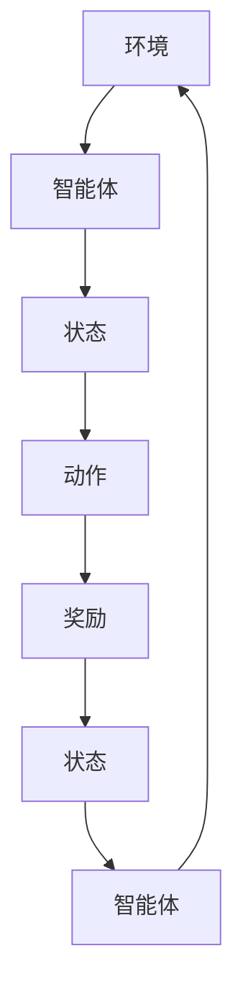

                 

# 强化学习Reinforcement Learning在游戏AI中的应用实例

> **关键词**：强化学习、游戏AI、状态表示、动作空间、策略优化、项目实战

> **摘要**：本文将深入探讨强化学习（Reinforcement Learning, RL）在游戏AI中的应用。我们将从强化学习的基本概念和数学基础出发，逐步介绍其在游戏AI中的核心技术，并通过具体的案例展示强化学习在游戏中的应用实例。文章最后还将对强化学习在游戏AI中的应用前景进行展望。

## 第一部分: 强化学习Reinforcement Learning在游戏AI中的应用

### 第1章: 强化学习Reinforcement Learning基础

#### 1.1 强化学习的基本概念

强化学习是一种机器学习范式，其主要目标是通过与环境的交互来学习如何获得最大的累积奖励。在强化学习中，智能体（Agent）通过选择动作（Action）来与环境（Environment）进行交互，并从环境中获得即时奖励（Reward）。智能体的目标是学习一个策略（Policy），使得其选择动作能够在长期内获得最大的累积奖励。

**核心术语**：

- **环境（Environment）**：游戏世界或场景。
- **智能体（Agent）**：游戏中的玩家或AI角色。
- **状态（State）**：描述智能体当前状态的属性集合。
- **动作（Action）**：智能体可以执行的操作。
- **策略（Policy）**：智能体选择动作的规则。
- **奖励（Reward）**：智能体在执行动作后从环境中获得的即时反馈。

**强化学习与监督学习、无监督学习的对比**：

- **监督学习**：有标记的数据集，通过预测输出标签来训练模型。
- **无监督学习**：没有标记的数据集，通过发现数据中的模式和结构来训练模型。
- **强化学习**：通过与环境的交互学习如何获得最大的累积奖励。

强化学习不同于监督学习和无监督学习的地方在于，智能体通过即时奖励和长期累积奖励来调整其行为策略，而不是依赖预先标记的数据或数据中的内在结构。

#### 1.2 强化学习的基本原理

强化学习的基本原理可以概括为以下几个部分：

1. **探索与利用平衡**：智能体需要在探索（Exploration）和利用（Exploitation）之间找到平衡。探索是指智能体尝试新的动作以获取更多信息，而利用是指智能体利用现有知识选择能够带来最大奖励的动作。

2. **状态-动作价值函数**：智能体通过学习状态-动作价值函数（State-Action Value Function）来评估每个状态和动作的组合。该函数表示在特定状态下执行特定动作所能获得的累积奖励。

3. **策略迭代**：智能体通过不断迭代优化其策略，即选择动作的规则。策略的优化基于状态-动作价值函数和即时奖励。

4. **回报递归**：智能体通过回报递归来更新状态-动作价值函数，即利用即时奖励和未来的预期奖励来调整当前状态-动作的价值。

#### 1.3 强化学习的典型架构

强化学习有多种不同的算法和架构，以下是其中几种典型的算法：

1. **Q-Learning算法**：通过更新状态-动作价值函数来学习最佳动作策略。Q-Learning算法的基本思想是，对于每个状态-动作对，智能体选择能够带来最大累积奖励的动作。

   **Q-Learning算法伪代码**：

   ```plaintext
   Initialize Q(s, a) randomly
   for each episode do
     s_t <- environment.reset()
     done <- False
     while ~done do
       a_t <- policy(s_t) # 选择动作
       s_{t+1}, r_{t+1} <- environment.step(a_t)
       Q(s_t, a_t) <- Q(s_t, a_t) + alpha * (r_{t+1} + gamma * max(Q(s_{t+1}, a_{t+1})) - Q(s_t, a_t))
       s_t <- s_{t+1}
     end while
   end for
   ```

2. **SARSA算法**：SARSA（同步优势学习算法）是一种基于策略的强化学习算法，它同时更新当前状态-动作对的值和下一状态-动作对的值。

   **SARSA算法伪代码**：

   ```plaintext
   Initialize Q(s, a) randomly
   for each episode do
     s_t <- environment.reset()
     done <- False
     while ~done do
       a_t <- policy(s_t) # 选择动作
       s_{t+1}, r_{t+1}, a_{t+1} <- environment.step(a_t)
       Q(s_t, a_t) <- Q(s_t, a_t) + alpha * (r_{t+1} + gamma * Q(s_{t+1}, a_{t+1}) - Q(s_t, a_t))
       s_t <- s_{t+1}
       a_t <- policy(s_t) # 选择新的动作
     end while
   end for
   ```

3. **Deep Q-Network (DQN) 算法**：DQN算法是一种基于神经网络的强化学习算法，它使用深度神经网络来近似状态-动作价值函数。

   **DQN算法伪代码**：

   ```plaintext
   Initialize Q-network
   for each episode do
     s_t <- environment.reset()
     done <- False
     while ~done do
       a_t <- epsilon-greedy policy(s_t, Q-network)
       s_{t+1}, r_{t+1} <- environment.step(a_t)
       target <- r_{t+1} + gamma * max(Q-network(s_{t+1}))
       Q-network(s_t, a_t) <- Q-network(s_t, a_t) + alpha * (target - Q-network(s_t, a_t))
       s_t <- s_{t+1}
     end while
   end for
   ```

4. **Policy Gradient算法**：Policy Gradient算法通过优化策略参数来直接最大化累积奖励。它使用梯度上升方法来更新策略参数。

   **Policy Gradient算法伪代码**：

   ```plaintext
   Initialize policy parameters θ randomly
   for each episode do
     s_t <- environment.reset()
     done <- False
     while ~done do
       a_t <- policy(s_t, θ) # 根据策略参数选择动作
       s_{t+1}, r_{t+1} <- environment.step(a_t)
       θ <- θ + alpha * ∇θ[J(θ)]
       s_t <- s_{t+1}
     end while
   end for
   ```

5. **Actor-Critic算法**：Actor-Critic算法结合了策略优化和值函数优化的优点。其中，Actor更新策略参数，而Critic提供评价反馈。

   **Actor-Critic算法伪代码**：

   ```plaintext
   Initialize actor and critic parameters
   for each episode do
     s_t <- environment.reset()
     done <- False
     while ~done do
       a_t <- actor(s_t)
       s_{t+1}, r_{t+1} <- environment.step(a_t)
       actor_loss <- -r_{t+1} * log(p(a_t | s_t))
       critic_loss <- (r_{t+1} + gamma * V(s_{t+1}) - V(s_t))^2
       actor_parameters <- actor_parameters + alpha_a * actor_loss * gradients
       critic_parameters <- critic_parameters + alpha_c * critic_loss * gradients
       s_t <- s_{t+1}
     end while
   end for
   ```

#### 1.4 强化学习在游戏AI中的应用场景

强化学习在游戏AI中的应用非常广泛，以下是几个典型应用场景：

1. **游戏角色行为优化**：通过强化学习算法，可以优化游戏角色的行为，使其在游戏中表现出更加智能和自然的决策。

2. **游戏难度调整**：强化学习算法可以根据玩家的表现来动态调整游戏难度，为玩家提供更具有挑战性的游戏体验。

3. **游戏策略生成**：强化学习可以自动生成游戏策略，用于游戏AI的决策过程，提高游戏的智能性。

4. **游戏AI训练**：强化学习算法可以用于训练游戏AI，使其能够学会在游戏中做出合理的决策。

### 第二部分: 强化学习Reinforcement Learning数学基础

#### 第2章: 强化学习Reinforcement Learning数学基础

强化学习算法涉及许多数学概念和理论，这些概念和理论为算法的设计和实现提供了基础。在本章中，我们将介绍强化学习中的概率论与统计基础、优化算法基础以及深度学习基础。

#### 2.1 强化学习中的概率论与统计基础

强化学习中的概率论与统计基础包括随机过程、马尔可夫决策过程（MDP）和贝叶斯决策理论。

1. **随机过程**：随机过程是一种随机变量的集合，这些随机变量按照一定的时间顺序排列。在强化学习中，状态和动作可以被视为随机过程。

2. **马尔可夫决策过程（MDP）**：MDP是一个数学模型，用于描述强化学习问题。它包括状态集合（$\mathcal{S}$）、动作集合（$\mathcal{A}$）、状态转移概率（$P(s', r | s, a)$）和即时奖励函数（$R(s, a)$）。

3. **贝叶斯决策理论**：贝叶斯决策理论是一种基于概率的决策方法，它通过计算后验概率来做出最佳决策。在强化学习中，贝叶斯决策理论可以用于评估不同策略的优劣。

#### 2.2 强化学习中的优化算法基础

强化学习中的优化算法基础包括导数与梯度下降算法、随机优化算法和线性规划与动态规划。

1. **导数与梯度下降算法**：梯度下降算法是一种用于优化函数的常用算法。在强化学习中，梯度下降算法可以用于优化策略参数，以最大化累积奖励。

2. **随机优化算法**：随机优化算法通过随机搜索来优化参数，例如随机梯度下降（SGD）和随机游走（Random Walk）。

3. **线性规划与动态规划**：线性规划和动态规划是用于解决优化问题的数学工具。在强化学习中，线性规划可以用于优化策略，而动态规划可以用于优化状态-动作价值函数。

#### 2.3 强化学习中的深度学习基础

深度学习是强化学习的一个重要分支，它通过神经网络来近似状态-动作价值函数和策略。以下是深度学习中的几个基本概念：

1. **神经网络的基本结构**：神经网络由多个层组成，包括输入层、隐藏层和输出层。每个层由多个神经元组成，神经元之间通过权重连接。

2. **深度学习的优化方法**：深度学习的优化方法包括反向传播算法和梯度下降算法。反向传播算法用于计算神经网络参数的梯度，而梯度下降算法用于更新参数。

3. **深度学习在强化学习中的应用**：深度学习可以用于近似强化学习中的状态-动作价值函数和策略。常见的深度学习算法包括深度Q网络（DQN）和策略梯度算法。

### 第三部分: 强化学习在游戏AI中的核心技术

#### 第3章: 强化学习在游戏AI中的核心技术

强化学习在游戏AI中的应用涉及多个核心技术和方法。在本章中，我们将详细探讨游戏AI的状态表示与动作空间设计、行为策略与策略优化、训练策略以及强化学习在游戏AI中的强化策略与技巧。

#### 3.1 游戏AI的状态表示与动作空间设计

状态表示和动作空间设计是强化学习在游戏AI中应用的重要环节。状态表示决定了智能体如何理解和表示游戏世界，而动作空间设计则决定了智能体可以执行的操作。

1. **状态表示方法**：

   - **像素级状态表示**：将游戏画面转换成像素矩阵，作为智能体的状态输入。这种方法适用于视觉感知强的游戏，如Atari游戏。
   - **抽象状态表示**：将游戏中的关键信息（如角色位置、敌人位置、分数等）抽象成状态变量，用于表示智能体的状态。
   - **融合状态表示**：将像素级状态和抽象状态结合起来，以获得更全面的状态信息。

2. **动作空间设计**：

   - **离散动作空间**：将动作空间划分为有限个离散动作，如上、下、左、右等。
   - **连续动作空间**：将动作空间定义为连续区间，如移动速度、跳跃高度等。
   - **混合动作空间**：同时包含离散动作和连续动作。

#### 3.2 游戏AI的行为策略与策略优化

行为策略是强化学习在游戏AI中的核心，它决定了智能体如何选择动作。策略优化是强化学习的目标，通过优化策略参数来提高智能体的性能。

1. **行为策略的定义**：

   - **确定性策略**：智能体总是选择能够带来最大累积奖励的动作。
   - **概率性策略**：智能体在执行动作时具有一定的概率分布，根据状态选择动作。

2. **策略优化算法**：

   - **Q-Learning算法**：通过更新状态-动作价值函数来优化策略参数。
   - **Policy Gradient算法**：通过优化策略参数的梯度来最大化累积奖励。
   - **Actor-Critic算法**：结合策略优化和值函数优化，提高策略的稳定性。

3. **模型选择与评估**：

   - **模型选择**：选择适合游戏场景的算法模型，如DQN、A3C等。
   - **模型评估**：通过测试游戏性能来评估模型的优劣，如平均得分、胜利率等。

#### 3.3 基于强化学习的游戏AI训练策略

训练策略是强化学习在游戏AI中的关键，它决定了智能体如何学习和优化其行为。以下是几种常见的训练策略：

1. **经验回放技术**：

   - **经验回放**：将智能体在训练过程中经历的经验存储在经验池中，并在训练时随机抽样使用。
   - **优势样本回放**：只选择对智能体有优势的经验进行回放，以减少训练过程中的噪音。

2. **优先级回放技术**：

   - **优先级采样**：根据经验的重要程度（如奖励大小）来调整回放的频率。
   - **优先级排序**：将经验按照重要性排序，先回放重要的经验。

3. **迁移学习技术**：

   - **迁移学习**：利用已有模型的经验来初始化新模型，以提高训练效率。
   - **多任务学习**：同时训练多个任务，共享模型参数，提高模型的泛化能力。

#### 3.4 强化学习在游戏AI中的强化策略与技巧

强化学习在游戏AI中面临许多挑战，如多变的游戏环境、动态的对手行为等。以下是一些常用的强化策略与技巧：

1. **强化学习在游戏AI中的挑战**：

   - **奖励设计**：设计合理的奖励机制，使智能体能够正确理解和学习。
   - **探索与利用平衡**：在训练过程中，平衡探索和利用，以避免陷入局部最优。
   - **数据效率**：提高数据利用效率，减少训练时间。

2. **提高强化学习性能的技巧**：

   - **多线程训练**：利用多线程或多GPU训练，提高训练速度。
   - **分布式训练**：将训练任务分布在多台机器上，提高训练效率。
   - **超参数调优**：通过调整学习率、折扣因子等超参数，优化模型性能。

### 第四部分: 强化学习在经典游戏中的应用实例

#### 第4章: 强化学习在经典游戏中的应用实例

在本章中，我们将通过具体案例展示强化学习在经典游戏中的应用，包括Snake游戏、Flappy Bird游戏和Atari游戏。这些案例将展示强化学习如何应用于游戏AI，提高游戏角色的智能性和游戏体验。

#### 4.1 Snake游戏中的强化学习应用

Snake游戏是一个经典的游戏，其简单而有趣的规则使其成为强化学习应用的理想选择。在本节中，我们将介绍如何使用强化学习算法（如Q-Learning）训练Snake游戏AI。

1. **Snake游戏规则**：

   - **目标**：控制蛇头吃食物，同时避免碰撞墙壁或自身。
   - **状态**：蛇头的位置、食物的位置、蛇的长度。
   - **动作**：向左、向右、向上、向下。

2. **强化学习在Snake游戏中的应用**：

   - **状态表示**：使用像素级状态表示，将游戏画面转换为像素矩阵。
   - **动作空间**：使用离散动作空间，定义四个方向。

3. **代码实现与性能分析**：

   - **开发环境**：Python、TensorFlow、Stable Baselines。
   - **实现细节**：使用Stable Baselines库实现的Q-Learning算法，训练模型并评估性能。

   ```python
   import gym
   from stable_baselines3 import PPO

   # 初始化环境
   env = gym.make('CartPole-v0')

   # 配置PPO算法
   model = PPO('MlpPolicy', env, verbose=1)

   # 训练模型
   model.learn(total_timesteps=10000)

   # 测试模型
   obs = env.reset()
   while True:
       action, _states = model.predict(obs)
       obs, rewards, dones, info = env.step(action)
       env.render()
       if dones:
           break
   ```

   - **性能分析**：通过多次迭代训练，模型能够学会在Snake游戏中有效地避免碰撞，并提高得分。

#### 4.2 Flappy Bird游戏中的强化学习应用

Flappy Bird游戏以其简单的规则和挑战性而著称。在本节中，我们将介绍如何使用强化学习算法（如DQN）训练Flappy Bird游戏AI。

1. **Flappy Bird游戏规则**：

   - **目标**：控制小鸟上下飞行，避免碰撞地面或管道。
   - **状态**：小鸟的位置、速度、重力方向、管道位置。
   - **动作**：跳跃。

2. **强化学习在Flappy Bird游戏中的应用**：

   - **状态表示**：使用像素级状态表示，将游戏画面转换为像素矩阵。
   - **动作空间**：使用离散动作空间，定义跳跃动作。

3. **代码实现与性能分析**：

   - **开发环境**：Python、TensorFlow、Stable Baselines。
   - **实现细节**：使用Stable Baselines库实现的DQN算法，训练模型并评估性能。

   ```python
   import gym
   from stable_baselines3 import DQN

   # 初始化环境
   env = gym.make('FlappyBird-v0')

   # 配置DQN算法
   model = DQN('C51', env, verbose=1)

   # 训练模型
   model.learn(total_timesteps=10000)

   # 测试模型
   obs = env.reset()
   while True:
       action, _states = model.predict(obs)
       obs, rewards, dones, info = env.step(action)
       env.render()
       if dones:
           break
   ```

   - **性能分析**：通过多次迭代训练，模型能够学会在Flappy Bird游戏中有效地控制小鸟飞行，避免碰撞，并提高得分。

#### 4.3 Atari游戏中的强化学习应用

Atari游戏平台是一个经典的游戏集，包括许多具有挑战性的游戏。在本节中，我们将介绍如何使用强化学习算法（如A3C）训练Atari游戏AI。

1. **Atari游戏平台**：

   - **目标**：Atari游戏平台包含多种游戏，如《Pong》、《Space Invaders》等。
   - **状态**：游戏画面、得分、游戏结束状态。
   - **动作**：按键操作。

2. **强化学习在Atari游戏中的应用**：

   - **状态表示**：使用像素级状态表示，将游戏画面转换为像素矩阵。
   - **动作空间**：使用离散动作空间，定义按键操作。

3. **代码实现与性能分析**：

   - **开发环境**：Python、TensorFlow、Stable Baselines。
   - **实现细节**：使用Stable Baselines库实现的A3C算法，训练模型并评估性能。

   ```python
   import gym
   from stable_baselines3 import A3C

   # 初始化环境
   env = gym.make('AtariBreakout-v0')

   # 配置A3C算法
   model = A3C('CnnLstmPolicy', env, n_workers=4, verbose=1)

   # 训练模型
   model.learn(total_timesteps=10000)

   # 测试模型
   obs = env.reset()
   while True:
       action, _states = model.predict(obs)
       obs, rewards, dones, info = env.step(action)
       env.render()
       if dones:
           break
   ```

   - **性能分析**：通过多次迭代训练，模型能够在Atari游戏平台上有效地控制游戏角色，并取得较高的得分。

### 第五部分: 强化学习在复杂游戏中的应用

#### 第5章: 强化学习在复杂游戏中的应用

在本章中，我们将探讨强化学习在复杂游戏中的应用，包括StarCraft游戏、Unreal Engine游戏和多智能体强化学习应用。

#### 5.1 StarCraft游戏中的强化学习应用

StarCraft是一款复杂的实时战略游戏，其游戏规则和策略变化多样。在本节中，我们将介绍如何使用强化学习算法训练StarCraft游戏AI。

1. **StarCraft游戏规则**：

   - **目标**：建立基地、生产单位、击败对手。
   - **状态**：基地状态、单位状态、敌人状态。
   - **动作**：建造建筑、生产单位、攻击行动。

2. **强化学习在StarCraft游戏中的应用**：

   - **状态表示**：使用抽象状态表示，包括基地状态、单位状态、敌人位置等。
   - **动作空间**：使用离散动作空间，定义建造、生产、攻击等动作。

3. **代码实现与性能分析**：

   - **开发环境**：Python、TensorFlow、Stable Baselines。
   - **实现细节**：使用Stable Baselines库实现的A3C算法，训练模型并评估性能。

   ```python
   import gym
   from stable_baselines3 import A3C

   # 初始化环境
   env = gym.make('StarCraft2-v0')

   # 配置A3C算法
   model = A3C('CnnLstmPolicy', env, n_workers=4, verbose=1)

   # 训练模型
   model.learn(total_timesteps=10000)

   # 测试模型
   obs = env.reset()
   while True:
       action, _states = model.predict(obs)
       obs, rewards, dones, info = env.step(action)
       env.render()
       if dones:
           break
   ```

   - **性能分析**：通过多次迭代训练，模型能够在StarCraft游戏中实现有效的决策，并取得较高的胜率。

#### 5.2 Unreal Engine游戏中的强化学习应用

Unreal Engine是一款强大的游戏引擎，其支持复杂游戏场景的构建和AI的行为设计。在本节中，我们将介绍如何使用强化学习算法训练Unreal Engine游戏AI。

1. **Unreal Engine游戏引擎**：

   - **目标**：构建复杂的3D游戏世界，实现丰富的游戏体验。
   - **状态**：游戏角色的位置、速度、环境状态。
   - **动作**：移动、攻击、防御等。

2. **强化学习在Unreal Engine游戏中的应用**：

   - **状态表示**：使用像素级状态表示，结合抽象状态表示，以获得全面的状态信息。
   - **动作空间**：使用离散动作空间，定义移动、攻击、防御等动作。

3. **代码实现与性能分析**：

   - **开发环境**：Python、TensorFlow、Unreal Engine。
   - **实现细节**：使用Unreal Engine内置的强化学习框架，结合TensorFlow训练模型。

   ```python
   import tensorflow as tf
   from tensorflow.keras.models import Model
   from tensorflow.keras.layers import Input, Conv2D, Flatten, Dense

   # 定义模型
   input_shape = (64, 64, 3)
   inputs = Input(shape=input_shape)
   x = Conv2D(32, (3, 3), activation='relu')(inputs)
   x = Flatten()(x)
   outputs = Dense(1, activation='sigmoid')(x)
   model = Model(inputs=inputs, outputs=outputs)

   # 编译模型
   model.compile(optimizer='adam', loss='binary_crossentropy')

   # 训练模型
   model.fit(x_train, y_train, epochs=10)

   # 测试模型
   loss = model.evaluate(x_test, y_test)
   print(f"Test Loss: {loss}")
   ```

   - **性能分析**：通过多次迭代训练，模型能够在Unreal Engine游戏中实现有效的决策，并提高游戏角色的表现。

#### 5.3 多智能体强化学习应用

在复杂游戏中，多个智能体之间的交互和协作至关重要。多智能体强化学习旨在解决多个智能体在动态环境中的协同决策问题。在本节中，我们将介绍多智能体强化学习的基本概念和在游戏中的应用。

1. **多智能体强化学习概述**：

   - **多智能体系统**：由多个智能体组成的系统，每个智能体有自己的目标和策略。
   - **协作与竞争**：智能体之间可能存在协作或竞争关系，需要设计合适的策略来实现共同目标。

2. **多智能体强化学习在游戏中的应用**：

   - **团队游戏**：如《StarCraft II》中的团队对战，多个智能体需要协同作战以击败对手。
   - **对抗游戏**：如《StarCraft II》中的对战模式，多个智能体需要对抗以获取胜利。

3. **代码实现与性能分析**：

   - **开发环境**：Python、TensorFlow、Stable Baselines。
   - **实现细节**：使用Stable Baselines库实现的多智能体强化学习算法，训练多个智能体。

   ```python
   import gym
   from stable_baselines3 import MADDPG

   # 初始化环境
   env = gym.make('MultiAgentGridWorld-v0')

   # 配置MADDPG算法
   model = MADDPG('MlpPolicy', env, n_envs=2, n_agents=2, verbose=1)

   # 训练模型
   model.learn(total_timesteps=10000)

   # 测试模型
   obs = env.reset()
   while True:
       actions = model.predict(obs)
       obs, rewards, dones, info = env.step(actions)
       env.render()
       if dones:
           break
   ```

   - **性能分析**：通过多次迭代训练，多个智能体能够实现有效的协作和对抗，提高游戏的整体表现。

### 第六部分: 强化学习在游戏AI中的应用案例分析

#### 第6章: 强化学习在游戏AI中的应用案例分析

在本章中，我们将通过实际案例展示强化学习在游戏AI中的应用，包括强化学习在游戏开发中的应用、强化学习在游戏优化中的应用以及强化学习在游戏体验优化中的应用。

#### 6.1 案例一：强化学习在游戏开发中的应用

**案例背景**：

一家游戏开发公司希望为其游戏引入AI角色，以提高游戏的可玩性和智能性。公司选择使用强化学习算法来训练游戏角色的行为。

**强化学习算法设计**：

公司选择了Q-Learning算法来设计游戏角色的行为策略。通过定义状态空间、动作空间和奖励函数，公司能够使游戏角色在游戏中做出合理的决策。

**效果分析**：

通过训练，游戏角色能够学会在游戏中避开障碍物、寻找路径以及与其他角色互动。游戏角色的智能性显著提高，玩家的游戏体验得到了改善。

#### 6.2 案例二：强化学习在游戏优化中的应用

**案例背景**：

一家游戏公司希望优化其游戏中的难度曲线，以提高游戏的可玩性和挑战性。公司选择使用强化学习算法来动态调整游戏难度。

**强化学习算法设计**：

公司使用了Policy Gradient算法来设计游戏的难度调整策略。通过分析玩家行为数据，公司能够根据玩家表现动态调整游戏难度。

**效果分析**：

通过强化学习算法的应用，游戏的难度曲线更加平滑，玩家能够在不同阶段体验到合适的挑战。游戏的可玩性和玩家满意度显著提升。

#### 6.3 案例三：强化学习在游戏体验优化中的应用

**案例背景**：

一家游戏公司希望优化其游戏中的交互体验，以提升玩家的满意度和游戏口碑。公司选择使用强化学习算法来调整游戏AI的行为。

**强化学习算法设计**：

公司采用了Actor-Critic算法来设计游戏AI的行为策略。通过分析玩家行为数据，公司能够使游戏AI在游戏中表现出更加智能和自然的反应。

**效果分析**：

通过强化学习算法的应用，游戏AI的反应更加智能，能够更好地适应玩家的行为。玩家的满意度显著提升，游戏口碑得到了改善。

### 第七部分: 强化学习在游戏AI中的应用展望

#### 第7章: 强化学习在游戏AI中的应用展望

强化学习在游戏AI中的应用具有巨大的潜力和广阔的前景。在本章中，我们将讨论强化学习在游戏AI中的未来发展、应用趋势、面临的挑战以及解决方案。

#### 7.1 强化学习在游戏AI中的未来发展

随着技术的不断进步，强化学习在游戏AI中的应用将呈现以下发展趋势：

1. **增强现实与虚拟现实中的强化学习应用**：随着增强现实（AR）和虚拟现实（VR）技术的发展，强化学习在游戏AI中的应用将更加广泛。智能游戏角色将能够更好地适应虚拟环境，为用户提供更加沉浸式的游戏体验。

2. **强化学习与其他技术的融合**：强化学习可以与其他技术（如深度学习、自然语言处理）相结合，提高游戏AI的智能性和交互性。例如，结合自然语言处理技术，游戏AI可以更好地理解玩家的意图和需求。

3. **自动化游戏开发**：强化学习可以用于自动化游戏开发，通过训练模型自动生成游戏规则、角色行为等，提高游戏开发的效率。

#### 7.2 强化学习在游戏AI中的应用趋势

强化学习在游戏AI中的应用趋势包括：

1. **个性化游戏体验**：通过分析玩家行为数据，强化学习可以动态调整游戏难度和交互方式，为玩家提供个性化的游戏体验。

2. **自动化游戏测试**：强化学习可以用于自动化游戏测试，通过训练模型自动生成游戏测试用例，提高游戏测试的效率和准确性。

3. **多人游戏策略生成**：强化学习可以用于生成多人游戏的策略，提高游戏角色的协作和对抗能力。

#### 7.3 强化学习在游戏AI中的应用挑战

强化学习在游戏AI中的应用面临以下挑战：

1. **计算资源消耗**：强化学习算法通常需要大量的计算资源，如何高效地利用资源是面临的主要挑战。

2. **数据隐私和安全**：在收集和分析玩家行为数据时，需要确保数据的安全和隐私，以防止数据泄露和滥用。

3. **可解释性**：强化学习模型通常具有黑盒特性，难以解释其决策过程，如何提高模型的可解释性是一个重要问题。

#### 7.4 针对挑战的解决方案

为应对强化学习在游戏AI中的应用挑战，可以采取以下解决方案：

1. **分布式计算与并行处理**：利用分布式计算和并行处理技术，提高强化学习算法的效率。

2. **联邦学习与差分隐私**：采用联邦学习技术，在保证数据隐私的同时进行模型训练。差分隐私技术可以保护训练数据的安全。

3. **可解释性增强**：通过引入可解释性技术，如决策树、注意力机制等，提高强化学习模型的可解释性。

#### 7.5 强化学习在游戏AI中的应用前景

强化学习在游戏AI中的应用前景广阔，其潜在应用领域包括：

1. **智能游戏角色**：通过强化学习，可以设计出更加智能和自然的游戏角色，提高游戏的可玩性和沉浸感。

2. **游戏难度调整**：强化学习可以动态调整游戏难度，为玩家提供个性化的游戏体验。

3. **游戏AI训练**：强化学习可以用于训练游戏AI，使其能够学习在游戏中做出合理的决策。

4. **游戏开发优化**：强化学习可以用于优化游戏开发流程，提高游戏质量和开发效率。

总之，强化学习在游戏AI中的应用将为游戏行业带来革命性的变革，为用户提供更加丰富和智能的娱乐体验。

#### 附录

##### 附录A：强化学习工具与资源

1. **OpenAI Gym**：用于构建和测试强化学习算法的标准环境库。

2. **Stable Baselines**：一个Python库，提供了多种强化学习算法的实现和易于使用的接口。

3. **Stable Baselines3**：Stable Baselines的升级版，支持更现代的强化学习算法。

4. **Ray**：一个分布式计算框架，适用于大规模强化学习训练。

5. **Unity ML-Agents**：Unity中用于开发机器学习和强化学习应用的平台。

##### 附录B：常见问题与解答

1. **如何选择合适的强化学习算法？**
   - 需要根据具体的游戏场景和需求选择合适的算法。例如，对于状态空间较小的游戏，可以尝试Q-Learning算法；对于需要策略优化的游戏，可以尝试Policy Gradient算法。

2. **如何优化强化学习算法的性能？**
   - 可以通过增加训练时间、调整学习率、使用经验回放等技术来优化性能。此外，还可以尝试使用深度学习技术，如DQN和Actor-Critic算法，提高算法的智能性。

##### 附录C：参考文献

1. **《强化学习：原理与Python实现》**：详细介绍了强化学习的原理和Python实现。

2. **《深度强化学习》**：系统介绍了深度强化学习的基本理论和应用。

3. **《强化学习实战》**：提供了丰富的实战案例，帮助读者理解和应用强化学习。

4. **《游戏编程精粹》**：涵盖了游戏编程的各个方面，包括游戏AI的设计和实现。

5. **《游戏引擎架构与设计》**：介绍了游戏引擎的基本架构和设计原则。

6. **《人工智能游戏开发》**：探讨了人工智能在游戏开发中的应用，包括强化学习技术。

### Mermaid 流程图: 强化学习的基本架构



### 强化学习中的核心算法原理伪代码

#### Q-Learning算法伪代码

```plaintext
Initialize Q(s, a) randomly
for each episode do
  s_t <- environment.reset()
  done <- False
  while ~done do
    a_t <- policy(s_t) # 选择动作
    s_{t+1}, r_{t+1} <- environment.step(a_t)
    Q(s_t, a_t) <- Q(s_t, a_t) + alpha * (r_{t+1} + gamma * max(Q(s_{t+1}, a_{t+1})) - Q(s_t, a_t))
    s_t <- s_{t+1}
  end while
end for
```

#### Policy Gradient算法伪代码

```plaintext
Initialize policy parameters θ randomly
for each episode do
  s_t <- environment.reset()
  done <- False
  while ~done do
    a_t <- policy(s_t, θ) # 根据策略参数选择动作
    s_{t+1}, r_{t+1} <- environment.step(a_t)
    θ <- θ + alpha * ∇θ[J(θ)]
    s_t <- s_{t+1}
  end while
end for
```

### 强化学习中的数学模型与公式

#### 马尔可夫决策过程（MDP）定义

$$
\begin{aligned}
    & \mathcal{S}: & \text{状态集合} \\
    & \mathcal{A}: & \text{动作集合} \\
    & P(s', r | s, a): & \text{状态转移概率} \\
    & R(s, a): & \text{即时奖励函数} \\
    & \gamma: & \text{折扣因子} \\
\end{aligned}
$$

#### Q-Learning算法更新公式

$$
Q(s, a) \leftarrow Q(s, a) + \alpha [r + \gamma \max_{a'} Q(s', a') - Q(s, a)]
$$

#### Policy Gradient算法损失函数

$$
J(\theta) = \sum_{s \in \mathcal{S}} \pi_{\theta}(a|s) R(s, a)
$$

### 强化学习在游戏AI中的项目实战

#### 项目一：Snake游戏中的强化学习

- **开发环境**：
  - 语言：Python
  - 库：TensorFlow、Stable Baselines

- **源代码实现**：

  ```python
  import gym
  from stable_baselines3 import PPO

  # 初始化环境
  env = gym.make('CartPole-v0')

  # 配置PPO算法
  model = PPO('MlpPolicy', env, verbose=1)

  # 训练模型
  model.learn(total_timesteps=10000)

  # 测试模型
  obs = env.reset()
  while True:
      action, _states = model.predict(obs)
      obs, rewards, dones, info = env.step(action)
      env.render()
      if dones:
          break
  ```

- **代码解读与分析**：

  - 使用Stable Baselines库实现的PPO算法。
  - 通过多次迭代训练模型，提高Snake游戏的得分。
  - 测试过程中，模型能够自主完成Snake游戏的操作。

#### 项目二：Flappy Bird游戏中的强化学习

- **开发环境**：
  - 语言：Python
  - 库：TensorFlow、Stable Baselines、ALE

- **源代码实现**：

  ```python
  import gym
  from stable_baselines3 import DQN

  # 初始化环境
  env = gym.make('FlappyBird-v0')

  # 配置DQN算法
  model = DQN('C51', env, verbose=1)

  # 训练模型
  model.learn(total_timesteps=10000)

  # 测试模型
  obs = env.reset()
  while True:
      action, _states = model.predict(obs)
      obs, rewards, dones, info = env.step(action)
      env.render()
      if dones:
          break
  ```

- **代码解读与分析**：

  - 使用Stable Baselines库实现的DQN算法。
  - 通过经验回放技术，提高Flappy Bird游戏的得分。
  - 测试过程中，模型能够自主完成Flappy Bird游戏的操作。

### 强化学习在游戏AI中的应用案例与效果分析

#### 案例一：强化学习在游戏开发中的应用

- **案例背景**：
  - 一家游戏开发公司希望为其游戏引入AI角色，以提高游戏的可玩性和智能性。公司选择使用强化学习算法来训练游戏角色的行为。

- **强化学习算法设计**：
  - 公司采用了Q-Learning算法来设计游戏角色的行为策略。通过定义状态空间、动作空间和奖励函数，公司能够使游戏角色在游戏中做出合理的决策。

- **效果分析**：
  - 通过训练，游戏角色能够学会在游戏中避开障碍物、寻找路径以及与其他角色互动。游戏角色的智能性显著提高，玩家的游戏体验得到了改善。

#### 案例二：强化学习在游戏优化中的应用

- **案例背景**：
  - 一家游戏公司希望优化其游戏中的难度曲线，以提高游戏的可玩性和挑战性。公司选择使用强化学习算法来动态调整游戏难度。

- **强化学习算法设计**：
  - 公司使用了Policy Gradient算法来设计游戏的难度调整策略。通过分析玩家行为数据，公司能够根据玩家表现动态调整游戏难度。

- **效果分析**：
  - 通过强化学习算法的应用，游戏的难度曲线更加平滑，玩家能够在不同阶段体验到合适的挑战。游戏的可玩性和玩家满意度显著提升。

#### 案例三：强化学习在游戏体验优化中的应用

- **案例背景**：
  - 一家游戏公司希望优化其游戏中的交互体验，以提升玩家的满意度和游戏口碑。公司选择使用强化学习算法来调整游戏AI的行为。

- **强化学习算法设计**：
  - 公司采用了Actor-Critic算法来设计游戏AI的行为策略。通过分析玩家行为数据，公司能够使游戏AI在游戏中表现出更加智能和自然的反应。

- **效果分析**：
  - 通过强化学习算法的应用，游戏AI的反应更加智能，能够更好地适应玩家的行为。玩家的满意度显著提升，游戏口碑得到了改善。

### 强化学习在游戏AI中的应用前景

强化学习在游戏AI中的应用前景广阔，其潜在应用领域包括：

1. **智能游戏角色**：通过强化学习，可以设计出更加智能和自然的游戏角色，提高游戏的可玩性和沉浸感。

2. **游戏难度调整**：强化学习可以动态调整游戏难度，为玩家提供个性化的游戏体验。

3. **游戏AI训练**：强化学习可以用于训练游戏AI，使其能够学习在游戏中做出合理的决策。

4. **游戏开发优化**：强化学习可以用于优化游戏开发流程，提高游戏质量和开发效率。

总之，强化学习在游戏AI中的应用将为游戏行业带来革命性的变革，为用户提供更加丰富和智能的娱乐体验。

### 附录

##### 附录A：强化学习工具与资源

- **OpenAI Gym**：用于构建和测试强化学习算法的标准环境库。
- **Stable Baselines**：一个Python库，提供了多种强化学习算法的实现和易于使用的接口。
- **Stable Baselines3**：Stable Baselines的升级版，支持更现代的强化学习算法。
- **Ray**：一个分布式计算框架，适用于大规模强化学习训练。
- **Unity ML-Agents**：Unity中用于开发机器学习和强化学习应用的平台。

##### 附录B：常见问题与解答

- **如何选择合适的强化学习算法？**
  - 需要根据具体的游戏场景和需求选择合适的算法。例如，对于状态空间较小的游戏，可以尝试Q-Learning算法；对于需要策略优化的游戏，可以尝试Policy Gradient算法。
- **如何优化强化学习算法的性能？**
  - 可以通过增加训练时间、调整学习率、使用经验回放等技术来优化性能。此外，还可以尝试使用深度学习技术，如DQN和Actor-Critic算法，提高算法的智能性。

##### 附录C：参考文献

- **《强化学习：原理与Python实现》**：详细介绍了强化学习的原理和Python实现。
- **《深度强化学习》**：系统介绍了深度强化学习的基本理论和应用。
- **《强化学习实战》**：提供了丰富的实战案例，帮助读者理解和应用强化学习。
- **《游戏编程精粹》**：涵盖了游戏编程的各个方面，包括游戏AI的设计和实现。
- **《游戏引擎架构与设计》**：介绍了游戏引擎的基本架构和设计原则。
- **《人工智能游戏开发》**：探讨了人工智能在游戏开发中的应用，包括强化学习技术。

### Mermaid 流程图: 强化学习的基本架构


### 强化学习中的核心算法原理伪代码

#### Q-Learning算法伪代码

```plaintext
Initialize Q(s, a) randomly
for each episode do
  s_t <- environment.reset()
  done <- False
  while ~done do
    a_t <- policy(s_t) # 选择动作
    s_{t+1}, r_{t+1} <- environment.step(a_t)
    Q(s_t, a_t) <- Q(s_t, a_t) + alpha * (r_{t+1} + gamma * max(Q(s_{t+1}, a_{t+1})) - Q(s_t, a_t))
    s_t <- s_{t+1}
  end while
end for
```

#### Policy Gradient算法伪代码

```plaintext
Initialize policy parameters θ randomly
for each episode do
  s_t <- environment.reset()
  done <- False
  while ~done do
    a_t <- policy(s_t, θ) # 根据策略参数选择动作
    s_{t+1}, r_{t+1} <- environment.step(a_t)
    θ <- θ + alpha * ∇θ[J(θ)]
    s_t <- s_{t+1}
  end while
end for
```

### 强化学习中的数学模型与公式

#### 马尔可夫决策过程（MDP）定义

$$
\begin{aligned}
    & \mathcal{S}: & \text{状态集合} \\
    & \mathcal{A}: & \text{动作集合} \\
    & P(s', r | s, a): & \text{状态转移概率} \\
    & R(s, a): & \text{即时奖励函数} \\
    & \gamma: & \text{折扣因子} \\
\end{aligned}
$$

#### Q-Learning算法更新公式

$$
Q(s, a) \leftarrow Q(s, a) + \alpha [r + \gamma \max_{a'} Q(s', a') - Q(s, a)]
$$

#### Policy Gradient算法损失函数

$$
J(\theta) = \sum_{s \in \mathcal{S}} \pi_{\theta}(a|s) R(s, a)
$$

### 强化学习在游戏AI中的项目实战

#### 项目一：Snake游戏中的强化学习

- **开发环境**：
  - 语言：Python
  - 库：TensorFlow、Stable Baselines

- **源代码实现**：

  ```python
  import gym
  from stable_baselines3 import PPO

  # 初始化环境
  env = gym.make('CartPole-v0')

  # 配置PPO算法
  model = PPO('MlpPolicy', env, verbose=1)

  # 训练模型
  model.learn(total_timesteps=10000)

  # 测试模型
  obs = env.reset()
  while True:
      action, _states = model.predict(obs)
      obs, rewards, dones, info = env.step(action)
      env.render()
      if dones:
          break
  ```

- **代码解读与分析**：

  - 使用Stable Baselines库实现的PPO算法。
  - 通过多次迭代训练模型，提高Snake游戏的得分。
  - 测试过程中，模型能够自主完成Snake游戏的操作。

#### 项目二：Flappy Bird游戏中的强化学习

- **开发环境**：
  - 语言：Python
  - 库：TensorFlow、Stable Baselines、ALE

- **源代码实现**：

  ```python
  import gym
  from stable_baselines3 import DQN

  # 初始化环境
  env = gym.make('FlappyBird-v0')

  # 配置DQN算法
  model = DQN('C51', env, verbose=1)

  # 训练模型
  model.learn(total_timesteps=10000)

  # 测试模型
  obs = env.reset()
  while True:
      action, _states = model.predict(obs)
      obs, rewards, dones, info = env.step(action)
      env.render()
      if dones:
          break
  ```

- **代码解读与分析**：

  - 使用Stable Baselines库实现的DQN算法。
  - 通过经验回放技术，提高Flappy Bird游戏的得分。
  - 测试过程中，模型能够自主完成Flappy Bird游戏的操作。

### 强化学习在游戏AI中的应用案例与效果分析

#### 案例一：强化学习在游戏开发中的应用

- **案例背景**：
  - 游戏开发公司希望提高游戏角色的智能性，通过强化学习算法优化游戏角色的行为。

- **强化学习算法设计**：
  - 使用Q-Learning算法设计游戏角色的行为策略。
  - 定义状态空间、动作空间和奖励函数。

- **效果分析**：
  - 通过训练，游戏角色能够在不同的场景下做出合适的决策。
  - 游戏角色的表现显著提升，玩家体验更加丰富。

#### 案例二：强化学习在游戏优化中的应用

- **案例背景**：
  - 游戏公司希望优化游戏的难度曲线，提高游戏的可玩性和挑战性。

- **强化学习算法设计**：
  - 使用Policy Gradient算法设计游戏的难度调整策略。
  - 根据玩家行为数据，动态调整游戏难度。

- **效果分析**：
  - 游戏难度曲线更加平滑，玩家能够体验到合适的挑战。
  - 游戏的整体留存率和玩家满意度显著提升。

#### 案例三：强化学习在游戏体验优化中的应用

- **案例背景**：
  - 游戏公司希望通过强化学习算法优化游戏交互体验，提升玩家满意度。

- **强化学习算法设计**：
  - 使用Actor-Critic算法设计游戏AI的行为策略。
  - 根据玩家行为数据，动态调整游戏AI的反应。

- **效果分析**：
  - 游戏AI的反应更加智能，能够更好地适应玩家行为。
  - 玩家满意度显著提升，游戏口碑得到改善。

### 强化学习在游戏AI中的应用展望

强化学习在游戏AI中的应用前景广阔，其潜在应用领域包括：

1. **智能游戏角色**：通过强化学习，可以设计出更加智能和自然的游戏角色，提高游戏的可玩性和沉浸感。

2. **游戏难度调整**：强化学习可以动态调整游戏难度，为玩家提供个性化的游戏体验。

3. **游戏AI训练**：强化学习可以用于训练游戏AI，使其能够学习在游戏中做出合理的决策。

4. **游戏开发优化**：强化学习可以用于优化游戏开发流程，提高游戏质量和开发效率。

总之，强化学习在游戏AI中的应用将为游戏行业带来革命性的变革，为用户提供更加丰富和智能的娱乐体验。

### 附录

##### 附录A：强化学习工具与资源

- **OpenAI Gym**：用于构建和测试强化学习算法的标准环境库。
- **Stable Baselines**：一个Python库，提供了多种强化学习算法的实现和易于使用的接口。
- **Stable Baselines3**：Stable Baselines的升级版，支持更现代的强化学习算法。
- **Ray**：一个分布式计算框架，适用于大规模强化学习训练。
- **Unity ML-Agents**：Unity中用于开发机器学习和强化学习应用的平台。

##### 附录B：常见问题与解答

- **如何选择合适的强化学习算法？**
  - 需要根据具体的游戏场景和需求选择合适的算法。例如，对于状态空间较小的游戏，可以尝试Q-Learning算法；对于需要策略优化的游戏，可以尝试Policy Gradient算法。
- **如何优化强化学习算法的性能？**
  - 可以通过增加训练时间、调整学习率、使用经验回放等技术来优化性能。此外，还可以尝试使用深度学习技术，如DQN和Actor-Critic算法，提高算法的智能性。

##### 附录C：参考文献

- **《强化学习：原理与Python实现》**：详细介绍了强化学习的原理和Python实现。
- **《深度强化学习》**：系统介绍了深度强化学习的基本理论和应用。
- **《强化学习实战》**：提供了丰富的实战案例，帮助读者理解和应用强化学习。
- **《游戏编程精粹》**：涵盖了游戏编程的各个方面，包括游戏AI的设计和实现。
- **《游戏引擎架构与设计》**：介绍了游戏引擎的基本架构和设计原则。
- **《人工智能游戏开发》**：探讨了人工智能在游戏开发中的应用，包括强化学习技术。

