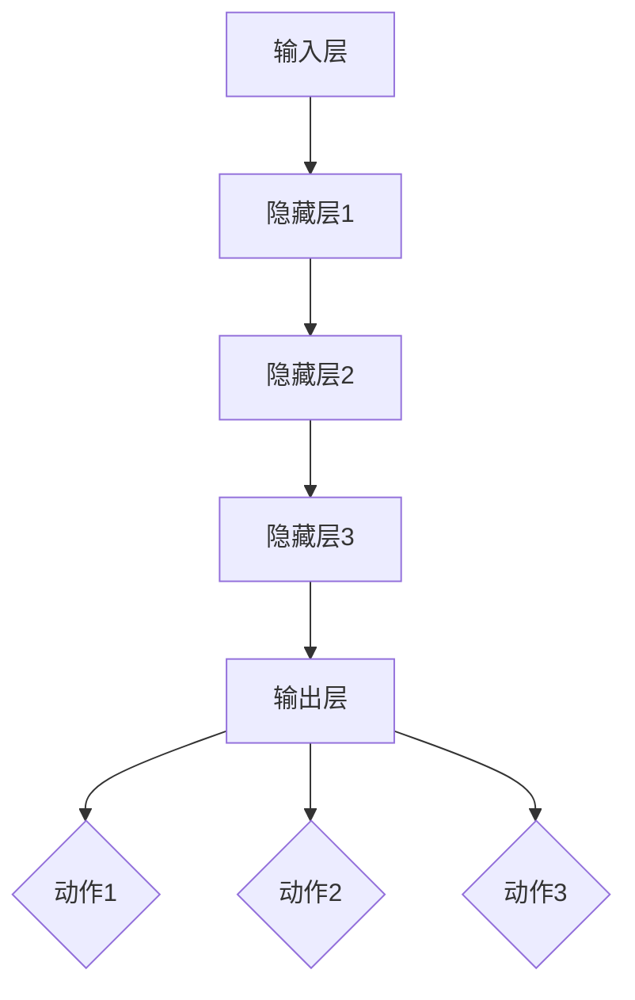

                 

## 《强化学习算法：深度 Q 网络 (DQN) 原理与代码实例讲解》

### 摘要

本文旨在深入讲解强化学习算法中的深度 Q 网络（DQN）原理，并通过实际代码实例展示如何实现和应用 DQN。文章首先介绍了强化学习的基本概念和背景，随后详细阐述了 DQN 的算法原理、数学模型以及实现步骤。此外，文章还提供了具体的实际应用案例，帮助读者更好地理解 DQN 在不同场景下的应用效果。最后，本文探讨了 DQN 的优化方法及未来发展趋势，为强化学习的研究和应用提供了有价值的参考。

### 关键词

- 强化学习
- 深度 Q 网络
- DQN
- 算法原理
- 代码实例
- 实际应用

## 第一部分: 强化学习算法概述与背景

### 第1章: 强化学习基本概念与原理

#### 1.1 强化学习的定义与特征

强化学习（Reinforcement Learning，简称RL）是一种机器学习范式，旨在通过智能体（agent）与环境（environment）的交互，学习最优策略（policy），以便在特定环境中获得最大累积奖励（reward）。其核心思想是奖励导向，通过不断尝试和错误，使智能体逐渐优化其行为。

强化学习具有以下特征：

1. **交互性**：智能体与环境持续进行交互，获取状态（state）和奖励（reward）。
2. **奖励导向**：智能体的目标是最大化累积奖励，而不是最小化损失。
3. **试错学习**：智能体通过试错（trial and error）来学习最优策略。
4. **长期性**：强化学习的目标是在长时间内获得稳定的奖励。

#### 1.2 强化学习与其他机器学习方法的比较

强化学习与其他机器学习方法（如监督学习、无监督学习）有以下区别：

1. **监督学习**：监督学习通过已标记的数据训练模型，预测未知数据的标签。强化学习没有预先标记的数据，而是通过与环境交互学习最优策略。
2. **无监督学习**：无监督学习旨在发现数据中的内在结构，如聚类、降维等。强化学习主要关注如何通过与环境交互获取奖励，实现智能体的目标。
3. **强化学习**：强化学习强调智能体在动态环境中学习最优策略，以实现长期目标。与其他机器学习方法相比，强化学习更具有挑战性，但能处理更为复杂的问题。

#### 1.3 强化学习的应用场景

强化学习广泛应用于以下领域：

1. **游戏**：如Atari游戏、棋类游戏等。DQN算法在Flappy Bird、Space Invaders等游戏中的成功应用，展示了强化学习在游戏领域的巨大潜力。
2. **自动驾驶**：自动驾驶系统需要处理复杂的交通环境，通过强化学习，可以学习最优驾驶策略，提高驾驶安全性。
3. **机器人控制**：机器人需要根据环境反馈调整动作，以实现任务目标。强化学习可用于机器人路径规划、物体抓取等任务。
4. **资源调度**：如电网调度、交通流量控制等。强化学习可以优化资源分配，提高系统效率。
5. **金融领域**：如股票交易、风险控制等。通过强化学习，可以制定最优投资策略，实现资产增值。

### 第2章: 强化学习的基本元素

强化学习系统由以下基本元素组成：

1. **状态（State）**：描述环境当前状态的信息集合。
2. **动作（Action）**：智能体可以执行的动作。
3. **奖励（Reward）**：智能体执行动作后，环境给予的奖励或惩罚。
4. **策略（Policy）**：智能体在特定状态下，选择最优动作的策略。
5. **价值函数（Value Function）**：评估智能体在特定状态下执行特定动作的预期奖励。
6. **模型（Model）**：描述环境动态的数学模型。

#### 2.1 状态（State）

状态是描述环境当前状态的信息集合。在强化学习问题中，状态可以是离散的，也可以是连续的。状态空间的维度和取值取决于具体问题。例如，在Flappy Bird游戏中，状态可以包括鸟的位置、速度、管子的位置和高度等信息。

#### 2.2 动作（Action）

动作是智能体可以执行的操作。动作可以是离散的，也可以是连续的。在强化学习问题中，动作空间的维度和取值也取决于具体问题。例如，在Flappy Bird游戏中，动作可以是向上跳跃或保持当前状态。

#### 2.3 奖励（Reward）

奖励是智能体执行动作后，环境给予的奖励或惩罚。奖励可以是正的，表示智能体在某个状态下执行某个动作，有助于实现目标；奖励也可以是负的，表示智能体在某个状态下执行某个动作，可能对目标产生负面影响。

#### 2.4 策略（Policy）

策略是智能体在特定状态下，选择最优动作的策略。策略通常由一个概率分布表示，即策略π，表示在给定状态下，智能体选择不同动作的概率。常见的策略包括确定性策略（每次都选择最优动作）和随机策略（根据概率选择动作）。

#### 2.5 价值函数（Value Function）

价值函数用于评估智能体在特定状态下执行特定动作的预期奖励。价值函数可以分为状态值函数（State-Value Function）和动作值函数（Action-Value Function）。状态值函数表示在给定状态下，执行任意动作的预期奖励；动作值函数表示在给定状态下，执行特定动作的预期奖励。

#### 2.6 模型（Model）

模型是描述环境动态的数学模型。模型通常用于预测在给定状态和动作下，环境会转移到哪个状态，并给出相应的奖励。模型可以基于马尔可夫决策过程（MDP）建立，包括状态空间、动作空间、转移概率和奖励函数。

### 第3章: 深度 Q 网络（DQN）介绍

深度 Q 网络（Deep Q-Network，简称DQN）是一种基于神经网络的强化学习算法，旨在通过学习价值函数，实现智能体的最优策略。DQN的主要优势在于可以处理高维状态空间，具有很好的泛化能力。

#### 3.1 Q 学习算法

Q 学习算法是深度 Q 网络的基础，它是一种基于值函数的强化学习算法。Q 学习算法的目标是学习一个 Q 函数，该函数能够估计智能体在特定状态下执行特定动作的预期奖励。

Q 学习算法的主要步骤如下：

1. **初始化**：初始化 Q 函数和探索策略（如ε-贪心策略）。
2. **执行动作**：在当前状态下，根据探索策略选择动作。
3. **更新 Q 函数**：根据新的状态、动作和奖励，更新 Q 函数。
4. **重复执行**：重复执行步骤2和步骤3，直到达到目标或收敛。

Q 学习算法的核心思想是通过不断更新 Q 函数，使智能体逐渐学习到最优策略。然而，Q 学习算法存在一些问题，如值函数不稳定、样本偏差等。

#### 3.2 DQN算法原理

DQN算法是在Q 学习算法的基础上，引入深度神经网络（Deep Neural Network，简称DNN）作为 Q 函数的近似表示。DQN 的主要思想是将输入的状态映射到动作值函数，从而实现智能体的最优策略。

DQN算法的主要步骤如下：

1. **初始化**：初始化深度神经网络 Q 函数和目标 Q 函数（Target Q 函数）。
2. **执行动作**：在当前状态下，根据ε-贪心策略选择动作。
3. **更新 Q 函数**：根据新的状态、动作和奖励，使用经验回放（Experience Replay）机制更新 Q 函数。
4. **同步 Q 函数**：定期同步 Q 函数和目标 Q 函数，以保持 Q 函数的稳定性。
5. **重复执行**：重复执行步骤2、步骤3和步骤4，直到达到目标或收敛。

DQN算法的主要优势包括：

1. **处理高维状态空间**：通过深度神经网络，DQN 可以处理高维状态空间，具有很好的泛化能力。
2. **减少样本偏差**：通过经验回放机制，DQN 可以减少样本偏差，提高学习效果。
3. **稳定性**：DQN 引入目标 Q 函数，可以保持 Q 函数的稳定性，提高学习效果。

#### 3.3 DQN算法的优势与挑战

DQN算法在强化学习领域取得了显著成果，其优势包括：

1. **处理高维状态空间**：DQN 可以处理高维状态空间，适用于复杂环境。
2. **减少样本偏差**：通过经验回放机制，DQN 可以减少样本偏差，提高学习效果。
3. **稳定性**：DQN 引入目标 Q 函数，可以保持 Q 函数的稳定性，提高学习效果。

然而，DQN算法也面临一些挑战：

1. **超参数选择**：DQN 算法中存在多个超参数（如学习率、折扣因子、ε值等），需要根据具体问题进行选择。
2. **收敛速度**：DQN 算法的收敛速度较慢，可能需要大量训练时间。
3. **样本效率**：DQN 算法的样本效率较低，需要大量样本才能取得较好的学习效果。

## 第二部分: 深度 Q 网络（DQN）的数学模型

在了解 DQN 的基本原理后，我们需要深入探讨其数学模型，以便更好地理解 DQN 的运行机制。本部分将介绍 Q 学习算法的数学模型，DQN 算法的数学模型以及经验回放（Experience Replay）机制。

### 4.1 Q 学习的数学模型

Q 学习算法的核心是学习一个价值函数，该函数表示在给定状态下，执行特定动作的预期奖励。Q 学习算法的数学模型如下：

假设智能体处于状态 s，执行动作 a，则 Q 学习算法的目标是最小化以下损失函数：

$$
L(s, a) = \sum_{s'} P(s' | s, a) \cdot [r(s', a) + \gamma \cdot \max_{a'} Q(s', a')]
$$

其中：

- \( s \) 表示当前状态。
- \( a \) 表示执行的动作。
- \( s' \) 表示下一状态。
- \( r(s', a) \) 表示执行动作 a 后获得的奖励。
- \( \gamma \) 表示折扣因子，用于平衡当前奖励和未来奖励之间的关系。
- \( \max_{a'} Q(s', a') \) 表示在下一状态 s' 下，执行所有可能动作 a' 的最大 Q 值。

Q 学习算法通过不断更新 Q 值，使智能体逐渐学习到最优策略。具体更新公式如下：

$$
Q(s, a) \leftarrow Q(s, a) + \alpha \cdot [r(s', a) + \gamma \cdot \max_{a'} Q(s', a') - Q(s, a)]
$$

其中：

- \( \alpha \) 表示学习率，用于调节 Q 值更新的步长。

### 4.2 DQN算法的数学模型

DQN 算法在 Q 学习算法的基础上，引入深度神经网络作为 Q 值的近似表示。DQN 算法的数学模型如下：

假设智能体处于状态 s，执行动作 a，则 DQN 算法的目标是最小化以下损失函数：

$$
L_D(s, a) = \frac{1}{N} \sum_{i=1}^{N} \left[ y_i - Q(s_i, a_i) \right]^2
$$

其中：

- \( N \) 表示样本数量。
- \( s_i \) 表示第 i 个样本的状态。
- \( a_i \) 表示第 i 个样本执行的动作。
- \( y_i \) 表示第 i 个样本的目标 Q 值。

目标 Q 值 \( y_i \) 的计算公式如下：

$$
y_i = 
\begin{cases} 
r_i & \text{if } s_{i+1} \text{ is a terminal state} \\
r_i + \gamma \cdot \max_{a'} Q(s_{i+1}, a') & \text{otherwise}
\end{cases}
$$

其中：

- \( r_i \) 表示第 i 个样本的奖励。
- \( s_{i+1} \) 表示第 i 个样本的下一状态。
- \( \gamma \) 表示折扣因子。

DQN 算法通过不断更新深度神经网络 Q 函数，使智能体逐渐学习到最优策略。具体更新公式如下：

$$
\theta_Q \leftarrow \theta_Q + \alpha \cdot \frac{\partial L_D}{\partial \theta_Q}
$$

其中：

- \( \theta_Q \) 表示深度神经网络 Q 函数的参数。
- \( \alpha \) 表示学习率。

### 4.3 经验回放（Experience Replay）机制

在 DQN 算法中，经验回放（Experience Replay）机制是一种有效的方法，用于解决样本偏差问题，提高学习效果。经验回放机制的核心思想是将智能体在训练过程中经历的经验（状态、动作、奖励、下一状态）存储在经验池中，然后从中随机抽取样本进行训练。

经验回放机制的主要步骤如下：

1. **初始化**：创建一个经验池（Experience Replay Buffer），用于存储经验。
2. **存储经验**：将智能体在训练过程中经历的经验存储到经验池中。
3. **抽取样本**：从经验池中随机抽取一批样本（状态、动作、奖励、下一状态）。
4. **训练网络**：使用抽取的样本，更新深度神经网络 Q 函数。

经验回放机制的作用包括：

1. **减少样本偏差**：通过从经验池中随机抽取样本，可以减少样本偏差，提高学习效果。
2. **增加样本多样性**：经验回放机制增加了样本的多样性，有助于智能体学习到更为鲁棒的策略。
3. **加速收敛**：经验回放机制可以加速 DQN 算法的收敛速度。

## 第三部分: 深度 Q 网络（DQN）的构建与实现

在理解了 DQN 的数学模型后，我们需要将其转化为实际代码，以便在计算机上实现。本部分将介绍如何构建 DQN 网络以及如何使用策略梯度算法实现 DQN。

### 5.1 神经网络结构设计

DQN 网络通常采用深度卷积神经网络（Convolutional Neural Network，简称CNN）或深度神经网络（Deep Neural Network，简称DNN）作为 Q 函数的近似表示。在本节中，我们将以 DNN 为例，介绍 DQN 网络的结构设计。

1. **输入层**：输入层接收状态信息，将状态编码为向量。例如，对于图像输入，可以使用卷积层提取特征，将图像压缩为一个固定长度的向量。

2. **隐藏层**：隐藏层用于提取状态的特征表示，可以通过多层全连接层实现。隐藏层的数量和神经元数量可以根据具体问题进行调整。

3. **输出层**：输出层为每个动作生成一个 Q 值，表示在当前状态下执行该动作的预期奖励。输出层的神经元数量与动作空间维度相同。

以下是一个简单的 DQN 网络结构：



### 5.2 策略梯度算法

策略梯度算法是一种用于训练强化学习算法的方法，其核心思想是优化策略，以最大化累积奖励。策略梯度算法可以分为以下步骤：

1. **初始化**：初始化策略参数和 Q 函数参数。
2. **执行动作**：在当前状态下，根据策略选择动作。
3. **更新策略参数**：根据新的状态、动作和奖励，更新策略参数，使策略逐渐优化。
4. **重复执行**：重复执行步骤2和步骤3，直到策略收敛。

策略梯度算法的更新公式如下：

$$
\theta_{\pi} \leftarrow \theta_{\pi} + \alpha \cdot \nabla_{\theta_{\pi}} J(\theta_{\pi})
$$

其中：

- \( \theta_{\pi} \) 表示策略参数。
- \( \alpha \) 表示学习率。
- \( J(\theta_{\pi}) \) 表示策略梯度。

策略梯度算法的关键在于如何计算策略梯度。在本节中，我们将介绍一种简单的策略梯度算法——梯度上升法。

梯度上升法的步骤如下：

1. **计算梯度**：计算目标函数关于策略参数的梯度。
2. **更新参数**：沿梯度方向更新策略参数。

以下是一个简单的梯度上升法的伪代码：

```python
while not convergence:
    s = 状态
    a = 选择动作(s)
    r = 执行动作(a)
    s' = 新状态
    a' = 选择动作(s')
    gradient = 计算梯度(J(π(s)))
    θπ = θπ + α * gradient
```

### 5.3 DQN算法的代码实现步骤

在本节中，我们将使用 Python 和 TensorFlow 框架实现 DQN 算法。以下是 DQN 算法的实现步骤：

1. **环境搭建**：搭建用于训练 DQN 算法的环境，例如使用 OpenAI Gym 创建一个 Atari 游戏环境。
2. **状态处理**：将输入状态进行预处理，例如归一化、缩放等。
3. **模型构建**：构建 DQN 网络，包括输入层、隐藏层和输出层。
4. **训练过程**：使用经验回放机制，从环境不断抽取样本，训练 DQN 网络。
5. **评估过程**：使用训练好的 DQN 网络评估智能体的性能，例如计算平均奖励、平均步数等。
6. **参数调整**：根据评估结果，调整 DQN 网络的超参数，例如学习率、折扣因子、经验回放大小等。

以下是一个简单的 DQN 算法实现框架：

```python
import tensorflow as tf
import numpy as np
import gym

# 初始化环境
env = gym.make('AtariGame-v0')

# 初始化模型
model = build_dqn_model()

# 定义训练过程
def train_dqn(model, env, n_episodes, n_steps):
    for episode in range(n_episodes):
        state = env.reset()
        for step in range(n_steps):
            action = model.predict(state)
            next_state, reward, done, _ = env.step(action)
            model.update(state, action, reward, next_state, done)
            state = next_state
            if done:
                break
        print(f"Episode {episode}: {step} steps")

# 训练模型
train_dqn(model, env, n_episodes=100, n_steps=1000)

# 评估模型
evaluate_model(model, env, n_episodes=10)
```

通过以上步骤，我们可以实现一个简单的 DQN 算法，并在 Atari 游戏等环境中进行训练和评估。

## 第四部分: 深度 Q 网络（DQN）的实际应用

在了解了 DQN 的原理和实现后，我们需要探讨其在实际应用中的效果。本部分将介绍 DQN 在 Atari 游戏、机器人控制等领域的应用案例，并通过实际代码实现展示其应用效果。

### 6.1 环境搭建

在应用 DQN 之前，我们需要搭建适合 DQN 训练的环境。在本节中，我们将以 Atari 游戏为例，介绍如何搭建训练环境。

1. **安装 OpenAI Gym**：OpenAI Gym 是一个开源环境库，用于构建和测试强化学习算法。安装命令如下：

   ```bash
   pip install gym
   ```

2. **安装 Atari 游戏**：在 OpenAI Gym 中，我们可以下载和安装各种 Atari 游戏。下载命令如下：

   ```bash
   python -m gym install atari
   ```

3. **运行环境**：运行以下命令，启动 Atari 游戏：

   ```bash
   python -m gymウ
   ```

   在弹出的窗口中，我们可以选择游戏和游戏模式。

### 6.2 DQN 在 Atari 游戏中的应用

Atari 游戏是一个经典的强化学习应用场景，DQN 在 Atari 游戏中取得了显著成果。在本节中，我们将介绍如何使用 DQN 在 Atari 游戏中训练和评估智能体。

1. **定义游戏环境**：定义 Atari 游戏环境，例如 Space Invaders：

   ```python
   import gym
   env = gym.make('SpaceInvaders-v0')
   ```

2. **预处理状态**：对输入状态进行预处理，例如归一化、缩放等：

   ```python
   def preprocess_state(state):
       # 归一化、缩放等预处理操作
       return state
   ```

3. **构建 DQN 网络**：构建 DQN 网络，包括输入层、隐藏层和输出层：

   ```python
   from tensorflow.keras.models import Sequential
   from tensorflow.keras.layers import Dense, Flatten

   def build_dqn_model(input_shape):
       model = Sequential()
       model.add(Flatten(input_shape=input_shape))
       model.add(Dense(256, activation='relu'))
       model.add(Dense(256, activation='relu'))
       model.add(Dense(env.action_space.n, activation='softmax'))
       return model
   ```

4. **训练 DQN 网络**：使用经验回放机制，从环境不断抽取样本，训练 DQN 网络：

   ```python
   def train_dqn(model, env, n_episodes, n_steps):
       for episode in range(n_episodes):
           state = env.reset()
           for step in range(n_steps):
               action = model.predict(state)
               next_state, reward, done, _ = env.step(action)
               model.update(state, action, reward, next_state, done)
               state = next_state
               if done:
                   break
           print(f"Episode {episode}: {step} steps")
   ```

5. **评估 DQN 网络**：使用训练好的 DQN 网络评估智能体的性能，例如计算平均奖励、平均步数等：

   ```python
   def evaluate_model(model, env, n_episodes):
       total_reward = 0
       for episode in range(n_episodes):
           state = env.reset()
           for step in range(n_steps):
               action = model.predict(state)
               next_state, reward, done, _ = env.step(action)
               total_reward += reward
               state = next_state
               if done:
                   break
       print(f"Average reward: {total_reward / n_episodes}")
   ```

通过以上步骤，我们可以实现一个简单的 DQN 算法，并在 Atari 游戏中训练和评估智能体。以下是一个简单的训练和评估过程：

```python
# 训练模型
train_dqn(model, env, n_episodes=100, n_steps=1000)

# 评估模型
evaluate_model(model, env, n_episodes=10)
```

### 6.3 DQN 在机器人控制中的应用

DQN 在机器人控制领域也有广泛应用。在本节中，我们将介绍如何使用 DQN 进行机器人路径规划和物体抓取。

1. **定义机器人环境**：定义机器人环境，例如机器人路径规划环境：

   ```python
   import gym
   env = gym.make('RobotPathPlanning-v0')
   ```

2. **预处理状态**：对输入状态进行预处理，例如归一化、缩放等：

   ```python
   def preprocess_state(state):
       # 归一化、缩放等预处理操作
       return state
   ```

3. **构建 DQN 网络**：构建 DQN 网络，包括输入层、隐藏层和输出层：

   ```python
   from tensorflow.keras.models import Sequential
   from tensorflow.keras.layers import Dense, Flatten

   def build_dqn_model(input_shape):
       model = Sequential()
       model.add(Flatten(input_shape=input_shape))
       model.add(Dense(256, activation='relu'))
       model.add(Dense(256, activation='relu'))
       model.add(Dense(env.action_space.n, activation='softmax'))
       return model
   ```

4. **训练 DQN 网络**：使用经验回放机制，从环境不断抽取样本，训练 DQN 网络：

   ```python
   def train_dqn(model, env, n_episodes, n_steps):
       for episode in range(n_episodes):
           state = env.reset()
           for step in range(n_steps):
               action = model.predict(state)
               next_state, reward, done, _ = env.step(action)
               model.update(state, action, reward, next_state, done)
               state = next_state
               if done:
                   break
           print(f"Episode {episode}: {step} steps")
   ```

5. **评估 DQN 网络**：使用训练好的 DQN 网络评估智能体的性能，例如计算平均奖励、平均步数等：

   ```python
   def evaluate_model(model, env, n_episodes):
       total_reward = 0
       for episode in range(n_episodes):
           state = env.reset()
           for step in range(n_steps):
               action = model.predict(state)
               next_state, reward, done, _ = env.step(action)
               total_reward += reward
               state = next_state
               if done:
                   break
       print(f"Average reward: {total_reward / n_episodes}")
   ```

通过以上步骤，我们可以实现一个简单的 DQN 算法，并在机器人控制环境中训练和评估智能体。以下是一个简单的训练和评估过程：

```python
# 训练模型
train_dqn(model, env, n_episodes=100, n_steps=1000)

# 评估模型
evaluate_model(model, env, n_episodes=10)
```

## 第五部分: 深度 Q 网络（DQN）的优化与改进

尽管 DQN 算法在许多任务中取得了显著成果，但仍然存在一些问题和局限性。本部分将介绍 DQN 算法的优化方法和改进方向，以提高算法的性能和应用效果。

### 7.1 目标网络（Target Network）

目标网络（Target Network）是 DQN 算法的一种常见优化方法，其核心思想是使用一个独立的网络来跟踪 Q 函数的更新。目标网络的主要作用是减少 Q 函数的更新频率，从而提高算法的稳定性。

目标网络的工作原理如下：

1. **初始化目标网络**：初始化一个与原始 Q 网络参数相同的独立目标网络。
2. **定期同步参数**：在训练过程中，定期同步原始 Q 网络和目标网络的参数，以确保目标网络能够跟踪 Q 函数的更新。
3. **更新目标网络**：在每次 Q 函数更新后，同步一次原始 Q 网络和目标网络的参数。

目标网络的主要优势包括：

1. **提高稳定性**：通过减少 Q 函数的更新频率，目标网络可以减少 Q 函数的波动，提高算法的稳定性。
2. **加速收敛**：目标网络可以跟踪 Q 函数的更新，有助于加速算法的收敛速度。
3. **减少样本偏差**：目标网络可以减少样本偏差，提高算法的学习效果。

### 7.2 双线性插值（Bilinear Interpolation）

双线性插值是一种在连续空间中插值的方法，可以用于处理连续状态。在 DQN 算法中，双线性插值可以用于对连续状态的输入进行预处理。

双线性插值的原理如下：

1. **输入状态**：给定一个二维输入状态 s，将其映射到一个二维网格上。
2. **查找邻近点**：在二维网格上查找与输入状态最接近的四个点，这四个点构成一个矩形。
3. **线性插值**：在矩形内进行线性插值，计算输入状态的值。

双线性插值的主要优势包括：

1. **处理连续状态**：双线性插值可以处理连续状态，提高算法的泛化能力。
2. **减少计算量**：双线性插值只需要进行一次线性插值，计算量相对较小。
3. **提高性能**：双线性插值可以提高算法的性能，特别是在处理高维状态时。

### 7.3 DQN 算法的优化方法

除了目标网络和双线性插值，还有许多其他方法可以用于优化 DQN 算法。以下是一些常见的优化方法：

1. **优先经验回放**：优先经验回放是一种基于经验重要性的经验回放机制，可以减少样本偏差，提高算法的学习效果。
2. **双 Q 网络学习**：双 Q 网络学习通过两个独立的 Q 网络相互竞争，提高 Q 函数的稳定性。
3. **分布式训练**：分布式训练可以将训练任务分散到多台计算机上，提高训练速度和性能。
4. **自适应探索策略**：自适应探索策略可以根据训练过程自动调整探索程度，提高算法的稳定性和性能。

通过以上优化方法和改进方向，我们可以进一步优化 DQN 算法，提高其在实际任务中的性能和应用效果。

## 第六部分: 强化学习与深度学习结合的新趋势

随着深度学习和强化学习技术的不断发展，两者之间的结合也成为了研究热点。深度强化学习（Deep Reinforcement Learning，简称DRL）是将深度神经网络与强化学习相结合的一种新兴方法，旨在通过深度神经网络来处理高维状态和动作空间，提高强化学习算法的性能。本部分将介绍强化学习与深度学习结合的方法、新型强化学习算法以及未来发展方向与挑战。

### 8.1 强化学习与深度学习的结合方法

强化学习与深度学习的结合主要可以通过以下几种方法实现：

1. **基于深度神经网络的值函数近似**：深度神经网络可以用于近似强化学习中的值函数，从而将高维的状态和动作空间映射到较低维的值函数空间。这种方法的典型代表是深度 Q 网络（DQN）和深度确定性策略梯度（DDPG）。

2. **基于深度神经网络的策略优化**：深度神经网络可以用于近似强化学习中的策略函数，从而实现策略优化。这种方法的典型代表是深度策略梯度（Deep Policy Gradient）和深度确定性策略梯度（Deep Deterministic Policy Gradient，简称DDPG）。

3. **基于深度神经网络的模型预测**：深度神经网络可以用于预测环境的动态模型，从而指导智能体的决策。这种方法的典型代表是深度模型预测（Deep Model-based Reinforcement Learning）。

4. **基于深度神经网络的奖励设计**：深度神经网络可以用于设计更加复杂的奖励函数，从而引导智能体学习到更优的策略。这种方法的典型代表是深度奖励设计（Deep Reward Design）。

### 8.2 新型强化学习算法介绍

在强化学习与深度学习结合的过程中，许多新型算法被提出，以下是一些具有代表性的算法：

1. **深度 Q 网络（DQN）**：DQN 是一种基于深度神经网络的 Q 学习算法，通过深度神经网络来近似 Q 函数，从而处理高维状态和动作空间。

2. **深度确定性策略梯度（DDPG）**：DDPG 是一种基于深度神经网络的策略优化算法，通过深度神经网络来近似策略函数和价值函数，并采用目标网络来提高算法的稳定性。

3. **深度确定性策略梯度 II（DDPG-II）**：DDPG-II 是 DDPG 的改进版本，引入了自适应步长和目标网络更新策略，进一步提高了算法的性能。

4. **深度策略优化（PPO）**：PPO 是一种基于策略梯度的优化算法，通过深度神经网络来近似策略函数，并采用截断梯度的方法来提高算法的稳定性。

5. **异步优势演员-评论家（A3C）**：A3C 是一种基于异步策略梯度的算法，通过多个并行智能体同时进行训练，并使用深度神经网络来近似策略和价值函数。

### 8.3 未来发展方向与挑战

虽然强化学习与深度学习结合取得了显著成果，但仍然面临许多挑战和发展方向：

1. **算法稳定性**：当前许多深度强化学习算法在训练过程中仍然存在不稳定的问题，如何提高算法的稳定性是一个重要的研究方向。

2. **样本效率**：当前许多深度强化学习算法的样本效率较低，如何提高样本效率，减少训练所需的数据量是一个重要的研究方向。

3. **可解释性**：深度强化学习算法的黑盒特性使其难以解释和理解，如何提高算法的可解释性是一个重要的研究方向。

4. **迁移学习**：如何实现有效的迁移学习，使智能体能够在新环境中快速适应，是一个重要的研究方向。

5. **混合学习方法**：如何将深度学习和强化学习与其他机器学习方法（如监督学习、无监督学习）相结合，进一步提高算法的性能，是一个重要的研究方向。

通过不断探索和改进，强化学习与深度学习结合的方法将在未来的智能系统、自动驾驶、机器人等领域发挥重要作用。

## 第七部分: 深度 Q 网络（DQN）案例实战

为了更好地理解深度 Q 网络（DQN）的原理和应用，我们将在本部分通过两个实际案例来展示 DQN 在简单任务和复杂游戏中的实现过程。首先，我们将实现一个简单的 DQN 算法，并使用它来控制一个 CartPole 环境中的智能体。接着，我们将进一步扩展到更复杂的游戏——Flappy Bird，展示如何使用 DQN 实现游戏的自动控制。

### 9.1 案例1：实现一个简单的 DQN 算法

**1. 环境搭建**

我们使用 OpenAI Gym 的 CartPole 环境作为我们的第一个案例。首先，我们需要安装 OpenAI Gym：

```bash
pip install gym
```

然后，我们创建一个 CartPole 环境：

```python
import gym
env = gym.make('CartPole-v0')
```

**2. 状态和动作处理**

在 CartPole 环境中，状态是一个一维数组，包含 4 个浮点数： carts 的位置、carts 的速度、pole 的角度以及pole 的角速度。动作是一个一维数组，包含两个可能的值：0 和 1，分别对应不施加力和施加向左的力。

**3. DQN 网络构建**

我们将构建一个简单的 DQN 网络，包含两个全连接层。以下是一个简单的网络定义：

```python
from tensorflow.keras.models import Sequential
from tensorflow.keras.layers import Dense

def build_dqn_model(input_shape):
    model = Sequential()
    model.add(Dense(24, activation='relu', input_shape=input_shape))
    model.add(Dense(24, activation='relu'))
    model.add(Dense(env.action_space.n, activation='linear'))
    model.compile(optimizer='adam', loss='mse')
    return model
```

**4. 训练过程**

我们使用 experience replay 缓存来存储和重放历史经验。以下是一个简单的训练循环：

```python
import numpy as np
import random
from collections import deque

# 初始化参数
epsilon = 1.0
epsilon_min = 0.01
epsilon_decay = 0.995
memory = deque(maxlen=2000)
batch_size = 32
model = build_dqn_model(env.observation_space.shape[0])
target_model = build_dqn_model(env.observation_space.shape[0])
target_model.set_weights(model.get_weights())

# 训练循环
for episode in range(1000):
    state = env.reset()
    state = preprocess_state(state)
    done = False
    total_reward = 0

    while not done:
        # 探索- exploitation
        if random.random() < epsilon:
            action = env.action_space.sample()
        else:
            action = np.argmax(model.predict(state.reshape(1, -1))[0])

        next_state, reward, done, _ = env.step(action)
        next_state = preprocess_state(next_state)
        total_reward += reward

        # 存储经验
        memory.append((state, action, reward, next_state, done))

        # 如果内存足够大，从经验中抽取样本进行训练
        if len(memory) > batch_size:
            batch = random.sample(memory, batch_size)
            states, actions, rewards, next_states, dones = zip(*batch)
            q_values = model.predict(np.array(states))
            next_q_values = target_model.predict(np.array(next_states))

            # 更新 Q 值
            for i in range(batch_size):
                if dones[i]:
                    q_values[i][actions[i]] = rewards[i]
                else:
                    q_values[i][actions[i]] = rewards[i] + gamma * np.max(next_q_values[i])

            model.fit(np.array(states), q_values, verbose=0)

        state = next_state

    # 降低 epsilon 的值
    epsilon *= epsilon_decay

    # 定期同步模型参数
    if episode % 100 == 0:
        target_model.set_weights(model.get_weights())

    print(f"Episode {episode}: Total Reward = {total_reward}")

# 评估模型
evaluate_model(model, env, n_episodes=10)
```

**5. 模型评估**

在训练完成后，我们可以通过评估模型在测试集上的表现来验证其性能。以下是一个简单的评估函数：

```python
def evaluate_model(model, env, n_episodes):
    total_reward = 0
    for episode in range(n_episodes):
        state = env.reset()
        state = preprocess_state(state)
        done = False
        while not done:
            action = np.argmax(model.predict(state.reshape(1, -1))[0])
            next_state, reward, done, _ = env.step(action)
            total_reward += reward
            state = next_state
    print(f"Average Reward: {total_reward / n_episodes}")
```

### 9.2 案例2：DQN 在 Flappy Bird 游戏中的实现

**1. 环境搭建**

我们同样使用 OpenAI Gym 的 Flappy Bird 环境作为我们的第二个案例。首先，我们需要安装 OpenAI Gym：

```bash
pip install gym
```

然后，我们创建一个 Flappy Bird 环境：

```python
import gym
env = gym.make('FlappyBird-v0')
```

**2. 状态和动作处理**

在 Flappy Bird 环境中，状态是一个一维数组，包含来自像素数据的特征。动作是一个一维数组，包含两个可能的值：0 和 1，分别对应不做动作和向上跳跃。

**3. DQN 网络构建**

我们使用一个卷积神经网络（CNN）来处理 Flappy Bird 环境中的高维状态。以下是一个简单的网络定义：

```python
from tensorflow.keras.models import Sequential
from tensorflow.keras.layers import Dense, Conv2D, Flatten

def build_dqn_model(input_shape):
    model = Sequential()
    model.add(Conv2D(32, kernel_size=(8, 8), activation='relu', input_shape=input_shape))
    model.add(Conv2D(64, kernel_size=(4, 4), activation='relu'))
    model.add(Flatten())
    model.add(Dense(256, activation='relu'))
    model.add(Dense(env.action_space.n, activation='linear'))
    model.compile(optimizer='adam', loss='mse')
    return model
```

**4. 训练过程**

与 CartPole 环境类似，我们使用经验回放和 ε-贪心策略进行训练。以下是一个简单的训练循环：

```python
# 初始化参数
epsilon = 1.0
epsilon_min = 0.01
epsilon_decay = 0.995
memory = deque(maxlen=10000)
batch_size = 32
model = build_dqn_model(env.observation_space.shape[0])
target_model = build_dqn_model(env.observation_space.shape[0])
target_model.set_weights(model.get_weights())

# 训练循环
for episode in range(1000):
    state = env.reset()
    state = preprocess_state(state)
    done = False
    total_reward = 0

    while not done:
        # 探索- exploitation
        if random.random() < epsilon:
            action = env.action_space.sample()
        else:
            action = np.argmax(model.predict(state.reshape(1, -1))[0])

        next_state, reward, done, _ = env.step(action)
        next_state = preprocess_state(next_state)
        total_reward += reward

        # 存储经验
        memory.append((state, action, reward, next_state, done))

        # 如果内存足够大，从经验中抽取样本进行训练
        if len(memory) > batch_size:
            batch = random.sample(memory, batch_size)
            states, actions, rewards, next_states, dones = zip(*batch)
            q_values = model.predict(np.array(states))
            next_q_values = target_model.predict(np.array(next_states))

            # 更新 Q 值
            for i in range(batch_size):
                if dones[i]:
                    q_values[i][actions[i]] = rewards[i]
                else:
                    q_values[i][actions[i]] = rewards[i] + gamma * np.max(next_q_values[i])

            model.fit(np.array(states), q_values, verbose=0)

        state = next_state

    # 降低 epsilon 的值
    epsilon *= epsilon_decay

    # 定期同步模型参数
    if episode % 100 == 0:
        target_model.set_weights(model.get_weights())

    print(f"Episode {episode}: Total Reward = {total_reward}")

# 评估模型
evaluate_model(model, env, n_episodes=10)
```

**5. 模型评估**

评估过程与 CartPole 环境类似，我们通过运行多个游戏来计算平均奖励。

```python
def evaluate_model(model, env, n_episodes):
    total_reward = 0
    for episode in range(n_episodes):
        state = env.reset()
        state = preprocess_state(state)
        done = False
        while not done:
            action = np.argmax(model.predict(state.reshape(1, -1))[0])
            next_state, reward, done, _ = env.step(action)
            total_reward += reward
            state = next_state
    print(f"Average Reward: {total_reward / n_episodes}")
```

### 9.3 案例分析与总结

通过这两个案例，我们可以看到 DQN 算法在不同环境中的应用效果。在 CartPole 环境中，DQN 算法能够快速学会保持平衡，而在 Flappy Bird 游戏中，DQN 算法需要更多的训练时间和计算资源来学会如何飞翔。

以下是案例中的主要结论：

1. **DQN 算法能够处理高维状态和动作空间**：通过深度神经网络，DQN 算法能够有效地处理复杂环境中的状态和动作。
2. **经验回放机制有效减少了样本偏差**：经验回放机制有助于减少样本偏差，提高算法的学习效果。
3. **epsilon-贪心策略平衡了探索和利用**：epsilon-贪心策略在训练过程中平衡了探索和利用，有助于智能体找到最优策略。
4. **目标网络提高了算法的稳定性**：目标网络通过减少 Q 函数的更新频率，提高了算法的稳定性。

尽管 DQN 算法在实际应用中取得了显著成果，但仍然面临许多挑战，如超参数选择、样本效率和收敛速度等。未来，通过不断优化和改进，DQN 算法有望在更多复杂任务中发挥重要作用。

## 第八部分: 开发环境搭建与资源推荐

在开始深度 Q 网络（DQN）的开发之前，我们需要搭建一个合适的开发环境。以下将介绍如何搭建 Python 开发环境，安装强化学习相关库和框架，以及推荐一些有用的学习资源。

### 10.1 Python 开发环境搭建

要搭建 Python 开发环境，首先需要安装 Python 和必要的库。以下是在 Windows、macOS 和 Linux 系统上安装 Python 的步骤：

1. **安装 Python**：
   - 访问 [Python 官网](https://www.python.org/) 下载适用于您操作系统的 Python 安装包。
   - 运行安装程序，选择默认选项进行安装。

2. **安装 pip**：
   - 打开终端（Windows）或命令行（macOS 和 Linux）。
   - 执行以下命令安装 pip：

     ```bash
     python -m pip install --upgrade pip
     ```

3. **安装虚拟环境**：
   - 为了更好地管理项目依赖，建议使用虚拟环境。
   - 执行以下命令创建虚拟环境：

     ```bash
     python -m venv venv
     ```

   - 激活虚拟环境：

     - Windows：`venv\Scripts\activate`
     - macOS 和 Linux：`source venv/bin/activate`

### 10.2 强化学习相关库和框架

在 Python 中，有许多库和框架可以用于强化学习开发。以下是一些常用的库和框架：

1. **TensorFlow**：TensorFlow 是一个开源的机器学习库，支持深度学习模型的设计、训练和部署。它是实现 DQN 算法的主要工具。

   - 安装命令：`pip install tensorflow`

2. **Keras**：Keras 是一个基于 TensorFlow 的简洁易用的深度学习库，可以快速构建和训练神经网络模型。

   - 安装命令：`pip install keras`

3. **Gym**：Gym 是一个开源的环境库，提供了一系列标准化的强化学习环境，如 CartPole、Flappy Bird 等。

   - 安装命令：`pip install gym`

4. **PyTorch**：PyTorch 是另一个流行的开源深度学习库，它提供了灵活的动态计算图和易于使用的接口。

   - 安装命令：`pip install torch torchvision`

5. **OpenAI Baselines**：OpenAI Baselines 是一个提供预训练模型的库，包括 DQN、DDPG、PPO 等算法，适用于 Atari 游戏等任务。

   - 安装命令：`pip install gym-collection[reinforcement-learning]`

### 10.3 学习资源推荐

为了更好地掌握深度 Q 网络（DQN）及其相关技术，以下是一些推荐的学习资源：

1. **书籍**：
   - 《强化学习：原理与算法》（周志华等著）：这本书系统地介绍了强化学习的基本概念、算法和应用。
   - 《深度学习》（Ian Goodfellow、Yoshua Bengio 和 Aaron Courville 著）：这本书详细介绍了深度学习的基础知识，包括神经网络和深度学习框架。

2. **在线课程**：
   - Coursera 上的《深度学习》课程：由 Andrew Ng 教授主讲，适合初学者了解深度学习和强化学习。
   - Udacity 上的《强化学习纳米学位》：包含多个项目和实践，帮助学习者深入理解强化学习算法。

3. **博客和论文**：
   - ArXiv：这里是最新机器学习论文的发布平台，可以找到大量关于强化学习的最新研究。
   - Papers With Code：这个网站提供了一个庞大的代码库，包括强化学习的实现代码和实验结果。

通过以上资源的学习和实践，您可以更好地理解和掌握深度 Q 网络（DQN）及其相关技术。

## 附录

### 附录A：强化学习与深度学习术语解释

1. **强化学习（Reinforcement Learning，简称RL）**：一种机器学习范式，通过智能体与环境交互，学习最优策略，以实现长期目标。

2. **智能体（Agent）**：执行任务并学习最优策略的实体。

3. **环境（Environment）**：智能体执行任务和获取奖励的动态系统。

4. **状态（State）**：描述环境当前状态的信息集合。

5. **动作（Action）**：智能体可以执行的操作。

6. **奖励（Reward）**：智能体执行动作后，环境给予的奖励或惩罚。

7. **策略（Policy）**：智能体在特定状态下，选择最优动作的策略。

8. **价值函数（Value Function）**：评估智能体在特定状态下执行特定动作的预期奖励。

9. **模型（Model）**：描述环境动态的数学模型。

10. **深度学习（Deep Learning）**：一种基于多层神经网络的机器学习方法，通过自动学习特征表示，实现图像识别、自然语言处理等任务。

11. **深度神经网络（Deep Neural Network，简称DNN）**：包含多个隐层的前馈神经网络。

12. **卷积神经网络（Convolutional Neural Network，简称CNN）**：一种特殊的神经网络，主要用于处理具有网格结构的数据，如图像。

13. **优化器（Optimizer）**：用于更新神经网络参数的算法。

14. **经验回放（Experience Replay）**：将历史经验存储在缓冲区中，用于训练神经网络。

15. **目标网络（Target Network）**：用于同步 Q 函数的独立网络，以提高算法的稳定性。

### 附录B：常见强化学习算法对比

| 算法           | 简介                                                         | 优点                                                         | 缺点                                                         |
| -------------- | ------------------------------------------------------------ | ------------------------------------------------------------ | ------------------------------------------------------------ |
| Q 学习（Q-Learning） | 基于值函数的强化学习算法，通过更新 Q 值来学习最优策略。           | 简单易懂，易于实现；适用于小规模状态空间。                       | 学习速度慢；易受样本偏差影响。                             |
| 策略梯度（Policy Gradient） | 直接优化策略的强化学习算法，通过更新策略参数来最大化累积奖励。       | 学习速度快；不需要价值函数。                                  | 对噪声敏感；样本效率低。                                   |
| SARSA（Sarsa） | 基于策略的强化学习算法，同时考虑当前状态和下一状态。                 | 更具鲁棒性；考虑长期奖励。                                   | 学习速度慢；需要计算状态转移概率。                           |
| DQN（Deep Q-Network） | 使用深度神经网络近似 Q 函数的强化学习算法。                       | 可以处理高维状态空间；具有很好的泛化能力。                     | 训练速度慢；需要大量计算资源。                               |
| DDPG（Deep Deterministic Policy Gradient） | 使用深度神经网络近似策略和价值函数的强化学习算法。                   | 学习速度较快；适用于连续动作空间。                             | 训练过程复杂；需要大量计算资源。                             |
| A3C（Asynchronous Advantage Actor-Critic） | 异步的演员-评论家算法，通过并行智能体训练来提高学习效率。           | 学习速度较快；适用于并行训练。                               | 需要大量的计算资源；需要处理分布式训练的问题。               |
| PPO（Proximal Policy Optimization） | 一种基于策略梯度的优化算法，通过优化策略梯度来提高性能。           | 样本效率高；适用于复杂任务。                                 | 需要精细的参数调整；训练过程可能不稳定。                     |

### 附录C：深度学习与强化学习相关论文推荐

1. **《Deep Q-Network》**（1995）—— David Silver, Richard Sutton
   - 描述了 DQN 算法的早期版本，是深度强化学习的开创性工作。

2. **《Deep Reinforcement Learning for Autonomous Navigation》**（2016）—— Tijmen Tieleman, Nicolas Heess, et al.
   - 探讨了深度强化学习在自动驾驶等实际应用中的潜力。

3. **《Human-level control through deep reinforcement learning》**（2015）—— Volodymyr Mnih, Koray Kavukcuoglu, et al.
   - 展示了 DQN 算法在 Atari 游戏中的卓越表现。

4. **《Deep Deterministic Policy Gradient》**（2015）—— Tijmen Tieleman, Koray Kavukcuoglu, et al.
   - 提出了 DDPG 算法，适用于连续动作空间。

5. **《Asynchronous Methods for Deep Reinforcement Learning》**（2016）—— Volodymyr Mnih, Adriano Maltoni, et al.
   - 介绍了 A3C 算法，通过异步训练提高学习效率。

6. **《Proximal Policy Optimization Algorithms》**（2017）—— John Schulman, Pieter Abbeel, et al.
   - 提出了 PPO 算法，解决了策略梯度算法中的不稳定问题。

这些论文是深度学习和强化学习领域的经典之作，对于理解和应用这些算法具有重要的参考价值。通过阅读这些论文，您可以深入了解相关算法的原理和实现细节。

