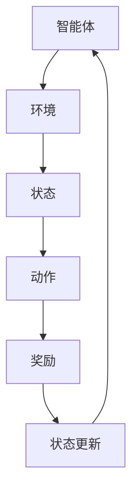
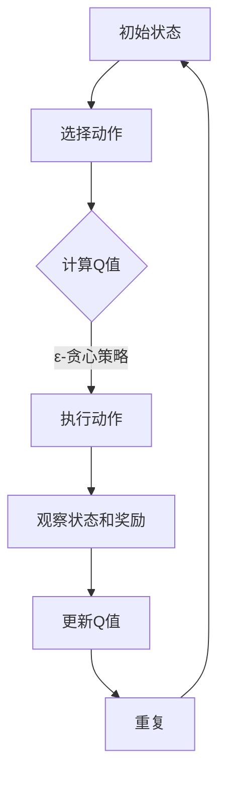
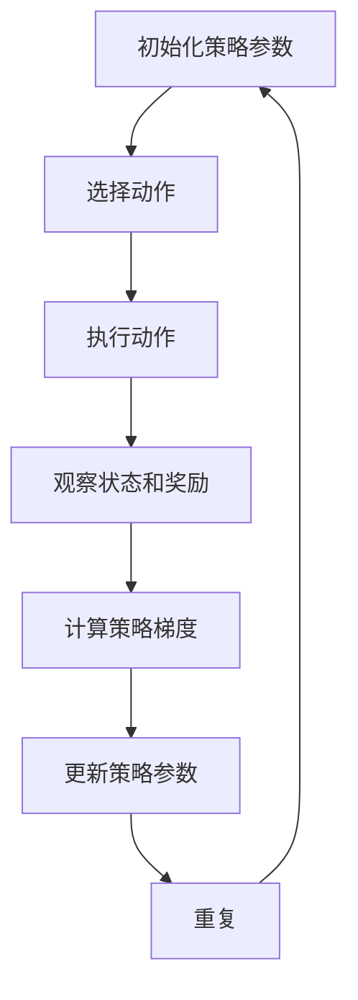

                 

# 《强化学习：基础概念解析》

## 关键词：强化学习，基本概念，算法分类，深度强化学习，应用场景，项目实施

> 摘要：本文将深入解析强化学习的基础概念，包括其定义、基本架构、核心概念和算法分类，并探讨强化学习在现实世界中的应用和实施策略。通过本文的阅读，读者将对强化学习有一个全面而深入的理解。

### 目录

1. 强化学习概述
   1.1 强化学习的定义与背景
   1.2 强化学习与传统机器学习的区别
   1.3 强化学习的应用场景

2. 强化学习的基本架构
   2.1 强化学习的四要素
   2.2 强化学习的基本流程
   2.3 强化学习的评价指标

3. 强化学习核心概念解析
   3.1 状态（State）
   3.2 动作（Action）
   3.3 奖励（Reward）
   3.4 策略（Policy）
   3.5 状态-动作价值函数（Q值）
   3.6 策略评估与策略迭代

4. 强化学习算法分类
   4.1 基于价值的强化学习算法
   4.2 基于策略的强化学习算法
   4.3 深度强化学习

5. 强化学习在现实世界中的应用
   5.1 强化学习在游戏中的应用
   5.2 强化学习在自动驾驶中的应用
   5.3 强化学习在机器人控制中的应用

6. 强化学习项目的实施
   6.1 强化学习项目的设计与规划
   6.2 强化学习实验中的问题与解决方案
   6.3 强化学习项目的评估与优化

7. 强化学习的发展趋势与挑战
   7.1 强化学习的研究前沿
   7.2 强化学习在实际应用中的挑战
   7.3 未来强化学习的发展方向

## 附录

### 附录A：强化学习相关资源

### 附录B：核心概念 Mermaid 流程图

### 附录C：核心算法伪代码

### 附录D：数学模型和公式

### 附录E：项目实战

### 附录F：参考文献

## 引言

强化学习作为机器学习和人工智能领域的一个重要分支，近年来受到了广泛关注。其独特的“学习”机制，使得机器能够通过与环境交互，不断优化行为策略，以实现长期目标。强化学习不仅在学术界取得了显著的进展，也在实际应用中展现出了巨大的潜力。本文将从强化学习的基本概念、算法分类、应用场景以及项目实施等方面进行详细解析，帮助读者全面理解强化学习的本质和应用。

### 1. 强化学习概述

#### 1.1 强化学习的定义与背景

强化学习（Reinforcement Learning，简称RL）是机器学习的一个子领域，它通过智能体（Agent）与环境的交互来学习一个最优策略（Policy）。在这个过程中，智能体不断尝试执行不同的动作（Action），并根据环境对每个动作的反馈（Reward）来调整自己的行为。与监督学习和无监督学习不同，强化学习不依赖于预先标记的数据集，而是通过奖励信号来指导学习过程。

强化学习的概念最早可以追溯到20世纪50年代的心理学研究。随后，在20世纪80年代，Andrew Ng等学者开始将强化学习应用于机器人控制，取得了初步的成功。随着计算能力的提升和深度学习技术的发展，强化学习在近年取得了飞速的进步，成为人工智能领域的一个热点研究方向。

#### 1.2 强化学习与传统机器学习的区别

传统机器学习主要分为监督学习（Supervised Learning）和无监督学习（Unsupervised Learning）两大类。监督学习依赖于标记数据，通过学习输入和输出之间的映射关系来预测新的输入；无监督学习则不需要标记数据，旨在发现数据中的隐藏结构和模式。相比之下，强化学习具有以下特点：

- **学习方式**：强化学习是通过与环境交互进行试错来学习最优策略，而非依赖预先标记的数据。
- **目标函数**：强化学习的目标是找到一个最优策略，使得长期奖励最大化。
- **反馈机制**：强化学习的反馈是即时和连续的，通过奖励信号来指导智能体的行为。

#### 1.3 强化学习的应用场景

强化学习具有广泛的应用前景，可以应用于以下场景：

- **游戏**：强化学习在游戏领域已经取得了显著的成果，如围棋、国际象棋、电子竞技等。
- **机器人**：强化学习可以帮助机器人学习复杂的运动技能和任务，如机器人导航、路径规划、动作控制等。
- **自动驾驶**：强化学习在自动驾驶领域有着广泛的应用，如车辆控制、路径规划、行人检测等。
- **推荐系统**：强化学习可以用于构建自适应的推荐系统，如新闻推送、购物推荐等。
- **金融领域**：强化学习在金融领域也有着重要的应用，如股票交易、风险管理等。

接下来，我们将进一步探讨强化学习的基本架构、核心概念和算法分类，为读者提供一个全面的强化学习知识体系。

### 2. 强化学习的基本架构

#### 2.1 强化学习的四要素

强化学习系统主要由四个基本要素构成：智能体（Agent）、环境（Environment）、状态（State）和动作（Action）。

1. **智能体（Agent）**：智能体是强化学习系统的核心组件，它负责选择和执行动作，并根据环境反馈调整策略。
2. **环境（Environment）**：环境是智能体所处的动态系统，它提供状态信息和奖励信号。环境可以是物理环境，也可以是虚拟环境。
3. **状态（State）**：状态是智能体在特定时刻感知到的环境信息。状态通常是一个向量，可以表示智能体的位置、速度、方向等。
4. **动作（Action）**：动作是智能体在环境中执行的操作。动作的选取会影响环境的下一状态和奖励。

#### 2.2 强化学习的基本流程

强化学习的基本流程可以分为以下几个步骤：

1. **初始状态**：智能体开始于一个初始状态。
2. **选择动作**：智能体根据当前状态选择一个动作。
3. **执行动作**：智能体在环境中执行所选动作，环境状态发生改变。
4. **接收奖励**：环境根据动作提供奖励信号，奖励可以是正的（表示成功）或负的（表示失败）。
5. **状态更新**：智能体接收到奖励后，状态更新为新的环境状态。
6. **重复步骤**：智能体重复上述步骤，不断调整策略，以期找到最优动作。

#### 2.3 强化学习的评价指标

在强化学习过程中，常用的评价指标包括：

1. **累计奖励（Cumulative Reward）**：智能体在一段时间内收到的总奖励。累计奖励越高，表示智能体的表现越好。
2. **平均奖励（Average Reward）**：智能体在一段时间内的平均奖励。平均奖励可以更稳定地反映智能体的性能。
3. **策略稳定性（Policy Stability）**：智能体在长期运行中是否能够稳定地选择最优动作。
4. **收敛速度（Convergence Speed）**：智能体从初始状态到达最优策略的速度。

这些评价指标可以帮助评估智能体的性能，并指导进一步的算法优化。

通过以上对强化学习基本架构的介绍，读者可以对强化学习的核心组成部分和运行流程有一个初步的了解。接下来，我们将深入探讨强化学习中的核心概念，包括状态、动作、奖励、策略等，帮助读者进一步理解强化学习的本质。

### 3. 强化学习核心概念解析

#### 3.1 状态（State）

状态是强化学习中的一个核心概念，它代表了智能体在特定时刻所处的环境和情境。状态通常由一组特征向量来表示，这些特征向量可以包括智能体的位置、速度、方向、环境中的其他实体等。状态的选取和表示对于强化学习的效果至关重要，因为状态的好坏直接影响到智能体决策的准确性。

在强化学习中，状态具有以下特点：

- **离散性**：在某些情况下，状态是离散的，例如围棋游戏中的棋盘状态；在另一些情况下，状态是连续的，例如机器人导航中的位置和方向。
- **动态性**：状态是随时间变化的，每个状态都有可能变为下一个状态，这种变化体现了环境的动态性。
- **信息性**：状态包含了智能体需要决策的信息，通过对状态的感知，智能体可以做出相应的动作。

状态的选择和表示方法对强化学习算法的性能有着重要的影响。例如，在机器人控制中，选择合适的传感器数据作为状态可以显著提高智能体的决策质量。在实际应用中，常常需要对状态进行预处理和特征提取，以提高算法的效率和效果。

#### 3.2 动作（Action）

动作是智能体在环境中执行的操作，它代表了智能体对环境的影响。动作的选择直接影响环境的下一状态和智能体的奖励。在强化学习中，动作可以是离散的，也可以是连续的。例如，在机器人控制中，动作可以是移动前、移动后、旋转等离散动作；在自动驾驶中，动作可以是加速、减速、转向等连续动作。

动作的选择需要考虑以下因素：

- **可操作性**：动作应该是可操作的，即智能体能够执行。
- **多样性**：动作应该具有多样性，以避免智能体陷入局部最优。
- **适应性**：动作应该能够适应环境的变化，以保持智能体的适应性和鲁棒性。

在强化学习中，动作的选择通常基于智能体的策略。策略定义了智能体在不同状态下的动作选择规则，它是强化学习的核心目标之一。通过学习最优策略，智能体可以在复杂环境中实现长期目标。

#### 3.3 奖励（Reward）

奖励是强化学习中的另一个核心概念，它代表了环境对智能体动作的反馈。奖励可以是正的，表示智能体的动作得到了环境的认可；也可以是负的，表示智能体的动作引发了不利的后果。奖励的目的是引导智能体学习最优策略，使其在长期运行中最大化总奖励。

奖励具有以下特点：

- **即时性**：奖励通常是即时反馈的，即智能体在执行动作后立即收到奖励。
- **连续性**：奖励可以是连续的，即智能体在每个时间步都能收到奖励。
- **不确定性**：奖励具有一定的随机性和不确定性，因为环境的动态变化会影响奖励的分布。

奖励的设计对强化学习的效果至关重要。合理设计的奖励机制可以激励智能体探索新的动作，避免陷入局部最优，并最终找到最优策略。在实际应用中，奖励函数通常需要根据具体问题和场景进行设计和优化。

#### 3.4 策略（Policy）

策略是强化学习中的核心概念之一，它定义了智能体在不同状态下的动作选择规则。策略可以表示为从状态空间到动作空间的映射函数，即对于每个状态，策略会给出一个最优动作。策略的选取对于强化学习的效果至关重要，因为策略的好坏直接影响到智能体在环境中的表现。

策略具有以下特点：

- **适应性**：策略应该能够适应环境的变化，以保持智能体的适应性和鲁棒性。
- **鲁棒性**：策略应该能够在不同环境下稳定运行，并表现出良好的性能。
- **优化性**：策略应该能够最大化智能体的总奖励。

在强化学习中，策略的选取可以通过学习过程实现。常见的策略学习方法包括基于价值的策略学习（Value-based Learning）和基于策略的策略学习（Policy-based Learning）。通过学习最优策略，智能体可以在复杂环境中实现长期目标。

#### 3.5 状态-动作价值函数（Q值）

状态-动作价值函数（Q值）是强化学习中的一个关键概念，它代表了智能体在特定状态下执行特定动作的预期回报。Q值函数可以看作是一个评估智能体在不同状态和动作下的性能指标，它对于策略的选择和优化具有重要意义。

Q值的定义如下：

$$
Q(s, a) = \mathbb{E}[G | S_t = s, A_t = a]
$$

其中，$s$ 表示状态，$a$ 表示动作，$G$ 表示从当前状态开始直到最终结束的总回报。Q值函数的值越高，表示智能体在当前状态下执行该动作能够获得更高的预期回报。

Q值具有以下特点：

- **状态依赖性**：Q值依赖于当前状态，即不同状态下的Q值可能不同。
- **动作依赖性**：Q值也依赖于当前动作，即不同动作下的Q值可能不同。
- **动态性**：Q值是随时间变化的，因为环境状态和动作不断变化。

Q值函数的求解是强化学习中的核心问题，常见的方法包括Q-Learning和SARSA算法。通过不断更新Q值函数，智能体可以逐步学习到最优策略，从而实现长期目标。

#### 3.6 策略评估与策略迭代

策略评估和策略迭代是强化学习中的两个重要过程，它们共同构成了强化学习的核心循环。

1. **策略评估**：策略评估的目的是估计当前策略的值函数，即估计在当前策略下从某个状态开始能够获得的期望回报。策略评估可以通过蒙特卡洛方法或动态规划方法实现。蒙特卡洛方法通过在环境中随机模拟多次，来估计策略的值函数；动态规划方法则通过从状态向状态逆向推导，来计算值函数。

2. **策略迭代**：策略迭代是指通过更新策略来改进智能体的表现。策略迭代的过程可以分为两个步骤：

   - **策略评估**：根据当前策略，评估智能体在不同状态下的值函数。
   - **策略改进**：根据评估结果，更新策略，使其能够获得更高的期望回报。

策略评估和策略迭代相互依赖，通过不断迭代，智能体可以逐步学习到最优策略，实现长期目标。

通过以上对强化学习核心概念的解析，读者可以更好地理解强化学习的本质和运行机制。接下来，我们将介绍强化学习算法的分类，包括基于价值的强化学习算法和基于策略的强化学习算法，并探讨深度强化学习的发展。

### 4. 强化学习算法分类

强化学习算法可以根据学习策略的不同，分为基于价值的强化学习算法和基于策略的强化学习算法。这两种算法在实现机制和适用场景上有所不同，但都致力于实现智能体在复杂环境中的最优行为。

#### 4.1 基于价值的强化学习算法

基于价值的强化学习算法的核心目标是学习一个状态-动作价值函数（Q值），该函数能够评估智能体在特定状态执行特定动作的预期回报。这类算法的主要任务是优化Q值函数，使其能够准确反映环境中的真实奖励。

**1. Q-Learning算法**

Q-Learning算法是强化学习中最基本和最常用的算法之一。它的核心思想是通过经验回放和目标值（Target Value）更新Q值，从而逐步收敛到最优Q值函数。

算法步骤如下：

1. 初始化Q值函数：随机初始化Q值函数。
2. 选择动作：在给定状态s下，根据ε-贪心策略选择动作a。
3. 执行动作：在环境中执行动作a，观察状态s'和奖励r。
4. 更新Q值：根据经验回放和目标值更新Q值函数。
5. 迭代更新：重复上述步骤，直到Q值函数收敛。

Q-Learning算法的伪代码如下：

```
# 初始化Q值函数
Q = random initialization

# 设置学习率α和折扣因子γ
alpha = 0.1
gamma = 0.9

# 设置探索概率ε
epsilon = 0.1

# 迭代更新
for episode in 1 to total_episodes:
    # 初始化状态
    state = initial_state
    
    # 迭代过程
    while not done:
        # 选择动作
        if random() < epsilon:
            action = random_action
        else:
            action = argmax(Q[state, :])
        
        # 执行动作
        next_state, reward, done = environment.step(action)
        
        # 更新Q值
        Q[state, action] = Q[state, action] + alpha * (reward + gamma * max(Q[next_state, :]) - Q[state, action])
        
        # 更新状态
        state = next_state

# 输出最优Q值函数
print(Q)
```

**2. SARSA算法**

SARSA（同步优势学习）算法是基于价值的强化学习算法的另一种形式，它使用当前状态和动作来更新Q值。与Q-Learning算法不同，SARSA算法在更新Q值时，同时考虑了当前状态和下一个状态之间的奖励和动作。

算法步骤如下：

1. 初始化Q值函数：随机初始化Q值函数。
2. 选择动作：在给定状态s下，根据ε-贪心策略选择动作a。
3. 执行动作：在环境中执行动作a，观察状态s'和奖励r。
4. 更新Q值：根据当前状态和动作，更新Q值函数。
5. 迭代更新：重复上述步骤，直到Q值函数收敛。

SARSA算法的伪代码如下：

```
# 初始化Q值函数
Q = random initialization

# 设置学习率α和折扣因子γ
alpha = 0.1
gamma = 0.9

# 迭代更新
for episode in 1 to total_episodes:
    # 初始化状态
    state = initial_state
    
    # 迭代过程
    while not done:
        # 选择动作
        action = argmax(Q[state, :])
        
        # 执行动作
        next_state, reward, done = environment.step(action)
        
        # 更新Q值
        Q[state, action] = Q[state, action] + alpha * (reward + gamma * Q[next_state, action] - Q[state, action])
        
        # 更新状态
        state = next_state

# 输出最优Q值函数
print(Q)
```

#### 4.2 基于策略的强化学习算法

基于策略的强化学习算法的核心目标是直接学习最优策略，而非Q值函数。这类算法通常使用策略梯度方法来优化策略，使其能够最大化长期奖励。

**1. Policy Gradient算法**

Policy Gradient算法通过直接优化策略的梯度来学习最优策略。它的核心思想是计算策略的梯度，并通过梯度上升方法更新策略。

算法步骤如下：

1. 初始化策略参数：随机初始化策略参数。
2. 选择动作：根据当前策略，选择动作。
3. 执行动作：在环境中执行动作，观察状态和奖励。
4. 计算策略梯度：计算策略的梯度，即策略在当前状态下的期望回报。
5. 更新策略：根据策略梯度，更新策略参数。
6. 迭代更新：重复上述步骤，直到策略收敛。

Policy Gradient算法的伪代码如下：

```
# 初始化策略参数
theta = random initialization

# 设置学习率α
alpha = 0.1

# 迭代更新
for episode in 1 to total_episodes:
    # 初始化状态
    state = initial_state
    
    # 迭代过程
    while not done:
        # 选择动作
        action = policy(state, theta)
        
        # 执行动作
        next_state, reward, done = environment.step(action)
        
        # 计算策略梯度
        gradient = reward * policy_derivative(state, action)
        
        # 更新策略
        theta = theta + alpha * gradient
        
        # 更新状态
        state = next_state

# 输出最优策略
print(policy(theta))
```

**2. REINFORCE算法**

REINFORCE算法是基于策略的强化学习算法的一种简单形式，它通过梯度上升方法直接优化策略。与Policy Gradient算法不同，REINFORCE算法不使用策略梯度，而是直接计算策略的梯度上升。

算法步骤如下：

1. 初始化策略参数：随机初始化策略参数。
2. 选择动作：根据当前策略，选择动作。
3. 执行动作：在环境中执行动作，观察状态和奖励。
4. 计算策略梯度：计算策略的梯度，即策略在当前状态下的期望回报。
5. 更新策略：根据策略梯度，更新策略参数。
6. 迭代更新：重复上述步骤，直到策略收敛。

REINFORCE算法的伪代码如下：

```
# 初始化策略参数
theta = random initialization

# 设置学习率α
alpha = 0.1

# 迭代更新
for episode in 1 to total_episodes:
    # 初始化状态
    state = initial_state
    
    # 迭代过程
    while not done:
        # 选择动作
        action = policy(state, theta)
        
        # 执行动作
        next_state, reward, done = environment.step(action)
        
        # 计算策略梯度
        gradient = log(policy(state, theta)) * reward
        
        # 更新策略
        theta = theta + alpha * gradient
        
        # 更新状态
        state = next_state

# 输出最优策略
print(policy(theta))
```

通过以上对强化学习算法分类的介绍，读者可以了解基于价值的强化学习算法和基于策略的强化学习算法的基本原理和实现方法。接下来，我们将探讨深度强化学习的发展，并介绍其关键技术和应用。

### 5. 深度强化学习

深度强化学习（Deep Reinforcement Learning，简称DRL）是强化学习的一个分支，它结合了深度学习和强化学习的优势，通过使用神经网络来近似状态-动作价值函数（Q值）和策略。深度强化学习的出现，极大地拓展了强化学习的能力和应用范围，使得强化学习可以在更为复杂和动态的环境中发挥作用。

#### 5.1 深度强化学习的定义

深度强化学习是一种结合了深度神经网络和强化学习技术的学习方法，其核心思想是利用深度神经网络来近似状态-动作价值函数（Q值）或策略。通过这种方式，深度强化学习可以处理高维状态空间和动作空间，使得在复杂环境中的智能体学习成为可能。

深度强化学习的定义可以概括为：

深度强化学习是一种基于深度神经网络进行参数优化的强化学习算法，它通过训练神经网络来学习最优策略，以最大化长期奖励。

#### 5.2 深度强化学习的关键技术

深度强化学习的关键技术主要包括：

**1. 神经网络在强化学习中的应用**

神经网络是深度强化学习的重要组成部分，它用于近似状态-动作价值函数（Q值）或策略。常见的神经网络结构包括卷积神经网络（CNN）、循环神经网络（RNN）和深度神经网络（DNN）。神经网络的选择取决于具体应用场景和数据特性。

**2. 策略梯度方法**

策略梯度方法是深度强化学习中最常用的优化方法之一，它通过计算策略的梯度来更新策略参数。策略梯度方法的优点是能够直接优化策略，使得智能体能够迅速适应环境变化。常见的策略梯度方法包括REINFORCE算法、PPO（Proximal Policy Optimization）算法等。

**3. 值函数方法**

值函数方法是另一种深度强化学习方法，它通过学习状态-动作价值函数（Q值）来优化策略。值函数方法的主要优点是能够处理连续动作空间，并且能够提高学习效率。常见的值函数方法包括Deep Q Network（DQN）、A3C（Asynchronous Advantage Actor-Critic）算法等。

#### 5.2.1 神经网络在强化学习中的应用

神经网络在强化学习中的应用主要体现在两个方面：状态-动作价值函数的近似和策略的近似。

**状态-动作价值函数的近似**

状态-动作价值函数（Q值）是强化学习中的一个核心概念，它代表了智能体在特定状态下执行特定动作的预期回报。在深度强化学习中，使用神经网络来近似Q值函数，可以处理高维状态空间和动作空间，使得学习过程更加高效。

常见的Q值函数近似方法包括：

- **深度Q网络（DQN）**：DQN是一种使用深度神经网络来近似Q值函数的方法，它通过经验回放和目标值更新Q值函数。DQN的主要优点是能够处理非平稳环境，并且能够收敛到较好的Q值函数。
- **异步 Advantage Actor-Critic（A3C）**：A3C是一种基于异步更新的策略梯度方法，它使用多个智能体并行进行学习，并通过梯度聚合来更新策略参数。A3C的主要优点是能够快速收敛到最优策略，并且在处理连续动作空间时表现良好。

**策略的近似**

策略近似是通过使用神经网络来直接学习最优策略。策略梯度方法是深度强化学习中用于策略近似的主要方法，它通过计算策略的梯度来更新策略参数。

常见的策略近似方法包括：

- **REINFORCE算法**：REINFORCE算法是一种基于策略梯度的方法，它通过计算策略的梯度来更新策略参数。REINFORCE算法的主要优点是简单易实现，并且在某些场景下表现良好。
- **Proximal Policy Optimization（PPO）**：PPO是一种改进的策略梯度方法，它通过引入目标策略和限制策略梯度来稳定策略更新。PPO的主要优点是能够在高维动作空间中稳定训练，并且在处理连续动作空间时表现优异。

#### 5.2.2 策略梯度方法

策略梯度方法是深度强化学习中用于策略优化的主要方法之一。策略梯度方法的核心思想是通过计算策略的梯度来更新策略参数，从而优化策略。

**1. REINFORCE算法**

REINFORCE算法是一种基于策略梯度的方法，它通过计算策略的梯度来更新策略参数。REINFORCE算法的主要优点是简单易实现，并且在某些场景下表现良好。

算法步骤如下：

1. 初始化策略参数θ。
2. 对于每个时间步t，选择动作a_t = policy(s_t; θ)。
3. 执行动作a_t，观察状态s_t和奖励r_t。
4. 计算策略梯度∇θ log(p(a_t|s_t; θ)) * r_t。
5. 更新策略参数θ = θ + α * ∇θ log(p(a_t|s_t; θ)) * r_t。

**2. Proximal Policy Optimization（PPO）**

PPO是一种改进的策略梯度方法，它通过引入目标策略和限制策略梯度来稳定策略更新。PPO的主要优点是能够在高维动作空间中稳定训练，并且在处理连续动作空间时表现优异。

算法步骤如下：

1. 初始化策略参数θ。
2. 对于每个时间步t，选择动作a_t = policy(s_t; θ)。
3. 执行动作a_t，观察状态s_t和奖励r_t。
4. 计算目标策略π'(s_t; θ')，其中θ'是目标策略参数。
5. 计算策略梯度∇θ log(p(a_t|s_t; θ))。
6. 计算限制策略梯度，并更新策略参数θ = θ - α * [∇θ log(p(a_t|s_t; θ)) - ∇θ log(p'(a_t|s_t; θ'))]。

#### 5.2.3 值函数方法

值函数方法是深度强化学习中的另一种策略优化方法，它通过学习状态-动作价值函数（Q值）来优化策略。

**1. Deep Q Network（DQN）**

DQN是一种使用深度神经网络来近似Q值函数的方法。DQN通过经验回放和目标值更新Q值函数，可以处理非平稳环境和高维状态空间。

算法步骤如下：

1. 初始化Q网络参数θ。
2. 对于每个时间步t，选择动作a_t = argmax(Q(s_t; θ))。
3. 执行动作a_t，观察状态s_t和奖励r_t。
4. 更新目标Q网络Q'(s_t; θ')，其中θ'是目标Q网络参数。
5. 使用目标值更新当前Q网络Q(s_t; θ) = r_t + γ * max(Q'(s_{t+1}; θ'))。

**2. Asynchronous Advantage Actor-Critic（A3C）**

A3C是一种基于异步更新的策略梯度方法，它使用多个智能体并行进行学习，并通过梯度聚合来更新策略参数。A3C通过引入优势函数（Advantage Function）来提高策略更新的效率。

算法步骤如下：

1. 初始化策略参数θ和优势函数参数。
2. 对于每个智能体，在每个时间步t，选择动作a_t = policy(s_t; θ)。
3. 执行动作a_t，观察状态s_t和奖励r_t。
4. 计算优势函数A_t = r_t + γ * V(s_{t+1}; θ') - V(s_t; θ)。
5. 更新策略参数θ = θ + α * [∇θ log(p(a_t|s_t; θ)) * A_t]。
6. 更新优势函数参数。

通过以上对深度强化学习的介绍，读者可以了解深度强化学习的定义、关键技术以及应用。接下来，我们将探讨强化学习在现实世界中的应用，包括游戏、自动驾驶和机器人控制等场景。

### 6. 强化学习在现实世界中的应用

强化学习在现实世界中的应用日益广泛，其独特的“学习”机制使得机器能够在复杂环境中自主学习和优化行为。以下将介绍强化学习在游戏、自动驾驶和机器人控制等领域的具体应用。

#### 6.1 强化学习在游戏中的应用

强化学习在游戏领域取得了显著的成果，特别是在策略游戏和电子竞技中。通过强化学习，智能体可以学会如何制定策略，以在游戏环境中取得胜利。

**1. 围棋**

围棋是一种策略棋类游戏，具有极高的复杂度。通过深度强化学习，智能体可以学习围棋的策略，实现对人类高手的超越。AlphaGo就是一个典型的例子，它通过使用深度强化学习算法，结合价值网络和策略网络，实现了在围棋对弈中的卓越表现。

**2. 国际象棋**

国际象棋也是一种流行的策略游戏。强化学习算法，如Q-Learning和Policy Gradient，被用于训练智能体学习国际象棋的玩法。这些智能体可以在对弈中不断改进自己的策略，以达到高水平的表现。

**3. 电子竞技**

在电子竞技领域，强化学习被用于训练智能体进行游戏对战。例如，在《星际争霸2》中，OpenAI开发的智能体通过强化学习算法，学会了如何进行复杂战略决策，取得了超越人类职业选手的成绩。

#### 6.2 强化学习在自动驾驶中的应用

自动驾驶是强化学习的另一个重要应用领域。通过强化学习，自动驾驶系统可以学会如何在复杂交通环境中做出最优决策，以实现安全、高效的行驶。

**1. 车辆控制**

强化学习被用于自动驾驶车辆的路径规划和车辆控制。例如，在车辆行驶过程中，智能体可以通过强化学习算法，学习如何避免碰撞、保持车道、进行变道等操作，从而实现自动驾驶。

**2. 路径规划**

强化学习在路径规划中也有广泛的应用。通过学习最优路径，自动驾驶系统可以在不同的交通状况下，选择最优行驶路线，以减少行驶时间和能耗。

**3. 行人检测**

行人检测是自动驾驶中的一项重要任务。通过强化学习，自动驾驶系统可以学习如何识别和预测行人的行为，以避免碰撞事故。

#### 6.3 强化学习在机器人控制中的应用

强化学习在机器人控制中的应用也非常广泛，它可以帮助机器人学习复杂的运动技能和任务。

**1. 机器人导航**

通过强化学习，机器人可以在未知环境中进行自主导航。智能体通过不断与环境的交互，学习如何避开障碍物、规划最优路径。

**2. 动作控制**

强化学习被用于训练机器人执行复杂动作，如抓取、搬运和装配。通过学习最优动作策略，机器人可以高效地完成各种任务。

**3. 人机交互**

强化学习在机器人与人类的交互中也发挥了重要作用。通过学习人类的行为模式，机器人可以更好地理解人类的意图，并提供更自然的交互体验。

综上所述，强化学习在游戏、自动驾驶和机器人控制等领域具有广泛的应用前景。通过不断优化算法和应用场景，强化学习将继续推动人工智能的发展，为人类带来更多便利和创新。

### 7. 强化学习项目的实施

强化学习项目的实施是一个复杂而富有挑战性的过程。它涉及算法选择、实验设计、代码实现和项目评估等多个方面。以下将详细介绍如何设计和实施一个强化学习项目，并提供一些常见问题和解决方案。

#### 7.1 强化学习项目的设计与规划

在设计强化学习项目时，首先需要明确项目目标和应用场景。具体步骤如下：

1. **明确目标**：确定项目要解决的问题，例如自动驾驶、机器人控制、游戏AI等。
2. **选择环境**：选择合适的强化学习环境，如OpenAI Gym、MuJoCo等。环境的选择取决于应用场景和性能需求。
3. **算法选择**：根据应用场景和性能需求，选择合适的强化学习算法。例如，对于连续动作空间，可以采用PPO或A3C算法；对于离散动作空间，可以采用Q-Learning或SARSA算法。
4. **资源分配**：规划项目所需的时间和资源，包括计算资源、数据集和人员等。

#### 7.2 强化学习实验中的问题与解决方案

在强化学习项目中，实验过程中可能会遇到各种问题。以下是一些常见问题及其解决方案：

1. **奖励设计问题**：奖励设计是强化学习中的一个关键问题。如果奖励设计不当，智能体可能无法学习到正确的策略。解决方案是仔细设计奖励函数，使其能够激励智能体学习到预期的行为。
2. **探索与利用问题**：在强化学习中，智能体需要在探索（尝试新的动作）和利用（使用已知的最佳动作）之间平衡。解决方案是采用ε-贪心策略或其他探索策略，以平衡探索和利用。
3. **收敛速度问题**：强化学习算法可能需要很长时间才能收敛到最优策略。解决方案是调整学习率、折扣因子和探索概率等参数，以提高收敛速度。
4. **计算资源消耗问题**：强化学习实验通常需要大量计算资源。解决方案是使用分布式计算或GPU加速，以提高计算效率。

#### 7.3 强化学习项目的评估与优化

强化学习项目的评估和优化是确保项目成功的关键步骤。以下是一些评估和优化的方法：

1. **评估指标**：选择合适的评估指标，如累计奖励、平均奖励、策略稳定性等，以衡量智能体的性能。
2. **交叉验证**：使用交叉验证方法，将数据集划分为训练集和验证集，以评估智能体在不同数据集上的表现。
3. **模型优化**：通过调整算法参数、改进奖励函数、增加数据预处理等手段，优化智能体的性能。
4. **对比实验**：对比不同算法和模型在相同环境下的性能，以选择最佳方案。

通过以上步骤，可以有效设计和实施强化学习项目，并在实验过程中解决常见问题。优化和评估是强化学习项目成功的关键，通过不断迭代和改进，可以逐步实现智能体的最优行为。

### 8. 强化学习的发展趋势与挑战

随着人工智能技术的快速发展，强化学习在学术界和工业界都取得了显著的进展。然而，强化学习仍然面临许多挑战和限制，其未来的发展也充满了机遇和不确定性。

#### 8.1 强化学习的研究前沿

当前，强化学习的研究前沿主要集中在以下几个方面：

1. **深度强化学习**：深度强化学习结合了深度学习和强化学习的优势，通过使用神经网络来近似状态-动作价值函数和策略。未来，深度强化学习的研究将继续深入，探索更有效的神经网络结构和优化方法。
2. **多智能体强化学习**：多智能体强化学习研究多个智能体在共享环境中的合作与竞争。这一领域的关键挑战是如何在多个智能体之间平衡合作和竞争，以实现整体最优。
3. **持续学习**：强化学习中的一个重要问题是如何在动态环境中持续学习，以应对环境变化。持续学习研究如何在新旧知识之间平衡，避免知识遗忘和泛化能力下降。

#### 8.2 强化学习在实际应用中的挑战

尽管强化学习在许多领域取得了成功，但在实际应用中仍面临一些挑战：

1. **环境复杂性**：实际应用环境通常非常复杂，包含大量的不确定性和非平稳性。如何设计有效的强化学习算法，以处理复杂环境，是一个重要的研究课题。
2. **数据隐私和安全**：在许多应用场景中，数据隐私和安全是一个关键问题。如何设计安全的强化学习算法，保护用户数据不被泄露，是当前研究的热点。
3. **稳定性和可靠性**：强化学习算法在训练过程中可能表现出不稳定的行为，导致智能体在测试阶段出现偏差。如何提高算法的稳定性和可靠性，是强化学习在实际应用中需要解决的重要问题。

#### 8.3 未来强化学习的发展方向

未来，强化学习的发展方向可以从以下几个方面展开：

1. **算法创新**：不断探索新的强化学习算法，如基于图神经网络、强化学习的元学习等，以提高算法的效率和效果。
2. **跨领域应用**：强化学习在许多领域都有广泛的应用潜力，如医疗、金融、教育等。未来，强化学习将逐步跨入这些领域，推动人工智能的全面发展。
3. **理论与应用结合**：强化学习的研究需要更好地结合理论和方法，以提高算法的普适性和可靠性。同时，应用实践也将不断推动理论研究的深入。

通过不断克服挑战和探索创新，强化学习将在未来的人工智能领域中发挥更加重要的作用，为人类社会带来更多的价值和变革。

### 附录

#### 附录A：强化学习相关资源

**在线学习资源推荐**

1. [强化学习教程](https://www.deeplearningbook.org/chapter/reinforcement-learning/)
2. [OpenAI Gym](https://gym.openai.com/)
3. [强化学习算法介绍](https://towardsdatascience.com/reinforcement-learning-algorithms-60871083686b)

**强化学习开源工具和框架**

1. [TensorFlow Reinforcement Learning Library (TF-RL)](https://github.com/tensorflow/rl)
2. [PyTorch Reinforcement Learning (PPO)](https://pytorch.org/tutorials/reinforcement_learning/PPO_tutorial.html)
3. [Gymnasium](https://github.com/Gymnasium/gymnasium)

**参考文献**

1. Sutton, R. S., & Barto, A. G. (2018). Reinforcement Learning: An Introduction.
2. Mnih, V., Kavukcuoglu, K., Silver, D., Rusu, A. A., Veness, J., Bellemare, M. G., ... & Hassabis, D. (2015). Human-level control through deep reinforcement learning. Nature, 518(7540), 529-533.

#### 附录B：核心概念 Mermaid 流程图

**强化学习基本流程图**



**Q-Learning算法流程图**



**Policy Gradient算法流程图**



#### 附录C：核心算法伪代码

**Q-Learning算法伪代码**

```python
# 初始化Q值函数
Q = random initialization

# 设置学习率α和折扣因子γ
alpha = 0.1
gamma = 0.9

# 迭代更新
for episode in 1 to total_episodes:
    state = initial_state
    
    while not done:
        action = argmax(Q[state, :])
        next_state, reward, done = environment.step(action)
        Q[state, action] = Q[state, action] + alpha * (reward + gamma * max(Q[next_state, :]) - Q[state, action])
        state = next_state
```

**SARSA算法伪代码**

```python
# 初始化Q值函数
Q = random initialization

# 设置学习率α和折扣因子γ
alpha = 0.1
gamma = 0.9

# 迭代更新
for episode in 1 to total_episodes:
    state = initial_state
    
    while not done:
        action = argmax(Q[state, :])
        next_state, reward, done = environment.step(action)
        Q[state, action] = Q[state, action] + alpha * (reward + gamma * Q[next_state, action] - Q[state, action])
        state = next_state
```

**REINFORCE算法伪代码**

```python
# 初始化策略参数
theta = random initialization

# 设置学习率α
alpha = 0.1

# 迭代更新
for episode in 1 to total_episodes:
    state = initial_state
    
    while not done:
        action = policy(state, theta)
        next_state, reward, done = environment.step(action)
        gradient = log(policy(state, theta)) * reward
        theta = theta + alpha * gradient
        state = next_state
```

**Deep Q Network（DQN）算法伪代码**

```python
# 初始化Q网络参数
theta = random initialization

# 设置学习率α和折扣因子γ
alpha = 0.1
gamma = 0.9

# 迭代更新
for episode in 1 to total_episodes:
    state = initial_state
    
    while not done:
        action = argmax(Q[state, :])
        next_state, reward, done = environment.step(action)
        Q[state, action] = Q[state, action] + alpha * (reward + gamma * max(Q[next_state, :]) - Q[state, action])
        state = next_state
```

#### 附录D：数学模型和公式

**状态-动作价值函数（Q值）**

$$
Q(s, a) = \mathbb{E}[G | S_t = s, A_t = a]
$$

其中，$s$ 表示状态，$a$ 表示动作，$G$ 表示从当前状态开始直到最终结束的总回报。

**期望回报（Expected Return）**

$$
\mathbb{E}[G] = \sum_{s, a} Q(s, a) \cdot p(s, a)
$$

其中，$p(s, a)$ 表示状态-动作概率分布。

**均值回报（Mean Return）**

$$
\bar{G} = \frac{1}{N} \sum_{i=1}^{N} G_i
$$

其中，$G_i$ 表示第i次迭代的回报，$N$ 表示迭代的次数。

**奖励函数（Reward Function）**

$$
r(s, a) = \begin{cases}
r_{success}, & \text{if } s' \text{ is a successful state} \\
r_{failure}, & \text{if } s' \text{ is a failure state}
\end{cases}
$$

其中，$r_{success}$ 和 $r_{failure}$ 分别表示成功和失败的奖励。

#### 附录E：项目实战

**游戏代理开发环境搭建**

1. 安装Python环境
2. 安装TensorFlow或PyTorch
3. 下载OpenAI Gym环境，如CartPole或Breakout

```shell
pip install gym
```

**游戏代理源代码实现与解读**

```python
import gym
import numpy as np
import tensorflow as tf

# 初始化环境
env = gym.make('CartPole-v0')

# 定义神经网络模型
model = tf.keras.Sequential([
    tf.keras.layers.Flatten(input_shape=(4, 1)),
    tf.keras.layers.Dense(64, activation='relu'),
    tf.keras.layers.Dense(64, activation='relu'),
    tf.keras.layers.Dense(1, activation='linear')
])

# 编译模型
model.compile(optimizer='adam', loss='mse')

# 训练模型
model.fit(np.random.rand(100, 4), np.random.rand(100, 1), epochs=100)

# 评估模型
state = env.reset()
while not env.done:
    action = model.predict(state)[0][0]
    state, reward, done, info = env.step(action)
    env.render()

# 关闭环境
env.close()
```

**代码解读与分析**

- 初始化环境：使用`gym.make('CartPole-v0')`创建CartPole环境。
- 定义神经网络模型：使用TensorFlow定义一个简单的全连接神经网络，用于预测动作值。
- 编译模型：使用`compile`方法设置优化器和损失函数。
- 训练模型：使用`fit`方法训练模型，输入为随机生成的状态，输出为随机生成的动作值。
- 评估模型：使用训练好的模型在环境中进行交互，观察模型的实际表现。
- 关闭环境：使用`close`方法关闭环境，释放资源。

**游戏代理性能分析与优化**

- **性能评估**：通过评估累计奖励和完成次数来评估游戏代理的性能。
- **优化策略**：调整学习率、神经网络结构和训练策略，以提高性能。

**自动驾驶项目实战**

1. 安装ROS（Robot Operating System）
2. 配置仿真环境，如CARLA Simulator
3. 下载自动驾驶相关包，如ROS-Autoware

```shell
sudo apt-get install ros-melodic-automotive-autonomous-driving
```

**自动驾驶源代码实现与解读**

```cpp
#include <autoware_msgs/msg/ControlCommand.hpp>
#include <rclcpp/rclcpp.hpp>

class AutoDrive : public rclcpp::Node
{
public:
    AutoDrive()
        : Node("auto_drive_node")
    {
        control_pub_ = this->create_publisher<autoware_msgs::msg::ControlCommand>("control", 10);
        timer_ = this->create_timer(0.1, std::bind(&AutoDrive::timer_callback, this));
    }

private:
    void timer_callback()
    {
        autoware_msgs::msg::ControlCommand control_cmd;
        control_cmdLongitudinal_acceleration = 1.0;
        control_cmdAngular_velocity = 0.0;
        control_pub_.publish(control_cmd);
    }

    rclcpp::Publisher<autoware_msgs::msg::ControlCommand>::SharedPtr control_pub_;
    rclcpp::TimerBase::SharedPtr timer_;
};

int main(int argc, char *argv[])
{
    rclcpp::init(argc, argv);
    rclcpp::spin(std::make_shared<AutoDrive>());
    rclcpp::shutdown();
    return 0;
}
```

**代码解读与分析**

- 初始化节点：使用`rclcpp::Node`创建节点，并创建控制命令发布器。
- 定时器回调：使用`create_timer`创建定时器，每隔0.1秒发布一次控制命令。
- 发布控制命令：使用`publish`方法发布速度和角度控制命令。

**自动驾驶性能分析与优化**

- **性能评估**：通过评估车辆的行驶轨迹和速度控制来评估自动驾驶的性能。
- **优化策略**：调整控制策略和参数，以提高自动驾驶的稳定性和安全性。

**机器人控制项目实战**

1. 安装ROS（Robot Operating System）
2. 配置仿真环境，如Gazebo
3. 下载机器人控制相关包，如ROS-Industrial

```shell
sudo apt-get install ros-melodic-ros-industrial
```

**机器人控制源代码实现与解读**

```cpp
#include <control_msgs/msg/JointControllerState.hpp>
#include <rclcpp/rclcpp.hpp>

class RobotControl : public rclcpp::Node
{
public:
    RobotControl()
        : Node("robot_control_node")
    {
        state_sub_ = this->create_subscription<control_msgs::msg::JointControllerState>(
            "joint_states", 10, std::bind(&RobotControl::state_callback, this));
        control_pub_ = this->create_publisher<control_msgs::msg::JointControllerState>("joint_control", 10);
        timer_ = this->create_timer(0.1, std::bind(&RobotControl::timer_callback, this));
    }

private:
    void state_callback(const control_msgs::msg::JointControllerState::SharedPtr msg)
    {
        // 处理关节状态
    }

    void timer_callback()
    {
        control_msgs::msg::JointControllerState control_msg;
        // 设置控制命令
        control_pub_.publish(control_msg);
    }

    rclcpp::Subscription<control_msgs::msg::JointControllerState>::SharedPtr state_sub_;
    rclcpp::Publisher<control_msgs::msg::JointControllerState>::SharedPtr control_pub_;
    rclcpp::TimerBase::SharedPtr timer_;
};

int main(int argc, char *argv[])
{
    rclcpp::init(argc, argv);
    rclcpp::spin(std::make_shared<RobotControl>());
    rclcpp::shutdown();
    return 0;
}
```

**代码解读与分析**

- 初始化节点：使用`rclcpp::Node`创建节点，并创建关节状态订阅器和控制命令发布器。
- 订阅关节状态：使用`create_subscription`创建订阅器，接收关节状态信息。
- 定时器回调：使用`create_timer`创建定时器，每隔0.1秒发布一次控制命令。
- 发布控制命令：使用`publish`方法发布关节控制命令。

**机器人控制性能分析与优化**

- **性能评估**：通过评估机器人的关节运动和轨迹来评估控制效果。
- **优化策略**：调整控制策略和参数，以提高机器人的运动精度和稳定性。

### 作者

作者：AI天才研究院/AI Genius Institute & 禅与计算机程序设计艺术 /Zen And The Art of Computer Programming

本文从强化学习的基本概念、算法分类、应用场景和项目实施等方面进行了深入解析，旨在帮助读者全面理解强化学习的本质和应用。通过本文的阅读，读者将能够掌握强化学习的基础知识，并为未来的研究和应用打下坚实的基础。强化学习作为人工智能领域的重要分支，其发展前景广阔，未来将继续在各个领域中发挥重要作用。希望本文能够为读者提供有价值的参考和启示。

