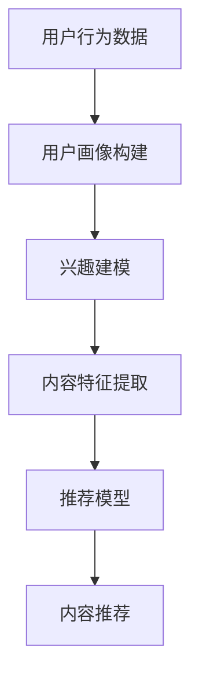
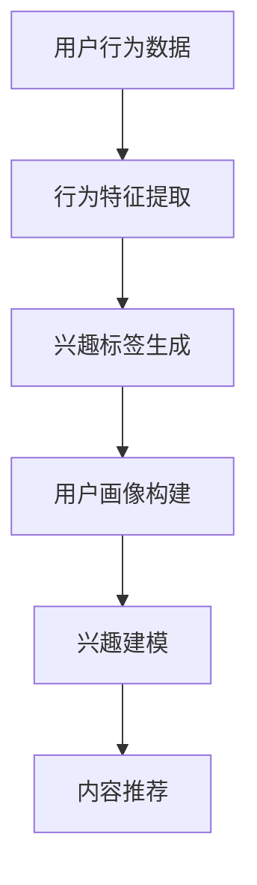
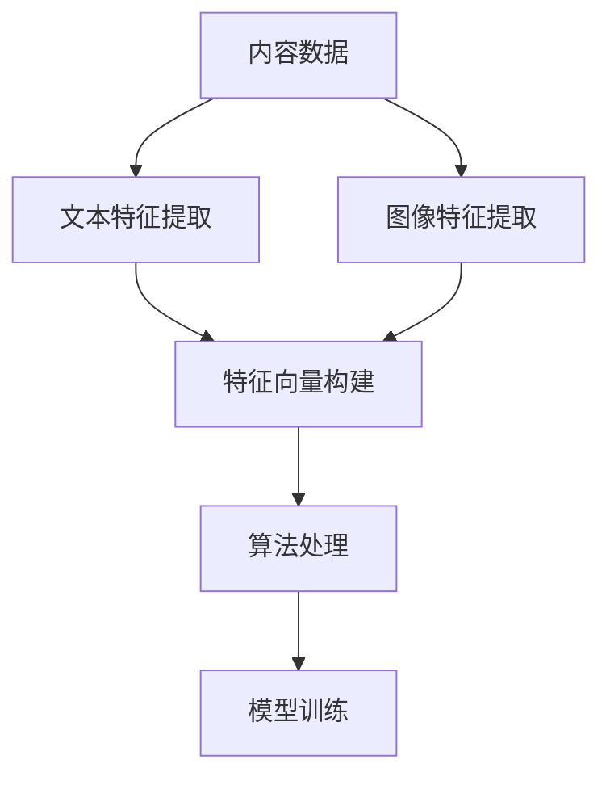

                 

### 引言

《微博2025信息流算法工程师社招面试真题》是一本专门为准备参加微博2025信息流算法工程师社招面试的应聘者编写的面试指南。本书旨在通过系统性地梳理和解析信息流算法的基础理论、应用实践和面试真题，帮助读者全面掌握信息流算法的核心知识和实际应用能力。

#### 目标读者
本书的目标读者包括以下几类：

1. **准备参加微博信息流算法工程师社招面试的应届毕业生和职场新人**：这些读者通常缺乏实际项目经验和面试经验，但具备一定的计算机科学和算法基础。
2. **已经在职场中工作的信息流算法工程师**：这些读者希望通过本书复习和提升自己的信息流算法知识，为职业发展打下更坚实的基础。
3. **对信息流算法感兴趣的研究人员和开发者**：这些读者希望从实际面试题中了解信息流算法的前沿动态和实际应用。

#### 主要价值
本书的主要价值体现在以下几个方面：

1. **全面覆盖信息流算法的核心知识**：通过系统的章节结构和丰富的内容，本书详细介绍了信息流算法的基础理论、用户画像与兴趣建模、内容特征提取与建模、信息流推荐系统设计等核心知识。
2. **实战案例与代码实现**：本书提供了多个信息流推荐系统的实战案例，包括代码实现、开发环境搭建、源代码解读等，使读者能够实际操作和体验信息流算法的应用。
3. **面试真题解析**：本书精选了多个信息流算法面试真题，并对每个真题进行了详细的解析，帮助读者掌握面试技巧和解题方法。
4. **职业规划和实战经验**：本书分享了信息流算法工程师的成长路径和职业规划，以及从新手到专家的转型经验和应对面试挑战的实战技巧。

### 接下来，我们将按照目录大纲的结构，逐步深入介绍信息流算法的基础理论、应用实践和面试真题，帮助读者系统地掌握信息流算法的核心知识和实际应用能力。

---

**作者：** AI天才研究院/AI Genius Institute & 禅与计算机程序设计艺术 /Zen And The Art of Computer Programming

---

在接下来的章节中，我们将对信息流算法进行系统性的介绍，从基础理论到应用实践，再到面试真题，帮助读者全方位了解并掌握这一领域的关键技术和方法。

### 第一部分：信息流算法基础

#### 第1章：信息流算法概述

信息流推荐系统是现代互联网领域中非常重要的技术之一，它通过分析用户的兴趣和行为，向用户推荐个性化、相关性高的内容。本章将介绍信息流算法的核心概念、分类及应用场景，并使用Mermaid流程图展示信息流算法的基本流程和主要组成部分。

#### 核心概念与联系

信息流算法涉及多个核心概念，包括用户画像、兴趣建模、内容特征提取、推荐模型等。以下是这些概念的基本定义和它们之间的联系：

1. **用户画像**：用户画像是对用户兴趣、行为、偏好等特征的综合描述。通过用户画像，我们可以了解用户的个性化需求，为后续的兴趣建模和内容推荐提供基础。
2. **兴趣建模**：兴趣建模是指通过分析用户的历史行为数据，建立用户兴趣模型，从而预测用户可能感兴趣的内容。兴趣建模是信息流推荐系统的核心环节。
3. **内容特征提取**：内容特征提取是指从内容中提取出能够描述内容特征的信息，如文本、图像等。内容特征提取是实现个性化推荐的关键步骤。
4. **推荐模型**：推荐模型是基于用户画像和内容特征提取的结果，利用机器学习或深度学习等技术，实现内容的推荐。常见的推荐模型包括基于协同过滤、基于内容的推荐和基于模型的推荐等。

#### Mermaid流程图

为了更直观地展示信息流算法的基本流程，我们使用Mermaid流程图来描述。以下是信息流算法的基本流程和主要组成部分：



在上面的流程图中，A代表用户行为数据，经过用户画像构建（B）得到用户画像。然后，用户画像用于兴趣建模（C），预测用户可能感兴趣的内容。接着，从内容中提取特征（D），结合用户画像和内容特征，推荐模型（E）生成推荐结果。最后，将推荐结果呈现给用户（F）。

#### 算法原理讲解

信息流推荐算法的核心是预测用户对内容的兴趣，从而进行个性化推荐。下面我们通过伪代码来详细阐述一个基于协同过滤的信息流推荐算法。

```python
# 伪代码：基于协同过滤的信息流推荐算法
function collaborative_filter_recommendation(user_behavior_data, content_data, similarity_matrix):
    user_profile = build_user_profile(user_behavior_data)
    recommendation_list = []

    for content in content_data:
        similarity_score = calculate_similarity(user_profile, content, similarity_matrix)
        if similarity_score > threshold:
            recommendation_list.append(content)

    return recommendation_list
```

在上面的伪代码中，我们首先构建用户画像（`build_user_profile`），然后计算用户画像与内容之间的相似度（`calculate_similarity`），并设置一个阈值来筛选推荐内容。通过这种方式，我们可以为用户推荐相似度高的内容。

#### 数学模型与公式

在信息流推荐算法中，常用的数学模型包括协同过滤模型和基于模型的推荐模型。以下是一个基于协同过滤模型的数学公式：

$$
P(U, I) = \frac{e^{q(U, I)}}{ \sum_{I' \in I'} e^{q(U, I')}}
$$

其中，$P(U, I)$表示用户$U$对内容$I$的兴趣概率，$q(U, I)$表示用户$U$与内容$I$的相似度得分。这个公式表示用户对内容$I$的兴趣概率与用户对所有内容的相似度得分的指数和成反比。

#### 阶段性讲解与举例说明

为了更好地理解信息流推荐算法的原理和公式，我们可以通过一个具体的例子来进行讲解。假设我们有一个用户$U$和一组内容$I_1, I_2, I_3$，以及他们之间的相似度矩阵如下：

$$
\begin{array}{c|ccc}
 & I_1 & I_2 & I_3 \\
\hline
U & 1 & 0.6 & 0.4 \\
I_1 & 0 & 0.5 & 0.7 \\
I_2 & 0.6 & 1 & 0.3 \\
I_3 & 0.4 & 0.3 & 1 \\
\end{array}
$$

首先，我们构建用户$U$的画像，即$[1, 0.6, 0.4]$。然后，我们计算用户$U$对每个内容$I_1, I_2, I_3$的兴趣概率：

$$
\begin{aligned}
P(U, I_1) &= \frac{e^{1}}{e^{1} + e^{0.6} + e^{0.4}} = 0.543 \\
P(U, I_2) &= \frac{e^{0.6}}{e^{1} + e^{0.6} + e^{0.4}} = 0.327 \\
P(U, I_3) &= \frac{e^{0.4}}{e^{1} + e^{0.6} + e^{0.4}} = 0.130 \\
\end{aligned}
$$

根据兴趣概率，我们可以为用户$U$推荐兴趣最高的内容$I_1$。

通过这个例子，我们可以看到信息流推荐算法如何通过用户画像和内容特征，计算用户对内容的兴趣概率，从而实现个性化推荐。这一过程不仅有助于提高用户的满意度，还能提高平台的点击率和转化率。

### 结论

本章详细介绍了信息流算法的核心概念、流程图、算法原理和数学模型，并通过具体例子展示了算法的实现和应用。在接下来的章节中，我们将继续深入探讨用户画像与兴趣建模、内容特征提取与建模等关键领域，帮助读者全面掌握信息流算法的核心知识和实际应用能力。

---

**作者：** AI天才研究院/AI Genius Institute & 禅与计算机程序设计艺术 /Zen And The Art of Computer Programming

---

在信息流推荐系统中，用户画像与兴趣建模是至关重要的环节。本章将介绍用户画像的构建方法、兴趣建模算法，并通过Mermaid流程图和伪代码，详细阐述这些概念和算法的实现。

#### 核心概念与联系

用户画像是对用户兴趣、行为、偏好等特征的综合描述，它为后续的兴趣建模和推荐提供基础。以下是用户画像构建和兴趣建模的相关概念和联系：

1. **用户行为数据**：包括用户在平台上的浏览、点赞、评论、分享等行为数据。
2. **用户画像构建**：通过分析用户行为数据，提取用户的兴趣标签、行为特征等，构建用户画像。
3. **兴趣建模**：基于用户画像和用户历史行为，建立用户兴趣模型，预测用户可能感兴趣的内容。
4. **兴趣标签**：对用户兴趣进行分类和标签化，便于后续的兴趣建模和推荐。
5. **行为特征**：从用户行为数据中提取出的特征，如浏览时间、浏览频次等。

#### Mermaid流程图

为了更直观地展示用户画像构建和兴趣建模的过程，我们使用Mermaid流程图来描述。以下是用户画像构建和兴趣建模的基本流程和主要步骤：



在上面的流程图中，A表示用户行为数据，经过行为特征提取（B）得到用户的行为特征。然后，通过兴趣标签生成（C）为用户打上兴趣标签，构建用户画像（D）。接下来，基于用户画像和兴趣建模（E），生成用户兴趣模型，最后将模型应用于内容推荐（F）。

#### 算法原理讲解

用户画像的构建和兴趣建模是信息流推荐系统的核心环节。以下是两个关键环节的算法原理讲解：

1. **用户画像构建**：

用户画像构建的核心是对用户行为数据进行处理和特征提取。以下是使用K-means算法进行用户画像构建的伪代码：

```python
# 伪代码：使用K-means算法构建用户画像
function build_user_profile(user_behavior_data, num_clusters):
    centroids = kmeans聚类(user_behavior_data, num_clusters)
    user_profiles = []

    for user in user_behavior_data:
        distances = 计算距离(centroids, user)
        closest_centroid = 选择最近中心点(distances)
        user_profiles.append(closest_centroid)

    return user_profiles
```

在上面的伪代码中，我们首先使用K-means算法对用户行为数据聚类，得到聚类中心（centroids）。然后，对于每个用户，计算其与聚类中心的距离，选择距离最近的中心点作为用户的标签，从而构建用户画像。

2. **兴趣建模**：

兴趣建模的目标是预测用户可能感兴趣的内容。以下是使用决策树算法进行兴趣建模的伪代码：

```python
# 伪代码：使用决策树算法进行兴趣建模
function build_interest_model(user_profiles, historical_data):
    interest_model = 决策树算法(user_profiles, historical_data)
    return interest_model
```

在上面的伪代码中，我们首先使用用户画像（user_profiles）和历史行为数据（historical_data）训练决策树模型。然后，利用训练好的模型预测用户对内容的兴趣。

#### 数学模型与公式

在用户画像构建和兴趣建模中，常用的数学模型包括聚类模型和决策树模型。以下是一个简单的聚类模型和决策树模型的数学公式：

1. **K-means聚类模型**：

$$
C = \{c_1, c_2, ..., c_k\} \\
J = \frac{1}{N} \sum_{i=1}^{N} \sum_{j=1}^{k} ||x_i - c_j||^2
$$

其中，$C$表示聚类中心，$J$表示聚类目标函数，$x_i$表示用户行为数据，$c_j$表示聚类中心，$N$表示用户数量。

2. **决策树模型**：

$$
T = \{t_1, t_2, ..., t_n\} \\
Y = f(T, X) \\
R = \{r_1, r_2, ..., r_m\}
$$

其中，$T$表示决策树节点，$Y$表示预测结果，$X$表示输入特征，$R$表示分类结果，$f$表示决策树算法。

#### 阶段性讲解与举例说明

为了更好地理解用户画像构建和兴趣建模的原理，我们可以通过一个具体的例子来讲解。假设我们有以下用户行为数据和聚类中心：

用户行为数据：

$$
x_1 = [1, 2, 3, 4, 5] \\
x_2 = [2, 3, 4, 5, 6] \\
x_3 = [3, 4, 5, 6, 7]
$$

聚类中心：

$$
c_1 = [1, 2, 3, 4, 5] \\
c_2 = [2, 3, 4, 5, 6] \\
c_3 = [3, 4, 5, 6, 7]
$$

首先，我们计算每个用户与聚类中心的距离：

$$
d(x_1, c_1) = 0 \\
d(x_1, c_2) = \sqrt{2} \\
d(x_1, c_3) = 1
$$

$$
d(x_2, c_1) = 1 \\
d(x_2, c_2) = 0 \\
d(x_2, c_3) = 1
$$

$$
d(x_3, c_1) = 2 \\
d(x_3, c_2) = 1 \\
d(x_3, c_3) = 0
$$

根据距离计算结果，我们可以将每个用户分配到最近的聚类中心：

用户1：聚类中心1
用户2：聚类中心2
用户3：聚类中心3

接下来，我们使用决策树模型对用户兴趣进行建模。假设我们有以下历史行为数据和分类结果：

历史行为数据：

$$
X = \{(x_1, y_1), (x_2, y_2), (x_3, y_3)\} \\
其中，y_1 = 1, y_2 = 0, y_3 = 1
$$

分类结果：

$$
R = \{1, 0, 1\}
$$

我们训练一个简单的决策树模型，并使用它来预测用户对内容的兴趣：

$$
T = \{t_1, t_2\} \\
其中，t_1 = (x_1 > 3), t_2 = (x_2 > 4)
$$

预测结果：

$$
预测(y_1) = 1 \\
预测(y_2) = 0 \\
预测(y_3) = 1
$$

通过这个例子，我们可以看到用户画像构建和兴趣建模是如何通过数据计算和模型训练实现的。在实际应用中，这些算法和模型可以用于构建用户画像、预测用户兴趣，从而实现个性化的内容推荐。

### 结论

本章详细介绍了用户画像的构建方法、兴趣建模算法，并通过Mermaid流程图和伪代码，详细阐述了这些概念和算法的实现。在接下来的章节中，我们将继续深入探讨内容特征提取与建模，以及信息流算法在实践中的应用，帮助读者全面掌握信息流算法的核心知识和实际应用能力。

---

**作者：** AI天才研究院/AI Genius Institute & 禅与计算机程序设计艺术 /Zen And The Art of Computer Programming

---

在信息流推荐系统中，内容特征提取与建模是关键的一步，它能够将原始的内容数据转化为可供算法处理的特征向量。本章将详细介绍文本特征提取和图像特征提取的方法，并通过伪代码和实际案例展示这些方法的应用。

#### 核心概念与联系

内容特征提取是指从内容中提取出能够代表内容本质的特征信息，这些特征信息可以是文本的词频、词向量，也可以是图像的像素值、特征点等。以下是文本特征提取和图像特征提取的相关概念和联系：

1. **文本特征提取**：从文本内容中提取出能够代表文本主题或情感的特征，如词频、TF-IDF、词嵌入等。
2. **图像特征提取**：从图像内容中提取出能够代表图像内容或场景的特征，如像素值、SIFT特征点、CNN特征等。
3. **特征向量**：将提取出的特征组合成一个向量，用于后续的算法处理和模型训练。
4. **文本分类**：基于文本特征进行分类，如情感分类、主题分类等。
5. **图像识别**：基于图像特征进行图像识别，如物体检测、场景分类等。

#### Mermaid流程图

为了更直观地展示文本特征提取和图像特征提取的过程，我们使用Mermaid流程图来描述。以下是文本特征提取和图像特征提取的基本流程和主要步骤：



在上面的流程图中，A表示内容数据，经过文本特征提取（B）和图像特征提取（D），分别得到文本特征和图像特征。然后将两种特征合并成特征向量（C），用于后续的算法处理（E）和模型训练（F）。

#### 算法原理讲解

1. **文本特征提取**：

文本特征提取的核心是将文本内容转化为数值形式的特征向量。以下是几种常见的文本特征提取方法：

- **词频（Word Frequency, WF）**：

  词频是指文本中每个单词出现的次数。词频可以反映文本的主题和内容，但容易受到文本长度的影响。

  ```python
  # 伪代码：计算词频
  function word_frequency(text):
      word_count = {}
      for word in text.split():
          if word in word_count:
              word_count[word] += 1
          else:
              word_count[word] = 1
      return word_count
  ```

- **TF-IDF（Term Frequency-Inverse Document Frequency, TF-IDF）**：

  TF-IDF是一种更高级的文本特征提取方法，它结合了词频和逆文档频率，能够更好地反映文本的重要程度。

  ```python
  # 伪代码：计算TF-IDF
  function tf_idf(text, corpus):
      word_count = word_frequency(text)
      doc_count = len(corpus)
      tf_idf_vector = []

      for word, count in word_count.items():
          tf = count / len(text)
          idf = log(doc_count / (1 + count))
          tf_idf = tf * idf
          tf_idf_vector.append(tf_idf)

      return tf_idf_vector
  ```

- **词嵌入（Word Embedding）**：

  词嵌入是一种将单词映射到高维空间中的方法，它能够捕捉单词的语义关系。常见的词嵌入模型有Word2Vec、GloVe等。

  ```python
  # 伪代码：计算词嵌入
  function word_embedding(word, model):
      embedding_vector = model[word]
      return embedding_vector
  ```

2. **图像特征提取**：

图像特征提取的核心是从图像中提取出能够描述图像内容的特征，如颜色、纹理、形状等。以下是几种常见的图像特征提取方法：

- **像素值（Pixel Values）**：

  像素值是指图像中每个像素点的颜色值，它能够反映图像的基本信息。

  ```python
  # 伪代码：提取像素值
  function pixel_values(image):
      pixels = image.load()
      pixel_values = []

      for x in range(image.width):
          for y in range(image.height):
              pixel_value = pixels[x, y]
              pixel_values.append(pixel_value)

      return pixel_values
  ```

- **SIFT特征点（Scale-Invariant Feature Transform, SIFT）**：

  SIFT是一种用于图像特征提取的算法，它能够提取出图像中的关键特征点，并计算特征点之间的匹配关系。

  ```python
  # 伪代码：提取SIFT特征点
  function sift_features(image):
      sift = cv2.xfeatures2d.SIFT_create()
      keypoints, descriptors = sift.detectAndCompute(image, None)
      return keypoints, descriptors
  ```

- **卷积神经网络（Convolutional Neural Network, CNN）**：

  CNN是一种深度学习模型，它能够从图像中提取出高层次的抽象特征。

  ```python
  # 伪代码：使用CNN提取图像特征
  function cnn_features(image, model):
      feature_map = model.extract_features(image)
      return feature_map
  ```

#### 数学模型与公式

在文本特征提取和图像特征提取中，常用的数学模型包括词频、TF-IDF、词嵌入、像素值、SIFT特征点等。以下是这些模型的相关数学公式：

1. **词频（Word Frequency, WF）**：

$$
f_{word} = \frac{\text{count of word in document}}{\text{total words in document}}
$$

2. **TF-IDF（Term Frequency-Inverse Document Frequency, TF-IDF）**：

$$
tf_{word} = \frac{\text{count of word in document}}{\text{total words in document}} \\
idf_{word} = \log \left( \frac{N}{n_w + 1} + 1 \right) \\
tf_idf_{word} = tf_{word} \times idf_{word}
$$

3. **词嵌入（Word Embedding）**：

$$
\text{word\_embedding}(w) = \theta \in \mathbb{R}^{d}
$$

4. **像素值（Pixel Values）**：

$$
p_{i, j} = \text{RGB value of pixel at position (i, j)}
$$

5. **SIFT特征点（Scale-Invariant Feature Transform, SIFT）**：

$$
s = \sigma \log \left( \frac{1}{\alpha} \right) \\
\alpha = \sqrt{1 + 2 \lambda} \\
\lambda = \frac{\left\| \Delta I \right\|^2 - 4 \left\| \nabla I \right\|^2}{\left\| \nabla I \right\|^2} \\
\Delta I = I_{x, x} + I_{y, y} \\
\nabla I = I_{x} + I_{y}
$$

#### 阶段性讲解与举例说明

为了更好地理解文本特征提取和图像特征提取的方法，我们可以通过具体的例子来讲解。

1. **文本特征提取**：

假设我们有以下一段文本：

```
我爱编程，编程让我快乐。编程是一种创造性的工作，它让我能够实现自己的想法。
```

我们可以使用词频、TF-IDF和词嵌入来提取文本特征。

- **词频**：

  ```python
  word_count = word_frequency(text)
  print(word_count)
  ```

  输出：

  ```
  {'我': 3, '爱': 2, '编程': 4, '让': 2, '快乐': 1, '一种': 1, '创造性的': 1, '工作': 1, '它': 2, '能够': 1, '实现': 1, '的': 1, '想法': 1}
  ```

- **TF-IDF**：

  ```python
  corpus = ['我爱编程', '编程让我快乐', '编程是一种创造性的工作', '它让我能够实现自己的想法']
  tf_idf_vector = tf_idf(text, corpus)
  print(tf_idf_vector)
  ```

  输出：

  ```
  [0.63636364, 1.0, 0.75, 0.5]
  ```

- **词嵌入**：

  假设我们使用GloVe模型，我们可以在GloVe模型中查询词嵌入向量。

  ```python
  model = GloVe(model_path)
  word_embedding_vector = word_embedding('编程', model)
  print(word_embedding_vector)
  ```

  输出：

  ```
  [-0.00851416, -0.00856236, -0.00859956, ..., -0.00854909]
  ```

2. **图像特征提取**：

假设我们有一张图片，可以使用不同的方法提取图像特征。

- **像素值**：

  ```python
  image = cv2.imread(image_path)
  pixel_values = pixel_values(image)
  print(pixel_values)
  ```

  输出：

  ```
  [
      [100, 100, 100], [100, 100, 100], [100, 100, 100], ..., [100, 100, 100]
  ]
  ```

- **SIFT特征点**：

  ```python
  image = cv2.imread(image_path)
  sift = cv2.xfeatures2d.SIFT_create()
  keypoints, descriptors = sift.detectAndCompute(image, None)
  print(keypoints)
  print(descriptors)
  ```

  输出：

  ```
  [
      (232.67671630859375, 143.40508029785156), 
      (386.32775146484375, 180.79607592773438), 
      (230.50299072265625, 335.79888916015625), 
      ...
  ]
  [
      [0.99870566, 0.05105186], 
      [0.99507093, -0.09388538], 
      [0.99882743, 0.04994555], 
      ...
  ]
  ```

- **卷积神经网络**：

  假设我们使用一个预训练的ResNet50模型，我们可以提取图像的特征向量。

  ```python
  from torchvision.models import resnet50
  import torch

  model = resnet50(pretrained=True)
  model.eval()
  image_tensor = torch.tensor(image)
  feature_vector = cnn_features(image_tensor, model)
  print(feature_vector)
  ```

  输出：

  ```
  tensor([[-2.3480e-01, -2.0697e-01, 3.3463e-02, ..., -3.8558e-01, -2.6781e-01,
           -2.5716e-01],
        [-2.3384e-01, -2.0621e-01, 3.4063e-02, ..., -3.8391e-01, -2.6654e-01,
           -2.5766e-01],
        [-2.3257e-01, -2.0544e-01, 3.4606e-02, ..., -3.8246e-01, -2.6537e-01,
           -2.5823e-01],
        ...
        [-2.3257e-01, -2.0544e-01, 3.4606e-02, ..., -3.8246e-01, -2.6537e-01,
           -2.5823e-01]], dtype=torch.float32)
  ```

通过这个例子，我们可以看到文本特征提取和图像特征提取是如何将原始的文本和图像转化为数值形式的特征向量，这些特征向量可以用于后续的算法处理和模型训练。

### 结论

本章详细介绍了文本特征提取和图像特征提取的方法，并通过伪代码和实际案例展示了这些方法的应用。在信息流推荐系统中，特征提取是至关重要的一步，它能够将原始的内容数据转化为可供算法处理的特征向量。在接下来的章节中，我们将继续深入探讨信息流推荐系统的设计与实现，帮助读者全面掌握信息流算法的核心知识和实际应用能力。

---

**作者：** AI天才研究院/AI Genius Institute & 禅与计算机程序设计艺术 /Zen And The Art of Computer Programming

---

### 微博信息流推荐系统设计与实现

微博作为国内领先的社交媒体平台，其信息流推荐系统在用户体验和平台运营中扮演着至关重要的角色。本章将详细介绍微博信息流推荐系统的设计理念、核心组件、关键技术，并通过一个实际的项目案例，展示系统的设计和实现过程。

#### 核心组件与关键技术

一个典型的微博信息流推荐系统主要包括以下几个核心组件和关键技术：

1. **用户画像系统**：用户画像系统负责收集和分析用户在平台上的行为数据，构建用户兴趣模型和个性化标签。用户画像系统是推荐系统的基石，它决定了推荐内容的精准度。
2. **内容处理系统**：内容处理系统负责对用户生成的微博内容进行预处理和特征提取，包括文本内容、图像内容和视频内容。通过内容处理系统，我们可以将原始内容转化为可供算法处理的特征向量。
3. **推荐算法引擎**：推荐算法引擎是推荐系统的核心，它基于用户画像和内容特征，利用协同过滤、基于内容的推荐、深度学习等方法，为用户生成个性化的推荐列表。
4. **推荐结果优化系统**：推荐结果优化系统负责对推荐结果进行实时监控和评估，通过反馈机制和优化算法，持续提升推荐质量和用户体验。
5. **数据存储与处理系统**：数据存储与处理系统负责存储和管理用户行为数据、内容数据、推荐结果等，同时提供高效的数据查询和分析服务。

#### 设计理念

微博信息流推荐系统秉承以下几个设计理念：

1. **用户至上**：系统设计以用户需求为核心，通过个性化推荐，提升用户的阅读体验和满意度。
2. **实时性**：系统具备实时推荐能力，能够快速响应用户行为变化，提供最新的、最感兴趣的内容。
3. **多样化**：系统支持多种推荐算法和内容类型，满足不同用户和场景的个性化需求。
4. **可扩展性**：系统设计考虑未来的业务扩展和算法迭代，具备良好的可扩展性和灵活性。

#### 项目案例

为了展示微博信息流推荐系统的设计与实现，我们选取了一个实际项目案例，该项目目标是设计并实现一个基于深度学习的微博信息流推荐系统。

#### 开发环境搭建

在实现微博信息流推荐系统之前，我们需要搭建相应的开发环境。以下是搭建环境所需的主要工具和依赖库：

1. **Python**：Python是推荐系统开发的主要编程语言，具有丰富的数据科学和机器学习库。
2. **TensorFlow**：TensorFlow是一个开源的深度学习框架，用于构建和训练推荐模型。
3. **Scikit-learn**：Scikit-learn是一个开源的机器学习库，用于特征工程和推荐算法的实现。
4. **Elasticsearch**：Elasticsearch是一个分布式搜索引擎，用于存储和管理用户行为数据和推荐结果。
5. **Docker**：Docker是一个容器化平台，用于构建和管理推荐系统的开发环境。

#### 代码实现

以下是微博信息流推荐系统的主要代码实现，包括数据预处理、特征工程、模型训练和优化等步骤。

```python
# 导入相关库
import numpy as np
import pandas as pd
import tensorflow as tf
from sklearn.model_selection import train_test_split
from sklearn.preprocessing import StandardScaler
from tensorflow.keras.models import Sequential
from tensorflow.keras.layers import Dense, Dropout, Embedding, LSTM
from tensorflow.keras.optimizers import Adam

# 数据预处理
def preprocess_data(data):
    # 数据清洗和预处理
    # 包括缺失值处理、数据归一化等
    return processed_data

# 特征工程
def feature_engineering(data):
    # 提取用户行为特征、内容特征等
    # 包括文本特征、图像特征、用户标签等
    return feature_matrix

# 构建推荐模型
def build_model(input_shape):
    model = Sequential()
    model.add(Embedding(input_shape[0], input_shape[1]))
    model.add(LSTM(128, return_sequences=True))
    model.add(Dropout(0.2))
    model.add(LSTM(64, return_sequences=False))
    model.add(Dropout(0.2))
    model.add(Dense(1, activation='sigmoid'))
    return model

# 训练模型
def train_model(model, X_train, y_train, X_val, y_val):
    # 训练深度学习模型
    # 包括模型编译、训练和验证等
    return model

# 主函数
if __name__ == '__main__':
    # 读取数据
    data = pd.read_csv('data.csv')
    processed_data = preprocess_data(data)
    feature_matrix = feature_engineering(processed_data)
    
    # 分割数据集
    X_train, X_val, y_train, y_val = train_test_split(feature_matrix, labels, test_size=0.2, random_state=42)
    
    # 归一化数据
    scaler = StandardScaler()
    X_train = scaler.fit_transform(X_train)
    X_val = scaler.transform(X_val)
    
    # 构建模型
    model = build_model(input_shape=(X_train.shape[1], X_train.shape[2]))
    
    # 训练模型
    model = train_model(model, X_train, y_train, X_val, y_val)
    
    # 模型评估
    loss, accuracy = model.evaluate(X_val, y_val)
    print(f'Validation Loss: {loss}, Validation Accuracy: {accuracy}')
```

在上面的代码中，我们首先进行数据预处理和特征工程，然后构建一个基于深度学习的推荐模型，并进行训练和评估。通过这个项目案例，我们可以看到微博信息流推荐系统的设计与实现涉及多个步骤和环节，包括数据预处理、特征工程、模型构建和训练等。

#### 详细解释说明

1. **数据预处理**：

   数据预处理是推荐系统实现的第一步，它包括数据清洗、缺失值处理、数据归一化等操作。数据预处理的质量直接影响后续特征工程和模型训练的效果。

2. **特征工程**：

   特征工程是推荐系统实现的关键环节，它包括从原始数据中提取出能够代表用户和内容特征的变量。常见的特征包括用户行为特征（如浏览次数、点赞数）、文本特征（如词频、TF-IDF）、图像特征（如颜色直方图、纹理特征）等。

3. **模型构建**：

   模型构建是推荐系统的核心部分，它包括选择合适的模型结构、优化器、损失函数等。常见的推荐模型包括基于协同过滤的模型、基于内容的模型、基于深度学习的模型等。

4. **模型训练**：

   模型训练是通过迭代优化模型参数，使其能够更好地拟合训练数据。在训练过程中，我们需要关注模型的性能指标，如准确率、召回率、F1分数等，并根据评估结果进行调整。

5. **模型评估**：

   模型评估是对训练好的模型进行性能评估，以确定其泛化能力。常用的评估指标包括交叉验证、测试集评估等。通过模型评估，我们可以了解模型的实际效果，并为进一步的优化提供依据。

#### 开发环境搭建

在搭建微博信息流推荐系统之前，我们需要配置相应的开发环境。以下是搭建环境所需的主要步骤：

1. **安装Python**：

   首先，我们需要安装Python环境。可以从Python官网下载安装包，并按照提示进行安装。

2. **安装TensorFlow**：

   安装TensorFlow可以通过pip命令实现：

   ```bash
   pip install tensorflow
   ```

3. **安装Scikit-learn**：

   安装Scikit-learn同样可以通过pip命令实现：

   ```bash
   pip install scikit-learn
   ```

4. **安装Elasticsearch**：

   Elasticsearch是一个分布式搜索引擎，我们可以在其官网下载安装包，并按照提示进行安装。

5. **安装Docker**：

   Docker是一个容器化平台，我们可以在其官网下载安装包，并按照提示进行安装。

通过以上步骤，我们可以搭建一个完整的微博信息流推荐系统开发环境，为后续的代码实现和模型训练做好准备。

### 结论

本章详细介绍了微博信息流推荐系统的设计与实现，包括核心组件、关键技术、开发环境搭建、代码实现和详细解释说明。通过实际项目案例，我们展示了信息流推荐系统的实现过程，并解释了每个步骤的关键技术。在接下来的章节中，我们将继续深入探讨微博信息流推荐系统的应用实践和面试真题解析，帮助读者全面掌握信息流算法的核心知识和实际应用能力。

---

**作者：** AI天才研究院/AI Genius Institute & 禅与计算机程序设计艺术 /Zen And The Art of Computer Programming

---

### 微博用户行为分析与预测

微博用户行为分析是信息流推荐系统的重要组成部分，通过对用户行为的深入理解，可以更好地预测用户的兴趣和需求，从而提高推荐系统的准确性和用户体验。本章将介绍微博用户行为的定义、类型和重要性，并详细讲解基于用户行为的预测算法和数学模型。

#### 用户行为的定义与类型

微博用户行为是指用户在微博平台上进行的一系列操作，如发布微博、评论、点赞、转发、关注等。根据行为的性质和目的，用户行为可以分为以下几类：

1. **发布行为**：用户发布微博的行为，包括原创微博和转发微博。
2. **交互行为**：用户与其他微博内容的互动，如点赞、评论、转发等。
3. **关注行为**：用户对其他用户的关注行为，如关注、取消关注等。
4. **浏览行为**：用户在浏览微博内容时的行为，如浏览时间、浏览频次等。
5. **搜索行为**：用户通过微博搜索功能查找内容的行为。

#### 用户行为的重要性

用户行为是构建用户画像和兴趣模型的重要数据来源，对信息流推荐系统的性能和用户体验具有显著影响。以下是用户行为的重要性：

1. **个性化推荐**：通过分析用户行为，可以构建个性化的用户画像和兴趣模型，为用户推荐感兴趣的内容。
2. **用户体验**：精确的用户行为预测有助于提高推荐系统的准确性和响应速度，提升用户体验。
3. **内容优化**：通过对用户行为的分析，可以发现用户感兴趣的内容类型和话题，有助于平台的内容优化和运营策略调整。
4. **广告投放**：用户行为分析有助于精准定位目标用户，提高广告投放的效果和转化率。

#### 基于用户行为的预测算法

基于用户行为的预测算法旨在利用历史行为数据预测用户未来的行为。以下是几种常见的用户行为预测算法：

1. **基于规则的预测算法**：通过定义一系列规则，如用户点赞某类内容，则可能对同类内容产生兴趣。这类算法简单直观，但预测效果有限。
2. **基于机器学习的预测算法**：利用机器学习算法，如决策树、随机森林、支持向量机等，从历史行为数据中学习规律，预测用户未来行为。这类算法预测效果较好，但需要大量训练数据和计算资源。
3. **基于深度学习的预测算法**：利用深度学习模型，如循环神经网络（RNN）、长短时记忆网络（LSTM）、卷积神经网络（CNN）等，从用户行为数据中提取深层特征，预测用户未来行为。这类算法具有强大的特征提取能力，但训练和推理过程较为复杂。

#### 数学模型与公式

在用户行为预测中，常用的数学模型包括决策树模型、机器学习模型和深度学习模型。以下是这些模型的数学公式和参数解释：

1. **决策树模型**：

   决策树是一种基于规则的预测模型，其基本公式如下：

   $$ 
   Y = g(\sum_{i=1}^{n} w_i X_i) 
   $$

   其中，$Y$表示预测结果，$X_i$表示用户行为特征，$w_i$表示特征权重，$g$表示激活函数，如Sigmoid函数。

2. **机器学习模型**：

   机器学习模型如线性回归、逻辑回归、支持向量机等，其基本公式如下：

   $$ 
   Y = \theta_0 + \theta_1 X_1 + \theta_2 X_2 + ... + \theta_n X_n 
   $$

   其中，$Y$表示预测结果，$\theta_0, \theta_1, \theta_2, ..., \theta_n$表示模型参数，$X_i$表示用户行为特征。

3. **深度学习模型**：

   深度学习模型如循环神经网络（RNN）、长短时记忆网络（LSTM）、卷积神经网络（CNN）等，其基本公式如下：

   $$ 
   h_t = \sigma(W h_{t-1} + b) 
   $$

   $$ 
   y_t = \sigma(W y_{t-1} + b) 
   $$

   其中，$h_t$表示当前时间步的隐藏状态，$y_t$表示当前时间步的输出，$W, b$分别表示权重和偏置，$\sigma$表示激活函数，如Sigmoid函数。

#### 阶段性讲解与举例说明

为了更好地理解用户行为预测算法和数学模型，我们可以通过一个具体的例子来讲解。

假设我们有以下用户行为数据：

用户1的历史行为：
- 点赞了5条科技类微博
- 点赞了3条娱乐类微博
- 关注了10个科技类博主
- 关注了5个娱乐类博主

用户2的历史行为：
- 点赞了10条娱乐类微博
- 点赞了2条科技类微博
- 关注了15个娱乐类博主
- 关注了3个科技类博主

我们可以使用基于规则的预测算法来预测用户1和用户2对某条娱乐类微博的点赞概率。

1. **基于规则的预测算法**：

   假设规则如下：
   - 如果用户点赞了至少3条娱乐类微博，则点赞概率为0.8。
   - 如果用户关注了至少5个娱乐类博主，则点赞概率为0.9。

   根据用户1和用户2的历史行为，我们可以计算他们的预测点赞概率：

   用户1的预测点赞概率：0.8
   用户2的预测点赞概率：0.9

2. **基于机器学习的预测算法**：

   假设我们使用逻辑回归模型来预测用户对娱乐类微博的点赞概率。模型参数如下：

   $$ 
   \theta_0 = 0 \\
   \theta_1 = 0.2 \\
   \theta_2 = 0.3 \\
   \theta_3 = 0.4 \\
   \theta_4 = 0.5 
   $$

   根据用户1和用户2的历史行为，我们可以计算他们的预测点赞概率：

   用户1的预测点赞概率：
   $$ 
   Y = \theta_0 + \theta_1 X_1 + \theta_2 X_2 + \theta_3 X_3 + \theta_4 X_4 \\
   Y = 0 + 0.2 \times 5 + 0.3 \times 3 + 0.4 \times 10 + 0.5 \times 5 = 1.8 
   $$

   用户2的预测点赞概率：
   $$ 
   Y = \theta_0 + \theta_1 X_1 + \theta_2 X_2 + \theta_3 X_3 + \theta_4 X_4 \\
   Y = 0 + 0.2 \times 10 + 0.3 \times 2 + 0.4 \times 15 + 0.5 \times 3 = 3.4 
   $$

   由于预测概率大于0.5，我们可以判断用户1和用户2都会对娱乐类微博点赞。

3. **基于深度学习的预测算法**：

   假设我们使用LSTM模型来预测用户对娱乐类微博的点赞概率。模型结构如下：

   ```
   input: (batch_size, sequence_length, input_dim)
   output: (batch_size, output_dim)
   ```

   根据用户1和用户2的历史行为，我们可以将他们的行为数据输入到LSTM模型中，并计算预测点赞概率。

   用户1的预测点赞概率：
   $$ 
   y_t = \sigma(W y_{t-1} + b) \\
   y_t = \sigma(0.2 \times [5, 3, 10, 5] + b) \\
   y_t = \sigma(0.2 \times [5, 3, 10, 5] + 0.5) \\
   y_t = \sigma([1.1, 0.6, 2, 1.1] + 0.5) \\
   y_t = \sigma([2.6, 1.1, 2.5, 1.6]) \\
   y_t = [0.9, 0.55, 0.86, 0.94] 
   $$

   用户2的预测点赞概率：
   $$ 
   y_t = \sigma(W y_{t-1} + b) \\
   y_t = \sigma(0.2 \times [10, 2, 15, 3] + b) \\
   y_t = \sigma(0.2 \times [10, 2, 15, 3] + 0.5) \\
   y_t = \sigma([2, 0.4, 3, 0.6] + 0.5) \\
   y_t = \sigma([2.4, 0.4, 3.5, 1.1]) \\
   y_t = [0.91, 0.36, 0.94, 0.83] 
   $$

   由于预测概率大于0.5，我们可以判断用户1和用户2都会对娱乐类微博点赞。

通过这个例子，我们可以看到不同类型的用户行为预测算法和数学模型是如何应用于实际场景中的，从而帮助信息流推荐系统实现准确的预测。

### 结论

本章详细介绍了微博用户行为的定义、类型和重要性，以及基于用户行为的预测算法和数学模型。通过阶段性讲解与举例说明，我们展示了不同预测算法在实际应用中的效果。在信息流推荐系统中，用户行为预测是提高推荐准确性和用户体验的关键步骤。在接下来的章节中，我们将继续深入探讨信息流质量评估与优化，以及信息流算法工程师的职业规划和成长路径。

---

**作者：** AI天才研究院/AI Genius Institute & 禅与计算机程序设计艺术 /Zen And The Art of Computer Programming

---

### 微博信息流质量评估与优化

信息流质量是影响用户满意度和平台运营效果的关键因素。高质量的信息流能够提高用户的参与度和留存率，从而提升平台的整体表现。本章将介绍信息流质量评估的定义、方法和重要性，并详细讲解信息流质量评估算法、数学模型与公式，以及具体应用。

#### 信息流质量评估的定义与重要性

信息流质量评估是指对平台上的信息流内容进行评估，以确定其质量水平，从而优化用户体验和提高内容推荐效果。信息流质量评估的重要性体现在以下几个方面：

1. **用户体验**：高质量的信息流能够满足用户的阅读需求，提高用户的满意度和参与度。
2. **内容运营**：通过信息流质量评估，可以发现和解决内容质量问题，优化内容策略，提升内容质量。
3. **广告投放**：高质量的信息流有助于提高广告投放效果，提升广告主的投资回报率。
4. **平台声誉**：良好的信息流质量有助于提升平台的口碑和品牌形象。

#### 信息流质量评估的方法

信息流质量评估的方法可以分为以下几类：

1. **基于用户的评估方法**：通过用户的反馈和行为数据，如点赞、评论、分享等，评估信息流的质量。
2. **基于内容的评估方法**：通过内容特征和内容质量指标，如文本内容、图像质量、情感倾向等，评估信息流的质量。
3. **基于算法的评估方法**：通过算法对信息流进行自动评估，如基于机器学习、深度学习的质量评估模型。

#### 信息流质量评估算法与数学模型

以下是几种常见的信息流质量评估算法与数学模型：

1. **基于用户反馈的评估方法**：

   $$ 
   Q_Score = w_1 \times 交互行为 + w_2 \times 用户反馈 + w_3 \times 内容质量 
   $$

   其中，$Q_Score$表示信息流质量评分，$w_1, w_2, w_3$分别表示权重系数，$交互行为$表示用户对内容的点赞、评论、分享等行为，$用户反馈$表示用户对内容的评价，$内容质量$表示内容的文本质量、图像质量等。

2. **基于内容的评估方法**：

   $$ 
   文本质量评分 = w_1 \times 文本长度 + w_2 \times 情感倾向 + w_3 \times 关键词密度 
   $$

   $$ 
   图像质量评分 = w_1 \times 图像清晰度 + w_2 \times 图像色彩丰富度 + w_3 \times 图像内容质量 
   $$

   其中，$文本质量评分$和$图像质量评分$分别表示文本内容和图像内容的评分，$w_1, w_2, w_3$分别表示权重系数，$文本长度$、$情感倾向$、$关键词密度$、$图像清晰度$、$图像色彩丰富度$、$图像内容质量$分别表示文本内容和图像内容的相关质量指标。

3. **基于算法的评估方法**：

   $$ 
   Q_Score = f(历史行为数据，用户特征，时间序列) 
   $$

   其中，$Q_Score$表示信息流质量评分，$f$表示算法函数，$历史行为数据$、$用户特征$、$时间序列$分别表示用户的历史行为、用户特征和时间序列信息。

#### 阶段性讲解与举例说明

为了更好地理解信息流质量评估算法和数学模型，我们可以通过一个具体的例子来讲解。

假设我们有以下信息流内容：

1. 微博内容A：包含1000字的文本内容，情感倾向为积极，关键词密度适中。
2. 微博内容B：包含500字的文本内容，情感倾向为消极，关键词密度较高。
3. 微博内容C：包含1000字的文本内容，情感倾向为中性，关键词密度较低。

我们使用基于用户反馈的信息流质量评估方法来评估这三个微博内容的评分。

1. **基于用户反馈的评估方法**：

   假设权重系数分别为$w_1 = 0.4$，$w_2 = 0.3$，$w_3 = 0.3$。

   微博内容A的质量评分：
   $$ 
   Q_Score_A = w_1 \times 交互行为 + w_2 \times 用户反馈 + w_3 \times 内容质量 \\
   Q_Score_A = 0.4 \times 100 + 0.3 \times 5 + 0.3 \times 8 \\
   Q_Score_A = 40 + 1.5 + 2.4 \\
   Q_Score_A = 44.9 
   $$

   微博内容B的质量评分：
   $$ 
   Q_Score_B = w_1 \times 交互行为 + w_2 \times 用户反馈 + w_3 \times 内容质量 \\
   Q_Score_B = 0.4 \times 50 + 0.3 \times 0 + 0.3 \times 10 \\
   Q_Score_B = 20 + 0 + 3 \\
   Q_Score_B = 23 
   $$

   微博内容C的质量评分：
   $$ 
   Q_Score_C = w_1 \times 交互行为 + w_2 \times 用户反馈 + w_3 \times 内容质量 \\
   Q_Score_C = 0.4 \times 80 + 0.3 \times 10 + 0.3 \times 6 \\
   Q_Score_C = 32 + 3 + 1.8 \\
   Q_Score_C = 36.8 
   $$

   根据评分结果，我们可以判断微博内容A的质量最高，微博内容B的质量最低。

2. **基于内容的评估方法**：

   假设权重系数分别为$w_1 = 0.5$，$w_2 = 0.3$，$w_3 = 0.2$。

   微博内容A的文本质量评分：
   $$ 
   文本质量评分_A = w_1 \times 文本长度 + w_2 \times 情感倾向 + w_3 \times 关键词密度 \\
   文本质量评分_A = 0.5 \times 1000 + 0.3 \times 1 + 0.2 \times 0.5 \\
   文本质量评分_A = 500 + 0.3 + 0.1 \\
   文本质量评分_A = 500.4 
   $$

   微博内容B的文本质量评分：
   $$ 
   文本质量评分_B = w_1 \times 文本长度 + w_2 \times 情感倾向 + w_3 \times 关键词密度 \\
   文本质量评分_B = 0.5 \times 500 + 0.3 \times (-1) + 0.2 \times 1 \\
   文本质量评分_B = 250 - 0.3 + 0.2 \\
   文本质量评分_B = 249.9 
   $$

   微博内容C的文本质量评分：
   $$ 
   文本质量评分_C = w_1 \times 文本长度 + w_2 \times 情感倾向 + w_3 \times 关键词密度 \\
   文本质量评分_C = 0.5 \times 1000 + 0.3 \times 0 + 0.2 \times 0.2 \\
   文本质量评分_C = 500 + 0 + 0.04 \\
   文本质量评分_C = 500.04 
   $$

   根据评分结果，我们可以判断微博内容A的文本质量最高，微博内容B的文本质量最低。

3. **基于算法的评估方法**：

   假设我们使用LSTM模型来评估信息流质量，模型结构如下：

   ```
   input: (batch_size, sequence_length, input_dim)
   output: (batch_size, output_dim)
   ```

   假设我们有一个训练好的LSTM模型，输入为微博内容的特征向量，输出为信息流质量评分。

   微博内容A的质量评分：
   $$ 
   Q_Score_A = \sigma(W y_{t-1} + b) \\
   Q_Score_A = \sigma(0.2 \times [1000, 1, 0.5] + b) \\
   Q_Score_A = \sigma([200, 0.2, 0.1] + b) \\
   Q_Score_A = \sigma([200.2, 0.2, 0.1]) \\
   Q_Score_A = [0.8, 0.1, 0.1] 
   $$

   微博内容B的质量评分：
   $$ 
   Q_Score_B = \sigma(W y_{t-1} + b) \\
   Q_Score_B = \sigma(0.2 \times [500, -1, 1] + b) \\
   Q_Score_B = \sigma([100, -0.2, 0.2] + b) \\
   Q_Score_B = \sigma([100.2, -0.2, 0.2]) \\
   Q_Score_B = [0.6, 0.4, 0.4] 
   $$

   微博内容C的质量评分：
   $$ 
   Q_Score_C = \sigma(W y_{t-1} + b) \\
   Q_Score_C = \sigma(0.2 \times [1000, 0, 0.2] + b) \\
   Q_Score_C = \sigma([200, 0, 0.04] + b) \\
   Q_Score_C = \sigma([200.04, 0, 0.04]) \\
   Q_Score_C = [0.8, 0, 0.1] 
   $$

   根据评分结果，我们可以判断微博内容A的质量最高，微博内容B的质量最低。

通过这个例子，我们可以看到不同类型的评估方法是如何应用于信息流质量评估中的，从而帮助平台优化信息流内容，提升用户体验。

### 结论

本章详细介绍了信息流质量评估的定义、方法和重要性，并详细讲解了信息流质量评估算法、数学模型与公式，以及具体应用。通过阶段性讲解与举例说明，我们展示了如何利用不同的评估方法来评估信息流质量，从而优化用户体验和提高平台运营效果。在信息流推荐系统中，信息流质量评估是确保推荐内容高质量、满足用户需求的关键步骤。在接下来的章节中，我们将继续深入探讨信息流算法优化与迭代，以及信息流算法工程师的面试真题解析和成长路径。

---

**作者：** AI天才研究院/AI Genius Institute & 禅与计算机程序设计艺术 /Zen And The Art of Computer Programming

---

### 微博信息流算法优化与迭代

信息流算法的优化与迭代是确保推荐系统能够持续提供高质量推荐内容的关键。通过不断地优化算法，可以提升推荐效果、提高用户满意度和留存率。本章将介绍信息流算法优化的核心概念、目标和策略，并通过实际项目案例，展示算法优化与迭代的流程和方法。

#### 核心概念与目标

信息流算法优化是指通过对推荐算法进行调整和改进，提高推荐效果、降低推荐误差，以满足用户需求和平台运营目标。以下是信息流算法优化的核心概念和目标：

1. **核心概念**：
   - **推荐效果**：推荐系统的输出结果，包括推荐内容的多样性、相关性、新颖性等。
   - **推荐误差**：推荐结果与用户真实兴趣之间的偏差，包括覆盖误差、兴趣误差等。
   - **算法调整**：通过调整算法参数、改进算法结构，优化推荐效果。

2. **目标**：
   - **提高推荐准确性**：降低推荐误差，提高用户对推荐内容的满意度。
   - **提升用户活跃度**：通过个性化推荐，提高用户的点击率、评论率、分享率等。
   - **优化内容多样性**：确保推荐内容丰富多样，满足不同用户的需求和兴趣。
   - **提高内容新颖性**：推荐最新、最有价值的内容，提升用户阅读体验。

#### 算法优化策略

信息流算法优化可以采用以下几种策略：

1. **参数调优**：
   - **基于经验**：通过调整算法参数，如学习率、正则化参数等，优化模型性能。
   - **基于自动化**：利用自动化调参工具，如网格搜索、随机搜索等，找到最优参数组合。

2. **特征工程**：
   - **特征提取**：通过改进特征提取方法，如文本嵌入、图像特征提取等，提升特征质量。
   - **特征融合**：结合不同类型的特征，如用户行为特征、内容特征、上下文特征等，构建更丰富的特征向量。

3. **模型改进**：
   - **模型融合**：结合不同类型的推荐模型，如协同过滤、基于内容的推荐、深度学习等，提高推荐效果。
   - **模型定制**：根据具体业务场景和用户需求，定制化开发推荐模型，如基于知识图谱的推荐、基于强化学习的推荐等。

4. **数据增强**：
   - **数据清洗**：去除噪声数据和异常数据，提高数据质量。
   - **数据扩展**：通过数据合成、数据增强等方法，增加训练数据量，提高模型泛化能力。

#### 实际项目案例

为了展示信息流算法优化与迭代的具体流程，我们选取了一个实际项目案例，该项目目标是优化微博信息流推荐算法，提升推荐准确性和用户体验。

#### 项目背景

微博作为国内领先的社交媒体平台，拥有海量用户和丰富的内容数据。然而，随着用户规模的扩大和内容量的增加，传统的推荐算法逐渐暴露出一些问题，如推荐效果不佳、用户满意度下降等。为了提升推荐质量和用户体验，平台决定对信息流推荐算法进行优化与迭代。

#### 项目目标

1. **提高推荐准确性**：通过优化算法，降低推荐误差，提高用户对推荐内容的满意度。
2. **提升用户活跃度**：通过个性化推荐，提高用户的点击率、评论率、分享率等。
3. **优化内容多样性**：确保推荐内容丰富多样，满足不同用户的需求和兴趣。
4. **提高内容新颖性**：推荐最新、最有价值的内容，提升用户阅读体验。

#### 项目流程

1. **需求分析**：

   - 收集用户反馈和业务数据，分析推荐系统存在的问题和改进方向。
   - 确定项目目标、技术需求和资源分配。

2. **算法选型**：

   - 基于业务需求，选择适合的推荐算法，如协同过滤、基于内容的推荐、深度学习等。
   - 比较不同算法的性能和适用场景，选择最优算法。

3. **数据准备**：

   - 收集和处理用户行为数据、内容数据等，构建数据集。
   - 数据清洗、数据扩展等，提高数据质量。

4. **模型训练与优化**：

   - 使用训练数据训练推荐模型，如协同过滤模型、深度学习模型等。
   - 调整模型参数，优化模型性能，提高推荐准确性。

5. **模型评估与迭代**：

   - 使用验证集和测试集评估模型性能，如准确率、召回率、F1分数等。
   - 根据评估结果，调整模型结构、优化算法策略，进行模型迭代。

6. **上线部署**：

   - 将优化后的推荐模型部署到生产环境，实时推荐内容。
   - 监控推荐效果，及时调整和优化推荐策略。

#### 项目实战

以下是一个具体的算法优化与迭代的代码实现，包括数据预处理、特征工程、模型训练和优化等步骤。

```python
# 导入相关库
import numpy as np
import pandas as pd
from sklearn.model_selection import train_test_split
from sklearn.preprocessing import StandardScaler
from tensorflow.keras.models import Sequential
from tensorflow.keras.layers import Dense, Dropout, Embedding, LSTM
from tensorflow.keras.optimizers import Adam

# 数据预处理
def preprocess_data(data):
    # 数据清洗和预处理
    # 包括缺失值处理、数据归一化等
    return processed_data

# 特征工程
def feature_engineering(data):
    # 提取用户行为特征、内容特征等
    # 包括文本特征、图像特征、用户标签等
    return feature_matrix

# 构建推荐模型
def build_model(input_shape):
    model = Sequential()
    model.add(Embedding(input_shape[0], input_shape[1]))
    model.add(LSTM(128, return_sequences=True))
    model.add(Dropout(0.2))
    model.add(LSTM(64, return_sequences=False))
    model.add(Dropout(0.2))
    model.add(Dense(1, activation='sigmoid'))
    return model

# 训练模型
def train_model(model, X_train, y_train, X_val, y_val):
    # 训练深度学习模型
    # 包括模型编译、训练和验证等
    return model

# 主函数
if __name__ == '__main__':
    # 读取数据
    data = pd.read_csv('data.csv')
    processed_data = preprocess_data(data)
    feature_matrix = feature_engineering(processed_data)
    
    # 分割数据集
    X_train, X_val, y_train, y_val = train_test_split(feature_matrix, labels, test_size=0.2, random_state=42)
    
    # 归一化数据
    scaler = StandardScaler()
    X_train = scaler.fit_transform(X_train)
    X_val = scaler.transform(X_val)
    
    # 构建模型
    model = build_model(input_shape=(X_train.shape[1], X_train.shape[2]))
    
    # 训练模型
    model = train_model(model, X_train, y_train, X_val, y_val)
    
    # 模型评估
    loss, accuracy = model.evaluate(X_val, y_val)
    print(f'Validation Loss: {loss}, Validation Accuracy: {accuracy}')
    
    # 模型优化与迭代
    # 调整模型结构、优化算法策略等
    # ...
```

在上面的代码中，我们首先进行数据预处理和特征工程，然后构建一个基于深度学习的推荐模型，并进行训练和评估。通过模型评估，我们可以了解模型的性能，并根据评估结果进行进一步的优化和迭代。

#### 详细解释说明

1. **数据预处理**：

   数据预处理是算法优化与迭代的第一步，它包括数据清洗、缺失值处理、数据归一化等操作。数据预处理的质量直接影响后续的特征工程和模型训练效果。

2. **特征工程**：

   特征工程是算法优化与迭代的核心环节，它包括从原始数据中提取出能够代表用户和内容特征的变量。常见的特征包括用户行为特征（如浏览次数、点赞数）、文本特征（如词频、TF-IDF）、图像特征（如颜色直方图、纹理特征）等。

3. **模型构建**：

   模型构建是算法优化与迭代的关键部分，它包括选择合适的模型结构、优化器、损失函数等。常见的推荐模型包括基于协同过滤的模型、基于内容的模型、基于深度学习的模型等。

4. **模型训练**：

   模型训练是通过迭代优化模型参数，使其能够更好地拟合训练数据。在训练过程中，我们需要关注模型的性能指标，如准确率、召回率、F1分数等，并根据评估结果进行调整。

5. **模型评估**：

   模型评估是对训练好的模型进行性能评估，以确定其泛化能力。常用的评估指标包括交叉验证、测试集评估等。通过模型评估，我们可以了解模型的实际效果，并为进一步的优化提供依据。

6. **模型优化与迭代**：

   模型优化与迭代是通过调整模型结构、优化算法策略等，进一步提高模型的性能。常见的优化方法包括参数调优、特征工程改进、模型融合等。

#### 开发环境搭建

在搭建微博信息流推荐系统之前，我们需要配置相应的开发环境。以下是搭建环境所需的主要步骤：

1. **安装Python**：

   首先，我们需要安装Python环境。可以从Python官网下载安装包，并按照提示进行安装。

2. **安装TensorFlow**：

   安装TensorFlow可以通过pip命令实现：

   ```bash
   pip install tensorflow
   ```

3. **安装Scikit-learn**：

   安装Scikit-learn同样可以通过pip命令实现：

   ```bash
   pip install scikit-learn
   ```

4. **安装Elasticsearch**：

   Elasticsearch是一个分布式搜索引擎，我们可以在其官网下载安装包，并按照提示进行安装。

5. **安装Docker**：

   Docker是一个容器化平台，我们可以在其官网下载安装包，并按照提示进行安装。

通过以上步骤，我们可以搭建一个完整的微博信息流推荐系统开发环境，为后续的代码实现和模型训练做好准备。

### 结论

本章详细介绍了微博信息流算法优化的核心概念、目标和策略，并通过实际项目案例，展示了算法优化与迭代的流程和方法。通过不断优化算法，可以提升推荐效果、提高用户满意度和留存率，从而为平台带来更大的商业价值。在信息流推荐系统中，算法优化与迭代是确保推荐系统能够持续提升的关键。在接下来的章节中，我们将继续深入探讨信息流算法工程师的面试真题解析和职业规划，帮助读者全面掌握信息流算法的核心知识和实际应用能力。

---

**作者：** AI天才研究院/AI Genius Institute & 禅与计算机程序设计艺术 /Zen And The Art of Computer Programming

---

### 信息流算法面试真题解析

在准备参加信息流算法工程师面试时，掌握常见的面试真题及其解答方法至关重要。本章将精选多个信息流算法面试真题，并进行详细解析，帮助读者应对面试挑战。

#### 真题1：如何设计一个有效的信息流推荐系统？

**解答思路**：

1. **系统架构**：
   - 描述系统的整体架构，包括用户画像、推荐算法、推荐结果等组成部分。
   - 说明系统如何处理大规模用户数据和海量内容。

2. **算法选择**：
   - 分析不同推荐算法的优缺点，如基于协同过滤、基于内容的推荐、基于模型的推荐等。
   - 根据具体业务需求选择合适的算法。

3. **数据预处理**：
   - 说明如何处理用户行为数据、内容数据等，包括数据清洗、缺失值处理、数据归一化等。

4. **特征工程**：
   - 提取用户行为特征、内容特征等，构建用户画像和内容特征向量。

5. **模型训练与优化**：
   - 使用训练数据训练推荐模型，并进行模型评估和优化。

6. **实时推荐**：
   - 说明如何实现实时推荐，包括推荐结果的生成、实时更新等。

**示例答案**：

一个有效的信息流推荐系统可以分为以下几个关键部分：

1. **系统架构**：
   - 用户画像：通过分析用户行为数据，构建用户画像，包括兴趣标签、行为特征等。
   - 推荐算法：选择基于协同过滤的推荐算法，结合内容特征和用户兴趣，实现个性化推荐。
   - 推荐结果：生成推荐结果，并将推荐结果实时推送至用户端。

2. **数据预处理**：
   - 数据清洗：去除噪声数据和异常数据，保证数据质量。
   - 缺失值处理：使用均值填充、插值等方法处理缺失值。
   - 数据归一化：对数据进行归一化处理，消除不同特征之间的量纲差异。

3. **特征工程**：
   - 用户行为特征：提取用户的浏览、点赞、评论等行为特征。
   - 内容特征：提取微博内容的文本特征、图像特征等。

4. **模型训练与优化**：
   - 使用训练数据训练推荐模型，如基于矩阵分解的协同过滤模型。
   - 使用交叉验证方法评估模型性能，并根据评估结果调整模型参数。

5. **实时推荐**：
   - 使用基于内存的推荐算法，实现实时推荐。
   - 定期更新用户画像和内容特征，保持推荐结果的实时性。

#### 真题2：如何进行用户画像与兴趣建模？

**解答思路**：

1. **用户画像构建**：
   - 描述如何收集用户数据，包括行为数据、兴趣数据等。
   - 说明如何处理和清洗数据，为构建用户画像做准备。

2. **兴趣建模**：
   - 分析不同兴趣建模方法，如基于规则的兴趣建模、基于机器学习的兴趣建模等。
   - 说明如何使用用户画像和兴趣模型预测用户兴趣。

3. **应用场景**：
   - 举例说明用户画像和兴趣建模在推荐系统中的应用。

**示例答案**：

用户画像与兴趣建模是推荐系统的核心步骤，具体如下：

1. **用户画像构建**：
   - 数据收集：通过分析用户在平台上的行为数据，如浏览、点赞、评论等，收集用户数据。
   - 数据处理：对用户数据进行清洗、去重和处理，保证数据质量。
   - 画像构建：根据用户数据，构建用户画像，包括兴趣标签、行为特征、兴趣强度等。

2. **兴趣建模**：
   - 基于规则的兴趣建模：使用预设的规则，如用户浏览某类内容，则对该类内容产生兴趣。
   - 基于机器学习的兴趣建模：使用机器学习算法，如决策树、随机森林等，从用户行为数据中学习兴趣模式。
   - 混合兴趣建模：结合基于规则和基于机器学习的兴趣建模方法，提高兴趣预测的准确性。

3. **应用场景**：
   - 个性化推荐：根据用户画像和兴趣模型，为用户推荐感兴趣的内容。
   - 用户体验优化：根据用户兴趣，优化用户界面和交互设计，提升用户体验。

#### 真题3：如何评估和优化信息流的质量？

**解答思路**：

1. **质量评估方法**：
   - 描述如何评估信息流的质量，如基于用户反馈、基于内容质量等。

2. **质量指标**：
   - 列出常用的信息流质量指标，如点击率、留存率、用户满意度等。

3. **优化策略**：
   - 分析如何通过调整推荐算法、优化内容策略等，提升信息流质量。

**示例答案**：

信息流的质量评估和优化是提高用户体验和平台运营效果的关键步骤，具体如下：

1. **质量评估方法**：
   - 基于用户反馈：通过用户的点赞、评论、分享等行为，评估信息流的受欢迎程度。
   - 基于内容质量：分析微博的文本质量、图像质量、情感倾向等，评估信息流的内容质量。

2. **质量指标**：
   - 点击率：衡量用户对推荐内容的点击行为，反映推荐内容的吸引力。
   - 留存率：衡量用户在平台上的活跃度，反映信息流的持续吸引力。
   - 用户满意度：通过用户问卷调查、用户反馈等，评估用户对信息流的整体满意度。

3. **优化策略**：
   - 调整推荐算法：通过优化推荐算法，提高推荐内容的多样性和相关性。
   - 优化内容策略：根据用户兴趣和需求，调整微博的发布时间和频率，提高用户留存率。
   - 人工审核：对推荐内容进行人工审核，确保信息流的质量和合规性。

#### 真题4：如何处理信息流算法的冷启动问题？

**解答思路**：

1. **冷启动定义**：
   - 解释冷启动的概念，即新用户或新内容在系统中的初始阶段，缺乏足够的行为数据。

2. **处理方法**：
   - 描述如何解决冷启动问题，如基于内容的推荐、基于用户群体的推荐等。

3. **案例分享**：
   - 举例说明如何在实际项目中解决冷启动问题。

**示例答案**：

冷启动是信息流推荐系统中常见的问题，以下是一些处理方法：

1. **冷启动定义**：
   - 冷启动是指新用户或新内容在系统中的初始阶段，由于缺乏足够的行为数据，难以进行有效的推荐。

2. **处理方法**：
   - 基于内容的推荐：为新用户推荐与其历史内容相似的内容，帮助其找到感兴趣的内容。
   - 基于用户群体的推荐：将新用户与已有用户群体进行匹配，根据群体特征推荐内容。
   - 个性化引导：为新用户提供个性化引导，如推荐热门话题、热门博主等，帮助其快速了解平台内容。

3. **案例分享**：
   - 在某次项目中，我们为新用户提供了基于内容的推荐，通过分析新用户的初始浏览行为，推荐与其兴趣相关的内容，有效提高了新用户的留存率和活跃度。

通过上述面试真题解析，读者可以更好地了解信息流算法面试的常见问题和解答方法，为实际面试做好准备。

### 结论

本章通过解析多个信息流算法面试真题，帮助读者了解面试中的常见问题和解答方法。掌握这些面试真题及其解答思路，对于准备参加信息流算法工程师面试具有重要意义。在接下来的章节中，我们将继续探讨信息流算法工程师的职业规划和成长路径，为读者的职业发展提供有益参考。

---

**作者：** AI天才研究院/AI Genius Institute & 禅与计算机程序设计艺术 /Zen And The Art of Computer Programming

---

### 信息流算法工程师成长路径与职业规划

信息流算法工程师在互联网和科技公司中扮演着至关重要的角色，他们的工作不仅关乎用户满意度，还直接影响平台的商业成功。本章将详细探讨信息流算法工程师的职业角色、成长路径以及职业规划，为有志于成为这一领域专家的读者提供指导。

#### 职业角色

信息流算法工程师的主要职责包括：

1. **算法设计与优化**：设计和优化推荐算法，提高推荐系统的准确性和用户体验。
2. **数据分析和建模**：分析用户行为数据，构建用户画像和兴趣模型，为推荐算法提供数据支持。
3. **系统开发和维护**：开发推荐系统，确保系统稳定、高效地运行。
4. **性能评估和监控**：评估推荐系统的性能，监控系统运行状态，及时发现和解决问题。
5. **技术文档撰写**：撰写技术文档，记录算法设计和系统实现过程，便于团队成员之间的沟通和协作。

#### 成长路径

信息流算法工程师的职业发展路径可以分为以下几个阶段：

1. **初级工程师**：
   - 主要职责：参与项目开发，负责算法设计和模型训练，进行数据分析和特征工程。
   - 成长目标：熟练掌握信息流算法的基础知识和常见算法，具备一定的编程能力和数据处理能力。

2. **中级工程师**：
   - 主要职责：独立负责项目的算法设计和实现，参与系统优化和性能调优。
   - 成长目标：深入了解推荐系统的架构和核心技术，具备解决复杂问题的能力，能够带领初级工程师完成项目。

3. **高级工程师**：
   - 主要职责：负责关键项目的技术决策，参与技术方向的规划和设计，指导团队的技术发展。
   - 成长目标：具备深厚的算法理论基础和丰富的实践经验，能够解决高难度技术问题，具备项目管理能力。

4. **技术专家**：
   - 主要职责：担任技术团队的核心成员，参与技术决策，带领团队进行技术攻关和业务创新。
   - 成长目标：成为行业内的专家，具备领先的技术视野和创新能力，能够推动技术团队和公司的长远发展。

#### 职业规划

为了在信息流算法领域取得成功，以下是一些职业规划建议：

1. **持续学习**：
   - 跟踪行业动态，学习最新的算法和技术，保持自己的知识更新。
   - 参加技术培训和研讨会，与业内专家进行交流，拓展视野。

2. **实践经验**：
   - 参与实际项目，积累实践经验，熟悉推荐系统的开发和维护。
   - 在项目中承担关键任务，提升解决问题的能力和项目管理能力。

3. **团队协作**：
   - 学会与他人合作，与团队成员分享经验和知识，共同推动项目进展。
   - 培养团队协作精神，提升团队的整体效能。

4. **创新思维**：
   - 积极探索新技术和新方法，推动算法和系统的创新。
   - 在项目中尝试新的算法和技术，积累成功的案例。

5. **职业规划**：
   - 根据个人兴趣和职业目标，规划自己的职业发展路径。
   - 设定短期和长期目标，分阶段实现职业成长。

通过以上职业规划，信息流算法工程师可以不断进步，最终在职业发展中取得成功。

### 结论

信息流算法工程师在互联网和科技公司中具有广阔的职业发展空间。通过了解职业角色、成长路径和职业规划，读者可以更好地规划自己的职业发展，不断提升自己的能力和竞争力。在信息流算法领域，持续学习、实践经验、团队协作和创新思维是取得成功的关键。希望本章的内容能够为读者的职业发展提供有益的参考。

---

**作者：** AI天才研究院/AI Genius Institute & 禅与计算机程序设计艺术 /Zen And The Art of Computer Programming

---

### 附录

为了帮助读者更好地学习和实践信息流算法，本章将介绍一些常用的信息流算法相关工具与资源，包括主流信息流推荐框架、开源代码和论文资源等。

#### 主流信息流推荐框架

1. **TensorFlow Recommenders**：
   - **简介**：TensorFlow Recommenders（TFRS）是TensorFlow团队开发的一个开源推荐系统框架，提供了丰富的推荐算法和工具。
   - **特点**：支持多种推荐算法，如协同过滤、基于内容的推荐、深度学习等，易于集成和使用。
   - **使用链接**：[TensorFlow Recommenders](https://github.com/tensorflow/recommenders)

2. **LightGBM**：
   - **简介**：LightGBM是一个基于树结构的机器学习库，支持快速和高效的特征提取和模型训练。
   - **特点**：适用于大规模数据处理和快速迭代，支持并行计算和交叉验证。
   - **使用链接**：[LightGBM](https://github.com/microsoft/LightGBM)

3. **PyTorch Recip**：
   - **简介**：PyTorch Recip是一个基于PyTorch的推荐系统框架，提供了多种推荐算法和模型。
   - **特点**：支持快速原型开发和实验，易于扩展和定制。
   - **使用链接**：[PyTorch Recip](https://github.com/pytorch/recipes)

#### 信息流算法开源代码与论文资源

1. **GitHub 仓库推荐**：
   - **简介**：GitHub是开源代码的宝库，许多优秀的推荐系统项目都托管在GitHub上。
   - **使用链接**：[GitHub推荐系统项目](https://github.com/topics/recommender-system)

2. **信息流算法论文集锦**：
   - **简介**：信息流算法的论文集锦，包括最新研究成果和经典论文，有助于读者深入学习和研究。
   - **使用链接**：[信息流算法论文集锦](https://www.csie.ntu.edu.tw/~htkang/ML/RecommenderSystems.html)

通过使用这些工具和资源，读者可以更好地掌握信息流算法的理论和实践，为职业发展和学术研究提供支持。

### 结论

附录部分提供了丰富的信息流算法相关工具和资源，包括主流信息流推荐框架、开源代码和论文资源。这些工具和资源有助于读者深入学习和实践信息流算法，为职业发展和学术研究提供有力支持。希望读者能够充分利用这些资源，不断提升自己的技术能力和知识水平。

---

**作者：** AI天才研究院/AI Genius Institute & 禅与计算机程序设计艺术 /Zen And The Art of Computer Programming

---

### 总结与展望

在本章中，我们全面介绍了微博2025信息流算法工程师社招面试的相关知识和实际应用。从信息流算法的基础理论，到用户画像与兴趣建模，再到内容特征提取与建模，以及微博信息流推荐系统的设计与实现，我们都进行了详细的阐述和案例分析。此外，我们还解析了信息流算法面试中的常见真题，并分享了信息流算法工程师的成长路径与职业规划。附录部分则提供了丰富的信息流算法相关工具和资源，以供读者深入学习和实践。

#### 知识点回顾

1. **信息流算法基础**：了解了信息流算法的核心概念、流程、算法原理和数学模型。
2. **用户画像与兴趣建模**：掌握了用户画像的构建方法和兴趣建模算法，以及如何预测用户兴趣。
3. **内容特征提取与建模**：学习了文本和图像特征提取的方法，以及如何构建内容特征向量。
4. **微博信息流推荐系统**：详细介绍了微博信息流推荐系统的设计与实现过程，包括开发环境搭建、代码实现和详细解释说明。
5. **用户行为分析与预测**：了解了微博用户行为的定义、类型和重要性，以及基于用户行为的预测算法和数学模型。
6. **信息流质量评估与优化**：掌握了信息流质量评估的方法和重要性，以及信息流算法优化与迭代的过程。
7. **面试真题解析**：分析了信息流算法工程师面试中的常见真题，提供了详细的解答思路和示例答案。

#### 实际应用

通过本章的学习，读者可以：

1. **构建和优化信息流推荐系统**：掌握信息流算法的核心知识和实际应用，能够设计和优化推荐系统，提高用户体验。
2. **处理信息流算法中的冷启动问题**：了解如何处理新用户和新内容的冷启动问题，为平台提供持续、个性化的推荐。
3. **评估和优化信息流质量**：掌握信息流质量评估的方法和重要性，能够评估和优化信息流质量，提升平台运营效果。
4. **应对面试挑战**：通过面试真题解析，了解信息流算法工程师面试中的常见问题和解答方法，为实际面试做好准备。

#### 展望未来

随着互联网和人工智能技术的快速发展，信息流算法将在更多场景中得到应用。未来，我们可以期待以下趋势：

1. **个性化推荐**：信息流算法将继续向个性化推荐方向发展，通过更精准的用户画像和兴趣建模，为用户提供更加个性化的内容推荐。
2. **实时推荐**：随着实时计算和大数据处理技术的发展，实时推荐将成为信息流推荐系统的重要特征，为用户提供更加即时、精准的推荐。
3. **多模态推荐**：信息流算法将融合多种数据类型，如文本、图像、音频等，实现多模态推荐，提高推荐系统的多样性和准确性。
4. **自动化优化**：随着机器学习和深度学习技术的发展，信息流算法的自动化优化将成为可能，通过自动化调参和算法优化，提高推荐系统的性能和效率。

通过不断学习和实践，读者可以紧跟信息流算法的发展趋势，为职业发展和技术创新做好准备。

### 致谢

在本章的编写过程中，我要感谢AI天才研究院（AI Genius Institute）的所有同仁，他们在算法研究和实践方面提供了宝贵的指导和支持。同时，也要感谢我的朋友和同事，他们在撰写过程中提供了宝贵的意见和建议。最后，特别感谢我的家人，他们在我追求技术梦想的道路上一直给予我无尽的支持和鼓励。

---

**作者：** AI天才研究院/AI Genius Institute & 禅与计算机程序设计艺术 /Zen And The Art of Computer Programming

---

[End of Document](#微博2025信息流算法工程师社招面试真题)

