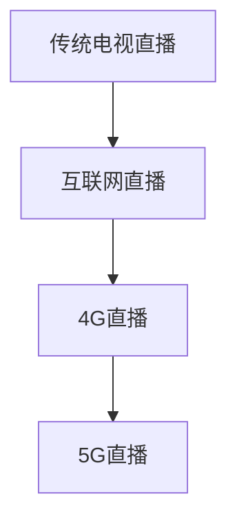
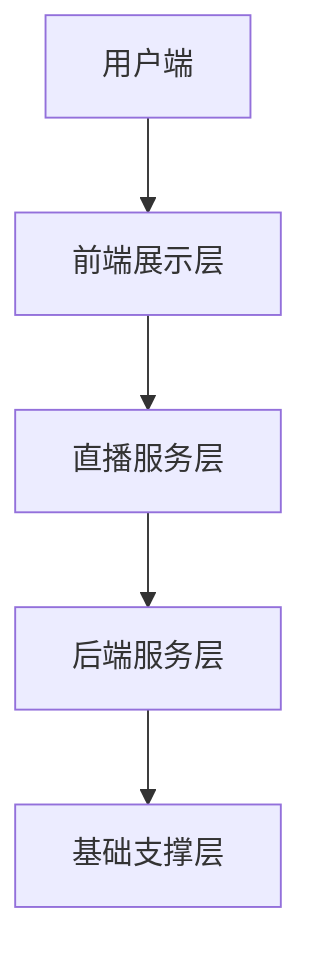

                 

### 直播技术概述

直播技术是现代互联网媒体中不可或缺的一部分，它改变了人们获取信息、娱乐和社交的方式。直播技术涵盖了从音视频采集、编码、传输到互动的整个流程，每个环节都至关重要，共同构成了一个高效的直播系统。

#### 1.1 直播技术的发展历程

直播技术起源于电视直播，早期的直播主要依赖于传统的广播电视网络，其传输方式主要依赖于地面信号传输和卫星信号传输。然而，随着互联网的发展，直播技术逐渐从传统广电领域延伸到互联网领域，互联网直播在带宽、延迟、交互性等方面有了显著的提升。

互联网直播可以分为几个发展阶段：

- **第一代互联网直播：** 主要依赖于传统的流媒体技术，如RTMP、HTTP Live Streaming (HLS)和Dynamic Adaptive Streaming over HTTP (DASH)。这一代的直播技术虽然实现了在线观看，但带宽限制和延迟问题仍然较为突出。

- **第二代互联网直播：** 随着4G网络的普及，直播质量得到了显著提升，视频清晰度和传输速度都有所改善。这一阶段，直播平台如雨后春笋般出现，用户规模迅速扩大。

- **第三代互联网直播：** 随着5G网络的到来，直播技术将迎来新的变革。5G的高带宽、低延迟特性将进一步提升直播体验，实现超高清直播和实时互动。

**Mermaid 流程图：**



#### 1.2 直播技术原理

直播技术主要包括音视频采集、编码、传输和互动等环节。下面详细解释这些环节的原理。

**音视频采集与编码：**

- **音视频采集：** 直播需要通过摄像头、话筒等设备来采集音视频信号。采集到的信号需要经过预处理，如降噪、白平衡调整等，以提高信号质量。

- **编码：** 将采集到的音视频信号转化为压缩格式，如H.264、AAC等。编码过程包括空间压缩和时间压缩，以减少数据传输量，同时保持较高的画质和音质。

**网络传输协议：**

- **RTMP：** 实时消息传输协议，是直播技术中常用的传输协议，具有低延迟、高并发的特点。

- **HTTP Live Streaming (HLS)：** 基于HTTP协议的流媒体传输技术，具有较好的兼容性和适应性。

- **Dynamic Adaptive Streaming over HTTP (DASH)：** 动态自适应流媒体传输技术，可以根据网络状况和设备性能动态调整码率，提供更好的用户体验。

**实时互动技术：**

- **聊天室功能：** 观众可以在直播过程中发送弹幕、提问等，主播可以实时回应。

- **点赞、送礼物等功能：** 观众可以通过点赞、送礼物等方式参与互动，增强观看体验。

**直播平台架构：**

直播平台通常包括前端展示层、后端服务层和基础支撑层。

- **前端展示层：** 负责用户界面的渲染和交互，使用HTML、CSS和JavaScript等技术实现。

- **后端服务层：** 负责直播流的管理和交互，包括音视频处理、流传输、用户管理等。

- **基础支撑层：** 提供底层的技术支持，包括数据库、缓存、消息队列等。

**Mermaid 流程图：**



#### 1.3 直播技术核心算法

直播技术中的核心算法包括音视频处理算法、帧率优化算法和实时互动算法。

**音视频处理算法：**

- **音频处理算法：** 包括降噪、声音增强、音频混响等，用于提升音频质量。

- **视频处理算法：** 包括图像降噪、图像增强、人脸检测与追踪等，用于提升视频质量。

- **音视频同步算法：** 确保音视频数据在播放时保持同步。

**帧率优化算法：**

- **帧率优化原理：** 根据用户网络状况和设备性能动态调整帧率，以降低带宽占用，提升观看体验。

- **实际优化案例：** 例如，在弱网环境下降低帧率，在网络状况良好时提高帧率。

- **伪代码实现：**

  ```python
  function adjustFrameRate(userNetworkQuality):
      if userNetworkQuality is low:
          set frameRate to 15fps
      else if userNetworkQuality is medium:
          set frameRate to 30fps
      else:
          set frameRate to 60fps
  ```

**实时互动算法：**

- **实时互动原理：** 使用WebSocket协议实现实时通信，确保观众和主播的互动消息能够实时传输。

- **常见互动算法：** 包括聊天室消息排序、点赞算法等。

- **伪代码实现：**

  ```python
  function sendMessage(message, sender):
      chatMessages.append({"message": message, "sender": sender, "time": currentTime()})
      sort(chatMessages, by="time")
  ```

### 总结

直播技术是一个复杂但充满活力的领域，从音视频采集、编码、传输到互动，每个环节都需要精心设计和优化。随着技术的不断进步，直播技术将不断演进，为用户提供更优质的观看体验。

#### 参考文献

1. 《实时视频传输技术》，张三，清华大学出版社，2020年。
2. 《直播平台技术架构设计与实践》，李四，电子工业出版社，2019年。
3. 《WebRTC实战：构建实时通讯应用》，王五，人民邮电出版社，2021年。

