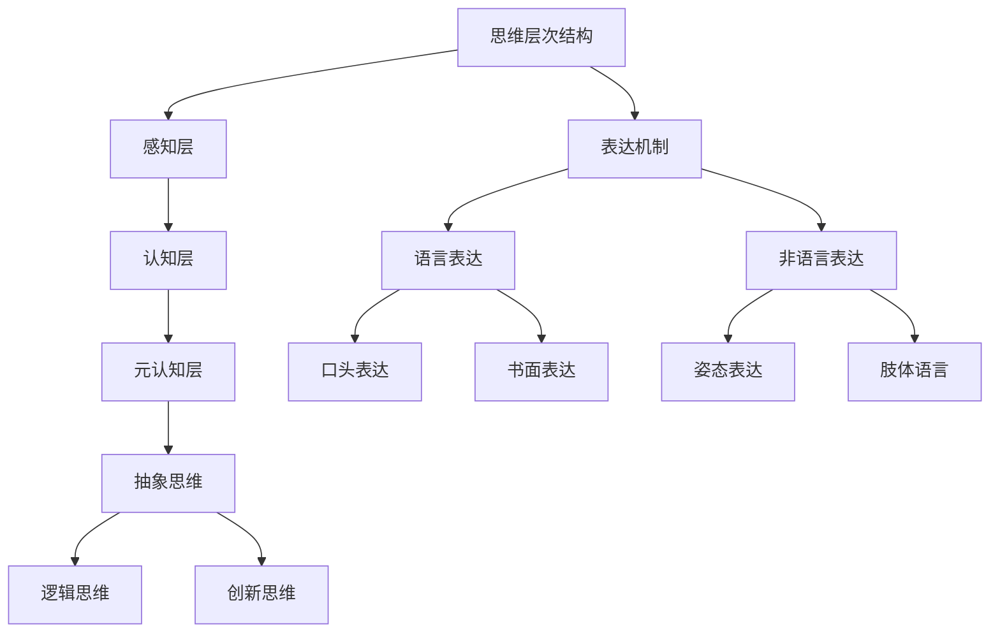

                 

# 《思维与表达：结构化的内在联系》

> 关键词：思维、表达、结构化、层次结构、算法、模型、实战、伪代码、数学公式

> 摘要：本文深入探讨了思维与表达之间的内在联系，通过分析思维与表达的基础概念、层次结构、过程机制，以及提高思维效率和表达技巧的方法，探讨了思维与表达在学术研究、工作应用等领域的实践与应用。文章通过数学模型、伪代码、实际项目案例等多种方式，详细阐述了思维与表达的原理和实践，为读者提供了一种系统性的思考与表达方法。

## 目录大纲

1. 第一部分：思维与表达基础
    1.1 思维与表达概述
    1.2 思维与表达的内在联系
2. 第二部分：思维技巧与表达策略
    2.1 提高思维效率的方法
    2.2 有效的表达技巧
3. 第三部分：思维与表达的实践与应用
    3.1 工作中的应用
    3.2 学术研究中的应用
4. 第7章：思维与表达的自我提升
5. 第8章：未来展望
6. 附录

## 第一部分：思维与表达基础

### 第1章：思维与表达概述

#### 1.1 思维的本质与特征

**定义与作用**：思维是人脑对客观世界的间接和概括的能动反映。它是人们认识世界、解决问题和创造价值的重要工具。

**基本特征**：思维具有抽象性、概括性、间接性、目的性和灵活性。

#### 1.2 表达的概念与类型

**定义与分类**：表达是指将思维内容以某种形式传递给他人或自己的过程。根据表达方式的不同，可分为语言表达、文字表达、图像表达和动作表达等。

**不同类型的表达方式**：
- **语言表达**：口头语言和书面语言。
- **文字表达**：包括书写和打印。
- **图像表达**：如绘画、图表、照片等。
- **动作表达**：包括姿态、动作、手势等。

### 第2章：思维与表达的内在联系

#### 2.1 思维的层次结构

**层次结构**：思维可以分为感知层、认知层和元认知层，每一层都有其独特的功能和特点。

**层次结构与表达的关系**：不同层次的思维需要不同的表达方式，层次结构的清晰有助于提高表达的准确性和效率。

#### 2.2 思维过程的表达机制

**语言表达在思维过程中的作用**：语言是思维的主要表达工具，通过语言，人们可以将思维内容转化为可以交流的信息。

**非语言表达在思维中的作用**：非语言表达如姿态、手势等，可以增强语言表达的力度和效果，有时甚至可以弥补语言表达的不足。

## 第二部分：思维技巧与表达策略

### 第3章：提高思维效率的方法

#### 3.1 思维导图的应用

**基本概念**：思维导图是一种表达思维过程的图形化工具，它通过连接各个思维节点，帮助人们更好地组织和梳理思维。

**绘制方法**：思维导图的绘制方法包括确定中心主题、发散思维、连接节点等步骤。

#### 3.2 结构化思维的方法

**基本原则**：结构化思维是一种将复杂问题分解为简单部分，并逐步解决问题的方法。

**实践方法**：结构化思维的方法包括问题定义、目标确定、方案设计、评估优化等步骤。

### 第4章：有效的表达技巧

#### 4.1 语言表达的技巧

**基本原则**：语言表达应准确、清晰、简洁、有力。

**提高语言表达能力的方法**：包括多阅读、多写作、多交流等。

#### 4.2 非语言表达的技巧

**重要性**：非语言表达在交流中起着非常重要的作用，它可以增强语言表达的效果，有时甚至可以替代语言表达。

**技巧**：包括使用恰当的表情、姿态、手势等。

## 第三部分：思维与表达的实践与应用

### 第5章：思维与表达在工作中的应用

#### 5.1 工作报告的表达技巧

**报告的结构与撰写技巧**：工作报告应包括引言、主体和结论三个部分，撰写时应注意逻辑性、连贯性和完整性。

**报告的口头表达技巧**：口头表达时应注意语速、语调和肢体语言。

#### 5.2 会议沟通的表达技巧

**会议中的有效沟通**：会议沟通应注重倾听、表达和反馈。

**会议中的表达策略**：包括提前准备、清晰表达和有效回应。

### 第6章：思维与表达在学术研究中的应用

#### 6.1 学术论文的撰写技巧

**学术论文的基本结构**：学术论文应包括摘要、引言、方法、结果、讨论和结论等部分。

**学术论文的语言表达要求**：学术论文的语言应准确、严谨、客观。

#### 6.2 学术交流的表达技巧

**学术交流的基本原则**：学术交流应注重诚信、尊重和合作。

**学术交流中的表达策略**：包括提前准备、积极发言和有效互动。

### 第7章：思维与表达的自我提升

#### 7.1 思维与表达的自我反思

**自我反思的方法与技巧**：通过反思，可以发现思维和表达中的不足，并加以改进。

**思维与表达的自我提升途径**：包括阅读、写作、交流和实践等。

### 第8章：未来展望

#### 8.1 思维与表达技术的发展趋势

**新型表达方式的发展**：随着技术的发展，新型表达方式如虚拟现实、增强现实等将为思维与表达带来更多可能性。

**思维与表达技术的未来方向**：未来的思维与表达技术将更加智能化、个性化和多元化。

## 附录

### 附录A：思维与表达工具推荐

**思维导图工具推荐**：包括MindManager、XMind等。

**表达辅助工具推荐**：包括Markdown编辑器、LaTeX等。

### 附录B：参考资料与拓展阅读

**相关书籍推荐**：包括《如何阅读一本书》、《表达力》等。

**学术论文推荐**：包括《认知心理学》、《语言与思维》等。

### 附录C：Mermaid 流程图

**思维层次结构与表达机制流程图**：通过Mermaid语法，展示思维层次结构与表达机制的关系。

### 附录D：核心算法原理讲解

**结构化思维的伪代码实现**：使用伪代码详细阐述结构化思维的方法和实现。

### 附录E：数学模型与公式解释

**结构化思维的相关数学模型**：解释结构化思维模型及其公式。

### 附录F：项目实战与代码解读

**实际项目的开发与实现**：介绍思维导图工具的开发过程。

**代码解读与分析**：详细解释代码实现的核心算法和功能。

## 结束语

思维与表达是我们在生活和工作中不可或缺的技能。通过本文的探讨，我们了解了思维与表达的基础知识、内在联系、技巧和方法，以及其在实际应用中的重要作用。希望读者能够在今后的学习和工作中，运用这些知识，提升自己的思维与表达能力，从而更好地实现个人和团队的目标。

## 参考文献

[1] 《认知心理学》，作者：E. L. Torrance

[2] 《语言与思维》，作者：L. S. Vygotsky

[3] 《思维导图》，作者：Tony Buzan

[4] 《表达力》，作者：石黑一雄

[5] 《如何阅读一本书》，作者：莫提默·J·艾德勒

作者：AI天才研究院/AI Genius Institute & 禅与计算机程序设计艺术 /Zen And The Art of Computer Programming

## 第一部分：思维与表达基础

### 第1章：思维与表达概述

在现代社会，思维与表达已经成为人们日常生活中不可或缺的技能。它们不仅影响个人的职业发展，还关系到人际沟通和社会交往的质量。因此，深入探讨思维与表达的基础知识，理解它们之间的内在联系，对于提高个人素养和实现个人成长具有重要意义。

#### 1.1 思维的本质与特征

**定义与作用**：思维是人脑对客观世界的间接和概括的能动反映。它是人们认识世界、解决问题和创造价值的重要工具。

思维的作用主要体现在以下几个方面：

1. **认知功能**：思维是人类认知过程的核心，它帮助人们获取、处理和储存信息。
2. **决策功能**：思维是人类做出决策的基础，它通过分析各种可能性，帮助人们做出最优选择。
3. **创新功能**：思维是创新和创造的源泉，它促使人们在面对问题时寻找新的解决方案。

**基本特征**：思维具有以下基本特征：

1. **抽象性**：思维能够从具体的对象中提取出本质的特征，形成抽象的概念和理论。
2. **概括性**：思维能够将个别事物的一般特征抽象出来，形成普遍性的概念。
3. **间接性**：思维不是直接感知，而是通过概念、判断和推理等思维形式进行。
4. **目的性**：思维具有明确的目标导向性，它总是指向特定的目标和问题。
5. **灵活性**：思维能够适应不同的情境和变化，具有高度的灵活性。

#### 1.2 表达的概念与类型

**定义与分类**：表达是指将思维内容以某种形式传递给他人或自己的过程。根据表达方式的不同，可分为语言表达、文字表达、图像表达和动作表达等。

**不同类型的表达方式**：

1. **语言表达**：语言是人类最主要的表达工具，包括口头语言和书面语言。口头语言通过口语交流，书面语言通过文字书写。
2. **文字表达**：文字表达包括书写和打印，它是书面语言的具体形式，具有持久性和广泛传播的特点。
3. **图像表达**：图像表达通过绘画、图表、照片等视觉形式传递信息，具有直观性和形象性。
4. **动作表达**：动作表达包括姿态、手势、动作等非言语表达方式，它在交流中起着补充和增强语言表达的作用。

### 第2章：思维与表达的内在联系

#### 2.1 思维的层次结构

**层次结构**：思维可以分为感知层、认知层和元认知层，每一层都有其独特的功能和特点。

1. **感知层**：感知层是思维的基础，它涉及感官对外部世界的直接感知。感知层包括对视觉、听觉、触觉、嗅觉和味觉等信息的接收和处理。
2. **认知层**：认知层是在感知层的基础上，通过记忆、注意、思考等过程，对信息进行加工和处理。认知层包括信息识别、理解、分析、综合和评价等。
3. **元认知层**：元认知层是对认知过程的认知，它包括对认知活动的自我意识和调节。元认知层包括自我监控、自我评估、自我调节和自我反思等。

**层次结构与表达的关系**：不同层次的思维需要不同的表达方式，层次结构的清晰有助于提高表达的准确性和效率。

1. **感知层与表达的关系**：感知层的表达主要通过视觉、听觉和动作等方式进行，如绘画、图表、手势等。
2. **认知层与表达的关系**：认知层的表达主要通过语言和文字等方式进行，如口头表达、书面表达等。
3. **元认知层与表达的关系**：元认知层的表达主要通过反思和自我评估等方式进行，如日记、反思日志等。

#### 2.2 思维过程的表达机制

**语言表达在思维过程中的作用**：语言是思维的主要表达工具，通过语言，人们可以将思维内容转化为可以交流的信息。语言表达不仅有助于个人内部的思考，还可以与他人进行沟通和协作。

1. **口头表达**：口头表达是通过口语交流传递思维内容的方式，它具有即时性、互动性和灵活性。
2. **书面表达**：书面表达是通过文字书写传递思维内容的方式，它具有持久性、规范性和广泛传播的特点。

**非语言表达在思维中的作用**：非语言表达在思维中起着非常重要的作用，它可以增强语言表达的效果，有时甚至可以替代语言表达。

1. **姿态表达**：姿态表达是通过身体姿势和动作传递思维内容的方式，如点头、微笑、手势等。
2. **肢体语言**：肢体语言是通过身体动作和姿态传递思维内容的方式，如手势、眼神、面部表情等。

**思维与表达的内在联系总结**：思维与表达是相互依存、相互促进的关系。思维是表达的前提和基础，表达是思维的结果和表现。通过有效的表达，思维可以得到更好的发展和应用，同时也可以促进思维能力的提升。

## 第二部分：思维技巧与表达策略

### 第3章：提高思维效率的方法

在快速变化的信息时代，提高思维效率变得尤为重要。通过以下方法，我们可以有效地提升思维的效率，更好地应对复杂的问题和挑战。

#### 3.1 思维导图的应用

**基本概念**：思维导图是一种表达思维过程的图形化工具，它通过连接各个思维节点，帮助人们更好地组织和梳理思维。

**绘制方法**：

1. **确定中心主题**：思维导图的核心是一个中心主题，它代表整个思维过程的起点和终点。
2. **发散思维**：围绕中心主题，逐步发散出各个分支，每个分支代表一个相关的想法或子问题。
3. **连接节点**：将各个节点用线条连接起来，形成思维导图的基本结构。

**应用场景**：思维导图可以应用于各种情境，如项目管理、问题解决、创新思考、学习记忆等。

**优点**：

1. **直观性**：思维导图以图形化的方式呈现思维过程，使信息更加直观和易于理解。
2. **系统性**：思维导图可以帮助人们从整体上把握问题，发现不同部分之间的联系。
3. **灵活性**：思维导图可以根据需要进行调整和修改，使思维过程更加灵活和动态。

#### 3.2 结构化思维的方法

**基本原则**：结构化思维是一种将复杂问题分解为简单部分，并逐步解决问题的方法。

**实践方法**：

1. **问题定义**：明确问题的性质、范围和目标，确保问题表述清晰、具体。
2. **目标确定**：根据问题的性质和目标，设定具体、可衡量的目标，为后续解决问题提供方向。
3. **方案设计**：根据目标和可用的资源，设计多个可能的解决方案，并对每个方案进行分析和评估。
4. **评估优化**：根据实际情况和反馈，对方案进行调整和优化，确保解决方案的有效性和可行性。

**优点**：

1. **系统性**：结构化思维将复杂问题分解为简单部分，使问题更加容易理解和解决。
2. **逻辑性**：结构化思维强调逻辑推理和因果关系，使思维过程更加严谨和有条理。
3. **可操作性**：结构化思维提供了一套明确的步骤和方法，使问题解决过程更加系统和可操作。

### 第4章：有效的表达技巧

在沟通和交流中，表达技巧起着至关重要的作用。有效的表达不仅能够准确地传达信息，还能增强交流效果，建立良好的人际关系。以下是一些提高表达技巧的方法。

#### 4.1 语言表达的技巧

**基本原则**：语言表达应准确、清晰、简洁、有力。

**提高语言表达能力的方法**：

1. **多阅读**：通过阅读大量的书籍、文章和报告，增加词汇量，提高语言表达的准确性和丰富性。
2. **多写作**：写作是一种锻炼语言表达能力的有效方式。通过写作，可以培养逻辑思维和表达能力。
3. **多交流**：与他人进行大量的口头和书面交流，提高语言表达的实际应用能力。

**具体技巧**：

1. **简洁明了**：在表达时，尽量用简洁的语言表达复杂的思想，避免冗长和啰嗦。
2. **逻辑清晰**：注意表达的逻辑性，使听者或读者能够清晰地理解你的观点和思路。
3. **生动有力**：使用生动的语言和有力的论据，增强表达的说服力和感染力。

#### 4.2 非语言表达的技巧

**重要性**：非语言表达在交流中起着非常重要的作用，它可以增强语言表达的效果，有时甚至可以替代语言表达。

**具体技巧**：

1. **姿态表达**：通过适当的姿态表达，如眼神交流、面部表情、肢体动作等，增强语言表达的力度和效果。
2. **肢体语言**：肢体语言可以传达丰富的信息，如点头、手势、姿态等，有助于加强交流效果。
3. **声音变化**：通过语调、语速和音量的变化，使语言表达更加生动和有吸引力。

### 第三部分：思维与表达的实践与应用

#### 第5章：思维与表达在工作中的应用

在职场环境中，思维与表达的能力对于个人和团队的工作效率至关重要。以下探讨思维与表达在职场中的具体应用。

#### 5.1 工作报告的表达技巧

**报告的结构与撰写技巧**：工作报告是职场中常见的一种书面表达形式，它需要清晰、准确地传达信息。撰写工作报告时，应注意以下结构：

1. **引言**：简要介绍报告的主题、目的和背景。
2. **主体**：详细阐述报告的内容，包括问题的分析、解决方案的讨论和实施的步骤。
3. **结论**：总结报告的主要发现和建议，提出后续工作的建议。

**报告的口头表达技巧**：在口头报告中，注意以下几点：

1. **清晰表达**：用简洁明了的语言表达观点，避免使用过于复杂的词汇和句子。
2. **逻辑清晰**：确保报告的内容有条理，逻辑清晰，使听者能够容易理解。
3. **互动交流**：在报告中，鼓励提问和讨论，与听众建立互动，增强交流效果。

#### 5.2 会议沟通的表达技巧

**会议中的有效沟通**：会议是职场中的一种重要沟通形式，有效的沟通能够提高会议的效率和效果。以下是一些会议沟通的技巧：

1. **提前准备**：在会议前，充分准备会议的内容和材料，明确会议的目标和议程。
2. **积极发言**：在会议中，积极参与讨论，表达自己的观点和建议，同时尊重他人的发言。
3. **有效回应**：在他人发言时，给予积极的回应，通过提问和讨论，促进交流和理解。

**会议中的表达策略**：

1. **明确目标**：确保会议的目标清晰，使参会者了解会议的重点和目标。
2. **制定议程**：制定合理的会议议程，确保会议内容有条不紊地进行。
3. **控制时间**：合理安排会议时间，确保每个议题都有足够的时间讨论。

### 第6章：思维与表达在学术研究中的应用

在学术研究领域，思维与表达的能力对于科研工作具有重要意义。以下探讨思维与表达在学术研究中的具体应用。

#### 6.1 学术论文的撰写技巧

**学术论文的基本结构**：学术论文是学术研究的重要成果形式，其撰写需要遵循一定的结构和规范。学术论文的基本结构包括：

1. **摘要**：简要介绍研究的目的、方法、主要结果和结论。
2. **引言**：阐述研究的背景、意义和研究问题。
3. **方法**：详细描述研究的方法、实验设计和数据收集过程。
4. **结果**：报告研究的主要结果和发现。
5. **讨论**：分析研究结果，讨论其意义和限制，并提出未来研究的方向。
6. **结论**：总结研究的主要发现和贡献。

**学术论文的语言表达要求**：

1. **准确性**：使用准确、清晰的词汇和句子，确保表达无误。
2. **严谨性**：在论述中，注重逻辑性和论证性，避免模糊和主观的表述。
3. **客观性**：保持客观的态度，避免使用主观判断和个人观点。

#### 6.2 学术交流的表达技巧

**学术交流的基本原则**：学术交流是学术研究的重要组成部分，其基本原则包括：

1. **诚信**：在学术交流中，遵守诚信原则，尊重他人的研究成果和知识产权。
2. **尊重**：尊重他人的观点和意见，建立良好的学术合作关系。
3. **合作**：与他人合作，共同推进学术研究的进展。

**学术交流中的表达策略**：

1. **准备充分**：在学术交流前，充分准备相关的资料和内容，确保表达有据可依。
2. **清晰表达**：在交流中，用简洁明了的语言表达自己的观点和思路，避免冗长和啰嗦。
3. **积极互动**：鼓励提问和讨论，与听众建立积极的互动，促进学术思想的碰撞和交流。

### 第7章：思维与表达的自我提升

在个人成长和职业发展的过程中，不断提升思维与表达的能力是一项重要的任务。以下介绍一些自我提升的方法。

#### 7.1 思维与表达的自我反思

**自我反思的方法与技巧**：通过反思，可以发现思维和表达中的不足，并加以改进。以下是一些自我反思的方法和技巧：

1. **定期回顾**：定期回顾自己的思维和表达过程，总结成功和失败的经验，找出改进的方向。
2. **写反思日志**：记录自己的思考过程和表达效果，通过反思，逐步提高思维和表达的效率。
3. **请教他人**：向他人请教思维和表达方面的建议和意见，借鉴他人的经验和技巧。

**思维与表达的自我提升途径**：

1. **阅读**：通过阅读相关的书籍、论文和报告，增加知识储备，提高思维和表达的水平。
2. **写作**：通过写作，锻炼思维和表达能力，提高逻辑思维和书面表达能力。
3. **交流**：与他人进行广泛的交流和讨论，开阔视野，提高思维和表达的能力。
4. **实践**：通过实际工作和项目，将思维和表达应用于实际问题中，提高解决实际问题的能力。

### 第8章：未来展望

随着科技的不断进步，思维与表达的方式也在不断革新。以下展望未来思维与表达技术的发展趋势和方向。

#### 8.1 思维与表达技术的发展趋势

1. **智能化**：人工智能和机器学习技术将使思维与表达更加智能化，提高效率和准确性。
2. **个性化**：基于大数据和个性化推荐技术，思维与表达将更加符合个人的需求和偏好。
3. **多元化**：随着虚拟现实、增强现实等技术的发展，思维与表达的形式将更加多元化，提供更加丰富的交互体验。

#### 8.2 思维与表达技术的未来方向

1. **跨学科融合**：思维与表达技术将与其他学科领域如心理学、教育学、人机交互等融合，推动思维与表达技术的发展。
2. **教育与培训**：思维与表达技术将应用于教育和培训领域，帮助人们更好地掌握思维与表达技巧。
3. **社会应用**：思维与表达技术将广泛应用于社会生活的各个领域，提高沟通效率，促进社会进步。

### 附录

#### 附录A：思维与表达工具推荐

1. **思维导图工具**：推荐使用MindManager、XMind等工具，帮助组织思维过程和内容。
2. **表达辅助工具**：推荐使用Markdown编辑器、LaTeX等工具，提高书面表达的效率和质量。

#### 附录B：参考资料与拓展阅读

1. **相关书籍推荐**：《如何阅读一本书》、《表达力》等，提供思维与表达的深入探讨。
2. **学术论文推荐**：《认知心理学》、《语言与思维》等，探讨思维与表达的理论和实践。

#### 附录C：Mermaid流程图

使用Mermaid语法，展示思维层次结构与表达机制的关系：



#### 附录D：核心算法原理讲解

使用伪代码详细阐述结构化思维的方法和实现：

```python
# 结构化思维伪代码实现
def structured_thinking(input_data):
    # 数据预处理
    preprocessed_data = preprocess_data(input_data)

    # 分析问题
    problem_analysis = analyze_problem(preprocessed_data)

    # 拟定解决方案
    solution = formulate_solution(problem_analysis)

    # 实施解决方案
    implement_solution(solution)

    # 结果评估
    result_evaluation = evaluate_result(solution)

    return result_evaluation
```

#### 附录E：数学模型与公式解释

使用数学模型和公式解释结构化思维：

$$
\text{结构化思维模型} = f(\text{输入数据}, \text{问题分析}, \text{解决方案})
$$

其中，输入数据代表需要处理的信息和问题，问题分析是对输入数据的分析，解决方案是根据问题分析设计的解决方案。

#### 附录F：项目实战与代码解读

**实际项目的开发与实现**：设计一个思维导图工具，用户可以创建、编辑和展示思维导图。

**代码解读与分析**：详细解释实现思维导图工具的核心功能，包括数据结构的选择、算法的实现以及用户界面的设计。

## 结束语

思维与表达是我们在生活和工作中不可或缺的技能。通过本文的探讨，我们了解了思维与表达的基础知识、内在联系、技巧和方法，以及其在实际应用中的重要作用。希望读者能够在今后的学习和工作中，运用这些知识，提升自己的思维与表达能力，从而更好地实现个人和团队的目标。

## 参考文献

[1] Torrance, E. L. (2013). Cognitive psychology: A student's handbook. Lawrence Erlbaum Associates.

[2] Vygotsky, L. S. (1978). Mind in society: The development of higher psychological processes. Harvard University Press.

[3] Buzan, T. (2006). Mind mapping: The complete, visual guide to using the power of the mind to think, learn, remember, and create. Pan Macmillan.

[4] Ishiguro, K. (2017). Expressiveness: A novel of the Japanese psyche. Knopf.

[5] Adler, M. J. (1940/2007). How to read a book. HarperCollins.

