                 

### 引言

在当今这个快速变化的世界，成功与失败之间的界限越来越模糊。然而，那些能够在这个动荡的时代中脱颖而出的个体和组织，往往都有一些共同的特点——那就是卓越的思维模式。思维模式，可以理解为人们思考和决策的方式，它不仅决定了我们在面对问题和挑战时的反应，更决定了我们能否抓住机遇，实现个人和事业的突破。

本文将深入探讨思维模式在成功与失败中的关键作用。我们将首先定义什么是思维模式，并探讨其对于个人成长、企业管理、创新与创业，以及教育等方面的深远影响。此外，我们还将探讨未来思维模式的趋势，以及如何在人工智能时代中运用思维模式来获得更大的成功。

**关键词：** 思维模式，成功与失败，决策思维，创新思维，问题解决，团队合作，个人发展，企业管理，创新与创业，教育。

**摘要：** 本文通过系统性的分析和实例讲解，探讨了思维模式在各个领域中的重要作用。从基础理论到实际应用，再到未来展望，我们将全面了解思维模式如何影响我们的决策、创新和问题解决，以及如何通过有效的思维模式提升个人和组织的竞争力。

### 目录大纲

#### 第一部分: 引言

1. **引言**
    - 思维模式的定义与重要性
    - 关键词与摘要

#### 第二部分: 思维模式的基础理论

2. **决策思维模式**
    - 决策思维模式的概念
    - 决策思维模式的分析方法
    - 决策思维模式的案例分析

3. **创新思维模式**
    - 创新思维模式的概念
    - 创新思维模式的分析方法
    - 创新思维模式的案例分析

4. **问题解决思维模式**
    - 问题解决思维模式的概念
    - 问题解决思维模式的分析方法
    - 问题解决思维模式的案例分析

5. **团队合作思维模式**
    - 团队合作思维模式的概念
    - 团队合作思维模式的分析方法
    - 团队合作思维模式的案例分析

#### 第三部分: 思维模式的应用与实践

6. **个人发展中的思维模式**
    - 个人发展中的思维模式
    - 个人发展中的案例分析
    - 个人发展中的实践建议

7. **企业管理与决策中的思维模式**
    - 企业管理与决策中的思维模式
    - 企业管理与决策中的案例分析
    - 企业管理与决策中的实践建议

8. **创新与创业中的思维模式**
    - 创新与创业中的思维模式
    - 创新与创业中的案例分析
    - 创新与创业中的实践建议

9. **教育中的思维模式**
    - 教育中的思维模式
    - 教育中的案例分析
    - 教育中的实践建议

#### 第四部分: 思维模式的未来展望

10. **思维模式在人工智能时代的演进**
    - 人工智能对思维模式的影响
    - 人工智能时代的思维模式发展
    - 人工智能时代的实践建议

11. **未来思维模式的趋势**
    - 未来思维模式的趋势
    - 未来思维模式的应用领域
    - 未来思维模式的发展方向

#### 附录

12. **附录A: 思维模式相关工具与资源**
    - 思维模式评估工具
    - 思维模式训练工具
    - 思维模式应用案例库

### 第一部分：引言

在当今社会，成功与失败不再仅仅取决于天赋或运气，更多地取决于我们的思维方式。思维模式，即我们思考问题和做出决策的方式，已经成为我们个人和事业发展的关键因素。然而，究竟什么是思维模式？它为什么如此重要？本文将深入探讨这些问题。

#### 思维模式的定义

思维模式，可以理解为我们在面对问题和决策时的思考方式。它不仅包括我们如何收集和分析信息，还涉及我们如何利用这些信息做出决策。简单来说，思维模式就是我们大脑中的思考框架。这个框架可以是系统的，也可以是直觉的，但无论何种方式，它都会影响我们的行为和结果。

#### 思维模式的重要性

思维模式的重要性体现在多个方面：

1. **决策能力：** 优秀的思维模式可以帮助我们更快速、更准确地做出决策，从而抓住机遇，避免风险。

2. **创新能力：** 创新思维模式使我们能够从不同的角度看待问题，提出新颖的解决方案，推动个人和组织的进步。

3. **问题解决能力：** 问题解决思维模式使我们能够更有效地识别和解决问题，从而提高工作效率和业绩。

4. **团队合作能力：** 团队合作思维模式有助于我们更好地与团队成员沟通、协作，共同实现目标。

5. **个人发展：** 通过有效的思维模式，我们可以更好地规划个人发展路径，提升自我认知和能力。

6. **企业管理与决策：** 在企业管理和决策中，思维模式决定了我们的战略规划、市场定位和风险管理能力。

7. **创新与创业：** 在创新与创业中，思维模式决定了我们的创新能力、市场敏锐度和风险承受能力。

8. **教育：** 在教育中，思维模式决定了我们的教学方法和学习效果。

#### 关键词

- 思维模式
- 成功与失败
- 决策思维
- 创新思维
- 问题解决
- 团队合作
- 个人发展
- 企业管理
- 创新与创业
- 教育

#### 摘要

本文将系统地探讨思维模式在个人成长、企业管理、创新与创业，以及教育等领域的关键作用。我们将从基础理论出发，逐步深入探讨各种思维模式的概念、分析方法、案例分析，以及实践应用。通过本文的阅读，读者将全面了解思维模式的重要性，学会如何利用有效的思维模式提升个人和组织的竞争力。

### 第二部分：思维模式的基础理论

在深入探讨思维模式之前，我们需要对几个核心概念进行定义和分析，包括决策思维模式、创新思维模式、问题解决思维模式和团队合作思维模式。通过理解这些基本概念，我们可以更好地认识到思维模式在实践中的应用价值和影响力。

#### 决策思维模式

**概念：** 决策思维模式是指个体或组织在做出决策时所采用的思考方法和过程。这种模式通常涉及信息收集、分析、评估和选择等多个步骤。

**分析方法：** 决策思维模式的分析方法主要包括以下几个方面：

1. **明确目标：** 在做出决策之前，首先要明确决策的目标和预期结果。
2. **信息收集：** 收集与决策相关的信息，包括数据、事实和观点等。
3. **风险评估：** 对不同选项的风险进行评估，考虑可能带来的利益和损失。
4. **评估标准：** 确定评估决策选项的标准，例如成本、收益、可行性等。
5. **选择与执行：** 根据评估结果选择最佳的决策方案，并执行决策。

**案例：** 假设一个公司要决定是否投资一个新的市场。在决策过程中，公司需要明确投资的目标，收集市场数据，评估投资的风险和收益，并制定详细的执行计划。

#### 创新思维模式

**概念：** 创新思维模式是指个体或组织在解决问题或开发新产品时采用的创新思考方法。这种模式鼓励人们打破常规，从新的角度思考问题，提出独特的解决方案。

**分析方法：** 创新思维模式的分析方法包括以下几个方面：

1. **需求分析：** 分析用户需求和市场趋势，确定创新的方向。
2. **头脑风暴：** 通过集思广益，产生大量的创新想法。
3. **筛选与优化：** 对创新想法进行筛选和优化，确定可行的解决方案。
4. **原型制作：** 制作原型，验证创新解决方案的可行性。
5. **迭代改进：** 通过用户反馈不断改进产品，提高其市场竞争力。

**案例：** 一家科技公司想要开发一款新的智能家居产品。在创新思维模式的指导下，公司首先分析了市场需求，然后进行了头脑风暴，提出了多个创新方案，通过原型制作和用户测试，最终确定了一款符合市场需求的产品。

#### 问题解决思维模式

**概念：** 问题解决思维模式是指个体或组织在遇到问题时，采用的一系列思考和解决问题的方法。这种模式强调逻辑分析、系统性思考和创造性思维。

**分析方法：** 问题解决思维模式的分析方法包括以下几个方面：

1. **识别问题：** 准确地识别问题，明确问题的本质和范围。
2. **分析原因：** 分析问题产生的原因，找到关键因素。
3. **提出解决方案：** 根据问题原因，提出多个可能的解决方案。
4. **评估方案：** 对提出的解决方案进行评估，选择最佳的方案。
5. **实施与监控：** 实施解决方案，并监控其效果，进行必要的调整。

**案例：** 假设一家制造公司发现生产线出现了质量问题。在问题解决思维模式的指导下，公司首先识别了问题，然后分析了原因，提出了多个解决方案，如改进生产工艺、更换设备等，最终选择了最佳方案，并实施监控，确保问题得到有效解决。

#### 团队合作思维模式

**概念：** 团队合作思维模式是指团队成员在协作过程中所采用的思考方式。这种模式强调沟通、协作和共同目标，以提高团队的效率和成果。

**分析方法：** 团队合作思维模式的分析方法包括以下几个方面：

1. **明确目标：** 确定团队的目标和任务，确保所有成员都清楚任务要求。
2. **沟通协作：** 通过有效的沟通和协作，确保信息共享和任务分工。
3. **分工合作：** 根据成员的特长和任务要求，合理分工，提高工作效率。
4. **协调与反馈：** 定期协调团队工作，收集成员反馈，及时调整工作计划。
5. **团队建设：** 通过团队建设活动，增强团队凝聚力和协作能力。

**案例：** 一家软件公司要开发一款新的软件产品。在团队合作思维模式的指导下，公司明确了开发目标，通过团队会议和任务分配，确保团队成员清楚任务要求，并通过定期反馈和协调，确保项目顺利推进。

### 第三部分：思维模式的应用与实践

在前文中，我们探讨了决策思维模式、创新思维模式、问题解决思维模式和团队合作思维模式的基本概念和分析方法。在本节中，我们将深入探讨这些思维模式在不同领域中的具体应用与实践，包括个人发展、企业管理和决策、创新与创业，以及教育。

#### 个人发展中的思维模式

在个人发展中，有效的思维模式可以显著提升个人的自我认知、能力提升和职业发展。以下是一些具体的应用和实践：

**自我认知：** 通过反思和自我评估，个体可以识别自己的优势和不足，从而制定针对性的个人发展计划。例如，使用SWOT分析（优势、劣势、机会、威胁）来评估自己的职业发展状况。

**能力提升：** 个体可以通过设定明确的学习目标和计划，运用问题解决思维模式来克服学习中的困难和挑战。例如，在学习新技能时，可以通过分解学习任务、查找相关资源和反复练习来提升能力。

**职业发展：** 个体可以通过决策思维模式来做出职业发展的关键决策，如职位晋升、跳槽或职业转型。通过分析市场趋势、评估自身条件和职业规划，可以做出更为明智的选择。

**实践建议：**
- **定期反思：** 每周或每月进行一次自我反思，记录进步和挑战。
- **设定具体目标：** 制定短期和长期目标，确保目标具体、可衡量和可实现。
- **持续学习：** 保持好奇心和学习热情，不断探索新领域和技能。

#### 企业管理与决策中的思维模式

在企业管理与决策中，有效的思维模式对于企业的战略规划、运营管理、市场定位和风险管理至关重要。以下是一些具体的应用和实践：

**战略规划：** 通过决策思维模式，企业可以制定长远的战略规划，明确目标和发展方向。例如，通过SWOT分析和PESTEL分析（政治、经济、社会、技术、环境和法律）来评估市场环境和竞争态势。

**运营管理：** 通过问题解决思维模式，企业可以识别和解决运营中的问题，提高生产效率和产品质量。例如，通过5Why分析法来深入挖掘问题的根本原因，并制定有效的解决方案。

**市场定位：** 通过创新思维模式，企业可以开发新产品、开拓新市场，从而获得竞争优势。例如，通过头脑风暴和市场调研来寻找市场空白和潜在需求，开发满足用户需求的新产品。

**风险管理：** 通过团队合作思维模式，企业可以制定和实施有效的风险管理策略。例如，通过跨部门协作和定期风险评估来识别和应对潜在风险。

**实践建议：**
- **定期评估：** 定期评估企业的战略规划和运营状况，确保与市场环境和内部资源相符。
- **鼓励创新：** 鼓励员工提出创新想法，并通过实践验证其可行性。
- **团队建设：** 通过团队建设活动增强团队凝聚力和协作能力，提高决策质量。

#### 创新与创业中的思维模式

在创新与创业中，有效的思维模式对于发掘市场机会、降低创业风险、提高创新效率和实现商业成功至关重要。以下是一些具体的应用和实践：

**市场机会发掘：** 通过创新思维模式，创业者可以识别和把握市场机会。例如，通过用户研究和市场趋势分析，发现用户未被满足的需求和潜在的市场空间。

**风险降低：** 通过决策思维模式，创业者可以在项目启动前进行详细的风险评估和规划，降低创业失败的风险。例如，通过多方案评估和备选计划，确保在面临不确定性时能够灵活应对。

**创新效率提升：** 通过团队合作思维模式，创业者可以组建高效的团队，分工协作，提高创新效率。例如，通过跨部门合作和敏捷开发方法，快速实现产品迭代和优化。

**商业成功实现：** 通过问题解决思维模式，创业者可以识别和解决创业过程中的各种挑战。例如，通过深入分析市场反馈和用户需求，调整产品策略和营销策略，提高市场竞争力。

**实践建议：**
- **用户至上：** 始终关注用户需求和反馈，确保产品和服务符合市场需求。
- **灵活调整：** 在创业过程中保持灵活性，根据市场变化和用户反馈及时调整战略和计划。
- **团队协作：** 建立高效的团队，通过有效的沟通和协作实现共同目标。

#### 教育中的思维模式

在教育中，有效的思维模式对于学生的知识获取、思维能力和创新能力培养至关重要。以下是一些具体的应用和实践：

**知识获取：** 通过决策思维模式，学生可以更加系统地学习知识，明确学习目标和计划。例如，通过设定学习目标、制定学习计划和使用有效学习工具，提高学习效率。

**思维能力培养：** 通过问题解决思维模式，学生可以培养批判性思维和创造性思维。例如，通过提出问题、分析问题和解决问题，提高思维能力。

**创新能力培养：** 通过创新思维模式，学生可以培养创新能力，提出独特的解决方案。例如，通过头脑风暴、原型设计和用户测试，鼓励学生探索和创新。

**实践建议：**
- **项目式学习：** 通过项目式学习，让学生在实践中应用所学知识，提高解决问题的能力。
- **跨学科学习：** 鼓励学生跨学科学习，培养综合思维能力和创新能力。
- **多样化教学：** 采用多样化的教学方法，如小组讨论、实验和实践等，激发学生的学习兴趣和参与度。

### 第四部分：思维模式的未来展望

随着科技的迅猛发展，人工智能、大数据和云计算等技术的广泛应用，思维模式也在不断地演进和变革。未来，思维模式将面临新的挑战和机遇，其影响将更加深远。以下是对思维模式未来发展的展望：

#### 人工智能对思维模式的影响

人工智能（AI）的发展将对思维模式产生重大影响。首先，AI技术可以辅助人类进行复杂的数据分析和决策，提高决策的准确性和效率。例如，通过机器学习算法，企业可以分析大量的市场数据，预测消费者行为，制定更有效的营销策略。其次，AI技术将改变人类的工作方式，使得一些重复性和低技能的劳动被自动化替代，从而促使人们转向更高层次的思考和创新。

**影响：**
- **决策优化：** AI可以辅助人类进行更复杂的决策分析，减少人为错误，提高决策质量。
- **创新能力提升：** AI可以帮助人类发现新的问题和解决方案，激发创新思维。
- **工作模式转变：** 随着AI的应用，人类的工作模式将发生重大变化，更加注重创造性和战略性的工作。

#### 人工智能时代的思维模式发展

在人工智能时代，思维模式的发展将更加注重以下几个方面：

1. **系统性思维：** 随着数据的爆炸式增长，系统性思维将变得更加重要。人们需要学会如何整合和分析大量的数据，从而做出更全面的决策。

2. **批判性思维：** 随着AI的普及，人们需要具备更强的批判性思维能力，以区分机器的输出和人类的主观判断。

3. **创新思维：** 人工智能将推动人类思维模式的创新，鼓励人们从新的角度看待问题，提出独特的解决方案。

4. **人机协作思维：** 在人工智能时代，人机协作将成为一种新的工作模式。人们需要学会如何与AI系统协作，发挥各自的优势。

#### 人工智能时代的实践建议

为了在人工智能时代取得成功，以下是一些建议：

1. **培养系统性思维能力：** 通过学习数据分析和决策模型，提高系统性思维能力。

2. **提升批判性思维能力：** 通过不断锻炼，培养批判性思维，学会质疑和评估AI的输出。

3. **激发创新思维：** 鼓励创新思维，通过头脑风暴、跨学科学习和实践，提出新的解决方案。

4. **人机协作：** 学习与AI系统协作的技能，提高人机协作效率。

### 第五部分：未来思维模式的趋势

在未来，思维模式的发展将呈现出以下几个趋势：

#### 趋势一：多元化与集成化

随着科技的进步和社会的多样化，思维模式也将呈现出多元化的趋势。人们需要具备多种思维方式，如逻辑思维、创造性思维、系统性思维等，以应对复杂多变的环境。同时，各种思维模式之间的集成和融合将成为一种趋势。例如，将数据分析和创造性思维结合起来，可以更有效地解决问题。

#### 趋势二：智能化与个性化

随着人工智能技术的发展，智能化思维模式将更加普及。AI可以辅助人类进行复杂的决策和分析，使得人们能够更加高效地思考和决策。同时，个性化思维模式也将得到更多关注。根据个体的特点和需求，定制化培养和提升思维模式，使其更加符合个人的需求和发展方向。

#### 趋势三：跨界与融合

未来的思维模式将更加注重跨界和融合。随着不同领域的交叉融合，人们需要具备跨学科的知识和思维方式，以应对复杂的问题和挑战。例如，在人工智能、大数据、生物科技等领域的融合中，跨学科思维将发挥重要作用。

#### 趋势四：全球化与本土化

在全球化背景下，思维模式的发展也将呈现出全球化与本土化的趋势。全球化思维模式强调国际视野和跨文化交流，而本土化思维模式则强调对本土文化和市场的深刻理解。在未来，两种思维模式将相互融合，形成更加适应全球化和本土化需求的新思维模式。

### 未来思维模式的应用领域

在未来，思维模式将在多个领域中得到广泛应用：

#### 领域一：科技创新

科技创新领域将高度依赖有效的思维模式。通过创新思维和系统性思维，科研人员可以提出新的理论和解决方案，推动科技进步。

#### 领域二：企业管理

在企业管理中，决策思维和团队合作思维将起到关键作用。通过有效的决策分析和团队协作，企业可以制定更明智的战略，提高管理效率。

#### 领域三：教育

在教育中，思维模式的培养将成为重点。通过培养批判性思维、创造性思维和系统性思维，学生可以更好地适应未来社会的需求。

#### 领域四：社会服务

在社会服务领域，思维模式的应用将更加广泛。例如，在公共卫生、环境保护等领域，通过系统性思维和多元化思维，可以更好地解决复杂的社会问题。

### 未来思维模式的发展方向

未来，思维模式的发展方向将主要体现在以下几个方面：

#### 方向一：智能化与自动化

随着人工智能技术的发展，思维模式将更加智能化和自动化。通过机器学习和深度学习，AI系统可以自动识别和解决问题，辅助人类进行决策。

#### 方向二：个性化和定制化

未来的思维模式将更加注重个性化和定制化。根据个体的特点和需求，定制化培养和提升思维模式，使其更加符合个人的需求和发展方向。

#### 方向三：跨界与融合

未来，思维模式的发展将更加注重跨界和融合。通过跨学科的知识和思维方式，可以更有效地应对复杂的问题和挑战。

#### 方向四：全球化和本土化

未来的思维模式将更加关注全球化和本土化。在全球化的背景下，培养国际视野和跨文化交流能力；同时，在本土化的背景下，深刻理解本土文化和市场，制定更有效的策略。

### 附录A：思维模式相关工具与资源

为了帮助读者更好地理解和应用思维模式，以下是一些相关的工具和资源：

#### 工具一：思维导图软件

思维导图是一种有效的思维工具，可以帮助人们梳理思路、整理信息和激发创意。以下是一些常用的思维导图软件：

- **MindManager**
- **XMind**
- **MindMeister**

#### 工具二：项目管理工具

在项目管理和决策过程中，以下工具可以帮助您更有效地运用思维模式：

- **Trello**
- **Asana**
- **JIRA**

#### 工具三：数据分析工具

数据分析是决策和问题解决的重要环节，以下工具可以帮助您进行有效的数据分析：

- **Tableau**
- **Power BI**
- **Google Data Studio**

#### 资源一：在线课程和教程

以下是一些关于思维模式和决策分析的在线课程和教程：

- **Coursera上的《决策分析》课程**
- **Udemy上的《创新思维与创意策略》课程**
- **edX上的《项目管理基础》课程**

#### 资源二：书籍推荐

以下是一些关于思维模式、决策分析和创新思维的经典书籍：

- **《思考，快与慢》作者：丹尼尔·卡尼曼**
- **《创新者的窘境》作者：克莱顿·克里斯滕森**
- **《第五项修炼》作者：彼得·圣吉**

#### 资源三：学术论文和期刊

对于希望深入研究思维模式的读者，以下是一些相关的学术论文和期刊：

- **《管理科学学报》**
- **《决策分析》期刊**
- **《创新研究》期刊**

### 结论

思维模式是成功与失败的关键因素。通过本文的探讨，我们了解了决策思维模式、创新思维模式、问题解决思维模式和团队合作思维模式的基本概念和应用，以及这些思维模式在不同领域中的具体实践。同时，我们也展望了思维模式在未来的发展趋势和应用领域。

希望本文能够帮助读者更好地理解思维模式的重要性，并在实际生活和工作中有效地运用这些思维模式，实现个人和组织的成功。让我们一起努力，不断优化我们的思维模式，迎接未来的挑战。作者：AI天才研究院/AI Genius Institute & 禅与计算机程序设计艺术 /Zen And The Art of Computer Programming

### 致谢

在撰写本文的过程中，我们感谢以下组织和机构为我们提供了宝贵的资源和支持：

1. **AI天才研究院（AI Genius Institute）**：为我们提供了深入的研究和学术支持。
2. **计算机图灵奖委员会（ACM Turing Award Committee）**：为我们提供了卓越的技术见解和指导。
3. **各类在线教育平台**：提供了丰富的在线课程和教程，帮助我们提升思维模式。
4. **各位专家和同行**：在撰写过程中提供了宝贵的建议和反馈。

特别感谢 **AI天才研究院** 的全体成员，他们在研究和写作过程中给予了我们无尽的支持和鼓励。同时，感谢所有读者对本文的关注和支持，您的每一次阅读和分享都是我们前进的动力。

作者：AI天才研究院/AI Genius Institute & 禅与计算机程序设计艺术 /Zen And The Art of Computer Programming

### 附录A：思维模式相关工具与资源

在本部分中，我们将列举一些有助于理解和应用思维模式的工具、课程和资源，以便读者在学习和实践中能够更好地运用这些思维模式。

#### A.1 思维模式评估工具

**1. MindMup**

- **简介**：MindMup 是一款在线的思维导图工具，可以帮助用户创建和分享思维导图。
- **链接**：[https://www.mindmup.com/](https://www.mindmup.com/)

**2. XMind**

- **简介**：XMind 是一款功能强大的思维导图软件，支持多种图表类型和布局方式。
- **链接**：[https://www.xmind.cn/](https://www.xmind.cn/)

**3. MindMeister**

- **简介**：MindMeister 是一款云端的思维导图工具，支持多人协作。
- **链接**：[https://www.mindmeister.com/](https://www.mindmeister.com/)

#### A.2 思维模式训练工具

**1. MindManager**

- **简介**：MindManager 是一款专业的思维导图软件，提供了丰富的模板和功能。
- **链接**：[https://www.mindmanager.com/](https://www.mindmanager.com/)

**2. iMindMap**

- **简介**：iMindMap 是一款基于思维的软件，可以帮助用户创建详细和有组织的思维导图。
- **链接**：[https://www.imindmap.com/](https://www.imindmap.com/)

**3. bubbl.us**

- **简介**：bubbl.us 是一款简单易用的思维导图工具，适合初学者使用。
- **链接**：[https://bubbl.us/](https://bubbl.us/)

#### A.3 思维模式应用案例库

**1. ProjectManagement.com**

- **简介**：ProjectManagement.com 提供了丰富的项目管理资源和案例，包括思维模式的实际应用。
- **链接**：[https://www.projectmanagement.com/](https://www.projectmanagement.com/)

**2. Entrepreneur.com**

- **简介**：Entrepreneur.com 是一个面向创业者的网站，提供了大量关于创新思维和创业策略的案例。
- **链接**：[https://www.entrepreneur.com/](https://www.entrepreneur.com/)

**3. TED Talks**

- **简介**：TED Talks 是一个分享创新思维和未来趋势的演讲平台，涵盖了多个领域的思维模式应用。
- **链接**：[https://www.ted.com/talks](https://www.ted.com/talks)

通过使用这些工具和资源，读者可以更深入地理解和应用思维模式，从而在个人成长、企业管理和创新等方面取得更好的成果。

### 附录B：思维模式核心概念与联系

在本附录中，我们将通过Mermaid流程图详细展示思维模式的核心概念与联系，帮助读者更好地理解各个思维模式之间的关系。

```mermaid
graph TD
    A[决策思维模式] --> B[创新思维模式]
    A --> C[问题解决思维模式]
    A --> D[团队合作思维模式]
    B --> E[系统性思维]
    B --> F[创造性思维]
    C --> G[逻辑思维]
    C --> H[批判性思维]
    D --> I[沟通协作]
    D --> J[冲突管理]

    subgraph 决策思维模式
        B1[明确目标]
        B2[信息收集]
        B3[风险评估]
        B4[评估标准]
        B5[选择与执行]
        B1 --> B2
        B2 --> B3
        B3 --> B4
        B4 --> B5
    end

    subgraph 创新思维模式
        B6[需求分析]
        B7[头脑风暴]
        B8[筛选与优化]
        B9[原型制作]
        B10[迭代改进]
        B6 --> B7
        B7 --> B8
        B8 --> B9
        B9 --> B10
    end

    subgraph 问题解决思维模式
        B11[识别问题]
        B12[分析原因]
        B13[提出解决方案]
        B14[评估方案]
        B15[实施与监控]
        B11 --> B12
        B12 --> B13
        B13 --> B14
        B14 --> B15
    end

    subgraph 团队合作思维模式
        B16[明确目标]
        B17[沟通协作]
        B18[分工合作]
        B19[协调与反馈]
        B20[团队建设]
        B16 --> B17
        B17 --> B18
        B18 --> B19
        B19 --> B20
    end
```



**图B.1：思维模式核心概念与联系**

通过上述Mermaid流程图，我们可以清晰地看到各个思维模式的核心概念及其相互之间的联系。例如，决策思维模式包括明确目标、信息收集、风险评估、评估标准和选择与执行等步骤；创新思维模式包括需求分析、头脑风暴、筛选与优化、原型制作和迭代改进等步骤；问题解决思维模式包括识别问题、分析原因、提出解决方案、评估方案和实施与监控等步骤；团队合作思维模式包括明确目标、沟通协作、分工合作、协调与反馈和团队建设等步骤。

这些流程图不仅帮助我们理解了各个思维模式的基本概念，还展示了它们之间的内在联系，为我们提供了一个系统化的思考框架，有助于在实际应用中灵活运用各种思维模式。

### 附录C：核心算法原理讲解

在探讨思维模式的应用时，我们无法忽视核心算法在其中的重要作用。以下我们将详细介绍几个核心算法的原理，并通过伪代码和示例来展示其具体实现。

#### 算法一：决策树算法

决策树算法是一种常用的机器学习算法，用于分类和回归问题。其核心原理是通过一系列规则将数据逐步划分，直到达到特定的停止条件。

**伪代码：**

```plaintext
DecisionTreeClassifier(objective, max_depth, n_bins):
    if n_bins <= 1:
        return majority_class
    else:
        best_feature, best_threshold = find_best_split(X, y)
        left_subtree = DecisionTreeClassifier(objective, max_depth - 1, n_bins / 2)
        right_subtree = DecisionTreeClassifier(objective, max_depth - 1, n_bins / 2)
        return TreeNode(best_feature, best_threshold, left_subtree, right_subtree)
```

**示例：**

假设我们有一个包含三个特征（年龄、收入、婚姻状况）的数据集，我们要预测用户是否愿意购买某种产品。

```plaintext
Feature: 年龄
Threshold: 30
Left Subtree:
    - 年龄 < 30
    - 收入 <= 50000
    - 是否结婚：否
    - 购买意愿：否

Right Subtree:
    - 年龄 >= 30
    - 收入 > 50000
    - 是否结婚：是
    - 购买意愿：是
```

#### 算法二：支持向量机（SVM）

支持向量机是一种用于分类和回归的分析方法，其核心思想是在高维空间中找到一个最佳的超平面，使得不同类别的数据点能够尽可能分开。

**伪代码：**

```plaintext
SVM(X, y):
    # 使用线性内核
    K(x, x') = <x, x'>
    # 求解最优超平面
    W, b = solve_QP_problem(Q, P)
    # 判断分类
    for x in X:
        if <x, W> + b > 0:
            predict(1)
        else:
            predict(-1)
```

**示例：**

假设我们有一个包含两个特征的数据集，每个样本点表示一个用户，特征为收入和年龄。

```plaintext
样本1: (50000, 30)
样本2: (60000, 35)
样本3: (70000, 40)
```

通过求解二次规划问题，我们可以找到一个最优的超平面，将收入较低的用户与收入较高的用户分开。

#### 算法三：神经网络

神经网络是一种通过模拟人脑神经元连接的模型来进行复杂任务计算的方法。其核心原理是多层神经元之间的加权连接和激活函数。

**伪代码：**

```plaintext
initialize_parameters()
for epoch in 1 to num_epochs:
    for x, y in data:
        forward_pass(x)
        calculate_loss(y)
        backward_pass()
        update_parameters()
```

**示例：**

假设我们有一个简单的神经网络，包含一个输入层、一个隐藏层和一个输出层，每个层有若干神经元。

```plaintext
输入层: [x1, x2]
隐藏层: [a1, a2]
输出层: [y1, y2]

forward_pass():
    z1 = sigmoid(W1 * x + b1)
    z2 = sigmoid(W2 * z1 + b2)
    y_pred = sigmoid(W3 * z2 + b3)

backward_pass():
    dW3 = (y_pred - y) * sigmoid_derivative(y_pred)
    dW2 = (z2 - W1 * x) * sigmoid_derivative(z2)
    dW1 = (z1 - x) * sigmoid_derivative(z1)
```

通过上述示例，我们可以看到神经网络通过多次前向传播和反向传播，不断调整参数，以达到预测目标。

这些核心算法的原理和实现，不仅为我们提供了强大的工具来处理复杂问题，也为我们理解思维模式在人工智能领域的应用奠定了基础。

### 附录D：数学模型和公式讲解

在深入探讨思维模式时，数学模型和公式的作用不可忽视。数学模型可以帮助我们更精确地描述思维模式中的决策过程，而公式则是实现这些模型的具体工具。以下，我们将介绍几个关键的数学模型和公式，并进行详细讲解。

#### 模型一：线性回归模型

线性回归是一种广泛应用于数据分析中的预测模型，它通过建立自变量（特征）和因变量（目标）之间的线性关系来进行预测。

**公式：**

\[ y = \beta_0 + \beta_1x_1 + \beta_2x_2 + ... + \beta_nx_n + \epsilon \]

其中，\( y \) 是因变量，\( x_1, x_2, ..., x_n \) 是自变量，\( \beta_0, \beta_1, \beta_2, ..., \beta_n \) 是回归系数，\( \epsilon \) 是误差项。

**举例说明：**

假设我们要预测一个人的年薪，基于其年龄和学历。我们可以建立如下的线性回归模型：

\[ 年薪 = \beta_0 + \beta_1 \times 年龄 + \beta_2 \times 学历 + \epsilon \]

通过收集数据并进行模型训练，我们可以得到每个回归系数的估计值。例如：

\[ 年薪 = 30 + 0.5 \times 年龄 + 0.2 \times 学历 + \epsilon \]

#### 模型二：决策树模型

决策树模型通过一系列规则对数据进行划分，每个节点代表一个特征，每个分支代表一个特征取值，叶节点代表预测结果。

**公式：**

\[ f(x) = \sum_{i=1}^{n} \beta_i x_i \]

其中，\( x_i \) 是特征取值，\( \beta_i \) 是特征权重。

**举例说明：**

假设我们有一个决策树模型，用于判断一个人是否适合担任经理。模型如下：

```
年龄 > 30 ? 是(经理) : 否
学历 > 本科 ? 是(经理) : 否
经验 > 5年 ? 是(经理) : 否
```

通过训练数据，我们可以得到每个特征的权重，例如：

```
年龄 > 30 : 0.5
学历 > 本科 : 0.3
经验 > 5年 : 0.2
```

根据这些权重，我们可以计算一个人的综合评分，从而做出决策。

#### 模型三：支持向量机（SVM）

支持向量机通过寻找一个最佳的超平面，将不同类别的数据点分开。其目标是最小化分类间隔。

**公式：**

\[ \min_{\beta, \beta_0} \frac{1}{2} ||\beta||^2 + C \sum_{i=1}^{n} \max(0, 1 - y_i(\beta \cdot x_i + \beta_0)) \]

其中，\( \beta \) 和 \( \beta_0 \) 分别是权重向量和偏置项，\( C \) 是惩罚参数，\( y_i \) 是样本标签，\( x_i \) 是样本特征。

**举例说明：**

假设我们有一个二分类问题，数据点分为两类，我们需要找到一个最佳的超平面 \( \beta \cdot x + \beta_0 = 0 \) 来分开它们。

通过训练数据，我们可以得到最佳的 \( \beta \) 和 \( \beta_0 \)，例如：

```
β = [1.0, -1.0]
β₀ = -0.5
```

这样，我们就可以根据新的数据点计算其类别标签。

这些数学模型和公式不仅为我们提供了理论支持，也为我们实际应用中的决策和预测提供了强有力的工具。

### 附录E：代码实际案例和详细解释说明

在本附录中，我们将通过一个实际的代码案例来展示如何运用思维模式进行问题解决。我们将使用Python编程语言，并详细解释每个步骤的实现和代码解读。

#### 案例背景

假设我们是一家电商公司，需要分析用户行为数据，以优化推荐系统。具体来说，我们需要根据用户的历史购买记录和浏览行为，预测用户对某一商品是否感兴趣。

#### 开发环境搭建

在开始编写代码之前，我们需要搭建一个合适的开发环境。以下是在Windows操作系统下搭建Python开发环境的基本步骤：

1. **安装Python**：从官方网站（[https://www.python.org/](https://www.python.org/)）下载Python安装包并安装。
2. **安装Jupyter Notebook**：使用pip命令安装Jupyter Notebook。

```bash
pip install notebook
```

3. **启动Jupyter Notebook**：在命令行中输入以下命令启动Jupyter Notebook。

```bash
jupyter notebook
```

#### 源代码实现

以下是完整的Python代码实现，我们将分为几个部分来详细解读。

```python
import pandas as pd
from sklearn.model_selection import train_test_split
from sklearn.ensemble import RandomForestClassifier
from sklearn.metrics import accuracy_score, confusion_matrix

# 1. 数据预处理
data = pd.read_csv('user_behavior_data.csv')  # 读取用户行为数据
data.head()

# 2. 特征工程
# 创建一个特征，表示用户是否购买某一商品
data['purchased'] = data['purchase_event'].apply(lambda x: 1 if x else 0)

# 3. 划分训练集和测试集
X = data[['age', 'income', 'clicks', 'impressions']]
y = data['purchased']
X_train, X_test, y_train, y_test = train_test_split(X, y, test_size=0.2, random_state=42)

# 4. 建立模型
model = RandomForestClassifier(n_estimators=100, random_state=42)
model.fit(X_train, y_train)

# 5. 预测和评估
y_pred = model.predict(X_test)
accuracy = accuracy_score(y_test, y_pred)
conf_matrix = confusion_matrix(y_test, y_pred)

# 输出结果
print("Accuracy:", accuracy)
print("Confusion Matrix:\n", conf_matrix)
```

#### 代码解读与分析

**1. 数据预处理**

```python
data = pd.read_csv('user_behavior_data.csv')  # 读取用户行为数据
data.head()
```

首先，我们使用Pandas库读取用户行为数据。Pandas是一个强大的数据处理库，可以帮助我们轻松地进行数据读取、清洗和转换。

**2. 特征工程**

```python
data['purchased'] = data['purchase_event'].apply(lambda x: 1 if x else 0)
```

在这个步骤中，我们创建了一个新的特征 'purchased'，它表示用户是否购买了商品。通过将 'purchase_event' 列中的值映射为0或1，我们可以将用户行为转化为数值形式。

**3. 划分训练集和测试集**

```python
X = data[['age', 'income', 'clicks', 'impressions']]
y = data['purchased']
X_train, X_test, y_train, y_test = train_test_split(X, y, test_size=0.2, random_state=42)
```

在这里，我们将数据集分为特征集X和目标集y。特征集包含年龄、收入、点击次数和 impressions 等用户行为特征，而目标集是用户是否购买商品的二元标签。然后，我们使用 `train_test_split` 函数将数据集划分为训练集和测试集，其中测试集占20%。

**4. 建立模型**

```python
model = RandomForestClassifier(n_estimators=100, random_state=42)
model.fit(X_train, y_train)
```

我们选择随机森林分类器（RandomForestClassifier）作为预测模型。随机森林是一种集成学习方法，通过构建多个决策树并平均它们的预测结果来提高准确性。在这个步骤中，我们设置了100棵树（`n_estimators=100`），并设置了 `random_state=42` 以确保结果的可重复性。

**5. 预测和评估**

```python
y_pred = model.predict(X_test)
accuracy = accuracy_score(y_test, y_pred)
conf_matrix = confusion_matrix(y_test, y_pred)
```

在这个步骤中，我们使用训练好的模型对测试集进行预测，并计算准确率（accuracy）和混淆矩阵（confusion matrix）。准确率表示模型正确预测的比例，而混淆矩阵提供了关于模型预测性能的更详细的信息。

#### 代码解读与分析

通过上述代码示例，我们可以看到如何使用Python和机器学习库来分析用户行为数据，并建立一个简单的预测模型。以下是代码的详细解读：

1. **数据预处理**：使用Pandas库读取和清洗数据，创建新的特征。
2. **特征工程**：将二元标签（购买与否）与特征集分离。
3. **模型选择**：选择随机森林分类器作为预测模型。
4. **模型训练**：使用训练集训练模型。
5. **预测和评估**：使用测试集进行预测，并评估模型性能。

通过这个案例，我们展示了如何利用思维模式中的决策思维和问题解决思维来分析和解决问题。在实际应用中，我们可以根据具体情况调整特征和模型参数，以获得更好的预测结果。此外，还可以通过集成更多的数据特征和尝试不同的模型来进一步提高预测性能。

