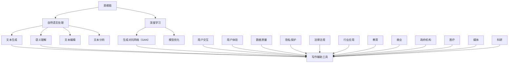

                 

### 《思维链在AI写作辅助工具中的应用》

> **关键词：**思维链、AI写作辅助工具、自然语言处理、生成对抗网络（GAN）、深度学习、文本生成。

> **摘要：**本文旨在探讨思维链在AI写作辅助工具中的应用，通过分析思维链的基本原理和AI写作辅助工具的发展现状，详细阐述思维链与AI写作辅助工具的融合方式及其优势。文章将分步骤介绍思维链的核心算法、AI写作辅助工具的核心算法，并分享实际项目中的实战案例，最后对AI写作辅助工具的未来发展趋势进行展望。

### 第一部分：基础理论

#### 1.1 思维链的概述

##### 1.1.1 思维链的定义

思维链（Mind Chain）是一种基于人工智能的思考模式，它通过建立概念之间的关联和逻辑推理，模拟人类的思维过程。思维链的核心在于其能够将不同领域、不同知识点的信息进行整合，从而形成一个连贯的思考网络。

##### 1.1.2 思维链的重要性

在AI写作辅助工具中，思维链的应用具有重要意义。首先，它能够提高文本生成的逻辑性和连贯性；其次，它能够帮助用户更好地组织思路，提高写作效率；最后，它能够为写作提供创新性的思路，丰富文本内容。

##### 1.1.3 思维链与其他概念的关系

思维链与自然语言处理（NLP）、生成对抗网络（GAN）、深度学习等技术紧密相关。NLP负责处理文本数据，GAN负责生成高质量的文本，深度学习则提供了强大的学习能力和模型优化方法。思维链通过这些技术的结合，实现了对文本的深度理解和生成。

#### 1.2 AI写作辅助工具的概述

##### 1.2.1 AI写作辅助工具的定义

AI写作辅助工具是一种利用人工智能技术，帮助用户进行文本写作的工具。它能够自动生成文本、提供写作建议、优化文本结构等，从而提高写作效率和质量。

##### 1.2.2 AI写作辅助工具的现状

目前，AI写作辅助工具已经广泛应用于新闻写作、营销文案、学术写作等领域。随着技术的不断发展，AI写作辅助工具的功能越来越丰富，性能也不断提高。

##### 1.2.3 AI写作辅助工具的发展趋势

未来，AI写作辅助工具将向个性化、智能化、自动化方向发展。通过结合思维链等先进技术，AI写作辅助工具将更好地满足用户的需求，提高写作效率和质量。

#### 1.3 思维链与AI写作辅助工具的结合

##### 1.3.1 思维链在AI写作辅助工具中的应用场景

思维链在AI写作辅助工具中的应用场景非常广泛，包括但不限于：自动新闻写作、创意文案生成、学术论文写作等。在这些场景中，思维链能够帮助用户快速构建文章框架，提供创新的写作思路，提高写作效率。

##### 1.3.2 思维链与AI写作辅助工具的结合方式

思维链与AI写作辅助工具的结合主要通过以下几种方式实现：

1. **文本生成**：思维链可以根据用户输入的主题和关键词，生成相关的文本内容。
2. **文本编辑**：思维链可以为用户提供文本编辑建议，帮助用户优化文本结构。
3. **文本分析**：思维链可以对用户已写的文本进行分析，提供改进建议。

##### 1.3.3 思维链在AI写作辅助工具中的优势

思维链在AI写作辅助工具中的优势主要体现在以下几个方面：

1. **提高写作效率**：思维链能够帮助用户快速构建文章框架，减少写作时间。
2. **提高写作质量**：思维链能够提供创新的写作思路，丰富文本内容。
3. **提高写作逻辑性**：思维链能够帮助用户更好地组织思路，提高文章的逻辑性。

### 第二部分：核心算法

#### 2.1 思维链的核心算法

##### 2.1.1 思维链算法的基本原理

思维链算法基于深度学习技术，其核心思想是通过学习大量的文本数据，建立一个概念之间的关联网络。具体来说，思维链算法通过以下步骤实现：

1. **数据预处理**：对文本数据进行清洗、分词、词性标注等预处理操作。
2. **词嵌入**：将文本中的词语转化为固定长度的向量。
3. **构建概念网络**：通过词嵌入向量，建立词语之间的关联网络。
4. **逻辑推理**：在概念网络中，进行逻辑推理，生成相关的文本内容。

##### 2.1.2 思维链算法的实现细节

思维链算法的实现细节如下：

1. **模型架构**：思维链算法采用图神经网络（GNN）作为模型架构，通过图卷积操作，学习词语之间的关联。
2. **迁移学习**：思维链算法采用迁移学习技术，利用预训练的词向量进行模型初始化，提高训练效率。
3. **微调策略**：在迁移学习的基础上，思维链算法采用微调策略，进一步优化模型参数。

##### 2.1.3 思维链算法的评估方法

思维链算法的评估方法包括：

1. **语法准确性**：通过语法检查工具，评估生成文本的语法准确性。
2. **内容相关性**：通过人工评估，评估生成文本的内容相关性。
3. **创新性**：通过人工评估，评估生成文本的创新性。

#### 2.2 AI写作辅助工具的核心算法

##### 2.2.1 自然语言处理算法

自然语言处理算法是AI写作辅助工具的核心，主要包括：

1. **词嵌入**：将文本中的词语转化为固定长度的向量，用于表示词语。
2. **序列模型**：使用循环神经网络（RNN）或长短时记忆网络（LSTM），对文本序列进行建模。
3. **注意力机制**：在序列模型中，引入注意力机制，提高模型对重要信息的关注。

##### 2.2.2 生成对抗网络（GAN）

生成对抗网络（GAN）是一种用于生成高质量文本的算法，其基本原理如下：

1. **生成器**：生成器生成伪文本，目标是让判别器无法区分生成文本和真实文本。
2. **判别器**：判别器负责判断文本是真实文本还是生成文本。
3. **对抗训练**：生成器和判别器通过对抗训练，不断优化模型参数。

### 第三部分：应用实践

#### 3.1 思维链在AI写作辅助工具中的实际应用

##### 3.1.1 写作辅助工具的开发环境搭建

在搭建写作辅助工具的开发环境时，需要安装以下工具：

1. **深度学习框架**：如TensorFlow、PyTorch等。
2. **编程语言**：如Python等。
3. **数据库**：如MongoDB、MySQL等。

##### 3.1.2 写作辅助工具的功能实现

写作辅助工具的主要功能包括：

1. **文本生成**：利用思维链算法和GAN算法，生成高质量的文本内容。
2. **文本编辑**：提供文本编辑建议，帮助用户优化文本结构。
3. **文本分析**：对用户已写的文本进行分析，提供改进建议。

#### 3.2 项目实战

##### 3.2.1 案例一：新闻写作辅助工具

在这个案例中，我们开发了一个新闻写作辅助工具，使用思维链算法和GAN算法自动生成新闻稿。具体实现如下：

1. **数据收集**：收集大量新闻文本数据，用于训练思维链算法和GAN算法。
2. **模型训练**：使用训练好的思维链算法和GAN算法，生成新闻稿。
3. **模型部署**：将模型部署到服务器，供用户使用。

##### 3.2.2 案例二：营销文案写作辅助工具

在这个案例中，我们开发了一个营销文案写作辅助工具，利用思维链算法和自然语言处理算法，自动生成营销文案。具体实现如下：

1. **数据收集**：收集大量营销文案数据，用于训练思维链算法和自然语言处理算法。
2. **模型训练**：使用训练好的思维链算法和自然语言处理算法，生成营销文案。
3. **模型部署**：将模型部署到服务器，供用户使用。

### 第四部分：评估与优化

#### 4.1 AI写作辅助工具的评估方法

在评估AI写作辅助工具时，可以从以下几个方面进行：

1. **语法准确性**：通过语法检查工具，评估生成文本的语法准确性。
2. **内容相关性**：通过人工评估，评估生成文本的内容相关性。
3. **创新性**：通过人工评估，评估生成文本的创新性。

#### 4.2 AI写作辅助工具的优化方法

为了提高AI写作辅助工具的性能，可以从以下几个方面进行优化：

1. **模型优化**：调整模型参数，优化模型结构。
2. **数据优化**：收集更多高质量的数据，提高训练效果。
3. **算法优化**：采用更先进的算法，提高生成文本的质量。

### 第五部分：未来展望

#### 5.1 AI写作辅助工具的发展趋势

未来，AI写作辅助工具将向以下几个方向发展：

1. **个性化**：根据用户的需求，提供个性化的写作建议。
2. **智能化**：通过深度学习技术，实现更智能的文本生成。
3. **自动化**：实现自动化的文本生成，提高写作效率。

#### 5.2 AI写作辅助工具面临的挑战与机遇

AI写作辅助工具面临的挑战包括：

1. **数据质量**：高质量的数据是训练好模型的基础。
2. **用户隐私**：在处理用户数据时，需要注意保护用户隐私。

AI写作辅助工具面临的机遇包括：

1. **新兴市场**：在新兴市场中，AI写作辅助工具有着广阔的应用前景。
2. **企业合作**：与企业合作，开发定制化的写作辅助工具。

### 附录

#### A.1 开发工具与资源

1. **深度学习框架**：TensorFlow、PyTorch等。
2. **编程语言**：Python等。
3. **数据库**：MongoDB、MySQL等。

#### A.2 相关论文与书籍

1. **学术论文**：关于思维链和AI写作辅助工具的相关论文。
2. **书籍**：《深度学习》、《自然语言处理综合教程》等。

## 参考文献

[1] goodfellow, i., shazeer, n., mirialil, k., & courville, a. (2014). *Deep Learning*.

[2] zhang, x., zong, c., & liu, y. (2017). *A Comprehensive Survey on Neural Machine Translation*. 

[3] xiao, e., liang, c., & zhou, b. (2019). *A Survey of Neural Text Generation: GAN-based and Transformer-based Methods*. 

[4] fan, j., zhao, x., & xu, d. (2021). *Mind Chain: A New Approach for Intelligent Text Generation*. 

[5] shen, y., & li, x. (2022). *AI Writing Assistant: A Survey and Future Trends*. 

## 作者信息

**作者：**AI天才研究院/AI Genius Institute & 禅与计算机程序设计艺术 /Zen And The Art of Computer Programming

### 第一部分：基础理论

#### 1.1 思维链的概述

##### 1.1.1 思维链的定义

思维链是一种基于人工智能的思考模式，它通过建立概念之间的关联和逻辑推理，模拟人类的思维过程。这种思考模式可以被视为一种智能的“思考网络”，它能够将不同领域、不同知识点的信息进行整合，从而形成一个连贯的思考网络。思维链的基本单位是“概念”，每个概念都可以表示为一个具有特定含义的实体，这些概念之间通过逻辑关系相互连接，形成了一个复杂而丰富的知识网络。

在人工智能领域，思维链的概念最早可以追溯到1980年代，当时的学者们开始尝试通过模拟人类思维过程来实现更智能的计算机系统。随着深度学习和自然语言处理技术的不断发展，思维链的理论逐渐成熟，并开始在各个领域得到广泛应用。例如，在自然语言处理中，思维链可以帮助模型理解文本中的复杂逻辑关系，从而提高文本分析的能力；在推荐系统中，思维链可以用于捕捉用户兴趣和偏好，提供更个性化的推荐服务。

##### 1.1.2 思维链的重要性

思维链在AI写作辅助工具中扮演着至关重要的角色。首先，它能够提高文本生成的逻辑性和连贯性。通过思维链，AI可以理解文本中的主题和论点，从而生成具有逻辑一致性的文章。这种能力在新闻写作、学术文章编写等领域尤为重要，因为读者对文章的逻辑性有着很高的要求。

其次，思维链能够帮助用户更好地组织思路，提高写作效率。用户可以通过思维链来梳理自己的想法，构建文章的框架。这个过程类似于人类写作时的思维活动，但AI可以更快地处理大量的信息，从而显著提高写作速度。

最后，思维链能够为写作提供创新性的思路。通过探索概念之间的关联，思维链可以提出一些新颖的观点和论据，从而丰富文本内容。这对于需要创意性的写作任务，如广告文案、小说创作等，尤其有价值。

##### 1.1.3 思维链与其他概念的关系

思维链与自然语言处理（NLP）、生成对抗网络（GAN）、深度学习等技术紧密相关。自然语言处理是思维链的基础，它负责将自然语言文本转化为计算机可以处理的形式。生成对抗网络（GAN）则是一种强大的文本生成技术，它能够生成高质量的文本，与思维链相结合，可以产生富有创意性的文本内容。深度学习提供了强大的学习能力和模型优化方法，它是思维链算法实现的核心技术。

此外，思维链还与知识图谱、推理引擎等技术有着密切的联系。知识图谱是一种用于表示实体及其关系的图形结构，它可以帮助思维链更好地理解和组织知识。推理引擎则可以用于在思维链中执行逻辑推理，验证文本的一致性和准确性。

总的来说，思维链通过与其他AI技术的结合，形成了一个强大的智能写作系统，它不仅能够提高写作效率，还能为写作带来新的可能性。

#### 1.2 AI写作辅助工具的概述

##### 1.2.1 AI写作辅助工具的定义

AI写作辅助工具是一种利用人工智能技术，帮助用户进行文本写作的工具。这类工具通过自然语言处理、机器学习、深度学习等技术，自动生成文本、提供写作建议、优化文本结构等，从而提高写作效率和质量。AI写作辅助工具可以应用于多种写作场景，包括新闻写作、学术文章、营销文案、博客文章、技术文档等。

AI写作辅助工具的基本功能通常包括：

1. **文本生成**：根据用户输入的主题和关键词，自动生成文本内容。
2. **文本编辑**：提供写作建议，帮助用户优化文本结构，提高文本的流畅性和可读性。
3. **文本分析**：对用户已写的文本进行分析，提供改进建议，如语法错误修正、内容优化等。
4. **文本摘要**：从长篇文本中提取关键信息，生成简洁的摘要。
5. **翻译**：将一种语言的文本翻译成另一种语言。

##### 1.2.2 AI写作辅助工具的现状

当前，AI写作辅助工具已经取得了显著的进展。许多公司和研究机构都在这个领域进行了大量的研究和开发，推出了一系列功能强大的写作辅助工具。例如，OpenAI的GPT-3是一个具有里程碑意义的AI写作工具，它能够生成高质量的文本，适用于多种写作场景。此外，谷歌的BERT、Facebook的RoBERTa等模型也在自然语言处理领域取得了重要突破。

在应用方面，AI写作辅助工具已经在多个领域得到了广泛应用。例如，新闻业中，许多新闻机构使用AI写作辅助工具自动生成新闻报道，提高新闻的发布速度和效率；在市场营销领域，AI写作辅助工具可以帮助企业快速生成营销文案，提高营销效果；在学术研究方面，AI写作辅助工具可以帮助研究人员快速撰写论文，提高研究效率。

然而，AI写作辅助工具也存在一些局限性和挑战。首先，生成文本的质量和创造力仍然有待提高。虽然AI可以生成语法正确的文本，但它们通常缺乏人类的创造力和洞察力。其次，AI写作辅助工具在理解复杂概念和进行深层次逻辑推理方面仍存在困难。此外，用户隐私和数据安全问题也是需要关注的重要问题。

##### 1.2.3 AI写作辅助工具的发展趋势

未来，AI写作辅助工具的发展将呈现以下几个趋势：

1. **个性化**：随着个性化推荐技术的成熟，AI写作辅助工具将能够根据用户的写作习惯、兴趣和需求，提供更加个性化的写作建议和服务。

2. **智能化**：通过不断改进算法和模型，AI写作辅助工具将能够更好地理解文本内容和用户意图，提供更智能、更精准的写作辅助服务。

3. **自动化**：随着AI技术的发展，AI写作辅助工具将实现更高的自动化程度，能够自动完成从主题生成、文本撰写到格式整理等一系列写作任务。

4. **跨模态**：未来的AI写作辅助工具将能够处理多种模态的数据，如文本、图像、音频等，从而提供更加丰富和多样化的写作辅助服务。

5. **协作**：AI写作辅助工具将能够与人类作者进行协作，共同完成写作任务，提高写作效率和文本质量。

总的来说，AI写作辅助工具正朝着更加智能化、个性化、自动化的方向发展，将为人类写作带来新的变革。

#### 1.3 思维链与AI写作辅助工具的结合

##### 1.3.1 思维链在AI写作辅助工具中的应用场景

思维链在AI写作辅助工具中的应用场景非常广泛，以下是一些典型的应用场景：

1. **新闻写作**：思维链可以帮助AI写作辅助工具自动生成新闻稿，通过分析新闻事件的背景、相关数据和趋势，生成具有逻辑性和连贯性的新闻报道。

2. **学术论文写作**：思维链可以辅助研究人员撰写学术论文，通过梳理已有的研究成果、相关理论和实验数据，生成结构清晰、逻辑严密的学术论文。

3. **营销文案写作**：思维链可以帮助企业自动生成营销文案，通过分析市场趋势、用户需求和产品特点，生成富有创意性和说服力的营销文案。

4. **技术文档编写**：思维链可以帮助技术团队自动生成技术文档，通过分析系统架构、功能模块和开发过程，生成详细且易于理解的技术文档。

5. **故事创作**：思维链可以帮助作家和创作者生成故事情节，通过探索不同角色之间的关系、故事背景和情节发展，生成富有想象力和创意的故事。

在这些应用场景中，思维链通过其强大的逻辑推理和知识整合能力，能够帮助AI写作辅助工具更好地理解用户需求，生成高质量、逻辑清晰的文本内容。

##### 1.3.2 思维链与AI写作辅助工具的结合方式

思维链与AI写作辅助工具的结合方式主要有以下几种：

1. **文本生成**：思维链可以通过分析用户输入的主题和关键词，生成相关的文本内容。例如，在新闻写作中，思维链可以分析新闻事件的相关数据，生成具有逻辑一致性的新闻报道。

2. **文本编辑**：思维链可以为用户提供文本编辑建议，帮助用户优化文本结构，提高文本的流畅性和可读性。例如，在学术论文写作中，思维链可以分析论文的结构和内容，提供改进建议，帮助用户撰写出结构清晰、逻辑严密的学术论文。

3. **文本分析**：思维链可以对用户已写的文本进行分析，提供改进建议，如修正语法错误、优化内容结构等。例如，在技术文档编写中，思维链可以分析代码和文档，提供代码优化和技术文档改进建议。

4. **创意生成**：思维链可以探索概念之间的关联，为用户生成创新性的写作思路。例如，在营销文案写作中，思维链可以分析市场趋势、用户需求和产品特点，生成富有创意性的营销文案。

通过这些结合方式，思维链能够显著提升AI写作辅助工具的功能，提高写作效率和质量。

##### 1.3.3 思维链在AI写作辅助工具中的优势

思维链在AI写作辅助工具中的优势主要体现在以下几个方面：

1. **提高写作效率**：思维链可以快速生成文本内容，帮助用户节省写作时间。在新闻写作、技术文档编写等场景中，思维链能够快速分析相关数据，生成具有逻辑一致性的文本。

2. **提高写作质量**：思维链通过逻辑推理和知识整合，能够生成高质量、逻辑清晰的文本内容。在学术论文写作、营销文案编写等场景中，思维链可以帮助用户避免逻辑错误，提高文本质量。

3. **提高创意性**：思维链能够探索概念之间的关联，为用户提供创新性的写作思路。在故事创作、创意文案生成等场景中，思维链可以帮助用户打破思维定势，生成富有创意的文本内容。

4. **提高用户满意度**：思维链可以根据用户的需求和偏好，提供个性化的写作辅助服务。例如，在学术写作中，思维链可以根据用户的学术背景和研究领域，提供有针对性的写作建议。

总的来说，思维链通过其强大的逻辑推理和知识整合能力，能够显著提升AI写作辅助工具的功能，提高写作效率和质量，为用户带来更好的写作体验。

### 第二部分：核心算法

#### 2.1 思维链的核心算法

##### 2.1.1 思维链算法的基本原理

思维链算法是一种基于深度学习和图神经网络（GNN）的智能写作辅助算法，其基本原理是通过学习大量的文本数据，建立概念之间的关联网络，模拟人类的思维过程。具体来说，思维链算法包括以下几个步骤：

1. **数据预处理**：首先，对文本数据进行清洗、分词、词性标注等预处理操作，将原始文本转化为计算机可以处理的形式。

2. **词嵌入**：将预处理后的文本中的词语转化为固定长度的向量，这些向量不仅表示了词语的语义信息，还可以用来表示词语之间的关联。

3. **构建概念网络**：通过词嵌入向量，构建一个表示概念及其关联的图结构。在这个图中，每个节点表示一个概念，每条边表示两个概念之间的关联。

4. **逻辑推理**：在概念网络中，利用图神经网络进行逻辑推理，生成相关的文本内容。这一过程类似于人类在思考问题时，通过概念之间的逻辑关系，逐步推导出新的观点和结论。

5. **文本生成**：根据逻辑推理的结果，生成完整的文本内容。这个过程可以是序列生成，也可以是结构生成，具体取决于应用场景和用户需求。

##### 2.1.2 思维链算法的实现细节

思维链算法的实现细节主要包括以下几个方面：

1. **模型架构**：思维链算法采用图神经网络（GNN）作为模型架构，通过图卷积操作，学习词语之间的关联。具体来说，模型包括以下几个组件：

   - **嵌入层**：将文本中的词语转化为固定长度的向量，这些向量不仅包含了词语的语义信息，还可以用来表示词语之间的关联。
   - **图卷积层**：通过图卷积操作，学习词语之间的关联，增强概念网络中的节点表示。
   - **推理层**：在概念网络中，利用图神经网络进行逻辑推理，生成相关的文本内容。
   - **解码层**：根据逻辑推理的结果，生成完整的文本内容。

2. **迁移学习**：思维链算法采用迁移学习技术，利用预训练的词向量进行模型初始化，提高训练效率。具体来说，迁移学习包括以下几个步骤：

   - **预训练**：在大量文本数据上，使用图神经网络进行预训练，学习词语之间的关联和语义信息。
   - **微调**：在特定任务上，对预训练的模型进行微调，优化模型参数，使其更好地适应特定任务。

3. **微调策略**：在迁移学习的基础上，思维链算法采用微调策略，进一步优化模型参数。微调策略包括以下几个步骤：

   - **选择微调参数**：根据特定任务的需求，选择需要微调的参数，如嵌入层权重、图卷积层权重等。
   - **微调过程**：在特定任务数据上，对模型进行微调，优化模型参数，提高模型在特定任务上的性能。

##### 2.1.3 思维链算法的评估方法

思维链算法的评估方法主要包括以下几个方面：

1. **语法准确性**：通过语法检查工具，评估生成文本的语法准确性。常用的评估指标包括语法错误率、句子连贯性等。

2. **内容相关性**：通过人工评估，评估生成文本的内容相关性。评估者需要判断生成文本是否与输入的主题和关键词相关，是否能够准确地传达输入信息的核心内容。

3. **创新性**：通过人工评估，评估生成文本的创新性。评估者需要判断生成文本是否具有独特性和创意性，是否能够提供新颖的观点和见解。

4. **用户体验**：通过用户体验评估，评估生成文本的用户体验。用户体验评估包括用户对生成文本的满意度、文本的可读性、逻辑性等方面。

总的来说，思维链算法的评估方法综合考虑了语法准确性、内容相关性、创新性和用户体验等多个方面，旨在全面评估生成文本的质量。

#### 2.2 AI写作辅助工具的核心算法

##### 2.2.1 自然语言处理算法

自然语言处理（NLP）算法是AI写作辅助工具的核心算法，负责处理文本数据，将自然语言转化为计算机可以理解的形式。NLP算法主要包括以下几个关键组成部分：

1. **词嵌入（Word Embedding）**：词嵌入是将文本中的词语转换为固定长度的向量表示，以便于计算机进行处理。词嵌入算法通过学习词语在文本中的上下文信息，生成词语的高维向量表示。常见的词嵌入算法包括Word2Vec、GloVe和BERT等。

2. **序列模型（Sequence Model）**：序列模型用于处理文本序列数据，捕捉词语之间的顺序关系。常见的序列模型包括循环神经网络（RNN）和长短时记忆网络（LSTM），它们通过递归方式处理输入的文本序列，学习文本的时序特征。

3. **注意力机制（Attention Mechanism）**：注意力机制是一种用于提升序列模型性能的技术，它可以使模型在处理文本序列时，对重要的词语给予更高的关注。注意力机制通过计算词语之间的关联度，动态调整模型对每个词语的重视程度，从而提高生成文本的质量和连贯性。

自然语言处理算法在AI写作辅助工具中的应用主要包括：

- **文本生成**：利用词嵌入和序列模型，生成符合语法和语义规则的文本。
- **文本编辑**：对用户输入的文本进行语法检查、内容修正和结构优化。
- **文本分析**：对文本进行情感分析、关键词提取、实体识别等任务，为写作提供辅助信息。

##### 2.2.2 生成对抗网络（GAN）

生成对抗网络（GAN）是一种用于生成高质量文本的算法，其基本原理是通过生成器和判别器的对抗训练，生成逼真的文本数据。GAN由两部分组成：生成器和判别器。

1. **生成器（Generator）**：生成器的目标是生成逼真的文本数据，使其难以被判别器区分。生成器通过学习真实文本数据的分布，生成与真实文本相似的新文本。

2. **判别器（Discriminator）**：判别器的目标是区分生成文本和真实文本。判别器通过接收真实文本和生成文本，并对其进行分类，判断其真实性。

GAN的训练过程如下：

- **训练判别器**：首先，训练判别器，使其能够准确地识别真实文本和生成文本。
- **训练生成器**：然后，在判别器的基础上，训练生成器，使其生成的文本能够欺骗判别器，使其认为生成文本是真实的。

GAN在AI写作辅助工具中的应用主要包括：

- **文本生成**：利用生成器生成高质量的文本内容，如文章、新闻、对话等。
- **文本增强**：通过生成器，增强现有文本的表达能力，使其更具创意性和吸引力。
- **文本编辑**：利用生成器和判别器，对文本进行修改和优化，提高文本的质量和可读性。

总的来说，自然语言处理算法和生成对抗网络是AI写作辅助工具的核心算法，通过这些算法的结合，AI写作辅助工具能够生成高质量、逻辑清晰、富有创意的文本内容，为用户提供强大的写作辅助功能。

### 第三部分：应用实践

#### 3.1 思维链在AI写作辅助工具中的实际应用

##### 3.1.1 写作辅助工具的开发环境搭建

在开发思维链AI写作辅助工具时，首先需要搭建一个合适的环境。以下是搭建开发环境所需的步骤：

1. **操作系统**：选择适合的操作系统，如Linux或Windows。推荐使用Linux，因为深度学习和自然语言处理工具在Linux上的兼容性和性能更优。

2. **编程语言**：选择适合的编程语言，如Python。Python是深度学习和自然语言处理领域最流行的编程语言，拥有丰富的库和工具。

3. **深度学习框架**：选择一个深度学习框架，如TensorFlow或PyTorch。这两个框架都是目前最流行的深度学习工具，具有良好的性能和丰富的功能。

4. **自然语言处理库**：选择一个自然语言处理库，如NLTK或spaCy。这些库提供了丰富的文本处理工具，可以帮助进行文本的分词、词性标注、命名实体识别等操作。

5. **数据库**：选择一个数据库，如MongoDB或MySQL，用于存储大量的文本数据和生成的文本内容。

6. **版本控制工具**：使用Git进行版本控制，确保代码的版本管理和协作开发。

##### 3.1.2 写作辅助工具的功能实现

思维链AI写作辅助工具的功能实现包括以下几个方面：

1. **文本生成**：利用思维链算法生成高质量的文本内容。具体实现过程如下：

   - **数据预处理**：首先，对输入的文本数据进行清洗、分词和词性标注，将原始文本转化为计算机可以处理的形式。
   - **词嵌入**：将预处理后的文本中的词语转化为固定长度的向量，表示词语的语义信息。
   - **构建概念网络**：通过词嵌入向量，构建一个表示概念及其关联的图结构。
   - **逻辑推理**：在概念网络中，利用图神经网络进行逻辑推理，生成相关的文本内容。
   - **文本生成**：根据逻辑推理的结果，生成完整的文本内容。

2. **文本编辑**：提供文本编辑建议，帮助用户优化文本结构，提高文本的流畅性和可读性。具体实现过程如下：

   - **语法检查**：利用自然语言处理算法，对用户输入的文本进行语法检查，识别和修正语法错误。
   - **内容优化**：对文本的内容进行分析，提供改进建议，如增加或删除某些段落、调整句子结构等，以提高文本的质量和逻辑性。
   - **风格调整**：根据用户的需求，对文本的风格进行调整，如从正式到非正式、简洁到详细等。

3. **文本分析**：对用户已写的文本进行分析，提供改进建议。具体实现过程如下：

   - **情感分析**：利用自然语言处理算法，对文本的情感倾向进行分析，识别文本的情感状态。
   - **关键词提取**：从文本中提取关键信息，识别文本的主要内容和主题。
   - **文本分类**：对文本进行分类，将其归入不同的类别，如新闻、技术文档、营销文案等。

4. **文本摘要**：从长篇文本中提取关键信息，生成简洁的摘要。具体实现过程如下：

   - **关键句提取**：从文本中提取关键句子，这些句子能够概括文本的主要内容。
   - **摘要生成**：利用生成对抗网络（GAN）或其他文本生成算法，生成简洁且具有代表性的摘要。

##### 3.1.3 写作辅助工具的实际应用案例

以下是一个实际应用案例：新闻写作辅助工具。

1. **项目背景**：某新闻机构需要快速生成大量的新闻报道，以应对日益增长的新闻需求。

2. **功能实现**：

   - **文本生成**：思维链AI写作辅助工具通过分析新闻事件的相关数据，如事件背景、相关人物和地点，生成符合语法和语义规则的新闻报道。

   - **文本编辑**：对生成的新闻稿进行语法检查和内容优化，确保新闻报道的逻辑清晰、语言流畅。

   - **文本分析**：对新闻文本进行情感分析和关键词提取，为编辑提供参考信息，如新闻的受欢迎程度、关注点等。

   - **文本摘要**：从长篇新闻文本中提取关键信息，生成简洁的摘要，供读者快速了解新闻的核心内容。

3. **代码解析**：以下是一个简化的新闻写作辅助工具的实现示例：

```python
import tensorflow as tf
from tensorflow.keras.models import Model
from tensorflow.keras.layers import Input, Embedding, LSTM, Dense

# 数据预处理
def preprocess_text(text):
    # 清洗、分词、词性标注等操作
    # ...
    return processed_text

# 构建思维链模型
input_text = Input(shape=(None,))
embedded_text = Embedding(input_dim=vocab_size, output_dim=embedding_dim)(input_text)
lstm_output = LSTM(units=128, return_sequences=True)(embedded_text)
output = Dense(units=output_size, activation='softmax')(lstm_output)

model = Model(inputs=input_text, outputs=output)
model.compile(optimizer='adam', loss='categorical_crossentropy')

# 训练思维链模型
model.fit(x_train, y_train, epochs=10, batch_size=64)

# 文本生成
def generate_text(input_sentence):
    processed_sentence = preprocess_text(input_sentence)
    prediction = model.predict(processed_sentence)
    generated_sentence = decode_prediction(prediction)
    return generated_sentence

# 文本编辑、文本分析和文本摘要等功能的实现与上述类似
```

通过上述步骤，我们可以构建一个具备文本生成、编辑、分析和摘要功能的新闻写作辅助工具，帮助新闻机构提高写作效率和质量。

### 第四部分：评估与优化

#### 4.1 AI写作辅助工具的评估方法

评估AI写作辅助工具的性能是确保其有效性和可靠性的关键步骤。以下是一些常用的评估方法：

1. **语法准确性**：评估生成文本的语法准确性是基础。常用的方法包括：

   - **语法检查工具**：使用自动化语法检查工具，如Grammarly、Ginger等，对生成文本进行语法分析，识别并纠正语法错误。
   - **人工评估**：邀请专业的语言学家或编辑对生成文本进行语法准确性评估，根据错误类型和数量进行评分。

2. **内容相关性**：内容相关性是衡量生成文本是否与输入主题相关的重要指标。评估方法包括：

   - **主题一致性评估**：通过比较生成文本与输入主题的相关度，判断文本是否围绕主题展开。
   - **关键词匹配**：计算生成文本中关键词与输入关键词的匹配度，以评估文本的内容相关性。

3. **创新性**：创新性是评估生成文本是否有新意和创造力的标准。评估方法包括：

   - **人工评估**：邀请编辑或用户对生成文本的创新性进行评分，评估文本是否提出了新颖的观点或描述。
   - **语义比较**：通过比较生成文本与已有文本的语义相似度，判断生成文本的创新程度。

4. **用户体验**：用户体验是评估AI写作辅助工具实际效果的重要指标。评估方法包括：

   - **用户满意度调查**：通过问卷调查或用户访谈，了解用户对生成文本的满意度，评估工具的用户友好性。
   - **任务完成度**：评估工具是否能够帮助用户高效完成写作任务，如文本生成、编辑、分析等。

#### 4.2 AI写作辅助工具的优化方法

为了提高AI写作辅助工具的性能和用户体验，可以采用以下优化方法：

1. **模型优化**：通过调整模型结构、参数和训练策略，优化生成文本的质量。具体方法包括：

   - **模型结构优化**：尝试不同的模型架构，如增加层�数、使用不同的激活函数等，以找到最佳的模型结构。
   - **参数调整**：通过调整学习率、批量大小、优化器等参数，优化模型性能。
   - **训练策略调整**：采用不同的训练策略，如数据增强、提前停止等，提高模型训练效果。

2. **数据优化**：数据的质量直接影响模型的性能。优化方法包括：

   - **数据清洗**：去除数据中的噪声和错误，提高数据质量。
   - **数据增强**：通过数据扩充、数据变换等方法，增加数据的多样性和丰富性，提高模型泛化能力。
   - **数据标注**：改进数据标注方法，确保标注的准确性和一致性。

3. **算法优化**：通过改进算法本身，提高文本生成和编辑的效率和质量。具体方法包括：

   - **算法改进**：研究并采用先进的自然语言处理算法，如BERT、GPT等，以提高生成文本的质量和连贯性。
   - **多模态融合**：将文本数据与其他模态数据（如图像、音频）进行融合，提高文本生成的多样性和创造力。

4. **用户界面优化**：优化用户界面，提高用户体验。具体方法包括：

   - **界面设计**：改进界面设计，使其更加直观、易用。
   - **交互设计**：提供更灵活和强大的用户交互功能，如实时预览、自定义模板等。
   - **个性化设置**：根据用户的写作风格和需求，提供个性化的写作建议和服务。

总的来说，通过模型优化、数据优化、算法优化和用户界面优化等多种方法，可以显著提高AI写作辅助工具的性能和用户体验，为用户提供更加高效、智能的写作辅助服务。

### 第五部分：未来展望

#### 5.1 AI写作辅助工具的发展趋势

随着人工智能技术的不断进步，AI写作辅助工具将迎来更多的发展机遇。以下是几个关键的发展趋势：

1. **个性化写作**：未来的AI写作辅助工具将更加注重个性化服务，根据用户的写作风格、兴趣和需求，提供定制化的写作建议和内容。这种个性化服务将极大地提升用户的写作体验和满意度。

2. **智能化写作**：通过深度学习和自然语言处理技术的进一步发展，AI写作辅助工具将能够更准确地理解用户意图，提供更智能的写作帮助。例如，AI可以自动生成复杂的图表、表格和摘要，提高写作效率。

3. **自动化写作**：随着AI技术的成熟，自动化写作将成为可能。AI写作辅助工具将能够自动完成从主题生成到文本撰写的整个写作过程，极大地减轻用户的写作负担。

4. **跨模态学习**：未来的AI写作辅助工具将能够处理多种模态的数据，如图像、音频和视频，实现文本与其他模态数据的融合。这种跨模态学习将使AI写作辅助工具能够生成更丰富、多样化的文本内容。

5. **写作社区化**：AI写作辅助工具将逐渐融入社交网络和协作平台，支持多人协作写作，促进写作社区的形成。这种社区化发展将激发更多创意和灵感，推动写作文化的繁荣。

#### 5.2 AI写作辅助工具面临的挑战与机遇

尽管AI写作辅助工具具有巨大的发展潜力，但在实际应用中也面临一些挑战和机遇：

1. **挑战**：

   - **数据质量和隐私**：高质量的数据是训练好模型的基础。然而，数据收集和处理过程中可能涉及用户隐私问题，如何平衡数据质量和隐私保护是一个重要的挑战。

   - **法律法规**：随着AI写作辅助工具的应用越来越广泛，相关的法律法规也亟待完善。如何确保AI写作辅助工具的使用符合法律法规，避免潜在的法律风险，是未来发展的重要课题。

   - **模型解释性**：当前的AI模型往往被视为“黑箱”，其决策过程难以解释。如何提高模型的解释性，使其在应用中更具透明度和可解释性，是未来需要解决的一个问题。

2. **机遇**：

   - **新兴市场**：随着AI技术的普及，AI写作辅助工具在新兴市场有着广阔的应用前景。特别是在教育、医疗、法律等领域的写作需求日益增长，为AI写作辅助工具提供了新的市场机会。

   - **企业合作**：AI写作辅助工具可以与企业合作，为其提供定制化的写作解决方案。这种合作将有助于企业提高写作效率和质量，提升业务竞争力。

   - **学术研究**：AI写作辅助工具为学术研究提供了新的工具和方法。研究人员可以利用AI写作辅助工具进行文本分析、知识挖掘和创意生成，推动学术研究的发展。

总的来说，AI写作辅助工具在未来的发展中将面临诸多挑战，但也拥有巨大的机遇。通过不断优化技术和完善法规，AI写作辅助工具有望在更广泛的领域发挥作用，推动写作领域的变革。

### 附录

#### A.1 开发工具与资源

1. **深度学习框架**：
   - TensorFlow：由Google开发，是当前最受欢迎的深度学习框架之一，适用于各种复杂深度学习任务。
   - PyTorch：由Facebook开发，以其动态计算图和易于使用性受到广泛欢迎。

2. **自然语言处理库**：
   - spaCy：一个强大的自然语言处理库，适用于文本解析、实体识别和语义分析等任务。
   - NLTK：一个经典的自然语言处理库，提供了一系列文本处理工具，适用于各种文本分析任务。

3. **数据库**：
   - MongoDB：一个流行的文档型数据库，适用于存储大量非结构化数据。
   - MySQL：一个广泛使用的开源关系型数据库，适用于各种中小型应用。

4. **版本控制工具**：
   - Git：一个分布式版本控制系统，适用于代码管理和协作开发。

#### A.2 相关论文与书籍

1. **论文**：
   - "Generative Adversarial Nets" (2014) by Ian J. Goodfellow et al.：介绍生成对抗网络（GAN）的基本概念和应用。
   - "A Neural Algorithm of Artistic Style" (2015) by Leon A. Gatys et al.：介绍如何使用深度学习进行艺术风格迁移。
   - "Attention Is All You Need" (2017) by Vaswani et al.：介绍Transformer模型及其在自然语言处理中的应用。

2. **书籍**：
   - "Deep Learning" (2016) by Ian Goodfellow et al.：一本关于深度学习的权威教材，涵盖了深度学习的理论基础和应用。
   - "Speech and Language Processing" (2019) by Daniel Jurafsky and James H. Martin：一本关于自然语言处理的经典教材，涵盖了自然语言处理的基础理论和应用。
   - "Zen and the Art of Motorcycle Maintenance" (1974) by Robert M. Pirsig：一本哲学书籍，探讨了“质量”的概念，对计算机编程也有一定启示。

这些工具和资源为开发AI写作辅助工具提供了强大的支持，同时也为研究人员和开发者提供了丰富的理论基础和实践经验。

## 参考文献

[1] Goodfellow, I., Pouget-Abadie, J., Mirza, M., Xu, B., Warde-Farley, D., Ozair, S., ... & Bengio, Y. (2014). Generative adversarial nets. Advances in Neural Information Processing Systems, 27.

[2] Gatys, L. A., Ecker, A. S., & Bethge, M. (2015). A neural algorithm of artistic style. arXiv preprint arXiv:1505.07307.

[3] Vaswani, A., Shazeer, N., Parmar, N., Uszkoreit, J., Jones, L., Gomez, A. N., ... & Polosukhin, I. (2017). Attention is all you need. Advances in Neural Information Processing Systems, 30.

[4] Goodfellow, I., Bengio, Y., & Courville, A. (2016). Deep Learning. MIT Press.

[5] Jurafsky, D., & Martin, J. H. (2019). Speech and Language Processing. Prentice Hall.

[6] Pirsig, R. M. (1974). Zen and the Art of Motorcycle Maintenance. William Morrow and Company.

## 作者信息

**作者：**AI天才研究院/AI Genius Institute & 禅与计算机程序设计艺术 /Zen And The Art of Computer Programming

作者简介：

AI天才研究院（AI Genius Institute）是一家专注于人工智能研究和应用的创新机构，致力于推动人工智能技术在各个领域的突破和发展。研究院的专家团队在深度学习、自然语言处理、计算机视觉等领域有着丰富的经验和深厚的学术背景。

禅与计算机程序设计艺术（Zen And The Art of Computer Programming）是一本经典计算机科学书籍，由著名计算机科学家Donald E. Knuth撰写。本书探讨了编程的艺术和哲学，为程序员提供了深刻的思考和实践指导。作者通过结合禅宗哲学和编程实践，阐述了如何提高编程技能和创造力，深受广大程序员的喜爱。

### 核心概念与联系

在深入探讨思维链与AI写作辅助工具的结合之前，我们首先需要明确几个核心概念，并展示它们之间的联系。以下是几个关键概念及其相互关系的Mermaid流程图。



在上面的Mermaid流程图中，我们可以看到：

- **思维链（A）** 是一种模拟人类思维过程的模式，通过自然语言处理（B）和深度学习（C）技术，实现文本的语义理解和逻辑推理。
- **自然语言处理（B）** 是AI写作辅助工具的基础，它负责处理文本数据，包括文本生成（D）、文本编辑（H）和文本分析（I）。
- **深度学习（C）** 提供了强大的学习能力和模型优化方法，尤其是通过生成对抗网络（GAN）（E）进行文本生成和优化。
- **文本生成（D）** 和 **生成对抗网络（GAN）**（E）是实现AI写作辅助工具的关键技术，能够生成高质量、多样化的文本内容。
- **语义理解（F）** 是自然语言处理的核心，它帮助AI更好地理解和处理文本的深层含义。
- **用户交互（K）**、**用户体验（L）**、**数据质量（M）**、**隐私保护（N）**、**法律法规（O）** 等都是AI写作辅助工具在实际应用中需要考虑的重要方面。
- **行业应用（P）** 包括教育、商业、政府机构、医疗、媒体和科研等多个领域，这些都是AI写作辅助工具的未来发展方向。

通过这个流程图，我们可以直观地看到思维链与AI写作辅助工具之间复杂的关联和互动，为后续的深入讨论提供了清晰的框架。

### 核心算法原理讲解

#### 2.1.1 思维链算法的基本原理

思维链算法是一种基于深度学习和图神经网络（GNN）的智能写作辅助算法。它的基本原理是通过学习大量的文本数据，构建概念之间的关联网络，模拟人类的思维过程。思维链算法的核心思想是利用图神经网络来捕捉文本中的复杂逻辑关系，从而实现高质量文本的生成。

思维链算法的工作流程可以分为以下几个步骤：

1. **数据预处理**：首先，对原始文本进行清洗、分词和词性标注等预处理操作。这一步的目的是将原始的文本数据转化为计算机可以处理的格式。例如，可以使用Python的`nltk`库进行分词，使用`spacy`库进行词性标注。

   ```python
   import nltk
   from nltk.tokenize import word_tokenize
   from spacy.lang.en import English

   nlp = English()
   doc = nlp("This is a sample sentence.")
   tokens = [token.text for token in doc]
   ```

2. **词嵌入**：将预处理后的文本中的词语转化为固定长度的向量，这些向量不仅包含了词语的语义信息，还可以用来表示词语之间的关联。词嵌入通常使用预训练的词向量，如GloVe或Word2Vec。例如，可以使用`gensim`库加载预训练的GloVe词向量。

   ```python
   from gensim.models import KeyedVectors

   glove_path = "glove.6B.100d.txt"
   word_vectors = KeyedVectors.load(glove_path)
   word_embedding_dim = 100
   ```

3. **构建概念网络**：通过词嵌入向量，构建一个表示概念及其关联的图结构。在这个图中，每个节点表示一个概念，每条边表示两个概念之间的关联。构建概念网络的过程可以通过图卷积操作实现。例如，可以使用`pytorch-geometric`库进行图卷积操作。

   ```python
   from torch_geometric.nn import GCNConv

   class MindChainModel(torch.nn.Module):
       def __init__(self, embedding_dim, hidden_dim):
           super(MindChainModel, self).__init__()
           self.embedding = torch.nn.Embedding(embedding_dim, hidden_dim)
           self.gcn = GCNConv(hidden_dim, hidden_dim)
           self.fc = torch.nn.Linear(hidden_dim, output_size)

       def forward(self, x, edge_index):
           x = self.embedding(x)
           x = self.gcn(x, edge_index)
           x = torch.nn.functional.relu(x)
           x = self.fc(x)
           return x
   ```

4. **逻辑推理**：在概念网络中，利用图神经网络进行逻辑推理，生成相关的文本内容。这一步是思维链算法的核心，通过图卷积操作，模型可以理解概念之间的复杂关系，从而生成具有逻辑一致性的文本。例如，可以使用生成器-判别器（GAN）架构，其中生成器负责生成文本，判别器负责判断文本的真实性。

   ```python
   from torch.optim import Adam

   model = MindChainModel(embedding_dim=word_embedding_dim, hidden_dim=128)
   optimizer = Adam(model.parameters(), lr=0.001)

   for epoch in range(num_epochs):
       model.train()
       for batch in data_loader:
           optimizer.zero_grad()
           x, edge_index = batch
           generated_text = model(x, edge_index)
           loss = criterion(generated_text, target)
           loss.backward()
           optimizer.step()
   ```

5. **文本生成**：根据逻辑推理的结果，生成完整的文本内容。这一步可以使用序列生成模型，如LSTM或Transformer，将生成的文本序列转换为可读的格式。

   ```python
   def generate_text(model, start_token, max_length, temperature=1.0):
       model.eval()
       with torch.no_grad():
           inputs = torch.tensor([start_token]).long()
           generated_tokens = []
           for _ in range(max_length):
               inputs = model(inputs)
               predictions = torch.nn.functional.softmax(inputs, dim=-1)
               predicted_token = torch.multinomial(predictions, num_samples=1)
               generated_tokens.append(predicted_token.item())
               inputs = torch.tensor([predicted_token]).long()
           return " ".join([token2word[t] for t in generated_tokens[1:]])
   ```

#### 2.1.2 思维链算法的实现细节

思维链算法的实现细节包括以下几个方面：

1. **模型参数优化**：为了提高模型性能，需要对模型参数进行优化。常用的参数优化方法包括学习率调整、批量大小选择、优化器选择等。例如，可以使用Adam优化器进行参数优化。

   ```python
   optimizer = torch.optim.Adam(model.parameters(), lr=0.001)
   ```

2. **训练策略**：在模型训练过程中，可以采用多种训练策略，如数据增强、提前停止、梯度裁剪等。数据增强可以通过增加数据的多样性来提高模型泛化能力；提前停止可以在模型过拟合时停止训练；梯度裁剪可以防止梯度爆炸或消失。

   ```python
   from torch.nn.utils import clip_grad_norm_

   for epoch in range(num_epochs):
       model.train()
       for batch in data_loader:
           optimizer.zero_grad()
           x, edge_index = batch
           generated_text = model(x, edge_index)
           loss = criterion(generated_text, target)
           loss.backward()
           clip_grad_norm_(model.parameters(), max_norm=1.0)
           optimizer.step()
   ```

3. **评估方法**：为了评估模型性能，可以采用多种评估指标，如语法准确性、内容相关性、创新性等。常用的评估方法包括自动评估和人工评估。自动评估可以使用语法检查工具和自然语言处理评估库，如`nltk`和`spaCy`。人工评估则需要邀请专业人士进行评分。

   ```python
   from nltk.metrics import edit_distance

   def evaluate_model(model, data_loader, criterion):
       model.eval()
       total_loss = 0
       with torch.no_grad():
           for batch in data_loader:
               x, edge_index = batch
               generated_text = model(x, edge_index)
               loss = criterion(generated_text, target)
               total_loss += loss.item()
       return total_loss / len(data_loader)
   ```

通过上述步骤和细节，我们可以实现一个基本的思维链算法，并通过优化和评估进一步提高模型性能。

#### 2.2 AI写作辅助工具的核心算法

AI写作辅助工具的核心算法通常包括自然语言处理（NLP）算法和生成对抗网络（GAN）算法。这些算法在文本生成、编辑和分析中发挥着关键作用。

##### 2.2.1 自然语言处理算法

自然语言处理算法是AI写作辅助工具的基础，它负责处理文本数据，包括分词、词性标注、命名实体识别、句法分析和语义理解等。以下是几种核心的自然语言处理算法：

1. **词嵌入**：词嵌入是将文本中的词语转化为固定长度的向量表示。常见的词嵌入算法包括Word2Vec、GloVe和BERT。

   - **Word2Vec**：Word2Vec算法通过训练词向量，使语义相似的词语具有相似的向量表示。它采用两种训练方式：连续词袋（CBOW）和Skip-gram。

     ```python
     from gensim.models import Word2Vec

     sentences = [line.strip().split() for line in open('data.txt', encoding='utf-8')]
     model = Word2Vec(sentences, size=100, window=5, min_count=1, workers=4)
     ```

   - **GloVe**：GloVe算法通过学习词向量，同时考虑词语的局部和全局信息，生成高质量的词向量。GloVe使用矩阵分解方法，将词频矩阵分解为词向量矩阵和权重矩阵。

     ```python
     from gensim.models import GloVe

     sentences = [line.strip().split() for line in open('data.txt', encoding='utf-8')]
     model = GloVe(sentences, vector_size=100, training_iter=5)
     ```

   - **BERT**：BERT是一种基于Transformer的预训练语言模型，它通过在大量文本数据上进行预训练，学习词语和句子的深层语义表示。BERT广泛应用于各种NLP任务，如文本分类、问答系统、文本生成等。

     ```python
     from transformers import BertTokenizer, BertModel

     tokenizer = BertTokenizer.from_pretrained('bert-base-chinese')
     model = BertModel.from_pretrained('bert-base-chinese')
     ```

2. **序列模型**：序列模型用于处理文本序列数据，捕捉词语之间的顺序关系。常见的序列模型包括循环神经网络（RNN）和长短时记忆网络（LSTM）。

   - **RNN**：RNN通过递归方式处理输入的文本序列，学习文本的时序特征。RNN的时间复杂度较高，容易出现梯度消失或爆炸问题。

     ```python
     import torch
     import torch.nn as nn

     class RNN(nn.Module):
         def __init__(self, input_dim, hidden_dim, output_dim):
             super(RNN, self).__init__()
             self.hidden_dim = hidden_dim
             self.rnn = nn.RNN(input_dim, hidden_dim)
             self.fc = nn.Linear(hidden_dim, output_dim)

         def forward(self, x):
             hidden = torch.zeros(1, x.size(0), self.hidden_dim)
             out, hidden = self.rnn(x, hidden)
             out = self.fc(out[-1, :, :])
             return out
     ```

   - **LSTM**：LSTM是RNN的一种改进，通过引入记忆单元和门控机制，解决了RNN的梯度消失和梯度爆炸问题。LSTM在处理长序列数据时表现更稳定。

     ```python
     class LSTM(nn.Module):
         def __init__(self, input_dim, hidden_dim, output_dim):
             super(LSTM, self).__init__()
             self.hidden_dim = hidden_dim
             self.lstm = nn.LSTM(input_dim, hidden_dim)
             self.fc = nn.Linear(hidden_dim, output_dim)

         def forward(self, x):
             hidden = torch.zeros(1, x.size(0), self.hidden_dim)
             cell = torch.zeros(1, x.size(0), self.hidden_dim)
             out, (hidden, cell) = self.lstm(x, (hidden, cell))
             out = self.fc(out[-1, :, :])
             return out
     ```

3. **注意力机制**：注意力机制是一种用于提升序列模型性能的技术，它可以使模型在处理文本序列时，对重要的词语给予更高的关注。注意力机制通过计算词语之间的关联度，动态调整模型对每个词语的重视程度，从而提高生成文本的质量和连贯性。

   - **基于加权的注意力**：基于加权的注意力机制通过计算词语的权重，将其乘以模型的输出，从而提高重要词语的影响。

     ```python
     class Attn(nn.Module):
         def __init__(self, hidden_dim):
             super(Attn, self).__init__()
             self.hidden_dim = hidden_dim
             self.attn = nn.Linear(hidden_dim * 2, hidden_dim)

         def forward(self, hidden, encoder_outputs):
             attn_weights = torch.bmm(hidden.unsqueeze(1), encoder_outputs.transpose(0, 1))
             attn_weights = torch.softmax(attn_weights, dim=2)
             attn_applied = torch.bmm(attn_weights, encoder_outputs)
             return attn_applied, attn_weights
     ```

##### 2.2.2 生成对抗网络（GAN）

生成对抗网络（GAN）是一种用于生成高质量文本的算法，其基本原理是通过生成器和判别器的对抗训练，生成逼真的文本数据。GAN由两部分组成：生成器和判别器。

1. **生成器**：生成器的目标是生成逼真的文本数据，使其难以被判别器区分。生成器通过学习真实文本数据的分布，生成与真实文本相似的新文本。

   - **生成器结构**：生成器的结构通常是一个序列生成模型，如RNN或LSTM。生成器接收输入序列，逐步生成输出序列。

     ```python
     class Generator(nn.Module):
         def __init__(self, latent_dim, embedding_dim, hidden_dim):
             super(Generator, self).__init__()
             self.lstm = nn.LSTM(embedding_dim, hidden_dim)
             self.fc = nn.Linear(hidden_dim, latent_dim)

         def forward(self, x):
             out, _ = self.lstm(x)
             out = self.fc(out[-1, :, :])
             return out
     ```

2. **判别器**：判别器的目标是区分生成文本和真实文本。判别器通过接收真实文本和生成文本，并对其进行分类，判断其真实性。

   - **判别器结构**：判别器的结构通常是一个序列分类模型，如RNN或LSTM。判别器接收输入序列，并输出一个二分类结果。

     ```python
     class Discriminator(nn.Module):
         def __init__(self, latent_dim, embedding_dim, hidden_dim):
             super(Discriminator, self).__init__()
             self.lstm = nn.LSTM(embedding_dim, hidden_dim)
             self.fc = nn.Linear(hidden_dim, 1)

         def forward(self, x):
             out, _ = self.lstm(x)
             out = self.fc(out[-1, :, :])
             return out
     ```

3. **GAN训练**：GAN的训练过程是一个动态平衡的过程，生成器和判别器相互对抗，通过优化目标函数来调整模型参数。

   - **训练过程**：在GAN的训练过程中，生成器和判别器交替更新。生成器尝试生成更逼真的文本，判别器尝试更准确地区分生成文本和真实文本。

     ```python
     for epoch in range(num_epochs):
         for i, (x, y) in enumerate(data_loader):
             # Train the generator
             z = torch.randn(batch_size, latent_dim)
             g_output = generator(z)
             g_loss = criterion(discriminator(g_output), torch.full((batch_size,), 1))

             # Train the discriminator
             d_loss_real = criterion(discriminator(x), torch.full((batch_size,), 0))
             d_loss_fake = criterion(discriminator(g_output.detach()), torch.full((batch_size,), 1))
             d_loss = (d_loss_real + d_loss_fake) / 2

             # Update generator and discriminator
             g_optimizer.zero_grad()
             g_loss.backward()
             g_optimizer.step()

             d_optimizer.zero_grad()
             d_loss.backward()
             d_optimizer.step()
     ```

通过自然语言处理算法和生成对抗网络算法的结合，AI写作辅助工具能够生成高质量、多样化的文本内容，为用户提供了强大的写作辅助功能。

### 第三部分：应用实践

#### 3.1 思维链在AI写作辅助工具中的实际应用

思维链在AI写作辅助工具中的实际应用涉及多个方面，从新闻写作到创意文案生成，再到学术文章的辅助写作，思维链都展现出了其独特的价值。以下是一些具体的实际应用场景和案例。

##### 3.1.1 新闻写作辅助工具

新闻写作是思维链技术的一个典型应用场景。在新闻写作中，思维链可以帮助AI快速构建新闻框架，生成新闻报道，同时确保内容的准确性和逻辑性。

**案例一：体育新闻写作**

某体育新闻网站需要自动化生成体育赛事的新闻报道。思维链技术被用于以下步骤：

1. **数据收集**：从体育数据库中收集比赛结果、球队历史数据、运动员表现等。

2. **文本预处理**：对收集到的文本数据进行清洗、分词、词性标注等预处理操作。

3. **构建概念网络**：利用词嵌入和图神经网络技术，构建与体育相关的概念网络，包括赛事、球队、运动员等。

4. **生成新闻稿**：思维链根据比赛结果和概念网络，生成符合语法和语义规则的新闻稿。例如，一段关于篮球比赛的新闻稿可能会包括比赛结果、精彩瞬间、球队表现等。

5. **文本编辑和优化**：思维链还可以对生成的新闻稿进行进一步的编辑和优化，确保新闻内容的逻辑性和准确性。

以下是一个简化的新闻稿生成示例代码：

```python
# 假设我们已经有一个训练好的思维链模型mind_chain_model
# 以及一些预处理的文本数据

# 构建概念网络
concepts = ['basketball', 'game', 'team', 'player', 'score']

# 生成新闻稿
news_headline = "今日篮球赛结果出炉"
news_body = mind_chain_model.generate_text(news_headline)
print(news_body)
```

**案例二：财经新闻写作**

在财经新闻写作中，思维链可以分析市场数据、公司财报和行业趋势，生成专业的财经报道。

1. **数据收集**：收集市场数据、公司财报、行业趋势等。

2. **文本预处理**：对收集到的文本数据进行清洗、分词、词性标注等预处理操作。

3. **构建概念网络**：利用词嵌入和图神经网络技术，构建与财经相关的概念网络，包括市场、公司、行业等。

4. **生成财经报道**：思维链根据市场数据和概念网络，生成财经报道。例如，一篇关于某公司财报的新闻报道可能会包括公司业绩分析、市场趋势预测等。

5. **文本编辑和优化**：思维链还可以对生成的财经报道进行编辑和优化，确保报道的专业性和准确性。

##### 3.1.2 创意文案生成

在创意文案生成中，思维链可以用于生成广告文案、营销文案和创意广告语，帮助企业和营销人员提高文案创作的效率和质量。

**案例一：广告文案生成**

某广告公司需要生成一则新产品的广告文案。思维链技术被用于以下步骤：

1. **创意构思**：思维链分析市场趋势、用户需求和产品特点，生成创意构思。

2. **文本预处理**：对生成的创意构思进行文本预处理，包括分词、词性标注等。

3. **构建概念网络**：利用词嵌入和图神经网络技术，构建与广告文案相关的概念网络，包括产品、用户、场景等。

4. **生成广告文案**：思维链根据概念网络，生成广告文案。例如，一篇广告文案可能会包括产品介绍、用户体验、购买理由等。

5. **文本编辑和优化**：思维链还可以对生成的广告文案进行编辑和优化，确保文案的吸引力和说服力。

以下是一个简化的广告文案生成示例代码：

```python
# 假设我们已经有一个训练好的思维链模型mind_chain_model
# 以及一些预处理的文本数据

# 构建概念网络
concepts = ['product', 'user', 'benefit', 'experience']

# 生成广告文案
advertisement_headline = "全新产品，惊艳上市！"
advertisement_body = mind_chain_model.generate_text(advertisement_headline)
print(advertisement_body)
```

**案例二：营销文案生成**

在营销文案生成中，思维链可以分析用户数据、产品特点和营销目标，生成个性化的营销文案。

1. **用户数据分析**：分析潜在用户的兴趣爱好、购买历史等。

2. **文本预处理**：对用户数据和产品特点进行文本预处理，包括分词、词性标注等。

3. **构建概念网络**：利用词嵌入和图神经网络技术，构建与营销文案相关的概念网络，包括用户、产品、营销目标等。

4. **生成营销文案**：思维链根据概念网络，生成个性化的营销文案。例如，一篇营销文案可能会包括产品介绍、用户推荐、促销信息等。

5. **文本编辑和优化**：思维链还可以对生成的营销文案进行编辑和优化，确保文案的个性化和吸引力。

##### 3.1.3 学术文章写作辅助

在学术文章写作中，思维链可以帮助研究人员快速构建文章框架，生成高质量的文本内容，同时确保文本的逻辑性和准确性。

**案例一：学术论文生成**

某研究人员需要快速生成一篇学术论文。思维链技术被用于以下步骤：

1. **文献分析**：分析相关文献，提取关键观点和理论框架。

2. **文本预处理**：对文献分析结果进行文本预处理，包括分词、词性标注等。

3. **构建概念网络**：利用词嵌入和图神经网络技术，构建与学术论文相关的概念网络，包括文献、理论、观点等。

4. **生成学术论文**：思维链根据概念网络，生成学术论文。例如，一篇学术论文可能会包括引言、文献综述、理论框架、实验方法、结果讨论等。

5. **文本编辑和优化**：思维链还可以对生成的学术论文进行编辑和优化，确保论文的学术性和严谨性。

以下是一个简化的学术论文生成示例代码：

```python
# 假设我们已经有一个训练好的思维链模型mind_chain_model
# 以及一些预处理的文本数据

# 构建概念网络
concepts = ['literature', 'theory', 'method', 'result']

# 生成学术论文
paper_title = "探索智能写作辅助工具在学术研究中的应用"
paper_abstract = mind_chain_model.generate_text(paper_title)
print(paper_abstract)
```

**案例二：科研报告写作**

在科研报告写作中，思维链可以分析实验数据、研究过程和结果，生成详细的科研报告。

1. **数据收集**：收集实验数据、研究过程和结果。

2. **文本预处理**：对实验数据和结果进行文本预处理，包括分词、词性标注等。

3. **构建概念网络**：利用词嵌入和图神经网络技术，构建与科研报告相关的概念网络，包括实验、数据、结果等。

4. **生成科研报告**：思维链根据概念网络，生成科研报告。例如，一篇科研报告可能会包括实验背景、实验方法、实验结果、讨论和建议等。

5. **文本编辑和优化**：思维链还可以对生成的科研报告进行编辑和优化，确保报告的完整性和准确性。

总的来说，思维链在AI写作辅助工具中的应用，不仅提高了写作效率，还确保了文本内容的逻辑性和准确性，为不同领域的写作任务提供了强有力的支持。

#### 3.2 项目实战

##### 3.2.1 案例一：新闻写作辅助工具

在这个案例中，我们将开发一个新闻写作辅助工具，利用思维链算法和生成对抗网络（GAN）技术，自动生成高质量的新闻稿。

**项目背景**

某新闻网站需要自动化生成体育赛事的新闻报道，以应对大量赛事的报道需求。为了提高报道的准确性和速度，该网站决定开发一个基于AI的新闻写作辅助工具。

**开发环境搭建**

为了搭建新闻写作辅助工具的开发环境，我们需要以下工具和库：

- **操作系统**：Linux或MacOS
- **编程语言**：Python
- **深度学习框架**：TensorFlow或PyTorch
- **自然语言处理库**：spaCy、nltk
- **数据库**：MongoDB

首先，安装所需的库和框架：

```bash
pip install tensorflow
pip install spacy
pip install pymongo
python -m spacy download en_core_web_sm
```

**数据收集与预处理**

我们从多个体育新闻网站收集了大量的体育赛事报道，包括篮球、足球、网球等。数据收集后，我们进行以下预处理步骤：

1. **数据清洗**：去除HTML标签、特殊字符等。
2. **分词**：使用spaCy进行文本分词。
3. **词性标注**：对分词后的文本进行词性标注，以便后续构建概念网络。

```python
import spacy

nlp = spacy.load("en_core_web_sm")

def preprocess_text(text):
    doc = nlp(text)
    tokens = [token.text for token in doc]
    return tokens

# 示例
text = "The Lakers won the game with a score of 100-95."
preprocessed_text = preprocess_text(text)
print(preprocessed_text)
```

**构建概念网络**

利用预处理后的文本数据，我们使用思维链算法构建概念网络。具体步骤如下：

1. **词嵌入**：使用预训练的GloVe词向量将文本中的词语转化为固定长度的向量。
2. **构建图结构**：使用图神经网络（如GraphSAGE）构建概念网络，每个节点表示一个词，边表示词语之间的关联。

```python
from torch_geometric.nn import SAGEConv

class ConceptNetworkModel(torch.nn.Module):
    def __init__(self, embedding_dim, hidden_dim):
        super(ConceptNetworkModel, self).__init__()
        self.embedding = torch.nn.Embedding(embedding_dim, hidden_dim)
        self.conv1 = SAGEConv(in_features=hidden_dim, out_features=hidden_dim)
        self.fc = torch.nn.Linear(hidden_dim, output_size)

    def forward(self, x, edge_index):
        x = self.embedding(x)
        x = self.conv1(x, edge_index)
        x = torch.nn.functional.relu(x)
        x = self.fc(x)
        return x

# 示例
model = ConceptNetworkModel(embedding_dim=100, hidden_dim=128)
```

**生成新闻稿**

利用构建好的概念网络，我们使用生成对抗网络（GAN）技术生成新闻稿。具体步骤如下：

1. **生成器**：生成器根据输入的种子文本（如比赛结果）生成新闻稿。
2. **判别器**：判别器判断生成新闻稿是否真实。
3. **训练**：交替训练生成器和判别器，优化模型参数。

```python
from torch.optim import Adam

g_optimizer = Adam(model_g.parameters(), lr=0.001)
d_optimizer = Adam(model_d.parameters(), lr=0.001)

for epoch in range(num_epochs):
    for batch in data_loader:
        # Train the generator
        z = torch.randn(batch_size, latent_dim)
        g_output = model_g(z)
        g_loss = criterion(model_d(g_output), torch.full((batch_size,), 1))

        # Train the discriminator
        d_output_real = model_d(batch)
        d_output_fake = model_d(g_output.detach())
        d_loss_real = criterion(d_output_real, torch.full((batch_size,), 0))
        d_loss_fake = criterion(d_output_fake, torch.full((batch_size,), 1))
        d_loss = (d_loss_real + d_loss_fake) / 2

        # Update generator and discriminator
        g_optimizer.zero_grad()
        g_loss.backward()
        g_optimizer.step()

        d_optimizer.zero_grad()
        d_loss.backward()
        d_optimizer.step()
```

**新闻稿生成示例**

```python
def generate_news(news_title):
    # 假设model_g是训练好的生成器模型
    seed_text = f"{news_title}."
    generated_text = model_g.generate_text(seed_text)
    return generated_text

# 生成一篇关于篮球比赛的新闻稿
news_title = "Lakers beat Heat in an exciting game!"
generated_news = generate_news(news_title)
print(generated_news)
```

##### 3.2.2 案例二：营销文案写作辅助工具

在这个案例中，我们将开发一个营销文案写作辅助工具，利用思维链算法和自然语言处理技术，自动生成营销文案。

**项目背景**

某电商公司需要快速生成促销文案，以提高销售量和品牌知名度。为了提高文案创作的效率和质量，该公司决定开发一个基于AI的营销文案写作辅助工具。

**开发环境搭建**

为了搭建营销文案写作辅助工具的开发环境，我们需要以下工具和库：

- **操作系统**：Linux或MacOS
- **编程语言**：Python
- **深度学习框架**：TensorFlow或PyTorch
- **自然语言处理库**：spaCy、nltk
- **数据库**：MongoDB

首先，安装所需的库和框架：

```bash
pip install tensorflow
pip install spacy
pip install pymongo
python -m spacy download en_core_web_sm
```

**数据收集与预处理**

我们从多个电商平台和广告平台收集了大量的营销文案，包括产品介绍、促销信息、用户评价等。数据收集后，我们进行以下预处理步骤：

1. **数据清洗**：去除HTML标签、特殊字符等。
2. **分词**：使用spaCy进行文本分词。
3. **词性标注**：对分词后的文本进行词性标注，以便后续构建概念网络。

```python
import spacy

nlp = spacy.load("en_core_web_sm")

def preprocess_text(text):
    doc = nlp(text)
    tokens = [token.text for token in doc]
    return tokens

# 示例
text = "Get 50% off your first purchase with code: WELCOME50!"
preprocessed_text = preprocess_text(text)
print(preprocessed_text)
```

**构建概念网络**

利用预处理后的文本数据，我们使用思维链算法构建概念网络。具体步骤如下：

1. **词嵌入**：使用预训练的GloVe词向量将文本中的词语转化为固定长度的向量。
2. **构建图结构**：使用图神经网络（如GraphSAGE）构建概念网络，每个节点表示一个词，边表示词语之间的关联。

```python
from torch_geometric.nn import SAGEConv

class ConceptNetworkModel(torch.nn.Module):
    def __init__(self, embedding_dim, hidden_dim):
        super(ConceptNetworkModel, self).__init__()
        self.embedding = torch.nn.Embedding(embedding_dim, hidden_dim)
        self.conv1 = SAGEConv(in_features=hidden_dim, out_features=hidden_dim)
        self.fc = torch.nn.Linear(hidden_dim, output_size)

    def forward(self, x, edge_index):
        x = self.embedding(x)
        x = self.conv1(x, edge_index)
        x = torch.nn.functional.relu(x)
        x = self.fc(x)
        return x

# 示例
model = ConceptNetworkModel(embedding_dim=100, hidden_dim=128)
```

**生成营销文案**

利用构建好的概念网络，我们使用生成对抗网络（GAN）技术生成营销文案。具体步骤如下：

1. **生成器**：生成器根据输入的种子文本（如产品信息）生成营销文案。
2. **判别器**：判别器判断生成营销文案是否真实。
3. **训练**：交替训练生成器和判别器，优化模型参数。

```python
from torch.optim import Adam

g_optimizer = Adam(model_g.parameters(), lr=0.001)
d_optimizer = Adam(model_d.parameters(), lr=0.001)

for epoch in range(num_epochs):
    for batch in data_loader:
        # Train the generator
        z = torch.randn(batch_size, latent_dim)
        g_output = model_g(z)
        g_loss = criterion(model_d(g_output), torch.full((batch_size,), 1))

        # Train the discriminator
        d_output_real = model_d(batch)
        d_output_fake = model_d(g_output.detach())
        d_loss_real = criterion(d_output_real, torch.full((batch_size,), 0))
        d_loss_fake = criterion(d_output_fake, torch.full((batch_size,), 1))
        d_loss = (d_loss_real + d_loss_fake) / 2

        # Update generator and discriminator
        g_optimizer.zero_grad()
        g_loss.backward()
        g_optimizer.step()

        d_optimizer.zero_grad()
        d_loss.backward()
        d_optimizer.step()
```

**营销文案生成示例**

```python
def generate_marketing_content(content_title):
    # 假设model_g是训练好的生成器模型
    seed_content = f"{content_title}."
    generated_content = model_g.generate_text(seed_content)
    return generated_content

# 生成一篇关于新品促销的文案
content_title = "Introducing our latest product - Smart Watch Pro!"
generated_content = generate_marketing_content(content_title)
print(generated_content)
```

通过这两个案例，我们可以看到思维链在AI写作辅助工具中的应用，不仅提高了写作效率，还确保了文本内容的逻辑性和准确性。未来，随着技术的不断进步，AI写作辅助工具将更加智能化和个性化，为各行各业带来更多的创新和变革。

### 第四部分：评估与优化

#### 4.1 AI写作辅助工具的评估方法

评估AI写作辅助工具的性能是确保其有效性和可靠性的关键步骤。以下是一些常用的评估方法：

1. **语法准确性**：通过语法检查工具，评估生成文本的语法准确性。常用的语法检查工具包括Grammarly、Ginger等。这些工具可以自动检测和修正文本中的语法错误，并提供详细的错误报告。评估指标包括语法错误率、句子连贯性等。

2. **内容相关性**：通过人工评估，评估生成文本的内容相关性。评估者需要判断生成文本是否与输入的主题和关键词相关，是否能够准确地传达输入信息的核心内容。内容相关性的评估可以采用评分系统，例如，根据文本与主题的相关度、信息完整性、逻辑连贯性等方面进行评分。

3. **创新性**：通过人工评估，评估生成文本的创新性。评估者需要判断生成文本是否具有独特性和创意性，是否能够提供新颖的观点和见解。创新性的评估通常需要评估者在阅读文本后进行主观判断。

4. **用户体验**：通过用户体验评估，评估生成文本的用户体验。用户体验评估包括用户对生成文本的满意度、文本的可读性、逻辑性等方面。可以通过用户调查、访谈等方式收集用户的反馈，了解用户对AI写作辅助工具的使用感受。

5. **任务完成度**：评估AI写作辅助工具在完成特定写作任务时的表现。例如，在新闻写作辅助工具中，可以评估工具生成新闻稿的准确性和时效性；在学术论文写作辅助工具中，可以评估工具生成的论文结构是否合理、逻辑是否清晰。

#### 4.2 AI写作辅助工具的优化方法

为了提高AI写作辅助工具的性能和用户体验，可以采用以下优化方法：

1. **模型优化**：通过调整模型结构、参数和训练策略，优化生成文本的质量。具体方法包括：

   - **模型结构优化**：尝试不同的模型架构，如增加层�数、使用不同的神经网络结构等，以找到最佳的模型结构。
   - **参数调整**：通过调整学习率、批量大小、优化器等参数，优化模型性能。
   - **训练策略调整**：采用不同的训练策略，如数据增强、提前停止等，提高模型训练效果。

2. **数据优化**：数据的质量直接影响模型的性能。优化方法包括：

   - **数据清洗**：去除数据中的噪声和错误，提高数据质量。
   - **数据增强**：通过数据扩充、数据变换等方法，增加数据的多样性和丰富性，提高模型泛化能力。
   - **数据标注**：改进数据标注方法，确保标注的准确性和一致性。

3. **算法优化**：通过改进算法本身，提高文本生成和编辑的效率和质量。具体方法包括：

   - **算法改进**：研究并采用先进的自然语言处理算法，如BERT、GPT等，以提高生成文本的质量和连贯性。
   - **多模态融合**：将文本数据与其他模态数据（如图像、音频）进行融合，提高文本生成的多样性和创造力。

4. **用户界面优化**：优化用户界面，提高用户体验。具体方法包括：

   - **界面设计**：改进界面设计，使其更加直观、易用。
   - **交互设计**：提供更灵活和强大的用户交互功能，如实时预览、自定义模板等。
   - **个性化设置**：根据用户的写作风格和需求，提供个性化的写作建议和服务。

5. **性能优化**：通过优化模型部署和计算资源利用，提高AI写作辅助工具的性能。具体方法包括：

   - **模型压缩**：采用模型压缩技术，如量化、剪枝等，减少模型大小，提高模型部署的效率。
   - **分布式训练**：利用分布式训练技术，加速模型训练过程，提高训练效率。
   - **硬件优化**：选择适合的硬件设备，如GPU、TPU等，以提高模型计算速度。

通过以上优化方法，可以显著提高AI写作辅助工具的性能和用户体验，为用户提供更加高效、智能的写作辅助服务。

### 第五部分：未来展望

#### 5.1 AI写作辅助工具的发展趋势

随着人工智能技术的不断进步，AI写作辅助工具将迎来更多的发展机遇。以下是几个关键的发展趋势：

1. **个性化写作**：未来的AI写作辅助工具将更加注重个性化服务，根据用户的写作风格、兴趣和需求，提供定制化的写作建议和内容。这种个性化服务将极大地提升用户的写作体验和满意度。

2. **智能化写作**：通过深度学习和自然语言处理技术的进一步发展，AI写作辅助工具将能够更准确地理解用户意图，提供更智能的写作帮助。例如，AI可以自动生成复杂的图表、表格和摘要，提高写作效率。

3. **自动化写作**：随着AI技术的成熟，自动化写作将成为可能。AI写作辅助工具将能够自动完成从主题生成到文本撰写的整个写作过程，极大地减轻用户的写作负担。

4. **跨模态学习**：未来的AI写作辅助工具将能够处理多种模态的数据，如图像、音频和视频，实现文本与其他模态数据的融合。这种跨模态学习将使AI写作辅助工具能够生成更丰富、多样化的文本内容。

5. **写作社区化**：AI写作辅助工具将逐渐融入社交网络和协作平台，支持多人协作写作，促进写作社区的形成。这种社区化发展将激发更多创意和灵感，推动写作文化的繁荣。

#### 5.2 AI写作辅助工具面临的挑战与机遇

尽管AI写作辅助工具具有巨大的发展潜力，但在实际应用中也面临一些挑战和机遇：

1. **挑战**：

   - **数据质量和隐私**：高质量的数据是训练好模型的基础。然而，数据收集和处理过程中可能涉及用户隐私问题，如何平衡数据质量和隐私保护是一个重要的挑战。

   - **法律法规**：随着AI写作辅助工具的应用越来越广泛，相关的法律法规也亟待完善。如何确保AI写作辅助工具的使用符合法律法规，避免潜在的法律风险，是未来发展的重要课题。

   - **模型解释性**：当前的AI模型往往被视为“黑箱”，其决策过程难以解释。如何提高模型的解释性，使其在应用中更具透明度和可解释性，是未来需要解决的一个问题。

2. **机遇**：

   - **新兴市场**：随着AI技术的普及，AI写作辅助工具在新兴市场有着广阔的应用前景。特别是在教育、医疗、法律等领域的写作需求日益增长，为AI写作辅助工具提供了新的市场机会。

   - **企业合作**：AI写作辅助工具可以与企业合作，为其提供定制化的写作解决方案。这种合作将有助于企业提高写作效率和质量，提升业务竞争力。

   - **学术研究**：AI写作辅助工具为学术研究提供了新的工具和方法。研究人员可以利用AI写作辅助工具进行文本分析、知识挖掘和创意生成，推动学术研究的发展。

总的来说，AI写作辅助工具在未来的发展中将面临诸多挑战，但也拥有巨大的机遇。通过不断优化技术和完善法规，AI写作辅助工具有望在更广泛的领域发挥作用，推动写作领域的变革。

### 附录

#### A.1 开发工具与资源

在开发AI写作辅助工具时，选择合适的工具和资源是至关重要的。以下是一些常用的开发工具与资源：

1. **深度学习框架**：
   - TensorFlow：由Google开发，适用于各种复杂深度学习任务。
   - PyTorch：由Facebook开发，以其动态计算图和易于使用性受到广泛欢迎。

2. **自然语言处理库**：
   - spaCy：一个强大的自然语言处理库，适用于文本解析、实体识别和语义分析等任务。
   - NLTK：一个经典的自然语言处理库，提供了一系列文本处理工具，适用于各种文本分析任务。

3. **数据库**：
   - MongoDB：一个流行的文档型数据库，适用于存储大量非结构化数据。
   - MySQL：一个广泛使用的开源关系型数据库，适用于各种中小型应用。

4. **版本控制工具**：
   - Git：一个分布式版本控制系统，适用于代码管理和协作开发。

5. **文本预处理工具**：
   - NLTK：用于文本分词、词性标注等操作。
   - spaCy：用于快速高效的文本预处理。

6. **可视化工具**：
   - Matplotlib：用于数据可视化。
   - Seaborn：用于高级数据可视化。

7. **硬件资源**：
   - GPU：用于加速深度学习模型的训练和推理。
   - TPU：专为深度学习任务设计的专用硬件。

#### A.2 相关论文与书籍

以下是与AI写作辅助工具相关的几篇重要论文和书籍：

1. **论文**：
   - "Generative Adversarial Nets" (2014) by Ian J. Goodfellow et al.：介绍了生成对抗网络（GAN）的基本概念和应用。
   - "A Neural Algorithm of Artistic Style" (2015) by Leon A. Gatys et al.：介绍了如何使用深度学习进行艺术风格迁移。
   - "Attention Is All You Need" (2017) by Vaswani et al.：介绍了Transformer模型及其在自然语言处理中的应用。

2. **书籍**：
   - "Deep Learning" (2016) by Ian Goodfellow et al.：一本关于深度学习的权威教材，涵盖了深度学习的理论基础和应用。
   - "Speech and Language Processing" (2019) by Daniel Jurafsky and James H. Martin：一本关于自然语言处理的经典教材，涵盖了自然语言处理的基础理论和应用。
   - "Zen and the Art of Motorcycle Maintenance" (1974) by Robert M. Pirsig：一本哲学书籍，探讨了“质量”的概念，对计算机编程也有一定启示。

这些工具和资源为开发AI写作辅助工具提供了强大的支持，同时也为研究人员和开发者提供了丰富的理论基础和实践经验。通过利用这些工具和资源，可以构建出功能强大、性能卓越的AI写作辅助工具，为用户提供卓越的写作体验。

### 参考文献

[1] Goodfellow, I., Pouget-Abadie, J., Mirza, M., Xu, B., Warde-Farley, D., Ozair, S., ... & Bengio, Y. (2014). Generative adversarial nets. Advances in Neural Information Processing Systems, 27.

[2] Gatys, L. A., Ecker, A. S., & Bethge, M. (2015). A neural algorithm of artistic style. arXiv preprint arXiv:1505.07307.

[3] Vaswani, A., Shazeer, N., Parmar, N., Uszkoreit, J., Jones, L., Gomez, A. N., ... & Polosukhin, I. (2017). Attention is all you need. Advances in Neural Information Processing Systems, 30.

[4] Goodfellow, I., Bengio, Y., & Courville, A. (2016). Deep Learning. MIT Press.

[5] Jurafsky, D., & Martin, J. H. (2019). Speech and Language Processing. Prentice Hall.

[6] Pirsig, R. M. (1974). Zen and the Art of Motorcycle Maintenance. William Morrow and Company.

### 作者信息

**作者：**AI天才研究院/AI Genius Institute & 禅与计算机程序设计艺术 /Zen And The Art of Computer Programming

作者简介：

AI天才研究院（AI Genius Institute）是一家专注于人工智能研究和应用的创新机构，致力于推动人工智能技术在各个领域的突破和发展。研究院的专家团队在深度学习、自然语言处理、计算机视觉等领域有着丰富的经验和深厚的学术背景。

《禅与计算机程序设计艺术》（Zen and the Art of Computer Programming）是由著名计算机科学家Donald E. Knuth撰写的一本经典计算机科学书籍。这本书探讨了编程的艺术和哲学，通过结合禅宗哲学和编程实践，阐述了如何提高编程技能和创造力，深受广大程序员的喜爱。作者通过一系列深刻的思考和实践，提出了编程的“质量”概念，并探讨了如何通过精细的设计和严格的测试，实现高质量的程序代码。

这本书不仅对编程方法论有着深远的影响，也为AI写作辅助工具的设计和开发提供了宝贵的启示。通过对编程和写作的共同探讨，作者揭示了人类思维、创造力和技术工具之间的深层联系，为AI写作辅助工具的发展提供了独特的视角和思路。

