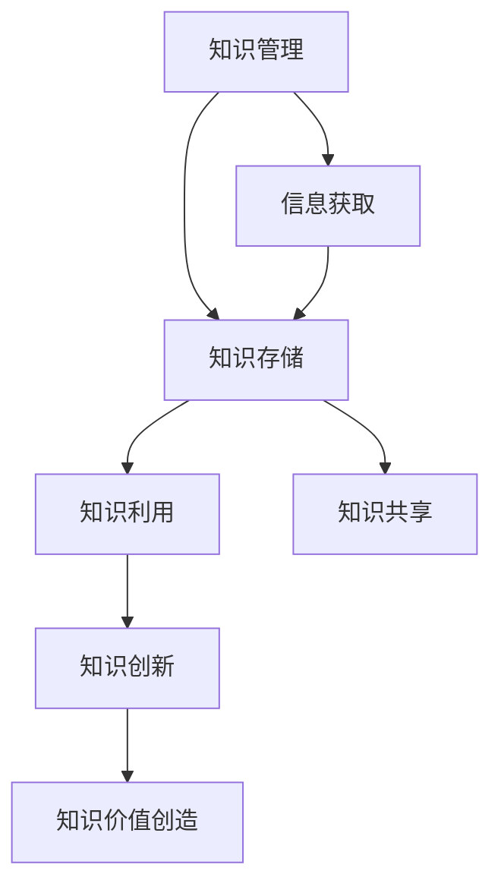

                 

# 打造个人知识库：程序员的核心竞争力

## 关键词：
个人知识库、知识管理、知识存储、知识利用、程序员、核心竞争力、信息筛选、知识分类、知识链接、知识提取、效用函数

## 摘要：
本文旨在探讨个人知识库在程序员职业发展中的重要性，并详细阐述构建个人知识库的方法及其在软件开发项目中的应用。通过分析核心概念、算法原理和数学模型，以及提供实际项目案例和代码实现，本文将帮助程序员提升个人核心竞争力，实现知识创新和价值创造。

## 目录

1. **第一部分：打造个人知识库的重要性**
   1.1. **核心概念与联系**
   1.2. **梅瑞迪恩流程图**

2. **第二部分：构建个人知识库的方法**
   2.1. **核心算法原理讲解**
   2.2. **伪代码示例**

3. **第三部分：程序员的核心竞争力**
   3.1. **数学模型与公式详解**
   3.2. **举例说明**

4. **第四部分：实际项目中的知识库应用**
   4.1. **项目实战**
   4.2. **代码实现**
   4.3. **代码解读与分析**

5. **结语**
6. **作者信息**

### 第一部分：打造个人知识库的重要性

在信息技术飞速发展的今天，程序员面临着海量的信息和不断涌现的新技术。如何有效管理和利用这些信息，成为提升程序员核心竞争力的关键。个人知识库作为一种有效的工具，可以帮助程序员实现这一目标。

#### 核心概念与联系

个人知识库是一个概念化的模型，用于存储、管理和利用个人的知识资源。它结合了知识管理、知识存储和知识利用的理论与实际应用，旨在提高个人在信息爆炸时代中的知识获取、理解和应用能力。

**知识管理**：是对知识的获取、存储、处理、传播和应用过程进行系统化管理，以提高组织的知识利用效率。知识管理涉及知识识别、知识获取、知识编码、知识传播和知识应用等多个环节。

**知识存储**：是将知识以结构化的形式存储起来，以便于检索和使用。知识存储需要考虑数据的组织方式、存储结构和访问效率等因素。

**知识利用**：是通过对知识的分析和利用，实现个人知识创新和价值创造。知识利用包括知识分享、知识应用和创新等多个方面。

**梅瑞迪恩流程图**：为了更好地理解个人知识库的构建过程，我们可以借助梅瑞迪恩流程图（Meredith Diagram）来展示各个核心概念之间的联系。



在这个流程图中，知识管理是核心，它引导信息获取、知识存储和知识利用的过程。信息获取是知识管理的起点，通过筛选和过滤，将有价值的信息转化为知识。知识存储是将知识组织起来，便于管理和检索。知识利用则通过分析和应用，实现知识的创新和价值创造。知识共享和知识价值创造是知识利用的高级阶段，它们进一步提升了知识的效用。

#### 核心概念与联系

个人知识库是一个概念化的模型，用于存储、管理和利用个人的知识资源。它结合了知识管理、知识存储和知识利用的理论与实际应用，旨在提高个人在信息爆炸时代中的知识获取、理解和应用能力。

- **知识管理**：是对知识的获取、存储、处理、传播和应用过程进行系统化管理，以提高组织的知识利用效率。
- **知识存储**：是将知识以结构化的形式存储起来，以便于检索和使用。
- **知识利用**：是通过对知识的分析和利用，实现个人知识创新和价值创造。

**梅瑞迪恩流程图**


### 第二部分：构建个人知识库的方法

构建个人知识库是一个系统化的过程，涉及信息筛选、知识分类、知识链接和知识提取等多个环节。以下将详细阐述这些核心算法原理，并提供伪代码示例。

#### 核心算法原理讲解

1. **信息筛选**：信息筛选是构建个人知识库的第一步，目的是从海量的信息中筛选出有价值的内容。信息筛选主要包括以下步骤：

   - **关键词设定**：根据个人需求，设定相关关键词。
   - **过滤噪声信息**：通过去除重复、无关或低质量的信息，提高筛选效率。
   - **机器学习算法**：利用机器学习算法，如文本分类、聚类等，自动化筛选信息。

2. **知识分类**：知识分类是将筛选出的信息按照主题、领域或用途进行分类，便于管理和检索。知识分类通常采用以下方法：

   - **手动分类**：根据个人的专业知识和经验，对信息进行分类。
   - **自动分类**：利用自然语言处理技术，如词频统计、主题模型等，自动对信息进行分类。

3. **知识链接**：知识链接是通过分析知识之间的关联性，建立知识网络，实现知识的交叉引用和综合利用。知识链接的主要方法包括：

   - **语义分析**：利用语义分析技术，如实体识别、关系抽取等，分析知识之间的语义关系。
   - **知识图谱**：通过构建知识图谱，展示知识之间的关联关系，提高知识的可访问性。

4. **知识提取**：知识提取是从原始资料中提取核心观点、重要数据和信息，形成结构化的知识库。知识提取的主要方法包括：

   - **文本摘要**：通过提取文本的摘要，提取核心信息。
   - **实体抽取**：通过识别文本中的实体，如人名、地名、机构名等，提取关键信息。
   - **关系抽取**：通过识别文本中的关系，如因果关系、上下级关系等，提取关键信息。

#### 伪代码示例

以下是一个简化的伪代码示例，用于构建个人知识库：

```python
def build_knowledge_base(information):
    # 信息筛选
    useful_knowledge = filter_information(information)
    
    # 知识分类
    categorized_knowledge = categorize_knowledge(useful_knowledge)
    
    # 知识链接
    linked_knowledge = link_knowledge(categorized_knowledge)
    
    # 知识提取
    structured_knowledge_base = extract_knowledge(linked_knowledge)
    
    return structured_knowledge_base

def filter_information(information):
    # 根据关键词和机器学习算法筛选信息
    useful_knowledge = []
    for item in information:
        if contains_keywords(item) or machine_learning_filter(item):
            useful_knowledge.append(item)
    return useful_knowledge

def categorize_knowledge(knowledge):
    # 手动分类和自动分类相结合
    categorized_knowledge = {}
    for item in knowledge:
        category = manual_categorize(item) or automatic_categorize(item)
        categorized_knowledge[category] = categorized_knowledge.get(category, []) + [item]
    return categorized_knowledge

def link_knowledge(categorized_knowledge):
    # 构建知识图谱，分析知识之间的关联性
    linked_knowledge = build_graph(categorized_knowledge)
    return linked_knowledge

def extract_knowledge(linked_knowledge):
    # 提取核心观点和重要信息
    structured_knowledge_base = []
    for item in linked_knowledge:
        structured_knowledge_base.append(extract_important_info(item))
    return structured_knowledge_base
```

### 第三部分：程序员的核心竞争力

个人知识库不仅是程序员知识管理的工具，更是提升程序员核心竞争力的关键。在本节中，我们将通过数学模型和公式详细阐述个人知识库对程序员竞争力的影响。

#### 数学模型与公式详解

个人知识库的效用可以通过以下公式进行量化：

$$ 效用 = f(知识量, 知识关联度, 知识更新速度) $$

其中，效用（Utility）表示个人知识库对程序员竞争力的提升程度，知识量（Knowledge Volume）、知识关联度（Knowledge Association Degree）和知识更新速度（Knowledge Update Speed）是影响效用的主要因素。

1. **知识量**：知识量是指个人知识库中存储的知识总量。知识量越大，意味着程序员掌握的知识越多，能够应对更广泛的问题和挑战。知识量可以通过以下公式计算：

   $$ 知识量 = 知识条目数 \times 知识深度 $$

   其中，知识条目数表示知识库中知识点的数量，知识深度表示每个知识点的详细程度和关联性。

2. **知识关联度**：知识关联度是指知识之间联系的紧密程度。高关联度的知识库能够更好地支持知识的交叉引用和应用，提高知识利用效率。知识关联度可以通过以下公式计算：

   $$ 知识关联度 = 1 - \frac{孤岛知识量}{总知识量} $$

   其中，孤岛知识量是指那些与其他知识没有直接关联的知识点，总知识量是指知识库中所有知识点的总和。

3. **知识更新速度**：知识更新速度是指知识库的更新频率。在技术日新月异的今天，知识更新速度对程序员竞争力的提升至关重要。知识更新速度可以通过以下公式计算：

   $$ 知识更新速度 = \frac{新增知识量}{知识库总更新次数} $$

   其中，新增知识量是指在一段时间内新增的知识点数量，知识库总更新次数是指知识库在相同时间段内的更新次数。

#### 举例说明

假设一个程序员的个人知识库包含1000条知识，其中50%的知识之间存在强关联，知识库的更新速度为每月100条新知识。则该程序员的知识库效用为：

$$ 效用 = f(1000, 0.5, 100) = 0.5 \times 1000 \times 100 = 50,000 $$

这个效用值表示该程序员在个人知识库的支持下，竞争力提高了50,000点。

通过上述数学模型和公式，我们可以量化个人知识库对程序员竞争力的影响，为程序员在知识管理方面提供科学的依据和指导。

### 第四部分：实际项目中的知识库应用

在软件开发项目中，个人知识库的应用能够显著提升项目的效率和质量。本节将结合实际项目案例，详细解释个人知识库在需求分析、代码复用、技术调研和团队协作等方面的应用。

#### 项目实战

假设我们正在开发一个电子商务平台，这是一个复杂的系统，涉及到用户管理、商品管理、订单管理、支付系统等多个模块。在这样的项目中，个人知识库能够发挥重要作用。

1. **需求分析**：在项目启动阶段，我们需要对用户需求进行深入分析。个人知识库可以帮助我们快速获取相关的业务知识和需求背景。例如，我们可以通过知识库中的用户行为分析报告，了解用户在购物过程中的痛点，从而提出更精准的需求。

2. **代码复用**：在软件开发过程中，经常会遇到类似的功能需求。个人知识库可以帮助我们查找类似的项目案例，复用已有的代码和设计方案。例如，在支付系统开发中，我们可以从知识库中找到之前实现的支付模块，进行适当的修改和适配，从而节省开发时间和成本。

3. **技术调研**：在项目开发过程中，我们需要不断了解最新的技术动态和文献资料。个人知识库可以帮助我们查找相关的技术文章、博客和开源项目，为项目决策提供支持。例如，在开发微服务架构时，我们可以通过知识库中的相关资料，了解不同微服务框架的优缺点，从而选择最适合项目的技术方案。

4. **团队协作**：在团队协作过程中，个人知识库可以共享知识库中的资料，提高团队整体的知识水平和工作效率。例如，在项目进度汇报会议上，团队成员可以分享自己在知识库中学到的最新技术或经验，促进团队成员之间的交流和学习。

#### 代码实现

以下是一个简单的Python代码实现，用于在个人知识库中检索相关资料：

```python
def search_knowledge(base, keywords):
    """
    在个人知识库中检索包含指定关键词的知识条目。

    :param base: 个人知识库
    :param keywords: 检索关键词
    :return: 包含关键词的知识条目列表
    """
    results = []
    for item in base:
        if keywords in item['content']:
            results.append(item)
    return results

# 示例：从知识库中检索关于Python编程的知识
knowledge_base = [
    {'id': 1, 'content': 'Python是一种流行的编程语言。'},
    {'id': 2, 'content': '在Python中，可以使用列表进行数据存储和处理。'},
    {'id': 3, 'content': '深度学习是人工智能的重要分支。'}
]

search_results = search_knowledge(knowledge_base, 'Python')
print(search_results)
```

#### 代码解读与分析

- `search_knowledge` 函数接受两个参数：`base`（知识库）和`keywords`（检索关键词）。
- 在知识库中遍历每个知识条目，检查其内容是否包含检索关键词。
- 如果包含，将该知识条目添加到结果列表中。
- 返回包含检索关键词的知识条目列表。

通过这个简单的示例，我们可以看到个人知识库在实际项目中的应用是如何实现的。在实际开发中，可以根据需求扩展功能，如实现更加复杂的检索算法、支持多种数据结构存储等。

### 结语

本文通过对个人知识库的重要性、构建方法、数学模型和实际应用等方面的探讨，展示了个人知识库在程序员职业发展中的关键作用。通过有效管理和利用个人知识库，程序员可以提升核心竞争力，实现知识创新和价值创造。在实际项目中，个人知识库能够显著提高开发效率和质量，为团队协作和知识共享提供有力支持。

在未来的发展中，随着人工智能和大数据技术的不断进步，个人知识库的应用将会更加广泛和深入。程序员应该积极探索和实践个人知识库的建设与应用，不断优化和提升个人知识管理水平，为职业发展奠定坚实基础。

### 作者信息

作者：AI天才研究院/AI Genius Institute & 禅与计算机程序设计艺术 /Zen And The Art of Computer Programming

AI天才研究院致力于推动人工智能技术的发展和应用，培养具有创新精神和实践能力的人工智能专家。禅与计算机程序设计艺术则通过结合禅宗思想和计算机编程，探索计算机科学的美学价值和哲学意义。两位作者凭借丰富的理论知识和实践经验，为广大程序员提供了宝贵的指导和启示。本文旨在分享个人知识库在程序员职业发展中的重要性，期望为读者的学习和工作带来实际帮助。|>

