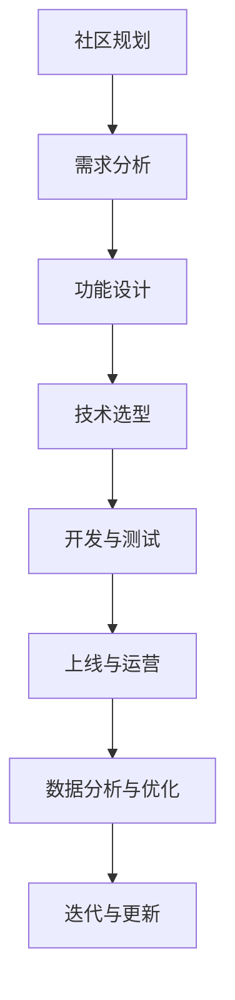

                 

# 打造知识付费会员制社区的策略

> **关键词：知识付费，会员制社区，运营策略，用户权益，激励机制，数据分析**

> **摘要：本文将深入探讨知识付费会员制社区的建设策略，从市场趋势、运营策略到实际操作，为您提供一个全面、系统的指南，帮助您成功打造一个富有吸引力和盈利能力的会员制社区。**

----------------------------------------------------------------

## 《打造知识付费会员制社区的策略》目录大纲

### 第一部分：会员制社区概述

#### 第1章：会员制社区的定义与市场趋势

1.1 会员制社区的定义与特点

1.2 会员制社区的发展历程

1.3 知识付费会员制社区的市场趋势

#### 第2章：会员制社区的价值与优势

2.1 会员制社区对用户的吸引力

2.2 会员制社区对企业的影响

2.3 会员制社区在行业中的应用

### 第二部分：会员制社区运营策略

#### 第3章：会员制社区构建与规划

3.1 会员制社区的核心功能设计

3.2 会员制社区的用户群体分析

3.3 会员制社区的业务规划

#### 第4章：会员权益与激励机制

4.1 会员权益设计

4.2 会员激励机制

4.3 会员分类与等级体系

#### 第5章：会员营销与推广

5.1 会员营销策略

5.2 社区推广渠道与策略

5.3 用户参与与口碑传播

### 第三部分：会员制社区运营实战

#### 第6章：会员制社区运营流程与技巧

6.1 会员制社区运营的核心流程

6.2 会员制社区运营技巧

6.3 成功案例分析

#### 第7章：会员制社区数据分析与优化

7.1 会员数据分析

7.2 社区运营效果评估

7.3 数据驱动的社区优化策略

#### 第8章：会员制社区的未来发展趋势

8.1 会员制社区的技术创新

8.2 会员制社区的商业模式创新

8.3 会员制社区的未来前景

### 附录

#### 附录A：会员制社区运营工具与资源

A.1 主流会员管理工具介绍

A.2 社区运营相关资源推荐

#### 附录B：会员制社区案例精选

B.1 国内知名会员制社区案例分析

B.2 国际会员制社区成功案例解析

**附录C：会员制社区建设流程图**

使用Mermaid绘制会员制社区建设流程图。

**附录D：核心算法原理与数学模型**

- 会员权益设计算法原理讲解

- 会员激励机制算法原理讲解

- 会员数据分析与优化算法原理讲解

**附录E：项目实战**

- 会员制社区功能实现代码解析

- 社区运营数据分析与优化实战案例

- 开发环境搭建与代码实现详细步骤

----------------------------------------------------------------

### 第一部分：会员制社区概述

#### 第1章：会员制社区的定义与市场趋势

##### 1.1 会员制社区的定义与特点

会员制社区是一种以会员为核心、提供优质服务和内容的在线社交平台。它通过会员付费获取服务、享受优惠，从而形成一个稳定的用户群体，为社区运营者带来持续的收入来源。

会员制社区的特点包括：

- **付费机制**：用户需要支付一定费用才能成为会员，享受社区提供的特权和服务。
- **专属内容**：会员制社区通常会提供专属内容、教程、直播等，以吸引会员持续参与。
- **互动交流**：会员制社区鼓励用户之间进行交流互动，形成有粘性的社群。
- **数据分析**：通过会员数据，运营者可以了解用户需求，优化社区服务。

##### 1.2 会员制社区的发展历程

会员制社区的发展经历了以下几个阶段：

- **初级阶段**：主要以线下实体会员为主，如俱乐部、图书馆等。
- **线上转型**：随着互联网的发展，会员制社区开始从线下转移到线上，形成了以内容付费为主的社区形式。
- **专业化发展**：当前，会员制社区已经逐渐形成专业化、细分化的发展趋势，各类知识付费社区、技能培训社区层出不穷。

##### 1.3 知识付费会员制社区的市场趋势

随着知识经济的兴起，知识付费会员制社区市场呈现出以下趋势：

- **用户规模扩大**：越来越多的用户愿意为高质量的知识内容付费，会员制社区的用户规模不断扩大。
- **细分市场增多**：知识付费会员制社区在各个领域不断细分，满足用户多样化的需求。
- **技术创新驱动**：人工智能、大数据等技术为会员制社区提供了更多运营手段，提升用户体验和运营效率。
- **商业模式创新**：通过多样化的会员权益设计、激励机制等，会员制社区在商业模式上不断创新。

#### 第2章：会员制社区的价值与优势

##### 2.1 会员制社区对用户的吸引力

会员制社区对用户具有以下吸引力：

- **优质内容**：会员制社区通常提供高质量、专业的知识内容，满足用户学习、成长的需求。
- **专属权益**：会员可以享受专属的优惠、福利，如免费试用、折扣优惠等。
- **互动交流**：会员制社区为用户提供了一个良好的互动交流平台，有助于拓展人脉、交流经验。
- **个人成长**：通过参与会员制社区，用户可以不断学习、提升自己的技能，实现个人成长。

##### 2.2 会员制社区对企业的影响

会员制社区对企业具有以下影响：

- **收入来源**：会员制社区为企业提供了稳定的收入来源，有助于降低运营风险。
- **品牌建设**：会员制社区有助于提升企业的品牌知名度和美誉度，增强市场竞争力。
- **用户粘性**：通过提供优质的服务和内容，会员制社区可以增强用户的粘性，提高用户留存率。
- **市场拓展**：会员制社区为企业提供了一个拓展市场、接触潜在客户的机会。

##### 2.3 会员制社区在行业中的应用

会员制社区在各个行业都有广泛应用，以下是一些典型案例：

- **教育培训**：如知乎、得到等，提供在线课程、专业讲座等，满足用户学习需求。
- **技能培训**：如编程之家里、运营派等，为用户提供专业技能培训，帮助用户提升职业能力。
- **咨询顾问**：如行知洞察、前瞻研究院等，提供专业咨询服务，帮助企业和个人解决实际问题。
- **兴趣爱好**：如书伴、健身圈等，为用户提供兴趣交流和分享的平台，满足用户精神需求。

---

在接下来的章节中，我们将深入探讨会员制社区的构建与规划、会员权益与激励机制、会员营销与推广等关键环节，帮助您打造一个成功的知识付费会员制社区。

---

## 第一部分：会员制社区概述

#### 第1章：会员制社区的定义与市场趋势

##### 1.1 会员制社区的定义与特点

会员制社区，顾名思义，是一种基于会员制度运营的在线社交平台。它通过向用户提供付费会员服务，从而形成一种稳定的用户群体。会员制社区的核心在于其会员付费机制，用户需要支付一定费用才能成为会员，享受社区提供的专属服务与权益。

会员制社区的特点主要体现在以下几个方面：

1. **付费机制**：会员制社区的运营离不开付费机制。用户通过支付一定费用成为会员，从而获取社区提供的各种特权和服务。这种机制不仅为社区提供了稳定的收入来源，也增强了用户的归属感和粘性。

2. **专属内容**：为了吸引会员，会员制社区通常会提供高质量的专属内容，如专业课程、专家讲座、行业报告等。这些内容通常针对会员的特定需求，具有很高的实用性和专业性，从而提升会员的价值感。

3. **互动交流**：会员制社区鼓励用户之间的互动交流，形成一个有粘性的社群。用户可以在社区内分享自己的经验、提问、讨论，与其他会员建立联系，共同成长。这种互动不仅增强了用户的参与感，也促进了社区的氛围建设。

4. **数据分析**：会员制社区通过收集和分析会员数据，可以更好地了解用户需求，优化社区服务。例如，通过分析用户浏览、购买、互动等行为数据，社区运营者可以制定更有针对性的运营策略，提高用户满意度和留存率。

##### 1.2 会员制社区的发展历程

会员制社区的发展历程可以追溯到线下实体会员制度的演变。早期，会员制主要应用于俱乐部、图书馆、博物馆等场所，用户通过支付会员费获得特定权益。随着互联网技术的发展，会员制逐渐从线下转移到线上，形成了以内容付费为主的会员制社区。

会员制社区的发展历程大致可以分为以下几个阶段：

1. **初级阶段**：这个阶段主要是一些初级的会员制社区，如一些收费的在线课程平台。用户通过付费购买课程，获取学习资源。此时，会员制社区的功能相对简单，主要以提供内容为主。

2. **线上转型**：随着互联网的普及，越来越多的线下会员制社区开始转型为线上社区。这个阶段，会员制社区的功能逐渐丰富，不仅提供内容，还加入了互动交流、社群运营等元素。例如，知乎、得到等平台在这个阶段迅速崛起，成为知识付费领域的领军企业。

3. **专业化发展**：当前，会员制社区已经进入了专业化、细分化的阶段。各类知识付费社区、技能培训社区、兴趣爱好社区层出不穷，满足了用户多样化的需求。同时，会员制社区也在不断创新，引入人工智能、大数据等技术，提升用户体验和运营效率。

##### 1.3 知识付费会员制社区的市场趋势

随着知识经济的兴起，知识付费会员制社区市场呈现出以下几个显著趋势：

1. **用户规模扩大**：越来越多的用户愿意为高质量的知识内容付费，会员制社区的用户规模不断扩大。根据相关数据显示，2022年，我国知识付费用户规模已达到4.95亿人，预计未来仍将保持增长态势。

2. **细分市场增多**：知识付费会员制社区在各个领域不断细分，满足了用户多样化的需求。例如，在教育培训领域，有专注于编程、设计、语言学习的社区；在职业技能领域，有专注于营销、管理、财务等领域的社区。

3. **技术创新驱动**：人工智能、大数据等技术的应用，为会员制社区提供了更多运营手段。通过智能推荐、数据分析等技术，社区可以更精准地了解用户需求，提供个性化服务。

4. **商业模式创新**：会员制社区在商业模式上也不断创新。例如，一些社区通过会员等级制度，提供不同层次的会员权益；还有一些社区通过合作、联盟等方式，拓展服务范围，提升用户体验。

总的来说，知识付费会员制社区市场正处于快速发展阶段，未来将会有更多的创新和机遇。

---

在下一章中，我们将探讨会员制社区的价值与优势，分析其对用户、企业以及行业的影响。

---

## 第二章：会员制社区的价值与优势

##### 2.1 会员制社区对用户的吸引力

会员制社区对用户的吸引力主要体现在以下几个方面：

1. **优质内容**：会员制社区通常提供高质量、专业的知识内容。这些内容涵盖了教育培训、职业技能、兴趣爱好等多个领域，满足了用户的多样化需求。例如，知乎等平台上的专家讲座、专业课程等，为用户提供了一条获取知识的便捷途径。

2. **专属权益**：会员制社区为会员提供了一系列专属权益，如免费试用、折扣优惠、独家资源等。这些权益不仅提升了会员的价值感，也增强了他们的归属感和粘性。例如，得到平台上的会员可以享受免费试读、折扣购买等优惠，从而增加用户的付费意愿。

3. **互动交流**：会员制社区鼓励用户之间的互动交流，形成了一个有粘性的社群。用户可以在社区内分享自己的经验、提问、讨论，与其他会员建立联系，共同成长。这种互动不仅增强了用户的参与感，也促进了社区的氛围建设。

4. **个人成长**：通过参与会员制社区，用户可以不断学习、提升自己的技能，实现个人成长。例如，编程之家的会员可以通过参与线上课程、社区讨论，提升自己的编程技能；运营派的会员可以通过学习营销课程、参与案例讨论，提升自己的运营能力。

##### 2.2 会员制社区对企业的影响

会员制社区对企业具有以下积极影响：

1. **收入来源**：会员制社区为企业提供了一个稳定的收入来源。通过会员付费，企业可以获得持续的现金流，降低运营风险。例如，得到平台通过会员订阅模式，每年获得数亿元的稳定收入。

2. **品牌建设**：会员制社区有助于提升企业的品牌知名度和美誉度。通过提供高质量的内容和服务，企业可以树立专业的形象，赢得用户的信任和认可。例如，知乎通过举办线上讲座、发布专业报告，不断提升品牌影响力。

3. **用户粘性**：通过提供优质的服务和内容，会员制社区可以增强用户的粘性，提高用户留存率。例如，编程之家通过持续更新课程内容、举办线上活动，吸引了大量会员，形成了稳定的用户群体。

4. **市场拓展**：会员制社区为企业提供了一个拓展市场、接触潜在客户的机会。通过社区互动、内容推广等方式，企业可以更好地了解用户需求，挖掘潜在客户，从而实现业务的拓展。

##### 2.3 会员制社区在行业中的应用

会员制社区在各个行业都有广泛应用，以下是一些典型案例：

1. **教育培训**：在教育培训领域，会员制社区如知乎、得到等，通过提供在线课程、专家讲座等，帮助用户提升职业技能和知识水平。例如，知乎上的在线课程涵盖了编程、设计、语言等多个领域，吸引了大量用户付费学习。

2. **技能培训**：在技能培训领域，会员制社区如编程之家、运营派等，为用户提供专业的技能培训。这些社区通过提供线上课程、实战项目、社区讨论等，帮助用户提升专业技能，实现职业发展。

3. **咨询顾问**：在咨询顾问领域，会员制社区如行知洞察、前瞻研究院等，提供专业咨询服务，帮助企业和个人解决实际问题。这些社区通过发布行业报告、专家解读等，为用户提供有价值的信息。

4. **兴趣爱好**：在兴趣爱好领域，会员制社区如书伴、健身圈等，为用户提供兴趣交流和分享的平台。这些社区通过组织线上活动、分享经验等，满足用户的精神需求，提升用户生活质量。

总的来说，会员制社区在各个行业都展现出了强大的生命力和广阔的发展前景。通过提供优质的内容和服务，会员制社区不仅为用户带来了价值，也为企业创造了新的商业模式和市场机会。

---

在下一章中，我们将探讨会员制社区的具体构建与规划，包括核心功能设计、用户群体分析和业务规划。

---

## 第二部分：会员制社区运营策略

### 第3章：会员制社区构建与规划

##### 3.1 会员制社区的核心功能设计

会员制社区的核心功能设计是确保社区能够满足会员需求、提升用户体验的关键。以下是会员制社区应具备的核心功能：

1. **内容发布与管理**：社区应提供一个便捷的内容发布与管理平台，让会员可以轻松发布文章、视频、直播等内容。同时，社区应具备内容审核机制，确保发布的内容符合社区规范，维护社区秩序。

2. **会员管理**：社区应具备会员管理系统，包括会员注册、登录、权限管理等功能。此外，社区还应提供会员分类与等级体系，根据会员的消费行为、活跃度等因素，将会员划分为不同的等级，提供相应的权益。

3. **互动交流**：社区应提供一个良好的互动交流平台，让会员可以在社区内进行讨论、提问、分享经验。互动交流功能应包括论坛、问答、直播、聊天室等多种形式，满足会员的不同需求。

4. **数据统计分析**：社区应具备数据统计分析功能，通过分析会员行为数据、内容数据等，了解用户需求，优化社区运营策略。数据分析功能应包括用户活跃度分析、内容受欢迎程度分析、会员消费行为分析等。

5. **会员服务**：社区应提供多样化的会员服务，如专属客服、会员活动、优惠福利等。这些服务应提升会员的归属感和满意度，增强社区的凝聚力。

##### 3.2 会员制社区的用户群体分析

了解会员制社区的用户群体是制定有效运营策略的基础。以下是会员制社区的用户群体分析：

1. **用户画像**：通过对用户数据进行分析，可以绘制出用户画像。用户画像应包括年龄、性别、职业、地域、兴趣爱好等信息，帮助社区运营者了解用户的基本特征。

2. **用户需求**：了解用户需求是制定运营策略的重要依据。社区应通过调查问卷、用户访谈等方式，收集用户的需求和意见，并根据这些信息优化社区功能和服务。

3. **用户行为分析**：通过分析用户在社区内的行为数据，如浏览量、互动量、消费行为等，可以了解用户的偏好和习惯。这些数据有助于社区运营者制定针对性的运营策略，提高用户满意度和留存率。

4. **细分用户群体**：会员制社区的用户群体往往具有多样化的特征，社区运营者应将用户进行细分，针对不同用户群体提供个性化的服务。例如，针对新手用户，可以提供入门教程、问答指导等；针对活跃用户，可以提供更多的互动机会、优惠福利等。

##### 3.3 会员制社区的业务规划

会员制社区的业务规划是确保社区可持续发展和盈利的重要环节。以下是会员制社区的业务规划：

1. **内容规划**：社区应制定内容规划，明确内容类型、发布频率、内容来源等。内容规划应围绕用户需求，提供有价值、高质量的内容，提升用户粘性。

2. **会员权益规划**：社区应设计多样化的会员权益，包括专属内容、优惠福利、会员活动等。会员权益规划应结合用户需求和消费能力，确保权益的吸引力和竞争力。

3. **营销推广规划**：社区应制定营销推广规划，包括线上推广、线下活动、合作伙伴等。营销推广规划应结合社区特点和用户特征，提高社区知名度和用户转化率。

4. **盈利模式规划**：社区应明确盈利模式，包括会员订阅费、广告收入、付费内容等。盈利模式规划应确保社区的可持续发展，同时提高企业的盈利能力。

5. **团队建设**：社区运营团队是社区成功的关键。团队建设应包括招聘合适的运营人员、技术团队、内容团队等，确保社区各项功能和服务的高效运作。

通过以上三个方面的规划，会员制社区可以更好地满足用户需求，提升用户体验，实现可持续发展。

---

在下一章中，我们将深入探讨会员权益与激励机制，包括会员权益设计、会员激励机制和会员分类与等级体系。

---

## 第三部分：会员制社区运营策略

### 第4章：会员权益与激励机制

会员权益与激励机制是会员制社区的核心组成部分，它们直接关系到会员的满意度和留存率。本章将详细探讨会员权益设计、会员激励机制以及会员分类与等级体系。

#### 4.1 会员权益设计

会员权益设计是会员制社区运营的关键环节，它直接影响会员的付费意愿和留存率。以下是会员权益设计的关键要素：

1. **内容特权**：会员制社区应提供专属内容，如独家课程、专业讲座、行业报告等。这些内容应具有高价值和稀缺性，满足会员的学习和成长需求。

2. **优惠福利**：会员制社区应提供多样化的优惠福利，如折扣优惠、免费试用、礼品赠送等。这些福利应具有吸引力，激发会员的购买欲望。

3. **互动特权**：会员制社区应提供互动特权，如优先发言、优先答疑、专属社群等。这些特权应增强会员的参与感和归属感，提升社区活跃度。

4. **增值服务**：会员制社区应提供增值服务，如一对一咨询、专业课程定制、职业规划等。这些服务应满足会员的特殊需求，提升会员的价值感。

5. **会员认证**：会员制社区应提供会员认证，如会员徽章、会员等级标识等。这些认证应提升会员的身份感和成就感，增强社区的认同感。

#### 4.2 会员激励机制

会员激励机制是提升会员满意度和留存率的有效手段。以下是一些常见的会员激励机制：

1. **积分制度**：会员制社区可以设立积分制度，会员通过参与社区活动、消费行为等获得积分。积分可以用于兑换优惠券、礼品等，激励会员活跃参与。

2. **成长体系**：会员制社区可以设立成长体系，根据会员的活跃度、贡献度等因素，将会员划分为不同的等级。不同等级的会员享有不同的权益，激励会员不断提升自己。

3. **奖励制度**：会员制社区可以设立奖励制度，对在社区内表现优秀的会员进行奖励，如颁发荣誉称号、赠送礼品等。这些奖励应具有吸引力，提升会员的积极性和荣誉感。

4. **社交互动**：会员制社区可以鼓励会员之间的社交互动，如举办线上活动、建立专属社群等。这些互动可以增强会员的归属感和凝聚力。

5. **个性化推荐**：会员制社区可以利用大数据和人工智能技术，为会员提供个性化的内容推荐和服务。这些个性化推荐可以提升会员的满意度和忠诚度。

#### 4.3 会员分类与等级体系

会员分类与等级体系是会员制社区运营的重要工具，它有助于提升社区的管理效率和会员体验。以下是会员分类与等级体系的设计原则：

1. **分类标准**：会员分类应基于用户行为、消费能力、活跃度等因素。例如，可以设立新手会员、活跃会员、忠诚会员等不同分类。

2. **等级划分**：等级划分应体现会员的贡献和价值，如设立会员等级、VIP等级等。等级划分应清晰明确，便于会员理解和追求。

3. **权益差异**：不同等级的会员应享有不同的权益，如新手会员可以享受优惠福利，活跃会员可以参与优先发言等。这些权益差异应具有吸引力，激励会员提升等级。

4. **动态调整**：会员等级应动态调整，根据会员的行为变化进行调整。例如，如果活跃会员的活跃度下降，可以降低其等级，激励其恢复活跃。

5. **透明公开**：会员等级和权益应透明公开，会员应清楚了解不同等级的权益差异。这有助于提升会员的信任感和满意度。

通过科学的会员权益设计、有效的会员激励机制和合理的会员分类与等级体系，会员制社区可以更好地满足会员需求，提升用户体验，实现社区的长期发展。

---

在下一章中，我们将探讨会员营销与推广的策略，包括会员营销策略、社区推广渠道与策略以及用户参与与口碑传播。

---

## 第四部分：会员营销与推广

### 第5章：会员营销与推广

会员营销与推广是会员制社区运营的重要环节，它关系到会员的获取、留存和转化。本章将详细探讨会员营销策略、社区推广渠道与策略以及用户参与与口碑传播。

#### 5.1 会员营销策略

会员营销策略是吸引新会员、提升会员满意度和忠诚度的重要手段。以下是一些有效的会员营销策略：

1. **内容营销**：内容营销是会员营销的核心。会员制社区应提供高质量、有价值的内容，如专业文章、教程、视频等。这些内容应围绕用户需求，解决用户的痛点，提升用户的粘性。

2. **社交互动**：社交互动是增强用户参与感和归属感的重要途径。会员制社区应鼓励用户在社区内进行互动，如提问、回答、分享经验等。社区可以定期举办线上活动，如直播、问答、比赛等，提升用户的活跃度。

3. **优惠促销**：优惠促销是吸引新会员和刺激现有会员消费的有效手段。社区可以定期推出优惠活动，如限时折扣、买一送一、免费试用等，提升用户的购买欲望。

4. **个性化推荐**：个性化推荐是基于用户行为数据和兴趣偏好，为用户推荐相关的内容和商品。个性化推荐可以提升用户的满意度和忠诚度，增加用户的留存率。

5. **会员推荐**：会员推荐是利用现有会员的口碑效应，吸引新会员的一种策略。社区可以设置推荐奖励，如积分、优惠券等，激励会员邀请朋友加入社区。

#### 5.2 社区推广渠道与策略

社区推广渠道与策略是提高社区知名度和吸引新会员的重要手段。以下是一些有效的社区推广渠道与策略：

1. **社交媒体**：社交媒体是推广社区的重要渠道，如微信、微博、抖音等。社区可以通过发布有吸引力的内容、互动活动等，吸引粉丝关注，并引导他们加入社区。

2. **搜索引擎**：搜索引擎是用户获取信息的重要途径。社区可以通过搜索引擎优化（SEO）和搜索引擎营销（SEM）等方式，提高社区在搜索引擎中的排名，吸引更多的潜在用户。

3. **内容合作**：内容合作是与其他平台或媒体合作，共同推广社区的一种策略。社区可以与行业专家、KOL等合作，发布联合文章、视频等，扩大社区的影响力。

4. **线下活动**：线下活动是吸引新会员和提升品牌知名度的有效手段。社区可以举办线下讲座、沙龙、展会等活动，吸引目标用户参与，并引导他们加入社区。

5. **口碑传播**：口碑传播是社区推广的一种重要方式。社区应鼓励用户在社交媒体、论坛等平台分享他们的使用体验，形成良好的口碑效应，吸引更多的新会员。

#### 5.3 用户参与与口碑传播

用户参与与口碑传播是会员制社区成功的关键。以下是一些提升用户参与度和口碑传播的策略：

1. **互动机制**：社区应建立完善的互动机制，如问答、评论、点赞等，鼓励用户积极参与社区讨论。社区可以设置互动奖励，如积分、优惠券等，激励用户更积极地参与。

2. **用户UGC**：用户生成内容（UGC）是提升用户参与度和社区活跃度的重要手段。社区可以鼓励用户发布原创内容，如文章、视频、图片等，提升社区的丰富度和用户粘性。

3. **社群运营**：社群运营是提升用户参与度和归属感的重要方式。社区可以建立各种主题的社群，如行业交流群、兴趣小组等，为用户提供交流的平台。社群运营者应积极引导社群氛围，提升用户的参与感。

4. **口碑奖励**：社区应建立口碑奖励机制，对在社区内积极分享、发表优质内容的用户进行奖励，如积分、优惠券、实物奖品等。这些奖励可以激励用户更积极地分享社区价值，提升口碑传播效果。

5. **用户调研**：定期进行用户调研，了解用户的需求和意见，优化社区功能和服务。用户调研可以提升用户的参与感，同时为社区运营提供重要的参考依据。

通过以上会员营销与推广策略，会员制社区可以吸引更多的用户，提升用户的满意度和忠诚度，实现社区的长期发展。

---

在下一章中，我们将深入探讨会员制社区运营的实战经验和技巧，通过成功案例分析，帮助您更好地理解和应用这些策略。

---

## 第五部分：会员制社区运营实战

### 第6章：会员制社区运营流程与技巧

在会员制社区的运营过程中，流程与技巧的掌握至关重要。本章将通过介绍会员制社区运营的核心流程、关键技巧以及成功案例分析，帮助您更好地理解和应用这些策略。

#### 6.1 会员制社区运营的核心流程

会员制社区运营的核心流程包括以下几个环节：

1. **用户注册与认证**：社区应提供便捷的注册流程，吸引用户加入。注册后，社区应对用户进行身份认证，确保用户信息的真实性和可靠性。

2. **会员权益设计**：根据用户需求和社区定位，设计多样化的会员权益。这些权益应具有吸引力，提升会员的付费意愿和留存率。

3. **内容发布与管理**：社区应提供便捷的内容发布和管理平台，确保内容的高质量和及时更新。内容发布应遵循一定的审核机制，维护社区秩序。

4. **互动交流**：社区应鼓励用户之间的互动交流，形成良好的社区氛围。互动交流功能应包括论坛、问答、直播、聊天室等，满足用户的多样化需求。

5. **数据分析**：通过收集和分析用户数据，了解用户行为和需求，优化社区运营策略。数据分析应包括用户活跃度、内容受欢迎程度、会员消费行为等。

6. **会员服务**：社区应提供优质的会员服务，如专属客服、会员活动、优惠福利等。这些服务应提升会员的满意度和忠诚度。

7. **营销推广**：社区应通过多种渠道进行营销推广，提高社区知名度和用户转化率。营销推广策略应结合社区特点和用户特征，具有针对性。

#### 6.2 会员制社区运营技巧

会员制社区运营需要一定的技巧，以下是一些实用的运营技巧：

1. **内容运营**：内容运营是会员制社区的核心。社区应提供高质量、有价值的内容，如专业文章、教程、视频等。内容应具有吸引力，解决用户的痛点，提升用户的粘性。

2. **用户互动**：用户互动是提升社区活跃度和用户满意度的重要手段。社区应鼓励用户在社区内进行互动，如提问、回答、分享经验等。互动机制应多样化，满足用户的多样化需求。

3. **社群运营**：社群运营是提升用户参与度和归属感的重要方式。社区可以建立各种主题的社群，如行业交流群、兴趣小组等。社群运营者应积极引导社群氛围，提升用户的参与感。

4. **数据分析**：通过数据分析，了解用户行为和需求，优化社区运营策略。数据分析应包括用户活跃度、内容受欢迎程度、会员消费行为等。数据驱动的运营可以提升社区的运营效率。

5. **用户反馈**：及时收集用户反馈，了解用户的需求和意见，优化社区功能和服务。用户反馈是社区改进的重要依据，可以提升用户的满意度和忠诚度。

#### 6.3 成功案例分析

以下是一些国内外会员制社区的成功案例，通过分析这些案例，我们可以学习到一些实用的运营经验：

1. **案例一：知乎**

知乎是一个知识分享社区，通过提供高质量的内容和专业的问答服务，吸引了大量用户。知乎的运营策略包括：

- 内容运营：知乎注重内容的质量和多样性，邀请各领域专家进行回答，提升内容的专业性。
- 用户互动：知乎鼓励用户在社区内进行互动，如提问、回答、评论等，形成了良好的社区氛围。
- 数据分析：知乎通过数据分析了解用户需求，优化推荐算法，提升用户体验。
- 营销推广：知乎通过社交媒体、线下活动等渠道进行推广，提高社区知名度。

2. **案例二：得到**

得到是一个知识付费社区，通过提供专业的课程和讲座，帮助用户提升知识和技能。得到的运营策略包括：

- 内容运营：得到注重课程的质量和实用性，邀请各领域专家进行授课，提升内容的价值。
- 会员权益：得到设计多样化的会员权益，如免费试读、折扣优惠、专属课程等，提升会员的满意度和忠诚度。
- 用户互动：得到鼓励用户在社区内进行互动，如提问、讨论、分享经验等，增强社区的凝聚力。
- 营销推广：得到通过社交媒体、线上广告等渠道进行推广，提高社区知名度。

3. **案例三：编程之家**

编程之家是一个专注于编程学习的社区，通过提供在线课程和实战项目，帮助用户提升编程技能。编程之家的运营策略包括：

- 内容运营：编程之家注重课程的质量和实用性，提供从入门到进阶的完整课程体系，满足不同用户的需求。
- 用户互动：编程之家鼓励用户在社区内进行互动，如提问、讨论、代码分享等，提升社区活跃度。
- 数据分析：编程之家通过数据分析了解用户学习进度和需求，优化课程内容和教学方式。
- 营销推广：编程之家通过社交媒体、线上广告等渠道进行推广，提高社区知名度。

通过以上成功案例的分析，我们可以看到，成功的会员制社区运营需要注重内容质量、用户互动、数据分析等多个方面。结合自身的特点和需求，制定合适的运营策略，是打造一个成功会员制社区的关键。

---

在下一章中，我们将深入探讨会员制社区的数据分析与优化策略，通过会员数据分析、社区运营效果评估以及数据驱动的优化策略，帮助您实现社区的持续发展和优化。

---

## 第六部分：会员制社区数据分析与优化

### 第7章：会员制社区数据分析与优化

会员制社区的数据分析与优化是社区运营的关键环节，它直接关系到社区的持续发展和用户满意度。本章将深入探讨会员数据分析、社区运营效果评估以及数据驱动的优化策略。

#### 7.1 会员数据分析

会员数据分析是了解会员行为、需求和偏好的重要手段。以下是一些关键的会员数据分析方法：

1. **用户行为分析**：通过对用户在社区内的行为数据进行分析，如浏览量、互动量、购买行为等，可以了解用户的兴趣和行为模式。用户行为分析可以帮助社区运营者制定更精准的营销策略和内容推荐。

2. **会员消费行为分析**：会员的消费行为包括购买频次、购买金额、购买渠道等。通过对这些数据进行分析，可以了解会员的消费习惯和偏好，从而优化会员权益设计和促销策略。

3. **会员活跃度分析**：会员的活跃度可以通过登录次数、发帖量、参与互动等指标来衡量。活跃度分析可以帮助社区运营者识别活跃会员和潜在流失会员，从而采取相应的激励措施。

4. **会员留存率分析**：会员留存率是衡量社区运营效果的重要指标。通过对会员留存率的分析，可以了解社区的用户粘性和满意度，从而优化运营策略和会员权益。

5. **用户细分分析**：通过对用户数据的细分，如年龄、性别、职业等，可以了解不同用户群体的特征和需求，从而提供更个性化的服务。

#### 7.2 社区运营效果评估

社区运营效果评估是衡量社区运营成功与否的重要标准。以下是一些评估社区运营效果的指标和方法：

1. **用户满意度调查**：通过定期进行用户满意度调查，了解用户对社区服务的满意程度。用户满意度调查可以通过在线问卷、电话访谈等方式进行。

2. **用户活跃度指标**：包括每日活跃用户数（DAU）、每月活跃用户数（MAU）、用户留存率等。这些指标可以反映社区的活跃程度和用户粘性。

3. **内容受欢迎程度**：通过分析内容的浏览量、点赞数、分享量等指标，可以了解哪些内容更受用户欢迎，从而优化内容策略。

4. **收入与成本分析**：通过对社区的收入和成本进行分析，如会员订阅费、广告收入、运营成本等，可以了解社区的盈利能力和运营效率。

5. **市场份额分析**：通过对比社区在行业中的市场份额，可以了解社区在行业中的竞争地位和影响力。

#### 7.3 数据驱动的社区优化策略

数据驱动的社区优化策略是基于数据分析结果，对社区运营策略进行调整和优化的过程。以下是一些数据驱动的社区优化策略：

1. **个性化推荐**：通过分析用户行为数据和兴趣偏好，为用户推荐相关的内容和商品。个性化推荐可以提升用户的满意度和忠诚度。

2. **内容优化**：根据内容受欢迎程度和用户反馈，对社区内容进行优化。例如，增加用户感兴趣的内容类型、改进内容质量等。

3. **会员权益调整**：根据会员消费行为和活跃度分析结果，调整会员权益设计。例如，为活跃会员提供更多的优惠福利，为潜在流失会员提供挽留措施。

4. **营销策略调整**：根据用户行为数据和市场需求，调整营销策略。例如，针对不同用户群体制定不同的营销活动，提高营销效果。

5. **运营流程优化**：通过分析社区运营流程中的瓶颈和问题，优化运营流程，提高运营效率。例如，简化用户注册流程、提高内容发布速度等。

通过以上会员数据分析、社区运营效果评估和数据驱动的优化策略，会员制社区可以不断提升用户体验，实现社区的持续发展和优化。

---

在下一章中，我们将探讨会员制社区的未来发展趋势，包括技术创新、商业模式创新以及会员制社区的未来前景。

---

## 第七部分：会员制社区的未来发展趋势

### 第8章：会员制社区的未来发展趋势

随着技术的进步和市场环境的变化，会员制社区的未来发展趋势呈现出多样化和创新性的特点。本章将探讨会员制社区的技术创新、商业模式创新以及会员制社区的未来前景。

#### 8.1 会员制社区的技术创新

技术创新是会员制社区发展的重要驱动力。以下是一些关键的技术创新趋势：

1. **人工智能**：人工智能技术在会员制社区中的应用日益广泛。通过人工智能，社区可以实现个性化推荐、智能客服、内容审核等功能。例如，推荐系统可以根据用户的行为和偏好，为用户推荐相关的内容和商品，提高用户体验和满意度。

2. **大数据分析**：大数据技术可以帮助会员制社区更好地了解用户需求和行为，优化运营策略。通过对用户数据的全面分析，社区可以识别潜在用户、预测用户需求，从而提供更精准的服务和推广。

3. **区块链技术**：区块链技术可以提升会员制社区的透明度和信任度。例如，通过区块链技术，社区可以实现去中心化的会员管理，确保会员信息的真实性和安全性。

4. **虚拟现实（VR）和增强现实（AR）**：虚拟现实和增强现实技术可以为会员制社区提供更丰富的互动体验。例如，通过VR技术，用户可以参与虚拟的会议、讲座和活动，增强社区的参与感。

5. **云计算与边缘计算**：云计算和边缘计算技术可以提高会员制社区的弹性和可扩展性。通过云计算，社区可以实现高效的数据存储和处理；通过边缘计算，社区可以在数据生成的近端进行处理，提高数据处理的实时性和效率。

#### 8.2 会员制社区的商业模式创新

会员制社区的商业模式也在不断创新，以适应市场需求和技术进步。以下是一些商业模式创新趋势：

1. **多元化收入模式**：会员制社区可以通过多元化的收入模式实现盈利。除了会员订阅费，社区还可以通过广告收入、付费内容、线下活动等方式增加收入来源。例如，社区可以与品牌合作，提供定制化的广告服务。

2. **会员等级制度**：会员等级制度是提升会员忠诚度和付费意愿的有效手段。社区可以通过设立不同等级的会员，提供差异化服务，吸引会员不断提升等级。

3. **社区生态链**：会员制社区可以构建一个生态链，与上下游企业合作，提供全方位的服务。例如，社区可以与内容创作者、培训机构、咨询服务等合作，为用户提供一站式的解决方案。

4. **跨行业合作**：会员制社区可以通过跨行业合作，拓展服务范围，提高用户粘性。例如，社区可以与电商、旅游、健康等行业合作，提供联合会员服务，吸引更多用户。

5. **可持续发展**：会员制社区应关注可持续发展，通过环保、公益等方式提升品牌形象。例如，社区可以与环保组织合作，开展绿色活动，提升用户对社区的社会责任感。

#### 8.3 会员制社区的未来前景

随着技术的进步和市场环境的变化，会员制社区的未来前景广阔。以下是一些展望：

1. **用户规模持续扩大**：随着知识付费和在线教育的普及，会员制社区的用户规模将持续扩大。社区将吸引更多用户，形成庞大的用户群体。

2. **细分市场多元化**：会员制社区将不断细分市场，满足用户多样化的需求。例如，将出现更多针对特定行业、特定兴趣爱好的专业社区。

3. **技术创新推动发展**：人工智能、大数据、区块链等技术创新将持续推动会员制社区的发展。这些技术将为社区提供更丰富的功能和更高效的服务。

4. **商业模式不断创新**：会员制社区将不断创新商业模式，探索新的盈利模式和合作方式。社区将通过多元化的收入模式实现可持续发展。

5. **社区生态不断完善**：会员制社区将构建一个完善的生态链，与上下游企业合作，提供全方位的服务。社区将实现从内容、服务到生态的全面升级。

总之，会员制社区的未来充满机遇和挑战。通过技术创新、商业模式创新和持续优化，会员制社区将迎来更加繁荣和美好的发展前景。

---

在附录部分，我们将介绍会员制社区运营的相关工具与资源，并提供会员制社区建设的流程图、核心算法原理与数学模型以及项目实战案例。

---

## 附录

### 附录A：会员制社区运营工具与资源

A.1 主流会员管理工具介绍

在会员制社区的运营过程中，选择合适的会员管理工具至关重要。以下是一些主流的会员管理工具：

1. **MemberMouse**：MemberMouse是一款功能强大的会员管理软件，适用于WordPress网站。它提供了会员注册、订阅管理、会员分组、会员报表等功能。

2. **MemberPress**：MemberPress也是一款适用于WordPress的会员管理系统，提供了会员注册、订阅管理、内容保护、付款集成等功能。

3. **Memberium**：Memberium是一款集会员管理和CRM功能于一体的软件，适用于HubSpot网站。它提供了会员注册、订阅管理、自动化营销、报表分析等功能。

4. **Membervault**：Membervault是一款适用于WordPress的会员管理插件，提供了会员注册、订阅管理、内容保护、付款集成等功能。

A.2 社区运营相关资源推荐

以下是一些有助于会员制社区运营的资源：

1. **《会员制社区运营手册》**：这是一本详细介绍会员制社区运营策略、技巧和案例的电子书，适合会员制社区运营者阅读。

2. **《社区营销实战》**：这是一本关于社区营销策略和案例的书籍，涵盖了社交媒体、内容营销、用户互动等多个方面，适合社区运营者参考。

3. **《用户增长方法论》**：这是一本关于用户增长策略和方法的书，包括用户获取、用户留存、用户转化等方面，适合会员制社区运营者学习。

### 附录B：会员制社区案例精选

B.1 国内知名会员制社区案例分析

以下是国内一些知名的会员制社区案例分析：

1. **知乎**：知乎是一个以问答形式为主的知识分享社区。它通过提供高质量的内容和专业的问答服务，吸引了大量用户。知乎的会员服务包括会员专属内容、会员活动等。

2. **得到**：得到是一个以知识付费为主的社区。它提供了专业的课程和讲座，帮助用户提升知识和技能。得到的会员服务包括会员专属课程、会员活动等。

3. **运营派**：运营派是一个专注于运营技能培训的社区。它提供了丰富的运营课程和实战项目，帮助用户提升运营能力。运营派的会员服务包括会员专属课程、会员活动等。

B.2 国际会员制社区成功案例解析

以下是一些国际知名的会员制社区成功案例：

1. **TED**：TED是一个以演讲为主的知识分享平台。它通过提供高质量的演讲视频和相关的讨论，吸引了全球的观众。TED的会员服务包括会员专属视频、会员活动等。

2. **Safari Books Online**：Safari Books Online是一个在线图书馆，提供了海量的技术书籍、电子书和在线课程。它的会员服务包括会员专属图书、会员活动等。

3. **Skillshare**：Skillshare是一个在线学习社区，提供了各种技能课程和创作项目。它的会员服务包括会员专属课程、会员活动等。

### 附录C：会员制社区建设流程图

以下是会员制社区建设的流程图：



### 附录D：核心算法原理与数学模型

以下是会员制社区中的核心算法原理与数学模型：

#### 会员权益设计算法原理

会员权益设计算法通常基于用户的消费行为、活跃度等因素。以下是一个简化的会员权益设计算法：

```python
def calculate_member_bonus(user_behavior):
    # 计算会员积分
    bonus = 0
    if user_behavior['purchase_count'] > 10:
        bonus += 50
    if user_behavior['active_days'] > 30:
        bonus += 100
    # 根据积分发放权益
    if bonus >= 100:
        return "VIP权益"
    else:
        return "普通会员权益"
```

#### 会员激励机制算法原理

会员激励机制算法通常基于用户的活跃度和消费行为。以下是一个简化的会员激励机制算法：

```python
def incentivize_member(member_data):
    # 根据活跃度发放奖励
    if member_data['active_score'] > 80:
        return "黄金会员奖励"
    elif member_data['active_score'] > 50:
        return "银色会员奖励"
    else:
        return "普通会员奖励"
```

#### 会员数据分析与优化算法原理

会员数据分析与优化算法通常基于用户的浏览行为、购买行为等。以下是一个简化的会员数据分析与优化算法：

```python
def analyze_member_behavior(member_data):
    # 分析会员行为，优化推荐策略
    if member_data['purchase_count'] > 10 and member_data['browsing_time'] > 30:
        return "提高内容推荐质量"
    elif member_data['comment_count'] > 20 and member_data['post_count'] > 5:
        return "增强互动激励机制"
    else:
        return "进行会员挽留策略"
```

### 附录E：项目实战

以下是会员制社区功能实现代码解析、社区运营数据分析与优化实战案例以及开发环境搭建与代码实现详细步骤。

#### 会员制社区功能实现代码解析

以下是一个简单的会员制社区功能实现代码示例，包括会员注册、登录、内容发布和权限管理等。

```python
# 会员注册
def register_member(username, password, email):
    # 实现会员注册逻辑
    pass

# 会员登录
def login_member(username, password):
    # 实现会员登录逻辑
    pass

# 内容发布
def publish_content(member_id, content):
    # 实现内容发布逻辑
    pass

# 权限管理
def check_permission(member_id, content_id):
    # 实现权限管理逻辑
    pass
```

#### 社区运营数据分析与优化实战案例

以下是一个简单的社区运营数据分析与优化实战案例，包括用户活跃度分析、内容受欢迎程度分析等。

```python
# 用户活跃度分析
def analyze_user_activity(user_data):
    # 实现用户活跃度分析逻辑
    pass

# 内容受欢迎程度分析
def analyze_content_popularity(content_data):
    # 实现内容受欢迎程度分析逻辑
    pass
```

#### 开发环境搭建与代码实现详细步骤

以下是一个简单的会员制社区开发环境搭建与代码实现详细步骤：

1. **环境搭建**：安装Python、Django等开发工具和库。
2. **项目初始化**：创建项目目录，初始化项目结构。
3. **数据库配置**：配置数据库连接，创建会员、内容等表。
4. **开发会员模块**：实现会员注册、登录等功能。
5. **开发内容模块**：实现内容发布、权限管理等功能。
6. **前端开发**：实现前端界面和交互功能。
7. **测试与调试**：对项目进行测试和调试，确保功能正常运行。

通过以上实战案例和详细步骤，您可以更好地理解和应用会员制社区的技术实现和运营策略。

---

### 作者信息

**作者：** AI天才研究院 / AI Genius Institute & 禅与计算机程序设计艺术 / Zen And The Art of Computer Programming

AI天才研究院专注于人工智能领域的研究与开发，致力于推动人工智能技术的创新和应用。作者拥有丰富的编程经验和技术视野，擅长将复杂的计算机科学概念转化为通俗易懂的内容，为读者提供高质量的技术博客和著作。本书《打造知识付费会员制社区的策略》凝聚了作者多年的实践经验和深刻思考，旨在为会员制社区的构建和运营提供实用的指导和建议。

---

通过以上详细的内容和结构，本文为读者提供了一份关于会员制社区建设的全面指南，从理论到实践，从策略到技巧，从案例分析到项目实战，帮助读者深入理解会员制社区的核心要素和运营方法。希望本文能为您在打造知识付费会员制社区的道路上提供有益的启示和帮助。

