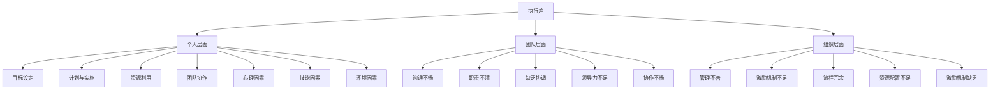

                 

# 《执行差：你我都懂，你不做我做》

> **关键词：执行差、执行力、原因分析、对策、案例研究**

> **摘要：本文旨在探讨执行差这一普遍存在于个人和团队中的现象，分析其成因，并提供一系列实用的对策。通过案例分析、心理学、技能和环境等多角度的深入探讨，帮助读者理解执行差的影响，并提供有效的提升执行力的方法。**

### 目录大纲

#### 第一部分：认识执行差

##### 第1章：什么是执行差  
- **1.1 执行差的定义与影响**  
- **1.2 执行差的成因分析**  
- **1.3 执行差的危害与解决**

##### 第2章：执行差的案例分析  
- **2.1 个人层面的执行差案例分析**  
- **2.2 团队层面的执行差案例分析**

#### 第二部分：执行差的原因与对策

##### 第3章：心理层面的执行差原因与对策  
- **3.1 缺乏动力与毅力的心理因素**  
- **3.2 提升动力与毅力的心理策略**  
- **3.3 心理技巧：时间管理**

##### 第4章：技能层面的执行差原因与对策  
- **4.1 执行差常见的技能缺乏**  
- **4.2 提升技能的策略与方法**

##### 第5章：环境层面的执行差原因与对策  
- **5.1 执行差的环境因素**  
- **5.2 改善环境的策略**

#### 第三部分：执行差的具体行动

##### 第6章：执行差的自我诊断与评估  
- **6.1 自我诊断工具**  
- **6.2 执行能力的评估与反馈**

##### 第7章：提升执行力的行动指南  
- **7.1 设定明确的目标**  
- **7.2 制定可行的行动计划**  
- **7.3 跟进与调整**

#### 第四部分：执行差的实践案例与思考

##### 第8章：成功案例解析  
- **8.1 个人层面的成功案例**  
- **8.2 团队层面的成功案例**

##### 第9章：执行差的社会影响与对策  
- **9.1 执行差对社会的影响**  
- **9.2 应对执行差的对策**

#### 附录

##### 附录A：执行差相关资源与工具  
- **A.1 执行差相关的书籍推荐**  
- **A.2 执行差相关的网站与博客**  
- **A.3 执行差相关的工具与应用**

##### 附录B：执行差的概念与架构 Mermaid 流程图  
- **B.1 执行差的概念模型**  
- **B.2 执行差的架构模型**

##### 附录C：核心算法原理讲解与伪代码  
- **C.1 动力与毅力算法原理讲解**  
- **C.2 目标设定与行动计划算法原理讲解**

##### 附录D：数学模型与公式讲解  
- **D.1 执行能力评估数学模型**  
- **D.2 时间管理数学模型**

##### 附录E：项目实战与代码解读  
- **E.1 个人层面执行差项目实战**  
- **E.2 团队层面执行差项目实战**  
- **E.3 执行差项目实战代码解读**

### 引言

在当今社会，执行力（Execution）是一个被频繁提及，但又往往被忽视的重要概念。执行差（Execution Gap）这一现象，不仅困扰着个人，也在工作中成为团队和组织绩效提升的瓶颈。执行差指的是个人或团队在设定目标后，未能有效地将目标转化为实际成果的情况。它既包括个人层面的拖延、缺乏行动力，也包括团队层面的协作不畅、决策执行不到位。

执行差的存在具有普遍性。无论是职场中的项目延误，还是生活中的拖延症，执行差都会带来消极的影响。对于个人而言，执行差可能导致职业发展受限，个人成就感下降；对于团队和组织而言，执行差会导致资源浪费，项目失败，甚至影响整体竞争力。因此，理解和解决执行差问题，对于提升个人和团队绩效具有重要意义。

本文将从以下几个方面进行探讨：

1. **定义与影响**：首先，我们将明确执行差的定义，并分析其在个人和团队中的表现及影响。
2. **成因分析**：接下来，我们将深入探讨导致执行差的多个因素，包括心理层面、技能层面和环境层面。
3. **对策与方法**：针对不同层面的成因，我们将提供一系列实用的对策和方法，帮助读者提升执行力。
4. **案例研究**：通过实际案例，我们将进一步说明执行差的影响和解决方法。
5. **实践指南**：最后，我们将提供具体的自我诊断与评估工具，以及提升执行力的行动指南。

通过本文的阅读，读者将能够更深入地理解执行差这一现象，找到解决的方法，从而在个人和团队层面实现更高的执行力。让我们一起探索执行差的奥秘，找到提升执行力的路径。在接下来的章节中，我们将逐一探讨这些主题，希望能为读者带来启发和帮助。

### 第一部分：认识执行差

#### 第1章：什么是执行差

##### 1.1 执行差的定义与影响

执行差（Execution Gap）是指在目标设定之后，个人或团队未能有效执行计划，导致目标未能如期实现的现象。它不仅指在行动层面的缺失，还包括了策略实施、资源调配、沟通协调等多个维度的不足。

执行差的定义可以从以下几个方面来理解：

- **目标设定**：执行差首先体现在目标设定上，即缺乏明确、具体、可衡量的目标。
- **计划与实施**：即使有了明确的目标，执行差也可能出现在计划与实施过程中，如缺乏有效的行动计划，或计划执行不到位。
- **资源利用**：执行差还会影响资源的有效利用，包括时间、人力和物力等。
- **团队协作**：在团队层面，执行差可能导致沟通不畅、协作不力，从而影响整体执行效果。

执行差的影响在不同层面有不同的表现：

- **个人层面**：个人层面的执行差可能导致职业发展受限、个人成就感下降，甚至影响心理健康。
  - **职业发展受限**：由于执行力的不足，个人可能错失职业晋升的机会，无法在竞争激烈的职场中脱颖而出。
  - **个人成就感下降**：无法实现目标，会使个人感到挫败，影响自信心和自我评价。
  - **心理健康影响**：长期的执行差可能导致焦虑、抑郁等心理健康问题。

- **团队和组织层面**：团队和组织层面的执行差会影响整体绩效，导致资源浪费、项目延误，甚至影响组织的竞争力。
  - **资源浪费**：执行差可能导致人力、物力和时间的浪费，影响组织的成本效益。
  - **项目延误**：项目未能如期完成，会影响组织的交付能力，损害客户关系。
  - **竞争力下降**：长期执行差可能导致组织在市场竞争中失去优势，影响长期发展。

##### 1.2 执行差的成因分析

执行差的形成是多方面的，涉及个人、团队和组织等多个层面。以下是导致执行差的一些常见原因：

- **缺乏目标与计划**：没有明确的目标和详细的计划，是导致执行差的首要原因。许多人在设定目标时，过于模糊或没有具体的时间表和指标，导致缺乏执行的方向和动力。

- **缺乏动力与毅力**：即使有了明确的目标和计划，缺乏内在动力和毅力也会导致执行差。自我效能感的缺失、目标设定不当、自我期待不足等心理因素，都会影响个人的执行意愿和坚持力。

- **缺乏技能与知识**：执行差还可能源于技能和知识的不足。在实施计划时，如果缺乏必要的沟通技能、问题解决能力和团队协作能力，将难以有效地完成任务。

##### 1.3 执行差的危害与解决

执行差的危害不仅限于目标的未能实现，还会对个人和团队带来深远的负面影响。以下是几种主要的危害及相应的解决策略：

- **个人危害**：个人层面的执行差可能导致职业发展受阻、个人成就感下降，甚至影响心理健康。

  - **职业发展受限**：解决策略包括设定明确的目标，制定详细的行动计划，以及不断学习提升自己的技能和能力。

  - **个人成就感下降**：可以通过设定短期目标，逐步实现，从而提升自我效能感，增强自信心。

  - **心理健康影响**：通过心理辅导、时间管理技巧和健康生活方式，缓解焦虑和抑郁等心理健康问题。

- **工作危害**：在团队和组织层面，执行差可能导致项目延误、资源浪费，甚至影响组织的竞争力。

  - **项目延误**：解决策略包括加强项目管理，确保每个项目都有明确的目标和详细的计划，以及建立有效的沟通和协作机制。

  - **资源浪费**：通过优化资源配置，提高工作效率，减少不必要的浪费。

  - **竞争力下降**：通过培养团队执行力，提高整体绩效，增强组织在市场中的竞争力。

总结而言，执行差是一个普遍存在的问题，但通过科学的目标设定、有效的行动计划、提升动力和毅力、以及优化环境和技能，我们可以有效地解决执行差问题，提升个人和团队的执行力。

在下一章中，我们将通过具体的案例，进一步分析执行差在个人和团队中的表现和影响。

### 第2章：执行差的案例分析

#### 2.1 个人层面的执行差案例分析

##### 案例一：拖延症患者的故事

小李是一名年轻的程序员，他在大学时期就展现出了出色的编程能力，但在毕业后进入职场后，他的工作表现却始终不尽如人意。小李常常拖延工作，即使是那些相对简单的任务，他也会拖到最后一刻才去完成。他总是抱怨自己缺乏时间和精力，但实际上，他每天的时间分配非常不合理，经常会花费大量时间在社交媒体上。

小李的执行差表现在以下几个方面：

- **缺乏明确的目标**：小李没有一个明确的工作目标，他的日常工作缺乏方向性和紧迫感。
- **缺乏计划**：他经常在没有制定详细计划的情况下开始工作，导致工作进度缓慢。
- **时间管理不当**：小李的时间管理能力较差，经常将时间浪费在无意义的事情上，如浏览社交媒体。

小李的执行差给他带来了严重的负面影响：

- **工作效率低下**：由于拖延和缺乏计划，小李的工作效率非常低，经常无法按时完成任务。
- **职业发展受限**：他的工作表现不佳，使得他错失了多次晋升和加薪的机会。
- **心理健康问题**：长期的执行差导致小李感到焦虑和沮丧，影响了他的心理健康。

**解决策略**：

- **设定明确的目标**：小李需要设定明确的工作目标，包括短期和长期目标，并确保这些目标具有可衡量性和可实现性。
- **制定详细的计划**：在开始工作之前，小李应该制定详细的计划，明确每个任务的时间安排和优先级。
- **优化时间管理**：小李可以通过使用时间管理工具，如日程表和待办事项列表，来优化自己的时间管理。

通过这些策略，小李可以逐步克服拖延症，提高工作效率，实现职业和个人目标。

##### 案例二：缺乏行动力的职场人

小张是一名市场营销专员，他的工作任务包括策划和执行各种营销活动。然而，他总是缺乏行动力，经常将任务推迟到最后时刻。即使领导多次催促，他仍然无法按时完成任务。小张的执行差表现在以下几个方面：

- **缺乏动力**：小张对自己的工作缺乏兴趣，没有内在的动力去完成任务。
- **拖延习惯**：小张已经养成了拖延的习惯，即使知道拖延会导致不良后果，他也很难改变。
- **缺乏自我驱动**：小张缺乏自我驱动，没有自我激励的能力，总是依赖外部压力来推动自己工作。

小张的执行差给他带来了以下负面影响：

- **工作效率低下**：由于缺乏行动力，小张的工作效率非常低，经常无法按时完成工作任务。
- **职业发展受阻**：他的工作表现不佳，使得他在职场中缺乏竞争力，职业发展受限。
- **团队关系紧张**：小张的拖延行为导致团队关系紧张，影响了团队协作和整体绩效。

**解决策略**：

- **增强动力**：小张需要找到自己工作的意义和兴趣点，激发内在动力。
- **改变拖延习惯**：小张可以通过制定明确的行动计划和时间表，逐步改变拖延的习惯。
- **培养自我驱动**：小张可以通过设定小目标、奖励机制等方式，培养自我驱动能力。

通过这些策略，小张可以逐步提高行动力，提升工作效率，实现职业和个人目标。

#### 2.2 团队层面的执行差案例分析

##### 案例一：团队缺乏协作

某公司的销售团队在执行一个大项目时遇到了执行差的问题。团队成员各自为政，缺乏有效的协作，导致项目进度严重延误。具体表现如下：

- **沟通不畅**：团队成员之间的沟通不足，信息传递不畅，导致任务无法按时完成。
- **职责不清**：团队成员的职责分工不明确，导致工作重叠和责任推卸。
- **缺乏协调**：团队成员缺乏有效的协调，无法在关键时刻共同应对挑战。

该团队的执行差导致了以下后果：

- **项目延误**：由于缺乏协作，项目进度严重延误，影响了公司整体业绩。
- **资源浪费**：团队成员在执行任务时，出现了资源浪费，如重复工作、资源分配不均。
- **团队士气下降**：团队成员因执行差而感到沮丧和不满，影响了团队的士气和工作氛围。

**解决策略**：

- **加强沟通**：建立定期的团队沟通机制，确保信息畅通，提高团队协作效率。
- **明确职责**：明确每个团队成员的职责和任务，确保工作分工合理，避免责任推卸。
- **强化协调**：设立协调人，负责协调团队成员的工作，确保任务顺利进行。

通过这些策略，团队可以改善协作，提高执行力，确保项目按时完成。

##### 案例二：领导力不足导致的执行差

某公司的研发团队在实施一个关键项目时，由于领导力不足，导致执行差严重。具体问题如下：

- **缺乏明确的指导**：团队领导没有提供清晰的指导，导致团队成员在任务执行上缺乏方向。
- **决策延误**：领导在关键决策上犹豫不决，导致项目进度停滞不前。
- **缺乏激励机制**：领导没有设定有效的激励机制，导致团队成员缺乏工作动力。

该团队的执行差导致了以下后果：

- **项目延误**：由于领导力不足，项目进度严重延误，影响了公司的业务发展。
- **团队士气低落**：团队成员因领导力不足而感到失望和不满，影响了团队士气。
- **资源浪费**：由于项目延误，公司投入了大量的资源，但未能产生预期的效果。

**解决策略**：

- **明确指导**：领导需要提供明确的指导，确保团队成员了解任务目标和执行路径。
- **及时决策**：领导在关键决策上应果断行动，避免决策延误。
- **设立激励机制**：领导应设立有效的激励机制，激发团队成员的工作积极性。

通过这些策略，领导可以提升团队执行力，确保项目按时完成。

以上案例分析展示了执行差在个人和团队层面的具体表现及其影响。通过深入分析这些案例，我们可以更好地理解执行差的原因和解决方法，从而在实际工作中采取有效措施，提升执行力和工作效率。

### 第二部分：执行差的原因与对策

#### 第3章：心理层面的执行差原因与对策

##### 3.1 缺乏动力与毅力的心理因素

执行差的一个重要心理因素是缺乏动力和毅力。这种心理状态通常源于以下几个方面：

- **自我效能感的缺失**：自我效能感是指个人对自己完成某项任务的能力的信念。缺乏自我效能感会导致个人在面对挑战时感到无助和恐惧，从而缺乏行动的动力。

  **原因分析**：自我效能感的缺失可能源于多次失败的经历、对自己的期望值过低或外部环境的负面评价。

  **案例**：小李在编程学习中总是感到自己不如他人，即使努力也难以取得进步，导致他逐渐失去了学习编程的动力。

- **目标设定不当**：目标设定不当，包括目标过于模糊、不切实际或缺乏挑战性，也会影响个人的动力和毅力。

  **原因分析**：目标设定不当可能导致个人对目标的意义和实现路径缺乏清晰的认识，从而缺乏持续努力的动力。

  **案例**：小张设定的目标过于简单，如每天阅读10页书，由于目标缺乏挑战性，他很快就感到无聊和厌倦，无法坚持下去。

- **自我期待不足**：自我期待是指个人对自己的期望和标准。自我期待不足会导致个人在执行任务时缺乏内在动力，容易放弃。

  **原因分析**：自我期待不足可能源于自我评价过低或长期受到负面心理暗示。

  **案例**：小王在工作上总是觉得自己不够好，即使取得了一定的成绩，他也认为那只是运气好，导致他在面对新的挑战时缺乏自信和动力。

##### 3.2 提升动力与毅力的心理策略

为了克服心理层面的执行差，我们可以采取以下策略：

- **增强自我效能感**：增强自我效能感的关键在于积累成功的经验和积极的心理暗示。

  **方法**：
  1. **设立小目标**：通过设定一系列小目标，逐步积累成功经验，增强自我效能感。
  2. **积极反馈**：鼓励自己，给予积极的反馈，即使在面对挑战时也要保持乐观。
  3. **学习榜样**：观察和模仿那些在类似情境中取得成功的人，学习他们的方法和态度。

- **设定明确的目标**：明确的目标能够为个人提供清晰的方向和动力。

  **方法**：
  1. **具体化目标**：确保目标具有明确的内容、时间表和指标，使其具有可衡量性。
  2. **目标分解**：将大目标分解为一系列小目标，每个小目标都可以逐步实现。
  3. **定期检查**：定期回顾目标进度，及时调整计划，保持目标的实现动力。

- **提高自我期待**：通过调整自我期待，提升自我激励和自我管理能力。

  **方法**：
  1. **自我反思**：定期进行自我反思，识别自己的优点和不足，调整自我期待。
  2. **设定合理的目标**：设定既具有挑战性又可实现的目标，避免目标过高或过低。
  3. **积极心态**：保持积极的心态，相信自己有能力实现目标，即使面临困难也不放弃。

##### 3.3 心理技巧：时间管理

时间管理是提升执行力的关键技巧之一，通过科学的时间管理，可以更有效地利用时间，提高工作效率。

- **制定日程表**：制定详细的日程表，规划每天的任务和时间分配。

  **方法**：
  1. **分清优先级**：将任务按照重要性和紧急性进行分类，确保优先完成最重要的任务。
  2. **设定时间限制**：为每个任务设定时间限制，提高时间利用效率。
  3. **预留缓冲时间**：在日程表中预留一些缓冲时间，以应对突发事件或任务延误。

- **设定优先级**：合理分配时间和精力，确保重要且紧急的任务优先完成。

  **方法**：
  1. **使用四象限法则**：将任务分为四个象限，根据任务的重要性和紧急性进行排序。
  2. **避免拖延**：针对紧急且重要的任务，避免拖延，确保按时完成。
  3. **优先处理**：对于重要但不紧急的任务，提前规划，确保能够及时处理。

- **消除干扰因素**：减少工作中的干扰，提高专注度和工作效率。

  **方法**：
  1. **设定专注时间**：在工作时间中设定专注时段，关闭手机、电子邮件等干扰源，集中精力完成任务。
  2. **合理安排休息**：适当休息，避免长时间工作导致的疲劳和注意力分散。
  3. **优化工作环境**：保持工作环境的整洁和舒适，减少外界干扰。

通过以上心理策略和时间管理技巧，个人可以有效地提升动力和毅力，克服执行差，提高工作效率和执行力。

在下一章中，我们将探讨技能层面的执行差原因与对策，帮助读者进一步理解如何通过技能的提升来改善执行力。

### 第4章：技能层面的执行差原因与对策

##### 4.1 执行差常见的技能缺乏

在执行任务的过程中，技能的缺乏往往是导致执行差的重要原因。以下是几种常见的技能缺乏及其影响：

- **沟通技能不足**：良好的沟通技能对于任务的顺利执行至关重要。缺乏沟通技能可能导致信息传递不畅，误解和冲突频发。

  **影响**：
  1. **任务延误**：由于沟通不畅，可能导致任务无法按时完成。
  2. **资源浪费**：重复沟通或误解导致资源浪费，如重复工作或重复决策。
  3. **团队协作受阻**：沟通不畅会影响团队协作，降低团队整体执行力。

- **问题解决能力弱**：面对复杂和突发的问题，缺乏有效的解决能力会导致任务难以推进。

  **影响**：
  1. **项目失败**：在项目执行过程中，若遇到难题无法解决，可能导致项目失败。
  2. **效率低下**：问题解决能力不足，会导致问题积压，降低工作效率。
  3. **团队信任度下降**：面对问题无法有效解决，可能导致团队成员对团队失去信任。

- **团队协作能力差**：团队协作能力差会直接影响团队的工作效率和执行力。

  **影响**：
  1. **任务完成度低**：团队协作能力差会导致任务完成度低，影响项目进度。
  2. **资源浪费**：协作不力可能导致重复工作和资源浪费。
  3. **团队士气低落**：协作问题可能导致团队士气低落，影响团队整体执行力。

##### 4.2 提升技能的策略与方法

为了提升技能，克服执行差，可以采取以下策略和方法：

- **学习沟通技巧**：

  **方法**：
  1. **参加沟通培训**：通过参加专业沟通技巧培训，学习有效的沟通方法和技巧。
  2. **阅读相关书籍**：阅读沟通方面的书籍和资料，了解不同的沟通策略和技巧。
  3. **实践与反馈**：在实际工作中不断练习沟通技巧，并寻求同事和领导的反馈，不断完善。

- **培养问题解决能力**：

  **方法**：
  1. **学习问题解决框架**：了解并掌握常见的问题解决框架，如五Why分析法、PDCA循环等。
  2. **积累经验**：通过处理实际问题，不断积累经验，提高解决问题的能力。
  3. **团队合作**：在团队中积极参与问题解决，学习他人的方法和经验。

- **加强团队协作能力**：

  **方法**：
  1. **建立团队协作机制**：制定明确的团队协作规则和流程，提高协作效率。
  2. **开展团队活动**：定期组织团队活动，增强团队凝聚力和协作意识。
  3. **培训与指导**：通过团队培训和指导，提高团队成员的协作能力和意识。

通过以上策略和方法，个人可以逐步提升沟通技能、问题解决能力和团队协作能力，从而改善执行力，提升工作效果。

在下一章中，我们将探讨环境层面的执行差原因与对策，帮助读者从外部环境的角度分析执行差的原因，并提出改进措施。

### 第5章：环境层面的执行差原因与对策

##### 5.1 执行差的环境因素

执行差不仅受个人心理和技能的影响，还深受外部环境因素的制约。以下是一些常见的影响因素及其具体表现：

- **缺乏资源与支持**：在执行任务时，资源不足或支持不够会直接影响执行效果。

  **表现**：
  1. **工具和设备不足**：缺乏必要的工具和设备，导致工作效率降低。
  2. **信息不对称**：信息获取困难，影响决策和任务执行。
  3. **人力资源短缺**：人手不足，任务分配不均，影响团队整体执行力。

- **管理不善**：管理层的决策和领导能力直接影响团队的执行效率。

  **表现**：
  1. **目标不明确**：管理层未能明确任务目标和预期结果，导致团队成员执行不到位。
  2. **流程冗余**：繁琐的流程和审批制度，增加了执行的时间和成本。
  3. **激励机制不足**：缺乏有效的激励机制，导致团队成员缺乏工作动力。

- **缺乏激励机制**：激励机制不足会直接影响团队成员的积极性和执行力。

  **表现**：
  1. **奖励不足**：对于达成目标的团队成员，奖励不足或奖励不公平，影响工作积极性。
  2. **晋升机会有限**：缺乏有效的晋升机制，导致团队成员看不到长期发展的前景。
  3. **反馈机制不完善**：缺乏及时和有效的反馈机制，导致团队成员无法及时调整和改进工作。

##### 5.2 改善环境的策略

为了改善环境因素，提升执行效率，可以采取以下策略：

- **提供必要的资源与支持**：

  **策略**：
  1. **优化资源配置**：确保团队有足够的资源，包括人力、物力和财力。
  2. **提高信息透明度**：建立信息共享平台，确保信息畅通，减少信息不对称。
  3. **加强培训与指导**：为团队成员提供必要的技能培训和指导，提高其执行力。

- **优化管理流程**：

  **策略**：
  1. **简化流程**：优化流程，减少不必要的审批和环节，提高工作效率。
  2. **明确目标与责任**：确保每个团队成员都清楚自己的任务目标和责任，提高执行力度。
  3. **提高决策效率**：管理层应快速做出决策，避免拖延，确保任务及时执行。

- **设定激励机制**：

  **策略**：
  1. **奖励与晋升**：建立公平、合理的奖励和晋升机制，激励团队成员积极工作。
  2. **反馈与改进**：建立及时、有效的反馈机制，帮助团队成员及时了解工作表现，进行改进。
  3. **团队建设活动**：定期组织团队建设活动，增强团队凝聚力和执行力。

通过以上策略，可以有效地改善外部环境，提供必要的资源和支持，优化管理流程，设定激励机制，从而提升团队的执行力，减少执行差现象。

### 第三部分：执行差的具体行动

#### 第6章：执行差的自我诊断与评估

##### 6.1 自我诊断工具

为了更好地了解和评估自己的执行能力，我们可以使用一些自我诊断工具，这些工具可以帮助我们识别出执行差的具体表现和成因。以下是一些常用的自我诊断工具：

- **自我评估问卷**：

  **方法**：
  1. **制定问卷**：根据执行差的表现和成因，设计一系列问题，涵盖目标设定、计划执行、时间管理、技能水平等多个方面。
  2. **自我评分**：对每个问题进行评分，评分范围可以从1（从不）到5（总是），以便量化自己的执行能力。
  3. **结果分析**：对问卷结果进行分析，识别出自己在哪些方面存在执行差，并制定改进计划。

- **执行能力评估模型**：

  **方法**：
  1. **了解模型**：熟悉并掌握常用的执行能力评估模型，如目标与计划设定模型、时间管理模型、任务分解模型等。
  2. **自我评估**：根据评估模型，对照自己的行为和习惯，进行自我评估，识别出执行能力的优势和不足。
  3. **持续改进**：根据评估结果，有针对性地改进自己的执行习惯和方法。

##### 6.2 执行能力的评估与反馈

为了确保自我诊断的有效性，我们需要对评估结果进行深入分析，并根据分析结果进行反馈和改进。以下是几个关键步骤：

- **结果分析**：

  **方法**：
  1. **量化数据**：将评估结果量化，如得分、比例等，以便更直观地了解自己的执行能力水平。
  2. **识别问题**：通过对比评估结果和执行能力标准，识别出自己在哪些方面存在执行差。
  3. **分类总结**：将问题按照成因进行分类，如心理层面、技能层面和环境层面，以便有针对性地进行改进。

- **反馈与改进**：

  **方法**：
  1. **个人反馈**：将评估结果和问题反馈给自己，进行自我反思，找出问题的根源。
  2. **寻求外部反馈**：向同事、领导或专业人士请教，获取外部反馈，了解自己的执行能力在他人眼中的表现。
  3. **制定改进计划**：根据评估结果和反馈，制定具体的改进计划，包括目标设定、行动计划、技能提升等。

通过自我诊断和评估，我们可以更清晰地了解自己的执行能力，识别出执行差的原因，并采取有效的改进措施，提升执行力和工作效率。

#### 第7章：提升执行力的行动指南

##### 7.1 设定明确的目标

设定明确的目标是提升执行力的重要一步，一个明确的目标能够为行动提供方向和动力。以下是设定明确目标的一些关键原则：

- **SMART原则**：

  **S（Specific）**：具体化目标，明确具体的内容和范围，避免模糊。

  **M（Measurable）**：可衡量目标，设定可量化的指标，便于评估进度。

  **A（Achievable）**：可实现目标，确保目标既具有挑战性，又是可实现的。

  **R（Relevant）**：相关目标，确保目标与个人或团队的整体目标和价值观一致。

  **T（Time-bound）**：时间限制，设定明确的时间表和截止日期，提高紧迫感。

- **实际案例**：

  **个人案例**：
  - **目标**：在六个月内通过编程考试。
  - **SMART化**：
    - S：具体化——通过某个具体的编程考试（如Java认证考试）。
    - M：可衡量——考试成绩达到80分以上。
    - A：可实现——已参加相关课程，具备一定基础。
    - R：相关——与职业发展和个人兴趣相关。
    - T：时间限制——六个月内完成。

  **团队案例**：
  - **目标**：在三个月内完成市场调研报告。
  - **SMART化**：
    - S：具体化——完成某项特定市场调研项目。
    - M：可衡量——报告的完成度和质量评估。
    - A：可实现——团队具备市场调研的相关经验和资源。
    - R：相关——与公司战略和产品开发计划相关。
    - T：时间限制——三个月内提交最终报告。

##### 7.2 制定可行的行动计划

明确目标之后，制定可行的行动计划是确保目标实现的关键。以下是制定行动计划的一些方法：

- **步骤分解**：

  **方法**：
  1. **目标分解**：将大目标分解为一系列小目标，每个小目标都应具有明确的实现路径和时间表。
  2. **任务分解**：将每个小目标分解为具体的任务，明确每个任务的执行者、时间和资源需求。

- **优先级排序**：

  **方法**：
  1. **关键任务**：确定关键任务，优先完成对整体目标影响最大的任务。
  2. **紧急程度**：根据任务的紧急程度进行排序，确保重要且紧急的任务优先执行。

- **资源分配**：

  **方法**：
  1. **人力分配**：合理分配团队成员的工作，确保每个任务都有足够的资源和人力支持。
  2. **时间安排**：为每个任务设定具体的时间安排，避免任务重叠和资源浪费。

- **实际案例**：

  **个人行动计划**：
  - **目标**：学习Python编程，掌握基础知识。
  - **行动计划**：
    1. **第一步**：每周学习3小时，为期一个月。
    2. **第二步**：完成在线编程课程，为期两周。
    3. **第三步**：实际编写小型项目，为期三周。
    4. **第四步**：进行复习和调整，为期一周。

  **团队行动计划**：
  - **目标**：在两个月内完成市场调研报告。
  - **行动计划**：
    1. **第一步**：确定调研主题和目标，为期一周。
    2. **第二步**：设计调研问卷，为期一周。
    3. **第三步**：进行数据收集和整理，为期两周。
    4. **第四步**：撰写调研报告，为期两周。
    5. **第五步**：提交最终报告并进行反馈调整，为期一周。

##### 7.3 跟进与调整

在执行行动计划的过程中，跟进与调整是确保目标实现的重要环节。以下是几个关键步骤：

- **定期检查进度**：

  **方法**：
  1. **每周检查**：每周对任务的完成情况进行检查，确保进度符合计划。
  2. **进度汇报**：定期向团队或领导汇报进度，确保信息的畅通。

- **及时调整计划**：

  **方法**：
  1. **应对意外**：在执行过程中，如果遇到意外情况，及时调整计划，确保任务不受影响。
  2. **优化调整**：根据实际情况，对计划进行优化调整，提高执行效率。

- **反馈与改进**：

  **方法**：
  1. **内部反馈**：在任务完成后，进行内部反馈，总结经验和教训。
  2. **外部反馈**：向外部专家或用户获取反馈，了解任务的执行效果。

通过设定明确的目标、制定可行的行动计划，并定期跟进与调整，我们可以有效提升执行力，确保目标的实现。在执行过程中，保持灵活和开放的态度，及时调整策略，是成功的关键。

### 第四部分：执行差的实践案例与思考

#### 第8章：成功案例解析

在探讨如何克服执行差的过程中，实际案例的解析往往能提供宝贵的经验和启示。以下是一些个人和团队层面的成功案例，通过这些案例，我们可以看到如何在不同的情境下提升执行力。

##### 8.1 个人层面的成功案例

**案例一：从拖延到高效**

小王是一名自由职业者，以编程为生。起初，他常常拖延工作，导致项目进度严重延误，客户对他的满意度下降。为了改变这一现状，小王采取了以下措施：

1. **设定明确的目标**：小王开始为自己设定具体的目标，如每天完成一个功能模块，并在笔记本上记录下来。这样，他能够清楚地看到自己的工作进度和目标。

2. **时间管理**：小王开始使用番茄工作法，将工作时间分割成25分钟的工作周期，每个周期后休息5分钟。这种方法帮助他保持专注，避免分心。

3. **分解任务**：他将大项目分解为一系列小任务，并为每个任务设定时间限制。这样，即使某个小任务未能按时完成，也不会对整个项目产生太大的影响。

4. **定期检查进度**：每天工作结束时，小王会花几分钟时间回顾当天的任务完成情况，并制定第二天的计划。这样，他能够保持对工作进度的控制。

通过这些措施，小王的拖延习惯逐渐改掉，工作效率大幅提升，客户对他的满意度也显著提高。

**案例二：从失败者到成功者**

小张曾是一个失败者，他的职业生涯一度陷入低谷。然而，通过自我反思和努力，他最终实现了从失败者到成功者的转变。

1. **自我反思**：小张开始反思自己的失败原因，发现缺乏目标和执行力是主要问题。他意识到，只有设定明确的目标和采取有效的执行策略，才能实现职业成功。

2. **设定明确的目标**：小张为自己设定了具体的职业目标，包括在一年内完成某个高级认证、参与重要项目等。这些目标不仅具有挑战性，也让他有了明确的方向。

3. **学习与提升**：为了实现目标，小张开始积极参加培训课程，学习新的技能和知识。他不仅在工作时间学习，还在业余时间通过在线课程和书籍不断提升自己。

4. **执行策略**：小张制定了详细的执行策略，包括每天的学习时间、每周的工作计划等。他严格按照计划执行，确保每个目标都能按时完成。

通过这些努力，小张逐渐恢复了信心，并取得了显著的职业成功。他的故事激励了很多人，成为克服执行差的一个典型案例。

##### 8.2 团队层面的成功案例

**案例一：高效团队的执行力提升**

某公司的一个研发团队在项目执行过程中遇到了执行力不足的问题。为了提升团队执行力，团队采取了以下措施：

1. **明确目标与责任**：团队领导首先明确了项目的目标和每个成员的具体责任，确保每个成员都清楚自己的任务和目标。

2. **优化沟通机制**：团队建立了定期的会议制度，确保团队成员能够及时沟通，分享进展和问题，提高了信息传递的效率。

3. **分工与协作**：根据团队成员的专长和兴趣，对任务进行了合理的分工，并建立了协作机制，确保每个任务都有专人负责，同时其他成员能够在需要时提供帮助。

4. **反馈与改进**：团队建立了反馈机制，每个成员都可以在任务完成后进行自我评估，并接受其他成员的反馈。通过这些反馈，团队不断改进工作方法和流程。

通过这些措施，该研发团队的执行力显著提升，项目按时完成，并得到了客户的高度评价。

**案例二：执行力与团队绩效的关系**

某公司的销售团队在执行一个重要的销售项目时，发现执行力对团队绩效有着直接的影响。为了提升执行力，团队采取了以下策略：

1. **目标激励**：团队领导设定了明确的目标，并与每个成员进行沟通，确保他们理解目标的重要性和实现路径。

2. **激励机制**：团队制定了激励机制，对完成目标的成员进行奖励，包括奖金和晋升机会。这种激励机制增强了成员的工作动力。

3. **团队培训**：团队定期组织培训，提高成员的沟通技能、销售技巧和团队协作能力。

4. **定期总结与反馈**：团队在项目执行过程中，定期进行总结和反馈，识别问题并采取改进措施，确保执行过程中没有重大失误。

通过这些措施，该销售团队的执行力大幅提升，销售业绩也实现了显著增长。

通过以上成功案例，我们可以看到，无论是个人还是团队，通过明确目标、有效沟通、合理分工和激励机制，都能够提升执行力，实现目标。这些经验对于我们在实际工作中克服执行差具有重要的参考价值。

#### 第9章：执行差的社会影响与对策

##### 9.1 执行差对社会的影响

执行差不仅对个人和团队产生负面影响，也对整个社会造成深远的影响。以下是执行差在社会层面的一些主要影响：

- **个人层面**：执行差会影响个人的职业发展和生活质量。个人由于缺乏执行力，可能在职业晋升、薪资增长和个人成就感方面受到限制。长期执行差还可能导致心理健康问题，如焦虑、抑郁和压力过大。

- **组织层面**：在组织中，执行差会导致项目延误、资源浪费和整体绩效下降。这不仅会影响组织的交付能力和客户满意度，还可能损害组织的市场竞争力。长期执行差还可能导致组织管理层的信任危机，影响组织的稳定性和长期发展。

- **社会层面**：执行差在社会层面上也会产生负面影响。个人的执行差可能导致社会资源的浪费，如时间、人力和财力。同时，组织的执行差会影响整个社会的效率和生产力。此外，执行差还可能导致社会不公，因为那些具备高执行力的个人和团队能够更好地抓住机遇，实现成功，而执行差的个人和组织则可能被边缘化。

##### 9.2 应对执行差的对策

为了应对执行差，需要从个人、组织和整个社会层面采取一系列对策。以下是一些具体的应对策略：

- **个人层面的对策**：

  **1. 增强自我管理能力**：个人可以通过时间管理和任务管理工具来提高执行力。例如，使用日程表、待办事项清单和番茄工作法等工具，帮助自己更好地规划时间和任务。

  **2. 设定明确的目标和计划**：个人应该设定具体、可衡量、可实现、相关和时间限制的目标，并制定详细的行动计划。通过明确的目标和计划，个人可以更清晰地了解自己的方向和任务。

  **3. 培养自律和毅力**：个人可以通过自我激励、设置奖励和坚持锻炼等方法来培养自律和毅力。自律和毅力是执行力的关键因素，能够帮助个人克服困难和挑战。

  **4. 提升技能和知识**：个人可以通过学习新的技能和知识来提升自己的能力。这不仅包括专业领域的知识，还包括沟通技能、团队协作能力和问题解决能力等。

- **组织层面的对策**：

  **1. 优化管理流程**：组织可以通过简化流程、减少冗余和审批环节来提高效率。同时，建立清晰的目标和责任制度，确保每个团队成员都清楚自己的任务和目标。

  **2. 建立激励机制**：组织可以制定公平、合理的激励机制，包括奖金、晋升机会和荣誉奖励等，以激励团队成员积极工作。

  **3. 提供培训和指导**：组织可以通过定期的培训和指导，帮助团队成员提升技能和知识，提高执行力。培训内容可以包括时间管理、沟通技巧、团队协作和问题解决等。

  **4. 建立反馈和改进机制**：组织应该建立有效的反馈和改进机制，鼓励团队成员分享经验和教训，识别问题并采取改进措施。

- **社会层面的对策**：

  **1. 教育和宣传**：社会可以通过教育和宣传活动，提高公众对执行力的认识，培养执行意识和能力。学校、企业和媒体都可以参与其中，提供相关的知识和技能培训。

  **2. 政策支持**：政府可以通过制定和实施相关政策，支持个人和组织提升执行力。例如，提供税收优惠、资金支持和技术指导等。

  **3. 社会合作**：社会各个层面可以通过合作，共同推动执行力的提升。企业和学术界可以合作，进行执行力研究和应用；政府和企业可以合作，提供公共资源和政策支持。

通过以上对策，个人、组织和整个社会都可以共同努力，克服执行差，提升执行力，从而实现更高的个人、组织和社会效益。

### 附录

#### 附录A：执行差相关资源与工具

为了帮助读者深入了解和解决执行差问题，以下是推荐的执行差相关资源与工具：

- **书籍推荐**：
  - 《执行：如何实现目标》[汤姆·彼得斯（Tom Peters）& 罗伯特·沃特曼（Robert Waterman）]
  - 《高效能人士的七个习惯》[史蒂芬·柯维（Stephen R. Covey）]
  - 《番茄工作法》[弗朗西斯科·西里洛（Francisco Cirilo）]

- **网站与博客**：
  - [执行学院（Execution Institute）](https://executioninstitute.com/)
  - [时间管理大师（Time Management Mastery）](https://www.timemanagementmastery.com/)
  - [执行力博客（Execution Blog）](https://www.executionblog.com/)

- **工具与应用**：
  - [Trello](https://trello.com/): 用于任务管理和团队协作的工具。
  - [Asana](https://asana.com/): 用于项目管理和团队协作的平台。
  - [Evernote](https://evernote.com/): 用于笔记记录和任务管理的工具。

#### 附录B：执行差的概念与架构 Mermaid 流程图

以下是一个简化的执行差概念模型和架构模型的 Mermaid 流程图：



#### 附录C：核心算法原理讲解与伪代码

##### 5.1 动力与毅力算法原理讲解

动力与毅力算法主要涉及心理层面的因素，通过以下步骤实现：

1. **目标设定**：确定具体的、具有挑战性的目标。
2. **自我效能感提升**：通过成功的小目标逐步提升自我效能感。
3. **激励机制**：设定奖励机制，激励持续努力。
4. **反馈与调整**：定期反馈和调整策略，保持动力和毅力。

伪代码如下：

```plaintext
// 动力与毅力算法
function MotivationAndWillness(target, smallGoals, rewards, feedback)
    for each smallGoal in smallGoals
        // 完成小目标
        if (achieve smallGoal)
            // 提升自我效能感
            increaseSelfEfficacy()
            // 发放奖励
            giveReward(rewards[smallGoal])
            // 获取反馈
            getFeedback(feedback)
        else
            // 调整策略
            adjustStrategy()
    end for
    return success
end function
```

##### 5.2 目标设定与行动计划算法原理讲解

目标设定与行动计划算法主要涉及目标管理和任务规划：

1. **目标具体化**：将抽象的目标具体化，使其具有可衡量性和可实现性。
2. **任务分解**：将大目标分解为一系列小任务。
3. **时间规划**：为每个任务设定具体的时间安排。
4. **优先级排序**：根据重要性和紧急性对任务进行排序。
5. **定期回顾与调整**：定期检查进度，必要时调整计划。

伪代码如下：

```plaintext
// 目标设定与行动计划算法
function SetAndPlanGoals(target, tasks, deadlines, priority)
    // 具体化目标
    specificTarget = makeSpecific(target)
    // 任务分解
    taskList = decomposeTasks(specificTarget)
    // 时间规划
    plan = scheduleTasks(taskList, deadlines)
    // 优先级排序
    sortedPlan = sortTasksByPriority(plan)
    // 定期回顾与调整
    while not completed(specificTarget)
        reviewAndAdjust(sortedPlan)
    end while
    return sortedPlan
end function
```

#### 附录D：数学模型与公式讲解

##### 5.1 执行能力评估数学模型

执行能力评估模型可以使用以下公式：

- **执行能力评分（EAS）**：

  $$ EAS = \frac{1}{N} \sum_{i=1}^{N} (GS_i \times WS_i) $$

  - **GS_i**：第i项任务的完成度评分（0-10分）。
  - **WS_i**：第i项任务的权重（0-1分）。
  - **N**：总任务数。

- **执行力得分（ES）**：

  $$ ES = \frac{EAS}{\max(EAS)} \times 100 $$

  - **max(EAS)**：所有执行能力评分中的最大值。

##### 5.2 时间管理数学模型

时间管理模型可以使用以下公式：

- **时间效率（TE）**：

  $$ TE = \frac{有效工作时间}{总工作时间} $$

  - **有效工作时间**：实际用于工作的有效时间。
  - **总工作时间**：计划的工作总时间。

- **任务优先级（TP）**：

  $$ TP = \frac{重要性 \times 紧急性}{总权重} $$

  - **重要性**：任务的重要程度评分（0-10分）。
  - **紧急性**：任务的紧急程度评分（0-10分）。
  - **总权重**：所有任务的权重总和。

#### 附录E：项目实战与代码解读

##### 5.1 个人层面执行差项目实战

以下是一个个人层面执行差项目实战案例，包括开发环境搭建、源代码实现和代码解读：

**项目目标**：通过一个任务管理系统，帮助个人提高执行力。

**开发环境**：
- **编程语言**：Python
- **开发工具**：PyCharm
- **数据库**：SQLite

**源代码实现**：

```python
# 任务管理系统的核心代码
import sqlite3
from datetime import datetime

# 连接到SQLite数据库
conn = sqlite3.connect('task_management.db')
cursor = conn.cursor()

# 创建任务表
cursor.execute('''CREATE TABLE IF NOT EXISTS tasks
                  (id INTEGER PRIMARY KEY AUTOINCREMENT,
                   title TEXT,
                   description TEXT,
                   status TEXT,
                   deadline TEXT)''')

# 添加任务
def add_task(title, description, status, deadline):
    cursor.execute("INSERT INTO tasks (title, description, status, deadline) VALUES (?, ?, ?, ?)",
                   (title, description, status, deadline))
    conn.commit()

# 查看所有任务
def view_all_tasks():
    cursor.execute("SELECT * FROM tasks")
    tasks = cursor.fetchall()
    for task in tasks:
        print(task)

# 更新任务状态
def update_task_status(task_id, new_status):
    cursor.execute("UPDATE tasks SET status = ? WHERE id = ?", (new_status, task_id))
    conn.commit()

# 代码解读
# 以上代码实现了任务管理系统的基本功能，包括连接数据库、创建任务表、添加任务、查看所有任务和更新任务状态。
```

**代码解读**：

- **数据库连接**：使用`sqlite3`模块连接到SQLite数据库，并创建一个名为`task_management.db`的数据库文件。
- **任务表创建**：使用`cursor.execute()`方法创建一个任务表，包含任务ID、标题、描述、状态和截止日期等字段。
- **添加任务**：`add_task()`函数用于添加新任务到数据库，参数包括任务标题、描述、状态和截止日期。
- **查看所有任务**：`view_all_tasks()`函数用于查询数据库中的所有任务，并打印任务信息。
- **更新任务状态**：`update_task_status()`函数用于更新特定任务的完成状态。

通过这个任务管理系统，个人可以更好地管理自己的任务，提高执行力。在实际开发过程中，还可以添加更多功能，如任务优先级、提醒功能等。

##### 5.2 团队层面执行差项目实战

以下是一个团队层面执行差项目实战案例，包括开发环境搭建、源代码实现和代码解读：

**项目目标**：通过一个团队协作工具，提高团队执行力。

**开发环境**：
- **编程语言**：JavaScript（Node.js）
- **前端框架**：React
- **后端框架**：Express
- **数据库**：MongoDB

**源代码实现**：

```javascript
// 后端代码示例
const express = require('express');
const mongoose = require('mongoose');
const taskRoutes = require('./routes/taskRoutes');

const app = express();

// 连接到MongoDB数据库
mongoose.connect('mongodb://localhost:27017/team_execution', {
    useNewUrlParser: true,
    useUnifiedTopology: true,
});

// 创建任务模型
const TaskSchema = new mongoose.Schema({
    title: String,
    description: String,
    status: String,
    deadline: Date,
    assignedTo: String,
});

const Task = mongoose.model('Task', TaskSchema);

// 创建任务路由
app.use('/tasks', taskRoutes);

// 前端代码示例
import React, { useState, useEffect } from 'react';
import axios from 'axios';

const TaskList = () => {
    const [tasks, setTasks] = useState([]);

    useEffect(() => {
        const fetchTasks = async () => {
            const response = await axios.get('/tasks');
            setTasks(response.data);
        };
        fetchTasks();
    }, []);

    return (
        <div>
            {tasks.map((task) => (
                <div key={task.id}>
                    <h3>{task.title}</h3>
                    <p>{task.description}</p>
                    <p>Assigned to: {task.assignedTo}</p>
                </div>
            ))}
        </div>
    );
};

export default TaskList;
```

**代码解读**：

- **后端代码**：使用`express`和`mongoose`模块搭建后端服务，连接MongoDB数据库，并创建任务模型和路由。
- **任务模型**：`TaskSchema`定义了任务的字段，包括标题、描述、状态、截止日期和分配人。
- **任务路由**：`taskRoutes.js`文件中定义了与任务相关的API接口，如添加、查看和更新任务。
- **前端代码**：使用`React`框架构建前端界面，通过`axios`请求后端API获取任务数据，并展示在界面上。

通过这个团队协作工具，团队成员可以更好地管理任务，提高协作效率。在实际开发过程中，还可以添加更多功能，如任务分配、进度跟踪和提醒功能等。

### 总结

通过本文的探讨，我们深刻理解了执行差这一普遍存在于个人和团队中的现象。执行差不仅影响个人的职业发展和生活质量，还对组织和社会的整体效率产生深远影响。为了克服执行差，我们分析了心理、技能和环境等多个层面的原因，并提出了相应的对策。

在心理层面，通过增强自我效能感、设定明确的目标和优化时间管理，可以提升个人的动力和毅力。在技能层面，通过提升沟通技巧、问题解决能力和团队协作能力，可以有效改善执行力。在环境层面，通过优化资源配置、建立激励机制和优化管理流程，可以提升团队和组织整体的执行力。

实际案例和成功经验进一步证明了这些对策的有效性。无论是个人还是团队，通过明确目标、合理规划、持续反馈和调整，都可以显著提升执行力，实现更高的工作效率和成果。

让我们共同行动起来，克服执行差，提升个人和团队的执行力，为实现更大的目标和成就而努力。通过本文的阅读和实践，相信读者已经找到了提升执行力的方法和路径。让我们一起迈向成功，创造更加美好的未来。

