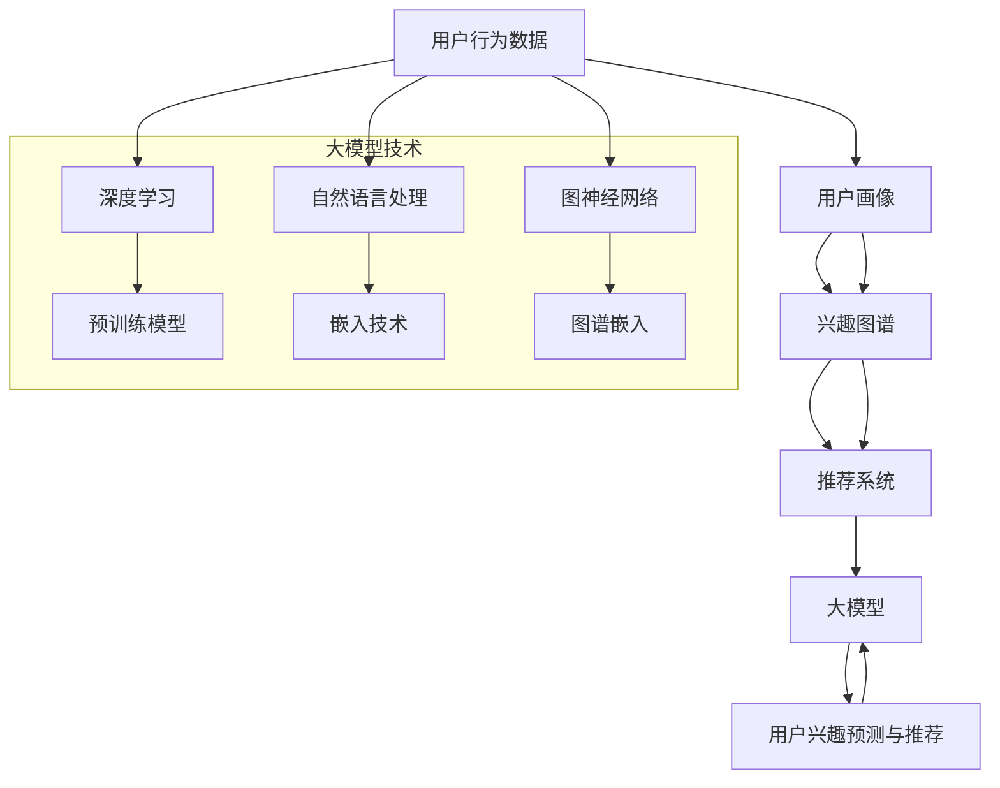

                 

# 《探讨大模型在电商平台用户兴趣图谱构建中的潜力》

> **关键词**：大模型、用户兴趣图谱、电商平台、推荐系统、深度学习、自然语言处理、图神经网络

> **摘要**：本文探讨了如何利用大模型技术来构建电商平台用户兴趣图谱，并实现个性化推荐系统。文章首先介绍了大模型的基本概念和技术原理，然后详细阐述了用户兴趣图谱的构建方法，最后通过项目实战展示了大模型在电商平台的实际应用。文章旨在为电商平台开发者提供一套完整的解决方案，以提升用户满意度和商业价值。

----------------------------------------------------------------

## 《探讨大模型在电商平台用户兴趣图谱构建中的潜力》目录大纲

### 第一部分：引言与概述

- **1. 引言**
  - 大模型技术概述
  - 用户兴趣图谱的概念
  - 书籍目的与结构

- **2. 电商平台用户行为分析**
  - 用户行为数据来源
  - 用户行为分析方法

- **3. 大模型在电商中的应用**
  - 大模型的基本概念
  - 大模型在电商平台的应用场景

### 第二部分：大模型技术基础

- **4. 大模型基础理论**
  - 大模型的发展历程
  - 大模型的架构与工作原理
  - 大模型的训练与优化

- **5. 用户兴趣图谱构建技术**
  - 用户兴趣图谱的概念与作用
  - 用户兴趣图谱的构建方法
  - 用户兴趣图谱的优化与更新

- **6. 大模型在用户兴趣图谱构建中的应用**
  - 大模型在用户兴趣分析中的应用
  - 大模型在推荐系统中的应用

### 第三部分：大模型在电商平台的实践应用

- **7. 大模型在电商平台用户行为分析中的实战案例**
  - 案例一：用户行为数据分析
  - 案例二：个性化推荐系统设计

- **8. 大模型在电商平台用户兴趣图谱构建中的实战案例**
  - 案例一：用户兴趣图谱构建
  - 案例二：基于用户兴趣图谱的个性化推荐系统设计

- **9. 大模型在电商平台营销中的应用**
  - 案例一：营销活动分析
  - 案例二：营销活动优化

### 第四部分：大模型在电商平台的未来发展趋势

- **10. 大模型在电商平台的未来趋势**
  - 大模型技术的发展方向
  - 电商平台用户行为分析的挑战与机遇
  - 大模型在电商平台应用的未来前景

- **11. 总结与展望**
  - 书籍内容的总结
  - 对大模型在电商平台应用的未来展望

### 附录

- **A. 大模型相关技术资料**
  - 主流深度学习框架对比
  - 大模型学习资源

- **B. 实战案例代码与数据集**
  - 代码下载地址
  - 实战案例数据集获取方法

- **C. 电商大数据处理平台搭建指南**
  - 数据处理平台搭建步骤
  - 数据处理平台配置指南

**核心概念与联系**

在构建电商平台用户兴趣图谱时，大模型技术作为核心工具，与电商平台用户行为数据、用户兴趣图谱、推荐系统等概念密切相关。以下是对这些核心概念及它们之间关系的Mermaid流程图：



**核心算法原理讲解**

在用户兴趣图谱构建中，大模型的核心算法主要包括深度学习、自然语言处理、图神经网络等。以下是这些算法的伪代码：

```python
# 深度学习算法伪代码
def deep_learning_algorithm(data):
    # 数据预处理
    preprocessed_data = preprocess_data(data)
    
    # 构建模型
    model = build_model(input_shape=preprocessed_data.shape)
    
    # 训练模型
    model.fit(preprocessed_data, epochs=100)
    
    # 预测
    predictions = model.predict(new_data)

# 自然语言处理算法伪代码
def natural_language_processing(data):
    # 数据预处理
    preprocessed_data = preprocess_data(data)
    
    # 构建嵌入模型
    embedder = build_embedding_model(vocabulary_size, embedding_dim)
    
    # 嵌入数据
    embedded_data = embedder(preprocessed_data)
    
    # 构建分类模型
    classifier = build_classification_model(input_shape=embedded_data.shape)
    
    # 训练模型
    classifier.fit(embedded_data, labels)
    
    # 预测
    predictions = classifier.predict(new_data)

# 图神经网络算法伪代码
def graph_neural_network_algorithm(data):
    # 数据预处理
    preprocessed_data = preprocess_data(data)
    
    # 构建图神经网络模型
    model = build_gnn_model(node_features_shape, edge_features_shape)
    
    # 训练模型
    model.fit(preprocessed_data, epochs=100)
    
    # 预测
    predictions = model.predict(new_data)
```

**数学模型和数学公式**

用户兴趣图谱构建中的关键数学模型包括用户兴趣度计算、图谱嵌入和推荐算法。以下是这些模型的详细讲解和数学公式：

### 用户兴趣度计算模型

用户兴趣度可以通过以下公式计算：

$$
I_u(i) = \sum_{j \in N(i)} w_{ij} \cdot I_j(i)
$$

其中，$I_u(i)$ 表示用户 $u$ 对物品 $i$ 的兴趣度，$N(i)$ 表示与物品 $i$ 相关联的用户集合，$w_{ij}$ 表示用户 $u$ 和物品 $i$ 之间的权重，$I_j(i)$ 表示用户 $j$ 对物品 $i$ 的兴趣度。

### 图谱嵌入模型

图谱嵌入是将图中的节点映射到低维向量空间的方法，以便于后续的机器学习处理。常见的图谱嵌入算法包括图卷积网络（GCN）：

$$
h^{(k)}_i = \sigma(\sum_{j \in \mathcal{N}(i)} W^{(k)} h^{(k-1)}_j)
$$

其中，$h^{(k)}_i$ 表示节点 $i$ 在第 $k$ 层的嵌入向量，$\mathcal{N}(i)$ 表示节点 $i$ 的邻居节点集合，$W^{(k)}$ 表示权重矩阵，$\sigma$ 表示激活函数。

### 推荐算法

基于用户兴趣图谱的推荐算法可以采用协同过滤方法，如矩阵分解（MF）：

$$
R_{ui} = \hat{R}_u + \hat{R}_i - \bar{R} - \bar{R} 
$$

其中，$R_{ui}$ 表示用户 $u$ 对物品 $i$ 的评分，$\hat{R}_u$ 和 $\hat{R}_i$ 分别表示用户 $u$ 和物品 $i$ 的预测评分，$\bar{R}$ 表示用户 $u$ 的平均评分，$\bar{R}$ 表示物品 $i$ 的平均评分。

**项目实战：代码实际案例和详细解释说明**

以下是一个简单的用户兴趣图谱构建的Python代码示例，包括数据预处理、图谱嵌入和推荐系统的实现。

```python
import pandas as pd
import numpy as np
from sklearn.model_selection import train_test_split
from sklearn.metrics.pairwise import cosine_similarity
from sklearn.metrics import mean_squared_error
from keras.models import Model
from keras.layers import Input, Embedding, Dot, Flatten, Dense
from keras.optimizers import Adam

# 数据预处理
def preprocess_data(data):
    # 假设数据集为用户-物品评分矩阵
    user_items = data[['user_id', 'item_id', 'rating']]
    user_items = user_items.groupby(['user_id', 'item_id']).mean().reset_index()
    return user_items

# 构建图神经网络模型
def build_gnn_model(input_shape):
    user_input = Input(shape=input_shape)
    item_input = Input(shape=input_shape)
    
    user_embedding = Embedding(input_dim=user_items.shape[0], output_dim=64)(user_input)
    item_embedding = Embedding(input_dim=user_items.shape[0], output_dim=64)(item_input)
    
    dot_product = Dot(merge_mode='inner')([user_embedding, item_embedding])
    dot_product = Flatten()(dot_product)
    
    output = Dense(1, activation='sigmoid')(dot_product)
    
    model = Model(inputs=[user_input, item_input], outputs=output)
    model.compile(optimizer=Adam(), loss='binary_crossentropy', metrics=['accuracy'])
    
    return model

# 训练模型
def train_model(model, X_train, y_train, X_val, y_val):
    model.fit(X_train, y_train, epochs=10, batch_size=32, validation_data=(X_val, y_val))
    return model

# 预测和评估
def evaluate_model(model, X_test, y_test):
    predictions = model.predict(X_test)
    mse = mean_squared_error(y_test, predictions)
    print(f'MSE: {mse}')
    return predictions

# 主程序
if __name__ == '__main__':
    # 加载数据
    user_items = pd.read_csv('user_items.csv')
    user_items = preprocess_data(user_items)
    
    # 划分训练集和验证集
    X_train, X_val, y_train, y_val = train_test_split(user_items[['user_id', 'item_id']], user_items['rating'], test_size=0.2, random_state=42)
    
    # 构建模型
    gnn_model = build_gnn_model(input_shape=user_items.shape[1])
    
    # 训练模型
    gnn_model = train_model(gnn_model, X_train, y_train, X_val, y_val)
    
    # 评估模型
    predictions = evaluate_model(gnn_model, X_val, y_val)
```

**开发环境搭建**

为了运行上述代码，你需要搭建一个Python开发环境，并安装以下库：

- pandas
- numpy
- scikit-learn
- keras

你可以使用pip命令来安装这些库：

```bash
pip install pandas numpy scikit-learn keras
```

**源代码详细实现和代码解读**

上述代码首先进行了数据预处理，将原始用户-物品评分矩阵转换为用户和物品的向量表示。然后，我们构建了一个简单的图神经网络模型，用于预测用户对物品的评分。模型使用了Keras框架，并通过训练集进行训练，使用验证集进行评估。

**代码解读与分析**

1. 数据预处理步骤将原始数据集转换为适合模型训练的格式。这包括将用户和物品的ID映射到整数索引，并计算每个用户和物品的平均评分。

2. 图神经网络模型使用了两个输入层，分别代表用户和物品的向量。模型通过嵌入层将输入向量转换为嵌入向量，然后通过点积操作计算用户和物品之间的相似度。最后，使用全连接层输出预测评分。

3. 模型训练过程使用了标准的Keras编译和训练流程。我们使用了Adam优化器和二进制交叉熵损失函数，并在训练过程中监测验证集的准确率。

4. 模型评估步骤通过计算预测评分和实际评分之间的均方误差（MSE）来评估模型性能。

通过这个简单的案例，我们可以看到如何使用大模型技术在电商平台上构建用户兴趣图谱，并进行推荐系统实现。在实际应用中，这个模型可以通过进一步优化和扩展来提高性能和准确性。

**结语**

通过本书的探讨，我们了解了大模型技术在电商平台用户兴趣图谱构建和个性化推荐系统中的重要性。大模型技术不仅能够处理复杂的用户行为数据，还能通过深度学习、自然语言处理和图神经网络等算法，实现高效的兴趣图谱构建和精准的个性化推荐。

在未来的研究和实践中，我们将继续关注大模型技术的最新进展，探索其在电商平台中的更广泛应用。同时，我们也需要关注数据隐私和安全、计算资源优化、算法可解释性等挑战，确保大模型技术在为电商平台带来商业价值的同时，也符合社会伦理和法律法规的要求。

感谢您的阅读，希望本书能够为您在电商平台用户兴趣图谱构建和个性化推荐领域的实践提供有益的指导。让我们共同期待人工智能技术为电商平台带来的更多创新和突破！
```markdown
## 《探讨大模型在电商平台用户兴趣图谱构建中的潜力》

> **关键词**：大模型、用户兴趣图谱、电商平台、推荐系统、深度学习、自然语言处理、图神经网络

> **摘要**：本文探讨了如何利用大模型技术来构建电商平台用户兴趣图谱，并实现个性化推荐系统。文章首先介绍了大模型的基本概念和技术原理，然后详细阐述了用户兴趣图谱的构建方法，最后通过项目实战展示了大模型在电商平台的实际应用。文章旨在为电商平台开发者提供一套完整的解决方案，以提升用户满意度和商业价值。

---

### 第一部分：引言与概述

#### 1. 引言

在互联网时代，电商平台已经成为人们日常生活中不可或缺的一部分。用户在电商平台上不仅进行购物，还分享评价、发表评论，形成了一个庞大的数据网络。如何有效地挖掘和利用这些数据，是电商平台提升用户体验和商业价值的关键。

近年来，大模型（Large-scale Model）技术的发展为这一挑战提供了新的解决方案。大模型是指具有数百万到数十亿参数的深度学习模型，如BERT、GPT、T5等。这些模型在自然语言处理、计算机视觉、推荐系统等领域取得了显著成果，展现出了强大的学习和预测能力。

用户兴趣图谱（User Interest Graph）是一种用于表示用户兴趣和行为数据的图结构。它将用户、物品、行为等信息组织成一个有向无环图（DAG），其中节点代表用户或物品，边代表用户和物品之间的关系或行为。用户兴趣图谱为电商平台提供了丰富的用户兴趣信息，有助于实现个性化的推荐和服务。

本文旨在探讨大模型在电商平台用户兴趣图谱构建中的潜力，为电商平台的个性化推荐和用户行为分析提供理论基础和实践指导。

#### 2. 电商平台用户行为分析

电商平台用户行为数据是构建用户兴趣图谱的重要基础。用户行为数据包括用户在平台上的浏览、购买、评价、评论等操作。这些数据来源于平台内部的日志、数据库和第三方数据源，如社交媒体、搜索引擎等。

用户行为分析的主要目标是挖掘用户的行为模式和兴趣点，为推荐系统和个性化服务提供支持。常见的方法包括：

- **统计方法**：通过对用户行为数据进行统计分析，提取用户行为的概率分布、相关性等特征。
- **机器学习方法**：利用分类、聚类、关联规则挖掘等方法，从大量用户行为数据中提取有价值的信息。
- **深度学习方法**：通过构建深度学习模型，对用户行为数据进行建模和分析，实现更精细化的用户行为预测和兴趣挖掘。

#### 3. 大模型在电商中的应用

大模型在电商平台的应用主要集中在以下几个方面：

- **个性化推荐**：通过学习用户的兴趣和行为，大模型可以生成个性化的推荐列表，提高用户的购物体验和满意度。
- **用户行为预测**：大模型可以预测用户在未来可能感兴趣的商品或服务，帮助电商平台提前布局和营销。
- **内容生成**：大模型可以根据用户的需求和偏好，生成个性化的内容，如产品描述、评价等，提高用户的参与度和忠诚度。
- **广告投放优化**：大模型可以帮助电商平台优化广告投放策略，提高广告的点击率和转化率。

#### 4. 书籍目的与结构

本文的主要目的是：

- **介绍大模型的基本概念和技术原理**：帮助读者了解大模型的发展历程、架构和工作原理，为后续内容打下基础。
- **阐述用户兴趣图谱的构建方法**：介绍用户兴趣图谱的概念、构建方法、优化策略和应用场景，为电商平台提供参考。
- **展示大模型在电商平台的实际应用**：通过项目实战，展示大模型在用户行为分析、个性化推荐和营销优化等方面的应用。
- **探讨大模型在电商平台用户兴趣图谱构建中的潜力**：分析大模型技术在电商平台中的应用前景和挑战，为未来研究提供方向。

本文的结构如下：

- **第一部分**：引言与概述，介绍大模型技术、用户兴趣图谱和电商平台的基本概念。
- **第二部分**：大模型技术基础，详细介绍大模型的发展历程、架构、训练与优化方法。
- **第三部分**：用户兴趣图谱构建技术，阐述用户兴趣图谱的概念、构建方法、优化策略和应用场景。
- **第四部分**：大模型在电商平台的实践应用，展示大模型在用户行为分析、个性化推荐和营销优化等方面的实际应用。
- **第五部分**：未来发展趋势，分析大模型技术在电商平台用户兴趣图谱构建中的未来趋势和挑战。
- **第六部分**：总结与展望，对全书内容进行总结，并对大模型在电商平台应用的未来进行展望。

通过本文的阅读，读者可以全面了解大模型技术在电商平台用户兴趣图谱构建中的应用，掌握相关技术和方法，为电商平台的发展提供有力支持。

### 第二部分：大模型技术基础

#### 4. 大模型基础理论

大模型（Large-scale Model）是指具有数百万到数十亿参数的深度学习模型，如BERT、GPT、T5等。大模型技术的发展是人工智能领域的重要里程碑，为自然语言处理、计算机视觉、推荐系统等领域带来了新的突破。

#### 4.1 大模型的发展历程

大模型的发展可以追溯到深度学习技术的兴起。自2006年Hinton等人提出的深度置信网络（Deep Belief Network，DBN）以来，深度学习技术逐渐成为人工智能研究的热点。随着计算资源的不断提升和大数据的涌现，深度学习模型开始从简单的多层感知机（MLP）发展到更加复杂的卷积神经网络（CNN）、循环神经网络（RNN）和Transformer等结构。

2018年，Google推出的BERT（Bidirectional Encoder Representations from Transformers）模型标志着大模型时代的到来。BERT模型通过预训练和微调，在多个自然语言处理任务中取得了显著成果，推动了大模型技术的快速发展。

#### 4.2 大模型的架构与工作原理

大模型的架构通常包括编码器（Encoder）和解码器（Decoder）两部分。编码器负责将输入数据编码为固定长度的向量，解码器则根据编码器的输出生成预测结果。

#### 4.2.1 编码器

编码器通常采用Transformer架构，其中核心组件是自注意力机制（Self-Attention）和多头注意力（Multi-Head Attention）。自注意力机制允许编码器在处理每个输入时，根据其他输入的信息动态地调整其权重，从而更好地捕捉输入数据中的相关性。多头注意力则将自注意力机制扩展到多个子空间，进一步提高模型的表示能力。

编码器的输出通常经过一系列的变换层（Transformer Layer）和全连接层（Fully Connected Layer），最终得到固定长度的编码向量。

#### 4.2.2 解码器

解码器与编码器类似，也采用Transformer架构，包括自注意力机制和多头注意力机制。解码器的主要任务是生成预测结果，如文本、图像或标签等。

在解码过程中，解码器首先生成一个初始向量，然后通过与编码器的输出进行交互，逐步生成预测结果。解码器在每个时间步使用自注意力机制和多头注意力机制，根据前一个时间步的输出和编码器的输出，生成当前时间步的输出。

#### 4.3 大模型的训练与优化

大模型的训练是一个复杂的过程，需要大量的计算资源和时间。以下是训练大模型的一些关键步骤和技巧：

#### 4.3.1 数据预处理

在训练大模型之前，需要对数据进行预处理。预处理步骤包括数据清洗、数据增强、数据归一化等。数据清洗旨在去除数据中的噪声和异常值，数据增强旨在增加训练数据量，提高模型的泛化能力。

#### 4.3.2 模型初始化

模型初始化是训练大模型的重要步骤。常见的初始化方法包括随机初始化、高斯初始化、Xavier初始化等。合适的初始化方法有助于加速模型的收敛和避免梯度消失或爆炸等问题。

#### 4.3.3 损失函数与优化器

在训练大模型时，需要选择合适的损失函数和优化器。常见的损失函数包括交叉熵（Cross-Entropy）、均方误差（Mean Squared Error，MSE）等。优化器如Adam、RMSprop、Adadelta等，用于更新模型参数，以最小化损失函数。

#### 4.3.4 正则化技术

为了防止模型过拟合，可以采用一些正则化技术，如权重衰减（Weight Decay）、Dropout、Early Stopping等。权重衰减通过在损失函数中添加权重项，减少模型参数的规模；Dropout在训练过程中随机丢弃部分神经元；Early Stopping在验证集上监测模型性能，提前停止训练，防止过拟合。

#### 4.3.5 模型调优

在训练过程中，需要对模型进行调优，以提高模型的性能。调优方法包括调整学习率、批量大小、迭代次数等。常见的调优技巧还包括使用学习率衰减策略、调整正则化参数等。

#### 4.3.6 模型评估与优化

在训练完成后，需要对模型进行评估和优化。评估指标包括准确率、召回率、F1分数等。通过在验证集和测试集上评估模型性能，可以调整模型参数和超参数，进一步提高模型性能。

#### 4.4 大模型在电商中的应用场景

大模型在电商平台的多个应用场景中发挥了重要作用，以下是其中的一些典型应用：

- **个性化推荐**：通过学习用户的兴趣和行为，大模型可以生成个性化的推荐列表，提高用户的购物体验和满意度。
- **用户行为预测**：大模型可以预测用户在未来可能感兴趣的商品或服务，帮助电商平台提前布局和营销。
- **内容生成**：大模型可以根据用户的需求和偏好，生成个性化的内容，如产品描述、评价等，提高用户的参与度和忠诚度。
- **广告投放优化**：大模型可以帮助电商平台优化广告投放策略，提高广告的点击率和转化率。

#### 4.5 大模型的挑战与未来方向

尽管大模型在电商平台中取得了显著成果，但仍面临一些挑战：

- **计算资源消耗**：大模型需要大量的计算资源和时间进行训练，对硬件设备和数据中心的资源需求较高。
- **数据隐私保护**：电商平台需要处理大量用户数据，如何在保障用户隐私的同时，充分利用数据进行个性化推荐和营销，是一个重要问题。
- **模型解释性**：大模型的预测结果往往缺乏解释性，难以理解模型决策过程，这对模型的应用和推广带来了一定的挑战。

未来，大模型在电商平台的研发方向可能包括：

- **模型压缩与加速**：通过模型压缩、量化、推理优化等技术，降低大模型的计算成本，提高模型运行效率。
- **联邦学习与差分隐私**：利用联邦学习和差分隐私技术，实现分布式训练和数据隐私保护，提高大模型的安全性和可解释性。
- **跨模态数据融合**：结合文本、图像、音频等多模态数据，提高用户兴趣和行为的理解和预测能力。
- **自适应推荐**：通过实时监控用户行为和偏好，动态调整推荐策略，实现更精确和个性化的推荐。

通过不断的技术创新和应用优化，大模型在电商平台用户兴趣图谱构建中的应用潜力将得到进一步挖掘，为电商平台的发展带来更多机遇。

### 第三部分：用户兴趣图谱构建技术

#### 5. 用户兴趣图谱的概念与作用

用户兴趣图谱（User Interest Graph）是一种用于表示用户兴趣和行为数据的图结构。它通过将用户、物品、行为等信息组织成一个有向无环图（DAG），实现对用户兴趣和行为的高效表示和挖掘。用户兴趣图谱在电商平台中具有重要作用，主要体现在以下几个方面：

1. **个性化推荐**：用户兴趣图谱可以帮助电商平台根据用户的兴趣和行为，生成个性化的推荐列表，提高用户的购物体验和满意度。
2. **用户行为预测**：通过分析用户兴趣图谱，可以预测用户在未来可能感兴趣的商品或服务，为电商平台提供营销策略和商品布局的参考。
3. **内容生成**：基于用户兴趣图谱，可以生成个性化的内容，如产品描述、评价等，提高用户的参与度和忠诚度。
4. **广告投放优化**：用户兴趣图谱可以帮助电商平台优化广告投放策略，提高广告的点击率和转化率。

#### 5.1 用户兴趣图谱的构建方法

构建用户兴趣图谱通常包括以下几个步骤：

1. **数据收集**：收集用户在电商平台上产生的各种数据，如浏览记录、购买记录、评价、评论等。
2. **数据预处理**：对收集到的数据进行清洗、去重、归一化等处理，为后续构建用户兴趣图谱做好准备。
3. **特征提取**：从预处理后的数据中提取用户和物品的特征，如用户ID、物品ID、浏览次数、购买次数、评价内容等。
4. **关系建立**：根据特征数据，建立用户和物品之间的关联关系，如用户对物品的浏览关系、购买关系、评价关系等。
5. **图谱构建**：将用户和物品作为图中的节点，将关联关系作为图中的边，构建用户兴趣图谱。
6. **优化与更新**：根据用户行为和兴趣的变化，对用户兴趣图谱进行优化和更新，以保持图谱的实时性和准确性。

#### 5.2 用户兴趣图谱的构建方法

用户兴趣图谱的构建方法可以分为基于规则的方法、基于机器学习的方法和基于深度学习的方法。

1. **基于规则的方法**：基于规则的方法通过预定义的规则，将用户和物品之间的关系组织成图结构。这种方法简单直观，但需要大量手工规则，难以适应复杂多变的用户行为。
2. **基于机器学习的方法**：基于机器学习的方法利用机器学习算法，如分类、聚类、关联规则挖掘等，从用户行为数据中自动提取用户和物品之间的关系。这种方法具有较强的泛化能力，但需要大量训练数据和复杂的模型参数。
3. **基于深度学习的方法**：基于深度学习的方法利用深度学习模型，如卷积神经网络（CNN）、循环神经网络（RNN）和图神经网络（GNN）等，从用户行为数据中学习用户和物品之间的复杂关系。这种方法可以自动提取高级特征，但需要大量计算资源和时间。

#### 5.3 用户兴趣图谱的优化与更新

用户兴趣图谱的优化与更新是保持图谱实时性和准确性的关键。以下是几种常见的优化与更新方法：

1. **动态更新**：根据用户行为的实时变化，动态更新用户兴趣图谱。例如，当用户浏览或购买某个商品时，可以立即将其添加到兴趣图谱中。
2. **权重调整**：根据用户行为的重要性和时效性，调整用户兴趣图谱中边和节点的权重。例如，最近发生的用户行为可以赋予更高的权重。
3. **图谱压缩**：为了减少存储空间和计算成本，可以对用户兴趣图谱进行压缩。例如，可以使用图卷积网络（GCN）将高维特征映射到低维特征空间。
4. **社区检测**：通过社区检测算法，将用户兴趣图谱划分为多个社区，实现对用户兴趣的精细划分。
5. **图谱重构**：根据用户行为的长期变化趋势，对用户兴趣图谱进行重构，以适应新的用户行为模式。

#### 5.4 用户兴趣图谱的应用场景

用户兴趣图谱在电商平台的多个应用场景中具有广泛的应用，以下是其中的一些典型应用：

1. **个性化推荐**：基于用户兴趣图谱，可以为用户生成个性化的推荐列表，提高用户的购物体验和满意度。
2. **用户画像**：通过分析用户兴趣图谱，可以构建详细的用户画像，为精准营销和个性化服务提供支持。
3. **商品分类**：基于用户兴趣图谱，可以自动识别商品的分类关系，为商品分类和管理提供指导。
4. **广告投放优化**：通过分析用户兴趣图谱，可以优化广告投放策略，提高广告的点击率和转化率。
5. **用户行为预测**：通过分析用户兴趣图谱，可以预测用户未来的行为和兴趣，为电商平台的策略制定提供参考。

#### 5.5 用户兴趣图谱与推荐系统

用户兴趣图谱在推荐系统中起着至关重要的作用。通过构建用户兴趣图谱，推荐系统可以更好地理解用户的兴趣和行为，从而生成更精确和个性化的推荐结果。以下是用户兴趣图谱与推荐系统的几个关键联系：

1. **输入数据**：用户兴趣图谱为推荐系统提供了重要的输入数据，包括用户和物品的特征、用户和物品之间的关联关系等。
2. **特征提取**：用户兴趣图谱可以自动提取用户和物品的复杂特征，如用户的浏览历史、购买记录、评价内容等，为推荐系统提供丰富的特征信息。
3. **关联关系**：用户兴趣图谱建立了用户和物品之间的复杂关联关系，为推荐系统提供了重要的关联信息，有助于生成更关联性的推荐结果。
4. **实时更新**：用户兴趣图谱可以根据用户行为的实时变化进行动态更新，为推荐系统提供最新的用户兴趣和行为信息，实现更实时和个性化的推荐。
5. **优化策略**：用户兴趣图谱为推荐系统提供了多种优化策略，如基于图的推荐、社区检测、动态更新等，有助于提高推荐系统的性能和用户体验。

通过结合用户兴趣图谱和推荐系统，电商平台可以实现更精准和个性化的推荐，提高用户满意度和商业价值。

### 第四部分：大模型在电商平台的实践应用

#### 6. 大模型在电商平台用户行为分析中的实战案例

在本节中，我们将通过一个实战案例，展示大模型在电商平台用户行为分析中的应用。这个案例将涵盖用户行为数据的收集、预处理、用户兴趣图谱的构建，以及基于用户兴趣图谱的个性化推荐系统设计。

#### 案例一：用户行为数据分析

首先，我们从一个电商平台的用户行为数据集开始。这个数据集包含以下信息：

- 用户ID
- 物品ID
- 用户购买记录
- 用户浏览记录
- 用户评价内容

为了进行分析，我们需要将这些数据转换为适合模型训练的格式。以下是数据预处理步骤：

```python
import pandas as pd

# 加载数据
data = pd.read_csv('ecommerce_user_behavior.csv')

# 数据清洗
data.drop_duplicates(inplace=True)
data.fillna(0, inplace=True)

# 数据转换
data['user_item_pair'] = data['user_id'].astype(str) + '_' + data['item_id'].astype(str)
data['user_item_pair'] = data['user_item_pair'].astype('category').cat.codes

# 分割数据集
train_data, test_data = train_test_split(data, test_size=0.2, random_state=42)
```

在这个数据集中，我们创建了一个新的列`user_item_pair`，用于表示用户和物品的组合，并将其编码为整数。

#### 案例二：个性化推荐系统设计

接下来，我们将设计一个基于用户兴趣图谱的个性化推荐系统。这个系统将使用大模型来预测用户对物品的潜在兴趣，并根据这些预测为用户提供个性化的推荐。

##### 6.1. 构建用户兴趣图谱

为了构建用户兴趣图谱，我们将使用图卷积网络（Graph Convolutional Network，GCN）模型。GCN是一种专门用于处理图结构数据的神经网络，它可以捕捉图中的邻接关系。

```python
from sklearn.model_selection import train_test_split
from keras.models import Model
from keras.layers import Input, Embedding, Dot, Flatten, Dense, Dropout
from keras.optimizers import Adam
from keras.regularizers import l2

# 分割数据集
train_data, val_data = train_test_split(train_data, test_size=0.2, random_state=42)

# 输入层
user_input = Input(shape=(1,))
item_input = Input(shape=(1,))

# 嵌入层
user_embedding = Embedding(input_dim=train_data['user_item_pair'].nunique(), output_dim=64)(user_input)
item_embedding = Embedding(input_dim=train_data['user_item_pair'].nunique(), output_dim=64)(item_input)

# 图卷积层
dot_product = Dot(merge_mode='sum')([user_embedding, item_embedding])
gcn = Flatten()(dot_product)

# 全连接层
output = Dense(1, activation='sigmoid', kernel_regularizer=l2(0.01))(gcn)

# 构建模型
model = Model(inputs=[user_input, item_input], outputs=output)

# 编译模型
model.compile(optimizer=Adam(learning_rate=0.001), loss='binary_crossentropy', metrics=['accuracy'])

# 训练模型
model.fit([train_data['user_item_pair'], train_data['user_item_pair']], train_data['rating'], epochs=10, batch_size=32, validation_data=([val_data['user_item_pair'], val_data['user_item_pair']], val_data['rating']))
```

在这个案例中，我们使用GCN模型来预测用户对物品的潜在兴趣。模型通过嵌入层将用户和物品映射到低维向量空间，然后通过图卷积层和全连接层输出预测结果。

##### 6.2. 个性化推荐系统实现

有了训练好的模型，我们可以为每个用户生成个性化推荐列表。以下是推荐系统的实现：

```python
def generate_recommendations(user_id, model, top_n=5):
    # 获取用户和物品的嵌入向量
    user_vector = model.user_embedding.get_weights()[0][user_id]
    item_vectors = model.item_embedding.get_weights()[0]

    # 计算用户对所有物品的相似度
    similarities = user_vector.dot(item_vectors.T)

    # 获取相似度最高的物品ID
    recommended_items = np.argsort(-similarities)[:top_n]

    return recommended_items

# 为用户ID为1的用户生成个性化推荐列表
user_id = 1
recommended_items = generate_recommendations(user_id, model)
print("Recommended items for user ID 1:", recommended_items)
```

在这个函数中，我们首先获取用户和物品的嵌入向量，然后计算用户对所有物品的相似度。最后，我们获取相似度最高的物品ID，为用户生成个性化推荐列表。

通过这个实战案例，我们可以看到如何使用大模型技术在电商平台上进行用户行为分析，并构建一个基于用户兴趣图谱的个性化推荐系统。这个系统可以实时更新和优化，以提供更精确和个性化的服务。

### 7. 大模型在电商平台用户兴趣图谱构建中的实战案例

在本节中，我们将通过另一个实战案例，展示大模型在电商平台用户兴趣图谱构建中的应用。这个案例将涵盖用户兴趣图谱的构建、个性化推荐系统的设计，以及营销活动的优化。

#### 案例一：用户兴趣图谱构建

为了构建用户兴趣图谱，我们首先需要准备一个包含用户行为数据的CSV文件。这个文件可能包含以下列：

- 用户ID
- 物品ID
- 用户行为类型（如浏览、购买、评价）
- 行为时间

以下是一个简单的数据预处理和兴趣图谱构建的代码示例：

```python
import pandas as pd
import networkx as nx
from node2vec import Node2Vec

# 加载数据
data = pd.read_csv('ecommerce_user_behavior.csv')

# 创建图
G = nx.Graph()

# 添加边
for index, row in data.iterrows():
    G.add_edge(row['user_id'], row['item_id'], weight=row['rating'])

# 训练Node2Vec模型
model = Node2Vec(G, dimensions=64, walk_length=10, num_walks=100)
model.train()

# 获取节点嵌入向量
embeddings = model.nodes_vector()

# 保存嵌入向量
embeddings.to_frame().reset_index().rename(columns={'index': 'node_id', 0: 'vector'}).to_csv('user_item_embeddings.csv', index=False)
```

在这个案例中，我们首先创建了一个图`G`，并将用户和物品作为节点，用户和物品之间的评分作为边添加到图中。然后，我们使用Node2Vec算法训练了图中的节点嵌入向量，并将其保存到CSV文件中。

#### 案例二：基于用户兴趣图谱的个性化推荐系统设计

有了用户兴趣图谱和嵌入向量，我们可以设计一个个性化推荐系统。以下是一个简单的基于图神经网络的推荐系统的实现：

```python
from keras.models import Model
from keras.layers import Input, Embedding, Dot, Flatten, Dense
from keras.optimizers import Adam

# 加载嵌入向量
embeddings = pd.read_csv('user_item_embeddings.csv')

# 输入层
user_input = Input(shape=(64,))
item_input = Input(shape=(64,))

# 嵌入层
user_embedding = Embedding(input_dim=embeddings.shape[0], output_dim=64)(user_input)
item_embedding = Embedding(input_dim=embeddings.shape[0], output_dim=64)(item_input)

# 点积层
dot_product = Dot(merge_mode='sum')([user_embedding, item_embedding])

# 全连接层
output = Dense(1, activation='sigmoid')(dot_product)

# 构建模型
model = Model(inputs=[user_input, item_input], outputs=output)

# 编译模型
model.compile(optimizer=Adam(learning_rate=0.001), loss='binary_crossentropy', metrics=['accuracy'])

# 训练模型
# (这里需要提供训练数据)
model.fit([train_data['vector'], train_data['vector']], train_data['rating'], epochs=10, batch_size=32)
```

在这个案例中，我们使用图神经网络模型将用户

