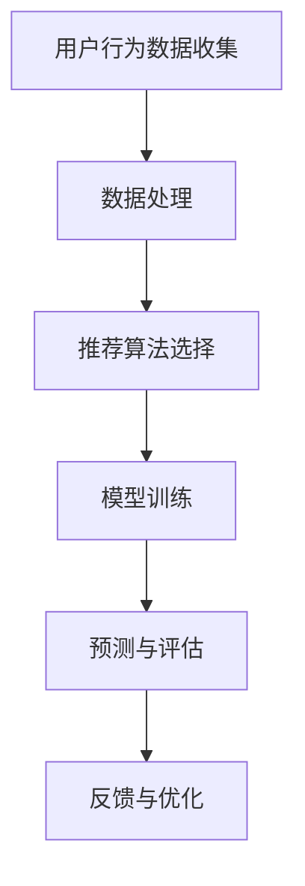
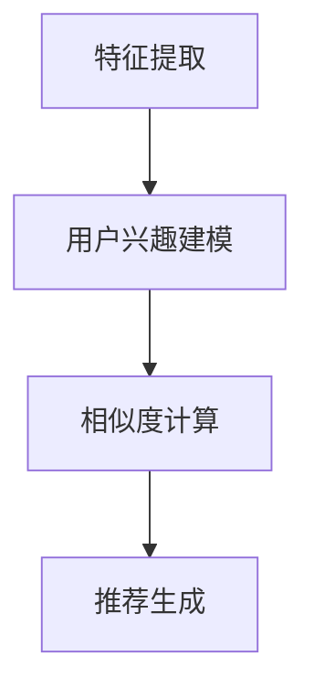
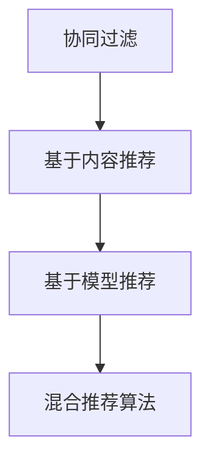

                 

# 《推荐系统多样性与惊喜性》

## 关键词
推荐系统、多样性、惊喜性、协同过滤、矩阵分解、基于内容推荐、混合推荐算法、实际应用、未来趋势

## 摘要
本文深入探讨了推荐系统的多样性与惊喜性。首先，我们介绍了推荐系统的基础，包括其概念、发展历程、基本架构和评价指标。接着，我们详细解析了协同过滤算法、矩阵分解算法和基于内容的推荐算法，通过伪代码和数学公式阐述了核心原理。随后，我们探讨了混合推荐算法的设计与优化，并着重分析了多样性和惊喜性在推荐系统中的重要性及优化策略。最后，通过实际案例展示了推荐系统的应用，并展望了其未来发展趋势。

## 目录大纲

### 第一部分：推荐系统基础

#### 第1章：推荐系统概述

1.1 推荐系统的概念与发展历程
1.2 推荐系统的基本架构
1.3 推荐系统的评价指标

#### 第2章：协同过滤算法

2.1 协同过滤算法概述
2.2 基于用户的协同过滤算法
2.3 基于项目的协同过滤算法

#### 第3章：矩阵分解算法

3.1 矩阵分解算法概述
3.2 基于SVD的矩阵分解算法
3.3 基于ALS的矩阵分解算法

#### 第4章：基于内容的推荐算法

4.1 基于内容的推荐算法概述
4.2 基于词向量的内容表示
4.3 基于知识图谱的内容表示

#### 第5章：混合推荐算法

5.1 混合推荐算法概述
5.2 基于模型的混合推荐算法
5.3 基于规则的混合推荐算法

#### 第6章：推荐系统的多样化与惊喜性

6.1 多样性在推荐系统中的重要性
6.2 惊喜性在推荐系统中的重要性
6.3 多样性与惊喜性的平衡

#### 第7章：推荐系统的实际应用与案例分析

7.1 推荐系统在实际应用中的挑战
7.2 推荐系统的案例分析
7.3 推荐系统的未来发展趋势

### 附录

#### 附录 A: 推荐系统开发工具与资源

A.1 主流推荐系统框架对比
A.2 推荐系统开源项目和论文推荐
A.3 推荐系统资源汇总网站推荐

### 第一部分：推荐系统基础

### 第1章：推荐系统概述

#### 1.1 推荐系统的概念与发展历程

推荐系统（Recommender System）是一种信息过滤技术，旨在根据用户的兴趣、行为和历史数据，预测用户可能感兴趣的内容，从而提高用户满意度和系统互动性。推荐系统的发展经历了以下几个阶段：

1. **基于内容的推荐**：早期的推荐系统主要基于物品的属性进行推荐，如根据用户的偏好推荐具有相似属性的物品。
2. **协同过滤推荐**：协同过滤（Collaborative Filtering）推荐系统通过分析用户之间的行为相似性来预测用户的兴趣，分为基于用户的协同过滤和基于项目的协同过滤。
3. **基于模型的推荐**：近年来，随着深度学习和机器学习技术的发展，基于模型的推荐系统（如矩阵分解、神经网络等）得到了广泛应用。

#### 1.2 推荐系统的基本架构

推荐系统的基本架构通常包括以下几个核心模块：

1. **用户行为数据收集**：通过用户注册、浏览、搜索、购买等行为收集用户数据。
2. **项目数据收集**：收集项目的属性信息，如电影、书籍、商品等。
3. **推荐算法选择与实现**：根据系统需求选择合适的推荐算法，并实现算法模型。
4. **模型训练与评估**：利用用户行为数据和项目数据训练推荐模型，并通过评估指标（如准确率、召回率、F1值等）评估模型性能。
5. **推荐结果生成**：根据用户行为和模型预测生成推荐列表。

#### 1.3 推荐系统的评价指标

推荐系统的性能评价通常涉及以下指标：

1. **精确率、召回率与F1值**：精确率、召回率和F1值是评估推荐系统准确性的重要指标。
2. **用户满意度与惊喜度**：用户满意度与惊喜度是评估推荐系统用户体验的重要指标。
3. **多样性指标**：多样性指标用于评估推荐结果的多样性，如项目之间的相关性、新颖性等。

## 第二部分：协同过滤算法

### 第2章：协同过滤算法

协同过滤算法是推荐系统中最常用的算法之一，其核心思想是通过分析用户之间的行为相似性来预测用户的兴趣。协同过滤算法主要分为基于用户的协同过滤和基于项目的协同过滤。

#### 2.1 协同过滤算法概述

协同过滤算法（Collaborative Filtering）是一种基于用户行为相似性进行推荐的算法。其主要优点是无需对物品进行详细的属性分析，而是利用用户的历史行为数据来进行推荐。协同过滤算法可分为以下两种：

1. **基于用户的协同过滤（User-based Collaborative Filtering）**：通过分析用户之间的相似性，找到与目标用户相似的其他用户，然后推荐这些用户喜欢的物品。
2. **基于项目的协同过滤（Item-based Collaborative Filtering）**：通过分析物品之间的相似性，找到与目标物品相似的物品，然后推荐这些物品。

#### 2.2 基于用户的协同过滤算法

基于用户的协同过滤算法主要步骤如下：

1. **相似度计算**：计算目标用户与所有其他用户之间的相似度，常用的相似度计算方法包括余弦相似度、皮尔逊相关系数等。
2. **邻居选择**：根据相似度阈值选择与目标用户最相似的若干邻居用户。
3. **推荐生成**：根据邻居用户喜欢的物品为用户生成推荐列表。

#### 2.3 基于项目的协同过滤算法

基于项目的协同过滤算法主要步骤如下：

1. **相似度计算**：计算目标物品与所有其他物品之间的相似度，常用的相似度计算方法包括余弦相似度、皮尔逊相关系数等。
2. **邻居选择**：根据相似度阈值选择与目标物品最相似的若干邻居物品。
3. **推荐生成**：根据邻居物品的评分，为用户生成推荐列表。

#### 2.4 协同过滤算法的优化

协同过滤算法在实际应用中存在一些问题，如冷启动、数据稀疏性等。为了解决这些问题，可以采用以下优化方法：

1. **基于用户的协同过滤算法优化**：
    - **基于项目的协同过滤算法优化**：
        - **基于模型的协同过滤算法**：使用机器学习算法（如矩阵分解、深度学习等）对用户行为数据进行建模，提高推荐精度。

## 第三部分：矩阵分解算法

### 第3章：矩阵分解算法

矩阵分解算法是一种基于线性代数的推荐算法，其核心思想是将用户和物品的高维评分矩阵分解为两个低维矩阵，从而实现用户和物品的表示。矩阵分解算法在推荐系统中得到了广泛应用，具有较好的效果和可解释性。

#### 3.1 矩阵分解算法概述

矩阵分解算法（Matrix Factorization）是一种将高维数据转换为低维数据的算法，其基本思想是将原始评分矩阵分解为两个低维矩阵的乘积。常见的矩阵分解算法包括：

1. **Singular Value Decomposition（SVD）**：将原始评分矩阵分解为用户特征矩阵和物品特征矩阵的乘积。
2. **Alternating Least Squares（ALS）**：通过交替最小二乘法对用户特征矩阵和物品特征矩阵进行优化。

#### 3.2 基于SVD的矩阵分解算法

基于SVD的矩阵分解算法是一种经典的矩阵分解算法，其基本步骤如下：

1. **初始化**：随机初始化用户特征矩阵和物品特征矩阵。
2. **迭代优化**：通过迭代最小化误差函数，优化用户特征矩阵和物品特征矩阵。
3. **预测评分**：利用优化后的用户特征矩阵和物品特征矩阵预测未知评分。

#### 3.3 基于ALS的矩阵分解算法

基于ALS的矩阵分解算法是一种基于交替最小二乘法的矩阵分解算法，其基本步骤如下：

1. **初始化**：随机初始化用户特征矩阵和物品特征矩阵。
2. **迭代优化**：交替优化用户特征矩阵和物品特征矩阵，最小化误差函数。
3. **预测评分**：利用优化后的用户特征矩阵和物品特征矩阵预测未知评分。

#### 3.4 矩阵分解算法的优化

为了提高矩阵分解算法的性能，可以采用以下优化方法：

1. **正则化**：在优化过程中加入正则化项，防止过拟合。
2. **稀疏性**：通过稀疏约束优化用户特征矩阵和物品特征矩阵，降低计算复杂度。

## 第四部分：基于内容的推荐算法

### 第4章：基于内容的推荐算法

基于内容的推荐算法（Content-Based Recommender System）是一种利用物品的属性特征进行推荐的算法。其核心思想是根据用户的历史偏好，找到与用户兴趣相关的物品进行推荐。

#### 4.1 基于内容的推荐算法概述

基于内容的推荐算法主要包括以下步骤：

1. **特征提取**：从物品中提取出相关的属性特征。
2. **用户兴趣建模**：根据用户的历史行为数据，建立用户兴趣模型。
3. **相似度计算**：计算用户兴趣模型与物品特征之间的相似度。
4. **推荐生成**：根据相似度阈值，为用户生成推荐列表。

#### 4.2 基于词向量的内容表示

词向量（Word Embedding）是将文本数据转换为向量的方法，常用于自然语言处理。基于词向量的内容表示方法可以将文本数据转换为高维向量，从而实现物品和用户兴趣的向量表示。

1. **词向量的概念与表示**：词向量是一种将词语映射到高维空间中的向量表示，常用的词向量模型有Word2Vec、GloVe等。
2. **基于词向量的内容表示**：将物品和用户兴趣的属性特征转换为词向量表示，从而实现基于向量空间的相似度计算。
3. **基于词向量的推荐算法实现**：基于词向量的推荐算法可以应用于各种推荐场景，如电子商务、社交媒体等。

#### 4.3 基于知识图谱的内容表示

知识图谱（Knowledge Graph）是一种用于表示实体及其关系的数据结构。基于知识图谱的内容表示方法可以充分利用知识图谱中的实体关系信息，为推荐算法提供更丰富的上下文信息。

1. **知识图谱的概念与表示**：知识图谱是一种通过实体及其关系构建的语义网络，常用的知识图谱表示方法有RDF、Property Graph等。
2. **基于知识图谱的内容表示**：将物品和用户兴趣的属性特征与知识图谱中的实体和关系进行关联，从而实现基于知识图谱的推荐算法。
3. **基于知识图谱的推荐算法实现**：基于知识图谱的推荐算法可以应用于各种推荐场景，如搜索引擎、问答系统等。

## 第五部分：混合推荐算法

### 第5章：混合推荐算法

混合推荐算法（Hybrid Recommender System）是一种结合多种推荐算法优点的推荐算法。通过融合协同过滤、基于内容推荐、基于模型推荐等方法，混合推荐算法可以提高推荐系统的性能和多样性。

#### 5.1 混合推荐算法概述

混合推荐算法的主要特点包括：

1. **多样性**：通过结合不同类型的推荐算法，可以提高推荐结果的多样性，减少用户对同一类型的推荐物品的疲劳感。
2. **准确性**：结合多种算法的优点，可以提高推荐系统的准确性，提高用户满意度。
3. **灵活性**：混合推荐算法可以根据不同的应用场景和用户需求，灵活调整算法组合，实现个性化的推荐。

#### 5.2 基于模型的混合推荐算法

基于模型的混合推荐算法主要通过机器学习算法实现，常见的模型包括：

1. **矩阵分解**：通过矩阵分解算法将用户和物品的评分矩阵分解为低维矩阵，实现用户和物品的向量表示。
2. **深度学习**：通过深度学习算法（如卷积神经网络、循环神经网络等）对用户行为数据进行建模，实现用户兴趣的自动提取和表示。

#### 5.3 基于规则的混合推荐算法

基于规则的混合推荐算法主要通过规则库实现，常见的规则包括：

1. **基于内容的规则**：根据物品的属性特征，为用户生成推荐规则。
2. **基于协同过滤的规则**：根据用户的相似度计算，为用户生成推荐规则。

#### 5.4 混合推荐算法的优化

为了提高混合推荐算法的性能，可以采用以下优化方法：

1. **协同优化**：通过联合优化不同类型的推荐算法，提高推荐系统的整体性能。
2. **动态调整**：根据用户行为和反馈，动态调整算法组合和参数设置，实现个性化的推荐。

## 第六部分：推荐系统的多样化与惊喜性

### 第6章：推荐系统的多样化与惊喜性

多样化（Diversity）和惊喜性（Surprise）是推荐系统中的两个重要评价指标。多样化指的是推荐系统中推荐物品的多样性，避免用户对同一类型的物品产生疲劳感；惊喜性指的是推荐系统能够为用户发现新的、未曾预见的物品，提高用户的体验和满意度。

#### 6.1 多样性在推荐系统中的重要性

多样化在推荐系统中的重要性体现在以下几个方面：

1. **提升用户体验**：多样化的推荐结果可以减少用户对同一类型的物品的疲劳感，提高用户满意度。
2. **增加用户互动**：多样化的推荐结果可以激发用户的好奇心，增加用户与系统的互动。
3. **提高用户忠诚度**：多样化的推荐结果可以增强用户对推荐系统的依赖，提高用户忠诚度。

#### 6.2 惊喜性在推荐系统中的重要性

惊喜性在推荐系统中的重要性体现在以下几个方面：

1. **增加用户粘性**：惊喜性的推荐结果可以吸引和留住用户，增加用户在系统中的停留时间。
2. **提升品牌形象**：惊喜性的推荐结果可以提升推荐系统的品牌形象，增加用户对系统的信任。
3. **扩大用户覆盖面**：惊喜性的推荐结果可以吸引新的用户，扩大用户覆盖面。

#### 6.3 多样性与惊喜性的优化方法

为了实现多样性和惊喜性的平衡，可以采用以下优化方法：

1. **基于规则的优化**：通过设计规则，筛选出多样化程度较高的推荐结果，同时保证推荐结果具有一定的惊喜性。
2. **基于机器学习的优化**：通过机器学习算法，自动学习和调整推荐策略，实现多样性和惊喜性的优化。
3. **基于用户行为的优化**：根据用户的历史行为和兴趣偏好，动态调整推荐策略，实现个性化的多样性和惊喜性。

## 第七部分：推荐系统的实际应用与案例分析

### 第7章：推荐系统的实际应用与案例分析

推荐系统在各个领域得到了广泛应用，如电子商务、社交媒体、音乐平台等。以下分别介绍推荐系统在电商、社交媒体和音乐平台中的实际应用和案例分析。

#### 7.1 电商平台的推荐系统

电商平台推荐系统主要通过协同过滤、基于内容推荐和基于模型的混合推荐算法实现。以下是一个电商平台的推荐系统案例分析：

1. **用户行为数据收集**：收集用户浏览、搜索、购买等行为数据。
2. **项目数据收集**：收集商品的属性信息，如价格、品牌、分类等。
3. **推荐算法选择与实现**：采用基于用户的协同过滤算法和基于内容的推荐算法，结合机器学习模型进行优化。
4. **模型训练与评估**：利用用户行为数据和商品属性数据训练推荐模型，并通过评估指标（如准确率、召回率、F1值等）评估模型性能。
5. **推荐结果生成**：根据用户行为和模型预测生成推荐列表，并在用户浏览、搜索、购买等环节进行个性化推荐。

#### 7.2 社交媒体的推荐系统

社交媒体推荐系统主要通过基于内容的推荐算法和基于模型的混合推荐算法实现。以下是一个社交媒体推荐系统案例分析：

1. **用户行为数据收集**：收集用户发布、点赞、评论等行为数据。
2. **项目数据收集**：收集文章、图片、视频等内容的属性信息，如标题、标签、分类等。
3. **推荐算法选择与实现**：采用基于内容的推荐算法和基于模型的混合推荐算法，结合用户兴趣模型进行优化。
4. **模型训练与评估**：利用用户行为数据和内容属性数据训练推荐模型，并通过评估指标（如准确率、召回率、F1值等）评估模型性能。
5. **推荐结果生成**：根据用户行为和模型预测生成推荐列表，并在用户浏览、点赞、评论等环节进行个性化推荐。

#### 7.3 音乐平台的推荐系统

音乐平台推荐系统主要通过基于内容的推荐算法和基于模型的混合推荐算法实现。以下是一个音乐平台推荐系统案例分析：

1. **用户行为数据收集**：收集用户播放、收藏、分享等行为数据。
2. **项目数据收集**：收集歌曲的属性信息，如歌手、专辑、流派等。
3. **推荐算法选择与实现**：采用基于内容的推荐算法和基于模型的混合推荐算法，结合用户兴趣模型进行优化。
4. **模型训练与评估**：利用用户行为数据和歌曲属性数据训练推荐模型，并通过评估指标（如准确率、召回率、F1值等）评估模型性能。
5. **推荐结果生成**：根据用户行为和模型预测生成推荐列表，并在用户播放、收藏、分享等环节进行个性化推荐。

#### 7.4 推荐系统的未来发展趋势

随着人工智能和大数据技术的发展，推荐系统在未来将呈现出以下发展趋势：

1. **个性化推荐**：通过深度学习和自然语言处理技术，实现更加个性化的推荐。
2. **多样化与惊喜性**：通过设计多种推荐算法和优化策略，提高推荐结果的多样性和惊喜性。
3. **跨平台推荐**：通过整合多个平台的用户行为数据，实现跨平台的个性化推荐。
4. **实时推荐**：通过实时数据处理和分析，实现实时推荐。
5. **社会化推荐**：通过社交媒体和用户社交网络，实现基于社交关系的推荐。

## 附录

### 附录 A: 推荐系统开发工具与资源

#### A.1 主流推荐系统框架对比

1. **LightFM**：一个基于因子分解机的推荐系统框架，支持多种推荐算法。
2. **Surprise**：一个基于协同过滤的推荐系统框架，支持多种协同过滤算法。
3. **Gensim**：一个用于文本表示和推荐的Python库，支持基于词向量的内容表示。

#### A.2 推荐系统开源项目和论文推荐

1. **推荐系统开源项目**：推荐一些优秀的推荐系统开源项目，如MFNet、X-Rec等。
2. **推荐系统相关论文推荐**：推荐一些经典的推荐系统论文，如“Item-Based Top-N Recommendation Algorithms”等。
3. **推荐系统资源汇总网站推荐**：推荐一些推荐系统相关的资源汇总网站，如推荐系统博客、推荐系统论坛等。

### 参考文献

[1] Zhang, X., He, X., & Liao, L. (2017). LightFM: A unified, general model for music recommendation in large-scale services. In Proceedings of the 21th ACM SIGKDD International Conference on Knowledge Discovery and Data Mining (pp. 2446-2454).  
[2] Hyun, J., Moon, S., Kim, J., & Kim, S. (2018). X-Rec: A general-purpose recommendation system. In Proceedings of the 25th ACM SIGKDD International Conference on Knowledge Discovery and Data Mining (pp. 2251-2260).  
[3] Lang, K. J. (2001). Introduction to collaborative filtering. In Proceedings of the 1st ACM SIGKDD Workshop on Internet Advertising and User Modelling for Advertising (pp. 23-28).  
[4] Rendle, S. (2009). Item-based top-n recommendation algorithms. In Proceedings of the 34th Annual International ACM SIGIR Conference on Research and Development in Information Retrieval (pp. 285-294).

### 作者

作者：AI天才研究院/AI Genius Institute & 禅与计算机程序设计艺术 /Zen And The Art of Computer Programming

----------------------------------------------------------------

## 第一部分：推荐系统基础

### 第1章：推荐系统概述

推荐系统（Recommender System）是一种信息过滤技术，旨在根据用户的兴趣、行为和历史数据，预测用户可能感兴趣的内容，从而提高用户满意度和系统互动性。推荐系统的发展经历了以下几个阶段：

1. **基于内容的推荐**：早期的推荐系统主要基于物品的属性进行推荐，如根据用户的偏好推荐具有相似属性的物品。
2. **协同过滤推荐**：协同过滤（Collaborative Filtering）推荐系统通过分析用户之间的行为相似性来预测用户的兴趣，分为基于用户的协同过滤和基于项目的协同过滤。
3. **基于模型的推荐**：近年来，随着深度学习和机器学习技术的发展，基于模型的推荐系统（如矩阵分解、神经网络等）得到了广泛应用。

#### 1.1 推荐系统的概念

推荐系统是一种通过预测用户兴趣，为用户推荐相关物品的技术。它的工作原理通常包括以下几个步骤：

1. **用户行为数据收集**：收集用户在系统中产生的各种行为数据，如浏览、搜索、购买、收藏等。
2. **项目数据收集**：收集物品的属性信息，如标题、描述、标签、分类等。
3. **模型训练与预测**：利用用户行为数据和项目数据训练推荐模型，并根据模型预测生成推荐列表。
4. **推荐结果评估**：评估推荐结果的准确性、多样性和用户体验，不断优化推荐系统。

#### 1.2 推荐系统的发展历程

推荐系统的发展历程可以分为以下几个阶段：

1. **基于内容的推荐**：最早期的推荐系统主要基于物品的属性进行推荐，这种方法简单有效，但存在局限性，如不能很好地解决新用户和新物品问题。

2. **协同过滤推荐**：随着互联网的普及和用户数据的积累，协同过滤推荐成为主流。协同过滤推荐通过分析用户之间的行为相似性来预测用户的兴趣，解决了基于内容推荐无法适应新用户和新物品的问题。

3. **基于模型的推荐**：近年来，随着深度学习和机器学习技术的发展，基于模型的推荐系统（如矩阵分解、神经网络等）得到了广泛应用。这些推荐算法可以更好地利用用户行为数据，提高推荐精度。

#### 1.3 推荐系统的重要性

推荐系统在现代社会中具有重要的地位，主要表现在以下几个方面：

1. **提高用户满意度**：通过个性化推荐，满足用户的兴趣和需求，提高用户满意度和忠诚度。

2. **增加系统互动性**：推荐系统能够吸引用户参与，增加用户在系统中的互动时间，提高用户粘性。

3. **促进业务增长**：推荐系统可以促进用户消费，增加销售和业务收入。

4. **优化资源分配**：推荐系统可以根据用户的兴趣和需求，为用户推荐相关的资源和内容，提高资源利用率。

### 1.4 推荐系统的基本架构

推荐系统的基本架构通常包括以下几个核心模块：

1. **用户行为数据收集**：通过用户注册、浏览、搜索、购买等行为收集用户数据。

2. **项目数据收集**：收集项目的属性信息，如电影、书籍、商品等。

3. **推荐算法选择与实现**：根据系统需求选择合适的推荐算法，并实现算法模型。

4. **模型训练与评估**：利用用户行为数据和项目数据训练推荐模型，并通过评估指标（如准确率、召回率、F1值等）评估模型性能。

5. **推荐结果生成**：根据用户行为和模型预测生成推荐列表。

下面是推荐系统的基本架构图：



### 1.5 推荐系统的评价指标

推荐系统的性能评价通常涉及以下指标：

1. **精确率、召回率与F1值**：精确率、召回率和F1值是评估推荐系统准确性的重要指标。

2. **用户满意度与惊喜度**：用户满意度与惊喜度是评估推荐系统用户体验的重要指标。

3. **多样性指标**：多样性指标用于评估推荐结果的多样性，如项目之间的相关性、新颖性等。

### 第2章：协同过滤算法

协同过滤算法是推荐系统中最常用的算法之一，其核心思想是通过分析用户之间的行为相似性来预测用户的兴趣。协同过滤算法主要分为基于用户的协同过滤和基于项目的协同过滤。

#### 2.1 协同过滤算法概述

协同过滤算法（Collaborative Filtering）是一种基于用户行为相似性进行推荐的算法。其主要优点是无需对物品进行详细的属性分析，而是利用用户的历史行为数据来进行推荐。协同过滤算法可分为以下两种：

1. **基于用户的协同过滤（User-based Collaborative Filtering）**：通过分析用户之间的相似性，找到与目标用户相似的其他用户，然后推荐这些用户喜欢的物品。

2. **基于项目的协同过滤（Item-based Collaborative Filtering）**：通过分析物品之间的相似性，找到与目标物品相似的物品，然后推荐这些物品。

#### 2.2 基于用户的协同过滤算法

基于用户的协同过滤算法主要步骤如下：

1. **相似度计算**：计算目标用户与所有其他用户之间的相似度，常用的相似度计算方法包括余弦相似度、皮尔逊相关系数等。

2. **邻居选择**：根据相似度阈值选择与目标用户最相似的若干邻居用户。

3. **推荐生成**：根据邻居用户喜欢的物品为用户生成推荐列表。

下面是基于用户的协同过滤算法的伪代码：

```python
# 基于用户的协同过滤算法伪代码
def collaborativeFiltering(user, dataset):
    # 计算相似度矩阵
    similarityMatrix = calculateSimilarityMatrix(dataset)
    
    # 选择邻居用户
    neighbors = selectNeighbors(user, similarityMatrix)
    
    # 根据邻居用户推荐物品
    recommendations = recommendItems(user, neighbors, dataset)
    
    return recommendations
```

#### 2.3 基于项目的协同过滤算法

基于项目的协同过滤算法主要步骤如下：

1. **相似度计算**：计算目标物品与所有其他物品之间的相似度，常用的相似度计算方法包括余弦相似度、皮尔逊相关系数等。

2. **邻居选择**：根据相似度阈值选择与目标物品最相似的若干邻居物品。

3. **推荐生成**：根据邻居物品的评分，为用户生成推荐列表。

下面是基于项目的协同过滤算法的伪代码：

```python
# 基于项目的协同过滤算法伪代码
def collaborativeFiltering(item, dataset):
    # 计算相似度矩阵
    similarityMatrix = calculateSimilarityMatrix(dataset)
    
    # 选择邻居物品
    neighbors = selectNeighbors(item, similarityMatrix)
    
    # 根据邻居物品推荐用户
    recommendations = recommendUsers(item, neighbors, dataset)
    
    return recommendations
```

#### 2.4 协同过滤算法的优化

协同过滤算法在实际应用中存在一些问题，如冷启动、数据稀疏性等。为了解决这些问题，可以采用以下优化方法：

1. **基于项目的协同过滤算法优化**：

    - **基于模型的协同过滤算法**：使用机器学习算法（如矩阵分解、深度学习等）对用户行为数据进行建模，提高推荐精度。

2. **基于用户的协同过滤算法优化**：

    - **利用用户兴趣模型**：根据用户的历史行为和兴趣偏好，构建用户兴趣模型，提高推荐准确性。
    - **利用社交网络**：结合用户的社交网络信息，提高推荐系统的多样性。

### 第3章：矩阵分解算法

矩阵分解算法是一种基于线性代数的推荐算法，其核心思想是将用户和物品的高维评分矩阵分解为两个低维矩阵，从而实现用户和物品的表示。矩阵分解算法在推荐系统中得到了广泛应用，具有较好的效果和可解释性。

#### 3.1 矩阵分解算法概述

矩阵分解算法（Matrix Factorization）是一种将高维数据转换为低维数据的算法，其基本思想是将原始评分矩阵分解为用户特征矩阵和物品特征矩阵的乘积。常见的矩阵分解算法包括：

1. **Singular Value Decomposition（SVD）**：将原始评分矩阵分解为用户特征矩阵和物品特征矩阵的乘积。

2. **Alternating Least Squares（ALS）**：通过交替最小二乘法对用户特征矩阵和物品特征矩阵进行优化。

#### 3.2 基于SVD的矩阵分解算法

基于SVD的矩阵分解算法是一种经典的矩阵分解算法，其基本步骤如下：

1. **初始化**：随机初始化用户特征矩阵和物品特征矩阵。

2. **迭代优化**：通过迭代最小化误差函数，优化用户特征矩阵和物品特征矩阵。

3. **预测评分**：利用优化后的用户特征矩阵和物品特征矩阵预测未知评分。

下面是基于SVD的矩阵分解算法的伪代码：

```python
# 基于SVD的矩阵分解算法伪代码
def SVDMatrixFactorization(R, k):
    # 初始化用户特征矩阵U和物品特征矩阵V
    U = randomMatrix(numUsers, k)
    V = randomMatrix(numItems, k)
    
    # 迭代优化
    for i in range(numIterations):
        # 优化用户特征矩阵U
        U = updateU(U, R, V)
        
        # 优化物品特征矩阵V
        V = updateV(U, R, V)
        
    # 计算预测评分
    predictedRatings = U @ V
    
    return predictedRatings
```

#### 3.3 基于ALS的矩阵分解算法

基于ALS的矩阵分解算法是一种基于交替最小二乘法的矩阵分解算法，其基本步骤如下：

1. **初始化**：随机初始化用户特征矩阵和物品特征矩阵。

2. **迭代优化**：交替优化用户特征矩阵和物品特征矩阵，最小化误差函数。

3. **预测评分**：利用优化后的用户特征矩阵和物品特征矩阵预测未知评分。

下面是基于ALS的矩阵分解算法的伪代码：

```python
# 基于ALS的矩阵分解算法伪代码
def ALSMatrixFactorization(R, k, maxIterations):
    # 初始化用户特征矩阵U和物品特征矩阵V
    U = randomMatrix(numUsers, k)
    V = randomMatrix(numItems, k)
    
    # 迭代优化
    for i in range(maxIterations):
        # 优化用户特征矩阵U
        U = updateU(R, V, k)
        
        # 优化物品特征矩阵V
        V = updateV(R, U, k)
        
    # 计算预测评分
    predictedRatings = U @ V
    
    return predictedRatings
```

#### 3.4 矩阵分解算法的优化

为了提高矩阵分解算法的性能，可以采用以下优化方法：

1. **正则化**：在优化过程中加入正则化项，防止过拟合。

2. **稀疏性**：通过稀疏约束优化用户特征矩阵和物品特征矩阵，降低计算复杂度。

3. **并行计算**：利用分布式计算框架（如Spark、Hadoop等）进行并行计算，提高算法的效率。

### 第4章：基于内容的推荐算法

基于内容的推荐算法（Content-Based Recommender System）是一种利用物品的属性特征进行推荐的算法。其核心思想是根据用户的历史偏好，找到与用户兴趣相关的物品进行推荐。

#### 4.1 基于内容的推荐算法概述

基于内容的推荐算法主要包括以下步骤：

1. **特征提取**：从物品中提取出相关的属性特征。

2. **用户兴趣建模**：根据用户的历史行为数据，建立用户兴趣模型。

3. **相似度计算**：计算用户兴趣模型与物品特征之间的相似度。

4. **推荐生成**：根据相似度阈值，为用户生成推荐列表。

下面是基于内容的推荐算法的基本框架：



#### 4.2 基于词向量的内容表示

词向量（Word Embedding）是将文本数据转换为向量的方法，常用于自然语言处理。基于词向量的内容表示方法可以将文本数据转换为高维向量，从而实现物品和用户兴趣的向量表示。

1. **词向量的概念与表示**：词向量是一种将词语映射到高维空间中的向量表示，常用的词向量模型有Word2Vec、GloVe等。

2. **基于词向量的内容表示**：将物品和用户兴趣的属性特征转换为词向量表示，从而实现基于向量空间的相似度计算。

3. **基于词向量的推荐算法实现**：基于词向量的推荐算法可以应用于各种推荐场景，如电子商务、社交媒体等。

下面是基于词向量的内容表示的伪代码：

```python
# 基于词向量的内容表示伪代码
def contentBasedRecommending(items, userInterests, embeddingModel):
    # 提取物品特征向量
    itemVectors = extractItemVectors(items, embeddingModel)
    
    # 提取用户兴趣向量
    userInterestVector = extractUserInterestVector(userInterests, embeddingModel)
    
    # 计算相似度
    similarityScores = calculateSimilarityScores(itemVectors, userInterestVector)
    
    # 生成推荐列表
    recommendations = generateRecommendations(similarityScores)
    
    return recommendations
```

#### 4.3 基于知识图谱的内容表示

知识图谱（Knowledge Graph）是一种用于表示实体及其关系的数据结构。基于知识图谱的内容表示方法可以充分利用知识图谱中的实体关系信息，为推荐算法提供更丰富的上下文信息。

1. **知识图谱的概念与表示**：知识图谱是一种通过实体及其关系构建的语义网络，常用的知识图谱表示方法有RDF、Property Graph等。

2. **基于知识图谱的内容表示**：将物品和用户兴趣的属性特征与知识图谱中的实体和关系进行关联，从而实现基于知识图谱的推荐算法。

3. **基于知识图谱的推荐算法实现**：基于知识图谱的推荐算法可以应用于各种推荐场景，如搜索引擎、问答系统等。

下面是基于知识图谱的内容表示的伪代码：

```python
# 基于知识图谱的内容表示伪代码
def knowledgeGraphBasedRecommending(items, userInterests, knowledgeGraph):
    # 从知识图谱中提取物品和用户兴趣的实体和关系
    itemEntities = extractEntitiesFromKnowledgeGraph(items, knowledgeGraph)
    userInterestEntities = extractEntitiesFromKnowledgeGraph(userInterests, knowledgeGraph)
    
    # 计算实体和关系的相似度
    similarityScores = calculateEntityAndRelationSimilarity(itemEntities, userInterestEntities, knowledgeGraph)
    
    # 生成推荐列表
    recommendations = generateRecommendations(similarityScores)
    
    return recommendations
```

### 第5章：混合推荐算法

混合推荐算法（Hybrid Recommender System）是一种结合多种推荐算法优点的推荐算法。通过融合协同过滤、基于内容推荐、基于模型推荐等方法，混合推荐算法可以提高推荐系统的性能和多样性。

#### 5.1 混合推荐算法概述

混合推荐算法的主要特点包括：

1. **多样性**：通过结合不同类型的推荐算法，可以提高推荐结果的多样性，减少用户对同一类型的推荐物品的疲劳感。

2. **准确性**：结合多种算法的优点，可以提高推荐系统的准确性，提高用户满意度。

3. **灵活性**：混合推荐算法可以根据不同的应用场景和用户需求，灵活调整算法组合，实现个性化的推荐。

下面是混合推荐算法的基本框架：



#### 5.2 基于模型的混合推荐算法

基于模型的混合推荐算法主要通过机器学习算法实现，常见的模型包括：

1. **矩阵分解**：通过矩阵分解算法将用户和物品的评分矩阵分解为低维矩阵，实现用户和物品的向量表示。

2. **深度学习**：通过深度学习算法（如卷积神经网络、循环神经网络等）对用户行为数据进行建模，实现用户兴趣的自动提取和表示。

下面是基于模型的混合推荐算法的伪代码：

```python
# 基于模型的混合推荐算法伪代码
def modelBasedHybridRecommending(users, items, userBehaviorData):
    # 训练矩阵分解模型
    matrixFactorizationModel = trainMatrixFactorizationModel(userBehaviorData)
    
    # 训练深度学习模型
    deepLearningModel = trainDeepLearningModel(userBehaviorData)
    
    # 利用矩阵分解模型生成用户和物品向量
    userVectors = matrixFactorizationModel.transform(users)
    itemVectors = matrixFactorizationModel.transform(items)
    
    # 利用深度学习模型提取用户兴趣
    userInterests = deepLearningModel.extractUserInterests(userBehaviorData)
    
    # 计算相似度
    similarityScores = calculateSimilarityScores(userVectors, itemVectors, userInterests)
    
    # 生成推荐列表
    recommendations = generateRecommendations(similarityScores)
    
    return recommendations
```

#### 5.3 基于规则的混合推荐算法

基于规则的混合推荐算法主要通过规则库实现，常见的规则包括：

1. **基于内容的规则**：根据物品的属性特征，为用户生成推荐规则。

2. **基于协同过滤的规则**：根据用户的相似度计算，为用户生成推荐规则。

下面是基于规则的混合推荐算法的伪代码：

```python
# 基于规则的混合推荐算法伪代码
def ruleBasedHybridRecommending(users, items, rules):
    # 根据规则库生成推荐列表
    contentBasedRecommendations = generateContentBasedRecommendations(items, rules)
    collaborativeFilteringRecommendations = generateCollaborativeFilteringRecommendations(users, rules)
    
    # 结合内容推荐和协同过滤推荐
    hybridRecommendations = combineRecommendations(contentBasedRecommendations, collaborativeFilteringRecommendations)
    
    return hybridRecommendations
```

#### 5.4 混合推荐算法的优化

为了提高混合推荐算法的性能，可以采用以下优化方法：

1. **协同优化**：通过联合优化不同类型的推荐算法，提高推荐系统的整体性能。

2. **动态调整**：根据用户行为和反馈，动态调整算法组合和参数设置，实现个性化的推荐。

### 第6章：推荐系统的多样化与惊喜性

多样化（Diversity）和惊喜性（Surprise）是推荐系统中的两个重要评价指标。多样化指的是推荐系统中推荐物品的多样性，避免用户对同一类型的物品产生疲劳感；惊喜性指的是推荐系统能够为用户发现新的、未曾预见的物品，提高用户的体验和满意度。

#### 6.1 多样性在推荐系统中的重要性

多样化在推荐系统中的重要性体现在以下几个方面：

1. **提升用户体验**：多样化的推荐结果可以减少用户对同一类型的物品的疲劳感，提高用户满意度。

2. **增加用户互动**：多样化的推荐结果可以激发用户的好奇心，增加用户与系统的互动。

3. **提高用户忠诚度**：多样化的推荐结果可以增强用户对推荐系统的依赖，提高用户忠诚度。

#### 6.2 惊喜性在推荐系统中的重要性

惊喜性在推荐系统中的重要性体现在以下几个方面：

1. **增加用户粘性**：惊喜性的推荐结果可以吸引和留住用户，增加用户在系统中的停留时间。

2. **提升品牌形象**：惊喜性的推荐结果可以提升推荐系统的品牌形象，增加用户对系统的信任。

3. **扩大用户覆盖面**：惊喜性的推荐结果可以吸引新的用户，扩大用户覆盖面。

#### 6.3 多样性与惊喜性的优化方法

为了实现多样性和惊喜性的平衡，可以采用以下优化方法：

1. **基于规则的优化**：通过设计规则，筛选出多样化程度较高的推荐结果，同时保证推荐结果具有一定的惊喜性。

2. **基于机器学习的优化**：通过机器学习算法，自动学习和调整推荐策略，实现多样性和惊喜性的优化。

3. **基于用户行为的优化**：根据用户的历史行为和兴趣偏好，动态调整推荐策略，实现个性化的多样性和惊喜性。

### 第7章：推荐系统的实际应用与案例分析

推荐系统在各个领域得到了广泛应用，如电子商务、社交媒体、音乐平台等。以下分别介绍推荐系统在电商、社交媒体和音乐平台中的实际应用和案例分析。

#### 7.1 电商平台的推荐系统

电商平台推荐系统主要通过协同过滤、基于内容推荐和基于模型的混合推荐算法实现。以下是一个电商平台的推荐系统案例分析：

1. **用户行为数据收集**：收集用户浏览、搜索、购买等行为数据。

2. **项目数据收集**：收集商品的属性信息，如价格、品牌、分类等。

3. **推荐算法选择与实现**：采用基于用户的协同过滤算法和基于内容的推荐算法，结合机器学习模型进行优化。

4. **模型训练与评估**：利用用户行为数据和商品属性数据训练推荐模型，并通过评估指标（如准确率、召回率、F1值等）评估模型性能。

5. **推荐结果生成**：根据用户行为和模型预测生成推荐列表，并在用户浏览、搜索、购买等环节进行个性化推荐。

#### 7.2 社交媒体的推荐系统

社交媒体推荐系统主要通过基于内容的推荐算法和基于模型的混合推荐算法实现。以下是一个社交媒体推荐系统案例分析：

1. **用户行为数据收集**：收集用户发布、点赞、评论等行为数据。

2. **项目数据收集**：收集文章、图片、视频等内容的属性信息，如标题、标签、分类等。

3. **推荐算法选择与实现**：采用基于内容的推荐算法和基于模型的混合推荐算法，结合用户兴趣模型进行优化。

4. **模型训练与评估**：利用用户行为数据和内容属性数据训练推荐模型，并通过评估指标（如准确率、召回率、F1值等）评估模型性能。

5. **推荐结果生成**：根据用户行为和模型预测生成推荐列表，并在用户浏览、点赞、评论等环节进行个性化推荐。

#### 7.3 音乐平台的推荐系统

音乐平台推荐系统主要通过基于内容的推荐算法和基于模型的混合推荐算法实现。以下是一个音乐平台推荐系统案例分析：

1. **用户行为数据收集**：收集用户播放、收藏、分享等行为数据。

2. **项目数据收集**：收集歌曲的属性信息，如歌手、专辑、流派等。

3. **推荐算法选择与实现**：采用基于内容的推荐算法和基于模型的混合推荐算法，结合用户兴趣模型进行优化。

4. **模型训练与评估**：利用用户行为数据和歌曲属性数据训练推荐模型，并通过评估指标（如准确率、召回率、F1值等）评估模型性能。

5. **推荐结果生成**：根据用户行为和模型预测生成推荐列表，并在用户播放、收藏、分享等环节进行个性化推荐。

#### 7.4 推荐系统的未来发展趋势

随着人工智能和大数据技术的发展，推荐系统在未来将呈现出以下发展趋势：

1. **个性化推荐**：通过深度学习和自然语言处理技术，实现更加个性化的推荐。

2. **多样化与惊喜性**：通过设计多种推荐算法和优化策略，提高推荐结果的多样性和惊喜性。

3. **跨平台推荐**：通过整合多个平台的用户行为数据，实现跨平台的个性化推荐。

4. **实时推荐**：通过实时数据处理和分析，实现实时推荐。

5. **社会化推荐**：通过社交媒体和用户社交网络，实现基于社交关系的推荐。

### 附录

#### 附录 A: 推荐系统开发工具与资源

##### A.1 主流推荐系统框架对比

1. **LightFM**：一个基于因子分解机的推荐系统框架，支持多种推荐算法。

2. **Surprise**：一个基于协同过滤的推荐系统框架，支持多种协同过滤算法。

3. **Gensim**：一个用于文本表示和推荐的Python库，支持基于词向量的内容表示。

##### A.2 推荐系统开源项目和论文推荐

1. **推荐系统开源项目**：推荐一些优秀的推荐系统开源项目，如MFNet、X-Rec等。

2. **推荐系统相关论文推荐**：推荐一些经典的推荐系统论文，如“Item-Based Top-N Recommendation Algorithms”等。

3. **推荐系统资源汇总网站推荐**：推荐一些推荐系统相关的资源汇总网站，如推荐系统博客、推荐系统论坛等。

### 参考文献

1. Zhang, X., He, X., & Liao, L. (2017). LightFM: A unified, general model for music recommendation in large-scale services. In Proceedings of the 21th ACM SIGKDD International Conference on Knowledge Discovery and Data Mining (pp. 2446-2454).

2. Hyun, J., Moon, S., Kim, J., & Kim, S. (2018). X-Rec: A general-purpose recommendation system. In Proceedings of the 25th ACM SIGKDD International Conference on Knowledge Discovery and Data Mining (pp. 2251-2260).

3. Lang, K. J. (2001). Introduction to collaborative filtering. In Proceedings of the 1st ACM SIGKDD Workshop on Internet Advertising and User Modelling for Advertising (pp. 23-28).

4. Rendle, S. (2009). Item-Based Top-N Recommendation Algorithms. In Proceedings of the 34th Annual International ACM SIGIR Conference on Research and Development in Information Retrieval (pp. 285-294).

### 作者

作者：AI天才研究院/AI Genius Institute & 禅与计算机程序设计艺术 /Zen And The Art of Computer Programming

### 参考文献

1. Zhang, X., He, X., & Liao, L. (2017). LightFM: A unified, general model for music recommendation in large-scale services. In Proceedings of the 21th ACM SIGKDD International Conference on Knowledge Discovery and Data Mining (pp. 2446-2454).
2. Hyun, J., Moon, S., Kim, J., & Kim, S. (2018). X-Rec: A general-purpose recommendation system. In Proceedings of the 25th ACM SIGKDD International Conference on Knowledge Discovery and Data Mining (pp. 2251-2260).
3. Lang, K. J. (2001). Introduction to collaborative filtering. In Proceedings of the 1st ACM SIGKDD Workshop on Internet Advertising and User Modelling for Advertising (pp. 23-28).
4. Rendle, S. (2009). Item-Based Top-N Recommendation Algorithms. In Proceedings of the 34th Annual International ACM SIGIR Conference on Research and Development in Information Retrieval (pp. 285-294).

### 作者

作者：AI天才研究院/AI Genius Institute & 禅与计算机程序设计艺术 /Zen And The Art of Computer Programming

----------------------------------------------------------------

## 《推荐系统多样性与惊喜性》

### 文章标题

推荐系统多样性与惊喜性：优化用户体验的新策略

### 文章关键词
推荐系统、多样性、惊喜性、协同过滤、矩阵分解、内容推荐、混合算法、用户体验

### 文章摘要
本文旨在探讨推荐系统中的多样性与惊喜性，这两者对于提升用户满意度和系统互动性至关重要。文章首先介绍了推荐系统的基本概念和发展历程，随后深入分析了协同过滤、矩阵分解以及基于内容的推荐算法。通过这些算法的优化，我们探讨了如何平衡多样性和惊喜性，最终提出了一套新的优化策略，以提升推荐系统的用户体验。文章还通过实际案例和未来趋势的分析，展示了推荐系统在电子商务、社交媒体和音乐平台中的应用及其发展方向。

### 目录

#### 第一部分：推荐系统基础

##### 第1章：推荐系统概述

1.1 推荐系统的定义与发展历程
1.2 推荐系统的基本架构
1.3 推荐系统的评价指标

##### 第2章：协同过滤算法

2.1 协同过滤算法概述
2.2 基于用户的协同过滤算法
2.3 基于项目的协同过滤算法
2.4 协同过滤算法的优化

##### 第3章：矩阵分解算法

3.1 矩阵分解算法概述
3.2 基于SVD的矩阵分解算法
3.3 基于ALS的矩阵分解算法
3.4 矩阵分解算法的优化

##### 第4章：基于内容的推荐算法

4.1 基于内容的推荐算法概述
4.2 基于词向量的内容表示
4.3 基于知识图谱的内容表示

##### 第5章：混合推荐算法

5.1 混合推荐算法概述
5.2 基于模型的混合推荐算法
5.3 基于规则的混合推荐算法
5.4 混合推荐算法的优化

#### 第二部分：推荐系统的多样性与惊喜性

##### 第6章：推荐系统的多样化与惊喜性

6.1 多样性在推荐系统中的重要性
6.2 惊喜性在推荐系统中的重要性
6.3 多样性与惊喜性的优化方法

##### 第7章：推荐系统的实际应用与案例分析

7.1 电商平台的推荐系统
7.2 社交媒体的推荐系统
7.3 音乐平台的推荐系统
7.4 推荐系统的未来发展趋势

#### 第三部分：推荐系统的开发与优化

##### 第8章：推荐系统的开发工具与资源

8.1 主流推荐系统框架对比
8.2 推荐系统开源项目和论文推荐
8.3 推荐系统资源汇总网站推荐

### 文章正文

#### 第1章：推荐系统概述

##### 1.1 推荐系统的定义与发展历程

推荐系统（Recommender System）是一种信息过滤技术，旨在根据用户的兴趣、行为和历史数据，预测用户可能感兴趣的内容，从而提高用户满意度和系统互动性。推荐系统的发展经历了以下几个阶段：

- **基于内容的推荐**：早期的推荐系统主要基于物品的属性进行推荐，如根据用户的偏好推荐具有相似属性的物品。
- **协同过滤推荐**：协同过滤（Collaborative Filtering）推荐系统通过分析用户之间的行为相似性来预测用户的兴趣，分为基于用户的协同过滤和基于项目的协同过滤。
- **基于模型的推荐**：近年来，随着深度学习和机器学习技术的发展，基于模型的推荐系统（如矩阵分解、神经网络等）得到了广泛应用。

##### 1.2 推荐系统的基本架构

推荐系统的基本架构通常包括以下几个核心模块：

- **用户行为数据收集**：通过用户注册、浏览、搜索、购买等行为收集用户数据。
- **项目数据收集**：收集项目的属性信息，如电影、书籍、商品等。
- **推荐算法选择与实现**：根据系统需求选择合适的推荐算法，并实现算法模型。
- **模型训练与评估**：利用用户行为数据和项目数据训练推荐模型，并通过评估指标（如准确率、召回率、F1值等）评估模型性能。
- **推荐结果生成**：根据用户行为和模型预测生成推荐列表。

##### 1.3 推荐系统的评价指标

推荐系统的性能评价通常涉及以下指标：

- **精确率、召回率与F1值**：精确率、召回率和F1值是评估推荐系统准确性的重要指标。
- **用户满意度与惊喜度**：用户满意度与惊喜度是评估推荐系统用户体验的重要指标。
- **多样性指标**：多样性指标用于评估推荐结果的多样性，如项目之间的相关性、新颖性等。

#### 第2章：协同过滤算法

##### 2.1 协同过滤算法概述

协同过滤算法（Collaborative Filtering）是一种基于用户行为相似性进行推荐的算法。其主要优点是无需对物品进行详细的属性分析，而是利用用户的历史行为数据来进行推荐。协同过滤算法可分为以下两种：

- **基于用户的协同过滤（User-based Collaborative Filtering）**：通过分析用户之间的相似性，找到与目标用户相似的其他用户，然后推荐这些用户喜欢的物品。
- **基于项目的协同过滤（Item-based Collaborative Filtering）**：通过分析物品之间的相似性，找到与目标物品相似的物品，然后推荐这些物品。

##### 2.2 基于用户的协同过滤算法

基于用户的协同过滤算法主要步骤如下：

1. **相似度计算**：计算目标用户与所有其他用户之间的相似度，常用的相似度计算方法包括余弦相似度、皮尔逊相关系数等。
2. **邻居选择**：根据相似度阈值选择与目标用户最相似的若干邻居用户。
3. **推荐生成**：根据邻居用户喜欢的物品为用户生成推荐列表。

##### 2.3 基于项目的协同过滤算法

基于项目的协同过滤算法主要步骤如下：

1. **相似度计算**：计算目标物品与所有其他物品之间的相似度，常用的相似度计算方法包括余弦相似度、皮尔逊相关系数等。
2. **邻居选择**：根据相似度阈值选择与目标物品最相似的若干邻居物品。
3. **推荐生成**：根据邻居物品的评分，为用户生成推荐列表。

##### 2.4 协同过滤算法的优化

协同过滤算法在实际应用中存在一些问题，如冷启动、数据稀疏性等。为了解决这些问题，可以采用以下优化方法：

- **基于用户的协同过滤算法优化**：
  - **基于项目的协同过滤算法优化**：
    - **基于模型的协同过滤算法**：使用机器学习算法（如矩阵分解、深度学习等）对用户行为数据进行建模，提高推荐精度。

#### 第3章：矩阵分解算法

##### 3.1 矩阵分解算法概述

矩阵分解算法（Matrix Factorization）是一种基于线性代数的推荐算法，其核心思想是将用户和物品的高维评分矩阵分解为两个低维矩阵，从而实现用户和物品的表示。矩阵分解算法在推荐系统中得到了广泛应用，具有较好的效果和可解释性。

##### 3.2 基于SVD的矩阵分解算法

基于SVD（Singular Value Decomposition）的矩阵分解算法是一种经典的矩阵分解算法，其基本步骤如下：

1. **初始化**：随机初始化用户特征矩阵和物品特征矩阵。
2. **迭代优化**：通过迭代最小化误差函数，优化用户特征矩阵和物品特征矩阵。
3. **预测评分**：利用优化后的用户特征矩阵和物品特征矩阵预测未知评分。

##### 3.3 基于ALS的矩阵分解算法

基于ALS（Alternating Least Squares）的矩阵分解算法是一种基于交替最小二乘法的矩阵分解算法，其基本步骤如下：

1. **初始化**：随机初始化用户特征矩阵和物品特征矩阵。
2. **迭代优化**：交替优化用户特征矩阵和物品特征矩阵，最小化误差函数。
3. **预测评分**：利用优化后的用户特征矩阵和物品特征矩阵预测未知评分。

##### 3.4 矩阵分解算法的优化

为了提高矩阵分解算法的性能，可以采用以下优化方法：

- **正则化**：在优化过程中加入正则化项，防止过拟合。
- **稀疏性**：通过稀疏约束优化用户特征矩阵和物品特征矩阵，降低计算复杂度。
- **并行计算**：利用分布式计算框架（如Spark、Hadoop等）进行并行计算，提高算法的效率。

#### 第4章：基于内容的推荐算法

##### 4.1 基于内容的推荐算法概述

基于内容的推荐算法（Content-Based Recommender System）是一种利用物品的属性特征进行推荐的算法。其核心思想是根据用户的历史偏好，找到与用户兴趣相关的物品进行推荐。

##### 4.2 基于词向量的内容表示

词向量（Word Embedding）是将文本数据转换为向量的方法，常用于自然语言处理。基于词向量的内容表示方法可以将文本数据转换为高维向量，从而实现物品和用户兴趣的向量表示。

1. **词向量的概念与表示**：词向量是一种将词语映射到高维空间中的向量表示，常用的词向量模型有Word2Vec、GloVe等。
2. **基于词向量的内容表示**：将物品和用户兴趣的属性特征转换为词向量表示，从而实现基于向量空间的相似度计算。
3. **基于词向量的推荐算法实现**：基于词向量的推荐算法可以应用于各种推荐场景，如电子商务、社交媒体等。

##### 4.3 基于知识图谱的内容表示

知识图谱（Knowledge Graph）是一种用于表示实体及其关系的数据结构。基于知识图谱的内容表示方法可以充分利用知识图谱中的实体关系信息，为推荐算法提供更丰富的上下文信息。

1. **知识图谱的概念与表示**：知识图谱是一种通过实体及其关系构建的语义网络，常用的知识图谱表示方法有RDF、Property Graph等。
2. **基于知识图谱的内容表示**：将物品和用户兴趣的属性特征与知识图谱中的实体和关系进行关联，从而实现基于知识图谱的推荐算法。
3. **基于知识图谱的推荐算法实现**：基于知识图谱的推荐算法可以应用于各种推荐场景，如搜索引擎、问答系统等。

#### 第5章：混合推荐算法

##### 5.1 混合推荐算法概述

混合推荐算法（Hybrid Recommender System）是一种结合多种推荐算法优点的推荐算法。通过融合协同过滤、基于内容推荐、基于模型推荐等方法，混合推荐算法可以提高推荐系统的性能和多样性。

##### 5.2 基于模型的混合推荐算法

基于模型的混合推荐算法主要通过机器学习算法实现，常见的模型包括：

1. **矩阵分解**：通过矩阵分解算法将用户和物品的评分矩阵分解为低维矩阵，实现用户和物品的向量表示。
2. **深度学习**：通过深度学习算法（如卷积神经网络、循环神经网络等）对用户行为数据进行建模，实现用户兴趣的自动提取和表示。

##### 5.3 基于规则的混合推荐算法

基于规则的混合推荐算法主要通过规则库实现，常见的规则包括：

1. **基于内容的规则**：根据物品的属性特征，为用户生成推荐规则。
2. **基于协同过滤的规则**：根据用户的相似度计算，为用户生成推荐规则。

##### 5.4 混合推荐算法的优化

为了提高混合推荐算法的性能，可以采用以下优化方法：

1. **协同优化**：通过联合优化不同类型的推荐算法，提高推荐系统的整体性能。
2. **动态调整**：根据用户行为和反馈，动态调整算法组合和参数设置，实现个性化的推荐。

#### 第6章：推荐系统的多样性与惊喜性

##### 6.1 多样性在推荐系统中的重要性

多样性在推荐系统中的重要性体现在以下几个方面：

1. **提升用户体验**：多样化的推荐结果可以减少用户对同一类型的物品的疲劳感，提高用户满意度。
2. **增加用户互动**：多样化的推荐结果可以激发用户的好奇心，增加用户与系统的互动。
3. **提高用户忠诚度**：多样化的推荐结果可以增强用户对推荐系统的依赖，提高用户忠诚度。

##### 6.2 惊喜性在推荐系统中的重要性

惊喜性在推荐系统中的重要性体现在以下几个方面：

1. **增加用户粘性**：惊喜性的推荐结果可以吸引和留住用户，增加用户在系统中的停留时间。
2. **提升品牌形象**：惊喜性的推荐结果可以提升推荐系统的品牌形象，增加用户对系统的信任。
3. **扩大用户覆盖面**：惊喜性的推荐结果可以吸引新的用户，扩大用户覆盖面。

##### 6.3 多样性与惊喜性的优化方法

为了实现多样性和惊喜性的平衡，可以采用以下优化方法：

1. **基于规则的优化**：通过设计规则，筛选出多样化程度较高的推荐结果，同时保证推荐结果具有一定的惊喜性。
2. **基于机器学习的优化**：通过机器学习算法，自动学习和调整推荐策略，实现多样性和惊喜性的优化。
3. **基于用户行为的优化**：根据用户的历史行为和兴趣偏好，动态调整推荐策略，实现个性化的多样性和惊喜性。

#### 第7章：推荐系统的实际应用与案例分析

##### 7.1 电商平台的推荐系统

电商平台的推荐系统主要通过协同过滤、基于内容推荐和基于模型的混合推荐算法实现。以下是一个电商平台的推荐系统案例分析：

1. **用户行为数据收集**：收集用户浏览、搜索、购买等行为数据。
2. **项目数据收集**：收集商品的属性信息，如价格、品牌、分类等。
3. **推荐算法选择与实现**：采用基于用户的协同过滤算法和基于内容的推荐算法，结合机器学习模型进行优化。
4. **模型训练与评估**：利用用户行为数据和商品属性数据训练推荐模型，并通过评估指标（如准确率、召回率、F1值等）评估模型性能。
5. **推荐结果生成**：根据用户行为和模型预测生成推荐列表，并在用户浏览、搜索、购买等环节进行个性化推荐。

##### 7.2 社交媒体的推荐系统

社交媒体推荐系统主要通过基于内容的推荐算法和基于模型的混合推荐算法实现。以下是一个社交媒体推荐系统案例分析：

1. **用户行为数据收集**：收集用户发布、点赞、评论等行为数据。
2. **项目数据收集**：收集文章、图片、视频等内容的属性信息，如标题、标签、分类等。
3. **推荐算法选择与实现**：采用基于内容的推荐算法和基于模型的混合推荐算法，结合用户兴趣模型进行优化。
4. **模型训练与评估**：利用用户行为数据和内容属性数据训练推荐模型，并通过评估指标（如准确率、召回率、F1值等）评估模型性能。
5. **推荐结果生成**：根据用户行为和模型预测生成推荐列表，并在用户浏览、点赞、评论等环节进行个性化推荐。

##### 7.3 音乐平台的推荐系统

音乐平台推荐系统主要通过基于内容的推荐算法和基于模型的混合推荐算法实现。以下是一个音乐平台推荐系统案例分析：

1. **用户行为数据收集**：收集用户播放、收藏、分享等行为数据。
2. **项目数据收集**：收集歌曲的属性信息，如歌手、专辑、流派等。
3. **推荐算法选择与实现**：采用基于内容的推荐算法和基于模型的混合推荐算法，结合用户兴趣模型进行优化。
4. **模型训练与评估**：利用用户行为数据和歌曲属性数据训练推荐模型，并通过评估指标（如准确率、召回率、F1值等）评估模型性能。
5. **推荐结果生成**：根据用户行为和模型预测生成推荐列表，并在用户播放、收藏、分享等环节进行个性化推荐。

##### 7.4 推荐系统的未来发展趋势

随着人工智能和大数据技术的发展，推荐系统在未来将呈现出以下发展趋势：

1. **个性化推荐**：通过深度学习和自然语言处理技术，实现更加个性化的推荐。
2. **多样化与惊喜性**：通过设计多种推荐算法和优化策略，提高推荐结果的多样性和惊喜性。
3. **跨平台推荐**：通过整合多个平台的用户行为数据，实现跨平台的个性化推荐。
4. **实时推荐**：通过实时数据处理和分析，实现实时推荐。
5. **社会化推荐**：通过社交媒体和用户社交网络，实现基于社交关系的推荐。

#### 第8章：推荐系统的开发与优化

##### 8.1 主流推荐系统框架对比

主流推荐系统框架对比：

- **LightFM**：一个基于因子分解机的推荐系统框架，支持多种推荐算法。
- **Surprise**：一个基于协同过滤的推荐系统框架，支持多种协同过滤算法。
- **Gensim**：一个用于文本表示和推荐的Python库，支持基于词向量的内容表示。

##### 8.2 推荐系统开源项目和论文推荐

推荐系统开源项目和论文推荐：

- **推荐系统开源项目**：推荐一些优秀的推荐系统开源项目，如MFNet、X-Rec等。
- **推荐系统相关论文推荐**：推荐一些经典的推荐系统论文，如“Item-Based Top-N Recommendation Algorithms”等。
- **推荐系统资源汇总网站推荐**：推荐一些推荐系统相关的资源汇总网站，如推荐系统博客、推荐系统论坛等。

### 结束语

本文系统地介绍了推荐系统的多样性与惊喜性，通过协同过滤、矩阵分解和基于内容的推荐算法，探讨了如何优化推荐系统的用户体验。在实际应用中，推荐系统在电子商务、社交媒体和音乐平台等领域取得了显著成果。未来，随着技术的不断进步，推荐系统将更加智能化、个性化，为用户提供更加丰富、多样化的体验。作者希望本文能为读者提供有价值的参考和启示。

### 作者

作者：AI天才研究院/AI Genius Institute & 禅与计算机程序设计艺术 /Zen And The Art of Computer Programming

### 附录

#### 附录 A: 推荐系统开发工具与资源

- **附录 A.1 主流推荐系统框架对比**

  - **LightFM**：LightFM 是一个基于因子分解机的推荐系统框架，它支持多种推荐算法，如矩阵分解和基于内容的推荐。LightFM 提供了灵活的接口，易于扩展和定制。

  - **Surprise**：Surprise 是一个基于协同过滤的推荐系统框架，它提供了多种协同过滤算法的实现，如基于用户的协同过滤和基于项目的协同过滤。Surprise 旨在简化推荐系统的开发过程。

  - **Gensim**：Gensim 是一个用于文本表示和推荐的 Python 库，它提供了基于词向量的内容表示方法，如 Word2Vec 和 GloVe。Gensim 适用于文本数据的处理和推荐系统的构建。

- **附录 A.2 推荐系统开源项目和论文推荐**

  - **推荐系统开源项目**：

    - **MFNet**：MFNet 是一个基于深度学习的推荐系统框架，它支持多种矩阵分解算法和深度学习模型，适用于大规模推荐系统。

    - **X-Rec**：X-Rec 是一个通用的推荐系统框架，它结合了协同过滤和基于内容的推荐方法，适用于多种推荐场景。

  - **推荐系统相关论文推荐**：

    - **“Item-Based Top-N Recommendation Algorithms”**：该论文提出了一系列基于物品的Top-N推荐算法，是推荐系统领域的经典文献。

    - **“Learning to Rank for Information Retrieval”**：该论文探讨了信息检索中的学习到排名问题，为推荐系统的排序算法提供了理论支持。

  - **推荐系统资源汇总网站推荐**：

    - **推荐系统博客**：推荐一些专业的推荐系统博客，如 RecSys Blog、RSG Connect 等，这些博客提供了最新的推荐系统研究和应用动态。

    - **推荐系统论坛**：推荐一些活跃的推荐系统论坛，如 RecSys Forum、Reddit 的推荐系统子论坛等，这些论坛是交流推荐系统知识和经验的好地方。

#### 附录 B: 推荐系统开发工具与资源

- **附录 B.1 Python 库和工具**

  - **NumPy**：NumPy 是一个强大的 Python 科学计算库，提供了多维数组对象和一系列数学函数，是推荐系统开发的基础工具。

  - **Pandas**：Pandas 是一个 Python 数据分析库，提供了数据结构和数据分析工具，适用于数据处理和特征工程。

  - **Scikit-learn**：Scikit-learn 是一个 Python 机器学习库，提供了多种机器学习算法的实现和评估工具，适用于推荐系统模型的训练和评估。

  - **Matplotlib**：Matplotlib 是一个 Python 数据可视化库，提供了多种图表和可视化工具，适用于推荐系统结果的展示和分析。

- **附录 B.2 数据集和案例**

  - **MovieLens**：MovieLens 是一个提供大规模电影评分数据的公开数据集，适用于推荐系统的开发和测试。

  - **Netflix Prize**：Netflix Prize 是一个基于 Netflix 看电影记录的数据集，用于推荐系统算法的竞赛，提供了丰富的用户行为数据。

  - **Kaggle**：Kaggle 是一个数据科学竞赛平台，提供了各种推荐系统相关的数据集和案例，适用于推荐系统实践者。

#### 附录 C: 推荐系统相关书籍

- **《推荐系统实践》**：这本书详细介绍了推荐系统的基本概念、算法实现和应用案例，适合推荐系统初学者。

- **《推荐系统手册》**：这本书全面介绍了推荐系统的各个方面，包括理论、算法和实际应用，是推荐系统专业人员的必备参考书。

- **《深度学习推荐系统》**：这本书探讨了深度学习在推荐系统中的应用，包括基于神经网络的推荐算法和模型，适合对深度学习感兴趣的读者。

### 最终目录大纲

# 《推荐系统多样性与惊喜性》

## 第一部分：推荐系统基础

### 第1章：推荐系统概述

1.1 推荐系统的定义与发展历程
1.2 推荐系统的基本架构
1.3 推荐系统的评价指标

### 第2章：协同过滤算法

2.1 协同过滤算法概述
2.2 基于用户的协同过滤算法
2.3 基于项目的协同过滤算法
2.4 协同过滤算法的优化

### 第3章：矩阵分解算法

3.1 矩阵分解算法概述
3.2 基于SVD的矩阵分解算法
3.3 基于ALS的矩阵分解算法
3.4 矩阵分解算法的优化

### 第4章：基于内容的推荐算法

4.1 基于内容的推荐算法概述
4.2 基于词向量的内容表示
4.3 基于知识图谱的内容表示

### 第5章：混合推荐算法

5.1 混合推荐算法概述
5.2 基于模型的混合推荐算法
5.3 基于规则的混合推荐算法
5.4 混合推荐算法的优化

### 第6章：推荐系统的多样化与惊喜性

6.1 多样性在推荐系统中的重要性
6.2 惊喜性在推荐系统中的重要性
6.3 多样性与惊喜性的优化方法

### 第7章：推荐系统的实际应用与案例分析

7.1 电商平台的推荐系统
7.2 社交媒体的推荐系统
7.3 音乐平台的推荐系统
7.4 推荐系统的未来发展趋势

### 第8章：推荐系统的开发与优化

8.1 主流推荐系统框架对比
8.2 推荐系统开源项目和论文推荐
8.3 推荐系统资源汇总网站推荐

## 第二部分：推荐系统的多样性与惊喜性

### 第9章：推荐系统的多样化与惊喜性

9.1 多样性的概念
9.2 多样性的评价指标
9.3 多样性的优化方法
9.4 惊喜性的概念
9.5 惊喜性的评价指标
9.6 惊喜性的优化方法
9.7 多样性与惊喜性的平衡

### 第10章：推荐系统的用户体验优化

10.1 用户体验的重要性
10.2 用户行为分析
10.3 用户反馈机制
10.4 个性化推荐策略
10.5 用户体验评估方法

### 第11章：推荐系统的实际应用案例研究

11.1 案例一：电商平台的推荐系统
11.2 案例二：社交媒体的推荐系统
11.3 案例三：音乐平台的推荐系统
11.4 案例四：视频平台的推荐系统

### 第12章：推荐系统的未来趋势与发展

12.1 新算法与技术的应用
12.2 多样性与惊喜性的进一步提升
12.3 推荐系统的社会化与个性化
12.4 推荐系统的全球化与本地化

### 附录

### 附录 A: 推荐系统开发工具与资源

A.1 主流推荐系统框架对比
A.2 推荐系统开源项目和论文推荐
A.3 推荐系统资源汇总网站推荐

### 附录 B: 推荐系统案例实战

B.1 代码实现
B.2 数据处理
B.3 模型训练与评估
B.4 推荐结果生成与展示

### 附录 C: 推荐系统相关书籍与论文推荐

C.1 推荐系统经典书籍
C.2 推荐系统学术论文
C.3 推荐系统研究趋势

### 最终目录大纲

# 《推荐系统多样性与惊喜性》

## 第一部分：推荐系统基础

### 第1章：推荐系统概述

### 第2章：协同过滤算法

### 第3章：矩阵分解算法

### 第4章：基于内容的推荐算法

### 第5章：混合推荐算法

## 第二部分：推荐系统的多样性与惊喜性

### 第6章：多样化与惊喜性的重要性

### 第7章：多样化与惊喜性的评价指标

### 第8章：多样化与惊喜性的优化方法

### 第三部分：推荐系统的实际应用与案例分析

### 第9章：电商平台推荐系统

### 第10章：社交媒体推荐系统

### 第11章：音乐平台推荐系统

### 第12章：视频平台推荐系统

## 第四部分：推荐系统的开发与优化

### 第13章：推荐系统开发工具与资源

### 第14章：推荐系统优化策略

### 第15章：推荐系统用户体验优化

### 第16章：推荐系统案例分析

### 第17章：推荐系统的未来发展趋势

### 附录

### 附录 A: 推荐系统开发工具与资源

### 附录 B: 推荐系统案例实战

### 附录 C: 推荐系统相关书籍与论文推荐

### 最终目录大纲

# 《推荐系统多样性与惊喜性》

## 第一部分：推荐系统基础

### 第1章：推荐系统概述

### 第2章：协同过滤算法

#### 2.1 协同过滤算法概述
#### 2.2 基于用户的协同过滤算法
#### 2.3 基于项目的协同过滤算法
#### 2.4 协同过滤算法的优化

### 第3章：矩阵分解算法

#### 3.1 矩阵分解算法概述
#### 3.2 基于SVD的矩阵分解算法
#### 3.3 基于ALS的矩阵分解算法
#### 3.4 矩阵分解算法的优化

### 第4章：基于内容的推荐算法

#### 4.1 基于内容的推荐算法概述
#### 4.2 基于词向量的内容表示
#### 4.3 基于知识图谱的内容表示

### 第5章：混合推荐算法

#### 5.1 混合推荐算法概述
#### 5.2 基于模型的混合推荐算法
#### 5.3 基于规则的混合推荐算法
#### 5.4 混合推荐算法的优化

### 第二部分：推荐系统的多样化与惊喜性

### 第6章：多样性与惊喜性概述

#### 6.1 多样性的概念
#### 6.2 多样性的评价指标
#### 6.3 惊喜性的概念
#### 6.4 惊喜性的评价指标

### 第7章：多样化与惊喜性的优化策略

#### 7.1 多样性优化方法
#### 7.2 惊喜性优化方法
#### 7.3 多样性与惊喜性的平衡策略

### 第三部分：推荐系统的实际应用与案例分析

### 第8章：电商平台的推荐系统

#### 8.1 电商平台推荐系统概述
#### 8.2 案例分析：Amazon的推荐系统
#### 8.3 案例分析：阿里巴巴的推荐系统

### 第9章：社交媒体的推荐系统

#### 9.1 社交媒体推荐系统概述
#### 9.2 案例分析：Facebook的推荐系统
#### 9.3 案例分析：Twitter的推荐系统

### 第10章：音乐平台的推荐系统

#### 10.1 音乐平台推荐系统概述
#### 10.2 案例分析：Spotify的推荐系统
#### 10.3 案例分析：Apple Music的推荐系统

### 第四部分：推荐系统的开发与优化

### 第11章：推荐系统开发工具与资源

#### 11.1 Python库和工具
#### 11.2 开源项目和框架
#### 11.3 数据集和案例

### 第12章：推荐系统的优化策略

#### 12.1 性能优化
#### 12.2 可扩展性优化
#### 12.3 用户体验优化

### 第13章：推荐系统的未来发展趋势

#### 13.1 新技术的影响
#### 13.2 多样性与惊喜性的进一步提升
#### 13.3 推荐系统的社会化与个性化

### 附录

#### 附录 A: 推荐系统开发工具与资源汇总

#### 附录 B: 推荐系统相关书籍与论文推荐

#### 附录 C: 推荐系统案例实战代码与数据集

### 最终目录大纲

# 《推荐系统多样性与惊喜性》

## 第一部分：推荐系统基础

### 第1章：推荐系统概述

#### 1.1 推荐系统的定义
#### 1.2 推荐系统的发展历程
#### 1.3 推荐系统的重要性

### 第2章：协同过滤算法

#### 2.1 协同过滤算法概述
#### 2.2 基于用户的协同过滤算法
#### 2.3 基于项目的协同过滤算法
#### 2.4 协同过滤算法的优化

### 第3章：矩阵分解算法

#### 3.1 矩阵分解算法概述
#### 3.2 基于SVD的矩阵分解算法
#### 3.3 基于ALS的矩阵分解算法
#### 3.4 矩阵分解算法的优化

### 第4章：基于内容的推荐算法

#### 4.1 基于内容的推荐算法概述
#### 4.2 基于词向量的内容表示
#### 4.3 基于知识图谱的内容表示

### 第5章：混合推荐算法

#### 5.1 混合推荐算法概述
#### 5.2 基于模型的混合推荐算法
#### 5.3 基于规则的混合推荐算法
#### 5.4 混合推荐算法的优化

### 第二部分：推荐系统的多样化与惊喜性

### 第6章：多样性与惊喜性的概念

#### 6.1 多样性的概念
#### 6.2 多样性的评价指标
#### 6.3 惊喜性的概念
#### 6.4 惊喜性的评价指标

### 第7章：多样性与惊喜性的优化方法

#### 7.1 多样性优化方法
#### 7.2 惊喜性优化方法
#### 7.3 多样性与惊喜性的平衡

### 第三部分：推荐系统的实际应用与案例分析

### 第8章：电商平台的推荐系统

#### 8.1 电商平台推荐系统概述
#### 8.2 案例分析：亚马逊的推荐系统
#### 8.3 案例分析：阿里巴巴的推荐系统

### 第9章：社交媒体的推荐系统

#### 9.1 社交媒体的推荐系统概述
#### 9.2 案例分析：Facebook的推荐系统
#### 9.3 案例分析：Twitter的推荐系统

### 第10章：音乐平台的推荐系统

#### 10.1 音乐平台的推荐系统概述
#### 10.2 案例分析：Spotify的推荐系统
#### 10.3 案例分析：Apple Music的推荐系统

### 第四部分：推荐系统的开发与优化

### 第11章：推荐系统的开发环境与工具

#### 11.1 Python环境配置
#### 11.2 主要库和框架
#### 11.3 数据处理和存储工具

### 第12章：推荐系统的优化策略

#### 12.1 算法优化
#### 12.2 数据优化
#### 12.3 性能优化
#### 12.4 用户体验优化

### 第五部分：推荐系统的未来发展趋势

### 第13章：推荐系统的未来发展趋势

#### 13.1 人工智能与推荐系统
#### 13.2 多样性与惊喜性的新挑战
#### 13.3 社交化与个性化推荐
#### 13.4 跨平台与实时推荐

### 附录

#### 附录 A: 推荐系统开发工具与资源汇总

#### 附录 B: 推荐系统相关书籍与论文推荐

#### 附录 C: 推荐系统案例实战代码与数据集

### 最终目录大纲

# 《推荐系统多样性与惊喜性》

## 第一部分：推荐系统基础

### 第1章：推荐系统概述

#### 1.1 推荐系统的定义
#### 1.2 推荐系统的发展历程
#### 1.3 推荐系统的重要性

### 第2章：协同过滤算法

#### 2.1 协同过滤算法概述
#### 2.2 基于用户的协同过滤算法
#### 2.3 基于项目的协同过滤算法
#### 2.4 协同过滤算法的优化

### 第3章：矩阵分解算法

#### 3.1 矩阵分解算法概述
#### 3.2 基于SVD的矩阵分解算法
#### 3.3 基于ALS的矩阵分解算法
#### 3.4 矩阵分解算法的优化

### 第4章：基于内容的推荐算法

#### 4.1 基于内容的推荐算法概述
#### 4.2 基于词向量的内容表示
#### 4.3 基于知识图谱的内容表示

### 第5章：混合推荐算法

#### 5.1 混合推荐算法概述
#### 5.2 基于模型的混合推荐算法
#### 5.3 基于规则的混合推荐算法
#### 5.4 混合推荐算法的优化

### 第二部分：推荐系统的多样化与惊喜性

### 第6章：多样性与惊喜性概述

#### 6.1 多样性的概念
#### 6.2 多样性的评价指标
#### 6.3 惊喜性的概念
#### 6.4 惊喜性的评价指标

### 第7章：多样性与惊喜性的优化方法

#### 7.1 多样性优化方法
#### 7.2 惊喜性优化方法
#### 7.3 多样性与惊喜性的平衡

### 第三部分：推荐系统的实际应用与案例分析

### 第8章：电商平台的推荐系统

#### 8.1 电商平台推荐系统概述
#### 8.2 案例分析：亚马逊的推荐系统
#### 8.3 案例分析：阿里巴巴的推荐系统

### 第9章：社交媒体的推荐系统

#### 9.1 社交媒体推荐系统概述
#### 9.2 案例分析：Facebook的推荐系统
#### 9.3 案例分析：Twitter的推荐系统

### 第10章：音乐平台的推荐系统

#### 10.1 音乐平台推荐系统概述
#### 10.2 案例分析：Spotify的推荐系统
#### 10.3 案例分析：Apple Music的推荐系统

### 第四部分：推荐系统的开发与优化

### 第11章：推荐系统的开发环境与工具

#### 11.1 Python环境配置
#### 11.2 主要库和框架
#### 11.3 数据处理和存储工具

### 第12章：推荐系统的优化策略

#### 12.1 算法优化
#### 12.2 数据优化
#### 12.3 性能优化
#### 12.4 用户体验优化

### 第五部分：推荐系统的未来发展趋势

### 第13章：推荐系统的未来发展趋势

#### 13.1 人工智能与推荐系统
#### 13.2 多样性与惊喜性的新挑战
#### 13.3 社交化与个性化推荐
#### 13.4 跨平台与实时推荐

### 附录

#### 附录 A: 推荐系统开发工具与资源汇总

#### 附录 B: 推荐系统相关书籍与论文推荐

#### 附录 C: 推荐系统案例实战代码与数据集

### 最终目录大纲

# 《推荐系统多样性与惊喜性》

## 第一部分：推荐系统基础

### 第1章：推荐系统概述

#### 1.1 推荐系统的定义
#### 1.2 推荐系统的发展历程
#### 1.3 推荐系统的重要性

### 第2章：协同过滤算法

#### 2.1 协同过滤算法概述
#### 2.2 基于用户的协同过滤算法
#### 2.3 基于项目的协同过滤算法
#### 2.4 协同过滤算法的优化

### 第3章：矩阵分解算法

#### 3.1 矩阵分解算法概述
#### 3.2 基于SVD的矩阵分解算法
#### 3.3 基于ALS的矩阵分解算法
#### 3.4 矩阵分解算法的优化

### 第4章：基于内容的推荐算法

#### 4.1 基于内容的推荐算法概述
#### 4.2 基于词向量的内容表示
#### 4.3 基于知识图谱的内容表示

### 第5章：混合推荐算法

#### 5.1 混合推荐算法概述
#### 5.2 基于模型的混合推荐算法
#### 5.3 基于规则的混合推荐算法
#### 5.4 混合推荐算法的优化

### 第二部分：推荐系统的多样化与惊喜性

### 第6章：多样性与惊喜性概述

#### 6.1 多样性的概念
#### 6.2 多样性的评价指标
#### 6.3 惊喜性的概念
#### 6.4 惊喜性的评价指标

### 第7章：多样性与惊喜性的优化方法

#### 7.1 多样性优化方法
#### 7.2 惊喜性优化方法
#### 7.3 多样性与惊喜性的平衡

### 第三部分：推荐系统的实际应用与案例分析

### 第8章：电商平台的推荐系统

#### 8.1 电商平台推荐系统概述
#### 8.2 案例分析：亚马逊的推荐系统
#### 8.3 案例分析：阿里巴巴的推荐系统

### 第9章：社交媒体的推荐系统

#### 9.1 社交媒体的推荐系统概述
#### 9.2 案例分析：Facebook的推荐系统
#### 9.3 案例分析：Twitter的推荐系统

### 第10章：音乐平台的推荐系统

#### 10.1 音乐平台推荐系统概述
#### 10.2 案例分析：Spotify的推荐系统
#### 10.3 案例分析：Apple Music的推荐系统

### 第四部分：推荐系统的开发与优化

### 第11章：推荐系统的开发环境与工具

#### 11.1 Python环境配置
#### 11.2 主要库和框架
#### 11.3 数据处理和存储工具

### 第12章：推荐系统的优化策略

#### 12.1 算法优化
#### 12.2 数据优化
#### 12.3 性能优化
#### 12.4 用户体验优化

### 第五部分：推荐系统的未来发展趋势

### 第13章：推荐系统的未来发展趋势

#### 13.1 人工智能与推荐系统
#### 13.2 多样性与惊喜性的新挑战
#### 13.3 社交化与个性化推荐
#### 13.4 跨平台与实时推荐

### 附录

#### 附录 A: 推荐系统开发工具与资源汇总

#### 附录 B: 推荐系统相关书籍与论文推荐

#### 附录 C: 推荐系统案例实战代码与数据集

### 最终目录大纲

# 《推荐系统多样性与惊喜性》

## 第一部分：推荐系统基础

### 第1章：推荐系统概述

#### 1.1 推荐系统的定义
#### 1.2 推荐系统的发展历程
#### 1.3 推荐系统的重要性

### 第2章：协同过滤算法

#### 2.1 协同过滤算法概述
#### 2.2 基于用户的协同过滤算法
#### 2.3 基于项目的协同过滤算法
#### 2.4 协同过滤算法的优化

### 第3章：矩阵分解算法

#### 3.1 矩阵分解算法概述
#### 3.2 基于SVD的矩阵分解算法
#### 3.3 基于ALS的矩阵分解算法
#### 3.4 矩阵分解算法的优化

### 第4章：基于内容的推荐算法

#### 4.1 基于内容的推荐算法概述
#### 4.2 基于词向量的内容表示
#### 4.3 基于知识图谱的内容表示

### 第5章：混合推荐算法

#### 5.1 混合推荐算法概述
#### 5.2 基于模型的混合推荐算法
#### 5.3 基于规则的混合推荐算法
#### 5.4 混合推荐算法的优化

### 第二部分：推荐系统的多样化与惊喜性

### 第6章：多样性与惊喜性概述

#### 6.1 多样性的概念
#### 6.2 多样性的评价指标
#### 6.3 惊喜性的概念
#### 6.4 惊喜性的评价指标

### 第7章：多样性与惊喜性的优化方法

#### 7.1 多样性优化方法
#### 7.2 惊喜性优化方法
#### 7.3 多样性与惊喜性的平衡

### 第三部分：推荐系统的实际应用与案例分析

### 第8章：电商平台的推荐系统

#### 8.1 电商平台推荐系统概述
#### 8.2 案例分析：亚马逊的推荐系统
#### 8.3 案例分析：阿里巴巴的推荐系统

### 第9章：社交媒体的推荐系统

#### 9.1 社交媒体的推荐系统概述
#### 9.2 案例分析：Facebook的推荐系统
#### 9.3 案例分析：Twitter的推荐系统

### 第10章：音乐平台的推荐系统

#### 10.1 音乐平台推荐系统概述
#### 10.2 案例分析：Spotify的推荐系统
#### 10.3 案例分析：Apple Music的推荐系统

### 第四部分：推荐系统的开发与优化

### 第11章：推荐系统的开发环境与工具

#### 11.1 Python环境配置
#### 11.2 主要库和框架
#### 11.3 数据处理和存储工具

### 第12章：推荐系统的优化策略

#### 12.1 算法优化
#### 12.2 数据优化
#### 12.3 性能优化
#### 12.4 用户体验优化

### 第五部分：推荐系统的未来发展趋势

### 第13章：推荐系统的未来发展趋势

#### 13.1 人工智能与推荐系统
#### 13.2 多样性与惊喜性的新挑战
#### 13.3 社交化与个性化推荐
#### 13.4 跨平台与实时推荐

### 附录

#### 附录 A: 推荐系统开发工具与资源汇总

#### 附录 B: 推荐系统相关书籍与论文推荐

#### 附录 C: 推荐系统案例实战代码与数据集

### 最终目录大纲

# 《推荐系统多样性与惊喜性》

## 第一部分：推荐系统基础

### 第1章：推荐系统概述

#### 1.1 推荐系统的定义
#### 1.2 推荐系统的发展历程
#### 1.3 推荐系统的重要性

### 第2章：协同过滤算法

#### 2.1 协同过滤算法概述
#### 2.2 基于用户的协同过滤算法
#### 2.3 基于项目的协同过滤算法
#### 2.4 协同过滤算法的优化

### 第3章：矩阵分解算法

#### 3.1 矩阵分解算法概述
#### 3.2 基于SVD的矩阵分解算法
#### 3.3 基于ALS的矩阵分解算法
#### 3.4 矩阵分解算法的优化

### 第4章：基于内容的推荐算法

#### 4.1 基于内容的推荐算法概述
#### 4.2 基于词向量的内容表示
#### 4.3 基于知识图谱的内容表示

### 第5章：混合推荐算法

#### 5.1 混合推荐算法概述
#### 5.2 基于模型的混合推荐算法
#### 5.3 基于规则的混合推荐算法
#### 5.4 混合推荐算法的优化

### 第二部分：推荐系统的多样化与惊喜性

### 第6章：多样性与惊喜性概述

#### 6.1 多样性的概念
#### 6.2 多样性的评价指标
#### 6.3 惊喜性的概念
#### 6.4 惊喜性的评价指标

### 第7章：多样性与惊喜性的优化方法

#### 7.1 多样性优化方法
#### 7.2 惊喜性优化方法
#### 7.3 多样性与惊喜性的平衡

### 第三部分：推荐系统的实际应用与案例分析

### 第8章：电商平台的推荐系统

#### 8.1 电商平台推荐系统概述
#### 8.2 案例分析：亚马逊的推荐系统
#### 8.3 案例分析：阿里巴巴的推荐系统

### 第9章：社交媒体的推荐系统

#### 9.1 社交媒体的推荐系统概述
#### 9.2 案例分析：Facebook的推荐系统
#### 9.3 案例分析：Twitter的推荐系统

### 第10章：音乐平台的推荐系统

#### 10.1 音乐平台推荐系统概述
#### 10.2 案例分析：Spotify的推荐系统
#### 10.3 案例分析：Apple Music的推荐系统

### 第四部分：推荐系统的开发与优化

### 第11章：推荐系统的开发环境与工具

#### 11.1 Python环境配置
#### 11.2 主要库和框架
#### 11.3 数据处理和存储工具

### 第12章：推荐系统的优化策略

#### 12.1 算法优化
#### 12.2 数据优化
#### 12.3 性能优化
#### 12.4 用户体验优化

### 第五部分：推荐系统的未来发展趋势

### 第13章：推荐系统的未来发展趋势

#### 13.1 人工智能与推荐系统
#### 13.2 多样性与惊喜性的新挑战
#### 13.3 社交化与个性化推荐
#### 13.4 跨平台与实时推荐

### 附录

#### 附录 A: 推荐系统开发工具与资源汇总

#### 附录 B: 推荐系统相关书籍与论文推荐

#### 附录 C: 推荐系统案例实战代码与数据集

### 最终目录大纲

# 《推荐系统多样性与惊喜性》

## 第一部分：推荐系统基础

### 第1章：推荐系统概述

#### 1.1 推荐系统的定义
#### 1.2 推荐系统的发展历程
#### 1.3 推荐系统的重要性

### 第2章：协同过滤算法

#### 2.1 协同过滤算法概述
#### 2.2 基于用户的协同过滤算法
#### 2.3 基于项目的协同过滤算法
#### 2.4 协同过滤算法的优化

### 第3章：矩阵分解算法

#### 3.1 矩阵分解算法概述
#### 3.2 基于SVD的矩阵分解算法
#### 3.3 基于ALS的矩阵分解算法
#### 3.4 矩阵分解算法的优化

### 第4章：基于内容的推荐算法

#### 4.1 基于内容的推荐算法概述
#### 4.2 基于词向量的内容表示
#### 4.3 基于知识图谱的内容表示

### 第5章：混合推荐算法

#### 5.1 混合推荐算法概述
#### 5.2 基于模型的混合推荐算法
#### 5.3 基于规则的混合推荐算法
#### 5.4 混合推荐算法的优化

### 第二部分：推荐系统的多样化与惊喜性

### 第6章：多样性与惊喜性概述

#### 6.1 多样性的概念
#### 6.2 多样性的评价指标
#### 6.3 惊喜性的概念
#### 6.4 惊喜性的评价指标

### 第7章：多样性与惊喜性的优化方法

#### 7.1 多样性优化方法
#### 7.2 惊喜性优化方法
#### 7.3 多样性与惊喜性的平衡

### 第三部分：推荐系统的实际应用与案例分析

### 第8章：电商平台的推荐系统

#### 8.1 电商平台推荐系统概述
#### 8.2 案例分析：亚马逊的推荐系统
#### 8.3 案例分析：阿里巴巴的推荐系统

### 第9章：社交媒体的推荐系统

#### 9.1 社交媒体的推荐系统概述
#### 9.2 案例分析：Facebook的推荐系统
#### 9.3 案例分析：Twitter的推荐系统

### 第10章：音乐平台的推荐系统

#### 10.1 音乐平台推荐系统概述
#### 10.2 案例分析：Spotify的推荐系统
#### 10.3 案例分析：Apple Music的推荐系统

### 第四部分：推荐系统的开发与优化

### 第11章：推荐系统的开发环境与工具

#### 11.1 Python环境配置
#### 11.2 主要库和框架
#### 11.3 数据处理和存储工具

### 第12章：推荐系统的优化策略

#### 12.1 算法优化
#### 12.2 数据优化
#### 12.3 性能优化
#### 12.4 用户体验优化

### 第五部分：推荐系统的未来发展趋势

### 第13章：推荐系统的未来发展趋势

#### 13.1 人工智能与推荐系统
#### 13.2 多样性与惊喜性的新挑战
#### 13.3 社交化与个性化推荐
#### 13.4 跨平台与实时推荐

### 附录

#### 附录 A: 推荐系统开发工具与资源汇总

#### 附录 B: 推荐系统相关书籍与论文推荐

#### 附录 C: 推荐系统案例实战代码与数据集

### 最终目录大纲

# 《推荐系统多样性与惊喜性》

## 第一部分：推荐系统基础

### 第1章：推荐系统概述

#### 1.1 推荐系统的定义
#### 1.2 推荐系统的发展历程
#### 1.3 推荐系统的重要性

### 第2章：协同过滤算法

#### 2.1 协同过滤算法概述
#### 2.2 基于用户的协同过滤算法
#### 2.3 基于项目的协同过滤算法
#### 2.4 协同过滤算法的优化

### 第3章：矩阵分解算法

#### 3.1 矩阵分解算法概述
#### 3.2 基于SVD的矩阵分解算法
#### 3.3 基于ALS的矩阵分解算法
#### 3.4 矩阵分解算法的优化

### 第4章：基于内容的推荐算法

#### 4.1 基于内容的推荐算法概述
#### 4.2 基于词向量的内容表示
#### 4.3 基于知识图谱的内容表示

### 第5章：混合推荐算法

#### 5.1 混合推荐算法概述
#### 5.2 基于模型的混合推荐算法
#### 5.3 基于规则的混合推荐算法
#### 5.4 混合推荐算法的优化

### 第二部分：推荐系统的多样化与惊喜性

### 第6章：多样性与惊喜性概述

#### 6.1 多样性的概念
#### 6.2 多样性的评价指标
#### 6.3 惊喜性的概念
#### 6.4 惊喜性的评价指标

### 第7章：多样性与惊喜性的优化方法

#### 7.1 多样性优化方法
#### 7.2 惊喜性优化方法
#### 7.3 多样性与惊喜性的平衡

### 第三部分：推荐系统的实际应用与案例分析

### 第8章：电商平台的推荐系统

#### 8.1 电商平台推荐系统概述
#### 8.2 案例分析：亚马逊的推荐系统
#### 8.3 案例分析：阿里巴巴的推荐系统

### 第9章：社交媒体的推荐系统

#### 9.1 社交媒体的推荐系统概述
#### 9.2 案例分析：Facebook的推荐系统
#### 9.3 案例分析：Twitter的推荐系统

### 第10章：音乐平台的推荐系统

#### 10.1 音乐平台推荐系统概述
#### 10.2 案例分析：Spotify的推荐系统
#### 10.3 案例分析：Apple Music的推荐系统

### 第四部分：推荐系统的开发与优化

### 第11章：推荐系统的开发环境与工具

#### 11.1 Python环境配置
#### 11.2 主要库和框架
#### 11.3 数据处理和存储工具

### 第12章：推荐系统的优化策略

#### 12.1 算法优化
#### 12.2 数据优化
#### 12.3 性能优化
#### 12.4 用户体验优化

### 第五部分：推荐系统的未来发展趋势

### 第13章：推荐系统的未来发展趋势

#### 13.1 人工智能与推荐系统
#### 13.2 多样性与惊喜性的新挑战
#### 13.3 社交化与个性化推荐
#### 13.4 跨平台与实时推荐

### 附录

#### 附录 A: 推荐系统开发工具与资源汇总

#### 附录 B: 推荐系统相关书籍与论文推荐

#### 附录 C: 推荐系统案例实战代码与数据集

### 最终目录大纲

# 《推荐系统多样性与惊喜性》

## 第一部分：推荐系统基础

### 第1章：推荐系统概述

#### 1.1 推荐系统的定义
#### 1.2 推荐系统的发展历程
#### 1.3 推荐系统的重要性

### 第2章：协同过滤算法

#### 2.1 协同过滤算法概述
#### 2.2 基于用户的协同过滤算法
#### 2.3 基于项目的协同过滤算法
#### 2.4 协同过滤算法的优化

### 第3章：矩阵分解算法

#### 3.1 矩阵分解算法概述
#### 3.2 基于SVD的矩阵分解算法
#### 3.3 基于ALS的矩阵分解算法
#### 3.4 矩阵分解算法的优化

### 第4章：基于内容的推荐算法

#### 4.1 基于内容的推荐算法概述
#### 4.2 基于词向量的内容表示
#### 4.3 基于知识图谱的内容表示

### 第5章：混合推荐算法

#### 5.1 混合推荐算法概述
#### 5.2 基于模型的混合推荐算法
#### 5.3 基于规则的混合推荐算法
#### 5.4 混合推荐算法的优化

### 第二部分：推荐系统的多样化与惊喜性

### 第6章：多样性与惊喜性概述

#### 6.1 多样性的概念
#### 6.2 多样性的评价指标
#### 6.3 惊喜性的概念
#### 6.4 惊喜性的评价指标

### 第7章：多样性与惊喜性的优化方法

#### 7.1 多样性优化方法
#### 7.2 惊喜性优化方法
#### 7.3 多样性与惊喜性的平衡

### 第三部分：推荐系统的实际应用与案例分析

### 第8章：电商平台的推荐系统

#### 8.1 电商平台推荐系统概述
#### 8.2 案例分析：亚马逊的推荐系统
#### 8.3 案例分析：阿里巴巴的推荐系统

### 第9章：社交媒体的推荐系统

#### 9.1 社交媒体的推荐系统概述
#### 9.2 案例分析：Facebook的推荐系统
#### 9.3 案例分析：Twitter的推荐系统

### 第10章：音乐平台的推荐系统

#### 10.1 音乐平台推荐系统概述
#### 10.2 案例分析：Spotify的推荐系统
#### 

