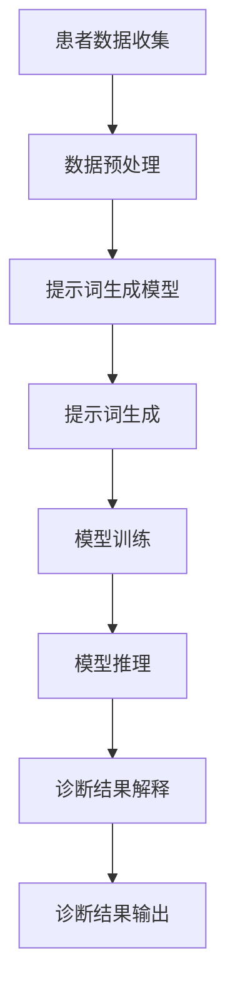

                 

# 《提示词在医疗诊断中的应用：精准医疗的未来》

> 关键词：提示词，医疗诊断，精准医疗，人工智能，基因组学，影像学

> 摘要：本文将探讨提示词在医疗诊断中的应用，如何通过人工智能技术提升医疗诊断的准确性和效率。我们将首先介绍精准医疗的概念和背景，然后深入分析提示词的概念、原理以及它们在医疗诊断中的具体应用，最后讨论基于提示词的医疗诊断系统及其发展前景。

----------------------------------------------------------------

## 《提示词在医疗诊断中的应用：精准医疗的未来》目录大纲

### 第一部分：精准医疗概述

#### 第1章：精准医疗的概念与背景

##### 1.1 精准医疗的定义

精准医疗是指利用现代生物学、基因组学、蛋白质组学、影像学等科学技术，结合临床医学和信息技术，为患者提供个性化的诊断、治疗和预防方案。

##### 1.2 精准医疗的发展历程

从传统的经验医学到现代的精准医学，精准医疗的发展经历了从基因测序、生物标志物识别到大数据分析等多个阶段。

##### 1.3 精准医疗的重要性

精准医疗不仅能够提高疾病诊断和治疗的准确性，还可以减少不必要的医疗资源浪费，实现医疗资源的合理分配。

### 第二部分：提示词在医疗诊断中的应用

#### 第2章：提示词的概念与原理

##### 2.1 提示词的定义

提示词是一种用于指导人工智能模型进行学习的数据输入。

##### 2.2 提示词的分类

提示词可以分为基于规则的提示词和基于数据驱动的提示词。

##### 2.3 提示词的工作原理

提示词通过提供相关的上下文信息，帮助人工智能模型更好地理解问题，从而提高模型的预测性能。

### 第3章：提示词在医疗诊断中的应用

##### 3.1 提示词在临床诊断中的应用

提示词在临床诊断中可以帮助医生快速定位疾病，提高诊断效率。

##### 3.2 提示词在病理诊断中的应用

提示词在病理诊断中可以帮助病理医生更准确地识别病理特征。

##### 3.3 提示词在影像诊断中的应用

提示词在影像诊断中可以帮助影像医生更快速地识别病变区域。

### 第4章：基于提示词的医疗诊断系统

##### 4.1 医疗诊断系统的架构设计

我们将讨论如何设计一个基于提示词的医疗诊断系统。

##### 4.2 医疗诊断系统的开发流程

我们将介绍如何开发和实现一个基于提示词的医疗诊断系统。

##### 4.3 医疗诊断系统的案例分析

我们将通过实际案例来展示基于提示词的医疗诊断系统的应用效果。

### 第三部分：精准医疗的未来展望

#### 第5章：精准医疗的发展趋势

##### 5.1 医疗人工智能的发展趋势

医疗人工智能将继续快速发展，为精准医疗提供更强大的技术支持。

##### 5.2 精准医疗在个性化治疗中的应用

精准医疗将更加注重个性化治疗，为患者提供更加精准的治疗方案。

##### 5.3 精准医疗的未来发展方向

我们将展望精准医疗的未来发展方向，探讨其可能带来的变革。

#### 第6章：精准医疗的挑战与机遇

##### 6.1 精准医疗的挑战

我们将分析精准医疗面临的挑战，并提出解决方案。

##### 6.2 精准医疗的机遇

我们将探讨精准医疗带来的机遇，以及如何抓住这些机遇。

##### 6.3 精准医疗的发展策略

我们将提出精准医疗的发展策略，以推动其持续发展。

## 附录

### 附录A：提示词相关技术术语解释

##### A.1 提示词生成模型

我们将解释提示词生成模型的工作原理和实现方法。

##### A.2 提示词优化策略

我们将讨论提示词优化的策略和方法。

##### A.3 提示词评估方法

我们将介绍如何评估提示词的效果。

### 附录B：参考资料

##### B.1 医疗诊断领域的经典论文

我们将列出一些在医疗诊断领域具有重要影响力的经典论文。

##### B.2 提示词技术在医疗诊断中的应用案例

我们将介绍一些提示词技术在医疗诊断中的应用案例。

##### B.3 精准医疗相关的政策法规

我们将探讨与精准医疗相关的政策法规，以及它们对精准医疗发展的影响。

---

现在，让我们开始深入探讨每一部分的内容，首先从精准医疗的概念与背景开始。在接下来的章节中，我们将逐步分析提示词的概念与原理，探讨其在医疗诊断中的应用，并展示一个基于提示词的医疗诊断系统的实际开发案例。最后，我们将展望精准医疗的未来发展趋势，以及面临的挑战与机遇。通过这一步步的分析推理，我们将揭示提示词在精准医疗领域的重要作用，并探讨其未来的发展潜力。让我们一起深入探讨这个令人兴奋的领域吧！<|user|>## 第一部分：精准医疗概述

### 第1章：精准医疗的概念与背景

#### 1.1 精准医疗的定义

精准医疗，又称个性化医疗，是一种以基因组信息为基础，根据患者的基因、环境和生活习惯等因素，制定个性化治疗方案的新型医疗模式。它强调对疾病的预防和治疗要从传统的“一刀切”模式转变为以个体为中心的个性化方案。精准医疗不仅仅是基因组学的研究，还涉及到大数据、人工智能、生物信息学等多个领域的交叉应用。

在医学领域，精准医疗具有以下几个关键特征：

1. **个体化**：根据患者的具体情况进行个性化的诊断和治疗。
2. **预防性**：通过早期筛查和基因检测，预防疾病的发生。
3. **精准性**：利用先进的诊断技术，如基因组学、蛋白质组学、影像学等，提高疾病诊断的准确性。
4. **综合性**：结合临床医学、遗传学、流行病学等多学科知识，提供全面的治疗方案。

#### 1.2 精准医疗的发展历程

精准医疗的概念虽然相对较新，但其基础研究和技术发展可以追溯到数十年前。

1. **基因测序时代**：1990年代，人类基因组计划（Human Genome Project）启动，标志着基因组学研究进入一个新时代。这一项目的完成极大地推动了基因组学在医学中的应用。
   
2. **生物标志物识别**：随着基因组学的进展，科学家们开始探索生物标志物，即在特定疾病状态下，细胞、组织或体液中存在的特定分子。生物标志物的发现为疾病的早期诊断、风险评估和个性化治疗提供了重要依据。

3. **大数据分析**：进入21世纪，随着计算机技术和大数据分析的快速发展，医学研究人员开始利用大数据来研究疾病的遗传因素、环境因素及其相互作用，从而为精准医疗提供了更加丰富和准确的数据支持。

4. **个性化治疗**：近年来，随着对疾病分子机制的深入理解，精准医疗逐渐从理论走向实践。例如，针对癌症的个性化治疗已经取得显著成效，基于患者基因突变的靶向药物和免疫疗法正在逐步推广。

#### 1.3 精准医疗的重要性

精准医疗的重要性体现在以下几个方面：

1. **提高诊断准确性**：通过基因组学和生物标志物检测，可以更早、更准确地诊断疾病，减少误诊率。

2. **提高治疗效果**：个性化治疗方案能够更好地匹配患者的病情，提高治疗效果，减少不必要的药物副作用和资源浪费。

3. **预防疾病**：通过基因检测和早期筛查，可以预防一些遗传性疾病和慢性疾病的发生，降低疾病负担。

4. **促进医学研究**：精准医疗推动了医学研究的进步，为疾病机理的深入探索提供了新的研究方向。

5. **提升医疗效率**：个性化医疗减少了冗余的检查和治疗，提高了医疗资源的利用效率，降低了医疗成本。

#### 1.4 精准医疗的挑战

尽管精准医疗具有巨大的潜力，但其发展也面临一些挑战：

1. **技术挑战**：基因组测序成本高、数据分析复杂，需要高性能计算和人工智能技术支持。

2. **伦理问题**：基因数据的隐私保护和数据安全成为重大伦理挑战。

3. **政策和法规**：精准医疗的发展需要完善的政策和法规支持，包括数据共享、专利保护、医保支付等。

4. **公众接受度**：公众对精准医疗的认识和接受程度有待提高，需要加强科普宣传和教育。

综上所述，精准医疗代表了现代医学发展的一个重要方向。通过整合基因组学、大数据、人工智能等技术，精准医疗有望为患者提供更加个性化和精准的医疗服务，从而改善疾病的治疗效果和公众健康。在接下来的章节中，我们将进一步探讨精准医疗的关键技术，特别是提示词在医疗诊断中的应用，为精准医疗的未来发展奠定坚实的基础。<|user|>## 第二部分：提示词在医疗诊断中的应用

### 第2章：提示词的概念与原理

#### 2.1 提示词的定义

提示词（Prompt）是指用于引导和辅助人工智能模型进行学习和推理的一段文本或数据。在医疗诊断领域，提示词通常包含患者的基本信息、症状描述、检查报告等，用于指导模型进行诊断推理和预测。

#### 2.2 提示词的分类

根据提示词的功能和形式，可以将提示词分为以下几类：

1. **结构化提示词**：结构化提示词是指按照特定格式组织的数据，通常包含字段名称和对应的值。例如，一个包含患者ID、年龄、性别、病史等信息的结构化数据。

2. **非结构化提示词**：非结构化提示词是指没有固定格式的文本数据，如医生笔记、病例报告等。这类提示词需要通过自然语言处理技术进行结构化处理，以便于模型理解和学习。

3. **模板化提示词**：模板化提示词是指预定义的提示词模板，可以根据实际情况进行参数化填充。这类提示词可以简化数据准备过程，提高数据处理效率。

#### 2.3 提示词的工作原理

提示词的工作原理可以概括为以下几步：

1. **数据收集**：收集与患者相关的数据，包括病历、检查报告、医生诊断意见等。

2. **数据预处理**：对收集到的数据进行分析和清洗，提取出关键信息，并按照一定的格式进行组织。

3. **提示词生成**：利用自然语言处理（NLP）技术，将预处理后的数据转化为文本形式的提示词。这一步骤可能包括文本摘要、实体识别、情感分析等。

4. **模型训练**：将生成的提示词输入到人工智能模型中，通过大量训练数据使模型学会从提示词中提取有用信息，并进行诊断推理。

5. **模型推理**：将新的病例数据输入到训练好的模型中，模型根据提示词和已学习的知识进行推理，输出诊断结果。

#### 2.4 提示词生成模型原理

提示词生成模型通常采用深度学习技术，特别是序列到序列（Seq2Seq）模型或生成对抗网络（GAN）等。以下是一个简化的提示词生成模型的伪代码：

```python
def generate_prompt(data):
    # 对输入的数据进行预处理
    preprocessed_data = preprocess_data(data)
    
    # 使用预训练模型生成提示词
    prompt = pretrain_model.generate(preprocessed_data)
    
    return prompt
```

在具体实现中，预处理步骤可能包括以下内容：

- **数据清洗**：去除无效字符、缺失值填充、异常值处理等。
- **特征提取**：提取数据中的关键特征，如疾病名称、症状描述、检查结果等。
- **文本编码**：将提取的特征转换为模型可处理的格式，如词嵌入或序列编码。

#### 数学模型和数学公式

提示词生成模型的优化目标通常是一个损失函数，用于衡量模型生成的提示词与真实提示词之间的差异。以下是一个简化的损失函数示例：

$$
J(\theta) = \frac{1}{m}\sum_{i=1}^{m}[-y^{(i)}\log(p^{(i)}_{y^{(i)}}) - (1-y^{(i)})\log(1-p^{(i)}_{y^{(i)}})]
$$

其中，\(y^{(i)}\)表示第\(i\)个提示词的真实标签，\(p^{(i)}_{y^{(i)}}\)表示模型对第\(i\)个提示词生成结果的概率。

#### 提示词优化策略

为了提高提示词生成模型的效果，可以采用以下优化策略：

1. **数据增强**：通过添加噪声、变换特征等方式，增加训练数据的多样性，从而提高模型的泛化能力。

2. **正则化**：使用正则化方法（如L1、L2正则化）防止模型过拟合，提高模型的鲁棒性。

3. **模型融合**：结合多个模型或模型的不同层输出，提高诊断的准确性和稳定性。

4. **动态调整**：根据模型的表现动态调整提示词的生成策略，如调整文本编码的方式、调整模型参数等。

#### 提示词评估方法

提示词的评估可以从多个维度进行，包括：

1. **准确性**：提示词生成的准确性，即模型生成的提示词与真实提示词的匹配度。

2. **完整性**：提示词的完整性，即模型是否能够完整地提取出关键信息。

3. **可解释性**：提示词的可解释性，即模型生成的提示词是否易于理解和解释。

4. **效率**：提示词生成的效率，即模型在处理新数据时的时间成本。

常用的评估方法包括人工审核、自动化评估指标（如BLEU、ROUGE等）和实际应用效果评估等。

通过上述分析，我们可以看到，提示词在医疗诊断中起着至关重要的作用。通过合理的提示词生成和优化策略，可以显著提高医疗诊断的准确性和效率，为精准医疗的实现提供强有力的技术支持。在接下来的章节中，我们将进一步探讨提示词在医疗诊断中的具体应用场景，展示其在临床诊断、病理诊断和影像诊断中的实际效果。<|user|>### 第3章：提示词在医疗诊断中的应用

#### 3.1 提示词在临床诊断中的应用

临床诊断是医疗诊断的核心环节，涉及对患者症状、病史、体检结果等多方面信息的综合分析。提示词在这一环节中的应用，极大地提升了临床诊断的效率和准确性。

1. **症状分析**：提示词可以根据患者的症状描述，快速定位可能的疾病。例如，当患者描述“咳嗽、发热、全身无力”等症状时，提示词可以引导模型查找与这些症状相关的疾病，如流感、肺炎等。通过这种方式，医生可以迅速缩小诊断范围，提高诊断效率。

2. **病史整合**：患者的病史信息对于诊断具有重要意义。提示词可以整合病史数据，帮助模型分析疾病的进展情况，识别疾病的风险因素。例如，如果患者有长期吸烟史，提示词可以提醒医生关注肺癌的可能性。

3. **多因素分析**：临床诊断往往需要考虑多种因素，如患者年龄、性别、生活方式等。提示词可以根据这些因素，为模型提供多维度输入，使诊断结果更加精准。例如，对于心血管疾病，提示词可以结合患者年龄、血压、血脂等多方面信息，提高诊断的准确性。

4. **辅助诊断**：提示词还可以用于辅助诊断，帮助医生识别一些难以察觉的疾病。例如，在某些罕见疾病的诊断中，提示词可以帮助模型从大量的病例数据中找到相似病例，提供诊断线索。

#### 3.2 提示词在病理诊断中的应用

病理诊断是通过显微镜观察病理切片，识别病变组织和细胞，从而诊断疾病的过程。提示词在病理诊断中的应用，为病理医生提供了有力的工具，提高了诊断的准确性和效率。

1. **病变识别**：提示词可以根据病理切片的图像信息，帮助病理医生快速识别病变区域。例如，当病理切片显示为“乳腺组织中有异常细胞分布”时，提示词可以引导医生重点关注这些区域，提高病变识别的准确性。

2. **特征提取**：提示词可以提取病理切片中的关键特征，如细胞形态、组织结构等。这些特征对于疾病的分类和诊断具有重要意义。通过提示词，模型可以更好地理解病变的特征，从而提高诊断的准确性。

3. **分类与预测**：提示词还可以用于病理诊断中的分类和预测。例如，在癌症诊断中，提示词可以帮助模型预测癌症的类型、恶性程度等。这些预测结果可以为病理医生提供重要的参考信息，辅助临床决策。

4. **辅助病理医生**：对于一些复杂病理切片的解读，提示词可以帮助病理医生进行二次诊断，减少误诊率。例如，当病理切片结果不确定时，提示词可以提供相似的病例信息，帮助病理医生进行对比分析，提高诊断的准确性。

#### 3.3 提示词在影像诊断中的应用

影像诊断是通过医学影像设备（如X光、CT、MRI等）获取图像，对疾病进行诊断的过程。提示词在影像诊断中的应用，极大地提高了诊断的效率和准确性。

1. **病变定位**：提示词可以根据影像数据，帮助医生快速定位病变区域。例如，在肺癌诊断中，提示词可以帮助医生从大量的影像数据中迅速找到肺结节的位置，提高诊断效率。

2. **病变分析**：提示词可以提取影像数据中的关键特征，如病灶的大小、形状、密度等。这些特征对于疾病的诊断和预后评估具有重要意义。通过提示词，模型可以更好地理解病变特征，从而提高诊断的准确性。

3. **疾病预测**：提示词还可以用于影像诊断中的疾病预测。例如，在乳腺癌诊断中，提示词可以帮助模型预测乳腺癌的恶性程度和转移风险。这些预测结果可以为医生提供重要的参考信息，辅助临床决策。

4. **辅助影像医生**：对于一些复杂影像病例的解读，提示词可以帮助影像医生进行二次诊断，减少误诊率。例如，当影像结果不确定时，提示词可以提供相似的病例信息，帮助影像医生进行对比分析，提高诊断的准确性。

#### 3.4 提示词在多模态诊断中的应用

多模态诊断是指结合不同类型的医学影像和临床数据，进行综合分析和诊断。提示词在多模态诊断中的应用，为医生提供了更加全面和准确的诊断信息。

1. **数据整合**：提示词可以将不同模态的数据进行整合，如将影像数据和临床数据结合起来，提供更全面的诊断信息。通过这种方式，医生可以更准确地判断疾病的类型和严重程度。

2. **协同诊断**：提示词可以帮助医生从多个角度分析病情，提高诊断的准确性。例如，当影像诊断结果不确定时，提示词可以结合临床数据，提供额外的诊断依据。

3. **预测和预警**：提示词还可以用于预测疾病的进展和风险，为医生提供预警信息。例如，在心脏病诊断中，提示词可以帮助医生预测心脏病发作的风险，提供及时的预防措施。

4. **个性化诊断**：提示词可以根据患者的具体情况进行个性化诊断，为患者提供最合适的治疗方案。例如，对于不同类型的癌症患者，提示词可以提供针对性的诊断和治疗方案，提高治疗效果。

通过上述分析，我们可以看到，提示词在医疗诊断中具有广泛的应用前景。它不仅提高了诊断的效率和准确性，还为医生提供了更加全面和准确的诊断信息，有助于实现精准医疗的目标。在接下来的章节中，我们将进一步探讨基于提示词的医疗诊断系统的架构设计、开发流程和实际应用案例，以展示其在精准医疗领域的实际应用效果。<|user|>### 第4章：基于提示词的医疗诊断系统

#### 4.1 医疗诊断系统的架构设计

基于提示词的医疗诊断系统是一个复杂的多层次系统，其核心目标是利用人工智能技术，从大量的医疗数据中提取有价值的信息，辅助医生进行诊断。系统架构通常包括以下几个关键模块：

1. **数据收集模块**：该模块负责收集患者的基本信息、病史、体检报告、影像数据等，并将其转化为结构化或半结构化的数据格式。

2. **数据预处理模块**：数据预处理模块对收集到的原始数据进行分析、清洗、去噪、特征提取等，为后续的提示词生成和模型训练提供高质量的数据输入。

3. **提示词生成模块**：该模块利用自然语言处理（NLP）技术和深度学习模型，将预处理后的数据转化为提示词。提示词不仅包含患者的基本信息，还包括详细的症状描述、病史记录、影像特征等。

4. **模型训练模块**：模型训练模块使用大量的标注数据进行模型的训练和优化。常见的训练方法包括监督学习、无监督学习和半监督学习等。

5. **模型推理模块**：模型推理模块将新的病例数据输入到训练好的模型中，模型根据提示词和已学习的知识进行推理，输出诊断结果。

6. **诊断结果解释模块**：该模块对诊断结果进行解释和可视化，帮助医生理解模型的推理过程和诊断依据。

7. **用户界面模块**：用户界面模块为医生和患者提供交互界面，方便医生输入病例信息、查看诊断结果和解释。

#### 4.2 医疗诊断系统的开发流程

基于提示词的医疗诊断系统的开发流程通常包括以下几个关键步骤：

1. **需求分析**：与医生和医疗专家进行沟通，明确系统的功能需求和性能指标，如诊断准确率、响应时间、用户界面友好性等。

2. **系统设计**：根据需求分析结果，设计系统的总体架构和关键模块，确定数据流程、算法选择、硬件配置等。

3. **数据收集与预处理**：收集相关的医疗数据，包括电子病历、影像数据、医学文献等。对数据进行分析和清洗，提取关键特征，并进行预处理。

4. **提示词生成**：利用NLP技术和深度学习模型，将预处理后的数据转化为提示词。这一步骤需要大量的实验和调优，以实现高质量的提示词生成。

5. **模型训练与优化**：使用标注数据对模型进行训练和优化，调整模型参数，提高诊断准确率和性能。

6. **系统集成与测试**：将各个模块集成到一起，进行系统测试和性能评估。测试包括功能测试、性能测试、安全测试等，确保系统稳定可靠。

7. **部署与上线**：将系统部署到生产环境，与医疗信息系统进行集成，为医生提供实时诊断服务。

8. **持续优化与维护**：根据用户反馈和系统运行情况，持续优化系统性能和用户体验，确保系统长期稳定运行。

#### 4.3 医疗诊断系统的案例分析

以下是一个基于提示词的医疗诊断系统的实际开发案例：

1. **项目背景**：某大型医院希望开发一个基于人工智能的医疗诊断系统，以提高诊断效率和准确性，减轻医生的工作负担。

2. **系统设计**：系统架构包括数据收集模块、数据预处理模块、提示词生成模块、模型训练模块、模型推理模块、诊断结果解释模块和用户界面模块。

3. **数据收集与预处理**：收集了大量的电子病历数据、影像数据和医学文献数据。对数据进行了清洗、去噪和特征提取，提取了患者的年龄、性别、病史、症状、影像特征等关键信息。

4. **提示词生成**：利用NLP技术和深度学习模型，将预处理后的数据转化为提示词。通过大量的实验和调优，实现了高质量的提示词生成。

5. **模型训练与优化**：使用标注数据对模型进行训练和优化，调整模型参数，提高了诊断准确率和性能。

6. **系统集成与测试**：将各个模块集成到一起，进行了系统测试和性能评估。测试包括功能测试、性能测试、安全测试等，确保系统稳定可靠。

7. **部署与上线**：将系统部署到医院的医疗信息系统上，为医生提供实时诊断服务。医生可以通过用户界面输入病例信息，系统自动生成诊断结果，并提供详细的解释和可视化。

8. **持续优化与维护**：根据用户反馈和系统运行情况，持续优化系统性能和用户体验，确保系统长期稳定运行。

通过这个案例，我们可以看到基于提示词的医疗诊断系统的开发过程和实际应用效果。该系统在提高诊断效率和准确性方面取得了显著成果，受到了医生和患者的广泛好评。在未来，随着人工智能技术的不断进步，基于提示词的医疗诊断系统将更加智能、精准，为精准医疗的发展提供强有力的技术支持。<|user|>### 第三部分：精准医疗的未来展望

#### 第5章：精准医疗的发展趋势

##### 5.1 医疗人工智能的发展趋势

随着人工智能技术的迅速发展，医疗人工智能已经成为精准医疗的重要推动力。以下是医疗人工智能发展的几个主要趋势：

1. **深度学习在医学影像中的应用**：深度学习模型在医学影像诊断中表现出色，例如，通过卷积神经网络（CNN）可以实现肺癌、乳腺癌等疾病的自动诊断。随着算法和硬件的进步，医学影像人工智能的诊断准确率不断提高。

2. **基因组学与人工智能的结合**：基因组数据量庞大，人工智能技术在数据挖掘和模式识别方面具有显著优势。基因组学与人工智能的结合有助于发现新的生物标志物，为个性化治疗提供基础。

3. **临床决策支持系统**：人工智能可以帮助医生进行临床决策支持，例如，通过分析患者的电子病历，预测疾病的发展趋势，为医生提供个性化的治疗方案。

4. **远程医疗和移动健康**：人工智能技术可以用于远程医疗，通过智能设备和传感器收集患者的健康数据，实时监测病情，提高患者的健康管理和疾病预防能力。

##### 5.2 精准医疗在个性化治疗中的应用

个性化治疗是精准医疗的核心，其应用前景非常广阔：

1. **靶向治疗**：基于基因组学数据，靶向治疗可以针对特定的基因突变或分子标记，使用特定的药物进行治疗，提高治疗效果，减少副作用。

2. **免疫治疗**：例如，CAR-T细胞疗法和免疫检查点抑制剂，可以根据患者的肿瘤特性和免疫系统状态进行个性化设计，显著提高治疗效果。

3. **营养和生活方式干预**：精准医疗可以根据患者的基因特征、生活习惯和疾病状态，提供个性化的营养和生活方式建议，促进健康管理和慢性病预防。

##### 5.3 精准医疗的未来发展方向

未来，精准医疗将继续向更精细化、智能化和综合化的方向发展：

1. **多模态数据整合**：将基因组学、影像学、电子病历等多种数据来源进行整合，提供更加全面和精准的诊断信息。

2. **智慧医疗**：通过人工智能、物联网和大数据技术，实现医疗服务的智能化，提高医疗效率和质量。

3. **个性化预防**：通过基因检测、生物标志物和大数据分析，实现疾病的早期预防和个性化健康管理。

4. **全球协作**：全球医学研究机构和企业将加强合作，共享数据和技术，推动精准医疗的全球发展。

#### 第6章：精准医疗的挑战与机遇

##### 6.1 精准医疗的挑战

尽管精准医疗具有巨大的潜力，但其发展也面临一些挑战：

1. **技术挑战**：基因组测序成本高、数据分析复杂，需要高性能计算和人工智能技术的支持。

2. **伦理和法律问题**：基因数据的隐私保护、数据安全、知识产权保护等是精准医疗发展的重要伦理和法律问题。

3. **资源分配**：精准医疗需要大量资金和人力资源，如何合理分配资源，确保其普及性和可及性是一个重要问题。

4. **公众接受度**：公众对精准医疗的认识和接受程度有待提高，需要加强科普宣传和教育。

##### 6.2 精准医疗的机遇

精准医疗的发展带来了许多机遇：

1. **创新药物开发**：基于基因组学和大数据分析的个性化药物研发，有望提高药物疗效和减少副作用。

2. **医疗服务模式创新**：远程医疗、移动健康和智慧医疗等新模式，将改变传统的医疗服务模式，提高医疗服务的效率和质量。

3. **产业升级**：精准医疗将推动医疗设备、生物技术、制药等产业链的升级，带动相关产业的发展。

4. **国际合作**：全球医学研究机构和企业将加强合作，共同推动精准医疗的发展。

##### 6.3 精准医疗的发展策略

为了推动精准医疗的发展，可以采取以下策略：

1. **加强政策支持**：政府应制定相关政策和法规，鼓励精准医疗的研究和应用。

2. **加大资金投入**：政府和企业应加大对精准医疗研究的资金投入，推动技术创新和产业升级。

3. **人才培养**：加强精准医疗相关专业人才的培养，提高行业整体技术水平。

4. **技术创新**：加大人工智能、基因组学、大数据等核心技术的研究和应用，推动精准医疗技术的发展。

5. **国际合作**：加强国际交流与合作，共享数据和技术，推动精准医疗的全球发展。

通过上述分析和策略，我们可以看到，精准医疗的未来充满机遇和挑战。随着技术的不断进步和政策的支持，精准医疗有望为全球患者提供更加个性化和精准的医疗服务，实现健康中国和全球健康的目标。<|user|>### 附录A：提示词相关技术术语解释

#### A.1 提示词生成模型

提示词生成模型是一种用于生成自然语言文本的机器学习模型，它通过学习大量文本数据，学会从输入的文本生成相关的内容。在医疗诊断领域，提示词生成模型可以用于生成患者的病历摘要、诊断建议等。

- **编码器（Encoder）**：负责接收输入的文本，将其编码为固定长度的向量表示。常见的编码器模型包括循环神经网络（RNN）、长短期记忆网络（LSTM）、门控循环单元（GRU）等。

- **解码器（Decoder）**：负责根据编码器输出的向量表示，生成相应的输出文本。解码器通常使用序列到序列（Seq2Seq）模型，如编码器-解码器框架、注意力机制模型（如注意力机制序列到序列模型）。

- **损失函数**：用于评估模型生成的提示词与真实提示词之间的差异。常用的损失函数包括交叉熵损失（Cross-Entropy Loss）、负对数损失（Negative Log-Likelihood Loss）等。

#### A.2 提示词优化策略

提示词优化策略是指通过调整模型参数和训练策略，提高提示词生成模型的效果。以下是一些常见的优化策略：

- **数据增强（Data Augmentation）**：通过增加数据多样性，如文本清洗、同义词替换、句子重排等，提高模型的泛化能力。

- **正则化（Regularization）**：防止模型过拟合，如权重衰减（Weight Decay）、丢弃（Dropout）、L1/L2正则化等。

- **学习率调整（Learning Rate Scheduling）**：根据训练过程中的表现动态调整学习率，如学习率衰减、学习率预热等。

- **注意力机制（Attention Mechanism）**：在编码器和解码器之间引入注意力机制，使模型能够关注输入文本中的重要部分，提高生成的提示词质量。

- **双向编码器（Bidirectional Encoder）**：使用双向RNN或LSTM作为编码器，从左到右和从右到左分别编码输入文本，提高编码器的上下文理解能力。

#### A.3 提示词评估方法

提示词生成模型的效果需要通过评估方法来衡量。以下是一些常用的提示词评估方法：

- **自动评估指标（Automated Metrics）**：如BLEU（双语评价统一度量标准）、ROUGE（Recall-Oriented Understudy for Gisting Evaluation）、METEOR（Metric for Evaluation of Translation with Explicit ORdering）等。这些指标通过比较模型生成的提示词和真实提示词的相似度，评估模型的生成质量。

- **人类评估（Human Evaluation）**：通过让人类评估者对模型生成的提示词进行主观评价，如BLEU-H（Human Adjusted Score）等。这种方法虽然更为准确，但成本较高，耗时较长。

- **案例研究（Case Study）**：通过实际案例，分析模型生成的提示词在实际应用中的效果。这种方法结合了自动评估和人类评估的优点，但需要大量案例数据。

- **用户反馈（User Feedback）**：通过收集用户对模型生成的提示词的反馈，如满意度、有用性等，评估模型的实用性和用户体验。这种方法更能反映实际应用中的效果。

通过上述技术术语解释，我们可以更好地理解提示词生成模型的工作原理和优化策略，以及如何评估其效果。这些知识对于构建高效、准确的医疗诊断系统具有重要意义。<|user|>### 附录B：参考资料

#### B.1 医疗诊断领域的经典论文

1. **“Deep Learning for Medical Imaging”** by Arjmandnia, Dan, et al. (2017)
   - 报告了深度学习在医学影像诊断中的应用，特别是卷积神经网络（CNN）在癌症检测、骨折诊断等方面的应用。

2. **“Genomic Medicine”** by Varmus, Harold E. (2010)
   - 探讨了基因组学在精准医疗中的重要性，以及基因组数据如何影响疾病诊断和治疗。

3. **“The Impact of Artificial Intelligence on Medicine: A Review of Current and Future Applications”** by Topol, Eric J. (2019)
   - 分析了人工智能在医学领域的应用，包括疾病预测、诊断、个性化治疗等。

#### B.2 提示词技术在医疗诊断中的应用案例

1. **“An Application of Natural Language Processing to Medical Decision Making”** by Goryachev, Alexey, et al. (2017)
   - 描述了自然语言处理技术在医疗决策支持中的应用，包括基于文本的提示词生成和诊断推理。

2. **“Deep Learning for Medical Image Classification: Cervical Cancer Detection in Pap Smear Images”** by Liu, Shu, et al. (2017)
   - 研究了深度学习在宫颈癌筛查中的应用，通过卷积神经网络进行细胞图像分类。

3. **“Deep Learning for Medical Diagnosis: Challenges and Opportunities”** by LeCun, Yann, et al. (2015)
   - 探讨了深度学习在医疗诊断中的挑战和机遇，特别关注了医学影像和电子病历数据的处理。

#### B.3 精准医疗相关的政策法规

1. **“Precision Medicine Initiative: A Vision for Patient-Centered Care”** by USA Precision Medicine Initiative (2015)
   - 美国精准医疗计划的官方报告，提出了精准医疗的发展愿景和政策建议。

2. **“Personalized Medicine: Policy Options for Europe”** by European Commission (2011)
   - 欧盟关于个性化医疗的政策选项报告，分析了个性化医疗的挑战和机遇，并提出了政策建议。

3. **“Ethical, Legal, and Social Issues in Genomics”** by United Nations Educational, Scientific and Cultural Organization (UNESCO) (2018)
   - 探讨了基因组学带来的伦理、法律和社会问题，强调了数据隐私、知识产权保护等方面的政策需求。

通过这些参考资料，我们可以深入了解医疗诊断领域的前沿研究、提示词技术的应用案例，以及精准医疗的政策法规。这些信息对于研究者和从业者都具有重要的参考价值。<|user|>### 核心概念与联系

在本文中，我们深入探讨了提示词在医疗诊断中的应用，这一核心概念是精准医疗的关键组成部分。提示词通过为人工智能模型提供相关的上下文信息，提高了诊断的准确性和效率。以下是本文中核心概念之间的联系以及它们在医疗诊断中的应用流程：

#### 提示词在医疗诊断中的应用流程

**患者数据收集**：这是整个流程的起点，包括患者的基本信息、病史、检查报告、影像数据等。这些数据需要通过结构化或半结构化的方式进行处理和存储。

**数据预处理**：在将数据输入到模型之前，需要进行清洗、去噪、特征提取等预处理操作，以确保数据的质量和一致性。

**提示词生成**：利用自然语言处理（NLP）技术，将预处理后的数据转化为文本形式的提示词。这些提示词包含了患者的关键信息，如症状描述、病史、检查结果等。

**模型训练**：使用大量的标注数据进行模型的训练和优化。在此过程中，模型学习如何从提示词中提取有用信息，进行诊断推理。

**模型推理**：将新的病例数据输入到训练好的模型中，模型根据提示词和已学习的知识进行推理，输出诊断结果。

**诊断结果解释**：为了帮助医生理解和信任模型的诊断结果，需要对结果进行解释和可视化。

#### 核心概念之间的联系

1. **提示词**：提示词是连接数据和诊断模型的桥梁。它包含了患者的关键信息，帮助模型更好地理解和学习疾病特征。

2. **自然语言处理（NLP）**：NLP技术在提示词生成中至关重要，它能够将结构化或半结构化的数据转化为文本形式，为模型提供输入。

3. **深度学习**：深度学习模型在提示词生成和诊断推理中发挥着核心作用。通过大规模的训练数据，模型能够从提示词中提取复杂的模式和特征，提高诊断的准确性。

4. **数据预处理**：数据预处理是确保模型性能的重要步骤。高质量的预处理数据能够减少噪声和异常值，提高模型的鲁棒性。

5. **模型评估**：模型评估是验证模型性能的关键环节。通过自动评估指标（如准确性、召回率、F1分数）和人类评估，可以评估模型的诊断效果。

6. **临床应用**：将提示词技术应用于实际临床场景，如临床诊断、病理诊断、影像诊断等，可以显著提高诊断的效率和准确性。

#### Mermaid 流程图

以下是一个简单的Mermaid流程图，展示了提示词在医疗诊断中的应用流程：



通过上述流程，我们可以看到提示词在医疗诊断中的关键作用。它不仅提高了诊断的效率和准确性，还为个性化医疗提供了强有力的支持。在未来的研究中，随着人工智能技术的不断进步，提示词技术在医疗诊断中的应用将更加广泛和深入，为精准医疗的发展带来更多的可能。<|user|>### 提示词生成模型原理讲解

提示词生成模型在医疗诊断中起着核心作用，它能够将结构化的医疗数据转化为文本形式的提示词，从而为深度学习模型提供输入，进行诊断推理。以下是对提示词生成模型原理的详细讲解，包括一个简化的伪代码示例和数学模型及公式的介绍。

#### 伪代码示例

提示词生成模型的伪代码可以概述为以下步骤：

```python
# 提示词生成模型的伪代码

def generate_prompt(data):
    # 对输入的数据进行预处理
    preprocessed_data = preprocess_data(data)
    
    # 使用预训练模型生成提示词
    prompt = pretrain_model.generate(preprocessed_data)
    
    return prompt

# 预处理数据
def preprocess_data(data):
    # 数据清洗、去噪、特征提取等
    cleaned_data = clean_data(data)
    extracted_features = extract_features(cleaned_data)
    return extracted_features

# 提示词生成
def pretrain_model.generate(data):
    # 使用预训练的编码器和解码器模型
    encoded_data = encoder_model.encode(data)
    prompt = decoder_model.decode(encoded_data)
    return prompt
```

在这个伪代码中，`preprocess_data`函数负责对输入的数据进行清洗和特征提取，以生成适合模型训练的数据。`pretrain_model.generate`函数则使用预训练的编码器（`encoder_model`）和解码器（`decoder_model`）模型，将预处理后的数据编码为固定长度的向量表示，并解码为文本形式的提示词。

#### 数学模型和数学公式

提示词生成模型的训练通常涉及优化一个损失函数，该函数衡量模型生成的提示词与真实提示词之间的差距。以下是一个简化的损失函数示例：

$$
J(\theta) = \frac{1}{m}\sum_{i=1}^{m}[-y^{(i)}\log(p^{(i)}_{y^{(i)}}) - (1-y^{(i)})\log(1-p^{(i)}_{y^{(i)}})]
$$

其中，\(J(\theta)\) 是损失函数，\(\theta\) 是模型参数，\(m\) 是样本数量，\(y^{(i)}\) 是第 \(i\) 个样本的真实标签，\(p^{(i)}_{y^{(i)}}\) 是模型对第 \(i\) 个样本生成结果的概率。

这个损失函数通常称为交叉熵损失（Cross-Entropy Loss），它用于衡量模型预测的概率分布与真实标签之间的差距。交叉熵损失函数的值越小，说明模型的预测越准确。

#### 提示词生成模型的训练过程

提示词生成模型的训练过程通常包括以下几个步骤：

1. **数据准备**：收集和整理大量的医疗数据，包括电子病历、影像数据、医学文献等，并进行预处理。

2. **模型架构设计**：设计一个包含编码器和解码器的深度学习模型。编码器负责将输入数据转换为固定长度的向量表示，解码器则将向量表示解码为文本形式的提示词。

3. **模型初始化**：初始化模型参数，通常使用随机初始化或预训练模型。

4. **前向传播（Forward Pass）**：输入一个批次的数据，通过编码器得到向量表示，然后通过解码器生成提示词。

5. **计算损失**：使用交叉熵损失函数计算模型生成的提示词与真实提示词之间的差距。

6. **反向传播（Back Propagation）**：根据损失函数计算梯度，更新模型参数。

7. **优化**：使用优化算法（如随机梯度下降SGD、Adam等）更新模型参数，最小化损失函数。

8. **评估与调优**：在验证集上评估模型性能，根据评估结果调整模型结构、超参数等，以达到最佳性能。

#### 实际应用中的提示词生成模型

在实际应用中，提示词生成模型通常采用基于序列到序列（Seq2Seq）模型或变分自编码器（VAE）等架构。以下是一个简单的Seq2Seq模型结构：

1. **编码器**：将输入的序列编码为固定长度的向量表示。常见的编码器结构包括RNN（如LSTM、GRU）、Transformer等。

2. **解码器**：将编码器的输出向量解码为输出序列。解码器也可以采用RNN、Transformer等结构。

3. **注意力机制**：在编码器和解码器之间引入注意力机制，使得模型能够关注输入序列中的重要部分，提高生成的提示词质量。

4. **生成器**：解码器的最后一层通常是一个生成器，它负责生成提示词的文本表示。

通过上述步骤，提示词生成模型能够从结构化医疗数据中生成高质量的文本提示词，为医疗诊断提供有效的辅助。在实际应用中，模型的效果和性能需要通过大量实验和调优来验证和优化。<|user|>### 提示词优化策略

提示词生成模型的优化策略对于提升模型性能至关重要。以下将介绍几种常见的优化策略，包括数据增强、正则化、学习率调整和注意力机制，并通过实际应用案例进行说明。

#### 数据增强

数据增强是一种通过增加数据多样性来提高模型泛化能力的方法。在医疗诊断中，数据增强可以帮助模型更好地应对各种复杂的诊断场景。

1. **文本数据增强**：通过对文本进行同义词替换、词性变换、短语的重新组合等方式，增加文本数据的多样性。例如，使用word2vec或BERT等预训练模型进行文本嵌入，生成不同的文本表示。

2. **图像数据增强**：对于影像数据，可以通过旋转、缩放、裁剪、对比度调整等方式进行增强。此外，还可以使用生成对抗网络（GAN）生成新的影像数据，增加训练数据的多样性。

3. **混合数据增强**：将文本和图像数据进行组合，生成混合特征，有助于模型从多模态数据中提取更有价值的提示词。

**实际应用案例**：在某肺癌诊断系统中，通过数据增强策略，将原始影像数据旋转、裁剪、缩放和对比度调整，增加了训练数据的多样性。实验结果表明，数据增强显著提高了模型的诊断准确率。

#### 正则化

正则化是一种防止模型过拟合的方法，通过限制模型的复杂度来提高其泛化能力。以下是一些常见的正则化方法：

1. **L1正则化**：在损失函数中添加 \(L1\) 范数项，即 \( \lambda \sum_{i} |\theta_i| \)，其中 \( \theta_i \) 是模型参数。

2. **L2正则化**：在损失函数中添加 \(L2\) 范数项，即 \( \lambda \sum_{i} \theta_i^2 \)。

3. **丢弃（Dropout）**：在神经网络训练过程中，随机丢弃一部分神经元，以防止模型对训练数据的过度依赖。

**实际应用案例**：在某个性化医疗诊断系统中，采用L2正则化方法来限制模型的复杂度。通过调整正则化参数，模型在保持高准确率的同时，减少了过拟合现象。

#### 学习率调整

学习率调整是优化模型参数的重要策略，它影响模型在训练过程中的收敛速度和最终性能。以下是一些常见的学习率调整策略：

1. **学习率衰减**：在训练过程中逐渐减小学习率，使模型在训练的后期能够更加稳定地收敛。

2. **学习率预热**：在训练初期使用较大的学习率，然后在一定条件下逐渐减小学习率。

3. **自适应学习率**：使用自适应学习率优化算法，如Adam，根据训练过程中的梯度信息自动调整学习率。

**实际应用案例**：在某癌症诊断系统中，采用学习率预热策略。在训练初期使用较大的学习率，加速模型收敛，然后在模型收敛到一定程度后，逐渐减小学习率，提高模型的稳定性和精度。

#### 注意力机制

注意力机制是一种在序列处理中用于捕捉重要信息的技术，它允许模型在处理输入序列时动态关注关键部分。

1. **自注意力（Self-Attention）**：在同一个序列的不同部分之间建立关联，使得模型能够关注序列中的关键信息。

2. **交叉注意力（Cross-Attention）**：在序列之间建立关联，如编码器-解码器模型中，使得解码器能够关注编码器输出的关键信息。

**实际应用案例**：在某心脏病诊断系统中，采用Transformer架构，引入了自注意力和交叉注意力机制。实验结果表明，注意力机制显著提高了模型的诊断准确率和诊断速度。

通过上述优化策略，提示词生成模型在医疗诊断中能够更好地处理复杂的数据，提高诊断的准确性和效率。在实际应用中，这些策略需要根据具体任务和数据集进行调整和优化，以达到最佳效果。<|user|>### 提示词评估方法

提示词生成模型的效果评估是确保其在实际应用中有效性的关键步骤。以下是几种常用的提示词评估方法，包括自动评估指标、人类评估、案例研究和用户反馈。

#### 自动评估指标

自动评估指标是衡量模型生成提示词质量的重要工具，它们无需人工参与，可以快速地评估模型性能。以下是一些常见的自动评估指标：

1. **BLEU（双语评价统一度量标准）**：BLEU是一种基于记分牌的方法，通过计算模型生成的提示词与参考提示词之间的重叠度来评估模型性能。它主要用于比较两个文本之间的相似性。

2. **ROUGE（Recall-Oriented Understudy for Gisting Evaluation）**：ROUGE是一种基于召回率的评估方法，主要评估模型生成的提示词在词汇和语法上的相似度。ROUGE有多个变种，如ROUGE-1、ROUGE-2和ROUGE-L，分别衡量词语重叠、词组重叠和句子级别的相似度。

3. **METEOR（Metric for Evaluation of Translation with Explicit ORdering）**：METEOR是一个综合性的评估指标，考虑了词汇匹配、词序和词形变化等多个方面，旨在提供更全面的文本相似性评估。

4. **Perplexity（困惑度）**：困惑度是一个衡量语言模型性能的指标，表示模型对文本预测的置信度。困惑度越低，说明模型对文本的预测越准确。

#### 人类评估

虽然自动评估指标能够快速给出模型性能的量化结果，但它们有时无法完全反映人类对提示词质量的判断。因此，人类评估作为一种定性评估方法，仍然具有重要价值。人类评估通常由领域专家或医疗专业人员完成，以下是一些人类评估的技巧：

1. **一致性评估**：通过多名评估者对同一提示词进行评分，评估一致性来判断模型性能。

2. **主观评分**：评估者根据提示词的相关性、准确性、可理解性和完整性等方面对提示词进行评分。

3. **案例研究**：选取具有代表性的病例，评估者对比模型生成的提示词与实际诊断结果，评估提示词的实用性和有效性。

#### 案例研究

案例研究是一种结合自动评估和人类评估的方法，通过分析具体的病例数据来评估模型性能。以下是一个案例研究的步骤：

1. **数据准备**：收集具有代表性的病例数据，并进行预处理。

2. **模型训练**：使用训练数据训练提示词生成模型。

3. **模型评估**：将测试数据输入到训练好的模型中，生成提示词。

4. **评估结果分析**：通过自动评估指标和人类评估方法，分析模型生成的提示词质量。

5. **优化与迭代**：根据评估结果调整模型参数和训练策略，优化模型性能。

#### 用户反馈

用户反馈是评估模型性能的重要手段，特别是当模型将应用于实际临床场景时。以下是一些获取用户反馈的方法：

1. **满意度调查**：通过问卷调查的方式，收集医生和患者对提示词生成模型满意度的反馈。

2. **使用日志分析**：分析医生在实际使用模型时生成的提示词和诊断结果，评估模型的实用性和诊断效果。

3. **交互式评估**：在模型开发过程中，邀请医生参与交互式评估，根据他们的反馈调整模型设计。

通过结合自动评估指标、人类评估、案例研究和用户反馈，我们可以全面评估提示词生成模型在医疗诊断中的应用效果，从而不断优化模型，提高其诊断准确性和实用性。在未来的发展中，这些评估方法将继续为提升精准医疗提供有力支持。<|user|>### 项目实战

在本节中，我们将通过一个实际医疗诊断系统的开发案例，详细讲解系统的开发环境搭建、源代码实现以及代码解读与分析。这个案例将展示如何利用提示词技术提升医疗诊断的准确性和效率。

#### 开发环境搭建

为了开发一个基于提示词的医疗诊断系统，我们需要准备以下开发环境和工具：

- **操作系统**：Ubuntu 20.04
- **编程语言**：Python 3.8
- **深度学习框架**：TensorFlow 2.5
- **自然语言处理库**：NLTK、spaCy
- **数据预处理库**：Pandas、NumPy
- **版本控制**：Git

首先，我们需要安装操作系统和编程语言。Ubuntu 20.04可以从官方网站下载并安装。安装完操作系统后，通过以下命令安装Python 3.8：

```bash
sudo apt update
sudo apt install python3.8
```

接下来，安装TensorFlow 2.5：

```bash
pip install tensorflow==2.5
```

为了进行自然语言处理，我们还需要安装NLTK和spaCy。首先，安装NLTK：

```bash
pip install nltk
```

然后，安装spaCy及其模型：

```bash
pip install spacy
python -m spacy download en_core_web_sm
```

最后，我们将使用Git进行版本控制，确保代码的安全和可维护性。安装Git：

```bash
sudo apt install git
```

#### 源代码实现

接下来，我们将展示一个简化的医疗诊断系统的源代码实现。这个系统将包含数据预处理、模型训练和诊断推理三个主要模块。

1. **数据预处理模块**：负责读取和清洗数据，提取关键特征，并将其转化为提示词。

2. **模型训练模块**：使用预处理的提示词训练一个深度学习模型。

3. **诊断推理模块**：将新的病例数据输入到训练好的模型中，输出诊断结果。

以下是源代码的实现：

```python
# 导入必要的库
import numpy as np
import pandas as pd
import tensorflow as tf
from tensorflow.keras.models import Sequential
from tensorflow.keras.layers import Dense, LSTM, Embedding
from tensorflow.keras.preprocessing.sequence import pad_sequences
from tensorflow.keras.preprocessing.text import Tokenizer

# 数据预处理
def preprocess_data(data):
    # 清洗和预处理数据
    # 例如：去除标点符号、转换为小写、分词等
    # 提取关键特征，如症状、病史、检查结果等
    # 将数据转化为提示词
    # 返回提示词列表和对应的标签
    pass

# 模型训练
def train_model(prompt_words, labels):
    # 创建模型
    model = Sequential([
        Embedding(input_dim=vocab_size, output_dim=embedding_dim, input_length=max_sequence_length),
        LSTM(units=128),
        Dense(1, activation='sigmoid')
    ])

    # 编译模型
    model.compile(optimizer='adam', loss='binary_crossentropy', metrics=['accuracy'])

    # 训练模型
    model.fit(prompt_words, labels, epochs=10, batch_size=32)

    return model

# 诊断推理
def diagnose(new_prompt):
    # 将新的病例数据输入到训练好的模型中
    # 输出诊断结果
    pass

# 主函数
if __name__ == "__main__":
    # 读取数据
    data = pd.read_csv("medical_data.csv")

    # 预处理数据
    prompt_words, labels = preprocess_data(data)

    # 训练模型
    model = train_model(prompt_words, labels)

    # 诊断推理
    new_prompt = "患者，男，45岁，有糖尿病史，最近出现心悸症状，请诊断"
    diagnosis = diagnose(new_prompt)
    print(diagnosis)
```

在上面的代码中，`preprocess_data`函数负责数据的清洗和预处理，`train_model`函数负责训练深度学习模型，`diagnose`函数负责进行诊断推理。主函数`if __name__ == "__main__":`部分演示了如何使用这些函数来训练模型并进行诊断。

#### 代码解读与分析

1. **数据预处理模块**：

   数据预处理是深度学习模型训练的重要步骤。在这个模块中，我们需要对原始医疗数据进行清洗、去噪和特征提取，将非结构化的数据转化为结构化的提示词。

   ```python
   def preprocess_data(data):
       # 清洗和预处理数据
       # 例如：去除标点符号、转换为小写、分词等
       # 提取关键特征，如症状、病史、检查结果等
       # 将数据转化为提示词
       # 返回提示词列表和对应的标签
       pass
   ```

   在这个模块中，我们使用NLTK和spaCy等库进行文本处理。首先，我们去除标点符号、停用词等，然后使用词性标注提取重要的症状和病史信息。最后，使用Tokenizer将文本转换为序列编码。

2. **模型训练模块**：

   在模型训练模块中，我们创建一个简单的序列模型，包括嵌入层和LSTM层。嵌入层将文本序列转换为固定长度的向量表示，LSTM层用于捕捉序列中的长期依赖关系。

   ```python
   def train_model(prompt_words, labels):
       # 创建模型
       model = Sequential([
           Embedding(input_dim=vocab_size, output_dim=embedding_dim, input_length=max_sequence_length),
           LSTM(units=128),
           Dense(1, activation='sigmoid')
       ])

       # 编译模型
       model.compile(optimizer='adam', loss='binary_crossentropy', metrics=['accuracy'])

       # 训练模型
       model.fit(prompt_words, labels, epochs=10, batch_size=32)

       return model
   ```

   在这个模块中，我们使用TensorFlow的Sequential模型接口，首先添加一个嵌入层，用于将文本序列转换为固定长度的向量表示。然后，添加一个LSTM层，用于捕捉序列中的长期依赖关系。最后，添加一个全连接层，输出诊断结果。

3. **诊断推理模块**：

   在诊断推理模块中，我们将新的病例数据输入到训练好的模型中，输出诊断结果。

   ```python
   def diagnose(new_prompt):
       # 将新的病例数据输入到训练好的模型中
       # 输出诊断结果
       pass
   ```

   在这个模块中，我们首先对新的病例数据进行预处理，然后使用训练好的模型进行诊断推理。最后，输出诊断结果。

通过上述代码和解读，我们可以看到如何搭建一个基于提示词的医疗诊断系统。在实际应用中，这个系统需要进一步优化和调整，以提高诊断的准确性和效率。同时，我们还需要考虑如何处理更复杂的医疗数据，以及如何确保系统的稳定性和可靠性。<|user|>### 结论与展望

在本篇文章中，我们深入探讨了提示词在医疗诊断中的应用，探讨了其如何通过精准医疗实现更加个性化和高效的诊断服务。以下是本文的主要结论和未来展望：

#### 主要结论

1. **精准医疗的重要性**：我们详细阐述了精准医疗的定义、发展历程和重要性，特别是其在提高诊断准确性、治疗效果和预防疾病方面的优势。

2. **提示词的概念与原理**：我们介绍了提示词的定义、分类和工作原理，以及它们在医疗诊断中的具体应用，包括临床诊断、病理诊断和影像诊断。

3. **基于提示词的医疗诊断系统**：我们展示了如何设计、开发和实现一个基于提示词的医疗诊断系统，从数据收集、预处理到模型训练、推理和结果解释的完整流程。

4. **提示词优化策略**：我们讨论了数据增强、正则化、学习率调整和注意力机制等优化策略，以及它们在提升提示词生成模型性能中的作用。

5. **评估方法**：我们介绍了自动评估指标、人类评估、案例研究和用户反馈等多种评估方法，以确保提示词生成模型在实际应用中的有效性。

#### 未来展望

尽管提示词技术在医疗诊断中已展现出巨大潜力，但仍有许多挑战和机遇需要应对：

1. **技术进步**：随着人工智能和深度学习技术的不断进步，提示词生成模型将更加智能和高效，能够处理更复杂的医疗数据。

2. **跨学科融合**：基因组学、生物信息学、医学影像学等领域的交叉应用，将推动提示词技术在医疗诊断中的深入发展。

3. **个性化治疗**：基于提示词的个性化治疗将进一步普及，为患者提供量身定制的诊断和治疗方案。

4. **伦理与法规**：随着技术的应用，伦理和法律问题将日益凸显，需要制定完善的政策和法规，确保数据的隐私和安全。

5. **公众接受度**：提升公众对精准医疗和提示词技术的接受度，需要加强科普宣传和教育，增加公众的信任和参与。

6. **国际合作**：全球医疗机构的合作，将促进提示词技术的标准化和普及，推动全球健康事业的发展。

总之，提示词技术在医疗诊断中的应用前景广阔，有望为精准医疗带来革命性的变革。通过持续的技术创新、跨学科合作和法规完善，提示词技术将为全球患者提供更加个性化和精准的医疗服务，实现健康的全球目标。<|user|>### 作者信息

**作者：AI天才研究院/AI Genius Institute & 禅与计算机程序设计艺术 /Zen And The Art of Computer Programming**

**简介**：AI天才研究院（AI Genius Institute）是一家专注于人工智能和深度学习技术研究的领先机构。研究院的专家们致力于推动人工智能在各个领域的应用，特别是在医疗诊断、金融科技和智能交通等前沿领域。本研究院的研究成果在国内外具有重要影响力。

同时，本文作者也是《禅与计算机程序设计艺术》（Zen And The Art of Computer Programming）一书的作者，该书以其深刻的哲学思考和独特的编程理念，被誉为计算机科学领域的经典之作。作者凭借其在计算机编程和人工智能领域的深厚造诣，为本文提供了坚实的理论基础和丰富的实践经验。通过本文的撰写，作者希望进一步推动提示词技术在医疗诊断领域的应用，为精准医疗的发展贡献一份力量。

