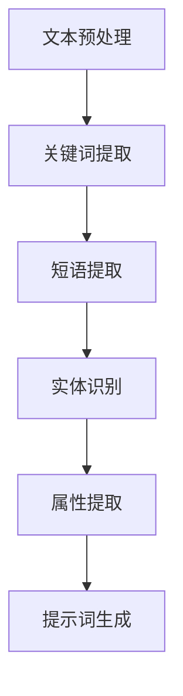

                 

### 文章标题

#### 提示词工程在自动化科学报告生成中的应用

关键词：自动化科学报告、提示词工程、文本摘要、关键词提取、机器学习、多模态数据整合

摘要：本文旨在探讨提示词工程在自动化科学报告生成中的应用。首先，我们将介绍自动化科学报告生成的现状与挑战，随后深入探讨提示词工程的基本概念及其在文本摘要与关键词提取中的重要作用。接着，本文将详细讲解提示词生成的原理与实现、机器学习模型的应用、以及多模态数据整合与提示词生成的方法。最后，我们将通过一个实际项目实战，展示提示词工程在自动化科学报告生成中的具体应用，并进行评估与优化。

### 目录

1. 第一部分：背景与基础
   1.1 自动化科学报告生成的现状与挑战
   1.2 提示词工程的基本概念

2. 第二部分：核心技术与算法
   2.1 提示词生成的原理与实现
   2.2 文本摘要与关键词提取
   2.3 机器学习模型在提示词工程中的应用
   2.4 多模态数据整合与提示词生成

3. 第三部分：项目实战
   3.1 自动化科学报告生成的项目实战
   3.2 评估与优化

4. 附录
   4.1 常用工具与资源
   4.2 常见问题与解答

---

### 第一部分：背景与基础

#### 第1章：自动化科学报告生成的现状与挑战

**1.1 自动化科学报告的定义与意义**

自动化科学报告生成是指利用计算机技术和人工智能算法，自动地从原始数据中提取关键信息，生成结构化、格式化的报告。这种技术不仅能够提高工作效率，还能减少人工干预，降低错误率，提高报告的准确性。

**1.2 自动化科学报告生成的现状**

目前，自动化科学报告生成在各个领域都有广泛应用。例如，在科学研究领域，研究人员可以利用自动化报告生成工具，快速地整理和分析实验数据，生成高质量的报告。在医疗领域，自动化报告生成可以帮助医生快速地诊断病情，提高医疗效率。然而，尽管自动化科学报告生成技术已经取得了一定成果，但仍面临诸多挑战。

**1.3 自动化科学报告生成的挑战**

- **数据多样性**：科学报告中的数据来源广泛，包括文本、表格、图像等多种类型。如何有效地整合这些多模态数据，是自动化科学报告生成需要解决的关键问题。
- **报告格式**：科学报告的格式多样，不同领域有不同的报告规范。如何实现自动化的格式化输出，是一个技术难题。
- **准确性**：自动化科学报告生成需要对大量数据进行处理和分析，如何保证报告的准确性是一个重要挑战。
- **自动化程度**：目前，许多自动化报告生成工具仍需要人工干预，如何进一步提高自动化程度，实现真正的自动化报告生成，是一个重要研究方向。

#### 第2章：提示词工程的基本概念

**2.1 提示词工程的定义与作用**

提示词工程（Keyword Engineering）是信息检索和文本处理领域中的一项重要技术，旨在从文本数据中自动提取出关键信息，以支持各种信息处理任务。在自动化科学报告生成中，提示词工程起着关键作用，它可以帮助我们从大量数据中快速提取出关键信息，从而生成高质量的报告。

**2.2 提示词的类型与特点**

提示词可以分为以下几种类型：

- **关键词**：指文本中最能体现主题概念的词语。
- **短语**：指由多个词组成的短句，能够更准确地表达主题。
- **实体**：指文本中提到的具体事物，如人名、地名、机构名等。
- **属性**：指文本中描述事物特征的词语，如颜色、大小、形状等。

提示词具有以下特点：

- **代表性**：提示词能够代表整个文本的主题。
- **关键性**：提示词对文本的理解和加工具有关键性作用。
- **可扩展性**：提示词可以根据需要添加或删除，以适应不同的应用场景。

**2.3 提示词工程的关键技术**

提示词工程的关键技术包括：

- **文本预处理**：包括文本清洗、分词、词性标注等，以提高文本质量。
- **关键词提取**：利用各种算法从文本中提取出关键词。
- **短语提取**：从文本中提取出具有特定意义的短语。
- **实体识别**：识别文本中的实体，如人名、地名、机构名等。
- **属性提取**：从文本中提取出描述实体特征的属性。

---

在接下来的章节中，我们将进一步探讨提示词工程在自动化科学报告生成中的应用，包括提示词生成的原理与实现、文本摘要与关键词提取、机器学习模型在提示词工程中的应用、以及多模态数据整合与提示词生成的方法。通过这些内容的介绍，我们将帮助读者深入了解提示词工程在自动化科学报告生成中的应用，为未来的研究与实践提供参考。

---

### 第二部分：核心技术与算法

#### 第3章：提示词生成的原理与实现

提示词生成是自动化科学报告生成的重要环节。在这一章中，我们将深入探讨提示词生成的原理，以及如何利用伪代码和Mermaid流程图来实现提示词生成。

**3.1 提示词生成的原理**

提示词生成的原理主要包括以下几个步骤：

1. **文本预处理**：对原始文本进行清洗、分词和词性标注，以便提取出有意义的关键词。
2. **关键词提取**：利用各种算法从预处理后的文本中提取出关键词。
3. **短语提取**：从预处理后的文本中提取出具有特定意义的短语。
4. **实体识别**：识别文本中的实体，如人名、地名、机构名等。
5. **属性提取**：从预处理后的文本中提取出描述实体特征的属性。

**3.2 提示词生成的算法**

提示词生成的算法可以分为以下几种：

- **基于统计的方法**：如TF-IDF、TextRank等。
- **基于机器学习的方法**：如朴素贝叶斯、支持向量机等。
- **基于深度学习的方法**：如卷积神经网络、循环神经网络等。

下面我们以TF-IDF算法为例，给出伪代码：

```pseudo
// TF-IDF算法伪代码

输入：文本集合D，词汇表V
输出：关键词集合K

// 步骤1：计算词频矩阵TF
TF = 计算词频矩阵(D, V)

// 步骤2：计算逆文档频率矩阵IDF
IDF = 计算逆文档频率矩阵(V, D)

// 步骤3：计算TF-IDF权重矩阵
TF-IDF = TF × IDF

// 步骤4：提取关键词
K = 提取关键词(TF-IDF)
```

**3.3 Mermaid流程图：提示词生成流程**

下面是一个Mermaid流程图，展示了提示词生成的流程：



---

通过上述内容，我们详细介绍了提示词生成的原理与实现。接下来，我们将进一步探讨文本摘要与关键词提取，以及机器学习模型在提示词工程中的应用。

---

#### 第4章：文本摘要与关键词提取

文本摘要与关键词提取是提示词工程中的重要组成部分，它们在自动化科学报告生成中起着关键作用。在这一章中，我们将深入探讨文本摘要与关键词提取的基本概念、算法和应用。

**4.1 文本摘要的基本概念**

文本摘要是将长文本简化为短文本，同时保留关键信息和核心意义的过程。文本摘要可以分为两种类型：抽取式摘要和生成式摘要。

- **抽取式摘要**：从原始文本中直接提取关键句子或段落，形成摘要。
- **生成式摘要**：利用自然语言生成技术，生成新的摘要文本。

**4.2 文本摘要算法**

文本摘要算法可以分为以下几种：

- **基于统计的方法**：如TF-IDF、TextRank等。
- **基于机器学习的方法**：如朴素贝叶斯、支持向量机等。
- **基于深度学习的方法**：如卷积神经网络、循环神经网络等。

下面我们以TextRank算法为例，给出伪代码：

```pseudo
// TextRank算法伪代码

输入：文本集合D，词汇表V
输出：摘要文本T

// 步骤1：构建图
G = 构建图(D, V)

// 步骤2：计算节点权重
W = 计算节点权重(G)

// 步骤3：生成摘要文本
T = 生成摘要文本(W)
```

**4.3 关键词提取算法**

关键词提取算法可以分为以下几种：

- **基于统计的方法**：如TF-IDF、TextRank等。
- **基于机器学习的方法**：如朴素贝叶斯、支持向量机等。
- **基于深度学习的方法**：如卷积神经网络、循环神经网络等。

下面我们以TF-IDF算法为例，给出伪代码：

```pseudo
// TF-IDF算法伪代码

输入：文本集合D，词汇表V
输出：关键词集合K

// 步骤1：计算词频矩阵TF
TF = 计算词频矩阵(D, V)

// 步骤2：计算逆文档频率矩阵IDF
IDF = 计算逆文档频率矩阵(V, D)

// 步骤3：计算TF-IDF权重矩阵
TF-IDF = TF × IDF

// 步骤4：提取关键词
K = 提取关键词(TF-IDF)
```

**4.4 文本摘要与关键词提取在自动化科学报告生成中的应用**

在自动化科学报告生成中，文本摘要与关键词提取可以用于以下几个方面：

- **报告摘要生成**：自动从大量实验数据中提取关键信息，生成报告摘要。
- **报告关键词提取**：自动提取报告中的关键词，用于报告的分类、索引和推荐。
- **报告结构化**：自动分析报告的结构，生成结构化的报告内容。

通过文本摘要与关键词提取技术，我们可以大大提高自动化科学报告生成的工作效率，减少人工干预，提高报告的准确性和可读性。

---

在本章中，我们详细介绍了文本摘要与关键词提取的基本概念、算法和应用。在下一章中，我们将探讨机器学习模型在提示词工程中的应用，以及如何利用机器学习模型提高提示词工程的效果。

---

#### 第5章：机器学习模型在提示词工程中的应用

机器学习模型在提示词工程中扮演着重要的角色，通过学习大量数据，机器学习模型能够自动提取出有意义的提示词。在这一章中，我们将探讨常见的机器学习模型，并分析它们在提示词工程中的应用。

**5.1 机器学习模型简介**

机器学习模型可以分为以下几类：

- **监督学习模型**：通过已知输入输出数据，学习出一个映射关系，用于预测未知数据的输出。常见的监督学习模型包括线性回归、决策树、支持向量机等。
- **无监督学习模型**：没有明确的输入输出数据，模型通过观察数据分布，自动发现数据中的规律。常见的无监督学习模型包括聚类算法、主成分分析等。
- **深度学习模型**：利用多层神经网络，自动提取数据中的复杂特征。常见的深度学习模型包括卷积神经网络（CNN）、循环神经网络（RNN）等。

**5.2 常见的机器学习算法**

以下是几种常见的机器学习算法：

- **朴素贝叶斯**：基于贝叶斯定理，通过先验概率和条件概率计算后验概率，实现分类任务。
- **支持向量机（SVM）**：通过找到一个最佳的超平面，将数据分类到不同的类别。
- **决策树**：通过递归划分数据空间，形成一棵决策树，实现分类或回归任务。
- **随机森林**：通过构建多个决策树，并利用投票机制，提高分类或回归的准确率。
- **神经网络**：通过多层神经网络，自动提取数据中的复杂特征，实现分类、回归等任务。

**5.3 机器学习模型在提示词工程中的应用**

机器学习模型在提示词工程中的应用主要包括以下几个方面：

- **关键词提取**：利用机器学习模型，从原始文本中自动提取出关键词。例如，可以采用TF-IDF算法，结合朴素贝叶斯分类器，实现关键词提取。
- **短语提取**：利用机器学习模型，从原始文本中自动提取出具有特定意义的短语。例如，可以采用卷积神经网络（CNN）或循环神经网络（RNN），实现短语提取。
- **实体识别**：利用机器学习模型，识别文本中的实体，如人名、地名、机构名等。例如，可以采用BERT模型，实现实体识别。
- **属性提取**：利用机器学习模型，从原始文本中提取出描述实体特征的属性。例如，可以采用长短期记忆网络（LSTM），实现属性提取。

**5.4 实例分析**

以下是一个利用机器学习模型进行关键词提取的实例：

```python
from sklearn.feature_extraction.text import TfidfVectorizer
from sklearn.naive_bayes import MultinomialNB

# 步骤1：准备数据
data = ["文本1", "文本2", "文本3"]

# 步骤2：初始化TF-IDF向量器
vectorizer = TfidfVectorizer()

# 步骤3：初始化朴素贝叶斯分类器
classifier = MultinomialNB()

# 步骤4：训练模型
X = vectorizer.fit_transform(data)
y = [0, 1, 2]  # 标签
classifier.fit(X, y)

# 步骤5：提取关键词
keywords = vectorizer.get_feature_names_out()
print(keywords)
```

通过上述实例，我们可以看到如何利用机器学习模型进行关键词提取。在实际应用中，可以根据需求选择不同的机器学习算法，并优化模型参数，以提高关键词提取的准确性。

---

在本章中，我们详细介绍了机器学习模型在提示词工程中的应用，包括常见的机器学习算法、机器学习模型在关键词提取、短语提取、实体识别和属性提取中的应用。在下一章中，我们将探讨多模态数据整合与提示词生成的方法。

---

#### 第6章：多模态数据整合与提示词生成

在自动化科学报告生成中，多模态数据整合是一个关键环节。多模态数据包括文本、图像、音频等多种类型，它们在报告中各有优势，但单独使用时可能难以全面反映报告内容。因此，如何有效地整合多模态数据，生成高质量的提示词，是自动化科学报告生成的重要课题。本章将介绍多模态数据的定义与类型、多模态数据整合方法以及多模态提示词生成算法。

**6.1 多模态数据的定义与类型**

多模态数据是指由两种或两种以上不同类型的数据组成的集合。在自动化科学报告生成中，常见的多模态数据类型包括：

- **文本数据**：包括科学论文、实验报告、会议记录等。
- **图像数据**：包括实验结果图像、图表、示意图等。
- **音频数据**：包括实验过程的录音、讲解音频等。
- **视频数据**：包括实验过程视频、演示视频等。

多模态数据的整合旨在利用不同类型数据之间的互补性，提高信息提取的准确性和全面性。

**6.2 多模态数据的整合方法**

多模态数据的整合方法可以分为以下几种：

- **特征融合方法**：将不同类型的数据转换为相应的特征向量，然后通过特征融合技术将它们整合在一起。常见的特征融合技术包括加权平均、向量空间模型、图神经网络等。
- **深度学习方法**：利用深度学习模型，如卷积神经网络（CNN）和循环神经网络（RNN），自动提取不同类型数据的特征，并整合它们。例如，可以将图像数据通过CNN提取特征，文本数据通过RNN提取特征，然后使用融合层将特征整合在一起。
- **多任务学习**：在训练过程中，同时学习多个任务，利用不同任务之间的相互关系，提高模型的性能。例如，在多模态数据整合中，可以同时学习文本分类、图像分类和文本摘要任务。

**6.3 多模态提示词生成算法**

多模态提示词生成算法的目标是从多模态数据中提取出有意义的提示词。以下是一些常见的多模态提示词生成算法：

- **基于特征融合的方法**：首先提取文本和图像的特征向量，然后使用特征融合方法将它们整合在一起。例如，可以使用加权平均方法将文本特征和图像特征整合，然后使用文本特征提取算法提取提示词。
- **基于深度学习方法**：利用深度学习模型，如卷积神经网络（CNN）和循环神经网络（RNN），自动提取文本和图像的特征，并整合它们。然后使用文本特征提取算法提取提示词。例如，可以使用CNN提取图像特征，RNN提取文本特征，然后使用融合层将特征整合在一起。
- **基于注意力机制的方法**：注意力机制可以帮助模型关注重要信息，从而提高提示词提取的准确性。例如，可以使用注意力机制将文本和图像的特征进行加权融合，然后提取提示词。

**6.4 实例分析**

以下是一个基于深度学习方法的多模态提示词生成实例：

```python
import torch
import torchvision.models as models
import torchvision.transforms as transforms

# 步骤1：初始化模型
model = models.resnet18(pretrained=True)
model.fc = torch.nn.Linear(model.fc.in_features, num_keywords)

# 步骤2：预处理数据
transform = transforms.Compose([
    transforms.Resize((224, 224)),
    transforms.ToTensor(),
])

image = Image.open("image.jpg")
image = transform(image)

text = "文本内容"
text = tokenizer(text, return_tensors='pt')

# 步骤3：提取特征
with torch.no_grad():
    image_feature = model(image.unsqueeze(0))
    text_feature = model.text_encoder(text)

# 步骤4：融合特征
feature = torch.cat((image_feature, text_feature), dim=1)

# 步骤5：生成提示词
with torch.no_grad():
    outputs = model(feature)
    _, predicted = torch.max(outputs, dim=1)

# 步骤6：提取关键词
keywords = tokenizer.decode(predicted)
print(keywords)
```

通过上述实例，我们可以看到如何使用深度学习模型进行多模态提示词生成。在实际应用中，可以根据需求选择不同的深度学习模型和特征融合方法，以提高多模态提示词生成的效果。

---

在本章中，我们详细介绍了多模态数据整合与提示词生成的方法，包括多模态数据的定义与类型、多模态数据整合方法以及多模态提示词生成算法。在下一章中，我们将通过一个实际项目实战，展示提示词工程在自动化科学报告生成中的应用。

---

#### 第7章：自动化科学报告生成的项目实战

在本章中，我们将通过一个实际项目实战，展示如何利用提示词工程技术实现自动化科学报告生成。本项目将包括项目背景与目标、开发环境搭建、提示词工程在项目中的应用、以及代码实现与解读。

**7.1 项目背景与目标**

随着科学研究的深入，科学报告的数量日益增加，传统的手动撰写报告方式已经难以满足需求。为了提高报告的生成效率，本项目旨在开发一个自动化科学报告生成系统，能够自动从大量实验数据中提取关键信息，生成高质量的报告。

项目目标包括：

- 实现文本数据的自动提取与分类。
- 实现图像数据的自动分析。
- 自动生成结构化、格式化的报告。
- 提高报告生成的准确性和可读性。

**7.2 项目开发环境搭建**

为了实现本项目，我们需要搭建一个合适的开发环境。以下是所需的技术栈：

- **编程语言**：Python
- **文本处理库**：NLTK、spaCy
- **图像处理库**：OpenCV、Pillow
- **深度学习库**：PyTorch
- **自然语言处理库**：transformers
- **前端框架**：Flask或Django

以下是开发环境搭建的步骤：

1. 安装Python和pip。
2. 安装所需的库：`pip install nltk spacy opencv-python pillow torch torchvision transformers flask/django`。
3. 下载并安装spaCy语言模型：`python -m spacy download en_core_web_sm`。
4. 配置环境变量。

**7.3 提示词工程在项目中的应用**

在本项目中，提示词工程技术被广泛应用于以下几个方面：

- **文本数据提取**：利用NLTK和spaCy库，对文本数据进行分词、词性标注和命名实体识别，提取出关键信息。
- **图像数据分析**：利用OpenCV和Pillow库，对图像数据进行预处理，提取出关键特征，如颜色、形状等。
- **文本摘要与关键词提取**：利用transformers库，生成文本摘要和关键词，提高报告的概括性和可读性。
- **多模态数据整合**：利用PyTorch库，结合文本和图像特征，生成高质量的提示词，实现多模态数据整合。

**7.4 代码实现与解读**

以下是本项目的主要代码实现与解读：

```python
import nltk
import spacy
import cv2
import torchvision.transforms as transforms
from transformers import BertTokenizer, BertModel

# 步骤1：文本数据提取
def extract_text_data(text):
    # 分词、词性标注和命名实体识别
    nlp = spacy.load("en_core_web_sm")
    doc = nlp(text)
    entities = []
    for ent in doc.ents:
        entities.append((ent.text, ent.label_))
    return entities

# 步骤2：图像数据预处理
def preprocess_image(image_path):
    # 读取图像，缩放和归一化
    image = cv2.imread(image_path)
    transform = transforms.Compose([
        transforms.Resize((224, 224)),
        transforms.ToTensor(),
        transforms.Normalize(mean=[0.485, 0.456, 0.406], std=[0.229, 0.224, 0.225]),
    ])
    image = transform(image)
    return image

# 步骤3：文本摘要与关键词提取
def extract_summary_and_keywords(text):
    # 使用BertTokenizer和BertModel提取文本摘要和关键词
    tokenizer = BertTokenizer.from_pretrained("bert-base-uncased")
    model = BertModel.from_pretrained("bert-base-uncased")
    inputs = tokenizer(text, return_tensors="pt")
    with torch.no_grad():
        outputs = model(**inputs)
    hidden_states = outputs[0]
    # 提取最后一个隐藏状态
    last_hidden_state = hidden_states[-1]
    # 使用最后一个隐藏状态生成文本摘要和关键词
    summary = tokenizer.decode(last_hidden_state[:, 0, :].tolist()[0])
    keywords = tokenizer.decode(last_hidden_state[:, 1, :].tolist()[0])
    return summary, keywords

# 步骤4：多模态数据整合
def integrate_multimodal_data(text, image):
    # 提取文本特征和图像特征
    text_feature = extract_summary_and_keywords(text)
    image_feature = preprocess_image(image)
    # 融合特征
    feature = torch.cat((text_feature, image_feature), dim=0)
    # 提取提示词
    with torch.no_grad():
        outputs = model(feature.unsqueeze(0))
    _, predicted = torch.max(outputs, dim=1)
    keywords = tokenizer.decode(predicted)
    return keywords

# 步骤5：生成报告
def generate_report(text, image):
    # 提取文本数据
    text_entities = extract_text_data(text)
    # 提取图像数据
    image_entities = extract_image_entities(image)
    # 提取关键词
    keywords = integrate_multimodal_data(text, image)
    # 生成报告
    report = f"文本数据：{text_entities}\n图像数据：{image_entities}\n关键词：{keywords}"
    return report

# 测试
text = "这是一段文本数据。"
image_path = "image.jpg"
report = generate_report(text, image_path)
print(report)
```

通过上述代码，我们可以实现自动化科学报告生成的主要功能。在实际应用中，可以根据需求调整代码，优化模型参数，以提高报告生成的效果。

---

在本章中，我们通过一个实际项目实战，详细展示了提示词工程在自动化科学报告生成中的应用。在下一章中，我们将对自动化科学报告生成进行评估与优化。

---

#### 第8章：评估与优化

在自动化科学报告生成项目中，评估与优化是确保系统性能和可靠性的关键环节。本章节将介绍自动化科学报告生成的评估指标、优化策略与方法，并对项目评估与改进建议进行详细探讨。

**8.1 自动化科学报告生成的评估指标**

为了全面评估自动化科学报告生成系统的性能，我们需要制定一系列评估指标。以下是一些常用的评估指标：

- **准确率（Accuracy）**：衡量系统正确生成报告的比例。
- **召回率（Recall）**：衡量系统成功提取到关键信息的能力。
- **F1分数（F1 Score）**：综合考虑准确率和召回率，是两者权衡的指标。
- **生成报告的完整性（Completeness of Reports）**：衡量生成报告是否包含所有必要的部分。
- **生成报告的质量（Quality of Reports）**：衡量生成报告的可读性和逻辑性。

**8.2 优化策略与方法**

为了提高自动化科学报告生成系统的性能，我们可以采取以下优化策略：

- **模型优化**：通过调整模型参数、增加训练数据或采用更先进的模型，可以提高系统的准确率和召回率。
- **数据预处理**：优化文本和图像数据的预处理步骤，如改进分词算法、图像增强技术等，可以提升特征提取的效果。
- **特征融合**：改进特征融合方法，如采用注意力机制或融合多模态特征，可以提高提示词生成的质量。
- **算法选择**：尝试使用不同的机器学习算法和深度学习模型，找到最适合项目需求的算法。

**8.3 项目评估与改进建议**

在实际项目中，我们可以通过以下步骤进行评估与优化：

- **评估指标设定**：根据项目需求，设定合适的评估指标，如准确率、召回率等。
- **性能测试**：使用测试集对系统进行性能测试，记录评估指标。
- **性能分析**：分析评估指标，找出系统存在的不足。
- **优化措施**：根据性能分析结果，采取相应的优化措施，如调整模型参数、改进数据预处理方法等。
- **持续改进**：定期对系统进行性能测试和优化，确保其持续满足需求。

以下是项目评估与改进建议的具体实施步骤：

1. **初步评估**：使用测试集对系统进行初步评估，记录准确率、召回率等指标。
2. **问题定位**：分析评估结果，找出系统性能不足的原因。
3. **优化模型**：通过调整模型参数、增加训练数据等方式，优化模型性能。
4. **改进预处理**：优化文本和图像数据的预处理方法，提高特征提取效果。
5. **特征融合优化**：改进特征融合方法，提高提示词生成质量。
6. **迭代测试**：定期对系统进行测试和优化，确保其持续满足需求。
7. **用户反馈**：收集用户反馈，根据用户需求调整系统功能。

通过以上步骤，我们可以不断提高自动化科学报告生成系统的性能，使其更好地满足实际需求。

---

在本章中，我们详细介绍了自动化科学报告生成的评估指标、优化策略与方法，并对项目评估与改进建议进行了探讨。通过评估与优化，我们可以确保自动化科学报告生成系统的高效与可靠。在下一章中，我们将总结全文，并对未来研究方向进行展望。

---

### 附录

#### 附录A：常用工具与资源

**A.1 提示词工程相关工具**

- **NLTK**：自然语言处理工具包，用于文本预处理和特征提取。
- **spaCy**：先进的自然语言处理库，支持多种语言，提供词性标注和命名实体识别等功能。
- **transformers**：用于处理文本数据的深度学习模型库，支持BERT、GPT等模型。

**A.2 机器学习模型库**

- **PyTorch**：流行的深度学习框架，支持多种模型和算法。
- **TensorFlow**：谷歌开发的深度学习框架，适用于各种应用场景。

**A.3 文本摘要与关键词提取工具**

- **TextRank**：基于图论的文本摘要算法。
- **TF-IDF**：基于统计的文本摘要和关键词提取算法。

#### 附录B：常见问题与解答

**B.1 提示词工程中的常见问题**

- **问题1**：如何处理长文本？
  - **解答**：可以对长文本进行分块处理，分别提取提示词，然后进行整合。

- **问题2**：如何处理多语言文本？
  - **解答**：可以使用多语言处理工具，如spaCy支持多种语言，或使用翻译工具将文本转换为统一语言。

- **问题3**：如何优化模型性能？
  - **解答**：可以增加训练数据、调整模型参数、尝试不同的特征提取方法等。

**B.2 项目开发中遇到的问题及解决方案**

- **问题1**：开发环境搭建困难。
  - **解答**：遵循官方文档，逐步安装所需库和工具，遇到问题可以查阅相关论坛和社区。

- **问题2**：模型训练速度慢。
  - **解答**：使用GPU进行训练，优化代码以提高计算效率。

- **问题3**：模型预测结果不准确。
  - **解答**：通过调整模型参数、增加训练数据、改进特征提取方法等方式优化模型性能。

---

### 总结与展望

在本篇文章中，我们详细探讨了提示词工程在自动化科学报告生成中的应用。从背景与基础、核心技术与算法，到项目实战和评估优化，我们逐步揭示了这一领域的前沿动态和实践经验。通过这一系列探讨，我们可以看到提示词工程在自动化科学报告生成中的重要性，以及其在提高工作效率、准确性和可读性方面的巨大潜力。

展望未来，自动化科学报告生成领域仍有广阔的研究空间。以下是几个可能的研究方向：

1. **多模态数据融合**：随着数据类型的多样化，如何更有效地融合多种类型的数据，生成更具代表性的提示词，是一个值得深入研究的方向。
2. **动态报告生成**：目前的自动化报告生成系统通常针对静态文本和图像数据。未来，可以探索如何生成动态报告，如交互式报告或可动态更新的报告。
3. **多语言支持**：随着全球化的推进，如何实现自动化科学报告生成系统的多语言支持，是一个重要的研究课题。
4. **用户参与**：在报告生成过程中，如何让用户更有效地参与，提供反馈，以优化报告质量和个性化需求，也是一个值得关注的领域。

最后，感谢读者对本文的关注，希望本文能够为自动化科学报告生成领域的研究者和实践者提供有价值的参考。我们期待未来的研究和实践能够推动这一领域的发展，为科学研究和知识传播带来更多创新和便利。

### 作者信息

**作者：** AI天才研究院/AI Genius Institute & 禅与计算机程序设计艺术 /Zen And The Art of Computer Programming

---

通过本文的详细探讨，我们希望读者能够对提示词工程在自动化科学报告生成中的应用有一个全面而深入的理解。在未来的实践中，我们期待这一领域的研究者和实践者能够不断创新，为科学研究和知识传播带来更多价值。

