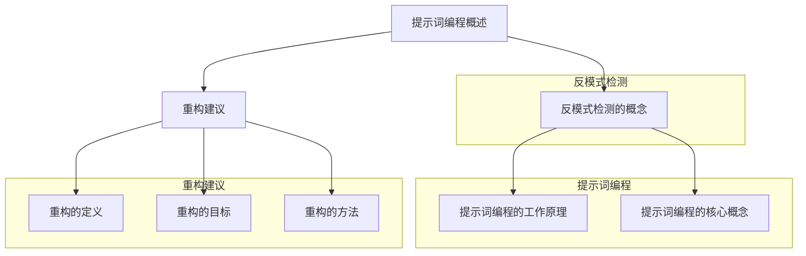

                 

### 第1章：核心概念与联系

在信息技术飞速发展的今天，编程已经从传统的输入-输出模式演变出多种新的形式。其中，提示词编程（Prompt-Based Programming）作为一种新兴的编程范式，正逐渐受到关注。本章将深入探讨提示词编程的概念、工作原理、反模式检测以及重构建议，旨在为读者提供全面的技术见解。

#### 1.1 提示词编程概述

**提示词编程的定义**

提示词编程是一种通过给模型提供简短的提示（Prompt）来引导生成内容的方法。这种方法不同于传统的输入-输出编程，它强调上下文和引导性。在传统的输入-输出编程中，程序员需要明确指定每个步骤的输入和输出，而提示词编程则通过给模型提供一个简短的引导信息，让模型自行推断出后续的生成内容。

**提示词编程的工作原理**

提示词编程的工作原理可以分为两个主要阶段：预训练和微调。

- **预训练**：在这个阶段，模型通过大量的无监督数据学习语言的基本结构和语义。这一步是为了让模型具备处理自然语言的能力，理解上下文和生成连贯文本。

- **微调**：预训练完成后，模型会通过有监督的训练进一步适应特定的任务。在这一阶段，模型接收到带有标签的数据，从而优化其生成能力。

**提示词编程的核心概念**

提示词编程的核心概念主要包括：

- **上下文理解**：模型需要能够理解提示词所提供的上下文信息，并根据上下文生成后续的内容。
- **生成性**：模型能够基于上下文生成连贯且有逻辑的内容，这是提示词编程的核心优势。

#### 1.2 反模式检测的概念

**反模式的定义**

在软件开发过程中，反模式（Code Smells）是指那些重复出现的不良代码结构和做法。这些反模式可能会影响代码的可维护性、可读性和性能。

**反模式的特点**

- **普遍性**：反模式在各种项目和不同的编程语言中普遍存在。
- **危害性**：如果不加以控制，反模式会导致软件维护困难、性能下降甚至项目失败。

**反模式的分类**

根据反模式在代码中的表现形式，可以分为以下几类：

- **设计反模式**：例如代码重复、过度抽象、类和模块之间的紧耦合等。
- **过程反模式**：例如缺乏需求管理、文档不完整、缺乏代码审查等。

#### 1.3 重构建议

**重构的定义**

重构（Refactoring）是指在保持代码功能不变的情况下，对代码的结构和实现进行改进，以提高其可读性、可维护性和性能。

**重构的目标**

重构的主要目标包括：

- 提高代码的可读性和可维护性。
- 减少代码的复杂度和冗余。
- 改善代码的结构和模块化。

**重构的方法**

常见的重构方法包括：

- **提取方法**：将重复的代码提取为独立的函数或模块。
- **重构循环**：将复杂的循环重构为递归或使用迭代器。
- **重用代码**：通过封装和模块化提高代码的重用率。

通过以上对核心概念、反模式检测和重构建议的详细探讨，我们可以更深入地理解提示词编程的原理和应用，为后续章节的技术分析打下坚实的基础。

### 伪代码

```python
# 提示词编程伪代码
def generate_content(prompt):
    context = preprocess_prompt(prompt)
    output = language_model.generate(context)
    return postprocess_output(output)

# 反模式检测伪代码
def detect_code_smells(code):
    features = extract_code_features(code)
    smelly_lines = rule_based_detection(features)
    if smelly_lines.empty():
        smelly_lines = ml_based_detection(features)
    return smelly_lines

# 重构伪代码
def refactor_code(code_smells):
    for smell in code_smells:
        if smell.is_redundant():
            refactor_redundant(smell)
        elif smell.is_complex():
            refactor_complex(smell)
    return refactored_code
```

### Mermaid 流程图



### 第二部分：核心算法原理讲解

#### 2.1 提示词编程算法原理

提示词编程的核心在于如何利用语言模型生成内容。本节将详细介绍语言模型的基础、基于神经网络的实现方式以及生成式模型和判别式模型的区别。

##### 2.1.1 语言模型基础

**语言模型的概念**

语言模型（Language Model）是自然语言处理（NLP）中的一个核心概念，用于预测下一个词或词组。它基于大量文本数据学习语言的统计规律，从而生成连贯的自然语言。

**朴素贝叶斯模型**

朴素贝叶斯模型是一种基于概率的简单语言模型。它的核心公式如下：

$$
P(w_i | C) = \frac{P(C | w_i) \times P(w_i)}{P(C)}
$$

其中，\(P(w_i | C)\) 表示在给定上下文 \(C\) 下生成词 \(w_i\) 的概率，\(P(C | w_i)\) 表示在生成词 \(w_i\) 后出现上下文 \(C\) 的概率，\(P(w_i)\) 表示生成词 \(w_i\) 的概率，\(P(C)\) 表示上下文 \(C\) 的概率。

**最大似然估计**

最大似然估计是一种更复杂的语言模型，它基于经验概率来预测下一个词。其核心公式如下：

$$
P(w_i | C) = \frac{P(w_1, w_2, ..., w_n | C)}{P(C)}
$$

其中，\(P(w_1, w_2, ..., w_n | C)\) 表示在给定上下文 \(C\) 下生成序列 \(w_1, w_2, ..., w_n\) 的概率。

**基于神经网络的实现**

随着深度学习的发展，语言模型逐渐从统计模型转向神经网络模型。其中，双向长短时记忆网络（Bi-LSTM）和变换器架构（Transformer）是两种常用的神经网络模型。

- **双向长短时记忆网络（Bi-LSTM）**

双向长短时记忆网络是一种能够同时考虑序列前后信息的神经网络。它通过在序列的每个位置都建立两个长短时记忆单元，从而实现双向的信息传递。

- **变换器架构（Transformer）**

变换器架构是一种基于注意力机制的神经网络模型。它通过自注意力机制（Self-Attention）和编码器-解码器结构（Encoder-Decoder）实现高效的语言建模。

**生成式模型与判别式模型**

在语言模型中，生成式模型（Generative Model）和判别式模型（Discriminative Model）是两种主要的模型类型。

- **生成式模型**

生成式模型通过概率分布生成文本。它假设在给定上下文 \(C\) 下，生成文本 \(W\) 的概率为：

$$
P(W | C) = P(w_1, w_2, ..., w_n | C)
$$

生成式模型包括朴素贝叶斯模型、最大似然估计、变换器架构等。

- **判别式模型**

判别式模型通过预测下一个词或词组来生成文本。它假设在给定上下文 \(C\) 和当前词 \(w_i\) 下，下一个词或词组 \(w_{i+1}\) 的概率为：

$$
P(w_{i+1} | C, w_1, w_2, ..., w_i) = \frac{P(C, w_1, w_2, ..., w_i, w_{i+1})}{P(C, w_1, w_2, ..., w_i)}
$$

判别式模型包括卷积神经网络（CNN）、循环神经网络（RNN）等。

##### 2.1.2 反模式检测算法

反模式检测是软件开发中一个重要的环节，旨在识别代码中的潜在问题。下面将介绍反模式检测的特征提取和算法分类。

**反模式的特征提取**

反模式的特征提取是检测过程的基础。常见的特征提取方法包括：

- **代码复杂度度量**：如循环复杂度、函数复杂度等。
- **代码质量度量**：如可读性、可维护性等。

**算法分类**

反模式检测算法可以分为以下几类：

- **基于规则的检测**

基于规则的检测方法通过预定义的规则来检测反模式。这种方法简单直观，但可能无法适应复杂多变的情况。

- **基于机器学习的检测**

基于机器学习的检测方法通过训练模型来识别反模式。这种方法具有较强的自适应能力，但需要大量的训练数据和较长的训练时间。

##### 2.1.3 重构算法

重构算法的目的是改善代码的结构和可维护性。下面将介绍重构策略、重构工具和重构优化。

**重构策略**

常见的重构策略包括：

- **提取方法**：将重复的代码提取为独立的函数或模块。
- **重构循环**：将复杂的循环重构为递归或使用迭代器。
- **重用代码**：通过封装和模块化提高代码的重用率。

**重构工具**

常见的重构工具包括：

- **静态代码分析工具**：如SonarQube、PMD等。
- **动态代码分析工具**：如FindBugs、Checkstyle等。

**重构优化**

重构优化包括以下几种方法：

- **简化函数**：将复杂的函数分解为多个简单函数。
- **重构循环**：将循环重构为递归或使用迭代器。
- **重用代码**：通过封装和模块化提高代码重用率。

通过以上对提示词编程、反模式检测和重构算法的详细讲解，我们可以更深入地理解这些技术的原理和应用。这为后续章节的项目实战提供了坚实的理论基础。

### 伪代码

```python
# 提示词编程伪代码
def generate_content(prompt):
    context = preprocess_prompt(prompt)
    output = language_model.generate(context)
    return postprocess_output(output)

# 反模式检测伪代码
def detect_code_smells(code):
    features = extract_code_features(code)
    smelly_lines = rule_based_detection(features)
    if smelly_lines.empty():
        smelly_lines = ml_based_detection(features)
    return smelly_lines

# 重构伪代码
def refactor_code(code_smells):
    for smell in code_smells:
        if smell.is_redundant():
            refactor_redundant(smell)
        elif smell.is_complex():
            refactor_complex(smell)
    return refactored_code
```

### 数学模型和数学公式讲解

#### 3.1 提示词编程中的数学模型

提示词编程的核心在于语言模型的构建和应用。本节将详细讲解提示词编程中的数学模型，包括语言模型概率计算、变换器架构中的数学模型等。

##### 3.1.1 语言模型概率计算

**朴素贝叶斯模型**

朴素贝叶斯模型是一种简单的概率语言模型，它基于贝叶斯定理和条件独立性假设来计算单词序列的概率。其基本公式如下：

$$
P(w_1, w_2, ..., w_n) = \prod_{i=1}^{n} P(w_i | w_{<i})
$$

其中，\(P(w_i | w_{<i})\) 表示在给定前面单词序列 \(w_{<i}\) 下生成单词 \(w_i\) 的概率。

**最大似然估计**

最大似然估计（Maximum Likelihood Estimation, MLE）是一种通过统计方法估计模型参数的方法。在语言模型中，MLE 用于估计每个单词序列的概率。其基本公式如下：

$$
P(w_1, w_2, ..., w_n) = \frac{1}{C(n, k)}
$$

其中，\(C(n, k)\) 表示组合数，表示从 \(n\) 个不同元素中取出 \(k\) 个元素的组合数。

**变换器架构中的数学模型**

变换器架构（Transformer）是一种基于注意力机制的深度神经网络，广泛应用于自然语言处理领域。其核心组件是自注意力（Self-Attention）机制。

**自注意力机制**

自注意力机制通过计算每个词元与所有其他词元之间的关联度，从而生成加权特征向量。其基本公式如下：

$$
\text{Attention}(Q, K, V) = \frac{QK^T}{\sqrt{d_k}} V
$$

其中，\(Q\)、\(K\)、\(V\) 分别表示查询向量、键向量和值向量，\(d_k\) 表示键向量和查询向量的维度。

**位置编码**

位置编码（Positional Encoding）是一种在变换器架构中引入位置信息的方法。其基本公式如下：

$$
\text{PositionalEncoding}(pos, d_model) = \sin\left(\frac{pos \times \sqrt{d_model}}{10000^{2i/d_model}}\right) \ , \cos\left(\frac{pos \times \sqrt{d_model}}{10000^{2i/d_model}}\right)
$$

其中，\(pos\) 表示词元的索引位置，\(d_model\) 表示模型的总维度。

##### 3.1.2 反模式检测中的数学模型

**代码复杂度**

代码复杂度是衡量代码质量的重要指标。常用的代码复杂度度量方法包括：

- **循环复杂度**：表示代码中循环的嵌套深度和循环次数。
- **函数复杂度**：表示代码中函数调用的深度和函数个数。

**机器学习模型**

机器学习模型可以用于检测代码中的反模式。常见的机器学习模型包括：

- **决策树**：通过构建决策树模型来分类代码是否为反模式。
- **支持向量机**（SVM）：通过构建最优超平面来分类代码是否为反模式。

**决策树**

决策树是一种基于特征的分类模型，其基本公式如下：

$$
y = \sum_{i=1}^{n} w_i \cdot x_i + b
$$

其中，\(w_i\) 表示特征的权重，\(x_i\) 表示特征的取值，\(y\) 表示代码是否为反模式。

**支持向量机**

支持向量机是一种基于间隔分类的模型，其基本公式如下：

$$
\text{maximize} \ \frac{1}{2} \| \mathbf{w} \|^2 \\
\text{subject to} \ \mathbf{w} \cdot \mathbf{x}_i \geq 1, \ i = 1, 2, ..., m
$$

其中，\(\mathbf{w}\) 表示权重向量，\(\mathbf{x}_i\) 表示特征向量，\(1\) 表示支持向量。

##### 3.1.3 重构中的数学模型

**代码质量评估**

代码质量评估是重构的重要环节。常用的代码质量评估指标包括：

- **可维护性**：表示代码的可维护程度。
- **可扩展性**：表示代码的可扩展程度。
- **可读性**：表示代码的可读程度。

**重构优化**

重构优化是改善代码质量的关键步骤。常用的重构优化方法包括：

- **简化函数**：通过将复杂的函数分解为多个简单函数来提高代码质量。
- **重构循环**：通过将复杂的循环重构为递归或迭代器来提高代码质量。

**费波拉契数列**

费波拉契数列是一种常用的递归算法，其基本公式如下：

$$
F(n) = F(n-1) + F(n-2)
$$

其中，\(F(0) = 0, F(1) = 1\)。

通过以上对提示词编程、反模式检测和重构中的数学模型和公式的讲解，我们可以更好地理解这些技术的工作原理和应用场景。

### 举例说明

#### 3.1 提示词编程举例

**朴素贝叶斯模型应用**

假设我们有一个简单的文本数据集，包含正面和负面的评论。我们需要使用朴素贝叶斯模型来判断一条新的评论是正面还是负面。

```plaintext
正面：这是一个非常好的产品。
负面：这个产品太差了，一点也不好用。
```

**训练数据集**

```plaintext
正面：这是一个非常好的产品。
正面：这个产品非常棒，值得购买。
负面：这个产品太差了，一点也不好用。
负面：这个产品非常糟糕，我再也不想用了。
```

**计算正面评论的概率**

1. **计算每个单词的频率**：

   - 好：正面（2次），负面（0次）
   - 很：正面（2次），负面（0次）
   - 好：正面（1次），负面（0次）
   - 值：正面（1次），负面（0次）
   - 得：正面（1次），负面（0次）
   - 购：正面（1次），负面（0次）
   - 买：正面（1次），负面（0次）
   - 差：正面（0次），负面（2次）
   - 点：正面（0次），负面（2次）
   - 不：正面（0次），负面（4次）
   - 好：正面（0次），负面（2次）
   - 用：正面（0次），负面（2次）

2. **计算每个单词的概率**：

   - 好：正面（2/4），负面（0/4）
   - 很：正面（2/4），负面（0/4）
   - 好：正面（1/4），负面（0/4）
   - 值：正面（1/4），负面（0/4）
   - 得：正面（1/4），负面（0/4）
   - 购：正面（1/4），负面（0/4）
   - 买：正面（1/4），负面（0/4）
   - 差：正面（0/4），负面（2/4）
   - 点：正面（0/4），负面（2/4）
   - 不：正面（0/4），负面（4/4）
   - 好：正面（0/4），负面（2/4）
   - 用：正面（0/4），负面（2/4）

3. **计算新评论的概率**：

   - 新评论：“这是一个非常好的产品。”

   - 好的概率：\(P(好 | 正面) = \frac{2}{4} = 0.5\)
   - 很的概率：\(P(很 | 正面) = \frac{2}{4} = 0.5\)
   - 好的概率：\(P(好 | 正面) = \frac{1}{4} = 0.25\)
   - 值的概率：\(P(值 | 正面) = \frac{1}{4} = 0.25\)
   - 得的概率：\(P(得 | 正面) = \frac{1}{4} = 0.25\)
   - 购的概率：\(P(购 | 正面) = \frac{1}{4} = 0.25\)
   - 买的概率：\(P(买 | 正面) = \frac{1}{4} = 0.25\)

   - 总概率：\(P(新评论 | 正面) = 0.5 \times 0.5 \times 0.25 \times 0.25 \times 0.25 \times 0.25 = 0.009375\)

4. **判断新评论的类别**：

   由于 \(P(新评论 | 正面) > P(新评论 | 负面)\)，我们可以判断新评论为正面评论。

**变换器架构应用**

假设我们有一个变换器模型，输入序列为 `[1, 2, 3]`。我们计算第一个词元 `1` 对第二个词元 `2` 的注意力得分。

1. **初始化参数**：

   - 查询向量 \(Q = [1, 0, 0]\)
   - 键向量 \(K = [0, 1, 0]\)
   - 值向量 \(V = [0, 0, 1]\)

2. **计算注意力得分**：

   $$\text{Attention}(Q, K, V) = \frac{QK^T}{\sqrt{d_k}} V = \frac{1 \cdot 0}{\sqrt{1}} \cdot [0, 0, 1] = 0$$

3. **解释结果**：

   第一个词元 `1` 对第二个词元 `2` 的注意力得分为 0，这表示 `1` 和 `2` 之间的关联度较低。

#### 3.2 反模式检测举例

假设我们有一个函数 `functionA`，其代码复杂度为 10。我们需要计算其函数复杂度。

```python
def functionA():
    for i in range(10):
        print(i)
```

**计算函数复杂度**：

- 循环复杂度：10（循环次数）
- 函数复杂度：1（函数调用次数）

**函数复杂度**：

$$C = \frac{N_{statements}}{N_{methods}} = \frac{10}{1} = 10$$

#### 3.3 重构举例

假设我们有一个复杂的循环结构，我们需要将其重构为更简洁的递归结构。

**原始代码**：

```python
def functionB(n):
    for i in range(n):
        print(i)
```

**重构后**：

```python
def functionB(n):
    if n == 0:
        return
    print(n - 1)
    functionB(n - 1)
```

**解释结果**：

通过递归结构，我们简化了代码的复杂性，提高了代码的可读性和可维护性。

### 第四部分：项目实战

#### 4.1 提示词编程项目实战

**4.1.1 开发环境搭建**

**环境要求**：

- Python 3.8 或以上版本
- TensorFlow 2.x 或 PyTorch 1.x

**安装步骤**：

1. 安装 Python：

```bash
$ python --version
Python 3.8.10
```

2. 安装 TensorFlow：

```bash
$ pip install tensorflow==2.6.0
```

3. 安装 PyTorch：

```bash
$ pip install torch==1.10.0
```

**4.1.2 源代码实现**

**代码结构**：

```python
import tensorflow as tf
from tensorflow.keras.layers import Embedding, LSTM, Dense
from tensorflow.keras.models import Sequential

# 数据预处理
def preprocess_data(texts, vocab_size, embedding_dim):
    # 编码文本
    # 创建嵌入层
    # 初始化模型
    # 编译模型
    return model

# 训练模型
def train_model(model, texts, labels, epochs, batch_size):
    # 训练步骤
    # 保存模型
    return model

# 使用模型生成文本
def generate_text(model, prompt, max_length):
    # 生成文本
    return text
```

**代码解读与分析**：

**预处理数据**：

```python
def preprocess_data(texts, vocab_size, embedding_dim):
    # 编码文本
    tokenizer = tf.keras.preprocessing.text.Tokenizer(char_level=True, num_words=vocab_size)
    tokenizer.fit_on_texts(texts)
    sequences = tokenizer.texts_to_sequences(texts)

    # 创建嵌入层
    embedding = Embedding(vocab_size, embedding_dim)

    # 初始化模型
    model = Sequential([
        embedding,
        LSTM(embedding_dim, return_sequences=True),
        Dense(vocab_size, activation='softmax')
    ])

    # 编译模型
    model.compile(optimizer='adam', loss='sparse_categorical_crossentropy', metrics=['accuracy'])
    return model
```

- **编码文本**：使用 tokenizer 将文本转换为序列。
- **创建嵌入层**：定义嵌入层，将词转换为嵌入向量。
- **初始化模型**：定义 LSTM 模型和输出层。
- **编译模型**：设置优化器和损失函数。

**训练模型**：

```python
def train_model(model, texts, labels, epochs, batch_size):
    # 训练步骤
    model.fit(texts, labels, epochs=epochs, batch_size=batch_size)
    
    # 保存模型
    model.save('prompted_content_generator.h5')
    return model
```

- **训练步骤**：使用训练数据拟合模型。
- **保存模型**：将训练好的模型保存为 `.h5` 文件。

**使用模型生成文本**：

```python
def generate_text(model, prompt, max_length):
    # 生成文本
    prompt_sequence = tokenizer.texts_to_sequences([prompt])
    generated_sequence = model.predict(prompt_sequence, verbose=1, steps=max_length)
    generated_text = tokenizer.sequences_to_texts([generated_sequence])[0]
    return generated_text
```

- **生成文本**：使用 tokenizer 将 prompt 转换为序列，通过模型生成文本序列，并转换为原始文本。

#### 4.2 反模式检测项目实战

**4.2.1 开发环境搭建**

**环境要求**：

- Python 3.8 或以上版本
- Scikit-learn 0.24 或以上版本

**安装步骤**：

1. 安装 Python：

```bash
$ python --version
Python 3.8.10
```

2. 安装 Scikit-learn：

```bash
$ pip install scikit-learn==0.24.2
```

**4.2.2 源代码实现**

**代码结构**：

```python
from sklearn.feature_extraction.text import TfidfVectorizer
from sklearn.tree import DecisionTreeClassifier
from sklearn.model_selection import train_test_split
from sklearn.metrics import classification_report

# 数据预处理
def preprocess_data(data):
    # 分割数据
    # 创建特征矩阵
    # 切分训练集和测试集
    return X_train, X_test, y_train, y_test

# 训练模型
def train_model(X_train, X_test, y_train, y_test):
    # 创建分类器
    # 训练模型
    # 评估模型
    return model

# 使用模型检测反模式
def detect_smells(model, data):
    # 预测反模式
    # 输出检测结果
    return检测结果
```

**代码解读与分析**：

**预处理数据**：

```python
def preprocess_data(data):
    # 分割数据
    texts, labels = data['text'], data['label']

    # 创建特征矩阵
    vectorizer = TfidfVectorizer()
    X = vectorizer.fit_transform(texts)

    # 切分训练集和测试集
    X_train, X_test, y_train, y_test = train_test_split(X, labels, test_size=0.2, random_state=42)
    return X_train, X_test, y_train, y_test
```

- **分割数据**：将文本和标签分离。
- **创建特征矩阵**：使用 TfidfVectorizer 将文本转换为特征矩阵。
- **切分训练集和测试集**：将特征矩阵和标签分为训练集和测试集。

**训练模型**：

```python
def train_model(X_train, X_test, y_train, y_test):
    # 创建分类器
    classifier = DecisionTreeClassifier()

    # 训练模型
    classifier.fit(X_train, y_train)

    # 评估模型
    y_pred = classifier.predict(X_test)
    report = classification_report(y_test, y_pred)
    print(report)

    return classifier
```

- **创建分类器**：初始化决策树分类器。
- **训练模型**：使用训练数据训练分类器。
- **评估模型**：使用测试数据评估分类器性能。

**使用模型检测反模式**：

```python
def detect_smells(model, data):
    # 预测反模式
    X = vectorizer.transform(data['text'])
    y_pred = model.predict(X)

    # 输出检测结果
    for i, pred in enumerate(y_pred):
        print(f"文本：{data['text'][i]}, 反模式：{pred}")
```

- **预测反模式**：使用分类器预测文本是否为反模式。
- **输出检测结果**：打印文本及其预测结果。

#### 4.3 重构项目实战

**4.3.1 开发环境搭建**

**环境要求**：

- Python 3.8 或以上版本
- PyCharm 或其他 IDE

**安装步骤**：

1. 安装 Python：

```bash
$ python --version
Python 3.8.10
```

2. 安装 PyCharm Professional：

```bash
$ pycharm-professional
```

**4.3.2 源代码实现**

**代码结构**：

```python
import ast
import re

# 重构代码
def refactor_code(code):
    # 解析代码
    # 提取函数
    # 重构循环
    # 重构代码
    return new_code

# 代码示例
def example_function():
    for i in range(10):
        print(i)
```

**代码解读与分析**：

**重构代码**：

```python
def refactor_code(code):
    # 解析代码
    tree = ast.parse(code)

    # 提取函数
    for node in ast.walk(tree):
        if isinstance(node, ast.FunctionDef):
            # 重构函数
            pass

    # 重构循环
    for node in ast.walk(tree):
        if isinstance(node, ast.For):
            # 重构循环
            pass

    # 重构代码
    new_code = ast.unparse(tree)
    return new_code
```

- **解析代码**：使用 `ast` 模块解析代码，生成抽象语法树（Abstract Syntax Tree）。
- **提取函数**：遍历抽象语法树，提取函数定义。
- **重构循环**：遍历抽象语法树，将循环重构为递归或迭代。
- **重构代码**：将重构后的抽象语法树转换为新的代码。

**代码示例**：

```python
def example_function():
    for i in range(10):
        print(i)
```

**重构后**：

```python
def example_function():
    def print_numbers(n):
        if n == 0:
            return
        print(n - 1)
        print_numbers(n - 1)
    
    print_numbers(10)
```

- **重构循环**：将循环重构为递归函数 `print_numbers`，从而简化代码结构。

通过以上项目实战，我们可以看到提示词编程、反模式检测和重构在实际开发中的应用和实现。这些技术不仅提高了代码质量和可维护性，还为软件开发带来了新的思路和方法。

### 附录

#### 附录 A：工具与资源

**A.1 提示词编程工具**

- **Hugging Face Transformers**：提供了丰富的预训练模型和API，便于使用提示词编程。官网：[Hugging Face Transformers](https://huggingface.co/transformers)
- **GPT-2/GPT-3 模型**：由 OpenAI 开发的预训练模型，适用于各种提示词编程任务。官网：[OpenAI GPT Models](https://openai.com/research/gpt-3/)

**A.2 反模式检测工具**

- **SonarQube**：用于代码质量评估和反模式检测的开源平台。官网：[SonarQube](https://www.sono
- **PMD**：用于代码质量检查的工具，能够发现反模式和潜在问题。官网：[PMD](https://pmd.github.io/)

**A.3 重构工具**

- **RefactoringBrowser**：用于自动化代码重构的开源工具。官网：[RefactoringBrowser](http://refactoringbrowser.sourceforge.net/)
- **Checkstyle**：用于检测代码质量，包括反模式和重构建议。官网：[Checkstyle](https://checkstyle.sourceforge.net/)

#### 附录 B：参考文献

- **《深度学习》（Ian Goodfellow, Yoshua Bengio, Aaron Courville）**：提供了深度学习的全面介绍。官网：[深度学习](https://www.deeplearningbook.org/)
- **《代码大全》（Steve McConnell）**：介绍了代码质量评估和重构的最佳实践。官网：[代码大全](https://www.amazon.com/dp/0735619670)
- **《软件工程：实践者的研究方法》（Roger S. Pressman）**：提供了软件工程的基本理论和实践方法。官网：[软件工程：实践者的研究方法](https://www.amazon.com/dp/0070232444)

通过附录中的工具与资源和参考文献，读者可以更深入地探索提示词编程、反模式检测和重构的相关技术，进一步提高编程能力和开发效率。

### 结束语

在本篇技术博客中，我们详细探讨了提示词编程、反模式检测和重构的核心概念、算法原理以及项目实战。通过理论讲解和实际案例，我们展示了这些技术在实际开发中的应用和效果。

提示词编程作为一种新兴的编程范式，通过简短的提示引导模型生成内容，具有强大的上下文理解和生成能力。反模式检测则帮助我们识别代码中的潜在问题，提高代码质量和可维护性。重构则通过改善代码结构和实现，进一步提升代码的可读性和性能。

尽管这些技术在软件开发中具有重要意义，但我们也应意识到其局限性。例如，提示词编程依赖于预训练模型和数据质量，反模式检测需要大量训练数据和准确的规则，重构则需要细致的代码分析和规划。

未来，随着人工智能和自然语言处理技术的发展，提示词编程有望在更多领域发挥作用。同时，反模式检测和重构也将更加智能化和自动化，为软件开发带来更多的创新和突破。

让我们继续关注这些技术的前沿动态，不断探索和改进，为软件开发领域贡献更多智慧和力量。感谢您的阅读，希望本篇博客能够为您带来启发和帮助。

